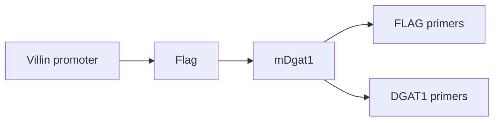
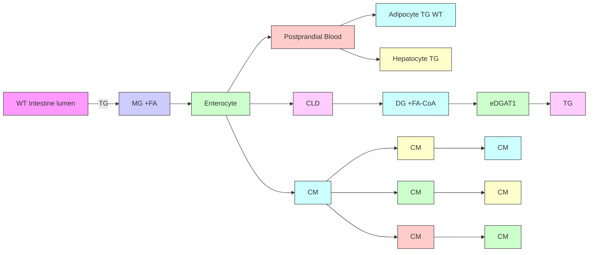
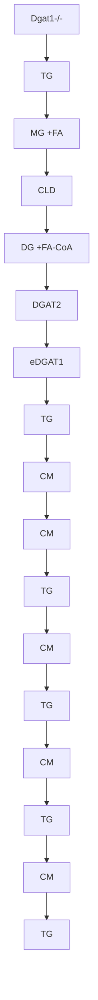

# Intestine-specifi c expression of acyl CoA:diacylglycerol acyltransferase 1 reverses resistance to diet-induced hepatic steatosis and obesity in Dgat1 - / - mice

Bonggi Lee, \* Angela M. Fast, \* Jiabin Zhu, † Ji-Xin Cheng, †,§ and Kimberly K. Buhman 1, \*

Department of Foods and Nutrition,\* Weldon School of Biomedical Engineering, † and Chemistry, Purdue University , West Lafayette, IN 47907

Abstract Mice defi cient in acyl-CoA:diacylglycerol acyltransferase 1 (DGAT1), a key enzyme in triacylglycerol (TG) biosynthesis, are resistant to high-fat (HF) diet-induced hepatic steatosis and obesity. DGAT1-defi cient ( Dgat1 - / - ) mice have no defect in quantitative absorption of dietary fat; however, they have abnormally high levels of TG stored in the cytoplasm of enterocytes, and they have a reduced postprandial triglyceridemic response. We generated mice expressing DGAT1 only in the intestine $( D g a t I ^ { I n t O N L Y } )$ to determine whether this phenotype contributes to resistance to HF diet-induced hepatic steatosis and obesity in Dgat1 - / - mice. Despite lacking DGAT1 in liver and adipose tissue, we found that Dgat1 IntONLY mice are not resistant to HF dietinduced hepatic steatosis or obesity. The results presented demonstrate that intestinal DGAT1 stimulates dietary fat secretion out of enterocytes and that altering this cellular function alters the fate of dietary fat in specifi c tissues.— Lee, B., A. M. Fast, J. Zhu, J-X. Cheng, and K. K. Buhman. Intestine-specifi c expression of acyl CoA:diacylglycerol acyltransferase 1 reverses resistance to diet-induced hepatic steatosis and obesity in Dgat1 mice. J. Lipid Res. 2010. 51: 1770–1780.

Supplementary key words dietary fat absorption • cytoplasmic lipid droplets • triacylglycerol • intestine • coherent anti-Stokes Raman scattering microscopy

The absorption of dietary fat, the most energy-dense nutrient, by the small intestine is a highly effi cient process. Greater than 95% of dietary fat consumed is absorbed whether a low- or high-fat (HF) diet is consumed ( 1 ), as evidenced by the small amount of fat that is excreted in feces. In the small intestine lumen, dietary fat in the form of triacylglycerol (TG) is hydrolyzed to generate free fatty acids and monoacylglycerol by pancreatic lipase. These products are then emulsifi ed with the help of phospholipids and bile acids present in bile to form micelles. Free fatty acids and monoacylglycerol are then taken up by the absorptive cells of the small intestine, enterocytes, where they are resynthesized into TGs and incorporated into the core of chylomicrons, which are secreted via the lymphatic system into circulation ( 2 ). TG is then delivered to cells throughout the body, where it serves diverse functions, including energy storage and generation depending on energy status. The postprandial triglyceridemic response (or levels of TG in blood after a meal) is thus dependent on both the appearance of TG in and the clearance of TG from circulation. Because of its high energy density, high effi ciency of absorption, ability to be stored when energy is in excess, and ability to be oxidized to generate energy when needed, dietary fat and its absorption by the small intestine are important determinants of energy balance.

TGs synthesized within enterocytes are secreted into circulation in a time- and amount-dependent manner. As the amount of dietary fat increases, postprandial triglyceridemia also increases ( 3, 4 ). In addition, under HF dietary challenges, TG is also found packaged in enterocytes in cytoplasmic lipid droplets (CLDs) ( 5 ). We recently demonstrated that this storage pool of TG in enterocytes expands and depletes relative to the fed-fasted state and is present whether mice are acutely or chronically challenged by high levels of dietary fat ( 5 ). These results suggest that TG stored in CLDs are eventually hydrolyzed, reesterifi ed, and secreted on chylomicrons. Regulation of storage versus secretion of TG from enterocytes may be involved in determination of the postprandial triglyceridemic response. The postprandial triglyceridemic re-

This work was supported by an American Heart Association Scientist Development Grant, a Purdue Research Foundation Grant, and an Agricultural Re search Program Assistantship Program to K.K.B.

Manuscript received 16 September 2009 and in revised form 10 February 2010.

Published, JLR Papers in Press, February 10, 2010

DOI 10.1194/jlr.M002311

Abbreviations: CARS, coherent anti-Stokes Raman scattering; CLD, cytoplasmic lipid droplet; DG, diacylglycerol; DGAT, acyl CoA:diacylglycerol acyltransferase; Dgat1 DGAT1-defi cient mice; , mice expressing DGAT1 only in intestine; HF, high fat; QPCR, quantitative PCR; TG, triacylglyc erol; WT, wild-type.

1 To whom correspondence should be addressed.

e-mail: kbuhman@purdue.edu

Copyright © 2010 by the American Society for Biochemistry and Molecular Biology, Inc.

sponse, in terms of time and amount, is likely an important determinant of which cell types clear TG from circulation and the metabolic fate of the fatty acids within these cells ( 6, 7 ). An exaggerated postprandial triglyceridemic response has been found to be associated with obesity and higher body fat content in humans ( 8–12 ). This raises the questions of whether this is a cause or consequence of obesity and whether it is due to TG appearance in or clearance from circulation. Whether or not an exaggerated postprandial triglyceridemic response is due to altered regulation of TG storage versus secretion in enterocytes and thus appearance of TG in circulation deserves further attention.

Specifi c pathways for TG synthesis may determine whether the TGs are stored or secreted by the enterocyte. Acyl-CoA:diacylglycerol acyltransferase (DGAT) catalyzes the fi nal reaction in the synthesis of TG from diacylglycerol and fatty acyl-CoA in many cell types ( 13, 14 ). DGAT activity has been described on the cytoplasmic and luminal sides of the endoplasmic reticulum and proposed to synthesize TG with fates of storage and secretion, respectively ( 15, 16 ). More recently, two unrelated gene families encoding DGAT enzymes have been identifi ed. DGAT1 and DGAT2 are expressed ubiquitously in cell types and tissues including enterocytes ( 14, 17, 18 ). Studies of their intracellular localization suggest that DGAT1 and DGAT2 do not have redundant functions within cells. DGAT1 and DGAT2 localize to specifi c regions of the ER in seeds of the tung tree ( 19 ). In addition, DGAT2 has been found in and associated with other cellular organelles such as lipid droplets ( 20, 21 ), mitochondria-associated membranes, and mitochondria ( 22 ). DGAT1, on the other hand, is not associated with lipid droplets in COS-7 cells after oleate loading ( 22 ).

Investigation of mice with targeted deletion or tissuespecifi c overexpression of either of these enzymes has shed some light on the in vivo functions of these enzymes; however, multiple questions remain. DGAT1-defi cient $( D g a t I ^ { - / - } )$ mice are resistant to HF diet-induced obesity due in part to an increase in systemic energy expenditure ( 23 ). They have reduced tissue TG concentration in all tissues except the small intestine after a HF dietary challenge. Enterocytes from HF-fed $\boldsymbol { D g a t 1 } ^ { - / - }$ mice abnormally accumulate multiple, large CLDs that are TG rich ( 17 ); however, these mice have no gross defects in dietary TG absorption, as determined by fecal fat analysis ( 23 ). However, they have a reduced postprandial triglyceridemic response compared with wild-type (WT) mice ( 17 ). DGAT2-defi cient mice die shortly after birth and thus the in vivo role of DGAT2 defi ciency in TG metabolism remains less clear ( 24 ).

In this study, we tested the hypothesis that the intestine phenotype of Dgat1 -/ - mice (excess enterocyte TG storage and reduced postprandial triglyceridemic response) contributes to their resistance to HF diet-induced hepatic steatosis and obesity. We generated transgenic mice that overexpress mouse DGAT1 specifi cally in the intestine ( Dgat1 Int) and crossed them with Dgat1 - / - mice to generate mice with expression of DGAT1 only in the intestine $( D g a t I ^ { I n t O N L Y } )$ . Here, we report the phenotype of $D g a t I ^ { I n t O N L Y }$ mice related to their susceptibility to HF-diet induced hepatic steatosis and obesity.

## MATERIALS AND METHODS

## Diets and mice

All procedures were approved by the Purdue Animal Care and Use Committee. The VILL- Dgat1 transgene was made with a 12.4 kb VILL promoter/enhancer from the pUC12.4 kb-villin plasmid (Dr. Deborah L. Gumucio, University of Michigan, Ann Arbor, Michigan) and a 1.6 kb amino terminal fl ag tagged Dgat1 cDNA sequence from the pBSSK/moDGATfl ag plasmid (Dr. Robert V. Farese Jr., Gladstone Institutes, San Francisco, California). The fi - nal transgene clone containing the villin promoter/enhancer and mouse Dgat1 cDNA was verifi ed by restriction mapping and sequence analysis. The transgene was prepared by digestion with PmeI and purifi cation before introduction into C57BL/6 fertilized eggs by microinjection (Purdue Transgenic Core Facility, Purdue University, West Lafayette, Indiana). Founder animals were backcrossed with $\mathrm { C 5 7 B L } \mathrm { / 6 }$ mice to generate $D g a t I ^ { I n t }$ mice. $D g a t I ^ { I n t }$ mice were crossed with $\boldsymbol { D g a t l } ^ { - \prime - }$ - mice to generate Dgat1 IntONLY $D g a t 1 ^ { I n t O N L Y } \mathrm { m i c e }$ . All mice in the studies described were female unless otherwise noted and were maintained in a specifi c pathogen-free barrier facility with a 12 h-light/-dark cycle (6 AM/6 PM). Mice were fed either a low-fat, rodent chow (PicoLab 5053, Lab Diets, Richmond, IN) or a HF (D12492, Research Diets, Inc., New Brunswick, NJ) diet for the indicated times. For chow, 62.1% of calories came from carbohydrate (starch), 24.7% from protein, and 13.2% from fat. For HF, 20% of calories came from carbohydrate (35% sucrose, 65% starch), 20% from protein, and 60% from fat (mostly lard). Mice were enrolled in body weight studies at 11–13 weeks of age and fed the indicated diets for 9 weeks. Mice not enrolled in body weight studies were 3–5 months of age and fed the indicated diets. Mice were euthanized at 9 AM after fasting for 2 h unless specifi cally noted. For analysis of the small intestine, we divided the small intestine into three equal-length segments and labeled them S1–S3 (proximal to distal). For specifi c experiments, we divided each of these segments additionally into two equal-length segments and labeled these a and b (proximal to distal). We scraped mucosa from each region of intestine for RT-PCR or quantitative PCR (QPCR ) and intestinal TG quantifi cation.

## Genotyping

Genotyping was performed on genomic DNA extracted from mouse tails to determine both transgene and endogenous gene presence. To determine transgene presence, a FLAG primer set was used with forward primer F 5 ′ -ATGGGAGATTACAAAGAT-GATGATGATG-3 ′ and reverse primer R 5 ′ -AGAATCTTGCA-GACGATGGCA-3 ′ amplifying a 433 bp product in transgenic mice and no product in WT mice. To determine endogenous gene presence or absence, a previously described genotyping reaction for Dgat1 - / - mice was used ( 23 ).

## RT-PCR and QPCR

Total RNA was extracted from tissues with RNA STAT60 (Tel-Test, Friendswood, TX) and then DNase treated with Turbo DNA-free (Ambion, Austin, TX). cDNA was synthesized from 1µg DNase-treated RNA by Affi nityScript QPCR cDNA using oligo dT and random hexamer primers (Stratagene, La Jolla, CA). SYBR green QPCR and RT-PCR were performed using a Mx3000P QPCR System (Stratagene) and Brilliant SYBR green master mix (Stratagene) or GoTaq Green master mix (Promega), respectively. Thermocycling parameters for QPCR included 1 cycle of

95°C for 10 min; 40 cycles at 95°C for 30 s, 55°C for 60 s, and 72°C for 30 s; and 1 cycle at 95°C for 60 s, 55°C for 30 s, and 95°C for 30 s. Thermocycling parameters for RT-PCR included 1 cycle of 95°C for 2 min; 30 cycles at 95°C for 30 s, 55°C for 60 s, and 72°C for 60 s; and 1 cycle at 72°C for 5 min. Post-PCR products were subjected to 1.5% agarose gel electrophoresis for imaging product size. The expression of each gene was normalized to 18s rRNA and calculated with the comparative CT method. Primers used for this study were all validated for effi ciency and correct product size in cDNA from mouse intestinal mucosa. The sequences are as follows: DGAT1, F 5 ′-ACCGCGAGTTCTACAGAGATTGGT-3 ′ and R 5 ′-ACA GC-TGC ATTGCCATAGTTCCCT-3 ′; DGAT2, F 5 ′-TGGGTCC AG-AAGAA GTTCCAGAAGTA-3 ′ and R 5 ′-ACCTCAGTCTCTG GA-AGG CCAAAT-3 ′; 18s rRNA, F 5 ′-TTAGAGTGTTCAAA GCAGGC-CCGA-3 ′ and R 5 ′-TCTTGGCAAATGCTTTCGCTCTGG-3.’ For RT-PCR, the FLAG primer described under genotyping and the DGAT1 primer were used to amplify products of 433 and 301 bp, respectively.

## Immunoblot analysis

Intestinal mucosa from region S1a (defi ned under Diets and Mice) was homogenized using a 26G needle in TNET-C buffer [1% Triton, 150 mM NaCl, 50 mM Tris (pH 7.4), 2 mM EDTA, 0.5% cholate] including protease inhibitor cocktail (Complete Mini, Roche, Indianapolis, IN). Proteins (50 g) were separated by 12% Tris-glycine gel (Invitrogen, Carlsbad, CA) and transferred to PVDF membrane (Hybond-P PVDF membrane, Amersham Bioscience, Piscataway, NJ). Ponceau S staining was done to confi rm equal protein loading and transfer effi ciency. The membrane was incubated in 5% skim milk buffer [5% skim milk in 0.1% PBS-T (Tween 20) solution] for 1 h with shaking to block nonspecifi c binding. The membrane was treated with primary goat polyclonal antibodies for DGAT1 (Santa Cruz Biotechnology, Santa Cruz, CA) and primary mouse monoclonal antibody for -actin (Santa Cruz Biotechnology) for 1 h with shaking. After washing with 0.1% PBS-T three times, donkey anti-goat IgG-HRP for DGAT1 and donkey anti-mouse IgG-HRP for  -actin (Santa Cruz Biotechnology) were incubated for 1 h with shaking and then an enhanced chemiluminescence kit (ECL Western Blotting Substrate, Pierce, Rockford, IL) was used for detection.

## Determination of TG and glucose concentrations

Lipids in intestinal mucosa (S2b, representing jejunum) and liver were extracted by the hexane/isopropanol (3:2) method ( 25 ). Briefl y, after homogenization of the mucosa with 1 M Tris-HCL (pH 7.4), hexane/isopropanol (3:2) and water were added and then the mucosa sample was incubated for 30 min with occasional mixing. The upper part containing lipids was removed to a new tube. After evaporating the organic phase under nitrogen, lipids were dissolved in isopropanol. The amounts of TG were then determined by Wako L-Type TG determination kit (Wako Chemical USA, Richmond, VA) and were normalized to the protein concentration (Pierce). To measure fasting plasma TG and glucose concentrations, mice were overnight fasted and blood samples obtained from the submandibular vein. TG concentration was determined by a Wako L-Type TG determination kit (Wako Chemicals USA), and glucose concentration was determined by OneTouch glucometer (LifeScan, Milpitas, CA).

## Determination of fecal fat

Feces were collected for 4 days during the sixth week of the HF diet feeding period for fecal fat analysis. The feces were dried for 2 h using an ANKOM RD dryer (ANKOM technology, Macedon, NY) and then lipids were extracted by automated Soxhlet extraction (petroleum ether) using the ANKOM XT15 extraction system (ANKOM technology, Macedon, NY, American Oil Chemist Society Offi cial Procedure Am 5-04). The analysis is achieved by measuring the loss of mass due to the extraction of fat from the dried fecal samples.

## Coherent anti-Stokes Raman scattering microscopy

For intact tissue imaging, ex vivo fresh tissues (5 mm) from small intestine (S2a, representing upper jejunum) were placed in 3 ml Dulbecco’s Modifi ed Eagle’s Medium (Gibco, Carlsbad, CA) supplemented with 20 mM HEPES, 100 U/ml penicillin-streptomycin (Gibco), and 10% fetal bovine serum. Tissues kept at 4°C maintained good morphology over 5 h. Small intestine tissue was cut longitudinally and laid fl at for luminal imaging. All tissues were imaged within 3 h after euthanasia. Coherent anti-Stokes Raman scattering (CARS) imaging were performed at a multimodal microscope ( 26 ). Pump and Stokes lasers were generated from two synchronized Ti:sapphire lasers (Tsunami, Spectra-Physics, Mountain View, CA), with a pulse width of 5 ps. These two lasers were tightly synchronized (Lock-to-Clock, Spectra-Physics), colinearly combined, and directed into a laser scanning confocal microscope (FV300/IX71, Olympus America, Center Valley, PA). A 60× water immersion objective (numerical aperture = 1.2) or a 20× air objective (numerical aperture = 0.75) were used to focus the laser beams into the sample. The average powers of the pump and Stokes beams at the sample were 40 and 30 mW, respectively. For imaging TGs, the pump laser and the Stokes laser were tuned to 14,140 $\mathrm { c m } ^ { - 1 }$ and $\stackrel { \bullet } { 1 } 1 , 3 0 \stackrel { \bullet } { 0 } { \mathrm { c m } } ^ { - 1 }$ , respectively, to generate a Raman shift $\mathrm { 9 f \sim 2 , 8 4 0 ~ c m ^ { - 1 } }$ that excites the symmetric CH  vibration ( 27, 28 ). The forward-detected CARS signals were collected using an air condenser $( \mathrm { N } . \mathrm { A } . \ : = \ : 0 . 5 5 )$ . A external photomultiplier tube (R3896, Hamamatsu, Japan) detector was used to receive the forward-detected CARS signals.

## Data and statistics

All the data are shown as mean ± SEM. Statistical differences were evaluated with one-way ANOVA, with Tukey’s Studentized grouping test between groups or a t-test where appropriate ( P < 0.05) using SAS 9.1 program.

## RESULTS

## Generation of Dgat1 Int mice

Dgat1 Int mice were generated with a DNA construct containing the villin promoter/enhancer driving expression of mouse DGAT1 containing a FLAG epitope at the N terminus ( Fig. 1A). The villin promoter/enhancer drives expression in epithelial cells of the small and large intestine as well as from crypt to tip on the villus beginning as early as 12.5 days post coitum ( 29 ). Of fi ve founder lines, we further investigated three lines with $2 \ – \ ( D g a t I ^ { I n t 2 \times } )$ , 5- ( Dgat1 Int5×), and 20- ( Dgat1 Int20×) fold increased levels of Dgat1 mRNA (transgene plus endogenous gene) compared with WT mice fed a low fat, chow diet ( Fig. 1B ) determined by QPCR. Using RT-PCR, we found that all three lines had Dgat1 transgene present along the length of the small intestine and colon as well as in the kidney consistent with other mouse models generated using this promoter ( 29, 30 ), but not in muscle, heart, liver, or adipose tissue ( Fig. 1C ). We refer to the mice throughout this manuscript as intestine specifi c or intestine only; however, we acknowledge that expression is also present in the kidney and all results should be viewed in light of this fact. DGAT1 protein levels were found to be signifi cantly higher in intestinal mucosa from Dgat1 Int20× ${ D g a t } { I } ^ { I n t 2 0 \times }$ mice compared with WT mice ( Fig. 3C ). As a marker of DGAT1 function in enterocytes, we examined the ability of DGAT1 overexpression in the small intestine of $D g a i I ^ { - / { - } }$ - mice and found that it complements the intestine phenotype of $D g a t I ^ { - / { - } }$ - mice in terms of TG storage and postprandial triglyceridemic response ( Figs. 4A and 5A , described below). Dgat1 Int5× $D g a t I ^ { I n t 5 \times }$ and $\dot { D g a t I } ^ { I n t 2 \dot { 0 } \times }$ mice fed a low-fat (data not shown) or a HF diet for 9 weeks ( Fig. 2 and 6A , respectively) had similar body weights and dietary fat absorption ( Table 1) as WT mice. Further analysis of the Dgat1 Int20× $\boldsymbol { D g a t l } ^ { \dagger { n t 2 0 \times } }$ mouse line is described below.

A  

flowchart

B  

bar chart

| Group        | Relative Dgat1 mRNA levels |
| ------------ | -------------------------- |
| WT           | 0.5                        |
| Dgat1Int2X   | 2.0                        |
| Dgat1Int5X   | 4.5                        |
| Dgat1Int20X  | 19.5                       |

text_image

C
SI1 SI2 SI3 C1 C2 K M H L A NTC
WT
NoRT
Dgat1Int2X
NoRT
Dgat1Int5X
NoRT
Dgat1Int20X
NoRT

Fig. 1. Generation of $D g a t l ^ { \mathrm { { I n t } } }$ mice. A: Transgene construct. Mouse Dgat1 with an amino terminal FLAG epitope tag was driven by the villin promoter/enhancer. FLAG and Dgat1 primers used for gene expression and transgene detection are highlighted. B: QPCR analysis of Dgat1 mRNA levels in the upper part of the small intestine (S1) of WT and $D g \dot { a } t \dot { I } ^ { \mathrm { m i } }$ mouse lines. Relative to WT mice, the three $D g a t I ^ { \mathrm { { I n t } } }$ mouse lines had $2 \AA ^ { - } , 5 \AA$ , and 20-fold higher levels of Dgat1 mRNA levels and are designated $\stackrel { \mathrm { \Delta } } { D g a t { I } } ^ { \mathrm { I n t 2 \times } } , \stackrel { \mathrm { \Delta } } { D g a t { I } } ^ { \mathrm { I n t 5 \times } }$ , and $D g a t I ^ { \mathrm { I n t 2 0 \times } }$ . Data are represented as mean ± SEM. Bars with asterisks are signifi cantly different compared with WT ( t-test), $P < 0 . 0 5 ,$ , $\mathbf { n } = 3$ mice. C: Tissue-specifi c Dgat1 transgene presence. RT-PCR analysis was performed on RNA extracted from tissues from WT and $\stackrel { \star } { \cal D } g a t { \cal I } ^ { \mathrm { I n t } }$ t mice using primers specifi c for the FLAG epitope. Tissues included: small intestine (S1, S2, and S3), colon (C1and C2), kidney (K), skeletal muscle (M), heart (H), liver (L), and adipose tissue (A). Abbreviations: NTC, no template control, NoRT, no reverse transcriptase control.

## Generation of mice with intestine only expression of DGAT1

To generate $D g a t I ^ { I n t O N L Y }$ mice, we crossed ${ D g a t } { I } ^ { I n t 2 0 \times }$ with $D g a t l ^ { - / { - } }$ mice. To confi rm generation of this model, we used RT-PCR to identify Dgat1 transgene (FLAG primers) and endogenous plus transgene ( Dgat1 primers) mRNA levels in WT, Dgat1 - / -, and Dgat1 IntONLY $D g a t \dot { I } ^ { - / - }$ $\stackrel { \cup } { { D g a t I } } ^ { I n t O N L Y }$ mice. Using FLAG primers detecting the FLAG Dgat1 transgene, we found FLAG Dgat1 transgene present in the small intestine, colon, and kidney of Dgat1 IntONLY $\boldsymbol { D g a t i } ^ { I n t O N L Y }$ mice as expected ( Fig. 3A ). Using Dgat1 primers detecting both the transgene and the endogenous gene, we found Dgat1 mRNA present in all tissues tested in WT mice, Dgat1 mRNA absent in all tissues tested in $D g a t I ^ { - / - }$ mice, and Dgat1 mRNA only in the small intestine and kidney of Dgat1 IntONLY $D g a t I ^ { I n t O N L Y }$ mice ( Fig. 3A ). In addition, we quantifi ed Dgat1 and Dgat2 mRNA levels in intestinal mucosa (S1b) from all lines of mice that had been fed a HF diet for 9 weeks using QPCR. Primers used for this experiment for Dgat1 recognize both endogenous and transgene transcripts. WT mice fed a HF diet for 3 weeks have 57- and 61-fold higher levels of Dgat1 and Dgat2 mRNA in intestinal mucosa, respectively, than low-fat, chow-fed mice. Because of the high levels of Dgat1 mRNA due to the endogenous gene under these conditions, we were concerned that we would not see a further increase in Dgat1 mRNA due to the transgene; however, we found 8- and 17-fold increased Dgat1 mRNA levels in Dgat1 IntONLY and Dgat1 Int20×, ${ D g a t I } ^ { { I n t 2 0 \times } }$ respectively, compared with WT mice fed a HF diet. We found no Dgat1 mRNA in intestinal mucosa of $D g a t I ^ { - / { - } }$ mice ( Fig. 3B ). In addition, Dgat2 mRNA levels were not different between the four groups of mice fed a HF diet ( Fig. 3B ). To determine whether Dgat1 mRNA levels correlated with DGAT1 protein levels, we performed immunoblotting on intestinal mucosa from WT, $\boldsymbol { D g a t l } ^ { - / - }$ , Dgat1 Int20×, ${ D g a t I } ^ { I n t 2 0 \times }$ and Dgat1 IntONLY $\stackrel { \cup } { D g a t I } ^ { I n t O N L Y }$ using an antibody for DGAT1. We detected DGAT1 protein in both monomeric (53 kDa)

line chart

| Time | WT   | Dgat1int5X |
|------|------|------------|
| 0    | 24.0 | 24.0       |
| 1    | 26.0 | 26.0       |
| 2    | 28.0 | 28.0       |
| 3    | 30.0 | 30.0       |
| 4    | 33.0 | 33.0       |
| 5    | 36.0 | 36.0       |
| 6    | 38.0 | 38.0       |
| 7    | 40.0 | 40.0       |
| 8    | 42.0 | 44.0       |
| 9    | 44.0 | 45.0       |

line chart

| Weeks Fed Diet | WT   | Dgat1int20X |
| -------------- | ---- | ----------- |
| 0              | 32   | 29          |
| 1              | 36   | 33          |
| 2              | 38   | 35          |
| 3              | 40   | 38          |
| 4              | 43   | 41          |
| 5              | 45   | 43          |
| 6              | 47   | 45          |
| 7              | 49   | 47          |
| 8              | 50   | 48          |
| 9              | 49   | 48          |

Fig. 2. Similar body weights in WT, Dgat1 Int5×, ${ { D g a t } { I } } ^ { I n t 5 \times } ,$ and ${ D g a t I } ^ { { I n t 2 0 \times } }$ mice fed a HF diet. Dgat1 Int5× $D g a t l ^ { I n t { 5 } \times } ~ ( \mathbf { n } = 1 1 )$ (n = 11) (A), Dgat1 Int20× $\breve { D } g a t { \cal I } ^ { I n t 2 0 \times } \left( \mathrm { n } = 1 0 \right) \left( \mathrm { B } \right)$ , and WT (n = 11) male mice were fed a HF diet for 9 weeks. Body weights were monitored weekly for the duration of the study. Data are represented as mean ± SEM.

and tetrameric (214 kDa) forms in intestinal mucosa from WT, Dgat1 Int20×, ${ D g a t I } ^ { I n t 2 0 \times }$ and Dgat1 IntONLY $\cal { D g a t I } ^ { I n t O N L Y }$ mice, but not in intestinal mucosa from $D g a t I ^ { - / { - } }$ mice, as expected ( Fig. 3C ). We found higher levels of both the monomeric and tetrameric forms in intestinal mucosa from Dgat1 Int20× ${ D g a t I } ^ { I n t 2 0 \times }$ and Dgat1 IntONLY $D g a t I ^ { I n t O N L Y }$ mice compared with WT mice ( Fig. 3C ). Previously, DGAT1 was demonstrated to form a homotetramer migrating at approximately 214 kDa when a FLAG-tagged transgene was overexpressed in cells in culture. In addition, higher levels of the expression correlated with higher DGAT activity in this model ( 31 ).

## Abrogated TG storage in enterocytes of mice with increased DGAT1 abundance

To determine whether abundance of DGAT1 in the small intestine correlates with storage of TG in CLDs in enterocytes of mice fed a HF diet, we imaged the small intestine (region representing upper jejunum, S1b) of mice from all four genotypes (WT, Dgat1 - / -, Dgat1 Int20×, $D g a t I ^ { - / - } , D g a t I ^ { I n t 2 0 \times }$ and $D g a t I ^ { I n t O N L Y } )$ with CARS microscopy. CARS microscopy is an emerging technique that permits vibrational imaging of specifi c molecules with three-dimensional submicron spatial resolution ( 32 ). A strong CARS signal is generated from C-H stretch vibrations allowing label- and fi xationfree imaging of lipids rich in fatty acids ( 5 ). As previously reported, we found TG stored in CLDs in enterocytes of WT mice and even more TG stored in CLDs in enterocytes of $D g a t I ^ { - / { - } }$ mice ( Fig. 4A) fed a HF diet. Overexpression of DGAT1 in the small intestine of WT $[ { D g a t } ] ^ { { I n t } 5 \times }$ (data not shown) and $D g a t I ^ { I n t 2 0 \times } ]$ or $\boldsymbol { D g a t l } ^ { - / - }$ mice $\large ( D g a t I ^ { I n i O N L Y } \large )$ abrogates TG storage in CLDs in enterocytes of mice fed a HF diet ( Fig. 4A ). Biochemical analysis of TG in intestine tissue was similar to results observed by CARS imaging; however, the difference between WT and Dgat1 Int20× $\boldsymbol { D g a t I } ^ { I n t 2 0 \times }$ and Dgat1 IntONLY $D g a t I ^ { I n t O N L Y }$ was not as apparent ( Fig. 4B ). We selected CARS images representative of the entire area imaged; however, there were regions of villi with no TG storage evident by CARS signal in both WT and $\boldsymbol { D g a t 1 } ^ { - / - }$ intestine. In addition, biochemical analysis of intestinal mucosal scrapings includes lipids not in enterocytes, adding to the variability in results.

## Restored postprandial triglyceridemic response and TG secretion from enterocytes in Dgat1 IntONLY mice

To determine whether abundance of DGAT1 levels in the small intestine alters the postprandial triglyceridemic response, we fasted chow-fed, WT, $D g a t I ^ { - / { - } }$ -, and Dgat1 IntONLY $ { \boldsymbol { D g a t I } } ^ { I n t O N L Y }$ mice for 4 h, administered 200 µl of olive oil via oral gavage, and determined blood TG concentrations before and 2, 4, and 8 h postgavage. Consistent with previous reports for $D g a t I ^ { - / - }$ mice, we found no increase in blood TG concentrations in $\boldsymbol { D g a t l } ^ { - / - }$ mice at any time point postgavage ( Fig. 5A). We found similar postprandial triglyceridemic responses in WT and $D g a t I ^ { I n t O N L Y }$ mice with peak TG concentrations at 2 h postgavage and TG concentrations returning to baseline by 8 h postgavage ( Fig. 5A ). We compared postprandial triglyceridemic responses of WT and D gat1 Int20× $\stackrel { \bullet } { \mathrm { D } } g a t I ^ { I n t 2 { \cal O } \times }$ mice before and 2 h postgavage and also found similar responses in blood TG concentrations (data not shown).

To determine whether abundance of DGAT1 levels in the small intestine alters TG secretion rate or amount from enterocytes, we determined postprandial triglyceridemic response in the presence of a TG clearance inhibitor, tyloxapol. We fasted chow-fed, WT, $D g a t I ^ { - / - }$ and

TABLE 1. Metabolic characteristics

<table><tr><td></td><td>Liver (g)</td><td>Fasting Glucose (mg/dl)</td><td>Fasting TG (mg/dl)</td><td>Food Intake (g/day)</td><td>Fecal Fat (% of feces)</td></tr><tr><td>WT</td><td> $1.1 \pm 0.07^a$ </td><td> $74.9 \pm 8.1$ </td><td> $49.4 \pm 6.2$ </td><td> $2.1 \pm 0.1$ </td><td> $1.2 \pm 0.3$ </td></tr><tr><td>DGAT1 $^{-/-}$ </td><td> $1.0 \pm 0.05^a$ </td><td> $69.3 \pm 5.1$ </td><td> $43.4 \pm 7.3$ </td><td> $2.3 \pm 0.2$ </td><td> $0.8 \pm 0.3$ </td></tr><tr><td>DGAT1 $^{IntONLY}$ </td><td> $1.3 \pm 0.04^{ab}$ </td><td> $66.7 \pm 7.6$ </td><td> $45.6 \pm 9.8$ </td><td> $2.4 \pm 0.2$ </td><td> $0.7 \pm 0.3$ </td></tr><tr><td>DGAT1 $^{Int20x}$ </td><td> $1.4 \pm 0.13^b$ </td><td> $72.4 \pm 4.0$ </td><td> $54.0 \pm 6.0$ </td><td> $2.6 \pm 0.1$ </td><td> $1.1 \pm 0.2$ </td></tr></table>

WT, Dgat1 $^ { - / - } , D g a t I ^ { I n t 2 0 X } ,$ and $D g a t I ^ { I n t O N L Y }$ mice were fed a HF diet for 9 weeks and euthanized after a 2 h fast and then liver weight was measured $( \mathrm { n } = 5 \mathrm { - } 7$ mice). Fasting glucose and TG were determined after an overnight fast during week 7 of the study $( \mathrm { n } = 5 \mathrm { - } 7$ mice). Food intake and fecal excretion were determined over 4 days during week 6 of the study $( \mathrm { n } = 4 { - } \dot { 5 }$ mice). Data are represented as mean ± SEM. Data with different letters are signifi cantly different from each other, $P { < } 0 . 0 5$ .

text_image

A
S1 S2 S3 K M A L
Primer
set
FLAG
WT
DGAT1 -/-
DGAT1IntONLY
WT
DGAT1 -/-
DGAT1IntONLY
WT
DGAT1 -/-
DGAT1IntONLY
NoRT
18s

bar chart

| Group | WT | DGAT1 -/- | DGAT1IntONLY | DGAT1Int20X |
|---|---|---|---|---|
| DGAT1 | 1.5 | 8.0 | 8.0 | 17.0 |
| DGAT2 | 2.0 | 2.5 | 1.5 | 3.5 |

text_image

C
WT DGAT1 + DGAT1IntONLY DGAT1Int20X
DGAT1 Tetramer
DGAT1 Monomer
β- actin

Fig. 3. Generation of $D g a t I ^ { I n t O N L Y }$ mice. A: RT-PCR analysis was performed with tissues from WT, $D g a t I ^ { - / { - } }$ , and $D g a t I ^ { I n t O N L Y }$ mice using primers specifi c for the FLAG epitope, Dgat1 primers for both endogenous and transgene $D g a t { \cal I } ,$ and 18S rRNA. Tissues included: small intestine (S1, S2, and S3, divided in three equal-length regions), kidney (K), muscle (M), adipose tissue $\mathbf { \Pi } ( \mathrm { A } )$ , and liver (L). B: $D g a t l$ and Dgat2 relative mRNA levels. mRNA levels of Dgat1 and $D g a t { \overset { \sim } { 2 } } .$ were determined by QPCR analysis of small intestine tissue representing upper $D g a t I ^ { - / - } , D g a t I ^ { I n t 2 0 \times }$ $D g a t I ^ { I n t O N L Y }$ mice. Data are represented as mean ± SEM. Bars with asterisks signifi cantly differ from each other, $P { < } 0 . 0 5 , \mathrm { n } { = } 5$ mice. Gene expression levels were normalized to 18S rRNA. C: DGAT1 protein levels. DGAT1 protein $D g a t I ^ { - / - } , D \dot { g a } t I ^ { I n t 2 0 \times }$ and Dgat1 IntONLY $D g a t I ^  I n t O N L \bar $ mice fed a HF diet for 9 weeks. Abbreviations: NTC, no template control, NoRT, no reverse transcriptase control.

Dgat1 IntONLY $D g a t I ^ { I n t O N L Y }$ mice for 4 h, intraperitoneally injected tyloxapol (500 mg/kg body weight), administered 200 µl of olive oil via oral gavage, and determined blood TG concentrations before and 2 and 4 h postgavage. We found a similar rate (slope) and amount (area under the curve) of TG secretion from enterocytes of WT and Dgat1 IntONLY $D g a t I ^ { I n t O N L \mathrm { I } }$ mice and a reduced rate and amount of TG secretion from $D g a t I ^ { - / - }$ mice compared with WT and $D g a t I ^ { I n t O N L Y }$ mice during this time period ( Fig. 5B ). We also compared TG secretion rate and amount from enterocytes of WT and D gat1 Int20× $\mathrm { D } g a t I ^ { I n t 2 0 \times }$ mice for a 2 h time period and found no differences between WT and D gat1 Int20× $\mathrm { D } g a t I ^ { \mathbf { \star } _ { h t 2 0 \times } }$ mice (data not shown).

## Dgat1 IntONLY $D g a t I ^ { I n t O N L Y }$ mice are susceptible to HF diet-induced hepatic steatosis and obesity

To determine whether abundance of DGAT1 in the small intestine correlates with susceptibility to HF dietinduced hepatic steatosis and obesity, we fed mice from all four genotypes (WT, Dgat1 - / -, Dgat1 1nt20×, $D g a t I ^ { ' I n t 2 { \cal O } \times }$ and Dgat1 IntONLY ) $D g a t I ^ { I n t O N L Y } )$ a HF diet for 9 weeks. We monitored body weights weekly and gonadal fat pad weights and liver fat content at the end of the study. Consistent with previous reports, we found that $D g a t l ^ { - / - }$ mice are resistant to HF diet-induced weight gain, body fat accumulation, and hepatic steatosis. Despite lacking DGAT1 in adipocytes, we found that

Dgat1 IntONLY $D g a t I ^ { I n t O N L Y }$ mice are susceptible to HF diet-induced weight gain and body fat accumulation to the same extent as WT and Dgat1 Int20× $D g a t I ^ { I n t 2 \dot { \theta _ { \times } } }$ mice ( Fig. 6A, B). In addition, despite lacking DGAT1 in the liver, Dgat1 IntONLY $\dot { D g a t I } ^ { I n t O N L Y }$ mice are not protected from hepatic steatosis as seen in $D g a t I ^ { - / - }$ mice ( Fig. 6C ). Hepatic TG concentrations in WT, ${ D g a t I } ^ { I n t 2 0 \times }$ , and Dgat1 IntONLY $D g a t I ^ { I n t O N L Y }$ mice were not statistically different from each other; however, Dgat1 IntONLY $D g a t I ^ { I n t O N L Y }$ trended intermediate between $\boldsymbol { D g a t l } ^ { - / - }$ - mice and Dgat1 Int20× ${ D g a t I } ^ { I n t 2 0 \times }$ or WT mice ( Fig. 6C ). There were no statistically signifi cant differences in food intake or amount of fat excreted in feces between groups ( Table 1 ). In addition, we found no statistically signifi cant differences in fasting glucose or TG concentrations between groups ( Table 1 ).

## DISCUSSION

In this study, we tested the hypothesis that the intestine phenotype of $\dot { D g a t I ^ { - / - } }$ mice (excess TG storage in enterocytes and reduced postprandial triglyceridemic response) contributes to their resistance to HF diet-induced hepatic steatosis and obesity. We restored the intestine phenotype of $D g a t I ^ { - / - }$ mice by generating $D g a t I ^ { I n t }$ mice and crossing them with $D g a t I ^ { - / - }$ mice to generate Dgat1 IntONLY $D g a t I ^ { I n t O N L Y }$ mice. Dgat1 IntONLY $D g a t I ^ { I n t O N L Y }$ mice do not have excess TG storage in CLDs within enterocytes, and they have a similar postprandial triglyceridemic response as WT mice. Interestingly, despite not having DGAT1 in any other cell types, including hepatocytes and adipocytes, they are now susceptible to

A  

text_image

WT
DGAT1Int20X
DGAT1+
DGAT1IntONLY
50 µm

B

bar chart

| Group | Intestine TG (μg)/Protein (μg) |
|---|---|
| WT | 0.23 |
| DGAT1-/- | 0.65 |
| DGAT1IntONLY | 0.19 |
| DGAT1Int20X | 0.28 |

Fig. 4. Abrogated TG storage in enterocytes of mice with increased Dgat1 mRNA abundance. A: Representative CARS images of TG storage in CLDs in enterocytes representing upper jejunum (S1b) of female WT, $D g a t I ^ { - / - } , D g a t I ^ { I n t 2 0 \times }$ , and $D g a t I ^  I n t O N L \bar $ mice fed a HF diet for 9 weeks. These mice were euthanized after fasting for 2 h. B: TG concentration in jejunum (S2b) of female mice fed a HF diet for 9 weeks measured by colorimetric assay. The samples for Fig. 4A, B were from the same mice from their respective groups. Data are represented as mean ± SEM. Bars with asterisks are signifi cantly different from each other, $P { < } 0 . 0 5 , \mathrm { n } = 5$ mice.

HF diet-induced hepatic steatosis and obesity, suggesting that these cells maintain the ability to synthesize TG via DGAT2 and/or other unidentifi ed acyltransferases (see model in Fig. 7). Thus, if appropriate substrates are delivered to these tissues, it is not surprising that they would be capable of synthesizing and storing TG. The role of the small intestine is often thought of as a simple thoroughfare for nutrients to pass through, and metabolism occurring specifi cally in enterocytes is often ignored. These results highlight that it is not only the quantitative but also the qualitative absorption of dietary fat that is important in determination of energy balance and hepatic steatosis.

line chart

| Time | WT   | DGAT1⁻/⁻ | DGAT1INTONLY |
|------|------|----------|--------------|
| 0    | 50   | 60       | 70           |
| 2    | 100  | 65       | 110          |
| 4    | 50   | 30       | 45           |
| 8    | 40   | 25       | 35           |

line chart

| Time | WT   | DGAT1⁻/⁻ | DGAT1INTONLY |
|------|------|----------|--------------|
| 0    | 0    | 0        | 0            |
| 2    | 2000 | 1300     | 1700         |
| 4    | 3500 | 2500     | 3400         |

Time Post Oil Bolus (hr)  
Fig. 5. Intestinal Dgat1 mRNA abundance correlates with postprandial triglyceridemic response and TG secretion from enterocytes. A: Postprandial triglyceridemic response. Plasma TG concentration was measured before and 2, 4, and 8 h after a 200 l olive oil challenge in female WT, Dgat1 - / -, and Dgat1 IntONLY $\boldsymbol { D g a t l } ^ { - / - }$ $D g a t I ^ { I n t O N L Y }$ mice. $\mathrm { m e a n } \pm \mathrm { S E M . ~ } ^ { * } P < 0 . 0 5$ $\left. D g a t I ^ { - 7 } \right.$ $D g a t I ^ { I n t O N L Y } , \mathrm { n = 4 \mathrm { - } 5 }$ mice. B: TG secretion from enterocytes. An IP injection of tyloxapol, a TG clearance inhibitor, was administered 30 min before the TG tolerance test. Plasma TG concentration was measured before and 2 and 4 h after $\mathrm { ~ a ~ } 2 0 0 ~ \mu \mathrm { l }$ olive oil challenge in female WT, $\boldsymbol { D g a t } \boldsymbol { I } ^ { - / - }$ , and $D g a t I ^ { I n t O N L Y }$ mice. ${ } ^ { * } P < 0 .$ .05 for $D g a t I ^ { - / - }$ slope and area under the curve compared with WT and Dgat1 IntONLY $D g a t { I } ^ { I n t O N L Y } \mathrm { m i c e , n = 3  – 5 }$ mice.

line chart

| Weeks fed HF Diet | WT (g) | DGAT1 -/- (g) | DGAT1 IntONLY (g) | DGAT1 Int20X (g) |
|---|---|---|---|---|
| 1 | 22 | 20 | 23 | 24 |
| 2 | 23 | 20 | 24 | 25 |
| 3 | 24 | 21 | 26 | 27 |
| 4 | 25 | 21 | 28 | 29 |
| 5 | 26 | 22 | 29 | 31 |
| 6 | 27 | 22 | 30 | 32 |
| 7 | 28 | 22 | 31 | 34 |
| 8 | 29 | 23 | 33 | 35 |
| 9 | 30 | 23 | 34 | 36 |

bar chart

| Group | Gonadal Fat Weight (g) |
|---|---|
| WT | 1.8 |
| DGAT1-/-* | 0.45 |
| DGAT1IntONLY | 1.65 |
| DGAT1Int20X | 2.25 |

bar chart

| Group | Liver TG (μg) / Protein (μg) |
|---|---|
| WT | 1.45 |
| DGAT1⁻/⁻ | 0.48 |
| DGAT1InONLY | 1.08 |
| DGAT1In20X | 1.56 |
* indicates statistical significance between DGAT1⁻/⁻ and DGAT1In20X groups.

Fig. 6. Intestinal Dgat1 mRNA abundance correlates with susceptibility to diet-induced obesity and hepatic steatosis. A: Female WT, Dgat1 - / -, Dgat1 Int20× , $D g a t I ^ { - / - } , D g a t I ^ { ' I n t 2 0 \times } ,$ and $D g a t I ^ { I n t O N L Y }$ mice were fed a HF diet for 9 weeks and body weights were measured weekly. Data are represented as mean ± SEM. \* P < 0.05 for Dgat1 - / - $\pm \mathrm { \ S E M . \ ^ { * } } P < 0 . 0 5$ $D g a t I ^ { - / - }$ compared with WT, Dgat1 Int2 $\mathrm { W T } , D g a t I ^ { I n t 2 0 \times } ,$ 0×, and Dgat1 IntONLY , $D g a t I ^ { I n t O N L Y } , \mathrm { ~ n ~ = ~ }$ $^ { 7 - 9 }$ mice per group. B: The gonadal fat weight of female WT, Dgat1 - / -, Dgat1 Int20×, $\mathrm { W } \hat { \Gamma } , D g a t I ^ { - / - } , D g a t I ^ { I n t 2 0 \times }$ and Dgat1 IntONLY $\begin{array} { r } { D g a t I ^ { I n t O N L Y } } \end{array}$ mice fed a HF diet for 9 weeks. Data are represented as mean ± SEM. $^ { * } P < 0 . 0 5$ for $D g a t I ^ { - / - }$ compared with WT, ${ { D g a t } { I } } ^ { I n t 2 { 0 \times } } ,$ , and $D g a t I ^ { I n t O N L Y } , \mathrm { n = 5 \mathrm { - } 7 }$ mice. C: Liver TG concentration of female WT, Dgat1 - / -, Dgat1 Int20× , $l ^ { - / - } , D g a t I ^ { I n t { 2 } 0 \times } ,$ , and Dgat1 IntONLY $D g a t I ^ { I n t O N L Y }$ mice fed a HF diet for 9 weeks. Data are represented as mean ± SEM. \* P < 0.05 for Dgat1 - / - $\pm \mathrm { S E M . } ^ { \ast } P { < 0 . 0 5 \mathrm { f o r } D g a t I ^ { - / - } }$ compared with WT, Dgat1 Int2 ${ D g a t } { I } ^ { I n t 2 0 \times }$ 0×, and Dgat1 IntONLY, $D g a t I ^ { I n t O N I { \vec { Y } } } , \mathbf { n } = 5$ n = 5 mice.

$D g a t I ^ { - / - }$ mice are resistant to HF diet-induced obesity due in part to an increase in energy expenditure ( 23 ). The role of DGAT1 in adipose tissue has been highlighted as important in this process, because WT mice with a $D g a t I ^ { - / - }$ adipose tissue transplant gain less weight when fed a HF diet, suggesting that a secreted factor from $D g a t I ^ { - / { - } }$ adipocytes contributes to their increased energy expenditure ( 33 ). Although these adipocytes are defi cient in DGAT1, they also developed in an environment with altered TG metabolism as DGAT1 was defi cient globally. This includes, but is not limited to, an impaired postprandial triglyceridemic response due to the defi ciency of DGAT1 in enterocytes. Their benefi cial effects when transplanted into WT mice may be due to defi ciency of DGAT1 or due to alterations in the environment in which they developed. Consistent with the later explanation, Dgat1 IntONLY mice that also have Dgat1 - / - adipocytes gain weight similar to WT mice. Importantly, these mice have complemented intestinal DGAT1 expression from early development as the villin promoter/enhancer has been shown to drive expression as early as 12.5 dpc ( 29 ). These results suggest that the postprandial triglyceridemic response due to altered TG storage in and TG secretion rate from enterocytes of $D g a t I ^ { - / - }$ mice plays a role in their resistance to HF dietinduced obesity. This result is also consistent with the presence of an alternative protein that catalyzes the last step in TG biosynthesis, DGAT2, in adipocytes of all mouse genotypes investigated in this study.

$\dot { D } g a t I ^ { - / - }$ mice are also protected from HF diet-induced hepatic steatosis despite having alternative mechanisms for TG synthesis ( 23, 34 ). Investigation of the specifi c role of DGAT1 in hepatic steatosis by selective suppression of DGAT1 in liver using different methods, however, is less clear. Selective suppression of DGAT1 by antisense oligonucleotides in liver of rats with HF diet-induced nonalcoholic fatty liver disease or in mice with methionine choline-defi cient diet-induced nonalcoholic steatohepatitis did not reduce hepatic steatosis ( 35, 36 ). On the other hand, liver-specifi c knockout of DGAT1 and antisense oligonucleotide knockdown of DGAT1 in liver in mice resulted in partial protection from HF diet-induced and fasting hepatic steatosis ( 37 ). Timing of HF feeding relative to knockdown, diet composition, and species differences between the experiments were all highlighted as possible reasons for the apparent confl icting results ( 37 ). These results are both consistent, however, with the ability of Dgat1 - / - hepatocytes to synthesize and store TG when exogenous fatty acids are provided. We found that Dgat1 IntONLY mice, which are lacking DGAT1 in the liver, accumulate TG in liver. This result is consistent with the presence of an alternative protein that also catalyzes the last step in TG biosynthesis, DGAT2, in the liver of all mouse genotypes investigated in this study. Although the amount of hepatic TG is not statistically different between WT and Dgat1 IntONLY $\it { D g a t I } ^ { \it { I n t O N L Y } }$ mice, Dgat1 IntONLY $\it { D g a t I } ^ { \it { I n t O N L Y } }$ mice trended to have less TG accumulation than WT mice, which is consistent with results from Villanueva et al. ( 37 ). These results suggest that the postprandial triglyceridemic response due to the balance between TG storage and secretion in enterocytes plays a role in resistance to HF diet-induced hepatic steatosis. Interestingly, Dgat1 Int20× mice have similar postprandial triglyceridemic response and hepatic steatosis as WT mice, suggesting that the presence of DGAT1 protein levels above endogenous levels in the intestine does not increase the postprandial triglyceridemia response or hepatic steatosis.

flowchart

flowchart

flowchart

flowchart

Fig. 7. Role of DGAT1 in enterocyte TG metabolism. DGAT1 and DGAT2 both catalyze a reaction between fatty acyl-CoA and diacylglycerol (DG) to produce TG in enterocytes. The TG synthesized may be packaged on chylomicrons and secreted for delivery systemically or temporarily stored in CLDs in enterocytes. In enterocytes of HF-fed WT mice with endogenous Dgat1 (eDGAT1), some TG is stored in CLDs after withholding food for 2 h and some TG is secreted on chylomicrons with a peak at 2 h post TG challenge. In enterocytes of HF-fed $D g a t I ^ { - / - }$ mice, abnormally high levels of TG stores in CLDs are present after withholding food for 2 h. In addition, less TG is secreted from enterocytes for up to 4 h post HF challenge in $D g a t I ^ { - / - }$ mice. When a Dgat1 transgene (tDGAT1) is expressed in enterocytes of HF-fed WT or $D g a t I ^ { - / = }$ mice, very little to no TG is found stored in CLDs after withholding food for 2 h, and blood TG concentrations are similar to WT mice over 8 h post HF challenge. Dgat2 mRNA is present in enterocytes from all four of these mouse models at similar levels. These results are consistent with DGAT1 having a preference for the synthesis of TGs, which are secreted from enterocytes for systemic delivery. In addition, TG accumulates in liver and adipose tissue when DGAT1 is present in the intestine, independent of whether DGAT1 is present in liver or adipose tissue specifi cally.

One hypothesis to mechanistically explain the resistance to HF diet-induced obesity and hepatic steatosis in Dgat1 - / - mice is that the cell types that clear TG from circulation and the metabolic fate of the fatty acids within these cells are altered toward catabolism in $\dot { D } g a t I ^ { - / - }$ mice compared with WT mice. This may be due to their slower rate of dietary fat absorption being uncoupled from other hormonal and metabolite responses during this time period. This hypothesis is consistent with that proposed for the resistance to HF diet-induced obesity and hepatic steatosis in MGAT2-defi cient mice ( 7 ). Another hypothesis to mechanistically explain these results is that the intestine itself may play a role in the catabolism of dietary fat, preventing the systemic delivery of fat without altering quantitative dietary fat absorption as measured by balance between intake and fecal excretion. Our results demonstrating less secretion of dietary fat for up to 4 h after a dietary fat challenge ( Fig. 5B ) support this hypothesis. In addition, we have found higher levels of expression of genes involved in fatty acid catabolism in intestinal mucosa of $D g a t I ^ { - / - }$ mice than WT mice. These genes include: peroxisome proliferator activated receptor $\mathbf { \alpha } _ { \mathbf { \alpha } } \mathbf { \alpha } _ { \mathbf { \beta } }$ carnitine palmitoyltransferase 1A, acyl-CoA oxidase, and uncoupling protein 2 (data not shown). Further studies are necessary to fully test these hypotheses for understanding the physiological mechanisms involved.

Do DGAT1 and DGAT2 have specifi c roles in the synthesis of TG for secretion and storage by enterocytes? Previous results reported in $D g a t I ^ { - / - }$ mice ( 17 ) and data presented herein support a preferential role of DGAT1 in synthesizing TG for secretion from enterocytes. $\boldsymbol { D g a t 1 } ^ { - / - }$ mice have excess storage of TG in CLDs in enterocytes when fed a HF diet and have a reduced postprandial triglyceridemic response. Overexpression of DGAT1 in enterocytes results in less TG storage in enterocytes of HF-fed WT and $D g a t I ^ { - / - }$ mice. In addition, it restores the postprandial triglyceridemic response of $D g a t I ^ { - / - }$ mice to be similar to WT mice. Future studies investigating the role of DGAT2 in enterocytes will be important for further understanding this question in this cell type. Previous studies to determine the role of DGAT1 and DGAT2 in synthesis of TG for storage versus secretion on very low density lipoproteins by hepatocytes has been reported by two groups using adenoviral overexpression of DGAT1 and DGAT2, with confl icting results. One report supports the hypothesis that DGAT1 and DGAT2 primarily synthesize TGs for secretion and storage ( 38 ), respectively, whereas the other report suggests that they both synthesize TG for storage in the liver ( 39 ).

Although HF-fed Dgat1 Int20× ${ D g a t I } ^ { I n t 2 0 \times }$ mice and $D g a t I ^ { I n t O N L Y }$ have signifi cantly higher DGAT1 protein levels in intestinal mucosa, their postprandial triglyceridemic response and body weight gain were not statistically signifi cantly different from WT mice. These results suggest that DGAT1 presence above endogenous levels in the intestine alone does not increase TG secretion rate, exaggerate the postprandial triglyceridemic response, or increase likelihood of developing obesity. On the other hand, results presented in this manuscript suggest that DGAT1 presence below endogenous levels in the intestine may be benefi cial to decreasing weight gain and hepatic steatosis when a higherfat diet is consumed. Pharmacological or dietary factors capable of inhibiting intestinal DGAT1 activity specifi - cally may thus be benefi cial for reducing obesity and hepatic steatosis. In fact, several DGAT1 inhibitors have shown effects on the intestine and dietary fat absorption ( 40–42 ).

The authors thank Drs. Rick Mattes (Purdue University) and Kee-Hong Kim (Purdue University) for discussions and critical reading of the manuscript.

## REFERENCES

1 . Tso , P. , J. A. Balint , M. B. Bishop , and J. B. Rodgers . 1981 . Acute inhibition of intestinal lipid transport by Pluronic L-81 in the rat. Am. J. Physiol. 241: G487 – G497 .  
2 . Mansbach , C. M. , and F. Gorelick . 2007 . Development and physi ological regulation of intestinal lipid absorption. II. Dietary lipid  
absorption, complex lipid synthesis, and the intracellular packaging and secretion of chylomicrons. Am. J. Physiol. Gastrointest. Liver Physiol. 293: G645 – G650 .  
3 . Dubois , C. , G. Beaumier , C. Juhel , M. Armand , H. Portugal , A. M. Pauli , P. Borel , C. Latge , and D. Lairon . 1998 . Effects of graded amounts (0–50 g) of dietary fat on postprandial lipemia and lipoproteins in normolipidemic adults. Am. J. Clin. Nutr. 67: 31 – 38 .  
4 . Lairon , D. 2008 . Macronutrient intake and modulation on chylo micron production and clearance. Atheroscler. Suppl. 9: 45 – 48 .  
5 . Zhu , J. , B. Lee , K. K. Buhman , and J. X. Cheng . 2009 . A dynamic, cytoplasmic triacylglycerol pool in enterocytes revealed by ex vivo and in vivo coherent anti-Stokes Raman scattering imaging. J. Lipid Res. 50: 1080 – 1089 .  
6 . Fielding , B. A. , and K. N. Frayn . 1998 . Lipoprotein lipase and the disposition of dietary fatty acids. Br. J. Nutr. 80: 495 – 502.  
7 . Yen , C. L. , M. L. Cheong , C. Grueter , P. Zhou , J. Moriwaki , J. S. Wong , B. Hubbard , S. Marmor , and R. V. Farese , Jr . 2009 . Defi ciency of the intestinal enzyme acyl CoA:monoacylglycerol acyltransferase-2 protects mice from metabolic disorders induced by high-fat feeding. Nat. Med. 15: 442 – 446 .  
8 . Blackburn , P. , B. Lamarche , C. Couillard , A. Pascot , A. Tremblay , J. Bergeron , I. Lemieux , and J. P. Despres . 2003 . Contribution of visceral adiposity to the exaggerated postprandial lipemia of men with impaired glucose tolerance. Diabetes Care. 26: 3303 – 3309 .  
9 . Blackburn , P. , B. Lamarche , C. Couillard , A. Pascot , N. Bergeron , D. Prud’homme , A. Tremblay , J. Bergeron , I. Lemieux , and J. P. Despres . 2003 . Postprandial hyperlipidemia: another correlate of the “hypertriglyceridemic waist” phenotype in men. Atherosclerosis. 171: 327 – 336 .  
10 . van Oostrom , A. J. , C. M. Castro , J. Ribalta , L. Masana , T. B. Twickler , T. A. Remijnse , and D. W. Erkelens . 2000 . Diurnal triglyceride profi les in healthy normolipidemic male subjects are associated to insulin sensitivity, body composition and diet. Eur. J. Clin. Invest. 30: 964 – 971 .  
11 . Halkes , C. J. , J. P. van Wijk , J. Ribalta , L. Masana , and C. M. Castro . 2004 . Diurnal triglyceridaemia and insulin resistance in mildly obese subjects with normal fasting plasma lipids. J. Intern. Med. 255: 74 – 81 .  
12 . Couillard , C. , N. Bergeron , D. Prud’homme , J. Bergeron , A. Tremblay , C. Bouchard , P. Mauriege , and J. P. Despres . 1998 . Postprandial triglyceride response in visceral obesity in men. Diabetes. 47: 953 – 960 .  
13 . Buhman , K. K. , H. C. Chen , and R. V. Farese . 2001 . The enzymes of neutral lipid synthesis. J. Biol. Chem. 276: 40369 – 40372 .  
14 . Cases , S. , S. J. Smith , Y. W. Zheng , H. M. Myers , S. R. Lear , E. Sande , S. Novak , C. Collins , C. B. Welch , A. J. Lusis , et al . 1998 . Identifi cation of a gene encoding an acyl CoA: diacylglycerol acyltransferase, a key enzyme in triacylglycerol synthesis. Proc. Natl. Acad. Sci. USA. 95: 13018 – 13023 .  
15 . Owen , M. , and V. A. Zammit . 1997 . Evidence for overt and latent forms of DGAT in rat liver microsomes. Implications for the pathways of triacylglycerol incorporation into VLDL. Biochem. Soc. Trans. 25: 21S .  
16 . Owen , M. R. , C. C. Corstorphine , and V. A. Zammit . 1997 . Overt and latent activities of diacylglycerol acytransferase in rat liver microsomes: possible roles in very-low-density lipoprotein triacylglycerol secretion. Biochem. J. 323: 17 – 21.  
17 . Buhman , K. K. , S. J. Smith , S. J. Stone , J. J. Repa , J. S. Wong , F. F. Knapp , B. J. Burri , R. L. Hamilton , N. A. Abumrad , and R. V. Farese . 2002 . DGAT1 is not essential for intestinal triacylglycerol absorption or chylomicron synthesis. J. Biol. Chem. 277: 25474 – 25479.  
18 . Cases , S. , S. J. Stone , P. Zhou , E. Yen , B. Tow , K. D. Lardizabal , T. Voelker , and R. V. Farese . 2001 . Cloning of DGAT2, a second mammalian diacylglycerol acyltransferase, and related family members. J. Biol. Chem. 276: 38870 – 38876 .  
19 . Shockey , J. M. , S. K. Gidda , D. C. Chapital , J. C. Kuan , P. K. Dhanoa , J. M. Bland , S. J. Rothstein , R. T. Mullen , and J. M. Dyer . 2006 . Tung tree DGAT1 and DGAT2 have nonredundant functions in triacylglycerol biosynthesis and are localized to different subdomains of the endoplasmic reticulum. Plant Cell. 18: 2294 – 2313 .  
20 . Kuerschner , L. , C. Moessinger , and C. Thiele . 2008 . Imaging of lipid biosynthesis: how a neutral lipid enters lipid droplets. Traffi c. 9: 338 – 352 .  
21 . Lardizabal , K. D. , J. T. Mai , N. W. Wagner , A. Wyrick , T. Voelker , and D. J. Hawkins . 2001 . DGAT2 is a new diacylglycerol acyltrans-  
ferase gene family: purifi cation, cloning, and expression in insect cells of two polypeptides from Mortierella ramanniana with diacylglycerol acyltransferase activity. J. Biol. Chem. 276: 38862 – 38869.  
22 . Stone , S. J. , M. C. Levin , P. Zhou , J. Han , T. C. Walther , and R. V. Farese , Jr . 2009 . The endoplasmic reticulum enzyme DGAT2 is found in mitochondria-associated membranes and has a mitochondrial targeting signal that promotes its association with mitochondria. J. Biol. Chem. 284: 5352 – 5361 .  
23 . Smith , S. J. , S. Cases , D. R. Jensen , H. C. Chen , E. Sande , B. Tow , D. A. Sanan , J. Raber , R. H. Eckel , and R. V. Farese . 2000 . Obesity resistance and multiple mechanisms of triglyceride synthesis in mice lacking Dgat. Nat. Genet. 25: 87 – 90 .  
24 . Stone , S. J. , H. M. Myers , S. M. Watkins , B. E. Brown , K. R. Feingold , P. M. Elias , and R. V. Farese , Jr . 2004 . Lipopenia and skin barrier abnormalities in DGAT2-defi cient mice. J. Biol. Chem. 279: 11767 – 11776 .  
25 . Hara , A. , and N. S. Radin . 1978 . Lipid extraction of tissues with a low-toxicity solvent. Anal. Biochem. 90: 420 – 426 .  
26 . Wang , H. W. , T. T. Le , and J. X. Cheng . 2008 . Label-free imaging of arterial cells and extracellular matrix using a multimodal CARS microscope. Opt. Commun. 281: 1813 – 1822 .  
27 . Nan , X. , J. X. Cheng , and X. S. Xie . 2003 . Vibrational imaging of lipid droplets in live fi broblast cells with coherent anti-Stokes Raman scattering microscopy. J. Lipid Res. 44: 2202 – 2208 .  
28 . Cheng , J. X. , and X. S. Xie . 2004 . Coherent anti-Stokes Raman scattering microscopy: instrumentation, theory, and applications. J. Phys. Chem. B. 108: 827 – 840 .  
29 . Madison , B. B. , L. Dunbar , X. T. Qiao , K. Braunstein , E. Braunstein , and D. L. Gumucio . 2002 . Cis elements of the villin gene control expression in restricted domains of the vertical (crypt) and horizontal (duodenum, cecum) axes of the intestine. J. Biol. Chem. 277: 33275 – 33283 .  
30 . Xue , Y. , and J. C. Fleet . 2009 . Intestinal vitamin D receptor is required for normal calcium and bone metabolism in mice. Gastroenterology. 136: 1317 –132 7 .  
31 . Cheng , D. , R. L. Meegalla , B. He , D. A. Cromley , J. T. Billheimer , and P. R. Young . 2001 . Human acyl-CoA:diacylglycerol acyltransferase is a tetrameric protein. Biochem. J. 359: 707 – 714 .  
32 . Cheng , J. X. 2007 . Coherent anti-Stokes Raman scattering microscopy. Appl. Spectrosc. 61: 197 – 208 .  
33 . Chen , H. C. , M. Rao , M. P. Sajan , M. Standaert , Y. Kanoh , A. Miura , R. V. Farese , Jr ., and R. V. Farese . 2004 . Role of adipocyte-derived factors in enhancing insulin signaling in skeletal muscle and white  
adipose tissue of mice lacking Acyl CoA:diacylglycerol acyltrans ferase 1. Diabetes. 53: 1445 – 1451 .  
34 . Streeper , R. S. , S. K. Koliwad , C. J. Villanueva , and R. V. Farese , Jr . 2006 . Effects of DGAT1 defi ciency on energy and glucose me tabolism are independent of adiponectin. Am. J. Physiol. Endocrinol. Metab. 291: E388 – E394 .  
35 . Choi , C. S. , D. B. Savage , A. Kulkarni , X. X. Yu , Z. X. Liu , K. Morino , S. Kim , A. Distefano , V. T. Samuel , S. Neschen, et al . 2007 . Suppres sion of diacylglycerol acyltransferase-2 (DGAT2), but not DGAT1, with antisense oligonucleotides reverses diet-induced hepatic steato sis and insulin resistance. J. Biol. Chem. 282: 22678 – 22688 .  
36 . Yamaguchi , K. , L. Yang , S. McCall , J. Huang , X. X. Yu , S. K. Pandey , S. Bhanot , B. P. Monia , Y. X. Li , and A. M. Diehl . 2008 . Diacylglycerol acyltranferase 1 anti-sense oligonucleotides reduce hepatic fi brosis in mice with nonalcoholic steatohepatitis. Hepatology. 47: 625 – 635 .  
37 . Villanueva , C. J. , M. Monetti , M. Shih , P. Zhou , S. M. Watkins , S. Bhanot , and R. V. Farese , Jr . 2009 . Specific role for acyl CoA:Diacylglycerol acyltransferase 1 (Dgat1) in hepatic steatosis due to exogenous fatty acids. Hepatology. 50: 434 – 442 .  
38 . Yamazaki , T. , E. Sasaki , C. Kakinuma , T. Yano , S. Miura , and O. Ezaki . 2005 . Increased very low density lipoprotein secretion and gonadal fat mass in mice overexpressing liver DGAT1. J. Biol. Chem. 280: 21506 – 21514 .  
39 . Millar , J. S. , S. J. Stone , U. J. Tietge , B. Tow , J. T. Billheimer , J. S. Wong , R. L. Hamilton , R. V. Farese , Jr ., and D. J. Rader . 2006 . Short-term overexpression of DGAT1 or DGAT2 increases hepatic triglyceride but not VLDL triglyceride or apoB production. J. Lipid Res. 47: 2297 – 2305 .  
40 . Birch , A. M. , S. Birtles , L. K. Buckett , P. D. Kemmitt , G. J. Smith , T. J. Smith , A. V. Turnbull , and S. J. Wang . 2009 . Discovery of a potent, selective, and orally effi cacious pyrimidinooxazinyl bicy clooctaneacetic acid diacylglycerol acyltransferase-1 inhibitor. J. Med. Chem. 52: 1558 – 1568 .  
41 . Cheng , D. , J. Iqbal , J. Devenny , C. H. Chu , L. Chen , J. Dong , R. Seethala , W. J. Keim , A. V. Azzara , R. M. Lawrence , et al . 2008 . Acylation of acylglycerols by acyl coenzyme A:diacylglycerol acyltransferase 1 (DGAT1). Functional importance of DGAT1 in the intestinal fat absorption. J. Biol. Chem. 283: 29802 – 29811 .  
42 . Zhao , G. , A. J. Souers , M. Voorbach , H. D. Falls , B. Droz , S. Brodjian , Y. Y. Lau , R. R. Iyengar , J. Gao , A. S. Judd , et al . 2008 . Validation of diacyl glycerolacyltransferase I as a novel target for the treatment of obesity and dyslipidemia using a potent and selective small molecule inhibitor. J. Med. Chem. 51: 380 – 383 .