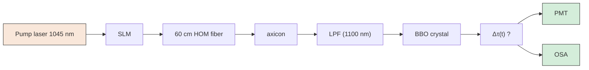

# Jitter-free, dual-wavelength, ultrashort-pulse, energetic fiber sources using soliton self-mode conversion

LARS RISHØJ,1,2 FENGYUAN DENG,1 BOYIN TAI,1 JI-XIN CHENG,1 AND SIDDHARTH RAMACHANDRAN1,\*

1Boston University, 8 Saint Mary’s St., Boston, MA 02215, USA  
2Currently with the Technical University of Denmark, Ørsteds plads 343, 2800 Kgs. Lyngby, Denmark \*sidr@bu.edu

Abstract: We demonstrate an energetic dual-wavelength ultrashort pulsed source by exploiting the inherent features of the newly discovered process of soliton self-mode conversion (SSMC) in a multimode fiber. The generated pulses are at wavelengths of 1205 nm and 1273 nm, respectively, and the pulse energies are approximately 30 nJ. The natural group-velocity-locking feature of SSMC ensures minimal relative timing jitter, hence highlighting the utility of exploiting the new degrees of freedom afforded by field of multimode nonlinear fiber optics. The relative timing jitter is evaluated by measuring the power fluctuations of generated sum-frequency signals. When compared to a conventional fiber based dual-wavelength source based on traditional frequency-shifted solitons, the relative timing jitter is found to be reduced by greater than 11 dB. Since this process is wavelength-agnostic within the transparency window of optical fibers, our source provides an attractive means of achieving integrated multi-color ultrashort pulse sources for a variety of applications.

© 2020 Optical Society of America under the terms of the OSA Open Access Publishing Agreement

## 1. Introducation

Sources operating at two wavelengths are essential for pump-probe experiments, such as stimulated Raman scattering microscopy (SRS) [1] and coherent anti-Stokes Raman (CARS) microscopy [2], and for mid-IR and THz generation via difference frequency generation [3]. One simple solution is to divide the output of a pump laser and convert each of these to the desired frequencies using two separate OPOs. Alternatively, if only the frequency separation is of importance and the absolute frequencies are irrelevant, one can utilize the signal and idler from a single OPO [4]. In the interest of avoiding bulky alignment-sensitive OPOs, fiber based solutions have also been investigated. A majority of the fiber based approaches lead to pulse durations of picoseconds or longer, either by spectrally filtering the gain medium [5–9] or by using time-lens sources [10]. Progress in this regard with ultrashort (i.e. ∼100-fs) pulsed sources, useful for applications such as hyperspectral imaging via spectral focusing for CARS and SRS [11,12] or mid-IR generation [3], is, however, limited. This is because, in fibers of useful enough lengths to be used as flexible media, the long propagation lengths and group-velocity fluctuations, due to environmental or nonlinear instabilities, lead to relative timing jitter [13]. This is true for all fiber-based sources, but especially debilitating for fs sources since jitter must be managed to be a fraction of the pulse width. One way to mitigate this is to use very short fiber samples that approach the length of nonlinear crystals in OPOs. Recently, a dual wavelength source with low relative timing jitter was demonstrated via self-phase modulation in an 8.5 cm fiber sample [14]. But for fibers of longer lengths, a common approach is to divide the output of a fiber laser and subsequently frequency convert one of these spectral lines via a nonlinear process, e.g. soliton self-frequency shifting (SSFS), and then combine these two outputs to form a dual-wavelength ultrafast source [12]. In such cases, the magnitude of the resultant timing-jitter can even exceed the pulse duration, severely restricting the use of fiber nonlinearities to develop multi-wavelength ultrashort pulse sources.

In this paper, we demonstrate the generation of dual wavelength ultrashort pulses from a single nonlinear process – the recently discovered process of soliton self-mode conversion (SSMC) [15]. SSMC relies on intermodal group-velocity matching, which means that the pulses are naturally time synchronized and inherently robust to relative timing jitter [16]. In our exemplary demonstration, the wavelengths are 1205 nm and 1273 nm, pulse energies of both pulses are ∼30 nJ, and the pulse durations are ∼75 fs, leading to peak powers of approximately 400 kW. Since both wavelengths are created within the fiber, this constitutes a single aperture solution where both spectrally distinct beams are naturally collinear. The relative timing jitter between these pulses is analyzed via sum frequency generation (SFG), and the results is compared to a more conventional pump and SSFS approach.

## 2. Experimental setup

The experimental setups for the two dual-wavelength sources we tested are shown in Fig. 1. The setup for the SSMC based source is shown in Fig. 1(a), henceforth referred to as the SSMC source. The pump laser (Y-Fi, KMLabs) delivers 100 fs pulses at 1045 nm (repetition rate is 10 MHz). The $\mathrm { L P } _ { 0 , 2 1 }$ mode is excited in a higher order mode (HOM) step index fiber, with a core diameter of 97 µm and a numerical aperture of 0.34, using a binary phase plate inscribed on a spatial light modulator (SLM) [17]. The length of the fiber is 60 cm. The $\mathrm { L P } _ { 0 , 2 1 }$ mode in this fiber has a dispersion of 50 ps/(nm km) and an effective area of $1 4 8 0 \mu \mathrm { m } ^ { 2 }$ , which enables the formation of high energy solitons at the pump wavelength. A subsequent combination of SSFS and SSMC generates two pulses at 1205 nm in the $\mathrm { L P } _ { 0 , 2 1 }$ mode and at 1273 nm in the $\mathrm { L P } _ { 0 , 2 0 }$ mode, respectively. Spectra and the nonlinear dynamics of our experiment are discussed further in relation to Fig. 2. An axicon is used to convert the modes at the fiber output to Gaussian-like beams and a long pass filter (LPF) at 1150 nm removes the residual pump [15]. The SSMC source is compared to a dual-wavelength source obtained using the more conventional approach of combining a pump laser with a SSFS soliton. This source is referred to as the “pump + soliton” source and its experimental setup is shown in Fig. 1(b). The setup is similar, since a pump pulse is again launched in the $\mathrm { L P } _ { 0 , 2 1 }$ mode, however, due to the slightly lower launched pump power,

"SSMC"

$$
\lambda_ {1} = 1 2 0 5 \mathrm{nm} \left(\mathrm{LP} _ {0, 2 1}\right)
$$

$$
\lambda_ {2} = 1 2 7 3 \mathrm{nm} \left(\mathrm{LP} _ {0, 2 0}\right)
$$

Pump laser 145 nm

  
SLM

  
60 cm HOM fiber

text_image

• PMT
• OSA

axicon  
LPF (1150 nm)  
BBO crystal

"Pump + Soliton

$$
\lambda_ {1} = 1 0 4 5 \mathrm{nm(Gaussian)}
$$

$$
\lambda_ {2} = 1 1 5 0 \mathrm{nm} \left(\mathrm{LP} _ {0, 2 1}\right)
$$

flowchart

Fig. 1. Experimental setup for the two dual wavelength sources. (a) The “SSMC” case. (b) The “pump + soliton” case.

the frequency-shifted output soliton is at a wavelength of 1150 nm, still in the $\mathrm { L P } _ { 0 , 2 1 }$ mode. The same 60 cm fiber sample was used. The output is converted to a Gaussian beam using an axicon and is then spectrally filtered using an 1100 nm LPF to remove the residual pump light. The pulse is then combined and temporally synchronized with a pump pulse that has passed through the optical delay line. For either source the output is focused into a nonlinear Beta Barium Borate (BBO) crystal to obtain second harmonic generation (SHG) and sum frequency generation (SFG) signals from the aforementioned multi-color sources. The relative timing jitter between the pulses is evaluated for both sources by analyzing the SHG and SFG signals using a photo multiplier tube (PMT) (Hamamatsu, H7422-50) and an oscilloscope (Rigol DS1204B). High relative timing jitter would result in a noisy SFG signal, hence providing a simple quantitative measure of the relative timing jitter between two-color pulses.

## 3. Dual-wavelength source characterization

The output spectra of the fiber for the two cases (black and red traces, respectively) are shown in Fig. 2(a). For the SSMC case (black trace) two spectral features are observed at 1205 and 1273 nm. These spectral features were imaged using 10 nm bandpass filters, the mode images are shown in Figs. 2(c)–2(d), respectively. Note that the pulse at 1205 nm is in the $\mathrm { L P } _ { 0 , 2 1 }$ mode (same as the launched mode), whereas the pulse at 1273 nm is in the $\mathrm { L P } _ { 0 , 2 0 }$ mode. The spontaneous realization of the two-mode spectral features is a direct consequence of the principles of SSMC [15]. As described in detail in [15], efficient, coherent power transfer between ultrashort pulses in two distinct modes occurs when their group indices are matched at a spectral separation close to one Raman Stokes shift – in this fiber, given the simulated group index curves shown in Fig. 2(b), note that the $\mathrm { L P } _ { 0 , 2 1 }$ mode at 1205 nm has the same group index as the $\mathrm { L P } _ { 0 , 2 0 }$ mode at 1273 nm – perfectly matching the experimental observation of Fig. 2(a). The interaction between these two pulses can either lead to complete power transfer of the original soliton into the newly formed soliton or, as in this case, the pump power and fiber lengths can be adjusted such that both pulses have equal energies at the output of the fiber. The pulse energy of each pulse was measured to be approximately 30 nJ. Using autocorrelation measurements the pulse duration of both pulses were found to be approximately 75 fs. This means that the pulses are nearly transform limited and that their peak powers are approximately 400 kW. Since this interaction is noise-initiated [18], an input of only one color at the pump suffices to create this robust, two-color ultrashort pulse emission. The output spectrum for the convention pump + soliton source is shown as the red trace in Fig. 2(a). By reducing the pump power slightly (compared to the black trace) the conventional SSFS soliton only shifts to 1150 nm. The pulse at 1150 nm in the $\mathrm { L P } _ { 0 , 2 1 }$ mode (same as the launched pump pulse) contributes one of the wavelengths for the dual wavelength source. The other wavelength is a pump pulse at 1045 nm, which comes directly from the pump laser via a free space delay line. In order to analyze the relative timing jitter between the pulses the SHG and SFG signals were generated from both sources using a BBO crystal. Figure 2(e) shows the obtained spectra for the SSMC source (black trace) and the pump + soliton source (red trace). For both sources three individual peaks are observed, the middle peak is from SFG and the two other peaks are SHG signals from either wavelength.

Relative timing jitter between pulses of two different colors manifests in stochastic temporal walk-off in the BBO crystal; hence the jitter can be ascertained by measuring the relative standard deviation (RSD) of the pulse energy of the resultant SHG and SFG signals. Each of the spectral features in Fig. 2(e) were isolated using 10-nm bandpass filters and the measured traces from the PMT were captured on an oscilloscope. The detection system (PMT + oscilloscope) has a nanosecond response time, hence the obtained traces are a convolution between the femtosecond SHG or SFG pulses and the response of the detection system. This means that the peak voltage is directly proportional to the pulse energy of the SHG or SFG pulse. Thus the RSD of the peak voltage is proportional to the fluctuation in pulse energy. In the measurements the RSD of the peak voltage is calculated based on 1000 traces. Timing jitter has no influence on the peak power of SHG signals, thus to establish the baseline noise of the system, e.g. arising from pump power fluctuations and mechanical instabilities in the setup, the SHG signals from the pump directly and the 1150 nm SSFS soliton were measured. Figure 3(a) shows a 20-second temporal persistence trace for the SHG of the pump, the RSD was found to be 2.5%. This is predominantly from the relative intensity noise (RIN) of the laser, the mechanical instability of the optical components required for the SHG generation, and any electrical noise added thereafter. Figure 3(b) shows a similar trace for the SHG of the soliton at 1150 nm, yielding an RSD of 3%. Hence, we conclude the baseline noise of our system to be RSD 3%.

line chart

| Wavelength [nm] | Power [dBm] (SSMC) | Power [dBm] (Pump + Soliton) | Group index (LP₀.₂₀) | Group index (LP₀.₂₁) |
| --------------- | ------------------ | ----------------------------- | -------------------- | -------------------- |
| 1000            | -4.5               | -4.5                          | 1.505                | 1.505                |
| 1100            | -10                | -10                           | 1.51                 | 1.51                 |
| 1200            | -20                | -20                           | 1.515                | 1.515                |
| 1300            | -40                | -40                           | 1.52                 | 1.52                 |

natural_image

Two circular diffraction patterns labeled LP₀,₂₁ and LP₀,₂₀, showing concentric rings with gradient colors (green to blue) against a dark background.

line chart

| Wavelength [nm] | SSMC Counts | Pump + Soliton Counts |
| --------------- | ----------- | --------------------- |
| 500             | 0           | 0                     |
| 520             | 0           | 600                   |
| 540             | 0           | 700                   |
| 560             | 0           | 500                   |
| 580             | 0           | 0                     |
| 600             | 400         | 0                     |
| 620             | 500         | 0                     |
| 640             | 600         | 0                     |
| 660             | 0           | 0                     |

Fig. 2. (a) Output spectra from the HOM fiber for both dual wavelength sources. (b) Simulated group index versus wavelength for the two HOMs of interest. (c) Experimental mode image of the $\mathrm { L P } _ { 0 , 2 1 }$ mode. (d) Experimental mode image of the $\mathrm { L P } _ { 0 , 2 0 }$ mode. (e) Spectra of generated SHG and SFG components for both sources.

line chart

| Time [ns] | Voltage [mV] |
| --------- | ------------ |
| 0         | 0            |
| 4         | 0            |
| 8         | 35           |
| 12        | 5            |
| 16        | 0            |

line chart

| Time [ns] | Voltage [mV] |
| --------- | ------------ |
| 0         | 0            |
| 4         | 0            |
| 8         | 35           |
| 12        | 5            |
| 16        | 0            |

Fig. 3. Each plot displays 20-second persistence traces. The calculated statistics provided along with each figure are the maximum peak values analyzed for 1000 pulses sampled over a few minutes. (a) SHG signal directly from the pump laser, and (b) SHG signal from the soliton at 1150 nm [red trace in Fig. 2(a)].

Next, the SFG signals for the two sources are analyzed in a similar manner. Figure 4(a) shows a 20-second persistence trace of the SFG signal for the conventional pump + soliton source. The RSD calculated from 1000 traces was found to be 31.7%. After baseline subtraction this results in a RSD of 28.7%, by assuming a normal distribution of the relative timing jitter, this corresponds to a standard deviation of the relative timing jitter of 42 fs. This illustrates the devastating impact of relative timing jitter between the free-space pump laser and the conventional SSFS soliton pulses. This is, indeed, the fundamental problem with dual-wavelength ultrashort-pulse fiber sources. In contrast, Fig. 4(b) shows the temporal traces of the SFG signal obtained using pulses from our SSMC source. The signal looks remarkably similar, in stability, to the baseline trace of

SHG from a soliton [Fig. 3(b)], and the RSD is only 5.1%. After baseline subtraction this results in a RSD of 2.1%, which corresponds to a standard deviation of the relative timing jitter of 8 fs. By comparing the SFG signals from our dual-wavelength SSMC based source with that of the conventional pump + soliton approach it is found that the relative power fluctuations, after subtracting the baseline, is reduced by $2 8 . 7 / 2 . 1 = 1 1 . 4$ dB. This is enabled by the fact that the two wavelengths created via the SSMC process arise from the same nonlinear process, which fundamentally relies on intermodal group velocity matching within the HOM fiber. Furthermore, as both pulses are generated within the optical fiber, this represents a single aperture solution, since even though the pulses are in different spatial modes the beams are naturally collinear. Hence, they can be converted with high efficiency to Gaussian beams using two cascaded axicon elements [19].

line chart

| Time [ns] | Voltage [mV] |
| --------- | ------------ |
| 0         | 0            |
| 4         | 0            |
| 8         | 50           |
| 12        | 10           |
| 16        | 0            |

line chart

| Time [ns] | Voltage [mV] |
| --------- | ------------ |
| 0         | 0            |
| 4         | 0            |
| 8         | 30           |
| 12        | 10           |
| 16        | 0            |

Fig. 4. Each plot displays 20-second persistence traces. The calculated statistics provided along with each figure is the maximum peak value analyzed for 1000 pulses sampled over a few minutes. (a) The SFG signal between the pump and soliton pulses, and (b) the SFG signal for the two pulses generated via SSMC.

## 4. Discussion on operation wavelengths and frequency separations

While the experiments described here concern only one pair of wavelengths, as we have shown earlier, SSMC can be induced to yield solitons spanning the wavelength range of at least 1000 nm to 1700 nm [15], and with appropriate pumps, can span the entire wavelength range in which a fiber is transparent. Hence, these dual-color sources can be obtained in an effectively wavelength agnostic manner. Given that SSMC primarily occurs close to the Raman gain peak (simulations indicate that the frequency separation between the pulses can range from 12 to 18 THz [18]), this process may suggest limitations on the achievable frequency separations. However, fiber design may also enable locking, not just two, but multiple modes via the SSMC process, in which cases achievable frequency separations could be dramatically increased. Alternatively, another method of controlling the frequency separation is choice of fiber material, since the obtainable frequency separations are related to the Raman Stokes shift. An example of this is phosphosilicate fibers, which exhibit Raman shifts of ∼39 THz [20] – 3x larger than that in silica.

## 5. Summary and conclusions

In summary, we have demonstrated an energetic dual-wavelength ultrashort-pulse fiber source that is nearly free of relative timing jitter, which is usually an issue of concern for fiber-based multi-color sources. The enabler is an intermodal nonlinear effect referred to as soliton self-mode conversion (SSMC), which inherently leads to time-synchronized and transform-limited pulses, directly out of the fiber. For this specific demonstration the dual wavelengths were generated at 1205 and 1273 nm in the $\mathrm { L P } _ { 0 , 2 1 }$ and $\mathrm { L P } _ { 0 , 2 0 }$ mode, respectively. The pulse energies were 30 nJ for each pulse and the pulse durations were approximately 75 fs. The absolute wavelength could in principle be generated at any wavelengths within the transmission window of silica fibers, however, due to the nature of SSMC the relative frequency separation is always close to the Raman gain peak (12 to 18 THz). We speculate that future work could increase this frequency separation by utilizing fibers of different materials or by utilizing multi cascaded SSMC processes. The ability to obtain fiber sources that provide relative timing jitter free ultrashort pulses at multiple colors would be attractive for a variety of pump-probe experiments as well as mid-IR and THz generation schemes that rely on difference frequency generation.

## Funding

Air Force Office of Scientific Research (FA9550-14-1-0165, FA9550-17-1-0375); Office of Naval Research (N00014-17-1-2519).

## Acknowledgments

The authors would like to thank Poul Kristensen from OFS-Fitel Denmark for manufacturing the fibers, and Havva Kabagoz for discussions and assistance with the experimental setup.

## Disclosures

The authors declare that there are no conflicts of interest related to this article.

## References

1. E. Ploetz, S. Laimgruber, S. Berner, W. Zinth, and P. Gilch, “Femtosecond stimulated Raman microscopy,” Appl. Phys. B 87(3), 389–393 (2007).  
2. M. D. Duncan, J. Reintjes, and T. J. Manuccia, “Scanning coherent anti-Stokes Raman microscope,” Opt. Lett. 7(8), 350–352 (1982).  
3. D. G. Winters, P. Schlup, and R. A. Bartels, “Subpicosecond fiber-based soliton-tuned mid-infrared source in the 9.7–14.9 µm wavelength region,” Opt. Lett. 35(13), 2179–2181 (2010).  
4. F. Ganikhanov, S. Carrasco, X. S. Xie, M. Katz, W. Seitz, and D. Kopf, “Broadly tunable dual-wavelength light source for coherent anti-Stokes Raman scattering microscopy,” Opt. Lett. 31(9), 1292–1294 (2006).  
5. Z. Luo, M. Zhou, J. Weng, G. Huang, H. Xu, C. Ye, and Z. Cai, “Graphene-based passively Q-switched dual-wavelength erbium-doped fiber laser,” Opt. Lett. 35(21), 3709–3711 (2010).  
6. P. C. Peng, H. Y. Tseng, and S. Chi, “A tunable dual-wavelength erbium-doped fiber ring laser using a self-seeded Fabry-Perot laser diode,” IEEE Photonics Technol. Lett. 15(5), 661–663 (2003).  
7. J. Nilsson, Y. W. Lee, and S. J. Kim, “Robust dual-wavelength ring-laser based on two spectrally different erbium-doped fiber amplifiers,” IEEE Photonics Technol. Lett. 8(12), 1630–1632 (1996).  
8. X. Liu, D. Han, Z. Sun, C. Zeng, H. Lu, D. Mao, Y. Cui, and F. Wang, “Versatile multi-wavelength ultrafast fiber laser mode-locked by carbon nanotubes,” Sci. Rep. 3(1), 2718 (2013).  
9. H. Zhang, D. Y. Tang, X. Wu, and L. M. Zhao, “Multi-wavelength dissipative soliton operation of an erbium-doped fiber laser,” Opt. Express 17(15), 12692–12697 (2009).  
10. B. Li, K. Charan, K. Wang, T. Rojo, D. Sinefeld, and C. Xu, “Nonresonant background suppression for coherent anti Stokes Raman scattering microscopy using a multi-wavelength time-lens source,” Opt. Express 24(23), 26687–26695 (2016).  
11. T. Hellerer, A. M. Enejder, and A. Zumbusch, “Spectral focusing: High spectral resolution spectroscopy with broad-bandwidth laser pulses,” Appl. Phys. Lett. 85(1), 25–27 (2004).  
12. E. R. Andresen, P. Berto, and H. Rigneault, “Stimulated Raman scattering microscopy by spectral focusing and fiber-generated soliton as Stokes pulse,” Opt. Lett. 36(13), 2387–2389 (2011).  
13. G. Zhou, M. Xin, F. X. Kaertner, and G. Chang, “Timing jitter of Raman solitons,” Opt. Lett. 40(21), 5105–5108 (2015).  
14. Y. Hua, G. Zhou, W. Liu, F. X. Kärtner, and G. Chang, “Tightly synchronized two-color femtosecond source based on low-noise SPM-enabled spectral selection,” in Conference on Lasers and Electro-Optics, OSA Terchnical Digest (Optical Society of America, 2018), paper JTh2A.162.  
15. L. Rishøj, B. Tai, P. Kristensen, and S. Ramachandran, “Soliton self-mode conversion: revisiting Raman scattering of ultrashort pulses,” Optica 6(3), 304–308 (2019).  
16. L. Rishøj, B. Tai, F. Deng, J. Cheng, and S. Ramachandran, “Jitter-Free Multi-Wavelength Fiber Sources using Intermodal Solitons,” in Conference on Lasers and Electro-Optics, OSA Technical Digest (Optical Society of America, 2019), paper STu3L.6.  
17. J. Demas, L. Rishøj, and S. Ramachandran, “Free-space beam shaping for precise control and conversion of modes in optical fiber,” Opt. Express 23(22), 28531–28545 (2015).

## Optics EXPRESS

18. A. Antikainen, L. Rishøj, B. Tai, S. Ramachandran, and G. P. Agrawal, “Fate of a Soliton in a High Order Spatial Mode of a Multimode Fiber,” Phys. Rev. Lett. 122(2), 023901 (2019).  
19. T. Du, T. Wang, and F. Wu, “Generation of three-dimensional optical bottle beams via focused non-diffracting Bessel beam using an axicon,” Opt. Commun. 317, 24–28 (2014).  
20. E. M. Dianov and A. M. Prokhorov, “Medium-power CW Raman fiber lasers,” IEEE J. Sel. Top. Quantum Electron. 6(6), 1022–1028 (2000).