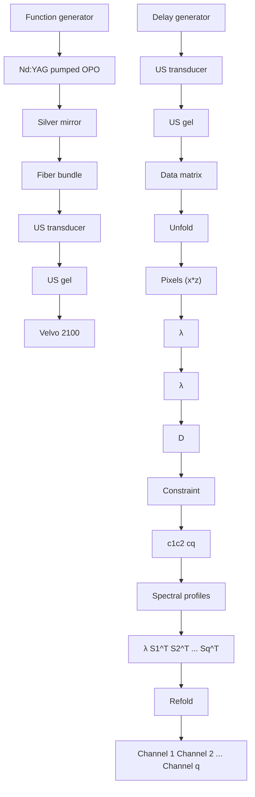

## FULL ARTICLE

# Label-free in vivo imaging of peripheral nerve by multispectral photoacoustic tomography

Rui Li\*\*, 1, Evan Phillips\*\*, 1, Pu Wang1, Craig J. Goergen\*, 1, and Ji-Xin Cheng\*, 1, 2

1 Weldon School of Biomedical Engineering, Purdue University, West Lafayette, IN, 47907, USA  
2 Department of Chemistry, Purdue University, West Lafayette, IN, 47907, USA

Received 10 January 2015, revised 26 March 2015, accepted 28 March 2015

Published online 23 April 2015

Key words: photoacoustic tomography, in vivo, nerve, spectroscopy, multivariate curve resolution

Unintentional surgical damage to nerves is mainly due to poor visualization of nerve tissue relative to adjacent structures. Multispectral photoacoustic tomography can provide chemical information with specificity and ultrasonic spatial resolution with centimeter imaging depth, making it a potential tool for noninvasive neural imaging. To implement this label-free imaging approach, a multispectral photoacoustic tomography platform was built. Imaging depth and spatial resolution were characterized. In vivo imaging of the femoral nerve that is 2 mm deep in a nude mouse was performed. Through multivariate curve resolution analysis, the femoral nerve was discriminated from the femoral artery and chemical maps of their spatial distributions were generated.

natural_image

Microscopic image of a nerve structure with 2 mm scale bar, showing yellow fluorescent signal against black background (no text or symbols beyond labels)

text_image

B
Blood
0
1
1
0

line chart

| Wavelength (nm) | Nerve |
|---|---|
| 1120 | 10 |
| 1160 | 30 |
| 1200 | 80 |
| 1240 | 20 |

line chart

| Wavelength (nm) | Blood |
|---|---|
| 1120 | 40 |
| 1160 | 20 |
| 1200 | 20 |
| 1240 | 18 |

The femoral nerve was discriminated from the femoral artery by multivariate curve resolution analysis.

## 1. Introduction

Attributed to surgical procedures, iatrogenic damage to peripheral nerves is a leading cause of morbidity [1–6]. The resultant complications include temporary numbness, loss of sensation, and peripheral neuropathy [6, 7]. Although several factors are related to iatrogenic nerve injuries, distinctive visualization of nerve tissues relative to adjacent structures is of vital importance yet remains technically challenging. Currently, several imaging modalities have been applied to address this concern, including ultrasonography [8, 9], coherent anti-Stokes Raman scattering (CARS) [10, 11], third-harmonic generation (THG) [12], and magnetic resonance imaging (MRI) [13, 14]. These techniques improve visualization of nerves, but still suffer from several limitations. Ultrasonography has low contrast and cannot distinguish nerves from adjacent tissues that have similar acoustic properties. CARS and THG can generate nervespecific contrast with micron resolution, but have limited penetration depth due to optical tissue scattering. MRI can reveal the whole peripheral nervous system, but its resolution is typically on the sub-millimeter scale, making visualization of small nerves difficult.

As an emerging biomedical imaging tool, photoacoustic imaging has proven its capability of deep tissue imaging with optical absorption contrast and ultrasonic resolution [15–18]. Major applications of photoacoustic imaging rely heavily on contrast from electronic absorption of hemoglobin or exogenous contrast agents [15, 19–21]. Recently, photoacoustic imaging using molecular overtone vibration as the contrast, where the second overtone absorption of C–H bond lies in the optical window ranging from 1100 to 1300 nm, has been successfully demonstrated for lipid imaging [22–27]. Myelin sheaths surrounding axons are abundant in lipids, thus providing an opportunity to apply photoacoustic imaging for visualization of nerves with specific contrast. More recently, photoacoustic microscopy (PAM) has been successfully employed to image peripheral nerves in mice and white matter in rats [28, 29]. However, translation of this technique to the clinical setting is hindered by millimeter-scale imaging depth and slow imaging speed of this microscopy technique. Moreover, it remains challenging to separate the nerves from adjacent blood vessels by single color excitation.

Here, we demonstrate a multispectral photoacoustic tomography (PAT) platform, together with multivariate image analysis for in vivo visualization of peripheral nerves. A customized optical parametric oscillator (OPO), pumped by the second harmonic of a Nd : YAG laser, was used as the light excitation source. Using a tissue-mimicking polyvinyl alcohol (PVA) phantom, we demonstrated a penetration depth up to 2.7 centimeter and attained an axial resolution of 124 μm. We further performed in vivo imaging of the femoral nerve that is 2 mm deep in a nude mouse at a speed of 10 frames per second. Through multivariate curve resolution (MCR) analysis of multispectral images ranging from 1100 nm to 1250 nm, we discriminated the femoral nerve from the femoral artery and generated chemical maps of their spatial distribution.

## 2. Experimental

## 2.1 System design

A schematic of our experimental setup and the data analysis method is shown in Figure 1. A customized OPO laser system (NT 300, EKSPLA) shown in Figure 1A was used as the light excitation source. The OPO system pumped by the second harmonic of a Nd : YAG laser generates 10 Hz, 5 ns pulse train with wavelengths tunable from 670 nm to 2300 nm. This near-infrared light was launched into a 1 cm diameter optical fiber bundle, with two rectangular distal terminals (12 mm × 2 mm) being stabilized parallel to an ultrasound transducer. The illuminated area on the sample surface was 15 mm by 5 mm, leading to the laser fluence of 40 mJ/cm2, which is below the American National Standards Institute (ANSI) safety standard [30]. The ultrasound waves generated were recorded by a transducer array with 256 elements and a 21 MHz center frequency (MS250, VisualSonics Inc.), which was fixed together with the fiber bundle terminals by a customized holder. Image reconstruction was implemented through a small animal ultrasound imaging system (Vevo 2100, VisualSonics Inc.). For synchronization of pulse excitation and image acquisition, a function generator (33220A, Agilent) was used to output 10 Hz, 10 μs Transistor-transistor logic (TTL) signal, which externally triggered both the OPO laser and ultrasound system. We further employed a delay generator (DG535, Stanford Research System) to synchronize the trigger of the laser with the ultrasound system.

flowchart

Figure 1 Schematic of the multispectral photoacoustic tomography system and the analysis method. (A) Experimental setup of multispectral photoacoustic tomography platform. (B) Flowchart of multivariate curve resolution algorithm. OPO: optical parametrical oscillator. US: ultrasound. λ: wavelength of the laser light. Z: imaging depth. X: imaging width.

## 2.2 Data analysis method

MCR is a popular chemometrics method for resolving different components in an unknown mixture [32], capable of separating multiple data matrices simultaneously [32]. Moreover, it can recover the concentration profiles and spectral profiles from spectroscopic images [33]. With its powerful mixture-resolving capability, this technique has been used in spectroscopy, multifluorophore fluorescence imaging, and photoacoustic imaging [34–36]. The multispectral images were analyzed with the MCR algorithm illustrated in the flowchart in Figure 1B. The multispectral images $( X \times Z \times \lambda )$ were unfolded into a two-dimensional (2D) matrix with the size of [(X × $Z ) \times \lambda ]$ , with each row representing a spectrum from each pixel. An embedded principal component analysis (PCA) method was executed to quantify the number of components (q) [37]. The 2D data matrix was fitted with a bilinear model, $D = C S ^ { T }$ , with C representing the distribution of q components and $S ^ { T }$ representing the different spectra. By refolding the data matrix C, distribution maps of different components, corresponding to blood or nerve tissue, were generated.

## 3. Results and discussion

In order to evaluate the imaging capabilities of our photoacoustic tomography platform, the imaging depth (Figure 2) and spatial resolution (Figure 3) were characterized by defined phantoms. Since polyethylene is abundant in pure CH bonds, it can generate strong photoacoustic signal similar to lipid, due to the second overtone absorption of C–H bond [26]. Three polyethylene tubes (427415, Becton, Dickinson and Company) with 1.2 mm outer diameter were inserted into a PVA gel at different depths (Figure 2A). PVA is a commonly-used tissue-mimicking photoacoustic phantom which provides the following optical scattering properties at 1064 nm: the absorption coefficient $\overset { \cdot } { \mu } _ { a } = 0 . \overset { \cdot } { 0 . } 3 5$ mm–1, the scattering coefficient $\mu _ { S } = 6 . 9 0 \pm 0 . 3 8 \mathrm { m m ^ { - 1 } }$ , and the scattering anisotropy $g = 0 . 9 1 \pm 0 . 0 1 \ [ 3 8 , 3 9 ]$ . During the experiment, ultrasound gel was employed as acoustic coupling medium between the transducer and the phantom. The ultrasound image of the phantom (Figure 2B) showed not only the three tubes, but also a small pocket of air trapped in the phantom. When the OPO was tuned to 1210 nm, photoacoustic signal of the polyethylene tubes appeared in cross-section (Figure 2C). The signal disappeared when the wavelength was tuned to 1100 nm (Figure 2D). The maximum imaging depth of our multispectral PAT platform reached 2.7 cm in the tissuemimicking phantom.

We then characterized the spatial resolution by imaging pencil leads (diameter, 200 μm) that were inserted into a second PVA gel (Figure 3A). The photoacoustic image of the phantom is shown in Figure 3B. The axial and lateral profile of the photoacoustic signal amplitude are shown in Figure 3C and 3D, respectively. The axial and lateral resolution of the platform was estimated using the following equation.

text_image

A
SCIENTIFIC INSTRUMENTS &
1 2 3 4
A

text_image

B
air bubble

1 0

natural_image

Dark image with faint red light spots, no visible text or symbols

natural_image

Dark image with a 5 mm scale bar, no visible text or symbols

1 0  
Figure 2 Ultrasound imaging and photoacoustic tomography of a tissue-mimicking phantom with polyethylene tubes. (A) Three polyethylene tubes were inserted into tissue-mimicking PVA gels at different depths. (B) Ultrasound image of polyethylene tubes in a PVA gel, as circled. (C) The photoacoustic imaging depth at 1210 nm reached up to 2.7 cm. (D) The contrast disappeared at 1100 nm, showing that the system is bond-selective.

$$
\text { Resolution } = \sqrt {\left(\mathrm{FWHM}\right) ^ {2} - \left(\text { diameter }\right) ^ {2}} \tag {1}
$$

FWHM represents the full width at half maximum value of the signal intensity profile, and diameter of the pencil lead is 200 μm. The axial and lateral FWHM is measured to be 235 μm and 562 μm, respectively. Therefore, the axial and lateral resolution is 124 μm and 525 μm, respectively.

An athymic nude mouse (Foxn1nu, Harlan Laboratories) was used to demonstrate the in vivo imaging capability of the multispectral PAT system. This animal study was approved by the Purdue Animal Care and Use Committee. The mouse was anesthetized with 2.5% isofluorane, positioned supine on a heated stage, and kept between 1–2.5% isoflurane during the acute imaging procedure (Figure 4A). We noninvasively monitored heart rate and respiration rate with the integrated stage electrodes and body temperature with a rectal probe. Ventral skin on the

  
Figure 3 Characterization of spatial resolution. (A) Three pencil leads were inserted into tissue-mimicking PVA gels at different depths. (B) Photoacoustic image of three pencil leads. The axial and lateral resolution at 19 mm depth is roughly 124 μm (C) and 525 μm (D), respectively.

left hind leg was removed to expose and visualize the femoral nerve and artery for multispectral PAT imaging. Then, sterile ultrasound gel was applied between the transducer and tissue in the left leg of the mouse. The transducer was placed along the long axis of the femoral artery, as shown in the ultrasound image in Figure 4B. Because the femoral artery and femoral nerve have similar acoustic contrast and are in very close proximity to each other, we could not easily differentiate them with standard ultrasound. Thus, multispectral photoacoustic imaging (Figure 4C) was performed with wavelengths ranging from 1100 nm to 1250 nm with a step size of 10 nm. The co-registered microscopic photo of the same mouse leg is shown in Figure 4D. The blue dash line indicates that the femoral nerve and the femoral artery were adjacent to each other.

  
Figure 4 In vivo multispectral photoacoustic tomography of a mouse hind limb. (A) The anesthetized nude mouse was placed under the transducer. (B) Ultrasound image of mouse femoral nerve and blood vessels. The animal’s skin was removed for imaging. (C) Multispectral photoacoustic imaging of the same region. (D) Digital microscopic photo of the mouse hind limb. The blue dash line shows the boundary of the right femoral nerve and artery.

natural_image

Microscopic image of a nerve structure with 2 mm scale bar, showing yellow fluorescent signal against dark background (no text or symbols beyond labels)

natural_image

Microscopic image of blood tissue with red fluorescence intensity scale (no text or symbols)

line chart

| Wavelength (nm) | Nerve |
|---|---|
| 1120 | 15 |
| 1160 | 45 |
| 1200 | 80 |
| 1240 | 20 |

line chart

| Wavelength (nm) | Blood |
|---|---|
| 1120 | 40 |
| 1160 | 20 |
| 1200 | 20 |
| 1240 | 18 |

Figure 5 Multivariate curve resolution (MCR) method was used to distinguish femoral nerve from femoral artery. (A) MCR map of mouse femoral nerve. (B) MCR map of mouse femoral artery. (C) PA spectrum of mouse femoral nerve generated by MCR analysis. (D) PA spectrum of mouse blood generated by MCR analysis.

In order to distinguish the femoral nerve and artery, an MCR algorithm was applied to the multispectral photoacoustic images. Here, the component distribution maps and spectra profiles of the femoral nerve and femoral artery are recovered (Figure 5). The mouse femoral nerve, with myelin sheaths covering the axons, is shown in Figure 5A. The femoral artery, filled with blood, is shown in Figure 5B. The component distribution maps are further verified by their spectral profiles. Figure 5C shows an absorption profile that matches lipid, the main component of myelin covering this nerve. Figure 5D shows the absorption profile of blood, which we used to localize the femoral artery. These results show that the femoral nerve and the femoral artery were successfully distinguished with specific contrast.

## 4. Conclusion

In this letter, we successfully demonstrated the utility of a multispectral photoacoustic tomography platform for peripheral nerve imaging using a customized OPO pumped by the second harmonic of a Nd : YAG laser as the light excitation source. Up to 2.7 cm imaging depth was achieved in a tissue-mimicking phantom. In vivo imaging of the femoral nerve and artery were performed in a nude mouse. Multivariate curve resolution analysis of multispectral images allowed us to discriminate the femoral nerve from the femoral artery in a live nude mouse and to generate chemical maps of their spatial distributions. This study opens exciting opportunities for label-free imaging of peripheral nerves in patients with high chemically selective contrast.

Acknowledgements This work was supported by an American Heart Association National Innovation Award and an American Heart Association Scientist Development Grant (CJG, 14SDG18220010).

Author biographies Please see Supporting Information online.

## References

[1] S. G. Joniau, A. A. Van Baelen, C. Y. Hsu, and H. P. Van Poppel, Adv Urol. 2012(2012), 706309 (2012).  
[2] M. D. Michaelson, S. E. Cotter, P. C. Gargollo, A. L. Zietman, D. M. Dahl, and M. R. Smith, CA Cancer J Clin. 58(4), 196–213 (2008).  
[3] A. D. Sharma, C. L. Parmley, G. Sreeram, and H. P. Grocott, Anesth Analg. 91(6), 1358–1369 (2000).  
[4] B. F. Jung, G. M. Ahrendt, A. L. Oaklander, and R. H. Dworkin, Pain. 104(1–2), 1–13 (2003).  
[5] C. L. Jeng, T. M. Torrillo, and M. A. Rosenblatt, Br J Anaesth. 105(1), i97–107 (2010).  
[6] G. Antoniadis, T. Kretschmer, M. T. Pedro, R. W. Konig, C. P. Heinen, and H. P. Richter, Dtsch Arztebl Int. 111(16), 273–279 (2014).  
[7] A. J. Wilbourn, Neurol Clin. 16(1), 55–82 (1998).  
[8] F. O. Walker, Suppl Clin Neurophysiol. 57, 243–254 (2004).  
[9] A. Grimm, B. Decard, and H. Axer, J Peripher Nerv Syst. 19(3), 234–241 (2014).  
[10] T. B. Huff and J. X. Cheng, J Microsc. 225(2), 175–182 (2007).  
[11] L. Gao, H. Zhou, M. J. Thrall, F. Li, Y. Yang, Z. Wang, P. Luo, K. K. Wong, G. S. Palapattu, and S. T. Wong, Biomed Opt Express. 2(4), 915–926 (2011).  
[12] M. J. Farrar, F. W. Wise, J. R. Fetcho, and C. B. Schaffer, Biophys J. 100(5), 1362–1371 (2011).  
[13] G. Stoll, M. Bendszus, J. Perez, and M. Pham, J Neurol. 256(7), 1043–1051 (2009).  
[14] R. C. Fritz and R. D. Boutin, Phys Med Rehabil Clin N Am. 12(2), 399–432 (2001).  
[15] X. Wang, Y. Pang, G. Ku, X. Xie, G. Stoica, and L. V. Wang, Nat Biotechnol. 21(7), 803–806 (2003).  
[16] H. P. Brecht, R. Su, M. Fronheiser, S. A. Ermilov, A. Conjusteau, and A. A. Oraevsky, J Biomed Opt. 14 (6), 064007 (2009).  
[17] J. Laufer, D. Delpy, C. Elwell, and P. Beard, Phys Med Biol. 52(1), 141–168 (2007).  
[18] S. Hu, K. Maslov, and L. V. Wang, J Vis Exp. 51, e2729 (2011).  
[19] J. W. Kim, E. I. Galanzha, E. V. Shashkov, H. M. Moon, and V. P. Zharov, Nat Nanotechnol. 4(10), 688–694 (2009).  
[20] Q. Zhang, N. Iwakuma, P. Sharma, B. M. Moudgil, C. Wu, J. McNeill, H. Jiang, and S. R. Grobmyer, Nanotechnology 20(39), 395102 (2009).  
[21] W. J. Akers, C. Kim, M. Berezin, K. Guo, R. Fuhrhop, G. M. Lanza, G. M. Fischer, E. Daltrozzo, A. Zumbusch, X. Cai, L. V. Wang, and S. Achilefu, Acs Nano. 5(1), 173–182 (2011).  
[22] H. W. Wang, N. Chai, P. Wang, S. Hu, W. Dou, D. Umulis, L. V. Wang, M. Sturek, R. Lucht, and J. X. Cheng, Phys Rev Lett. 106(23), 238106 (2011).  
[23] B. Wang, A. Karpiouk, D. Yeager, J. Amirian, S. Litovsky, R. Smalling, and S. Emelianov, Opt Lett. 37 (7), 1244–1246 (2012).  
[24] P. Wang, J. R. Rajian, and J. X. Cheng, J Phys Chem Lett. 4(13), 2177–2185 (2013).  
[25] R. Li, M. N. Slipchenko, P. Wang, and J. X. Cheng, J Biomed Opt. 18(4), 040502 (2013).  
[26] J. R. Rajian, R. Li, P. Wang, and J. X. Cheng, J Phys Chem Lett. 4(19), 3211–3215 (2013).  
[27] P. Wang, T. Ma, M. N. Slipchenko, S. S. Liang, J. Hui, K. K. Shung, S. Roy, M. Sturek, Q. F. Zhou, Z. P. Chen, and J. X. Cheng, Sci Rep. 4, 6889 (2014).  
[28] T. P. Matthews, C. Zhang, D. K. Yao, K. Maslov, and L. V. Wang, J Biomed Opt. 19(1), 16004 (2014).  
[29] W. Wu, P. Wang, J. X. Cheng, and X. M. Xu, J Neurotrauma. 31(24), 1998–2002 (2014).  
[30] M. H. Xu and L. H. V. Wang, Rev Sci Instrum. 77(4), 041101 (2006).  
[31] J. Jaumot, R. Gargallo, A. de Juan, and R. Tauler, Chemometr Intell Lab. 76(1), 101–110 (2005).  
[32] R. Tauler, A. Smilde, and B. Kowalski, J Chemometr. 9(1), 31–58 (1995).  
[33] A. de Juan and R. Tauler, Crit Rev Anal Chem. 36(3– 4), 163–176 (2006).  
[34] P. N. Perera, K. R. Fega, C. Lawrence, E. J. Sundstrom, J. Tomlinson-Phillips, and D. Ben-Amotz, P Natl Acad Sci USA 106(30), 12230–12234 (2009).  
[35] D. M. Haaland, H. D. T. Jones, M. H. Van Benthem, M. B. Sinclair, D. K. Melgaard, C. L. Stork, M. C. Pedroso, P. Liu, A. R. Brasier, N. L. Andrews, and D. S. Lidke, Appl Spectrosc. 63(3), 271–279 (2009).  
[36] P. Wang, H. W. Wang, and J. X. Cheng, J Biomed Opt. 17(9), 96010–96011 (2012).  
[37] M. Ringner, Nature biotechnology 26(3), 303–304 (2008).  
[38] A. Kharine, S. Manohar, R. Seeton, R. G. M. Kolkman, R. A. Bolt, W. Steenbergen, and F. F. M. de Mul, Phys Med Biol. 48(3), 357–370 (2003).  
[39] S. E. Bohndiek, S. Bodapati, D. Van De Sompel, S. R. Kothapalli, and S. S. Gambhir, Plos One. 8(9), e75533 (2013).