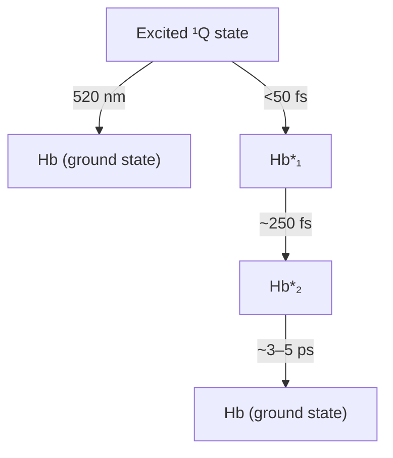

## C H E M I C A L P H Y S I C S

# Label-free quantitation of glycated hemoglobin in single red blood cells by transient absorption microscopy and phasor analysis

Pu-Ting Dong1 , Haonan Lin2 , Kai-Chih Huang2 , Ji-Xin Cheng1,2,3,4\*

As a stable and accurate biomarker, glycated hemoglobin (HbA1c) is clinically used to diagnose diabetes with a threshold of 6.5% among total hemoglobin (Hb). Current methods such as boronate affinity chromatography involve complex processing of large-volume blood samples. Moreover, these methods cannot measure HbA1c fraction at single–red blood cell (RBC) level, thus unable to separate the contribution from other factors such as RBC lifetime. Here, we demonstrate a spectroscopic transient absorption imaging approach that is able to differentiate HbA1c from Hb on the basis of their distinct excited-state dynamics. HbA1c fraction inside a single RBC is derived quantitatively through phasor analysis. HbA1c fraction distribution of diabetic blood is apparently different from that of healthy blood. A mathematical model is developed to derive the long-term blood glucose concentration. Our technology provides a unique way to study heme modification and to derive clinically important information void of bloodstream glucose fluctuation.

Copyright © 2019 The Authors, some rights reserved exclusive licensee American Association for the Advancemen of Science. No claim to original U.S. Governmen Works. Distributed under a Creativ Commons Attribution NonCommercia License 4.0 (CC BY-NC)

## INTRODUCTION

According to the Centers for Disease Control and Prevention diabetes statistics report in 2017, around 30.3 million people (\~9.4% of the U.S. population) have diabetes, and this disease is responsible for 4.6 million deaths each year (1). Diabetes mellitus is a group of metabolic diseases characterized by hyperglycemia resulting from defects in insulin secretion, insulin action, or both (2). Long-term type 2 diabetes induces severe complications such as retinopathy with potential loss of vision (3), nephropathy leading to renal failure (4), and peripheral neuropathy with risk of foot ulcers or even limb amputations (5). Being cost-effective and convenient, blood glucose measurement has been widely used as the golden standard to monitor type 2 diabetes (6). However, glucose level fluctuates (7), and blood glucose measurement often produces false-positive results (8).

As a marker of long-term glucose level, glycated hemoglobin (HbA1c) presents a valuable target for long-term type 2 diabetes monitoring (9, 10). HbA1c is formed by an irreversible nonenzymatic glycosylation of hemoglobin (Hb) exposed to glucose in the bloodstream (11). Specifically, through the Maillard reaction, glucose attaches to the NH2- terminal valine of the b-chain of Hb (12). HbA1c concentration in the blood depends on two parameters: the life span of red blood cells (RBCs) (\~120 days) and the glucose concentration in the blood (13). Therefore, a strong correlation exists between HbA1c concentration and the average glucose concentration in the bloodstream over the past 3 months. Thus, HbA1c concentration could be used to monitor long-term glucose levels (14). HbA1c fraction among total Hb has been approved for screening for diabetes (HbA1c ≥ 6.5%) and pre diabetes $( 5 . 7 \% \leq \mathrm { H b A l c } \leq 6 . 4 \% )$ ) according to the American Diabetes Association (15).

Multiple methods have been developed to detect HbA1c fraction (16). Boronate affinity chromatography, for example, was used to differentiate HbA1c from Hb (17). On the basis of the polarity difference between HbA1c and Hb, capillary electrophoresis wa also used to separate these two molecules (18). Through conjugat ing upconversion nanoparticles such as $\mathrm { N a Y F _ { 4 } \colon Y b ^ { 3 + } , \ E r ^ { 3 + } }$ with anti-HbA1c monoclonal antibody, HbA1c concentration is negatively proportional to the luminescence signal from the conju gated nanoparticle (19). Anti-HbA1c antibody-functionalized gold nanoprobe provides another clue for the determination of HbA1c based on a one-step colorimetric immunoassay (20). Surface enhanced Raman spectroscopy was reported to achieve selective detection of HbA1c, as a characteristic Raman band around 770 to $8 3 0 ~ \mathrm { c m } ^ { - 1 }$ was found in the case of HbA1c (21). Drop coating Raman technique was used to locally enrich and quantify HbA1c concentration (22). Mass spectrometry in combination with high performance liquid chromatography (HPLC) was also used to detect HbA1c from other Hb species (23). One major limitation of th above methods lies in the poor detection specificity (18). Moreover, none of those methods can provide HbA1c fraction at the single RBC level, thus unable to separate the contributions by glucose and by lifetime of RBCs.

Here, through transient absorption microscopy, we found tha HbA1c and Hb have different excited-state dynamics. This spectro scopic signature triggered us to apply transient absorption micros copy, an advanced label-free imaging technique for nonfluorescent chromophores (24–33), to study this heme modification process and to quantify the HbA1c percent in single RBCs. At a pixel dwell time of 10 ms, we obtained a time-resolved whole blood image stack within 2 min. Through quantitative phasor analysis, we harvested the stan dard calibration curve for HbA1c fraction quantitation. Subsequently combined with the time-resolved whole blood image stacks, we ob tained the HbA1c fraction in single RBCs. We show that HbA1c frac tion distribution behaves differently between diabetic whole blood and healthy whole blood. Single-cell HbA1c fraction distribution could of fer long-term monitoring of type 2 diabetes void of the interference from the life span of RBCs. Moreover, we used a mathematical mode to interpret this distribution and derived the averaged glucose concen tration, which monitors the bloodstream glucose concentration over the past 3 months.

1 Department of Chemistry, Boston University, Boston, MA 02215, USA. 2 Department of Biomedical Engineering, Boston University, Boston, MA 02215, USA. 3 Department of Electrical and Computer Engineering, Boston University, Boston, MA 02215, USA. 4 Photonics Center, Boston University, Boston, MA 02215, USA. \*Corresponding author. Email: jxcheng@bu.edu

## RESULTS

## Structure difference between HbA1c and Hb revealed by PyMOL simulation

Similar to Hb, HbA1c is a tetramer in which glucose is covalently linked to the N terminus of the b-chain of Hb (34). This modification not only confers HbA1c with different polarity from Hb (18, 35) but also alters the secondary structure of Hb (36). To have a direct visu alization of the protein structure of HbA1c and Hb, we used PyMOL to analyze the protein structure of Hb and HbA1c. As shown in Fig. 1, the heme ring in Hb is hidden inside the hydrophobic pocket, whereas the porphyrin ring becomes more exposed to the outside environment in the case of HbA1c (Fig. 1, A and B), and there is some difference in the secondary structure between HbA1c (Fig. 1, A and C) and Hb (Fig. 1, B and D). The glucose at the N terminus has a polar interaction with the heme ring in the case of HbA1c, shown by blue dashed lines in Fig. 1C. This interaction indicates that the excited dynamics of heme might be altered after glycation, which can be measured by transient absorption spectroscopy.

## Characterization of HbA1c and Hb by fluorescence, time-resolved photoluminescence, and linear absorption spectroscopy

To identify the spectral difference between HbA1c and Hb, we first measured their fluorescence emission spectra. Because of the poor quantum yield of Hb (37), the fluorescence emission spectra for Hb (Fig. 2A) and HbA1c (Fig. 2B) were recorded with an integration time of 1000 s. Both HbA1c and Hb exhibit a fluorescence emission peak at 492 nm (Fig. 2, A and B), whereas HbA1c has a weaker shoulder peak (Fig. 2B). This finding confirms the structural difference between Hb and HbA1c. Then, we used time-resolved photoluminescence to understand this emission difference. It turned out that Hb demon strates a longer fluorescence lifetime (Fig. 2C) compared with HbA1 (Fig. 2D). We further measured their absorption spectra. Consistent with previously documented literature (21, 38), we observed the ab sorption difference between Hb and HbA1c as well. In the Soret band (\~400 nm) region, Hb shows a strong absorption at 405 nm (Fig. 2E) whereas HbA1c shows a characteristic peak at 411 nm, around a 6-nm red shift (Fig. 2F). In the Q-band region, Hb shows peaks at 498, 538 630, and 677 nm (Fig. 2E), while HbA1c has only two peaks at 540 and 575 nm (Fig. 2F). These data altogether consolidate the fact that HbA1c and Hb are spectrally distinct from each other. However, Fourier transform Raman spectroscopy (fig. S1) and linear spectroscopy, by either fluorescence emission or electronic absorption, do not have the sensitivity to determine the fraction of HbA1c inside single RBCs. Transient absorption microscopy circumvents such difficulty as shown in the following sections.

A  

chemical

Molecular structure highlighting HbA1c binding site with colored secondary structure elements

C

chemical

Molecular interaction diagram showing hydrogen bonding between a protein surface and surrounding solvent molecules

B  

natural_image

3D molecular surface model with highlighted regions and colored spheres (no text or labels)

D  

chemical

3D molecular structure showing a protein-ligand binding site with colored atoms (red, green, blue, cyan) and surrounding ligands

Fig. 1. Protein structure of N terminus of the b chain of HbA1c and Hb through PyMOL simulation. (A and B) Protein structure of the glycation site of HbA1c, and normal Hb, respectively. The crystal structure of HbA1c (3B75) and Hb (1LFZ) are from Protein Data Bank. Cyan sphere, water molecule; red sphere, oxygen atom; green sphere, carbon atom; blue sphere, nitrogen atom. In (A), the polar force between glucose and heme and surrounding water is highlighted by blue dashed lines. Regions of interest (ROIs) are highlighted by red dashed circles. (C and D) Zoom-in view of the interaction between glucose and porphyrin ring from glycated Hb (C) and normal Hb (D).

## Time domain signature of HbA1c and Hb unveiled by transient absorption microscopy

Given the weak fluorescence quantum yield of HbA1c and Hb, we turned to a pump-probe approach to detect the transient absorption of HbA1c in the time domain. By pumping at 520 nm and probing at 780 nm (refer to Materials and Methods and fig. S2), we obtained a time-resolved curve for Hb (Fig. 3A) and HbA1c (Fig. 3B), respective ly. Then, we fitted these curves with an equation accounting for the convolution between a Gaussian function and multiexponential decay function (see Materials and Methods) (39). Through fitting, Hb exhibits two decay constants, with $\tau _ { 1 } = 4 3 9$ fs and $\tau _ { 2 } = 3 . 1 4$ ps. In the case of HbA1c, we obtained $\tau _ { 1 } = 5 7 7$ fs and $\tau _ { 2 } = 3 . 6 1$ ps. Thus, HbA1c has a slower excited-state decay compared with Hb (Fig. 3C). It is known that Hb in whole blood has two main forms, deoxy-form Hb (deoxyHb) and oxy-form Hb (oxyHb) (40). Moreover, oxyHb and deoxyHb show different time-resolved decays (32). To alleviate the interference from oxygen, we applied a protocol (41) to transfer all deoxyHb or deoxyHbA1c to oxy-form by saturating HbA1c or Hb solution with an oxygen balloon (see Materials and Methods). OxyHb decays faster compared to Hb (Fig. 3D), and oxyHbA1c decays faster compared to HbA1c as well (Fig. 3E). Nevertheless, the decay con stants of oxyHbA1c stay larger compared to oxyHb (Fig. 3F). In the following experiments, we treated the samples in the same manner to ensure that the Hb and HbA1c molecules stay in the oxy form.

The transient absorption signal comes from three major processes, that is, excited-state absorption, ground-state depletion, and stimulated emission (30). To identify the dominant mechanism in the case of Hb and HbA1c under our transient absorption settings, we adopted a method developed by Jung et al. (42) and retrieved the intensity and phase information of both the X channel and the Y channel from a lock-in amplifier (fig. S3; see Materials and Methods). The lock-in amplifier detects the in-phase channel X channel; $\frac { \Delta I _ { \mathrm { p r o b e } } } { I _ { \mathrm { p r o b e } } } \cos ( \Phi _ { \mathrm { p r o b e } } -$ DIprobe cos fprobe $\Phi _ { \mathrm { p u m p } } ) \big )$ and the quadrature channel Y channel; $\frac { \Delta I _ { \mathrm { p r o b e } } } { I _ { \mathrm { p r o b e } } } \sin ( \Phi _ { \mathrm { p r o b e } } -$ DIprobe sin fprobe $\Phi _ { \mathrm { p u m p } } ) )$ , where phase is given by $\Phi _ { \mathrm { p r o b e } } - \Phi _ { \mathrm { p u m p } } .$ . We found that at a Þphase of 180°, the intensity from the X channel has a maximal positive signal, whereas that of the Y channel is the same as background (fig. S3), indicating that the sign of DIprobe is negative. Together, this means that $\frac { \Delta I _ { \mathrm { p r o b e } } } { I _ { \mathrm { p r o b e } } }$ under our transient absorption settings, we observed a gain in absorption. Thus, both Hb and HbA1c abide by excited-state absorption. The difference in decay constants between oxyHb and oxyHbA1c led us to explore intramolecular dynamics. A laser at 520 nm in this study pumps

A  

line chart

| Wavelength (nm) | Counts     |
| --------------- | ---------- |
| 492             | 12000      |

C  

line chart

| Time (ns) | PL intensity (a.u.) |
| --------- | ------------------- |
| 0         | 190                 |
| 1         | 60                  |
| 2         | 50                  |
| 3         | 45                  |
| 4         | 40                  |
| 5         | 38                  |
| 6         | 36                  |
| 7         | 35                  |
| 8         | 34                  |
| 9         | 33                  |
| 10        | 32                  |

E  

line chart

| Wavelength (nm) | Absorption (a.u.) |
| --------------- | ----------------- |
| 405             | 1.0               |
| 496             | 0.1               |
| 538             | 0.1               |
| 574             | 0.1               |
| 626             | 0.1               |

B  

line chart

| Wavelength (nm) | Counts     |
| --------------- | ---------- |
| 492             | 6000       |

D  

line chart

| Time (ns) | PL intensity (a.u.) |
| --------- | ------------------- |
| 0         | 240                 |
| 1         | 60                  |
| 2         | 50                  |
| 3         | 55                  |
| 4         | 50                  |
| 5         | 45                  |
| 6         | 40                  |
| 7         | 35                  |
| 8         | 30                  |
| 9         | 25                  |
| 10        | 20                  |

F  

line chart

| Wavelength (nm) | Absorption (a.u.) |
| --------------- | ----------------- |
| 410             | 1.0               |
| 539             | 0.2               |
| 575             | 0.1               |

Fig. 2. Comparative characterization of Hb and HbA1c by fluorescence, time-resolved photoluminescence, and absorption spectroscopy. (A and B) Fluorescence spectra of Hb (0.025 mg/ml) (A) along with HbA1c (0.025 mg/ml) (B), respectively. Excitation wavelength, 447 nm; integration time, 1000 s; band-pass filter, 488 ± 10 nm; power on the sample, 150 $\mu \mathsf { W } .$ 20× air objective. (C and D) Time-resolved photoluminescence (PL) measurements of Hb (0.025 mg/ml) (C) and HbA1c (0.025 mg/ml) (D), respectively. a.u., arbitrary units. (E and F) Absorption spectra (normalized) of Hb (E) and HbA1c (F), respectively

Hb or HbA1c from the ground state to the excited $^ 1 \mathrm { Q }$ state (Fig. 3G). Because of ring-to-metal charge transfer (43), the excited $^ 1 \mathrm { Q }$ state would relax to the $\mathrm { H b } _ { \mathrm { ~ I ~ } } ^ { * }$ state (\~50 fs). Then, the $\mathrm { H b } _ { \mathrm { ~ I ~ } } ^ { * }$ I state would jump to the $\mathrm { H b ^ { * } } _ { \mathrm { I I } }$ state because of ring-to-iron charge transfer (\~300 fs) (43), and last, Hb\* relaxes back to the ground state [\~3 to 5 ps (43)]. On the basis of the difference in linear absorption in the Q-band region (Fig. 2, E and F), it is reasonable to elucidate that HbA1c and Hb exhibit dif ferent excited-state dynamics. This difference provides a foundation for mapping the fraction of HbA1c in single RBCs.

## Quantitation of HbA1c fraction by transient absorption imaging and phasor analysis

The excited-state dynamic difference between Hb and HbA1c allows for differentiation of these two molecules. We first obtained time-resolved decay curves (normalized) of a series of standard HbA1c solutions (Fig. 4A). However, a very small difference between 14% HbA1c solution and 9.9% solution is found (Fig. 4B). Thus, to accurately quantitate HbA1c fraction in a mixed solution, we turned to a phasor approach (44) that converts a pump-probe decay curve into a vector in the phasor domain.

Phasor analysis provides an intuitive and efficient method for ana lyzing transient absorption images, as it is void of dependence on the analyte concentration and initial parameters (44). In this method, time-resolved signals at each pixel are decomposed into two compo nents, g and s, representing the real and imaginary parts of the timeresolved signal’s Fourier transformation at a given frequency (44), respectively. Components g and s are defined as the following equations:

$g ( \mathfrak { w } ) = \frac { \int I ( t ) ^ { \ast } \mathrm { c o s } ( \mathfrak { w } t ) d t } { \int \vert I ( t ) \vert d t } , s ( \mathfrak { w } ) = \frac { \int I ( t ) ^ { \ast } \mathrm { s i n } ( \mathfrak { w } t ) d t } { \int \vert I ( t ) \vert d t } ,$ , where I(t) is the time-resolved ð Þ ð Þsignal and w is the given frequency, which is a free parameter depend ing on the separation efficiency. The algorithm transformed the initial time-resolved image stacks into clusters of dots in the phasor domain, where the cluster location of HbA1c is different from that of Hb. To maximize the separation efficiency between Hb and HbA1c, we scanned the component s of HbA1c and Hb at different frequencies (Fig. 4C). It turned out that separation efficiency reaches the maximum in the range of 0.6p to 1.2p THz (Fig. 4C). Therefore, in the following experiments, we set the value of w as 0.8p THz.

Since Hb depicts as a unipolar signal in the phasor plot at a pump of 720 nm and a probe of 810 nm (24), we predict that solutions with dif ferent HbA1c fractions linearly distribute between the clusters of pure Hb and pure HbA1c in the phasor domain under our transient absorp tion settings. To validate this hypothesis, we calculated component s and component g from time-resolved curves of standard HbA1c solu tions at different concentrations and then plot s versus g. As expected s is proportionally linear to g at different HbA1c fractions (Fig. 4D).

To obtain the calibration curve for quantitation of HbA1c fraction in single RBCs, we transferred the focused 1600 pixels from each time resolved stack of a certain HbA1c fraction to the phasor domain (fig. S4) Subsequently, we used an algorithm based on mean-shift theory (see Materials and Methods) to find the most aggregated spot. Then, we plotted the coordinate of this spot versus HbA1c fractions and got the standard calibration curve (Fig. 4E). This curve allows us to determine the HbA1c fraction in an unknown mixed solution.

line chart

| x    | Normalized int. (a.u.) |
| ---- | ---------------------- |
| -1.0 | 0.0                    |
| -0.8 | 0.2                    |
| -0.6 | 0.4                    |
| -0.4 | 0.6                    |
| -0.2 | 0.8                    |
| 0.0  | 1.0                    |
| 0.2  | 0.8                    |
| 0.4  | 0.6                    |
| 0.6  | 0.4                    |
| 0.8  | 0.2                    |
| 1.0  | 0.1                    |
| 1.2  | 0.05                   |
| 1.4  | 0.03                   |
| 1.6  | 0.02                   |
| 1.8  | 0.01                   |
| 2.0  | 0.01                   |
| 2.2  | 0.01                   |
| 2.4  | 0.01                   |
| 2.6  | 0.01                   |
| 2.8  | 0.01                   |
| 3.0  | 0.01                   |
| 3.2  | 0.01                   |
| 3.4  | 0.01                   |
| 3.6  | 0.01                   |
| 3.8  | 0.01                   |
| 4.0  | 0.01                   |

line chart

| Delay time (ps) | Normalized int. (a.u.) |
| --------------- | ---------------------- |
| -1.0            | 0.0                    |
| -0.5            | 0.4                    |
| 0.0             | 1.0                    |
| 0.5             | 0.8                    |
| 1.0             | 0.6                    |
| 1.5             | 0.4                    |
| 2.0             | 0.2                    |
| 2.5             | 0.1                    |
| 3.0             | 0.05                   |
| 3.5             | 0.02                   |
| 4.0             | 0.0                    |

line chart

| Delay time (ps) | HbA1c | Hb   |
| --------------- | ----- | ---- |
| -1              | 0.0   | 0.0  |
| 0               | 1.0   | 1.0  |
| 1               | 0.5   | 0.5  |
| 2               | 0.2   | 0.2  |
| 3               | 0.1   | 0.1  |
| 4               | 0.05  | 0.05 |

line chart

| x    | Hb     | OxyHb  |
| ---- | ------ | ------ |
| -1.0 | 0.0000 | 0.0000 |
| -0.5 | 0.2000 | 0.2000 |
| 0.0  | 1.0000 | 1.0000 |
| 0.5  | 0.8000 | 0.8000 |
| 1.0  | 0.4000 | 0.4000 |
| 1.5  | 0.2000 | 0.2000 |
| 2.0  | 0.1000 | 0.1000 |
| 2.5  | 0.0500 | 0.0500 |
| 3.0  | 0.0250 | 0.0250 |
| 3.5  | 0.0125 | 0.0125 |
| 4.0  | 0.0100 | 0.0100 |

line chart

| Delay time (ps) | HbA1c | OxyHbA1c |
| --------------- | ----- | -------- |
| -1.0            | 0.0   | 0.0      |
| -0.5            | 0.6   | 0.5      |
| 0.0             | 1.0   | 0.9      |
| 0.5             | 0.8   | 0.7      |
| 1.0             | 0.5   | 0.4      |
| 1.5             | 0.3   | 0.2      |
| 2.0             | 0.2   | 0.1      |
| 2.5             | 0.1   | 0.05     |
| 3.0             | 0.05  | 0.02     |
| 3.5             | 0.02  | 0.01     |
| 4.0             | 0.01  | 0.005    |

line chart

| Delay time (ps) | Normalized int. (a.u.) - OxyHbA1c | Normalized int. (a.u.) - OxyHb | Normalized int. (a.u.) - Fitted curve |
| --------------- | ---------------------------------- | ------------------------------ | -------------------------------------- |
| -1              | 0.0                                | 0.0                            | 0.0                                    |
| 0               | 1.0                                | 1.0                            | 1.0                                    |
| 1               | 0.2                                | 0.2                            | 0.2                                    |
| 2               | 0.05                               | 0.05                           | 0.05                                   |
| 3               | 0.01                               | 0.01                           | 0.01                                   |
| 4               | 0.0                                | 0.0                            | 0.0                                    |

flowchart

Fig. 3. Comparison of transient absorption decay signatures between Hb and HbA1c. (A and B) Time-resolved decay curves (normalized) of Hb (A) and HbA1c (B), respectively. int., intensity. (C) Merged time-resolved curves (normalized) of Hb and HbA1c. (D and E) Time-resolved decay curves (normalized) of oxyHb (D) and oxyHbA1c (E), respectively. (F) Merged time-resolved curves (normalized) of oxyHb and oxyHbA1c. (G) Proposed excited-state dynamic pathway of Hb when pumped at 520 nm and probed at 780 nm.

## Transient absorption mapping of HbA1c fraction in diabetic versus healthy whole blood

For mapping HbA1c fraction in single RBCs, we first coated the glass substrate with poly-L-lysine so that a single layer of blood cells could adhere to the substrate (see Materials and Methods). Then, we obtained time-resolved image stacks from whole blood under the transient absorption microscope. The RBCs exhibit strong intensity when pump and probe beams are spatially and temporally overlapped with each other (Fig. 5A). Different RBCs exhibit distinct decay time constants, as observed in regions of interest ROI 1 (Fig. 5B) and ROI 2 (Fig. 5C), suggesting that HbA1c fraction varies from cell to cell.

By combining the time-resolved decay curves from RBCs along with the standard calibration curve obtained from whole blood samples with known HbA1c percent, we calculated HbA1c frac tion for each RBC. Then, we compiled the HbA1c fractions from seven diabetic whole blood samples (at least 150 RBCs for each sample) and seven healthy whole blood samples (at least 150 RBCs for each sample). The distributions of HbA1c fraction in the dia betic whole blood samples (Fig. 5, D to F, and fig. S5) are notably different from those of healthy whole blood samples (Fig. 5, G to I, and fig. S6).

## Modeling of Hb glycation

To link the observed distribution to clinically relevant parameters, we have modeled Hb glycation as an irreversible first-order chem ical reaction in each RBC

$$
[ \mathrm{G} ] + [ \mathrm{Hb} ] \xrightarrow {k} [ \mathrm{gHb} ] \tag {1}
$$

where k is the reaction constant, [G] is the long-term glucose con centration considered as a constant, [Hb] is the concentration of Hb and [gHb] is the concentration of glycated Hb within a single cell. If the consumption of glycated Hb is negligible, then the rate of change for [Hb] is

  
Fig. 4. Quantitation of HbA1c in a series of solutions by phasor analysis of transient absorption traces. (A) Time-resolved decay curves (normalized) of standard HbA1c solutions (human whole blood based) at different concentrations. (B) Zoom-in view of (A) from delay time of 1 to 4 ps. (C) Component s versus different w from 0 to 2p THz for pure HbA1c and Hb. (D) Phasor plot of standard HbA1c solutions of different concentrations when w = 0.8p THz. (E) Calibration curve of standard HbA1c solution at different concentrations (component s versus HbA1c%).

$$
- \frac {d [ \mathrm{Hb} ]}{d t} = k \cdot [ \mathrm{G} ] \cdot [ \mathrm{Hb} ] \tag {2}
$$

Setting 0 as the time of formation for an RBC and T as the time of taking measurement using the microscope, we may integrate the above equation over time to obtain [Hb] at time T

$$
[ \mathrm{Hb} (T) ] = [ \mathrm{Hb} (0) ] \cdot \exp \{- k [ \mathrm{G} ] T \} \tag {3}
$$

Furthermore, we assume that the total Hb concentration ([tHb]) is constant because of mass balance

$$
[ \mathrm{tHb} ] = [ \mathrm{Hb} (T) ] + [ \mathrm{gHb} (T) ] \tag {4}
$$

Writing HbA1c of $i _ { \mathrm { t h } } \mathrm { R B C }$ as $H _ { i } ,$ current age of the cell as $T _ { i } ,$ and initial HbA1c as $\begin{array} { r } { H _ { i 0 } = \frac { \mathrm { g H b } ( 0 ) } { \left[ \mathrm { t H b } \right] } } \end{array}$ yields the following result

$$
\begin{array}{l} H _ {i} (T _ {i}) = \frac {[ \mathrm{gHb} (T _ {i}) ]}{[ \mathrm{Hb} (T _ {i}) ] + [ \mathrm{gHb} (T _ {i}) ]} = 1 - \exp \{- k [ \mathrm{G} ] T _ {i} \} \\ + H _ {i 0} \exp \{- k [ G ] T _ {i} \} \tag {5} \\ \end{array}
$$

which can be simplified by taking the first-order Taylor series expan sion with respect to $T _ { i }$

$$
H _ {i} = (1 - H _ {i 0}) k [ \mathrm{G} ] T _ {i} + H _ {i 0} \tag {6}
$$

The above equation suggests that the distribution for HbA1c is a linear transformation of the distribution of RBC current age, T which is reported in several studies (45, 46). We choose Weibull distribution to model the full life span of all RBCs (47), which leads to the following probability density function (pdf) for Ti

A  

natural_image

Fluorescence microscopy image showing scattered red-orange cellular structures with two blue circular annotations (1 and 2) and a scale bar (no text or symbols beyond labels)

B  

line chart

| Delay time (ps) | Normalized |
| --------------- | ---------- |
| -2              | 0.0        |
| -1              | 0.4        |
| 0               | 1.0        |
| 1               | 0.6        |
| 2               | 0.3        |
| 3               | 0.2        |
| 4               | 0.15       |
| 5               | 0.1        |
| 6               | 0.05       |

C  

line chart

| Delay time (ps) | Normalized |
| --------------- | ---------- |
| -2              | 0.0        |
| -1              | 0.2        |
| 0               | 1.0        |
| 1               | 0.6        |
| 2               | 0.3        |
| 3               | 0.15       |
| 4               | 0.1        |
| 5               | 0.05       |
| 6               | 0.0        |

D  

histogram

| HbA1c % | Probability density |
| ------- | ------------------- |
| 0-5     | 0.03                |
| 5-10    | 0.06                |
| 10-15   | 0.06                |
| 15-20   | 0.03                |
| 20-25   | 0.01                |
| 25-30   | 0.01                |

E  

bar chart

| HbA1c % | Probability density |
| ------- | ------------------- |
| 0-5     | 0.04                |
| 5-10    | 0.08                |
| 10-15   | 0.08                |
| 15-20   | 0.02                |
| 20-25   | 0.01                |
| 25-30   | 0.00                |

F  

histogram

| HbA1c % | Probability density |
| ------- | ------------------- |
| 0-5     | 0.028               |
| 5-10    | 0.095               |
| 10-15   | 0.075               |
| 15-20   | 0.025               |
| 20-25   | 0.005               |
| 25-30   | 0.001               |

G  

histogram

| HbA1c % | Probability density |
| ------- | ------------------- |
| 0-5     | 0.14                |
| 5-10    | 0.07                |
| 10-15   | 0.03                |
| 15-20   | 0.01                |
| 20-25   | 0.005               |
| 25-30   | 0.002               |

H

histogram

H2, [G] = 118.45 mg/dl
| HbA1c % | Probability density |
|---|---|
| 0-3 | 0.15 |
| 3-6 | 0.07 |
| 6-9 | 0.09 |
| 9-12 | 0.04 |
| 12-15 | 0.02 |
| 15-18 | 0.02 |
| 18-21 | 0.005 |
| 21-24 | 0.005 |
| 24-27 | 0.005 |
| 27-30 | 0.00 |

I  

histogram

| HbA1c % | Probability density |
| ------- | ------------------- |
| 0-5     | 0.085               |
| 5-10    | 0.115               |
| 10-15   | 0.055               |
| 15-20   | 0.025               |
| 20-25   | 0.010               |
| 25-30   | 0.005               |

Fig. 5. Transient absorption imaging of diabetic whole blood and healthy whole blood. (A) Pseudocolor transient absorption images (delay time, 0 ps) of single RBCs wit ROIs are highlighted by blue dashed circles. Scale bar, 10 mm. Pump: 520 nm, 2 mW on the sample; probe: 780 nm, 10 mW on the sample. int., intensity. (B and C) Time-resolved decay curves (normalized) of ROIs shown in (A). (D to F) HbA1c fraction (in single RBCs) distribution along with the fitted glucose concentration from three diabetic whole blood samples. (G to I) HbA1c fraction (in single RBCs) distribution along with the derived glucose concentration from three healthy whole blood samples. Curve fitted by Eq. 8.

$$
p _ {c} (T _ {i}) = \frac {\exp \left\{- \left(\frac {T _ {i}}{\beta}\right) ^ {a} \right\}}{\beta \Gamma \left(1 + \frac {1}{a}\right)} \tag {7}
$$

Taking the linear relationship between Ti and Hi yields the pdf for $H _ { i }$

$$
P _ {H} (H _ {i}) = \frac {1}{k [ G ] (1 - H _ {i 0})} \frac {\exp \left\{- \left(\frac {H _ {i} - H _ {i 0}}{k [ G ] (1 - H _ {i 0}) \beta}\right) ^ {a} \right\}}{\beta \Gamma \left(1 + \frac {1}{a}\right)}, \text {   for   } H _ {i} > H _ {i 0} \tag {8}
$$

where $\mathbf { \alpha } \mathbf { \mathrm { q } } = 5 . 5 8 \AA$ , and $\beta = 1 2 5 . 6 3$ are Weibull distribution parameters (47), $H _ { i 0 } = 0 . 6 \%$ is the initial HbA1c concentration for all cells, and $k = 0 . 6 \times 1 0 ^ { - 6 }$ dl/mg ∙ day is the reaction constant (46). Consequently the only unknown parameter in the model is [G]. We first find an initia estimate of [G] by using the widely used empirical equation $\mathrm { [ G ] } = 2 8 . 7 \times$ mean(HbA1c) − 46.7 (45), which is then taken into the model and adjusted to best fit the histogram of HbA1c data. Pairs of output fitting curve and histogram (normalized by probability) are shown in Fig. 5, with fitted [G] shown for each sample. It is also worth noting that afte fitting, the derived glucose concentration in the case of diabetic whol blood is significantly higher compared to that of healthy whole blood (table S1).

Comparing the fitted [G] with the empirical estimate of [G] using mean HbA1c level, we find that for the diabetic whole blood samples, the empirical value matches well with the fitted one, whil for the healthy samples, the empirical value is lower than the fitted one by a factor of \~1.2. This indicates that for lower HbA1c levels, the widely used empirical equation might underestimate the mean blood glucose concentrations, which suggests the possibility of mis judging the diabetic patients as healthy when mean HbA1c is used alone. It is worth noting that the derived glucose concentration is based on the right part (high HbA1c fraction) of the histogram according to this mathematical model. We find that for the second patch of diabetic whole blood samples, the left parts (low HbA1c fraction) of the HbA1c distribution could not exactly match our mathematical model (fig. S5) possibly because of the sample aging. Nevertheless, we were still able to derive the glucose concentration over the past 3 months on the basis of the right descending part of the distribution.

## DISCUSSION

Type 2 diabetes mellitus has become an expanding global health problem, which is closely linked to the epidemic of obesity (48). Moreover, patients with type 2 diabetes are at high risk of microvascular and macrovascular complications due to hyperglycemia and insulin resistance (49). A conventional method to diagnose type 2 diabetes mellitus is to monitor the bloodstream glucose concentration (6). However, blood glucose measurement often causes false positives due to fluctuation (8). As a stable biomarker, HbA1c has drawn increasing attention to be a new target to diagnose type 2 diabetes mellitus (50). Multiple methods such as boronate affinity chromatography and surface-enhanced Raman spectroscopy have been developed to detect HbA1c (18, 21). Nevertheless, none of the above methods could provide HbA1c fraction from single RBCs. Moreover, they could not separate the HbA1c fraction contributed by other factors such as diseases related to lifetime of RBCs. Therefore, other innovative methods are highly needed to provide accurate HbA1c fraction in single RBCs.

Here, through high-speed label-free transient absorption microsco py, we showed that HbA1c and Hb have different excited-state dynamics, thus having distinct time-resolved signatures. Then, quantitative phasor analysis generated the standard calibration HbA1c fraction curve without any a priori information input. Subsequently, com bined with the standard calibration curve from whole blood samples with known HbA1c percent, HbA1c fraction in single RBCs is derived, and we found that HbA1c fraction distribution in diabetic whole blood is significantly different from that in healthy whole blood. A mathematical model is further developed to convert such distribution into clinically relevant information for diagnosis of type 2 diabetes stage.

Both Hb and HbA1c have poor fluorescence quantum yield yet strong absorption due to the existence of the heme ring (37). Transient absorption microscopy is an absorption-based imaging technique, which is able to image chromophores with undetectable fluorescence (33). Here, both Hb and HbA1c present strong intensity under the tran sient absorption microscope. Moreover, Hb and HbA1c have distinct time-resolved decay signatures, which allows for the quantitation of HbA1c at the single-RBC level. The approach reported here can be extended to study heme modification in other conditions, such as de tection of hemozoin in malaria infection.

Phasor analysis has been widely used to interpret the fluorescence signal of relevant biological fluorophores by using their phasor finger prints (51). Compared with other methods, such as principal compo nents analysis, phasor analysis does not need any a priori information (52). Moreover, phasor analysis is not dependent on the concentration of analyte, thus eliminating fluctuation caused by intensity (53) Through normalization, phasor analysis could also amplify the molec ular contrast, especially when the concentration of analyte is low in a mixture. For example, the time-resolved curves of HbA1c at 3.3 and 5.9% look similar (Fig. 4A); however, they demonstrate significan difference in the phasor plot. Therefore, combined with mean-shift the ory, phasor analysis provides an optimal method to quantify the HbA1c fraction in single RBCs.

It is worth noting that the HbA1c fraction distribution in the dia betic whole blood samples is significantly different from that of healthy whole blood samples. Most of the diabetic RBCs have high HbA1c fraction. Even for the healthy whole blood samples, there is still quite a portion of RBCs whose HbA1c fraction is higher than 6.5%. In addition, the mean value of HbA1c fraction obtained from the distribution is consistent with that from the traditional HPLC ap proach (table S1). Through modeling, we derived that the stable average glucose concentration from the past 3 months in the diabetic whole blood sample is higher compared with that of healthy whole blood which coincides with the real condition in type 2 diabetes. Moreover, this method only needs around microliters of whole blood samples instead of around milliliters of the whole blood sample. In the future, a portable fiber laser–based transient absorption microscope can be developed to achieve noninvasive diagnosis of type 2 diabetes through imaging the artery whole blood. In summary, work reported here underlies the profound potential of using label-free transient absorption microscopy to study the heme modification process and to determine the accurate long-term glucose level in the clinic.

## MATERIALS AND METHODS

## Materials

Transient absorption imaging of whole blood study was achieved by measuring the HbA1c fraction from type 2 diabetic human whol blood (Lee Biosolutions, Inc.) and healthy human whole blood (Boston Children’s Hospital Blood Donor Center). Transient ab sorption imaging of HbA1c solutions were studied by obtaining the time-resolved decay curves of a series of standard HbA1c solutions (Lyphochek Hemoglobin A1c linearity set, Bio-Rad). The prelimi nary characterization and comparison between Hb and HbA1c were obtained by pure Hb (H7379-1G, Sigma Aldrich) and pure HbA1c (Lee Biosolutions, Inc.). To avoid image distortion, blood samples were sandwiched between cover glass (VWR Micro Cover Glasses, 0.17 mm, 48393-048) and Poly-Prep slides (P0425-72 EA, Sigma Aldrich), and these two slides were affixed to each other with double side tape (Scotch, 3M).

## Transient absorption microscope

An optical parametric oscillator synchronously pumped by a femto second pulsed laser generated the pump (1040 nm) and prob (780 nm) pulse trains (fig. S2). The pump (1040 nm) was then frequency-doubled via the second–harmonic generation process to 520 nm through a barium borate crystal. Temporal delay between the pump and probe pulses was controlled through a motorized delay stage. The pump beam intensity was modulated with an acousto-optic modulator. The intensity of each beam was adjustable through the com bination of a half-wave plate and a polarization beam splitter. There after, pump and probe beams were collinearly combined and directed into a laboratory-built laser scanning microscope. Through the non linear process in the sample, the modulation of pump beam wa transferred to the unmodulated probe beam. Computer-controlled scanning galvo mirrors were used to scan the combined laser beams in a raster scanning approach to create microscopic images. The transmitted light was collected by an oil condenser. Subsequently, the pump beam was spectrally filtered by an optical filter, and the transmitted probe intensity was detected by a photodiode. A phase sensitive lock-in amplifier (Zurich Instruments) then demodulated the detected signal. Therefore, pump-induced transmission changes in the probe beam versus the temporal delay can be measured. This change over time delay shows different time-domain signatures of a chromophore, thus offering the origin of the chemical contrast.

## Phase determination from lock-in amplifier

As reported previously (42), the modulated component of an input sig nal to a lock-in amplifier is $I _ { \mathrm { i n } } \sin ( \Omega t + \Phi _ { \mathrm { i n } } )$ , and the two channels of the lock-in amplifier output signals are proportional to $I _ { \mathrm { i n } } \cos ( \Phi _ { \mathrm { i n } } - \Phi _ { \mathrm { R } } )$ and equal to $\bar { I _ { \mathrm { i n } } } \sin ( \Phi _ { \mathrm { i n } } - \Phi _ { \mathrm { R } } )$ . Here, $I _ { \mathrm { i n } } , \Omega , \Phi _ { \mathrm { i n } } ,$ , and $\Phi _ { \mathrm { R } }$ are the amplitude of modulated signal, modulation frequency, phase of input signal, and reference phase of lock-in amplifier, respectively. To calibrate the reference phase, we sent the modulated pump (520 nm) field in the form of $I _ { \mathrm { p u m p } } \sin ( \Omega t + \Phi _ { \mathrm { p u m p } } )$ . Then, the output signals of the lock-in amplifier are proportional to $I _ { \mathrm { p u m p } } \cos ( \Phi _ { \mathrm { p u m p } } - \phi _ { \mathrm { R } } )$ and $I _ { \mathrm { p u m p } }$ sin $( \phi _ { \mathrm { p u m p } } - \phi _ { \mathrm { R } } )$ . Here, $\Phi _ { \mathrm { p u m p } }$ is the phase of the modulated pump field, and fR is the reference phase of the lock-in amplifier. By setting fR to $\Phi _ { \mathrm { p u m p } } ,$ the output signal from the cosine channel and the sine channel becomes maximum and zero, respectively. We defined the cosine channel as in-phase channel (X channel) and sine channel (Y channel) as quadrature channel of the lock-in amplifier. When a modulated probe signal at a modulation frequency of W, $I _ { \mathrm { p r o b e } } \sin ( \Omega t + \Phi _ { \mathrm { p r o b e } } )$ , is detected by the lock-in amplifier, the in-phase channel and quad rature channel output signals are $X { = } I _ { \mathrm { p r o b e } } \cos ( \Phi _ { \mathrm { p r o b e } } - \Phi _ { \mathrm { p u m p } } )$ and $Y =$ $I _ { \mathrm { p r o b e } } \sin ( \Phi _ { \mathrm { p r o b e } } - \Phi _ { \mathrm { p u m p } } )$ , respectively. Here, $\mathrm { p h a s e } = \Phi _ { \mathrm { p r o b e } } - \Phi _ { \mathrm { p u m p } } . \mathrm { I f }$ .. the analyte behaves as excited-state absorption, then $\mathrm { \ p h a s e } = 1 8 0 ^ { \circ }$ ; if the analyte abides by stimulated emission or ground-state depletion, then phase = 0°. Here, in the case of Hb and HbA1c, they abide by excited-state absorption under our current settings (pump, 520 nm; probe, 780 nm).

## Multiexponential fitting

The time-resolved intensity is regarded as the convolution between the instrument response function R(t) and the response from the sample S(t)

$$
I (t) = \int R (t - t ^ {\prime}) S (t ^ {\prime}) d t ^ {\prime} \tag {9}
$$

The instrument response function is modeled by a Gaussian function with a full width at half maximum s

$$
R (t) = A _ {1} \exp \left(- \frac {t ^ {2}}{2 * \sigma^ {2}}\right) \tag {10}
$$

where $A _ { 1 }$ is the constant. Here, in the case of Hb solution, pumpprobe decay is modeled by a double-exponential decay with decay constants $\tau _ { 1 }$ and $\tau _ { 2 }$

$$
S (t) = A _ {2} \exp \left(- \frac {t}{\tau_ {1}}\right) + A _ {3} \exp \left(- \frac {t}{\tau_ {2}}\right) \tag {11}
$$

where $A _ { 2 }$ and $A _ { 3 }$ are the constants. Then, the convolution signal can be derived as the following function

$$
\begin{array}{l} I (t) = I _ {0} + A * \exp \left(\frac {\sigma^ {2} - 2 * t * \tau_ {1}}{2 * \tau_ {1} ^ {2}}\right) * \left(1 - \operatorname{erf} \left(\frac {\sigma^ {2} - t * \tau_ {1}}{\sqrt {2} * \sigma * \tau_ {1}}\right)\right) + \\ B * \exp \left(\frac {\sigma^ {2} - 2 * t * \tau_ {2}}{2 * \tau_ {2} ^ {2}}\right) * \left(1 - \operatorname{erf} \left(\frac {\sigma^ {2} - t * \tau_ {2}}{\sqrt {2} * \sigma * \tau_ {2}}\right)\right) \tag {12} \\ \end{array}
$$

where $I _ { 0 } , A _ { : }$ , and B are the constants. All the time-resolved decay curves shown in this manuscript are fitted by Eq. 12, above.

Preparation of whole blood samples on the Poly-Prep slide Whole blood samples were diluted 10 times with sterile 1 × phosphate buffered saline. Then, the diluted whole blood samples were kept bubbling with oxygen gas or air for 2 hours at $4 ^ { \circ } \mathrm { C } .$ . Then, 1.5 ml of the whole blood was pipetted onto a poly-L-lysine–coated cover slide and sandwiched between a cover slide (0.17-mm thickness; VWR Micro Cover Glasses, 48393-048) and poly-L-lysine–coated cover slide (P0425- 72 EA, Sigma-Aldrich). We waited for at least 30 min so that the RBC could adhere to the surface of the poly-L-lysine–coated cover slide be cause of the electrostatic force.

## Acquisition of time-resolved stacks of oxyHb and oxyHbA1c along with oxy-form healthy and diabetic whole blood samples

After preparing specimen as illustrated procedure, samples were placed under the 60× water objective. Delay step was controlled by a computer controlled motorized stage (each step corresponded to 66 fs). Images (200 × 200 pixels) were obtained at a pixel dwell time of 10 ms. The harvested images were analyzed by ImageJ (National Institutes of Health).

## Data analysis

The crystal protein structure of HbA1c and Hb were analyzed by PyMOL (Schrödinger). The time-resolved curves were analyzed by OriginPro 2017. Quantitative phasor analysis combined with the mean-shift theory and HbA1c fraction distribution of whole blood samples were analyzed by MATLAB (MathWorks).

## SUPPLEMENTARY MATERIALS

Supplementary material for this article is available at http://advances.sciencemag.org/cgi/ content/full/5/5/eaav0561/DC1  
Fig. S1. Fourier transform Raman spectra of HbA1c (0.025 mg/ml) and Hb (0.025 mg/ml)  
Fig. S2. Schematic of a visible-pump (520 nm), near-infrared probe (780 nm) transient absorption microscope.  
Fig. S3. Transient absorption signal of Hb solution from in-phase channel (cosine channel) an quadrature channel (sine channel) at a phase of 180°.  
Fig. S4. Phasor plots of two standard HbA1c solutions.  
Fig. S5. HbA1c fraction (in single RBC) distribution along with the derived glucose concentration from four new type 2 diabetic whole blood samples.  
Fig. S6. HbA1c fraction (in single RBC) distribution along with the derived glucose concentration from four new healthy whole blood samples  
Table S1. Key parameter comparison between type 2 diabetic whole blood and healthy whole blood.

## REFERENCES AND NOTES

1. H. D. Nickerson, S. Dutta, Diabetic complications: Current challenges and opportunities J. Cardiovasc. Transl. Res. 5, 375–379 (2012).

2. American Diabetes Association, Diagnosis and classification of ciabetes mellitus Diabetes Care 27, S5–S10 (2004)

3. R. L. Thomas, F. Dunstan, S. D. Luzio, S. Roy Chowdury, S. L. Hale, R. V. North, R. L. Gibbins, D. R. Owens, Incidence of diabetic retinopathy in people with type 2 diabetes mellitus attending the Diabetic Retinopathy Screening Service for Wales: Retrospective analysis BMJ 344, e874 (2012).  
4. E. Ritz, Nephropathy in type 2 diabetes. J. Intern. Med. 245, 111–126 (1999).  
5. W. H. Herman, L. Kennedy; for the GOAL A1C Study Group, Underdiagnosis of periphera neuropathy in type 2 diabetes. Diabetes Care 28, 1480–1481 (2005).  
6. U. L. Malanda, S. D. Bot, G. Nijpels, Self-monitoring of blood glucose in noninsulin-using type 2 diabetic patients: It is time to face the evidence. Diabetes Care 36, 176–178 (2013).  
7. E. Boland, T. Monsod, M. Delucia, C. A. Brandt, S. Fernando, W. V. Tamborlane, Limitations of conventional methods of self-monitoring of blood glucose: Lessons learned from 3 days of continuous glucose sensing in pediatric patients with type 1 diabetes. Diabetes Care 24, 1858–1862 (2001).  
8. B. H. Ginsberg, Factors affecting blood glucose monitoring: Sources of errors in measurement. J. Diabetes Sci. Technol. 3, 903–913 (2009).  
9. K. J. Lipska, E. M. Warton, E. S. Huang, H. H. Moffet, S. E. Inzucchi, H. M. Krumholz, A. J. Karter, HbA1c and risk of severe hypoglycemia in type 2 diabetes: The diabetes and aging study. Diabetes Care 36, 3535–3542 (2013).  
10. C. Florkowski, HbA1c as a diagnostic test for diabetes mellitus – Reviewing the evidence. Clin. Biochem. Rev. 34, 75–83 (2013).  
11. D. B. Sacks, Hemoglobin A1cin diabetes: Panacea or pointless? Diabetes 62, 41–43 (2013).  
12. R. Samuel, The discovery of glycated hemoglobin: A major event in the study of nonenzymatic chemistry in biological systems. Ann. N. Y. Acad. Sci. 1043, 9–19 (2005).  
13. R. M. Cohen, R. S. Franco, P. K. Khera, E. P. Smith, C. J. Lindsell, P. J. Ciraolo, M. B. Palascak, C. H. Joiner, Red cell life span heterogeneity in hematologically normal people is sufficient to alter HbA1c. Blood 112, 4284–4291 (2008).  
14. S. I. Sherwani, H. A. Khan, A. Ekhzaimy, A. Masood, M. K. Sakharkar, Significance o HbA1c test in diagnosis and prognosis of diabetic patients. Biomark. Insights 11, 95–104 (2016).  
15. American Diabetes Association, Standards of medical care in diabetes—2010. Diabete Care 33, S11–S61 (2009).  
16. C. Weykamp, W. G. John, A. Mosca, A review of the challenge in measuring hemoglobin A1c. J. Diabetes Sci. Technol. 3, 439–445 (2009).  
17. R. Flückiger, T. Woodtli, W. Berger, Quantitation of glycosylated hemoglobin by boronate affinity chromatography. Diabetes 33, 73–76 (1984).  
18. D. Koval, V. Kašička, H. Cottet, Analysis of glycated hemoglobin A1c by capillary electrophoresis and capillary isoelectric focusing. Anal. Biochem. 413, 8–15 (2011).  
19. E.-J. Jo, H. Mun, M.-G. Kim, Homogeneous immunosensor based on luminescence resonance energy transfer for glycated hemoglobin detection using upconversion nanoparticles. Anal. Chem. 88, 2742–2746 (2016).  
20. N. Wangoo, J. Kaushal, K. K. Bhasin, S. K. Mehta, C. R. Suri, Zeta potential based colorimetric immunoassay for the direct detection of diabetic marker HbA1c using gold nanoprobes. Chem. Commun. 46, 5755–5757 (2010)  
21. M. Syamala Kiran, T. Itoh, K.-i. Yoshida, N. Kawashima, V. Biju, M. Ishikawa, Selective detection of HbA1c using surface enhanced resonance Raman spectroscopy. Anal. Chem. 82, 1342–1348 (2010).  
22. I. Barman, N. C. Dingari, J. W. Kang, G. L. Horowitz, R. R. Dasari, M. S. Feld, Raman spectroscopy-based sensitive and specific detection of glycated hemoglobin. Anal. Chem. 84, 2474–2482 (2012).  
23. P. Kaiser, T. Akerboom, P. Molnar, H. Reinauer, Modified HPLC-electrospray ionization mass spectrometry method for HbA1c based on IFCC reference measurement procedure. Clin. Chem. 54, 1018–1022 (2008).  
24. M. C. Fischer, J. W. Wilson, F. E. Robles, W. S. Warren, Invited review article: Pump-prob microscopy. Rev. Sci. Instrum. 87, 031101 (2016).  
25. F. E. Robles, S. Deb, M. C. Fischer, W. S. Warren, M. A. Selim, Label-free imaging of female genital tract melanocytic lesions with pump-probe microscopy: A promising diagnostic tool. J. Low. Genit. Tract Dis. 21, 137–144 (2017).  
26. D. Davydova, A. Cadena, D. Akimov, B. Dietzek, Transient absorption microscopy: Advances in chemical imaging of photoinduced dynamics. Laser Photonics Rev. 10, 62–81 (2016).  
27. B. Gao, G. V. Hartland, L. Huang, Transient absorption spectroscopy and imaging of individual chirality-assigned single-walled carbon nanotubes. ACS Nano 6, 5083–5090 (2012).  
28. G. V. Hartland, Ultrafast studies of single semiconductor and metal nanostructures through transient absorption microscopy. Chem. Sci. 1, 303–309 (2010).  
29. L. Huang, J.-X. Cheng, Nonlinear optical microscopy of single nanostructures. Annu. Rev Mater. Res. 43, 213–236 (2013).  
30. Y. Tong, F. Dan, W. S. Warren, Nonlinear absorption microscopy. Photochem. Photobiol 85, 631–645 (2009).  
31. A. J. Chen, X. Yuan, J. Li, P. Dong, I. Hamza, J.-X. Cheng, Label-free imaging of hem dynamics in living organisms by transient absorption microscopy. Anal. Chem. 90, 3395–3401 (2018).  
32. D. Fu, T. E. Matthews, T. Ye, I. R. Piletic, W. S. Warren, Label-free in vivo optical imaging of microvasculature and oxygenation level. J. Biomed. Opt. 13, 040503 (2008)  
33. W. Min, S. Lu, S. Chong, R. Roy, G. R. Holtom, X. S. Xie, Imaging chromophores with undetectable fluorescence by stimulated emission microscopy. Nature 461, 1105–1109 (2009).  
34. W. Hoelzel, C. Weykamp, J.-O. Jeppsson, K. Miedema, J. R. Barr, I. Goodall, T. Hoshino, W. G. John, U. Kobold, R. Little, A. Mosca, P. Mauri, R. Paroni, F. Susanto, I. Takei L. Thienpont, M. Umemoto, H.-M. Wiedmeyer; IFCC Working Group on HbA1c Standardization, IFCC reference system for measurement of hemoglobin A1c in human blood and the national standardization schemes in the United States, Japan, and Sweden: A method-comparison study. Clin. Chem. 50, 166–174 (2004)  
35. K. Miedema, T. Casparie, Glycosylated haemoglobins: Biochemical evaluation and clinica utility. Ann. Clin. Biochem. 21, 2–15 (1984)  
36. S. Ye, P. Ruan, J. Yong, H. Shen, Z. Liao, X. Dong, The impact of the HbA1c level of type 2 diabetics on the structure of haemoglobin. Sci. Rep. 6, 33352 (2016)  
37. A. S. Evgeny, B. P. Yakimov, S. A. Rodionov, N. P. Omelyanenko, A. V. Priezzhev V. V. Fadeev, J. Lademann, M. E. Darvin, Formation of hemoglobin photoproduct is responsible for two-photon and single photon-excited fluorescence of red blood cells. Laser Phys. Lett. 15, 075604 (2018).  
38. M. Mallya, R. Shenoy, G. Kodyalamoole, M. Biswas, J. Karumathil, S. Kamath, Absorption spectroscopy for the estimation of glycated hemoglobin (HbA1c) for the diagnosis an management of diabetes mellitus: A pilot study. Photomed. Laser Surg. 31, 219–22 (2013).  
39. P.-T. Dong, J.-X. Cheng, Pump–probe microscopy: Theory, instrumentation, and applications. Spectroscopy 32, 24–36 (2017).  
40. L. Pauling, C. D. Coryell, The magnetic properties and structure of hemoglobin, oxyhemoglobin and carbonmonoxyhemoglobin. Proc. Natl. Acad. Sci. U.S.A. 22, 210–216 (1936).  
41. S. R. Domingue, R. A. Bartels, A. J. Chicco, J. W. Wilson, Transient absorption imaging of hemes with 2-color, independently tunable visible-wavelength ultrafast source. Biomed. Opt. Express 8, 2807–2821 (2017).  
42. Y. Jung, M. N. Slipchenko, C. H. Liu, A. E. Ribbe, Z. Zhong, C. Yang, J.-X. Cheng, Fast detection of the metallic state of individual single-walled carbon nanotubes using a transient-absorption optical microscope. Phys. Rev. Lett. 105, 21740 (2010).  
43. S. Franzen, L. Kiger, C. Poyart, J.-L. Martin, Heme photolysis occurs by ultrafast excited state metal-to-ring charge transfer. Biophys. J. 80, 2372–2385 (2001).  
44. F. E. Robles, J. W. Wilson, M. C. Fischer, W. S. Warren, Phasor analysis for nonlinear pump probe microscopy. Opt. Express 20, 17082 (2012)  
45. D. M. Nathan, H. Turgeon, S. Regan, Relationship between glycated haemoglobin level and mean glucose levels over time. Diabetologia 50, 2239–2244 (2007)  
46. R. Malka, D. M. Nathan, J. M. Higgins, Mechanistic modeling of hemoglobin glycation an red blood cell kinetics enables personalized diabetes monitoring. Sci. Transl. Med. 8, 359ra130 (2016).  
47. R. P. Shrestha, J. Horowitz, C. V. Hollot, M. J. Germain, J. A. Widness, D. M. Mock P. Veng-Pedersen, Y. Chait, Models for the red blood cell lifespan. J. Pharmacokinet Pharmacodyn. 43, 259–274 (2016)  
48. R. A. DeFronzo, E. Ferrannini, L. Groop, R. R. Henry, W. H. Herman, J. J. Holst, F. B. Hu, C. R. Kahn, I. Raz, G. I. Shulman, D. C. Simonson, M. A. Testa, R. Weiss, Type 2 diabetes mellitus. Nat. Rev. Dis. Primers 1, 15019 (2015).  
49. R. A. DeFronzo, From the triumvirate to the ominous octet: A new paradigm for the treatment of type 2 diabetes mellitus. Diabetes 58, 773–795 (2009)  
50. K. M. H. S. Haque, M. R. Siddiqui, Clinical significance of glycated hemoglobin (HbA1c) Anwer Khan Modern Med. College J. 4, 3–5 (2013).  
51. C. Stringari, A. Cinquin, O. Cinquin, M. A. Digman, P. J. Donovan, E. Gratton, Phasor approach to fluorescence lifetime microscopy distinguishes differen metabolic states of germ cells in a live tissue. Proc. Natl. Acad. Sci. U.S.A. 108, 13582–13587 (2011)  
52. M. A. Digman, V. R. Caiolfa, M. Zamai, E. Gratton, The phasor approach to fluorescence lifetime imaging analysis. Biophys. J. 94, L14–L16 (2008).  
53. D. Fu, X. S. Xie, Reliable cell segmentation based on spectral phasor analysis o hyperspectral stimulated Raman scattering imaging data. Anal. Chem. 86, 4115–4119 (2014).

Acknowledgments: We thank P. Hipskind at Eli Lilly for motivating us to develop an in sit HbA1c quantitation technology. We appreciate the help from T. Zhu in L. Huang’s laboratory at Purdue University for the time-resolved photoluminescence experiment. Funding: This work is partially supported by a Keck Foundation grant to J.-X.C. Author contributions

J.-X.C. conceived the idea of imaging glycated Hb (HbA1c) by transient absorption microscopy. P.-T.D. conducted the experiments and data acquisition. K.-C.H. and P.-T.D built the visible-pump and the near-infrared probe microscope. H.L. figured out the mathematical model to fit the HbA1c fraction distribution. P.-T.D., H.L., and J.-X.C. cowrote the manuscript. Competing interests: The authors declare that they have no competing interests. Data and materials availability: All data needed to evaluate the conclusions in the paper are present in the paper and/or the Supplementary Materials. Additional data related to this paper may be requested from the authors.

Submitted 9 August 2018

Accepted 27 March 2019

Published 10 May 2019

10.1126/sciadv.aav0561

Citation: P.-T. Dong, H. Lin, K.-C. Huang, J.-X. Cheng, Label-free quantitation of glycate hemoglobin in single red blood cells by transient absorption microscopy and phaso analysis. Sci. Adv. 5, eaav0561 (2019).

# ScienceAdvances

## Label-free quantitation of glycated hemoglobin in single red blood cells by transient absorption microscopy and phasor analysis

Pu-Ting Dong, Haonan Lin, Kai-Chih Huang, and Ji-Xin Cheng

Sci. Adv. 5 (5), eaav0561. DOI: 10.1126/sciadv.aav0561

View the article online

https://www.science.org/doi/10.1126/sciadv.aav056

Permissions

https://www.science.org/help/reprints-and-permissions

Use of this article is subject to the Terms of service