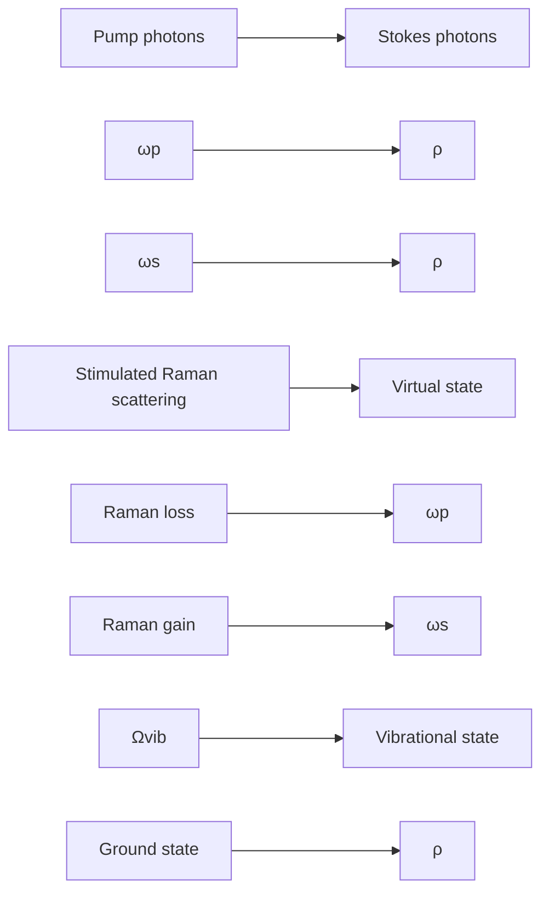
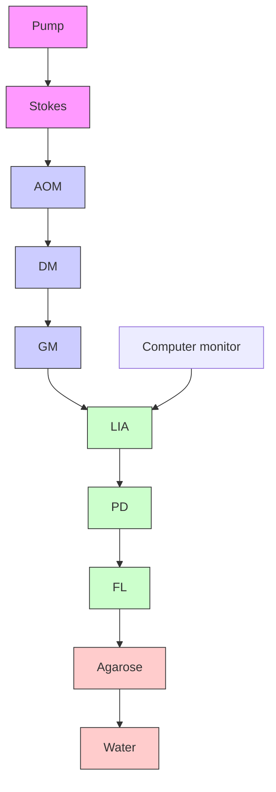

## Biomdcoptics

BiomedicalOptics.SPIEDigitaLibrary.org

# Label-free real-time imaging of myelination in the tadpole by stimulated Raman scattering microscopy

Chun-Rui Hu

Delong Zhang

Mikhail N. Slipchenko

Ji-Xin Cheng

Bing Hu

# Label-free real-time imaging of myelination in the tadpole by   stimulated Raman scattering microscopy

Chun-Rui Hu,a Delong Zhang,b Mikhail N. Slipchenko,c Ji-Xin Cheng,b,c,\* and Bing Hua,\* a University of Science and Technology of China, Hefei National Laboratory for Physical Sciences at Microscale, and the Schoo of Life Sciences, Hefei 230027, China

b Purdue University, Department of Chemistry, West Lafayette, Indiana 47907, United States

c Purdue University, Weldon School of Biomedical Engineering, West Lafayette, Indiana 47907, United States

Abstract. The myelin sheath plays an important role as the axon in the functioning of the neural system, and myelin degradation is a hallmark pathology of multiple sclerosis and spinal cord injury. Electron microscopy, fluorescent microscopy, and magnetic resonance imaging are three major techniques used for myelin visualization. However, microscopic observation of myelin in living organisms remains a challenge. Using a newly developed stimulated Raman scattering microscopy approach, we report noninvasive, label-free, real-time in vivo imaging of myelination by a single-Schwann cell, maturation of a single node of Ranvier, and myelin degradation in the transparent body of the Xenopus laevis tadpole. © 2014 Society of Photo-Optical Instrumentation Engineers (SPIE) [DOI: 10.1117/1.JBO.19.8.086005]

Keywords: stimulated Raman scattering microscopy; Xenopus laevis; myelin sheath; myelination; node of Ranvier.

Paper 140145R received Mar. 16, 2014; revised manuscript received Jul. 9, 2014; accepted for publication Jul. 10, 2014; published online Aug. 7, 2014.

## 1 Introduction

The myelin sheath is responsible for transducing neural signals over long distances, ensuring rapid propagation of action poten tials in a saltatory manner.1,2 Deficient amounts of myelin sheath result in impaired signal transmission and can lead to serious disorders such as multiple sclerosis and lateral sclerosis. Therefore, much effort has been focused on interpreting the mechanisms of myelin sheath functioning and to prevent or treat myelin-related diseases.3–5 Most studies on the myelin sheath have heavily relied on electron microscopy (EM) and laser scanning fluorescence microscopy. Traditionally, EM has been used to reveal the myelin sheath’s ultrastructure,6,7 whereas fluorescence microscopy has been useful in identifying the location and the function of myelin assembly proteins.8 However, observing dynamic behaviors of the myelin sheath and node of Ranvier using these two imaging techniques has been a challenge as these techniques can be mainly used to observe fixed samproteins with intrinsic proteins might interfere with the normal physiological functions and properties of myelin. Magnetic resonance imaging is an excellent tool for diagnosing myelinrelated diseases; however, its resolution is quite limited and is certainly not sufficient for ultrastructural investigation of the myelin sheath.11,12

Coherent anti-Stokes Raman scattering (CARS) imaging avoids the internal ultrastructural deformations caused by exogenous labeling agents, as it recruits chemical bonds to provide imaging contrast.9 Since the myelin sheath is abundant in phosphonolipids, it produces a strong CARS signal that allows labelfree imaging of myelin in its natural tissue environment.13 Since

2005, the CARS microscopy has been employed to characterize the behavior of myelin sheath under different conditions of dis ease and/or injury.14–18 Furthermore, recent work has demonstrated the usefulness of CARS in in vivo imaging for longterm observation and evaluation of the myelin sheath.19,20

Currently, the organisms used for in vivo CARS imaging mainly comprise mammals, like mice and rats. However, since the brain and the spinal cord of mammals are embedded into the skull and vertebra, traumatic surgery has to be performed in order to expose the neural system for imaging. Such surgery inevitably causes stress to the animal and may alter the cellula behavior during the developmental stage. Furthermore, the surgical exposure procedure often induces scar formation, which can impede long-term imaging.21 Taken together, these limitations suggest the need for a new model organism that will allow easy access to the neural system for dynamic and developmental studies of myelin sheath.

Xenopus laevis is a classic animal model that has been use in many investigations of fundamental biological processes, such as signal transduction,22 embryonic development,23 and regenerative medicine.24 One of the unique characteristics of X. laevis tadpoles is their transparency before metamorphosis, making them excellent for in vivo observation of cellular behav iors, especially in the nervous system. By lipofection or electro poration, a single neuron in a X. laevis tadpole can be labeled by a fluorescent protein and, therefore, can be monitored over time without any surgical exposure.25–29 Herein, we report in vivo observations of dynamic behaviors in the nervous system of a living X. laevis tadpole using stimulated Raman scattering (SRS) microscopy. Compared with CARS microscopy, the SRS microscopy is free of a nonresonance background, and the SRS signal has a linear relationship with molecular concentration. 30

\*Address all correspondence to: Ji-Xin Cheng, E-mail: jcheng@purdue.edu; Bing Hu, E-mail: bhu@ustc.edu.cn

0091-3286/2014/\$25.00 © 2014 SPIE

Using in vivo SRS imaging, we were able to monitor the process of myelin sheath formation in a single-Schwann cell, maturation of a node of Ranvier, and degradation of a damaged nerve VII over time.

## 2 Experimental Section

## 2.1 SRS Microscope

ATi:Sapphire laser with 80-MHz repetition rate and 140-fs pulse duration (Chameleon Vision; Coherent, Santa Clara, California) pumped an optical parametric oscillator (Chameleon Compact OPO; Angewandte Physik and Elektronik, Berlin, Germany), providing the pump field at frequency $\omega _ { p }$ and the Stokes field at frequency $\omega _ { S } .$ An acousto-optic modulator (15180-1.06- LTDGAP; Gooch and Housego, Melbourne, Florida) was used to modulate the intensity of the Stokes beam at 7.1 MHz. The two beams were collinearly combined and directed into an upright laser-scanning microscope (FV300 + BX51WI; Olympus, Tokyo, Japan), and a × water immersion objective (XLPlan 25N, : : , Olympus) was used for laser focusing. The forward propagated laser beams were collected by an oil condenser (U-AAC, Olympus, : : ) and directed to a photodiode (S3994, Hamamatsu, Japan). For SRS imaging, we detected the stimulated Raman loss (SRL) signal, where the Stokes beam was blocked by a bandpass filter ( ∕ , Chroma Technolo-825 150 nmgies, Bellows Falls, Vermont). The signal in the pump beam was then amplified with a resonant amplifier10,31 and extracted by a lock-in amplifier (HF2LI, Zurich Instrument, Switzerland). The wavelengths of the pump and Stokes beams were selected to 830 and 1087 nm, respectively, and the frequency difference of 2854 $\mathrm { c m } ^ { - 1 }$ resonated with the symmetric stretch of .

54 cm CH2The SRS signal originates from the interaction of the optical field with the electronic cloud oscillation of chemical bonds. Therefore, SRS microscopy enables us to probe molecule’s chemical bond in cells or tissues and provides us with information regarding their molecular composition.32–35 As illustrated in Fig. 1(a), the pump field $( \omega _ { p } )$ and the Stokes field $( \omega _ { S } )$ excite the molecules from the ground state to the excited vibrational state by passing through a virtual state. When the frequency differences $( \omega _ { p } - \omega _ { S } )$ between the pump and Stoke fields match the vibrational frequency $( \Omega _ { \mathrm { v i b } } )$ of a specific chemical vibbond, the Raman transition is efficiently enhanced by stimulated excitation. The coherent excitation of a molecular vibration results in one photon annihilated in the pump beam and, simultaneously, another photon created in the Stokes beam. These processes are called SRL and stimulated Raman gain, respectively.30 Intensity transfer techniques are usually employed to extract the SRS signal from the intense excitation laser beams with shot-noise limited detection.10,36 By modulating the intensity of the Stokes beam at the megahertz level, the pump beam experiences an intensity loss. The SRL signal can then be extracted and detected by using a lock-in amplifier [Fig. 1(b)].

flowchart

flowchart

Fig. 1 The principle of the stimulated Raman scattering (SRS) process and scheme of the SRS microscope. (a) Energy diagram of the SRS process where the pump photons coincide with the Stokes photons, exciting molecules from the ground state to an excited vibrational state and resulting in one photon being absorbed in the pump beam and one photon being created in the Stokes beam. When the energy difference between pump photons and Stokes photons matches the vibrational frequency $( \Omega _ { v i b } )$ o f a specific chemical bond, the amplification of Raman signals is achieved by stimulated excitation. (b) The experimental scheme of the SRS microscopy for in vivo imaging of live tadpoles. Anesthetized tadpoles were mounted with low temperature gelling agarose and imaged by a single-frequency SRS microscope. AOM: acousto-optic modulator, DM: dichromic mirror, GM: galvo mirror, LIA: lock-in amplifier, PD: photodiode, FL: filter.

## 2.2 In Vivo Tadpole Imaging

Tadpoles around stage 40 were bought from Nasco (Fort Atkinson, Wisconsin) and maintained in a modified rearing sol ution (60-mM NaCl, 0.67-mM KCl, 0.34-mM $\mathrm { C a } ( \mathrm { N O } _ { 3 } ) _ { 2 }$ , 0.83- mM $\mathrm { M g } \mathrm { S O } _ { 4 } ,$ Ca NO3 2, 10-mM HEPES pH 7.4, ∕ gentamycin) with MgSO4 40-mg l0.001% phenylthiocarbamide (Sigma-Aldrich, Missouri) added to prevent melanocyte pigmentation. Tadpoles were raised to about stage 49 and were selected for SRS imaging; all staging was carried out according to a previous report.37

Before imaging, the tadpoles were anesthetized with 0.02% tricane methanesulfonate (Sigma-Aldrich, Missouri) and then transferred to a glass-bottom Petri dish. Low gelling temperature liquid agarose (2%, Sigma-Aldrich, Missouri) was kept in a $3 7 ^ { \circ }$ C water bath, and drops of agarose were poured into the Petri dish to cover the anesthetized tadpole. The appropriate rearing solution with 0.02% tricane methanesulfonate was added into the Petri dish in an attempt to maintain the tadpoles in their opti mal physical condition for SRS imaging. Three-dimensiona (3-D) imaging with μ depth was then performed to encompass the entire morphology of the spinal cord and optic nerve in Fig. 2, the Schwann-like cell in Fig. 3, the node of Ranvier in Fig. 4, and the cranial nerve VII in Fig. 5. The 3-D stacked images were processed by ImageJ (NIH, Bethesda, Maryland). The optical power of pump and Stokes beams on samples are 10 and 40 mW, respectively. As most of the excitation power is carried by a longer wavelength, the photo damage can be minimized to live animals.38

All animal manipulations were conducted in strict accordance with the guidelines and regulations set forth by the University of

Science and Technology of China (USTC) and Purdue University Animal Resources Center and University Animal Care and Use Committee. Furthermore, the protocol was approved by the Committee on the Ethics of Animal Experiments of the USTC (Permit Number: USTCACUC1102012).

## 3 Results and Discussion

## 3.1 SRS Imaging of the Nervous System in Live Tadpoles

We applied SRS microscopy to image myelin and the node of Ranvier in X. laevis tadpoles in vivo. Figure 2(a) shows that th brain and nerves of stage 45 tadpoles were more optically refrac tive than their skin and tissue and that they could be directly observed by the naked eye. After being anesthetized and mounted into agarose, the tadpoles were imaged by a laser scanning SRS microscope [Fig. 1(b)]. Also, as shown in Fig. 2(c), we were able to clearly resolve the cellular architectures in the optic tectum in which the strong SRS signal may be produced by abundant $\mathrm { C H } _ { 2 }$ bonds of phospholipids in the cell membrane and 2CH vibrations of proteins and polysaccharides in the extracellular matrix. Myelin sheaths are highly compacted cell membranes with their major component being phosphonolipids. Therefore, using SRS allowed us to image myelin sheaths in the optic nerve and the spinal cord by $\mathrm { C H } _ { 2 }$ symmetric stretching. CH2As shown in Fig. 2(e), the 3-D overlapped SRS image delineated lateral myelin sheaths wrapping on axons in the spinal cord of a stage 49 tadpole. As they contain much less bonds than CH2myelin, axons were not detectable due to their comparative signal level with background. We electroporated several retinal ganglion cells of a tadpole at stage 50 with the fluorescent protein mCherry to label axons in the optic nerve. SRS imaging showed two myelin segments in the optic nerve [Fig. 2(f)], and the two photon fluorescence (TPF) imaging overlaid with SRS imaging showed that one labeled axon was ensheathed by myelin [Fig. 2(g), dash line]. Therefore, using colocalization of SRS and TPF, we were able to demonstrate that the SRS signal was being elicited from the myelin and not from the axons.

Stage 45  

text_image

(a)
mouth
Brain
Eye
Optic nerve
Internal
organs
1 mm

natural_image

Microscopic view of biological tissue with a red box highlighting a region, scale bar indicates 1 mm (no text or symbols present)

natural_image

Microscopic image showing green fluorescent structures with a 30 μm scale bar (no text or symbols beyond label)

natural_image

Microscopic view of a material cross-section with a 2 mm scale bar, showing grain structure and a red box highlighting a specific region (no text or symbols beyond label)

natural_image

Microscopic image of layered material structure with 10 μm scale bar (no text or symbols)

natural_image

Microscopic image showing layered material structure with red dashed boundary lines and 10 μm scale bar (no text or symbols beyond labels)

natural_image

Fluorescence microscopy image showing red and green cellular structures with a 10 μm scale bar (no text or symbols beyond label)

Fig. 2 The transparent characteristic of X. laevis tadpoles ensures label-free, noninvasive SRS imaging of the nervous system. (a) X. laevis tadpoles at stage 45; the neural system can be directly seen by the naked eye. (b) The optic tectum of a stage 49 tadpole was optically imaged; and the red rectangle area was imaged by SRS microscopy shown in (c). (c) SRS imaging showing the membrane of single neurons in the optic tectum. (d) The spinal cord of a stage 49 tadpole was optically imaged; and the red rectangle area was imaged by SRS microscopy shown in (e). (e) SRS imaging of myelin sheath in the spinal cord. (f) SRS imaging of myelin sheath in the optic nerve. (g) Overlaid SRS (red) and two photon fluorescence imaging (green) showing the myelin membrane wrapping on a single axon.

  
Fig. 3 In vivo SRS imaging of myelination in a Schwann cell. A Schwann-like cell in a branch of the trochlear nerve interacting with two axons was imaged by the SRS microscope. From 6 to 9 h, it can be seen that a new myelin segment presented in the process of the Schwann cell (indicated by the arrow).

## 3.2 In Vivo Imaging of Myelination in a Schwann Cell

Myelination is an essential developmental process in which multiple layers of the myelin membrane from glial cells gradu ally wrap on axons, devoting the functionality of myelin to neural signal transduction.39–41 By using SRS microscopy, we observed the appearance of a thin myelin sheath in the process of one Schwann cell. As shown in Fig. 3, this Schwann-like cell was observed in a small branch of the trochlear nerve. Further more, the nucleus and the nucleolus were clearly visualized by 3-D overlapping of SRS images. There were two axons along the process of the cell: one axon had a clear node of Ranvier, whereas the other axon was partly wrapped on the process. At the beginning of imaging, the cytoplasm of the cell produced a strong SRS signal that gradually decreased over time, and, from 4 to 9 h, some small granules showed up. These granules might be the organelles like endoplasmic reticulum, Golgi apparatus, and endosomes, which respond to proteins and lipids synthesis, sorting, and transportation during myelination.42–4 4 At 6 to 9 h, we were able to observe a weak signal in the cell process, which represented a newly synthesized myelin segment (indicated by an arrow). The decrease in the SRS signal produced by $\mathrm { C H } _ { 2 }$ in the cytoplasm might have resulted from lipid consumption of the multilayered cell membrane winding the axon. We believe that there were three axons in this axon bundle and that the cell imaged here was a Schwann cell. More specifically, we think that the cell process was wrapping on the third axon to form a myelin segment.

As there are several limitations of labeling and imaging tech niques, some of which we have already discussed, it has been difficult to visualize the dynamic process of myelination in living animals. The observation of in vivo time-lapse imaging in transgenic zebrafish has indicated that the spacing of oligoden drocytes along axons is regulated by a repulsive cell–cell inter action of oligodendrocytes;45 moreover, the myelin formation by oligodendrocytes is restricted to about 5 h in the zebrafish.46 Here, by using label-free SRS microscopy and transparent X. laevis tadpole, we have observed the formation of one myelin segment in the process of Schwann cells without exogenou fluorescent protein incorporation.

## 3.3 In Vivo Imaging to Monitor the Development of a Single Node of Ranvier

During myelination, the gap between accompanying myelin segments develops into a node of Ranvier. The maturation of a node of Ranvier is essential for the saltatory conduction of action potentials along myelinated axons. Due to their crucial role in signal transduction, the molecular mechanisms underly ing the formation of nodes of Ranvier have been extensively studied,47–50 and some hypotheses and models have been suggested and discussed.51–53 However, the inability to observe nodes of Ranvier in real time has greatly limited our knowledge on the mechanisms of their dynamic formation. By using a SRS microscope, we were able to observe the developmental behavior of a node of Ranvier in a stage 49 tadpole in real time.

For imaging, we selected the trochlear nerve in order to visualize individual nodes of Ranvier on a single axon or two bundles of axons. We chose the trochlear nerve since it is the smallest of all cranial nerves, contains a few numbers of axons, and can be easily imaged as it exists on the superficial layer of the X. laevis brain. As shown in Fig. 4(a), a 3-D stacked SRS image clearly presents a typical myelin structure in which two adjacent myelin segments are separated by a node of Ranvier. In the internodal area, the SRS signal from the CH2vibration delineates the parallel multiple layers of myelin membranes around the axon. At the paranodal region, the diameter of the myelin sheath can be visually confirmed as decreasing. Furthermore, no SRS signal is detectable from the nodal region, as the node only consists of axon with no myelin membrane. We monitored the node of Ranvier over 6 h and observed no obvious changes during imaging, except for a small reshaping of the myelin sheath. The length of the node was found to be consistent over time. Considering these findings, we believe that the lack of change over time indicates that this node of Ranvier was mature. In Fig. 4(b), the SRS image at 0 min shows two contiguou myelin segments with an atypical node of Ranvier. This node was determined to be atypical because it did not have a clear node comprising a naked axon without myelin ensheathment. At 0 and 20 min, a clear conjunction can be visualized in the middle of the axon where the two segments of myelin sheath closely contact, rather than separate with each other. At 40 min, the two myelin segments initiated separation in the opposite direction, with the conjunction stretching and two heminodes beginning to emerge. At 90 min, the stretching induced a gap between the heminodes and after 320 min, the two myelin segments had completely separated. Compared with our observation of the mature node of Ranvier in Fig. 4(a), we think that the node depicted in Fig. 4(b) was immature, and the imaging series reveals a new node formation.

text_image

(a)
0 min
20 min
35 min
65 min
80 min
135 min
150 min
205 min
250 min
310 min
370 min

text_image

(b)
0 min
20 min
40 min
90 min
320 min
410 min
500 min
590 min
680 min
770 min
860 min
5 µm

Fig. 4 In vivo SRS imaging of the formation of a node of Ranvier. (a) A node of Ranvier in a single axon in the trochlear nerve. Under initial observation and through to 6 h, the morphology of the node of Ranvier showed little change. (b) At 0 to 20 min, the cell membranes of two adjacent Schwann cells can be seen contacting each other to form a contractive junction. At 40 min, the two myelin segments can be visualized as having retracted and formed a gap (red arrow). At 90 min, the gap is clear. After 90 min, it can be seen that the gap finally developed into a relatively mature node. I: internode, P: paranode, and N: node.

Until now, the understanding of how nodes of Ranvier form was that nodes act as a barrier to prevent the movement of flank ing paranodal domains into the nodal area.53 Here, based on in vivo observation, we found that the paranodal domains indeed invaded into nodal domains; however, paranodal domains sub sequently retracted from the nodal area, leaving the naked axonal plasma. Based on these findings, we propose the following hypothesis of node formation in the periphery nervous system: during myelination, the membrane of Schwann cells gradually wraps along an axon, and the pressure of this winding drives the membrane to spread along the axon. After the edge of the membrane of two adjacent myelin segments contact together, the closely contiguous myelin segments begin to retract in oppositional directions, leaving the naked axonal plasma between myelin membranes. The full functionality of the node then relies on the anchoring and clustering of sodium and potassium ion channel proteins.

## 3.4 In Vivo Imaging of Myelin Degradation after Nerve Transection

Demyelination is a process of myelin protein and membrane destruction around neuronal axons. The damaged myelin sheath impairs the conduction of a neural signal, which can cause defi ciencies in sensation, movement, cognition, or other functions depending on which nerves are involved.54,55 Demyelination has been extensively studied, and many animal models have been generated to understand the basic cellular and molecular mechanisms that underlie this process.56 This line of research is very important since once we determine these mechanisms, we might be able to devise a way to promote remyelination.5,57 In the current study, we used SRS microscopy to observe myelin degradation in X. laevis tadpoles.

A branch of the nerve derived from the cranial nerve VII wa selected and transected by a needle. The degradation process of the myelin sheath was then monitored by 3-D in vivo imaging. As shown in Fig. 5(a), before the transection, the parallel myelin membranes around axons compacted and interlaced with each other, constructing a bundle of nerves. At 5 min after damage, the myelin sheaths around the axons were found to be disrupted due to the stretch induced by the mechanical force. In Fig. 5(b), the nerve looked loose and blurry with no obvious parallel myelin structure. Some remaining myelin membrane looked swollen (yellow arrows) or twisted (red arrows), and there were several vacuoles [blue arrows in Figs. 5(b)–5(e)] that we believed to be the cross-section of the transected end of the damaged axons. After 1 to 3 h, some typical and parallel myelin membranes appeared [green arrows in Figs. 5(d) and 5(e)], which had recovered from the mechanical damage. Interestingly, the damaged axon tips showed different morphology between the distal and proximal ends. At the proximal end, the injured myelin showed some vacuole structures [Fig. 5(e), blue arrow]; however, these vacuoles were not observed at the distal end. Instead, the distal end displayed several open tubes, which tended to close [Fig. 5(e), blue arrowhead]. Moreover, we observed a macrophage that had migrated to the distal end [Fig. 5(e), red asterisk], and this area of the damaged nerve began to degrade at 4 h [Fig. 5(f)]. At the distal end of the nerve, the recovered parallel myelin membranes then became diffused and blurred, and some myelin debris was generated at the damaged area [Fig. 5(f), red arrows]. Over the next

(a)  
Proximal end  
  
Distal end

(b)  

text_image

5 min after cut
1
2
3
4
5

(c)  

natural_image

Medical imaging scan showing tissue structures with a highlighted region and '1 hours after cut' annotation (no readable text or symbols beyond annotations)

(d)  

text_image

2 hours after cut
1
2

(e)  

text_image

3 hours after cut
1
2
3
4

(f)  

text_image

4 hours after cut
1
2

(g)  

text_image

15 hours after cut
1
2
3
4

(h)  

natural_image

Microscopic images showing cellular structures before and after a 17-hour cut, with scale bar indicating 20 μm (no text or symbols beyond labels)

  
Fig. 5 In vivo SRS imaging of myelin sheath degradation of a peripheral nerve after transection. (a) A branch of cranial nerve VII imaged before cutting. (b) The myelin sheath following disruption, losing its parallel structure 5 min after the cut. (c and d) 1 and 2 h after the cut, the damaged myelin can be seen to have slightly recovered. (e) Macrophages then migrated to the damaged region (red asterisk). (f) Myelin degradation starting at the distal end. (g) Myelin debris forming at both distal and proximal ends (red arrows). (h) Macrophages clearing up the myelin debris (red asterisk), and some myelin sheath is surviving following degradation (green arrows). For a better view of SRS images in the left panel, we enlarged the green rectangles about 50% to 100% in the right panel.

15 h, more myelin debris appeared [Fig. 5(g), red arrows] and at 17 h, more macrophages [Fig. 5(h), red asterisks] migrated to the damaged nerve to clear up the myelin debris. At this time point, the distal end had totally degraded without any myelin structure left, whereas the proximal end exhibited some intact myelin sheaths that had survived the degradation [Fig. 5(h), green arrows].

X. laevis tadpole has a robust capability to remyelinate, both in the central and the peripheral nervous systems; therefore, thi animal has been used as a model for investigating demyelinating diseases.58 Studying remyelination mechanisms in lower animals will provide a better understanding of why remyelination fails in higher animals. Furthermore, these studies might help devise potential methods to promote remyelination.59 Compared with mice and rats, X. laevis are easy to maintain/breed, and the aquatic characteristics of the tadpole makes it a suitable model for drug screening .60–62 Label-free imaging of the myelin sheath by SRS microscopy provides a flexible and highly efficient tool to assess the properties and functionality of the myelin sheath. Therefore, the combination of X. laevis tadpoles and SRS microscopy may provide us with an excellent drug-screening platform for therapies aimed to target demyelinating diseases.

## 4 Conclusions

In the current study, we demonstrated a technique for visualizing the dynamic behavior of myelin in vivo and without surgery using a SRS microscopy with a X. laevis tadpole. The myeli formation by a Schwann cell, maturation of a single node of Ranvier, and degradation of myelin sheaths were all observed in vivo by imaging the symmetric stretching of bonds in CH2myelin membranes. Compared with the traditional rodent model of demyelinating diseases, the X. laevis tadpole, a newly emerged model for demyelination and remyelination research, has many advantages: (1) The transparent body of X. laevis tadpoles enable direct assessment of the myelin sheath without the need for any stressful surgery; (2) The robust remyelinating capability of the X. laevis tadpole provides a model for the exploration of why humans have a low remyelinating capability. Moreover, genetically and immunologically determining the differences between species in remyelinating ability might provide a strategy to improve remyelination in humans; (3) Low breeding cost and the aquatic characteristic of the X. laevis tadpole make them a potentially suitable model for drug screening.

In conclusion, we have demonstrated the application of label free SRS imaging as a new platform for the study of myelination and demyelination. By using the X. laevis tadpole, we were able to observe the developmental behaviors of myelin, nodes of Ranvier, and the demyelinating processes. The application of SRS microscopy for myelin imaging will prove invaluable in evaluating demyelination, remyelination, and drug-screening systems. Further, the SRS microscopy was confirmed having the same ability as H&E histology to identify and classify the different types of tumor-infiltrated brains in human glioblastoma multiforme xenograft mice; the SRS microscopy was demonstrated to monitor the tumor lesion residues during a brain tumor surgery of a mouse.34 Therefore, we could prospect SRS microscopy might have a possible clinical application to provide realtime assessment of the histoarchitecture of tissues during a human brain tumor resections in the future 63

## Acknowledgments

This work was supported by R21GM104681 and R21EB105901 to JXC, 973 MOST grant (No. 2011CB504402) and NSFC U1332136, 31070950 to BH.

## References

1. S. Aggarwal, L. Yurlova, and M. Simons, “Central nervous system myelin: structure, synthesis and assembly,” Trends Cell Biol. 21(10), 585–593 (2011).  
2. D. K. Hartline and D. R. Colman, “Rapid conduction and the evolution of giant axons and myelinated fibers,” Curr. Biol. CB 17(1), R29–35 (2007).  
3. E. Bible, “Multiple sclerosis: drug-enhanced remyelination in a multiple sclerosis model,” Nat. Rev. Neurol. 9(12), 660 (2013).  
4. R. J. Franklin, “Why does remyelination fail in multiple sclerosis?,” Nat. Rev. Neurosci. 3(9), 705–714 (2002).  
5. R. J. Franklin and C. Ffrench-Constant, “Remyelination in the CNS: from biology to therapy,” Nat. Rev. Neurosci. 9(11), 839–855 (2008).  
6. H. Fernandez-Moran, “Electron microscope examination of the myelin sheath and axial cylinder in the internodal section of neural fibers,” Experientia 6(9), 339–342 (1950).  
7. A. Hirano and H. M. Dembitzer, “A structural analysis of the myelin sheath in the central nervous system,” J. Cell Biol. 34(2), 555–567 (1967).  
8. W. Yin and B. Hu, “Knockdown of Lingo1b protein promotes myelination and oligodendrocyte differentiation in zebrafish,” Exp. Neurol. 251, 72–83 (2014).  
9. C. L. Evans and X. S. Xie, “Coherent anti-Stokes Raman scattering microscopy: chemical imaging for biology and medicine,” Ann. Rev. Anal. Chem. 1, 883–909 (2008).  
10. W. Min et al., “Coherent nonlinear optical imaging: beyond fluorescence microscopy,” Annu. Rev. Phys. Chem. 62, 507–530 (2011).  
11. R. Bakshi et al., “MRI in multiple sclerosis: current status and future prospects,” Lancet Neurol. 7(7), 615–625 (2008).  
12. A. Ceccarelli, R. Bakshi, and M. Neema, “MRI in multiple sclerosis: a review of the current literature,” Curr. Opin. Neurol. 25(4), 402–409 (2012).  
13. H. Wang et al., “Coherent anti-Stokes Raman scattering imaging of axonal myelin in live spinal tissues,” Biophys. J. 89(1), 581–591 (2005).  
14. J. Imitola et al., “Multimodal coherent anti-Stokes Raman scattering microscopy reveals microglia-associated myelin and axonal dysfunction in multiple sclerosis-like lesions in mice,” J. Biomed. Opt. 16(2), 021109 (2011).  
15. K. W. Poon et al., “Investigation of human multiple sclerosis lesions using high resolution spectrally unmixed CARS microscopy,” Proc. SPIE 8565, 85654V (2013).  
16. Y. Fu et al., “Paranodal myelin retraction in relapsing experimental auto immune encephalomyelitis visualized by coherent anti-Stokes Raman scattering microscopy,” J. Biomed. Opt. 16(10), 106006 (2011).  
17. Y. Fu et al., “Coherent anti-Stokes Raman scattering imaging of myelin degradation reveals a calcium-dependent pathway in lyso-PtdCho-induced demyelination,” J. Neurosci. Res. 85(13), 2870–2881 (2007).  
18. T. B. Huff et al., “Real-time CARS imaging reveals a calpain-dependent pathway for paranodal myelin retraction during high-frequency stimulation,” PLoS One 6(3), e17176 (2011).  
19. E. Belanger et al., “In vivo evaluation of demyelination and remyelina tion in a nerve crush injury model,” Biomed. Opt. Express 2(9), 2698–2708 (2011).  
20. Y. Shi et al., “Longitudinal in vivo coherent anti-Stokes Raman scattering imaging of demyelination and remyelination in injured spinal cord,” J. Biomed. Opt. 16(10), 106012 (2011).  
21. M. J. Farrar et al., “Chronic in vivo imaging in the mouse spinal cord using an implanted chamber,” Nat. Methods 9(3), 297–302 (2012).  
22. R. F. Crane and J. V. Ruderman, “Using Xenopus oocyte extracts to study signal transduction,” in Xenopus Protocols, pp. 435–443, Springer, Totowa, New Jersey (2006).  
23. I. B. Dawid and T. D. Sargent, “Xenopus laevis in developmental and molecular biology,” Science 240(4858), 1443–1448 (1988).  
24. A. S. Viczian et al., “Generation of functional eyes from pluripotent cells,” PLoS Biol. 7(8), e1000174 (2009).  
25. B. Alsina, T. Vu, and S. Cohen-Cory, “Visualizing synapse formation in arborizing optic axons in vivo: dynamics and modulation by BDNF,” Nat. Neurosci. 4(11), 1093–1101 (2001).  
26. B. Hu, A. M. Nikolakopoulou, and S. Cohen-Cory, “BDNF stabilizes synapses and maintains the structural complexity of optic axons in vivo,” Development 132(19), 4285–4298 (2005).  
27. S. Cohen-Cory, “Imaging retinotectal synaptic connectivity,” CSH Protocols 2007, pdb prot4782 (2007).  
28. W. Dong and C. D. Aizenman, “A competition-based mechanism mediates developmental refinement of tectal neuron receptive fields,” J. Neurosci. 32(47), 16872–16879 (2012).  
29. C. Takagi et al., “Transgenic Xenopus laevis for live imaging in cell and developmental biology,” Dev. Growth Differ. 55(4), 422–433 (2013).  
30. C. W. Freudiger et al., “Label-free biomedical imaging with high sensitivity by stimulated Raman scattering microscopy,” Science 322(5909), 1857–1861 (2008).  
31. M. N. Slipchenko et al., “Heterodyne detected nonlinear optical imaging in a lock‐in free manner,” J. Biophotonics 5(10), 801–807 (2012).  
32. P. Wang et al., “Label-free quantitative imaging of cholesterol in intact tissues by hyperspectral stimulated Raman scattering microscopy,” Angew. Chem. 52(49), 13042–13046 (2013).  
33. L. Wei et al., “Vibrational imaging of newly synthesized proteins in live cells by stimulated Raman scattering microscopy,” Proc. Natl. Acad. Sci. U. S. A. 110(28), 11226–11231 (2013).  
34. M. Ji et al., “Rapid, label-free detection of brain tumors with stimulated Raman scattering microscopy,” Sci. Transl. Med. 5(201), 201ra119 (2013).  
35. C. R. Hu et al., “Stimulated Raman scattering imaging by continuouswave laser excitation,” Opt. Lett. 38(9), 1479–1481 (2013).  
36. D. Zhang, M. N. Slipchenko, and J. X. Cheng, “Highly sensitive vibrational imaging by femtosecond pulse stimulated Raman loss,” J. Phys. Chem. Lett. 2(11), 1248–1253 (2011).  
37. P. Nieuwkdop and J. Faber, Normal table of Xenopus laevis (Daudin), North Holland Publishing Company, Amsterdam, Netherlands (1956).  
38. D. Zhang, M. N. Sipchenko, and J. X. Cheng, “Highly sensitive vibrational imaging by femtosecond pulse stimulated Raman loss,” J. Phys. Chem. Lett. 2(11), 1248–1253 (2011).  
39. D. L. Sherman and P. J. Brophy, “Mechanisms of axon ensheathment and myelin growth,” Nat. Rev. Neurosci. 6(9), 683–690 (2005).  
40. M. Simons and J. Trotter, “Wrapping it up: the cell biology of myeli nation,” Curr. Opin. Neurobiol. 17(5), 533–540 (2007).  
41. N. Snaidero et al., “Myelin membrane wrapping of CNS axons by PI(3,4,5)P3-dependent polarized growth at the inner tongue,” Cell 156(1–2), 277–290 (2014).  
42. M. Anitei and S. E. Pfeiffer, “Myelin biogenesis: sorting out protein trafficking,” Curr. Biol.: CB 16(11), R418–421 (2006).  
43. T. Kim and S. E. Pfeiffer, “Glycosphingolipid-cholesterol-enriched microdomains in sorting and signaling during myelin biogenesis,” J. Neurochem. 72(Suppl 1), S45 (1999).  
44. J. Trotter et al., “Assembly of myelin by association of proteolipid pro tein with cholesterol- and galactosylceramide-rich membrane domains,” J. Cell Biol. 151(1), 143–154 (2000).  
45. B. B. Kirby et al., “In vivo time-lapse imaging shows dynamic oligo dendrocyte progenitor behavior during zebrafish development,” Nat. Neurosci. 9(12), 1506–1511 (2006).  
46. T. Czopka, C. Ffrench-Constant, and D. A. Lyons, “Individual oligodendrocytes have only a few hours in which to generate new myelin sheaths in vivo,” Dev. Cell 25(6), 599–609 (2013).  
47. S. Poliak and E. Peles, “The local differentiation of myelinated axons at nodes of Ranvier,” Nat. Rev. Neurosci. 4(12), 968–980 (2003).  
48. E. Peles and J. L. Salzer, “Molecular domains of myelinated axons,” Curr. Opin. Neurobiol. 10(5), 558–565 (2000).  
49. K. Kazarinova-Noyes and P. Shrager, “Molecular constituents of the node of Ranvier,” Mol. Neurobiol. 26(2–3), 167–182 (2002).  
50. K. Susuki and M. N. Rasband, “Molecular mechanisms of node of Ranvier formation,” Curr. Opin. Cell Biol. 20(6), 616–623 (2008).  
51. Y. Zhang et al., “Assembly and maintenance of nodes of Ranvier rely on distinct sources of proteins and targeting mechanisms,” Neuron 73(1), 92–107 (2012).  
52. Y. Eshed-Eisenbach and E. Peles, “The making of a node: a co-production of neurons and glia,” Curr. Opin. Neurobiol. 23(6), 1049–1056 (2013).  
53. C. Thaxton et al., “Nodes of Ranvier act as barriers to restrict invasion of flanking paranodal domains in myelinated axons,” Neuron 69(2), 244–257 (2011).  
54. C. Confavreux and J. M. Leger, “Central nervous system demyelinating diseases: an overview,” Presse Med. 39(3), 339–340 (2010).  
55. R. H. Miller and S. Mi, “Dissecting demyelination,” Nat. Neurosci. 10(11), 1351–1354 (2007).  
56. A. van der Goes and C. D. Dijkstra, “Models for demyelination,” Prog. Brain Res. 132, 149–163 (2001).  
57. S. P. J. Fancy et al., “Myelin regeneration: a recapitulation of develop ment?,” Ann. Rev. Neurosci. 34, 21–43 (2011).  
58. F. Kaya et al., “Live imaging of targeted cell ablation in Xenopus: a new model to study demyelination and repair,” J. Neurosci.: Off. J. Soc. Neurosci. 32(37), 12885–12895 (2012).  
59. M. Dubois-Dalcq et al., “From fish to man: understanding endogenous remyelination in central nervous system demyelinating diseases,” Brain: a J. Neurol. 131(7), 1686–1700 (2008).  
60. T. Kvist, K. B. Hansen, and H. Brauner-Osborne, “The use of Xenopus oocytes in drug screening,” Expert Opin. Drug Discovery 6(2), 141–153 (2011).  
61. M. L. Tomlinson, A. E. Hendry, and G. N. Wheeler, “Chemical genetics and drug discovery in Xenopus,” Methods in Mol. Biol. 917, 155–166 (2012).  
62. R. E. Kalin et al., “An in vivo chemical library screen in Xenopus tadpoles reveals novel pathways involved in angiogenesis and lymphangiogenesis,” Blood 114(5), 1110–1122 (2009).  
63. J. N. Bentley et al., “Real-time image guidance for brain tumor surgery through stimulated Raman scattering microscopy,” Expert Rev. Anticancer Ther. 14(4), 359–361 (2014).

Chun-Rui Hu received his PhD from the University of Science and Technology of China. He worked in the Department of Biomedical Engineering at Purdue University as a visiting scholar from November 2011 to November 2013. His research interests include in vivo nonlinear optical imaging in small animals.

Delong Zhang received his PhD degree in analytical chemistry at Purdue University, and he is currently working as postdoctorate at Department of Biomedical Engineering of Purdue University. His research focuses on multimodal nonlinear optical imaging and spectroscopy.

Mikhail N. Slipchenko is currently a research scientist at Department of Biomedical Engineering, Purdue University. He obtained his PhD in chemistry from University of Southern California. His research expertise includes nonlinear and linear spectroscopy and optical microscopy. He focuses on the development of linear and non-linear optical tools for chemical imaging.

Ji-Xin Cheng received a BS degree and a PhD degree in the Department of Chemical Physics from University of Science and Technology of China in 1994 and 1998, respectively. He is currently a full professor at Weldon School of Biomedical Engineering at Purdue University. His research lab develops label-free optical imaging tools and nanotechnologies for challenging applications in biomedicine such as early detection of tumor spread and early nerve repair after traumatic spinal cord injury.

Bing Hu, PhD, is now a professor at the Department of Neurobiology and Biophysics, School of Life Sciences, University of Science and Technology of China. His research interests include in vivo imaging of myelin and synapse using zebrafish and xenopus.