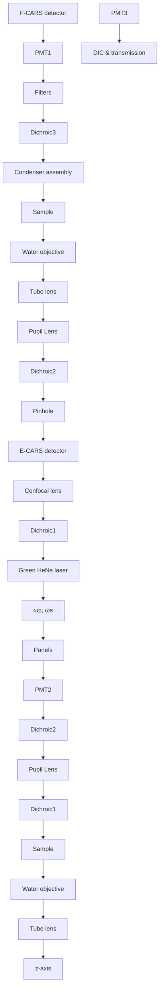

# Laser-Scanning Coherent Anti-Stokes Raman Scattering Microscopy and Applications to Cell Biology

Ji-Xin Cheng,\* Y. Kevin Jia,† Gengfeng Zheng,\* and X. Sunney Xie\*

\*Department of Chemistry and Chemical Biology, Harvard University, Cambridge, Massachusetts 02138, and † SEG, Olympus America Inc., Melville, New York 11747-3157 USA

ABSTRACT Laser-scanning coherent anti-Stokes Raman scattering (CARS) microscopy with fast data acquisition and high sensitivity has been developed for vibrational imaging of live cells. High three-dimensional (3D) resolution is achieved with two collinearly overlapped near infrared picosecond beams and a water objective with a high numerical aperture. Forwarddetected CARS (F-CARS) and epi-detected CARS (E-CARS) images are recorded simultaneously. F-CARS is used for visualizing features comparable to or larger than the excitation wavelength, while E-CARS allows detection of smaller features with a high contrast. F-CARS and E-CARS images of live and unstained cells reveal details invisible in differential interferencecontrast images. High-speed vibrational imaging of unstained cells undergoing mitosis and apoptosis has been carried out. For live NIH 3T3 cells in metaphase, 3D distribution of chromosomes is mapped at the frequency of the DNA backbone Raman band, while the vesicles surrounding the nucleus is imaged by E-CARS at the frequency of the C-H stretching Raman band. Apoptosis in NIH 3T3 cells is monitored using the CARS signal from aliphatic C-H stretching vibration.

## INTRODUCTION

Optical microscopy is an indispensable tool for cell biology. Phase-contrast and differential interference-contrast (DIC) microscopy are commonly used for observation of live, unstained cells, but they are lacking of chemical specificity and high depth resolution. Confocal fluorescence and multiphoton fluorescence microscopy permit 3D imaging of different cellular organelles or specific molecules. However, cells need to be labeled with fluorescent probes, which are prone to photobleaching and perturbations to cell functions. Vibrational microscopy provides a direct way of imaging unstained live cells with chemical selectivity. Recently, coherent anti-Stokes Raman scattering (CARS) microscopy has attracted a lot of interest as a new technique for vibrational imaging. CARS is a third-order nonlinear optical process that involves a pump beam at a frequency of $\omega _ { \mathrm { p } } ,$ a Stokes beam at a frequency of $\omega _ { \mathrm { s } } ,$ and a signal at the anti-Stokes frequency of $2 \omega _ { \mathrm { p } } \mathrm { ~ - ~ } \omega _ { \mathrm { s } }$ generated in the phase matching direction. The vibrational contrast in CARS microscopy is created when the frequency difference $( \omega _ { \mathrm { p } } \mathrm { ~ - ~ }$ $\omega _ { \mathrm { s } } )$ between the pump and the Stokes beams is tuned to be resonant with a Raman-active molecular vibration. CARS possesses a higher sensitivity than Raman microscopy because the coherent CARS radiations produce a large and directional signal. This leads to a lower average excitation power and consequently less photodamage to cells. Moreover, the nonlinear excitation intensity dependence of

CARS provides inherent 3D sectioning capability, similar to multiphoton fluorescence microscopy (Denk et al., 1990).

Duncan et al. constructed the first CARS microscope by use of two dye laser beams with a noncollinear beam geometry (Duncan et al., 1982). Recently, Zumbush and colleagues revived CARS microscopy by focusing a pair of collinearly overlapped near infrared femtosecond laser beams with an objective lens of high numerical aperture (NA) (Zumbusch et al., 1999). Under the tight focusing condition, the phase matching condition of CARS is satisfied in the collinear beam geometry (Bjorklund, 1975) which facilitates experimental implementation and provides superior image quality compared to the non-collinear beam geometry (Duncan et al., 1982; Mu¨ller et al., 2000). The tight focusing by a high NA objective lens also improves the spatial resolution.

The major drawback of CARS is the existence of a non-resonant background that arises from the electronic contributions even in the absence of vibrational resonance (Maeda et al., 1988). With visible dye lasers, the vibrational contrast was seriously limited by two-photon enhanced nonresonant background (Duncan et al., 1985). The use of near infrared excitation, away from two-photon resonance, avoided this problem and improved the sensitivity (Zumbusch et al., 1999). Further improvement of the signal to background ratio was achieved by using two near infrared picosecond pulse trains of which the spectral width matches the Raman line width (Cheng et al., 2001b). In forwarddetected CARS (F-CARS) microscopy, the image contrast is limited by the background from the solvent (e.g., water). Recently, it has been shown that epi-detected (backwarddetected) CARS (E-CARS) microscopy greatly improves the image contrast via an effective rejection of the solvent background (Volkmer et al., 2001; Cheng et al., 2001b). Further, it has been demonstrated that polarization CARS microscopy efficiently suppresses the non-resonant background from both the scatterer and the solvent and allows vibrational mapping of global protein distribution in a living cell based on the contrast from the amid I band (Cheng et al., 2001a).

For CARS microscopy implemented with a sample-scanning scheme, the data collection speed was principally limited by the slow scanning, and also by the low photoncounting rate that needs to be kept below 5% of the laser repetition rate (Zumbusch et al., 1999). The acquisition time for each pixel is about several milliseconds, thus a whole image of $5 1 2 \times 5 1 2$ pixels usually requires more than 10 min. Such data acquisition time is too long for monitoring dynamical processes in living cells. In this paper, we demonstrate high-sensitivity, high-speed CARS imaging of unstained cells by scanning two collinearly combined laser beams. Two near infrared picosecond laser pulse trains were used to generate the CARS signal, as in the previous work (Cheng et al., 2001b). However, the data acquisition time is shortened by two orders of magnitude by virtue of fast scanning of laser beams at a high repetition rate and analog detection.

Mitosis and apoptosis are two important processes that undergo characteristic morphological changes, which have been studied by phase-contrast, DIC, and fluorescence microscopy. Mitosis of a mammalian cell usually completes within 1 h, while for apoptosis, dramatic morphological change occurs in several minutes in the early stage (Wyllie et al., 1980). Our results show that laser-scanning CARS microscopy is capable of high-speed vibrational imaging of mitosis and apoptosis in unstained cells. NIH 3T3 fibroblasts were used as an example.

## MATERIALS AND METHODS

## Laser-scanning CARS microscope

A schematic of our laser-scanning CARS microscope is shown in Fig. 1. It is modified from a confocal fluorescence microscope (model FV300/IX70, Olympus American Inc., Melville, NY). A pump and a Stokes beam are collinearly combined and directed to a dichroic excitation/emission beam splitter in FV300. A pupil transform lens and a microscope tube lens enlarge the beam diameter so that it matches the back aperture of the water objective lens with a numerical aperture (NA) of 1.2 (UPIANAPO, 60X, Olympus American Inc.). A pair of galvanometer mirrors controls the scanning of the beams in the x-y plane. The depth scanning is achieved by moving the water objective with a stepping motor. It should be mentioned that the wavelength difference between the two laser beams introduces an optical aberration, which affects the overlap of the two foci during the lateral scanning and thus determines the field of view. The diameter of the field of view is 120 m when $\omega _ { \mathrm { p } } - \omega _ { \mathrm { s } } = 2 8 7 0 \mathrm { c m } ^ { - 1 }$ and is larger than 200 m when $\omega _ { \mathrm { p } } \mathrm { ~ - ~ } \omega _ { \mathrm { s } } = 1 0 9 0 \mathrm { ~ c m } ^ { - 1 }$

As CARS is a coherent process, its radiation pattern, unlike that of fluorescence, is not uniform in all directions. As illustrated in Fig. 2, the far-field radiation pattern of CARS is dependent on not only the size, but also the shape of a scatterer, as a consequence of the coherent addition of the signal field from each induced dipole inside a sample (Cheng et al., 2002). The radiation from a single Hertzian dipole along the x axis is symmetrical in both forward (z) and backward (-z) directions (Fig. 2 A). The coherent superposition of the radiation fields from an ensemble of dipoles in the x-y plane exhibits a narrow but still symmetrical pattern in both directions $( \operatorname { F i g } . 2 B )$ . The coherent addition of the radiation fields from an ensemble of dipoles lined up along the z axis builds a large signal in the forward direction because of the constructive interference, and a weak signal in the backward direction because of the destructive interference (Fig. 2 C). For a large scatterer centered at the focus or a bulk medium, the coherent addition in three dimensions builds a sharp and directional forward-going signal (Fig. 2 D). Thus, forward detection is suitable for imaging objects with an axial length comparable to or larger than the excitation wavelength. On the other hand, epi-detection avoids the large forward-going signal from bulk water and provides a way of detecting small features with an axial length much shorter than the excitation wavelength (Cheng et al., 2001b; Volkmer et al., 2001). The epi-detected CARS signal can also arise from an interface between a sizable scatterer and its surrounding medium (Cheng et al., 2002).

flowchart

FIGURE 1 Schematic of the lasing-scanning CARS microscope modified from an Olympus confocal fluorescence microscope (FV300/IX70).

We built a detection system that allows simultaneous acquisition of F-CARS and E-CARS images. The forward CARS signal is collected with an air condenser lens (NA  0.55), which is efficient enough for the highly directional forward CARS signal. The large working distance of the air condenser lens permits convenient handling of live cells grown on a chambered coverglass (model 155360, Lab-Tek, Rochester, NY). A dichroic mirror (Chroma, Brattleboro, VT) above the condenser splits the CARS signal and the excitation beams. The forward CARS signal is detected by PMT1 (model R3896, Hamamatsu). Three bandpass filters with 40-nm bandwidth (Coherent, Auburn, CA) are used before the detector to further block the residual excitation beams. The backward CARS signal is collected with the same water objective used for focusing the laser beams, de-scanned by the galvanometer mirror pair, and detected by PMT2 (Hamamatsu R3896). PMT2 is also used for confocal epi-fluorescence detection. Because CARS microscopy has an inherent 3D resolution, the pinhole before PMT2 is removed when recording an E-CARS image. The excitation beams passing through the dichroic mirror are used to record a DIC or transmission image of the same sample with PMT3 (Hamamatsu low-noise PMT). All the PMTs are operated at analog detection mode instead of photon-counting mode. All the images present in this paper consist of 512  512 pixels with a dwell time of 0.01 ms/pixel. For each image, multiple frames were acquired for signal averaging. All the imaging experiments were carried out at the room temperature of 21°C.

(A)  

(B)  

natural_image

Symmetrical abstract shape with two opposing arrows, no text or symbols present

natural_image

Diagram showing two overlapping oval shapes with a wavy line inside, labeled (C) in top-left corner (no text or symbols on shapes)

(D)  

natural_image

Abstract diagram with a textured oval shape and wavy lines below, no text or symbols present

  
FIGURE 2 Schematic of radiation patterns of single and an ensemble of Hertzian dipoles coherently induced by the forward-propagating (z) excitation beams.

## Lasers

Both the pump and the Stokes beams are transform-limited 5-ps (spectral width of $2 . 9 \mathrm { c m } ^ { - 1 } )$ pulse trains from a pair of Ti:sapphire lasers (Tsunami, Spectra-physics, Mountain View, CA). The two pulse trains are synchronized to an 80-MHz clock (Spectra-physics Lok-to-Clock). The timing jitter is around 0.5 ps. The pump beam is tunable from 700 to 840 nm and the Stoke beam from 780 to 900 nm, each with a maximum output power of 1.0 W. Only a small portion of the laser power is used for CARS imaging. A Green HeNe laser at a wavelength of 543 nm (LHGR 0050, PMS Electro-optics) is used for confocal epi-fluorescence imaging.

## Samples

NIH 3T3 cells (CRL-1658, ATCC, Manassas, VA) were grown in Dulbecco’s modified Eagle’s medium (ATCC 30–2002), supplemented with 10% bovine calf serum. In order to arrest the cells in mitosis, the cell culture was incubated with fresh medium supplemented with nocodazole at a concentration of 100 ng/ml for 16 h (Studzinski, 1995). After that, it was found that 40% of the cells in the culture were in mitosis. To induce apoptosis in NIH 3T3 cells, the cell culture was incubated with fresh medium supplemented with L-asparaginase A3684 (Sigma Aldrich, Boston, MA) at a final concentration of 5 IU/ml for 20 to 48 h (Bussolati et al.,

chart content

| x (μm) | Intensity (a.u.) |
| ------ | ---------------- |
| 0      | ~0               |
| 5      | ~0               |
| 10     | ~0               |
| 15     | ~1000            |
| 20     | ~0               |

FIGURE 3 F-CARS depth (XZ) image of a 1- m melamine bead spin coated on a coverglass and covered with agarose gel (2% in weight). The pump frequency was 14,050 cm-1 and the Stokes frequency was 11,177 $\mathrm { c m } ^ { - 1 }$ . The average pump and Stokes powers were 20 and 10 mW, respectively. The acquisition time was 49.3 s. The lateral and axial intensity profiles along the lines indicated in the image are shown.

1995). For fluorescence control experiments, Mitotracker Red 594 (M-22422, Molecular Probes, Eugene, OR) was used to label mitochondria by incubating the cells in a probe-containing medium at a concentration of 200 nM/ml for 15 min. For nuclear staining, the cells were fixed with acetone and counterstained with propidium iodide (Molecular Probes C-7590) following the protocol provided by Molecular Probes.

Melamine and polystyrene beads were purchased from Polysciences Inc. (Warrington, PA).

## RESULTS

## Characterization of imaging properties

Melamine and polystyrene beads were used to characterize the laser scanning CARS microscope. Fig. 3 shows a F-CARS depth image of a 1- m melamine bead with $\omega _ { \mathrm { p } } - \omega _ { \mathrm { s } }$ tuned to $2 8 7 3 \mathrm { c m } ^ { - 1 }$ . The forward CARS signal is a coherent addition of the CARS radiation from water and that from the bead. Because neither melamine nor water has any Raman bands at $2 8 7 3 ~ \mathrm { c m } ^ { - 1 }$ , the signal arises from the electronic contribution to the third-order susceptibility $( \chi ^ { ( 3 ) } )$ . An axial FWHM (full width at half maximum) of 1.3 m and a lateral FWHM of 0.42 m were observed. It is interesting to mention that the lateral FWHM is much smaller than the bead diameter. In fluorescence microscopy, one would expect a FWHM larger than the diameter of the object as a consequence of the convolution of the object with the point spread function of the excitation/detection profile. In CARS microscopy, the signal is the square module of the coherent summation of the CARS radiation fields and thus the convolution method cannot be used. For F-CARS, the quadratic dependence of the signal on the number of vibrational

line chart

| x (μm) | Intensity (a.u.) |
| ------ | ---------------- |
| 0      | 0                |
| 5      | 2000             |
| 10     | 0                |
| 15     | 0                |
| 20     | 0                |
| 25     | 0                |

(B) XY image of 0.1 µm beads  

line chart

| x (μm) | Intensity (a.u.) |
| ------ | ---------------- |
| 0      | ~150             |
| 1      | ~200             |
| 2      | ~600             |
| 3      | ~150             |
| 4      | ~100             |

FIGURE 4 (A) E-CARS depth (XZ) image of 0.2- m polystyrene beads embedded in agarose gel. The pump frequency was $1 4 { , } 0 5 4 ~ \mathrm { c m } ^ { - 1 }$ and the Stokes frequency was 11,009 cm-1 . The average pump and Stokes powers were 20 and 10 mW, respectively. The acquisition time was 49.3 s. Shown below and beside the image are the intensity profiles along the lines indicated in the image. (B) E-CARS lateral (XY) image of 0.1- m polystyrene beads embedded in agarose gel. The pump frequency was 14,054 cm-1 and the Stokes frequency was 11,009 cm-1 . The average pump and Stokes powers were 50 and 25 mW, respectively. The acquisition time was 33.8 s. Shown beside the image is the intensity profile along the line indicated in the image.

modes leads to a lateral intensity width narrower than the bead diameter by $\scriptstyle { \sqrt { 2 } }$ times. In the axial direction, the excitation intensity profile has a larger width (Fig. 4), so that we still observed an axial width (1.3 m) larger than the diameter of the bead. Another reason for the small lateral FWHM $( 0 . 4 2 \ \mu \mathrm { m } )$ is the appearance of two dips beside the peak from the bead. We attribute these two dips to distortion of the foci at the interface and a consequent reduction of the F-CARS signal. The same effect is observed from the axial (z) intensity profile. When the forward-propagating (z) laser beams are focused into the water above the bead, the foci become less tightened because of the refractive index difference, resulting in a diminution of the signal. On the other hand, these dips are absent in E-CARS images where the signal from the bulk medium (water) is effectively rejected.

Epi-detection allows high-sensitivity imaging of small features via rejection of the solvent signal. Fig. 4 A shows an E-CARS depth image of 0.2 m polystyrene beads with $\omega _ { \mathrm { p } } \mathrm { ~ - ~ } \omega _ { \mathrm { s } }$ tuned to the aromatic C-H stretching vibration at $3 0 4 5 ~ \mathrm { c m } ^ { - 1 }$ . The typical FWHM of the lateral and axial intensity profiles of a single bead is 0.28 $\mu \mathrm { m }$ and $0 . 7 5 \ \mu \mathrm { m }$ , respectively. This shows the high 3D spatial resolution of our setup. With epi-detection, 0.1 m polystyrene beads can be imaged with a high contrast $( \mathrm { F i g . ~ } 4 \ B )$ . The FWHM of $0 . 2 3 \ \mu \mathrm { m }$ is better than the one-photon confocal resolution of 0.29 m calculated as 0.6 /(1.4 NA) by assuming of 800 nm and NA of 1.2 (Wilson, 1995).

## CARS imaging of live cells in interphase

Fig. 5 presents the F-CARS, E-CARS and DIC images of identical interphase NIH 3T3 cells grown on a chambered coverglass. $\omega _ { \mathrm { p } } ~ - ~ \omega _ { \mathrm { s } }$ was tuned to $2 8 7 0 ~ \mathrm { c m } ^ { - 1 }$ , in coincidence with the aliphatic C-H stretching vibration. The CARS signal mainly arises from lipid membranes that are rich in C-H. The acquisition time for the simultaneously measured CARS images was 14 s. In the F-CARS image, the nuclear envelope membrane is clearly visible while the cellular membrane cannot be seen. This is because the edge of the nucleus membrane has a longer axial length and the constructive interference of the CARS radiation along the axial direction produces a large signal in the forward direction. In contrast, dark rings around the nuclei are observed in the epi-detected image because of the destructive interference the CARS signals in the backward direction. Various cytoplasmic organelles around the nucleus show up in the F-CARS image. However, the contrast for these small organelles is limited by the CARS signal from water. On the other hand, these small features exhibit a much higher contrast in the E-CARS image owing to an efficient rejection of the water background. The rod shaped features distributed around the nucleus, which cannot be seen in the DIC image, are expected to be mitochondria that have an outer membrane and folded inner membranes. The large features, such as those in the nucleus, do not show up clearly in the E-CARS image. In order to verify the capability of CARS microscopy in imaging mitochondria, we carried out CARS imaging of live NIH 3T3 cells labeled with MitoTracker (data not shown). By comparing the CARS image with the epi-detected confocal fluorescence image of the same cell, we found that mitochondria were clearly detected in the CARS image. Meanwhile, other organelles having lipid membranes (e.g., lysosome) were also present in the CARS image.

natural_image

Microscopic image of cellular structures labeled F-CARS (no text or symbols present)

natural_image

Microscopic image of E-CARS cells with 10 μm scale bar (no text or symbols beyond label)

natural_image

Microscopic view of cellular or tissue structure labeled 'DIC' (no additional text or symbols visible)

FIGURE 5 F-CARS, E-CARS, and DIC images of NIH 3T3 cells in interphase. For the CARS images, $\omega _ { \mathrm { p } } - \omega _ { \mathrm { s } }$ was tuned to the aliphatic C-H stretching vibrational frequency at $2 8 7 0 ~ \mathrm { c m } ^ { - 1 }$ . The pump frequency was 14054 cm-1 and the Stokes frequency was $\mathrm { 1 1 , 1 8 4 ~ c m ^ { - 1 } }$ . The pump and Stokes power were 40 and 20 mW, respectively. The acquisition time was 14 s. The image size is $5 9 \times 5 9 ~ \mu \mathrm { m } ^ { 2 }$ . The DIC image was obtained in 1.7 s by using the laser for the Stokes beam.

## CARS imaging of live cells in metaphase

In the M phase, the chromatin is condensed into welldefined chromosomes. Meanwhile, the nuclear membrane, endoplasmic reticulum, and Golgi apparatus are fragmented into vesicles (Cooper, 2000). We carried out CARS imaging of unstained live NIH 3T3 cells in mitosis. Fig. 6 displays F-CARS images of the distribution of chromosomes at different depths of a rounded NIH 3T3 cell in metaphase. $\omega _ { \mathrm { p } }$ $- \mathbf { \nabla } \omega _ { \mathrm { s } }$ was tuned to the DNA backbone Raman band $( \mathrm { P O } _ { 2 } ^ { - }$ symmetric stretching vibration) at $1 0 9 0 ~ \mathrm { c m } ^ { - 1 }$ to enhance the contrast for the chromosomes. The much weaker signals from the cytophasmic organelles arise from nonresonant CARS. The simultaneously measured E-CARS images (data not shown) display very weak contrast because of the destructive interference of backward CARS associated with the large size of chromosomes.

In order to image the vesicles surrounding the chromosomes, we tuned $\omega _ { \mathrm { p } } \mathrm { ~ - ~ } \omega _ { \mathrm { s } }$ to the aliphatic C-H vibrational frequency. Fig. 7, A and B show the F-CARS and E-CARS images of a NIH 3T3 cell in metaphase with $\omega _ { \mathrm { p } } - \omega _ { \mathrm { s } }$ tuned to $2 8 7 3 ~ \mathrm { c m } ^ { - 1 }$ . The acquisition time for each image was 16.9 s. Both the chromosomes and the surrounding organelles can be seen in the F-CARS image. The E-CARS image gives a high contrast for the vesicles surrounding the chromosomes. From the intensity profile below the image, one can notice that some bright features in the E-CARS image show up as dark spots in the simultaneously measured F-CARS image. This can be explained by the signal generation mechanisms of F-CARS and E-CARS discussed earlier. When the foci of the excitation beams are at the upper water/scatterer interface, an E-CARS signal is produced, while the F-CARS signal is diminished because the foci are less tightened (Fig. 3). Another reason for the reduction of F-CARS signals at an interface is the phase mismatch between the third-order susceptibility of the solvent and that of the scatterer when $\omega _ { \mathrm { p } } - \omega _ { \mathrm { s } }$ is tuned to a Raman resonance.

## CARS imaging of apoptosis

Morphology of apoptotic cells has been extensively studied by phase-contrast, electron, and fluorescence microscopy. The characteristic features of apoptosis are nuclear pyknosis, membrane-enclosed compaction of some cytoplasmic

  
FIGURE 6 F-CARS images of a NIH 3T3 cell in metaphase at different depths. $\omega _ { \mathrm { p } } \mathrm { ~ - ~ } \omega _ { \mathrm { s } }$ was tuned to the PO- symmetric stretching vibrational frequency at 1090 cm-1 . The pump frequency was 13,593 cm-1 and the Stokes frequency was 12,503 cm-1 . The acquisition time was 16.9 s for each image of $2 9 . 6 \times 2 9 . 6 \mu \mathrm { m } ^ { 2 } .$ The pump and Stokes power were 40 and 20 mW, respectively.

  
FIGURE 7 Simultaneously measured F-CARS (A) and E-CARS (B) images of a NIH 3T3 cell in metaphase. The intensity profiles along the white lines are shown below the images. $\omega _ { \mathrm { p } } - \omega _ { \mathrm { s } }$ was tuned to the aliphatic C-H stretching vibrational frequency at $2 8 7 3 ~ \mathrm { c m } ^ { - 1 }$ . The pump frequency was 14,053 cm-1 and the Stokes frequency was 11,180 cm-1 . The pump and Stokes power were 40 and 20 mW, respectively. The acquisition time was 16.9 s.

organelles, cell membrane integrity and cell shrink (Studzinski, 1995). Apoptosis in NIH 3T3 cells induced by L-asparaginase has been characterized by confocal fluorescence microscopy (Bussolati et al., 1995). In our experiment, apoptosis in NIH 3T3 cells was verified by using nuclear staining. Fig. 8 shows a confocal fluorescence image of some NIH 3T3 cells treated with asparaginase for 24 h. The apoptotic cells displays smaller nuclei. Some nuclei lost integrity.

natural_image

Microscopic view of oval-shaped cellular structures with a 30 μm scale bar (no text or symbols beyond scale indicator)

FIGURE 8 Confocal fluorescence image of fixed NIH 3T3 cells with nuclei counterstained with propidium iodide. The excitation wavelength was 543 nm and the excitation power was 65 W. The acquisition time was 2.8 s. The cells were treated with L-asparaginase (5 IU/ml) for 24 h prior to observation.

Laser-scanning CARS microscopy allows 3D vibrational characterization of apoptosis without staining. Fig. 9 shows the F-CARS and E-CARS images of some NIH 3T3 cells treated with L-asparaginase for 20 h. $\omega _ { \mathrm { p } } \mathrm { ~ - ~ } \omega _ { \mathrm { s } }$ was tuned to the aliphatic C-H stretching vibration so that lipid membranes could be clearly imaged. Two stages of apoptosis can be seen from the CARS images taken at two different depths of the same area. In an earlier stage shown in Figs. 9, A and B, the cells are still flat and the nuclei still keep the original shape. A lot of round cytoplasmic masses present as bright spots, indicating they are rich in lipid membrane. The size of these round masses is estimated to be around 1 m according to the intensity profiles (not shown). They arise from the compaction of cytoplasmic organelles, which has been established by electron microscopy (Wyllie et al., 1980). In the CARS image of normal live NIH 3T3 cells (see Fig. 5), only a few such round masses can be seen. Fig. 9, C and D show a later stage of apoptosis in which the cells became shrunken and rounded with nuclear pyknosis. The focal plane of the nuclei of the rounded cells is about 12 m higher than the flat cells. The cell membrane of the shrunken and rounded cells can be clearly seen because of its large axial length upon rounding. It can also be seen that the cell membrane still maintains its integrity in these apoptotic cells.

(A) F-CARS, z+0 μm  

natural_image

Microscopic view of cellular or particulate structures with no visible text or symbols

(B) E-CARS, z+0 μm  

natural_image

Microscopic view of scattered white particles on a dark background (no text or symbols)

(C) F-CARS, z+12 μm  

natural_image

Microscopic view of cellular or particulate structures with circular and petal-like patterns (no visible text or labels)

(D) E-CARS, z+12 μm  

natural_image

Microscopic image of spherical particles with a 15 μm scale bar, no text or symbols present.

FIGURE 9 F-CARS and E-CARS images of NIH 3T3 cells treated with L-asparaginase (5 IU/ml) for 20 h. $\omega _ { \mathrm { p } } - \omega _ { \mathrm { s } }$ was tuned to the aliphatic C-H stretching vibrational frequency at $\dot { 2 } 8 7 0 ~ \mathrm { c m } ^ { - 1 }$ . The pump frequency was $1 4 , 0 5 4 ~ \mathrm { { c m } ^ { - 1 } }$ and the Stokes frequency was 11,184 $\mathrm { c m } ^ { - 1 }$ . The pump and Stokes power were 40 and 20 mW, respectively. The acquisition time was 8.5 s for each image of $7 8 . 6 \times 7 8 . 6 ~ \mu \mathrm { m } ^ { 2 }$ .

## DISCUSSION

We have presented a detailed description of instrumentation and characterization of laser-scanning CARS microscopy. The CARS microscope is modified from a laser-scanning confocal fluorescence microscope. A pair of synchronized and collinearly overlapped near infrared picosecond laser beams at a high repetition rate is used to generate the CARS signal. The use of collinear beam geometry facilitates the alignment of the overlap of the two foci and ensures high image quality. The overlapping of the two laser beams can be made easier by coupling the picosecond pulse trains into a fiber. The chirp induced by the fiber is negligible for picosecond pulses. We have shown that DIC, confocal fluorescence and CARS imaging can be easily combined into one microscope. Two-photon fluorescence imaging can be easily implemented with either of the laser beams.

Forward and epi-detected CARS images recorded simultaneously provide complementary information from the same sample. The data acquisition time is around 10 s for a CARS image of 512  512 pixels. Using a water objective of 1.2 NA, the CARS intensity profile in the focal region exhibits a lateral FWHM of 0.23 m and an axial FWHM of 0.75 m. Polystyrene beads of 0.1 m diameter can be imaged with a high contrast via epi-detection that avoids the large forward-going signal from the bulk solvent.

It is noteworthy that at the same average power, the near infrared 5-ps pulses used in our experiments induce much less damage than femtosecond pulses commonly used in two-photon fluorescence microscopy. No damage was observed with the total average excitation power of 30 to 60 mW. Non-invasive F-CARS and E-CARS images of live, unstained cells were obtained. Because of the low peak power of picosecond pulses, no two-photon induced autofluorescence from unstained cells was detected. With 2-ps pulses of which the spectral width matches the Raman line width in condensed phase, the CARS signal can be further increased and the excitation power can be further lowered.

The CARS images exhibit superior contrast and spatial resolution compared to the DIC image. E-CARS permits high-sensitivity detection of small features such as mitochondria. Using C-H stretching CARS signals from the lipid membrane, we demonstrated mapping of lipid vesicles surrounding the chromosomes in a mitotic cell by E-CARS and 3D spectroscopic characterization of apoptosis. By tuning $\omega _ { \mathrm { p } } \mathrm { ~ - ~ } \omega _ { \mathrm { s } }$ to the DNA backbone Raman band, we have been able to image distribution of chromosomes in a live mitotic cell. Distribution of other species such as proteins can be mapped with polarization-sensitive detection that efficiently suppresses the non-resonant background (Cheng et al., 2001a). Incorporation of polarization-sensitive detection with laser-scanning CARS microscopy is in progress.

In recent years, there have been extensive efforts toward developing nonlinear coherent microscopy. Other than

CARS microscopy, second-harmonic generation (SHG) microscopy (Campagnola et al., 1999; Moreaux et al., 2000) and third-harmonic generation (THG) microscopy (Barad et al., 1997; Mu¨ller et al., 1998) have been implemented for imaging living cells and tissues. It is worthwhile to make a comparison of the advantages and the contrast mechanisms of SHG, THG, and CARS microscopy. Multi-harmonic (SHG and THG) microscopy is advantageous in that it uses one laser beam and can be easily incorporated with multiphoton fluorescence microscopy. SHG arises from samples lacking inversion symmetry. SHG microscopy was mainly used for imaging biological membranes labeled with styryl dyes (Campagnola et al., 1999; Moreaux et al., 2000) and endogenous structural proteins (e.g., collagen) having a high chirality (Campagnola et al., 2002). THG and CARS rely on the third-order susceptibility and require no symmetry breaking. THG arises from electronic contributions to the third-order susceptibility and has poor chemical specificity. CARS spectra provide rich information about molecular vibration, making CARS microscopy more informative than SHG and THG microscopy.

In summary, CARS microscopy is a useful tool that allows vibrational mapping of unstained living cells and tissues, and as demonstrated in this work, monitoring of dynamical processes with chemical selectivity.

This work was supported by NIH grant GM62536–01 and in part by Materials Research Science and Engineering Center, Harvard University. Ji-Xin Cheng acknowledges Zhiying Li and Sheng Ma for instructions in cell biology.

## REFERENCES

Barad, Y., H. Eisenberg, M. Horowitz, and Y. Silberberg. 1997. Nonlinear scanning laser microscopy by third-harmonic generation. Appl. Phys. Lett. 70:922–924.  
Bjorklund, G. C. 1975. Effects of focusing on third-order nonlinear processes in isotropic media. IEEE J. Quantum Electron. 11:287–296.  
Bussolati, O., S. Belletti, J. Uggeri, R. Gatti, G. Orlandini, V. Dall’Asta, and G. C. Gazzola. 1995. Characterization of apoptosis phenomena induced by treatment with L-asparaginase in NIH3T3 cells. Exp. Cell Res. 220:283–291.  
Campagnola, P. J., A. C. Millard, M. Terasaki, P. E. Hoppe, C. J. Malone, and W. A. Mohler. 2002. Three-dimensional high-resolution secondharmonic generation imaging of endogenous structural proteins in biological tissues. Biophys. J. 81:493–508.  
Campagnola, P. J., M.-D. Wei, A. Lewis, and L. M. Loew. 1999. Highresolution nonlinear optical imaging of live cells by second harmonic generation. Biophys. J. 77:3341–3349.  
Cheng, J. X., L. D. Book, and X. S. Xie. 2001a. Polarization coherent anti-Stokes Raman scattering microscopy. Opt. Lett. 26:1341–1343.  
Cheng, J. X., A. Volkmer, L. D. Book, and X. S. Xie. 2001b. An epidetected coherent anti-Stokes Raman scattering (E-CARS) microscope with high spectral resolution and high sensitivity. J. Phys. Chem. B. 105:1277–1280.  
Cheng, J. X., A. Volkmer, and X. S. Xie. 2002. Theoretical and experimental characterization of coherent anti-Stokes Raman scattering (CARS) microscopy. J. Opt. Soc. Am. B. 19:1363–1375.  
Cooper, G. M. 2000. The Cell, A Molecular Approach. ASM Press, Washington, D.C.  
Denk, W., J. H. Strickler, and W. W. Webb. 1990. Two-photon laser scanning fluorescence microscopy. Science. 248:73–76.  
Duncan, M. D., J. Reintjes, and T. J. Manuccia. 1982. Scanning coherent anti-Stokes Raman microscope. Opt. Lett. 7:350 –352.  
Duncan, M. D., J. Reintjes, and T. J. Manuccia. 1985. Imaging biological compounds using the coherent anti-Stokes Raman scattering microscope. Opt. Eng. 24:352–355.  
Maeda, S., T. Kamisuki, and Y. Adachi. 1988. Condensed phase CARS. In Advances in Non-linear Spectroscopy. R. J. H. Clark and R. E. Hester, editors. John Wiley and Sons Ltd., New York. 253.  
Moreaux, L., O. Sandre, and J. Mertz. 2000. Membrane imaging by second-harmonic generation microscopy. J. Opt. Soc. Am. B. 17: 1685–1694.  
Mu¨ller, M., J. Squier, C. A. d. Lange, and G. J. Brakenhoff. 2000. CARS microscopy with folded BOXCARS phasematching. J. Microsc. 197: 150–158.  
Mu¨ller, M., J. Squier, K. R. Wilson, and G. J. Brakenhoff. 1998. 3Dmicroscopy of transparent objects using third-harmonic generation. J. Microsc. 191:266–274.  
Studzinski, G. P. 1995. Cell growth and apoptosis. In The Practical Approach Series. D. Rickwood and B. D. Hames, editors. Oxford University Press, Oxford.  
Volkmer, A., J. X. Cheng, and X. S. Xie. 2001. Vibrational imaging with high sensitivity via epi-detected coherent anti-Stokes Raman scattering microscopy. Phys. Rev. Lett. 87:0239011–0239014.  
Wilson, T. 1995. The role of the pinhole in confocal imaging system. In Handbook of Biological Confocal Microscopy. J. B. Pawley, editor. Plenum Press, New York.  
Wyllie, A. H., J. F. R. Kerr, and A. R. Currie. 1980. Cell death: the significance of apoptosis. Int. Rev. Cytol. 68:251–305.  
Zumbusch, A., G. R. Holtom, and X. S. Xie. 1999. Three-dimensional vibrational imaging by coherent anti-Stokes Raman scattering. Phys. Rev. Lett. 82:4142–4145.