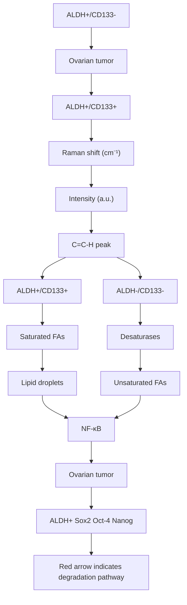
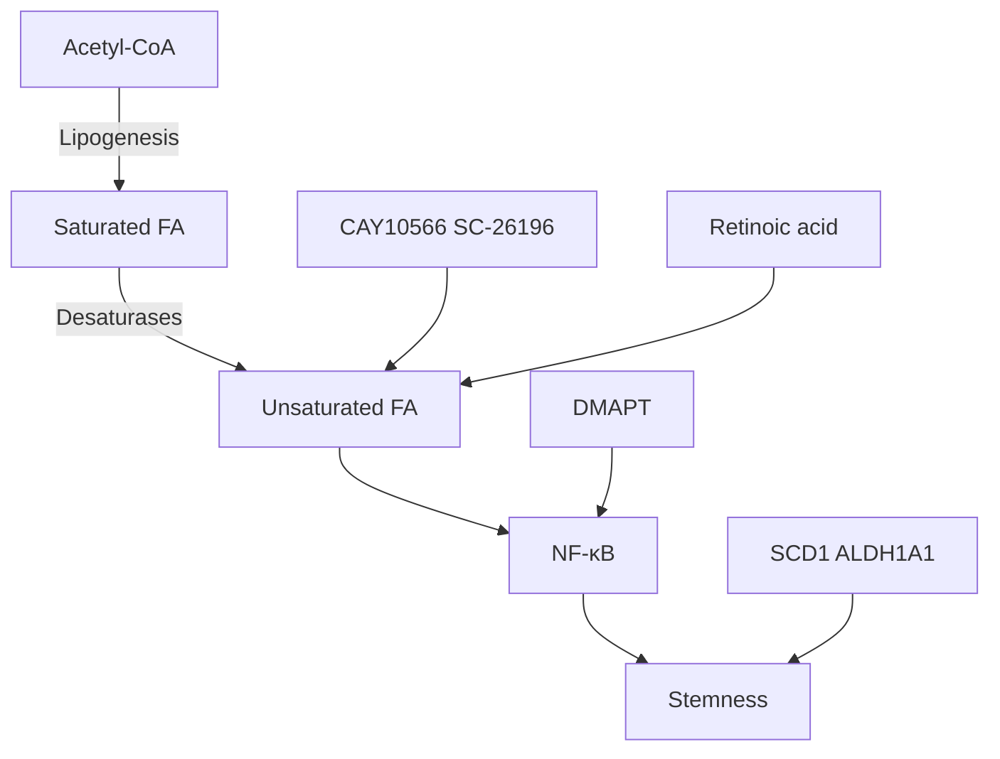

## Cell Stem Cell

# Lipid Desaturation Is a Metabolic Marker and Therapeutic Target of Ovarian Cancer Stem Cells

Graphical Abstract  

flowchart

## Authors

Junjie Li, Salvatore Condello, Jessica Thomes-Pepin, ..., Thomas D. Hurley, Daniela Matei, Ji-Xin Cheng

## Correspondence

daniela.matei@northwestern.edu (D.M.), jcheng@purdue.edu (J.-X.C.)

## In Brief

Cheng and colleagues using Raman spectroscopic imaging find that ovarian cancer stem cells contain unusually high levels of unsaturated lipids and show evidence that this metabolic difference could be used as a marker for these cells and as a new target for CSC-specific therapy.

## Highlights

d Ovarian cancer stem cells have high levels of unsaturated lipids  
d Blocking lipid desaturation impairs cancer stemness and tumor initiation capacity  
d The ${ \mathsf { N F } } { \mathsf { - } } \kappa { \mathsf { B } }$ pathway directly regulates the expression of lipid desaturases  
d Lipid desaturase inhibitors inactivate the ${ \mathsf { N F } } { \mathsf { - } } \kappa { \mathsf { B } }$ pathway

# Lipid Desaturation Is a Metabolic Marker and Therapeutic Target of Ovarian Cancer Stem Cells

Junjie Li,1,10 Salvatore Condello,2,10 Jessica Thomes-Pepin,3 Xiaoxiao Ma,4 Yu Xia,4 Thomas D. Hurley,5,6 Daniela Matei,2,7,8, \* and Ji-Xin Cheng1,4,9,11, \*

1Weldon School of Biomedical Engineering, Purdue University, West Lafayette, IN 47907, USA  
2Department of Obstetrics and Gynecology, Feinberg School of Medicine, Northwestern University, Chicago, IL 60611, USA  
3Department of Obstetrics and Gynecology, Indiana University, Indianapolis, IN 46202, USA  
4Department of Chemistry, Purdue University, West Lafayette, IN 47907, USA  
5Department of Biochemistry and Molecular Biology, Indiana University School of Medicine, Indianapolis, IN 46202, USA  
6Indiana University Simon Cancer Center, Indiana University School of Medicine, Indianapolis, IN 46202, USA  
7Jesse Brown VA Medical Center, Chicago, IL 60612, USA  
8Robert H. Lurie Comprehensive Cancer Center, Chicago, IL 60611, USA  
9Purdue University Center for Cancer Research, Purdue University, West Lafayette, IN 47907, USA  
10Co-first author  
11Lead Contact  
\*Correspondence: daniela.matei@northwestern.edu (D.M.), jcheng@purdue.edu (J.-X.C.)  
http://dx.doi.org/10.1016/j.stem.2016.11.004

## SUMMARY

Lack of sensitive single-cell analysis tools has limited the characterization of metabolic activity in cancer stem cells. By hyperspectral-stimulated Raman scattering imaging of single living cells and mass spectrometry analysis of extracted lipids, we report here significantly increased levels of unsaturated lipids in ovarian cancer stem cells (CSCs) as compared to non-CSCs. Higher lipid unsaturation levels were also detected in CSC-enriched spheroids compared to monolayer cultures of ovarian cancer cell lines or primary cells. Inhibition of lipid desaturases effectively eliminated CSCs, suppressed sphere formation in vitro, and blocked tumor initiation capacity in vivo. Mechanistically, we demonstrate that nuclear factor kB $( \mathsf { N F - } \kappa \mathsf { B } )$ directly regulates the expression levels of lipid desaturases, and inhibition of desaturases blocks ${ \mathsf { N F } } { \mathsf { - } } \kappa { \mathsf { B } }$ signaling. Collectively, our findings reveal that increased lipid unsaturation is a metabolic marker for ovarian CSCs and a target for CSC-specific therapy.

## INTRODUCTION

Cancer stem cells (CSCs), also recognized as tumor-initiating cells, represent a small population of cancer cells that have the ability to self-renew and initiate tumors in vivo (Bjerkvig et al., 2005). CSCs are resistant to conventional therapies and are responsible for tumor relapse after chemotherapy (Jordan et al., 2006; Pattabiraman and Weinberg, 2014) and development of distant metastases (Jordan et al., 2006). Understanding their unique characteristics and vulnerabilities will enable the development of CSC-targeting therapies with the ultimate goal of overcoming tumor relapse and metastasis.

Recent studies have focused on blocking signaling pathways or genetic programs that fuel cellular ‘‘stemness.’’ For example, epithelial to mesenchymal transition (EMT) is emerging as a key program in CSCs required for initiation of metastasis (Visvader and Lindeman, 2008). Related signaling pathways, like Wnt and transforming growth factor (TGF- ), are recognized as b bnew targets for CSC-specific therapy (Pattabiraman and Wein berg, 2014). The Hedgehog and Notch pathways implicated in the self-renewal of CSCs (Zhou et al., 2009) are being targeted, and specific inhibitors have recently entered clinical development. In ovarian cancer, the Mullerian Inhibiting Substance was proposed as a potential targeting strategy for chemo therapy-resistant CSCs (Meirelles et al., 2012; Szotek et al., 2006). However, as the development of technologies enabling the study of rare populations has lagged, one underexplored niche remains understanding the CSC metabolism.

So far, only limited studies have begun to address this niche. A recent report suggested that glucose played an important role maintaining the side population in non-small lung and colon cancer models and that inhibition of glycolysis blocked this popula tion (Liu et al., 2014). A few studies have linked lipogenesis to CSCs. Specifically, inhibition of fatty acid synthase was shown to suppress the growth of breast cancer stem-like cells in vivo (Pandey et al., 2011); the peroxisome proliferator-activated receptor (PPAR ) pathway was found important in maintaining g gthe CSC properties of ERBB2-positive breast cancer cells partl by upregulating the de novo lipogenic pathway (Wang et al., 2013), and increased numbers of lipid droplets were identified in colorectal CSCs compared to differentiated cancer cells (Tirinato et al., 2015). Collectively, these studies point to lipogenesis as a potentially altered metabolic process in CSCs, but the precise mechanism by which lipids regulate stemness remains unknown.

In this study, we identify and characterize lipid unsaturation in ovarian CSCs by chemical imaging of single living cells through recently developed hyperspectral-stimulated Raman scattering (SRS) microscopy (Cheng and Xie, 2015; Zhang et al., 2015). This single-cell imaging study and mass spectrometry analysis show a significantly increased level of lipid unsaturation in (A) Representative hyperspectral SRS images of flow-sorted ALDH/CD133 and ALDH+ /CD133+ COV362 cells. Images a $\cdot 2 , 9 0 0 \mathsf { c m } ^ { - 1 } , 3 , 0 0 2 \mathsf { c m } ^ { - 1 }$ and the intensity ratio image between 3,002 and $2 { , } 9 0 0 \ c m ^ { - 1 }$ are shown. Scale bars, 10 m.

text_image

A
2900 cm⁻¹
3002 cm⁻¹
Ratio I₃₀₀₂/I₂₉₀₀
ALDH+/CD133-
ALDH+/CD133+

line chart

| Raman shift (cm⁻¹) | ALDH⁺/CD133⁺ | ALDH⁺/CD133⁺ |
| ------------------ | ------------ | ------------ |
| 2850               | ~20          | ~20          |
| 2900               | ~25          | ~25          |
| 2950               | ~15          | ~15          |
| 3000               | ~5           | ~5           |
| 3050               | ~0           | ~0           |

line chart

| Raman shift (cm⁻¹) | ALDH⁺/CD133⁺ | ALDH⁺/CD133⁺ |
| ------------------ | ------------ | ------------ |
| 1200               | ~0           | ~0           |
| 1300               | ~0           | ~0           |
| 1400               | ~0           | ~0           |
| 1500               | ~0           | ~0           |
| 1600               | ~0           | ~0           |
| 1700               | ~0           | ~0           |
| 1800               | ~0           | ~0           |
| 1900               | ~0           | ~0           |
| 2000               | ~0           | ~0           |
| 2100               | ~0           | ~0           |
| 2200               | ~0           | ~0           |
| 2300               | ~0           | ~0           |
| 2400               | ~0           | ~0           |
| 2500               | ~0           | ~0           |
| 2600               | ~0           | ~0           |
| 2700               | ~0           | ~0           |
| 2800               | ~0           | ~0           |
| 2900               | ~0           | ~0           |
| 3000               | ~0           | ~0           |

scatterplot

| ALDH⁻/CD133⁻ | ALDH⁺/CD133⁺ |
| ------------ | ------------ |
| 0.35         | 0.45         |
| 0.38         | 0.47         |
| 0.40         | 0.48         |
| 0.42         | 0.49         |
| 0.45         | 0.50         |

line chart

| Raman shift (cm⁻¹) | ALDH⁻/CD133⁺ | ALDH⁺/CD133⁺ |
| ------------------ | ------------ | ------------ |
| 1200               | ~0           | ~0           |
| 1300               | ~0           | ~0           |
| 1400               | ~0           | ~0           |
| 1500               | ~0           | ~0           |
| 1600               | ~0           | ~0           |
| 1700               | ~0           | ~0           |
| 1800               | ~0           | ~0           |
| 1900               | ~0           | ~0           |
| 2000               | ~0           | ~0           |
| 2100               | ~0           | ~0           |
| 2200               | ~0           | ~0           |
| 2300               | ~0           | ~0           |
| 2400               | ~0           | ~0           |
| 2500               | ~0           | ~0           |
| 2600               | ~0           | ~0           |
| 2700               | ~0           | ~0           |
| 2800               | ~0           | ~0           |
| 2900               | ~0           | ~0           |
| 3000               | ~0           | ~0           |

scatterplot

| Group | Ratio (H3002/H1450) |
|-------|---------------------|
| ALDH⁻/CD133⁻ | 0.18 |
| ALDH⁻/CD133⁻ | 0.19 |
| ALDH⁻/CD133⁻ | 0.20 |
| ALDH⁺/CD133⁺ | 0.22 |
| ALDH⁺/CD133⁺ | 0.23 |
| ALDH⁺/CD133⁺ | 0.24 |

Figure 1. Increased Lipid Unsaturation Level in Sorted ALDH+ /CD133+ Ovarian Cancer Cells

m(B) Average SRS spectra from the lipid droplets in ALDH $\mathcal { 1 } \mathtt { C D 1 3 3 } ^ { - } \left( \mathsf { n } = 3 \right)$ and $\mathsf { A L D H ^ { + } / C D 1 3 3 ^ { + } }$ cells $( { \mathsf { n } } \ = \ 8 ) .$ . Shaded area indicates the standard deviation of SRS spectral measurements from different cells.

(C) Spontaneous Raman spectra taken from LDs in $\mathsf { A L D H ^ { - } / C D 1 3 3 ^ { - } }$ and $\mathsf { A L D H ^ { + } / C D 1 3 3 ^ { + } }$ sorted COV362 cells. The spectra were normalized by the height of the Raman peak $\mathsf { a t } 1 , 4 5 0 \mathsf { c m } ^ { - 1 } .$ The differences at $1 , 2 6 4 ~ \mathsf { c m } ^ { - 1 } , \mathsf { 1 } , 6 6 0 ~ \mathsf { c m } ^ { - 1 }$ 1, and 3,002 cm1 were highlighted in gray.

(D) Scatterplot of Raman spectra height ratio between the peaks a $3 , 0 0 2 ~ { \mathsf { c m } } ^ { - 1 }$ and $1 , 4 5 0 \ c m ^ { - 1 }$ in ALDH/CD133 and ALDH+ /CD133+ COV362 cells. Each dot represents a single cell, and the bars indicate means ± SEM ${ \mathsf p } = 0 . 0 0 0 5$ .

(E) Raman spectra taken from LDs in ALDH/ $\mathsf { C D 1 3 3 } ^ { - }$ and ALDH+ /CD133+ OVCAR5 cells. The spectra were normalized by the height of peak at $1 , 4 5 0 \ c m ^ { - 1 } .$ . The differences at $1 , 2 6 4 \ c m ^ { - 1 } ,$ 1,660 cm1 , and $3 , 0 0 2 ~ { \mathsf { c m } } ^ { - 1 }$ were highlighted in gray.

(F) Scatterplot of Raman spectra height ratio between the peaks at $, 0 0 2 \mathsf { c m } ^ { - 1 }$ and 1,450 cm in $\mathsf { A L D H ^ { - } / C D 1 3 3 ^ { - } }$ and ALDH+ /CD133+ OVCAR5 cells. Each dot represents a single cell, and the bars indicate means ± SEM; ${ \mathsf p } = 0 . 0 0 1 2$ .

See also Figure S1. Movie S1. and Movie S2

flow-sorted ovarian CSCs (ALDH+ /CD133+ ) compared to non-CSCs (ALDH/CD133) and in ovarian cancer (OC) cells growing as spheres compared to monolayers. Inhibition of lipid desaturases, either 9 (SCD1) or 6, impaired cancer cell stemness, D Dsuppressed sphere formation, and prevented tumor formation in vivo. We further identified the nuclear factor B (NF- B) pathway as a critical mechanism through which lipid desaturase inhibitors perturb the functions of CSCs. Collectively, our findings put forward lipid desaturation as a metabolic marker of ovarian CSCs and as a new target for CSC-specific therapy.

## RESULTS

## Increased Lipid Unsaturation in Isolated Ovarian CSCs Compared to Non-CSCs

We employed hyperspectral SRS microscopy to quantitatively analyze the composition of intracellular lipids inside single cells. $\mathsf { A L D H ^ { + } / C D 1 3 3 ^ { + } }$ cells, which have been previously described as cells possessing CSC characteristics (Flesken-Nikitin et al., 2014; Foster et al., 2013), were isolated from COV362, an ovarian cancer (OC) cell line. By tuning the Raman shift frame by frame, 50 images of individual $\mathsf { A L D H ^ { - } / C D 1 3 3 ^ { - } }$ and ALDH+ /CD133+ COV362 cells were recorded at the C-H vibration region from 2,800 to $3 , 0 5 0 ~ { \mathsf { c m } } ^ { - 1 }$ with a step size of $\sim 5 ~ { \mathsf { c m } } ^ { - 1 }$ (Movie S1 and Movie S2). Inside each cell, the C-H bond rich lipid droplets were highlighted in the context of relatively weaker signals from protein and nucleotides. Initial analysis of the images at $2 , 8 5 0 \mathsf { c m } ^ { - 1 }$ , where the ${ \mathsf { C H } } _ { 2 }$ symmetric stretch vibration resides, revealed an increase of total amount of lipid droplets in $\mathsf { A L D H ^ { + } / C D 1 3 3 ^ { + } }$ cells. An in-depth comparison revealed that lipid droplets in $\mathsf { A L D H ^ { + } / C D 1 3 3 ^ { + } }$ cells had a stronger signal at $3 , 0 0 2 ~ \mathsf { c m } ^ { - 1 }$ than those in $\mathsf { A L D H ^ { - } / C D 1 3 3 ^ { - } }$ cells $( { \mathsf { F i g u r e 1 A } } ) .$ . As the peak at $3 , 0 0 2 ~ { \mathsf { c m } } ^ { - 1 }$ is known to be from the vibration of = C-H bonds mostly in unsaturated lipids (Movasaghi et $a 1 . ,$ 2007), our data suggests that $\mathsf { A L D H ^ { + } / C D 1 3 3 ^ { + } C S C }$ cells have a higher level of unsaturated lipids. To eliminate the influence of the total number of C-H bonds, we used the peak around $2 , 9 0 0 { \mathsf { c m } } ^ { - 1 }$ , contributed by C-H stretch vibrations in all the lipids (Movasaghi et al., 2007), to normalize the SRS intensity at $3 , 0 0 2 ~ { \mathsf { c m } } ^ { - 1 }$ . After normalization, the ratio of SRS intensity at $3 , 0 0 2 ~ { \mathsf { c m } } ^ { - 1 }$ to that at $2 , 9 0 0 \ c m ^ { - 1 } \ ( \vert _ { 3 , 0 0 2 } / \vert _ { 2 , 9 0 0 } )$ was found to be significantly higher in $\mathsf { A L D H ^ { + } / C D 1 3 3 ^ { + } }$ cells than that in ALDH/ $\mathsf { C D 1 3 3 } ^ { - }$ cells (Figure 1A). The difference of the peak intensity at $3 , 0 0 2 \mathsf { c m } ^ { - 1 }$ became more obvious when we plotted together the SRS spectra from different lipid droplets (Figure 1B). Quantitatively, we found a statistically significant difference between the two groups in terms of lipid unsaturation level (Figure S1A).

To confirm the above observation, we acquired full Raman spectra from individual LDs in both C-H stretch and fingerprint vibration regions. After normalization by the ${ \mathsf { C H } } _ { 2 }$ bending vibration peak at $1 , 4 5 0 ~ { \mathsf { c m } } ^ { - 1 }$ , the Raman spectra clearly showed that the peak at $1 , 2 6 4 \ c m ^ { - 1 }$ (in plane bending motion of = C-H), the peak at $1 , 6 6 0 \mathsf { c m } ^ { - 1 }$ (stretching vibration of ${ \mathsf { C } } = { \mathsf { C } } ) ,$ and the peak at $3 , 0 0 2 ~ \mathsf { c m } ^ { - 1 }$ (vibration of = C-H) in ALDH+ /CD133+ cells were higher than those in ALDH/CD133 cells (Figure 1C). In consistence with the hyperspectral SRS imaging data, the height ratios of the peak at $3 , 0 0 2 \mathrm { c m } ^ { - 1 }$ to the peak at $1 , 4 5 0 \mathsf { c m } ^ { - 1 } ( \mathsf { F i g u r e 1 D } )$ , $1 , 6 6 0 \ c m ^ { - 1 }$ to $1 , 4 5 0 ~ { \mathsf { c m } } ^ { - 1 }$ (Figure S1B), and $1 , 2 6 4 ~ { \mathsf { c m } } ^ { - 1 }$ to $1 , 4 5 0 ~ { \mathsf { c m } } ^ { - 1 }$ (Figure S1C) all showed a significant increase of lipid unsaturation level in ALDH+ /CD133+ cells. To ensure that the findings are not cell line specific, we compared ALDH+ / CD133+ and ALDH/CD133 populations isolated from OVCAR5 cells. After normalization by the 1450 cm1 peak, higher peak intensities at $1 , 2 6 4 \mathsf { c m } ^ { - 1 } , 1 , 6 6 0 \mathsf { c m } ^ { - 1 }$ , and $3 , 0 0 2 \mathsf { c m } ^ { - 1 }$ were noted in $\mathsf { A L D H ^ { + } / C D 1 3 3 ^ { + } O V C A R 5 }$ cells compared to $\mathsf { A L D H ^ { - } / C D 1 3 3 ^ { - } }$ OVCAR5 cells (Figure 1E). Quantitatively, the height ratio of the peak at $3 , 0 0 2 \mathsf { c m } ^ { - 1 }$ to the peak at $1 , 4 5 0 \mathsf { c m } ^ { - 1 }$ was significantly higher in CSCs compared to non-CSCs (Figure 1F). These results collectively demonstrate increased lipid unsaturation in ovarian CSCs compared to non-CSCs.

## Increased Lipid Unsaturation in Spheroids Compared to Monolayer Cultures

It is known that CSCs have the ability to proliferate as spheres when cultured under non-adherent conditions (Ponti et al., 2005; Zhou and Zhang, 2008). Thus, we utilized CSC-rich spheroids as a second model to validate our observations. Hyperspectral SRS imaging was conducted to analyze lipid composition of COV362 cells grown either as monolayers or as spheres under similar serum-free conditions (Movie S3 and Movie S4). Using the intensity ratio between $3 , 0 0 2 ~ \mathsf { c m } ^ { - 1 }$ and $2 { , } 9 0 0 ~ \mathsf { c m } ^ { - 1 }$ we observed an increased unsaturation level in spheres compared to monolayer cultures (Figure 2A). As most cells in spheroids showed higher levels of unsaturation, it is possible that both CSCs and other progenitor cells present in spheres are rich in unsaturated lipids (Ponti et al., 2005). Comparison of SRS spectral profile (Figure 2B) and quantitative analysis of the intensity ratio $( \mathsf { I } _ { 3 , 0 0 2 } / \mathsf { I } _ { 2 , 9 0 0 } )$ (Figure S2A) further confirmed the difference in lipid unsaturation levels between monolayers and spheres. Based on the height ratio of the peak at $3 , 0 0 2 \mathsf { c m } ^ { - 1 }$ to the peak at $1 4 5 0 \mathsf { c m } ^ { - 1 }$ , Raman spectral analysis of COV362, OVCAR5, and primary cells derived from malignant OC ascites (total 4 patients, Table S1) quantitatively demonstrates elevated lipid unsaturation levels in spheres compared to monolayers cells (Figure 2C).

Although the SRS imaging and Raman spectral analysis focused on lipid droplets, which are storage sites of neutra lipids mainly in the form of triglycerides and sterol esters, we speculated that the increased unsaturation in lipid droplets was part of an altered lipid metabolic network in CSCs. To test the hypothesis, we performed whole lipid analysis by mass spectrometry. First, we extracted free fatty acids from cells grown as monolayers or spheres (Ma and Xia, 2014) and analyzed by electrospray ionization mass spectrometry (ESI-MS). As shown in the mass spectra (Figure S2B), the major components of free fatty acids in both monolayer and sphere cultures derived from OVCAR5 cells were 18:1 (e.g., oleic acid) and $1 8 { : } 0 ( \mathsf { e } . \mathsf { g } . )$ , stearic acid). When normalized by the peak intensity of 18:0, the peak intensity of 18:1 in spheres was found to be significantly higher than that in cells grown as monolayers (Figure S2C). Consistent results were obtained in COV362 (Figure S2D) and primary OC cells isolated from malignant OC ascites (Figures S2E and S2F). Furthermore, using liquid chromatography-mass spectrometry (LC-MS), we performed a more quantitative and comprehensive analysis of fatty acids saponified from all lipids (Kamphorst et al., 2013). The levels of all measured saponified fatty acids, including palmitic (16:0), palmitoleic (16:1), stearic (18:0), oleic (18:1), linoleic (18:2), arachidonic (20:4), and docosahexaenoic acid (22:6), were significantly increased in cells grown as spheres compared to monolayer cultures (Figures 2D and S2G). These data are consistent with the proposed phenomenon of increased de novo lipogenesis in CSCs. Moreover, the ratio of unsaturated fatty acids (UFA) to saturated fatty acids (SFA) was significantly increased in COV362 (Figure 2E) and OVCAR5 (Figure S2H) cells grown as spheres, confirming the increased unsaturation level in lipid droplets measured by Raman spectra analysis. These results suggest that unsaturation level in lipid droplets can be used as a readout of intracellular activities of desaturases. Taken together, the increased lipid unsaturation in ovarian CSCs was validated through hyperspectral SRS imaging, Raman spectroscopy, and mass spectrometry, in different CSC models derived from cell lines and primary OC cells.

## The Increased Lipid Unsaturation Is Mediated by Lipid Desaturases

Intracellular lipids originate either from the uptake of extracel lular lipids or through de novo synthesis. We have shown higher levels of lipid unsaturation in both flow-sorted ALDH+ CD133+ cells grown in the presence of serum (Figures 1 and S1) and in spheroids grown in serum-free medium (Figures 2 and S2). To determine the source of increased unsaturated lipids in CSCs, we examined the contribution of de novo synthesis, which is mediated by three fatty acid desaturases 9, 6, and D D5 (Santos and Schulze, 2012). Among the three desaturases, D9 (stearoyl-CoA desaturase-1 [SCD1]) catalyzes the synthesis Dof monounsaturated fatty acids by adding one double bond to saturated fatty acids (mostly stearic acid), while the 6 and D5 desaturases are involved predominantly in the synthesis of Dpolyunsaturated fatty acids (Nakamura and Nara, 2004). While lipid desaturases are expressed in the majority of ovarian tumors (data not shown) and other cancers (Roongta et al., 2011), they are enriched in CSCs. SCD1 mRNA expression leve was significantly. higher in Al DH+/CD133+ versus Al DH-CD133 cells in both OVCAR5 (Figure 3A) and COV362 (Fig ure 3B) cell lines.

Small molecule inhibitors, CAY10566 that blocks SCD1 (Liu et al., 2007) and SC-26196 that blocks 6 (Obukowicz et al., 1998), and small hairpin RNA (shRNA)-based downregulation were used to study further the function of desaturases in ovarian CSCs. Both inhibitors significantly reduced the lipid unsaturation levels in OC spheroids (Figures 3C and 3D). The SCD1 inhibitor was more potent than the 6 inhibitor, perhaps because monounsaturated rather than polyunsaturated lipids contribute more significantly to the increased unsaturation levels in CSCs. To measure the effects of lipid desaturase inhibitors on metabolic flux from SFAs to UFAs, we deployed metabolic tracing with control transfected cells (Figures S3A– S3D). Collectively, these data support an essential role of lipid desaturases for the synthesis of UFAs in CSCs.

A  

text_image

2900 cm⁻¹
3002 cm⁻¹
Ratio I₃₀₀₂/I₂₉₀₀
Monolayer
Sphere

B  

line chart

| Raman shift (cm⁻¹) | Monolayer | Sphere |
| ------------------ | --------- | ------ |
| 2800               | 0.1       | 0.1    |
| 2850               | 2.5       | 2.0    |
| 2900               | 2.3       | 2.8    |
| 2950               | 1.5       | 2.5    |
| 3000               | 0.5       | 0.8    |
| 3050               | 0.1       | 0.1    |

c  

bar chart

| Marker | Monolayer | Sphere |
|---|---|---|
| COV362 | 0.31 | 0.35 |
| OVCAR5 | 0.21 | 0.235 |
| Primary #1 | 0.24 | 0.28 |
| Primary #2 | 0.27 | 0.315 |
| Primary #3 | 0.26 | 0.33 |
| Primary #4 | 0.265 | 0.355 |
*; **; *** indicate statistical significance.

D  

bar chart

| Fatty acids | Monolayer | Sphere |
| ----------- | --------- | ------ |
| 16:0        | 0.57      | 0.89   |
| 16:1        | 0.04      | 0.07   |
| 18:0        | 0.50      | 0.82   |
| 18:1        | 0.19      | 0.45   |
| 18:2        | 0.02      | 0.08   |
| 20:4        | 0.01      | 0.03   |
| 22:6        | 0.01      | 0.02   |

E  

bar chart

| Ratios of UFA / SFA | Monolayer | Sphere |
| ------------------- | --------- | ------ |
| 16:1/16:0           | 0.10      | 0.12   |
| 18:1/18:0           | 0.35      | 0.55   |
| 18:2/18:0           | 0.12      | 0.15   |
| 20:4/18:0           | 0.08      | 0.12   |
| 22:6/18:0           | 0.08      | 0.12   |

Figure 2. Increased Lipid Unsaturation Level in Spheres Compared to Monolayer Cultures  
(A) Representative hyperspectral SRS images of COV362 cells grown as monolayers and spheres. Images at $2 { , } 9 0 0 ~ \mathsf { c m } ^ { - 1 }$ , 3,002 $\mathsf { c m } ^ { - 1 }$ 1, and the intensity ratio between 3,002 cm1 and $2 { , } 9 0 0 \mathsf { c m } ^ { - 1 }$ are shown. Scale bars, 10 m.  
m(B) Average SRS spectra from the lipid droplets in COV362 monolayer $( \mathsf { n } = 6 )$ and spheres $( \mathsf { n } = 6 ) .$ Shaded area indicates the standard deviation of SRS spectral measurements from different cells.  
(C) Quantitation of the height ratio between the = C-H peak at 3,002 $\mathsf { c m } ^ { - 1 }$ and the C-H bending peak at $1 , 4 5 0 ~ { \mathsf { c m } } ^ { - 1 }$ based on Raman spectra measurements in monolayers and spheres derived from COV362, OVCAR5, and primary cells isolated from malignant OC ascites of four patients. The data are shown as means + SEM; $n \geq 1 0 .$ .  
(D) LC-MS measurement of fatty acids saponified from all lipids extracted from COV362 monolayer cultures and spheres. Fatty acids levels were normalized by total protein amount extracted from an equal number of cells.  
(E) Quantitation of the ratios of unsaturated fatty acid (UFA) to saturated fatty acid (SFA) in COV362 monolayer and spheres. The data are shown as means $+ \mathbb { S } \mathbb { D } ; \mathsf { n } = 3 . ~ ^ { \star } \mathsf { p } < 0 . 0 5 , ~ ^ { \star \star } \mathsf { p } < 0 . 0 1$ , $\star \star \star _ { \mathsf { p } } < 0 . 0 0 1$ .  
See also Figure S2, Table S1, Movie S3, and Movie S4.

## Lipid Desaturases Contribute to the Maintenance of Cancer Cell Stemness

To test the functional significance of lipid desaturases relative to the known traits of CSCs, we measured the expression levels of CSC markers by qRT-PCR after desaturase inhibitor treatment or shRNAbased downregulation. Both CAY10566 and SC-26196 reduced ALDH1A1 mRNA expression levels in OVCAR5, COV362, and primary ovarian cancer spheroids (Figure 4A). Additionally, the expression levels of CSC-associated

13C-labeled glucose and glutamine (Kamphorst et al., 2013). The relative abundances of 13C-labeled fatty acids saponified from all lipids, including palmitic acid (16:0), palmitoleic acid (16:1), stearic acid (18:0), and oleic acid (18:1), were quantitatively analyzed by mass spectrometry. As shown in Figures 3E–3H, CAY10566 significantly suppressed the incorporation of $^ { 1 3 } \mathsf { C }$ into UFAs (FA 16:1 and FA 18:1), but not in SFAs (FA 16:0 and FA 18:0) in OVCAR5 spheroids. Similar effects were observed in cells in which SCD1 was knocked down by shRNA compared to shRNA transcription factors Sox2, Nanog, and Oct-4 were decreased by treatment with the inhibitors in OVCAR5, COV362, and primary spheroids (Figures 4B, S4A, and S4B). Similarly, knockdown of SCD1 by shRNA reduced the mRNA expression levels of ALDH1A1, Nanog, Sox2, and Oct-4, in both OVCAR5 (Figures 4C and S4C) and COV362 spheroids (Figures 4D and S4D). The reduction of stemness was further confirmed by a reduction in the $A L D H ^ { + }$ cell population after treatment with the inhibitors as measured by flow cytometry (Figure 4E). Overall, these (A and B) qRT-PCR measurement of SCD1 expression levels in ALDH/CD133 and ALDH+ / CD133+ OVCAR5 (A) and COV362 (B) cells. The data are shown as means ${ \bf \Phi } + { \bf S } { \mathsf { E } } { \mathsf { M } } ; { \mathsf { n } } = 3 .$ .

bar chart

OVCAR5 cells
| Group | Relative SCD1 mRNA level |
|---|---|
| ALDH-/CD133- | 1.0 |
| ALDH+/CD133+ | 1.48* |

bar chart

| Group | Relative SCD1 mRNA level |
|-------|--------------------------|
| ALDH-/CD133- | 1.0 |
| ALDH+/CD133+ | 1.5 |

bar chart

Primary spheroids #1
| Spheroid | Ratio (H3002/H1450) |
|---|---|
| DMSO | 0.33 |
| CAY10566 | 0.24 |
| SC-26196 | 0.28 |

bar chart

Primary spheroids #2
| Condition | Ratio (H3002/H1450) |
|---|---|
| DMSO | 0.26 |
| CAY10566 | 0.17 |
| SC-26196 | 0.21 |
** indicates statistical significance; * indicates significant difference from DMSO. The y-axis represents the ratio value, and the x-axis lists the three conditions. Error bars are shown for each bar.

Figure 3. Increased Desaturation in CSCs Is Due to Lipid Desaturases

(C and D) Raman spectral measurement of lipid unsaturation level in (C) primary spheres derived from patient #1 and (D) primary spheres derived from patient #2 treated with the SCD1 inhibito CAY10566 or 6 inhibitor SC-26196 at 1.0 M for 6 days. The data are shown as means + SEM; ${ \mathsf { n } } \geq { \mathsf { 1 0 } } .$ .

(E–H) LC-MS analysis of relative abundance of 13C incorporation into fatty acids 16:0 (E), 16:1 (F), 18:0 (G), and 18:1 (H) saponified from al lipids in OVCAR5 spheroids treated with DMSO or 1 M CAY10566 for 6 days. The data are mshown as $\mathsf { n e a n s } + \mathsf { S D } ; \mathsf { n } = 3 . \mathsf { \partial } ^ { \star } \mathsf { p } < 0 . 0 5 , \mathsf { \partial } ^ { \star \star } \mathsf { p } < 0 . 0 1$ , $^ { \star \star \star } \mathsf { p } < 0 . 0 0 1$ .

See also Figure S3.

bar chart

| # ¹³C per molecule | DMSO | CAY10566 |
| ------------------ | ---- | -------- |
| 0                  | 95   | 98       |
| 2                  | 0.3  | 0.2      |
| 4                  | 1.2  | 0.7      |
| 6                  | 1.7  | 0.9      |
| 8                  | 1.2  | 0.8      |
| 10                 | 0.7  | 0.4      |
| 12                 | 0    | 0        |
| 14                 | 0.2  | 0        |
| 16                 | 0    | 0        |

bar chart

| # ¹³C per molecule | DMSO | CAY10566 |
| ------------------ | ---- | -------- |
| 0                  | 70   | 90       |
| 2                  | 8    | 5        |
| 4                  | 7    | 0        |
| 6                  | 9    | 0        |
| 8                  | 7    | 0        |
| 10                 | 4    | 0        |
| 12                 | 2    | 0        |
| 14                 | 0    | 0        |
| 16                 | 0    | 0        |

bar chart

| # ¹³C per molecule | DMSO | CAY10566 |
| ------------------ | ---- | -------- |
| 0                  | 100  | 100      |
| 2                  | 2    | 1        |
| 4                  | 0.5  | 0.5      |
| 6                  | 0.5  | 0.5      |
| 8                  | 0.5  | 0.5      |
| 10                 | 0.5  | 0.5      |
| 12                 | 0.1  | 0.1      |
| 14                 | 0.3  | 0.3      |
| 16                 | 0.1  | 0.1      |
| 18                 | 0.1  | 0.1      |

bar chart

| # ¹³C per molecule | DMSO | CAY10566 |
| ------------------ | ---- | -------- |
| 0                  | 78   | 95       |
| 2                  | 9    | 5        |
| 4                  | 2    | 1        |
| 6                  | 3    | 0.5      |
| 8                  | 3    | 0.5      |
| 10                 | 2    | 0.5      |
| 12                 | 1    | 0.5      |
| 14                 | 0.5  | 0.5      |
| 16                 | 0.5  | 0.5      |
| 18                 | 0.5  | 0.5      |

control transfected cells. In contrast, OVCAR5 cells grown as monolayers (containing fewer CSCs) (Figure S5E) and normal human dermal fibroblasts (NHF544) (Figure S5F) were less sensitive to desaturase inhibitors compared to spheroids, supporting that lipid desaturation represents a CSC-specific target.

Next, to investigate the contribution of exogenous lipid uptake to ovarian CSCs proliferation, we measured sphere formation in the presence of several exogenous fatty acids (e.g., FA 16:0, 16:1, 18:0, 18:1, 18:2, 20:4, and 22:6). Fatty acids supplementation did not alter (positively or negatively) sphere proliferation and addition of exogenous lipids only partially rescued the inhibition exerted by desaturase inhibitors on sphere formation (Figures 5C and 5D, and S6A–S6E). These data suggest that CSCs rely on the de

data support an important role of lipid desaturases in CSC maintenance.

## Inhibition of Lipid Desaturases Prevents Sphere Formation In Vitro and Tumorigenesis In Vivo

To determine the effect of desaturase inhibitors on the functions of CSCs, we examined the capacity of CSCs to form spheroids in vitro (Visvader and Lindeman, 2008) and initiate tumors in vivo. Both CAY10566 (Figure 5A) and SC-26196 (Figure 5B) effectively suppressed sphere formation in OVCAR5, COV362, and primary OC cells. The suppression of sphere proliferation was further confirmed by using the CCK-8 assay in OVCAR5, COV362, and primary OC cells (Figures S5A and S5B). Suppression of sphere formation was also observed in OVCAR5 (Figure S5C) and COV362 cells (Figure S5D), in which SCD1 was stably knocked down compared to shRNA novo fatty acid synthesis pathway, rather than on exogenous lipid uptake.

To measure the effects of desaturase inhibitors on tumor formation in vivo, we inoculated DMSO or inhibitor pretreated CSCs in the flanks of nude mice. Time-to-tumor formation and tumor volumes were measured. Pretreatment of $\mathsf { A L D H ^ { + } C D 1 3 3 ^ { + } }$ flow-sorted OVCAR5 cells with the desaturase inhibitor CAY10566 and SC-26196 significantly delayed the median time-to-tumor initiation from 14 days (DMSO) to 39 days and 23 days (Table S2), respectively. Pretreatment with CAY10566 (Figure 5E) or SC-20196 (Figure 5F) significantly suppressed tumor growth. Tumor weights (mean ± SEM) were significantly reduced from 827 ± 154 mg (DMSO) to $2 2 ~ \pm ~ 1 2$ mg by CAY10566 (Figure S6F) and from 562 ± 160 mg (DMSO) to $2 1 9 \pm 3 1$ mg by SC-26196 (Figure S6G). To verify the effects of the inhibitors on stemness, a tumor initiation assay was

  
Figure 4. Inhibition of Lipid Desaturation Impairs Ovarian Cancer Cell Stemness  
(A) RT-PCR measurement of ALDH1A1 mRNA expression level in OVCAR5, COV362, and primary spheroids.  
(B) RT-PCR measurement of Sox2 mRNA expression level in OVCAR5, COV362, and primary spheroids. Treatment with CAY10566 or SC-26196 in spheroids was done at a concentration of 1.0 M for 6 days.  
m(C and D) RT-PCR measurement of SCD1, ALDH1A1 mRNA expression level in OVCAR5 (C) and COV362 (D) cells stably transfected with scrambled contro shRNA (shCtr) or SCD1 shRNA (shSCD). The data were shown as means + SEM; n = 3. \*p < 0.05, \*\*p < 0.01, \*\*\*p < 0.001.  
(E) Flow cytometry analysis of ALDH+ cells sorted from OVCAR5. COv362, and primary cells after CAY10566 or SC-26196 treatment at a concentration of 1.0 uM for 6 days. DEAB was used as negative control.  
See also Figure S4.

subsequently performed by using serial dilutions of CSCs flow sorted from OVCAR5 cell line. CAY10566 pretreatment reduced the frequency of tumor initiation to 20% (one out of five mice) when 500 ALDH+ /CD133+ cells were used, 40% (two out of five mice) for 1,000 CSCs, 80% (four out of five mice) for 5,000 and 10,000 CSCs, whereas tumors formed in all con trol groups (Figure 5G). Collectively, these data support that blockade of lipid desaturation selectively suppresses the sphere formation and tumor initiation capacity of ovarian CSCs.

## Inhibition of Lipid Desaturases Downregulates the NF-kB Pathway

Having shown the effects of desaturase inhibitors on sphere formation and tumorigenesis, we next explored the mechanism

text_image

A
OVCAR5
spheres
COV362
spheres
Primary
spheres
DMSO
CAY10566
(1 µM)
CAY10566
(10 µM)
CAY10566
(25 µM)

text_image

B
OVCAR5
spheres
COV362
spheres
Primary
spheres
DMSO
SC-26196
(1 µM)
SC-26196
(10 µM)
SC-26196
(25 µM)

bar chart

| Stearic acid (18:0) | DMSO | CAY10566 | SC-26196 |
| ------------------- | ---- | -------- | -------- |
| DMSO                | 1.0  | 0.7      | 0.75     |
| 0.1 µM              | 1.0  | 0.7      | 0.95     |
| 1 µM                | 0.95 | 0.7      | 0.8      |
| 10 µM               | 1.0  | 0.65     | 0.85     |

bar chart

| Oleic acid (18:1) | DMSO | CAY10566 | SC-26196 |
| ----------------- | ---- | -------- | -------- |
| DMSO              | 1.0  | 0.7      | 0.75     |
| 0.1 µM            | 0.9  | 0.85     | 0.95     |
| 1 µM              | 1.05 | 0.9      | 0.9      |
| 10 µM             | 1.0  | 0.35     | 0.8      |

line chart

| Days post tumor inoculation | Tumor volume (mm³) |
| --------------------------- | ------------------ |
| 20                          | 0                  |
| 25                          | 100                |
| 30                          | 200                |
| 35                          | 500                |
| 40                          | 750                |
| 45                          | 1000               |

line chart

| Days post tumor inoculation | DMSO (mm³) | SC-26196 (mm³) |
| -------------------------- | ---------- | -------------- |
| 20                         | ~50        | ~0             |
| 25                         | ~100       | ~50            |
| 30                         | ~200       | ~100           |
| 35                         | ~400       | ~150           |
| 40                         | ~600       | ~250           |

<table><tr><td># of cells</td><td>DMSO</td><td>CAY10566</td></tr><tr><td>20,000</td><td>5/5</td><td>5/5</td></tr><tr><td>10,000</td><td>5/5</td><td>4/5</td></tr><tr><td>5,000</td><td>5/5</td><td>4/5</td></tr><tr><td>1,000</td><td>5/5</td><td>2/5</td></tr><tr><td>500</td><td>5/5</td><td>1/5</td></tr></table>

Figure 5. Inhibition of Lipid Desaturation Prevents Sphere Growth In Vitro and Tumor Formation In Vivo  
(A and B) Representative images of OVCAR5, COV362 and primary spheres treated with CAY10566 (A) or SC-26196 (B) at indicated concentrations for 6 days (C and D) Sphere proliferation of COV362 cells supplemented with fatty acid 18:0 (C) and 18:1 (D) at indicated concentrations and treated with CAY10566 or SC 26196 at 1 M for 6 days. Comparisons were performed between inhibitors-treated group and DMSO-treated group under the same concentrations of fatty acid msupplementation (p value indicated by \*), or between DMSO groups under different concentrations of fatty acid supplementation (p value indicated by #). The data are normalized to the blank control (no fatty acid supplementation and treated with DMSO) and shown as means + SEM; n = 4. (E and F) Growth curves of xenografts derived from DMSO (n = 7) or CAY10566 (n = 6) (E), and DMSO (n = 8) or SC-26196 (n = 8) (F) pretreated OVCAR5 cells grown in spheroids. The data are presented as means + SEM. Inset: tumor size comparison at the end of study (42 days after tumor cells inoculation). Upper: DMSO; lower: treated. \*p < 0.05, \*\*p < 0.01, \*\*\*p < 0.001. (G) Tumor initiation assay using serial dilution of OVCAR5 cells pretreated with DMSO or CAY10566 at 1 M. Cells were counted and then cultured for 6 days with mthe presence of DMSO or CAY10566 to allow sphere formation before injected into the mice. Five mice were used for each group. See also Figures S5 and S6 and Table S2.

by which lipid desaturation alters the functions of CSCs. We first screened the effects of the inhibitors on various CSCrelated signaling mechanisms by using pathway-specific qRT-PCR arrays. Both CAY10566 and SC-26196 downregulated key stem cell-related signaling networks in OC spheroids, particularly the NF- B, PI3K/Akt, Hedgehog, Notch, selfkrenewal, asymmetric division, migration, and metastasis pathways (Figures 6A and 6B). One of the most responsive

pie chart

CAY10566
| Category | Percentage (%) |
|---|---|
| Hedgehog Signaling | 13 |
| Notch Signaling | 8 |
| Wnt Signaling | 2 |
| STAT/NF-κB Signaling | 13 |
| PI3K/AKT/mTOR Signaling | 13 |
| Pluripotency | 8 |
| Proliferation | 9 |
| Migration and Metastasis | 8 |
| Asymmetric division | 13 |
| Self-Renewal | 4 |
| Cancer Stem Cell Markers | 9 |

B  

pie chart

SC-26196
| Category | Percentage (%) |
|---|---|
| Hedgehog Signaling | 13 |
| Notch Signaling | 4 |
| Wnt Signaling | 8 |
| STAT/NF-κB Signaling | 21 |
| PI3K/AKT/mTOR Signaling | 0 |
| Pluripotency | 15 |
| Proliferation | 6 |
| Migration and Metastasis | 13 |
| Asymmetric division | 8 |
| Self-Renewal | 0 |
| Cancer Stem Cell Markers | 12 |

c  

bar chart

| Treatment | Relative NF-kB activity |
| --------- | ------------------------ |
| DMSO      | 0.9                      |
| CAY10566  | 0.3                      |
| SC-26196  | 0.6                      |

bar chart

| Strain    | Relative NF-kB activity |
| --------- | ------------------------ |
| DMSO      | 0.9                      |
| CAY10566  | 0.2                      |
| SC-26196  | 0.1                      |

bar chart

| Treatment   | Relative NF-kB activity |
|-------------|--------------------------|
| DMSO        | 1.0                      |
| CAY10566    | 0.0                      |
| SC-26196    | 0.1                      |

D  

bar chart

| Gene | Vector | p65 |
|---|---|---|
| OVCAR5 | 1.0 | 1.55 |
| COV362 | 1.0 | 1.7 |

E  

bar chart

| Group   | Relative ALDH1A1 mRNA level |
| ------- | --------------------------- |
| Vector  | 1.0                         |
| p65     | 2.0                         |

F  

bar chart

| Treatment Group       | Relative ALDH1A1 mRNA level |
| --------------------- | --------------------------- |
| DMSO                  | 1.00                        |
| DMAPT (1 µM)          | 0.70                        |
| DMAPT (5 µM)          | 0.45                        |

## Figure 6. Inhibition of Lipid Desaturation Downregulates the ${ \mathsf { N F } } { \mathsf { - } } \kappa { \mathsf { B } }$ Pathway

(A and B) CSC genes preferentially downregulated by CAY10566 treatment compared to control (DMSO) (>2.0-fold) (A) or SC-26196 treatment compared t control (DMSO) (>2.0-fold) (B) were quantified by $\mathsf { R T } ^ { 2 }$ Profiler PCR array in OVCAR5 spheroids treated with CAY10566 at 1 M for 6 days. Pie chart analysis showing the downregulated genes (% of total) for each represented pathway in control versus treated spheres

(C) NF- B promoter activity measured by gene reporter assay in OVCAR5, COV362 and primary OC cells spheroids treated with CAY10566 or SC-26196 at 1 M kfor 6 days.  
(D) Proliferation of OVCAR5 and COV362 cells stably transduced with empty vector (pQCXIP) or with pQCXIP/p65 and grown as spheroids. The data are shown as means + SEM; n = 4.  
(E) RT-PCR measurement of ALDH1A1 in COV362 spheroids stably transduced with empty vector (pQCXIP) or with pQCXIP/p65.  
(F) RT-PCR measurement of ALDH1A1 mRNA levels in primary OC spheroids treated with NF- B inhibitor, DMAPT, at indicated concentrations. The data are shown as means + SEM; $\mathsf { n } = 3 . \mathsf { \Pi } ^ { \star } \mathsf { p } < 0 . 0 5 , \mathsf { \Pi } ^ { \star \star } \mathsf { p } < 0 . 0 1 , \mathsf { \Pi } ^ { \star \star \star } \mathsf { p } < 0 . 0 0 1$ .

See also Figures S7A and S7B.

pathways to desaturase inhibition was ${ \sf N F - } \kappa { \sf B }$ signaling, a key survival pathway in cancer, which has been also linked to cancer stemness (Shostak and Chariot, 2011). To confirm the suppression of ${ \sf N F - } \kappa { \sf B }$ by desaturase inhibitors, we used an kNF- B reporter assay. Both CAY 10566 and SC-26196 signifi kcantly suppressed ${ \sf N F - } \kappa { \sf B }$ transcriptional activity in OVCAR5, kCOV362, and primary OC spheres (Figure 6C). Confirming suppression of NF- B activity, the mRNA expression levels of IL-6 k(Figure S7A) and IL-8 (Figure S7B), known ${ \sf N F - } \kappa { \sf B }$ target genes, kwere significantly downregulated by desaturase inhibitors in OC cells.

To investigate the link between ${ \sf N F - } \kappa { \sf B }$ and the stem cell kphenotype, p65 (relA), the active subunit o ${ \mathsf { N F } } { \mathsf { - } } { \mathsf { \kappa B } } ,$ , was overexpressed in ovarian cancer cells and the stem cell characteristics were evaluated. Indeed, overexpression of p65 increased ovarian cancer sphere proliferation in OVCAR5 and COV362 cells (Figure 6D). qRT-PCR demonstrated that the overexpression of p65 increased ALDH1A1 expression in COV362 cells (Figure 6E). Consistently, a small molecule inhibitor of NF-B, dimethylaminoparthenolide (DMAPT) (Shanmugam et al., k2011), reduced ALDH1A1 expression in primary OC spheroids (Figure 6F). Together, these data support that ${ \mathsf { N F } } { \mathsf { - } } { \mathsf { \kappa B } } ,$ , as an

bar chart

| Treatment | Ratio (H3002/H1450) |
| :--- | :--- |
| DMSO | 0.335 |
| DMAPT (1 µM) | 0.32 |
| DMAPT (5 µM) | 0.305 |
* indicates statistical significance.

bar chart

| Treatment        | Relative SCD1 mRNA level |
| ---------------- | ------------------------ |
| DMSO             | 1.00                     |
| DMAPT (1 µM)     | 0.50                     |
| DMAPT (5 µM)     | 0.25                     |

bar chart

| Region | OVCAR5 pQCXIP/vector IgG | OVCAR5 pQCXIP/vector p65 | OVCAR5 pQCXIP/p65 IgG | OVCAR5 pQCXIP/p65 p65 |
| --- | --- | --- | --- | --- |
| Non-targeting region | 0.0 | 0.0 | 0.0 | 0.0 |
| SCD promoter region 1 | 1.0 | 1.6 | 1.0 | 2.4 |
| SCD promoter region 2 | 1.0 | 2.7 | 1.0 | 3.1 |
| IL-8 promoter region 1 | 1.0 | 1.5 | 1.0 | 2.5 |

bar chart

| Spheroid Type | Vector (Relative SCD1 mRNA level) | p65 (Relative SCD1 mRNA level) |
|---|---|---|
| OVCAR5 spheroids | 1.0 | 1.8 |
| COV362 spheroids | 1.0 | 2.2 |
*** indicates p65 significantly higher than Vector for both species. The chart includes a significance marker (***) above the p65 bars.

flowchart

bar chart

COV362 spheroids
| Treatment | Ratio (H3002/H1450) |
| :--- | :--- |
| DMSO | 0.34 |
| CM037 | 0.30 |
| CM037 + RA | 0.34 |
n.s. (not significant)

Figure 7. NF-kB and ALDH1A1 Promote Lipid Unsaturation

(A) Raman spectral measurement of lipid unsaturation level in OC spheroids treated with the NF- B inhibitor, DMAPT, at indicated concentrations. $n \geq 1 0$ .  
(B) RT-PCR measurement of SCD1 mRNA levels in primary OC spheroids treated with DMAPT at indicated concentrations. ${ \mathsf n } = 3$ .

(C) ChIP demonstrates that p65 binds the SCD promoter region. Immunoprecipitated chromatin with an antibody against p65 was used for qPCR amplification. Primers flanking two predicted p65- binding regions of the SCD1 promoter ( 215 to 206 and +79 to +88 bp) were used. Positive control was p65 antibody-immunoprecipitated chromatin amplified with primers for the IL8 promoter, a known p65 target. Negative controls were chromatin immunoprecipitated with IgG and amplified with SCD1 promoter primers and chromatin immunoprecipitated with p65 antibody an amplified with primers to a region in the SCD promoter located upstream of the predicted p65 binding sites.

(D) qRT-PCR measured SCD1 mRNA expression levels in COV362 spheroids transfected with pQCXIP vector or pQCXIP/p65. The data are shown as means + SEM; n = 3.  
(E) Raman spectral measurement of lipid unsaturation level in COV362 spheroids treated wit ALDH1A1 inhibitor, CM037, or CM037 and retinoic acid for 6 days. The data are shown as means + $\mathtt { S E M } ; \mathtt { n } \ge 1 0 . \ \mathtt { ^ { \star } p } < 0 . 0 5 , \ \mathtt { ^ { \star \star } p } < 0 . 0 1 , \ \AA ^ { \star \star } \mathsf { p } < 0 . 0 0 1$ 1, n.s., not significant.  
(F) The proposed mechanism by which lipid de saturation is linked to cancer cell stemness. See also Figures S7C–S7H

tional regulatory role of ${ \sf N F - } \kappa { \sf B }$ , the overkexpression of p65 significantly upregulated the expression levels of SCD1 in OVCAR5 and COV362 spheroids (Figure 7D), IL8, a known p65 target gene was used as a positive control in these

important pathway downregulated by desaturases inhibition, is involved in stem cell regulation.

## NF-kB and ALDH Regulate Lipid Unsaturation

To further understand the mechanism by which ${ \sf N F - } \kappa { \sf B }$ is linked kto lipid desaturation and ovarian cancer cell stemness, ovarian cancer spheres were treated with the ${ \sf N F - } \kappa { \sf B }$ inhibitor. DMAPT kdecreased both lipid unsaturation levels (Figure 7A) as well as SCD1 mRNA expression levels in primary ovarian cancer spheres (Figure 7B). Next, to investigate whether NF- B directly kregulates the expression of desaturases, a promoter search motif identified two putative p65 (relA) binding sites at position 215 to 206 and at position $+ 7 9$ to +88 in the SCD1 promoter (Figure S7C). The direct interaction between p65 and the SCD1 promoter region was then confirmed by chromatin immunoprecipitation (ChIP) using a p65 antibody in OV-CAR5 cells stably transduced with pQCXIP vector or pQCXIP/ p65 (Figure 7C). Consistent with the proposed direct transcripexperiments (Figure S7D). Together, these results demonstrate that NF- B directly regulates SCD1 expression and promote kCSC characteristics.

We also detected increased lipid unsaturation in ALDH+ (single marker) OC cells (Figure S7E). ALDH1A1 functions as a detoxifi cation enzyme and is implicated in the conversion of retinol to retinoic acid (Ma and Allan, 2011; Marcato et al., 2011). ALDH1A1 is recognized as a stem cell marker in several tumor types, including ovarian cancer (Silva et al., 2011), but its involvement remains unclear. It has been proposed that its role in the maintenance of CSCs is related to regulation of cell differentiation mediated by retinoic acid signaling (Chute et al., 2006; Gi nestier et al., 2009). To determine the potential mechanism b which ALDH1A1 may be involved in regulating lipid desaturation, we used a recently identified and highly specific ALDH1A1 inhib itor, CM037 (Condello et al., 2015). Treatment with CM037 potently decreased the mRNA expression levels of SCD1 in primary OC spheres (Figure S7F), supporting a link between the two pathways. Additionally, CM037 decreased lipid unsaturation levels in COV362 (Figure 7E), OVCAR5 (Figure S7G), and primary OC spheres (Figure S7H). Because ALDH1A1 regulates retinoic acid signaling (Ma and Allan, 2011), we next tested whethe its effects on lipid unsaturation can be reversed by retinoic acid. The lipid unsaturation levels reduced by CM037 were successfully rescued by the addition of retinoic acid in COV362 (Figure 7E), OVCAR5 (Figure S7G), and primary OC spheres (Figure S7H). Taken together, these data suggest a role of ALDH1A1 in the regulation of lipid desaturation in ovarian CSCs mediated through retinoic acid signaling.

As summarized in Figure 7F, our studies revealed a functional role of altered lipid metabolism in ovarian CSCs. Through de novo lipogenesis and subsequent lipid desaturation, the unsaturated fatty acids promote activation of ${ \sf N F - } \kappa { \sf B }$ , a key pathway involved in maintaining the CSC phenotype. In turn, the ${ \sf N F - } \kappa { \sf B }$ pathway modulates the expression levels of lipid desaturases at the transcriptional level. Together, our data support a positive feedback loop between lipid metabolism and ${ \sf N F - } \kappa { \sf B }$ signaling in regulating OC cell stemness.

## DISCUSSION

Since the first use of CD34 and CD38 as surface markers of leu kemia stem cells, efforts to search for bona fide markers of CSCs have intensified. The lack of reliable methods to identify and isolate CSCs has remained one of the biggest challenges facing CSC research (Clevers, 2011). Current methods to enrich or isolate CSCs include surface marker labeling for flow cytom etry sorting, side population sorting, and sphere culture (Zhou and Zhang, 2008). Surface markers have been widely used as the standard method to isolate CSCs. Some intracellular markers, such as aldehyde dehydrogenase (ALDH) have also been used alone or in combination with other markers. However, many of the CSC markers selected based on empirical assays are not necessarily linked to clear functional roles (Clevers, 2011; Visvader and Lindeman, 2008). Recently, Miranda-Lorenzo et al. (2014) reported that a strong intracellular autofluorescence signal, originating from riboflavin accumulation, can be used as a biomarker for epithelial CSCs. However, the precise function of the accumulated fluorophore remains unknown and the level of the autofluorescence signal can be easily altered by environmental changes, limiting its use as a reliable marker for CSCs.

Our study proposes a stable, universal, and functional metabolic marker for ovarian CSCs. By using Raman spectroscopic imaging, we identified an increase of lipid unsaturation levels in the lipid droplets of single ovarian CSCs derived from cell lines and human specimens. As the site for neutral lipid storage, LDs buffer the synthesis and consumption of lipids, which renders their composition relatively stable over time. Because unsaturated lipids are primarily derived from de novo synthe sis, they are not easily subject to environmental changes. Indeed, we observed consistently increased lipid unsaturation in CSCs regardless of culture conditions (e.g., serum-enriched or serum-free media) in OC cell lines and human primary malignant cells. Raman spectral measurement is based on the ratio of unsaturated lipids to total lipids, instead of the absolute amount of unsaturated lipids, eliminating the change induced by the total lipids amount. It is possible that increased unsaturated lipids are detectable in CSCs from other cancer types (unpublished data in pancreatic and leukemia cells), and future studies will address this concept more broadly. Combining this marker with Raman spectroscopic imaging could lead to a reliable and universal method for in situ detection of CSCs. Further refinement of Raman spectroscopic imaging-based techniques, such as coherent Raman scattering flow cytometry (Camp et al., 2009, 2011; Wang et al., 2008), would allow fast, noninvasive detection and isolation of CSCs.

As shown by single-cell spectroscopic imaging, CSCs are characterized by a higher conversion rate from saturated to unsaturated lipids, compared to differentiated cancer cells, a process mediated by fatty acid desaturases. We further observed that lipid desaturases are enriched in CSCs and can be targeted. By measuring key characteristics of stem cells in vitro and in vivo, including sphere formation and tumor initiation, we showed that lipid desaturases are critical to maintaining CSCs, suggesting that unlike most surface markers, unsaturated lipids possess definitive functions. Our data support further investigation of lipid desaturases as CSC-specific targets and development of combination strategies using these inhibitors with standard chemotherapy targeting the non-CSC population to improve disease control.

Finally, we identified a positive feedback loop involving the NF- B pathway, ALDH1A1, and lipid desaturases in ovarian kCSCs. A functional link between ${ \sf N F - } \kappa { \sf B }$ as the master regulator kof inflammation converging pathways and cancer has been established for other tumor models (Karin et al., 2002; Shostak and Chariot, 2011), and activation of ${ \sf N F - } \kappa { \sf B }$ in stem cells has kbeen recently reported (Jia et al., 2015). Here, we link ${ \mathsf { N F } } { \mathsf { - } } { \mathsf { \kappa B } } ,$ , klipid desaturases, and CSCs. Our data support that NF- B regulates SCD1 at the transcriptional level, that ${ \sf N F - } \kappa { \sf B }$ kactivation promotes ovarian sphere proliferation, and in turn, desaturase inhibition blocks ${ \sf N F - } \kappa { \sf B }$ activity and reduces cancer stemness. kInterestingly, we show that IL-6, one of the known targets genes of ${ \mathsf { N F } } { \mathsf { - } } \kappa { \mathsf { B } } ,$ , is potently downregulated by the inhibitors. IL-6 has kbeen recently linked to cancer stemness in multiple cancer models (Sansone et al., $^ { 2 0 1 6 ; }$ van der Zee et al., 2015). The exact mechanism by which ${ \sf N F - } \kappa { \sf B }$ is inactivated by desaturase inhibiktors in CSCs remains undefined. A possible explanation could be that the reduction of unsaturated lipids induced by the inhibitors directly blocks ${ \sf N F - } \kappa { \sf B }$ given that unsaturated fatty acids, such kas arachidonic acid (Camandola et al., 1996), oleic, and linoleic acid (Poletto et al., 2015), are known activators of the complex. Besides the ${ \sf N F - } \kappa { \sf B }$ pathway, our PCR array assay showed kthat disruption of lipid desaturation also impaired other stem cell-associated pathways, which may contribute additionally to inhibiting CSCs. Unsaturated lipids are also known to modulate membrane fluidity (Nakamura and Nara, 2004), which could contribute to altered oncogenic signaling and impairment of stemness.

In all, our results discovered a new functional marker of ovarian CSCs, intimately linked to the ${ \sf N F - } \kappa { \sf B }$ survival pathway and klipid metabolism. We propose that this marker represents a targetable metabolic vulnerability of recalcitrant stem cells, which should be exploited to improve the outcome of existing therapies.

## STAR+METHODS

Detailed methods are provided in the online version of this paper and include the following:

d KEY RESOURCES TABLE  
CONTACT FOR REAGENT AND RESOURCE SHARING  
EXPERIMENTAL MODEL AND SUBJECT DETAILS

B Cell lines  
B Primary human cells  
B Subcutaneous xenograft mouse model

d METHOD DETAILS

B Sphere formation assay  
B Aldefluor assay and Fluorescence-Activated Cell Sort ing  
B Hyperspectral stimulated Raman scattering (SRS) imaging  
B Spontaneous Raman spectroscopy  
B Mass spectrometry analysis of fatty acids  
B Tumor initiation assays in subcutaneous xenograft mouse model  
B Generation of SCD1 stably knockdown cells  
B Stable retroviral transduction  
B Gene reporter assay  
B Reverse transcription-PCR (RT-PCR)  
B Chromatin immunoprecipitation (ChIP)

d QUANTIFICATION AND STATISTICAL ANALYSIS

## SURRLEMENTALINEORMATION

Supplemental Information includes seven figures, three tables, and fou movies and can be found with this article online at http://dx.doi.org/10.1016/ j.stem.2016.11.004.

## AUTHOR CONTRIBUTIONS

Conceptualization, J.-X.C. and D.M.; Methodology, J.L., S.C., D.M., and J.-X.C.; Investigation, J.L., S.C., and X.M.; Formal Analysis, J.L. and S.C.; Resources, J.T.-P., T.D., and Y.X.; Writing – Original Draft, J.L.; Writing – Review & Editing, all authors; Visualization, J.L., S.C., D.M., and J.-X.C.; Funding Acquisition. J.-X.C. and D.M..

## ACKNOWLEDGMENTS

The authors thank Leelyn Chong and Drs. Bin Liu, Chi Zhang, and Bakhtiyor Yakubov for technical support. The authors acknowledge the use of the metabolite profiling facility of the Bindley Bioscience Center at Purdue University. This work was supported by a VA Merit Award (BX000792-05A1), the NC (CA198409 to D.M. and CA182608 to J.-X.C.), the Walther Cancer Foundation (to J.-X.C.), and the NIH (P30CA023168). J.L. and J.-X.C. are co-founders o Resarci Therapeutics LLC.

Received: January 4, 2016

Revised: August 10, 2016

Accepted: November 2, 2016

Published: December 29, 2016

## REEERENCES

Bierkyig. R., Tysnes. B.B., Aboody. K.S., Naibauer. J., and Terzis. A.J.A. (2005). Opinion: the origin of the cancer stem cell: current controversies and new insights. Nat. Rev. Cancer 5, 899–904.  
Camandola, S., Leonarduzzi, G., Musso, T., Varesio, L., Carini, R., Scavazza, A. Chiarpotto. E. Baeuerle. P A. and Poli. G. (1g96) Nuclear factor kB is acti-  
vated by arachidonic acid but not by eicosapentaenoic acid. Biochem Biophys. Res. Commun. 229, 643–647.  
Camp, C.H., Jr., Yegnanarayanan, S., Eftekhar, A.A., Sridhar, H., and Adibi, A. (2009). Multiplex coherent anti-Stokes Raman scattering (MCARS) for chemi cally sensitive, label-free flow cytometry. Opt. Express 17, 22879–22889.  
Camp, C.H., Jr., Yegnanarayanan, S., Eftekhar, A.A., and Adibi, A. (2011). Label-free flow cytometry using multiplex coherent anti-Stokes Raman scattering (MCARS) for the analysis of biological specimens. Opt. Lett. 36, 2309– 2311.  
Cheng, J.-X., and Xie, X.S. (2015). Vibrational spectroscopic imaging of living systems: An emerging platform for biology and medicine. Science 350, aaa8870.  
Chua, H.L., Bhat-Nakshatri, P., Clare, S.E., Morimiya, A., Badve, S., and Nakshatri, H. (2007). NF-kappaB represses E-cadherin expression and en hances epithelial to mesenchymal transition of mammary epithelial cells: po tential involvement of ZEB-1 and ZEB-2. Oncogene 26, 711–724.  
Chute, J.P., Muramoto, G.G., Whitesides, J., Colvin, M., Safi, R., Chao, N.J. and McDonnell, D.P. (2006). Inhibition of aldehyde dehydrogenase and retinoid signaling induces the expansion of human hematopoietic stem cells. Proc. Natl. Acad. Sci. USA 103, 11707–11712.  
Clevers, H. (2011). The cancer stem cell: premises, promises and challenges Nat, Med, 17 313319  
Condello, S., Morgan, C.A., Nagdas, S., Cao, L., Turek, J., Hurley, T.D., and Matei, D. (2015). -Catenin-regulated ALDH1A1 is a target in ovarian cance spheroids. Oncogene 34, 2297–2308.  
Flesken-Nikitin, A., Odai-Afotey, A.A., and Nikitin, A.Y. (2014). Role of the stem cell niche in the pathogenesis of epithelial ovarian cancers. Mol. Cell. Oncol. 1, e963435.  
Foster, R., Buckanovich, R.J., and Rueda, B.R. (2013). Ovarian cancer stem cells: working towards the root of stemness. Cancer Lett. 338, 147–157.  
Fu, D., Holtom, G., Freudiger, C., Zhang, X., and Xie, X.S. (2013). Hyperspectral imaging with stimulated raman scattering by chirped femtosecond lasers, J. Phys, Chem. B 117. 46344640.  
Ginestier, C., Wicinski, J., Cervera, N., Monville, F., Finetti, P., Bertucci, F. Wicha, M.S., Birnbaum, D., and Charafe-Jauffret, E. (2009). Retinoid signaling regulates breast cancer stem cell differentiation. Cell Cycle 8, 3297–3302.  
Jia, D., Yang, W., Li, L., Liu, H., Tan, Y., Ooi, S., Chi, L., Filion, L.G., Figeys, D. and Wang, L. (2015). -Catenin and NF- B co-activation triggered by TLR3 stimulation facilitates stem cell-like phenotypes in breast cancer. Cell Death Differ. 22, 298–310.  
Jordan, C.T., Guzman, M.L., and Noble, M. (2006). Cancer stem cells. N. Engl J. Med. 355, 1253–1261.  
Kamphorst, J.J., Cross, J.R., Fan, J., de Stanchina, E., Mathew, R., White, E.P., Thompson, C.B., and Rabinowitz, J.D. (2013). Hypoxic and Ras-trans formed cells support growth by scavenging unsaturated fatty acids from lyso phospholipids. Proc. Natl. Acad. Sci. USA 110, 8882–8887.  
Karin, M., Cao, Y., Greten, F.R., and Li, Z.W. (2002). NF-kappaB in cancer: from innocent bystander to major culprit. Nat. Rev. Cancer 2, 301–310  
Lewis, D.A., Travers, J.B., Machado, C., Somani, A.K., and Spandau, D.F. (2011). Reversing the aging stromal phenotype prevents carcinoma initiation Aging (Albany, N.Y.) 3, 407–416.  
Li, S., Kendall, S.E., Raices, R., Finlay, J., Covarrubias, M., Liu, Z., Lowe, G., L in. Y.H., Teh. Y.H., Leigh. V., et al. (2012). TWIST1 associates with NFkappaB subunit RELA via carboxyl-terminal WR domain to promote cell autonomous invasion through IL8 production. BMC Biol. 10, http://dx.doi.org/10 1186/1741-7007-10-73.  
Liu, G., Lynch, J.K., Freeman, J., Liu, B., Xin, Z., Zhao, H., Serby, M.D., Kym, P.R., Suhar, T.S., Smith, H.T., et al. (2007). Discovery of potent, selective orally bioavailable stearoyl-CoA desaturase 1 inhibitors. J. Med. Chem. 50, 3086–3100.  
Liu, P.P., Liao, J., Tang, Z.J., Wu, W.J., Yang, J., Zeng, Z.L., Hu, Y., Wang, P. Ju, H.Q., Xu, R.H., and Huang, P. (2014). Metabolic regulation of cancer cel side population by glucose through activation of the Akt pathway. Cell Death Differ, 21, 124135  
Liu, B., Lee, H.J., Zhang, D., Liao, C.-S., Ji, N., Xia, Y., and Cheng, J.-X. (2015). Label-free spectroscopic detection of membrane potential using stimulated Raman scattering. Appl. Phys. Lett. 106, 173704.  
Ma, I., and Allan, A.L. (2011). The role of human aldehyde dehydrogenase in normal and cancer stem cells. Stem Cell Rev. 7, 292–306.  
Ma, X., and Xia, Y. (2014). Pinpointing double bonds in lipids by Paterno\` -Buch€ reactions and mass spectrometry. Angew. Chem. Int. Ed. Engl. 53, 2592– 2596.  
Marcato, P., Dean, C.A., Giacomantonio, C.A., and Lee, P.W.K. (2011). Aldehyde dehydrogenase: its role as a cancer stem cell marker comes down to the specific isoform. Cell Cycle 10, 1378–1384.  
Meirelles, K., Benedict, L.A., Dombkowski, D., Pepin, D., Preffer, F.I., Teixeira, J., Tanwar, P.S., Young, R.H., MacLaughlin, D.T., Donahoe, P.K., and Wei, X. (2012). Human ovarian cancer stem/progenitor cells are stimulated by doxoru bicin but inhibited by Mullerian inhibiting substance. Proc. Natl. Acad. Sci. USA 109, 2358–2363.  
Miranda-Lorenzo, I., Dorado, J., Lonardo, E., Alcala, S., Serrano, A.G., Clausell-Tormos, J., Cioffi, M., Megias, D., Zagorac, S., Balic, A., et al. (2014). Intracellular autofluorescence: a biomarker for epithelial cancer stem cells. Nat. Methods 11, 1161–1169.  
Mitra, A.K., Davis, D.A., Tomar, S., Roy, L., Gurler, H., Xie, J., Lantvit, D.D., Cardenas, H., Fang, F., Liu, Y., et al. (2015). In vivo tumor growth of high-grade serous ovarian cancer cell lines. Gynecol. Oncol. 138, 372–377.  
Movasaghi, Z., Rehman, S., and Rehman, I.U. (2007). Raman spectroscopy of biological tissues. Appl. Spectrosc. Rev. 42, 493–541.  
Nakamura, M.T., and Nara, T.Y. (2004). Structure, function, and dietary regu lation of delta6, delta5, and delta9 desaturases. Annu. Rev. Nutr. 24, 345–376.  
Obukowicz, M.G., Welsch, D.J., Salsgiver, W.J., Martin-Berger, C.L., Chinn, K.S., Duffin, K.L., Raz, A., and Needleman, P. (1998). Novel, selective delta6 or delta5 fatty acid desaturase inhibitors as antiinflammatory agents in mice. J. Pharmacol. Exp. Ther. 287, 157–166.  
Pandey, P.R., Okuda, H., Watabe, M., Pai, S.K., Liu, W., Kobayashi, A., Xing, F., Fukuda, K., Hirota, S., Sugai, T., et al. (2011). Resveratrol suppresses growth of cancer stem-like cells by inhibiting fatty acid synthase. Breast Cancer Res. Treat. 130, 387–398.  
Pattabiraman, D.R., and Weinberg, R.A. (2014). Tackling the cancer stem cells - what challenges do they pose? Nat. Rev. Drug Discov. 13, 497–512.  
Poletto, A.C., Furuya, D.T., David-Silva, A., Ebersbach-Silva, P., Santos, C.L., Correˆ a-Giannella, M.L., Passarelli, M., and Machado, U.F. (2015). Oleic and linoleic fatty acids downregulate Slc2a4/GLUT4 expression via NFKB and SREBP1 in skeletal muscle cells. Mol. Cell. Endocrinol. 401, 65–72.  
Ponti. D., Costa. A.. Zaffaroni, N.. Pratesi. G.. Petrangolini. G., Coradini. D. Pilotti, S., Pierotti, M.A., and Daidone, M.G. (2005). Isolation and in vitro propagation of tumorigenic breast cancer cells with stem/progenitor cell proper ties, Cancer Res, 65. 55065511.  
Roongta, U.V., Pabalan, J.G., Wang, X., Ryseck, R.P., Fargnoli, J., Henley, B.J., Yang, W.P., Zhu, J., Madireddi, M.T., Lawrence, R.M., et al. (2011). Cancer cell dependence on unsaturated fatty acids implicates stearoyl-CoA desaturase as a target for cancer therapy. Mol. Cancer Res. 9. 1551—1561  
Sansone, P., Ceccarelli, C., Berishaj, M., Chang, Q., Rajasekhar, V.K., Perna, E.. Bowman. R.J .. Vidone, M. Daly. I.. Nnoli. J.. et al. (2016). Self-renewal of CD133(hi) cells by IL6/Notch3 signalling regulates endocrine resistance in metastatic breast cancer. Nat. Commun. 7. 10442. http://dx,doi,org/10.1038/ ncomms10442.

Santos, C.R., and Schulze, A. (2012). Lipid metabolism in cancer. FEBS J. 279, 2610–2623.

Shanmugam, R., Kusumanchi, P., Appaiah, H., Cheng, L., Crooks, P., Neelakantan, S., Peat, T., Klaunig, J., Matthews, W., Nakshatri, H., and Sweeney, C.J. (2011). A water soluble parthenolide analog suppresses in vivo tumor growth of two tobacco-associated cancers, lung and bladder cancer, by targeting NF- B and generating reactive oxygen species. Int. J. Cancer 128, 2481–2494.

Shostak, K., and Chariot, A. (2011). NF- B, stem cells and breast cancer: the links get stronger. Breast Cancer Res. 13, 214–220.

Silva, I.A., Bai, S., McLean, K., Yang, K., Griffith, K., Thomas, D., Ginestier, C., Johnston, C., Kueck, A., Reynolds, R.K., et al. (2011). Aldehyde dehydrogenase in combination with CD133 defines angiogenic ovarian cancer stem cells that portend poor patient survival. Cancer Res. 71, 3991–4001.

Slipchenko, M.N., Le, T.T., Chen, H.T., and Cheng, J.-X. (2009). High-speed vibrational imaging and spectral analysis of lipid bodies by compound Raman microscopy. J. Phys. Chem. B 113, 7681–7686.

Szotek, P.P., Pieretti-Vanmarcke, R., Masiakos, P.T., Dinulescu, D.M., Connolly, D., Foster, R., Dombkowski, D., Preffer, F., Maclaughlin, D.T., and Donahoe, P.K. (2006). Ovarian cancer side population defines cells with stem cell-like characteristics and Mullerian Inhibiting Substance responsiveness. Proc. Natl. Acad. Sci. USA 103, 11154–11159

Tirinato, L., Liberale, C., Di Franco, S., Candeloro, P., Benfante, A., La Rocca, R., Potze, L., Marotta, R., Ruffilli, R., Rajamanickam, V.P., et al. (2015). Lipid droplets: a new player in colorectal cancer stem cells unveiled by spectroscopic imaging. Stem Cells 33, 35–44.

Tumanov, S., Bulusu, V., and Kamphorst, J.J. (2015). Chapter six - analysis of fatty acid metabolism using stable isotope tracers and mass spectrometry. In Methods Enzymol, M.M. Christian, ed. (Academic Press), pp. 197–217.

van der Zee, M., Sacchetti, A., Cansoy, M., Joosten, R., Teeuwssen, M., Heiimans-Antonissen. C.FEwing-Graham. P.C.Burger., C W.Blok. J.J.anc Fodde, R. (2015). IL6/JAK1/STAT3 signaling blockade in endometrial cancer affects the ALDHhi/CD126+ stem-like component and reduces tumor burden. Cancer Res. 75, 3608–3622

Visvader, J.E., and Lindeman, G.J. (2008). Cancer stem cells in solid tumours: accumulating evidence and unresolved questions. Nat. Rev. Cancer 8, 755–768.

Wang, H.-W., Bao, N., Le, T.L., Lu, C., and Cheng, J.-X. (2008). Microfluidic CARS cytometry. Opt. Express 16, 5782–5789.

Wang, X., Sun, Y., Wong, J., and Conklin, D.S. (2013). PPAR maintains ERBB2-positive breast cancer stem cells, Oncogene 32, 55125521

Yang, W.C., Adamec, J., and Regnier, F.E. (2007). Enhancement of the LC/MS analysis of fatty acids through derivatization and stable isotope coding. Anal. Chem. 79, 5150–5157.

Zhang, C., Zhang, D., and Cheng, J.-X. (2015). Coherent Raman scattering microscopy in biology and medicine. Annu. Rev. Biomed. Eng. 17, 415–445.

Zhou, J., and Zhang, Y. (2008). Cancer stem cells: models, mechanisms and implications for improved treatment. Cell Cycle 7, 1360–1370

Zhou, B.B., Zhang, H., Damelin, M., Geles, K.G., Grindley, J.C., and Dirks, P.B. (2009). Tumour-initiating cells: challenges and opportunities for anticancer drug discovery. Nat. Rev. Drug Discov. 8, 806–823.

## STAR+METHODS

## KEY RESOURCES TABLE

<table><tr><td>REAGENT or RESOURCE</td><td>SOURCE</td><td>IDENTIFIER</td></tr><tr><td colspan="3">Antibodies</td></tr><tr><td>NF-κB p65 (D14E12) XP® Rabbit mAb</td><td>Cell Signaling Technology</td><td>Cat # 8242S; RRID: AB_10859369</td></tr><tr><td>Allophycocyanin (APC) conjugated CD133/1 (AC133) antibody</td><td>Miltenyi Biotec</td><td>Cat # 130-098-829; RRID: AB_244340</td></tr><tr><td>Normal Rabbit control IgG</td><td>Santa Cruz Biotechnology</td><td>Cat # sc-2027; RRID:AB_737197</td></tr><tr><td>APC Mouse IgG2a, κ Isotype Control; Clone #G155-178</td><td>BD Biosciences</td><td>Cat # 555576; RRID:AB_398604</td></tr><tr><td colspan="3">Chemicals, Peptides, and Recombinant Proteins</td></tr><tr><td>CAY 10566</td><td>Santa Cruz Biotechnology</td><td>Cat # sc-205109</td></tr><tr><td>SC26196</td><td>Santa Cruz Biotechnology</td><td>Cat # sc-361350</td></tr><tr><td>D-Glucose (U-13C6, 99%)</td><td>Cambridge Isotope Laboratories</td><td>Cat # CLM-1396</td></tr><tr><td>L-Glutamine (U-13C5, 99%)</td><td>Cambridge Isotope Laboratories</td><td>Cat # CLM-1822</td></tr><tr><td>MammoCult Human medium kit</td><td>StemCell Technologies</td><td>Cat # 05620</td></tr><tr><td>DMEM high glucose medium</td><td>Corning</td><td>Cat # 10-017-CV</td></tr><tr><td>Fatty acids (including 16:0, 16:1, 18:0, 18:1, 18:2, 20:4, 22:6)</td><td>Sigma</td><td>Cat #P0500, #P9417, #4751, #O1008, #L1376, #10931, #D2534</td></tr><tr><td>DMAPT (NF-κB inhibitor)</td><td>Abcam</td><td>Cat # ab146189</td></tr><tr><td>DMSO</td><td>Sigma-Aldrich</td><td>Cat # D2650</td></tr><tr><td>CM037 (ALDH inhibitor)</td><td>Chemical Genomics Core Facility (IU, Indianapolis, IN)</td><td>Dr. Zhong-Yin Zhang (Purdue University, West Lafayette, IN)</td></tr><tr><td>Retinoic acid</td><td>Sigma-Aldrich</td><td>Cat # R2625</td></tr><tr><td>DreamFect Gold Transfection Reagent</td><td>OZ Biosciences</td><td>DG81000</td></tr><tr><td>iTaq Universal SYBR® Green Supermix</td><td>Bio-Rad</td><td>Cat # 1725120</td></tr><tr><td>RNA STAT-60</td><td>Tel-Test Inc.</td><td>Cat # Cs-502</td></tr><tr><td colspan="3">Critical Commercial Assays</td></tr><tr><td>Cell Counting Kit-8 (CCK-8) assay</td><td>Dojindo Molecular Technologies</td><td>Cat # CK04-05</td></tr><tr><td>ALDEFLUOR assay kit</td><td>StemCell Technologies</td><td>Cat # 01700</td></tr><tr><td>Dual-Luciferase Reporter Assay</td><td>Promega</td><td>Cat # E1910</td></tr><tr><td>iScript cDNA Synthesis Kit</td><td>Bio-Rad</td><td>Cat # 1708890</td></tr><tr><td>Human Cancer Stem Cell RT2 Profiler PCR Array</td><td>QIAGEN</td><td>Cat # PAHS-176ZC</td></tr><tr><td>QIAquick PCR Purification Kit</td><td>QIAGEN</td><td>Cat# 28104</td></tr><tr><td>Chromatin Immunoprecipitation (ChIP) Assay Kit</td><td>Millipore</td><td>Cat # 17-295</td></tr><tr><td colspan="3">Experimental Models: Cell Lines</td></tr><tr><td>Human ovarian cancer COV362 cells</td><td>Mitra et al., 2015</td><td>Dr. Kenneth P. Nephew (IU, Bloomington, IN)</td></tr><tr><td>Human ovarian cancer OVCAR5 cells</td><td>Mitra et al., 2015</td><td>Dr. Kenneth P. Nephew (IU, Bloomington, IN)</td></tr><tr><td>Normal human dermal fibroblasts NHF544</td><td>Lewis et al., 2011</td><td>Dr. Dan Spandau (IUSCC, Indianapolis, IN)</td></tr><tr><td>Primary ovarian carcinoma cells</td><td>This paper</td><td>See Table S1 for details</td></tr><tr><td colspan="3">Experimental Models: Organisms/Strains</td></tr><tr><td>Athymic nude mice; strain: Hsd:Athymic Nude-Foxn1nu</td><td>Envigo</td><td>N/A</td></tr><tr><td colspan="3">Recombinant DNA</td></tr><tr><td>pQCXIP-p65</td><td>Chua et al., 2007</td><td>Dr. Harikrishna Nakshatri (IUSM, Indianapolis, IN)</td></tr><tr><td>SCD shRNA (h) Lentiviral Particles</td><td>Santa Cruz Biotechnology</td><td>Cat # sc-36464-V</td></tr></table>

(Continued on next page)

<table><tr><td colspan="3">Continued</td></tr><tr><td>REAGENT or RESOURCE</td><td>SOURCE</td><td>IDENTIFIER</td></tr><tr><td>Control shRNA Lentiviral Particles-A</td><td>Santa Cruz Biotechnology</td><td>Cat # sc-108080</td></tr><tr><td colspan="3">Sequence-Based Reagents</td></tr><tr><td>See Table S3 for primers used for RT-PCR and ChIP assay</td><td>This paper</td><td>N/A</td></tr><tr><td colspan="3">Software and Algorithms</td></tr><tr><td>ImageJ</td><td>NIH public software</td><td>N/A</td></tr><tr><td>Agilent MassHunter Workstation Software Quantitative Analysis</td><td>Agilent Technologies</td><td>N/A</td></tr><tr><td colspan="3">Other</td></tr><tr><td>See STAR Methods for resources used for hyperspectral SRS imaging, Raman spectroscopy, and Mass spectrometry</td><td>This paper</td><td>N/A</td></tr></table>

## CONTACT FOR REAGENT AND RESOURCE SHARING

Further information and requests may be directed to, and will be fulfilled by, the Lead Contact, Ji-Xin Cheng (jcheng@purdue.edu).

## EXPERIMENTAL MODEL AND SUBJECT DETAILS

## Cell lines

Human ovarian cancer cell lines COV362 and OVCAR5 were a gift from Dr. Kenneth P. Nephew (Indiana University, Bloomington, IN) Both cell lines were tested to be mycoplasma negative and authenticated by Short Tandem Repeat (STR) analysis. COV362 cells were cultured in DMEM high glucose medium supplemented with 10% FBS and 100 units/mL penicillin and 100 g/mL streptomycin mOVCAR5 cells were grown in D-MEM (high glucose), 10% fetal bovine serum (FBS), 0.1 mM Non-Essential Amino Acids (NEAA), 2 mM L-glutamine, and antibiotics. All cells were cultured at 37C in a humidified incubator with 5% CO2 supply.

## Primary human cells

De-identified malignant ascites fluid specimens from ovarian cancer patients (n = 4) were obtained at the Indiana University Simon Cancer Center (IUSCC) under an IRB approved protocol (IUCRO#505). Additional information regarding subjects’ clinical history is provided in Table S1. The normal human dermal fibroblasts were obtained and provided by Dr. Dan Spandau (IUSCC, Indianapolis, IN) after isolation from foreskin tissue. The procedures related to human tissue samples procurement were approved by the Indiana University School of Medicine IRB.

Tumor cells were purified as previously described (Condello et al., 2015). After centrifugation at 1,200 rpm for 5 min, 25,000 ascites derived tumor cells were cultured as monolayers in DMEM medium supplemented with 10% FBS and antibiotics or suspended in Mammocult Complete medium (StemCell Technologies) and plated in ultra-low adherent surfaces to allow spheroid formation.

## Subcutaneous xenograft mouse model

All animal experiments were conducted following protocols approved by Purdue Animal Care and Use Committee (PACUC) 5 6 week-old female athymic nude mice (strain Hsd:Athymic Nude-Foxn1nu) (Envigo) were used to establish the tumor subcutaneous xenograft model. Housing and husbandry of the nude mice were conducted by the staffs at the animal facility of Purdue Univer sity following PACUC regulations.

## METHOD DETAILS

## Sphere formation assay

FACS-sorted ALDH+ /CD133+ OC cell lines or primary cells were seeded as single cell suspension at a concentration of 10,000 cells/ well in 96-well ultra-low attachment plates (Corning, Corning, NY, USA) in Mammocult complete medium (StemCell Technologies). After 6 days, spheroids were counted after centrifugation at 300xg for 5 min. Cell numbers were also quantified by the CCK-8 assay (Dojindo Molecular Technologies, Rockville, MD). All assays were performed in four replicates.

## Aldefluor assay and Fluorescence-Activated Cell Sorting

ALDH and CD133 double positive or negative cells were isolated by fluorescence-activated cell sorting (FACS) using the Aldefluor assay kit (StemCell Technologies, Inc.) and the allophycocyanin (APC) conjugated CD133/1 (AC133) antibody (Miltenyi Biotec, Auburn, CA, USA). Briefly, dissociated monolayer single cells were resuspended in Aldefluor assay buffer containing the ALDH1 sub strate, bodipyaminoacetaldehyde (BAAA), at 1.5mM. After incubation for 45 min at 37C, the cells were centrifuged at 1,200 rpm for 5 min at 4C, washed twice with Aldefluor assay buffer and incubated in the same buffer supplemented with 0.5% bovine serum albumin BSA and anti-CD133/1 (AC133) antibody (1:10 dilution) for 30 min on ice. The test ALDH+ /CD133+ population was gated using control cells incubated under an identical condition in the presence of a 10-fold molar excess of the ALDH inhibitor (DEAB), and anti-mouse IgG1 isotype control APC-conjugated antibody (1:10 dilution) (Miltenyi Biotec). FACS was performed using a FACS Aria I flow cytometer (BD Biosciences, San Jose, CA) under sterile conditions.

## Hyperspectral stimulated Raman scattering (SRS) imaging

Hyperspectral SRS imaging was done with a spectral focusing method following previously published protocol (Fu et al., 2013; Liu et al., 2015). Briefly, the Raman shift is tuned by controlled the temporal delay between two chirped femtosecond pulses. In our scheme, a femtosecond laser (Coherent) operating at 80 MHz provided the pump and Stokes laser source. With pump beam tuned to 810 nm, Stokes beam was tuned to 1055 nm to cover the C-H vibration region. The Stokes beam was modulated at 2.3 MHz by an acousto-optic modulator (1205-C, Isomet). After combination, both beams were chirped by two 12.7 cm long SF57 glass rods and then sent to a laser-scanning microscope. A 60x water immersion objective (NA = 1.2, UPlanApo/IR, Olympus) was used to focus the light on the sample, and an oil condenser $( \mathsf { N A } = 1 . 4 , \mathsf { U } \mathrm { - } \mathsf { A A C }$ , Olympus) was used to collect the signal.

To obtain a hyperspectral SRS image, a stack of 50 images at different pump-Stokes temporal delay was recorded. The temporal delay was controlled by an automatic stage, which moved forward with a step size of $1 0 \mu \mathrm { m } ,$ , corresponding to ${ \sim } 5 \mathsf { c m } ^ { - 1 }$ . To calibrate mthe Raman shift to the temporal delay, standard chemicals with known Raman peaks in C-H region from 2800 to 3050 cm-1, including DMSO, methanol, oleic acid, and linolenic acid, were used. To eliminate the power difference at different Raman shift, SRS signal wa normalized by two-photon absorption signal from Rhodamine 6G, the cross-section of which is considered constant in this small re gion. The spectral resolution of the system was estimated to be ${ \sim } 2 5 \mathsf { c m } ^ { - 1 }$ . Hyperspectral SRS images were analyzed using software ImageJ.

## Spontaneous Raman spectroscopy

Confocal Raman spectral analysis from individual LDs was performed as described previously (Slipchenko et al., 2009). A 5-pico second laser at 707 nm was used as excitation beam for Raman spectral acquisition. Acquisition time for a typical spectrum from individual LDs was 20 s, with the beam power maintained around 15 mW at the sample. For each specimen, at least 10 spectra from individual LDs in different locations or cells were obtained. The spectra were analyzed using software Origin 8.5. The background was removed manually, and peak height was measured.

## Mass spectrometry analysis of fatty acids

OVCAR5, COV362 and primary human OC cells were cultured under serum-free conditions either as monolayers or spheres. For the $^ { 1 3 } \mathsf { C }$ tracing experiments, cells were seeded in ultra-low adherence plates and grown in sphere culture medium (containing glucose and glutamine) supplemented with additional 25 mM Glucose $( \mathsf { U } - ^ { 1 3 } \mathsf { C } 6 ,$ , 99%) and 4 mM L-Glutamine $( \mathsf { U } - \mathsf { \Omega } ^ { 1 3 } \mathsf { C } 5 ,$ , 99%). The cells were grown as spheres for 6 days with or without inhibitor treatment or SCD1 shRNA knockdown. Spheres were collected by centrifuging at 200 rpm for 1 min to separate from floating single cells. All the experiments were conducted in three replicated sets of samples.

Free fatty acid extraction was performed following previous protocol (Ma and Xia, 2014). Cell pellets were resuspended in $3 0 0 \mu \mathrm { L }$ mPBS, mixed with 1 mL methanol and acidified with HCl to 25 mM final concentration. After addition of 1 mL isooctane was added, and samples were vortexed and centrifuged at 3,000 g for 1 min. The top layer was transferred to a glass tube and dried under vacuum. Extracted lipids were re-dissolved in 100 l acetone: water (1:1). Electrospray Ionization-Mass Spectrometry (ESI-MS) analysis of fatty acids was conducted.

Extraction and preparation of saponified fatty acids were performed following previous protocol (Kamphorst et al., 2013; Yang et al., 2007). Briefly, cells were lysed in 1 mL of cold 50:50 ${ \mathsf { M e O H / H } } _ { 2 } { \mathsf { O } }$ solution with 0.1 M HCl, mixed with 0.5 mL chloroform, and centrifuged at 16,000 g for 5 min. The lower phase was transferred to glass vials and dried under $\mathsf { N } _ { 2 }$ flow. Dried lipid extract was reconstituted into 90:10 MeOH/H2O containing 0.3 M KOH, saponified at 80C for 1 hr, and then acidified with 0.1 mL of formic acid. Fatty acids were extracted twice with 1 mL of hexane, dried under $\mathsf { N } _ { 2 }$ flow. For quantitative analysis, each fatty acid (Sigma) at known concentration were used as internal standards. Liquid Chromatography-Mass Spectrometry (LC-MS) analysis of fatty acid was performed following previously described protocol (Yang et al., 2007). For $^ { 1 3 } \mathsf { C }$ tracing experiments, fatty acids (e.g., FA 16:0, 16:1, 18:0, 18:1) with various numbers of 13C labeling were analyzed. The natural isotopic abundances were correlated following described protocol (Tumanov et al., 2015).

## Tumor initiation assays in subcutaneous xenograft mouse model

For tumor formation and growth experiment, FACS-isolated ALDH+ /CD133+ OVCAR5 cells were seeded at a density of 20,000 cells/ well in non-adherent ultra-low plates in Mammocult complete medium (StemCell Technologies), and treated with DMSO, CAY10566 or SC26196 respectively at a concentration of 1 M for 6 days. Spheres were collected and mixed with equal volume of Matrige mMatrix (Corning, Cat# 356234) prior to subcutaneous injection. An equal number of DMSO and inhibitors treated spheres were injected subcutaneously into the left and right flank of 5 6 week-old female athymic nude mice (Envigo), respectively, with 8 mice randomly assigned to each group. Tumors were measured twice a week using calipers. Tumor volume was calculated as $1 / 2 \times \mathsf { L } \times \mathsf { W } ^ { 2 }$ , where L stands for the length, and W for the width measured by a caliper in mm. Time to tumor formation was defined as the time from cell inoculation to the time when tumors were first detected. At the end of the study (e.g., when at least one tumor reached $2 , 0 0 0 \mathsf { m m } ^ { 3 } )$ , mice were euthanized, tumors were harvested, measured and weighed.

For tumor initiation assay, FACS-isolated ALDH+ /CD133+ OVCAR5 cells were seeded in non-adherent ultra-low 96-well plates at densities of 20,000, 10,000, 5,000, 1,000, and 500 cells per well. The cells were treated with DMSO or CAY10566 at a concentration of 1 M and grown as spheroids for 6 days. Tumor cell inoculation was performed as described above with 5 mice randomly assigned to each group. Tumor initiation was determined 30 days after tumor cell inoculation.

## Generation of SCD1 stably knockdown cells

OVCAR5 and COV362 cells were transfected with SCD1 targeting shRNA lentiviral particles (Santa Cruz Biotechnology, Inc., Dallas, TX, sc-36464-V) following the manufacturer’s protocol. Scrambled shRNA lentiviral particles (Santa Cruz, sc-108080) were used as a control. Stably transfected cells were selected with 0.5 g/ml puromycin.

## Stable retroviral transduction

The active p65 (Rel A) subunit of NF- B subcloned into the pQCXIP retroviral vector (Chua et al., 2007) was transduced in OVCAR5 and COV362 cells and pooled colonies were selected with puromycin. Transduction of the empty vector was performed in parallel.

## Gene reporter assay

Dual-Luciferase Assay (Promega, Madison, WI) quantified NF- B activity in COV362, OVCAR5 and primary cells grown as spheroids, according to the manufacturer’s instructions. In brief, cells were plated in ultra-low adherence plates in Mammocult complete medium and transiently co-transfected with the NF- B promoter luciferase and renilla plasmids at the ratio of 10:1 by using DreamFect Gold transfection reagent (OZ Biosciences, Marseille, France). After 24 hr, cells were treated with the SCD1 inhibitor CAY10566 or the 6 inhibitor SC26196 at a concentration of 1.0 M for 48 hr. Luminescence was measured by using the TD-20/20 Luminometer (Turner Biosystems, Madison, WI). Experiments were performed in triplicate and repeated two times in independent conditions To control for transfection efficiency, NF- B luminescence was normalized to renilla activity.

## Reverse transcription-PCR (RT-PCR)

Total RNA was extracted from OC cell lines or primary cells by using RNA STAT-60 (Tel-Test Inc., Friendswood, TX) and reverse tran scribed using iScript cDNA Synthesis Kit (Bio-Rad, Hercules, CA). The reverse transcriptase product (1 L) and primers (Table S3) were heated at 94C for 10 min, followed by 40 cycles of amplification at 94C for 15 s and 60C for 1 min. At the end of the PCR reaction a melting curve was generated and the cycle threshold (Ct) was recorded for the reference and control genes. The relative expression of different transcripts was calculated as Ct and normalized by subtracting the Ct of target genes from that of the housekeeping control (18S). Real-time PCR was carried out on an ABI Prism 7900 platform (Applied Biosystems, Grand Island, NY) using the iTaq universal SYBR Green super mix (Bio-Rad, Hercules, CA, USA). Human IL6 gene expression was detected using TaqMan- Gene Expression Assay (Hs00985639\_m1) and TaqMan- Gene Expression Master Mix (Applied Biosystems). Result are presented as means + SEM of replicates. Measurements were performed in duplicate and experiments were run three times in independent conditions.

The human cancer stem cells RT2 Profiler PCR Array was purchased from SA Bioscience and real-time PCR was performed on ABI Prism 7900 HT (Applied Biosystems), according to the manufacturer’s instructions. Data analysis was performed based on the Ct method with normalization of the raw data to the housekeeping genes using a Microsoft excel algorithm provided by the manufac turer. An ontology classification assignment for each gene was performed, and fold-changes were calculated and expressed as percent of composition for each represented pathway in control versus treated spheres.

## Chromatin immunoprecipitation (ChIP)

Chromatin immunoprecipitation was performed by using a kit from EMD Millipore (Billerica, MA USA) according to the manufacturer’s instructions, with some modifications. In brief, 107 OVCAR5 cells stably transduced with pQCXIP and pQCXIP/p65 were fixed in 1% formaldehyde for 10 min at 37C to cross-link histones to DNA. Cells were washed twice with ice-cold phosphate-buffered saline (10 mmol/L Na2HPO4, 2 mmol/L NaH2PO4, 137 mmol/L NaCl, 2.7 mmol/L KCl) containing protease inhibitors (1 g/mL aprotinin, m1 g/mL leupeptin, and 1 mmol/L phenylmethylsulfonyl fluoride) and lysed for 10 min in SDS buffer (1% SDS, 50 mM Tris m[pH 8.1], 10 mM EDTA). Cell lysates were sonicated on ice with 3 sets of 10 s pulses using a Sonic Dismembrator Model 100 (Fisher Scientific, Pittsburgh, PA) set at 30% of maximum power. The soluble chromatin was then centrifuged, resuspended in ChIP dilution buffer (final concentration of 15 mmol/L Tris-HCl [pH 8.1], 2 mmol/L EDTA, 150 mmol/L NaCl, 0.1% SDS, 1% Triton X-100) containing protease inhibitors, and one tenth of the supernatant was used as DNA input control. The remaining volume of ChIP solution was precleared by incubation with sheared salmon sperm DNA/protein A–agarose 50% slurry and incubated with rabbit immunoglobulin G (IgG) or rabbit polyclonal anti-NF- B p65 antibody (Cell Signaling Technology Inc., 1:100 dilution) overnight at 4C with agitation. The immunoprecipitated complexes were incubated with protein A slurry and then washed successively with low-salt buffer (0.1% SDS, 1% Triton X-100, 2 mM EDTA, 20 mM Tris-HCl [pH 8.1], 150 mM NaCl), high-salt buffer (500 mM NaCl), LiCl buffer (0.25 M LiCl, 1% IGEPAL-CA630, 1% deoxycholate, 1 mM EDTA, 10 mM Tris-HCl [pH 8.1]), and Tris-EDTA (pH 8.0), and then were eluted with 1% SDS, 100 mM NaHCO buffer. The cross-linking of protein-DNA complexes was reversed by incubation with 5 M NaCl at 65C for 4 hr, and DNA was digested with 10 mg of proteinase K (Sigma)/ml for 1 hr at 45C before DNA extraction.

To detect whether NF- B p65 binds to the SCD1 promoter, input and immunoprecipitated chromatin was extracted with QIAquick kPCR purification kit (QIAGEN, Valencia, CA) by following the manufacturer’s protocol and subjected to PCR amplification using primers designed for the putative p65 binding region 1 (SCD F1/R1) and putative p65 binding region 2 (SCD F2/R2) in the SCD1 promoter (Table S3). The PCR products were analyzed by real-time PCR and normalized by subtracting the Ct of target genes from that of the input/starting material. The expression levels of target genes were calculated as fold changes compared to the signal of DNA immunoprecipitated with IgG (control). As a positive control, DNA immunoprecipitated with p65 antibody was amplified using primer for the known sequence of the IL8 promoter (Table S3) (Li et al., 2012), known NF- B target gene. As a negative control, DNA immu knoprecipitated with p65 antibody was amplified with primers designed for the SCD1 promoter, upstream of the putative p65 binding sites (SCD upstream). All the measurements were performed in triplicates.

## QUANTIFICATION AND STATISTICAL ANALYSIS

Hyperspectral SRS images were quantitatively analyzed using ImageJ software. Raman spectroscopy data were analyzed using Origin 8.5 software. Mass spectrometry data were analyzed using Agilent MassHunter Workstation Software Quantitative Analysis. One-way ANOVA or Student’s t test were used for comparisons between groups. Results are represented as means +/ ± SEM or as indicated. Each experiment was performed with a minimum of three biological replicates; exact numbers are indicated in associated figure legends. Significant differences were considered a $^ { \star } \mathsf { p } < 0 . 0 5 , ^ { \star \star } \mathsf { p } < 0 . 0 1$ , and \*\*\* p < 0.001. n.s. means not significant.