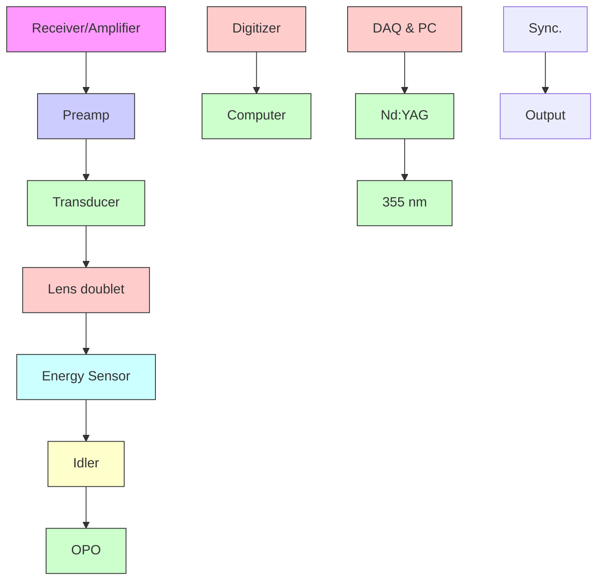
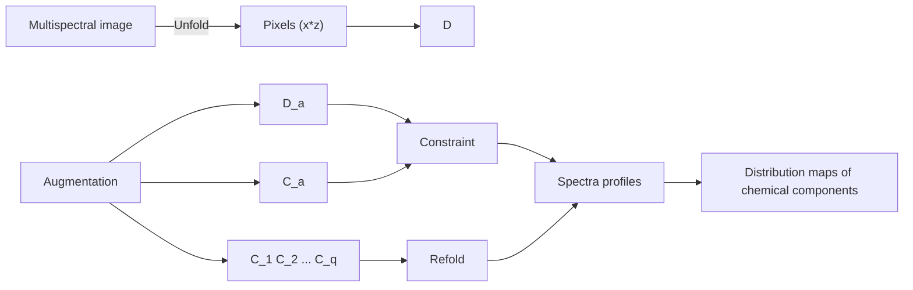

## Biomedical Optics

SPIEDigitalLibrary.org/jbo

# Mapping lipid and collagen by multispectral photoacoustic imaging of chemical bond vibration

Pu Wang

Ping Wang

Han-Wei Wang

Ji-Xin Cheng

# Mapping lipid and collagen by multispectral photoacoustic imaging of chemical bond vibration

Pu Wang,a Ping Wang,b Han-Wei Wang,a and Ji-Xin Chenga,b

a Purdue University, Weldon School of Biomedical Engineering, West Lafayette, Indiana 47907

b Purdue University, Department of Chemistry, West Lafayette, Indiana 47907

Abstract. Photoacoustic microscopy using vibrational overtone absorption as a contrast mechanism allows bondselective imaging of deep tissues. Due to the spectral similarity of molecules in the region of overtone vibration, it is difficult to interrogate chemical components using photoacoustic signal at single excitation wavelength. Here we demonstrate that lipids and collagen, two critical markers for many kinds of diseases, can be distinguished by multispectral photoacoustic imaging of the first overtone of C-H bond. A phantom consisting of rat-tail tendon and fat was constructed to demonstrate this technique. Wavelengths between 1650 and 1850 nm were scanned to excite both the first overtone and combination bands of C-H bonds. B-scan multispectral photoacoustic images, in which each pixel contains a spectrum, were analyzed by a multivariate curve resolution-alternating least squares algo rithm to recover the spatial distribution of collagen and lipids in the phantom. © 2012 Society of Photo-Optical Instrumentation Engineers (SPIE). [DOI: 10.1117/1.JBO.17.9.096010]

Keywords: multispectral imaging; photoacoustic imaging; vibrational imaging; overtone vibration; multivariate curve resolution alternating least squares; collagen; fatty tissue.

Paper 12099L received Feb. 10, 2012; revised manuscript received Aug. 3, 2012; accepted for publication Aug. 21, 2012; published online Sep. 14, 2012.

Photoacoustic detection of vibrational overtone absorption was reported by Patel and Tam in 1979.1 Recently this method has been brought to the imaging field to enable label-free detection of lipids and water in tissues or tissue phantoms.2–7 Photoacoustic imaging using vibrational overtone absorption as a contrast mechanism is appealing because of the following advantages: 1. The signal arises from the absorption of specific chemical bonds, thus providing chemical selectivity; 2. by excitation at specific near-infrared (NIR) regions, where blood absorption and tissue scattering are reduced and water absorption has a local minimum, millimeter-to-centimeter scale tissue penetration can be reached; 3. tissue damage is significantly reduced by applying excitation at NIR regions, so that higher pulse energy can be used to compensate the relatively low cross-section of overtone absorption. Among recent studies, excitation at 1210 nm has been exploited to visualize lipid abundant plaques, owing to the contrast from the second overtone vibration of C-H bond.2,4–6 More studies show that by utilizing excitation at 1730 nm, where the first overtone of C-H vibration is located, photoacoustic signal of lipid is enhanced compared to that with 1210-nm excitation.1,3,8

In this study, we further explore the capability of photoacoustic imaging by taking advantage of the spectral information embedded in a vibrational overtone spectrum. In our previous study, CH and CH groups were shown to have distinctive spectral profiles.3 Those distinctive features offer exciting opportunities to distinguish lipids and collagen that are rich in CH and CH groups, respectively. This area of study is important because lipid deposition and collagen remodeling occur in many kinds of human diseases, including atherosclerosis and fatty liver diseases.9,10

Using multiple wavelengths to differentiate absorbers according to their electronic absorption profiles has been well appreciated in photoacoustic imaging of blood oxygenation, 11,12 atherosclerotic plaque,13 and fluorescent agents and nanoparti cles in live animals.14–17 For photoacoustic microscopy that uses molecular vibration absorption as contrast, differentiating che mical components in biological specimen is particularly challen ging due to the complexity of the NIR absorption spectra. To deal with those challenges, we implement multispectral imaging by scanning excitation wavelengths through a specific spectral window and then apply an advanced chemometrics method for quantitative analysis. Specifically, we have exploited the multivariate curve resolution-alternating least squares (MCR-ALS) method18 to recover the concentration profiles and spectral profiles from spectroscopic images. MCR-ALS has been previously used for processing hyperspectral fluorescence image,19 Raman spectroscopic image20,2 and NIR spectroscopic image.2 Its application to compositional analysis of photoacoustic images is reported for the first time here.

Our experimental setup is shown in Fig. 1(a). A Nd:YAG pumped optical parametric oscillator (OPO, Panther Ex Plus, Continuum) was the excitation source. The excitation module provided 10 Hz, 5 ns pulsed laser tunable from 400 up to 2500 nm. The OPO idler beam was directed to an inverted microscope (IX71, Olympus) and was focused into a specimen by an achromatic doublet lens with 30-mm focal length (Thorlabs). A focused-type, 20-MHz ultrasound transducer with a 50% bandwidth (V317, Olympus NDT) detected the photoacoustic signal. A 30-dB low noise preamplifier (5682, Olympus NDT) and a receiver (5073PR-15-U, Olympus NDT) with adjustable gain were used after the transducer. The signal was then sent to a digitizer (USB-5133, National Instrument) and recorded by a LabVIEW (National Instrument) program.

Address all correspondence to: Ji-Xin Cheng, Weldon School of Biomedical Engineering, Purdue University, West Lafavette, Indiana, 47907., Tel: +1 765- 494-4335; Fax: +1 765-496-1912; E-mail: jcheng@purdue.edu

0091-3286/2012/\$25.00 © 2012 SPIE

flowchart

text_image

(b)
Phantom construction
Z
B-scan image
Fat tissue
Rat tail tendon
(collagen)
Agarose-D₂O gel
X

Fig. 1 (a) Schematic drawing of the setup for multispectral photoacoustic imaging. The multispectral B-scan images were obtained automatically by sequentially tuning the OPO crystal after acquiring a B-scan image. (b) Schematic of the phantom construction. The white stripe-shape indicates rat tai tendon, and the yellow bulk indicates the fat tissue.

By computer-controlled scanning of OPO wavelengths, B-scan images at each wavelength were acquired with a sample scanning stage (ProScan H117, Prior) to form a multispectral photoacoustic image. The signal intensity in each B-scan image was normalized according to the irradiation pulse energy monitored by an energy sensor. The recorded signal waveforms were analyzed on a MATLAB (MathWorks) platform. Hilbert transformation was performed to retrieve the envelope of the signal amplitude. The signals were reconstructed into a three-dimensional (3-D) array $( x , \ z , \ \lambda )$ . The vibrational overtone spectra of the rat tail tendon and fat tissue can also be obtained by averaging the spectral profiles at pixels within the regions where the tendon and fat tissue are presented.

Rat-tail tendon and subcutaneous fat were harvested from the Sprague Dawley rats and served as collagen abundant tissue and lipid abundant tissue, respectively. The dry mass of the rat-tail tendon is composed of aligned collagen fibers, and the fat tissue is mainly composed of triglyceride-rich adipocytes. As shown in Fig. 1(b), both tissues were placed in a glass-bottom dish and embedded in agarose- $\mathbf { \nabla } \cdot \mathbf { D } _ { 2 } \mathbf { O }$ gel. The phantom was covered with $\mathbf { D } _ { 2 } \mathbf { O }$ on the top as a coupling medium to the transducer. The use of agarose $\mathbf { \nabla } \cdot \mathbf { D } _ { 2 } \mathbf { O }$ gel instead of a water-based gel avoided the overtone absorption of the O-H bond in the spectral window under investigation.

The MCR-ALS analysis is illustrated in Fig. 2. The constructed multispectral image as a 3-D matrix $( x \times z \times \lambda )$ is unfolded into a two-dimensional (2-D) matrix D with the size of $( [ x \times z ] \times \lambda )$ , in which the rows are spectra of different pixels. This data set is fit by a bilinear model to produce two matrices, C and $S ^ { T } .$ , plus an error matrix, $E ,$ , expressed as

$$
D = C S ^ {T} + E. \tag {1}
$$

Each row in $S ^ { T } ,$ , which has the size $( q \times \lambda )$ , represents the spectrum of one of the $q$ chemical components (blue block in Fig. 2). Each column in $C ,$ which is sized $( [ x \times z ] \times q )$ , represents the distribution of one of the $q$ components. The matrix $C$ is then refolded to $q$ images, representing distribution map of $q$ chemical components (green block in Fig. 2).

An ALS algorithm23 was exploited to solve the MCR bilinear model. This algorithm iteratively optimizes the spectral matrix

flowchart

Fig. 2 Flow chart of MCR-ALS. The input is a multispectral image and the outputs are concentration maps and spectral profiles of each component in matrix forms $( C _ { q }$ and ${ S _ { q } } ^ { T } ,$ , respectively).

$S ^ { T }$ and the distribution matrix C, with the aid of various constraints $( \mathrm { e . g } $ . nonnegativity, unimodality, closure) according to the chemical properties and origin of mathematics to reduce the ambiguity.24,25 In our case, the vibrational overtone spectra of both collagen and fat tissues were obtained as a priori knowledge and were used as initial condition in the MCR-ALS process. Since the spectra of the components and the concentration are both nonnegative, a nonnegative constraint was employed in the ALS algorithm.24 In our case, 0.01% was selected as the convergence criterion. The data analysis process was performed by a MATLAB package described in reference.23

A matrix-augmentation analysis method was further introduced to increase the chemical selectivity of the ALS process. Data augmentation by adding the matrix containing spectra of pure components for the fitting process gives the pure components spectra more weight in ALS process and therefore reduces ambiguities in the solution to the MCR bilinear model. As used in hyperspectral NIR imaging,22,26 an augmentation matrix $D _ { a } ,$ composed of repeating spectra of the chemical components (red block in Fig. 2), can be added to the unfolded matrix D. The bilinear model is then rewritten as

$$
\binom {D _ {a}} {D} = \binom {C _ {a}} {C} S ^ {T} + \binom {E _ {a}} {E}. \tag {2}
$$

An equality constraint was then applied (purple block in Fig. 2), in which matrix $C _ { a }$ is constrained to the quotient of augmentation matrix $D _ { a }$ and the initial spectral matrix $S ^ { T } { \mathrm { { \ i n i t i a l } } }$ . This process ensures that the MCR-ALS method selectively recovers the spectra and distribution profiles of the chemical components under investigation.

We used a phantom consisted of rat-tail tendon (rich in collagen) and fat tissue (rich in lipids) to prove the concept of multispectral photoacoustic imaging of collagen and lipids. Photoacoustic images at 60 wavelengths in the region from 1650 to 1850 nm, where the first overtone vibration of CH bond resides, were recorded to create a B-scan multispectral image in which each pixel contains a vibrational overtone spectrum. The multispectral images of the collagen-fat tissue phantom are shown in Fig. 3(a). A total of 60 B-scan images were acquired to form the multispectral image, covering the spectral range from 1650 to 1800 nm. In Fig. 3(b), four photoacoustic images were shown under selected excitations at 1690, 1730, 1765, and 1800 nm. The rat-tail tendon shows a stripe-shape on the left side, while the fat tissue shows a cluster-shape on the right side. The images correlate with the construction of the phantom, which is shown in Fig. 1(b). Figure 3(c) and 3(d) shows the spectral profiles and the component distribution maps of the collagen and fat in rat-tail tendon and fat tissue phantom recovered by MCR-ALS method. As shown in the Fig. 3(c), absorption spectra of both tissues overlapped with each other at first overtone region of CH bond vibration. The spectrum of collagen $( S _ { 1 } { } ^ { T } )$ ) has a peak at ∼1725 nm, which is assigned to combination band of asymmetric and symmetric stretching of $\mathrm { C H } _ { 2 }$ bond. There is a shoulder at ∼1690 nm, which is thought to be the first overtone of $\mathrm { C H } _ { 3 }$ stretching. The spectrum of fat tissue $( S _ { 2 } ^ { \phantom { \dagger } T } )$ has the two primary peaks at ∼1730 and 1760 nm, as the result of a large amount of $\mathrm { C H } _ { 2 }$ groups in the fatty acid chain. In Fig. 3(d), the images were the re-folded results from the distribution matrix C, which is described previously. The upper row in Fig. 3(d) is the distribution map of collagen and the lower row is that of fat. As shown in the figure, the collagen content is mainly distributed in the area where rat-tail tendon is located and lipid content is mainly distributed in the area where fat tissue is located. This result clearly indicates that the chemical components such as collagen and fat can be successfully differentiated in biological tissue.

(a)  

natural_image

3D diagram of layered structures with X, Y, Z axis indicators (no text or symbols)

(c)

line chart

| Wavelength (nm) | Collagen x 5 (S₁ᵀ) Intensity (a.u.) | Fat tissue (S₂ᵀ) Intensity (a.u.) |
| --------------- | ----------------------------------- | -------------------------------- |
| 1700            | ~45                                 | ~15                              |
| 1725            | ~60                                 | ~50                              |
| 1750            | ~40                                 | ~30                              |
| 1775            | ~25                                 | ~20                              |
| 1800            | ~15                                 | ~10                              |

(b)  

text_image

Rat tail tendon Fat tissue
1690 nm
1730 nm
1765 nm
1800 nm
1 mm

(d)  

text_image

Collagen Channel (C₁)
Fat Channel (C₂)
z
x
1 mm

Fig. 3 Multispectral photoacoustic images of the tissue phantom composed of tendon and fat with augmented MCR-ALS analysis: (a) multispectral photoacoustic images of phantom of tendon and fat; (b) selected photoacoustic images of phantom of tendon and fat at wavelengths of 1690, 1730, 1765, and 1800 nm; (c) spectral profiles recovered from augmented MCR-ALS analysis; (d) distribution maps of collagen and lipid yielded by MCR-ALS analysis of the multispectral photoacoustic image $\dot { C } _ { 1 } \dot { : }$ : distribution map of chemical component corresponding to the collagen spectral profile, $S _ { 1 } ^ { \textit { T } } . { \cal { C } } _ { 2 } ^ { \textit { s } }$ : distribution map of chemical component corresponding to the fat spectral profile, $S _ { 2 } ^ { \phantom { \dagger } } ^ { \phantom { \dagger } }$ .

To evaluate the augmentation process, we compared the measured vibrational overtone spectra of the chemical components, the spectra recovered from augmented MCR-ALS, and the spec tra recovered from nonaugmented MCR-ALS analysis (Fig. 4). For the spectral profiles of collagen [Fig. 4(a)], the spectrum from augmented MCR-ALS (red solid line) is close to the measured spectrum from collagen (green dash line). However, the nonaugmented MCR-ALS couldn’t resolve the correct spectral profile of collagen. For the spectral profiles of fat tissue [Fig. 4(b)], on the other hand, the measured spectrum of fat and the spectrum from augmented MCR-ALS and nonaugmen ted MCR-ALS are similar. As we noticed that the photoacoustic signal from the fat tissue is higher than that from tendon, it is indicated that the spectral resolvability of MCR-ALS methods largely depends on the signal level, which determine the image quality. Fortunately, these problems can be overcome by the augmented MCR-ALS analysis.

line chart

| Wavelength (nm) | Measured spectrum of collagen | Augmented MCR-ALS | Non-augmented MCR-ALS |
| --------------- | ----------------------------- | ----------------- | --------------------- |
| 1700            | ~50                           | ~50               | ~0                    |
| 1725            | ~60                           | ~65               | ~0                    |
| 1750            | ~40                           | ~40               | ~30                   |
| 1775            | ~20                           | ~20               | ~50                   |
| 1800            | ~15                           | ~15               | ~45                   |
| 1825            | ~10                           | ~10               | ~35                   |
| 1850            | ~5                            | ~5                | ~25                   |

line chart

| Wavelength (nm) | Measured spectrum of fat | Augmented MCR-ALS | Non-augmented MCR-ALS |
| --------------- | ------------------------ | ----------------- | --------------------- |
| 1700            | ~10                      | ~15               | ~20                   |
| 1725            | ~50                      | ~55               | ~60                   |
| 1750            | ~30                      | ~35               | ~25                   |
| 1775            | ~20                      | ~25               | ~15                   |
| 1800            | ~10                      | ~10               | ~5                    |
| 1825            | ~5                       | ~5                | ~2                    |
| 1850            | ~2                       | ~2                | ~1                    |

Fig. 4 Spectra profiles of (a) collagen and (b) fat derived from vibrational overtone spectroscopy measurements, augmented MCR-ALS analysis, and nonaugmented MCR-ALS analysis.

Compared with the linear inversion method, which determines the concentration maps by least-squares fitting of the multispectral images using known spectral profiles of pure com ponents, MCR analysis has two advantages. First, applying MCR analysis, one can theoretically determine the major components of a specimen and map the concentrations of each component without a priori knowledge of the chemical compositions and their spectroscopic information. Therefore this method can be potentially used for real tissue analysis in which the spectral profiles of major components are unknown. Second, when dealing with deep-tissue spectra analysis, in which the spectra profiles of the major components are corrupted by the wavelength dependence of the fluence distribution, a simple linear inversion method fails because complex light scattering and absorption in deep tissue alter the spectra profiles. On the other hand, the MCR-ALS method uses the spectra profiles from the pure components as initial input for the iterative optimization. Once the self-optimization process reaches a convergence, the finally resolved spectra profiles match the real spectra profiles of the components in deep tissue. Notably, the MCR analysis is also based on a linear model. Therefore the problem of nonlinear behavior of the spectral profile in different depth of the tissue cannot be completely solved by MCR-ALS method, which limits the method to microscopy study in current stage.

In summary, we have demonstrated that fat and collagen can be differentiated by multispectral photoacoustic imaging of overtone bands with MCR-ALS analysis. This method opens many opportunities in biomedical imaging, such as diagnosis of vulnerable plaques having a thin collagen cap, and selective detection of fibrotic versus fatty liver. Moreover, as the optical resolution photoacoustic microscopy successfully brought in the applications in micro-structure studies,27,28 we could potentially develop optical resolution multispectral photoacoustic microscopy and apply it to differentiation of lipid and protein at single cell level.

## Acknowledgments

This work was supported by NIH R21 RR032384 to J.X.C. and American Heart Association Predoctoral Fellowship to PW.

## References

1. C. K. N. Patel and A. C. Tam, “Optical absorption coefficients of water,” Nature 280(5720), 302–304 (1979).  
2. H.-W. Wang et al., “Label-free bond-selective imaging by listening to vibrationally excited molecules,” Phys. Rev. Lett. 106(23), 238106 (2011).  
3. P. Wang et al., “Bond-selective imaging of deep tissue through the opti cal window between 1600 and 1850 nm,” J. Biophoto. 5(1), 25–32 (2012).  
4. B. Wang et al., “Detection of lipid in atherosclerotic vessels using ultrasound-guided spectroscopic intravascular photoacoustic imaging,” Opt. Express 18(5), 4889–4897 (2010).  
5. K. Jansen et al., “Intravascular photoacoustic imaging of human coronary atherosclerosis,” Opt. Lett. 36(5), 597–599 (2011).  
6. T. Allen et al., “Photoacoustic imaging of lipid rich plaques in human aorta,” Proc. SPIE 7564, 75640C (2010).  
7. Z. Xu, C. Li, and L. V. Wang, “Photoacoustic tomography of water in phantoms and tissue,” J. Biomed. Opt. 15(3), 036019 (2010).  
8. B. Wang et al., “Intravascular photoacoustic imaging of lipid in atherosclerotic plaques in the presence of luminal blood,” Opt. Lett. 37(7), 1244–1246 (2012).  
9. A. J. Lusis, “Atherosclerosis,” Nature 407(6801), 233–241 (2000).  
10. J. C. Cohen, J. D. Horton, and H. H. Hobbs, “Human fatty liver disease: Old questions and new insights,” Science 332(6037), 1519–1523 (2011).  
11. H. F. Zhang et al., “Functional photoacoustic microscopy for highresolution and noninvasive in vivo imaging,” Nat. Biotech. 24(7), 848–851 (2006).  
12. I. Y. Petrova et al., “Noninvasive monitoring of cerebral blood oxygenation in ovine superior sagittal sinus with novel multi-wavelength optoacoustic system,” Opt. Express 17(9), 7285–7294 (2009).  
13. S. Sethuraman et al., “Spectroscopic intravascular photoacoustic imaging to differentiate atherosclerotic plaques,” Opt. Express 16(5), 3362–3367 (2008).  
14. D. Razansky et al., “Multispectral opto-acoustic tomography of deep-seated fluorescent proteins in vivo,” Nat. Photon. 3(7), 412–417 (2009).  
15. D. Razansky, C. Vinegoni, and V. Ntziachristos, “Multispectral photoacoustic imaging of fluorochromes in small animals,” Opt. Lett. 32(19), 2891–2893 (2007).  
16. K. H. Song et al., “Noninvasive in vivo spectroscopic nanorod-contrast photoacoustic mapping of sentinel lymph nodes,” Euro. J. Radiology 70(2), 227–231 (2009)  
17. S. Mallidi et al., “Multiwavelength photoacoustic imaging and plasmon resonance coupling of gold nanoparticles for selective detection of cancer,” Nano Lett. 9(8), 2825–2831 (2009).  
18. A. de Juan and R. Tauler, “Multivariate curve resolution (mcr) from 2000: Progress in concepts and applications,” Cri. Re. Anal. Chem. 36(3–4), 163–176 (2006).  
19. D. M. Haaland et al., “Hyperspectral confocal fluorescence imaging: exploring alternative multivariate curve resolution approaches,” Appl. Spectrosc. 63(3), 271–279 (2009).  
20. A. d. Juan et al., “Spectroscopic imaging and chemometrics: a powerful combination for global and local sample analysis,” TrAC Trends Anal. Chem. 23(1), 70–79 (2004).  
21. S. Piqueras et al., “Resolution and segmentation of hyperspectral biomedical images by multivariate curve resolution-alternating least squares,” Analytica Chimica Acta 705(1–2), 182–192 (2011).  
22. J. Cruz et al., “Nir-chemical imaging study of acetylsalicylic acid in commercial tablets,” Talanta 80(2), 473–478 (2009).  
23. J. Jaumot et al., “A graphical user-friendly interface for MCR-ALS: a new tool for multivariate curve resolution in MATLAB,” Chemomet. Intell. Lab. Sys. 76(1), 101–110 (2005).  
24. R. Bro and S. De Jong, “A fast non-negativity-constrained least squares algorithm,” J. Chemom. 11(5), 393–401 (1997).  
25. R. Bro and N. D. Sidiropoulos, “Least squares algorithms under unimod ality and non-negativity constraints,” J. Chemom. 12(4), 223–247 (1998).  
26. J. M. Amigo et al., “Study of pharmaceutical samples by NIR chemicalimage and multivariate analysis,” TrAC Trends in Anal. Chem. 27(28), 696–713 (2008).  
27. S. Hu, K. Maslov, and L. V. Wang, “Second-generation opticalresolution photoacoustic microscopy with improved sensitivity and speed,” Opt. Lett. 36(7), 1134–1136 (2011).  
28. P. Hajireza, W. Shi, and R. J. Zemp, “Real-time handheld opticalresolution photoacoustic microscopy,” Opt. Express 19(21), 20097–20102 (2011).