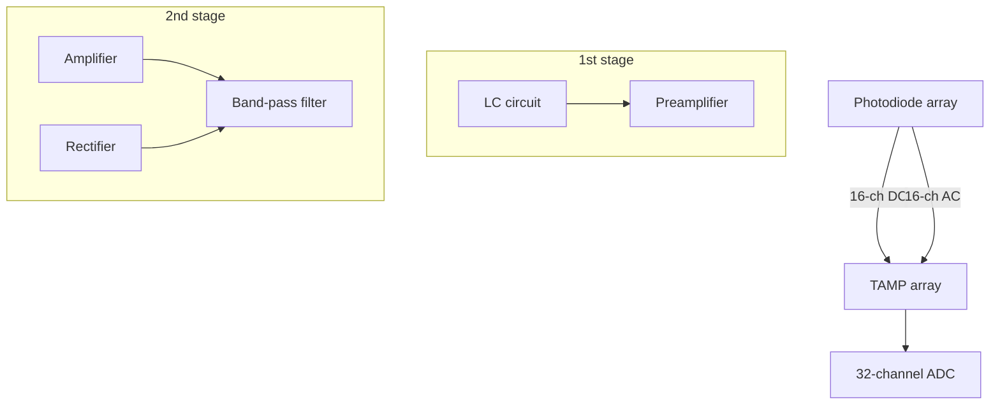

## ORIGINAL ARTICLE

# Microsecond scale vibrational spectroscopic imaging by multiplex stimulated Raman scattering microscopy

Chien-Sheng Liao1,\*, Mikhail N Slipchenko1,\*, Ping Wang1,\*, Junjie Li2 , Seung-Young Lee1 , Robert A Oglesbee3 and Ji-Xin Cheng1,3

Real-time vibrational spectroscopic imaging is desired for monitoring cellular states and cellular processes in a label-free manner. Raman spectroscopic imaging of highly dynamic systems is inhibited by relatively slow spectral acquisition on millisecond to second scale. Here, we report microsecond scale vibrational spectroscopic imaging by lock-in free parallel detection of spectrally dispersed stimulated Raman scattering signal. Using a homebuilt tuned amplifier array, our method enables Raman spectral acquisition, within the window defined by the broadband pulse, at the speed of 32 ms and with close to shot-noise limited detection sensitivity. Incorporated with multivariate curve resolution analysis, our platform allows compositional mapping of lipid droplets in single live cells, observation of intracellular retinoid metabolism, discrimination of fat droplets from protein-rich organelles in Caenorhabditis elegans, spectral detection of fast flowing tumor cells and monitoring drug diffusion through skin tissue in vivo. The reported technique opens new opportunities for compositional analysis of cellular compartment in a microscope setting and high-throughput spectral profiling of single cells in a flow cytometer setting.

Light: Science & Applications (2015) 4, e265; doi:10.1038/lsa.2015.38; published online 27 March 2015

Keywords: optical microscopy; Raman scattering; vibrational spectroscopy

## INTRODUCTION

The stimulated Raman scattering (SRS) process, first reported by Woodbury and $\mathrm { N g } ^ { 1 }$ in 1962, has recently been employed for highspeed vibrational imaging.2–7 SRS is a third order nonlinear optical process, which involves two laser fields, namely, a pump field at $\omega _ { \mathrm { { p } } }$ and a Stokes field at $\omega _ { \mathrm { { S } } } .$ . When the beating frequency $( \omega _ { \mathrm { p } } - \omega _ { \mathrm { S } } )$ is tuned to excite a molecular vibration, the energy difference between $\omega _ { \mathrm { { p } } }$ and $\omega _ { S }$ pumps the molecule from a ground state to a vibrationally excited state. The laser field manifests itself as a weak decrease in pump beam intensity, called stimulated Raman loss (SRL), and a corresponding increase in Stokes beam intensity, called stimulated Raman gain. In the case of SRL, to measure the weak laser intensity change, usually on the order of 0.01% or smaller, the Stokes beam intensity I is modulated and the pump beam intensity $I _ { \mathrm { p } }$ is recorded by a photodiode. The induced modulation is then extracted by a lock-in amplifier. Theoretically, the modulation depth induced by SRL, $I _ { \mathrm { S R L } } / I _ { \mathrm { p } } ,$ is linearly proportional to the Raman cross-section s, molar concentration of the target molecule N and the Stokes beam intensity, i.e., I $/ I _ { \mathrm { p } }$ / s N $I _ { \mathrm { S } } .$ To date, fast SRS imaging has mostly been implemented by narrowband laser excitation of single isolated Raman band. However, without the ability to resolve overlapping Raman bands contributed by target molecules and background tissue components, single-color SRS is only applicable to study known species using their isolated Raman bands.

Thus, there has been a great effort in developing high-speed vibrational spectroscopic imaging techniques based on spectral tuning of narrowband lasers or broadband laser excitation (Figure 1a and 1b). Hyperspectral SRS8–10 ${ \mathsf { S R S } } ^ { 8 - 1 0 }$ or coherent anti-Stokes Raman scattering (CARS) 11–13microscopy has been demonstrated by spectral scanning of a narrowband laser and collection of images at a series of Raman shifts. Nevertheless, this approach is not applicable to highly dynamic organelles in live cells or fast flowing objects. Multiplex CARS microscopy has been developed by parallel detection of spectrally dispersed signals using an array of sensitive charge-coupled device,14,15 with a pixel dwell time as short as 3.5 milliseconds (ms).16 This most advanced multiplex CARS technique has been applied to perform chemical histology of fixed biological tissues.16 Multi-color SRS imaging has been demonstrated by using three independent lock-in amplifiers.17 With such a scheme the acquisition of a complete Raman spectrum is difficult. Parallel detection of SRS signals has been demonstrated recently by using a CMOS (complementary metal oxide semiconductor) array18 or a multi-channel lock-in amplifier,19 both having a moderate detection sensitivity of 1024 dI/I modulation depth. Notably, the maximum modulation frequency of current multi-channel lock-in amplifiers is less than 100 kHz.20 At such modulation frequency the 1/f laser noise is considerable, which limits the detection sensitivity as well as imaging speed of SRS microscopy.

line chart

| Frequency | Peak Label |
| --------- | ---------- |
| ω_s       | ΔI_s(SRG)  |
| ω_p1      | ΔI_p(SRL)  |
| ω_p2      |          |
| ω_p3      |          |

b

line chart

| Frequency (ω) | ΔI_s(SRG) | ΔI_p(SRL) |
| ------------- | --------- | --------- |
| ω_s           | Peak      | -         |
| ω_p1          | -         | Peak      |
| ω_p2          | -         | Peak      |
| ω_p3          | -         | -         |

c  

flowchart

d  

natural_image

Green printed circuit board with multiple connectors and a coin for scale (no visible text or symbols)

Figure 1 SRL spectroscopic imaging based on lock-in free parallel detection. (a) With $\omega _ { \mathsf { p } } – \omega _ { \mathsf { S } }$ tuned to a molecular vibration at frequency V, the pump beam intensity is slightly decreased by SRL and the Stokes beam intensity is slightly increased by SRG. An SRL spectrum can be generated by scanning the narrowband v with the fixed narrowband $\omega _ { \mathsf { S } } .$ . (b) An SRL spectrum can be generated with narrowband v and broadband $\omega _ { \mathsf { p } }$ excitation. (c) Parallel detection of spectrally dispersed SRL signals by using a TAMP array. The pump beam was dispersed on a photodiode array. The AC part from the 16 channels was sent into the TAMP array. The output of the TAMP array was sent to an ADC. The DC part was sent directly to ADC for calibration of the AC signals. (d) Digital pictures of the first stage of the TAMP array. The dimension of single channel is 1.2031030.250. AC, alternating current; ADC, analog-to-digital converter; DC, direct current; SRG, stimulated Raman gain; SRL, stimulated Raman loss; TAMP, tuned amplifier.

Here, to overcome the above mentioned limitations, we demonstrate SRL spectroscopic imaging by lock-in free parallel detection (Figure 1b and Supplementary Fig. S1). Recently we showed that SRS signals at MHz laser modulation frequency could be extracted and amplified by a resonant circuit, and then rectified for digitization.21 Because the resonant circuit is essentially a chip as small as a quarter, an array can be assembled to allow for parallel acquisition of multiple signals. We harnessed the compactness of our tuned amplifier (TAMP) and constructed a 16-channel TAMP array (Figure 1c and 1d and Supplementary Fig. S2), which allowed parallel detection of spectrally dispersed SRL signals as small as 1026 dI/I modulation depth with 32 ms pixel dwell time.

## MATERIALS AND METHODS

## Lab-built multiplex SRL microscope

Our multiplex SRL microscope is based on hybrid scanning of specimens and parallel detection of spectrally dispersed SRL signals (Supplementary Fig. S1). Briefly, a tunable 80 MHz pulsed laser (InSight; Spectra Physics, Santa Clara, CA, USA) provided two synchronized outputs. The tunable pump beam provided up to 1.0 W power, 120 fs pulse duration, and a tuning range from 680 to 1300 nm. The fixed 1040 nm beam with ,0.5 W average power and ,200 fs pulse width served as the Stokes beam. The Stokes beam was modulated at 2.1 MHz by an acousto-optic modulator and sent into a pulse shaper to narrow the spectral width. The FWHM was measured to be 2.3 ps by an autocorrelator and the power was 50 mW. The pump and Stokes beams were collinearly combined and directed into a homebuilt laser-scanning microscope. A 403 objective (LUMPLFLN 40XW; Olympus, Tokyo, Japan) was used for imaging flowing objects, and a 603 objective (UPLSAPO 60XW; Olympus) was used for other imaging demonstrations. The focal spot sizes at 800 nm by the 403 and 603 objectives were calculated to be 570 nm and 425 nm, respectively. The pump and Stokes powers on the sample were 15 mW and 25 mW, respectively. This laser power was below the photodamage threshold measured by Zhang et al.6 For SRL spectroscopic imaging, the pump beam was collected by an oil condenser in order to optimize the collection efficiency, and then dispersed by two diffraction gratings (1200 groove mm21 ). To maintain the spectral resolution, the direction of the beam on the plane of dispersion should be static during the image scan. For that purpose, we employed a stage scan scheme in the direction of the beam dispersion at speed of 40 mm s21 , and a mirror scan scheme in the direction perpendicular to the dispersion plane. This hybrid scanning scheme allowed fast SRL imaging with a pixel dwell time down to 32 ms.

Using a 1.0 m focal length lens, the dispersed pump beam with 180 cm21 bandwidth was fully covered by a photodiode array (S4114-35Q, 0.934 mm2 per element; Hamamatsu, Hamamatsu City, Japan). Two cylindrical lenses, combined with the 1.0 meter focal length lens, were used to conjugate the plane on the photodiode array to the back aperture of the condenser. The photocurrent from each photodiode was sent into the TAMP array, and the amplified AC (alternating current) signals were collected by a 32-channel analog-todigital converter board (PCI-6259; National Instruments, Austin, TX, USA) with a 1 MHz acquisition rate. The characteristic of each TAMP is shown in Supplementary Fig. S2 and discussed in detail in Supplementary Information.

## SRL spectral recording by lock-in free parallel detection

Supplementary Fig. S3 shows the generation of a SRL spectrum of 100% dimethyl sulfoxide (DMSO) solution at the DMSO/air interface by lock-in free parallel detection with 32 ms dwell time. First, the DC (direct current) output which measured the intensity of the local oscillator on each spectral channel provided the spectrum of the pump laser (Supplementary Fig. S3a). By fitting the 16-channel DC outputs to the spectrum measured independently by a spectrometer, we performed spectral calibration and determined the dispersion to be 0.4 nm mm2 on the photodiode array. Based on the calibration and the wavelength of the Stokes beam fixed at 1040 nm, the Raman shifts were calculated. Second, the AC signal gains for each channel were measured by introducing small intensity modulation in the pump beam and fitting the AC profile to DC profile. The gain profile and the DC profile were combined to calibrate the raw data. The calibrated SRL spectral profile well reproduced the polarized Raman spectrum for DMSO (Supplementary Fig. S3b).

## Chemicals and cell cultures

Cholesteryl oleate and glyceryl trioleate were purchased from Sigma-Aldrich. Prostate cancer PC3 cells were cultured in F-12K medium (ATCC) supplemented with 10% FBS (Sigma-Aldrich) in a humidified atmosphere of 5% CO at 37 6C. For the compositional analysis of lipid droplets, PC3 cells (0.33106 ) were seeded in glass bottom dishes (In Vitro Scientific). After overnight incubation, the media was replaced with fresh media supplemented with 10 mM avasimibe or DMSO. The cells were then cultured for 2 days. For SRL spectroscopic imaging of all-trans retinol treated cancer cells, pancreatic cancer MIA PACA-2 cells were seeded in glass-bottom dishes at a density of 105 cells mL21 . After overnight incubation, all-trans retinol dissolved in ethanol was added to the culture medium at final concentration of 100 mM. Equal amount of ethanol was added to the control group. Images were taken 24 h after the treatment. For SRL spectroscopic imaging of fast flowing PC3 cells, PC3 cells (,13106 ) were harvested in 1 mL PBS prior to the experiment and then loaded by a syringe pump (PHD2000; Harvard Apparatus) into a glass tube (300 mm inner diameter; World Precision Instrument) at a speed of 0.5 mm s21 .

## Spontaneous Raman spectroscopy

The spontaneous Raman spectra of targeted objects were taken by a Raman spectromicroscopy set-up described previously.22

Multivariate curve resolution analysis of SRL spectroscopic images We adopted multivariate curve resolution (MCR) and alternating least squares fitting to decompose the SRL spectral images into chemical maps of the specimen.10 MCR is a bilinear model,23 capable of decomposing a measured spectral data set D into concentration profiles and spectra of chemical components, represented by matrices C and $\mathbf { S ^ { T } } , \mathbf { D } { \mathbf { = } } \mathbf { \hat { C } } { \mathbf { \cdot } } \mathbf { S ^ { T } } { \mathbf { + } } \mathbf { E } .$ Here, T means the transpose of matrix S. E is the residual matrix or experimental error. The inputs to MCR are the dataset D and the reference spectra of each component. S contains the output spectra of all fitted components. The output concentration of a chemical component at each pixel is expressed as a percentage relative to the intensity of the

MCR-optimized spectrum. Given an initial estimate of pure spectra either from principal component analysis or prior knowledge, an altern ating least squares algorithm calculates C and S iteratively until the results optimally fit the data matrix D. Non-negativity on both concentration maps and spectral profiles is applied as a constraint during the alternating least squares iteration. In order to reduce ambiguity associated with MCR decomposition,24 a data augmentation matrix composed of repeating reference spectra, if needed, can be added to the spectral dataset D. The enhanced weight on pure reference spectra ensures that the MCR algorithm selectively recovers concentration profiles for the corresponding Raman bands from dataset D.

## Worm preparation

Wild-type (N2) Caenorhabditis elegans (C. elegans) strains were obtained from the Caenorhabditis Genetics Center and cultured on agar plates seeded with OP50 Escherichia coli at 20 6C. Worms were placed on a 5% agrose gel (Sigma) sheet with less than 1 mm thickness, which minimizes the animal motion during imaging.

## Following drug diffusion through the mouse skin tissue in vivo

The protocol for this animal study was approved by the Purdue Animal Care and Use Committee. A male athymic nude mouse (6- week-old) under inhalation anesthesia by isoflurane was used for in vivo imaging.

## SRL spectral analysis of polymer microsphere mixture

A mixture of polystyrene and poly(methyl methacrylate) beads (10 mm diameter; Phosphorex) was prepared by mixing microsphere solutions together with water and vortexed for 30 s. A droplet of solution was placed on a coverslip for 10 min. The dried microsphere mixture was then sealed for imaging. For SRL spectroscopic imaging of flowing microspheres, a syringe pump (PHD2000; Harvard Apparatus) was used to pump the mixture into a glass tube (300 mm inner diameter; World Precision Instrument) at a flow speed of 1.0 mm s21

## RESULTS AND DISCUSSION

## Distinguishing target molecules from bulk solvent

Our spectral detection scheme is capable of extracting the signal of target molecules from the solvent in SRL microscopy. This capability is shown through SRL spectroscopic imaging of a diluted aqueous solution of DMSO. Using DMSO spectrum and water spectrum as inputs for least squares fitting, the 1.6% aqueous solution of DMSO was successfully decomposed into two concentration maps of water and DMSO (Figure 2a–2d). The SRL signal from water solvent predominated over DMSO. Nevertheless, least squares fitting of the images was able to extract the SRL signal of 1.6% DMSO (dI/I5531026 ) from the solvent and reproduced the real concentration of DMSO (Figure 2e).

## Compositional analysis of lipid droplets in single live cells

Our imaging platform is capable of resolving the content of a dynamic cellular compartment such as lipid droplet (LD)25 whose composition is shown to be highly related with cancer cell aggressiveness.26 Singlecolor CARS and SRS have been used to study LD growth and dynamics in live cells.27 Multiplex CARS microscopy further allowed spectral analysis of individual LDs in 3T3-L1 cells with 20 ms pixel dwell time.14 Herein, by recording a SRL spectrum within 32 ms, we demonstrate compositional analysis of LDs in live PC3 cells, an aggressive prostate cancer cell line that is known to accumulate lipids.28 We first checked whether our parallel detection scheme is robust to intracellular dynamics. As shown in Supplementary Fig. S4 and Supplementary

line chart

| Raman shift (cm⁻¹) | ΔI/I 4×10⁻⁴ |
| ------------------ | ----------- |
| 2850               | 0.0         |
| 2900               | 1.0         |
| 2950               | 0.0         |
| 3000               | 0.3         |
| 3050               | 0.0         |

line chart

| Raman shift (cm⁻¹) | Water SRL | Raman |
| ------------------ | --------- | ----- |
| 2850               | 0.0       | 0.0   |
| 2900               | 0.1       | 0.1   |
| 2950               | 0.2       | 0.2   |
| 3000               | 0.4       | 0.4   |
| 3050               | 0.6       | 0.7   |

line chart

| Raman shift (cm⁻¹) | ΔI/I ×10⁻⁵ |
| ------------------ | ---------- |
| 2850               | 0.2        |
| 2900               | 0.1        |
| 2950               | 0.4        |
| 3000               | 0.7        |
| 3050               | 0.6        |

text_image

d 1.6% DMSO
10 µm
Least
squares
fitting
Water
+
DMSO

line chart

| DMSO concentration (V/V%) | ΔI/I × 10⁻⁴ |
| ------------------------- | ----------- |
| 1                         | 0.02        |
| 2                         | 0.04        |
| 5                         | 0.08        |
| 10                        | 0.16        |
| 20                        | 0.32        |
| 50                        | 0.76        |
| 100                       | 1.56        |

Figure 2 Distinguishing target molecules from the solvent by SRL spectroscopic imaging and least squares fitting. (a) SRL and Raman spectra of pure DMSO. (b) SRL and Raman spectra of pure water. (c) SRL spectrum of a 1.6% DMSO solution, which is a linear combination of DMSO and water SRL spectra. (d) The SRL signals of 1.6% DMSO solution were decomposed into chemical maps of DMSO and water. (e) Linear relation between real DMSO concentration and the fitted DMSO concentration based on least squares fitting. The pixel dwell time was 32 ms. Scale bar510 mm. DMSO, dimethyl sulfoxide; SRL, stimulated Raman loss.

Movie 1, despite intracellular LD trafficking, sequential SRL spectra of two LDs, one stationary and one moving, exhibited no spectral distortion. To show the advantage of our multiplex method, we explored potential spectral distortion in frame-by-frame hyperspectral SRS microscopy. Briefly, we acquired 16 sets of spectroscopic SRS images and constructed one set of hyperspectral image by selecting one spectral channel from each of the 16 spectroscopic images. Since each spectroscopic image took 3 s, the spectral acquisition time was 48 seconds in the frame-by-frame hyperspectral mode. The spectral distortion of lipid droplets was clearly seen, as shown in Supplementary Fig. S5.

Because cholesteryl ester (CE) and triglyceride (TG) are two major species in LDs, the recorded SRL signal contains contributions from CE and TG. In the region from 2800 to 3000 cm21 , the Raman spectra of CE and TG are completely overlapped (Figure 3a), and consequently, single-color SRS is not able to provide compositional information. Our multiplex scheme overcame this difficulty by multivariate decomposition of the spectra recorded at each pixel. For quantitative analysis, we collected SRL spectra from emulsions composed of cholesteryl oleate and glyceryl trioleate at various molar ratios (Figure 3b) and used least squares fitting to quantify the CE percentage. A calibration database was built to map $C _ { \mathrm { C E } } / ( C _ { \mathrm { C E } } + C _ { \mathrm { T G } } ) .$ , where $C _ { \mathrm { C E } }$ and $C _ { \mathrm { T G } }$ were the fitted concentrations of CE and TG, respectively, to the molar percentage of CE in the mixture (Figure 3c). Based on this database, quantification of CE percentage in lipid droplets of live PC3 cells was performed, where a threshold was used in order to selectively analyze the signals from LDs. Figure 3d shows the least squares fitting results corresponding to the $C _ { \mathrm { C E } } / ( C _ { \mathrm { C E } } { + } C _ { \mathrm { T G } } )$ ratio in a PC3 cell, suggesting more than 75% CE stored in the LDs. As a control, we treated PC3 cells with avasimibe, a potent inhibitor of cholesterol esterification, and found the CE percentage dropped to less than 25% on average (Figure 3e). To further confirm the CE percentage, we also performed spontaneous Raman spectral analysis of individual LDs of the same cells using a reported protocol.28 The CE percentages were confirmed to be ,70% and ,25% for normal and avasimibe-treated PC3 cells, respectively (Supplementary Fig. S6). Together, these data show the capability of our platform for label-free chemical content quantification of highly dynamic organelles in live cells.

## Monitoring intracellular metabolic conversion

Metabolism is usually investigated by in vitro analysis of cell or tissue homogenates. Our platform opens the possibility to monitor metabolic conversion in live cells by identifying metabolites in different forms. We used retinoid metabolism as a test bed. Retinoid has important functions such as cell proliferation and differentiation.29 A detailed understanding of retinoid metabolism in live cancer cells would open new ways for developing new cancer treatment.30 Inside cells, it is established that retinol dehydrogenase oxidizes all-trans retinol to retinaldehyde, which is further metabolized to all-trans retinoic acid.30 All-trans retinol and retinoic acid exhibit Raman peaks at 1580 and 1605 cm respectively, which are distinct from the acyl C5C Raman band of lipid droplets at $1 6 5 0 ~ \mathrm { { c m } ^ { - 1 } }$ in the fingerprint region (Figure 4a). Thus, by simultaneously recording Raman peaks at 1580 and $1 6 0 5 ~ \mathrm { { c m } ^ { - 1 } }$ , our technique could monitor the retinoid metabolism inside live cells. For demonstration, we treated pancreatic cancer cells (MIA PACA-2) with 100 mM all-trans retinol for 24 h and performed SRL spectroscopic imaging of the cells. By MCR analysis,23 the output spectra show three distinct Raman peaks at 1580, 1605 and 1650 cm21 (Figure 4b), corresponding to all-trans retinol, retinoic acid and lipid, respectively. In corresponding concentration maps, the treated cancer cells exhibited signals from both all-trans retinol and retinoic acid (Figure 4c), while the control cells only exhibited Raman signal from lipid droplets (Figure 4d). These data collectively show the potential of monitoring metabolic conversion in live cells by multiplex SRS microscopy.

## Discrimination of fat droplets from protein-rich organelles in live C. elegans

Fat storage in C. elegans is a key parameter for the study of aging and other diseases.31 Single-color $\mathrm { C A R S } ^ { 3 2 , 3 3 }$ or $\mathsf { S R S } ^ { 6 , 3 4 }$ microscopy has been used to visualize the fat stores inside C. elegans using C–H stretching vibrations. However, single-color CARS or SRS microscopy is not able to distinguish fat droplets which are enriched in $\mathrm { C H } _ { 2 }$ groups from protein-rich organelles that are abundant in $\mathrm { C H } _ { 3 }$ groups. Here, we overcame this difficulty by spectroscopic SRL imaging of C. elegans in the C–H bending vibration region, where ${ \mathrm { C H } } _ { 2 } { \mathrm { - r i c h } }$ fat and $\mathrm { C H } _ { 3 ^ { - } }$ abundant protein exhibit distinctive Raman spectra in the window of

line chart

| Raman shift (cm⁻¹) | TG: CE: 0 | TG: CE: 0:100 |
| ------------------ | --------- | ------------- |
| 2800               | ~0.0      | ~0.0          |
| 2850               | ~1.0      | ~1.0          |
| 2900               | ~0.9      | ~0.9          |
| 2950               | ~0.5      | ~0.5          |
| 3000               | ~0.3      | ~0.3          |

line chart

| Raman shift (cm⁻¹) | TG: CE = 100 | TG: CE = 75 | TG: CE = 50 | TG: CE = 25 | TG: CE = 0 |
| ------------------ | ------------ | ----------- | ----------- | ----------- | ---------- |
| 2800               | ~0.0         | ~0.0        | ~0.0        | ~0.0        | ~0.0       |
| 2850               | ~0.6         | ~0.5        | ~0.5        | ~0.4        | ~0.3       |
| 2900               | ~0.5         | ~0.5        | ~0.5        | ~0.4        | ~0.3       |
| 2950               | ~0.4         | ~0.4        | ~0.4        | ~0.3        | ~0.2       |
| 3000               | ~0.1         | ~0.1        | ~0.1        | ~0.1        | ~0.1       |

scatterplot

| CE percentage | C_CE/(C_CE+C_TG) |
| ------------- | ---------------- |
| 0             | 0.0              |
| 25            | 0.3              |
| 50            | 0.7              |
| 75            | 0.8              |
| 100           | 1.0              |

text_image

d
2874 cm⁻¹
10µm
C_CE
C_CE+C_TG
Ratio
1.0
0.1

text_image

e
2874 cm⁻¹
10 µm
CCE
CCE+CTG
Ratio
1.0
0.1

Figure 3 Compositional analysis of lipid droplets in live cancer cells. (a) Spontaneous Raman spectra of TG acid and CE. (b) SRL spectra of emulsions composed of TG and CE at molar ratio of 100:0, 75:25, 50:50, 25:75 and 0:100. (c) Calibration database of CE percentage by least squares fitting. The spectrum of mixture is a linear combination of TG and CE spectra multiplied by coefficients $C _ { \mathrm { C E } } .$ and $C _ { \mathrm { T G } } ,$ , respectively. (d) An SRL image of a single live PC3 cell at 2874 $\mathsf { c m } ^ { - 1 }$ and the corresponding CE percentage map. To focus on lipid droplet analysis, the background signal was filtered out by a threshold. (e) An SRL image of an avasimibe-treated PC3 cell at 2874 $\mathsf { c m } ^ { - 1 }$ and the corresponding CE percentage map. The pixel dwell time was 32 ms. Scale bar510 mm. CE, cholesteryl ester; SRL, stimulated Raman loss; TG, triglyceride.  

line chart

| Raman shift (cm⁻¹) | Retinoic acid | All-trans retinol | Triglyceride |
| ------------------ | ------------- | ----------------- | ------------ |
| 1550               | 0.0           | 0.0               | 0.0          |
| 1575               | 0.9           | 0.0               | 0.0          |
| 1600               | 0.0           | 1.0               | 0.0          |
| 1625               | 0.0           | 0.5               | 0.0          |
| 1650               | 0.0           | 0.0               | 1.0          |
| 1675               | 0.0           | 0.0               | 0.5          |
| 1700               | 0.0           | 0.0               | 0.0          |
| 1725               | 0.0           | 0.0               | 0.1          |

line chart

| Raman shift (cm⁻¹) | C=C from retinol acid | C=C from retinol | Acyl C=C |
| ------------------ | --------------------- | ---------------- | -------- |
| 1550               | 0.0                   | 0.0              | 0.0      |
| 1575               | 0.35                  | 0.0              | 0.0      |
| 1600               | 0.0                   | 0.18             | 0.0      |
| 1625               | 0.0                   | 0.0              | 0.0      |
| 1650               | 0.0                   | 0.0              | 0.12     |
| 1675               | 0.0                   | 0.0              | 0.05     |
| 1700               | 0.0                   | 0.0              | 0.0      |
| 1725               | 0.0                   | 0.0              | 0.0      |

text_image

Transmission
c
Retinol treated
10µm

natural_image

Fluorescence microscopy image showing green fluorescent spots labeled C=C (Retinoic acid) against a dark background

natural_image

Fluorescence microscopy image showing red-labeled retinol-positive cells against a dark background (no text or symbols)

natural_image

Microscopic image showing fluorescently labeled cells with Acyl C=C label (no other text or symbols)

natural_image

Microscopic image of a cellular structure labeled 'Control' with 10 μm scale bar (no text beyond label)

natural_image

Pure black image with no visible text, symbols, or discernible features

natural_image

Dark, grainy image with no discernible text, symbols, or structured content.

natural_image

Microscopic view of cellular or particulate structures with teal fluorescent staining (no text or symbols visible)

Figure 4 Monitoring intracellular metabolic conversion. (a) Spontaneous Raman spectra of retinoic acid, all-trans retinol and triglyceride. (b) MCR output spectra of all-trans retinol treated cancer cells. The Raman peaks at 1580 and 1605 cm21 indicated the presence of all-trans retinol and retinoic acid in cancer cells. The $1 6 5 0 ~ \mathsf { c m } ^ { - 1 }$ peak resulted from acyl C5C bonds in lipid droplets. (c) The transmission image and MCR concentration map of all-trans retinol treated cancer cells. (d) The transmission image and MCR concentration map of the control group. The SRL spectroscopic images were averaged 10 times, which resulted in 320 ms pixel dwell time. Scale bar510 mm. MCR, multivariate curve resolution; SRL, stimulated Raman loss.

1320–1500 $\mathrm { c m } ^ { - 1 }$ (Supplementary Fig. S7). In C. elegans, we identified two types of compartments, both having the same level of Raman signal but exhibiting different spectral profiles (Supplementary Fig. S8a–S8c). By MCR analysis, these signals were decomposed into fat droplets and protein-rich organelles (Supplementary Fig. S8d–S8f) by comparing their spectral profiles to those of triglyceride and albumin shown in Supplementary Fig. S7. The fat droplets exhibited a Raman peak at 1438 cm21 , which is a feature of $\mathrm { C H } _ { 2 }$ bending vibration, whereas the protein-rich organelles showed a Raman peak at 1448 $\mathrm { c m } ^ { - 1 }$ , which is characteristic of $\mathrm { C H } _ { 3 }$ bending vibration. These data collectively showed the ability of our technique to resolve different intracellular organelles using intrinsic molecular fingerprint vibrations.

## Following drug diffusion through the mouse skin tissue in vivo

We further demonstrated the capability of our platform for monitoring drug delivery in live animals. Conventionally, topical drug delivery is analyzed by tape-stripping or microdialysis techniques.35 The tapestripping method involves removal of a microscopic layer of stratum corneum and the consequent chemical analysis of the concentration of the drug molecule. In the microdialysis technique, a probe is implanted superficially into the dermis or subdermis, and the drug concentration can be analyzed via passive diffusion. However, these techniques are invasive and time consuming. Real-time visualization of drug diffusion into a biological tissue in vivo provides a noninvasive way to assess drug delivery efficiency. Single-color SRS microscopy has been used to monitor a deuterated drug using isolated C–D stretching vibrational bands.36 Here, we demonstrate in vivo mapping of natural molecules, which are spectrally overlapped with the tissue signal, by our multiplex technique. We applied 100% DMSO solution to an intact mouse ear in vivo and monitored DMSO penetration into the adipose tissue located ,50 mm beneath the skin surface. Every six seconds, one SRL spectral image was acquired at a speed of 3 s per frame of 2003200 pixels. As shown in Figure 5a-5d, although the Raman spectra of DMSO and lipids are overlapped in the region from 2800 to $3 1 0 0 ~ \mathrm { { c m } ^ { - 1 } }$ , SRL spectroscopic imaging, followed by MCR analysis, allowed us to obtain concentration maps of lipids and DMSO over time. Very small amounts of DMSO penetrated into the adipose tissue in the first 40 s. However, extracellular distribution of DMSO was observed over the next 20 s. Following these fast dynamics is a significant challenge to current frame-by-frame hyperspectral CARS or SRS technology. In contrast, parallel detection on the microseconds scale eliminated possible spectral distortions induced by the fast diffusion dynamics and the motions of the animal.

## High-throughput spectral analysis of fast flowing microspheres and cancer cells

Flow cytometry is a gold standard biophysical technology widely used in cell counting, cells sorting, and quantitative single cell analysis.37,38 With a 32 ms dwell time, our platform could potentially allow highthroughput spectral analysis of 30 000 flowing objects in one second. As a proof of concept, we performed spectral analysis of flowing microsphere mixture of polystyrene and poly(methyl methacrylate). The microspheres suspended in water were loaded by a syringe pump at a 1.0 mm s21 flow speed into a glass tube of 300 mm inner diameter. One-dimensional laser scanning was performed to cover a 50 mm window by 100 pixels, which corresponds to a speed of 3.0 ms line Figure 6a and Supplementary Movie 2 show the detected microspheres within 300 ms acquisition time. The averaged spectral profiles from the position of 32–37 mm indicated two distinct species in the time window of 30–66 ms (Figure 6b). MCR analysis further allowed us to discriminate every scanned microsphere based on the spectral profile (Figure 6c and 6d and Supplementary Movie 3). It is important to note that the MCR output spectra of both flowing (Figure 6d) and static microspheres (Supplementary Fig. S9) highly reproduced their spontaneous Raman spectra, providing evidence that our technique is free from motion artifacts. To show that fast flowing biological samples can also be analyzed by our set-up, we pumped PC3 cells at a speed of 0.5 mm $s ^ { - 1 }$ (Figure 6e and Supplementary Movie 4). The time-lapsed averaged SRL spectra from the position of 25–30 mm were collected in the time window of 27–63 ms, and showed three distinct spectral profiles, which can be assigned to lipids, proteins and water (Figure 6f). Collectively, these data demonstrate the capability of lock-in free parallel detection for high throughput vibrational spectral analysis of fast flowing objects.

The current work demonstrated a platform for acquisition of a SRL spectrum at 32 ms dwell time. The detection sensitivity of our tuned amplifier array is better than the reported lock-in amplifier array19 and the CMOS camera18 technologies by nearly two orders of magnitude. For single-color SRS microscopy, the detection sensitivity of 50 mM retinol or 5 mM methanol solution was reported by Freudiger et $a l . ^ { 3 }$ with 1 minute integration time. The 5 mM concentration limit for cholesterol reported by Freudiger et al. was achieved at 1 second integration time.39 Here we achieved 160 mM DMSO solution sensitivity at 32 ms integration time. At 1-s integration time, our signal-to-noise ratio would be improved by 176 times in theory, which corresponds to a detection sensitivity of 0.9 mM. Thus, the detection sensitivity of our multiplex SRS set-up is on the same level as single-color SRS. This sensitivity is partly contributed by shot-noise limited detection and partly through MCR analysis of the whole data set.

Our multiplex SRL technique pushed the Raman spectral acquisition speed to microsecond scale compared with the state-of-the-art multiplex CARS microscopy, which requires a pixel dwell time of 3.5 ms.16 One key factor for this improvement is contributed by the strong local oscillator in the SRS detection scheme. In theory, the detection sensitivities of SRS and CARS under the shot noise limited condition are comparable.5 In a multiplex CARS microscope with a typical charge-coupled device array, millisecond pixel dwell time is required in order to reach the shot noise limit.40 In our case, eight of the sixteen spectral channels exhibited shot noise limited detection at 32 ms pixel dwell time. As shown in Supplementary Fig. S2d, the electronic noise of 0.68 nV $\mathrm { H z } ^ { - 1 / 2 }$ in our system corresponded to the magnitude of shot noise when 0.2 mW local oscillator power illuminated on one spectral channel. Considering the 0.5 A/W quantum efficiency of the photodiode and 1.0 kV input impedance of the TAMP, any spectral channel with a DC output higher than 0.1 V should be dominated by the laser shot noise. Therefore, based on the DC spectrum shown in Supplementary Fig. S3b, shot noise was larger than electronic noise in spectral channels 4–11. Moreover, the total noise per channel determined our detection sensitivity. For central channels 7 and $^ { 8 , }$ the total noise is 1.16 nV $\mathrm { H z } ^ { - 1 / 2 }$ . At a 32-ms time constant, this noise corresponds to a 2.631026 dI/I modulation depth. Inevitably, the spectral channels on the edge received lower local oscillator power and thus suffered from high electronic noise. This issue can be addressed by employing a laser source with a broader bandwidth.

Our platform can be used to monitor single cell response to an external stimulus (e.g., mechanical loading) or intervention (e.g., drug treatment) with high spatial and temporal resolution. Along with omics and single-cell sequencing technologies, methods for cell analysis have advanced significantly. Yet. there are still difficulties in monitoring the spatiotemporal dynamics of a cell in an intact tissue environment. For real-time imaging of protein and RNA dynamics in live cells, fluorescence microscopy is the preferred method. Fluorescent labels, however, are too bulky for small molecules (e.g., fatty acids, amino acids, cholesterol, glucose, drugs) that play key roles in cell survival and proliferation. The reported label-free vibrational spectroscopic imaging platform, with its capability to discriminate chemical content in real time, allows one to visualize the response of single live cells at the molecular level. One potential application would be label-free imaging of cholesterol storage inside live cells in response to a gene mutation or to a cholesterol-lowering drug treatment. Another exemplar application is mapping the organization of vascular smooth muscle cells in response to a mechanical stress.

  
Figure 5 Following drug diffusion through the mouse skin tissue in vivo. (a) Time-lapsed MCR concentration maps of DMSO molecules. (b) Time-lapsed MCR concentration maps of lipids. (c and d) MCR output spectra and corresponding Raman spectra of DMSO and lipids, respectively. The pixel dwell time was 32 ms. Scale bar520 mm. DMSO, dimethyl sulfoxide; MCR, multivariate curve resolution.

Furthermore, our imaging platform enables monitoring the diffusion of natural molecules that are spectrally overlapped with the tissue signal by the aid of multivariate analysis of time-sequenced SRL spectra. Because the diffusion process is highly dynamic on the second scale, frame-by-frame hyperspectral SRS microscopy is prone to spectral distortion caused by the fast diffusion dynamics and live animal motions. Our technique overcomes this difficulty by parallel spectral recording on the ms scale. Future development of an epidetected multiplex SRL microscope could further enable in vivo assessment of local drug bioavailability in non-transparent tissues such as human skin.

Our study also opens an avenue to implementation of label-free spectroscopic flow cytometry. Current fluorescence-based flow cytometry requires fluorescent labels and is limited to parallel detection of a small number of species. In addition, the labels could alter cellular chemistries and perturb experimental outcomes.41 Label-free flow cytometry based on molecular vibrations has been demonstrated recently. For instance, Lau et al.42 successfully showed separation of two lymphocytic cell populations by principal component analysis of Raman spectra under 120-s integration time per cell. By multiplex CARS, Camp et al. separated two subpopulations of yeast cells on the basis of forward scattered photons and forward-detected CARS spectra at a 10-ms pixel dwell time.43 Our multiplex SRL technique offers a data acquisition speed that is comparable to a typical fluorescence-based cell sorter with potential capability of probing 100 000 thousand objects per second. In this work, we explored the feasibility by utilizing one-dimensional laser scanning and collecting SRL spectra from single fast flowing tumor cells. Taking advantage of the fact that the SRS signal is always phase-matched and thus allows a collinear beam geometry under a weakly focused condition, future development will involve weakly focused laser beams and hydrodynamic focusing of flowing cells in order to illuminate whole cells one by one within 32 ms. Aided by multivariate analysis, a SRS spectroscopic cell sorter heralds the potential of distinguishing cell populations based on their inherent chemical content.

We note that there is plenty of space to improve our technology. In our set-up, we dispersed the signal on a 35-element photodiode array and only used 16 channels out of these 35 elements. More than 50% of signal was not used. As a result, we can have 35 spectral channels at the same pump power level and with the same signal-to-noise ratio level. This technology is also readily scalable. Together with a suitable broadband laser source, a TAMP array of 128 channels can be fabricated to cover the entire fingerprint region without increasing the data acquisition time. Moreover, the 32-ms pixel dwell time can be further reduced. The limiting factor of our speed of spectral acquisition is the data acquisition board used in our study. This board provides 32- channel inputs with a total sampling rate of 1 MHz. By using a faster data acquisition board with a GHz sampling rate, we potentially can further reduce the spectral acquisition time to less than 1 ms.

## CONCLUSIONS

We have demonstrated a 16-channel TAMP array that allows acquisition of one SRS spectrum, in a window defined by the broadband pulse, at the speed of 32 ms. Our parallel detection scheme enabled chemical imaging of highly dynamic systems based on spectrally overlapping

scatterplot

| Time (ms) | Intensity |
| --------- | --------- |
| 0         | 0         |
| 30        | 0         |
| 66        | 0         |
| 300       | 0         |

scatterplot

| Time (ms) | Color |
| --------- | ----- |
| 300       | Red   |
| 300       | Green |

text_image

e 0 25 30 50µm
27
63
300 ms
2874 cm⁻¹

heatmap

| Raman shift (cm⁻¹) | Time (ms) | ΔI/I ×10⁻⁴ |
| --- | --- | --- |
| 2850 | 30 | 0 |
| 2850 | 36 | 0 |
| 2850 | 42 | 0 |
| 2850 | 48 | 0 |
| 2850 | 54 | 0 |
| 2850 | 60 | 0 |
| 2850 | 66 | 0 |
| 2900 | 30 | 0 |
| 2900 | 36 | 0 |
| 2900 | 42 | 0 |
| 2900 | 48 | 0 |
| 2900 | 54 | 0 |
| 2900 | 60 | 0 |
| 2900 | 66 | 0 |
| 2950 | 30 | 0 |
| 2950 | 36 | 0 |
| 2950 | 42 | 0 |
| 2950 | 48 | 0 |
| 2950 | 54 | 0 |
| 2950 | 60 | 0 |
| 2950 | 66 | 0 |
| 3000 | 30 | 0 |
| 3000 | 36 | 0 |
| 3000 | 42 | 0 |
| 3000 | 48 | 0 |
| 3000 | 54 | 0 |
| 3000 | 60 | 0 |
| 3000 | 66 | 0 |
| 3050 | 30 | 0 |
| 3050 | 36 | 0 |
| 3050 | 42 | 0 |
| 3050 | 48 | 0 |
| 3050 | 54 | 0 |
| 3050 | 60 | 0 |
| 3050 | 66 | 0 |
| 3100 | 30 | 0 |
| 3100 | 36 | 0 |
| 3100 | 42 | 0 |
| 3100 | 48 | 0 |
| 3100 | 54 | 0 |
| 3100 | 60 | 0 |
| 3100 | 66 | 0 |
| 3150 | 30 | 0 |
| 3150 | 36 | 0 |
| 3150 | 42 | 0 |
| 3150 | 48 | 0 |
| 3150 | 54 | 0 |
| 3150 | 60 | 0 |
| 3150 | 66 | 0 |
| 3200 | 30 | 0 |
| 3200 | 36 | 0 |
| 3200 | 42 | 0 |
| 3200 | 48 | 0 |
| 3200 | 54 | 0 |
| 3200 | 60 | 0 |
| 3200 | 66 | 0 |
| 3250 | 30 | 0 |
| 3250 | 36 | 0 |
| 3250 | 42 | 0 |
| 3250 | 48 | 0 |
| 3250 | 54 | 0 |
| 3250 | 60 | 0 |
| 3250 | 66 | 0 |
| 3300 | 30 | 0 |
| 3300 | 36 | 0 |
| 3300 | 42 | - |
| 3300 | - | - |
| 3300 | - | - |
| 3300 | - | - |
| 3300 | - | - |
| 3350 | - | - |
| - | - | - |
| - | - | - |
| - | - | - |
| - | - | - |
| - | - | - |
| - | - | - |
| - | - | - |
| - | - | - |
| - | - | - |
| - | - | - |
| - | - | - |
| - | - | - |
| - | - | - |
| - | - | - |
| - | - | - |
| - | - | - |
| - | - | - |
| - | - | - |
| - | - | - |
| - | - | - |
| - | - | - |
| - | - | - |
| - | - | - |
| - | - | - |
| - | - | - |
| - | - | - |
| - | - | - |
| - | - | - |
| - | - | - |
| - | - | - |
| - | - | - |
| - | - | - |
| - | - | - |
| - | - | - |
| - | - | - |
| - | - | - |
| - | - | - |
| - | - | - |
| - | - | - |
| - | - | - |
| - | - | - |
| - | - | - |
| - | - | - |
| - | - | - |
| - | - | - |
| - | - | - |
| - | - | - |
| - | - | - |
| - | - | - |
| - | - | - |
| - | - | - |
| - | - | - |
| - | - | - |
| - | - | - |
| - | - | - |
| - | - | - |
| - | - | - |
| - | - | - |
| - | - | - |

line chart

| Raman shift (cm⁻¹) | PS SRL | PMMA SRL | PS Raman | PMMA Raman |
| ------------------ | ------ | -------- | -------- | ---------- |
| 2850               | ~0.0   | ~0.0     | ~0.0     | ~0.0       |
| 2900               | ~0.0   | ~0.0     | ~0.0     | ~0.0       |
| 2950               | ~0.0   | ~0.7     | ~0.0     | ~0.7       |
| 3000               | ~0.0   | ~0.0     | ~0.0     | ~0.0       |

heatmap

| Raman shift (cm⁻¹) | Time (ms) | ΔI/I ×10⁻⁴ |
| ------------------ | --------- | ---------- |
| 2800               | 30        | 0          |
| 2850               | 36        | 0.14       |
| 2900               | 42        | 0.14       |
| 2950               | 48        | 0.14       |
| 3000               | 54        | 0.14       |
| 3000               | 60        | 0          |

Figure 6 SRL spectral analysis of fast flowing objects. (a) A time-stack (,300 ms) SRL image at 2914 $\mathsf { c m } ^ { - 1 }$ obtained by one-dimensional scan window of 50 mm. (b) Averaged time-lapsed spectra from the position of 32–37 mm in the time window of 30–66 ms. (c) Time-lapsed MCR concentration maps of PS and PMMA microspheres. (d) MCR output spectra and the corresponding Raman spectra. (e) A time-stack (,300 ms) SRL image of flowing PC3 cells at 2874 cm21 . (f) Averaged timelapsed spectra from the position of 25–30 mm in the time window of 27–63 ms. The pixel dwell time was 32 ms. MCR, multivariate curve resolution; PMMA, poly(methyl methacrylate); PS, polystyrene; SRL, stimulated Raman loss.

Raman bands. This advance allowed us to map the composition of a highly dynamic organelle, e.g., percentage of cholesterol stored in a lipid droplet, in single live cells, which is crucial for evaluation of cancer cell aggressiveness. We also showed the potential to monitor the retinoid metabolism in live cancer cells. Moreover, we demonstrated in vivo imaging of drug diffusion into a biological tissue, which potentially could further enable in vivo assessment of local drug bioavailability in human skin. Furthermore, we showed spectral analysis of fast flowing cells by our platform. This capability opens the opportunity of implementing label-free spectroscopic flow cytometry for high-throughput analysis of single cells (e.g., circulating tumor cells) based on their chemical content. Collectively, these efforts hold the potential of pushing Raman spectroscopy, which is mainly used for point measurement or chemical imaging of fixed specimens, towards compositional/functional mapping of intracellular compartments or spectral profiling of flowing cells in a high throughput manner.

## AUTHOR CONTRIBUTIONS

Mikhail N. Slipchenko and Chien-Sheng Liao designed the experiment. Robert A. Oglesbee designed the electronic circuits. Chien-Sheng Liao,

Ping Wang, Junjie Li and Seung-Young Lee performed the experiments. Chien-Sheng Liao carried out the data analysis. Ji-Xin Cheng conceived the concept and provided the overall guidance to the project. All authors discussed the results and contributed to the manuscript.

## ACKNOWLEDGEMENTS

This work was supported by NIH grants GM104681 and CA182608.

1 Woodbury EJ. Ng WK. Ruby operation in the near IR. Proc Inst Radio Eng 1962: 50: 2367.  
2 Ploetz E, Laimgruber S, Berner S, Zinth W, Gilch P. Femtosecond stimulated Raman microscopy. Appl Phys B 2007; 87: 389–393.  
3 Freudiger CW, Min W, Saar BG, Lu S, Holtom GR et al. Label-free biomedical imaging with high sensitivity by stimulated Raman scattering microscopy. Science 2008; 322: 1857–1861.  
4 Nandakumar P, Kovalev A, Volkmer A. Vibrational imaging based on stimulated Raman scattering microscopy, New J Phys 2009: 11: 033026.  
L5 Ozeki Y, Dake F, Kajiyama S, Fukui K, Itoh K. Analysis and experimental assessment of the sensitivity of stimulated Raman scattering microscopy. Opt Express 2009; 17: 3651–3658.  
6 Zhang D, Slipchenko MN, Cheng JX. Highly sensitive vibrational imaging by femtosecond pulse stimulated Raman loss. J Phys Chem Lett 2011; 2: 1248–1253.  
7 Wei L, Yu Y, Shen Y, Wang MC, Min W. Vibrational imaging of newly synthesized proteins in live cells by stimulated Raman scattering microscopy. Proc Natl Acad Sci USA 2013; 110: 11226–11231.  
8 Ozeki Y, Umemura W, Otsuka Y, Satoh S, Hashimoto H et al. High-speed molecular spectral imaging of tissue with stimulated Raman scattering. Nat Photonics 2012; 6: 844–850.  
9 Fu D, Holtom G, Freudiger C, Zhang X, Xie XS. Hyperspectral imaging with stimulated Raman scattering by chirped femtosecond lasers. J Phys Chem B 2013; 117: 4634– 4640.  
10 Zhang D, Wang P, Slipchenko MN, Ben-Amotz D, Weiner AM et al. Quantitative vibrational imaging by hyperspectral stimulated Raman scattering microscopy and multivariate curve resolution analysis. Anal Chem 2013; 85: 98–106.  
11 Lim RS, Kratzer A, Barry NP, Miyazaki-Anzai S, Miyazaki M et al. Multimodal CARS microscopy determination of the impact of diet on macrophage infiltration and lipid accumulation on plaque formation in ApoE-deficient mice. J Lipid Res 2010; 51: 1729–1737.  
12 Lin CY, Suhalim JL, Nien CL, Miljkovic MD, Diem M et al. Picosecond spectra coherent anti-Stokes Raman scattering imaging with principal component analysis of meibomian glands. J Biomed Opt 2011; 16: 021104  
13 Pegoraro AF, Slepkov AD, Ridsdale A, Moffatt DJ, Stolow A. Hyperspectral multimoda CARS microscopy in the fingerprint region. J Biophotonics 2012; 7: 49–58.  
14 Rinia HA, Burger KNJ, Bonn M, Muller M. Quantitative label-free imaging of lipid composition and packing of individual cellular lipid droplets using multiplex CARS microscopy. Biophys J 2008; 95: 4908–4914.  
15 Lee YJ, Moon D, Migler KB, Cicerone MT. Quantitative image analysis of broadband CARS hyperspectral images of polymer blends. Anal Chem 2011: 83: 27332739.  
16 Camp CH, Lee YJ, Heddleston JM, Hartshorn CM, Walker ARH et al. High-speed coherent Raman fingerprint imaging of biological tissues. Nat Photonics 2014; 8: 627–634.  
17 Fu D, Lu FK, Zhang X, Freudiger C, Pernik DR et al. Quantitative chemical imaging with multiplex stimulated Raman scattering microscopy. J Am Chem Soc 2012; 134: 3623–3626.  
18 Rock W. Bonn M. Parekh SH. Near shot-noise limited hyperspectral stimulated Raman scattering spectroscopy using low energy lasers and a fast CMOS array. Opt Express 2013; 21: 15113–15120.  
19 Seto K, Okuda Y, Tokunaga E, Kobayashi T. Development of a multiplex stimulated Raman microscope for spectral imaging through multi-channel lock-in detection. Rev Sci Instrum 2013; 84: 083705.  
20 Hu A, Chodavarapu VP. CMOS optoelectronic lock-in amplifier with integrated phototransistor array. IEEE Trans Biomed Circuits Syst 2010; 4: 274–280.  
21 Slipchenko MN, Oglesbee RA, Zhang D, Wu W, Cheng JX. Heterodyne detected nonlinear optical imaging in a lock-in free manner. J Biophotonics 2012; 5: 801–807.  
22 Slipchenko MN, Le TT, Chen HT, Cheng JX. High-speed vibrational imaging and spectral analysis of lipid bodies by compound Raman microscopy. J Phys Chem B 2009; 113: 7681–7686.  
23 de Juan A, Tauler R. Multivariate curve resolution (MCR) from 2000: progress in concepts and applications. Crit Rey Anal Chem 2o06: 36: 163-176  
24 Jaumot J, Tauler R. MCR-BANDS: a user friendly MATLAB program for the evaluation of rotation ambiguities in multivariate curve resolution. Chemometr Intell Lab 2010; 103: 96–107.  
25 Martin S, Parton RG. Lipid droplets: a unified view of a dynamic organelle. Nat Rev Mo Cell Biol 2006; 7: 373–378.  
26 Santos CR, Schulze A. Lipid metabolism in cancer. FEBS J 2012; 279: 2610–2623.  
27 Zumbusch A, Langbein W, Borri P. Nonlinear vibrational microscopy applied to lipid biology. Prog Lipid Res 2013; 52: 615–632.  
28 Yue S, Li J, Lee SY, Lee HJ, Shao T et al. Cholesteryl ester accumulation induced by PTEN loss and PI3K/AKT activation underlies human prostate cancer aggressiveness. Cell Metab 2014; 19: 393–406.  
29 de Luca LM. Retinoids and their receptors in differentiation, embryogenesis, and neoplasia. FASEB J 1991; 5: 2924–2933.  
30 Tang XH, Gudas LJ. Retinoids, retinoic acid receptors, and cancer. Annu Rev Pathol-Mech 2011; 6: 345–364.  
31 Wang MC, O’Rourke EJ, Ruvkun G. Fat metabolism links germline stem cells and longevity in C. elegans. Science 2008; 322: 957–960.  
32 Hellerer T, Axang C, Brackmann C, Hillertz P, Pilon M et al. Monitoring of lipid storage in Caenorhabditis elegans using coherent anti-Stokes Raman scattering (CARS) microscopy. Proc Natl Acad Sci USA 2007; 104: 14658–14663.  
33 Le TT, Duren HM, Slipchenko MN, Hu CD, Cheng JX. Label-free quantitative analysis of lipid metabolism in living Caenorhabditis elegans. J Lipid Res 2010; 51: 672–677.  
34 Wang MC, Min W, Freudiger CW, Ruvkun G, Xie XS. RNAi screening for fat regulatory genes with SRS microscopy. Nat Methods 2011; 8: 135–138.  
35 Herkenne C, Alberti I, Naik A, Kalia YN, Mathy FX et al. In vivo methods for the assessment of topical drug bioavailability. Pharm Res 2008; 25: 87–103.  
36 Saar BG, Freudiger CW, Reichman J, Stanley CM, Holtom GR et al. Video-rate molecular imaging in vivo with stimulated Raman scattering. Science 2010; 330: 1368–1370.  
37 Galbraith D. Flow cytometry and cell sorting: the next generation. Methods 2012; 57: 249–250.  
38 Kjeldsen MK, Perez-Andres M, Schmitz A, Johansen P, Boegsted M et al. Multiparametric flow cytometry for identification and fluorescence activated cell sorting of five distinct B-cell subpopulations in normal tonsil tissue. Am J Clin Pathol 2011; 136: 960–969.  
39 Freudiger CW, Min W, Holtom GR, Xu BW, Dantus M et al. Highly specific label-free molecular imaging with spectrally tailored excitation-stimulated Raman scattering (STE-SRS) microscopy. Nat Photonics 2011; 5: 103–109.  
40 Muller M, Schins JM, Wurpel GWH. Shot-noise limited detection sensitivity in multiplex CARS microscopy. Proc SPIE 2004; 5323: 195–204.  
41 Baumgarth N, Roederer M. A practical approach to multicolor flow cytometry for immunophenotyping, J Immunol Methods 2000: 243: 7797.  
42 Lau AY, Lee LP, Chan JW. An integrated optofluidic platform for Raman-activated cel sorting. Lab Chip 2008; 8: 1116–1120.  
43 Camp CH, Yegnanarayanan S, Eftekhar AA, Adibi A. Label-free flow cytometry using multiplex coherent anti-Stokes Raman scattering (McARS) for the analysis of biological specimens. Opt Lett 2011; 36: 2309–2311.

This work is licensed under a Creative Commons Attribution-BY NC SA NonCommercial-ShareAlike 3.0 Unported License, The images or other third party material in this article are included in the article’s Creative Commons license, unless indicated otherwise in the credit line; if the material is not included under the Creative Commons license, users will need to obtain permission from the license holder to reproduce the material. To view a copy of this license, visit http://creativecommons.org/licenses/by-nc-sa/3.0/

Supplementary information for this article can be found on the Light: Science & Applications’ website (http://www.nature.com/lsa/).