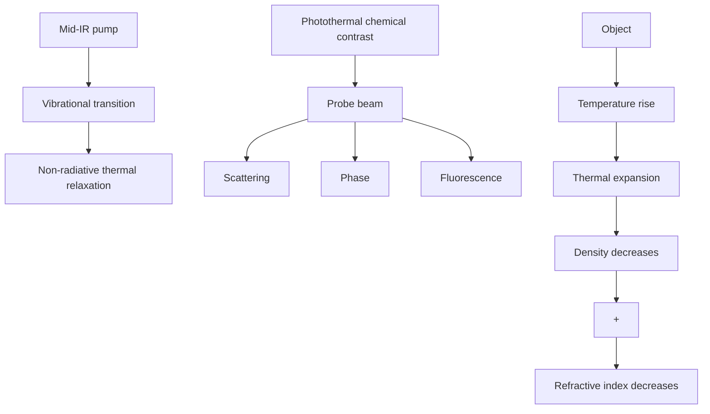

pubs.acs.org/ac

Review

# Mid-infrared Photothermal Imaging: Instrument and Life Science Applications

Xinyan Teng, Mingsheng Li, Hongjian He, Danchen Jia, Jiaze Yin, Rylie Bolarinho, and Ji-Xin Cheng

Cite This: Anal. Chem. 2024, 96, 78957906

Read Online

## ACCESS

Metrics & More

Article Recommendations

CONTENTS

<table><tr><td>History of Development</td><td>7895</td></tr><tr><td>MIP Principle</td><td>7897</td></tr><tr><td>MIP Instrumentation</td><td>7897</td></tr><tr><td>Scanning vs Wide Field</td><td>7897</td></tr><tr><td>Co-propagation vs Counter-propagation</td><td>7897</td></tr><tr><td>Detection Methods</td><td>7898</td></tr><tr><td>Life Science Applications</td><td>7899</td></tr><tr><td>Applications of MIP in Microbiology</td><td>7899</td></tr><tr><td>Applications of MIP in Cell Biology</td><td>7899</td></tr><tr><td>Applications of MIP in Neurology</td><td>7902</td></tr><tr><td>Mapping Biochemistry in Living Systems</td><td>7902</td></tr><tr><td>Outlook</td><td>7904</td></tr><tr><td>Author Information</td><td>7904</td></tr><tr><td>Corresponding Author</td><td>7904</td></tr><tr><td>Authors</td><td>7904</td></tr><tr><td>Author Contributions</td><td>7904</td></tr><tr><td>Notes</td><td>7904</td></tr><tr><td>Biographies</td><td>7904</td></tr><tr><td>Acknowledgments</td><td>7904</td></tr><tr><td>References</td><td>7904</td></tr></table>

## HISTORY OF DEVELOPMENT

Understanding biological processes at the molecular level is crucial for advancements in life science, including disease diagnosis, pharmacology, and biotechnology. Visualizing chemicals and the chemistry involved in living systems is a fundamental aspect of this endeavor. One emerging technique that has significantly contributed to this understanding is vibrational spectroscopic imaging which allows researchers to gain insights into the inherent complexities in biological systems at the molecular level.1−5 Among all the different technologies within this field, there is interest in infrared (IR)- based methods due to a relatively large absorption cross section6 from $1 0 ^ { - 1 6 } \ \mathrm { t o } \ 1 0 ^ { - 2 2 } \ \mathrm { c m } ^ { 2 }$ . This value is much larger than the cross section of spontaneous Raman scattering, which $\mathrm { i } \mathrm { s } \sim 1 0 ^ { - 3 0 } \ \mathrm { c m } ^ { 2 } \ \mathrm { s r } ^ { - 1 }$ . The larger cross section of IR absorption allows detection of low-concentration molecules within biological samples.

IR spectroscopy began its rich history in the early 1900s. Coblentz documented how specific chemical groups exhibit characteristic IR absorptions.7 Among all the IR-based imaging strategies, the Fourier-transform IR (FTIR)8,9 microscope is widely used for visualizing chemicals in materials and biological samples. The signal in the FTIR microscope is generated through the absorption of IR radiation by molecules in a sample.10−16 The quantized molecular vibrations absorb specific wavelengths of IR light, resulting in attenuated IR reflection or transmission, which generates fingerprints for each chemical component present in the samples. The FTIR microscope collects the photons passing through a sample to create spatially resolved images revealing the distribution and composition of its molecular constituents. The commercial FTIR microscope has reached an impressive sensitivity level of 0.1 mM.17 However, the spatial resolution of FTIR is approximately $6 \ \mu \mathrm { m } , ^ { \mathrm { i 8 } }$ which does not allow mapping of specific molecules within a biological cell. In addition, the substantial water background inherent in FTIR spectroscopy has restricted its application to living systems. 14,19 Another issue facing FTIR is the laser source; the globar provides a broad band of IR source, resulting in low power density.20−22

The advancement of quantum cascade laser $( \mathrm { Q C L } ) ^ { 2 0 }$ technology introduced a tunable IR laser to the IR spectros copy field, facilitating rapid measurement of IR absorption at spatially resolved pixels. However, because of the diffraction limit imposed by long excitation wavelengths, the spatial resolution of QCL-based IR imaging typically falls within the range of 4 to ${ \mathsf { 7 } } \ \mu \mathbf { m } . ^ { 2 3 }$ The development of atomic force microscopy (AFM)-IR24,25 $( \mathrm { A F M } ) \mathrm { - } \mathrm { I R } ^ { 2 4 , 2 5 }$ pushed the spatial resolution to ∼20 nm by using an AFM tip to sense the sample thermal expansion induced by IR absorption. However, the restricted penetration depth of AFM-IR makes it unsuitable for imaging chemicals inside of a 3D or liquid sample.

To address the above challenges, an optically detected super resolution IR imaging technology known as mid-infrared photothermal (MIP) microscopy has been recently developed.26,27 This approach revolutionized the field by addressing the limitations encountered by FTIR, QCL-IR, and AFM-IR. MIP microscopy achieves super-resolution IR imaging through a pump−probe strategy. In this method, chemical bonds in molecules are excited by a pulsed infrared beam. The energy of the infrared photons is absorbed by the molecules and quickly

Special Issue: Fundamental and Applied Reviews in Analytical Chemistry 2024

Received: April 18, 2024

Accepted: April 19, 2024

Published: May 3. 2024

flowchart

Figure 1. Principle of mid-infrared photothermal imaging.

relaxed into heat, causing a localized thermal expansion. Meanwhile. a focused visible probe beam is used to detect the resulting photothermal expansion, thereby generating distinct chemical contrasts. This pump−probe strategy provides submicron spatial resolution. Notably, the large heat capacity and consequently small temperature increase of water minimizes the water background signal in MIP images, further broadening the applications of MIP imaging in life science.

Photothermal imaging based on the change of refractive index was reported in the 1980s.28 In 2012, Furstenberg and co-workers developed a photothermal imaging approach to improve spatial resolution by exploring the thermal emission of samples induced by mid-infrared laser heating.28 Later, Erramilli, Sander, and co-workers employed a QCL and a continuous-wave fiber laser for photothermal imaging of 9 studies did not demonstrate submicron resolution, nor the potential of MIP for imaging a living system in the aqueous environment.

The Cheng group reported a high-performance QCL-based MIP microscope in 2016, achieving for the first time 3D bondselective imaging of live cells and organisms with a spatial resolution of 0.6 μm and a limit of detection (LOD) of 10 μM for the C�O bond.26 In 2017, the Cheng group reported an epi-detected mid-infrared photothermal (epi-MIP) microscope at a spatial resolution of 0.65 μm, which enabled analysis of a pharmaceutical sample.30 At the same year, the Hartland group introduced infrared photothermal heterodyne imaging with a counter propagation geometry, reaching 0.3 μm spatial resolution.27 These innovations have led to the commercialization of MIP microscopy into a product, mIRage, released in 2018 by Photothermal Spectroscopy Corp.31 The entrepreneur success made MIP microscopy widely accessible to academic laboratories and industry, enabling broad applications.

Thus far, three categories of the MIP microscope have been developed, namely scanning MIP microscopy, wide-field MIP microscopy, and computational MIP tomography.

In scanning MIP, the IR and visible beams are confocally focused onto a sample. The IR absorption induced photothermal lens acts a microlens that alters the propagation of transmitted or reflected probe photons, which can be detected by a photodiode. By scanning a sample mechanically or scanning the laser foci with galvo mirrors, the photothermal signals can be collected pixel by pixel to form an MIP image. Early sample-scan MIP microscopes suffer from the speed issue and the residual water background. In 2021, the Cheng group reported lock-in free photothermal dynamic imaging (PDI) 32 with signal digitization and match filtering, increasing the imaging speed by 2 orders of magnitude, and enhanced the SNR by 4-fold. Moreover, the water background is greatly suppressed by detecting high harmonic signals.32 In 2023, the Sander group reported an alternative approach using a high speed boxcar detection system to capture low duty cycle timeresolve MIP signals. Their boxcar-detected MIP microscope provides a 4.4-fold SNR improvement while also suppressing the water background.33 In 2023, video-rate scanning MIP imaging using single-pulse photothermal detection per pixel was introduced.34 These advancements collectively solidified the scanning MIP microscope as a reliable tool.

The wide-field MIP microscope employs wide-field illumination of both the IR pump and visible probe beams onto a sample.35−38 By exploring the difference in the transmission/ reflection images between the IR-on and IR-off status, the transient photothermal effects in a whole field-of-view can be captured by a camera. Wide-field MIP significantly improves MIP imaging speed up to 1250 frames per second.35

Computational MIP tomography aligns with quantitative phase imaging techniques, including optical diffraction tomography and intensity diffraction tomography, both incorporating the MIP effect. Via measuring the phase shift induced by IR excitation, the transient phase dynamics modulated by the IR photothermal effect can be determined. Computational MIP tomography introduces molecular specif icity to quantitative phase images, allowing for volumetric chemical phase imaging.39,40

The MIP microscope is highly compatible with other modalities. The visible probe beam can be used for Ramar microscopy and/or fluorescence imaging of the same specimen. It is important to note that fluorescence has been utilized to sense the photothermal signals, as thermosensitive fluorescent probes enhance MIP sensitivity by 100 times compared to scattering-based detection.41,42

On the application to life science, MIP microscope has enabled bond-selective imaging of living biological systems with submicron spatial resolution. These applications encom pass the analysis of proteins, carbohydrates, lipids, enzymes, nucleic acids, ranging from individual nanometer scale viruses to centimeter-scale tissue samples. Several notable examples of this include the demonstration of stable isotope probing in microbiological studies by the Goodacre group at Liverpool University,43−46 isotope-labeled cell metabolism by the Davis group at Yale University,47,48 and label-free analysis of degenerative disease metabolism by Oxana Klementieva and colleagues at Lund University.49−52 In parallel, the Ideguchi group at the University of Tokyo imaged water exchanges in living cells.40 The Kosik group at the University of California Santa Barbara mapped azide-tagged fatty acids in humanderived model systems.53 The Cheng group at Boston University conducted mapping of enzymatic activity54 and click-free imaging of carbohydrates.55

text_image

Co-propagation
IR Probe
Reflective objective
Reflective surface
Sample plane
Condenser
Iris
Detector

text_image

Counter-propagation
Probe
Refractive objective
Sample plane
Reflective objective
IR
Dichroic mirror
Iris
Detector

Figure 2. Schematics of co- and counter-propagating mid-infrared photothermal microscope.

In this review, we summarize the principle, describe the instrumentation strategies, and highlight the most recent significant applications to life science.

## MIP PRINCIPLE

MIP facilitates super-resolution infrared (IR) imaging through a pump−probe methodology. In MIP microscopy, a pulsed infrared beam excites molecular vibrations. Through a nonradiative thermal relaxation process, the IR photon energy is converted to heat, resulting in a temperature rise within an object (Figure 1). Subsequent thermal expansion decreases the density of object and its refractive index. The photothermal lens acts as a microlens to change the propagation path of transmitted/scattered probe photons. Besides, photothermal expansion changes the phase of the probe beam, and the temperature rise modulates the emission of thermal-sensitive fluorescent dyes. Thus, a visible probe beam can generate chemical contrast by measuring the photothermal-modulated scattering, phase, or fluorescence signals. MIP provides IR absorption contrast with submicron spatial resolution, limited by the diffraction limit of the short visible wavelength. Furthermore, due to a large specific heat capacity of water, the temperature rise of water is quite small, resulting in minimal background signals in MIP images.

## MIP INSTRUMENTATION

In a MIP microscope, the high-performance quantum cascade laser and OPO laser are commonly used as the pump beam. In scanning-based MIP, a visible CW laser with low intensity fluctuation is employed as a probe beam. A photodiode is used to record the photothermal-modulated intensity variations of the probe beam. In wide-field and computational MIP, a visible pulsed laser is utilized, so that pump and probe pulses can be tuned to overlap in the time domain, maximizing the use of full well capacity of the camera. By subtracting the images of the IR-on and IR-off status, wide-field and volumetric MIP images can be generated.

Scanning vs Wide Field. Scanning-based MIP leverages the alignment of confocal infrared (IR) and probe foci for imaging, resulting in a reduced requirement for the IR photon budget. The utilization of photodiodes allows for the acquisition of a greater number of probe photons compared to when using a camera. As a result, scanning-MIP can perform shot-noise limited photothermal imaging. Leveraging the mismatch of visible probe and IR pump foci, scanning-based MIP offers a 40-fold resolution enhancement over IR imaging. Meanwhile, only a small portion of IR photon energy contributes to probe beam modulation, resulting in a relatively low utilization of IR photons. Wide-field MIP addresses this problem by matching IR and probe illumination area. It employs a high-energy nanosecond IR pulsed laser to induce a detectable photothermal effect in a wide field of view. It boosts imaging speed and enables high-throughput molecular finger printing. Moreover, the high peak power and short duration of the IR pulse efficiently increases the photothermal signal of a nanosize obiect. Notably. wide-field MIp suffers from low depth resolution and is challenging to perform optical sectioning of biological systems. Computational MIP overcomes this issue by integrating MIP microscopy with advanced quantitative phase tomography methods,56,57 such as optical diffraction tomography (ODT) and intensity diffraction tomography (IDT). The difference between computational phase tomography images of IR-on and IR-off status reflect MIP tomography images. This ideal marriage facilitates realtime volumetric molecular tomography of living sys-40,58−60

Co-propagation vs Counter-propagation. The first point-scanning MIP microscope adopted a copropagation geometry (Figure 2a), in which an IR pump beam and a visible probe beam were combined and focused by a reflective objective. Through the central dark-field area of the reflective objective, the scattered photons modulated by the mid-infrared photothermal effect can be measured.26 This technique enables, for the first time, 3D bond-selective chemical imaging in live systems with submicron spatial resolution and micromolar-level sensitivity. Alternatively, by collecting probe photons from the sample at the same side of the objective, an epi-detected version of the scanning-based MIP microscope was built to characterize chemical components of opaque pharmacological substances in a noncontact manner.61 In copropagation MIP, due to a low numerical aperture of reflective objective, the visible probe beam is typically not as tightly focused. The probe focus matches the bulkier photothermal lens. Thus, copropagation MIP is suitable to measure molecules dissolved in solution or intracellularly diffused molecules. Moreover, epi-detection can be emploved to image opaque samples. such as functional materials. highly scattering tissue slices. and live animals.

a  

line chart

| Wavenumber (cm⁻¹) | Untreated | Ery-treated for 1 hr |
| ----------------- | --------- | -------------------- |
| 1000              | ~0.2      | ~0.3                 |
| 1200              | ~0.4      | ~0.5                 |
| 1400              | ~0.3      | ~0.4                 |
| 1600              | ~0.8      | ~0.9                 |
| 1800              | ~0.1      | ~0.2                 |

b  

text_image

Spectroscopic stack
d
I
O
5 µm

line chart

| Wavenumber (cm⁻¹) | O1 Intensity (V) | O2 Intensity (V) | O3 Intensity (V) | O4 Intensity (V) | O5 Intensity (V) |
| ----------------- | ---------------- | ---------------- | ---------------- | ---------------- | ---------------- |
| 900               | ~0.015           | ~0.018           | ~0.020           | ~0.022           | ~0.025           |
| 950               | ~0.020           | ~0.025           | ~0.030           | ~0.035           | ~0.040           |
| 1000              | ~0.025           | ~0.030           | ~0.035           | ~0.040           | ~0.045           |
| 1050              | ~0.030           | ~0.035           | ~0.040           | ~0.045           | ~0.050           |
| 1100              | ~0.025           | ~0.030           | ~0.035           | ~0.040           | ~0.045           |
| 1150              | ~0.020           | ~0.025           | ~0.030           | ~0.035           | ~0.040           |
| 1200              | ~0.015           | ~0.020           | ~0.025           | ~0.030           | ~0.035           |
| 1250              | ~0.015           | ~0.018           | ~0.022           | ~0.025           | ~0.030           |

line chart

| Wavenumber (cm⁻¹) | I1 Intensity (V) | I2 Intensity (V) | I3 Intensity (V) | I4 Intensity (V) | I5 Intensity (V) |
| ----------------- | ---------------- | ---------------- | ---------------- | ---------------- | ---------------- |
| 900               | ~0.018           | ~0.017           | ~0.016           | ~0.015           | ~0.014           |
| 950               | ~0.020           | ~0.019           | ~0.018           | ~0.017           | ~0.016           |
| 1000              | ~0.023           | ~0.022           | ~0.021           | ~0.020           | ~0.019           |
| 1050              | ~0.026           | ~0.025           | ~0.024           | ~0.023           | ~0.022           |
| 1100              | ~0.030           | ~0.029           | ~0.028           | ~0.027           | ~0.026           |
| 1150              | ~0.028           | ~0.027           | ~0.026           | ~0.025           | ~0.024           |
| 1200              | ~0.024           | ~0.023           | ~0.022           | ~0.021           | ~0.020           |
| 1250              | ~0.018           | ~0.017           | ~0.016           | ~0.015           | ~0.014           |

C  

line chart

| Wavenumber (cm⁻¹) | RNA virus Norm. MIP intensity | DNA virus Norm. MIP intensity | VACV Norm. MIP intensity |
| ----------------- | ----------------------------- | ----------------------------- | ------------------------ |
| 1500              | 0.3                           | 0.2                           | 0.2                      |
| 1550              | 0.4                           | 0.4                           | 0.4                      |
| 1600              | 0.5                           | 0.6                           | 0.6                      |
| 1650              | 0.9                           | 0.8                           | 0.8                      |
| 1700              | 0.4                           | 0.3                           | 0.3                      |
| 1750              | 0.2                           | 0.1                           | 0.1                      |
| 1800              | 0.1                           | 0.0                           | 0.0                      |

d  

text_image

12C-glucose
13C-glucose
13C-glucose + gentamicin
13C-glucose + erythromycin
reflection
1656 cm-1
1612 cm-1

Figure 3. MIP Applications in microbiology. (a) (Top) MIP images of single bacteria at amide $\mathrm { ~ I ~ } \big ( 1 6 5 0 \ c m ^ { - 1 } \big ) .$ , scale bar, 5 μm. (Bottom) Averaged single-cell MIP spectra of erythromycin-treated S. aureus cells and control group at phosphate $( \mathrm { i } 0 3 0 { - } 1 1 4 5 \ \mathrm { c m } ^ { - 1 } )$ , amide II $( \mathrm { i } 5 0 0 { - } 1 \mathrm { \dot { 6 } 0 0 \ c m ^ { - } } )$ , and amide I $( 1 6 \dot { 1 0 } - 1 7 1 5 \mathrm { c m } ^ { - 1 } )$ bands. (b) (Left) MIP hyperspectral image of fungal cell wall (1085 to $1 2 2 0 ~ \mathrm { { c m } ^ { - 1 } ) }$ . Scale bar. 5 um. (Right) MIP spectra at indicated pixels and their comparison. (c) (Left) MIP spectra of $\begin{array} { r } { \mathrm { V S V } , \check { \mathrm { V Z V } } , } \end{array}$ and VACV viruses. (Right, top) Interferometric scattering and fluorescence merged images of single VACV viruses; (right, bottom) MIP image of the same area at amide $\bar { \mathrm { ~ I ~ } } \big ( 1 6 5 6 \mathrm { c m } ^ { - 1 } \big )$ ), scale bar, 10 μm. (d) MIP images at 1656 and 1612 cm−1 for controls, effective antibiotic, and ineffective antibiotic groups, scale bar, 5 μm.

The counter-propagation MIP microscope can improve spatial resolution and sensitivity for imaging nanostructures in biological systems.62 By utilizing a high numerical aperture (NA) refractive objective rather than a low NA reflective objective, the visible beam can be tightly focused onto a sample and the resolution can reach 0.3 μm, enhancing the contrast to visualize subcellular molecular species (Figure 2b). In counterpropagation MIP, the probe beam can be tightly focused to sense nanosized objects. However, due to the strong scattering of the probe beam, counter-propagation MIP is not suitable for imaging complex tissues and material samples.

Detection Methods. In the scanning-based MIP micro scope, a photodetector is used to capture the intensity variations of the transmitted/reflected probe beam modulated by the photothermal effect. After electrical amplification, MIP signals can be extracted by three approaches, lock-in amplifier demodulation, high-speed digitization, and boxcar detection.

The lock-in amplifier has been commonly used to demodulate mid-infrared photothermal signals. It is a classic approach to extract a weak signal of a defined frequency from a noisy input. It employs a heterodyne operation between a noisy input and a sinusoidal signal with a defined frequency. Followed by a lowpass filter, the defined frequency component can be demodulated as a signal of interest. Thus, the lock-in amplifier enables high-sensitivity MIP imaging with a reduced noise level. The photothermal decay induces a phase shift between the demodulated AC signal and the reference clock in the lock-in amplifier. By reading the phase channel signal from the lock-in amplifier, this advanced approach offers improved sensitivity to resolve nanostructures in aqueous environments.63,64 Notably, due to a low duty cycle of MIP signal, the lock-in amplifier is not an ideal strategy because the demodulated output includes extra noise from the signal-off status. Besides, the lock-in detection method requires a few cycles of signals and demodulates only the fundamental component of the photothermal signal, which limits the imaging speed and sensitivity.

High-speed digitization is a novel method to record timeresolved photothermal dynamics with nanosecond resolu tion.32 It captures single pulse excitation photothermal dynamics, facilitating video-rate MIP imaging speed.34 Moreover, the photothermal rise or decay dynamics can be harnessed to differentiate between water and biomolecules, which are an efficient method to suppress water background. Thus, high-speed digitization enables MIP to resolve the weak absorbers beneath the water background with improved speed and sensitivity.

Boxcar detection is an alternative approach of high-speed digitization to record the time-resolved photothermal dynamics but with a minimal data processing load. Boxcar captures a well-defined short temporal window during IR heating, so it rejects the noise outside of this window but reserves signal intensity. Thus, it is a good strategy to record the low duty cycle photothermal signals. Boxcar-detected MIP microscope provides a 4.4-fold SNR improvement with suppressed water background. 33

## LIFE SCIENCE APPLICATIONS

Applications of MIP in Microbiology. Microbiology encompasses a diverse array of basic living entities, such as bacteria, archaea, fungi, protists, algae, and viruses.65 Fluorescence imaging and sequencing techniques have been extensively utilized to understand the diverse metabolism, phenotypes, and pharmacological stimulation in the field of microbiology.66 MIP is harnessed as a novel tool for analyzing the chemical content, metabolism, and physiology at the single cell or single virus level. Examples include the protein dynamic under drug stress,67,68 fungal cell wall analysis,34 and single 69,70 As discussed below, these studies were pursued through either a label-free manner or use of isotope labeling.

The label-free MIP imaging is highly sensitive to the fingerprint region, which allows assessment of antibiotic influence on a bacterium for the purpose of delineating bacterial phenotype and metabolic processes. 67 Erythromycin, known for inhibiting bacterial protein synthesis, induces distinct infrared spectra changes in both untreated and treated S. aureus. Highlighted differences manifest particularly in the peak of phosphate groups of nucleic acids and the amide II and I bands of proteins, respectively. As shown in Figure 3a, erythromycin treatment leads to decreased intensity ratios of amide I/phosphate and amide II/phosphate, suggesting inhibited bacterial growth. In addition, the MIP signals in fingerprints region were also used to monitor the interruption in bacteria by drugs. The Goodacre group used MIP imaging to monitor the production of the bioplastic poly-3-hydrox ybutyrate to investigate phenotypic heterogeneity within Bacillus.

The high spatial resolution and spectral resolution of MIP microscopy make it possible to analyze subtle differences in nanoscale structures at nanoscale. MIP has been employed to image fungal cell walls, offering insights into their compositional intricacies.34 As shown in Figure 3b, video-rate MIP facilitated hyperspectral imaging of fungal cells from 900 to 1250 cm−1 . Analysis revealed distinct spectral signatures at 1050 cm−1 , 1080 cm−1 , and 1150 cm−1 for the outer, middle, and inner layers of the cell wall, respectively. This disparity in spectral characteristics enabled the visualization of the layered structure of cell wall through color-coded hyperspectral imaging. Since the cell wall is a pivotal target for antifungal drugs, this result is expected to facilitate forthcoming investigations into the chemical antibacterial drug action.

The high spectral resolution of MIP also allows for the detection of not only viral proteins but also nucleic acids inside individual viruses in the fingerprint region.70 Specifically, distinctive MIP signals representing the vibrations of thymine (T) and uracil (U) residues were identified, indicating unique IR signatures of DNA and RNA viruses, respectively, as shown in Figure 3c. This study also uncovers the presence of β-sheet components in the proteins of the varicella-zoster virus. This work demonstrates that MIP can offer detailed compositional insights into individual virions.

In parallel to the label-free methodology, the stable isotope probing (SIP)71 method can provide biosynthesis information on individual bacteria, offering potential insights into microbial behavior and interactions at the single-cell level. The Goodacre group evaluated the incorporation of 13C-glucose and 15Nammonium chloride by a single Escherichia coli (E. coli).43,72 As shown in Figure 3d, SIP MIP imaging could detect spectral changes in phenotypic rapid antimicrobial susceptibility testing (AST).68 The Cheng group used SIP MIP for high throughput rapid AST by monitoring 13C-incorporated protein synthesis in single bacterial cells. E. coli was selected as the testbed, and 13C-glucose was utilized for isotopic replacement in proteins, resulting in a peak shift of the amide I band from 1656 to 1612 cm−1 compared to the original 12C-incorporation protein amide I. The protein synthesis can be quantitatively determined through MIP imaging at the original and shifted peaks estimating the isotopic replacement. This isotopic protein synthesis can serve as a reliable indicator for assessing disruptions by antimicrobials within single microorganisms. Compared with traditional methods, the MIP-based method significantly shortens the detection time. Independently, Muhamadali and his colleagues used deuterium (2 H) labeling to differentiate active and inactive cells.73 By measuring the MIP signal of C−D bond in individual bacterial cells, resistant and susceptible cells can be distinguished based on their metabolic activity. In summary, rapid identification of antimicrobial resistance at the single-cell level has been achieved via SIP-based MIP. Looking ahead, the application of MIP in studying microbial responses to various environ mental stresses is anticipated to expand significantly.

Applications of MIP in Cell Biology. In the realm of cell biology, the quest to unravel the mysteries behind cellular machinery has continually driven the development of innovative imaging techniques. Approaches like fluorescence, Raman, or mass spectrometry-based imaging have made significant discoveries, yet face limitations such as bulky labeling,74 moderate sensitivity,1 or low spatial resolution, respectively. MIP microscopy offers new capabilities to detect cellular components with remarkable sensitivity and chemica specificity.

a  

line chart

| Wavenumber (cm⁻¹) | MIP Int. (a.u.) | FTIR abs. (%) |
| ----------------- | --------------- | ------------- |
| 1400              | ~0.3            | ~5            |
| 1500              | ~1.8            | ~20           |
| 1600              | ~2.2            | ~30           |
| 1700              | ~2.5            | ~25           |
| 1800              | ~0.5            | ~10           |
| 1900              | ~0.3            | ~5            |

natural_image

Abstract blue-toned image with a bright central spot and diffuse surrounding shapes, resembling a microscopic or thermal imaging view (no text or symbols)

b  

natural_image

Microscopic image of a cellular structure labeled 'Transmission' (no other text or symbols visible)

natural_image

Fluorescent microscopy image showing cellular structures with a color scale from 0 to 4 (no text or symbols present)

C  

text_image

Wavenumber (cm⁻¹)
250
OPTR Intensity(mV)
1747 cm⁻¹

natural_image

Microscopic view of cellular or molecular structures with orange-yellow highlights, labeled 'Ratio' in corner (no other text or symbols)

line chart

| Wavenumber (cm⁻¹) | 0 h Norm OPTIR Intensity | 72 h Norm OPTIR Intensity |
| ----------------- | ------------------------ | ------------------------- |
| ~1500             | ~3.0                     | ~2.5                      |
| ~1400             | ~0.5                     | ~0.5                      |
| ~1300             | ~1.0                     | ~1.0                      |
| ~1200             | ~1.8                     | ~1.5                      |
| ~1100             | ~1.0                     | ~1.0                      |
| ~1000             | ~0.5                     | ~0.5                      |

d  

natural_image

Microscopic image showing circular structures with a scale bar (no text or symbols)

heatmap

| Cluster | Ratio |
|---------|-------|
| 1       | 0.5   |
| 2       | 0.4   |
| 3       | 0.3   |
| 4       | 0.2   |
| 5       | 0.1   |
| 6       | 0.0   |

heatmap

| Value Range | Color Intensity |
|-------------|-----------------|
| 0.5         | Orange          |
| 0.5         | Yellow          |
| 0.5         | Purple          |
| 0.5         | Blue            |

line chart

| Wavenumber (cm⁻¹) | OPTIR (mV) |
| ----------------- | ---------- |
| 1000              | 60         |
| 1500              | 140        |
| 2000              | 20         |
| 1600              | 30         |
| 1200              | 80         |
| 1300              | 70         |

e  

text_image

Control
IPI1 2,193 cm⁻¹
IPI2 2,855 cm⁻¹

text_image

250 µM PA
IPI1 2,193 cm⁻¹
IPI2 2,855 cm⁻¹

text_image

250 µM PA-d₃₁
IPI1 2,193 cm⁻¹
IPI2 2,855 cm⁻¹

line chart

| Wavenumber (cm⁻¹) | Control | 250 µM PA | 250 µM PA-d₃₁ |
| ----------------- | ------- | --------- | ------------- |
| 2050              | ~0      | ~0        | ~0            |
| 2100              | ~0      | ~0        | ~0            |
| 2150              | ~0      | ~0        | ~0            |
| 2200              | ~0      | ~0        | ~0            |
| 2850              | ~0      | ~1.5      | ~0            |
| 2900              | ~1.0    | ~3.0      | ~0.5          |
| 2950              | ~0.5    | ~0.5      | ~0.5          |

Figure 4. MIP Applications in cell biology. (a) MIP spectra (left) and image (right) of JZL184 incubated cells. (b) MIP images of live HeLa cell incubate with 100 μM FCCP for 30 min (image produced by the image at $2 2 2 3 ~ \mathrm { c m } ^ { - 1 }$ subtract the image at 2170 cm−1 ). (c) (Left) MIP images of $^ { 1 2 } \mathrm { C }$ lipid ester carbonyl band. (Middle) MIP ratio image of lipid ester carbonyl $( 1 7 0 3 ~ \mathrm { c m } ^ { - 1 } )$ /lipid ester carbonyl $\left( 1 7 4 7 \thinspace \mathrm { c m } ^ { - 1 } \right)$ after correction for amide-I. (Right) MIP spectra $\mathrm { o f } ^ { 1 2 } \mathrm { C }$ and $^ { 1 3 } \mathrm { C }$ incorporation in cells. Scale bar, 20 μm. (d) (Left, images) MIP ratio images and brightfield image of 2 H OA and $^ { \mathrm { i } 3 } \mathrm { C }$ glucose in live Huh-7 cell. (Right, spectrum) MIP spectra of the live Huh-7 cell within a lipid droplet (pink) and outside the lipid droplet (blue). Scale bar, 10 μm. (e) MIP images (left) and spectra (right) of palmitic acid and 2 H labeled palmitic acid labeled U2OS cells compare with control cells. Scale bar, 20 $\mu \mathrm { m . }$

MIP was used to monitor the uptake and intracellular distribution of drugs in the fingerprint region and silent region (usually $1 8 0 0 { - } 2 8 0 0 ~ \mathrm { c m } ^ { - 1 } .$ , with no cellular vibrations and functional groups in this region).26,76 JZL184, known as a monoacylglycerol lipase inhibitor, has demonstrated efficacy in reducing cancer cell migration. Visualization of its intracellular transportation and accumulation of JZL 184 is facilitated by MIP imaging in the fingerprint region. The accumulation of JZL184 is notably observed at the central region of the cell body (Figure 4a). Imaging observation of drug uptake was also facilitated by a nitrile group, which has signal in the silent region.76 Trifluoromethoxy carbonyl cyanide phenylhydrazone (FCCP) is an uncoupling agent containing two nitrile groups. The Fujita group successfully observed the uptake, incorporation, and accumulation of FCCP in living HeLa cells at 2223 $\mathrm { c m } ^ { - 1 }$ by a lab-built MIP microscope (Figure 4b).

The specific domain vibration emanating from the cell body has aroused interest. The amide I peak $( \sim 1 6 5 8 ~ \mathrm { c m } ^ { - 1 } )$ is generated by the $\scriptstyle \mathrm { C = O }$ stretch and is strongly influenced by hydrogen bonding between adjacent peptide chains. Therefore, the overall shape and position of the amide I band tell the secondary structure of the proteins. The Gardner group used MIP to obtain the spectral features of Mia PaCa-2 cells.77 They observed that the amide I band shifts to higher frequencies and broadening in relation to the cell nucleus. Researchers are also focusing on the C−H region, as the Gardner group also observed significant spatial lipid distribution changes in this region.77 Independently, the Ideguchi group observed water exchanges within living cells, assessing the replacement of $\mathrm { D } _ { 2 } \mathrm { O }$ -based PBS with $\mathrm { H } _ { 2 } \mathrm { O }$ -based PBS in the C−H region by a lab-built MIP microscope 40

a  

natural_image

Two-panel fluorescence microscopy image showing red-labeled cellular structures at 1630 cm⁻¹ and 1650 cm⁻¹ (no text or symbols present)

b

text_image

β-sheet structures
1630 / 1656
Oxidized lipids
1740 / 1656
15 µm

text_image

Overlay
β-sheet
lipids
Aβ (82E1)

C  

natural_image

Microscopic surface topography image with color scale indicating depth (min to max) and a 25 μm scale bar, showing granular texture and central bright region.

natural_image

Microscopic image showing a red fluorescent spot labeled 'Amytracker' against a dark background (no other text or symbols)

text_image

d
Oxidized lipids / β-sheets
Antiparallel β-sheets
20 µm

e  

line chart

| Wavenumber (cm⁻¹) | Azide-PA | PA   | Cell |
| ----------------- | -------- | ---- | ---- |
| 2100              | ~2.5     | ~1.0 | ~0.0 |
| 1700              | ~3.0     | ~2.0 | ~1.0 |
| 1500              | ~2.8     | ~1.5 | ~0.5 |
| 1300              | ~2.2     | ~1.2 | ~0.3 |
| 1100              | ~2.0     | ~1.0 | ~0.2 |

fluorescence microscopy images

| Condition       | 1744 cm⁻¹ | 2096 cm⁻¹ | 1654 cm⁻¹ | 1744/1654 | 2096/1744 | Brightfield |
| --------------- | --------- | --------- | --------- | --------- | --------- | ----------- |
| Ctrl            | -         | -         | -         | -         | -         | -           |
| iTF-microglia   | -         | -         | -         | -         | -         | -           |
| GRN-KD          | -         | -         | -         | -         | -         | -           |

natural_image

Fluorescent microscopy image of a biological sample with green and red staining, labeled 'TUJ1/GFAP' (no additional text or symbols)

natural_image

Fluorescence microscopy images showing DAPI/TUJ1/GFAP staining with 2096 cm⁻¹ scale bar (no text or symbols beyond labels)

natural_image

Fluorescent microscopy image showing merged red and green cellular structures (no text or symbols)

text_image

DAPI/TUJ1/GFAP
5 4 3 2

text_image

2096 cm⁻¹
Surface
Core

Figure 5. MIP Applications in neurology. (a) MIP images of primary neuron at 1650 and $1 6 3 0 ~ \mathrm { { c m } ^ { - 1 } }$ , scale bar, 20 μm. (b) MIP ratio maps of β- sheet structures $\widetilde { ( } 1 6 3 0 \ c m ^ { - 1 } / 1 6 5 6 \ c m ^ { - 1 } )$ , oxidized lipids $( 1 7 4 0 ~ \mathrm { c m } ^ { - 1 } / 1 6 5 6 ~ \mathrm { c m } ^ { - 1 } )$ , overlapping of the β-sheet channel (red) and lipids (green) channel, and the corresponding area of the immunofluorescence image. Scale bar, 15 μm. $\mathrm { ( c ) \ ( \bar { L } e f t ) }$ MIP ratio image of β-sheet structures (1630 $\mathrm { c m } ^ { - 1 } / 1 6 5 6 \ \mathrm { c m } ^ { - 1 } )$ and (right) its corresponding confocal image stained with Amytracker. Scale bar, 25 μm. (d) (Left) Normalized and averaged MIP spectra of fresh tissue and 4% PFA fixed tissue. (Right) Overlapped MIP image of 1630 $\mathrm { c m } ^ { - 1 } / 1 6 5 6 ~ \mathrm { c m } ^ { - 1 }$ , 1680 $\mathrm { c m } ^ { - 1 } / 1 6 5 6 ,$ and $1 7 4 0 ~ \mathrm { c m } ^ { - 1 } /$ $1 6 5 6 ~ \mathrm { { \bar { c } m } ^ { - 1 } }$ , the white arrows indicate colocalization of newly formed antiparallel β-sheets and oxidized lipids. Scale bar, 20 μm. (e) (Left, top) MIP spectra of azide- ${ } ^ { 2 } \mathrm { A } , { } ^ { \mathrm { P A } , }$ , and cell. $\left( \mathrm { R i g h t , \ t o p } \right)$ MIP images for control and GRN-KD induced-transcription factor-microglia cells at $1 7 4 4 \mathrm { c m } ^ { - 1 }$ , 2096 $\mathrm { \dot { c m } ^ { - 1 } } , 1 6 5 4 ~ \mathrm { c m ^ { - 1 } }$ , 1744 $\mathrm { c m } ^ { - 1 } / 1 6 5 4 \ \mathrm { { c m } ^ { - 1 } }$ , 2096 $c m ^ { - 1 } / 1 7 4 4 \mathrm { c m } ^ { - 1 } ,$ and brightfield images. Scale bars, 20 μm. (Left, bottom) Immunofluorescence images of neuron and astrocyte distributions. MIP images at 2096 $\mathrm { c m } ^ { - 1 }$ of greyscale in the merged image. Scale bars, 500 μm in overview image, $1 0 0 \ \mu \mathrm { m }$ in zoom in images. (Right, bottom) Fluorescence and MIP azide images at varying distances from the surface of an organoid slice. Scale bars, 500 μm in overview image, 100 μm in zoom in images.

The incorporation of SIP enables metabolic tracking of specific molecules in complex cellular environments, offering a solution for revealing intracellular metabolic processes. The

Davis group utilized MIP to monitor the rates of de novo lipogenesis by incorporating $^ { 1 3 } \mathrm { C }$ glucose into differentiated adipocytes, as shown in Figure 4c.47 Glucose metabolism leads to the production of fatty acids which are utilized to synthesize triglycerides that are stored as energy reserves in lipid droplets. The introduced 13C-labeled glucose serves as a tracer, enabling the tracking $\mathrm { o f } ~ ^ { 1 3 } \mathrm { C }$ incorporation into lipid droplets via the de novo lipogenesis pathway. A methodical examination of the integration of labeled carbon into the ester carbonyl of triglycerides is conducted on both live and fixed cells. Following the incorporation of $^ { 1 3 } { \mathrm { C } } ,$ the carbonyl peak shifts from 1747 to $1 7 0 3 ~ \mathrm { { \bar { c m } } ^ { - 1 } }$ . This shift enables the monitoring of de novo lipogenesis rates through the intensity ratio of $^ { 1 3 } \mathrm { C } / ^ { 1 2 } \mathrm { C } .$ . Subsequently, the Davis group accomplished multiplexed imaging by employing isotopes 2 H and $^ { 1 3 } \mathrm { C }$ as distinctive labels.48 The 2 H isotope exhibited notable peaks at 2100 and $2 2 0 0 ~ \mathrm { c m } ^ { - 1 } .$ , whereas the $^ { 1 3 } { \mathrm { C } } { = } { \mathrm { O } }$ isotope displayed a peak at $1 7 0 3 ~ \mathrm { c m } ^ { - 1 }$ . The ratiometric multicolor MIP images of the two isotopes enabled the examination of variations in de novo lipogenesis rates during oleic acid (OA) incorporation. This approach facilitated the examination of lipogenesis and the exogenous regulatory impacts of $\mathrm { O A } ,$ , along with the exploration of competitive clearance pathways, within live adipocytes and hepatocytes (Figure 4d). Independently, the Cho group explored MIP images to monitor real-time neutral lipid synthesis via lipid droplets using 2 H labeled palmitic acid (16:0), within the C−D band at 2193 cm−1 and the C−H band $\mathrm { a t } 2 8 5 5 \ \mathrm { c m } ^ { - 1 } \ \mathrm { ( F i g u r e \ 4 e ) } . ^ { 7 8 }$ Together, leveraging the infrared absorption properties of lipids, SIP MIP enables dynamic observation of lipid metabolism.

Applications of MIP in Neurology. MIP imaging has proven valuable in the study of neurodegenerative diseases. These diseases, such as Alzheimer’s disease (AD) and Huntington’s disease (HD), are characterized by the loss of neurons and the formation of neurotoxic structures that are rich of β-sheet amyloid proteins.79,80 MIP microscopy has been harnessed as a potential tool for delving into the molecular underpinnings of AD, HD, and similar conditions, offering insights critical for understanding their progression and potential therapeutic intervention.

For example, Oxana Klementieva and colleagues reported the detection of polymorphic amyloid aggregates directly in neurons by MIP imaging.81 They conducted imaging of $\beta \mathrm { - }$ sheet structures in both primary neurons and AD transgenic neurons, which allows the observation of protein aggregation at the subcellular level (Figure 5a) alongside an increasing presence of unordered structures at $1 6 3 8 ~ \mathrm { { c m } ^ { - 1 } }$ and lipid oxidation at $1 7 4 0 ~ \mathrm { c m } ^ { - 1 } .$ . By coupling synchrotron-based X-ray fluorescence with MIP, they discovered that in AD-like neurons, iron clusters are found together with higher levels of amyloid β-sheet structures and oxidized lipids.49

Through the combination of immunofluorescence, fluorescence-guided. and fluorescence-detected techniques. MIP revealed alerts of AD and HD. Immunofluorescence was combined with MIP to visualize specific protein structures and organelles for MIP measurement, accordingly detecting molecules at the subcellular level.50 Figure 5b shows the immunofluorescence MIP images, MIP ratio maps, and corresponding confocal image of immunofluorescence. The β-sheet structure $( 1 6 3 0 ~ \mathrm { ~ c m ^ { - 1 } / 1 6 5 6 ~ \ c m ^ { - 1 } } )$ and lipid oxidization $( 1 7 4 0 ~ \mathrm { { c m } ^ { - 1 } / 1 6 5 6 ~ \mathrm { { c m } ^ { - 1 } ) } }$ was clearly observed. Furthermore, MIP revealed that the accumulated β-amyloid protein within endosomes exhibits a heightened concentration of β-sheets. Fluorescence-guided MIP also played an important role in the study of degenerative diseases.52 In fluorescenceguided MIP, wide-field epifluorescence imaging is first conducted, followed by MIP measurements performed on fluorescently labeled areas. In Figure ${ \mathsf { S c } } ,$ MIP images showed fluorescently labeled amyloid plaques along with the distribution of $\beta \mathrm { \cdot }$ sheet structures within the same plaque at the ratiometric map between 1630 and $1 6 5 6 ~ \mathrm { { c m } ^ { - 1 } }$ . More recently, the Cheng group utilized wide-field fluorescencedetected ${ \mathrm { M I P } } ,$ capable of recording the photothermal modulation of fluorescence emission, to identify β-sheet enrichment within protein aggregates in a yeast model of $\mathrm { H D } , ^ { 8 2 }$ showing the potential of MIP for protein analysis in a live neuron.

MIP was also used to detect amyloid plaques rich in β-sheet structures in the freshly extracted tissue.51 Additionally, in this study, time-resolved MIP images were demonstrated. These MIP images revealed the emergence of small new spots featuring β-sheet structures. The appearance of these new $\beta \mathrm { - }$ sheet structures coincided with a rise in oxidized lipids, mirroring the amyloid aggregation observed in AD tissue (Figure 5d).

The use of small, bio-orthogonal tags facilitates precise biological metabolic imaging, producing peaks in the silent region to circumvent interference from the background signal. Bio-orthogonal MIP offers flexibility in degenerative disease related research, capitalizing on the distinct characteristics of the sharp, intense, and consistent peaks. Along this direction, the Kosik group used MIP to investigate newly synthesized lipid droplets in human-relevant model $\mathrm { \ s y s t e m s ^ { 5 3 } }$ (Figure 5f). The azide $\left( - \mathbf { N } _ { 3 } \right)$ group is attached to the terminal position of palmitic acid, which is the primary fatty acid produced during fatty acid synthesis in mammalian cells. Through the utilization of azido-fatty acids exhibiting a prominent peak at $2 0 9 6 ~ \mathrm { { c m } ^ { - 1 } }$ , targeted imaging of newly synthesized lipid droplets has been successfully accomplished. The presence of the azido channel at $2 0 9 6 ~ \mathrm { { c m } ^ { - 1 } }$ indicates the newly synthesized lipid droplets, while the $1 7 4 4 ~ \mathrm { { c m } ^ { - 1 } }$ channel corresponds to the total amount of lipids. The authors conducted a comparative analysis of lipid metabolic levels between neurons and astrocytes in brain organoids using bio-orthogonal MIP. The newly synthesized lipids were directly visualized in organoids across various cell types, mutation statuses, differentiation stages, and temporal intervals. Lipid metabolism alteration is visualized in human stem cells and their differentiated microglia cells. This study marks a pioneering application of MIP for silent window bio orthogonal analysis within human-derived model systems, pushing bio-orthogonal MIP to a new stage for investigating metabolic alterations.

Mapping Biochemistry in Living Systems. Chemistry supports the intricate processes governing cellular life with the breakdown and formation of chemical bonds. Chemistry is involved in nearly all vital cellular events that regulate the survival and death of cells. The ability to directly observe chemical reactions within living systems is essential for understanding cellular functions and disease mechanisms MIP microscopy enables real-time visualization of chemical processes within biological samples. Notably, the MIP spectrum obtained from biological samples exhibits distinct features corresponding to specific chemical bonds present within the sample. These spectral features can reveal the formation of new chemical components or alterations in molecular structure, providing insights into ongoing chemical reactions within living systems. Consequently, MIP micros copy facilitates the observation of chemical reactions withir living systems in real-time. As an example, the Cheng group reported an approach for the evaluation and localization of the activity of various enzymes within living systems through the MIP imaging of a class of nitrile-tagged enzyme activity probes, termed nitrile chameleons.54

a  

chemical

Chemical reaction scheme showing Caspase substrate modification with self-assembly moiety and GDEVD, leading to Casp-CN(S) reporter and Casp-CN(P)

b  

line chart

| cm⁻¹    | Normalized MIP Intensity/A.U. |
| ------- | ---------------------------- |
| 2205    | 1.0                          |
| 2225    | 1.0                          |

c

line chart

| µM | MIP intensity/A. U. |
| --- | --- |
| 0 | 0 |
| 10 | 5 |
| 20 | 12 |
| 30 | 18 |
| 40 | 25 |
| 50 | 30 |
| 60 | 37 |

d  

scatterplot

| Group     | MIP intensity/A. U. |
| --------- | ------------------ |
| Control   | 3.0                |
| Inhibitor | 1.5                |

chemical

Chemical reaction scheme showing phosphatase-substrate interaction with self-assembly moiety and phosphatase release to form Phos-CN(S) and Phos-CN(P)

line chart

| m/z (cm⁻¹) | Phos-CN(P) | Phos-CN(S) |
| ---------- | ---------- | ---------- |
| 2221       | 0.0        | 0.0        |
| 2239       | 1.0        | 1.0        |

line chart

| µM | MIP intensity/A. U. |
| --- | ------------------ |
| 10  | 5                  |
| 20  | 10                 |
| 30  | 20                 |
| 60  | 40                 |

g  
C. elegans + Nitrile chameleons  

text_image

UV pretreated
Lipids
1745 cm⁻¹
Zoom in

f  
SJSA-1 cells (Dox-pretreated) + Phos-CN(S) + Casp-CN(S)  

text_image

Amide II
1553 cm⁻¹
Lipids
1745 cm²⁻¹
Phosphatase
2174 cm⁻¹
Caspase-3/7
2163 cm⁻¹
Merge
40 µm

h  

  
Figure 6. Nitrile chameleons for enzyme activity mapping in cancer cells, c. elegans, and brain tissue. (a) Molecular structures of Casp-CN(S), Phos CN(S), and the enzymatic products Casp-CN(P), Phos-CN(P). (b) MIP spectra of Casp-CN(S), Phos-CN(S), and the enzymatic products Casp CN(P) and Phos-CN(P), 50 mM in DMSO. (c) MIP signal intensity of Casp-CN(P) (top) and Phos-CN(P) (bottom) at different concentrations in DMSO. (d) Quantification of $K _ { \mathrm { { c a t } } } / K _ { \mathrm { { m } } }$ (associated with [P]/[S]) in the cells from PIC-pretreated and PIC-free groups. (e) Comparison of SNR between MIP imaging of C�N (at 2174 cm−1 ) and fluorescence imaging of NBD in cancer cells at 488 nm. (f) Simultaneous visualization of the phosphatase and caspase-3/7 activity profile in Dox-pretreated SJSA-1 cells incubated with Phos-CN(S) and Casp-CN(S). Scale bar, 40 μm. (g) Simultaneous activity mapping of phosphatase and caspase in UV-pretreated C. elegans incubated with the nitrile chameleons. Scale bar, 20 μm. (h) Simultaneous mapping of phosphatase and caspase activities in Dox-pretreated $( { \breve { 1 } } \mu \mathbf { M } )$ mouse cerebral cortex sections after incubation with the nitrile chameleons. Scale bar, 100 $\mu \mathrm { m } .$ .

The study employed a class of enzyme activity probes consisting of an enzymatic substrate, a nitrile group (−C�N) serving as a reaction reporter, and a self-assembly moiety. These probes exhibit several features enabling the simultaneous detection and localization of multiple enzymes within living systems. Initially, these probes offer a bio-orthogonal MIP signal in a cell-silence region,83 eliminating the MIP signals emanating from endogenous functional groups in cells. This characteristic facilitates direct detection with minima interference from cellular background. Additionally, the nitrile group in the probes undergo reaction-activable changes in the MIP spectrum, which is why the probes are called nitrile chameleons, allowing for the discrimination between enzymatic substrates and products (Figure 6a). Moreover, the narrow-band MIP spectrum of nitrile groups enables multi color imaging with minimal crosstalk between the spectra of different molecules. Furthermore, the probes generate in situ self-assemblies and form nondiffusive nanofilaments following enzymatic reactions (Figure 6b), unveiling the spatial distribution of enzyme activities through MIP imaging of enzymatic products. Last but not least, due to the large IR cross-section of nitrile groups and the formation of nanofilaments which locally concentrate the molecules. the MIF microscopy reported in this work achieved a submicromolar detection sensitivity for the nitrile groups in the enzymatic products; this sensitivity approximates to the sensitivity of nitrobenzofurazan (NBD) by confocal microscope. Such a low limit of detection (LOD) enables a highly sensitive detection of enzyme activities (Figure 6c).

This method was successfully used to map the activity of diverse enzymes, including phosphatase and caspase, within living cancer cells. C. elegans, and brain tissues. as shown in Figure 6d. They found that the wavenumber of the nitrile group in living organisms is slightly different from the corresponding molecule in dimethyl sulfoxide (DMSO). Notably, an intriguing interaction between phosphatase and caspase-3/7 during apoptosis was observed (Figure 6e), highlighting the potential of this methodology for identifying targets relevant to treatment. Furthermore, this approach enables the quantitative assessment of the inhibitory impact of enzyme inhibitors by evaluating the relative enzyme catalytic efficiency. This capacity surpasses traditional off-on strategies84,85 employed for imaging enzyme activity.

## OUTLOOK

As reviewed here, MIP microscopy allows for pump−probe chemical imaging with high detection sensitivity, high spatial resolution, and high imaging speed. Using this tool, protein aggregation, carbohydrate trafficking, and lipid synthesis were studied in microbiology, cell biology, and/or neuron biology. Looking forward, we anticipate new technological advancements and new applications. On the technology side, we anticipate the imaging sensitivity to reach nanomolar or even single molecule level through advancement of instrumentation, vibrational probes, and data science. The elegant integration of fluorescence and MIP will enable fingerprint analysis of bionanoparticles or intracellular organelles, providing new insights into the function of organelles. On the application side, we expect broader applications of protein functions and multiomics via the integration of vibrational reporters and further advancement of the MIP instrument. Finally, along the translation into the clinic, we expect MIP-based chemical histology to become a valuable diagnosis tool. We also expect a miniature of the MIP microscope to be integrated into a handheld or wearable device for noninvasive marker-based precision diagnosis.

## AUTHOR INFORMATION

## Corresponding Author

Ji-Xin Cheng − Department of Chemistry, Boston University, Boston, Massachusetts 02215, United States; Photonics Center and Department of Electrical and Computer Engineering, Boston University, Boston, Massachusetts 02215, United States; orcid.org/0000-0002-5607-6683; Email: jxcheng@bu.edu

## Authors

Xinyan Teng − Department of Chemistry, Boston University, Boston, Massachusetts 02215, United States; Photonics Center, Boston University, Boston, Massachusetts 02215, United States  
Mingsheng Li − Photonics Center and Department of Electrical and Computer Engineering, Boston University, Boston, Massachusetts 02215, United States  
Hongjian He − Photonics Center and Department of Electrical and Computer Engineering, Boston University, Boston, Massachusetts 02215, United States  
Danchen Jia − Photonics Center and Department of Electrical and Computer Engineering, Boston University, Boston, Massachusetts 02215, United States  
Jiaze Yin − Photonics Center and Department of Electrical and Computer Engineering, Boston University, Boston, Massachusetts 02215, United States  
Rylie Bolarinho − Department of Chemistry, Boston University, Boston, Massachusetts 02215, United States; Photonics Center, Boston University, Boston, Massachusetts 02215, United States

Complete contact information is available at: https://pubs.acs.org/10.1021/acs.analchem.4c02017

## Author Contributions

X.T. and M.L. contributed equally.

## Notes

The authors declare no competing financial interest.

## Biographies

Xinyan Teng is a Ph.D. candidate at Boston University in the Department of Chemistry. She received her B.S. and M.S. degree in Chemistry from Shanghai Normal University. Focused on analytical chemistry, her research involves the development of analytical methods to study the metabolism of small biomolecules during cancer cell development via mid-infrared photothermal microscopy.

Mingsheng Li is a Ph.D. candidate in Electrical and Computer Engineering at Boston University. He holds a B.S. degree from Tsinghua University and an M.S. degree from City University of Hong Kong, specializing in photoacoustic microscopy. Currently, his research is dedicated to advancing supersensitive mid-infrared photothermal microscopy.

Dr. Hongjian He is a postdoc at Boston University in the Departments of Electrical and Computer Engineering. He received his B.S. degree from Tongji University and Ph.D. degree from Brandeis University. His research focuses on probe design and revealing biological behaviors in living systems by mid-infrared photothermal microscopy.

Danchen Jia is a Ph.D. candidate at Boston University in the Departments of Electrical and Computer Engineering. She received her B.S. degree from Zhejiang University. Her research is focused on advancing the chemical imaging system, specifically pushing the speed and sensitivity of mid-infrared photothermal microscopy.

Jiaze Yin is a Ph.D. candidate at Boston University in the Departments of Electrical and Computer Engineering. He received his B.S. degree in Biomedical Engineering from Beihang University. With a concentration in electrical engineering, his research is developing the data acquisition system combined with digital signal processing for photothermal detection and designing the optics system for realizing high-speed chemical imaging.

Rylie Bolarinho is a Ph.D. candidate at Boston University in the Department of Chemistry. She received her B.S. degree in Chemistry from Emmanuel College. Her research is focused on the advancement of mid infrared photothermal microscopy and utilizing its capabilities to gain insight on cancer metabolic pathways.

Professor Ji-Xin Cheng is a faculty member in Departments of Electrical and Computer Engineering, Biomedical Engineering, Physics, and Chemistry at Boston University. Cheng joined Purdue University in 2003 as an Assistant Professor in the Weldon School of Biomedical Engineering and Department of Chemistry, promoted to Associate Professor in 2009 and Full Professor in 2013. He joined Boston University as the Inaugural Theodore Moustakas Chair Professor in Photonics and Optoelectronics in the summer of 2017.

## ACKNOWLEDGMENTS

This work was supported by R35GM136223, R33CA261726, and R44GM142346 to J.X.C.

## REFERENCES

(1) Cheng, J.-X.; Xie, X. S. Science 2015, 350 (6264), aaa8870.  
(2) Hu, F. H.; Shi, L. X.; Min, W. Nat. Methods 2019, 16 (9), 830− 842.  
(3) Cheng, J.-X.; Min, W.; Ozeki, Y.; Polli, D. Stimulated Raman Scattering Microscopy; Elsevier, 2021.  
(4) Zong, C.; Xu, M.; Xu, L.-J.; Wei, T.; Ma, X.; Zheng, X.-S.; Hu, R.: Ren. B. Chem. Rev. 2018, 118 (10), 4946-4980  
(5) Camp, C.H., Jr.; Cicerone, M. T. Nat. Photonics 2015, 9 (5), 295−305.  
(6) Xia, Q.; Yin, J. Z.; Guo, Z. Y.; Cheng, J. X. J. Phys. Chem. B 2022, 126 (43), 8597−8613.  
(7) Coblentz, W. W. Investigations of Infra-Red Spectra; Carnegie Institution of Washinton, 1905.  
(8) Chua, L.; Banas, A.; Banas, K. Molecules 2022, 27 (19), 6301.  
(9) Dikec, J.; Pacheco, M.; Dujourdy, L.; Sandt, C.; Winckler, P.; Perrier-Cornet, J. M. Journal of Photochemistry and Photobiology a-Chemistry 2023, 443, 114823.  
(10) Kazarian, S. G.; Chan, K. L. A. Biochimica Et Biophysica Acta Biomembranes 2006, 1758 (7), 858−867.  
(11) Noreen, R.; Moenner, M.; Hwu, Y.; Petibois, C. Biotechnology Advances 2012, 30 (6), 1432−1446.  
(12) Miller, L. M.; Bourassa, M. W.; Smith, R. J. Biochimica Et Biophysica Acta-Biomembranes 2013, 1828 (10), 2339−2346.  
(13) Ling, S. J.; Shao, Z. Z.; Chen, X. Progress in Chemistry 2014, 26 (1), 178−192.  
(14) Bouyanfif, A.; Liyanage, S.; Hequet, E.; Moustaid-Moussa, N.; Abidi, N. Vib. Spectrosc. 2018, 96, 74−82.  
(15) Kumar, S.; Srinivasan, A.; Nikolajeff, F. Curr. Med. Chem. 2018, 25 (9), 1055−1072.  
(16) Tiernan, H.; Byrne, B.; Kazarian, S. G. Spectrochimica Acta Part a-Molecular and Biomolecular Spectroscopy 2020, 241, 118636.  
(17) Petibois, C.; Desbat, B. Trends Biotechnol. 2010, 28 (10), 495− 500.  
(18) Chan, K. L. A.; Kazarian, S. G. Analyst 2006, 131 (1), 126−131.  
(19) Fahelelbom, K. M.; Saleh, A.; Al-Tabakha, M. M. A.; Ashames, A. A. Reviews in Analytical Chemistry 2022, 41 (1), 21−33.  
(20) Childs, D. T. D.; Hogg, R. A.; Revin, D. G.; Rehman, I. U.; Cockburn, J. W.; Matcher, S. J. Appl. Spectrosc. Rev. 2015, 50 (10), 822−839.  
(21) Shi, H. T.; Yu, P. Q. Critical Reviews in Food Science and Nutrition 2018, 58 (13), 2164−2175.  
(22) Yan, M.; Guevara-Oquendo, V. H.; Rodríguez-Espinosa, M. E.; Yang, J. C.; Lardner, H.; Christensen, D. A.; Feng, X.; Yu, P. Q. Critical Reviews in Food Science and Nutrition 2022, 62 (6), 1453− 1465.  
(23) Yeh, K.; Kenkel, S.; Liu, J.-N.; Bhargava, R. Anal. Chem. 2015, 87 (1), 485−493.  
(24) Dazzi, A.; Prater, C. B.; Hu, Q. C.; Chase, D. B.; Rabolt, J. F.; Marcott, C. Appl. Spectrosc. 2012, 66 (12), 1365−1384.  
(25) Dazzi, A.; Prater, C. B. Chem. Rev. 2017, 117 (7), 5146−5173.  
(26) Zhang, D. L.; Li, C.; Zhang, C.; Slipchenko, M. N.; Eakins, G.; Cheng, J. X. Sci. Adv. 2016, 2 (9), 7.  
(27) Li, Z.; Aleshire, K.; Kuno, M.; Hartland, G. V. J. Phys. Chem. B 2017, 121 (37), 88388846  
(28) Furstenberg, R.; Kendziora, C. A.; Papantonakis, M. R.; Nguyen, V.; McGill, R. Chemical imaging using infrared photothermal microspectroscopy. In Next-Generation Spectroscopic Technologies V; International Society for Optics and Photonics, 2012; p 837411.  
(29) Mërtiri, A.; Totachawattana, A.; Liu, H.; Hong, M. K.; Gardner, T.; Sander, M. Y.; Erramilli, S.; Ieee Label Free Mid-IR Phototherma Imaging of Bird Brain With Quantum Cascade Laser. Conference on Lasers and Electro-Optics (CLEO), San Jose, CA, Jun 8−13, 2014.  
(30) Li, C.; Zhang, D.; Slipchenko, M. N.; Cheng, J.-X. Anal. Chem. 2017, 89 (9), 4863−4867.  
(31) Product News. Journal of Failure Analysis and Prevention 2018, 18 (2), 250−251, .  
(32) Yin, J. Z.; Lan, L.; Zhang, Y.; Ni, H. L.; Tan, Y. Y.; Zhang, M.; Bai, Y. R.; Cheng, J. X. Nat. Commun. 2021, 12 (1), 11.  
(33) Samolis, P. D.; Zhu, X. D.; Sander, M. Y. Anal. Chem. 2023, 95 (45), 16514−16521.  
(34) Yin, J. Z.; Zhang, M.; Tan, Y. Y.; Guo, Z. Y.; He, H. J.; Lan, L.; Cheng, J. X. Sci. Adv. 2023, 9 (24), 10.  
(35) Bai, Y. R.; Zhang, D. L.; Lan, L.; Huang, Y. M.; Maize, K.; Shakouri, A.; Cheng, J. X. Sci. Adv. 2019, 5 (7), 1.  
(36) Bai, Y. R.; Zhang, D. L.; Shakouri, A.; Cheng, J. X. Sub-micron resolution chemical imaging by wide-field mid-infrared photothermal microscopy. Abstr. Pap. Am. Chem. Soc. 2018, 256, 2, Meeting Abstract.  
(37) Guo, Z. Y.; Bai, Y. R.; Zhang, M.; Lan, L.; Cheng, J. X. Anal. Chem. 2023, 95, 2238.  
(38) Xia, Q.; Guo, Z.; Zong, H.; Seitz, S.; Yurdakul, C.; Unlu, M. S.; Wang, L.; Connor, J. H.; Cheng, J.-X. Nat. Commun. 2023, 14 (1), 11.  
(39) Zhao, J.; Matlock, A.; Zhu, H. B.; Song, Z. Q.; Zhu, J. B.; Wang, B.; Chen, F. K.; Zhan, Y. W.; Chen, Z. C.; Xu, Y. H.; et al. Nat. Commun. 2022, 13 (1), 12.  
(40) Ishigane, G.; Toda, K.; Tamamitsu, M.; Shimada, H.; Badarla, V. R.; Ideguchi, T. Light-Sci. Appl. 2023, 12 (1), 174.  
(41) Li, M.; Razumtcev, A.; Yang, R.; Liu, Y.; Rong, J.; Geiger, A. C.; Blanchard, R.; Pfluegl, C.; Taylor, L. S.; Simpson, G. J. J. Am. Chem. Soc. 2021, 143 (29), 10809−10815.  
(42) Zhang, Y.; Zong, H.; Zong, C.; Tan, Y.; Zhang, M.; Zhan, Y.; Cheng, J. X. J. Am. Chem. Soc. 2021, 143 (30), 11490−11499.  
(43) Lima, C.; Muhamadali, H.; Xu, Y.; Kansiz, M.; Goodacre, R. Anal. Chem. 2021, 93 (6), 3082−3088.  
(44) Lima, C.; Muhamadali, H.; Goodacre, R. Escherichia coli. Sensors 2022, 22 (10), 3928.  
(45) Lima, C.; Muhamadali, H.; Goodacre, R. Anal. Chem. 2023, 95 (48), 17733−17740.  
(46) Shams, S.; Lima, C.; Xu, Y.; Ahmed, S.; Goodacre, R.; Muhamadali, H. Frontiers in Microbiology 2023, 14, 1.  
(47) Shuster, S. O.; Burke, M. J.; Davis, C. M. J. Phys. Chem. B 2023, 127 (13), 29182926  
(48) Castillo, H. B.; Shuster, S. O.; Tarekegn, L. H.; Davis, C. M. Chem. Commun. 2024, 60, 3138.  
(49) Gustavsson, N.; Paulus, A.; Martinsson, I.; Engdahl, A.; Medjoubi, K.; Klementiev, K.; Somogyi, A.; Deierborg, T.; Borondics, F.; Gouras, G. K.; Klementieva, O. Light-Sci. Appl. 2021, 10 (1), 151.  
(50) Paulus, A.; Yogarasa, S.; Kansiz, M.; Martinsson, I.; Gouras, G. K.; Deierborg, T.; Engdahl, A.; Borondics, F.; Klementieva, O. Nanomedicine-Nanotechnology Biology and Medicine 2022, 43, 102563.  
(51) Gvazava, N.; Konings, S. C.; Cepeda-Prado, E.; Skoryk, V.; Umeano, C. H.; Dong, J.; Silva, I. A. N.; Ottosson, D. R.; Leigh, N. D.; Wagner, D. E.; et al. J. Am. Chem. Soc. 2023, 145 (45), 24796− 24808.  
(52) Prater, C.; Bai, Y.; Konings, S. C.; Martinsson, I.; Swaminathan, V. S.; Nordenfelt, P.; Gouras, G.; Borondics, F.; Klementieva, O. J. Med. Chem. 2023, 66 (4), 2542−2549.  
(53) Bai, Y.; Camargo, C. M.; Glasauer, S. M. K.; Gifford, R.; Tian, X.; Longhini, A. P.; Kosik, K. S. Nat. Commun. 2024, 15 (1), 350.  
(54) He, H. J.; Yin, J. Z.; Li, M. S.; Dessai, C. V. P.; Yi, M. H.; Teng, X. Y.i; Zhang, M.; Li. Y. M.; Du. Z. Y.i; Xu. B.i; et al. Nat. Method 2024, 21, 342.  
(55) Xia, Q.; Perera, H. A.; Bolarinho, R.; Piskulich, Z. A.; Guo, Z.; Yin, J.; He, H.; Li, M.; Ge, X.; Cui, Q.; et al. bioRxiv 2024, DOI: 10.1101/2024.03.08.584185v1.  
(56) Chowdhury, S.; Chen, M.; Eckert, R.; Ren, D.; Wu, F.; Repina, N.; Waller, L. Optica 2019, 6 (9), 1211−1219.  
(57) Sung, Y. J.; Choi, W.; Fang-Yen, C.; Badizadegan, K.; Dasari, R. R.; Feld, M. S. Opt. Express 2009, 17 (1), 266−277.  
(58) Zhao, J.; Matlock, A.; Zhu, H.; Song, Z.; Zhu, J.; Wang, B.; Chen, F.; Zhan, Y.; Chen, Z.; Xu, Y.; et al. Nat. Commun. 2022, 13 (1), 7767.  
(59) Zhao, J.; Jiang, L. L.; Matlock, A.; Xu, Y. H.; Zhu, J. B.; Zhu, H. B.; Tian, L.; Wolozin, B.; Cheng, J. X. Light-Sci. Appl. 2023, 12 (1), 16.  
(60) Tamamitsu, M.; Toda, K.; Shimada, H.; Honda, T.; Takarada, M.; Okabe, K.; Nagashima, Y.; Horisaki, R.; Ideguchi, T. Optica 2020, 7 (4), 359.  
(61) Li, C.; Zhang, D. L.; Slipchenko, M. N.; Cheng, J. X. Anal. Chem. 2017, 89 (9), 4863−4867.  
(62) Li, Z. M.; Aleshire, K.; Kuno, M.; Hartland, G. V. J. Phys. Chem. B 2017, 121 (37), 8838−8846.  
(63) Samolis, P. D.; Sander, M. Y. Opt. Express 2019, 27 (3), 2643− 2655.  
(64) Samolis, P. D.; Langley, D.; O’Reilly, B. M.; Oo, Z.; Hilzenrat, G.; Erramilli, S.; Sgro, A. E.; McArthur, S.; Sander, M. Y. Biomedical Optics Express 2021, 12 (9), 5400−5400.  
(65) Ereshefsky, M. Biology & Philosophy 2010, 25 (4), 553−568.  
(66) Gao, J. Y.; Qi, F.; Guan, R.; Ieee Structural variation discovery with next-generation sequencing. In 2nd International Symposium on Instrumentation and Measurement, Sensor Network and Automation (IMSNA), Toronto, Canada, Dec 23−24, 2013; pp 709−711.  
(67) Xu, J.; Li, X.; Guo, Z.; Huang, W. E.; Cheng, J.-X. Anal. Chem. 2020, 92 (21), 14459−14465.  
(68) Guo, Z. Y.; Bai, Y. R.; Zhang, M.; Lan, L.; Cheng, J. X. Anal. Chem. 2023, 95, 2238.  
(69) Zhang, Y.; Yurdakul, C.; Devaux, A. J.; Wang, L.; Xu, X. J. G.; Connor, J. H.; Ü nlü, M. S.; Cheng, J. X. Anal. Chem. 2021, 93 (8), 4100−4107.  
(70) Xia, Q.; Guo, Z.; Zong, H.; Seitz, S.; Yurdakul, C.; Unlu, M. S.; Wang, L.; Connor, J. H.; Cheng, J.-X. Nat. Commun. 2023, 14 (1), 6655.  
(71) Lima, C.; Muhamadali, H.; Xu, Y.; Kansiz, M.; Goodacre, R. Anal. Chem. 2021, 93 (6), 3082−3088.  
(72) Lima, C.; Muhamadali, H.; Goodacre, R. Sensors 2022, 22 (10), 3928.  
(73) Shams, S.; Lima, C.; Xu, Y.; Ahmed, S.; Goodacre, R.; Muhamadali, H. Frontiers in Microbiology 2023, 14, 1.  
(74) Hamilton, K. E.; Bouwer, M. F.; Louters, L. L.; Looyenga, B. D. Biochimie 2021, 190, 1−11.  
(75) Cornett, D. S.; Reyzer, M. L.; Chaurand, P.; Caprioli, R. M. Nat. Methods 2007, 4 (10), 828−833.  
(76) Tai, F. F.; Koike, K.; Kawagoe, H.; Ando, J.; Kumamoto, Y.; Smith, N. I.; Sodeoka, M.; Fujita, K. Analyst 2021, 146 (7), 2307− 2312.  
(77) Spadea, A.; Denbigh, J.; Lawrence, M. J.; Kansiz, M.; Gardner, P. Anal. Chem. 2021, 93 (8), 3938−3950.  
(78) Park, C.; Lim, J. M.; Hong, S.-C.; Cho, M. Chemical Science 2024, 15 (4), 1237−1247.  
(79) Wang, D. S.; Dickson, D. W.; Malter, J. S. Journal of Biomedicine and Biotechnology 2006, 2006, 1.  
(80) LaFerla, F. M.; Green, K. N.; Oddo, S. Nat. Rev. Neurosci. 2007, 8 (7), 499−509.  
(81) Klementieva, O.; Sandt, C.; Martinsson, I.; Kansiz, M.; Gouras, G. K.; Borondics, F. Advanced Science 2020, 7 (6), 1903004.  
(82) Guo, Z.; Chiesa, G.; Yin, J.; Sanford, A.; Meier, S.; Khalil, A. S.;Cheng, J.-X. bioRxiv 2023, DOI: 10.1101/2023.10.09.561223v1.  
(83) Baker, M. J.; Trevisan, J.; Bassan, P.; Bhargava, R.; Butler, H. J.; Dorling, K. M.; Fielden, P. R.; Fogarty, S. W.; Fullwood, N. J.; Heys, K. A.; et al. Nat. Protoc. 2014, 9 (8), 1771−1791.  
(84) The Huy, B.; Thangadurai, D. T.; Sharipov, M.; Ngoc Nghia, N.; Van Cuong, N.; Lee, Y.-I. Microchemical Journal 2022, 179, 107511.  
(85) Mariuta, D.; Colin, S.; Barrot-Lattes, C.; Le Calvé, S.; Korvink, J. G.; Baldas, L.; Brandner, J. J. Microfluid. Nanofluid. 2020, 24 (9), 65.