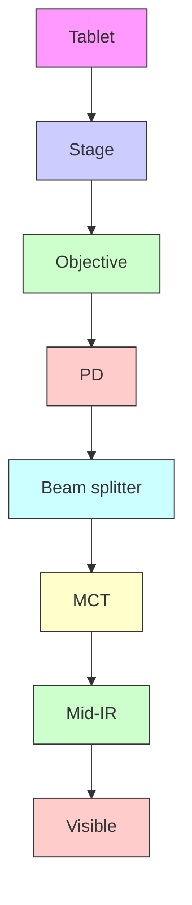

# Mid-Infrared Photothermal Imaging of Active Pharmaceutical Ingredients at Submicrometer Spatial Resolution

Chen Li,†,∥ Delong Zhang, ‡,∥ Mikhail N. Slipchenko,§ and Ji-Xin Cheng ,†,‡

† Department of Chemistry, Purdue University, West Lafayette, Indiana 47907, United States  
‡ Weldon School of Biomedical Engineering, Purdue University, West Lafayette, Indiana 47907, United States  
§ Department of Mechanical Engineering, Purdue University, West Lafayette, Indiana 47907, United States

Supporting Information

ABSTRACT: Chemical imaging with sufficient spatial resolution to resolve microparticles in tablets is essential to ensure high quality and efficacy in controlled release. The existing modalities have the following disadvantages: they are timeconsuming or have poor spatial resolution or low chemical specificity. Here, we demonstrate an epi-detected mid-infrared photothermal (epi-MIP) microscope at a spatial resolution of 0.65 μm. Providing identical spectral profiles as conventional infrared spectroscopy, our epi-MIP microscope enabled mapping of both active pharmaceutical ingredients and excipients of a drug tablet.

natural_image

3D rendered mechanical component with color-coded sections and a corresponding fluorescence microscopy image showing cellular structures (no text or symbols)

P harmaceutical tablets, as one of the most consumed oral1 active pharmaceutical ingredients (API) that have biological activities and excipients that are inert but ensure the pharmacological performance of the API. The potency of medicine mainly depends on the formulation, particle size, and content uniformity. So far, it is still hard to control these properties at a low dosage of contents.2 The bioactivity of API could be altered by inhomogeneous distribution or deformation of pharmaceutical particles, not to mention drug counterfeiting, which may be deleterious to patients. To produce high-quality medicines, it is essential to monitor and visualize the API and excipients in tablets in the quality control process. Specifically, as controlled release becomes an emerging trend in pharmaceuticals, the size of API and excipients particulates are being made from the order of 100 μm down to submicrometer and nanometer scale, making the current bulk imaging methods unable to cope with the new trend in the production line.3,4 As an example, high resolution chemical mapping of amlodipine besylate tablets from different vendors5 revealed heterogeneity differences in submicrometer scale between Pfizer and Ethex tables. (Note the Ethex tablets were later recalled by FDA due to quality issues.) Therefore, an increasing demand for high resolution imaging methods with chemical selectivity has arisen.

Various nonoptical imaging methods have been developed to address the above-mentioned challenge. Time-of-flight secondary ion mass spectrometry imaging ionizes and analyzes molecules over a spot of ∼1 μm, which has excellent chemical specificity and limit of detection.6 X-ray powder diffraction analysis7,8 and X-ray microtomography9 provides crystalline properties and element mapping, with a limit of detection sensitivity at the level of typically 1%. Nuclear magnetic resonance imaging is a noninvasive method elucidating the structure of molecules,10 with a long analysis time (order of 10 min). Terahertz imaging measures the thickness of tablet coating with a penetration depth of 0.45 mm but low spatial resolution of 0.15 mm.11 These imaging approaches were not adopted by the industry due to low throughput.

Alternatively, optical imaging has the potential to provide high speed, submicrometer resolution, and chemical specificity. Toth et al. combined second order nonlinear optical imaging and two-photon fluorescence to deliver fluorescent API imaging in powdered blends with common excipients.12 Besides, vibrational spectroscopy based imaging, which probes the intrinsic molecular vibration, provides rich chemical informa tion and is widely used in industry. Commonly used vibrational imaging modalities are based on Raman scattering, nearinfrared (NIR), or mid-infrared (MIR) spectroscopy.13 NIR and Raman imaging have been applied to analyze pharmaceutical formulations and/or counterfeits owing to advantages such as little/no sample preparation, chemical selectivity, and nondestructive measurement.14−19 However, the spectral bands used in NIR spectroscopy, mostly overtone absorption, are broad, weak, and usually severely overlapped, resulting in low chemical specificity.20 Spontaneous Raman scattering has relatively high chemical specificity but is a feeble effect (Raman cross section on the order of $1 0 ^ { - 3 0 } \mathrm { c m } ^ { 2 } / \mathrm { s r } )$ and thus requires a

Received: November 23, 2016

Accepted: April 11, 2017

Published: April 11, 2017

long integration time (>30 h per 500 × 500 hyperspectral image).21 Although recent progress of epi-detected coherent Raman scattering microscopy has demonstrated fast imaging of tablet sections and dissolution of drug molecules,5,22,23 the cost and complexity, along with small Raman cross section, limited further adoption of the technique. In contrast, MIR imaging appreciates a 100 million times larger absorption cross section (typ. 10−22 cm2 /sr) and has shown applications in pharmaceutics, including API mapping and counterfeit tablet investigation.24,25 However, the relatively poor spatial resolution and low reflectance of MIR light prohibited its wide use for pharmaceutics.

In this paper, we report a compact mid-infrared photothermal microscope for imaging tablets at submicrometer spatial resolution. Photothermal microscopy, first reported in the early 1980s,26 detects the photothermal lensing effect induced by the absorption of pump beam at focus using another probe beam. Modalities based on electronic or plasmonic absorption have been demonstrated for single nanoparticle and single molecule imaging.27,28 The deployment of a MIR beam as pump and a visible or NIR beam as probe was realized lately. Furstenberg and co-worker s29 demonstrated a back-detected photothermal microscope pumped by a midinfrared quantum cascade laser (QCL). To further improve the spatial resolution, Li et al.30 adopted a counter-propagation modality and applied a high NA objective for the visible probe beam. As a result, they obtained photothermal images of 1.1 μm polystyrene beads in three different solvents. With an increased signal to baseline ratio, Mertiri et al.̈ 31 performed photothermal imaging of dried tissue slices. Nevertheless, the spatial resolution and sensitivity were not sufficient for detection of submicrometer features within a cell.

We recently demonstrated a forward-detected mid-infrared photothermal (MIP) microscope with 0.6 μm spatial resolution and 10 μM sensitivity, which allowed MIR imaging of living cells and organisms.32 Our MIP microscope exploits a resonant amplifier that selectively probes the photothermal signal at the repetition rate of the pulsed IR laser. We showed that the MIP signal is linearly proportional to the number density of molecules and the power of each beam, which makes MIP a quantitative approach.32 Herein, we demonstrate submicrometer imaging of API and excipients microparticles in tablets by an epi-detected MIP microscope.

## EXPERIMENTAL SECTION

epi-detected Mid-Infrared Photothermal (epi-MIP) Microscope. A pulsed quantum cascade laser (Block Engineering, LaserTune LT2000) operated at 100 kHz repetition rate and ∼2 mW average power provided the tunable (ranges from 1345 to 1905 cm−1 ) mid-infrared (MIR) pump beam. Meanwhile, a continuous-wave 785 nm laser (Thorlabs, LD-785-SE-400) was used as the probe beam. Both beams were combined at a long pass dichroic mirror (Edmund Optics, #68654) and, then, sent to an inverted microscope (Olympus, IX-71) installed with a gold-coated reflective objective lens (52×; NA, 0.65; Edmund Optics, #66589). All samples were placed on a piezo scanning stage (Mad City Labs, Nano-Bio 2200) with a maximum scanning speed of 200 μs/ pixel. The residue of MIR beam generated at the dichroic mirror was guided to a room temperature mercury cadmium telluride (MCT) infrared detector (Vigo Inc., PVM-10.6) to monitor the infrared power. To detect the backward propagated MIP signal, a polarizing beam splitter (Thorlabs,

PBS122) was placed in the path of probe beam to transmit the linearly polarized light and reflect the polarization scrambled epi-MIP signal to the detector. When the sample is reflective, such as samples on a reflective mirror, a quarter-wave plate (Thorlabs, WPQ05M-780) is needed to induce a 90° polarization change to the backward signal to be coupled out. The detector was a silicon photodiode (Hamamatsu S3994-1). The photocurrent produced by the detector was amplified by a laboratory-built resonant circuit (resonant frequency at 103.8 kHz, gain 100) and then sent to a lock-in amplifier (Zurich Instruments, HF2LI) for phase-sensitive detection. The power spectrum of MIR beam was acquired by MCT via another lockin input channel. It was used to normalize the epi-MIP signal to obtain the absorption spectrum of samples.

Infrared Spectra Measurements. Samples were measured on an ATR-FT-IR spectrometer (Thermo Nicolet Nexus) with diamond as the internal reflection element. The spectra were acquired after the internal baseline correction with a blank sample. The spectra were recorded using the built-in software interface.

Chemicals. The polystyrene film was a standard FT-IR test film (International Crystal Laboratories, 0009-8181). The Tylenol tablet was Tylenol Extra Strength, 500 mg of acetaminophen each (∼83 wt %/wt). The pure chemicals including acetaminophen (analytical standard), corn starch (analytical standard), polyvinylpyrrolidone (analytical standard), and sodium starch glycolate (type A, pharmaceutical grade) were all purchased from Sigma-Aldrich.

## RESULTS AND DISCUSSION

Figure 1 shows the schematic of our epi-MIP setup (details in the Experimental Section). Being different from the setup in ref  

flowchart

Figure 1. Schematic of the epi-MIP microscope. A pulsed QCL source provides the MIR beam, and a continuous wave visible laser is used as the probe beam. Both beams are combined collinearly by a silicor dichroic mirror and then sent into a reflective objective. The residue of MIR is monitored by a mercury cadmium telluride (MCT) detector. The backward propagated probe beam is reflected by a beam splitte and sent to a silicon photodiode (PD).

32, we placed a polarizing beam splitter to the probe beam path to transmit the linearly polarized probe beam to the sample and reflect the backward propagated signal to the photodiode. To acquire an epi-MIP image, a sample was raster scanned on a piezoelectric scanning stage and the epi-MIP signal was recorded as a function of sample position. A computer was used to synchronize QCL tuning, stage scanning, and data acquisition.

Characterization. We first explored the spectral fidelity of epi-MIP signals by comparing the epi-MIP spectrum of a 60 μm polystyrene film to that from an attenuated total reflection (ATR) FT-IR spectrometer (Figure 2A). The epi-MIP

  
Figure 2. Characterization of the epi-MIP microscope. (A). Comparison of epi-MIP spectral profiles (red) and FT-IR spectra (black) of polystyrene film. The spectra were offset for visual clarity. (B) Epi-MIP image of the element 5 of group 5 on a positive 1951 USAF test target. The 1st order derivative of the profiles of the horizontal (red) and vertical (blue) lines are plotted at the bottom. The measured FWHM is 0.69 and 0.65 μm, respectively. Pixel dwell time: 1 ms. Scale bar: 20 μm.

spectrum showed good agreement with the FT-IR spectrum, notably for the phenyl ring semicircle stretching modes at 1450 and 1490 cm−1 . The 1450 cm−1 peak is also contributed by the backbone CH scissors deformation. Note the ATR-FT-IR spectra require ATR correction to avoid the distortion of band shapes and relative peak intensities induced by the ATR process. In contrast to ATR-FT-IR, the epi-MIP spectra do not need such baseline correction, which simplifies data processing and reduces calibration errors.

We then examined the spatial resolution of our epi-MIP microscope by measuring the sharp edge response of a 1951 USAF test target. A thin film $( < 5 \ \mu \mathrm { m } ,$ determined by Newton ring method) of olive oil was sandwiched by $\mathsf { a } \ \mathrm { C a F } _ { 2 }$ plate and the resolution target. The MIP signal from the oil film, carried by the probe light, was reflected by the coating of the target, immediately at the oil film, into the detector, which mimics the condition with real samples. Even though the infrared light heated up a large area, only the small area of the probe light focus generated MIP signal. Note the chrome coating did not generate MIP signal.

The result is shown in Figure 2B. We took the first derivative of the marked line profiles in the MIP image and fitted the derivative data points with a Gaussian function. It is noteworthy that the diffraction limit of 1742 $\mathrm { c m } ^ { - 1 }$ MIR beam is 5.5 μm focused by our 0.65 NA objective. However, our measured full width at half-maximum (FWHM) was 0.69 μm horizontally and 0.65 μm vertically. By comparison, even installed with a high NA (∼2) germanium ATR-objective, the ATR-FT-IR microscope can hardly resolve features smaller than 4 μm in tablet sections. 33 The 6-fold improvement of spatial resolution enabled us to acquire MIR spectra of a single pharmaceutical microparticle.

Tablet Imaging. After the above characterizations, we deployed the epi-MIP microscope to identify and visualize the API and excipients in real tablets. As one of the most consumed pain relief in the US, the Tylenol tablet was used as a test bed. The API is acetaminophen, whose MIR spectrum has characteristic peaks at 1500 cm−1 (phenyl ring semicircle stretching modes) and $1 6 6 6 ~ \mathrm { { c m } ^ { - 1 } }$ (amide I). Besides, three of the most abundant excipients include corn starch, polyvinylpyrrolidone (PVP), and sodium starch glycolate (SSG). As shown in Figure S1, the molecular structures indicate that these three excipients show characteristic peaks at C−H bending mode (corn starch), amide I band (PVP), and carboxylic acid CO stretching mode (SSG), respectively. On the basis of the knowledge above, we can identify and differentiate those substances referring to the epi-MIP signal at different excitation wavelengths within our QCL tunable range.

We first performed single color epi-MIP imaging of the Tylenol tablet at $1 5 0 2 ~ \mathrm { c m } ^ { \mathrm { - 1 } }$ to visualize the API distribution The tablet was sectioned at the center and mounted on scanning stage for imaging without other preparation. Figure 3A shows that particles containing API (bright spots) were uniformly distributed in the 190 × 190 μm2 region with some large clusters. In general, the API particles should be closely surrounded by excipients particles, which means the dark regions on our API map should be excipients dominant. To prove this hypothesis, we obtained pinpoint epi-MIP spectra at three different positions as shown in Figure 3B. Points 1 and 2, whose pinpoint spectra indicate that API is the dominant molecule, were selected from the bright regions in Figure 3A. By comparison, point 3, which is the dark point on the API map, shows a distinct pinpoint spectrum from the other points, indicating that starch, PVP, and SSG are more abundant than the API. To confirm the species assigned from pinpoint spectra, we collected ATR-FT-IR spectra of the API and excipients for comparison as shown in Figure 3C. The characteristic peaks we employed for chemical identification were all in good agreement with the ATR-FT-IR spectra.

We further explored the capability of our epi-MIP microscope in integrated mapping of API and excipients (Figure 4). We tuned the MIR excitation wavenumbers to 1413, 1502, 1656, and $1 7 5 0 ~ \mathrm { c m } ^ { - 1 }$ which correlate to the absorption bands of corn starch, API, PVP, and SSG, respectively (Figure 4A− D).. Each substance showed a unique spatial distribution and dosage in the region we observed. By merging images A−D, we obtained the overlaid image as Figure 4E exhibiting the relative distributions of the four substances in Tylenol tablet. Most of the bright spots contained more than one molecule, which implies that API and excipients were fully mixed before the tablet compression process. Note the dark area in the merged chemical map. This seemingly erroneous image was a result of out-of-focus particles generating a lower MIP intensity, due to the surface roughness of the tablet section. As an example, we tested epi-MIP imaging of the tablet at varying depth (Figure S2). The features and signal intensity varied dramatically as the focus changed by 20 μm. Furthermore, by applying Isodata threshold (an unsupervised thresholding method) to four different API maps, the average captured area in the binary map was calculated to be 82.6%, which was consistent with the listed weight percentage of acetaminophen, 83.3%.

A  

text_image

2
+
3
+
1

line chart

| Wavenumber (cm⁻¹) | Point 1 Int. (a.u.) | Point 2 Int. (a.u.) | Point 3 Int. (a.u.) |
| ----------------- | ------------------- | ------------------- | ------------------- |
| 1400              | ~5                  | ~0                  | ~2                  |
| 1500              | ~10                 | ~4                  | ~4                  |
| 1600              | ~15                 | ~0                  | ~4                  |
| 1700              | ~5                  | ~0                  | ~2                  |
| 1800              | ~0                  | ~0                  | ~1                  |
| 1900              | ~0                  | ~0                  | ~0                  |

line chart

| Wavenumber (cm⁻¹) | API     | Corn starch | PVP     | SSG     |
| ----------------- | ------- | ------------ | ------- | ------- |
| 1400              | ~0.08   | ~0.03        | ~0.02   | ~0.03   |
| 1500              | ~0.20   | ~0.02        | ~0.01   | ~0.04   |
| 1600              | ~0.08   | ~0.01        | ~0.01   | ~0.03   |
| 1700              | ~0.02   | ~0.01        | ~0.20   | ~0.08   |
| 1800              | ~0.01   | ~0.01        | ~0.01   | ~0.04   |
| 1900              | ~0.01   | ~0.01        | ~0.01   | ~0.02   |

Figure 3. Identification of different species in a Tylenol tablet. (A) The epi-MIP image of tablet obtained at $1 5 0 2 ~ \mathrm { c m } ^ { - 1 }$ API benzene band. (B) Pinpoint spectra of locations 1, 2, and 3, as indicated in (A). Dashed lines (red, blue, and orange) indicate the characteristic absorbance peaks of the three substances. (C) FT-IR spectra of the pure chemicals assigned. API denotes acetaminophen. Pixel dwell time: 500 $\mu \mathbf { s } .$ Scale bar: 50 μm.  

natural_image

Microscopic image showing red fluorescent spots against a black background, labeled 'A' in top-left corner

natural_image

Microscopic image showing green fluorescent spots against a dark background, labeled with letter B in top-left corner

natural_image

Fluorescent microscopy image showing cellular structures with green, red, and blue staining (no text or symbols visible)

natural_image

Microscopic image showing scattered purple fluorescent spots against a black background, labeled 'D' in top-left corner (no other text or symbols)

Figure 4. Epi-MIP image of API and excipients in a Tylenol tablet. (A-D) Epi-MIP images obtained at 1413, 1502, 1656, and 1750 $\mathrm { c m } ^ { - 1 }$ which correlate to corn starch, acetaminophen (API), PVP, and SSG, respectively. (E) Overlaid image of A−D showing the distribution of API (green), corn starch (red), PVP (cyan), and SSG (magenta). Pixel dwell time: 1 ms. Scale bars: 50 μm.

The results above collectively demonstrate the potential of the epi-MIP microscope as a new chemical imaging modality for pharmaceutical tablet manufacturing. The epi-MIP spectra are identical to the conventional FT-IR spectra, which simplifies the postprocessing of data and allows users to take advantage of the wealth of FT-IR spectra database collected in the past century. With the excellent chemical selectivity, quantitative measurement capability, simple sample preparation requirement, and the relatively low cost, our epi-MIP microscope could not only be useful for manufacturing quality control but also enable the detection of high-quality counterfeit tablets.

In our current setup, the QCL has a tunable range of 1345− $1 9 0 0 ~ \mathrm { { c m } ^ { - 1 } }$ , which covers many important MIR absorption bands, and has successfully differentiated the API molecule and three other excipients in Tylenol tablet sections by their characteristic peaks. Nevertheless. there are several other listed excipients that we could not map because their characteristic MIR peaks exceed our tunable range. We can readily expand the spectral range with the deployment of different pump sources to further exploit the abundant infrared libraries developed by previous researchers. In addition, advanced multivariate methods, such as multivariate curve resolution,34 can further endow the epi-MIP microscope with a robust analytical ability in more complex sample analysis. It is worth mentioning that the power of both the pump and probe beams in our epi-MIP microscope were low due to the limitations of laser sources, ∼2 mW for the pump beam and ∼10 mW for the probe beam at the sample. With the recently available high power MIR laser, the epi-MIP microscope will achieve higher sensitivity and imaging speed. Moreover, the spatial resolution of the epi-MIP microscope will be improved by using a probe laser wavelength that is shorter than the current 785 nm.

## CONCLUSION

In summary, we developed a submicrometer-resolution, epidetected MIP microscope and applied the setup to API visualization in drug tablets. As compared to the previous MIR microscopes, our epi-MIP microscope offered 5-fold better spatial resolution. Since we have demonstrated the application of MIP microscopy in imaging drug accumulation in living cells,32 it is feasible to perform the dissolution test and controlled release experiments of tablets on the forward detected MIP modality. As the current trend in pharmaceuticals is the combination of multiple techniques to provide integrated understanding, our MIP platform, with both forward and epi detected modalities, could potentially provide comprehensive information on the factors correlating to drug efficacy and boost the future research in pharmaceutical sciences.

## ASSOCIATED CONTENT

## \*S Supporting Information

The Supporting Information is available free of charge on the ACS Publications website at DOI: 10.1021/acs.analchem.6b04638.

Materials and methods, molecular structures, and epi MIP images versus focus positions (PDF)

## AUTHOR INFORMATION

## Corresponding Author

\*E-mail: jcheng@purdue.edu.

## ORCID

Chen Li: 0000-0002-4391-6196

Delong Zhang: 0000-0002-9734-3573

## Author Contributions

∥ C.L. and D.Z. contributed equally. J.-X.C. and D.Z. conceived the idea. C.L. and D.Z. designed the experiment. C.L. and D.Z. conducted the experiment. C.L., D.Z., and M.N.S. analyzed the data. C.L., D.Z. and J.-X.C. cowrote the manuscript. All authors have given approval to the final version of the manuscript.

## Notes

The authors declare no competing financial interest.

## ACKNOWLEDGMENTS

The authors thank Dr. Chi Zhang from the same group for constructive discussions. This research was supported by a Keck Foundation Science & Engineering Grant to J.-X.C.

## REEERENCES

(1) Ansel, H. C. Introduction to Pharmaceutical Dosage Forms; Lea & Febiger: Philadelphia, 1985.  
(2) Augsburger, L. L.; Hoag, S. W. Pharmaceutical Dosage Forms-Tablets, 3rd ed.; CRC Press: Boca Raton, FL, 2008.  
(3) Wong, D. Oral solid composition. U.S. Patent 8,313,774 B1, Nov. 20, 2012.  
(4) Salata, O. V. J. Nanobiotechnol. 2004, 2, 3.  
(5) Slipchenko, M. N.; Chen, H.; Ely, D. R.; Jung, Y.; Carvajal, M. T.; Cheng, J. X. Analyst 2010, 135, 2613−2619.  
(6) Belu, A. M.; Davies, M. C.; Newton, J. M.; Patel, N. Anal. Chem. 2000, 72, 5625−5638.  
(7) Bates, S.; Zografi, G.; Engers, D.; Morris, K.; Crowley, K.; Newman, A. Pharm. Res. 2006, 23, 2333−2349.  
(8) Nunes, C.; Mahendrasingam, A.; Suryanarayanan, R. Pharm. Res. 2005, 22, 1942−1953.  
(9) Hancock, B. C.; Mullarney, M. P. Pharm. Technol. 2005, 29, 92− 100.  
(10) Djemai, A.; Sinka, I. Int. J. Pharm. 2006, 319, 55−62.  
(11) Fitzgerald, A. J.; Cole, B. E.; Taday, P. F. J. Pharm. Sci. 2005, 94, 177−183.  
(12) Toth, S. J.; Madden, J. T.; Taylor, L. S.; Marsac, P.; Simpson, G. J. Anal. Chem. 2012, 84, 5869−5875.  
(13) Gendrin, C.; Roggo, Y.; Collet, C. J. Pharm. Biomed. Anal. 2008, 48, 533−553.  
(14) Cruz, J.; Bautista, M.; Amigo, J. M.; Blanco, M. Talanta 2009, 80, 473−478.  
(15) Amigo, J. M.; Ravn, C. Eur. J. Pharm. Sci. 2009, 37 (2), 76−82.  
(16) Sasic, S. Pharm. Res. 2007, 24, 58−65.  
(17) de Veij, M.; Deneckere, A.; Vandenabeele, P.; de Kaste, D.; Moens, L. J. Pharm. Biomed. Anal. 2008, 46, 303−309.  
(18) Rodionova, O. Y.; Houmøller, L. P.; Pomerantsev, A. L.; Geladi, P.; Burger, J.; Dorofeyev, V. L.; Arzamastsev, A. P. Anal. Chim. Acta 2005, 549, 151−158.  
(19) Rodionova, O. Y.; Pomerantsev, A. L. TrAC, Trends Anal. Chem. 2010, 29, 795−803.  
(20) Andersson, M.; Josefson, M.; Langkilde, F.; Wahlund, K.-G. J. Pharm. Biomed. Anal. 1999, 20, 27−37.  
(21) Gordon, K. C.; McGoverin, C. M. Int. J. Pharm. 2011, 417, 151−162.  
(22) Windbergs, M.; Jurna, M.; Offerhaus, H. L.; Herek, J. L.; Kleinebudde, P.; Strachan, C. J. Anal. Chem. 2009, 81, 2085−2091.  
(23) Kang, E.; Wang, H.; Kwon, I. K.; Robinson, J.; Park, K.; Cheng, J.-X. Anal. Chem. 2006, 78, 8036−8043.  
(24) Wray, P. S.; Clarke, G. S.; Kazarian, S. G. Eur. J. Pharm. Sci. 2013, 48, 748−757.  
(25) Ricci, C.; Eliasson, C.; Macleod, N. A.; Newton, P. N.; Matousek, P.; Kazarian, S. G. Anal. Bioanal. Chem. 2007, 389, 1525− 1532.  
(26) Fournier, D.; Lepoutre, F.; Boccara, A. C. J. Phys. Colloq. 1983, 44, C6-479−C6-482.  
(27) Boyer, D.; Tamarat, P.; Maali, A.; Lounis, B.; Orrit, M. Science 2002, 297, 1160−1163.  
(28) Gaiduk, A.; Yorulmaz, M.; Ruijgrok, P.; Orrit, M. Science 2010, 330, 353−356.  
(29) Druy, M. A.; Furstenberg, R.; Crocombe, R. A.; Kendziora, C. A.; Papantonakis, M. R.; Nguyen, V.; McGill, R. A. Chemical imaging using infrared photothermal microspectroscopy. In Proceedings of SPIE Defense, Security, and Sensing Conference, Baltimore, MA, Apr 23−29, 2012; Druy, M., Crocombe, R., Eds.; SPIE: Bellingham, WA, 2012; 837411.  
(30) Li, Z.; Kuno, M.; Hartland, G. Super-resolution Mid-infrared Imaging using Photothermal Microscopy. In Proceedings of Conference on Lasers and Electro-Optics, San Jose, CA, Jun. 5−10, 2016; Optical Society of America: Washington, DC, 2016; p ATu3J.7.  
(31) Mertiri, A.; Totachawattana, A.; Liu, H.; Hong, M. K.; Gardner,̈ T.; Sander, M. Y.; Erramilli, S. Label free mid-IR photothermal imaging of bird brain with quantum cascade laser. In Proceedings of Conference on Lasers and Electro-Optics, San Jose, CA, Jun. 8−13, 2014; Optical Society of America: Washington, DC, 2014; p AF1B.4.  
(32) Zhang, D.; Li, C.; Zhang, C.; Slipchenko, M. N.; Eakins, G.; Cheng, J.-X. Sci. Adv. 2016, 2, e1600521.  
(33) Chan, K. A.; Hammond, S. V.; Kazarian, S. G. Anal. Chem. 2003, 75, 2140−2146.  
(34) Felten, J.; Hall, H.; Jaumot, J.; Tauler, R.; De Juan, A.; Gorzsas,́ A. Nat. Protoc. 2015, 10, 217−240.