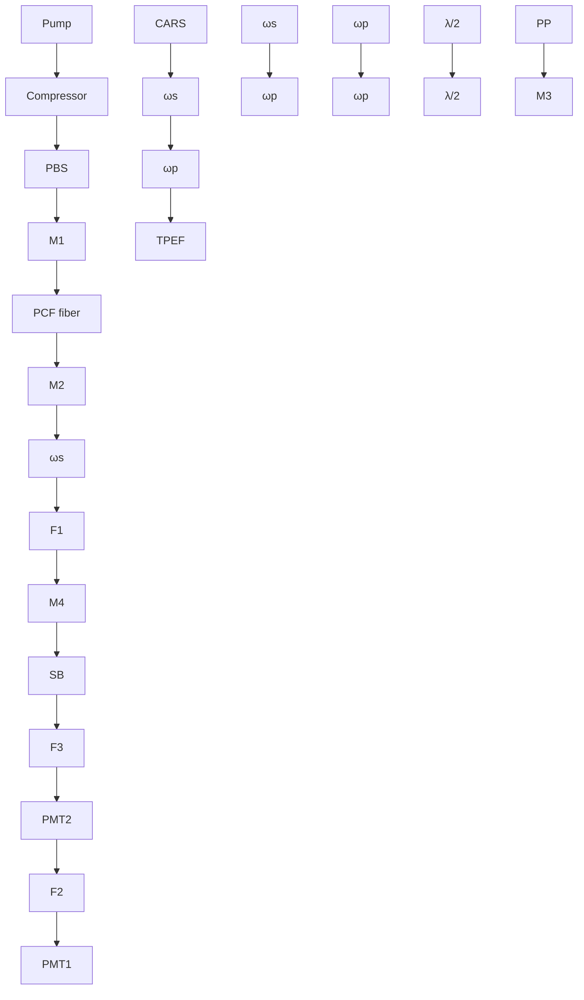

RESEARCH ARTICLE | MAY 10 2011

# Multimodal coherent anti-Stokes Raman spectroscopic imaging with a fiber optical parametric oscillator 

Yan-Hua Zhai; Christiane Goulart; Jay E. Sharping; Huifeng Wei; Su Chen; Weijun Tong; Mikhail N. Slipchenko; Delong Zhang; Ji-Xin Cheng

Check for updates

Appl. Phys. Lett. 98, 191106 (2011)

https://doi.org/10.1063/1.3589356

  
View Online

  
Export Citation

## Articles You May Be Interested In

Epi-detected quadruple-modal nonlinear optical microscopy for label-free imaging of the tooth

Appl. Phys. Lett. (January 2015)

In vivo and simultaneous multimodal imaging: Integrated multiplex coherent anti-Stokes Raman scattering and two-photon microscopy

Appl. Phys. Lett. (November 2010)

Nonlinear behavior of photoluminescence from silicon particles under two-photon excitation

Appl. Phys. Lett. (December 2011)

natural_image

Abstract digital artwork with flowing light streaks against a dark background, no text or symbols present

## AIP Advances

Why Publish With Us?

  
21DAYS average time to 1 st decision

  
OVER 4 MILLION views in the last year

  
INCLUSIVE scope

Learn More

  
AIP Publishing

# Multimodal coherent anti-Stokes Raman spectroscopic imaging with a fiber optical parametric oscillator

Yan-Hua Zhai,1 Christiane Goulart,1 Jay E. Sharping,1,a- Huifeng Wei,2 Su Chen,2 Weijun Tong,2 Mikhail N. Slipchenko,3 Delong Zhang,3 and Ji-Xin Cheng3,a-

1 University of California–Merced, Merced, California 95344, USA  
2 Yangtze Optical Fibre and Cable Co. Ltd. R&D Centre, Wuhan 430073, People’s Republic of China  
3 Department of Chemistry, Weldon School of Biomedical Engineering, Purdue University, West Lafayette, Indiana 47907, USA

-Received 29 December 2010; accepted 19 April 2011; published online 10 May 2011

We report on multimodal coherent anti-Stokes Raman scattering -CARS imaging with a source composed of a femtosecond fiber laser and a photonic crystal fiber -PCF-based optical parametric oscillator -FOPO. By switching between two PCFs with different zero dispersion wavelengths, a tunable signal beam from the FOPO covering the range from 840 to 930 nm was produced. By combining the femtosecond fiber laser and the FOPO output, simultaneous CARS imaging of a myelin sheath and two-photon excitation fluorescence imaging of a labeled axons in rat spinal cord have been demonstrated at the speed of 20 $\mu \mathrm { s }$ per pixel. © 2011 American Institute of Physics. doi:10.1063/1.3589356

Coherent anti-Stokes Raman scattering -CARS microscopy is a powerful tool for high-speed vibrational imaging of cells, tissues, and drug delivery systems.1,2 An additional advantage of CARS microscopy is that other linear and nonlinear imaging modalities such as confocal Raman microscopy and multiphoton fluorescence microscopy can be combined with CARS on a single microscopy platform. –6 Despite its, the technical complexity of CARS microscopy and the high cost of laser systems have hindered its widespread adaptation. Developing laser sources is an integral part of the evolution of CARS microscopy toward the ultimate goal of providing a reliable, inexpensive, and user friendly microscopy system.

First-generation CARS microscopes used two temporally synchronized femtosecond -fs or picosecond -ps pulsed lasers.1 Second-generation CARS systems used optical parametric oscillators -OPOs pumped with fs or ps solid state lasers to generate multiple inherently synchronized pulse trains without the need for electronic synchronization.7,8 Fiber-based laser systems are attracting attention because they provide advantages in terms of size and complexity.9–11 Notable progress is being made on developing all-fiber laser sources for CARS, including: supercontinuum generation in photonic crystal fiber -PCF -Ref. 10 and a two-color Er:fiber laser system.11 The average powers for these systems is limited to 10 mW for the Stokes beam, and a larger power from the pump beam is necessary to achieve high speed CARS imaging.

In this letter we report the application of a fiber-laser pumped, wavelength-tunable, pulsed fiber optical parametric oscillator -FOPO -Refs. 12–15 to multimodal CARS microscopy. Our FOPO resembles a state-of-the-art $\chi ^ { ( 2 ) }$ OPO except that the crystal is replaced by a PCF and the FOPO operates through four-wave mixing -FWM mediated by $\chi ^ { ( 3 ) }$ nonlinearity of glass. The fiber’s dispersive properties are chosen to phase match the FWM process leading to a wide spectral bandwidth of operation. One distinct advantage of FOPOs over $\chi ^ { ( 2 ) }$ OPOs is the ability to generate output at wavelengths near to that of the pump laser, which reduces the number of frequency conversion steps required for the generation of wavelengths for CARS microscopy. Furthermore, we anticipate that the fiber-based gain medium can be integrated with other fiber components, leading to a compact all-fiber FOPO system.

The optical layout is depicted in Fig. 1. The fiber laser -Uranus, PolarOnyx produces a 50 MHz pulse train -fundamental beam at 1032 nm with 2 W of average power and 300 fs pulse duration after a grating compressor. A half-wave plate in combination with a polarization beam splitter -PBS controls the power coupled into the PCF which serves as the gain medium within the FOPO cavity. The PBS-reflected portion of the fundamental beam, $\omega _ { \mathrm { p } } ,$ is chosen as the Stokes beam and the FOPO short wavelength output, $\omega _ { \mathrm { s } }$ , is used as the pump beam for the CARS microscopy.

The folded FOPO cavity, which is very similar to our previous designs,14,15 is 3.07 m long, matching the effective cavity length of the fiber laser. Mirrors M1 and M3 are cavity end mirrors and M3 is mounted on a translation stage for fine tuning of the cavity length and output wavelength. The closely spaced prism pair -PP is inserted inside the cavity to enhance the positive dispersion. The 1032 nm beam from the fiber laser is coupled into the PCF through an aspheric lens -C230TM-B, Thorlabs. Collimation of the output from the PCF is done using a similar aspheric lens with a C-coating. The output coupler is a long pass dichroic mirror, M2, -Long Pass 1064, Precision Photonics which delivers the short wavelength beam, $\omega _ { \mathrm { s } } ,$ out of the cavity. A half-wave plate placed before the FOPO cavity is used to match the 1032 nm fundamental-beam polarization with the PCF’s principle axes. Another half-wave plate is placed in the $\omega _ { \mathrm { s } }$ beam to set the beam polarization parallel to that of the 1032 nm, $\omega _ { \mathrm { p } }$ beam. A bandpass filter F1 -850/90 or 880/40, Chroma removes the weak broadband supercontinuum from the $\omega _ { \mathrm { s } }$ beam.

flowchart

FIG. 1. -Color online Schematic of a FOPO-based multimodal microscope. PBS is a polarization beam splitter cube. M1 is a 1064 nm short pass mirror. M2 is a 1064 nm long pass dichroic mirror. M3 is a protected silver cavity end mirror. M4 is a 940 nm short pass dichroic mirror. PP represents a prism pair. F1-F3 are bandpass filters. SB stands for a laser scanning box. PMT1 and PMT2 are photomultipliers. The inset shows energy diagrams for CARS and TPEF modalities.

  
FIG. 2. -Color online FOPO output performance. -a Tuning curves for ZDW950 and -b ZDW1030. -c Measured FROG spectrogram and -d retrieved FROG spectrogram. -e Reconstructed amplitude -solid and phase -dashed for the FOPO implemented with ZDW1030.

The two beams, $\omega _ { \mathrm { s } }$ and $\omega _ { \mathrm { p } } ,$ are temporally overlapped and collinearly combined using M4 -940 dcsp, Omega. The overlapped beams are then directed into a laser scanning inverted microscope -FV300/IX71, Olympus. We use a 60 NA= 1.2 water-immersed objective with improved near infrared -NIR transmission -UPLSAPO60XWIR, Olympus to focus the laser into the sample. The forward CARS signal is collected with an air condenser -NA= 0.55 and detected by an external photomultiplier tube PMT1 -R3896, Hamamatsu after propagating through bandpass filters -D695/70 or 740/ 140 nm, Chroma. The two-photon excitation fluorescence -TPEF signal is collected by the objective, separated from excitation beams with a dichroic mirror -670 dcxr, Chroma and detected with PMT2 -R7422–40, Hamamatsu after passing the bandpass filter -520/40 nm, Chroma. A spectrometer is mounted on the side port provides confocal Raman analysis of the objects.

The performance of the FOPO is shown in Fig. 2. Two PCFs -Yangtze Optical Fiber and Cable $\mathrm { C o . }$ , Ltd., China were separately used as the gain medium. One PCF has a zero-dispersion wavelength -ZDW calculated to be 950 nm, a length of 3.3 cm and a core diameter of 5 m -ZDW950. The other PCF has a ZDW measured to be 1030 nm, a length of 4.8 cm and a core size of 4.6 m -ZDW1030. The output wavelength is tuned by slightly varying the length of the cavity in the presence of cavity dispersion. Selected FOPO output spectra are shown in Figs. 2-a and 2-b, respectively. The tunable range is from 840 to 860 nm for ZDW950 and from 860 to 930 nm for ZDW1030. Although one obtains more tunability with higher pump power, this comes at the expense of the generation of sidebands in the output spectrum. The output of the FOPO covers a range from 840 to 930 nm using these two fibers. The spectral full-width at half-maximum -FWHM of the FOPO output is 10 nm. The total average power ranges from 5 to 25 mW depending on the wavelength, and power fluctuations are less than 3% over 20 min. Second harmonic generation, frequency resolved optical gating -FROG measurements are shown in Fig. 2 for ZDW1030. The measured and retrieved spectrograms are shown in Figs. 2-c and 2-d, respectively. Figure 2-e shows the reconstructed amplitude -black and phase -blue in the time domain where the FWHM pulse duration is 137 fs. The quadratic dependence on phase in the time domain indicates the presence of a linear chirp in the FOPO output.

As a proof of concept that FOPO systems can be useful for CARS microscopy, we recorded images of live 3T3-L1 cells cultured with 50 m of deuterated palmitic acids -see Fig. 3. Lipid droplets inside of the cells are clearly visible in the CARS images. The FOPO system, in this case, is tuned to 850 nm in order to excite the $\mathrm { C D } _ { 2 }$ stretching modes at

  
FIG. 3. Imaging deuterated lipid droplets in 3T3-L1 cells with FOPO-based CARS. -a Transmission image. -b Forward detected CARS image at 2074 cm−1. -c Raman spectrum obtained at the point indicated by the arrow in -a. C-D stretch is indicated by asterisk. The average pump and Stokes powers were 4 mW and 25 mW at the sample position, respectively. The total integration time per pixel was 20 s.

natural_image

Microscopic image showing red fluorescent structures with a 20 μm scale bar (no text or symbols beyond label)

natural_image

Microscopic view of green fluorescent biological structures against a dark background (no text or symbols visible)

natural_image

Fluorescent microscopy image showing red and green cellular structures with a white dashed box highlighting a specific region (no text or symbols present)

natural_image

Fluorescent microscopy image showing red and green cellular structures (no text or symbols)

FIG. 4. -Color Multimodal CARS/TPEF imaging of rat spinal cord. -a Forward detected CARS image of myelin sheath at 1673 $\mathrm { c m } ^ { - 1 } .$ . -b TPEF image of axons labeled with NF160/alex488 excited using the pump at 1032 nm. -c Overlaid CARS and TPEF images. -d Magnified segment of the overlaid images. The average pump and Stokes powers were 3.3 mW and 15 mW at the sample position, respectively.

$2 1 0 0 ~ \mathrm { c m ^ { - 1 } }$ . A typical transmission, and the corresponding CARS, images are shown in Figs. 3-a and 3-b, respectively. To verify that the signal is from CARS, we perform the same measurement with the pump and Stokes beams separated in time and with the beam frequencies tuned away from the Raman resonance. Confocal Raman microspectroscopic analysis of the lipid droplets reveal a distinctive peak near $2 1 0 0 ~ \mathrm { c m ^ { - 1 } }$ corresponding to the $\mathrm { C D } _ { 2 }$ stretching vibration see Fig. 3-c.

We further demonstrated CARS-based multimodal imaging of rat spinal cord white matter using the FOPO configured with ZDW1030. The output wavelength was tuned to 880 nm to excite $\mathrm { C } { = } \mathrm { C }$ vibrations $\mathrm { a t } \sim 1 6 5 0 ~ \mathrm { c m } ^ { - 1 }$ . The tissue sample was fixed, cut to 50 m thickness, and the axons were immuno-labeled with anti-NF-160 antibody conjugated to Alexa Fluor 488. The forward-detected CARS image in Fig. 4-a shows parallelly aligned myelin fibers. The epidetected TPEF image of the labeled axons, excited using the pump beam at 1032 nm, was obtained simultaneously and is shown in Fig. 4-b. The overlaid image in Fig. 4-c and the magnified area in Fig. 4-d show the relative position of myelin sheaths and axons. The images were acquired at a speed of 20 $\mu \mathrm { s } / \mathrm { p i x e l } .$ .

Despite our promising initial results, there is room for improvement in our current system. -i In our experiment we needed to exchange fibers. The ideal system would not require such a reconfiguration. -ii Our system exhibits pulseto-pulse stability which is similar to that produced using supercontinuum generation. The improved cavity design should bring stability close to that of pump laser. -iii The FOPO output has a broad spectrum in comparison with the pump, limiting CARS efficiency. The ideal system has similar bandwidths to that of pump laser. -iv Finally, the average output power must be increased because the current implementation barely meets the requirements for this application.

In summary, we have demonstrated multimodal CARS microscopy using a fiber laser and a FOPO. In our experiment, the FOPO generates up to 25 mW output that is tunable between 840 and 930 nm. By coupling the FOPO output with that of the fiber laser, high-quality CARS and TPEF imaging were realized. The current system allows one to probe vibrational transitions between 1050 and $2 2 2 0 ~ \mathrm { c m ^ { - 1 } }$ . Further exploration is under way to understand the fundamental limitations and improve the overall performance in terms of tuning range, spectral resolution, and output power. Finally, an all-fiber OPO cavity pumped by fiber laser will be developed to ultimately eliminate the free space design, thus providing a truly compact laser source for coherent Raman microscopy.

The authors acknowledge support from the Air Force Office of Scientific Research -AFOSR; Grant No. FA9550- 09-1-0483, and the National Institute of Health -NIH; Grant No. R01 EB 7243.

1 J. X. Cheng and X. S. Xie, J. Phys. Chem. B 108, 827 -2004.  
2 C. L. Evans and X. S. Xie, Annu. Rev. Anal. Chem. 1, 883 -2008.  
3 H.-W. Wang, T. T. Le, and J.-X. Cheng, Opt. Commun. 281, 1813 -2008.  
4 H. Chen, H. Wang, M. N. Slipchenko, Y. K. Jung, Y. Z. Shi, J. Zhu, K. K. Buhman, and J.-X. Cheng, Opt. Express 17, 1282 -2009.  
5 A. F. Pegoraro, A. Ridsdale, D. J. Moffatt, Y. W. Jia, J. P. Pezacki, and A. Stolow, Opt. Express 17, 2984 -2009.  
6 M. N. Slipchenko, T. T. Le, H. Chen, and J.-X. Cheng, J. Phys. Chem. B 113, 7681 -2009.  
7 C. L. Evans, E. O. Potma, M. Puoris’haag, D. Cote, C. P. Lin, and X. S. Xie, Proc. Natl. Acad. Sci. U.S.A. 102, 16807 -2005.  
8 F. Ganikhanov, S. Carrasco, X. S. Xie, M. Katz, W. Seitz, and D. Kopf, Opt. Lett. 31, 1292 -2006.  
9 K. Kieu, B. G. Saar, G. R. Holtom, X. S. Xie, and F. W. Wise, Opt. Lett. 34, 2051 -2009.  
10H. Kano and H. Hamaguchi, Appl. Phys. Lett. 86, 121113 -2005.  
11G. Krauss, T. Hanke, A. Sell, D. Traeutlein, A. Leitenstorfer, R. Selm, M. Winterhalder, and A. Zumbusch, Opt. Lett. 34, 2847 -2009.  
12G. K. L. Wong, S. G. Murdoch, R. Leonhardt, J. D. Harvey, and V. Marie, Opt. Express 15, 2947 -2007.  
13J. E. Sharping, J. Lightwave Technol. 26, 2184 -2008.  
14J. E. Sharping, C. Pailo, C. Gu, L. Kiani, and J. R. Sanborn, Opt. Express 18, 3911 -2010.  
15J. E. Sharping, J. R. Sanborn, M. A. Foster, D. Broaddus, and A. L. Gaeta, Opt. Express 16, 18050 -2008.