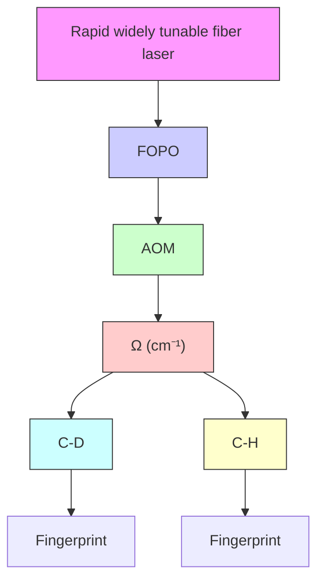
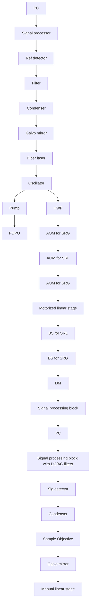
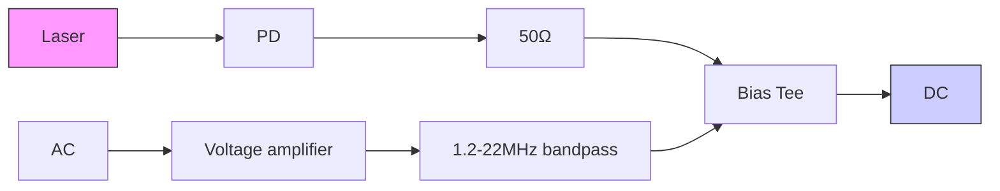
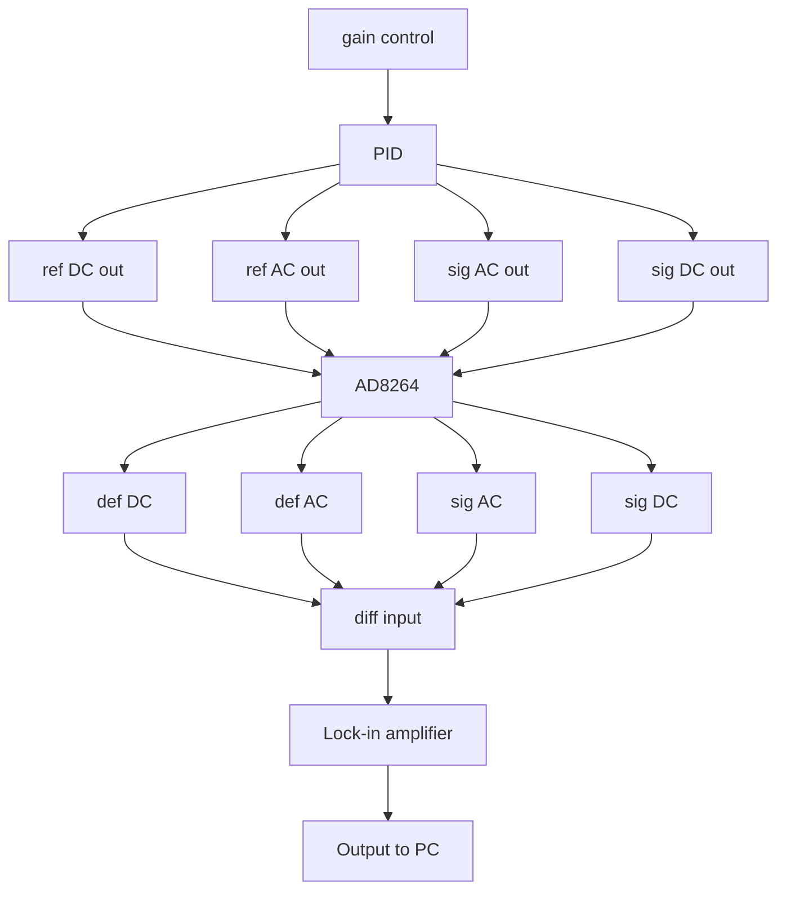
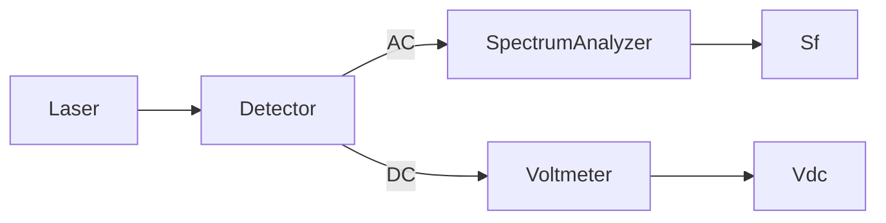

pubs.acs.org/ac

Article

# Multiwindow SRS Imaging Using a Rapid Widely Tunable Fiber Laser

Hongli Ni,⊥ Peng Lin,⊥ Yifan Zhu, Meng Zhang, Yuying Tan, Yuewei Zhan, Zian Wang, and Ji-Xin Cheng \*

Cite This: 2021, 93, 15703−15711

Read Online

ACCESS

Metrics & More

Article Recommendations

Supporting Information

ABSTRACT: Spectroscopic stimulated Raman scattering (SRS) imaging has become a useful tool finding a broad range of applications. Yet, wider adoption is hindered by the bulky and environmentally sensitive solid-state optical parametric oscillator (OPO) in a current SRS microscope. Moreover, chemically informative multiwindow SRS imaging across C−H, C−D, and fingerprint Raman regions is challenging due to the slow wavelength tuning speed of the solid-state OPO. In this work, we present a multiwindow SRS imaging system based on a compact and robust fiber laser with rapid and wide tuning capability. To address the relative intensity noise intrinsic to a fiber laser, we implemented autobalanced detection, which enhances the signal-to-noise ratio of stimulated Raman loss imaging by 23 times. We demonstrate high-quality SRS metabolic imaging of fungi, cancer cells, and Caenorhabditis elegans across the C−H, C−D, and fingerprint Raman windows. Our results showcase the potential of the compact multiwindow SRS system for a broad range of applications.

flowchart

## INTRODUCTION

Coherent Raman scattering (CRS) microscopy enables highspeed chemical mapping through probing intrinsic molecular vibrations. CRS spectroscopic imaging overcomes the speed limitation of spontaneous Raman spectroscopy and has significantly extended the scope of applications in the past two decades.1,2 A CRS microscope utilizes two ultrafast lasers, named pump at $\omega _ { \mathrm { p } }$ and Stokes at $\omega _ { \mathrm { { S } } }$ to coherently excite molecular vibrations at the two lasers’ beating frequency $\left( \omega _ { \mathrm { p } } - \omega _ { \mathrm { S } } \right)$ . CRS microcopy can be realized by coherent anti-Stokes Raman scattering (CARS) at the wavelength of $2 \omega _ { \mathsf { p } } { - } \omega _ { \mathsf { S } }$ or stimulated Raman scattering (SRS) manifested as the intensity loss at pump beam (stimulated Raman loss, SRL) and the intensity gain of Stokes (stimulated Raman gain, SRG). SRS has advantages over CARS in that it offers nearly identical spectral profiles as spontaneous Raman spectroscopy. SRS signal has a linear relationship to the molecule concentration, thus allowing quantitative measurement.3 Furthermore, SRS is measured under ambient light, which is preferable for clinical use.

The above-mentioned advantages have made SRS microscopy an increasingly useful tool in various biomedical and clinical research.4− However, broader adoption of this technique is challenged by the routinely used solid-state optical parametric oscillator (OPO) laser due to its bulkiness and strict requirement for the operating environment. Furthermore, the slow wavelength tuning speed of solid-state OPO hinders multiwindow SRS imaging, i.e., spectroscopic SRS imaging across multiple Raman windows including C−H, C−D, and fingerprint region.

Current spectroscopic SRS imaging methods can be categorized into two groups according to the bandwidth of the laser pulse. The first category uses narrowband picosecond pulses and generates a spectrum by tuning the laser wavelength, where high-throughput imaging is limited by the slow wavelength tuning of the solid-state OPO.8−10 The second category uses broadband femtosecond laser and harnesses spectral focusing1 13 or other pulse shaping14−16 techniques for hyperspectral imaging within the bandwidth of the laser pulses. Such approaches enable high-speed spectroscopic imaging within a limited spectral window, typically less than 300 cm−1 when using 100 fs pulses. Multiwindow imaging has to rely on tuning the solid-state OPO, which is slow and suffers from laser pointing drift.

To overcome the limitations of the solid-state OPO, fiber lasers have gained increasing interest in SRS microscopy for its compactness and robustness. Many dual-output fiber lasers have been developed and deployed for SRS imaging, including synchronized fiber lasers and Ti:sapphire lasers,17,18 electronically synchronized fiber lasers,19 self-synchronized fiber lasers,20 supercontinuum generation,21,22 soliton frequency self-shifting,23 Fourier domain mode locking,24 and parametric frequency generation.25 Nevertheless. the above-mentioned

Received: August 21, 2021

Accepted: November 9, 2021

Published: November 17, 2021

(a)  

flowchart

(b)  

flowchart

(c)  

flowchart

Figure 1. Rapid, widely tuning SRS microscope. (a) Schematic. HWP: Half-wave plate. PBS: Polarization beam splitter. AOM: Acousto-optic modulator. BS: Beam splitter. DM: Dichroic mirror. Ref: Reference. Sig: Signal. (b) Schematic of the detector assembly. PD: Photodiode. (c) Workflow inside the signal processor for autobalanced detection. PID: proportional−integral−derivative controller.

fiber laser sources either have limited spectral coverage or low power spectral density, which are not suitable for multiwindow spectroscopic SRS imaging.

Recently, Brinkmann et al. developed a rapid widely tunable picosecond fiber laser based on a fiber OPO (FOPO) and deployed this laser for CARS imaging.26,27 By engineering the dispersion and nonlinearity of the fiber, the FOPO enables broad spectral tuning, which covers C−H, C−D, and fingerprint regions. By incorporating a chirped fiber Bragg grating to match the repetition rate of the two outputs automatically, this FOPO achieves a spectral tuning speed of 5 ms between arbitrary wavenumbers, which is beyond the reach of other fiber lasers used for coherent Raman microscopy.

In this paper, we demonstrate SRS imaging of cells and organisms with the rapid widely tunable FOPO. As mentioned above, SRS is advantageous over CARS for the lack of nonresonant background, signal linearity, and robustness under ambient light. However, fiber laser-based SRS imaging is challenging due to the intrinsic high laser relative intensity noise (RIN). We therefore analyzed the noise spectrum of the fiber laser and optimized the modulation frequency for SRG imaging. Next, we implemented autobalanced detection (ABD) on the FOPO output, which improves the signal-tonoise ratio (SNR) by 23 times for SRL imaging. Subsequently, we demonstrated SRL imaging of biological specimens cross the C−H, C−D, and fingerprint regions. In the C−H region, we mapped the lipid and protein distribution inside fungi and ovarian cancer cells. Through cross-window analysis of the C− D and C−H regions, we visualized the metabolic activity of fungi and lipid uptake of ovarian cancer cells. Combining the fingerprint and C−H region images, we analyzed the unsaturated lipid, cholesterol, and overall lipid content of the Caenorhabditis elegans (C. elegans). Collectively, the results demonstrate the potential of our multiwindow SRS microscope for a wide range of applications.

## METHODS

Multiwindow SRS Imaging System. Figure 1a shows the schematic. The fiber laser (PICUS DUO, Refined Laser Systems GmbH) generates two synchronized pulse trains through the FOPO and an ytterbium-doped fiber oscillator. The pulses from the FOPO serve as the pump and the pulses from the fiber oscillator serve as the Stokes for SRS imaging. The laser repetition rate is 40.5 MHz and the pulse duration is ∼7 ps. The spectral tuning range is from 1050 to 3150 cm−1 , corresponding to the pump wavelength from ∼946 to 775 nm and the Stokes wavelength from ∼1053 to 1027 nm (Figure S1). The spectral resolution is about 12 cm−1 . The timing of the two beams varies for different Raman windows. To ensure the temporal overlapping of the pump and Stokes pulses, a motorized stage (X-LSM025A-KX14A, Zaber Technology) is used to compensate for the timing change for every 300 cm−1 .

The pump and Stokes beams first pass a half-wave plate (HWP) and a polarization beam splitter (PBS) for power adjustment and polarization parallelization. In the pump path, a 750 nm long pass filter is put after the PBS to filter out possible stray light. Both beams are pre-expanded to around 2 mm in diameter by a 4-f system. Between the 4f lens pair, an acousto-optic modulator (AOM) (1205-C, Isomet) is set near the beam focus to modulate the laser beam. For SRG, the pump is modulated and for SRL the Stokes. The pump and Stokes beams are spatially combined on the dichroic mirror. The combined beams then pass a pair of galvo mirrors for laser X−Y scanning. A 4-f system is between the galvo mirror and the objective is to expand the laser beam to around 6 mm in diameter and conjugate the galvo mirror with the objective back aperture. The spatio-temporally overlapped pump and Stokes beams are focused onto the sample by a waterimmersion objective with a 1.2 numerical aperture (NA) (UPLSAPO60XW, Olympus). A piezo positioner is installed on the objective to enable axial scanning. The outgoing light is collected by an oil immersion condenser with 1.4 NA (U-TLO, Olympus). The collected light passes a spectral filter to filter out the AOM-modulated beam. For SRL, we used a 1000 nm shortpass filter (FESH1000, Thorlabs), and for SRG, we used a 1000 nm long pass filter (FESH1000, Thorlabs).

flowchart

text_image

(c)
MF = 1.5 MHz, SNR=9.62
MF = 6 MHz, SNR=21.6
255 cm⁻¹

line chart

| Frequency (MHz) | FOPO     | Fiber oscillator | InsightX3 | Detector noise |
| --------------- | -------- | ---------------- | --------- | -------------- |
| 2               | -130     | -145             | -170      | -180           |
| 4               | -130     | -145             | -170      | -180           |
| 6               | -130     | -145             | -170      | -180           |
| 8               | -130     | -145             | -170      | -180           |
| 10              | -130     | -145             | -170      | -180           |
| 12              | -130     | -145             | -170      | -180           |
| 14              | -130     | -145             | -170      | -180           |

text_image

(d)
C-H region
2935 cm⁻¹
C-D region
2150 cm⁻¹

Figure 2. Laser noise measurement and SRG imaging result. (a) Laser RIN measurement setup. (b) Laser RIN measurement result. Laser power on the detector: ∼20 mW. (c) SRG imaging of 3 μm PMMA beads. MF: Modulation frequency. Power on sample: Pump: 24 mW, Stokes: 22 mW. Dwell time: 10 μs. (d) SRG imaging of $\mathrm { D } _ { 2 } \mathrm { O } \cdot$ -treated fungi at 2935 $\mathrm { c m } ^ { - 1 }$ (C−H region) and 2150 $\mathrm { c m } ^ { - 1 }$ (C−D region). Power on sample: C−H: Pump: 18 mW, Stokes: 43 mW. C−D: Pump: 30 mW, Stokes: 40 mW. Dwell time: 100 μs. MF: 6 MHz. Scale bar: 10 μm.

The filtered light is detected by a home-built detector (Figure 1b). The light signal is transformed to photocurrent by a large area 62 V biased photodiode (DET100A2, Thorlabs). The photocurrent is then turned to a voltage signal after passing a 50 Ω impedance. The AC and DC components of the signal are separated by a bias tee (ZFBT-282-1.5A+, Minicircuits). The separated DC is sent out as the DC output. The AC part is prefiltered by a 1.2 MHz highpass (ZFHP-1R2-S+, Mini-circuits) and a 22 MHz lowpass filter (BLP-21.4+, Minicircuits) and then amplified by a low-noise voltage amplifier (SA-230F5, Wayne Kerr Electronics). The amplified AC signal is the AC output of the detector. When imaging without the ABD, this $\mathrm { A } \bar { \mathrm { C } }$ output is directly demodulated by a lock-in amplifier (HF2LI, Zurich Instrument) to extract the SRS signal.

Autobalanced Detection. In balanced detection, the noisy laser beam is split into a signal and a reference arm. The signal arm interacts with the sample and the reference arm does not. The laser noise is canceled by taking the difference of the electrical signal from the two arms. The electrical signal from the two arms is carefully balanced in phase and amplitude to obtain the best noise cancellation performance. Compared to the optical delay-based19 or polarization-based28,29 method,

ABD requires no special optics as well as fine optical alignment. ABD utilizes a proportional−integral−derivative (PID) controller to balance the signal amplitude of the two arms, making it robust for sample transmission variation.15,22

To implement autobalanced SRS, several components are added to the system (Figure 1a). A beam splitter (BS) (BSS11R, Thorlabs) is put into the light path to split the unmodulated beam into 2 arms. The two arms are detected by identical detectors, as illustrated in Figure 1b. The detector for the signal arm is denoted as the sig detector and the one for the reference arm is denoted as the ref detector. The phase of the AC signal from the two arms is matched by adjusting the manual linear stage in the reference arm (Figure S2). The AC amplitude is balanced with the autobalancing signal processor shown in Figure 1c. In the signal processor, the AC and DC outputs from the two detectors are sent to a 4-channel variable gain amplifier (AD8264, Analog Devices Inc.). The function of AD8264 is to amplify the signals with adjustable gain. To balance the AC amplitude, the gain for the two arms is controlled by a PID controller (Moku:Lab, Liquid Instru ments). The PID determines the gain according to the DC signal from the two arms.

Samples. The fungal strain, Candida albicans SC5314 (wild-type), used in this study was from American Type Culture Collection (ATCC). C. albicans cells were grown overnight in yeast extract peptone dextrose (YPD) at $3 0 ~ ^ { \circ } \mathrm { C }$ in an incubating shaker to reach the stationary phase. The stationary-phase fungal cells were then diluted 20 times in fresh YPD and cultured for another 5 h at $3 0 ~ ^ { \circ } \mathrm { C }$ to obtain the log phase cells. After that, fungal specimens were pelleted and washed with 1× PBS. The log-phase C. albicans cells were resuspended in 0 and 90% $\mathrm { D } _ { 2 } \mathrm { O }$ containing YPD for the D Otreated group and the control group at a concentration of 1 × $1 0 ^ { 7 }$ cells/mL and incubated for 2 h. Then, 1 mL of fungi solution was centrifuged, washed with 1× PBS, and fixed by 10% formalin solution. Before imaging, formalin solution was washed away by 1× PBS.

The ovarian cancer cells OVCAR5 were provided by the Daniela Matei Lab at Northwestern University and were cultured in the RPMI 1640 medium (Gibco) supplemented with 10% FBS, 1% $\mathrm { P } / { \cal S } ,$ and 2 mM GlutaMax (Gibco). Cells were seeded in 35 mm glass-bottom dishes (Cellvis) overnight and were fixed with 10% neutral buffered formalin for 30 min followed by 3 times PBS wash before imaging. For oleic acid-$d _ { 3 4 }$ labeling, cells were cultured with 100 μM oleic acid-d (Cambridge Isotope Lab) for 6 h after overnight seeding in the glass-bottom dishes. All cells were maintained at $3 7 ~ ^ { \circ } \mathrm { C }$ in a humidified incubator with a 5% CO supply.

line chart

| Frequency (MHz) | w/o ABD (mV) | w/ ABD (mV) |
| --------------- | ------------ | ----------- |
| 2               | ~0.3         | ~0.1        |
| 3               | ~0.2         | ~0.08       |
| 4               | ~0.15        | ~0.07       |
| 5               | ~0.12        | ~0.06       |
| 6               | ~0.1         | ~0.05       |
| 7               | ~0.09        | ~0.04       |
| 8               | ~0.08        | ~0.03       |
| 9               | ~0.07        | ~0.02       |
| 10              | ~0.06        | ~0.01       |

text_image

(c)
Without ABD
SRG
SNR=15.8

text_image

With ABD
SNR=25.0

line chart

| Frequency (MHz) | w/o ABD (mV) | w/ ABD (mV) |
| --------------- | ------------ | ----------- |
| 2               | ~1.5         | ~0.1        |
| 3               | ~1.2         | ~0.08       |
| 4               | ~1.3         | ~0.09       |
| 5               | ~1.1         | ~0.07       |
| 6               | ~1.4         | ~0.08       |
| 7               | ~1.2         | ~0.09       |
| 8               | ~1.3         | ~0.08       |
| 9               | ~1.1         | ~0.07       |
| 10              | ~1.4         | ~0.09       |

natural_image

Microscopic image showing SRL (spectral resolution) distribution with bright spots on a purple background, labeled SNR=7.08 (no other text or symbols)

text_image

2951 cm⁻¹
SNR=163.6

Figure 3. Autobalanced detection (ABD) for improving SNR of SRS imaging. (a) Oscillator noise spectrum with and without ABD. Power on PD: 11 mW. (b) FOPO noise spectrum with and without ABD. Power on PD: 10 mW. (c) SRG imaging of 3 μm PMMA beads at 2951 cm−1 captured with and without ABD. Power on the sample: Pump: 18 mW, Stokes: 22 mW. (d) SRL imaging of 3 μm PMMA beads at 2951 cm−1 captured with and without ABD. Power on the sample: Pump: 16 mW, Stokes: 99 mW. Dwell time: 10 $\mu \mathbf { s } .$ Scale bar: 10 μm.

The C. elegans strains were obtained from the Caenorhabdi tis Genetics Center: wild-type (N2), VC452 [chup-1(gk245)]. The C. elegans was grown on standard NGM plates (containing 5 mg/L cholesterol) with Escherichia coli OP50 at $2 0 ~ ^ { \circ } \mathrm { C }$ for 2− 3 days. Before SRS imaging, the C. elegans was anesthetized using 1% sodium azide and sealed between two coverslips.

Spontaneous Raman spectroscopy. The Raman spectra were measured using a commercial Raman spectrometer (LabRAM HR, Horiba).

Least Absolute Shrinkage and Selection Operator (LASSO) Spectral Unmixing Algorithm. The LASSO model is as follows

$$
\hat {C} _ {i} = \arg \min _ {C _ {i}} \left\{\frac {1}{2} \left\| D (i,: - C _ {i} S \| ^ {2} + \beta \left\| C _ {i} \right\| _ {1} \right. \right\}
$$

where $D ( i , : )$ is the input spectrum at the ith pixel and $C _ { i }$ is the concentration value at the ith pixel. S is the spectral profile of pure chemicals. $\beta$ is a hyperparameter. The difference between least-square fitting and LASSO is the L1-norm regularization term β||C || , which helps suppress the cross-talking between background and channels. The hyperparameter $\beta$ controls the balance between background suppression and avoids too many empty regions. In our implementation, we set $\beta = 0 . 0 2$ .

## RESULTS

Laser Noise Measurement and SRG Imaging Performance. We measured the RIN spectra of the fiber oscillator and the FOPO outputs using the setup sketched in Figure 2a. The detector used for RIN measurement is the same as the one described in Multiwindow SRS Imaging System section. The AC output is sent to a spectrum analyzer (USB-SA44B, Signal Hound) to obtain the noise spectrum S(f). The unit for $S ( \hat { f } )$ is dBm, which is a power unit. The value of S(f) is influenced by the noise equivalent bandwidth (NBW), the signal amplification gain $G _ { \mathrm { A C } } ,$ and the laser power on the detector. To better compare the noise level, the noise is normalized to get the RIN $\bar { V } _ { \mathrm { D C } }$ is the voltage of the detector DC output and is measured by a voltmeter. The $V _ { \mathrm { D C } } ^ { 2 } / R$ is the DC power, which represents the influence of average laser power on the detector.

$$
\mathrm{RIN} = \frac {S (f)}{\mathrm{NBW} \times G _ {\mathrm{AC}} \times \frac {V _ {\mathrm{DC}} ^ {2}}{R}} \tag {1}
$$

Figure 2b gives the laser RIN result with unit dBc/Hz. A RIN spectrum measured from a solid-state OPO (InsightX3, Spectra-Physics) is plotted as a reference. The RIN result indicates that the FOPO output is much noisier than the oscillator output. Therefore, we first performed SRG imaging to avoid the large laser noise in the FOPO output. We also noticed that the oscillator output has lower noise in a higher frequency, suggesting that the modulation frequency (MF) can be increased to reduce the noise level in SRG imaging.

Figure 2c shows the SRG images of 3 μm PMMA beads. We defined the SNR of an SRS image by equation (2), where the signal mean is measured from the area with the strong SRS signal and the noise standard deviation (std) is measured from the background.

$$
\mathrm{SNR} = \frac {\text { signal   mean }}{\text { noise   std }} \tag {2}
$$

The SNR of an image with the 6 MHz MF is 2 times of that the 1.5 MHz MF, matching with the RIN spectrum in Figure 2b. Due to the limited AOM bandwidth, the modulation waveform deteriorates as the MF increases, resulting in the

line chart

| Wavenumber (cm⁻¹) | DMSO SRL | TAG SRL | DMSO Raman | TAG Raman |
| ----------------- | -------- | ------- | ---------- | --------- |
| 2800              | 0        | 0       | 0          | 0         |
| 2850              | 0        | 20      | 0          | 25        |
| 2900              | 30       | 20      | 25         | 20        |
| 2950              | 0        | 10      | 0          | 10        |
| 3000              | 0        | 5       | 5          | 5         |
| 3050              | 0        | 0       | 0          | 0         |
| 3100              | 0        | 0       | 0          | 0         |

scatterplot

| DMSO concentration (mol/L) | SRL Intensity (a.u.) |
| -------------------------- | -------------------- |
| 0                          | 0                    |
| 2                          | 50                   |
| 4                          | 100                  |
| 6                          | 150                  |
| 8                          | 200                  |
| 10                         | 250                  |
| 12                         | 300                  |
| 14                         | 350                  |

line chart

| Wavenumber (cm⁻¹) | DMSO-D6 SRL | DMSO-D6 Raman |
| ----------------- | ----------- | ------------- |
| 2050              | ~0          | ~0            |
| 2100              | ~1          | ~1            |
| 2150              | ~14         | ~14           |
| 2200              | ~0          | ~0            |
| 2250              | ~2          | ~5            |
| 2300              | ~0          | ~0            |

line chart

| X (nm) | Measured data | Gaussian fitting |
| ------ | ------------- | ---------------- |
| -1000  | ~0            | ~0               |
| -500   | ~1            | ~1               |
| 0      | ~4            | 508              |
| 500    | ~1            | ~1               |
| 1000   | ~0            | ~0               |

line chart

| Wavenumber (cm⁻¹) | DMSO SRL | DMSO Raman | TAG SRL | TAG Raman |
| ----------------- | -------- | ---------- | ------- | --------- |
| 1400              | 0.6      | 0.6        | 0.6     | 0.6       |
| 1500              | 0.1      | 0.1        | 0.1     | 0.1       |
| 1600              | 0.0      | 0.0        | 0.0     | 0.0       |
| 1700              | 0.0      | 0.0        | 0.5     | 0.5       |
| 1800              | 0.0      | 0.0        | 0.1     | 0.1       |

natural_image

Scientific image showing a bright vertical gradient pattern with a blue dashed line and a scale bar (no text or symbols)

line chart

| Z (μm) | Intensity (a.u.) |
| ------ | ---------------- |
| -4     | 0                |
| -2     | 1                |
| 0      | 4                |
| 2      | 2                |
| 4      | 0                |

Figure 4. Characteristics of autobalanced SRL. (a) SRL spectra of representative samples in $\mathrm { C - H , \ C - D , }$ , and fingerprint vibration regions. Spectrum acquisition time: ${ \sim } 5 \ s \ \mathrm { ~ ( C \mathrm { - } H }$ and C−D, 301 data points, integrated over 30 × 30 pixel area), ∼7 s (fingerprint, 441 data points, integrated over a 30 × 30 pixel area). (b) DMSO detection sensitivity. (c) Transverse view of 3D SRL imaging of a 500 nm PMMA bead. (d) Longitudinal view of 3D SRL imaging of a 500 nm PMMA bead. (e) Intensity profile along the red line in (c). (f) Intensity profile along the blue line in (d). Power on sample: pump: 15 mW, Stokes: 90 mW. Dwell time: 100 μs. Scale bar: 500 nm.  

line chart

| Wavenumber (cm⁻¹) | Intensity (a.u.) |
| ----------------- | ---------------- |
| 2800              | 0.0              |
| 2900              | 0.8              |
| 3000              | 0.1              |
| 3100              | 0.0              |

line chart

| Wavenumber (cm⁻¹) | Intensity (a.u.) |
| ----------------- | ---------------- |
| 2800              | 0                |
| 2850              | 14               |
| 2900              | 15               |
| 2950              | 10               |
| 3000              | 0                |
| 3050              | 0                |
| 3100              | 0                |

natural_image

Microscopic image of fungal cells under spectral projection, showing clustered structures (no text or symbols)

natural_image

Microscopic image of red fluorescent cells labeled 'Protein' (no other text or symbols visible)

natural_image

Microscopic image showing blue fluorescent spots labeled 'Lipid' against a black background (no other text or symbols)

natural_image

Fluorescence microscopy image showing red-stained cell nuclei with purple cytoplasmic markers (no text or symbols)

natural_image

Microscopic image of ovarian cancer cells with fluorescent labeling (no text or symbols)

natural_image

Microscopic image showing red fluorescent cellular structures against a black background (no text or symbols)

natural_image

Fluorescent microscopy image showing blue-stained cellular structures against a black background (no text or symbols)

natural_image

Fluorescent microscopy image showing red and blue stained cellular structures against a black background (no text or symbols)

Figure 5. SRL imaging of cells in the C−H region. (a) Standard sample spectra used for LASSO. Spectrum acquisition time: ∼5 s (301 data points, integrated over a $\bar { 3 0 } \breve { \times } 3 0$ pixel area). (b) Hyperspectral stack projection and the spectral unmixing result of fungal cells. (c) Hyperspectral stack projection and the spectral unmixing result of ovarian cancer cells. Power on sample: Pump: 16 mW, Stokes: 98 mW. Dwell time: $1 0 \ \mu \mathbf { s } .$ Scale bar: 10 μm.

SRS signal level drop in the higher MF (Figure S3a). The sweet point for the SNR is around 6 MHz (Figure S3b).

Yet, the optimized SRG modality is not enough for cellular imaging at the C−D and fingerprint regions. Figure 2d shows the SRG images of D O-treated fungal cells with the 6 MHz MF at 2935 cm−1 (C−H region) and 2150 $\mathrm { c m } ^ { - 1 }$ (C−D region). The C−H region image barely shows the cell morphology. At the C−D region, the SNR is too low to show any contrast.

(a)  

natural_image

Microscopic image of fungal D₂O-treated cells (no text or symbols visible)

text_image

Fungi
control

natural_image

Fluorescence microscopy image of ovarian cancer cells labeled OA-d34 treated, showing cellular structures (no text or symbols present)

text_image

Ovarian cancer cell
control
217 cm⁻¹

natural_image

Microscopic image showing red fluorescent cellular structures (no text or symbols visible)

natural_image

Microscopic view of red fluorescent cells against a dark background (no text or symbols)

natural_image

Fluorescence microscopy image showing red-labeled cellular structures against a dark background, with no visible text or symbols.

natural_image

Fluorescence microscopy image showing red-stained cellular structures with a 2910 cm⁻¹ scale bar (no text or symbols beyond scale indicator)

(e  

natural_image

Fluorescent microscopy image showing green and blue cellular structures (no text or symbols)

natural_image

Dark background with faint blue abstract shapes, no text or symbols visible

0.7 0

natural_image

Fluorescence microscopy image showing cellular structures with blue and green staining (no text or symbols)

natural_image

Abstract blue pattern on black background with a vertical color bar ranging from 0 to 0.75 (no text or symbols)

Figure 6. C−D/C−H SRL imaging of fungal and cancer cells. (a) C−D SRL image of fungal cells with and without $\mathrm { D } _ { 2 } \mathrm { O }$ treatment. Power on sample: Pump: 21 mW, Stokes: 93 mW. Dwell time: 100 μs. 40 average. (b) C−D SRL image of ovarian cancer with and without OA-d34 treatment. Power on sample: Pump: 21 mW, Stokes: 93 mW. Dwell time: 100 μs. 10 average. (c) C−H SRL image of fungal cells with and without $\mathrm { D } _ { 2 } \mathrm { O }$ treatment. Power on sample: Pump: 16 mW, Stokes: 95 mW. Dwell time: 10 μs. 10 average. (d) C−H SRL image of ovarian cancer with and without OA-d34 treatment. Power on sample: Pump: 16 mW, Stokes: 95 mW. Dwell time: 10 μs. 10 average. (e) Heat map of the $I _ { \mathrm { C - D } } / ( I _ { \mathrm { C - D } } +$ $I _ { \mathrm { C - H } } )$ ratio calculated using (a) and (c). (f) Heat map of the $I _ { \mathrm { C - D } } / ( I _ { \mathrm { C - D } } + I _ { \mathrm { C - H } } )$ ratio calculated using (b) and (d). Scale bar: 10 μm.

Autobalanced SRS Imaging Performance. To further improve the SNR, we implemented the ABD to cancel the laser intensity noise. Figure 3a shows the oscillator noise spectrum before and after ABD, measured by the lock-in oscilloscope function. Figure 3b shows the FOPO noise spectrum before and after ABD. With the 10 mW laser power on the detector, ABD suppressed the oscillator noise by ∼4 dB and the FOPO noise by ∼26 dB at 3.3 MHz (Figure 3a,b). This noise reduction led to SRG SNR improvement by 1.59 times and SRL SNR improvement by 20 times. Figure 3c,d compares the SRS imaging result of 3 μm PMMA beads with and without ABD. The modulation frequency of 3.3 MHz was chosen to avoid too much signal level drop caused by the modulation deterioration (Figure S3). The SNR of the SRG image is improved by ∼1.58 times and that of the SRL image is improved by ∼23 times. The SNR improvement is more significant for SRL as the FOPO output is much noisier than the oscillator output. The autobalanced SRL achieves better SNR than the autobalanced SRG, mainly because the oscillator output has higher power than the FOPO output.

With the autobalanced SRL, we characterized the spectral fidelity, detection sensitivity, and excitation volume. Figure 4a shows SRL spectra of several standard samples in C−H, C−D, and fingerprint regions. The overall shape of the SRL spectra matches well the spontaneous Raman data (Figure 4a, dash line). The spectra in Figure 4a were post-processed to remove artificial sharp dips caused by the laser imperfections (Figure S4a). The post-processing procedure manually deletes the bad data points and then smooths the spectra using moving average with a window of 5 data points (Figure S4c). Because the raw SRL spectra were sampled with the 1 cm−1 step, which is much smaller than the spectral resolution, the resolution of the SRL spectrum should not be affected by the post-processing. Figure 4b presents the detection sensitivity of DMSO at $2 9 \bar { 1 } 2 ~ \mathrm { { c m } ^ { - 1 } }$ . The detection sensitivity is found to be better than 0.02 mol/L. Figure 4c,d depicts the transverse and longitudinal view of 3D SRL imaging of a 500 nm PMMA bead. The intensity profiles along the lateral and axial directions are shown in Figure 4e,f. The system axial resolution is around 2.47 μm and the lateral resolution is estimated to be 392 nm after deconvolution with particle size.

Multiwindow SRL Imaging of Biological Samples. To evaluate the imaging performance in the C−H region, we first recorded the SRL spectra of bovine serum albumin (BSA) and triacylglyceride (TAG), as shown in Figure 5a. We applied the same post-processing method to remove the artificial sharp dips in the SRL spectra, as mentioned above. Next, we took hyperspectral image stacks of fungi and ovarian cancer cells from 2800 to 3100 cm−1 with a 1 cm−1 step size. The spectra at every pixel are processed in the same way as the BSA and TAG spectra. The average results of the hyperspectral stacks are shown in the spectral projection column in Figure 5b,c. By applying the LASSO spectral unmixing algorithm11 and taking the BSA and TAG spectra as protein and lipid spectra reference, maps of protein and lipid distribution in the cells are obtained from the hyperspectral data, as shown in Figure 5b,c. The lipids are located in the cytoplasm, while the protein signals were found in both the nucleus and cytoplasm.

Tracking the uptake of deuterium-labeled nutrients using SRS imaging is an important tool for the cell metabolism study.6,8 When deuterium-labeled nutrients are incorporated into the biomass, a part of the C−H bonds in the cell molecules is replaced by the C−D bond, which gives signature Raman peaks in the C−D region. The SRS signal ratio of $I _ { \mathrm { C - D } } /$ $\left( I _ { \mathrm { C - D } } \mathrm { ~ \bar { + } ~ } I _ { \mathrm { C - H } } \right)$ therefore reflects the activeness of cell metabolism.31 Due to the slow speed in switching between the C−D region and the C−H region, most of the published SRS studies only used the C−D intensity to represent cell activity.6,8 Yet, the C−D SRS intensity can be influenced by laser intensity, focus drifting, system alignment, etc., thus not robust enough to quantify the cell metabolism. Here, multiwindow SRS imaging addresses this issue with the capability of rapidly switching between the C−D and C−H vibrations. C−D/C−H SRL imaging of deuterium-labeled fungi and ovarian cancer cells is shown in Figure ${ 6 } \mathrm { a - d } .$ . The D O-treated fungal cells can be clearly seen in the C−D channel. In the contrast, the control group only shows very vague cell shapes due to cross-phase modulation $\left( \mathrm { X P M } \right) ^ { 3 2 }$ (Figure 6a). XPM is a nonresonant process and not sensitive to the wavenumber change, which is typically treated as a constant background. Similarly, the perdeuterated oleic acid (OA-d34)-treated ovarian cancer cells have a strong C−D signal from the lipid, while the control group has no signal (Figure 6b). The C−H SRS images of the same cells are recorded as references. The heat map of the $I _ { \mathrm { C - D } } / ( I _ { \mathrm { C - D } }$ + $I _ { \mathrm { C - H } } )$ ratio for the fungi and ovarian cancer cells is shown in Figure $^ { 6 \mathrm { e } , \mathrm { f } , }$ where the metabolism heterogeneity of the microbes and the lipid accumulation in ovarian cancer cells are clearly seen. The XPM contributes to the background that appeared in the control group’s heat map.

(a)  
  
(b)  
(c)

heatmap

| Z = 3 µm | Value |
| -------- | ----- |
| (Data not extractable as discrete values; visual scatter of purple dots) | 0.00–0.3 |

Figure 7. C−H and fingerprint SRL imaging of C. elegans. (a) SRL images of wild-type C. elegans at 2850, 1649, and 1675 $\mathrm { c m } ^ { - 1 } .$ . The white arrow indicates the lipid droplets in the epidermis lack cholesterol (b) SRL images of the chup-1 mutant C. elegans at 2850, 1649, and 1675 cm−1 . (c) Depth-resolved map of the $I _ { 1 6 4 9 } / I _ { 2 8 5 0 }$ ratio for lipid particles in wild-type C. elegans. $Z = { \bar { 0 } }$ μm is corresponding to (a). Power on the sample: 2850 $\mathrm { c m } ^ { \frac { \cdot } { \cdot } 1 } \colon$ : Pump: 12 mW, Stokes: 91 mW. 1649 and $1 \dot { 6 } 7 5 ~ \mathrm { c m } ^ { - 1 }$ : Pump: 16 mW, Stokes: 79 mW. Averaging: 2850 $\mathrm { c m } ^ { - 1 } ;$ : 10 average. 1649 $\mathrm { { \bar { c } m } ^ { - 1 } }$ : 20 average. $1 6 7 5 ~ \mathrm { { c m } ^ { - 1 } ; }$ 40 average. Dwell time: 2850 cm−1 : 10 μs. 1649 and 1675 $\mathrm { c m } ^ { - 1 } \mathrm { : }$ 100 $\mu \mathbf { s } .$ . Scale bar: 10 μm.

Finally, to evaluate the performance of our microscope for organism study, we imaged the same C. elegans in both the fingerprint and C−H regions. We chose 3 representative spectral channels: the 1649 $\mathrm { c m } ^ { - 1 }$ channel targets the acyl $\mathrm { C } =$ C bond and shows the distribution of unsaturated fatty acids; the $1 6 7 5 ~ \mathrm { { c m } ^ { - 1 } }$ channel corresponds to the sterol $\mathrm { C } { = } \mathrm { C }$ bond and reflects the cholesterol distribution; and the 2850 $\mathrm { c m } ^ { - 1 }$ in the C−H region shows the overall lipid storage. We chose 1649 and $1 6 7 5 ~ \mathrm { { c m } ^ { - 1 } }$ instead of 1655 and $1 6 7 0 \mathrm { c m } ^ { - 1 }$ where the acyl $\mathrm { C } { = } \mathrm { C }$ and sterol $\mathrm { C } { = } \mathrm { C }$ peak central locates to avoid the peak overlapping region to minimize channel cross-talk. The 3- color SRS imaging result of wild-type C. elegans is shown in Figure 7a. To confirm that the SRS signal in the $1 6 7 5 ~ \mathrm { { c m } ^ { - 1 } }$ channel is from the cholesterol, we also imaged the chup-1 mutant, which lacks the cholesterol uptake protein.33 Because the C. elegans can only obtain cholesterol from the environment, the chup-1 mutant should have a much lower cholesterol level than the wild-type. The SRS images of the chup-1 mutant are shown in Figure $^ { 7 \mathrm { b } , }$ where the SRS signal almost disappears in the $\bar { 1 6 7 5 \ \mathrm { c m } ^ { - 1 } }$ channel. This result proves that the SRS signal in the $1 6 7 5 ~ \mathrm { { c m } ^ { - 1 } }$ is mainly from the cholesterol. By comparing the 1649 and 1675 $\mathrm { c m } ^ { - \mathrm { i } }$ SRS images of wildtype C. elegans, it is found that the cholesterol is mainly distributed in the intestine area and lacks in the epidermis (pointed by the white arrows). We also calculated the ratio of $I _ { 1 6 4 9 } / I _ { 2 8 5 0 }$ to represent the lipid unsaturation level of the lipidrich particles in wild-type C. elegans, as shown in Figure 7c. The ratio map at $Z = 0$ μm corresponds to Figure 7a. The $I _ { 1 6 4 9 } / I _ { 2 8 5 0 }$ ratio indicates heterogeneity of lipid particles in C. elegans that the near-intestine lipids have a higher unsaturation ratio than the lipid in the epidermis.

## DISCUSSION

We demonstrated multiwindow SRS imaging with a rapid widely tunable fiber laser. The fast spectral tuning capability across C−H, C−D, and fingerprint regions enables crosswindow quantitative analysis of cell metabolic activity. Furthermore, our multiwindow SRS microscope is able to sample the spectrum selectively and discretely, which is in the contrary to spontaneous Raman34 and broadband CARS imaging.35 As the spectral data is highly sparse,36 the selective sampling would greatly boost the spectroscopic imaging speed and meanwhile lower the total laser energy on the sample.

In this work, we compared the SRG and SRL modalities. We note that an independent, parallel work by Würthwein et al. demonstrated SRG imaging of polymer beads (30 μm in diameter), pure dDMSO (14.1 mol/L), lipids, and dDMSOsoaked adipose tissues using the same laser source.37 Due to the limited power of the FOPO output (pump beam in SRS), SRG imaging of cell metabolism remains difficult (see Figure 2d). By applying autobalanced detection to the FOPO beam, we successfully developed an SRL modality with greatly enhanced detection sensitivity (i.e., 20 mM DMSO, as shown in Figure 4b). With this modality, we have mapped chemicals in biological cells and C. elegans in C−H, C−D, and fingerprint vibration windows.

In the fingerprint and C−D regions, we applied a relatively long dwell time and multiple averaging to get good SNR, resulting in an imaging speed of 1−2 min per frame. The rapid spectral tuning speed of the laser is not fully utilized at this imaging speed. The SNR can be further improved with several approaches. First, it is possible to suppress the laser noise to a lower level with the ABD. By modeling the residual noise after ABD suppression, we found that the SRS detection is not shot noise-limited or electrical noise-limited (Figure S5). It is possible to further reduce the electronic noise of our detector to achieve shot noise limit detection. The second approach is to increase the detector saturation power threshold. The detector saturation issue limits the maximum laser power for the unmodulated beam. We will test photodiodes that have higher saturation levels. By using new detectors with a higher saturation level, we can potentially use full laser power provided by the FOPO and the oscillator, which could improve the SRL SNR by ∼2 times and SRG SNR by ∼9 times.

The FOPO instability is another issue of the current multiwindow SRS system, which resulted in artificial sharp dips in current SRL spectra. This issue can be solved within a small tuning range by not tuning the oscillator wavelength but the repetition rate. With a fixed oscillator wavelength, the system allows tuning the FOPO wavelength over a small range in a smooth way, as demonstrated by Würthwein et al. using the same laser source.37

## CONCLUSIONS

We reported a multiwindow SRS imaging system enabled by a rapid and widely tunable fiber OPO and autobalanced detection. Our system is able to access Raman bands from 1050 to 3150 cm−1 and can tune between two arbitrary wavenumbers within 5 ms. By analyzing the laser noise spectrum, we optimized the modulation frequency for SRG imaging. We implemented autobalanced detection to suppress the pump noise by ∼26 dB at 3.3 MHz, leading to an SNR improvement of 23 times in SRL imaging. With the autobalanced SRL, we demonstrated multiwindow SRS imaging across the C−H, C−D, and fingerprint regions. Through hyperspectral SRL imaging in the C−H region, lipid and protein distributions inside fungi and ovarian cancer cells are mapped. With C−D/C−H SRL imaging, $\mathrm { D } _ { 2 } \mathrm { O }$ metabolism in fungi and fatty acid uptake by ovarian cancer cells are visualized. Through multiwindow imaging across the finger print and C−H regions, we showed the heterogeneity in cholesterol content and the unsaturation ratio of the lipid particle inside C. elegans. These results collectively demonstrate the potential of a multiwindow fiber laser SRS imaging system in a wide range of applications.

## ASSOCIATED CONTENT

## \*sı Supporting Information

The Supporting Information is available free of charge at https://pubs.acs.org/doi/10.1021/acs.analchem.1c03604.

Additional experimental details and data, including laser wavelength, procedure for balanced detection, SRS dependence on the modulation frequency, raw SRS spectrum, and noise dependence on laser power (PDF)

## AUTHOR INFORMATION

## Corresponding Author

− Department of Electrical and Computer -Xin ChengEngineering, Boston University, Boston, Massachusetts 02215, United States; Department of Chemistry, Boston University, Boston, Massachusetts 02215, United States; Department of Biomedical Engineering, Boston University, Boston, Massachusetts 02215, United States; Photonics Centre, Boston University, Boston, Massachusetts 02215, United States; orcid.org/0000-0002-5607-6683; Phone: +1 (617) 353-1276; Email: jxcheng@bu.edu

## Authors

− Department of Electrical and Computer ongli NiEngineering, Boston University, Boston, Massachusetts 02215, United States; orcid.org/0000-0003-4323-1493 − Department of Electrical and Computer eng LinEngineering, Boston University, Boston, Massachusetts 02215, United States − Department of Chemistry, Boston University, ifan ZhuBoston, Massachusetts 02215, United States − Department of Biomedical Engineering, Boston eng ZhangUniversity, Boston, Massachusetts 02215, United States − Department of Biomedical Engineering, Boston uying TanUniversity, Boston, Massachusetts 02215, United States − Department of Biomedical Engineering, Boston uewei ZhanUniversity, Boston, Massachusetts 02215, United States − Department of Biomedical Engineering, Boston an WangUniversity, Boston, Massachusetts 02215, United States

Complete contact information is available at: https://pubs.acs.org/10.1021/acs.analchem.1c03604

## Author Contributions

⊥H.N. and P.L. contributed equally. All authors have given approval to the final version of the manuscript.

## Funding

NSF Chemical Imaging Program CHE1807106, NIH R35 GM136223, R01 AI141439, R01 CA224275 to J.-X.C.

## Notes

The authors declare no competing financial interest.

## ACKNOWLEDGMENTS

The authors thank Professor Carlo Liberale from King Abdullah University of Science and Technology for helpful discussion on autobalance detection. The authors thank Dr. Lu Lan and Jiaze Yin for the discussion in building the homemade detector. The authors acknowledge Dr. Maximilian Brinkmann and Dr. Tim Hellwig from Refined Laser Company for the assistance in FOPO usage and discussion on FOPO issues. The authors also acknowledge Haonan Lin’s help in the spectral unmixing algorithms. The ovarian cancers were provided by the Daniela Matei lab at Northwestern University.

## REFERENCES

(1) Cheng, J. X.; Xie, X. S. Science 2015, 350, No. aaa8870.  
(2) Camp, C. H., Jr.; Cicerone, M. T. Nat. Photonics 2015, 9, 295− 305.  
(3) Freudiger, C. W.; Min, W.; Saar, B. G.; Lu, S.; Holtom, G. R.; He, C.; Tsai, J. C.; Kang, J. X.; Xie, X. S. Science 2008, 322, 1857− 1861.  
(4) Hu, F.; Shi, L.; Min, W. Nat. Methods 2019, 16, 830−842.  
(5) Wakisaka, Y.; Suzuki, Y.; Iwata, O.; Nakashima, A.; Ito, T.; Hirose, M.; Domon, R.; Sugawara, M.; Tsumura, N.; Watarai, H.; Shimobaba, T.; Suzuki, K.; Goda, K.; Ozeki, Y. Nat. Microbiol. 2016, 1, No. 16124.  
(6) Zhang, M.; Hong, W.; Abutaleb, N. S.; Li, J.; Dong, P. T.; Zong, C.; Wang, P.; Seleem, M. N.; Cheng, J. X. Adv. Sci. 2020, 7, No. 2001452.  
(7) Shin, K. S.; Laohajaratsang, M.; Men, S.; Figueroa, B.; Dintzis, S. M.; Fu, D. Theranostics 2020, 10, 5865−5878.  
(8) Zhang, L.; Shi, L.; Shen, Y.; Miao, Y.; Wei, M.; Qian, N.; Liu, Y.; Min, W. Nat. Biomed. Eng. 2019, 3, 402−413.  
(9) Ji, M.; Arbel, M.; Zhang, L.; Freudiger, C. W.; Hou, S. S.; Lin, D.; Yang, X.; Bacskai, B. J.; Xie, X. S. Sci. Adv. 2018, 4, No. eaat7715.  
(10) Lee, D.; Du, J.; Yu, R.; Su, Y.; Heath, J. R.; Wei, L. Anal. Chem. 2020, 92, 13182−13191.  
(11) Lin, H.; Lee, H. J.; Tague, N.; Lugagne, J.-B.; Zong, C.; Deng, F.; Shin, J.; Tian, L.; Wong, W.; Dunlop, M. J.; Cheng, J.-X. Nat. Commun. 2021, 12, No. 3052.  
(12) Liao, C.-S.; Huang, K.-C.; Hong, W.; Chen, A. J.; Karanja, C.; Wang, P.; Eakins, G.; Cheng, J.-X. Optica 2016, 3, 1377−1380.  
(13) Figueroa, B.; Fu, W.; Nguyen, T.; Shin, K.; Manifold, B.; Wise, F.; Fu, D. Biomed. Opt. Express 2018, 9, 6116−6131.  
(14) Huang, K. C.; Li, J.; Zhang, C.; Tan, Y.; Cheng, J. X. iScience 2020, 23, No. 100953.  
(15) Laptenok, S. P.; Rajamanickam, V. P.; Genchi, L.; Monfort, T.; Lee, Y.; Patel, I. I.; Bertoncini, A.; Liberale, C. J. Biophotonics 2019, 12, No. e201900028.  
(16) Zhang, D.; Wang, P.; Slipchenko, M. N.; Ben-Amotz, D.; Weiner, A. M.; Cheng, J. X. Anal. Chem. 2013, 85, 98−106.  
(17) Ozeki, Y.; Kitagawa, Y.; Sumimura, K.; Nishizawa, N.; Umemura, W.; Kajiyama, S.; Fukui, K.; Itoh, K. Opt. Express 2010, 18, 13708−13719.  
(18) Wang, K.; Freudiger, C. W.; Lee, J. H.; Saar, B. G.; Xie, X. S.; Xu, C. Opt. Express 2010, 18, 24019−24024.  
(19) Nose, K.; Ozeki, Y.; Kishi, T.; Sumimura, K.; Nishizawa, N.; Fukui, K.; Kanematsu, Y.; Itoh, K. Opt. Express 2012, 20, 13958− 13965.  
(20) Kong, C.; Pilger, C.; Hachmeister, H.; Wei, X.; Cheung, T. H.; Lai, C. S. W.; Lee, N. P.; Tsia, K. K.; Wong, K. K. Y.; Huser, T. Light: Sci. Appl. 2020, 9, No. 25.  
(21) Gambetta, A.; Kumar, V.; Grancini, G.; Polli, D.; Ramponi, R.; Cerullo, G.; Marangoni, M. Opt. Lett. 2010, 35, 226−228.  
(22) Freudiger, C. W.; Yang, W.; Holtom, G. R.; Peyghambarian, N.; Xie, X. S.; Kieu, K. Q. Nat. Photonics 2014, 8, 153−159.  
(23) Crisafi, F.; Kumar, V.; Perri, A.; Marangoni, M.; Cerullo, G.; Polli, D. Spectrochim. Acta, Part A 2018, 188, 135−140.  
(24) Karpf, S.; Eibl, M.; Wieser, W.; Klein, T.; Huber, R. Nat. Commun. 2015, 6, No. 6784.  
(25) Robin, C. A.; Hartl, I.; Gottschall, T.; Meyer, T.; Jauregui, C.; Just, F.; Eidam, T.; Schmitt, M.; Popp, J.; Limpert, J.; Tünnermann, A. In All-Fiber Optical Parametric Oscillator for Bio-Medical Imaging  
Applications, Fiber Lasers XIV: Technology and Systems, 2017; p 100831E.  
(26) Brinkmann, M.; Fast, A.; Hellwig, T.; Pence, I.; Evans, C. L.; Fallnich, C. Biomed. Opt. Express 2019, 10, 4437−4449.  
(27) Würthwein, T.; Brinkmann, M.; Hellwig, T.; Wallmeier, K.; Fallnich, C. Opt. Lett. 2021, 46, 3544−3547.  
(28) Crisafi, F.; Kumar, V.; Scopigno, T.; Marangoni, M.; Cerullo, G.; Polli, D. Sci. Rep. 2017, 7, No. 10745.  
(29) Choi, Y.; Lim, S.; Shim, J. W.; Chon, B.; Lim, J. M.; Cho, M. J. Phys. Chem. B 2020, 124, 2591−2599.  
(30) Audier, X.; Heuke, S.; Volz, P.; Rimke, I.; Rigneault, H. APL Photonics 2020, 5, No. 011101.  
(31) Berry, D.; Mader, E.; Lee, T. K.; Woebken, D.; Wang, Y.; Zhu, D.; Palatinszky, M.; Schintlmeister, A.; Schmid, M. C.; Hanson, B. T.; Shterzer, N.; Mizrahi, I.; Rauch, I.; Decker, T.; Bocklitz, T.; Popp, J.; Gibson, C. M.; Fowler, P. W.; Huang, W. E.; Wagner, M. Proc. Natl. Acad. Sci. U.S.A. 2015, 112, E194−E203.  
(32) Zhang, D.; Slipchenko, M. N.; Leaird, D. E.; Weiner, A. M.; Cheng, J. X. Opt. Express 2013, 21, 13864−13874.  
(33) Valdes, V. J.; Athie, A.; Salinas, L. S.; Navarro, R. E.; Vaca, L. PLoS One 2012, 7, No. e33962.  
(34) Kumamoto, Y.; Harada, Y.; Takamatsu, T.; Tanaka, H. Acta Histochem. Cytochem. 2018, 51, 101−110.  
(35) Camp, C. H., Jr.; Lee, Y. J.; Heddleston, J. M.; Hartshorn, C. M.; Hight Walker, A. R.; Rich, J. N.; Lathia, J. D.; Cicerone, M. T. Nat. Photonics 2014, 8, 627−634.  
(36) Lin, H.; Liao, C. S.; Wang, P.; Kong, N.; Cheng, J. X. Light: Sci. Appl. 2018, 7, No. 17179.  
(37) Würthwein, T.; Wallmeier, K.; Brinkmann, M.; Hellwig, T.; Lüpken, N. M.; Lemberger, N. S.; Fallnich, C. Biomed. Opt. Express 2021, 12, 6228−6236.