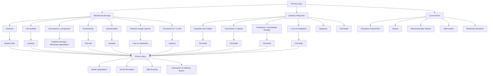

# Nanomedicine for treating spinal cord injury

Cite this: Nanoscale, 2013, 5, 8821

Jacqueline Y. Tyler,a Xiao-Ming Xu\*b and Ji-Xin Cheng\*ac

Received 24th February 2013

Accepted 9th July 2013

DOI: 10.1039/c3nr00957b

www.rsc.org/nanoscale

Spinal cord injury results in significant mortality and morbidity, lifestyle changes, and difficult rehabilitation. Treatment of spinal cord injury is challenging because the spinal cord is both complex to treat acutely and difficult to regenerate. Nanomaterials can be used to provide effective treatments; their unique properties can facilitate drug delivery to the injury site, enact as neuroprotective agents, or provide platforms to stimulate regrowth of damaged tissues. We review recent uses of nanomaterials including nanowires, micelles, nanoparticles, liposomes, and carbon-based nanomaterials for neuroprotection in the acute phase. We also review the design and neural regenerative application of electrospun scaffolds, conduits, and self-assembling peptide scaffolds.

## 1 Spinal cord injury: current outlook

Spinal cord injury (SCI) is a widespread problem affecting about 250 000 people living in the United States, with an estimated 13 400 new cases each year.1 SCI tragically oen affects the youngest and most active segment of our society, with 60% of injuries occurring in those under the age of 30. The most common cause, making up greater than 40% of SCI, is motor vehicle accidents. Other common causes include recreationrelated accidents, work-related accidents, falls, and acts of violence.2 The pathological progression of SCI is oen separated into two categories: primary injury and secondary injury.

Primary injury involves initial trauma and local tissue injury caused by bone fracture and stretching, exion, rotation, laceration, compression, or displacement of the spinal cord.3 Initial injury aer a contusive SCI mainly damages the grey matter of the spinal cord, resulting in hemorrhage and disruption of the blood ow.

The secondary injury denotes the spread of damage from the original site to adjacent tissue through a cascade of deleterious reactions to the trauma.4 The extent of secondary injury is proportional in magnitude to the primary injury. Secondary injury includes many different mechanisms, including three key pathophysiological events. First, damage to blood vessels is especially prevalent in small vessels and results in ischemia, thrombosis, and hypoxia; starving the tissue of nutrients. Second, reactive oxygen species are produced during ischemia and contribute to oxidative stress. Once the ability of cells to protect themselves from oxidative stress with antioxidants has been exceeded, the oxidation of proteins, nucleic acids, and lipids will occur and perpetuate the damage. Third, membrane disruption and depolarization of the cells from primary damage causes voltage dependent channels in the cells to open, resulting in a mass release of ions, edema, and intracellular Ca2+ $\mathrm { C a } ^ { 2 + }$ overload. Calcium overload contributes to damage by inhibiting cellular respiration and stimulating calcium dependent lipases and proteases, which subsequently degrade important protein structures in the central nervous system (CNS). This chain of events eventually results in recruitment of immune cells, apoptosis, disruption of synaptic connections, and also axonal degradation, contraction, and demyelination.3,5–7

The progression of primary injury and secondary injury is highlighted in Fig. 1 adopted from GhoshMitra et al.7 In the chronic phase, damaged tissue is cleared away by microglia and macrophages, leaving a uid-lled cavity and an astrocytepopulated glial scar. Molecules that inhibit axon growth are expressed, and the glial scar and cyst remain as barriers to reconnection.3,8,9

Victims who survive SCI can expect to live long lives, but they face extensive rehabilitation and long-term disability. Rehabilitation prospects depend on the severity of the damage. Individuals with injury at or below T-6, may be candidates for walking.10 These patients are re-taught how to balance and learn a modied “swing-to” gait. Braces or crutches may be used to walk and energy expenditures are much higher, 800%, for this gait as compared to a normal stride.10

Currently, the drug used clinically to acutely treat SCI is an extremely large dose (30 mg kg1 I.V. for the rst hour, 5.4 mg $\mathrm { k g } ^ { - 1 } \ \mathrm { h } ^ { - 1 }$ drip for 24 hours) of methylprednisolone (MP) administered within the rst 8 hours post-injury.11 MP is a glucocorticoid, and is thought to work through several mechanisms, including inhibition of lipid peroxidation and suppression of inammation by reducing cytokine release and expression.12 The efficacy of MP treatment is highly controversial.13,14 The dose prescribed in the case of SCI is the highest dose of any steroid in a 24–48 hour period11 and is associated with serious side effects.15,16 Moreover, MP is only effective if given in the rst 8 hours post-injury, aer which MP treatment may do more harm than good.17 Indeed, it is debated whether the small improvements are worth risking many serious side effects which may include myopathy, infections, and gastric bleeding.13

flowchart

Fig. 1 Pathophysiology of spinal cord injury, demonstrating pathological events during primary SCI, secondary SCI, and recovery phases. Mechanical trauma leads to disruption in blood flow, hemorrhage, ischemia, hypoxia, membrane damage, edema, glutamate release, and inflammation. These are often followed by glutamate mediated cytotoxicity, calcium mediated injury, lipid peroxidation, electrolyte imbalance and apoptosis. Dysfunction during recovery resulting from injuries occurs because of neuron loss and an environment that inhibits regeneration. Modified with permission from S. GhoshMitra, D. R. Diercks, N. C. Mills, D. L. Hynds and S. Ghosh, Adv. Drug Delivery Rev., 2012, 64, 110–125. Copyright 2012 Elsevier.

The inefficacy of MP treatment is partly associated with the special environment of the CNS and the spatio-temporal prole of SCI. The CNS has a limited capacity for regeneration due to inhibitory factors.18 Additionally, the blood–spinal cord barrier (BSCB) protects and regulates the parenchyma and provides a specialized microenvironment for the cellular constituents of the spinal cord. This functional equivalent of the blood–brain barrier provides special challenges of its own; endothelial cells that line the capillaries form tight junctions that keep most drugs from entering the parenchyma.19 In order for drugs like MP to reach therapeutic levels at the injury site, an extremely high systemic dose is required. These high doses are undesirable, as they can result in toxicity and systemic side effects.20 Systemic delivery also faces challenges from renal clearance of drug, limited drug circulation time, and drug degradation.21 To combat these shortcomings, local delivery methods like bolus injection into the intrathecal space and osmotic minipumps have been endeavored. Clearance of the cerebrospinal uid into the lymph and venous system, cellular barriers, and diffusional barriers limit these local delivery methods to some extent. These methods may also disrupt the tissue and prevent recovery of the BSCB aer injury.22,23 Osmotic minipumps face additional challenges with blockage and infection, and the pumps have not been widely accepted.24 An additional problem confronting SCI treatment stems from the limited treatment time window. Secondary injury progresses rapidly aer initial trauma and continues for days or months.25 Subsequent damage is difficult to overcome,8 as aer secondary injury has occurred the local environment is not conducive to regeneration. Inhibitory factors are produced that keep neurons from growing, and the lesion and glial scarring create a physical barrier that blocks reconnection. Subsequently, early intervention is very important.

Research for treating SCI can be broadly divided into two main areas: neuroprotection and regeneration. Neuro protection focuses on preventing the spread of secondary injury, reducing the subsequent damage. Because secondary injury involves many different injury mechanisms, many different neuroprotective drugs or therapies may be applied to mitigate the damage. Neuroprotective agents can prevent the spread of secondary injury through many different methods, which can include reducing edema, relieving inammation, reducing excitotoxicity, preventing apoptosis and necrosis, scavenging free radicals, repairing damaged membranes, or restoring the ionic balance.5,26,27 Some neuroprotective therapies that have been tested include delivery of antibodies against a cell adhesion molecule present on immune cells28; erythropoietin;29,30 minocycline,31,32 an antibiotic used for its ability to enter the CNS; and steroids like MP.12,33 The efficacy of these methods has been limited so far. Neuroprotective treatments must contend with the challenging spinal cord environment. Because of the BSCB, neuroprotective therapy faces difficulties delivering therapeutic agents effectively.

Regenerative therapy focuses on regaining neural circuitry and functionality in the damaged tissue. Regeneration must overcome both intrinsic (e.g., lack of intrinsic capacity to regenerate) and extrinsic (e.g., glial scarring and production of inhibitory factors) environmental challenges.34 Although natural regeneration is difficult, many different methods for regenerating the injured spinal cord have been investigated. Three main areas of research include neural implantation, electrical stimulation, and environmental modication.35 Although there has been some success in recovering spinal cord functions through these methods,36–41 problems still persist in directing axonal growth and re-knitting tissue to support functional conduction. To summarize, the challenging pathophysiology of SCI has prevented development of effective clinical treatment. The advent of nanomedicine may provide new tools for tackling this problem.

## 2 Nanomedicine: new hope for overcoming barriers to treatment

Nanomaterials have unique benets that can be applied to solve the multifaceted and challenges facing neuroprotective and regenerative therapies. Nanomaterials can be used as carriers which provide particular advantages for neuroprotection. First, nanocarriers have the potential to increase the bioavailability of neuroprotective drugs through targeted delivery and extended circulation times.42 Second, because of their size, nanocarriers have the potential to cross barriers like the BSCB and cell membrane walls.43 Furthermore, the large surface area to mass ratio of nanocarriers allows for compounds, such as targeting moieties or drugs, to be bound to the surface. Some kinds of nanocarriers may have other desirable benets on their own, such as the ability to self-assemble, scavenge reactive oxygen species, or act as imaging probes.44

Nanomaterials can also aid regeneration. The goal of neuralregeneration is to re-establish conduction in damaged spinal cords by promoting axonal re-growth. A growth permissive environment can be provided by blocking inhibitory factors, promoting neurotrophic factors, aligning axons, or circumventing glial scarring.45–49 Scaffolds composed of nanomaterials can mimic the natural cell environment and inuence cellular growth, differentiation, and proliferation.50 These nanomaterial scaffolds can be easily functionalized with molecules that support attachment or axonal growth, and thus provide a substrate that promotes and guides new tissue growth.

Although nanomedicine for treating spinal cord injury is a young eld, great progress has already been made in both neuroprotection and regeneration areas, as highlighted in the following sections.

## 3 Nanomaterials for neuroprotection

Nanomaterials can be used as a carrier for various pharmaceutical agents by providing targeting capability, greater delivery efficiency, or protection of drug from degradation. Nanomaterials can also be used as for neuroprotective treatment, performing functions such as scavenging free radicals, or patching the cell membranes. The main applications to date have been focused on membrane integrity, immune response, and oxidative stress. Specically, nanowires, nanoparticles (NPs), micelles, liposomes, and carbon-based nanostructures have all been investigated for their respective neuroprotective or drug delivery capabilities. Table 1 summarizes the neuroprotective treatments to date. Details are discussed in the following subsections.

## 3.1 $\mathbf { T i O } _ { 2 }$ nanowires

Nanowires have been applied in SCI treatment with limited success. In recent years nanowires have been explored for application in sensors, electronics, and optics due to their unique properties.51,52 Compared to other nanostructures, nanowires have not been as widely investigated for applications in drug delivery, although there have been several recent studies.53,54 Even though the mechanism is unknown, nanowires have been postulated to improve the bioavailability of neuroprotective compounds to which they are conjugated.55 Sharma et al. tested this hypothesis, and found that innocuous $\mathrm { T i O } _ { 2 }$ nanowires were able to improve the efficacy of neuroprotective Acure compounds to which they are attached.56,57 In an in vivo right dorsal horn incision rat model of SCI, the nanowired compounds were locally applied to the injury site at 5 minutes and 60 minutes post-injury. Functional recovery, BSCB permeability, edema, and pathology were tested at 5 hours post-injury. The nanowired compounds performed signicantly better than the un-wired compound and no-treatment controls, although the benets were greatly reduced with delayed application. While timeliness is important for treating SCI, it is important that the drug is effective within a clinically relevant time frame, as patients are unlikely to get instantaneous treatment for their injury. Furthermore, as secondary injury continues to progress for several days or weeks postinjury,25 the use of such a short evaluation time frame is questionable as the injury is incomplete at the time of evaluation. The authors clarify that the incision model was chosen for injury consistency and for monitoring the spread of secondary injury, although the model is not as clinically relevant as other injury models.58 While the improved efficacy of the wired compounds is demonstrated, the diminished capabilities with delayed application, the short evaluation time frame (5 hours), and the model of SCI need to be considered when evaluating this treatment for practical usage.

## 3.2 Micelles

Micelles have been used for many years to deliver drugs, and have found applications in drug delivery to the spinal cord.59,60 Micelles are formed from self-assembling amphiphilic molecules, consisting of a hydrophobic core and a hydrophilic shell. Hydrophobic drug can be encapsulated in the core, which protects it from degradation and improves the drug's circulation half-life.61 Due to their size and exibility, micelles are resistant to glomerular ltration, which extends their retention time in blood.42 Micelles are also easily adapted; their size, chemical composition, and surface modications can be altered to suit a specic application. This allows for micelles to hold various drugs and markers, such as imaging agents.

Table 1 Nanomedicine for Neuroprotection

<table><tr><td></td><td>Model</td><td>Methods</td><td>Mechanism</td></tr><tr><td colspan="4">Nanowires</td></tr><tr><td>TiO2Acure56,57</td><td>In vivo - rat</td><td rowspan="2">Permeability, edema, pathology, motor recovery - 5 hours</td><td rowspan="2">Improve compound delivery</td></tr><tr><td>Sharma et al.</td><td>Dorsal horn incision</td></tr><tr><td colspan="4">Micelles</td></tr><tr><td>PEO-PPO-PEO MP59</td><td>In vivo - rabbit, mice</td><td rowspan="2">Release characteristics, bioavailability, anti-apoptotic protein and mRNA levels - 24 hours</td><td rowspan="2">Improve MP delivery</td></tr><tr><td>Chen et al.</td><td>Crush</td></tr><tr><td rowspan="2">mPEG-PDLLA60</td><td>Ex vivo - rat spinal cord</td><td rowspan="2">Ex vivo: CAP, myelin imaging</td><td rowspan="2">Seal cell membranes</td></tr><tr><td>Crush</td></tr><tr><td rowspan="2">Shi et al.</td><td>In vivo - rat</td><td rowspan="2">In vivo: BBB, toxicity analysis, Ca2+ influx, lesion volume, immune reactivity - 4 weeks</td><td rowspan="2"></td></tr><tr><td>Crush</td></tr><tr><td colspan="4">Nanoparticles</td></tr><tr><td>MP-NPs71</td><td>In vivo - rat</td><td>Protein expression - 24 h</td><td>Improve MP delivery</td></tr><tr><td>Kim et al.</td><td>Dorsal hemisection</td><td>Cellular reactivity, lesion volume, functional recovery - 2 &amp; 4 weeks</td><td></td></tr><tr><td>PEO-PPO-PEO magnetic NPs72</td><td>In vivo - rat</td><td rowspan="2">Immunohistochemistry, neurite outgrowth, toxicity via body weight and mortality - 4 weeks</td><td rowspan="2">Improve delivery of GM-1</td></tr><tr><td>Chen et al.</td><td>Transection</td></tr><tr><td rowspan="3">PSiNPs75,76</td><td>Ex vivo - guinea pig spinal cord</td><td rowspan="2">Ex vivo: LDH, ROS, LPO assays, CAP, TMR fluorescence</td><td rowspan="2">Seal cell membranes</td></tr><tr><td>Transection</td></tr><tr><td>In vivo - guinea pig</td><td>In vivo: SSEP - 24 h, 1 &amp; 2 weeks</td><td></td></tr><tr><td>Cho et al.</td><td>Crush</td><td></td><td></td></tr><tr><td>MSN-hy-PEG84</td><td>In vitro - PC12</td><td rowspan="2">LDH, MTT, ATP, and glutathione assays</td><td rowspan="2">Seal membrane, scavenge acrolein</td></tr><tr><td>Cho et al.</td><td>Acrolein challenge</td></tr><tr><td>SOD-NR1-PBCA NPs91</td><td>In vitro - cerebellar neuronal cells</td><td rowspan="2">Fluorescent microscopy, live/dead assay</td><td rowspan="2">Protect from glutamergic toxicity, scavenge reactive oxygen species</td></tr><tr><td>Reukov et al.</td><td>Superoxide xanthine/xanthine oxidase challenge</td></tr><tr><td>Ceria NPs92</td><td>In vitro - adult rat spinal cord cell culture</td><td>Live/dead assay, patch clamping</td><td>Scavenge reactive oxygen species</td></tr><tr><td>Das et al.</td><td>H2O2 challenge</td><td></td><td></td></tr><tr><td colspan="4">Liposomes</td></tr><tr><td>PEG-TAT-MPLs94,95</td><td>In vivo - rat</td><td rowspan="2">MRI, staining, electron microscopy, flame atomic absorption spectroscopy - 72 h</td><td rowspan="2">Improve delivery and bioavailability</td></tr><tr><td>Liu et al, Wang et al.</td><td>Contusion</td></tr><tr><td colspan="4">Carbon-based nanomaterials</td></tr><tr><td>C60(OH)n104</td><td>In vitro - neuronal cells</td><td rowspan="2">LDH, GABA, and Taurine assays, Ca2+ influx, morphology</td><td rowspan="2">Block glutamate receptors, lowering intracellular Ca2+</td></tr><tr><td>Jin et al.</td><td>Glutamate and H2O2/Fe2+ challenges</td></tr><tr><td>C60-ebselen105</td><td>In vitro - cortical neuronal cells</td><td rowspan="2">LDH and MTT assays</td><td rowspan="2">Scavenge reactive oxygen species</td></tr><tr><td>Liu et al.</td><td>H2O2 challenge</td></tr><tr><td>SWNT-PEG109</td><td>In vivo - rat</td><td rowspan="2">BBB, behavioral analysis, immunohistochemistry, lesion volume neurite outgrowth - 5 weeks</td><td rowspan="2">Seal membrane Promote outgrowth</td></tr><tr><td>Roman et al.</td><td>Transection</td></tr></table>

Poly(ethylene glycol) (PEG) is commonly used as the hydrophilic moiety of micelles due to its solubility, ability to extend circulating time, efficacy as a steric protector, and ability to prevent opsonization and clearance by macrophages.62–64 The micelle surface can also be modied to permit crossing of the BSCB.65

There have been several reports of micelles for SCI treatment. Chen et al. improved the bioavailability of MP in the spinal cord using Poly(ethylene oxide)–poly(propylene oxide)– poly(ethylene oxide) (PEO–PPO–PEO, Pluronic) polymeric micelles as a delivery vehicle.59 Like PEG, Pluronic is a popular component of drug delivery systems and has been shown to cross the blood–brain barrier. Furthermore, it has been shown to be temperature-responsive and forms micelles at body temperature. Using in vivo rabbit and mice models, release characteristics and bioavailability of MP were tested, and mRNA and protein levels of Bcl-xl anti-apoptotic protein were monitored. The micelle increased the bioavailability of MP in the spinal cord to levels 2–3 times higher than that with standard systemic delivery, and the plasma half-life was increased 7 times. At 7 hours post-injury, the mRNA and protein levels of Bcl-xl were also signicantly increased over controls. Although in this particular study it is not clear whether this increase in bioavailability was due to improved crossing of the BSCB or merely improved circulation time, the micelles were able to signicantly improve bioavailability to the spinal cord.

Shi et al. explored polymeric micelles as a direct means of treating SCI.60 In extensive in vivo and ex vivo testing, monomethoxy PEG–poly(D,L-lactic acid) (mPEG–PDLLA) di-block copolymer micelles were evaluated. Fig. 2 highlights some results of this study. The mPEG–PDLLA micelle's neuroprotective effects stem from the amphiphilic polymer components acting to seal the damaged cell membranes. In this study, $\mathrm { C a } ^ { 2 + }$ inux, lesion volume, immune-reactivity, ex vivo compound action potential, functional recovery, toxicity, and myelin degradation were analyzed to give a complete overview of the treatment effects. Presence of the polymer micelles at the injury was conrmed with confocal microscopy using FITCconjugated micelles. Signicant improvements over both saline-treated and PEG-treated controls were found in all areas investigated. Notably, the compound action potential, which is a measurement of what proportion of axons are conducting action potentials, was signicantly restored. Aer 20 minutes, without treatment the compound action potential recovered only to about 18.5%, whereas with treatment it recovered to about 66.5%. Treatment with mPEG–PDLLA micelles was also able to improve functional recovery, measured by the Basso Beattie Bresnahan (BBB) locomotor scale. At 4 weeks post-injury treatment animals recovered to about 12.5, which was signi- cantly different than both the saline control group (7.1) and the 30% PEG group (7.0). This difference is noteworthy, considering that a BBB score of 12 signies axonal transduction through the lesion site.66 These results are striking, especially since no drug was delivered in this experiment and there was no apparent toxicity. Although recovery was not complete, this treatment could be expanded upon, for example, by encapsulation or conjugation of a drug, to possibly achieve even greater results. This study demonstrates a unique, simplistic, and effective use of micelles in treating SCI.

natural_image

Fluorescent microscopy image showing red and green cellular structures (no text or symbols)

natural_image

Microscopic image showing red and green fluorescent structures (no text or symbols)

natural_image

Fluorescence microscopy image showing red and green cellular structures with 10 μm scale bar (no text or symbols)

bar chart

| Group           | OG Signal (a.u.) |
| --------------- | ---------------- |
| Injured         | 130              |
| Control         | 15               |
| Injured, micelle| 25               |

Fig. 2 Neuroprotection from mPEG–PDLLA micelles. Calcium influx into axons. (a–c) TPEF images of OG 488 (green) and coherent anti-Stokes Raman scattering images of myelin (red) show intra-axonal free $\mathsf { C a } ^ { 2 + }$ levels in compression-injured (a), healthy (b), and compression-injured and micelle-treated (c) spinal cords. Images were acquired 1 h after compression injury. (d) Statistical analysis. Without micelle treatment, the TPEF intensity from OG inside the injured axons was 10 times greater than intact axons. The intensity was only twice that of intact axons when 0.67 mg $\mathsf { m L } ^ { - 1 }$ micelles were added immediately after compression injury. Reprinted with permission from Y. Shi, S. Kim, T. B. Huff, R. B. Borgens, K. Park, R. Shi and J. X. Cheng, Nat. Nanotechnol., 2009, 5, 80–87. Copyright 2009 Nature Publishing Group.

While micelles are useful carriers, they do have limitations. Micelles can be unstable in the blood and can dump their drug payload soon aer injection. Studies performed using F¨orster resonant energy transfer between hydrophobic uorescent probes entrapped in the core of polymeric micelles show that the hydrophobic probes in the core are quickly released from the micelles.67 F¨orster resonant energy transfer efficiency was signicantly reduced within 15 minutes of injection, indicating that the micelles were becoming dissociated and were losing their payload. This instability stems from interactions of the micelle with blood lipoproteins, a- and b-globulins.68 To combat this type of dissociation during circulation, stable cross-linked micelles have been developed for cancer treatment.69 Similar cross-linking strategies could be employed in the development of nanocarriers for treating spinal cord injury.

## 3.3 Nanoparticles (NPs)

The most extensively tested NPs for drug delivery to the spinal cord have been polymeric NPs and silica NPs, although other NPs are also being investigated. Like micelles, NPs can be coated or functionalized with targeting peptides to improve delivery efficacy.65 Polymeric NPs are typically solid and biodegradable, which allows drugs to be adsorbed, entrapped, encapsulated, or chemically linked to the particle through surface modication.70 In experiments performed by Kim et al., poly[lactic-co-glycolide] (PLGA) NPs were loaded with MP for local delivery in an in vivo dorsal over hemisection rat model of SCI.71 MP loaded NPs (MP-NPs) were compared to equivalent local dose of MP, clinical systemic dose of MP, and saline loaded NPs. The MP-NPs were topically applied to the injury site and embedded in an agarose gel. In these experiments, expression of secondary injury indicators (Calpain, iNOS, Bcl-2, and Bax3,5) was quantied at 24 hours post-injury. Functional recovery was measured by beam and grid walking tests at 1, 2, and 4 weeks post-injury. Lesion volume and cellular reactivity were also assessed. Animals treated with the MP-NPs demonstrated reduced immune response, reduced pro-apoptotic protein reactivity, and reduced lesion volume. MP-NP treated rats recovered earlier than control rats, but the early differences between groups dwindled with time, and at 4 weeks the gridwalking results were not signicantly different. Beam walking results showed signicant differences between all groups at all measured times, with MP-NP rats recovering more function. While, as noted by the authors, the dorsal over hemisection injury model is not representative of most SCI cases, these results showed relationships between functional recovery, protein expression, and pathophysiology. These studies also demonstrated some benet associated with MP-NP treatment. Ideally, studies of systemic toxicity would have been performed to give an indication of the reduction in toxicity that could be expected with NP treatment, as reducing toxicity compared to conventional MP treatment is a signicant goal. The use of agarose gel and local application in this treatment is worth noting, as hydrogels are extensively researched for treating SCI. This local agarose treatment may have additional advantages related to sustained and targeted release that are not associated with NP delivery. This agarose delivery system does not, however, avoid pitfalls related to local treatment.

A less typical application of polymeric NPs is demonstrated by Chen et al. in their extension of Pluronic, also used in micelles, in a temperature responsive, magnetic, controlleddosing drug delivery vehicle.72 Pluronic chains, which contain both hydrophobic poly(propylene oxide) and hydrophilic poly(ethylene oxide) segments, assemble on modied anionic superparamagnetic iron oxide NPs through strong ionic interactions. At low temperatures the copolymer chains are fully extended and the polymer shell is open and hydrated, allowing for loading of therapeutic agents. At higher temperatures the copolymer dehydrates and contracts, inhibiting the diffusion of molecules out of the shell. As the NPs are magnetic, they can be directed to their destination through application of an external magnetic eld. Monosialotetrahexosylganglioside (GM-1), which is reported to re-establish function of the damaged CNS,73,74 was loaded into the NPs. The loaded NPs were tested in a complete transection rat model of SCI. The NPs were applied and sealed with brin glue post-injury, and their efficacy was evaluated four weeks later using immunohistochemistry methods. No behavioral or functional recovery testing was performed, as the focus of this study was primarily on synthesis and characterization. Rats treated with GM-1 loaded NPs demonstrated signicant histological improvement of the spinal cord; many nerve bers regenerated in treated animals, while the no-treatment and unloaded NP control animals showed no evidence of regeneration. Although the delivery mechanism for this NP system was fascinating albeit complex, the topical means through which they were delivered in this study did not demonstrate the full targeting and non-invasive potential of the system. Magnetic directing of the NPs was not tested in vivo, nor were the pharmacokinetics characterized in vivo.

Silica NPs (SiNPs), which have been demonstrated to be nontoxic in vivo, also have been studied in depth for treatment of SCI. Cho et al. demonstrated the effectiveness of PEG decorated SiNPs (PSiNPs) in ex vivo and in vivo contusion guinea pig models of SCI.75,76 In this case the NPs do not carry drug, but function instead to increase the bioavailability of PEG, which has well documented neuroprotective effects77–79 and seals damaged cell membranes.80,81 Using NPs the effective concentration of PEG was lowered by 2 orders of magnitude as compared to treatment with PEG alone. This is signicant, as the use of PEG for treatment has been found to be effective, but delivery is limited by the viscosity and by the concentration of PEG monomers, which can be toxic at high doses.82,83 PSiNPs were compared to PEG alone, SiNPs alone, a no injury control, and a treatment control. In ex vivo transection assays, PSiNPs reduced lactate dehydrogenase loss to control levels, indicating restored membrane integrity; reduced reactive oxygen species to control levels; and reduced lipid peroxidase production. PEG was also shown to selectively target the damaged areas of the cord. In vivo somatosensory evoked potential measurement was used to demonstrate conduction through the injury site. In this test, 14 out of 15 animals treated with PSiNPs recovered somatosensory evoked potential, whereas no controls showed any somatosensory evoked potential recovery by 9 days postinjury. Furthermore, compound action potential measurements with marked amplitudes were recovered in all treated animals. The electrical recovery in this study is an impressive indication of recovery.

In another study by Cho et al., the efficacy of hydralazineloaded mesoporous silica NPs functionalized with PEG (MSN– hy–PEG) was investigated in an in vitro acrolein-challenged neuron cell model.84 Acrolein, a well-known aldehyde, is produced during secondary injury as a byproduct of lipid peroxidation and is toxic to spinal tissue.85 Hydralazine combats this toxicity by binding acrolein.86 PEG serves several purposes in this design; it reduces free-radical-mediated injury, seals membranes, and targets damaged regions of the CNS. PEG can also be used to control release of hydralazine from the NPs, since the large PEG molecules slow the drug's escape. The authors demonstrate that MSN–hy–PEG NPs restore cell membrane function and rescue cells challenged with acrolein. Lactate dehydrogenase, MTT, ATP, and glutathione assays were used to evaluate membrane integrity, mitochondrian function, metabolic state, and oxidative stress, respectively. MSN–hy–PEG alleviated acrolein toxicity in all assays, and lactate dehydrogenase release was actually lower in the NP treated group than the unchallenged control. This delivery and treatment system shows promise in vitro, but animal testing will be necessary for validation.

Several other lesser-known NPs are under early stage investigation for treating SCI because of their desirable properties, which include free radical scavenging or capability of crossing the BSCB. Past studies have shown that poly(butyl cyanoacrylate) NPs (PBCA-NPs) coated with the surfactant polysorbate-80 are able to penetrate the blood–brain barrier.87–89 Upon injection these particles are coated with adsorbed plasma proteins, notably apolipoprotein E, and it is believed that they are mistaken for low-density lipoprotein particles and internalized by the low density lipoprotein uptake system, allowing them to cross the blood–brain barrier.90 In a study by Reukov et al., PBCA-NPs were conjugated with superoxide dismutase and antiglutamate N-methyl D-aspartate receptor 1 (NR1) antibody in order to achieve a dual neuroprotective effect;91 glutamergic toxicity is combated with NR1 antibody, and oxidative injury is addressed with superoxide dismutase. Protein modied PBCA-NPs were cultured with neurons and cellular uptake was tracked through confocal microscopy. Neuroprotective efficacy was monitored via superoxide challenge and live/dead assay. PBCA-NPs were taken up by neurons, and no dead neurons were found in treated cultures, with or without superoxide challenge. No live cells were found in the untreated, challenged cells. This study is preliminary, and more work, particularly animal studies, will need to be done to assess the full potential of this treatment.

Another interesting NP under evaluation for its neuroprotective properties is auto-catalytic nano-ceria particles.92 These ceria NPs have the ability to harvest reactive oxygen species and undergo catalytic oxidative recovery, refreshing themselves. Neuroprotection and general biocompatibility were gauged in an in vitro adult rat nerve model. Ceria NPs were incubated with neural cells harvested from enzymatically digested adult rat spinal cords and were assessed in a hydrogen peroxide injury model by culture assays, UV-vis spectroscopy, and patch clamping. Compared with controls, cells treated with ceria NPs had signicantly more live cells, fewer dead cells, and more neurons aer the challenge. They were also able to demonstrate voltage dependent inward and outward currents, and to generate single action potentials. UV shi results demonstrate that the NPs have the capacity for catalytic oxidative recovery, which indicates that they have a pseudo-innite half-life for antioxidant activity. To assess treatment possibilities, more studies need to be performed on these particles. These studies may include bioavailability, targeting, toxicity, and in vivo functional recovery tests.

## 3.4 Liposomes

Liposomes have long been a popular subset of nanoscale drug carriers. Liposomes are easy to prepare, biocompatible, nontoxic, and hydrophilic drug can be easily loaded into the aqueous inner core.93 Multifunctional transactivating-transduction protein and PEG modied magnetic polymeric liposomes (TAT–PEG–MPLs) were tested for their bioavailability and delivery capabilities in an in vivo rat SCI model.94,95 These liposomes possess several interesting characteristics. As the liposomes have an iron core, they can be used as a contrast agent for MRI. Additionally, conjugation with transactivatingtransduction protein, which is derived from HIV and can penetrate cell membranes, facilitates transfer across the BSCB.19,96 PEG is effective in both targeting damaged areas in the cord and sealing damaged membranes.77 In this study, no drug was loaded into the TAT–PEG–MPLs. Subsequently, functional recovery and neuroprotection were not evaluated and the focus was on the efficacy of delivery. Rats suffering impact injury to the spinal cord were dosed with TAT–PEG–MPLs, which were injected into the caudal vein. Animals were sacri-ced 72 hours later. Accumulation of iron at the lesion site was evaluated via staining, MRI, electron microscopy, and ame atomic absorption spectrophotometry. A low signal was observed from T -weighted MRI images. Flame absorption spectrophotometry demonstrated that signicantly more iron accumulated around the lesion site, indicating successful delivery of the liposome payload. The data suggests that this delivery system is effective in crossing the BSCB and delivering a payload preferentially to the damaged spinal cord. As delivery is effective, it would be interesting to see results of animal testing that evaluates recovery. Although this delivery system seems to be effective, liposomes do have some limitations. Liposomes can be quickly removed from the system by the reticuloendothelial system. A second limitation is that liposomes, like micelles, have also been known to destabilize and drop their payload in the blood due to interactions with plasma proteins.97 Careful design of the liposome with attention to the size, lipid content, or surface of the liposome can help somewhat to mitigate these problems.98

## 3.5 Carbon-based nanomaterials

In addition to the previously discussed carriers, carbon-based nanomaterials have been explored for applications in neuroprotection. Both carbon nanotubes and fullerenes have been explored for SCI treatment. Fullerenes are three-dimensional molecules completely composed of carbon and offer several benets for neuroprotection; fullerenes can scavenge more than one free-radical per molecule, they have active sites for easy functionalization, and they also have structural and chemical exibility.99,100 Although insolubility in water has been limiting in the past, several different fullerene derivatives have been developed that are soluble.101,102 Carboxyfullerenes, $\Gamma _ { 6 0 } ,$ have demonstrated potent free-radical scavenging properties and neuroprotective effects against two forms of apoptosis through reduction of hydroxy radical and superoxide radical concentrations.103 Several studies with implications in SCI have been performed to better characterize the neuroprotective potentia of fullerenes. In one study, $\mathrm { C } _ { 6 0 }$ derivative fullerenols were shown to be effective neuro-protectors by blocking glutamate pathways and reducing intracellular $\mathbf { C a } ^ { 2 + } .$ .104 Another study demonstrated that covalently bonded $\mathrm { C } _ { 6 0 } \mathrm { - }$ –ebselen derivatives were more effective than $\mathbf { C } _ { 6 0 }$ alone, ebselen alone, and a combination of the two agents in preventing cell injury in an $\mathbf { H } _ { 2 } \mathbf { O } _ { 2 }$ challenge model of cell injury.105 While fullerenes have interesting neuroprotective effects, to our knowledge they have not yet been applied to an in vivo model of SCI.

Carbon nanotubes are another carbon-based nanomaterial that has been applied to SCI treatment. Carbon nanotubes are electrically conductive, and also have a similar size scale to neuronal processes. They are also exible, strong, durable, and easy to modify. Testing has also shown that carbon nanotubes can promote outgrowth of neurites in cell culture.106–108 Roman et al. tested single-walled carbon nanotubes functionalized with PEG (SWNT–PEG) in vivo in a rat transection model of SCI.109 Animals were either treated with 25 L of a saline control or SWNT–PEG $( 1 ~ \mu \mu \mu \mathrm { g } \mathrm { m L } ^ { - 1 } , 1 0 ~ \mu \mathrm { g } \mathrm { m L } ^ { - 1 } , 0 \mathrm { r } ~ 1 0 0 ~ \mu \mathrm { g } \mathrm { m L } ^ { - 1 } )$ , injected into the lesion epicenter one week aer the spinal cord transection. Functional recovery of the animals was assessed by behavioral analysis, and immunohistochemistry was used to detect lesion volume, glial scarring, and axonal morphology. The authors found that the SWNT–PEG treatment modestly improved locomotor recovery; animals receiving 100 mg mL1 SWNT–PEG had statistically signicant recovery compared to the control group by 35 days post-injury, scoring approximately 3 as compared to approximately 0.5. This means that treated animals had spontaneous extensive movement of two joints, and control animals had either no observable joint movement or only slight movement of one or two joints.66 Animals receiving SWNT–PEG treatment were observed to have decreased lesion volume and increased neuro-lament-positive bers and corticospinal tract bers in the lesion. Higher doses of SWNT–PEG contributed to more signicant results. Although the carbon nanotubes are not biodegradable, it did not appear that they increased reactive gliosis or caused toxicity. The authors did not look deeply into the mechanisms behind the repair, but pondered that the observed recovery could be the result of either carbon nanotubes promoting outgrowth by direct contact with neurons, or, citing Shi et al. and their study of PSiNPs, protective effects from bound PEG interacting with damaged cell membranes. It is important to note that the complete transection model induces a sizable lesion and therefore contributions from spared tissue towards recovery are extremely limited. For this reason, recovery in all groups was much lower. Additionally, treatment was given very late following injury, spanning the injury phase between secondary injury and chronic injury. This may contribute to the modest nature of the results. Because the treatment was given one week post-injury and since the mechanisms of repair may be due to either protective or regenerative effects, some may choose to characterize this treatment as regenerative rather than neuroprotective. Due to the formulation, delivery, and application of PEG in the treatment, we have chosen to include it in the neuroprotective section.

To summarize, effects of secondary injury can be mitigated through neuroprotective treatment, and nanomedicine shows a great potential for targeting and treating various causes of damage. The human spinal cord provides a unique and challenging environment for drug delivery, but with clever design these obstacles and barriers can be maneuvered. Well-designed carriers can be used to prolong circulation or cross the BSCB to improve bioavailability of drug to the spinal cord. It is important to understand the limitations of NPs and carriers. As discussed earlier, micelles and liposomes can be unstable in the blood and drop their payload soon aer injection.67,68,97 This limitation is necessitating the development of alternative carrier designs. Nanocarriers and nanoparticles must also contend with clearance or cellular uptake related to size, shape, surface charge, and exibility.110–112 Careful attention pertaining to these factors during design and surface modication can help to mitigate these issues.

Because an understanding of toxicity, delivery, targeting, specicity, and efficacy is crucial for any drug, a great need still exists for in vivo testing to investigate the neuroprotective capacity of newer treatments. A major challenge in this area is comparing treatment results. Comparison of treatments across laboratories is difficult; many different injury models, treatment schedules, dosing schemes, and analysis methods are used to study SCI. Because of these differences, it is very challenging to ascertain which treatment may provide the best results. For example, prognosis following a contusion injury and a transection injury are very different, and subsequently, recovery looks different for these models. Treatment given at different post-injury time points will have different effects; it may be more effective when given at a certain time post-injury (e.g., within 8 hours). At this early investigative stage, most studies apply the drug at only one time point post-injury, in one dosing scheme, and in one animal injury model; a limitation which perhaps confounds effects. Since it is not possible to test all viable methods, results must be analyzed critically.

Great progress has been made in identifying and developing nanomedicine with the capacity to mitigate harm caused by SCI, but there is still a great need to repair the remaining damage that could not be avoided and rebuild the disrupted neural networks. Chronic injury is another issue that can only be addressed through regrowth of neural networks. For those suffering from paralysis related to SCI it is already too late to allay damage. To re-knit spinal tissue and awaken new growth we must rely on regeneration techniques.

## 4 Nanomaterials for neural regeneration

Regeneration of the CNS is much more difficult than that of the peripheral nervous system (PNS), which is capable of spontaneous regeneration. In the PNS, damaged axons can overcome large gaps to reconnect and promote recovery with help from guidance tubes and nerve gras.113,114 In PNS injury, axons at the distal end degenerate and axons at the proximal end elongate, develop growth cones and can reconnect, forming synapses to nerves or muscles. Schwann cells assist in the process by remyelinating axons and by producing growth factors and an extracellular matrix (ECM) that guide axon growth.115 Regeneration of the CNS is more difficult for several reasons. In the CNS, oligodendrocytes that myelinate the axons make up a much smaller proportion of the cells than Schwann cells do in the PNS. When oligodendrocytes are damaged or die, a greater number of axons are affected by the loss, reducing support for regeneration. Degraded myelin poses another complication; it contains growth inhibitors that are cleared slowly in the CNS.116 Furthermore, cyst and glial scar formation are signicant physical and chemical barriers to regeneration.117 Although these hurdles to regeneration are disheartening, only a small number of tracts need to be preserved or regenerated in order to maintain function.118

A signicant goal in neural regeneration is to provide an environment that is permissive to axon growth. This can be done by promoting neurotrophic factors, blocking inhibitory factors, and through pharmacological intervention or cell introduction.48 To bridge a physiological gap in tissue caused by lesion formation or to prevent a lesion from forming, a scaffold can be incorporated into the damaged portion of the spinal cord. This can be done either through surgical implantation, or in the case of self-assembling scaffold and hydrogels, through injection.

Scaffolds provide structural support for the damaged spinal cord and also a physical surface for regeneration, guiding and supporting cell growth from migration or transplantation. Several different nanomaterial approaches to scaffolding have been explored: nanober scaffolds, self-assembled peptide systems, and nanober conduits. Regenerative methods can be combined with drug or cell therapy for a combinatorial approach. A summary of the regenerative approaches discussed in this manuscript can be found in Table 2. For all regeneration tech niques, environmental cues are very important to ensure that cells differentiate and develop in physiologically relevant ways. For this reason, it is desirable that the mechanical and chemical properties of the regenerative scaffold closely match those of the native tissue.119,120 Nanomaterial scaffolds can be modied to resemble the ECM or promote regeneration through various surface attachments of peptides.121 Through surface attachment, scaffolds can promote neurite outgrowth, mediate cell adhesion, or promote cell spreading.122,123 Environmental cues have been widely explored in preliminary testing and applications of electrospun nanober scaffolds.

Table 2 Nanomedicine for neuro-regeneration

<table><tr><td></td><td>Model</td><td>Methods</td><td>Mechanism</td></tr><tr><td colspan="4">Electrospun scaffolds</td></tr><tr><td>Polyamide w/Tenascin C peptide $^{124}$ </td><td>In vitro – neural</td><td>Neurite outgrowth quantification</td><td>Promote outgrowth</td></tr><tr><td>Ahmed et al.</td><td></td><td></td><td></td></tr><tr><td>PLLA w/laminin $^{121}$ </td><td>In vitro – PC-12</td><td>Neurite outgrowth quantification</td><td>Promote attachment</td></tr><tr><td>Koh et al.</td><td></td><td></td><td></td></tr><tr><td>PCL isotropic &amp; anisotropic $^{125}$ </td><td>In vitro – ESCs</td><td>Neurite outgrowth quantification, differentiation</td><td>Directional cues</td></tr><tr><td>Xie et al.</td><td></td><td></td><td></td></tr><tr><td>PCL isotropic and anisotropic &amp; orthogonal layers $^{126}$ </td><td>In vitro – DRGs</td><td>Neurite outgrowth quantification</td><td>Directional cues</td></tr><tr><td>Xie et al.</td><td></td><td></td><td></td></tr><tr><td>Polyamide – Tenascin C fabric $^{127}$ </td><td>In vivo – rat</td><td>Neurite outgrowth quantification – 3 &amp; 5 weeks</td><td>Promote outgrowth</td></tr><tr><td>Mieners et al.</td><td>● Hemisection</td><td></td><td></td></tr><tr><td colspan="4">Conduits</td></tr><tr><td rowspan="2">Collagen nanofibrous conduits $^{130}$ </td><td>In vitro – DRGs</td><td>In vitro: immunostaining</td><td>Directional cues</td></tr><tr><td>In vivo – rat</td><td></td><td></td></tr><tr><td>Liu et al.</td><td>● Hemisection</td><td>In vivo: immunostaining, neurite outgrowth and axon formation quantification, cell infiltration – 10 &amp; 30 days</td><td></td></tr><tr><td colspan="4">Self-assembling structures</td></tr><tr><td>RADA16-1 SAPNSs w/SCs or NPCs $^{133}$ </td><td>In vivo – rat</td><td>Staining, axon quantification, lesion volume – 6 weeks</td><td>Mimic ECM</td></tr><tr><td>Guo et al.</td><td>● Transection</td><td></td><td>Neural implantation</td></tr><tr><td>RADA16-1-4G-BMHP1</td><td>In vivo – rat</td><td>Gene expression – 3 &amp; 7 days</td><td>Mimic ECM</td></tr><tr><td>SAPNSs $^{137,138}$ </td><td>● Contusion</td><td></td><td></td></tr><tr><td>Cigognini et al.</td><td></td><td>Lesion volume, staining, histology, BBB scoring – 8 weeks</td><td>Promote tissue growth</td></tr><tr><td rowspan="2">IKVAV PAs $^{132}$ </td><td rowspan="2">In vivo – mouse</td><td rowspan="2">Axonal outgrowth quantification – 24 h &amp; 9 weeks</td><td>Mimic ECM</td></tr><tr><td>Promote outgrowth</td></tr><tr><td>Tysselin-Mattiace et al.</td><td>● Compression</td><td>Modified BBB – 9 weeks</td><td>Suppress astrocytes</td></tr><tr><td colspan="4">Combination self-assembling scaffolding and conduits</td></tr><tr><td>PLGA/PCL microchannel conduits w/RADA16-1-BMHP $^{143}$ </td><td>In vivo – rat</td><td>Evoked potentials, BBB scoring, Immune response, staining – 24 weeks</td><td>Mimic ECM</td></tr><tr><td rowspan="2">Gelain et al.</td><td rowspan="2">● Contusion (chronic)</td><td></td><td>Directional cues</td></tr><tr><td></td><td>Promote tissue growth</td></tr><tr><td colspan="4">Conducting scaffolds</td></tr><tr><td>PLGA-PPy scaffold</td><td>In vitro w/electrical stimulation</td><td>Neurite outgrowth quantification</td><td>Directional cues</td></tr><tr><td>Aligned/random $^{151}$ </td><td></td><td></td><td>Electrical cues</td></tr><tr><td>Lee et al.</td><td></td><td></td><td></td></tr><tr><td>Conductive-core sheath PCL-PLA-PPy $^{152}$ </td><td>In vitro w/electrical stimulation</td><td>Neurite outgrowth quantification</td><td>Directional cues</td></tr><tr><td>Xie et al.</td><td></td><td></td><td>Electrical cues</td></tr></table>

## 4.1 Electrospun nanober scaffolds

In one experimental example of surface functionalization, Ahmed et al. attached neurite outgrowth promoting Tenascin C-derived peptides to electrospun polyamide nanober scaffolds. They demonstrated that neural cells cultured on the functionalized scaffold had signicantly more neurites, more neuronal attachments, and greater neurite extension.124 Similarly, it was determined by Koh et al. that incorporation of the ECM protein laminin improved the neurite growth and extension of PC-12 cells on a poly( -lactic acid) nanober scaffold.121

Orientation of nanobers within a scaffold can also signi- cantly affect the regeneration process. Xie et al. studied the differentiation of embryonic stem cells seeded on both isotropic and anisotropic biodegradable poly(3-caprolactone) (PCL) nanober scaffolds prepared via electrospinning. They discovered that scaffolds with aligned bers not only discouraged the differentiation of embryonic stem cells into astrocytes, which are prevalent in glial scarring; but also promoted outgrowth of neurites parallel to the direction of ber alignment.125 Looking into this phenomenon further, they found that dorsal root ganglia cells grown on the border between random and aligned bers grew simultaneously radially and directionally, depending on the underlying ber orientation.126 In the same study, dorsal root ganglia cells were grown on double layer scaffolds in which bers were aligned in different directions. This resulted in a biaxial growth pattern, which suggests that different layers of the scaffold can inuence neurite outgrowth. Meiners et al. reached a supporting conclusion regarding neurite outgrowth during an in vivo experiment in which polyamide nanober fabric was implanted into a rat hemi-section model. Although axonal growth was supported, the random orientation of the bers in the fabric impeded the forward movement of the neurites and subsequently, regeneration was not very successful.127

## 4.2 Conduits

Another option for directing neuronal growth is the use of conduits. Conduits are tubes that facilitate communication between the proximal and distal ends of the nerve gap and provide physical guidance for regrowth. Conduits have been successful in peripheral nerve regeneration, as demonstrated by feats like the regeneration of sciatic nerve over an 80 mm gap in a beagle model using a polyglycolic acid–collagen tube lled with laminin coated collagen bers.128 Nanobrous conduits can be formed via electrospinning and have been used for peripheral nerve regeneration. In one recent study, PCL nano-brous conduits were able to close a 15 mm gap in a rat sciatic nerve model and were also able to generate signicantly more myelinated axons with thicker myelin sheaths than microber conduits and lm conduits.129 Clearly, nanobers have signi- cant benets in neural regeneration. However, despite the success of collagen and nanobrous conduits in peripheral nerve regeneration, nanoscale conduits have been less successful in repairing SCI. In one study by Liu et al., tubular conduits were formed from either random or aligned electrospun collagen nanobers and implanted in a short-term rat hemisection model of SCI.130 Regardless of ber orientation, neurolament sprouting was observed at 10 days post-implantation, although the orientation of these regenerated axons was not obvious. There were a limited number of neural bers observed in the center of the conduit, even at 30 days postimplantation. Further improvements on these nanobrous conduit systems can be made through surface functionaliza tion, and perhaps future designs will be more successful. Although these electrospun scaffolds and conduits have the orientation benets of aligned bers and directional guidance, a limitation of these systems is that they must be invasively implanted into the subject. This can cause further damage to the spinal cord by disrupting spared tissue, and lead to infection or other surgical complications.131 To overcome these limitations associated with implantation there has been increasing interest in injectables, such as self-assembling scaffolds and hydrogels, which solidify under in vivo conditions.

## 4.3 Self-assembling systems

Self-assembling peptide systems are synthetic amino acid based systems that transition from a solution to a gel within seconds under in vivo pH and ion concentration conditions. The resulting material is a nanobrous mesh similar to the native ECM that biodegrades naturally several weeks aer implantation.132 The gels are generally biocompatible and non-cytotoxic, although in some cases pH must be buffered prior to implantation. The gels can also safely encapsulate cells or drugs for combination therapies.133 Self-assembling peptide systems are generally divided into several categories; self-assembling peptide amphiphiles (PAs), self-assembling peptide nanober scaffolds (SAPNSs), Amphiphilic diblock copolypeptide hydrogels (DCHs), and mixing induced two component protein gels (MITCHs).134 DCHs are synthetic polymers, which, through hydrophobic association in water, form into gel structures with porous bril-like nano structures. DCHs have been successfully injected without signicant immune response or toxicity into the mouse forebrain, and were able to integrate with tissue, support the ingrowth of blood vessels, glia, and some nerve bers.135 MITCHS are synthetic protein gels and can be formed to gel upon the mixing of its two protein components. MITCHs have been shown to support neural stem cells, which were able differentiate, replicate, and sprout neurites.136 Neither DCHs nor MITCHs have been successfully applied yet in an in vivo SCI model.

SAPNSs have been used in several in vivo models with promising results. SAPNSs are synthetic biomaterials formed of ionic self-complementary peptides that form into a nano-lamentous, hydrated scaffold under in vivo pH. Guo et al. used RADA16-1 SAPNS loaded with either Schwann cells or neural progenitor cells in an in vivo rat transection model of SCI.133 Because of the low pH when untreated, the SAPNSs were neutralized before transplantation; otherwise the treatment damaged the host tissue. When evaluated aer 6 weeks the neutralized SAPNSs had integrated well with the host tissue and had greatly decreased inammation at the lesion site. SAPNSs seeded with cells, especially Schwann cells, showed many axons inltrating the implant. Furthermore, host cells had migrated into the implant and there was robust growth of blood vessels, indicating the potential for repairing damaged tissue and providing the necessary supporting vasculature.

A similar study was performed by Cigognini et al. using RADA16-1 SAPNSs modied with bone marrow homing motif (BMHP1), which has previously demonstrated the ability to promote nerve tissue regrowth, and a linker (4G).137,138 In an in vivo rat contusion model, RADA16-1-4G-BMHP1 was injected immediately following injury. Assessment of gene expression at 7 days demonstrated that in treated animals there was a general upregulation of GAP-43, which correlates with axonal regeneration;139 trophic factors, which suggests synaptic formation;140 and

ECM remodeling proteins, indicating restructuring of the ECM and subsequent axonal growth.141 Together, these results suggest tissue regeneration. BBB scoring was performed for 8 weeks to track locomotor recovery, and it was found that there was a very small but statistically signicant improvement in motor performance and coordination. Additionally, the SAPNS was compatible with surrounding nervous tissue and was able to ll the cavity. Within the lesion there was increased cellular inltration, basement membrane deposition, and axon regeneration and sprouting. This study conrms the potential uses of SAPNSs as a less invasive means of treating SCI.

Self-assembling PAs have also been successfully tested in vitro and in vivo. PA molecules assemble into supramolecular nano-bers, which at in vivo ion concentration form a continuous, random, mesh-like network. In one study by Tysselin-Mattiace et al., PAs were designed to display the laminin epitope IKVAV upon assembly.132 The IKVAV epitope is known to promote outgrowth of neurites and suppress formation of astrocytes, two properties that are desirable for preventing glial scarring.142 In this study, IKVAV PAs were injected into a compression injured mouse model of SCI 24 hours post-injury. Several different benecial effects were observed with this treatment. IKVAV PAs successfully reduced astrogliosis and cell death. At 11 weeks postinjury it was observed that almost 80% of all labeled motor axons in the IKVAV PA group entered the lesion compared with 50% in the control group. Furthermore, while no bers in the control group made it even a quarter of the way across the lesion, 50% of the bers in the treated group penetrated half way through, and 35% traversed the entire lesion. Similar results were found with the sensory axons at 11 weeks, as 60% of axons entered the injury site in the IKVAV PA group, and only 20% did in the control group. Of these axons, none in the control group penetrated halfway, while 25% of the bers in the treated group made it half the way across the lesion and 10% crossed the whole gap. Although these axons took indirect routes through the lesion, indicating a lack of directional cues, crossing the injury site is a very noteworthy accomplishment. A small but statistically signicant behavioral improvement was also observed using a modied BBB scoring system. The IKVAV PAs demonstrated a good starting point for noninvasively repairing SCI within a clinically relevant treatment window.

## 4.4 Combination of self-assembling and scaffolding systems

In order to glean the benets of both self-assembling systems and directional cues provided by scaffolding, combination approaches have been developed. Gelain et al. developed composite guidance channels constructed from electrospun PLGA/PCL nanobers lled with RADA16-1-BMHP1 self-assembling peptides in order to tackle the substantial challenge of chronic SCI.143 This “neuroprosthesis” was implanted at the injury site 1 month aer contusion injury in a rat model, and was evaluated 6 months later. At the time of evaluation, while cysts persisted in control and sham animals, there was neo-formed tissue in the animals receiving the microconduit implants. This neo-tissue lacked inammation and contained regenerating axons and myelin, welldeveloped vascular structures, cell-deposited ECM, and stromal cells. An example of these results can be seen in Fig. 3.143 Furthermore, there was a signicant improvement in the motor function of the animals as evaluated by BBB scoring, and also in evoked responses in the ascending tracts. This strong evidence demonstrates that it is possible to reconstruct the anatomical and histological framework and restore signicant motor and electrical function in a chronically injured spinal cord. Despite the successes observed, this method does not solve the problem of invasive surgery and many complications were observed; 25–33% of animals died due to postsurgical complications. However, it still is an incredible step in treating chronic injury, which so many patients currently suffer from.

## 4.5 Combination of nanober scaffolding and electrica stimulation

Another interesting combination method under investigation for regenerating the spinal cord is the combination of nanober scaffolding and electrical stimulation. Electrical stimulation has long been investigated and used in treatment of SCI.36,37,144,145 It is known that in the absence of topographical cues neurons align and extend in the presence of electrical stimulation.146,147 Electrically conductive synthetic polymers, such as polypyrrol (PPy) or polyaniline, have been combined with biodegradable polymers and investigated as scaffolding materials for repairing conducting tissue. These polymers have even been used for in vivo testing as an interior coating on conduits for nerve repair.148–150 In one study, a nanobrous mesh-like electrospun PLGA scaffold coated with a nanothick layer of PPy was tested for potential application as neural scaffold material.151 Neurons were cultured on both aligned and random scaffolds, and electrical stimulation was applied to the cells. It was found that in the presence of stimulation 40–90% more neurites were generated and neurites were 40–50% longer. Furthermore, there were more and longer neurites on the aligned scaffolds than on the random scaffolds, suggesting combined benets. Conductive-core sheath PCL–PPy and poly(L-lactide)–PPy (PLA–PPy) nanobers have found similar success. In a study by Xie et al., it was found that dorsal root ganglion cells incubated with uniaxially aligned core-sheath PLA–PPy and PCL–PPy nanober scaffolds had a 1.82-fold increase in neurite extension compared with randomly aligned scaffolds.152 With electrical stimulation there was an increase in neurite length of 1.83-fold and 1.47-fold for aligned and random scaffolds respectively, again demonstrating the synergistic effects of electrical stimulation and ber alignment. Carbon nanostructures also have the ability to conduct electricity. As detailed earlier, carbon nanotubes have been tested previously for a neuroprotective and regenerative SCI treatment109 and also have been investigated for regenerative nerve repair.107,153–155 Carbon nanotubes have also been applied in multifunctional neural interfaces that provide electrical and topographical cues.156 Given their unique properties, carbon nanotubes provide a wealth of options, including functionalization, incorporation into scaffolding, and electrical stimulation; all of which are interesting and promising directions for regenerative treatment.

natural_image

Microscopic image showing cellular structures with two highlighted regions and a 150μm scale bar (no text or symbols beyond labels)

natural_image

Fluorescence microscopy image showing red-stained cellular structures with a 150μm scale bar (no text or symbols beyond label)

natural_image

Microscopic image showing red fluorescent structures against a dark background, with scale bar indicating 100μm (no text or symbols present)

bar chart

| Protein    | Group 1 | Group 2 |
| ---------- | ------- | ------- |
| NF200      | 50      | -       |
| β-Tubulin  | 90      | 35      |
| GAP-43     | 100     | 75      |

natural_image

Fluorescence microscopy image showing red and green labeled cellular structures against a dark background, scale bar 50μm (no text or symbols)

natural_image

Fluorescent microscopy image showing cellular structures with red and green staining, scale bar 50μm (no text or symbols)

natural_image

Fluorescent microscopy image showing cellular structures with red and green staining (no text or symbols)

natural_image

Fluorescence microscopy image showing green-labeled cellular structures against a dark background, with 50μm scale bar (no text or symbols)

natural_image

Fluorescence microscopy image showing cellular structures with red and blue staining (scale bar: 50μm)

natural_image

Microscopic tissue image showing cellular structures with labeled regions (ROSTRAL, CAUDAL) and a 200μm scale bar (no text or symbols beyond labels)

Fig. 3 Nerve regeneration in chronically injured rat spinal cord using PLGA/PCL microchannel conduits with RADA16-1-BMHP. Dashed lines outline implanted channel walls in (A)–(C). In transverse sections (A), GAP-43 positive fibers were found inside and between transplanted tubes (arrows; coronal section). (B) NF200 positive fivers were seen crossing the top rostral interface of the lesion. (C) bIII-tubulin positive fasciculi stretched through the lumen of the conduits in a longitudinal spinal cord section. (D) Quantitative analysis (mean SEM) of the percentage of channels showing positivity for neural markers throughout the entire tube length (N 5 for group 1, N 8 for group 8). Statistical significance $\left( { ^ \ast } \right) p = 0 . 0 3 ; \left( { ^ \ast \ast } \right) p = 0 . 0 0 3$ . NF200 (green) and GAP43 (red) did not colocalize inside the same fiver (E). Myelinated (green, arrow) and unmyelinated (red, arrowhead) III-tubulin positive fibers (F) were observed (enlargement in G). Both SMI-32 (H) and SMI-31 (I) positive fibers were detected within guidance conduits, in adjacent coronal sections. In the longitudinal reconstruction of transplanted cord in (J) (group 2), NF200 positive fibers cover the whole length (approx. 2 mm) of the lesion, crossing both the rostral and the caudal channels–tissue interfaces (dotted line). Reprinted with permission from F. Gelain, S. Panseri, S. Antonini, C. Cunha, M. Donega, J. Lowery, F. Taraballi, G. Cerri, M. Montagna and F. Baldissera, ACS Nano, 2011. Copyright 2010 American Chemical Society.

Although testing has been limited to in vitro testing so far, electrically stimulated nanoscaffolding is an intriguing option for spinal cord repair and regeneration, although in vivo integration of stimulation in a safe and effective manner may prove to be a substantial challenge.

## 5 Discussion

Although SCI will never disappear entirely, perhaps future victims of SCI will not share quite the same fate as those who suffer today. Treatment of both acute and chronic SCI injury remains a multi-faceted medical challenge, but with continued investigations of nanomedicine, the future looks bright. There has been general consensus157–159 that in order to achieve the best effects a combination of both neuroprotection and regeneration treatments should be employed. This dual pronged approach would work to decrease the amount of regeneration necessary by sparing the maximum amount of tissue, then work to repair this latent damage, resulting in a maximally healed and functional spinal cord. As both elds continue to advance, a combined approach could help us realize the goal of functional recovery much faster than either eld could on its own. NPs,75,76 liposomes,94,95 and micelles59 have shown the ability to increase bioavailability of neuroprotective therapies to the spinal cord aer injection. Such improvements in delivery have the capability of improving clinical outcomes by reducing the required dosages and systemic toxicity of current treatments. These delivery vehicles also have the exibility to potentially deliver other drugs that may improve upon current standards. Besides improving the bioavailability of neuroprotective treatment, nanomaterials with innate neuroprotective attributes, such as mPEG–PDLLA micelles,60 ceria NPs,92 fullerenes,104,105 and carbon nanotubes,109 have been developed and tested in vivo or in vitro with varying degrees of success. While in vitro testing can give an indication of the abilities of the nanomaterial, in vivo testing is very important for establishing clinical value. Neuroprotective treatments like mPEG–PDLLA micelles,60 PSiNPs,75,76 and MP-NPs,71 have had successful in vivo tests, and demonstrate exciting and signicant behavioral or electrical functional recovery. Treatments, such as SWNT–PEG,109 temperature responsive Pluronic NPs.72 and TATPEGMPLs94,95 have been tested in vivo, but may consider changing the focus of the study (e.g., from delivery or characterization to recovery) or using alternative animal models (e.g., contusion instead of complete transection) that would permit a better comparison with other treatments. Still other treatments, such as ceria NPs92 and PBCA-NPs,91 are intriguing prospects but have not been tested in vivo will require a great deal of validation.

Neural regenerative strategies have also had success with nanomedicine, specically nanostructures. Nanober scaffolds, self-assembling systems, conduits, and combination systems have demonstrated promising results in both in vivo and in vitro testing. Self-assembling peptides132,133,137,138 were able to show formation of blood vessels, signicant progression of motor bers through the lesion site, recovery of function and a signicant reduction in astrocytes production. These results are promising steps towards developing full vascular support, eliminating glial scar formation, and recovering conduction; important building blocks towards full recovery. Successful repair of chronic injury is especially of notice, particularly because there are so many patients currently suffering from paralysis. The combination microchannel guidance and selfassembling peptide scaffolding neuroprosthetic implant143 showed exciting results in treating chronic SCI. While this device was able to successfully develop neo-tissue and have functional motor and electrical recovery, there were many problems related to the invasive application of the device that must be resolved before possible application in humans. If results like these can be achieved in a chronic case with noninvasive techniques, the implications would be enormous. Although there is a great deal of work to be done in this area, especially with successful integration of directional, chemical, and structural cues in a non-invasive manner, a great deal of progress has been realized in a few short years and this advancement will only continue with development and application of new nanotechnologies.

For both regenerative and neuroprotective strategies, comparative studies between treatments involving several different markers for functional recovery may be an important next step in identifying treatments to move forward with for further development and clinical testing. The best treatment may not yet have been developed, but some the current research examined has shown signicant improvement over the current standards of care. With the progression of nanomedicine, we are entering a new stage in the evolution of SCI treatment. Although there are still many obstacles ahead of us, the future is bright. Nanomedicine, with its multifunctional and combinatorial capabilities can allow these treatment approaches to be blended, providing avenues through which the dream of preventing or reversing paralysis caused by SCI may be attained.

## Acknowledgements

This work was supported by a Translation Research Grant from the Coulter Foundation and by the Indiana Clinical and Translational Sciences Institute funded, in part by Grant # RR025761, from the National Institutes of Health, National Center for Research Resources, Clinical and Translational Sciences Award. J.Y.T. acknowledges the Charles C. Chappelle fellowship.

## References

1 J. Lasfargues, D. Custis and F. Morrone, Spinal Cord, 1995, 33, 62–68.  
2 M. J. De Vivo, J. Stuart Krause and D. P. Lammertse, Arch. Phys. Med. Rehabil., 1999, 80, 1411–1419.  
3 C. H. Tator, Brain Pathol., 1995, 5, 407–413.  
4 C. E. Hulsebosch, Adv. Physiol. Educ., 2002, 26, 238–255.  
5 B. K. Kwon, W. Tetzlaff, J. N. Grauer, J. Beiner and A. R. Vaccaro, Spine J., 2004, 4, 451–464.  
6 T. Hagg and M. Oudega, J. Neurotrauma, 2006, 23, 263–280.  
7 S. GhoshMitra, D. R. Diercks, N. C. Mills, D. L. Hynds and S. Ghosh, Adv. Drug Delivery Rev., 2012, 64, 110–125.  
8 A. P. Amar and M. L. Levy, Neurosurgery, 1999, 44, 1027.  
9 E. D. Hall and J. E. Springer, NeuroRx, 2004, 1, 80–100.  
10 E. C. Field-Fote, Spinal Cord Injury Rehabilitation, FA Davis Company, Philadelphia, 2009.  
11 M. B. Bracken, M. J. Shepard, T. R. Holford, L. Leo-Summers, E. F. Aldrich, M. Fazl, M. Fehlings, D. L. Herr, P. W. Hitchon and L. F. Marshall, JAMA, J. Am. Med. Assoc., 1997, 277, 1597–1604.  
12 J. Xu, G. Fan, S. Chen, Y. Wu, X. M. Xu and C. Y. Hsu, Mol. Brain Res., 1998, 59, 135–142.  
13 R. J. Hurlbert, J. Neurosurg., 2000, 93, 1–7.  
14 S. Gerndt, J. Rodriguez, J. Pawlik, P. Taheri, W. Wahl, A. Micheals and S. Papadopoulos, J. Trauma, 1997, 42, 279.  
15 B. Suberviola, A. Gonzalez-Castro, J. Llorca, F. Ortiz-Melon and E. Minambres, Injury, 2008, 39, 748–752.  
16 T. Qian, X. Guo, A. Levi, S. Vanni, R. Shebert and M. Sipski, Spinal Cord, 2004, 43, 199–203.  
17 M. B. Bracken and T. R. Holford, J. Neurosurg., 1993, 79, 500507.  
18 B. S. Bregman, Curr. Opin. Neurobiol., 1998, 8, 800–807.  
19 D. J. Begley, Pharmacol. Ther., 2004, 104, 29–45.  
20 P. Ballabh, A. Braun and M. Nedergaard, Neurobiol. Dis., 2004, 16, 1–13.  
21 T. M. Allen and P. R. Cullis, Science, 2004, 303, 1818–1822.  
22 P. S. Hodgson, J. M. Neal, J. E. Pollock and S. S. Liu, Anesth. Analg., 1999, 88, 797.  
23 R. G. Thorne and W. Frey, Clin. Pharmacokinet., 2001, 40, 907–946.  
24 C. E. Kang, P. C. Poon, C. H. Tator and M. S. Shoichet, Tissue Eng., Part A, 2008, 15, 595–604.  
25 J. Lu, K. W. S. Ashwell and P. Waite, Spine, 2000, 25, 1859.  
26 A. P. Amar and M. L. Levy, Neurosurgery, 1999, 44, 1027– 1039.  
27 B. K. Kwon, C. G. Fisher, M. F. Dvorak and W. Tetzlaff, Spine, 2005, 30, S3–S13.  
28 D. Gris, D. R. Marsh, M. A. Oatway, Y. Chen, E. F. Hamilton, G. A. Dekaban and L. C. Weaver, J. Neurosci., 2004, 24, 4043– 4051.  
29 E. Kaptanoglu, I. Solaroglu, O. Okutan, H. S. Surucu, F. Akbiyik and E. Beskonakli, Neurosurg. Rev., 2004, 27, 113–120.  
30 M. Celik, N. Gokmen, S. Erbayraktar, M. Akhisaroglu, S. Konakc, C. Ulukus, S. Genc, K. Genc, E. Sagiroglu and A. Cerami, Proc. Natl. Acad. Sci. U. S. A., 2002, 99, 2258–2263.  
31 S. M. Lee, T. Y. Yune, S. J. Kim, D. W. Park, Y. K. Lee, Y. C. Kim, Y. J. Oh, G. J. Markelonis and T. H. Oh, J. Neurotrauma, 2003, 20, 1017–1027.  
32 J. E. Wells, R. J. Hurlbert, M. G. Fehlings and V. W. Yong, Brain, 2003, 126, 1628–1637.  
33 D. Short, W. El Masry and P. Jones, Spinal Cord, 2000, 38, 273–286.  
34 J. D. Houle and A. Tessler, Exp. Neurol., 2003, 182, 247–260.  
35 S. Hamid and R. Hayek, Eur. Spine J., 2008, 17, 1256–1269.  
36 S. Shapiro, R. Borgens, R. Pascuzzi, K. Roos, M. Groff, S. Purvines, R. B. Rodgers, S. Hagy and P. Nelson, J. Neurosurg., 2005, 2, 3–10.  
37 K. Ragnarsson, Spinal Cord, 2007, 46, 255–274.  
38 H. S. Keirstead, G. Nistor, G. Bernal, M. Totoiu, F. Cloutier, K. Sharp and O. Steward, J. Neurosci., 2005, 25, 4694–4705.  
39 A. Iwanami, S. Kaneko, M. Nakamura, Y. Kanemura, H. Mori, S. Kobayashi, M. Yamasaki, S. Momoshima, H. Ishii and K. Ando, J. Neurosci. Res., 2005, 80, 182–190.  
40 B. S. Bregman, J. V. Coumans, H. N. Dai, P. L. Kuhn, J. Lynskey, M. McAtee and F. Sandhu, Prog. Brain Res., 2002, 137, 257–273.  
41 P. Lu, H. Yang, L. L. Jones, M. T. Filbin and M. H. Tuszynski, J. Neurosci., 2004, 24, 6402–6409.  
42 N. Daum, C. Tscheka, A. Neumeyer and M. Schneider, Wiley Interdiscip. Rev.: Nanomed. Nanobiotechnol., 2011, 4, 52–65.  
43 L. Juillerat-Jeanneret, Drug Discovery Today, 2008, 13, 1099– 1106.  
44 H. S. Sharma, S. Ali, Z. R. Tian, R. Patnaik, S. Patnaik, P. Lek, A. Sharma and T. Lundstedt, J. Nanosci. Nanotechnol., 2009, 9, 5014–5037.  
45 M. S. Ramer, J. V. Priestley and S. B. McMahon, Nature, 2000, 403, 312–316.  
46 J. W. Fawcett, J. Neurotrauma, 2006, 23, 371–383.  
47 J. Silver and J. H. Miller, Nat. Rev. Neurosci., 2004, 5, 146– 156.  
48 P. J. Horner and F. H. Gage, Nature, 2000, 963–970.  
49 C. E. Schmidt and J. B. Leach, Annu. Rev. Biomed. Eng., 2003, 5, 293–347.  
50 L. Zhang and T. J. Webster, Nano Today, 2009, 4, 66–80.  
51 R. Agarwal and C. Lieber, Appl. Phys. A: Mater. Sci. Process., 2006, 85, 209–215.  
52 A. Javey, S. W. Nam, R. S. Friedman, H. Yan and C. M. Lieber, Nano Lett., 2007, 7, 773–777.  
53 K. E. Fischer, B. J. Aleman, S. L. Tao, R. H. Daniels, E. M. Li, M. D. Bunger, G. Nagaraj, P. Singh, A. Zettl and T. A. Desai, Nano Lett., 2009, 9, 716–720.  
54 V. Uskokovif´a, P. P. Lee, L. A. Walsh, K. E. Fischer and T. A. Desai, Biomaterials, 2012, 33, 1663–1672.  
55 H. S. Sharma, Nanomedicine, 2007, 2, 753–758.  
56 H. S. Sharma, S. F. Ali, Z. R. Tian, R. Patnaik, S. Patnaik, A. Sharma, A. Boman, P. Lek, E. Seifert and T. Lundstedt, Brain Edema XIV, 2010, pp. 343–350.  
57 H. S. Sharma, S. F. Ali, W. Dong, Z. Tian, R. Patnaik, S. Patnaik, A. Sharma, A. Boman, P. Lek and E. Seifert, Ann. N. Y. Acad. Sci., 2007, 1122, 197–218.  
58 A. E. M. Mautes, M. R. Weinzierl, F. Donovan and L. J. Noble, Phys. Ther., 2000, 80, 673–687.  
59 C. L. Chen, S. F. Chang, D. Lee, L. Y. Yang, Y. H. Lee, C. Y. Hsu, S. J. Lin and J. Liaw, Pharm. Res., 2008, 25, 39–47.  
60 Y. Shi, S. Kim, T. B. Huff, R. B. Borgens, K. Park, R. Shi and J. X. Cheng, Nat. Nanotechnol., 2009, 5, 80–87.  
61 K. Kataoka, A. Harada and Y. Nagasaki, Adv. Drug Delivery Rev., 2012, 64, 37–48.  
62 D. Bazile, C. Prud'homme, M. T. Bassoullet, M. Marlard, G. Spenlehauer and M. Veillard, J. Pharm. Sci., 1995, 84, 493–498.  
63 T. M. Allen, J. Liposome Res., 1992, 2, 289–305.  
64 G. He, L. L. Ma, J. Pan and S. Venkatraman, Int. J. Pharm., 2007, 334, 48–55.  
65 G. Orive, E. Anitua, J. L. Pedraz and D. F. Emerich, Nat. Rev. Neurosci., 2009, 10, 682–692.  
66 D. M. Basso, M. S. Beattie and J. C. Bresnahan, J. Neurotrauma, 1995, 12, 1–21.  
67 H. Chen, S. Kim, L. Li, S. Wang, K. Park and J.-X. Cheng, Proc. Natl. Acad. Sci. U. S. A., 2008, 105, 6596–6601.  
68 H. Chen, S. Kim, W. He, H. Wang, P. S. Low, K. Park and J.-X. Cheng, Langmuir, 2008, 24, 5213–5217.  
69 S.-Y. Lee, S. Kim, J. Y. Tyler, K. Park and J.-X. Cheng, Biomaterials, 2013, 34, 552–561.  
70 K. S. Soppimath, T. M. Aminabhavi, A. R. Kulkarni and W. E. Rudzinski, J. Controlled Release, 2001, 70, 1–20.  
71 Y. Kim, J. M. Caldwell and R. V. Bellamkonda, Biomaterials, 2009, 30, 2582–2590.  
72 S. Chen, Y. Li, C. Guo, J. Wang, J. Ma, X. Liang, L. R. Yang and H. Z. Liu, Langmuir, 2007, 23, 12669–12676.  
73 B. Bose, J. L. Osterholm and M. Kalia, Neurosci. Lett., 1986, 63, 165–169.  
74 A. L. R. Oliveira and F. Langone, Neurosci. Lett., 2000, 293, 131134.  
75 Y. Cho, R. Shi, A. Ivanisevic and R. Ben Borgens, Journal of neuroscience research, 2010, 88, 1433–1444.  
76 Y. Cho, R. Shi, R. Borgens and A. Ivanisevic, Small, 2008, 4, 16761681.  
77 J. Luo, R. Borgens and R. Shi, J. Neurochem., 2002, 83, 471– 480.  
78 J. Luo, R. Borgens and R. Shi, J. Neurotrauma, 2004, 21, 994– 1007.  
79 J. Luo and R. Shi, Brain Res., 2007, 1155, 10–16.  
80 R. B. Borgens and R. Shi, FASEB J., 2000, 14, 27–35.  
81 R. B. Borgens, R. Shi and D. Bohnert, J. Exp. Biol., 2002, 205, 1–12.  
82 Y. Cho, R. Shi and R. B. Borgens, J. Exp. Biol., 2010, 213, 1513–1520.  
83 J. Brent, Drugs, 2001, 61, 979–988.  
84 Y. Cho, R. Shi, R. B. Borgens and A. Ivanisevic, Nanomedicine, 2008, 3, 507–519.  
85 K. Hamann, A. Durkes, H. Ouyang, K. Uchida, A. Pond and R. Shi, J. Neurochem., 2008, 107, 712–721.  
86 P. Liu-Snyder, R. B. Borgens and R. Shi, J. Neurosci. Res., 2006, 84, 219–227.  
87 J. Kreuter, R. N. Alyautdin, D. A. Kharkevich and A. A. Ivanov, Brain Res., 1995, 674, 171–174.  
88 R. N. Alyautdin, V. E. Petrov, K. Langer, A. Berthold, D. A. Kharkevich and J. Kreuter, Pharm. Res., 1997, 14, 325–328.  
89 R. N. Alyaudtin, A. Reichel, R. Lobenberg, P. Ramge, J. Kreuter and D. J. Begley, J. Drug Targeting, 2001, 9, 209– 221.  
90 P. Ramge, R. E. Unger, J. B. Oltrogge, D. Zenker, D. Begley, J. Kreuter and H. Von Briesen, Eur. J. Neurosci., 2000, 12, 1931–1940.  
91 V. Reukov, V. Maximov and A. Vertegel, Biotechnol. Bioeng., 2011, 108, 243–252.  
92 M. Das, S. Patil, N. Bhargava, J. F. Kang, L. M. Riedel, S. Seal and J. J. Hickman, Biomaterials, 2007, 28, 1918–1925.  
93 A. Sharma and U. S. Sharma, Int. J. Pharm., 1997, 154, 123– 140.  
94 Y. Liu, C. Y. Wang, X. H. Kong, H. J. Wang, J. Chang, D. P. Zhang, D. X. Ban and S. Q. Feng, J. Drug Targeting, 2010, 18, 420–429.  
95 H. Wang, S. Zhang, Z. Liao, C. Wang, Y. Liu, S. Feng, X. Jiang and J. Chang, Biomaterials, 2010, 31, 6589–6596.  
96 S. R. Schwarze, K. A. Hruska and S. F. Dowdy, Trends Cell Biol., 2000, 10, 290–295.  
97 S. C. Semple, A. Chonn and P. R. Cullis, Adv. Drug Delivery Rev., 1998, 32, 3–17.  
98 T. Hernandez-Caselles, J. Villalain and J. Gomez-Fernandez, Mol. Cell. Biochem., 1993, 120, 119–126.  
99 I. C. Wang, L. A. Tai, D. D. Lee, P. Kanakamma, C. K. F. Shen, T. Y. Luh, C. H. Cheng and K. C. Hwang, J. Med. Chem., 1999, 42, 4614–4620.  
100 S. Bosi, T. Da Ros, G. Spalluto and M. Prato, Eur. J. Med. Chem., 2003, 38, 913–923.  
101 M. Brettreich and A. Hirsch, Tetrahedron Lett., 1998, 39, 2731–2734.  
102 A. Bar-Shir, Y. Engel and M. Gozin, J. Org. Chem., 2005, 70, 2660–2666.  
103 L. L. Dugan, D. M. Turetsky, C. Du, D. Lobner, M. Wheeler, C. R. Almli, C. K. F. Shen, T. Y. Luh, D. W. Choi and T. S. Lin, Proc. Natl. Acad. Sci. U. S. A., 1997, 94, 9434.  
104 H. Jin, W. Chen, X. Tang, L. Chiang, C. Yang, J. Schloss and J. Wu, J. Neurosci. Res., 2000, 62, 600–607.  
105 X. F. Liu, W. C. Guan and W. S. Ke, Can. J. Biochem., 2007, 85, 157–163.  
106 Y. Ni, H. Hu, E. B. Malarkey, B. Zhao, V. Montana, R. C. Haddon and V. Parpura, J. Nanosci. Nanotechnol., 2005, 5, 1707–1712.  
107 H. Hu, Y. Ni, V. Montana, R. C. Haddon and V. Parpura, Nano Lett., 2004, 4, 507–511.  
108 E. Malarkey and V. Parpura, in Brain Edema XIV, ed. Z. Czernicki, A. Baethmann, U. Ito, Y. Katayama, T. Kuroiwa and D. Mendelow, Springer, Vienna, 2010, vol. 106, ch. 62, pp. 337–341.  
109 J. A. Roman, T. L. Niedzielko, R. C. Haddon, V. Parpura and C. L. Floyd, J. Neurotrauma, 2011, 28, 2349–2362.  
110 F. Alexis, E. Pridgen, L. K. Molnar and O. C. Farokhzad, Mol. Pharm., 2008, 5, 505–515.  
111 X. Huang, L. Li, T. Liu, N. Hao, H. Liu, D. Chen and F. Tang, ACS Nano, 2011, 5, 5390–5399.  
112 B. Wang, X. He, Z. Zhang, Y. Zhao and W. Feng, Acc. Chem. Res., 2012, 46, 761–769.  
113 S. Y. Fu and T. Gordon, Mol. Neurobiol., 1997, 14, 67.  
114 E. Huebner and S. Strittmatter, Cell biology of the axon, 2009, pp. 339–351.  
115 B. A. Tucker and K. M. Mearow, Can. J. Neurol. Sci., 2008, 35, 551–566.  
116 A. Buss, G. Brook, B. Kakulas, D. Martin, R. Franzen, J. Schoenen, J. Noth and A. Schmitt, Brain, 2004, 127, 34–44.  
117 G. Yiu and Z. He, Nat. Rev. Neurosci., 2006, 7, 617–627.  
118 M. G. Fehlings and C. H. Tator, Exp. Neurol., 1995, 132, 220– 228.  
119 K. S. Straley, C. W. P. Foo and S. C. Heilshorn, J. Neurotrauma, 2010, 27, 1–19.  
120 C. Miller, S. Jeinija and S. Mallapragada, Tissue Eng., 2002, 8. 367378.  
121 H. Koh, T. Yong, C. Chan and S. Ramakrishna, Biomaterials, 2008, 29, 3574–3582.  
122 N. N. Madigan, S. McMahon, T. O'Brien, M. J. Yaszemski and A. J. Windebank, Respir. Physiol. Neurobiol., 2009, 169, 183–199.  
123 L. Ghasemi-Mobarakeh, M. P. Prabhakaran, M. Morshed, M. H. Nasr-Esfahani and S. Ramakrishna, Biomaterials, 2008, 29, 4532–4539.  
124 I. Ahmed, H. Y. Liu, P. C. Mamiya, A. S. Ponery, A. N. Babu, T. Weik, M. Schindler and S. Meiners, J. Biomed. Mater. Res., Part A, 2006, 76, 851–860.  
125 J. Xie, S. M. Willerth, X. Li, M. R. Macewan, A. Rader, S. E. Sakiyama-Elbert and Y. Xia, Biomaterials, 2009, 30, 354–362.  
126 J. Xie, M. R. MacEwan, X. Li, S. E. Sakiyama-Elbert and Y. Xia, ACS Nano, 2009, 3, 1151–1159.  
127 S. Meiners, I. Ahmed, A. S. Ponery, N. Amor, S. L. Harris, V. Ayres, Y. Fan, Q. Chen, R. Delgado-Rivera and A. N. Babu, Polym. Int., 2007, 56, 1340–1348.  
128 K. Matsumoto, K. Ohnishi, T. Kiyotani, T. Sekine, H. Ueda, T. Nakamura, K. Endo and Y. Shimizu, Brain Res., 2000, 868, 315–328.  
129 X. Jiang, R. Mi, A. Hoke and S. Y. Chew, J. Tissue Eng. Regener. Med., 2012, DOI: 10.1002/term.1531.  
130 T. Liu, J. D. Houle, J. Xu, B. P. Chan and S. Y. Chew, Tissue Eng., 2011, 18, 1057–1066.  
131 M. Tuszynski, J. Steeves, J. Fawcett, D. Lammertse, M. Kalichman, C. Rask, A. Curt, J. Ditunno, M. Fehlings and J. Guest, Spinal Cord, 2006, 45, 222–231.  
132 V. M. Tysseling-Mattiace, V. Sahni, K. L. Niece, D. Birch, C. Czeisler, M. G. Fehlings, S. I. Stupp and J. A. Kessler, J. Neurosci., 2008, 28, 3814–3823.  
133 J. Guo, H. Su, Y. Zeng, Y. X. Liang, W. M. Wong, R. G. Ellis-Behnke, K. F. So and W. Wu, Nanomedicine: Nanotechnology, Biology and Medicine, 2007, 3, 311–321.  
134 D. Macaya and M. Spector, Biomed. Mater., 2012, 7, 012001.  
135 C. Y. Yang, B. Song, Y. Ao, A. P. Nowak, R. B. Abelowitz, R. A. Korsak, L. A. Havton, T. J. Deming and M. V. Sofroniew, Biomaterials, 2009, 30, 2881–2898.  
136 C. T. S. W. P. Foo, J. S. Lee, W. Mulyasasmita, A. Parisi-Amon and S. C. Heilshorn, Proc. Natl. Acad. Sci. U. S. A., 2009, 106, 22067–22072.  
137 F. Gelain, D. Bottai, A. Vescovi and S. Zhang, PLoS One, 2006, 1, e119.  
138 D. Cigognini, A. Satta, B. Colleoni, D. Silva, M. Donega, S. Antonini and F. Gelain, PLoS One, 2011, 6, e19782.  
139 C. Woolf, M. Reynolds, C. Molander, C. O'brien and R. Lindsay, Neuroscience, 1990, 34, 465–478.  
140 M. A. Woodin, D. W. Munno and N. I. Syed, J. Neurosci., 2002, 22, 505–514.  
141 Y. Duchossoy, J. C. Horvat and O. Stettler, Mol. Cell. Neurosci., 2001, 17, 945–956.  
142 G. A. Silva, C. Czeisler, K. L. Niece, E. Beniash, D. A. Harrington, J. A. Kessler and S. I. Stupp, Science, 2004, 303, 1352–1355.  
143 F. Gelain, S. Panseri, S. Antonini, C. Cunha, M. Donega, J. Lowery, F. Taraballi, G. Cerri, M. Montagna and F. Baldissera, ACS Nano, 2011, 5, 227–236.  
144 J. S. Petrofsky and C. A. Phillips, Cent. Nerv. Syst. Trauma, 1984, 1, 57–74.  
145 M. Granat, A. Ferguson, B. Andrews and M. Delargy, Spinal Cord, 1993, 31, 207–215.  
146 K. Kimura, Y. Yanagida, T. Haruyama, E. Kobatake and M. Aizawa, Med. Biol. Eng. Comput., 1998, 36, 493–498.  
147 G. Ming, J. Henley, M. Tessier-Lavigne, H. Song and M. Poo, Neuron, 2001, 29, 441–452.  
148 M. Li, Y. Guo, Y. Wei, A. G. MacDiarmid and P. I. Lelkes, Biomaterials, 2006, 27, 2705–2715.  
149 H. Durgam, S. Sapp, C. Deister, Z. Khaing, E. Chang, S. Luebben and C. E. Schmidt, J. Biomater. Sci., Polym. Ed., 2010, 21, 1265–1282.  
150 P. Moroder, M. B. Runge, H. Wang, T. Ruesink, L. Lu, R. J. Spinner, A. J. Windebank and M. J. Yaszemski, Acta Biomater., 2011, 7, 944–953.  
151 J. Y. Lee, C. A. Bashur, A. S. Goldstein and C. E. Schmidt, Biomaterials, 2009, 30, 4325–4335.  
152 J. Xie, M. R. MacEwan, S. M. Willerth, X. Li, D. W. Moran, S. E. Sakiyama-Elbert and Y. Xia, Adv. Funct. Mater., 2009, 19, 2312–2318.  
153 X. Zhang, S. Prasad, S. Niyogi, A. Morgan, M. Ozkan and C. S. Ozkan, Sens. Actuators, B, 2005, 106, 843–850.  
154 Y. Cho and R. B. Borgens, J. Biomed. Mater. Res., Part A, 2010, 95, 510–517.  
155 G. Z. Jin, M. Kim, U. S. Shin and H. W. Kim, Neurosci. Lett., 2011, 501, 10–14.  
156 T. D. B. Nguyen-Vu, H. Chen, A. M. Cassell, R. J. Andrews, M. Meyyappan and J. Li, IEEE Trans. Biomed. Eng., 2007, 54, 1121–1128.  
157 S. Thuret, L. D. F. Moon and F. H. Gage, Nat. Rev. Neurosci., 2006, 7, 628–643.  
158 L. Anderberg, H. Aldskogius and A. Holtz, Upsala J. Med. Sci., 2007, 112, 259–288.  
159 F. Scholtes, G. Brook and D. Martin, Adv. Tech. Stand. Neurosurg., 2012, 29–56.