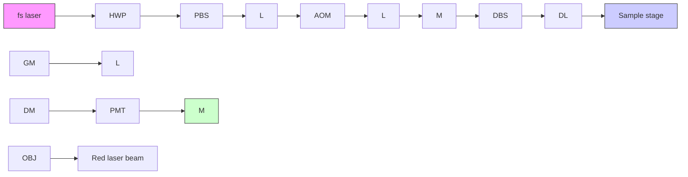

PAPER

View Article Online

View Journal I View Issue

Check for updates

Cite this: Analyst, 2023, 148, 2975

# Nanoscale bond-selective imaging by computational fusion of atomic force microscopy and coherent anti-Stokes Raman scattering microscopy†

Le Wang and Ji-Xin Cheng \*

Vibrational microscopy based on coherent Raman scattering is a powerful tool for high-speed chemical imaging, but its lateral resolution is bound to the optical diffraction limit. On the other hand, atomic force microscopy (AFM) provides nano-scale spatial resolution, yet with lower chemical specificity. In this study, we leverage a computational approach called pan-sharpening to merge AFM topography images and coherent anti-Stokes Raman scattering (CARS) images. The hybrid system combines the advantages of both modalities, providing informative chemical mapping with ∼20 nm spatial resolution. CARS and AFM images were sequentially acquired on a single multimodal platform, which facilitates image co-localization. Our image fusion approach allowed for discerning merged neighboring features previously invisible due to the diffraction limit and identifying subtle unobservable structures with the input from AFM images. Compared to tip-enhanced CARS measurement, sequential acquisition of CARS and AFM images enables higher laser power to be used and avoids any tip damage caused by the incident laser beams, resulting in a significantly improved CARS image quality. Together, our work suggests a new direction for achieving super-resolution coherent Raman scattering imaging of materials through a computational approach.

Received 28th April 2023,

Accepted 6th June 2023

DOI: 10.1039/d3an00662

rsc.li/analyst

## Introduction

Raman scattering microscopy is a non-destructive analytical technique that allows probing of the chemical and structural properties of materials and biological samples.1–3 However, the low cross-section of the Raman scattering process makes spontaneous Raman imaging inherently slow. To overcome this limitation, coherent Raman scattering techniques have been developed, such as stimulated Raman scattering (SRS) and coherent anti-Stokes Raman scattering (CARS), which can enhance the Raman signal by several orders of magnitude via selected excitation of vibrational states of molecules and probing their nonlinear response to multiple pulsed laser fields.4–7 Nonetheless, the achievable spatial resolution of coherent Raman microscopy is generally governed by the diffraction limit to around 300 nm for excitation wavelengths of near-infrared. Several methods have been reported to overcome this limitation. For instance, researchers have adopted shorter pump and Stokes wavelengths in the visible range to improve the resolution of SRS to ∼130 nm.8,9 Additionally, some researchers have implemented structured illumination and generated one or more engineered focal spots on the sample, reaching a lateral resolution of 130 nm.10,11 Alternatively, resolution can be enhanced by implementing saturation of CARS to produce a reduced point spread function,12 or by suppression of SRS with a donut-shaped coupling beam.13,14 Moreover, higher-order nonlinear CARS signals have been explored to achieve an experimental resolution of around 190 nm from eight-wave mixing.15 However, the best resolution improvement achieved to date is only approximately two-fold, and it remains a bottleneck to further improve the resolution to tens of nanometers.

Near-field imaging techniques employ a sharp probe for scanning, enabling them to surpass the diffraction limit of farfield imaging techniques. Atomic force microscopes (AFM) and scanning probe microscopes (SPM) are common examples of near-field imaging tools. When combined with spectroscopy, these methods can provide nanoscale chemical information with a resolution below 20 nm. The use of sharp and metallic probes in near-field imaging creates an extremely small apex radius and a highly confined light field underneath the probe, which contributes synergistically to the superresolution of these techniques. Tip-enhanced Raman scattering (TERS) is an example of near-field spectroscopic imaging methods and it has been reported on nanoscale chemical investigations such as heterogeneous surface structures of individual amyloid fibrils16 and single bacterium.17 However, TERS suffers from major limitations of slow imaging speed of 100 ms–1 s acquisition time per pixel and a strict requirement for tip integrity which leads to low image reproducibility. To address the need for improved imaging speed, combining near-field imaging tools with coherent Raman scattering microscopy presents a promising approach.

Previous studies have documented the initial trials of AFMbased CARS/SRS measurements. In 2004, Ichimura et al. utilized AFM contact mode and a bottom illumination scheme to capture images of DNA clusters at a frequency of $1 3 3 7 ~ \mathrm { { c m } ^ { - 1 } ; }$ , with this approach being referred to as tip-enhanced CARS.18 In another instance, Wickramasinghe and colleagues investigated tip-enhanced mechanical detection of stimulated Raman responses through photo-induced force, presenting their findings on an azobenzene thiol self-assembled monolayer on a gold surface.19 While these initial demonstrations were successful, it is important to note that limitations exist in the combined use of AFM and coherent Raman scattering. Firstly, only small powers (<1 mW) can be applied to avoid thermal damage and to preserve the tip plasmonic enhancement capability, as the signal intensity is heavily reliant on tip quality and metal coating integrity. Additionally, the published results show low signal-to-background ratio and low signal-to-noise ratio, which limits the broad application of simultaneous AFM-based coherent Raman measurements.

In this letter, we present a computational approach of fusing AFM topography information with CARS images. An integrated multimodal imaging platform was constructed in an epi-detection scheme. In the epi-detection condition, CARS exhibits superior performance over SRS due to its inherently higher sensitivity and signal-to-noise ratio. For thin films with a thickness much smaller than the excitation wavelength, the phase-matching condition is relaxed and a big proportion of the CARS signal is backscattered. Rather than taking simultaneous measurements, we sequentially captured CARS and AFM images of the same field of view. We then employed the pan-sharpening algorithm to merge the far-field and near-field images, generating a new image with chemical information from CARS images and sub-20 nm spatial resolution from AFM images. By taking sequential measurements, we were able to bypass the constraints of low excitation power and the stringent requirement of AFM tip conditions and achieved a higher signal-to-noise ratio and signal-tobackground ratio compared to tip-enhanced SRS/CARS results. We successfully applied this approach to the mapping of homopoly mer nanostructures and the phase separation patterns of polymer blends, yielding sharpened CARS images that uncovered previously invisible sub-features through resolution enhancement.

## Methods

## Integrated multimodal microscope with AFM and hyperspectral CARS

The optical paths of an integrated atomic force microscope (AFM) and hyperspectral coherent anti-Stokes Raman scattering (CARS) platform are depicted in Fig. 1. The platform uses a femtosecond laser (InSight DeepSee, Spectra-Physics) that emits a tunable pump beam (680 nm–1300 nm) and a fixed Stokes beam (1040 nm) at a repetition rate of 80 MHz. These two beams are combined using a dichroic beam splitter and travel through five 15 cm glass rods (SF57) for spectral chirping. The Stokes beam undergoes chirping with two additional glass rods to match the chirping of the pump beam before being combined. After chirping, both beams have a pulse duration of ∼2 ps, which provides a spectral resolution of 14 cm−1 . During our measurements, we used a 793 nm pump beam and a 1040 nm Stokes beam with a numerical aperture (NA) = 1.2 water objective, corresponding to a theoretical resolution of 252 nm. The pump and Stokes beams were overlapped spatially and temporally and guided to home-built optical paths beneath an inverted microscope (IX73, Olympus). A 750 nm short-pass dichroic mirror (Semrock) was used to send the excitation beams to the focusing element in a bottom-illumination manner, while allowing the newly generated wavelengths of CARS processes to pass through. A 60× water objective with an NA of 1.2 (Olympus, UPlanApo/IR) was used for the tight focusing of excitation beams onto the sample plane. The CARS signal was collected with the same objective and detected with a photomultiplier tube (PMT, Hamamatsu, H7422-40) then routed directly to a current amplifier and a data acquisition card. To remove any unwanted background light, such as excitation beams and fluorescence signals, a 750 nm short-pass filter and a 650/ 60 nm bandpass filter were placed in front of the PMT.

flowchart

Fig. 1 The schematic of an integrated microscope platform capable of AFM and hyperspectral CARS imaging. HWP: half-waveplate; PBS: polariz ation beam splitter; L: lens; AOM: Acousto-optic modulator; M: mirrors; DL: delay line; DBS: dichroic beam splitter; GM: galvo mirrors; OBJ: objec tive; DM: dichroic mirror; PMT: photomultiplier tube. For simplicity, the two additional glass rods on the Stokes path are not shown.

An AFM (NanoWizard 4XP, Bruker) equipped with a stage scanning functionality was mounted on top of the inverted microscope frame. Tapping mode was employed for image acquisition using a MikroMasch Pt-coated Si tip with an apex radius of 20 nm. The microscope eyepiece and a complementary CMOS camera (Thorlabs, CS165MU) mounted after the tube lens at the bottom of the microscope were used to visualize the sample features and tip positions. CARS images were collected using stage scanning at a line rate of 4 Hz, with a total of 256 × 256 imaging pixels. This corresponds to an acquisition time of approximately 1 ms per pixel. Topography images were also acquired using stage scanning to facilitate the co-registration of the field of view. The line rate for topography imaging was set to 0.8 Hz, with a total of 512 × 512 pixels. Consequently, the total measurement time for a single data set was approximately 11 minutes, encompassing both CARS and topography imaging.

## Image fusion via pan-sharpening algorithms

Image fusion is a valuable technique used to merge two distinct images that cannot be captured simultaneously, thereby creating a new image that provides more accurate and comprehensive information.20–22 This approach is utilized across various imaging modalities, such as optical microscopy with secondary ion mass spectrometry (SIMS),23 AFM with X-ray photoelectron spectroscopy,24 and scanning electron microscopy (SEM) with energy dispersive X-ray spectroscopy (EDS).25 Mathematical algorithms, such as multi-scale transform,26 sparse representation,27 and neural networks,28 are often employed to achieve image fusion.22 In our study, we utilized the widely adopted pan-sharpening technique to successfully fuse AFM and CARS modalities.

The pan-sharpening technique is widely used in geographical image processing and remote sensing fields to enhance the lateral resolution of images. It involves combining a high-resolution panchromatic image with a lower-resolution multispectral image to create one single color image with improved resolution.29,30 This algorithm is based on modeling color space and the key step involves converting the low-resolution image from RGB space to HSI (hue, saturation, intensity) space on a pixel level. The intensity values are then adjusted according to the high-resolution image.31 In HSI space, spectral information is mostly reflected on the hue and saturation channels, while only the intensity values are modified. This preserves the original spectral information from the CARS channel while transferring morphological information to improve spatial resolution. In this section, we demonstrate the pan-sharpening algorithm procedures using chemical (CARS) and topological images (AFM) of phase separation patterns of polymer blends, as shown in Fig. 2.

Specifically, the pan-sharpening algorithm in our study comprises of five steps:

(1) Up-sampling: The low-resolution image is up-sampled to the same number of pixels as the high-resolution image through bilinear interpolation.  
(2) Forward transform: Break each pixel into the RGB space and convert RGB color to HSI space.  
(3) Forward transform: Convert the colored AFM image to grayscale to extract Intensity information in HSI space.

flowchart

Fig. 2 Data processing procedures based on a pan-sharpening algorithm. The phase separation patterns of PS-PMMA blends were taken as an example for illustration. The CARS image corresponds to PMMA resonance at 2950 cm−1 .

(4) Component substitution: Calculate adjusted Intensity of CARS according to the height information using the equation adapted from32

$$
I _ {\mathrm{adj}} = \sqrt {\frac {\sigma_ {0}}{\sigma_ {1}} \left(I _ {1} ^ {2} - \mu_ {1} + \sigma_ {1}\right) + \mu_ {0} - \sigma_ {0}}
$$

$\left( \mu _ { 0 } \right.$ and $\mu _ { 1 }$ are the means of intensity values of CARS and AFM images, respectively; $\sigma _ { 0 }$ and $\sigma _ { 1 }$ are the standard deviation of intensity values of CARS and AFM images, respectively; $I _ { 1 }$ is the intensity value of each pixel in AFM images). This step incorporates the high-resolution morphological information into the chemical maps.

(5) Reverse transform: Use substituted Intensity together with unchanged Hue & Saturation and convert back to the original RGB space, yielding a predictive chemical map with high spatial resolution.

## Preparation of phase separation patterns of PS and PMMA blends

The polymer stock solution was prepared by dissolving 16.9 mg PS $\left( M _ { \mathrm { w } } = 2 8 0 0 0 0 \right)$ , Sigma-Aldrich) and 40 mg PMMA $\left( M _ { \mathrm { w } } = 3 5 0 0 0 0 \right.$ , Sigma-Aldrich) in 7 mL toluene and allowing it to settle. To obtain the phase separation pattern of PS-PMMA blends, a coverslip substrate with a thickness of 130 µm was cleaned with acetone and isopropanol, and then dried using nitrogen gas. 40 µL mixture solution was spin-coated onto the coverslip substrate using a spinner (Headway Research, CB-15 & PWM32) set to 800 revolutions per minute (rpm) for 10 s and then 2000 rpm for 50 s.

## Fabrication of PMMA striped structures

The PMMA stripes were fabricated via electron-beam lithography (EBL) on a coverslip substrate of 130 µm in thickness. To prepare the substrate, it was cleaned with acetone and isopropanol, dried with nitrogen, and baked at 110 °C. The substrate was then spin-coated with 950-PMMA 6% in anisole, with the aim of achieving a PMMA thickness of 500 nm based on the recipe used. Following a $1 8 0 ~ ^ { \circ } \mathrm { C }$ hard bake, a conduction layer of Au nanoparticles was sputtered onto the top surface. The sample was then patterned using EBL at 30 keV after a dose test was carried out. To complete the fabrication process, the PMMA was developed by soaking it in a solution of methyl isobutyl ketone/isopropanol (MIBK/IPA) 1 : 3 for 70 s and rinsed with IPA, followed by a wet etch to remove the sputtered Au.

## Results

## Fusion of AFM and CARS images on phase separation of PS-PMMA polymer blends

The performances and capability of image fusion were first demonstrated on the phase separation patterns of PS-PMMA polymer blends. The phase-separation morphology can be determined by various parameters, such as blend molar ratio, temperature, polymer solubility, and film thickness.33–35 The CARS spectra of PS and PMMA are included in ESI Fig. S1,† which we used as a reference for the selection of the imaging frequencies of PS and PMMA. The CARS image of PMMA was taken at $2 9 5 0 ~ \mathrm { c m } ^ { - 1 }$ and the image of PS domains was collected at 3050 $\mathrm { c m } ^ { - 1 }$ . Complementary patterns were observed as shown in Fig. 3a and c. Co-registered with the AFM topography image (Fig. 3b), we found that the irregular-shaped holes as PS domains and higher matrix regions as PMMA domains, with a maximum height difference of approximately 40 nm. We applied the pan-sharpening algorithm to the PS and PMMA CARS images respectively and the sharpened images are demonstrated in Fig. 3d and e. Note that the contrast of the topography image needs to be flipped when fused with the PS CARS image. After fusion, the nano-features in the topography image efficiently transferred into CARS images. The generated chemical channels revealed the invisible features beyond the theoretical resolution of CARS, including smaller PS domains (circled in the AFM image) with a diameter of only 100 nm. The cross-section profiles along the marked dashed line demonstrate the resolution enhancement for CARS imaging. The lateral resolution can be estimated from the width between 10% and 90% of the intensity on a nano edge of domain interfaces, which can reach 20 nm. As a result, small PS domains embedded in the PMMA domain are now clearly revealed with the aid of fusion with the high-resolution height image.

## Fusion of AFM and CARS images on PMMA striped nanostructures

Image fusion can not only reveal unobservable subtle features in the low-resolution image, but also sharpen the edges where two neighboring components are not distinguishable. One example is polymer periodic patterned structures with separation distance beyond the diffraction limit. In Fig. 4, we present a topography image of PMMA striped patterns, where each stripe has a height of 500 nm and width of 200 nm, with bare glass substrate between stripes measuring 400 nm, generating a total period of 600 nm from one structure to another. One will notice that the bottom-to-bottom distance of one stripe shown in the topography image is larger than 200 nm, and this is due to the cone shape of the AFM tip geometry. In an AFM measurement, the actual height result is a convolution of the AFM tip and the morphology of sample surface. When an AFM tip scans over deep and narrow trenches with steep slopes, the sidewall angles inevitably affect the imaging performances, making the high features broadened and the sharp edge rounded. Regular short pyramid-shaped AFM tips are unable to enter the space in-between and touch the bottom. In our study, we used a high-aspect-ratio (better than 5 : 1 at 2 µm) cone-shaped AFM probe to measure the results in Fig. 4a. Increasing the aspect ratio will further improve the quality and accuracy of the topography image.

The CARS image at 2950 $\mathrm { c m } ^ { - 1 }$ shows a Gaussian-like shape of each polymer stripe with a FWHM of 300 nm. This shape is a result of the convolution of the illumination field point spread function (PSF) and the cuboid-shaped sample. A simulation of the CARS signal PSF on 200 nm-wide and 600 nmwide samples was carried out for illustration in ESI Fig. S2.† With only 400 nm separation between each structure, the signals from neighboring stripes appeared merged and indiscernible. By utilizing the high-resolution image as a prior knowledge or “ground truth”, we were able to separate the signal contributions from the polymer structure and from the glass substrate, as demonstrated in the cross-section profiles in Fig. 4d–f.

  
Fig. 3 Fusion of AFM and CARS images on the phase separation pattern of PS-PMMA blends. (a) CARS image at the frequency of $2 9 5 0 \mathsf { c m } ^ { - 1 } ,$ corres ponding to the resonance of PMMA; (b) AFM topography image of the phase separation patterns; (c) CARS image at the frequency of 3050 $\mathsf { c m } ^ { - 1 }$ , corresponding to the resonance of PS; (d and e) High-resolution CARS images after fusion at the resonance of PMMA and PS, respectively; (f) Line cross-section profiles as marked in (a) and (d); (g) The merged channel of resolution-enhanced images (d) and (e). Unobservable features in the chemical mapping are uncovered with improved resolution. (h) Line cross-section profiles as marked in (c) and (e). The lateral resolution can be estimated from the distance between the dashed lines, marking the width between 10% and 90% of the intensity signals on a nano edge.

The measurements on PMMA stripes also indicate the importance of pre-processing and appropriate parameter selection for the raw topography image. Specifically, for samples with a pronounced signal difference between areas, assigning a suitable contrast is critical to avoid erasing weak CARS signals in the generated predictive image. A good fused image is expected to preserve both the chemical information and the fine details in the topography image. Inappropriate parameters, such as over-suppressing the background in AFM images, will result in a loss of morphological details and an insufficient feature transfer. One example of the distorted fusion image caused by over-tuning AFM image is shown in ESI Fig. S3.† With a height scale intentionally set to 300 nm– 800 nm, the information of the stripe edges was lost and a narrower and sharper feature distortion after fusion was obseryed. Therefore, our findings suggest that appropriate parameter selection is mandatory to avoid loss of weak chemical signals and ensure successful and complete information transferring in the fusion process.

## Discussion

Computational fusion of AFM and CARS images through pansharpening is a feasible and easy-to-implement technique to boost the spatial resolution of diffraction-limited spectroscopic imaging. This is a good example of employing computational approaches to surpass the physical constraints and trade-offs of instrumentation. Operated in ambient environment and on a multimodal platform, one can sequentially collect CARS images and AFM images by simply retracting and engaging the AFM probe. When the probe is retracted to a far distance, it is no longer subject to either an optical trap effect or thermal damage, high laser powers (tens of mW) can be applied for high signal-to-noise ratio of CARS imaging. This characteristic completely avoids overheating and tip damage issues36 and releases the constraints of laser power, therefore benefiting the AFM-based spectroscopy techniques.

(a  

text_image

AFM Topography
500 nm

(b  

text_image

800 nm
700
600
500
400
300
200
100
40

text_image

PMMA CARS 2950 cm⁻¹
500 nm

text_image

(c) PMMA CARS after fusion
0 mV
0
0
0
0
0
0
0
0
0
0
0
0
0
0
0
0
0
0
0
0
0
0
0
0
0
0
0
0
0
0
0
0
0
0
0
0
0
0
0
0
0
0
0
0
0
0
0
0
0
0
1

(d) Topography cross-section profile  

line chart

| Distance / µm | Height / nm |
| ------------- | ----------- |
| 0.0           | 0           |
| 0.5           | 600         |
| 1.0           | 0           |
| 1.5           | 600         |
| 2.0           | 200         |

line chart

| Distance / µm | Intensity / a.u. |
| ------------- | ---------------- |
| 0.0           | 0.01             |
| 0.5           | 0.08             |
| 1.0           | 0.08             |
| 1.5           | 0.08             |
| 2.0           | 0.01             |

line chart

| Distance / µm | Intensity / a.u. |
| ------------- | ---------------- |
| 0.0           | 30               |
| 0.5           | 150              |
| 1.0           | 150              |
| 1.5           | 150              |
| 2.0           | 30               |

Fig. 4 Fusion of AFM and CARS images on PMMA stripes. (a) AFM topography image of the 500-nm-thick PMMA striped patterns. The image wa pre-processed with vertical drift correction. (b) CARS image at $2 9 5 0 ~ \mathsf { c m } ^ { - 1 } ;$ (c) High-resolution CARS image calculated after fusion. (d–f) Crosssection line profiles along the marked dashed line to demonstrate the sharpened edges of previously merged features.

It is worth noting that AFM-based IR-photothermal microscopy also serves as a powerful tool for nondestructive and label-free nanoscale chemical analysis.37–39 IR and Raman spectroscopy methods are complementary and possess inherent sensitivity to different vibrational modes. IR spectroscopy primarily targets anti-symmetric vibrations that induce changes in the dipole moment, while Raman spectroscopy detects symmetric vibrations that alter the polarizability.40 Consequently, the computational fusion of AFM and CARS represents a valuable addition to the existing AFM-based IR microscopy, offering synergistic advancements in nanoscopic research.

One prerequisite of pan-sharpening is that the two images should be of same size and same field of view. The size requirement can be satisfied by up sampling the low-resolution image, while the field of view alignment should be done through a careful image registration between the two modalities. The image registration algorithms can be divided into two main categories: (1) area-based approaches such as crosscorrelation methods and Fourier representation methods; (2) feature-based approaches by performing feature extraction and feature matching.22,41 In our measurement, both CARS images and AFM images were acquired by sample-stage scanning. This allows a convenient way to perform image registration by hand provided that the focused laser spot is roughly on the tip apex. We utilized a CMOS camera mounted on the microscope frame to real-time visualize the relative position of laser spot and the approximate location of the AFM tip apex. The position of the AFM tip can be easily finetuned through the positioning screws on the scan head. Therefore, no additional image registration processing is needed for the field of view alignment. For the image fusion of modalities that are impractical to implement on one platform, such as SEM and SIMS, an image co-localization will be necessary before doing image fusion.

In data fusion, having prior knowledge is crucial. One of the assumptions made in our demonstrated measurements is the height correspondence of CARS signals. However, it is not mandatory for image fusion to be based on height information alone. The high-resolution image can contain various types of information as long as it has chemical-corresponding contrast, such as mechanical properties, electrical properties, and adhesion information, which can be obtained through various modes of AFM imaging. For example, the phase channel in AFM tapping mode can serve as a reflection of mechanical properties42 and the peak force tapping mode provide real-time modulus and adhesion information.43 Additionally, electrical properties such as work function and conductivity can also be accessed using AFM.44,45 These modes do not require essential height differences between compositions. In future work, multiple AFM imaging modes can be used synergistically to enhance the accuracy and robustness of image fusion in chemical imaging. This opens up possibilities for extending the application of image fusion beyond the realm of relatively simple 2D polymeric materials to more complex systems, particularly biological specimens. Although AFM is primarily a surface-sensitive technique, which presents challenges for chemical imaging of whole cells or thick tissues, it is still feasible to achieve image fusion by employing suitable cell-sample preparation techniques or by creating artificial mimics of cell membranes. Examples include the mapping local heterogeneity of microtome-sliced thin cell sections, visualization of extracted cell walls of fungi, and discrimination of lipid compositions in single supported lipid bilayers.

## Conclusion

In summary, we have for the first time demonstrated a computational approach to improve the spatial resolution of CARS by implementing image fusion with AFM via the pan-sharpening algorithm. Successful resolution improvement has been proved on homopolymer nanostructures and phase separation patterns of polymer blends. Invisible subtle structures in lowresolution chemical imaging can be identified after the image fusion, and merged neighboring features due to diffraction limit can be distinguished and separated. This exploration has provided a new direction to achieve coherent Raman imaging with sub-20 nm spatial resolution. Future investigations can focus on exploring additional algorithms and AFM modes to further expand the feasibility of this approach to a wider range of materials and biological samples.

## Author contributions

Le Wang: data curation, formal analysis, investigation, methodology, software, validation, visualization, writing – original draft. Ji-Xin Cheng: conceptualization, funding acquisition, and supervision.

## Conflicts of interest

There are no conflicts to declare.

## Acknowledgements

The authors would like to thank Bruker Nano for loaning the NanoWizard 4XP AFM system. L. W. would like to thank Jianing Liu for fabricating the PMMA striped structures. L. W. would like to thank Dr. Haonan Lin for helpful discussions on the pan-sharpening algorithm. This work was supported by NIH grant R35GM136223.

## References

1 K. Kneipp, H. Kneipp, I. Itzkan, R. R. Dasari and M. S. Feld, Chem. Rev., 1999, 99, 2957–2976.

2 S. P. Mulvaney and C. D. Keating, Anal. Chem., 2000, 72, 145–158.  
3 I. Pence and A. Mahadevan-Jansen, Chem. Soc. Rev., 2016, 45, 1958–1979.  
4 J.-X. Cheng and X. S. Xie, Science, 2015, 350, aaa8870.  
5 C. H. Camp Jr. and M. T. Cicerone, Nat. Photonics, 2015, 9, 295–305.  
6 A. Zumbusch, G. R. Holtom and X. S. Xie, Phys. Rev. Lett., 1999, 82, 4142.  
7 C. H. Camp Jr., Y. J. Lee, J. M. Heddleston, C. M. Hartshorn, A. R. H. Walker, J. N. Rich, J. D. Lathia and M. T. Cicerone, Nat. Photonics, 2014, 8, 627–634.  
8 Y. Bi, C. Yang, Y. Chen, S. Yan, G. Yang, Y. Wu, G. Zhang and P. Wang, Light: Sci. Appl., 2018, 7, 81.  
9 M. Zhuge, K. C. Huang, H. J. Lee, Y. Jiang, Y. Tan, H. Lin, P. T. Dong, G. Zhao, D. Matei and Q. Yang, Adv. Sci., 2021, 8, 2003136.  
10 K. M. Hajek, B. Littleton, D. Turk, T. J. McIntyre and H. Rubinsztein-Dunlop, Opt. Express, 2010, 18, 19263– 19272.  
11 H. Kim, G. W. Bryant and S. J. Stranick, Opt. Express, 2012, 20, 6042–6051.  
12 Y. Yonemaru, A. F. Palonpon, S. Kawano, N. I. Smith, S. Kawata and K. Fujita, Phys. Rev. Appl., 2015, 4, 014010.  
13 L. Gong and H. Wang, Phys. Rev. A, 2014, 90, 013818.  
14 L. Gong and H. Wang, Phys. Rev. A, 2015, 92, 023828.  
15 L. Gong, W. Zheng, Y. Ma and Z. Huang, Nat. Photonics, 2020, 14, 115–122.  
16 C. C. vandenAkker, T. Deckert-Gaudig, M. Schleeger, K. P. Velikov, V. Deckert, M. Bonn and G. H. Koenderink, Small, 2015, 11, 4131–4139.  
17 U. Neugebauer, P. Rösch, M. Schmitt, J. Popp, C. Julien, A. Rasmussen, C. Budich and V. Deckert, ChemPhysChem, 2006, 7, 1428–1430.  
18 T. Ichimura, N. Hayazawa, M. Hashimoto, Y. Inouye and S. Kawata, Phys. Rev. Lett., 2004, 92, 220801.  
19 H. K. Wickramasinghe, M. Chaigneau, R. Yasukuni, G. Picardi and R. Ossikovski, ACS Nano, 2014, 8, 3421– 3426.  
20 R. Van de Plas, J. Yang, J. Spraggins and R. M. Caprioli, Nat. Methods, 2015, 12, 366–372.  
21 T. Stathaki, Image fusion: algorithms and applications, Elsevier, 2011.  
22 J. Ma, Y. Ma and C. Li, Inf. Fusion, 2019, 45, 153–178.  
23 J. G. Tarolli, A. Bloom and N. Winograd, Biointerphases, 2016, 11, 02A311.  
24 K. Artyushkova, J. O. Farrar and J. E. Fulghum, Surf. Interface Anal., 2009, 41, 119–126.  
25 Z.-S. Duma, T. Sihvonen, J. Havukainen, V. Reinikainen and S.-P. Reinikainen, Micron, 2022, 163, 103361.  
26 Y. Liu, S. Liu and Z. Wang, Inf. Fusion, 2015, 24, 147– 164.  
27 Q. Zhang, Y. Liu, R. S. Blum, J. Han and D. Tao, Inf. Fusion, 2018, 40, 57–75.  
28 Y. Liu, X. Chen, H. Peng and Z. Wang, Inf. Fusion, 2017, 36, 191–207.  
29 M. Ehlers, S. Klonus, P. Johan Åstrand and P. Rosso, Int. J. Image Data Fusion, 2010, 1, 25–45.  
30 I. Alimuddin, J. T. S. Sumantyo and H. Kuze, Int. J. Appl. Earth Obs. Geoinf., 2012, 18, 165–175.  
31 J. G. Tarolli, L. M. Jackson and N. Winograd, J. Am. Soc. Mass Spectrom., 2014, 25, 2154–2162.  
32 C. Padwick, M. Deskevich, F. Pacifici and S. Smallwood, Proceedings of the ASPRS Annual Conference, San Diego, CA, USA, 2010, 2630, pp. 1–14.  
33 D. a. Mrđenović, D. Abbott, V. Mougel, W. Su, N. Kumar and R. Zenobi, ACS Appl. Mater. Interfaces, 2022, 14, 24938– 24945.  
34 K. Dalnoki-Veress, J. Forrest, J. Stevens and J. Dutcher, Phys. A, 1997, 239, 87–94.  
35 F. Wang, P. Altschuh, L. Ratke, H. Zhang, M. Selzer and B. Nestler, Adv. Mater., 2019, 31, 1806733.  
36 F. Tremoço, A. I. Gómez-Varela, A. Miranda, M. Lopez-Garcia, A. G. Silva and P. A. De Beule, Results Phys., 2022, 39, 105718.  
37 L. Wang, H. Wang, M. Wagner, Y. Yan, D. S. Jakob and X. G. Xu, Sci. Adv., 2017, 3, e1700255.  
38 D. Nowak, W. Morrison, H. K. Wickramasinghe, J. Jahng, E. Potma, L. Wan, R. Ruiz, T. R. Albrecht, K. Schmidt and J. Frommer, Sci. Adv., 2016, 2, e1501571.  
39 A. Dazzi, R. Prazeres, F. Glotin and J. Ortega, Opt. Lett., 2005, 30, 2388–2390.  
40 P. Larkin, Infrared and Raman spectroscopy: principles and spectral interpretation, Elsevier, 2017.  
41 B. Zitova and J. Flusser, Image Vis. Comput., 2003, 21, 977– 1000.  
42 S. Magonov, V. Elings and M.-H. Whangbo, Surf. Sci., 1997, 375, L385–L391.  
43 C. Su, Microsc. Microanal., 2010, 16, 364–365.  
44 S. Sadewasser and T. Glatzel, Kelvin probe force microscopy, Springer, 2012.  
45 M. Lanza, Conductive Atomic Force Microscopy: Applications in Nanomaterials, John Wiley & Sons, 2017.