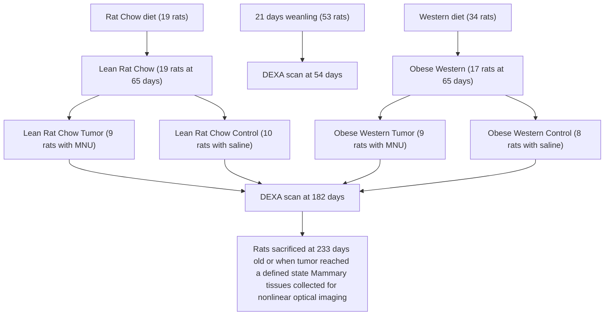

# Nonlinear Optical Imaging to Evaluate the Impact of Obesity on Mammary Gland and Tumor Stroma

Thuc T. Le, Charles W. Rehrer, Terry B. Huff, Maxine B. Nichols, Ignacio G. Camarillo, and Ji-Xin Cheng

## Abstract

Obesity is an established risk factor for breast cancer incidence and mortality. However, the mechanism that links obesity to tumorigenesis is not well understood. Here we combined nonlinear optical imaging technologies with an early-onset diet-induced obesity breast cancer animal model to evaluate the impact of obesity on the composition of mammary gland and tumor stroma. Using coherent anti-Stokes Raman scattering and second harmonic generation on the same platform, we simultaneously imaged mammary adipocytes, blood capillaries, collagen fibrils, and tumor cells without any labeling. We observed that obesity increases the size of lipid droplets of adipocytes in mammary gland and collagen content in mammary tumor stroma, respectively. Such impacts of obesity on mammary gland and tumor stroma could not be analyzed using standard two-dimensional histologic evaluation. Given the importance of mammary stroma to the growth and migration of tumor cells, our observation provides the first imaging evidence that supports the relationship between obesity and breast cancer risk.

O BESITY is an established risk factor for a number of breast cancer.1,2 A recent rapid increase in childhood obesity indicates that the adverse effects of obesity on human health will be a major concern for the near future. In particular, the risk of breast cancer increases significantly with an elevated body mass index (. 30 kg/m2 ).2,3 Despite a well-established association, the relationship between obesity and breast cancer is not well understood. A common approach to studying breast cancer is to investigate mutations of oncogenes.4 However, the process in which a normal cell transforms into cancer is driven not only by cellular intrinsic events, such as genetic mutations, but also by extrinsic factors in the microenvironment.5 Phenotypic behaviors of cancer cells, such as proliferation and invasion, are regulated by extracellular matrix (ECM) components and soluble secreted factors of surrounding stromal cells.5–7 The dynamic interactions of cancer cells and the local environment play crucial roles in their survival and development into malignancy.6,8 Disrupting these interactions has become a viable therapeutic strategy for cancer treatment in recent years.9,10

To further understand the influence of the microenvironment on mammary tumorigenesis, we used nonlinear optical (NLO) imaging to characterize the stroma of mammary gland and tumor tissues. Although histologic studies enable the analysis of thin slices of tissue biopsy, they lack three-dimensional information crucial to describe stromal organization in their natural state. On the other hand, NLO microscopy has demonstrated successfully the ability for deep tissue imaging with three-dimensional resolution.11 Using second harmonic generation (SHG) and two-photon excitation fluorescence (TPEF) microscopy, a number of research groups have imaged collagen type I, tumor cells expressing green fluorescent protein, and dyelabeled vasculatures in living animals.12–16 For molecules that cannot tolerate fluorophore labeling, coherent anti-Stokes Raman scattering (CARS) microscopy provides a highly sensitive vibrational imaging technique.17 Recently, CARS has been successfully applied to image lipid domains, cell membranes, axonal myelin sheath in live tissues, and adipocytes in live animals.18–21 Here we combine CARS, SHG, and TPEF microscopy into a multimodal platform to image components of the mammary stroma, such as adipocytes, collagen fibrils, blood vessels, and others.

From the Weldon School of Biomedical Engineering, Department of Biological Sciences, Department of Chemistry, Purdue Cancer Center, and Purdue Oncological Sciences Center, Purdue University, West Lafayette, IN. This work was supported by a National Institutes of Health R21 grant EB004966-01 to J.X.C., Showalter Trust Award 1320046936, Department of Defense grant W81XWH-05-1-0473, and Purdue Cancer Center grant ACS IRG 58-006-47 to I.G.C.

Address reprint requests to: Ji-Xin Cheng, PhD, Weldon School of Biomedical Engineering, 206 Intramural Drive, West Lafayette, IN 47907; e-mail: jcheng@purdue.edu.

Ignacio G. Camarillo, PhD, Department of Biological Science, 915 West State Street, West Lafayette, IN 47907; e-mail: ignacio@purdue.edu.

DOI 10.2310/7290.2007.00018

\# 2007 BC Decker Inc

Specifically, we asked how obesity impacts the composition of mammary gland and tumor stroma, leading to the observed relationship between obesity and high breast cancer risk.3,22 To address this question, we used a Sprague-Dawley rat model of early-onset diet-induced obesity (DIO; see Methods; Figure S1\*).23,24 DIO animal models have been used to study many diseases associated with obesity.25 We first placed a group of young rats on a high-fat Western diet to induce obesity and another group on a lean rat chow diet to serve as controls. Then we treated one group of rats with methylnitrosourea (MNU), a chemical carcinogen that induces mammary tumors, and the other group of control rats with saline.26 At specified times (see Methods), we collected mammary gland and tumor tissues for NLO imaging (Figure S2). Based on CARS imaging of adipocytes and SHG imaging of collagen fibrils, we observed that obesity increases the size of lipid droplets of adipocytes in the mammary gland and collagen content in mammary tumor stroma. The impact of obesity on adipogenesis and collagen content should further our understanding of an established but mechanistically undefined role of obesity on breast cancer incidence and mortality.

## Materials and Methods

## Animal Model

Of the 70 outbred Sprague-Dawley rats at 21 days old, 19 rats were placed on a rat chow diet (Harlan Tech, Indianapolis, IN) and 51 rats on a Western diet (Research Diets, New Brunswick, NJ) to produce 19 lean rat chow and 17 DIO Western animals (see Figure S1). The rat chow diet contained 3.30 kcal/g and the Western diet contained 4.47 kcal/g of metabolizable energy. No significant difference was found in kcal/g consumption among groups (data not shown). At 54 days old, rats were grouped according to their body fat composition determined by dual-energy x-ray absorptometry (DEXA; Lunar Corporation, Madison, WI) under isoflurane anesthesia. The average percent body fat mass of rats on the lean rat chow diet was half of that on the obese Western diet. At 65 days old, half of the rats in each group received the carcinogen MNU and the other half a 0.9% saline injection. The resulting four groups of animals comprised 10 lean rat chow and 8 obese Western rats with no tumor and 9 lean rat chow tumor and 9 obese Western tumor rats. At 182 days old, the body fat composition of the rats was again determined by DEXA scans. The average percent body fat mass for lean rat chow rats was approximately half of that of the obese Western rats (data not shown). Rats were sacrificed either at 233 days old or when the animals reached physiologic and ethologic end points of pain, distress, and suffering as determined by established guidelines.27 Mammary gland and tumor tissues of three rats from each animal group were collected and stored for multiphoton imaging or prepared for histologic evaluation. All animal experiments were done with the approval of the Purdue Animal Care and Use Committee.

## Tissue Maintenance

Mammary gland and tumor tissues were cut into small $2 \times$ $2 \times 2$ mm pieces and kept in Eagle’s Minimum Essential Medium (EMEM) supplemented with 10% fetal bovine serum and 1% penicillin-streptomycin in a $3 7 ^ { \circ } \mathrm { C }$ incubator with 5% $\mathrm { C O } _ { 2 } .$ . Mammary gland tissues were imaged within 7 days after collection. Mammary tumor tissues were either kept in EMEM for imaging within 24 hours after tissue collection or kept frozen in liquid nitrogen for imaging at a later time (Figure S3).

## Histology Preparation

Mammary gland and tumor tissues were fixed in a solution of 10% buffered formalin. After fixation, tissues were processed and embedded in paraffin blocks. Tissue sections of 5 mm thickness were prepared and stained with hematoxylin-eosin.

## Nonlinear Optical Imaging

A multimodal NLO microscope that allows CARS, SHG, and TPEF imaging on the same platform is diagrammed in Figure S2. For CARS imaging, two tightly synchronized Ti: Sapphire lasers (Mira 900, Coherent Inc., Santa Clara, CA) with an average timing jitter of 100 fs were used. Both lasers have a pulse duration of 2.5 ps and operate at a 78 MHz repetition rate. The two beams at frequencies of $\omega _ { \mathrm { p } }$ (pump) and ${ \mathfrak { O } } _ { s }$ (Stokes) were parallel polarized and collinearly combined. A Pockels’ cell (Model 350-160, Conoptics, Danbury, CT) was used to reduce the repetition rate to <4 MHz. The combined beams were directed into a laser scanning microscope (FV300/IX70, Olympus, Melville, NY) and focused into a sample through a 603 water immersion microscope objective (numerical aperture 5 1.2). Backreflected signal was collected by the same objective, spectrally separated from the excitation source by a dichroic mirror (670dcxr, Chroma Technologies, Rockingham, VT), transmitted through a 600/65 nm bandpass filter (42-7336, Ealing Catalog Inc., Rocklin, CA), and detected by a photomultiplier tube (PMT; H7422-40, Hamamatsu, Japan) mounted at the backport of the microscope. We tuned the pump laser $( \omega _ { \mathrm { p } } )$ to around $1 4 { , } 2 4 0 \ \mathrm { c m } ^ { - 1 }$ and the Stokes laser $\left( \omega _ { s } \right)$ to around $1 1 { , } 4 0 0 \mathrm { c m } ^ { - 1 }$ . Their wave number difference $\omega _ { \mathrm { p } } - \omega _ { \mathrm { s } }$ $= 2 { , } 8 4 0 \ \mathrm { c m } ^ { - 1 }$ matches the Raman shift of symmetric $\mathrm { C H } _ { 2 }$ stretch vibration. For SHG and TPEF imaging, a femtosecond laser (795 nm, 200 fs) at 78 MHz (Mira 900, Coherent Inc.) was used for excitation. SHG and TPEF signals were detected by the same backport-mounted detector as CARS signal. Bandpass filters 375/50 nm and 520/40 nm (Chroma Technologies) were used to transmit SHG and TPEF signals, respectively. The TPEF filter 520/40 nm was selected specifically for fluorescein dye. The total acquisition time for each image was 1.12 seconds. Images were analyzed using FluoView software (Olympus, Melville, NY).

## Imaging Condition

A glass-bottom chamber containing tissues submerged in maintenance media was placed on the microscope for imaging at room temperature. For CARS imaging, the total power of Stokes and pump lasers at the sample was set at 4 mW. For SHG imaging of fresh tissues and histology tissue sections, the laser power was set at 40 mW and 16 mW at 795 nm, respectively. For TPEF imaging, laser power was set at 16 mW at 795 nm.

## Evaluating Mammary Stromal Collagen Content

An analysis volume is defined with the dimensions of 250 mm $\mathrm { ( x ) } \times 2 5 0 ~ \mu \mathrm { m } \mathrm { \ ( y ) } \times 4 0 ~ \mu \mathrm { m \ ( z ) }$ , with z 5 0 being the coverslip and tissue interface (Figure S4). For each analysis volume, 81 frames along the z-axis with a fixed step size of 0.5 mm were acquired. Nine different volumes were evaluated, and the total SHG intensity (minus the background intensity) from 729 frames (9 3 81 frames) was used to infer the mammary stromal collagen content of each animal. Background intensity was collected from an analysis volume devoid of any collagen. The laser power at the sample and the high voltage of the PMT was kept constant for all measurements.

## Measuring the Diameters of Lipid Droplets of Adipocytes

Adipocytes within the mammary gland tissues of salinetreated rats were scanned along the z-axis with a 0.5 mm step size using CARS microscopy. The largest measured diameter values of lipid droplets at equatorial sections were recorded. One hundred adipocytes in the mammary stroma of each rat were evaluated to obtain the average lipid droplet diameter (Table S1).

## Results

Using CARS and SHG on the same microscope platform (see Figure S2), we imaged the composition and structural organization of mammary gland and tumor stroma. We found that multimodal NLO imaging enables simultaneous visualization of adipocytes, collagen fibrils, and tubular structures representing blood capillaries (Figure 1A, supplementary movie 1\*). Because imaging blood capillaries without labeling has not been reported previously, we labeled the endothelial cells lining the blood vessels with fluorescein isothiocyanate conjugated isolectin $\mathrm { B } _ { 4 } ~ ( \mathrm { F I T C - I B } _ { 4 } ) . ^ { 2 8 , 2 9 }$ The TPEF image in Figure 1B exhibited strong $\mathrm { F I T C - I B _ { 4 } }$ staining of tubular structures, as well as activated macrophages, in the mammary gland (supplementary movie $2 ) . ^ { 2 9 }$ We observed that most adipocytes were surrounded by collagen fibrils in the mammary gland (Figure 1C, supplementary movie 3). In addition, we showed that CARS enabled imaging of tumor cells in mammary tumors without any labeling (Figure 1, D–F). Tumor cell visualization was possible owing to weak CARS signals arising from the cell membrane’s lipid bilayer and strong CARS signals from numerous small lipid droplets surrounding the nucleus, which gives a dark contrast in the CARS image (supplementary movie 4). Tumor cell visualization was further confirmed by DiOC18 fluorescence imaging (see Figure S4).30 In contrast to the orientation of collagen fibrils around adipocytes in the mammary gland, we found that most collagen fibrils were located at the outer perimeter of the tumor mass in mammary tumor (see Figures 1, D–F, and S5). This spatial organization of collagen relative to tumor mass is consistent with a previous report by Ahmed and colleagues in which SHG and TPEF microscopy were used to image the organization of collagen and mammary tumor cells expressing green fluorescent protein in transgenic mice, respectively.13 However, the use of CARS microscopy to image tumor cells does not require any labeling and should be applicable to image any type of tumor.

With the demonstrated capability of CARS and SHG for label-free imaging of adipocytes and collagen, respectively, we proceeded to evaluate the impact of obesity on their composition in mammary gland and tumor stroma. We imaged mammary tissues collected from three rats for each of the four experimental groups: lean rat chow, obese Western, lean rat chow tumor, and obese Western tumor. Because SHG intensity is directly correlated with the concentration of collagen fibril type I, we evaluated the relative collagen content of a tissue based on total SHG intensity.14 We found that there were strong correlations between obesity, ECM collagen content, and adipocyte size. In the mammary gland, we observed higher collagen content in lean rats on the rat chow diet compared with obese rats on the Western diet (Figure 2, A and E). Conversely, in mammary tumor stroma, we observed higher collagen content in obese rats on the Western diet compared with lean rats on the rat chow diet (Figure 2, B–D and F–H). To systematically compare the ECM collagen content from one animal with that of the other, we defined a fixed analysis volume and collected total SHG signals from nine volumes in the mammary gland or tumor stroma of each rat (see Methods; Figure S6). The total SHG collagen intensity as a function of rats in different diet groups is plotted in Figure 3A (see Table S1). Consistent with our observation, quantitative analysis of SHG intensity indicated that obesity decreases collagen content by an average of 5-fold in the mammary gland and increases collagen content by an average of 14-fold in mammary tumor stroma.

natural_image

Fluorescent microscopy image showing cellular structures with green and red staining, no visible text or symbols

natural_image

Microscopic fluorescent image showing green-labeled cellular structures with white spots (no text or symbols visible)

natural_image

Fluorescent microscopy image showing red-stained cell nuclei against a green cytoskeletal background (no text or symbols)

natural_image

Microscopic image showing green fluorescent structures against a dark background, with a 0 μm scale bar (no text or symbols beyond label)

natural_image

Microscopic image showing red fluorescent spots on a dark background, with scale bar and Z = 9.5 μm label (no other text or symbols)

natural_image

Microscopic image showing red fluorescent cells with green cytoplasmic structures, scale bar 14 μm (no text or symbols)

Figure 1. Nonlinear optical imaging of mammary gland and tumor stromal composition. A, Adipocytes and blood capillaries (arrows) imaged with coherent anti-Stokes Raman scattering (red) and collagen fibrils imaged with second harmonic generation (SHG) (green) in a mammary gland. B, Blood capillaries and macrophages stained with fluorescein isothiocyanate conjugated isolectin $\mathrm { { B } _ { 4 } }$ and imaged with two-photon excitation fluorescence (TPEF) (gray). Collagen fibrils was imaged with SHG (green). C, Adipocyte (red) and collagen fibrils (green) organization in a mammary gland. D–F, Organization of tumor cells (red) and collagen fibrils (green) along the vertical axis of a mammary tumor stroma. Images taken with a 603 water immersion objective. Scale bars 5 25 mm.

To analyze the impact of obesity on adipogenesis in mammary stroma, we used CARS to evaluate the size of lipid droplets in adipocytes. By focusing CARS excitation beams at the equatorial planes, we measured the diameters of 100 lipid droplets of adipocytes in each rat in both diet groups (see Table S1). The average lipid droplet diameter as a function of lean and obese rats is plotted in Figure 3B. We found that, on average, the diameters of lipid droplets from obese Western rats were twofold larger than those from lean rat chow rats. This observation indicates that obesity increases the size of lipid droplets in mammary adipocytes.

Finally, we analyzed standard histologic tissue sections by CARS and SHG and compared the images with those obtained from fresh tissues. We found that most of the SHG collagen signal came from areas surrounding mammary ducts and terminal end buds in mammary gland tissue sections (Figure 4, A and B). Consistent with fresh tissue analysis, we observed that most collagen signal was found at the perimeter of the tumor mass (Figure 4, C and D). However, when comparing two-dimensional images of histology samples, we could not observe any correlation between obesity, the size of lipid droplets of adipocytes, and relative collagen content in mammary gland or tumor stroma. Given the fact that tissue sections were not sliced at the equatorial plane of the adipocytes, it became obvious that we could not compare the size of lipid droplets of adipocytes from one histologic tissue section with another. In addition, each tissue section was approximately 5 mm thick, less than the average size of a tumor cell (<10 mm); therefore, collagen fibrils present primarily outside the tumor mass could not be assayed. It is conceivable that serial sectioning of tissues and careful three-dimensional image reconstruction analysis of standard histology samples should allow evaluation of the impact of obesity on mammary gland and tumor stroma. However, given the tedious works involved with serial histology section analysis, a simpler alternative can be found with NLO imaging, which has intrinsic threedimensional sectioning capability.11 Taken together, our results show that three-dimensional imaging of mammary tissues enabled analysis of the impact of obesity on mammary stroma not readily accessible by standard twodimensional histologic evaluation.

  
Figure 2. Coherent anti-Stokes Raman scattering imaging of adipocytes (red) and second harmonic generation imaging of collagen fibrils (green) to evaluate the impact of obesity on mammary gland and tumor stromal composition. Representative images (single frames) of (A) a mammary gland of one lean rat chow rat (LRC1), (B–D) mammary tumor stroma of three lean rat chow tumor rats (LRCT1, LRCT2, LRCT3), (E) a mammary gland of one obese Western rat (OW1), and (F–H) mammary tumor stroma of three obese Western tumor rats (OWT1, OWT2, OWT3). Images taken with a 603 water immersion objective. Scale bars 5 25 mm.

## Discussion

As breast tumors are mainly epithelial in nature, a majority of cancer studies have focused on activities occurring within epithelial cells.5,6 However, increasing evidence indicates that surrounding stromal environment plays an integral role in mammary tumorigenesis.6,8 Recent microarray gene expression analysis showed that secreted proteins from adipocytes induced epithelial cells to express genes crucial for proliferation, invasion, survival, and angiogenesis.31 Supporting the importance of stromal composition in tumorigenesis, many reports have also demonstrated that overexpression of genes for ECM proteins was observed in aggressive mammary tumors.32 Collagen type I, in addition to playing the role of structural support in the ECM, was found to be an important binding site for a large number of mitogenic and morphogenic growth factors.33 Remodeling of collagen fibrils has been implicated in tumor-associated angiogenesis and invasiveness.34 In light of such evidence, the tissue organization theory proposes that tumorigenesis begins at the tissue level of biologic organization and is the result of altered stromal-epithelial interactions.8 In this study, we combined NLO imaging techniques with an early onset DIO animal model to evaluate how obesity alters mammary stromal composition, leading to the observed higher breast cancer incidence in obese individuals. We report direct correlations between obesity and average adipocyte size in mammary gland and between obesity and the ECM collagen content in mammary tumor stroma. Given the emerging importance of adipocytes and collagen for the growth and migration of mammary tumor cells, our observation provides the first visual evidence supporting the relationship between obesity and breast cancer risk.35

Our imaging data are in agreement with previous biochemical studies. A number of research groups have reported a significant decrease in collagen messenger ribonucleic acid transcripts (up to 90%) during adipogenesis, and lower collagen content led to a more permissive environment for the growth of adipocytes.36,37 These studies lend support to our observation that collagen content decreases as adipocytes become larger in the mammary gland of obese rats. On the other hand, leptin, a protein hormone found to circulate at high concentration in obese animals, was reported to stimulate the expression

bar chart

| Region | LRC1 (x10⁹ au) | LRC2 (x10⁹ au) | LRC3 (x10⁹ au) | OW1 (x10⁹ au) | OW2 (x10⁹ au) | OW3 (x10⁹ au) |
| :--- | :--- | :--- | :--- | :--- | :--- | :--- |
| Rat Chow | 21 | 39 | 46 | 7 | 6 | 6 |
| Western | 0 | 0 | 0 | 0 | 0 | 0 |
| Rat Chow | 1 | 1 | 1 | 0 | 0 | 1 |
| Western | 18.5 | 15.5 | 28.5 | 0 | 0 | 0 |

bar chart

| Region | LRC1 (μm) | LRC2 (μm) | LRC3 (μm) |
| :--- | :--- | :--- | :--- |
| Rat Chow | 50 | 46 | 50 |
| Western | 93 | 83 | 78 |

Figure 3. Analysis of the impact of obesity on mammary gland and tumor stromal composition. Mammary gland and tumor tissues of three rats from each animal group were analyzed for collagen content and diameter of lipid droplets (LD) of adipocytes. A, Total second harmonic generation (SHG) collagen intensity in mammary gland and tumor stroma. B, Average diameter of LDs of 100 adipocytes in mammary glands. Error bars represent the standard deviations from the average values.

of collagen type I in epithelial $_ { \mathrm { c e l l s . } } { } ^ { 3 8 - 4 0 }$ Additionally, transformation growth factor $\beta _ { 1 } ,$ a surface receptor protein highly expressed in epithelial tumor cells, is an activator for collagen type I synthesis.34,41 Such biochemical analyses indicate that whereas adipogenesis suppresses collagen synthesis in adipocytes, secreted adipocyte soluble factors stimulate collagen synthesis in epithelial cells. A high level of circulating leptin in obese rats supports our observation of higher collagen content in the mammary tumor stroma of obese rats compared with lean rats.35,38–40 Low collagen content in the mammary gland and high collagen content in the mammary tumor stroma of obese rats could be due to the relative abundance of adipocytes and epithelial cells, the main sources of collagen in these tissues, respectively. Although it remains unclear how obesity induces mammary tumorigenesis, our data clearly show that obesity promotes a stromal environment conducive for the proliferation and migration of mammary epithelial cells.

natural_image

Fluorescent microscopy image showing red-stained tissue with green-labeled LRC structures (no text or symbols)

natural_image

Fluorescent microscopy image showing red-stained cellular structures with green fluorescent markers (no text or symbols)

natural_image

Fluorescence microscopy image showing red-stained tissue with green-labeled LRCT (no text or symbols present)

natural_image

Fluorescence microscopy image showing red and green labeled cellular structures (OWT), with scale bar present

Figure 4. Coherent anti-Stokes Raman scattering imaging of lipid (red) and second harmonic generation imaging of collagen fibrils (green) of standard histologic tissue sections. Histology of the mammary gland of (A) a lean rat chow rat (LRC), (B) an obese Western rat (OW), and the mammary tumors of (C) a lean chow tumor rat (LRCT) and (D) an obese Western tumor rat (OWT). Images taken with a 203 air objective. Scale bars 5 75 mm.

In summary, by combining SHG, TPEF, and CARS into a single multimodal platform, we have shown the unique advantages of NLO imaging of mammary cancer in fresh tissues. Especially, CARS and SHG allowed us to visualize tumor cell and the significant components of tumor stroma, such as blood capillaries, adipocytes, and collagen fibrils, without the need for labeling. Given the capability of multiphoton microscopy for live animal imaging,12,13,15,21 it is conceivable that mammary tumor development can be imaged as a function of time noninvasively. Future work that correlates mammary tumor stromal composition and structural organization with histologic evaluation of tumor aggressiveness should lay the foundation for the use of multimodal NLO imaging to diagnose mammary tumor phenotype.

## Acknowledgments

We acknowledge Jonathan Sutcliff and Hongtao Chen for help in the imaging experiments and Han-Wei Wang for the schematic of the experimental setup. We also acknowledge Therese Salameh, Chris Gottfried and Julie Wilmowski for their assistance in animal maintenance and preparation of tissues.

## References

1. Marx J. Unraveling the causes of diabetes. Science 2002;296:686–9.  
2. Lorincz AM, Sukumar S. Molecular links between obesity and breast cancer. Endocr Relat Cancer 2006;13:279–92.  
3. Barnett JB. The relationship between obesity and breast cancer risk and mortality. Nutr Rev 2003;61:73–6.  
4. Narod S, Lynch H, Conway T, et al. Increasing incidence of breastcancer infamily with Brca1 mutation. Lancet 1993;341:1101–2.  
5. Bissell MJ, Radisky D. Putting tumours in context. Nat Rev Cancer 2001;1:46–54.  
6. Tstly DT, Coussens LM. Tumor stroma and regulation of cancer development. Annu Rev Pathol Mech Dis 2006;1:119–50.  
7. Sledge GW, Miller KD. Exploiting the hallmarks of cancer: the future conquest of breast cancer. Eur J Cancer 2003;39:1668–75.  
8. Maffini MV, Soto AM, Calabro JM, et al. The stroma as a crucial target in rat mammary gland carcinogenesis. J Cell Sci 2004;117: 1495–502.  
9. Wahl ML, Moser TL, Pizzo SV. Angiostatin and anti-angiogenic therapy in human disease. Recent Prog Horm Res 2004;59:73–104.  
10. Granot I, Halevy O, Hurwitz S, Pines M. Halofuginone—an inhibitor of collagen type-I synthesis. Biochim Biophys Acta 1993; 1156:107–12.  
11. Helmchen F, Denk W. Deep tissue two-photon microscopy. Nat Methods 2005;2:932–40.  
12. Brown EB, Campbell RB, Tsuzuki Y, et al. In vivo measurement of gene expression, angiogenesis and physiological function in tumors using multiphoton laser scanning microscopy. Nat Med 2001;7: 846–8.  
13. Ahmed F, Wyckoff J, Lin EY, et al. GFP expression in the mammary gland for imaging of mammary tumor cells in transgenic mice. Cancer Res 2002;62:7166–9.  
14. Zoumi A, Yeh A, Tromberg BJ. Imaging cells and extracellular matrix in vivo by using second-harmonic generation and two-photon excited fluorescence. Proc Natl Acad Sci U S A 2002;99:11014–9.  
15. Brown E, McKee T, diTomaso E, et al. Dynamic imaging of collagen and its modulation in tumors in vivo using secondharmonic generation. Nat Med 2003;9:796–800.  
16. Alexandrakis G, Brown EB, Tong RT, et al. Two-photon fluorescence correlation microscopy reveals the two-phase nature of transport in tumors. Nat Med 2004;10:203–7.  
17. Cheng JX, Xie XS. Coherent anti-Stokes Raman scattering microscopy: instrumentation, theory, and applications. J Phys Chem B 2004;108:827–40.  
18. Cheng JX, Jia YK, Zheng GF, Xie XS. Laser-scanning coherent anti Stokes Raman scattering microscopy and applications to cell biology. Biophys J 2002;83:502–9.  
19. Wang HF, Fu Y, Zickmund P, et al. Coherent anti-stokes Raman scattering imaging of axonal myelin in live spinal tissues. Biophys J 2005;89:581–91.  
20. Li L, Wang HF, Cheng JX. Quantitative coherent anti-Stokes Raman scattering imaging of lipid distribution in coexisting domains. Biophys J 2005;89:3480–90.  
21. Evans CL, Potma EO, Puoris’haag M, et al. Chemical imaging of tissue in vivo with video-rate coherent anti-Stokes Raman scattering microscopy. Proc Natl Acad Sci U S A 2005;102:16807–12.  
22. McTiernan A. Obesity and cancer: the risks, science, and potential management strategies. Oncology (Williston Park) 2005;19:871–81.  
23. Levin BE, Hogan S, Sullivan AC. Initiation and perpetuation of ob esity and obesity resistance in rats. Am J Physiol 1989;256:R766–71.  
24. Mercer JG, Archer ZA. Diet-induced obesity in the Sprague-Dawley rat: dietary manipulations and the effect on hypothalamic neuropeptide energy balance systems. Biochem Soc Trans 2005;33:1068–72.  
25. Keenan KP, Hoe CM, Mixson L, et al. Diabesity: a polygenic model of dietary-induced obesity from ad libitum overfeeding of Sprague-Dawley rats and its modulation by moderate and marked dietary restriction. Toxicol Pathol 2005;33:650–74.  
26. Thordarson G, Lee AV, McCarty M, et al. Growth and characterization of N-methyl-N-nitrosourea-induced mammary tumors in intact and ovariectomized rats. Carcinogenesis 2001;22:2039–48.  
27. Lloyd MH, Wolfensohn SE. Handbook of laboratory animal management and welfare. Ames, Iowa: Blackwell Science; 2003.  
28. Dailey ME, Waite M. Confocal imaging of microglial cell dynamics in hippocampal slice cultures. Methods 1999;18:222–30.  
29. Maddox DE, Shibata S, Goldstein IJ. Stimulated macrophages express a new glycoprotein receptor reactive with griffoniasimplicifolia I-B4 ISolectin. Proc Natl Acad Sci U S A 1982;79:166–70.  
30. Oft M, Akhurst RJ, Balmain A. Metastasis is driven by sequential elevation of H-ras and Smad2 levels. Nat Cell Biol 2002;4:487–94.  
31. Iyengar P, Combs TP, Shah SJ, et al. Adipocyte-secreted factors synergistically promote mammary tumorigenesis through induc tion of anti-apoptotic transcriptional programs and protooncogene stabilization. Oncogene 2003;22:6408–23.  
32. Eckhardt BL, Parker BS, van Laar RK, et al. Genomic analysis of a spontaneous model of breast cancer metastasis to bone reveals a role for the extracellular matrix. Mol Cancer Res 2005;3:1–13.  
33. Di Lullo GA, Sweeney SM, Korkko J, et al. Mapping the ligandbinding sites and disease-associated mutations on the most abundant protein in the human, type I collagen. J Biol Chem 2002;277:4223–31.  
34. Fouser L, Iruelaarispe L, Bornstein P, Sage EH. Transcriptional activity of the alpha-1(I)-collagen promoter is correlated with the formation of capillary-like structures by endothelial cells in vitro. J Biol Chem 1991;266:18345–51.  
35. Camarillo I, Perera C, Rehrer C, et al. The role of childhood obesity and leptin in breast cancer. In: 14th Annual ACS Great Lake Cancer Research Symposium; 2006. p. 7–8.  
36. Weiner FR, Shah A, Smith PJ, et al. Regulation of collagen geneexpression in 3t3-L1 cells—effects of adipocyte differentiation and tumor necrosis factor-alpha. Biochemistry 1989;28:4094–9.  
37. Bradshaw AD, Graves DC, Motamed K, Sage EH. SPARC-null mice exhibit increased adiposity without significant differences in overall body weight. Proc Natl Acad Sci U S A 2003;100:6045–50.  
38. Cao Q, Mak KM, Lieber CS. Leptin enhances alpha 1(I) collagen gene expression in LX-2 human hepatic stellate cells through JAKmediated H2O2-dependent MAPK pathways. J Cell Biochem 2006; 97:188–97.  
39. Saxena NK, Saliba G, Floyd JJ, Anania FA. Leptin induces increased alpha 2(I) collagen gene expression in cultured rat hepatic stellate cells. J Cell Biochem 2003;89:311–20.  
40. Han DC, Isono M, Chen S, et al. Leptin stimulates type I collagen production in db/db mesangial cells: glucose uptake and TGF-beta type II receptor expression. Kidney Int 2001;59:1315–23.  
41. Ignotz RA, Massague J. Transforming growth-factor-beta stimulates the expression of fibronectin and collagen and their incorporation into the extracellular-matrix. J Biol Chem 1986; 261:4337–45.

## Supplementary information for ‘‘Nonlinear Optical Imaging to Evaluate the Impact of Obesity on Mammary Gland and Tumor Stroma’’, Le et al.

flowchart

Figure S1. An early-onset dietinduced obesity breast cancer animal model. Of the 34 rats placed on the Western diet, 17 rats became obese. DEXA 5 dual-energy x-ray absorptiometry; MNU 5 methylnitrosourea.

text_image

Nd:YVO4
Ti-Sapphire Laser
Isolator
J2
Telescope
M
C
M
Pockels
cell
M
FM
M
Scanner
DM
M
PMT

Figure S2. A multimodal multiphoton microscope that allows coherent anti-Stokes Raman scattering, second harmonic generation, and two-photon excitation fluorescence imaging on the same platform. C 5 combiner; DM 5 dichroic mirror; FM 5 flipper mirror; M 5 mirror; PMT 5 photomultiplier tube.

natural_image

Microscopic image showing scattered bright spots on a dark background, labeled 'A' and '2 hours' (no other text or symbols)

natural_image

Microscopic image showing cellular or tissue structures at 48 hours (no text or symbols present)

natural_image

Microscopic view of spherical particles labeled 'C' and 'day 1', no text or symbols present

natural_image

Microscopic view of spherical particles labeled 'day 3' (no text or symbols on particles)

natural_image

Microscopic view of spherical particles labeled 'E' and 'day 5', with a scale bar (no text or symbols beyond labels)

natural_image

Microscopic view of irregularly shaped granular particles labeled 'F' and 'day 7', with a scale bar (no text or symbols beyond labels)

Figure S3. Stability of tumor cells of mammary tumor tissues and of adipocytes of mammary gland tissues in maintenance media. Tumor cells of mammary tumor tissues imaged with coherent anti-Stokes Raman scattering (CARS) at (A) 2 hours and (B) 48 hours after tissue collection. Adipocytes of mammary gland tissues imaged with CARS at (C) 1 day, (D) 3 days, (E) 5 days, and (F) 7 days after tissue collection. Scale bars 5 25 mm.

## Stability of Mammary Tumor and Mammary Gland Tissues

To analyze the stability of tumor cells of mammary tumor tissues and adipocytes of mammary gland tissues in maintenance media, we performed CARS imaging of tumor cells and adipocytes over time. During the first few hours after tissue collection, tumor cells were filled with lipid droplets, packed closely together, and had an average size of approximately 10 mm (Figure S3A). However, the lipid droplets in tumor cells disappeared rapidly over the next few hours. In addition, tumor cells shrunk to an average size of approximately 5 mm and gaps formed between cells at 48 hours after tissue collection (Figure S3B). In contrast, adipocytes remained stable for over 1 week in maintenance media (Figure S3, C–F). Learning from these observations, we imaged mammary tumor tissues immediately after collection or kept the tissues in liquid nitrogen for imaging at a later time. We found that tumor tissues stored in liquid nitrogen maintained the characteristics of freshly collected tissues (data not shown). We imaged mammary gland tissues immediately or up to 7 days after tissue collection. Mammary gland tissues were kept in maintenance media in an incubator set at $3 7 ^ { \circ } \mathrm { C }$ and 5% $\mathrm { C O } _ { 2 } .$ . We found that freezing mammary gland tissues caused distortion to the shape of adipocytes (data not shown).

## Labeling of Mammary Tumor Cells with Sp-DiOC18

Mammary tumor tissues were incubated in maintenance media mixed with Sp-DiOC18 (3 mg/mL final concentration; Molecular Probes, Eugene, OR) for 2 hours in a $3 7 ^ { \circ } \mathrm { C }$ incubator with 5% ${ \mathrm { C O } } _ { 2 } .$ Tissues were washed three times and then incubated in maintenance media for 1 hour to remove excess DiOC18 before imaging with CARS and TPEF.

natural_image

Fluorescence microscopy image showing red-stained cellular structures labeled 'CARS' (no text or symbols present)

natural_image

Fluorescent microscopy image showing green-labeled TPEF protein expression in cells (no text or symbols present)

natural_image

Fluorescence microscopy image showing cellular structures labeled with 'CARS/TPEF' (no additional text or symbols)

Figure S4. Mammary tumor cells labeled with DIOC18 and imaged with (A) coherent anti-Stokes Raman scattering (CARS) (red) and (B) twophoton excitation fluorescence (TPEF) (green). C, Overlay of CARS and TPEF images. Images taken with a 603 water immersion objective. Scale bars 5 25 mm.

natural_image

Fluorescence microscopy image showing red and green stained cellular structures at z = 8 μm (no text or symbols present)

natural_image

Fluorescence microscopy image showing red and green cellular structures at z = 16 μm (no text or symbols present)

natural_image

Microscopic image showing red and green fluorescent structures with white arrows indicating specific features, scale bar labeled z = 24 μm (no text or symbols beyond scale)

natural_image

Microscopic image showing cellular structures with red and green staining, scale bar indicates 75 μm (no text or symbols present)

Figure S5. Imaging the orientation of collagen fibrils (green) with second harmonic generation and tumor mass with coherent anti-Stokes Raman scattering microscopy. Arrows point to tumor areas. Collagen fibrils appear to define the boundaries of the tumor mass. Images taken at the same area along the axial axis (z) using a $2 0 \times$ air objective.

Table S1. Evaluating the Impact of Obesity on Mammary Gland and Tumor Stromal Composition

<table><tr><td>Animal Groups(3 rats/group)</td><td>Total Collagen Content(SHG intensity, × 109arbitrary units)</td><td>Diameter ofAdipocytes’ LD(CARS imaging, μm)</td></tr><tr><td colspan="3">Lean rat chow</td></tr><tr><td>LRC1</td><td>22.3</td><td>52.1 ± 10.9</td></tr><tr><td>LRC2</td><td>39.9</td><td>47.9 ± 7.8</td></tr><tr><td>LRC3</td><td>47.0</td><td>52.2 ± 9.4</td></tr><tr><td colspan="3">Obese Western</td></tr><tr><td>OW1</td><td>8.2</td><td>95.4 ± 13.7</td></tr><tr><td>OW2</td><td>7.2</td><td>85.1 ± 8.7</td></tr><tr><td>OW3</td><td>7.3</td><td>80.3 ± 8.9</td></tr><tr><td colspan="3">Lean rat chow tumor</td></tr><tr><td>LRCT1</td><td>0.6</td><td>NA</td></tr><tr><td>LRCT2</td><td>1.5</td><td>NA</td></tr><tr><td>LRCT3</td><td>2.7</td><td>NA</td></tr><tr><td colspan="3">Obese Westemntumor</td></tr><tr><td>OWT1</td><td>19.5</td><td>NA</td></tr><tr><td>OWT2</td><td>16.2</td><td>NA</td></tr><tr><td>OWT3</td><td>29.9</td><td>NA</td></tr></table>

CARS 5 coherent anti-Stokes Raman scattering; LD 5 lipid droplet; $\mathrm { N A } =$ not available; SHG 5 second harmonic generation.

A  

B  

line chart

| Depth (μm) | LRC       | OW        | LRCT      | OWT       |
| ---------- | --------- | --------- | --------- | --------- |
| 0          | 0.0       | 0.0       | 0.0       | 0.0       |
| 5          | 8.5       | 2.5       | 0.5       | 6.0       |
| 10         | 8.0       | 2.0       | 0.5       | 5.5       |
| 15         | 7.0       | 1.5       | 0.5       | 4.5       |
| 20         | 5.0       | 1.0       | 0.5       | 3.5       |
| 25         | 3.0       | 0.8       | 0.5       | 2.5       |
| 30         | 1.5       | 0.5       | 0.5       | 1.5       |
| 35         | 0.8       | 0.3       | 0.5       | 1.0       |
| 40         | 0.5       | 0.2       | 0.5       | 0.8       |

Figure S6. Analysis of mammary gland and tumor stromal composition of collagen fibrils type I. A, An analysis volume is defined with the dimensions of 250 mm (x) 3 250 mm $\mathrm { ( y ) \times 4 0 }$ mm (z), with $z = 0$ being the coverslip and tissue interface. For each analysis volume, 81 frames along the z-axis with a fixed step size of 0.5 mm were acquired. Nine different volumes were evaluated, and the total second harmonic generation (SHG) intensity from 729 frames was used to infer the mammary stromal collagen content of each animal. B, SHG intensity as a function of depth of one representative analysis volume in each animal. LRC 5 lean rat chow; LRCT 5 lean rat chow tumor; $\mathrm { O W } =$ obese Western; OWT 5 obese Western tumor.

natural_image

Fluorescent microscopy image showing red and green cellular structures (no text or symbols)

Supplementary Video S1. Three-dimensional imaging of adipocytes and blood capillaries with coherent anti-Stokes Raman scattering (red) and collagen fibrils type I with second harmonic generation (green) microscopy. The video is a collage of 30 frames taken at a 0.5 mm step size along the axial axis (z). A single frame at $z = 6$ mm is presented as Figure 1A.

natural_image

Dark, low-contrast image showing a green textured surface with faint white streaks and scattered bright spots (no text or symbols)

Supplementary Video S2. Three-dimensional imaging of collagen fibrils with second harmonic generation (green) and fluorescein isothiocyanate conjugated isolectin B –labeled blood capillaries and activated macrophages with two-photon excitation fluorescence (gray) microscopy. The video is a collage of 150 frames taken at a 0.2 mm step size along the axial axis (z). A single frame at z 5 6 mm is presented as Figure 1B.

natural_image

Microscopic view of red fluorescent biological tissue with scattered green fluorescent spots (no text or symbols)

Supplementary Video S4. Three-dimensional imaging of mammary tumor cells with two-photon excitation fluorescence (red) and collagen fibrils type I (green) with second harmonic generation microscopy. The video is a collage of 70 frames taken at a 0.5 mm step size along the axial axis (z). Three single frames are presented as Figure 1, D to F.

natural_image

Microscopic view of red-stained blood cells surrounded by green fluorescent filaments (no text or symbols)

Supplementary Video S3. Three-dimensional imaging of adipocytes with two-photon excitation fluorescence (red) and collagen fibrils type I with second harmonic generation (green) microscopy. The video is a collage of 30 frames taken at a 0.5 mm step size along the axial axis (z). A single frame at $z = 8$ mm is presented as Figure 1C.