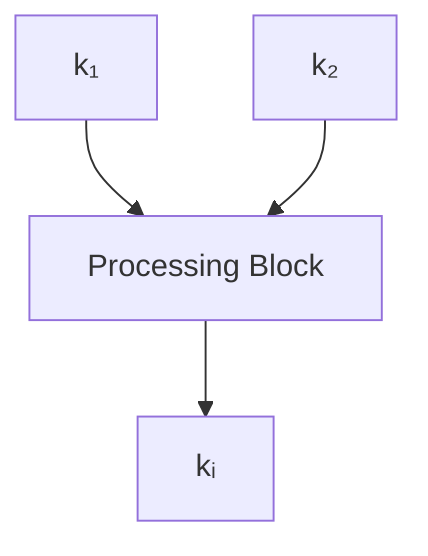
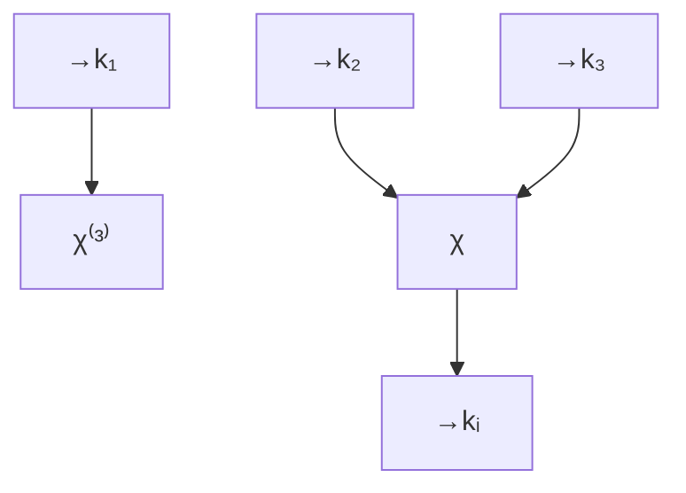
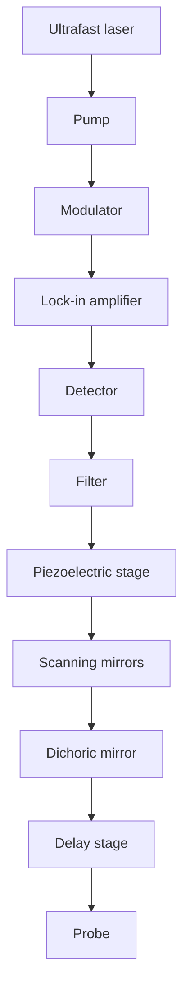

text_image

REVIEWS
IN ADVANCE

Review in Advance first posted online on April 3, 2013. (Changes may still occur before final publication online and in print.)

# Nonlinear Optical Microscopy of Single Nanostructures

Libai Huang1 and Ji-Xin Cheng2

1Radiation Laboratory, University of Notre Dame, Notre Dame, Indiana 46556; email: lhuang2@nd.edu

2Weldon School of Biomedical Engineering, Purdue University, West Lafayette, Indiana 47907; email: jcheng@purdue.edu

Annu. Rev. Mater. Res. 2013. 43:16.1–16.24

The Annual Review of Materials Research is online at matsci.annualreviews.org

This article’s doi: 10.1146/annurev-matsci-071312-121652

Copyright c 2013 by Annual Reviews. All rights reserved

## Keywords

four-wave-mixing microscopy, pump-probe microscopy, harmonic generation microscopy, multiphoton photoluminescence microscopy, nanomaterials, live-cell imaging

## Abstract

We review recent advances in nonlinear optical (NLO) microscopy studies of single nanostructures. NLO signals are intrinsically sensitive to the electronic, vibrational, and structural properties of such nanostructures. Ultrafast excitation allows for mapping of energy relaxation pathways at the single-particle level. The strong nonlinear response of nanostructures makes them highly attractive for applications as novel NLO imaging agents in biological and biomedical research. NLO modalities based on harmonic generation, multiphoton photoluminescence, four-wave mixing, and pump-probe processes are discussed in detail.

## 1. INTRODUCTION

A unifying theme in nanotechnology research is that size, shape, and structure are critical in determining properties (1, 2). However, inhomogeneous distributions of size, shape, and structural properties of nanostructures in as-synthesized samples present a major challenge in unraveling structure-property relationships. A prime example is the case of single-walled carbon nanotubes (SWNTs), in which multiple chiralities of both semiconducting and metallic tube types coexist in as-produced samples. Such inhomogeneity significantly hinders understanding of the intrinsic physical properties of these nanostructures from ensemble measurements. To establish structureproperty relationships in nanostructured materials, single-particle studies are necessary.

Optical microscopy presents a useful and accessible route to visualize and elucidate structureproperty relationships in single nanostructures. Even though individual nanoparticles could be smaller than the diffraction limit, far-field optical microscopy can address individual particles as long as the interparticle distance is large than the optical wavelength. Near-field (3–5) and superresolution (6–8) techniques can further enhance the resolution beyond the diffraction limit. Optical microscopic techniques employing linear optical processes, including fluorescence and scattering as contrast mechanisms, have been extensively applied to study single nanostructures. For instance, fluorescence microscopy has been utilized to investigate single semiconductor quantum dots and to reveal properties that are otherwise hidden in ensemble measurements such as fluorescence intermittency and spectral diffusion (1, 9). Similarly, single-particle absorption and scattering spectroscopy and microscopy have been employed to unravel homogeneous linewidths (10, 11).

More recently, nonlinear optical (NLO) processes (12, 13), in which the dielectric polarization P responds nonlinearly to the electric field E of the incident light, have been developed as the imaging mechanisms for optical microscopy (14–17). Because of the inherent chemical sensitivities these NLO processes provide, many modalities of NLO microscopy have been developed as labelfree alternatives to fluorescence microscopy for biomedical imaging (16–18). NLO excitation and multiphoton interaction provide the additional benefit of inherent 3D resolution and large penetration depth (19). For a comprehensive account of the application of NLO microscopy in biological and biomedical imaging, please see a recent review by Min et al. (17).

In this review, we focus on NLO microscopy modalities applied to single nanostructures. Many nanomaterials exhibit strong optical nonlinearities due to quantum confinement effects and/or strong electronic resonances, which enables the detection of single nanostructures with NLO microscopy (20, 21). This capability provides a means to ultimately remove inhomogeneity and opens attractive avenues for correlating property with structure. Furthermore, ultrafast pulsed laser excitation allows for time-resolved NLO microscopy with subpicosecond time resolution, which can resolve energy relaxation pathways in relation to structure, size, shape, morphology, and the environment. An understanding of these dynamical processes is critical for the realization of applications such as nanostructured solar energy conversion devices (22). Another research area that has recently received intensive attention lies in developing nanostructures as novel NLO probes in biological and biomedical imaging (15, 23). The success of such imaging probes also necessitates a thorough understanding of the NLO responses at the single-structure level.

Overall, NLO microscopy offers a unique platform to investigate single nanostructures with the following key advantages:

1. NLO signals are inherently sensitive to size, shape, and orientation of nanostructures as well as to their electronic and vibrational properties. The high sensitivity of NLO contrast mechanisms makes single-particle or even single-molecule detection possible.

text_image

REVIEWS
ADVANCE
16.2

Huang Cheng

text_image

X^{(1)}
I_0
I < I_0

Absorption

text_image

χ^(1)

Spontaneous emission

flowchart

Three-wave mixing

flowchart

Four-wave mixing  
Figure 1 Examples of linear and nonlinear optical processes. Absorption and spontaneous emission are linear processes, whereas three-wave mixing and four-wave mixing are nonlinear optical processes.

2. Ultrafast laser excitation offers opportunities to study energy relaxation pathways in single nanostructures directly in the time domain. Single-particle sensitivity combined with simultaneous temporal resolution makes NLO microscopy a powerful tool.  
3. Large NLO susceptibility allows various nanostructures to be used as effective optical probes for biological and biomedical imaging. NLO microscopy offers inherent 3D spatial resolution, relatively large optical penetration into tissues with near-infrared (NIR) excitation, and reduced photodamage due to reduced optical interaction with endogenous molecules.

This review discusses applications of NLO microscopy to nanostructured materials with two main emphases: unraveling the intrinsic and extrinsic properties of nanostructures and developing nanostructures as NLO imaging agents. We focus on harmonic generation microscopy, multiphoton photoluminescence (MPL) microscopy, four-wave-mixing (FWM) microscopy, and pump-probe transient absorption microscopy, each of which has been successfully demonstrated on various types of nanostructures. We first provide an overview of the underlying principles for NLO processes and NLO microscopy instrumentation. Advantages of different NLO microscopic methods are discussed in the context of examples from recent experiments. Finally, we conclude by outlining areas important for the future development of NLO microscopy for nanomaterials.

## 2. BASIC PRINCIPLES OF NONLINEAR OPTICAL PROCESSES

Optical measurements can be classified according to their power-law dependence on the external electric field, as depicted in Figure 1 (12, 13). The induced polarization of a material can be expressed as

$$
\begin{array}{l} P = \chi^ {(1)} E + \chi^ {(2)} E ^ {2} \chi^ {(3)} E ^ {3} + \dots = P ^ {(1)} + P _ {\mathrm{NL}}, \\ P _ {\mathrm{NL}} = P ^ {(2)} + P ^ {(3)} + \dots , \\ \end{array}
$$

where E is the applied field and $\chi$ is the optical susceptibility. $P ^ { ( 1 ) }$ is the linear polarization that controls the linear optical response, such as absorption, reflection, spontaneous emission, and scattering in a weak field, as schematically shown in Figure 1. The second-order nonlinearity

www.annualreviews.org • Nonlinear Microscopy of Nanostructures vanishes for bulk materials with inversion symmetry such as metals and elemental semiconductors. Therefore, the lowest-order nonlinear polarization is $P ^ { ( 3 ) }$ for most bulk materials. However, the selection rules of $\chi ^ { ( 2 ) }$ for nanostructures with dimensions smaller than the incident wavelength are strongly modified by the symmetry of their shapes, as is discussed below (24).

text_image

REVIEWS
16.3
ADVANCE

The most common techniques that are connected with $P _ { \mathrm { N L } }$ are multiwave mixing (Figure 1). An $n + { \mathit { 1 } }$ wave-mixing process is directly related to $P ^ { ( n ) }$ , which involves interaction of n laser fields with wave vectors of $\mathbf { \Sigma } _ { \vec { k } _ { 1 } , \vec { k } _ { 2 } \dots \vec { k } _ { n } }$ and frequencies of ω1, $\omega _ { 2 } , \ldots \ldots \omega _ { n } ,$ , which coherently generates an induced signal with wave vector $\vec { k } _ { i }$ and frequency $\omega _ { i } .$ . The generated signal has to satisfy both energy and momentum conservation and can be expressed as

$$
\vec {k} _ {i} = \vec {k} _ {1} \pm \vec {k} _ {2} \pm \dots \pm \vec {k} _ {n}, \quad \omega_ {i} = \omega_ {1} \pm \omega_ {2} \pm \dots \pm \omega_ {n}. \tag {2.}
$$

As indicated by Equation 2, the wave vector $\vec { k } _ { i }$ and frequency $\omega _ { i }$ are linear combinations of the applied wave vectors and frequencies. The choice of signs of wave vectors and frequencies depends on the nature of the NLO processes. $n = 2$ corresponds to three-wave-mixing processes that are related to $P ^ { ( 2 ) }$ , for example, sum frequency generation $( \vec { k } _ { i } = \vec { k } _ { 1 } + \vec { k } _ { 1 } , \omega _ { i } = \omega _ { 1 } + \omega _ { 1 } )$ and second-harmonic generation $( \vec { k } _ { i } = 2 \vec { k } _ { 1 } , \omega _ { i } = 2 \omega _ { 1 } )$ . Techniques such as FWM and third-harmonic generation (THG) $( \vec { k } _ { i } = 3 \vec { k } _ { 1 } , \omega _ { i } = 3 \omega _ { 1 } )$ are directly related to $P ^ { ( 3 ) }$ . The NLO polarizations are negligible in the weak field limit. In a strong applied field, however, higher-order polarizations become more prominent because of their nonlinear dependence on the field amplitude. Ultrafast lasers can provide the intense electric fields that allow for the detection of $P _ { \mathrm { N L } }$ .

In the past two decades, rapid advances in ultrafast laser technology have resulted in rapid growth in the field of NLO spectroscopy. A number of experimental techniques along with their theoretical frameworks have been developed (13, 25). These techniques involve pulse sequences and experimental conditions resulting in different combinations of the elements in Equation 2. For a more thorough description of the theory of NLO spectroscopy, readers are referred to Reference 13.

The NLO processes that have been successfully demonstrated as imaging contrast mechanisms for nanostructured materials are MPL (23, 26), SHG (27–33), THG (23, 34–36), FWM (21, 34, 37–44), and transient absorption (10, 45–52). We provide a brief survey of the NLO processes that are relevant for the microscopy methods reviewed here. Energy diagrams of these processes are shown in Figure 2.

Harmonic generation such as SHG and THG provides the most straightforward contrast mechanism for NLO microscopy. In harmonic generation spectroscopy, all pulses are of the same frequency (degenerate) and arrive at the sample simultaneously. Only one pump beam is involved in such experiments, and the wave vector and frequency of the signal are given by $\hat { \vec { k } } _ { i } = n \vec { k } _ { 1 }$ and $\omega _ { i } =$ nω1 $( n \ge 2 )$ , respectively. The excitation can promote electrons to either a real state or a virtual state. MPL utilizes an experimental setup similar to that of harmonic generation spectroscopy. However, multiphoton absorption has to promote electrons to a real electronic state, and the population can consequently relax to an optically allowed state that can emit photons. The emitting state usually lies lower in energy than the initially absorbing state, resulting in a detected signal with $\omega _ { i } < n \omega _ { 1 }$ . The difference between harmonic generation and multiphoton excitation fluorescence is illustrated in Figure 2.

FWM spectroscopy is a commonly used spectroscopic method that is related to $\chi ^ { ( 3 ) }$ , which includes a large number of configurations, such as three-pulse photon echo, transient grating, and coherent anti-Stokes Raman scattering (CARS) spectroscopy (13, 53–55). The magnitude of $\chi ^ { ( 3 ) }$ and hence the FWM signal strongly depend on resonance conditions of both the incident and induced frequencies. In general, $\chi ^ { ( 3 ) }$ is enhanced when a single frequency or a combination of the incident and induced frequencies is in resonance with the vibrational and electronic states of

text_image

REVIEWS
ADVANCE
16.4

Huang Cheng

text_image

ωpu
ωpu
ωSHG

SHG

text_image

ωpu
ωS
ωpu
ωCARS

CARS

text_image

ωpu
ωpr

Pump probe

text_image

ωpu
ωpu
ωTLP

TPL

text_image

ω₁
ω₂
ω₁
ω_FWM

Two-beam FWM

text_image

ωpr
ωpu

Pump probe  
Figure 2  
Energy diagrams of the nonlinear optical processes discussed in text: second-harmonic generation (SHG), coherent anti-Stokes Raman scattering $( \mathrm { C A R S } ) ,$ pump probe, two-photon photoluminescence (TPL), and four-wave mixing (FWM). Solid gray lines represent electronic and vibrational states of molecules. Dashed gray lines are virtual states. For the FWM diagram, if any of the dashed lines become solid, the resonance condition is met. The two pump-probe diagrams are for conditions of ground-state depletion and stimulated emission $( t o p r i g b t )$ and excited-state absorption (bottom right).

the materials (21). A special case of FWM that has been widely used in biological and biomedical imaging is CARS, in which two beams, with a frequency difference equal to a vibrational transition energy, are used to excite the vibration (38, 55–58). The first field is the pump at a frequency of $\omega _ { \mathrm { p u } } ,$ and the second is the Stokes field at a frequency of ωS. A second interaction with the pump frequency leads to a signal that radiates at the anti-Stokes frequency of $\omega _ { \mathrm { a s } } = 2 \omega _ { \mathrm { p u } } - \omega _ { \mathrm { S } }$ , and the wave vector of the signal is given by $\vec { k } _ { i } = 2 \vec { k } _ { \mathrm { p u } } - \vec { k } _ { \mathrm { S } }$ . The CARS signal is vibrationally enhanced when $\omega _ { \mathrm { p u } } - \omega _ { \mathrm { S } }$ is close to a characteristic vibrational frequency of the molecules or the material. This enhancement is because the beating (difference frequency) between the pump and probe beams drives the vibrational oscillators coherently in phase (14).

In a two-beam FWM experiment, a CARS-like configuration is adopted as shown in Figure 2. The FWM signal can be electronically enhanced, and electronically enhanced FWM has had more widespread success than CARS when the former has been applied to single nanostructures (21). In two-beam FWM experiments, two excitation frequencies, ω1 (the equivalent of the pump) and ω2 (the equivalent of the Stokes), are employed, and the signal is given by $\vec { k } _ { i } = 2 \vec { k } _ { 1 } - \vec { k } _ { 2 }$ and $\omega _ { i } = 2 \omega _ { 1 } - \omega _ { 2 }$ . In a more generic FWM experiment, three beams (two pumps and one Stokes) of different frequencies could be used. The FWM signal is electronically enhanced when one of the beams or a combination of beams is resonant with the electronic transitions of the material. In other words, if any of the dashed lines become solid in the FWM diagram in Figure 2, such a resonance condition is met.

Pump-probe spectroscopy, also known as transient absorption spectroscopy, is one of the most widely used nonlinear techniques in probing excited dynamics, which is also related to the thirdorder nonlinearity $\chi ^ { ( 3 ) } \ : ( 5 9 , 6 0 )$ . In such experiments, a laser pulse [pump $( \omega _ { \mathrm { p u } } ) ]$ places the system into the excited state; a second delayed pulse [probe (ωpr)] is used to monitor the population of

www.annualreviews.org • Nonlinear Microscopy of Nanostructures a particular excited electronic state. The signal is radiated collinear to the probe field, so the wave vector matching condition is $\vec { k } _ { i } = \vec { k } _ { \mathrm { p u } } + \vec { k } _ { \mathrm { p r } } - \vec { k } _ { \mathrm { p u } } .$ . The system interacts with the pump field twice, and the third interaction is with the probe (Figure 2). Pump-probe experiments measure pump-induced differential changes in the probe intensity as given by I $\begin{array} { r } { \dot { \frac { \Delta I } { I } } = \frac { I _ { \mathrm { p u m p } - \mathrm { o n } } - I _ { \mathrm { p u m p } - \mathrm { o f f } } } { I _ { \mathrm { p u m p } - \mathrm { o f f } } } } \end{array}$

text_image

REVIEWS
16.5
ADVANCE

The pump-probe signal directly measures population changes as given by $\begin{array} { r } { \frac { \Delta I } { I } \propto ( \Delta n _ { f } - \Delta n _ { i } ) } \end{array}$ , where ni and nf are the occupations of the initial and final states probed, respectively. The decay of the signal can be used to determine the depopulation dynamics of the excited states. Three types of signals can be observed in a pump-probe experiment: ground-state bleaching, stimulated emission, and excited-state absorption. The top pump-probe diagram in Figure 2 corresponds to ground-state depletion and a stimulated emission signal, in which the intensity of the probe is enhanced by the pump excitation. The bottom pump-probe diagram in Figure 2 reflects excitedstate absorption, in which the intensity of the probe beam is reduced by the absorption of the excited state created by the pump. The contribution of these different types of signal depends strongly on the pump and probe frequencies. Stimulated emission microscopy (61), excited-state absorption microscopy, and ground-state depletion microscopy (62) are essentially different variations of pump-probe microscopy.

## 3. NONLINEAR OPTICAL MICROSCOPY INSTRUMENTATION AND SIGNAL-TO-NOISE CONSIDERATIONS

Common components for NLO microscopes are ultrafast laser sources and optical microscopes. To incorporate NLO spectroscopy into optical microscopy, additional considerations have to be taken into account. First, optical microscopic techniques usually employ high-numerical-aperture objectives or scanning near-field probes. In these cases, the illumination cannot be described by a plane wave, and strong field gradients, together with a nonvanishing longitudinal field component, can be present (63, 64). Another condition is that the laser beams are usually collinear for NLO microscopy, as opposed to coming in from different angles in the case of ensemble NLO spectroscopy. These conditions affect both the phase-matching condition and the direction of the detected signals. Under the tightly focusing condition for microscopy, the large cone angle of the k vectors of the excitation beams relaxes the phase-matching condition. k vector–specific collection employed in NLO spectroscopy generally does not apply in NLO microscopy, and signals are usually collected in the forward direction with an objective/condenser or in the backward direction (epi) with the same focusing objective. Spectral separation is generally employed to separate the signal from scattered excitations.

Figure 3 schematically shows the construction of an NLO microscope. Harmonic generation microscopy and MPL microscopy have the simplest configuration because only one laser beam is involved, whereas for FWM, CARS, and pump-probe microscopy, two or more laser beams are required. Figure 3a shows a schematic drawing of a typical two-beam NLO microscopy setup. This configuration can be easily adapted for pump-probe, CARS, and two-beam FWM microscopy. For pump-probe microscopy, because the detected signal is at the same energy as the probe, a heterodyne detection scheme with modulation of the pump beam (or both the pump and probe beams) is necessary to extract the signal by a lock-in amplifier. For FWM microscopy, because the energy of the detected signal can be distinguished from that of the excitation beams, such modulation is not necessary. When more than one laser beam is used, synchronization between the pulses is required. Such synchronization can be achieved by using separate pulse trains derived from two synchronized lasers (38) or from a synchronously pumped optical parametric oscillator system (65). If vibrational information is desired, picosecond light sources are preferred

text_image

REVIEWS
ADVANCE
16.6

Huang Cheng

a  

flowchart

b  

text_image

ω₁
ω₂
ω₃
Dichoric mirror
To microscope
Dichoric mirror
Delay stages

Time-resolved FWM microscopy

c  

text_image

Pump
τ
Probe
Time

line chart

| Time | ω₁     | ω₂     | ω₃     |
|------|--------|--------|--------|
| Left | Peak   | Peak   | Peak   |
| τ₁   | Low    | Low    | Low    |
| τ₂   | High   | High   | High   |

Figure 3

Schematic drawings of experimental setups. (a) A pump-probe microscope that can be easily modified into a coherent anti-Stokes Raman scattering (CARS) microscope or a four-wave-mixing (FWM) microscope. (b) Arrangement for a time-resolved FWM microscope. (c) Pulse sequence for a pump-probe experiment (top) and a time-resolved FWM experiment (bottom).

because of superior spectral resolution. If temporal resolution is important, femtosecond laser sources are better suited.

For all far-field imaging modalities, images can be acquired by either raster scanning the sample with a piezo stage or scanning the beams with scanning mirrors. Beam scanning is preferred for high-speed imaging because of much shorter pixel dwell times. Near-field configurations of NLO

www.annualreviews.org • Nonlinear Microscopy of Nanostructures microscopy have also been demonstrated to achieve subdiffraction-limit spatial resolution (27, 29). In near-field experiments, a subdiffraction-limit near-field aperture is generally used to collect the signal. In this case, images can be constructed by either tip scanning or sample scanning. The disadvantage of the near-field configuration lies in the orders-of-magnitude-poorer collection efficiency compared with that afforded by far-field microscopy.

text_image

REVIEWS
16.7
ADVANCE

With pulsed laser excitation, temporal resolution can be easily introduced to study fast dynamics. Two different methods are available for obtaining time resolution. One is to employ a motorized optical delay line. This method is straightforward and offers temporal resolution that is limited only by the pulse width of the laser pulses. The other route is through continually changing the repetition of one beam relative to another beam or beams. This second method requires no moving parts and allows for faster data acquisition, but the time resolution is limited to a few picoseconds because of the electronic jitter between the pulses. As shown in Figure 3, for pump-probe microscopy, the temporal resolution is achieved through the delay introduced between the pump and probe beams. For time-resolved FWM microscopy, the pump beam and the Stokes beam are generally overlapped temporally $( \tau _ { 1 } = 0$ in Figure 3), whereas the delay is scanned between the first two beams and the second pump beam. Such FWM experiments probe relaxation of the polarization induced by the first two beams (66). If another delay is introduced, 2D spectroscopy can be achieved to probe coherence between different states (67).

Implementing single-particle NLO microscopy also requires improvement in single-to-noise ratio (S/N) over that found in traditional spectroscopy so that a response from a single nanostructure is resolvable. There are two main sources of noise in these experiments: laser fluctuation noise and electronic noise from the detection system (the detector and lock-in amplifier, for instance). Noise due to laser intensity fluctuation can be effectively eliminated by using heterodyne lock-in detection with megahertz modulation (62, 68, 69), whereby the intensity of the excitation beam (or additional local oscillator) is modulated by an acoustic-optical modulator. Subsequently, a lock-in amplifier referenced to this modulation frequency can sensitively extract the induced signal. The fluctuation of laser intensity (1/f noise) usually occurs at low frequency of dc to 10 kHz. When f is in the megahertz range, the laser intensity noise nears the quantum shot noise limit, which is always present because of the Poissonian distribution of the photon counts at the detector (18). The pixel dwell time should be significantly longer than the modulation period to allow for reliable demodulation for each pixel. Such a modulation scheme has been successfully applied to pump-probe microscopy and stimulated Raman loss and gain microscopy, and shot noise–limited detection has been achieved (18, 62).

The electronic noise from the detection system is somewhat harder to eliminate. A recent work by Slipchenko et al. (70) showed that, although the shot noise limit can be reached by megahertz modulation in stimulated Raman scattering (SRS) microscopy at high laser power, the S/N at low laser power is actually limited by the electronic noise of the lock-in amplifier’s input preamplifier. Slipchenko et al. developed a tuned amplifier for frequency-selective amplification of the modulated signal in heterodyne-detected NLO microscopy (70). As shown in Figure 4, they improved S/N by an order of magnitude compared with that found in conventional lock-in detection. Notably, detailed modeling of the detector response was recently developed to maximize S/N. Binomial-counting and photon-averaging techniques were mathematically adjoined to maximize S/N in SHG microscopy images by using a photomultiplier (71, 72).

Further improvement in detection sensitivity can be achieved by employing surface plasmon enhancement (73, 74). Wang et al. (74) described a wide-field FWM microscope utilizing surface plasmon polariton excitation in a gold film to achieve surface-sensitive imaging conditions. The surface plasmon increased the FWM efficiency by two orders of magnitude relative to the excitation efficiency of the evanescent fields at a bare glass surface. Such a FWM microscope

text_image

REVIEWS
IN ADVANCE
16.8

Huang Cheng

  
Figure 4 Tunable amplifier (TAMP) significantly improves the signal-to-noise ratio (S/N) in epidetected stimulated Raman loss (epi-SRL) imaging of spinal cord white matter. (Left) Ex vivo epi-SRL image of axonal myelin by lock-in amplifier (LIA) detection. (Right) Epi-SRL image of the same sample by TAMP detection. Below the two images are the intensity profiles along the dashed lines shown in the images. Imaging speed is 2 μs pixel−1. Pump and Stokes wavelengths were set to 830 and 1,090 nm, respectively.

was capable of imaging individual carbon nanotubes and nanoclusters of neocyanine molecules (74).

## 4. APPLICATION OF NONLINEAR OPTICAL MICROSCOPYMODALITIES TO SINGLE NANOSTRUCTURES

## 4.1. Harmonic Generation Microscopy

As a second-order NLO effect, SHG is forbidden under the electric-dipole approximation in bulk materials with inversion symmetry. At a surface or interface, however, the inversion symmetry is broken (75, 76). SHG spectroscopy was first developed as a surface- and interface-sensitive technique (75, 76). When applied to subwavelength nanostructures, however, the SHG signal not only is sensitive to the symmetry of the materials but also is strongly dependent on the symmetry of their shapes, surfaces, and orientation. Dadap et al. (77) presented an electromagnetic theory suggesting that detection of SHG from spherical particles of centrosymmetric materials was possible. Finazzi et al. (24) later discussed in detail the selection rules for SHG in isolated nanoparticles on the basis of angular momentum and parity conservation laws.

Such selection rules lead to a distinct advantage of SHG microscopy when applied to nanostructures: The signal is sensitive to the size, shape, and orientation of the nanostructures. By using the crystal orientation dependence of the SHG signal, the in situ 3D crystal orientation of single nanoparticles was determined from defocused SHG images (78). As shown in Figure 5, Bautista

www.annualreviews.org • Nonlinear Microscopy of Nanostructures et al. (33) further enhanced this capability by using cylindrical vector beams that are extremely sensitive to the 3D orientation and nanoscale morphology of metal nanoparticles. Also, the nonlinear dependence of SHG signals on field strength $( S _ { \mathrm { { S H G } } } \propto I ^ { 2 } )$ serves as a very useful probe for local field enhancement effects in metallic nanostructures (29, 79).

text_image

REVIEWS
16.9
ADVANCE

a  

text_image

C1 C2 C3
C4 C5
C6 C7
1 µm

b  

c  

d  
Azimuthal  

natural_image

Microscopic image showing 10 circular structures with blue circular markers, scale bar indicates 1 μm (no text or symbols present)

e  
Radial  

natural_image

Microscopic image showing red fluorescent spots with blue circular markers, scale bar indicates 1 μm (no text or symbols present)

Experiments

f  

natural_image

3D mesh model of a curved orange object with x, y, z axes labeled (no text or symbols on the object itself)

g  
Azimuthal  

natural_image

Thermal or intensity map image showing two bright spots with a blue circle and scale bar labeled 500 nm, no readable text or symbols beyond labels.

h  
Radial  

natural_image

Thermal or intensity map image showing a bright central region with concentric rings, scale bar labeled 500 nm (no text or symbols beyond scale and label)

Simulations  
Figure 5  
(a) Top-view scanning electron microscopy (SEM) image of a region in a fabricated array of gold nanocones. $^ { ( b , c ) }$ Oblique SEM images of bent nanocones (b) C1 and (c) C6. (d,e) Second-harmonic generation (SHG) images of the same region using focused (d ) azimuthally polarized and (e) radially polarized beams. The triangle mesh used for the bent nanocone is shown in pane $f . \left( g , b \right)$ Calculated far-field SHG images of a bent nanocone using focused ( g) azimuthally polarized and (h) radially polarized beams. The calculated images are separately normalized to the incident-beam amplitude, and their maximum intensity values are shown. For clarity, the locations of the nanocones are marked with blue circles in panels d, e, g, and h. Adapted from Reference 33 with permission. Copyright 2012, American Chemical Society.

text_image

REVIEWS
IN ADVANCE
16.10

Strong SHG signals have been observed in many types of single inorganic nanostructures, including ZnO nanowires (80, 81), GaN nanowires (30), $\mathrm { K N b } { \mathrm { O } } _ { 3 }$ nanowires (20), noble metallic nanoparticles (32, 33, 82, 83), nanocrystals [e.g., $\mathrm { F e } ( \mathrm { I O } _ { 3 } ) { \div }$ , $\mathrm { K T i O P O } _ { 4 }$ , BiTiO , MnPS ] (84–87), and core/shell CdTe/CdS quantum dots (31). These experiments allow one to determine the absolute magnitudes of $\chi ^ { ( 2 ) }$ at the single-nanostructure level and to study effects that are not observable at the ensemble level, for instance, the spatial modulation of the SHG signal in single ZnO nanorods due to the coupling of fundamental optical field with standing-wave-resonator modes of ZnO structures (80).

THG microscopy of single nanoparticles has also been demonstrated. In contrast to $\chi ^ { ( 2 ) } , \chi ^ { ( 3 ) }$ is allowed in all media. However, under microscopy conditions, the THG signal generated from

Huang Cheng

a homogeneous medium vanishes due to the Gouy phase shift of the excitation field across the focus (88). As a result, THG microscopy is sensitive to interfaces and has been used to image the interface of a transparent specimen (89, 90).

Because of the high-order nonlinear dependence on field intensity of the THG signal (STHG I 3), THG, like SHG, can be employed as a sensitive probe for local field enhancement in plasmonic nanostructures. For example, Lippitz et al. (91) explored the strength of the THG signal of single gold particles in a confocal microscope, and Hentschel et al. (36) recently utilized the THG signal as means of characterizing field enhancement of plasmonic dimer nanoantennae. As expected, the THG signal was strongly dependent on the shape and size of the antennae as well as on the gap between them (36). Semiconducting nanomaterials with large $\chi ^ { ( 3 ) }$ also exhibit strong THG signals. For instance, Jung et al. (35) reported that a strong THG signal polarized along the long axis in silicon nanowires as small as 5 nm in diameter due to the large $\chi ^ { ( 3 ) } \left( \sim 1 0 ^ { - 1 0 } \mathrm { e s u } \right)$ . This value is 1–2 orders of magnitude higher than that observed in materials such as crystalline $\mathrm { C s S , T i O _ { 2 } }$ , and gold (21).

Harmonic generation microscopy offers relatively large optical penetration into tissue when one is using NIR excitation, which is extremely useful for biomedical imaging of live organisms. This advantage, coupled with the presence of nanostructures that exhibit a narrow emission profile, results in a high S/N with weak autofluorescence background. For example, Pantazis et al. (87) characterized SHG signals from $\mathrm { B a T i O } _ { 3 }$ nanocrystals probes for live-cell and in vivo imaging without photobleaching or blinking. More recently, Staedler et al. (92) surveyed the properties of five nanomaterials $( \mathrm { K N b O _ { 3 } } , \mathrm { L i N b O _ { 3 } } , \mathrm { B a T i O } _ { 3 }$ 3, potassium titanyl phosphate, and $Z _ { \mathrm { n O ) , } }$ , describing their properties as imaging agents for harmonic generation microscopy.

## 4.2. Multiphoton Photoluminescence Microscopy

MPL provides rich information on the electronic structure of individual nanostructures due to selection rules different from those of one-photon absorption. For example, two-photon excitation spectroscopy of individual SWNTs resolved the excitonic nature of semiconducting SWNTs and revealed binding energies of 400 meV for semiconducting SWNTs with 0.8-nm diameter. The results demonstrate the dominant role of many-body interactions in the excited-state properties of 1D systems (93, 94).

In addition, MPL microscopy has highly promising applications in biological and biomedical imaging (19). Two-photon photoluminescence (2PL) and three-photon photoluminescence (3PL) from gold nanostructures have been extensively explored for application in multiphoton microscopy (95). Gold nanorods (96, 97), gold nanoshells (98), and gold nanocages (23) are particularly well suited for use as MPL-based biological imaging agents because the longitudinal plasmon resonance peaks shift to NIR wavelengths and because of the large penetration depth at NIR wavelengths. Figure 6 shows such an example: 2PL and 3PL of gold and silver nanocages are applied to live-cell and tissue imaging (23). The mechanism and characteristics of MPL from gold nanorods have been investigated by both far-field microscopy (96) and near-field microscopy (29, 97). A broad luminescence emission from 400 to 650 nm has been observed in both cases (96, 97), corresponding to electron-hole recombination near the X and L symmetry points of the Brillouin zone. Wang et al. (96) also investigated the relationship between 3PL and the longitudinal plasmon resonance mode of gold nanorods.

## 4.3. Four-Wave-Mixing Microscopy

The recent application of the coherent FWM signal as a contrast mechanism in microscopy has opened up new opportunities for investigating the nonlinear properties of nanostructures

www.annualreviews.org • Nonlinear Microscopy of Nanostructures

text_image

REVIEWS
16.11
ADVANCE

a 2PL, 0 s  

natural_image

Microscopic view of cellular or tissue structure with red fluorescent spots, scale bar indicates 10 mm (no text or symbols present)

c 2PL, 90 s  

natural_image

Microscopic view of cellular structures with a green oval and scale bar indicating 10 mm (no text or symbols present)

e 3PL  

natural_image

Microscopic image showing two fluorescently labeled cells within white circular regions, scale bar indicates 10 mm (no text or symbols present)

b 3PL, 0 s  

natural_image

Microscopic image showing cellular structures with red and black markers, scale bar indicates 10 mm (no text or symbols present)

d 3PL, 90 s  

natural_image

Microscopic image showing cellular structures with red and black markers, scale bar indicates 10 mm (no text or symbols present)

f 2PL  

natural_image

Microscopic image showing two highlighted cellular structures with a 10 mm scale bar, no text or symbols present.

Figure 6

Comparison of two-photon photoluminescence (2PL) and three-photon photoluminescence (3PL) imaging of Au/Ag nanocages (49% Ag/51% Au) in (a–d ) KB cells and $( e , f )$ liver tissues. (a) 2PL image and (b) 3PL image of Au/Ag nanocages (red ) in KB cells before laser scanning. (c) Image of the same cell as in panel a after scanning with a 760-nm femtosecond laser for 90 s. Laser power after objective was 1.9 mW. After scanning, membrane blebbing (arrows) and compromised membrane integrity indicated by ethidium bromide labeling ( green) were observed. (d ) 3PL image of the same cell as in panel b after scanning with a 1,290-nm femtosecond laser for 90 s. Laser power after objective was 4.0 mW. No morphological change or plasma membrane damage was observed. (e) 3PL imaging of Au/Ag nanocages (white circles) in liver tissue. ( f ) 2PL imaging in the same area as in panel e. The white arrow highlights anomalously strong autofluorescence from the tissue. Laser power after objective was $7 \mathrm { m } \bar { \mathrm { W } } .$

(21). Whereas vibrationally resonant FWM techniques such as CARS are attractive for label-free biological and biomedical imaging (56, 58, 99), electronically resonant FWM is useful for probing the electronic structure and resonant optical nonlinearity of individual nanostructures (21). Timeresolved FWM signals provide opportunities to probe dynamical processes related to electronic and vibration coherence (13, 21, 42, 67). For the nanostructures imaged with FWM techniques so far, the electronic FWM signal is stronger than the vibrational CARS signal, probably because of strong electronic resonances (21).

FWM microscopy has been demonstrated for both metallic nanostructures and semiconducting nanostructures, including gold nanoparticles and nanorods, silicon nanowires, semiconducting quantum dots, metal oxide nanoparticles, graphene, and carbon nanotubes (39–42, 100–103). For example, Jung et al. (35) reported FWM experiments on individual silicon nanowires as small as 5 nm in diameter. Using polarization-dependent FWM microscopy, Jung et al. (35) observed a much stronger FWM response along the long axis of the nanowires than that observed in similarly sized silver nanoparticles demonstrating an order-of-magnitude-larger $\chi ^ { ( 3 ) }$ value.

text_image

REVIEWS
ADVANCE
16.12

Huang Cheng

natural_image

Microscopic image showing a red fluorescent structure against a dark background, with a 10 μm scale bar (no text or symbols beyond labels)

natural_image

Microscopic image showing red fluorescent spots on a dark background, with a white square highlighting a region and an arrow indicating direction (no text or symbols)

line chart

| Angle (θ) | FWM intensity (a.u.) |
| --------- | -------------------- |
| -60       | 0.0                  |
| -50       | 0.1                  |
| -40       | 0.2                  |
| -30       | 0.5                  |
| -20       | 0.8                  |
| -10       | 0.9                  |
| 0         | 1.0                  |
| 10        | 0.9                  |
| 20        | 0.7                  |
| 30        | 0.5                  |
| 40        | 0.3                  |
| 50        | 0.1                  |
| 60        | 0.0                  |

d  

text_image

3.9 nm
2.4 nm

Figure 7  
Four-wave-mixing (FWM) image of an individual carbon nanotube when the polarization of the incident beam is (a) parallel and (b) perpendicular to the long axis of the nanotube. (c) FWM intensity as a function of the angle between the beam polarization and the long axis of the carbon nanotube. (d ) Atomic force microscopy image of the area marked by the white rectangle in panel b. Carbon nanotube diameters as determined from topographic analysis are indicated. Adapted from Reference 41 with permission. Copyright 2009, American Chemical Society.

Carbon nanostructures such as graphene and carbon nanotubes exhibit extremely large thirdorder nonlinearity, with $\chi ^ { ( 3 ) }$ values reported from $1 0 ^ { - 9 }$ to $1 0 ^ { - 6 }$ esu (104, 105). This larger $\chi ^ { ( 3 ) }$ allows for the detection of single carbon nanostructures with FWM microscopy. As illustrated in Figure 7, Kim et al. (41) utilized excitation beams that were resonant with electronic transitions of the nanotube and detected the FWM response at the anti-Stokes frequency of the G mode $( \sim 1 , 6 0 0 ~ \mathrm { c m } ^ { - 1 } )$ . Metallic SWNTs had the strongest FWM signal, and an electronic response dominated the vibrational response (41). The FWM signal was strongly enhanced by the electronic polarizability along the long axis of the SWNT, similar to what was observed in silicon nanowires (35, 41). Hendry et al. (103) demonstrated FWM microscopy of single-layer and fewlayer graphene. The corresponding third-order optical susceptibility $\chi ^ { ( 3 ) }$ was extremely large, on the order of $1 0 ^ { - 7 }$ esu, and was only weakly dependent on wavelength in the NIR frequency range. This value is remarkable because, in comparison, a typical highly nonlinear semiconductor has a

www.annualreviews.org • Nonlinear Microscopy of Nanostructures $\chi ^ { ( 3 ) }$ value on the order of $1 0 ^ { - 1 3 } – 1 0 ^ { - 1 1 }$ esu. The large optical nonlinearity observed in graphene was attributed to interband electron transitions (103).

text_image

REVIEWS
16.13
ADVANCE

The ability to probe excited-state dynamics, especially electronic dephasing, of single nanostructures further solidifies the strength of FWM microscopy in studying nanostructured materials (102, 106, 107). Myllyperkio et al. (42) presented femtosecond FWM measurements of chiralityassigned individual suspended SWNTs. An average electronic dephasing time of 40–45 fs was determined, consistent with theoretical prediction. More recently, Aeschlimann et al. (67) introduced coherent 2D nanoscopy, whereby 2D FWM microscopy was coupled to photoemission microscopy. In this way, nonlinear quantum mechanical response functions were imaged beyond the optical diffraction limit, which allowed direct imaging of nanoscale coherence. Local nanospectra from a corrugated silver surface were recorded and observed with subwavelength 2D line-shape variations (67). The 2D FWM microscopy capability opens a new window for exploring ultrafast coherence in single nanostructures.

In addition to unraveling the electronic structure of single nanostructures, FWM microscopy can probe the interaction between nanostructures. As an example, Danckwerts & Novotny (39) reported elegant near-field NLO FWM microscopy of coupled gold nanoparticles. One particle was mounted on a near-field scanning tip, whereas the other particle was deposited on a substrate. This configuration allowed for precise control of the interparticle distance. By decreasing the interparticle distance from a large separation to touching contact, the FWM yield increased by four orders of magnitude. The reason for this dramatic enhancement lies in the shift of the localized plasmon resonance to infrared wavelengths as the dimer is formed, making one of the input wavelengths doubly resonant. More recently, Kasprzak et al. (44) developed spectrally resolved FWM microscopy to image long-range coherent coupling between individual localized excitons in 5-nm GaAs/AlGaAs quantum wells. These approaches provide unique opportunities for probing the coupling between nanostructures.

The strong FWM signal from the nanostructures discussed above has enabled biological and biomedical imaging applications (40, 108). The FWM signal of silicon nanowires is brighter than the nonresonant FWM contribution from the biological material itself, allowing for the identification of silicon nanowire probes in live cells and tissues (108). The FWM intensity from gold nanorods is ∼2,000 times stronger than the resonant CARS signal from intracellular lipid bodies, making gold nanorods attractive NLO imaging probes (40).

## 4.4. Pump-Probe Microscopy

Pump-probe spectroscopy (also known as transient absorption spectroscopy) has been extensively applied to study excited-state dynamics of nanostructures and has significantly improved our understanding of energy relaxation processes in these objects (59, 60). The time-resolved pump-probe signal reflects population dynamics in different excited states. This is different from the dynamical information acquired from time-resolved FWM experiments that correspond to vibrational and electronic coherence. Recent developments in probing population dynamics at the single-particle level with pump-probe microscopy are significant because such experiments ultimately remove the inhomogeneous distribution of size and provide insights into how structure and local environment modulate energy relaxation pathways (47, 52, 109–113).

Traditionally, dynamical measurements on single nanostructures are based on photoluminescence (PL). Single-particle pump-probe microscopy provides two key advantages over PL-based methods. First, the former method has a time resolution of 200 fs. This fast time resolution is important because many critical events such as electron-phonon coupling occur on such subpicosecond timescales (60). Second, the measured signal is based on absorption,

text_image

REVIEWS
ADVANCE
16.14

Huang Cheng

which means that samples with low or even zero fluorescence quantum yield such as metallic nanoparticles, metallic SWNTs, and graphene can be studied. Alternatives to pump-probe microscopy include femtosecond Kerr-gated microscopy [demonstrated by Gundlach & Piotrowiak (114)], which provides a time resolution of ∼100 fs for PL dynamics in single CdSe nanobelts. Time-resolved SHG has also been demonstrated with a pump-probe configuration. In such experiments, the pump-induced changes in SHG signal were monitored (81). However, these alternative approaches are generally not as widely applicable as pump-probe microscopy.

Pump-probe microscopy experiments on single nanostructures were first performed on single gold nanoparticles by van Dijk et al. (109), who used a birefringent crystal to create perpendicularly polarized signal and reference beams in a common path interferometer, which provided shot noise–limited detection. Later, researchers demonstrated a configuration based on a more straightforward optical pump-probe setup, which also achieved shot noise–limited detection by utilizing megahertz modulation (45–47, 52, 61, 110–113). Since then, pump-probe microscopy has been applied to study metallic nanostructures of various sizes and shapes (46, 110–112), semiconductor nanowires (113), metal oxide nanostructures (115), carbon nanotubes (47, 51, 52), and graphene (48, 50, 116). Near-field pump-probe microscopy has also been demonstrated (117–119). Pump-probe microscopy and its variations (stimulated emission microscopy, ground-state depletion microscopy, and excited-state absorption microscopy) have also been applied to biological and biomedical imaging (45, 61, 120).

Pump-probe microscopy of single nanostructures has revealed energy relaxation pathways that are obscured by ensemble averaging. For example, van Dijk et al. (109) examined the response of single gold nanoparticles following ultrafast excitation. Information about damping of the vibrational modes cannot be extracted from ensemble measurements because differently sized particles have different damping frequencies. Observed dynamics of a single gold nanoparticle showed that the vibrational lifetimes of the single nanoparticle were four to five times longer than the decay for an ensemble (109). Variations in exciton dynamics at the single-particle level have also been resolved in semiconducting nanostructures. Lo et al. (113) reported transient absorption microscopy of single CdTe nanowires and found that the time constants vary for different wires due to differences in the energetics and/or density of surface trap sites. Mehl et al. (115) reported pump-probe microscopy of individual needle-shaped ZnO rods to characterize spatial differences in dynamical behavior. Dramatically different recombination dynamics were observed in the narrow tips compared with dynamics in the interior due to different recombination mechanisms (115).

Pump-probe microscopy [or transient absorption microscopy (TAM)] has been developed as a very useful tool in unraveling the intrinsic photophysical properties of SWNTs. Understanding of the intrinsic optical properties of SWNTs has been significantly hindered by the distribution of semiconducting and metallic tube types in as-synthesized samples. Using TAM, Jung et al. (47) first imaged single CVD (chemical vapor deposition)-grown SWNTs and surfactant-encapsulated SWNTs. The sign of the transient absorption signal (ground-state depletion and stimulated emission versus excited-state absorption) in combination with the resonance condition was utilized to differentiate metallic SWNTs from semiconducting SWNTs. Consequently, Tong et al. (51) demonstrated that strong transient absorption signals with opposite phases from semiconducting and metallic nanotubes allowed for tracking of the movement of both types of SWNTs inside cells by employing appropriate NIR excitation wavelengths.

Gao et al. (52) presented transient absorption imaging and spectroscopic measurements on chirality-assigned individual SWNTs. As seen in Figure 8, transient absorption spectra of the individual SWNTs were obtained by recording transient absorption images at different probe

www.annualreviews.org • Nonlinear Microscopy of Nanostructures wavelengths. Population dynamics at the $E _ { 1 1 }$ and $E _ { 2 2 }$ transitions were collected for individual SWNTs. For all the semiconducting nanotubes studied, the dynamics show a fast 1-ps decay, which is significantly faster than the previously reported decay times for SWNT suspensions. This fast relaxation is attributed to coupling between the excitons created by the pump laser pulse and the substrate (52).

text_image

REVIEWS
IN-ADVANCE
16.15

a AFM  

text_image

2
3
5
4
1
2 mm
Height (nm)
0
1
2 mm

b 780 nm  

text_image

2 mm
ΔR/R × 10⁶

c 800 nm  

heatmap

| X Position | Y Position | ΔR/R × 10⁶ |
| ---------- | ---------- | ---------- |
| 0          | 0          | -10        |
| 1          | 0          | -8         |
| 2          | 0          | -6         |
| 3          | 0          | -4         |
| 4          | 0          | -2         |
| 5          | 0          | 0          |
| 6          | 0          | 2          |
| 7          | 0          | 4          |
| 8          | 0          | 6          |
| 9          | 0          | 8          |
| 10         | 0          | 10         |
| 11         | 0          | 8          |
| 12         | 0          | 6          |
| 13         | 0          | 4          |
| 14         | 0          | 2          |
| 15         | 0          | 0          |
| 16         | 0          | -2         |
| 17         | 0          | -4         |
| 18         | 0          | -6         |
| 19         | 0          | -8         |
| 20         | 0          | -10        |
| 21         | 0          | -8         |
| 22         | 0          | -6         |
| 23         | 0          | -4         |
| 24         | 0          | -2         |
| 25         | 0          | 0          |
| 26         | 0          | 2          |
| 27         | 0          | 4          |
| 28         | 0          | 6          |
| 29         | 0          | 8          |
| 30         | 0          | 10         |
| 31         | 0          | 8          |
| 32         | 0          | 6          |
| 33         | 0          | 4          |
| 34         | 0          | 2          |
| 35         | 0          | 0          |
| 36         | 0          | -2         |
| 37         | 0          | -4         |
| 38         | 0          | -6         |
| 39         | 0          | -8         |
| 40         | 0          | -10        |
| 41         | 0          | -8         |
| 42         | 0          | -6         |
| 43         | 0          | -4         |
| 44         | 0          | -2         |
| 45         | 0          | 0          |
| 46         | 0          | 2          |
| 47         | 0          | 4          |
| 48         | 0          | 6          |
| 49         | 0          | 8          |
| 50         | 0          | 10         |
| 51         | 0          | 8          |
| 52         | 0          | 6          |
| 53         | 0          | 4          |
| 54         | 0          | 2          |
| 55         | 0          | 0          |
| 56         | 0          | -2         |
| 57         | 0          | -4         |
| 58         | 0          | -6         |
| 59         | 0          | -8         |
| 60         | 0          | -10        |
| 61         | 0          | -8         |
| 62         | 0          | -6         |
| 63         | 0          | -4         |
| 64         | 0          | -2         |
| 65         | 0          | 0          |
| 66         | 0          | 2          |
| 67         | 0          | 4          |
| 68         | 0          | 6          |
| 69         | 0          | 8          |
| 70         | 0          | 10         |
| 71         | 0          | 8          |
| 72         | 0          | 6          |
| 73         | 0          | 4          |
| 74         | 0          | 2          |
| 75         | 0          | 0          |
| Note: The visual scale is inverted based on the color index (ΔR/R × ×10⁶), but the color values are not explicitly labeled. The color scale is estimated based on the color index. The label '2 mm' appears at the bottom left. The color scale is estimated based on the color index.

d 820 nm  

text_image

4
ΔR/R × 10⁶
-1
2 mm

e 840 nm  

text_image

2 mm
ΔR/R × 10⁶
9
-2
-6

f 860 nm  

text_image

ΔR/R × 10⁶
2 mm

g  
Probe energy (eV)  

line chart

| Probe wavelength (nm) | ΔR/R × 10⁶ |
| --------------------- | ---------- |
| 780                   | -10        |
| 810                   | -20        |
| 840                   | 15         |
| 870                   | 10         |
| 900                   | 5          |

h  
Probe energy (eV)  

line chart

| Probe wavelength (nm) | ΔR/R × 10⁶ |
| --------------------- | ---------- |
| 780                   | -5         |
| 810                   | -15        |
| 840                   | 5          |
| 870                   | 10         |
| 900                   | 5          |

i  
Probe energy (eV)  

line chart

| Probe wavelength (nm) | ΔR/R × 10⁶ |
| --------------------- | ---------- |
| 780                   | -5         |
| 810                   | 0          |
| 840                   | 5          |
| 870                   | 6          |
| 900                   | 0          |

Figure 8  
(a) Atomic force microscopy height image of single-walled nanotube $( \mathrm { S W N T } ) \cdot 1 , - 2 , - 3 , - 4 ,$ and -5. (b–f ) Transient absorption microscopy (TAM) images with pump/probe wavelengths of (b) 390/780 nm, (c) 400/800 nm, (d ) 410/820 nm, (e) 420/840 nm, and ( f ) 430/860 nm. All TAM images were collected at a pump-probe delay of 0 ps. The scale of the reflectivity change is different for each TAM image. All scale bars are 2 μm. ( g–i ) Transient reflectivity changes (R/R) at 0-ps pump-probe delay time versus probe wavelength for SWNT-1, -2, and -5. The chiralities of SWNT-1 and -2 are (14, 4) and (13, 6), respectively. PA denotes photoinduced absorption, and PB denotes photoinduced bleach.

text_image

REVIEWS
IN ADVANCE
16.16

Huang Cheng

Pump-probe mapping of spatially dependent carrier dynamics allows for close examination of the interaction between the nanostructures and the environment. For example, pump-probe microscopy of monolayer CVD-grown graphene suspended over micrometer-sized trenches as well as supported graphene on a SiO2 substrate was employed to investigate the role of substrate on charge carrier cooling. At a given excitation energy, the dynamics for suspended graphene are much slower than those for substrate-supported graphene, due to the presence of additional cooling channels provided by the surface optical phonon of the substrate (50). Another example is the recent experiment of combining single-particle pump-probe microscopy with optical trapping to study the role of the environment in acoustic vibrations of single gold nanospheres and nanorods (116). Significant particle-to-particle variation in damping times was observed (116). These experiments demonstrate the opportunities for utilizing pump-probe microscopy in studying both intrinsic and extrinsic energy dissipation mechanisms in nanomaterials.

Pump-probe microscopy also provides a noncontact and noninvasive means to directly image carrier transport. By varying the size of pump and probe spot sizes, Ruzicka et al. (121) reported pump-probe imaging of charge transport in graphene. Spatiotemporal dynamics of hot carriers after a point-like excitation were monitored. Carrier-diffusion coefficients of 11,000 and 5,500 cm2 $\mathbf { S } ^ { - 1 }$ were measured in epitaxial graphene and reduced graphene oxide samples, respectively (121).

## 5. CONCLUSIONS AND OUTLOOK

We present above an account of recent advances in the study of single nanostructures under an NLO microscope. The ability to correlate structure and properties at the level of the single nanostructure makes NLO microscopy an important addition to the nanoscience toolbox. The strong nonlinear response renders nanostructures highly promising for applications as novel NLO probes in biomedical imaging.

## SUMMARY POINTS

1. SHG microscopy, THG microscopy, and MPL microscopy have the most straightforward instrumentation that requires only one laser beam. The advantage of these methods lies in the sensitivity to interfaces, morphology, and shapes due to unique optical selection rules.  
2. Highly flexible FWM microscopy provides a powerful means to elucidate vibrational and electronic structures as well as NLO properties of nanomaterials. Time-resolved FWM provides a direct measure of electronic coherence and dephasing time in single nanostructures.  
3. Pump-probe microscopy allows for mapping of excited-state dynamics in single nanostructures. This capability ultimately removes inhomogeneity in size distribution and reveals intrinsic and extrinsic energy relaxation pathways.  
4. A strong NLO response has been observed in both semiconducting and metallic nanostructures. In combination with NIR excitations, single nanostructures can be selectively imaged, even in highly scattering biological media. Tracking of individual nanostructures by using various NLO signals, including THG, MPL, FWM, and pump probe, in live cells has been demonstrated.

www.annualreviews.org • Nonlinear Microscopy of Nanostructures

text_image

REVIEWS
16.17
ADVANCE

## FUTURE ISSUES

1. Further improving the spatial resolution is highly attractive because the size of most nanostructures is smaller than the optical diffraction limit. One route is through nearfield scanning methods, which have been demonstrated and are discussed in this article (28, 29, 39, 122). However, near-field methods suffer from low collection efficiency. Recently, FWM microscopy was coupled with photoemission electron microscopy to achieve 50-nm spatial resolution (67). Researchers have also achieved subdiffraction resolution by coupling pump-probe microscopy with scanning tunneling microscopy (49). Wang et al. (129) recently demonstrated superresolution pump-probe microscopy by using spatially controlled saturation of electronic absorption. Further explorations of other superresolution techniques such as the utilization of a nanoscale light source (123–125) will be highly desirable.  
2. Another area for future development of NLO microscopy lies in probing the interaction between nanostructures. Of equal importance to understanding the properties of single nanostructures is understanding the coupling between nanostructures in nanostructured assemblies, hybrid materials, and aggregates. NLO microscopy provides unique opportunities for probing electronic and vibrational coupling between such nanostructures. In particular, it will be highly attractive to probe electron and energy transfer between nanostructures for energy-harvesting applications.  
3. Additional NLO microscopy modalities should be developed for further expansion of the toolkit. Other NLO imaging modalities such as SRS have been demonstrated for biomedical imaging (14, 18) but have not yet been demonstrated for nanomaterials. Femtosecond SRS spectroscopy can provide vibrational structural information with high temporal (50-fs) and spectral (10 cm−1) resolution (126). Such a technique offers much higher structural resolution of excited states than transient absorption, which is especially attractive for studying systems in which overlapping absorption bands exist for many excited-state species. Time-resolved SRS microscopy is also useful for deciphering the interaction between excited electronic and vibrational states.  
4. It is important to develop cost-effective and user-friendly instrumentation for broader applications of NLO microscopy. The necessity of ultrafast lasers and demanding alignment requirements could prevent widespread applications of nanostructured NLO imaging probes. Further development of fiber-based NLO microscopy will be attractive (127, 128). Such developments will require increasing S/N under low-light conditions (70) and stable fiber-based laser sources.

## DISCLOSURE STATEMENT

The authors are not aware of any affiliations, memberships, funding, or financial holdings that might be perceived as affecting the objectivity of this review.

## ACKNOWLEDGMENTS

L.H. is supported by the Division of Chemical Sciences, Geosciences and Biosciences, Basic Energy Sciences, Office of Science, US Department of Energy, through grant number DE-FC02-04ER15533. This is contribution number NDRL 4945 from Notre Dame Radiation

text_image

REVIEWS
ADVANCE
16.18

Huang Cheng

Laboratory. J.-X.C. acknowledges support from NIH grants R01CA129287, R21EB015901, and R21GM104681.

## LITERATURE CITED

1. Neuhauser RG, Shimizu KT, Woo WK, Empedocles SA, Bawendi MG. 2000. Correlation between fluorescence intermittency and spectral diffusion in single semiconductor quantum dots. Phys. Rev. Lett. 85(15):3301–4  
2. Scholes GD, Rumbles G. 2006. Excitons in nanoscale systems. Nat. Mater. 5(9):683–96  
3. Ash EA, Nicholls G. 1972. Super-resolution aperture scanning microscope. Nature 237(5357):510–12  
4. Betzig E, Trautman JK. 1992. Near-field optics: microscopy, spectroscopy, and surface modification beyond the diffraction limit. Science 257(5067):189–95  
5. Taubner T, Korobkin D, Urzhumov Y, Shvets G, Hillenbrand R. 2006. Near-field microscopy through a SiC superlens. Science 313(5793):1595–95  
6. Hell SW. 2003. Toward fluorescence nanoscopy. Nat. Biotechnol. 21(11):1347–55  
7. Huang B, Bates M, Zhuang X. 2009. Super-resolution fluorescence microscopy. Annu. Rev. Biochem. 78:993–1016  
8. Shtengel G, Galbraith JA, Galbraith CG, Lippincott-Schwartz J, Gillette JM, et al. 2009. Interferometric fluorescent super-resolution microscopy resolves 3D cellular ultrastructure. Proc. Natl. Acad. Sci. USA 106(9):3125–30  
9. Nirmal M, Dabbousi BO, Bawendi MG, Macklin JJ, Trautman JK, et al. 1996. Fluorescence intermittency in single cadmium selenide nanocrystals. Nature 383(6603):802–4  
10. van Dijk MA, Tchebotareva AL, Orrit M, Lippitz M, Berciaud S, et al. 2006. Absorption and scattering microscopy of single metal nanoparticles. Phys. Chem. Chem. Phys. 8(30):3486–95  
11. Sfeir M, Beetz T, Wang F, Huang L, Huang X, et al. 2006. Optical spectroscopy of individual singlewalled carbon nanotubes of defined chiral structure. Science 312(5773):554–56  
12. Boyd RW. 1991. Nonlinear Optics. London: Academic  
13. Mukamel S. 1999. Principles of Nonlinear Optical Spectroscopy. Oxford, UK: Oxford Univ. Press  
14. Evans CL, Xie XS. 2008. Coherent anti-Stokes Raman scattering microscopy: chemical imaging for biology and medicine. Annu. Rev. Anal. Chem. 1(1):883–909  
15. Yue S, Slipchenko MN, Cheng JX. 2011. Multimodal nonlinear optical microscopy. Laser Photonics Rev. 5(4):496–512  
16. Tong L, Cheng JX. 2011. Label-free imaging through nonlinear optical signals. Mater. Today 14(6):264– 73  
17. Min W, Freudiger CW, Lu S, Xie XS. 2011. Coherent nonlinear optical imaging: beyond fluorescence microscopy. Annu. Rev. Phys. Chem. 62(1):507–30  
18. Saar BG, Freudiger CW, Reichman J, Stanley CM, Holtom GR, Xie XS. 2010. Video-rate molecular imaging in vivo with stimulated Raman scattering. Science 330(6009):1368–70  
19. Zipfel WR, Williams RM, Webb WW. 2003. Nonlinear magic: multiphoton microscopy in the biosciences. Nat. Biotechnol. 21(11):1369–77  
20. Nakayama Y, Pauzauskie PJ, Radenovic A, Onorato RM, Saykally RJ, et al. 2007. Tunable nanowire nonlinear optical probe. Nature 447(7148):1098–101  
21. Wang Y, Lin CY, Nikolaenko A, Raghunathan V, Potma EO. 2011. Four-wave mixing microscopy of nanostructures. Adv. Opt. Photonics 3(1):1–52  
22. Kamat PV. 2008. Quantum Dot Solar Cells. Semiconductor nanocrystals as light harvesters. J. Phys. Chem. C 112(48):18737–53  
23. Tong L, Cobley CM, Chen J, Xia Y, Cheng J-X. 2010. Bright three-photon luminescence from gold/silver alloyed nanostructures for bioimaging with negligible photothermal toxicity. Angew. Chem. Int. Ed. Engl. 49(20):3485–88  
24. Finazzi M, Biagioni P, Celebrano M, Duo L. 2007. Selection rules for second-harmonic generation in nanoparticles. Phys. Rev. B 76(12):125414

www.annualreviews.org • Nonlinear Microscopy of Nanostructures

text_image

REVIEWS
16.19
ADVANCE

text_image

REVIEWS
16.20
ADVANCE

25. Cheng Y-C, Fleming GR. 2009. Dynamics of light harvesting in photosynthesis. Annu. Rev. Phys. Chem. 60:241–62  
26. Han K, Wang J, Sheng Y, Ju F, Sheng X, et al. 2012. Multi-photon-pumped stimulated emission from ZnO nanowires: a time-resolved study. Phys. Lett. A 376(23):1871–74  
27. Schaller RD, Johnson JC, Wilson KR, Lee LF, Haber LH, Saykally RJ. 2002. Nonlinear chemical imaging nanomicroscopy: from second and third harmonic generation to multiplex (broadbandwidth) sum frequency generation near-field scanning optical microscopy. J. Phys. Chem. B 106(20): 5143–54  
28. Johnson JC, Yan H, Schaller RD, Petersen PB, Yang P, Saykally RJ. 2002. Near-field imaging of nonlinear optical mixing in single zinc oxide nanowires. Nano Lett. 2(4):279–83  
29. Bouhelier A, Beversluis M, Hartschuh A, Novotny L. 2003. Near-field second-harmonic generation induced by local field enhancement. Phys. Rev. Lett. 90(1):013903  
30. Long JP, Simpkins BS, Rowenhorst DJ, Pehrsson PE. 2007. Far-field imaging of optical second-harmonic generation in single GaN nanowires. Nano Lett. 7(3):831–36  
31. Zielinski M, Oron D, Chauvat D, Zyss J. 2009. Second-harmonic generation from a single core/shell quantum dot. Small 5(24):2835–40  
32. Butet J, Duboisset J, Bachelier G, Russier-Antoine I, Benichou E, et al. 2010. Optical second harmonic generation of single metallic nanoparticles embedded in a homogeneous medium. Nano Lett. 10(5):1717– 21  
33. Bautista G, Huttunen MJ, Makitalo J, Kontio JM, Simonen J, Kauranen M. 2012. Second-harmonic ¨ generation imaging of metal nano-objects with cylindrical vector beams. Nano Lett. 12(6):3207–12  
34. Oron D, Tal E, Silberberg Y. 2003. Depth-resolved multiphoton polarization microscopy by thirdharmonic generation. Opt. Lett. 28(23):2315–17  
35. Jung Y, Tong L, Tanaudommongkon A, Cheng J-X, Yang C. 2009. In vitro and in vivo nonlinear optical imaging of silicon nanowires. Nano Lett. 9(6):2440–44  
36. Hentschel M, Utikal T, Giessen H, Lippitz M. 2012. Quantitative modeling of the third harmonic emission spectrum of plasmonic nanoantennas. Nano Lett. 12(7):3778–82  
37. Dudovich N, Oron D, Silberberg Y. 2002. Single-pulse coherently controlled nonlinear Raman spectroscopy and microscopy. Nature 418(6897):512–14  
38. Potma EO, Jones DJ, Cheng JX, Xie XS, Ye J. 2002. High-sensitivity coherent anti-Stokes Raman scattering microscopy with two tightly synchronized picosecond lasers. Opt. Lett. 27(13):1168–70  
39. Danckwerts M, Novotny L. 2007. Optical frequency mixing at coupled gold nanoparticles. Phys. Rev. Lett. 98(2):026104  
40. Jung Y, Chen H, Tong L, Cheng J-X. 2009. Imaging gold nanorods by plasmon-resonance-enhanced four wave mixing. J. Phys. Chem. C 113(7):2657–63  
41. Kim H, Sheps T, Collins PG, Potma EO. 2009. Nonlinear optical imaging of individual carbon nanotubes with four-wave-mixing microscopy. Nano Lett. 9(8):2991–95  
42. Myllyperkio P, Herranen O, Rintala J, Jiang H, Mudimela PR, et al. 2010. Femtosecond four-wavemixing spectroscopy of suspended individual semiconducting single-walled carbon nanotubes. ACS Nano 4(11):6780–86  
43. Liu X, Wang Y, Potma EO. 2012. A dual-color plasmonic focus for surface-selective four-wave mixing. Appl. Phys. Lett. 101(8):081116  
44. Kasprzak J, Patton B, Savona V, Langbein W. 2011. Coherent coupling between distant excitons revealed by two-dimensional nonlinear hyperspectral imaging. Nat. Photonics 5(1):57–63  
45. Ye T, Fu D, Warren WS. 2009. Nonlinear absorption microscopy. Photochem. Photobiol. 85(3):631–45  
46. Hartland G. 2010. Ultrafast studies of single semiconductor and metal nanostructures through transient absorption microscopy. Chem. Sci. 1(3):303–9  
47. Jung Y, Slipchenko MN, Liu CH, Ribbe AE, Zhong Z, et al. 2010. Fast detection of the metallic state of individual single-walled carbon nanotubes using a transient-absorption optical microscope. Phys. Rev. Lett. 105(21):217401  
48. Huang L, Hartland GV, Chu L-Q, Luxmi, Feenstra RM, et al. 2010. Ultrafast transient absorption microscopy studies of carrier dynamics in epitaxial graphene. Nano Lett. 10(4):1308–13

Huang Cheng

49. Terada Y, Yoshida S, Takeuchi O, Shigekawa H. 2010. Real-space imaging of transient carrier dynamics by nanoscale pump–probe microscopy. Nat. Photonics 4(12):869–74  
50. Gao B, Hartland G, Fang T, Kelly M, Jena D, et al. 2011. Studies of intrinsic hot phonon dynamics in suspended graphene by transient absorption microscopy. Nano Lett. 11(8):3184–89  
51. Tong L, Liu Y, Dolash BD, Jung Y, Slipchenko MN, et al. 2011. Label-free imaging of semiconducting and metallic carbon nanotubes in cells and mice using transient absorption microscopy. Nat. Nanotechnol. 7(1):56–61  
52. Gao B, Hartland GV, Huang L. 2012. Transient absorption spectroscopy and imaging of individual chirality-assigned single-walled carbon nanotubes. ACS Nano 6(6):5083–90  
53. Fourkas JT, Fayer MD. 1992. The transient grating: a holographic window to dynamic processes. Acc. Chem. Res. 25(5):227–33  
54. Read EL, Lee H, Fleming GR. 2009. Photon echo studies of photosynthetic light harvesting. Photosynth. Res. 101(2–3):233–43  
55. Oron D, Dudovich N, Silberberg Y. 2003. Femtosecond phase-and-polarization control for backgroundfree coherent anti-Stokes Raman spectroscopy. Phys. Rev. Lett. 90(21):213902  
56. Zumbusch A, Holtom G, Xie X. 1999. Three-dimensional vibrational imaging by coherent anti-Stokes Raman scattering. Phys. Rev. Lett. 82(20):4142–45  
57. Oron D, Dudovich N, Yelin D, Silberberg Y. 2002. Narrow-band coherent anti-Stokes Raman signals from broad-band pulses. Phys. Rev. Lett. 88(6):063004  
58. Potma EO, Xie XS. 2004. CARS microscopy for biology and medicine. Opt. Photonics News 15(11):40–45  
59. Fleming GR. 1986. Chemical Applications of Ultrafast Spectroscopy. London: Oxford Univ. Press  
60. Shah J. 1999. Ultrafast Spectroscopy of Semiconductors and Semiconductor Nanostructures. New York: Springer  
61. Min W, Lu S, Chong S, Roy R, Holtom GR, Xie XS. 2009. Imaging chromophores with undetectable fluorescence by stimulated emission microscopy. Nature 461(7267):1105–9  
62. Chong S, Min W, Xie XS. 2010. Ground-state depletion microscopy: detection sensitivity of singlemolecule optical absorption at room temperature. J. Phys. Chem. Lett. 1:3316–22  
63. Richards B, Wolf E. 1959. Electromagnetic diffraction in optical systems. II. Structure of the image field in an aplanatic system. Proc. R. Soc. A 253(1274):358–79  
64. Volkmer A, Cheng JX, Xie XS. 2001. Vibrational imaging with high sensitivity via epidetected coherent anti-Stokes Raman scattering microscopy. Phys. Rev. Lett. 87(2):023901  
65. Ganikhanov F, Carrasco S, Xie XS, Katz M, Seitz W, Kopf D. 2006. Broadly tunable dual-wavelength light source for coherent anti-Stokes Raman scattering microscopy. Opt. Lett. 31(9):1292–94  
66. Volkmer A, Book LD, Xie XS. 2002. Time-resolved coherent anti-Stokes Raman scattering microscopy: imaging based on Raman free induction decay. Appl. Phys. Lett. 80(9):1505  
67. Aeschlimann M, Brixner T, Fischer A, Kramer C, Melchior P, et al. 2011. Coherent two-dimensional nanoscopy. Science 333(6050):1723–26  
68. Savikhin S. 1995. Shot-noise-limited detection of absorbance changes induced by subpicojoule laser pulses in optical pump-probe experiments. Rev. Sci. Instrum. 66(9):4470–74  
69. Potma EO, Evans CL, Xie XS. 2006. Heterodyne coherent anti-Stokes Raman scattering (CARS) imaging. Opt. Lett. 31(2):241–43  
70. Slipchenko MN, Oglesbee RA, Zhang D, Wu W, Cheng J-X. 2012. Heterodyne detected nonlinear optical imaging in a lock-in free manner. J. Biophotonics 5(10):801–7  
71. Kissick DJ, Muir RD, Simpson GJ. 2010. Statistical treatment of photon/electron counting: extending the linear dynamic range from the dark count rate to saturation. Anal. Chem. 82(24):10129–34  
72. Muir RD, Kissick DJ, Simpson GJ. 2012. Statistical connection of binomial photon counting and photon averaging in high dynamic range beam-scanning microscopy. Opt. Express 20(9):10406–15  
73. Renger J, Quidant R, van Hulst N, Novotny L. 2010. Surface-enhanced nonlinear four-wave mixing. Phys. Rev. Lett. 104(4):046803  
74. Wang Y, Liu X, Halpern AR, Cho K, Corn RM, Potma EO. 2012. Wide-field, surface-sensitive fourwave mixing microscopy of nanostructures. Appl. Opt. 51(16):3305–12  
75. Shen YR. 1989. Surface properties probed by second-harmonic and sum-frequency generation. Nature 337(6207):519–25

www.annualreviews.org • Nonlinear Microscopy of Nanostructures

text_image

REVIEWS
16.21
ADVANCE

text_image

REVIEWS
IN ADVANCE
16.22

76. Shen YR. 1989. Optical second harmonic generation at interfaces. Annu. Rev. Phys. Chem. 40(1):327–50  
77. Dadap JI, Shan J, Eisenthal KB, Heinz TF. 1999. Second-harmonic Rayleigh scattering from a sphere of centrosymmetric material. Phys. Rev. Lett. 83(20):4045–48  
78. Sandeau N, Le Xuan L, Chauvat D, Zhou C, Roch JF. 2007. Defocused imaging of second harmonic generation from a single nanocrystal. Opt. Express 15(24):16051–60  
79. Jin R, Jureller JE, Scherer NF. 2006. Precise localization and correlation of single nanoparticle optical responses and morphology. Appl. Phys. Lett. 88(26):263111  
80. Mehl BP, House RL, Uppal A, Reams AJ, Zhang C, et al. 2009. Direct imaging of optical cavity modes in ZnO rods using second harmonic generation microscopy. J. Phys. Chem. A 114(3):1241–46  
81. Johnson JC, Knutsen KP, Yan H, Law M, Zhang Y, et al. 2004. Ultrafast carrier dynamics in single ZnO nanowire and nanoribbon lasers. Nano Lett. 4(2):197–204  
82. Bachelier G, Butet J, Russier-Antoine I, Jonin C, Benichou E, Brevet PF. 2010. Origin of optical secondharmonic generation in spherical gold nanoparticles: local surface and nonlocal bulk contributions. Phys. Rev. B 82(23):235403  
83. Butet J, Bachelier G, Russier-Antoine I, Jonin C, Benichou E, Brevet PF. 2010. Interference between selected dipoles and octupoles in the optical second-harmonic generation from spherical gold nanoparticles. Phys. Rev. Lett. 105(7):077401  
84. Le Xuan L, Zhou C, Slablab A, Chauvat D, Tard C, et al. 2008. Photostable second-harmonic generation from a single KTiOPO4 nanocrystal for nonlinear microscopy. Small 4(9):1332–36  
85. Delahaye E, Tancrez N, Yi T, Ledoux I, Zyss J, et al. 2006. Second harmonic generation from individual hybrid MnPS3-based nanoparticles investigated by nonlinear microscopy. Chem. Phys. Lett. 429(4–6):533–37  
86. Bonacina L, Mugnier Y, Courvoisier F, Le Dantec R, Extermann J, et al. 2007. Polar Fe(IO3)3 nanocrystals as local probes for nonlinear microscopy. Appl. Phys. B 87(3):399–403  
87. Pantazis P, Maloney J, Wu D, Fraser SE. 2010. Second harmonic generating (SHG) nanoprobes for in vivo imaging. Proc. Natl. Acad. Sci. USA 107(33):14535–40  
88. Cheng J-X, Xie XS. 2002. Green’s function formulation for third-harmonic generation microscopy. J. Opt. Soc. Am. B 19(7):1604–10  
89. Tsang T. 1995. Optical third-harmonic generation at interfaces. Phys. Rev. A 52(5):4116–25  
90. Barad Y, Eisenberg H, Horowitz M, Silberberg Y. 1997. Nonlinear scanning laser microscopy by third harmonic generation. Appl. Phys. Lett. 70(8):922–24  
91. Lippitz M, van Dijk MA, Orrit M. 2005. Third-harmonic generation from single gold nanoparticles. Nano Lett. 5(4):799–802  
92. Staedler D, Magouroux T, Hadji R, Joulaud C, Extermann J, et al. 2012. Harmonic nanocrystals for biolabeling: a survey of optical properties and biocompatibility. ACS Nano 6(3):2542–49  
93. Wang F, Dukovic G, Brus L, Heinz T. 2005. The optical resonances in carbon nanotubes arise from excitons. Science 308:838–41  
94. Maultzsch J, Pomraenke R, Reich S, Chang E. 2005. Exciton binding energies in carbon nanotubes from two-photon photoluminescence. Phys. Rev. B 72(24):241402  
95. Farrer RA, Butterfield FL, Chen VW, Fourkas JT. 2005. Highly efficient multiphoton-absorptioninduced luminescence from gold nanoparticles. Nano Lett. 5(6):1139–42  
96. Wang H, Huff TB, Zweifel DA, He W, Low PS, et al. 2005. In vitro and in vivo two-photon luminescence imaging of single gold nanorods. Proc. Natl. Acad. Sci. USA 102(44):15752–56  
97. Imura K, Nagahara T, Okamoto H. 2005. Near-field two-photon-induced photoluminescence from single gold nanorods and imaging of plasmon modes. J. Phys. Chem. B 109(27):13214–20  
98. Park J, Estrada A, Sharp K, Sang K, Schwartz JA, et al. 2008. Two-photon-induced photoluminescence imaging of tumors using near-infrared excited gold nanoshells. Opt. Express 16(3):1590–99  
99. Le TT, Yue S, Cheng J-X. 2010. Shedding new light on lipid biology with coherent anti-Stokes Raman scattering microscopy. J. Lipid Res. 51(11):3091–102  
100. Borri P, Langbein W, Schneider S, Woggon U, Sellin RL, et al. 2001. Ultralong dephasing time in InGaAs quantum dots. Phys. Rev. Lett. 87(15):157401  
101. Masia F, Langbein W, Watson P, Borri P. 2009. Resonant four-wave mixing of gold nanoparticles for three-dimensional cell microscopy. Opt. Lett. 34(12):1816–18

Huang Cheng

102. Wagner HP, Tranitz HP, Preis H, Langbein W, Hvam JM. 2000. Dephasing and interaction of excitons in CdSe/ZnSe islands. J. Cryst. Growth 214:747–51  
103. Hendry E, Hale P, Moger J, Savchenko A, Mikhailov S. 2010. Coherent nonlinear optical response of graphene. Phys. Rev. Lett. 105(9):097401  
104. Huang L, Pedrosa H, Krauss T. 2004. Ultrafast ground-state recovery of single-walled carbon nanotubes. Phys. Rev. Lett. 93(1):17403  
105. Maeda A, Matsumoto S, Kishida H, Takenobu T, Iwasa Y, et al. 2005. Large optical nonlinearity of semiconducting single-walled carbon nanotubes under resonant excitations. Phys. Rev. Lett. 94(4): 047404  
106. Bonadeo NH, Chen G, Gammon D, Katzer DS, Park D, Steel DG. 1998. Nonlinear nano-optics: probing one exciton at a time. Phys. Rev. Lett. 81(13):2759–62  
107. Vagov A, Axt VM, Kuhn T. 2003. Impact of pure dephasing on the nonlinear optical response of single quantum dots and dot ensembles. Phys. Rev. B 67(11):115338  
108. Moger J, Johnston BD, Tyler CR. 2008. Imaging metal oxide nanoparticles in biological structures with CARS microscopy. Opt. Express 16(5):3408–19  
109. van Dijk MA, Lippitz M, Orrit M. 2005. Detection of acoustic oscillations of single gold nanospheres by time-resolved interferometry. Phys. Rev. Lett. 95(26):267406  
110. Muskens O, Del Fatti N, Vallee F. 2006. Femtosecond response of a single metal nanoparticle. ´ Nano Lett. 6(3):552–56  
111. Staleva H, Hartland GV. 2008. Transient absorption studies of single silver nanocubes. J. Phys. Chem. C 112(20):7535–39  
112. Staleva H, Hartland GV. 2008. Vibrational dynamics of silver nanocubes and nanowires studied by single-particle transient absorption spectroscopy. Adv. Funct. Mater. 18(23):3809–17  
113. Lo SS, Major TA, Petchsang N, Huang L, Kuno MK, Hartland GV. 2012. Charge carrier trapping and acoustic phonon modes in single CdTe nanowires. ACS Nano 6(6):5274–82  
114. Gundlach L, Piotrowiak P. 2009. Ultrafast spatially resolved carrier dynamics in single CdSSe nanobelts. J. Phys. Chem. C 113(28):12162–66  
115. Mehl BP, Kirschbrown JR, House RL, Papanikolas JM. 2011. The end is different than the middle: spatially dependent dynamics in ZnO rods observed by femtosecond pump–probe microscopy. J. Phys. Chem. Lett. 2(14):1777–81  
116. Ruijgrok PV, Zijlstra P, Tchebotareva AL, Orrit M. 2012. Damping of acoustic vibrations of single gold nanoparticles optically trapped in water. Nano Lett. 12(2):1063–69  
117. Emiliani V, Guenther T, Lienau C, Notzel R, Ploog KH. 2001. Femtosecond near-field spectroscopy: carrier relaxation and transport in single quantum wires. J. Microsc. 202(1):229–40  
118. Furube A, Tamaki Y, Katoh R. 2006. Transient absorption measurement of organic crystals with femtosecond-laser scanning microscopes. J. Photochem. Photobiol. A 183(3):253–60  
119. Karki K, Namboodiri M, Zeb Khan T, Materny A. 2012. Pump-probe scanning near field optical microscopy: sub-wavelength resolution chemical imaging and ultrafast local dynamics. Appl. Phys. Lett. 100(15):153103  
120. Matthews TE, Wilson JW, Degan S, Simpson MJ, Jin JY, et al. 2011. In vivo and ex vivo epi-mode pump-probe imaging of melanin and microvasculature. Biomed. Opt. Express 2(6):1576–83  
121. Ruzicka B, Wang S, Werake L, Weintrub B, Loh K, Zhao H. 2010. Hot carrier diffusion in graphene. Phys. Rev. B 82(19):195414  
122. Lucas M, Riedo E. 2012. Combining scanning probe microscopy with optical spectroscopy for applications in biology and materials science. Rev. Sci. Instrum. 83(6):061101  
123. Brixner T, Garc´ıa De Abajo FJ, Schneider J, Pfeiffer W. 2005. Nanoscopic ultrafast space-time-resolved spectroscopy. Phys. Rev. Lett. 95(9):093901  
124. Novotny L, van Hulst N. 2011. Antennas for light. Nat. Photonics 5(2):83–90  
125. Berweger S, Atkin JM, Olmon RL, Raschke MB. 2012. Light on the tip of a needle: plasmonic nanofo cusing for spectroscopy on the nanoscale. J. Phys. Chem. Lett. 3(7):945–52  
126. Kukura P, McCamant DW, Mathies RA. 2007. Femtosecond stimulated Raman spectroscopy. Annu. Rev. Phys. Chem. 58:461–88

www.annualreviews.org • Nonlinear Microscopy of Nanostructures

text_image

REVIEWS
16.23
ADVANCE

127. Gottschall T, Baumgartl M, Sagnier A, Rothhardt J, Jauregui C, et al. 2012. Fiber-based source for multiplex-CARS microscopy based on degenerate four-wave mixing. Opt. Express 20(11):12004  
128. Baumgartl M, Chemnitz M, Jauregui C, Meyer T, Dietzek B, et al. 2012. All-fiber laser source for CARS microscopy based on fiber optical parametric frequency conversion. Opt. Express 20(4): 4484–93  
129. Wang P, Slipchenko MN, Mitchell J, Yang C, Potma EO, et al. 2013. Far-field imaging of non-fluorescent species with sub-diffraction resolution. Nat. Photon. In press

text_image

REVIEWS
ADVANCE
16.24

Huang Cheng