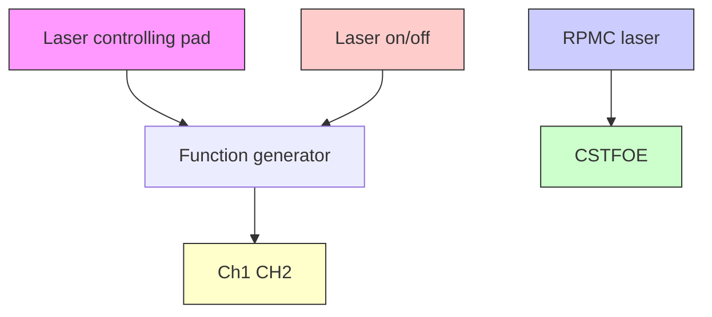

RESEARCH ARTICLE OPEN ACCESS

# Optoacoustic Neuromodulator by In Situ Photothermal Curing of Polydimethylsiloxane

Guo Chen1 Michael Marar1 Deming Li1 Zhuqin Xu1 Biwen Gao2 Meng Zhang1 Wai Yuen Cheng1 Feiyuan Yu1 Carolyn Marar3 Ji-Xin Cheng1,3 Chen Yang1,2

1 Department of Electrical and Computer Engineering, Boston University, Boston, Massachusetts, USA 2Department of Chemistry, Boston University, Boston, Massachusetts, USA 3Department of Biomedical Engineering, Boston University, Boston, Massachusetts, USA

Correspondence: Ji-Xin Cheng (jxcheng@bu.edu) Chen Yang (cheyang@bu.edu)

Received: 6 November 2025 Revised: 12 March 2026 Accepted: 27 March 2026

Keywords: neuromodulation | optical fiber | photoacoustic | photothermal

## ABSTRACT

Precise neural modulation is an important tool in neuroscience research for intervening in specific neural pathways. Photoacoustic is an emerging photonics technology enabling high precision non-genetic neural stimulation in vitro and in vivo. Fiber-based and film-based optoacoustic emitters have demonstrated their capability in fundamental studies of how neurons respond to mechanical stimuli at the single-cell level, as well as in brain stimulation in vivo. Here, we report a new and general method to fabricate optoacoustic emitters through an in situ photothermal curing process of PDMS (Polydimethylsiloxane) on different platforms, including the tip of tapered fibers with high precision, and flat substrates with programmed patterns. Candle soot-based tapered fiber optoacoustic emitter (CS-TFOE) prepared through this new method generated a highly localized ultrasound field and enabled efficient and precise neuromodulation. We designed an integrated and compact photoacoustic neuromodulation system incorporating the FOE, a nanosecond pulsed laser for photoacoustic generation, and a function generator for synchronization. We have shown that the system can be easily integrated with standard neuroscience recording methods, such as Ca2+ imaging, and achieves effective neuromodulation in vitro.

## 1 Introduction

Photoacoustic (PA) emitters have found broad and significant use in biomedical applications, including imaging [1], surgery [2], and neuromodulation [3]. A variety of PA devices have been developed with functional features. For example, fiberbased PA emitters can perform as a point ultrasound source that serves as an effective guide for surgery in combination with ultrasound imaging [2]. Tapered fiber-based PA emitter can deliver a well-confined ultrasound field with a size of a few tens of microns. enabling single-celllevel PA neuromodulation [4]. PA film-based emitters can be designed into concave shapes to generate focused ultrasound for transcranial brain modulation [5]. Their high biocompatibility and mechanical flexibility further allow implantation into animal models for brain and retina modulation [6]. Besides, the high-intensity-focused-ultrasound (HIFU) generated by the curved photoacoustic film is also used in cavitation therapy through the strong sound pressure at the focal point [7]. Noticeably, emerging PA applications such as surgery and modulation have a need for generating micron-scale ultrasound for the precision desired in these applications.

Currently, to achieve high PA conversion efficiency, the PA emitter consists of two different parts: the absorber with a high absorption coefficient, and the elastomer with a high expansion coefficient. While different kinds of carbon materials were chosen as absorbers for different purposes, PDMS is widely acknowledged as one of the most efficient elastomers due to its high expansion coefficient. There are lots of methods to prepare PA emitters, including dip coating [8, 9], spin coating [10–13], spray coating [14, 15], ink printing [16], and chemical vapor deposition (CVD) [17, 18]. However, due to the mechanical properties of PDMS, most of the existing methods lack the capability to deliver miniaturized PA emitter elements to enable precise targeting due to the poor fabrication resolution and limitations on specific substrates. For example, the dip coating method is easy to apply, but can only be used on the coating of fiber emitters [8, 9]. The spin coating can create an ultra-thin film on a flat substrate, but it does not have any patterning ability [10]. While the ink printing method allows for printing photoacoustic material with a spatial resolution of 10 µm, it can only print on large and flat substrates [16]. Therefore, to solve the problems mentioned above, a new approach for fabricating highly efficient PA emitters, with high fabrication resolution, design programmability, and compatibility with different shapes of substrates are urgently needed.

In this study, we present a photothermal-induced in situ printing technique designed for precise and reproducible fabrication of PA emitter elements with micron-scale sizes on different substrates with programmability. We demonstrated that the method is general enough to be applied to both fiber and film-based PA emitters. Taking the fiber emitter as an example, through a three-step procedure, the method enables precise control over critical device properties such as coating layer thickness, absorption characteristics, coating diameter, and PA generation efficiency. Using the in situ photothermal curing method, we have prepared a sub-50 micron taper optical fiber-based PA emitter (TFOE) with an optimized photoacoustic coating combining candle soot/PDMS. Results show that the prepared candle-soot TFOE (CS-TFOE) can generate 1.6 times higher pressure than the carbon nanotubebased TFOE (CNT-TFOE) under the same laser conditions. Furthermore, taking advantage of in situ photothermal curing, photoacoustic elements with a user-defined geometry can be 2D printed, and the PA performance of these emitter elements has been characterized. To highlight the application of the PA emitters fabricated, we present a compact and versatile photoacoustic modulation system that can be easily integrated with different recording methods. Successful and efficient neuromodulation through TFOE has been demonstrated. This advancement enables programmable fabrication of photoacoustic emitters with any designed pattern and thus paves the way for more targeted studies in neuroscience and biomedical applications.

## 2 Results

## 2.1 Photothermal-Induced In Situ Curing Method for Fabrication of CS-TFOE

To develop a general fabrication strategy for fiber-based pho toacoustic emitters, we developed a new in situ curing method involving three steps to independently control key parameters and applied the method to prepare CS-TFOE (Figure 1a). The process comprises fiber tapering, absorber, i.e., candle soot, coating, and PDMS photothermal in situ curing. Bright-field images of the fiber tip after each step are provided in Figure 1b.

Step 1: Fiber Tapering: Fiber tapering is achieved by gradually pulling a 225 µm fiber (FT200EMT, Thorlabs) into a tapered fiber with a tip diameter of less than 20 µm using a thermal tapering method [4]. The final diameter of the tapered fiber can be tuned by changing the pulling weight (Figure 1c). The whole tapering process has been modeled, showing a square root relationship between the pulling force and the final tapered diameter. Details are in Supplementary Information.

To evaluate the optical performance of the tapered optical fiber, we measured the laser emission at the tapered fiber tip. First, a bright-field image of the fiber was captured under a microscope (Figure 1d, green). Next, the fiber was coupled with a 1064 nm continuous-wave (CW) laser, and the tapered tip was immersed in a scattering medium (5% diluted Intralipid, Sigma) to visualize the emitted laser. The fiber geometry and emitted laser profile were superimposed, as shown in Figure 1d. The results confirm that the fiber retains its laser-guiding functionality, emitting light from the tapered tip after the tapering process.

Step 2: Candle Soot Coating: To deposit a layer of candle soot nanoparticles onto the tip surface of the tapered fiber, the fiber was positioned in the middle of the flame of a paraffin wax candle, around 2 mm away from the wick. The incomplete burning of the candle produces soot particles [19], which adhere to the surface of the tapered fiber. The coating thickness was measured as a function of deposition time, showing a linear relationship (Figure 1e). By precisely controlling the coating duration, the thickness of the candle soot layer can be finely tuned with an accuracy of ±5 µm.

Step 3: PDMS Photothermal In Situ Curing: After applying the candle soot layer, a PDMS layer is introduced as the thermal elastomer to leverage its high thermal expansion coefficient, enabling efficient photoacoustic emission. To coat PDMS directly onto the 20 m tip of the tapered fiber, we developed a pho tothermal in situ curing method. To prepare the PDMS, silicone elastomer, and curing agent were mixed in a 10:1 ratio. The candle soot (CS) coated tapered fiber was then immersed in the PDMS mixture. A 1064 nm continuous-wave (CW) laser was coupled into the fiber, delivering the laser to its tip. The candle soot layer absorbed the laser energy, generating localized heat that cured the surrounding PDMS. This process formed a PDMS coating around the fiber tip. The thickness of the cured PDMS coating can be changed by varying the laser dosage. With 100 mW laser power and a curing duration of 1 s, the final diameter of the fiber, including the PDMS coating, reached 25 m (Figure 1f). Increasing the laser power resulted in thicker coatings, but the coating thickness plateaued due to reaching thermal equilibrium. This method achieves precise PDMS coating exclusively at the fiber tip, with an accuracy of ±5 m. We also performed a thermal diffusion simulation in Figure S2. The simulation of thermal diffusion during curing suggests that the central temperature can reach more than 600 degrees. Meanwhile, due to the low thermal conductivity of PDMS, the heating is localized and decays very fast within 200 microns. This also ensures the fabrication precision of our in situ curing method.

a  

text_image

Step1
Horizontal Platform
Alcohol Lamp
Weight
Step2
Tapered Fiber
Candle
Step3
PDMS
Laser
Objective

b  

text_image

Step1
50 µm
Step2
50 µm
Step3
50 µm

line chart

| Pulling force (N) | Tapered diameter (µm) |
| ----------------- | --------------------- |
| 0.3               | 5.0                   |
| 0.5               | 8.0                   |
| 0.7               | 10.0                  |
| 0.9               | 12.0                  |
| 1.0               | 14.0                  |

line chart

| Time (s) | Candle soot thickness (µm) |
| -------- | -------------------------- |
| 5        | 7                          |
| 10       | 10                         |
| 15       | 15                         |
| 20       | 20                         |
| 25       | 25                         |

line chart

| Time (s) | 200mW | 100mW | 50mW |
| -------- | ----- | ----- | ---- |
| 0        | 22.0  | 18.0  | 22.0 |
| 2        | 31.0  | 32.0  | 23.0 |
| 4        | 31.0  | 31.0  | 24.0 |
| 6        | 31.0  | 31.0  | 24.5 |
| 8        | 31.0  | 31.0  | 25.0 |

FIGURE 1 Fabrication and structural characterization of Candle Soot-Based Tapered Fiber Optoacoustic Emitter (CS-TFOE). (a) Schematic of CS-TFOE fabrication steps. (b) Pictures after each fabrication step. Scale bar: 50 µm. (c) Relationship between the pulling force and tapered diameter. y $= 2 0 . 6 9 ^ { * } \times 0 . 5 \cdot$ –6.241, $\mathrm { R } ^ { 2 } = 0 . 9 9 0 7$ . N = 42 in total. (d) Image for the light path of tapered fiber. The fiber is outlined by green color, and red is the light emitted by the fiber. Tip diameter 15 µm. Laser condition: 1030 nm, cw. (e) Relationship between candle soot deposition time and thickness. $\mathrm { y } = 0 . 8 5 0 3 ^ { \ast }$ × + 1.594. N = 42 in total. (f) Relationship between photothermal curing time and final coating diameter under different curing laser powers. $\Nu = 2 3$ for 200 mW, N = 17 for 100 mW, N = 10 for 50 mW.

## 2.2 Characterization of CS-TFOE and Comparison to CNT-TFOE

To quantitatively assess the frequency and spatial distribution of the PA signal emitted by CS-TFOE with diameters of 25 µm, we first employed a newly developed optical detec tion method to measure the PA signal emitted from the CS-TFOE, namely spatially offset pump probe imaging (SOPPI) [20]. The focused probe beam has a focal diameter of 6 µm, offering significantly improved spatial resolution compared to conventional PA detectors such as hydrophones and transducers (Figure 2a). Furthermore, optical detection provides a broad detection bandwidth ranging from sub-MHz to 65 MHz, ensuring more accurate signal measurement than piezoelectric-based PA transducers, which typically have a narrow detection bandwidth (<20 MHz).

The PA signal generated by CS-TFOE upon a 1064 nm pulsed laser was detected and plotted as a function of time (black, Figure 2b), showing a central frequency of 30 MHz (orange, Figure 2b). By moving the detection beam away from the CS TFOE tip, PA signals showed an amplitude decay with increasing distance between the tip and detection location (Figure 2c). The PA amplitude is defined as the peak-to-peak value of the waveform. PA amplitude as a function of distance (Figure 2d) exhibits a significant drop within the first 20 µm, demonstrating the high spatial resolution of the PA field emitted by CS-TFOE. Besides, the pressure generated by CS-TFOE is dependent on the input laser pulse energy. As shown in Figure 2e, CS-TFOE was pumped by different laser energies, and the PA signal was measured by a transducer. The PA amplitude shows a linear relationship to the input energy, demonstrating that the mechanical force can be precisely controlled through tuning the laser pulse energy.

To quantitatively assess the stability of the CS-TFOEs, we evaluated their photoacoustic (PA) performance under repeated pulsing. The devices were irradiated with a laser power of 30 mW for a 3 ms duration, representing typical operating conditions. The laser pulse train was delivered to the CS-TFOE once per minute, and the resulting PA signal was recorded by a transducer once every 5 min. As illustrated in Figure 2f, the PA performance was effectively maintained even after 1 h of repeated puls ing. Furthermore, morphological comparisons of the CS-TFOE before and after testing revealed negligible structural damage (Figure 2g).

Moreover, to quantitatively compare the pressure generated by CS-TFOE and the CNT-based TFOE (CNT-TFOE) [4], we used a transducer to measure the PA signals of both fibers with 1030 nm, 3 ns pulse width, and 7.6 J laser pulse energy. With its more confined pressure field and the use of candle soot, a higher-efficiency material, CS-TFOE performs 1.6 times greater PA efficiency than CNT-TFOE (Figure 2h). More specifically, the CS-TFOE not only shows a statistically larger average pressure compared to what the CNT-TFOE generated (\*: $p = 0 . 0 4 7 9 )$ , but the variation between samples of CS-TFOE is also smaller than that of CNT-TFOE. (CS-TFOE: 203.6 ± 113 mV/µJ, N = 8, CNT-TFOE: 125.1 + 142.4 mV/uJ. N = 11). This demonstrates that with the new method of photothermal curing, the new generation of

text_image

a
Pulsed Laser →
FOE
Scanned Probe Beam
Water

line chart

| Time (ns) | Amplitude (a.u.) | IM Magnitude |
| --------- | ---------------- | ------------ |
| 0         | -1.0             | 0.0          |
| 50        | 0.0              | 0.6          |
| 100       | 0.5              | 0.8          |
| 150       | 1.0              | 0.9          |
| 200       | 0.0              | 0.4          |
| 250       | -0.5             | 0.2          |
| 300       | -0.8             | 0.1          |
| 350       | -0.5             | 0.3          |

line chart

| Follower Size | Voltage (V) |
| ------------- | ----------- |
| 75 µm         | ~1.0        |
| 150 µm        | ~0.8        |
| 225 µm        | ~0.6        |
| 300 µm        | ~0.4        |

scatterplot

| Distance (μm) | PA Amplitude (a.u.) |
| ------------- | ------------------- |
| 0             | 0.6                 |
| 20            | 0.4                 |
| 40            | 0.25                |
| 60            | 0.2                 |
| 80            | 0.15                |

scatterplot

| Pulse Energy (μJ) | PA Amplitude (a.u.) |
| ----------------- | ------------------- |
| 0                 | 0.0                 |
| 10                | 0.3                 |
| 20                | 0.55                |
| 25                | 0.7                 |

scatterplot

| Time (min) | Peak to Peak Pressure (a.u.) |
| ---------- | ---------------------------- |
| 0          | 1.7                          |
| 10         | 1.3                          |
| 20         | 1.5                          |
| 30         | 1.6                          |
| 40         | 1.4                          |
| 50         | 1.5                          |
| 60         | 1.4                          |
| 70         | 1.5                          |

natural_image

Microscopic images of a sperm cell before and after treatment, scale bar 100 μm (no text or symbols on the image itself)

bar chart

| Group    | Efficiency (mV/ μJ) |
| -------- | ------------------- |
| CS-TFOE  | 200                 |
| CNT-TFOE | 120                 |

FIGURE 2 Photoacoustic signal characterization of CS-TFOE using optical detection. (a) Schematic of photoacoustic measurement using optical detection. (b) Representative photoacoustic trace measured from CS-TFOE. (c) Traces of the photoacoustic signal detected at different locations plotted as a function of time. (d) PA amplitude plotted as a function of distance. (e) Pressure generated by CS-TFOE plotted as a function of input pulse energy. (f) Pressure generated by CS-TFOE plotted as a function of testing minutes. (g) Images of CS-TFOE before/after the 1-hour test. (h) CS-TFOE generates higher pressure than CNT-TFOE. N = 8 for CS-TFOE, N = 11 for CNT-TFOE, characterized by a 25 MHz transducer. A t-test was performed to calculate the p-value between each group. ${ } ^ { * } ; p = 0 . 0 4 7 9 .$

CS-TFOE not only performs stronger PA pressure, but also has more stability and robustness of fabrication.

## 2.3 2D Printing of PA Films Through a Laser Scanning System

The in situ photothermal curing method is a versatile approach that can be applied not only to small substrates such as tapered fibers, but also to large substrates with programmable patterning. By directing a patterned laser, photoacoustic (PA) materials can be printed into user-defined geometries tailored for specific applications (Figure 3).

In a representative procedure, a coverslip was first coated with candle soot for 20 s, followed by spin coating of PDMS at 4000 rpm for 100 s, resulting in a two-layer structure. The sample was then placed in a laser scanning system, where a 532 nm continuous-wave (CW) laser was employed to induce localized heating and achieve in situ photothermal curing of the PDMS layer. The laser beam was focused onto the sample using a 10× objective, with an average power of 100 mW. Patterning was performed by scanning the laser with a pixel dwell time of 50 s, a step size of 25.6 m, and a total illumination time of 3 min. After the printing process, residual soot and uncured PDMS were removed, leaving behind well-defined cured PA patterns on the substrate (Figure 3a).

a  

text_image

Step 1
Candle Soot Coating

text_image

Step 2
PDMS Spin Coating

text_image

Step 3
NA 0.55
Photothermal Printing

text_image

Step 4
Wide Out Residuals

b  

line chart

| Frequency (MHz) | Pressure (a.u.) | Magnitude |
| --------------- | --------------- | --------- |
| 0               | 0.5             | 1.0       |
| 20              | 0.0             | 0.8       |
| 40              | -0.5            | 0.6       |
| 60              | 0.0             | 0.4       |
| 80              | 0.0             | 0.2       |
| 100             | 0.0             | 0.0       |
| 1500            | 0.5             | 0.8       |
| 2000            | 0.0             | 1.0       |
| 2500            | -0.5            | 0.6       |
| 3000            | 0.0             | 0.4       |

C  

line chart

| Time (ns) | PA intensity (a.u.) | Transmission |
| --------- | ------------------- | ------------ |
| 0         | 0.4                 | 0.0          |
| 25        | 1.0                 | 0.0          |
| 125       | 0.8                 | 0.0          |

e  

line chart

| Location (μm) | PA intensity (a.u.) |
| ------------- | ------------------- |
| 0             | 0.6                 |
| 100           | 0.7                 |
| 200           | 0.65                |
| 300           | 0.75                |
| 400           | 0.8                 |
| 500           | 0.1                 |
| 600           | 0.05                |
| 700           | 0.02                |
| 800           | 0.01                |
| 900           | 0.01                |
| 1000          | 0.01                |

d  

natural_image

Green triangular play button icon on black background, labeled 'Laser Pattern' on the left (no other text or symbols)

natural_image

Solid green diamond shape on black background (no text or symbols)

natural_image

Green hexagonal shape on black background (no text or symbols)

natural_image

Microscopic image of a black triangular shape on a textured gray background, labeled 'Printed PA Film' on the left (no other text or symbols)

natural_image

Black diamond-shaped object placed on a textured gray surface (no text or symbols visible)

natural_image

Aerial view of a dark, irregularly shaped black object on a grid-patterned surface (no visible text or symbols)

text_image

PA Intensity Map
0 PA Intensity (a.u.) 1

text_image

PA Intensity (a.u.)
0
1

text_image

PA Intensity (a.u.)
0 1

FIGURE 3 2D printing of photoacoustic film through patterned in situ photothermal curing of PDMS. (a) Steps showing how the photoacoustic film was printed through a laser scanning system. (b) Representative photoacoustic signal generated by a printed photoacoustic film. Black: photoacoustic signal plotted as a function of time. Red: frequency analysis through a Fast-Fourier-Transform of the PA signal. (c) PA intensity and optical transmission of the film plotted as a function of laser heating duration. (d) Comparison of the laser scanning pattern (Green), printed PA film (Black), and PA intensity distribution (Red). Scale bar: 1 mm. (e) PA intensity profile at the edge of the printed samples. N = 3. FWHM: Full Width at Half Maximum.

To evaluate the fabrication precision, three distinct patterns—a triangle, a diamond, and a pentagon—were designed (Figure 3d, green). The corresponding fabricated PA films are shown in Figure 3d (black), where the overall shapes were well preserved during the in situ photothermal curing process. The photoacous tic performance of the printed films was characterized using a needle hydrophone. A 1030 nm pulsed laser was focused onto the films through a 10× objective to generate PA signals. A representative PA signal detected by the hydrophone is plotted as a function of time in Figure 3b, showing a central frequency of 10 MHz. Notably, this central frequency detected is smaller than that of the fiber emitter. This is because the 1 mm hydrophone was used to measure the film with a sensitivity range from 0 to 20 MHz. Therefore, high-frequency components of the ultrasound signal produced by the film might not be fully captured by the hydrophone. The CS-TFOE was measured by the optical method (Figure 2) with a broad detection bandwidth from 0 to 65 MHz.

The effect of laser illumination duration was also investigated (Figure 3c). Both the relative PA intensity and optical transmission were plotted as functions of illumination time. The results indicate that the absorbance of the PA film increased within the first 10 s and plateaued after 60 s, following a trend similar to the PA intensity change. Furthermore. the entire sample was scanned to generate a PA intensity map (Figure 3d, red). Compared with the designed laser patterns and the printed PA films, the PA intensity distribution largely retained the intended geometries, although some inhomogeneities were observed, likely due to aggregation during the photothermal curing process. This result demonstrates that the in situ photothermal curing method is capable of achieving a programmable user-defined 2D printing for different scenarios. To quantitatively determine the 2D printing resolution of PA film, we fabricated three samples using the same curing condition, and plotted the PA intensity as a function of location at the edge of the printed film (Figure 3e). As shown in the figure, the PA intensity dropped from 0.63 to 0.04 in around 100 m. The FWHM (Full Width at Half Maximum) of the edge is measured to be 50 m. This demonstrates that our photothermalprinting method can also reach a printing precision at sub-100 µm on flat substrates, which is consistent with the case on tapered fiber.

## 2.4 An Integrated System for PA Neuromodulation

The neuromodulation performance of the photothermally printed PA devices needs to be tested. Taking the fiber-based device CS-TFOE as an example, to enhance its compatibility with neural systems and recording methods, including calcium imaging and patch-clamp recording [21], we developed a compact, portable, and integrated PA neuromodulation system with all components housed within a 12-inch enclosure (Figure 4a,b). The system comprises a function generator for laser triggering, a laser control panel, a power supply, and a nanosecond pulsed laser (Bright Solution, Inc., Calgary, Alberta, CA). Additionally, the system features an external synchronization port, enabling seamless integration with recording systems for biological behavior characterization.

## 2.5 Neuron Stimulation Monitored by Calcium Imaging

As previously reported, the CNT-TFOE is able to stimulate cortical neurons and induce action potential under patch-clamp recording [21]. With improved efficiency, CS-TFOE is promising in high-precision neuromodulation as well. Since calcium imaging is a well-acknowledged method to show neural activation both in vitro [22] and in vivo [23], we applied the CS-TFOE and the integrated PA system to stimulate GCaMP6f labelled rat cortical neurons in vitro under calcium imaging, and recorded neuron activities. A CS-TFOE was positioned within 20 m above a targeted neuron using a micromanipulator, and it was operated under a 1030 nm laser with 3 ns pulse width at a repetition rate of 3.3 kHz, and a power of 41 mW over a duration of 3 ms. A detailed stimulation protocol is presented in Figure S1. Clear stimulation was observed (Figure 4c,d). Repeated stimulation was performed over the course of two minutes with a time interval of 40 s between trials (Figure 4e). At 5, 45, and 85 s, the same cell was stimulated, showing a ${ \varDelta } F / F _ { 0 }$ of 55%–65% for all three activations. This result showed that the membrane remains functional and responsive without immediate damage during the experimental window. Besides, it is evident that the stimulation area is confined, with only one neuron being stimulated. This demonstrated that the PA emitter prepared enables a high spatial precision stimulation.

To examine the effect of different doses of ultrasound on cells, neural responses under different laser burst durations of 4.5, 3, and 1 ms were recorded under the same averaged laser power of 41 mW (Figure 4f–h). The duration of 4.5 ms caused overactivation of neurons, with a 250% in $\varDelta F / F _ { o }$ and an inability for the cells to return to baseline after 20 s afterward (Figure 4i). This prolonged stimulation demonstrates overstimulation, and damage to the neurons could have happened. In a safer and milder condition, the duration of 3 ms resulted in a transien neural activation, with $\textbf { i } \varDelta F / F _ { 0 }$ of 65%. The duration of 1 ms resulted in no activation under this laser condition. To demonstrate that the stimulation was from the photoacoustic coating printed photothermally in situ, a laser-only control experiment was done under the same laser condition, but with a bare optical fiber. As shown in Figure 4j, no activation was observed upon laser onset, showing that the modulation of neural activities was from the photoacoustic coating, but not from the laser directly. To explore whether the photothermal effect during the photoacoustic generation process can stimulate neurons, a phototherma control experiment is shown in Figure 4j. The nanosecond laser for PA generation is replaced by a 1064 nm CW laser, which only generates a localized temperature increase. The CW laser operates at the same power of 41 mW, with a 5 ms laser duration. As shown in Figure 4j, no activation of neurons was observed. Both the laser-only control and the photothermal-only control show a statistical difference compared with the PA stimulation (Figure 4k, \*\*\*\*: $p < 0 . 0 0 0 1 )$ ). This demonstrates that the observed stimulation using CS-TFOE under pulsed laser conditions doesn’t result from the laser itself nor from the temperature increase, but due to acoustic stimuli enabled by the PA process. Overall, the in vitro experiments by CS-TFOE show a dose-dependent neuromodulation capability and a safe, repeatable stimulation.

## 3 Conclusion

In this work, we developed a versatile photothermal-induced in situ printing technique for fabricating photoacoustic (PA) emitters with high spatial precision and programmable geometries. The method enables the deposition of PA coatings on both microscale substrates, such as tapered optical fibers, and larger planar substrates with user-defined patterns. Using this approach, we successfully fabricated candle soot-based tapered fiber optoacoustic emitters (CS-TFOEs) with sub-50 µm tip diameters. The three-step fabrication process—tapering, candle soot deposition, and PDMS photothermal in situ curing—provides independent control over critical parameters such as coating thickness, absorption properties, and PA generation efficiency, leading to reproducible and high-performance devices.

With this new method of PA material fabrication, highly efficient materials, including candle soot, can be used, which improves the PA conversion efficiency. Characterization of CS-TFOEs demonstrated a highly localized ultrasound field, with peak-topeak pressure 1.3 times higher than that of CNT-TFOEs under identical laser conditions. The devices achieved efficient highprecision neuromodulation in vitro, exhibiting repeatable and dose-dependent calcium responses while maintaining cellular safety. As previously reported, fiber-based PA emitter is able to maintain its performance after one month of implantation, demonstrating its safety and clinical potential [24]. Beyond fiber based emitters, the in situ photothermal method enabled 2D printing of PA films with complex geometries and programmable PA intensity profiles, highlighting the generality and scalability of the approach.

a  

flowchart

b

natural_image

Interior view of an electronic equipment enclosure with control panel, cables, and wiring (no readable text or symbols)

C  

text_image

before
100 µm
after
100 µm
d
Max ΔF/F₀
50 µm

e  

line chart

| Time (s) | ΔF/F₀ |
| -------- | ----- |
| 0        | 0.0   |
| 5        | 0.0   |
| 10       | 0.45  |
| 20       | 0.0   |
| 30       | 0.0   |
| 35       | 0.6   |
| 40       | 0.5   |
| 50       | 0.3   |
| 60       | 0.0   |
| 65       | -0.1  |
| 70       | 0.5   |
| 80       | 0.4   |
| 85       | 0.3   |

f  

heatmap

| Neuron ID | Time (s) | Laser Duration |
| --------- | -------- | -------------- |
| 2         | 5        | 4.5 ms         |
| 4         | 10       | 4.5 ms         |
| 6         | 15       | 4.5 ms         |
| 8         | 20       | 4.5 ms         |
| 10        | 25       | 4.5 ms         |

g  

heatmap

| Neuron ID | Time (s) |
| --------- | -------- |
| 5         | 5        |
| 10        | 10       |
| 15        | 15       |
| 20        | 20       |

h  

heatmap

| Neuron ID | Time (s) | ΔF/F₀ |
| --------- | -------- | ----- |
| 2         | 0        | 0     |
| 4         | 5        | 0     |
| 6         | 10       | 0     |
| 8         | 15       | 0     |
| 10        | 20       | 0     |
| 12        | 25       | 0     |

line chart

| Time (s) | 1 ms | 3 ms | 4.5 ms |
| -------- | ---- | ---- | ------ |
| 0        | 0    | 0    | 0      |
| 5        | 0    | 0    | 0      |
| 10       | 0    | 0.5  | 2.5    |
| 15       | 0    | 0.2  | 2.0    |
| 20       | 0    | 0.1  | 1.5    |
| 25       | 0    | 0    | 1.0    |

heatmap

| Neuron ID | Time (s) | ΔF/F₀ |
|-----------|----------|-------|
| Laser-Only | 5        | 4     |
| PT-Only   | 5        | 1     |

k  

bar chart

| Group           | Max ΔF/F₀ |
| --------------- | --------- |
| PA 4.5 ms       | 2.5       |
| PA 3 ms         | 1.2       |
| PA 1 ms         | 0.3       |
| Laser-Only Control | 0.1       |
| PT-Only Control  | 0.05      |

FIGURE 4 Neuron stimulation monitored by calcium imaging. (a) Schematic of the PA neuromodulation engine and how it can be coupled with an FOE for neuromodulation in vitro. (b) Photo of a neuromodulation engine. (c) Calcium imaging of GCaMP6f-labeled neurons stimulated by CS-TFOE before and after stimulation. Scale bar: 50 µm. (d) Maximum ΔF/F0 of PA stimulation. (e) Calcium trace shows repeatable activation of the same neuron. Laser condition: 3 ms duration, pulsed energy: 0 mm attenuator. (f–h) Colormaps of fluorescence change in neurons stimulated by CS-TFOE with different laser burst durations. (f) 4.5 ms burst duration (N = 10). (g) 3 ms burst duration (N = 20). (h) 1 ms burst duration $( \mathrm { N } = 1 0 ) .$ . (i) Average calcium traces of neurons attained from (f–h) with burst duration of 1 ms (Red) $( \mathrm { N } = 1 0 )$ , 3 ms $\mathrm { ( B l u e ) } \left( N = 2 0 \right) , 4 . 5$ ms (Orange) $( \mathrm { N } = 1 0 )$ . The shaded region is the standard deviation. The laser is on at $\mathrm { \Delta t } = 5 \mathrm { { s } }$ (red dashed lines). (j) Laser-only control and photothermal-only control of CS-TFOE stimulation. (k) Average maximum fluorescence intensity changes are shown in (f–h, j). Error bars represent standard deviation.

There are still limitations to this new method. For example, in the case of printing larger films, it is obvious that the PA performance of the film is not perfectly evenly distributed. This is very likely due to the candle soot aggregation during the photothermal curing process. This can be improved by tuning the laser heating duration and power. Besides, although we’re using optical method for fabrication, the fabrication precision cannot achieve optical resolution. This is because the fabrication precision is currently limited by the thermal diffusion process. To improve this, we can use UV to cure the PDMS, which is a more efficient and high-resolution method.

Overall, this optically driven fabrication strategy expands the design space for PA emitters, combining high efficiency, micronscale spatial resolution, and customizable geometries. These advances provide a powerful tool for precision neuromodulation and give potential for patterned neuromodulation, opening avenues for tailored PA devices in neuroscience, tissue engineering, and therapeutic ultrasound.

## 4 Appendix: Methods

## 4.1 In Situ Photothermal Curing Fabrication of the CS-TFOE

Figure 1a shows a schematic of the fabrication process of the CS-TFOE. The first step is to create a taper by melting a stock 200 µm optical fiber (FT200EMT, Thorlabs) using an ethanol lamp and then allowing a block of variable weight to pull the two ends of the fiber apart. Second, the tapered tip of the fiber was coated with candle soot by being placed inside the flame of a paraffin wax candle for a controlled period of time. The third step is to cure polydimethylsiloxane (PDMS) on top of the first layer of candle soot coating. The PDMS is prepared by mixing together silicone elastomer and curing agent in a 10:1 ratio for 5 min (Sylgard 184). A CW laser was used to thermodynamically cure the PDMS, with a 1064 nm wavelength and a 400 mW maximum output power (Cobolt Rumba, 1064 nm). Only the tip of the fiber is placed into the uncured PDMS, precisely controlled by a micromanipulator (MC1000e controller with MX7600R motorized manipulator, Siskiyou Corporation, OR, USA). With a certain duration of laser heating up the candle soot layer inside the uncured PDMS, a second layer of PDMS coating was formed on the tip.

## 4.2 2D printing of PA Films Through a Laser Scanning System

The coverslip (Fisherbrand Superslip Cover Slips, Fisher Scientific) was coated with candle soot by being placed inside the flame of a paraffin wax candle for 20 s. Then, the PDMS is prepared by mixing together silicone elastomer and curing agent in a 10:1 ratio for 5 min (Sylgard 184) and was coated onto the cover slip on top of the candle soot layer through spin coating (Karl Suss, Delta 80T2/200) with 4000 rpm for 100 s. A 10× objective (UPLAN FLN 10×, 0.3 NA, Olympus) was used to focus a 532 nm CW laser (Cobolt Samba 1000) onto the coverslip to induce localized temperature increases. A galvo system (GVSK2- US, Thorlabs) was used to scan the laser to form a designed pattern.

## 4.3 Photoacoustic Imaging of Printed PA Films

The printed PA films were placed onto a scanning stage (ProScan III, Prior) to perform imaging. A 1030 nm pulsed laser with 5 ns pulse duration and a repetition rate of 20 Hz was focused onto the sample through a 10× objective (UPLAN FLN 10×, 0.3 NA, Olympus). The PA signal was detected by a needle hydrophone (HGL-1000, Onda). Both the hydrophone and the sample were immersed in water for ultrasound propagation. The generated signal was amplified through a 46 dB amplifier (100-MHz bandwidth, SA230F5, NF Corporation) and digitized through a data acquisition card at 180 MSa/s (ATS9462, Alazar Tech). Through sample scanning, the PA performance at different locations of the PA film was mapped out.

## 4.4 Characterization of Ultrasound Waves From the Optoacoustic Effect

For accurate frequency measurements of PA signals from CS-TFOEs using optical detection, a continuous wave 1310 nm laser (1310LD-4-0-0, AeroDIODE Corporation) serves as the probe, with a power of 5 mW, which was used to detect the signal. The signal-carrying probe laser was detected by an amplified InGaAs photodiode (PDA05CF2, Thorlabs) with a 1310 nm bandpass filter (FBH1310-12, Thorlabs). The signal was recorded using a data acquisition card at 180 MSa/s (ATS9462, Alazar Tech), equivalent to 5.6 ns temporal resolution. The signal was then plotted in a time trace, and the frequency spectrum was calculated using Fast Fourier Transform in MATLAB.

For comparing the pressure emitted from CS-TFOEs and CNT-TFOEs, a piezo-based transducer (V324-SM, Olympus) was used to characterize the signals from the FOEs. Both CS-TFOEs and CNT-TFOEs have a tip diameter of 40 m. The transducer was placed into position using a micromanipulator (MC1000e controller with MX7600R motorized manipulator, Siskiyou Corporation). The transducer and the tip of FOE were both completely submerged in water. The tip of the FOE was first roughly placed at the focal point of the transducer, which is half inch away from the surface of the transducer. Then, the distance was precisely adjusted through calculating the delay between the laser trigger and PA signal. Next, the lateral position of the transducer was adjusted through the X-Y micromanipulator until the PA signal detected is at its maximum. This process is repeated for every CS-TFOEs and CNT-TFOEs. An oscilloscope (DSO6014A, Agilent Technologies) recorded measurements taken from the hydrophones. A Q-switched 1030 nm laser (Bright Solution, Inc., Calgary, Alberta) with a laser pulse of 3 ns was attached to the FOEs to generate PA signal.

## 4.5 Neuron Culture

All experimental procedures have complied with all relevant guidelines and ethical regulations for animal testing and research established and approved by the Institutional Animal Care and Use Committee of Boston University (PROTO201800534). Primary cortical neuron cultures were derived from Sprague Dawley rats. Cortices were dissected from embryonic day 18 (E18) rats of either sex and then digested in papain (0.5 mg/mL in Earle’s balanced salt solution) (Thermo Fisher Scientific Inc.). Dissociated cells were washed with and triturated in 10% heat inactivated fetal bovine serum (FBS, Atlanta Biologicals), 5% heat-inactivated horse serum (HS, Atlanta Biologicals), 2 mm Glutamine Dulbecco’s Modified Eagle Medium (DMEM, Thermo Fisher Scientific Inc.), and cultured in cell culture dishes (100 mm diameter) for 30 min at $3 7 ^ { \circ } \mathrm { C }$ to eliminate glial cells and fibroblasts. The supernatant containing neurons was collected and seeded on poly-D-lysine-coated cover glass and incubated in a humidified atmosphere containing 5% CO at 37◦C with 10% FBS + 5% HS + 2 mM glutamine DMEM. After 16 h, the medium was replaced with Neurobasal medium (Thermo Fisher Scientific Inc.) containing 2% B27 (Thermo Fisher Scientific Inc.), 1% N2 (Thermo Fisher Scientific Inc.), and 2 mm glutamine (Thermo Fisher Scientific Inc.). On day 5, cultures were treated with 5 µm FDU (5-fluoro-2’-deoxyuridine, Sigma–Aldrich) to further reduce the number of glial cells. Additionally, on day 5, the pAAV.Syn.GCaMP6f.WPRE.SV40 virus (Addgene) was added to the cultures at a final concentration of 1 µL/mL for GCaMP6f expression, and has cre-independent expression already, with no Cre virus involved in the process. Half of the medium was replaced with fresh culture medium every 3–4 days. Cells cultured in vitro for 10–13 days were used for the stimulation experiment.

## 4.6 In Vitro Neuron Stimulation

A micromanipulator was used to place the tip of a CS-TFOE directly above cells and a Q-switched 1030 nm laser (Bright Solution, Inc., Calgary, Alberta, CA) was attached to the CS-TFOE. The laser had durations of 4.5 ms (N = 10), 3 ms (N = 20), and 1 ms (N = 10). Calcium fluorescence imaging was performed on a lab-built wide-field fluorescence microscope based on an Olympus IX71 microscope frame with a 10 × air objective (UPLAN FLN 10×, 0.3 NA, Olympus), illuminated by a 470 nm LED (M470L2, Thorlabs, Inc.) and a dichroic mirror (DMLP505R. Thorlabs, Inc.). Image sequences were acquired with a scientific CMOS camera (Zyla 5.5, Andor) at 20 frames per second. Neurons expressing GCaMP6f at DIV (day in vitro) 10–13 were used for the stimulation experiment.

## 4.7 Photothermal Diffusion Simulation

The 3D photothermal diffusion is modeled through MAT-LABR2024a. The absorber’s size is considered as a 40 × 40 × 40 µm cube to mimic the geometry of the CS-TFOE. The diffusion medium is PDMS, which is consistent with the case of thermal induced curing process. The thermal conductivity of PDMS is set to be 0.15 W/(m · K). the density is 970 kg/m3, and the specific heat capacity is 1460 J/(kg ⋅ K). The simulation is performed in 3D to best mimic the real thermal diffusion process. The laser power is set to be 20 mW and 1 s to mimic the real condition in the experiment.

## 4.8 Data Analysis

Prism 10 and MATLAB were used to analyze optoacoustic signal data from the hydrophones and to analyze data from the fabrication process of the CS-TFOE. Calcium imaging for Figure 4a,b were processed using ImageJ, and other calcium imaging analyses were done in Prism 10. Statistical analysis was completed with Prism 10.

## Author Contributions

G.C., M.M., J.-X.C., and C.Y.: drafting and refining the manuscript. G.C. and D.L.: conducting the photoacoustic signal characterization and patterned photothermal curing. M.M. and Z.X.: in vitro neuromodulation J.-X.C. and C.Y.: critical guidance of the project. B.G., M.Z., W.Y.C., F.Y., and C.M.: help with the experiments. All authors have read and approved the manuscript.

## Acknowledgements

This work was supported by NIH NEI R21EY036579 and R21NS145121 to CY. The cortical neurons were provided by Hengye Man lab at Boston University.

## Conflicts of Interest

J.X.C. and C.Y. claim COI with AXORUS, which did not support this work. Other authors claim no COL.

## Data Availability Statement

The data that support the findings of this study are available from the corresponding author upon reasonable request.

## References

1. J. Park, S. Choi, F. Knieling, et al., “Clinical Translation of Photoacoustic Imaging." Nature Reviews Bioengineering 3 (2024): 193212. https://doi. org/10.1038/s44222-024-00240-y.  
2. L. Lan, Y. Xia, R. Li, et al., “A Fiber Optoacoustic Guide With Augmented Reality for Precision Breast-Conserving Surgery,” Light: Science & Applications 7 (2018): 2, https://doi.org/10.1038/s41377-018-0006-0.  
3. Y. Jiang, H. J. Lee, L. Lan, et al., “Optoacoustic Brain Stimulation at Submillimeter Spatial Precision,” Nature Communications 11 (2020): 881, https://doi.org/10.1038/s41467-020-14706-1.  
4. L. Shi, Y. Jiang, F. R. Fernandez, et al., “Non-Genetic Photoacoustic Stimulation of Single Neurons by a Tapered Fiber Optoacoustic Emitter,” Light: Science & Applications 10 (2021): 143, https://doi.org/10.1038/s41377- 021-00580-z.  
5. Y. Li, Y. Jiang, L. Lan, et al., “Optically-Generated Focused Ultrasound for Noninvasive Brain Stimulation With Ultrahigh Precision,” Light: Science & Applications 11 (2022): 321, https://doi.org/10.1038/s41377-022- 01004-2.  
6. A. Leong, Y. Li, T. R. Ruikes, et al., “A Flexible High-Precision Photoacoustic Retinal Prosthesis,” Nature Communications 17 (2026): 815, http://doi.org/10.1038/s41467-025-67518-6.  
7. W. Zhang, R. Yang, L. Wei, et al., “An Ultra-Thin MXene Film with High Conversion Efficiency for Broadband Ultrasonic Photoacoustic Transducer,” Ultrasonics 152 (2025): 107633, https://doi.org/10.1016/j. ultras.2025.107633.  
8. S. Noimark, R. J. Colchester, B. J. Blackburn, et al., “Carbon-Nanotube– PDMS Composite Coatings on Optical Fibers for All-Optical Ultrasound Imaging,” Advanced Functional Materials 26 (2016): 8390–8396, https:// doi.org/10.1002/adfm.201601337.  
9. J. Li, X. Liu, Z. Xiao, et al., “Broadband Ultrasound Generator Over Fiber-Optic Tip for In Vivo Emotional Stress Modulation,” Opto-Electronic Science 4 (2025): 240034, https://doi.org/10.29026/oes.2025.240034.  
10. S. Lu, C. Li, R. Liu, T. Liang, and X. Song, “High-Consistent Optical Fiber Photoacoustic Generator with Carbon Nanoparticles-PDMS Composite,” Optics and Lasers in Engineering 169 (2023): 107731, https://doi. org/10.1016/j.optlaseng.2023.107731.  
11. H. W. Baac, J. G. Ok, H. J. Park, et al., “Carbon Nanotube Composite Optoacoustic Transmitters for Strong and High Frequency Ultrasound Generation,” Applied Physics Letters 97 (2010): 234104, https://doi.org/10. 1063/1.3522833.  
12. B.-Y. Hsieh, J. Kim, J. Zhu, S. Li, X. Zhang, and X. Jiang, “A Laser Ultrasound Transducer Using Carbon Nanofibers–Polydimethylsiloxane Composite Thin Film,” Applied Physics Letters 106 (2015): 021902, https:/ doi.org/10.1063/1.4905659.  
13. J. Kim, H. Kim, W.-Y. Chang, W. Huang, X. Jiang, and P. A. Dayton, “Candle-Soot Carbon Nanoparticles in Photoacoustics: Advantages and Challenges for Laser Ultrasound Transmitters,” IEEE Nanotechnology Magazine 13 (2019): 13–28, https://doi.org/10.1109/MNANO.2019.2904773.  
14. H. Wu, Z. Guan, Y. Ke, et al., “MXene-Based Photoacoustic Transducer With a High-Energy Conversion Efficiency,” Optics Letters 48 (2023): 5563–5566, https://doi.org/10.1364/OL.505000.  
15. J. Rossi, J. Uotila, S. Sharma, et al., “Photoacoustic Characteristics of Carbon-Based Infrared Absorbers,” Photoacoustics 23 (2021): 100265, https://doi.org/10.1016/j.pacs.2021.100265.  
16. P. Oser, J. Jehn, M. Kaiser, et al., “Fiber-Optic Photoacoustic Generator Realized by Inkjet-Printing of CNT-PDMS Composites on Fiber End Faces,” Macromolecular Materials and Engineering 306 (2020): 2000563, https://doi.org/10.1002/mame.202000563.  
17. H. W. Baac, J. G. Ok, A. Maxwell, et al., “Carbon-Nanotube Optoacoustic Lens for Focused Ultrasound Generation and High-Precision Targeted Therapy,” Scientific Reports 2 (2012): 989, https://doi.org/10.1038 srep00989.  
18. B. A. Cola, J. Xu, C. Cheng, X. Xu, T. S. Fisher, and H. Hu, “Photoacoustic Characterization of Carbon Nanotube Array Thermal Interfaces,” Journal of Applied Physics 101 (2007): 054313, https://doi.org 10.1063/1.2510998.  
19. W. Y. Chang, W. B. Huang, J. Kim, S. B. Li, and X. N. Jiang, "Candle Soot Nanoparticles-Polydimethylsiloxane Composites for Laser Ultrasound Transducers,” Applied Physics Letters 107 (2015): 161903, https://doi.org 10.1063/1.4934587.  
20. G. Chen, Y. Yuan, H. Ni, et al., “Spatial-Offset Pump-Probe Imaging Science Advances (2025): adw4939, https://doi.org/10.1126/sciadv.adw4939.  
21. G. Chen, F. Yu, L. Shi, et al., “High-Precision Photoacoustic Neural Modulation Uses a Non-Thermal Mechanism." Advanced Science 11 (2024): 2403205, https://doi.org/10.1002/advs.202403205.  
22. S. Yoo, D. R. Mittelstein, R. C. Hurt, J. Lacroix, and M. G. Shapiro, “Focused Ultrasound Excites Cortical Neurons via Mechanosensitive Calcium Accumulation and Ion Channel Amplification,” Nature Communications 13 (2022): 493, https://doi.org/10.1038/s41467-022-28040-1.  
23. H. Guo, H. Salahshoor, D. Wu, et al., “Effects of Focused Ultrasound in a “Clean” Mouse Model of Ultrasonic Neuromodulation,” iScience 26 (2023): 108372, https://doi.org/10.1016/j.isci.2023.108372.  
24. N. Zheng, Y. Jiang, S. Jiang, et al., “Multifunctional Fiber-Based Optoacoustic Emitter as a Bidirectional Brain Interface,” Advanced Healthcare Materials 12 (2023): 2300430, https://doi.org/10.1002/adhm. 202300430.

## Supporting Information

Additional supporting information can be found online in the Supporting Information section.

Supporting File: adom71189-sup-0001-SuppMat.docx.