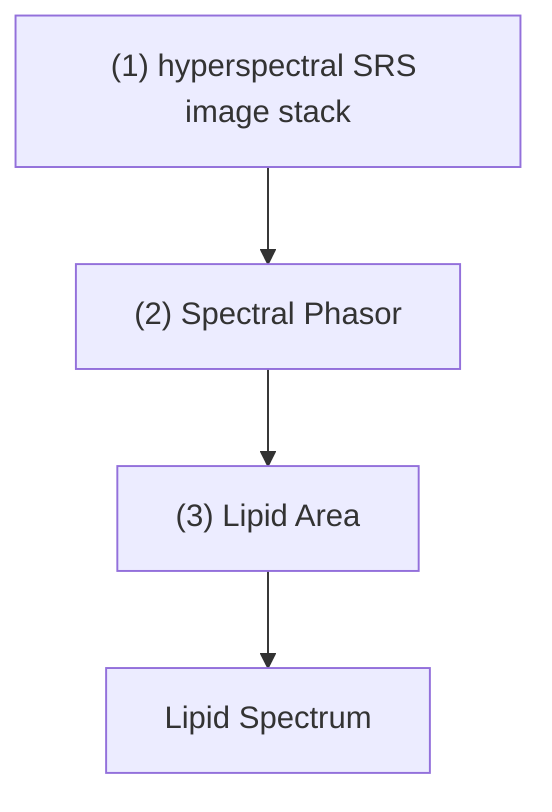

# Orchestrated desaturation reprogramming from stearoyl-CoA desaturase to fatty acid desaturase 2 in cancer epithelial-mesenchymal transition and metastasis

Zhicong Chen1,2,3 Yanqing Gong3 Fukai Chen2 Hyeon Jeong Lee2,4

Jinqin Qian3 Jing Zhao5 Wenpeng Zhang6 Yamin Li7 Yihui Zhou4

Qiaobing Xu7 Yu Xia5 Liqun Zhou3 Ji-Xin Cheng2

## Correspondence

Zhicong Chen, Department of Obstetrics and Gynecology, Center for Reproductive Medicine, Guangdong Provincial Key Laboratory of Major Obstetric Diseases, Guangdong Provincial Clinical Research

## Abstract

Background: Adaptative desaturation in fatty acid (FA) is an emerging hallmark of cancer metabolic plasticity. Desaturases such as stearoyl-CoA desaturase (SCD) and fatty acid desaturase 2 (FADS2) have been implicated in multiple cancers, and their dominant and compensatory effects have recently been

Abbreviations: AMPK, Adenosine monophosphate-activated protein kinase; AMPP, N-[4-(aminomethyl)phenyl]pyridinium; BLCA, bladder urothelial carcinoma; BRCA, breast invasive carcinoma; CA-12, cohort includes 12 TCGA cancer cohorts; CCLE, Cancer Cell Line Encyclopedia; CD36, CD36 molecule; CDH1, cadherin 1; CDH2, cadherin 2; Cer, ceramides; CL, cardiolipin; COAD, colon adenocarcinoma; Ctrl, control treatment; DAPI, 4′,6-diamidino-2-phenylindole; DEG, differentially expressed gene; De-lipid, culture with charcoal-stripped fetal bovine serum; DG, diacylglycerol; DMEM, Dulbecco’s Modified Eagle Medium; DMSO, dimethyl sulfoxide; ELOVL, ELOVL fatty acid elongases; EMT, epithelial-mesenchymal transition; ER, estrogen receptor; ESCA, esophageal carcinoma; FA, fatty acid; FABP4, fatty acid binding protein 4; FADS2, fatty acid desaturase 2; FASN, fatty acid synthase; FBS, fetal bovine serum; FC, fold change; FFPE, formalin-fixed paraffin-embedded; GAPDH, glyceraldehyde-3-phosphate dehydrogenase; GC-MS, gas chromatography-mass spectrometry; GDSC, Genomics of Drug Sensitivity in Cancer; GEO, Gene Expression Omnibus; GO, Gene Ontology database; GSEA, gene set enrichment analysis; HE, hematoxylin and eosin; HER-2, human epidermal growth factor receptor 2; HM, Hallmark database; HMLE, human mammary epithelial cell; HNSC, head and neck squamous cell carcinoma; $\mathrm { I C } _ { 5 0 } ,$ half-maximal inhibitory concentration; IHC, immunohistochemistry; KIRC, kidney renal clear cell carcinoma; LD, lipid droplet; LEF1, lymphoid enhancer binding factor 1; LIHC, liver hepatocellular carcinoma; Luc, cells stably expressing luciferase; LUCA, lung carcinoma; MTORC1, mammalian target of rapamycin complex 1; MUFA, monounsaturated fatty acid; NC, negative control sequence; NP-SC26196, SC26196-loaded nanoparticle; nTNBC, non-triple-negative breast cancer; OE, gene overexpressing; OXPHOS, oxidative phosphorylation; P70S6K, p70 S6 kinase; PA, palmitic acid; PAAD, pancreatic adenocarcinoma; $\mathrm { P A } { \cdot } \mathrm { D } _ { 3 1 } ,$ deuterated palmitic acid; PBS, phosphate-buffered saline; PC, phosphatidylcholine; PE, phosphatidylethanolamine; PG, phosphatidylglycerol; PGE2, prostaglandin E2; PI, phosphatidylinositol; PID, Pathway Interaction database; PR, progesterone receptor; PRAD, prostate adenocarcinoma; PS, phosphatidylserine; PUFA, polyunsaturated fatty acid; RMA, Robust Multi-Array Average; RNA-seq, RNA-sequencing; RPLC-MS/MS, Reversed-phase liquid chromatography-tandem mass spectrometry; RPLP0, ribosomal protein lateral stalk subunit P0; RT-qPCR, reverse transcription-quantitative PCR; S6, S6 ribosomal protein; SCD, stearoyl-CoA desaturase; SD, standard deviation.; SEM, standard error of the mean; shRNA, short hairpin RNA; siRNA, small interfering RNA; SKCM, skin cutaneous melanoma; SNAI1/2, snail family transcriptional repressor 1/2; SREBF, sterol regulatory element binding transcription factor; SRS, stimulated Raman scattering; STAD, stomach adenocarcinoma; TCF7L1, transcription factor 7 like 1; TCGA, The Cancer Genome Atlas; TCPA, The Cancer Proteome Atlas; TG, triglycerides; TGF- 1/TGFB1, transforming growth factor- 1; TGF- 2/TGFB2, transforming growth factor- 2; THBS1, Thrombospondin 1; TNBC, triple-negative breast cancer; TWIST1, twist family BHLH transcription factor 1; UCEC, uterine corpus endometrial carcinoma; UFA, unsaturated fatty acid; UHPLC-MS/MS, ultra-high-performance liquid chromatography coupled with tandem mass spectrometry; VIM, vimentin; WNT5B, wnt family member 5b; ZEB1, zinc finger E-BOX binding homeobox 1.

Zhicong Chen, Yanqing Gong and Fukai Chen contributed equally to this work.

This is an open access article under the terms of the Creative Commons Attribution-NonCommercial-NoDerivs License, which permits use and distribution in any medium provided the original work is properly cited, the use is non-commercial and no modifications or adaptations are made.

© 2024 The Author(s). published by John Wiley & Sons Australia, Ltd. on behalf of Sun Yat-sen University Cancer Center.

Center for Obstetrics and Gynecology, Guangdong-Hong Kong-Macao Greater Bay Area Higher Education Joint Laboratory of Maternal-Fetal Medicine, The Third Affiliated Hospital, Guangzhou Medical University, Guangzhou 510150, Guangdong, P. R. China. Email: zcchen@gzhmu.edu.cn

Ji-Xin Cheng, Department of Biomedical Engineering, Department of Electrical and Computer Engineering, Photonics Center, Boston University, Boston 02215, MA, USA. Email: jxcheng@bu.edu

Liqun Zhou, Department of Urology, Peking University First Hospital, Beijing 100034, P. R. China. Email: zhoulqmail@sina.com

## Funding information

National Natural Science Foundation of China, Grant/Award Numbers: 82203709, 82173216. 82372950. 82372951; China Postdoctoral Science Foundation, Grant/Award Number: 2022M710895; Guangdong Basic and Applied Basic Research Foundation, Grant/Award Number: 2024A1515013031

highlighted. However, how tumors initiate and sustain their self-sufficient FA desaturation to maintain phenotypic transition remains elusive. This study aimed to explore the molecular orchestration of SCD and FADS2 and their specific reprogramming mechanisms in response to cancer progression.

Methods: The potential interactions between SCD and FADS2 were explored by bioinformatics analyses across multiple cancer cohorts, which guided subsequent functional and mechanistic investigations. The expression levels of desaturases were investigated with online datasets and validated in both cancer tissues and cell lines. Specific desaturation activities were characterized through various isomer-resolved lipidomics methods and sensitivity assays using desaturase inhibitors. In-situ lipid profiling was conducted using multiplex stimulated Raman scattering imaging. Functional assays were performed both in vitro and in vivo, with RNA-sequencing employed for the mechanism verification.

Results: After integration of the RNA-protein-metabolite levels, the data revealed that a reprogramming from SCD-dependent to FADS2-dependent desaturation was linked to cancer epithelial-mesenchymal transition (EMT) and progression in both patients and cell lines. FADS2 overexpression and SCD suppression concurrently maintained EMT plasticity. A FADS2/ -catenin selfreinforcing feedback loop facilitated the degree of lipid unsaturation, membrane fluidity, metastatic potential and EMT signaling. Moreover, SCD inhibition triggered a lethal apoptosis but boosted survival plasticity by inducing EMT and enhancing FA uptake via adenosine monophosphate-activated protein kinase activation. Notably, this desaturation reprogramming increased transforming growth factor- 2, effectively sustaining aggressive phenotypes and metabolic plasticity during EMT.

Conclusions: These findings revealed a metabolic reprogramming from SCDdependent to FADS2-dependent desaturation during cancer EMT and progression, which concurrently supports EMT plasticity. Targeting desaturation reprogramming represents a potential vulnerability for cancer metabolic therapy.

## KEYWORDS

metabolic reprogramming, stearoyl-CoA desaturase, fatty acid desaturase 2, epithelialmesenchymal transition, cancer metastasis

## 1 BACKGROUND

The adaptative alteration of fatty acids (FAs) represents a significant metabolic signature in cancer progression and metastasis [1, 2]. Increased FA levels, often resulting from high-fat diets and obesity, are strongly linked to poor prognosis in cancer patients [3, 4]. Enhanced FA acquisition, including the exacerbation of FA uptake and synthesis, serves as an alternative fuel and versatile regulator across various cancer phenotypes [5]. Cancers that upregulate FA production typically activate lipid catabolism through the peroxisome proliferator-activated receptor family and carnitine palmitoyltransferase 1 to improve energy efficiency and maintain redox homeostasis [6]. While the roles of FAs in cancer have been extensively studied, the specific contributions of certain FAs to cancer development are being increasingly investigated through innovative studies. Notably, dietary palmitic acid (PA), but not oleic or linoleic acid, was shown to induce a persistent prometastatic memory in oral carcinomas and melanoma via Schwann cells [7]. Moreover, n-3 and n-6 polyunsaturated fatty acids (PUFAs) selectively induced ferroptosis in cancer cells under ambient acidosis [8]. To maintain metabolic selfsufficiency, tumors do not merely regulate the anabolism and catabolism of FAs—different FAs exert varying effects on cancer plasticity. These findings indicate an unmet need for further studies on the how tumors interact with specific FAs during developmental progression.

FA desaturation is a crucial modification that diversi fies the biophysical properties and physiological functions of lipids [9]. Aberrant FA desaturation in cancer significantly enhances various malignant phenotypes, including alterations in physical properties and intracellular biological signaling. Desaturases such as stearoyl-CoA desaturase (SCD) [10, 11] and fatty acid desaturase 2 (FADS2) [12, 13] have been implicated in multiple cancers due to their association with poor prognosis and drive tumor phenotypes. Both SCD and FADS2 are recognized as dominant desaturases capable of initiating the primary desaturation step in major FAs [14]. In particular, FADS2 catalyzes different saturated fatty acids in tumor cells to generate diverse unsaturated fatty acid (UFA) isomers, enriching the diversity of lipid metabolism in cancer [15]. The advent of next-generation technologies for isomer-resolved lipidomics has enabled deep profiling of unsaturated lipid diversity [16, 17]. Recent studies have revealed that FADS2 mediates the conversion of PA to FA 16:1 (sapienic acid, n-10), which is crucial for cell membrane synthesis during tumor proliferation [18, 19]. This highlights the vital role of FADS2-mediated monounsaturated fatty acid (MUFA) metabolism in tumors and reveals a novel compensatory pathway bypassing the classic desaturase SCD, suggesting that lipid unsaturation reprogramming promotes tumor plasticity. However, the adaptable interplay between SCD and FADS2 and their specific reprogramming mechanisms in response to cancer progression remain elusive, leaving a critical gap in the understanding of tumor metabolic reprogramming.

Epithelial-mesenchymal transition (EMT), recognized as an emerging hallmark of cancer plasticity, enables cancer cells to adapt to different stages of metastasis, varying microenvironmental conditions, and therapeutic pressures [20, 21]. In contrast to well-established genetic markers associated with EMT, the distinct metabolic hallmarks exclusive to the cancer EMT state are less clearly defined [22, 23]. Moreover, existing studies have primarily focused on describing specific metabolic pathways that promote and sustain EMT. However, the intricacies of how tumors orchestrate and maintain their self-sufficient metabolic reprogramming to regulate EMT plasticity dynamically remain elusive.

This study aimed to elucidate the roles of the fatty acid desaturases SCD and FADS2 in cancer plasticity and progression. By integrating bioinformatics analysis, cell level validation, lipidomics, and multiplex stimulated Raman scattering (SRS) imaging, we investigated the interactions between SCD and FADS2 across various cancer types.

Our hypotheses focused on the reprogramming from SCDdependent to FADS2-dependent desaturation as a critical factor for sustaining EMT and enhancing metastatic potential. Functional assays, both in vitro and in vivo, as well as RNA-sequencing (RNA-seq), were conducted to validate the mechanisms underlying this metabolic reprogramming. We aimed to reveal new therapeutic targets by exploiting vulnerabilities in cancer metabolic adaptations.

## 2 MATERIALS AND METHODS

## 2.1 Data acquisition from online datasets

In this study, the selection of the cancer cohort varied depending on the specific analyses being performed. For the pan-cancer analysis, we included all cancer types available in The Cancer Genome Atlas (TCGA) dataset. For more detailed analysis and presentation, we selected high-incidence cancers such as bladder urothelial carcinoma (BLCA), colon adenocarcinoma (COAD), esophageal carcinoma (ESCA), pancreatic adenocarcinoma (PAAD), skin cutaneous melanoma (SKCM), stomach adenocarcinoma (STAD), breast invasive carcinoma (BRCA), kidney renal clear cell carcinoma (KIRC), liver hepatocellular carcinoma (LIHC), lung carcinoma (LUCA, including adenocarcinoma and squamous cell carcinoma cohorts), Prostate adenocarcinoma (PRAD), uterine corpus endometrial carcinoma (UCEC), and head and neck squamous cell carcinoma (HNSC). These cancer types were selected based on their prevalence and clinical significance. All transcriptomes (gene expression RNAseq – IlluminaHiSeq, TCGA.cohort.sampleMap/HiSeqV2) and clinical data for cancer patients in TCGA were obtained from University of California, Santa Cruz Xena in September 2021 (http://xena.ucsc.edu). These datasets provided gene-level transcription estimates presented as log (x+1) transformed RNA-seq by expectation-maximization normalized counts. Additionally, robust multi-array average (RMA) normalized expression data for cancer cell lines were sourced from the Cancer Cell Line Encyclopedia (CCLE, https://sites.broadinstitute.org/ccle/) [24] and the Genomics of Drug Sensitivity in Cancer (GDSC, https://www.cancerrxgene.org) [25] respectively. The half-maximal inhibitory concentration $\left( \mathrm { I C } _ { 5 0 } \right)$ values of cancer cell lines treated with CAY10566, SB505124, and LY2109761 were obtained from GDSC. CAY10566 is a selective inhibitor of SCD, while SB505124 and LY2109761 are selective inhibitors of transforming growth factor-beta $( \mathrm { T G F } { - } \beta )$ receptor kinase. Microarray data were sourced from datasets GSE13507 [26], GSE49644 [27], GSE24202 [28], and GSE41485 [29], available from Gene Expression Omnibus (GEO, https://www.ncbi.nlm.nih.gov/geo/). Proteomes and clinical data (TCGA-PANCAN32-L4) from patients in The Cancer Proteome Atlas (TCPA) were acquired in September 2021 (https://tcpaportal.org) [30], and Level 4 data were used for batch analysis.

## 2.2 In-silico analysis of the online dataset

High and low expression levels of FADS2 and SCD were determined using the median transcriptional expression values of these genes in each cancer cohort from the TCGA database, with the median value serving as the cut off point. Patients were classified into four groups based on their combined expression levels of FADS2 and SCD: FADS2highSCDlow, FADS2lowSCDhigh, FADS2highSCDhigh, and FADS2lowSCDlow. Pan-cancer expression correlation analyses were performed using Spearman’s rank correlation coefficient, with data obtained from GEPIA2 (http://gepia2.cancer-pku.cn/#index) [31]. Differentially expressed genes (DEGs) were generated through Network-Analyst (https://www.networkanalyst.ca) [32] or GEO2R (https://www.ncbi.nlm.nih.gov/geo/geo2r/), following the grouping of patients. Enrichment analyses were conducted with Metascape (https://metascape.org/) [33]. Enrich ment analyses were also performed using Gene Set Enrichment Analysis (GESA, https://www.gsea-msigdb. org/) [34] and visualized by Sangerbox (http://sangerbox. com) [35]. EMT scores provide a quantitative measure of the EMT status of cancer patients in TCGA (Creighton or Byers EMT score) [36] and cell lines in CCLE and GDSC (Tan EMT score) [37], ranging from epithelial to mesenchymal states. An EMT score less than 0 (with more negative values indicating a stronger epithelial-like phenotype) classified the tumor sample as epithelial, while a score greater than 0 (with more positive values indicating a stronger mesenchymal-like phenotype) classified the tumor sample as mesenchymal. This classification enabled us further grouping and analysis, allowing us to investigate the relationship between EMT status and various biological and clinical parameters. The transcription factor prediction analysis for the FADS2 promoter (hg38\_refGene\_NM\_004265, range = chr11:61826300-61828299) was executed in JAS-PAR (https://jaspar.elixir.no) [38] with a relative score > 0.8. Protein-protein interaction assessment was conducted using the STRING database (https://string-db.org) [39] and modeled using Cytoscape [40].

## 2.3 Collection of patient tissues and clinical data

A total of 216 paraffin-embedded BLCA tissues were obtained from patients who underwent radical cystectomy at Peking University First Hospital (Beijing, China) between Jan 2007 and Dec 2012 (PKU-BLCA-IHC, Supplementary Table S1). All patients or their legal guardians signed an informed consent form. Comprehensive clinical and pathological information was available for all patients, and paraffin-embedded tissue specimens remained suitable for analysis. Of the 216 patients, 21 patients were lost to follow-up for overall survival information, and 22 patients were lost to follow-up for metastasis information. The median follow-up period was 35 months (range: 1- 85). For isomer-resolved lipidomics, 27 paired snap-frozen BLCA and adjacent noncancerous tissues were obtained from patients who underwent radical cystectomy at Peking University First Hospital between April 2018 and May 2020 (PKU-BLCA-MS, Supplementary Table S1). Due to limited sample availability, only 23 of the 27 paired samples were included in the FA profiling analysis (from FA 12:0 to FA 24:1), and sufficient tissue for protein extraction to evaluate EMT marker expression was available for only 16 patients. EMT states of patients in PKU-BLCA-MS were defined by E-cadherin and vimentin (VIM) protein levels via Western blotting. All pathological information for the samples underwent verification by at least two pathologists. Tumor stage classification followed the 2017 UICC TNM classification of malignant tumors, and histological grade assessment adhered to the World Health Organization classification of 1973. These studies were conducted in accordance with approved guidelines, and all experimental protocols received approval from the ethics committee at Peking University First Hospital. Human BLCA (GFB-BLCA) tissue microarray containing 94 samples (Supplementary Table S1) and BRCA (GFB-BRCA) tissue microarray containing 194 samples (Supplementary Table S2) were purchased from Guilin Fanpu Biotech (Guilin, Guangxi, China), and the ethical approval for these samples was obtained through the Guilin Fanpu Biotech Ethics Committee. Six cases in BLCA tissue microarray did not have histological grade information. The interpretation criteria for estrogen receptor (ER), progesterone receptor (PR), and human epidermal growth factor receptor 2 (HER-2) in BRCA followed the clinical guidelines for the diagnosis and treatment of breast cancer from the Chinese Society of Clinical Oncology 2024 [41]. In the absence of in situ hybridization results for HER-2++ cases, only $\mathrm { H E R - } 2 ^ { + + + }$ cases were considered as positive.

## 2.4 Immunohistochemistry (IHC) staining and analysis

Paraffin-embedded tissues were cut into 5 µm sections and mounted on slides. After deparaffinization, antigen retrieval was performed using microwave treatment in ethylenediaminetetraacetic acid antigen retrieval buffer (Servicebio, Wuhan, Hubei, China). Endogenous peroxidase was blocked with hydrogen peroxide, and nonspecific binding was prevented with goat serum (Servicebio) blocking. Primary antibodies (listed in Supplementary Table S3) were applied overnight at $4 ^ { \circ } \mathrm { C }$ , followed by incubation with secondary antibodies and subsequent diaminobenzidine staining (Servicebio). Nuclear counterstaining was performed using hematoxylin, and the slides were dehydrated before mounting (Servicebio). Each slide was scanned and graded based on the staining intensity of cytoplasmic FADS2 and SCD expression. The intensity was categorized into four levels: – (negative), + (weak), ++ (moderate) or +++ (strong).

## 2.5 Fatty acid and isomer profiling in human tissues

Total lipid extraction was performed following previously reported methods [17]. Each BLCA sample was weighed (approximately 20 mg), placed in a 10 mL centrifuge tube, mixed with 0.5 mL water and 0.5 mL methanol, and supplemented with internal standard [D4] FA 18:0 (60 nmol). The sample was homogenized by a handheld homogenizer (Jingxin Technology, Shanghai, China) at 40,000 Hz for 6 min. Subsequently, 0.5 mL methanol, 0.5 mL water, and 2 mL chloroform were added for liquid-liquid extraction. The mixture was vortexed for 3 min twice. Phase separation was achieved by centrifugation at 16,000 × for 10 min at $4 ^ { \circ } \mathrm { C } .$ g. The bottom layer, containing the total lipid, was collected and transferred to a 10 mL glass vial. The extraction procedure was repeated once. The organic layers from the two extractions were combined and dried under nitrogen flow. The dried extracts were redissolved into 400 µL methanol and stored at $- 8 0 ^ { \circ } \mathrm { C }$ before analysis.

Next, 125 $\mu \mathrm { L }$ of the total lipid extract in methanol was placed in a 1.5 mL tube and mixed with 125 L 15% KOH aqueous solution for saponification. After saponification for 30 min at $3 7 ^ { \circ } \mathrm { C } _ { \mathrm { i } }$ , 500 µL 1 mol/L HCl was added for acidification. The total FAs were extracted twice by 750 µL hexane. The collected organic layer was then dried under nitrogen and redissolved in $2 5 0 ~ \mu \mathrm { L }$ methanol for further derivatization.

The total fatty acids were subjected to the $_ { \mathrm { N - } \mathrm { [ 4 - } }$ (aminomethyl)phenyl]pyridinium (AMPP) derivatization, following the vendor’s instructions (AMP+ MaxSpec

Kit, Cayman Chemical, Ann Arbor, MI, USA). The solution containing 25 µL of total fatty acids was dried by nitrogen flow, redissolved in 10 µL 4:1 acetonitrile/dimethylacetamide solvent, 10 µL 1-ethyl-$3 \mathrm { - } ( 3 \cdot$ -dimethylaminopropyl) carbodiimide solution (640 mmol/L in water), 5 µL N-hydroxybenzotriazole solution (20 mmol/L in acetonitrile / dimethylacetamide, 99:1, v/v), and 15 µL AMPP solution (20 mmol/L in acetonitrile). The mixture was incubated at $6 0 ^ { \circ } \mathrm { C }$ for 30 min. After derivatization, 600 L water was added. AMPP derivatized sample was extracted twice with 600 µL methyl tert-butyl ether, then dried under nitrogen stream and resuspended in $2 5 0 \mu \mathrm { L }$ methanol for mass spectrometry analysis.

The solution containing total fatty acids (75 µL) was dried under nitrogen flow and redissolved in 150 µL 2-acetylpiridine solution (10 mmol/L in acetonitrile/dichloroform, 95:5, $\mathbf { v } / \mathbf { v } )$ . The solution was the subjected 254 to 254 nm UV-irradiation for 15 s using flow microreactor. The resulting reaction solution $( 5 0 ~ \mu \mathrm { L } )$ was washed by 600 µL 10 mmol/L HCl solution to remove the excess reagent. The Paternò-Büchi derivatized sample was extracted twice by 600 µL isooctane, dried under nitrogen flow, and resuspended in 50 µL methanol before mass spectrometry analyses.

Reversed-phase liquid chromatography-tandem mass spectrometry (RPLC-MS/MS) analyses were conducted on a Shimadzu LC-20AD system (Nakagyo-ku, Kyoto, Japan) hyphenated with an SCIEX X500R QTOF mass spectrometer (Framingham, MA, USA). Precursor ion scan was collected on a SCIEX QTRAP 4500 mass spectrometer. A C18 column (150 mm × 3.0 mm, 2.7 µm, Sigma-Aldrich, Burlington, MA, USA) was used for gradient elution. The mobile phase A contained water/acetonitrile (40:60, v/v, added with 20 mmol/L ammonium formate), while mobile phase B contained isopropanol / acetonitrile (40:60, v/v, added with 0.2% formic acid). The flow rate was set at 0.45 mL/min. Mass spectrometry parameters were optimized as follows: electrospray ionization voltage, $4 5 0 0 \mathrm { V } ;$ curtain gas, 241 kPa interface heater temperature, $4 5 0 ^ { \circ } \mathrm { C } ;$ ; nebulizing gas 1 and gas 2, 206.84 kPa; declustering potential, 100 V, collision-induced dissociation energy for MS/MS, 20 eV; and CID energy for multiple reaction monitoring or product ion scan, 50 eV. The relative quantitation strategy was performed following reported methods [42]. Multiple reaction monitoring was used to quantify both saturated and unsaturated FAs, tracking the transition from the AMPPmodified FA $[ ^ { \mathrm { A M P P } } \mathrm { F A } ] ^ { + }$ precursor ion to fragment ion at m/z 183.1, representing a characteristic fragment peak of AMPP modified FA. The total ion counts were normalized to the internal standard ([D4] FA 18:0) for relative quantitation at chain composition level. For relative quantitation of composition of $\mathbf { C } = \mathbf { C }$ location isomers, the C = C-related distinct fragments, from the 2-acetylpiridine

Paternò-Büchi derivatization products of unsaturated FA were utilized. The position of $\mathbf { C } = \mathbf { C }$ is defined by the n ( )- nomenclature, counting from the methyl terminus. The proportion distribution of certain isomer is calculated based on the summed ion abundances from each isomer.

## 2.6 Cell lines and cell culture

Authenticated human bladder carcinoma cell lines T24 (HTB-4; CL-0227) and SW780 (CRL-2169; CL-0449); human breast carcinoma cell lines MDA-MB231 (HTB-26; CL-0150) and MCF7 (HTB-22; CL-0149); human pancreatic adenocarcinoma cell lines PANC1 (CRL-1469; CL-0184) and BXPC3 (CRL-1687; CL-0042); and the highly transfectable derivative of the 293 cell line HEK-293T (CL-0005) cells were procured from the American Type Culture Collection (Manassas, VA, USA) and Pricella Biotechnology (Wuhan, Hubei, China), respectively. The murine bladder cancer cell line MB49 (iCell-m030) was obtained from Cellverse (Shanghai, China). Cells purchased in Pricella and Cellverse were verified by short tandem repeat genotyping. Cells were cultured in the recommended base media according to vendors’ guidelines. T24 cells were maintained in McCoy’s 5A (Gibco, Waltham, MA, USA), MDA-MB231, PANC1, HEK-293T, and MB49 cells in Dulbecco’s Modified Eagle Medium (DMEM, Gibco), and SW780, BXPC3, and MCF7 cells in RPMI 1640 (Gibco). MCF7 cells received 0.01 mg/mL human recombinant insulin (Gibco). All media were supplemented with 10% fetal bovine serum (FBS, Gibco) and 1% penicillin-streptomycin (Gibco), with incubation at $3 7 ^ { \circ } \mathrm { C }$ in a 5% $\mathrm { C O } _ { 2 }$ environment.

For consistency in comparative analyses, all cells were unified in DMEM or RPMI 1640. To induce EMT in cancer cell lines, SW780 cells were treated with either 10 ng/mL transforming growth factor $- \beta 1$ (TGF- 1) (Peproβ βTech, Cranbury, NJ, USA) or 1× StemXVivo EMT Inducing Media Supplement (R&D Systems, Minneapolis, NE, USA) for 48 h. EMT was similarly induced MCF7 and BXPC3 cells using 1× StemXVivo EMT Inducing Media Supplement for 48 h. To evaluate the inhibition of FADS2-related expression and function, we replaced the standard 10% fetal bovine serum with 10% charcoal stripped fetal bovine serum (referred to as De-lipid, Gibco). Cells were treated with this De-lipid serum in combination with different compounds for 48 h. The treatments included 10 µmol/L SC26196 (Cayman Chemical) and 50 µmol/L FA 16:1 (n-10) (Matreya, Cayman Chemical). Tumor cells were seeded into six-well plates and allowed to adhere fully. Once attached, the culture medium was replaced with medium containing the appropriate drug-containing or specialized media, including XAV-939 (Cayman Chemical), Bortezomib (Medchemexpress, Monmouth, NJ, USA), SB431542 (Cayman Chemical), Rapamycin (Cayman Chemical), A769662 (Medchemexpress), De-lipid media (Gibco), and glucose-free media (Gibco). Cells were incubated with these treatments for 48 h in a cell culture incubator before subsequent experiments.

## 2.7 Cell migration assay

Transwell migration assays were conducted using 24-well transwell chambers with 8 µm pore-sized membranes (Corning, NY, USA). A total of $2 \times 1 0 ^ { 5 }$ cells, subject to various treatments, were plated in the upper chamber with medium lacking FBS, while the lower chamber contained medium supplemented with 20% FBS. Incubation times varied based on the migration ability of the cells: 8 h for comparison in EMT-paired cell lines, 6 h for T24 cells, 8 h for MDA-MB231 cells, and 24 h for SW780 cells. After incubation, the transwell membranes were fixed and stained with propidium iodide (Life Technologies, Carlsbad, CA, USA). Migrated cells were visualized and quantified using an FV3000 confocal microscope (Leica, Wetzlar, Germany) and analyzed using ImageJ software.

## 2.8 Cell adhesion assay

Collagen Type I-coated 96-well plates (Gibco) were used for the adhesion assay. After serum deprivation in DMEM for 8 h, cells were washed twice with phosphate-buffered saline (PBS) and then plated onto collagen-coated wells at a density of $2 \times 1 0 ^ { 4 }$ cells per well. Cells were allowed to adhere to the collagencoated surface for 20 min, followed by three PBS washes to remove non-adherent cells. Both washed and non-washed wells were subsequently incubated with complete medium for 4 h. Following this incubation, all cell counts were performed 1 h post-treatment using 3-(4,5-dimethylthiazol-2-yl)-5-(3-carboxymethoxyphenyl)- 2-(4-sulfophenyl)-2H-tetrazolium reagent (Abcam, Cambridge, UK). All procedures adhered to the manufacturer’s instructions, and the adhesive cell percentage was determined by the ratio of washed to non-washed cells.

## 2.9 RNA extraction and reverse transcription-quantitative PCR (RT-qPCR)

Total RNA extraction from cells was performed using RNeasy Kits (Qiagen, Hilden, Germany). Reverse transcription was performed using the iScript cDNA Synthesis Kit (Bio-rad, Hercules, CA, USA) with the following conditions: $2 5 ^ { \circ } \mathrm { C }$ for 5 min, $4 6 ^ { \circ } \mathrm { C }$ for 20 min, and $9 5 ^ { \circ } \mathrm { C }$ for 1 min. Quantitative PCR was performed using PowerUp SYBR Green Master Mix (Applied Biosystems, Waltham, MA, USA) at StepOne Plus Real-Time PCR System. The reaction conditions for the qPCR were: Uracil-DNA glycosylase activation at $9 5 ^ { \circ } \mathrm { C }$ for 2 min, polymerase activation at $9 5 ^ { \circ } \mathrm { C }$ for 2 min, followed by 40 cycles of denaturation at $9 5 ^ { \circ } \mathrm { C }$ for 15 seconds and annealing/extension at $6 0 ^ { \circ } \mathrm { C }$ for 1 min. Primers’ sequences and product lengths were listed in Supplementary Table S4. Data analysis employed the ∆∆Ct method, with expression normalized to ribosomal protein lateral stalk subunit P0 (RPLP0).

## 2.10 FA 16:1 (n-10) and FA 16:1 (n-7) measurement in cell samples

The extraction and detection protocols were modified from a previous study [18]. Cells were extracted using a modified Bligh-Dyer extraction. To each extracted sample, 0.4 mL of ice-cold 65% methanol was added, followed by 1 min of vortexing. The samples were placed on ice, spiked with 1 µg of C17:0 margaric acid as an internal standard, and then pulse vortexed to mix. Next, 0.25 mL of chloroform was added, and the mixture was vortexed for an additional 5 min. The samples were centrifuged at 20,000 × for 5 min at $4 ^ { \circ } \mathrm { C }$ gThe bottom layer was collected for fatty acid analysis. The samples were dried using a rotary evaporation device at room temperature for 2 h. The samples were then derivatized for gas chromatography-mass spectrometry (GC-MS) analysis. Each sample received 0.5 mL of 14% boron trifluoride solution (Sigma-Aldrich) and incubated at $6 0 ^ { \circ } \mathrm { C }$ for 30 min. Then 0.25 mL of water and 1 mL of hexane were added, followed by mixing. The samples were dried with approximately 0.2 g of anhydrous sodium sulfate. The hexane layer was then collected and dried using a stream of nitrogen. The final derivatized sample was reconstituted in 0.1 mL of hexane for GC-MS analysis.

The fatty acid methyl ester (FAME) composition for each sample was analyzed using a Thermo Fisher Triplus RSH autosampler and Trace 1310 gas chromatography system, coupled to a Thermo Fisher TSQ 8000 mass spectrometer. An Agilent Select FAME GC column (50 m × 0.25 mm, 0.2 µm film thickness) was used for the analysis (Agilent Technologies, Lexington, MA, USA). The GC carrier gas was helium with a linear flow rate of 1.0 mL/min. The programmed GC temperature gradient was as follows: The oven was held at $8 0 ^ { \circ } \mathrm { C }$ , ramped to $1 7 5 ^ { \circ } \mathrm { C }$ at a rate of $1 3 ^ { \circ } \mathrm { C } /$ min with a 5-min hold, then ramped to $2 4 5 ^ { \circ } \mathrm { C }$ at a rate of $4 ^ { \circ } \mathrm { C } /$ /min with a 2-min hold. The total run time was 38.3 min. The GC inlet was set to $2 5 0 ^ { \circ } \mathrm { C } ,$ , and samples were injected in split-less mode. The MS transfer line and ion source were both set to $2 5 0 ^ { \circ } \mathrm { C } .$ . MS data were collected in selected ion monitoring (SIM) mode. All data were analyzed with Thermo Fisher Chromeleon software. A standard mixture of 37-Component FAME Mix (Sigma-Aldrich), FA 16:1 (n-10), and FA 16:1 (n-7) (Sigma-Aldrich) were used to confirm spectra and column retention times.

## 2.11 Lentivirus production and stable cell line development

The plasmids and lentiviruses used in this study were synthesized by Gentarget (San Diego, CA, USA) and Syngenbio (Beijing, China). To generate lentiviral vectors targeting FADS2, short hairpin RNA (shRNA) sequences specific for FADS2 ( #1, TRCN0000064755, 5’-CC ACGGCAAGAACTCAAAGATCTCGAGATCTTTGAGTT CTTGCCGTGG-3’; #2, TRCN0000064757, 5’-CC ACCTGTCTGTCTACAGAAACTCGAGTTTCTGTAGACA GACAGGTGG-3’) [18], and a non-targeting negative control ( , 5’-GTCTCCACGCGCAGTACATTTCGAGAA ATGTACTGCGCGTGGAGAC-3’) were synthesized as DNA oligonucleotides. These sequences were then subcloned into the pLKO.1 shRNA lentivector under the U6 promoter. For FADS2 overexpression, the human FADS2 coding sequence (NM\_004265.4) was subcloned into the pLVX expression lentivector. This insert was designed to be expressed with a C-terminal S-tag under a constitutive cytomegalovirus promoter. Both the shRNA and overexpression lentivectors were constructed with a puromycin resistance marker. Lentiviral particles were produced by transfecting HEK-293T cells and quantified before infecting cancer cells at a multiplicity of infection of 10, followed by selection with puromycin.

## 2.12 Protein extraction and Western blotting

The total cellular protein was extracted using cell lysis buffer (Invitrogen, Waltham, MA, USA) with 1× protease & phosphatase inhibitor cocktail (Thermo Fisher, Waltham, MA, USA), and 1× dithiothreitol (Invitrogen). Protein concentrations were quantified via a bicinchoninic acid assay (Thermo Fisher). The lysates and prestained protein ladder (Thermo Fisher) were then separated on a Bis-Tris plus gel (Invitrogen) and electroblotted onto polyvinylidene difluoride membranes. After incubation with the primary and secondary antibodies (Supplementary Table S3) in sequence, the bands were visualized using enhanced chemiluminescence (SuperSignal West Pico PLUS, Thermo Fisher). Glyceraldehyde-3-phosphate dehydrogenase (GAPDH) served as a loading control for total and cytoplasm protein, while Na,K-ATPase was utilized as a control for membrane protein.

## 2.13 Cell viability assay

A total of $1 . 5 \times 1 0 ^ { 5 }$ cancer cells were seeded into a well of a 6-well plate and treated with various inhibitors (10 µmol/L A939572, CAY10566, or SC26196, Cayman Chemical) for 48 h. Cells were fixed and stained with a 0.5% crystal violet solution in methanol for 30 min. After washing with PBS and air-drying, the plates were scanned using a Perfection V370 scanner (Epson, Los Alamitos, CA, USA). Crystal violet was solubilized with 10% SDS, and absorbance at 580 nm was measured by SpectraMax i3x Microplate Detection Platform (Molecular Devices, San Jose, CA, USA). The absorbance values directly correlated with viable cell numbers. Relative viability was quantified after normalization to the untreated control.

## 2.14 SC26196-loaded nanoparticle (NP-SC26196) synthesis and quantification

The cationic lipid 76-O17Se was synthesized, purified, and characterized following our previously reported procedure [43].

The typical procedures for encapsulating drug molecules into lipid nanoparticles are as follows [44]: 1 mg of 76-O17Se was dissolved in 100 µL of dimethyl sulfoxide (DMSO). 80 µL of 10 mmol/L SC26196 (MW 423.55 Da; 339 µg in total) stock solution in DMSO was mixed with 76-O17Se DMSO solution. Resulting in a total volume of 180 µL. Then $4 2 0 ~ \mu \mathrm { L }$ of distilled water was added into DMSO solution at room temperature, with continuous stirring using a magnetic stirrer bar. The SC26196-loaded lipid nanoparticle solution was then transferred into a dialysis cassette (Thermo Scientific Slide-A-Lyzer Dialysis Cassette, MWCO = 3500 Da) and dialyzed against distilled water for 24 h to remove the DMSO and free SC26196. Water outside was changed every 4 h. After dialysis, SC26196-loaded lipid nanoparticle solution was stored at $4 ^ { \circ } \mathrm { C }$ for further use.

The hydrodynamic size and size distribution of both blank and drug-loaded 76-O17Se nanoparticles were examined by dynamic light scattering [45]. The average hydrodynamic diameters of the blank and SC26196-loaded 76- O17Se lipid nanoparticles were $2 5 2 . 9 6 ~ \pm ~ 1 1 . 7 6$ nm and $2 4 8 . 6 3 \pm 1 3 . 0 1$ nm, respectively. The polydispersity index values of the blank and drug-loaded nanoparticles were $0 . 2 9 5 \pm 0 . 0 3$ and $0 . 3 0 3 \pm 0 . 0 1 9$ , respectively.

The amount of lipid nanoparticle encapsulated SC26196 was measured by spectrophotometry. A series of SC262196 drug solutions in $\mathrm { D M S O / H _ { 2 } O }$ (9:1, v/v) were prepared (2.11, 4.23, 10.6, 21.2, 31.7, and 42.3 µg/mL), and their UV-Vis absorption curves were recorded by the Spectra Max microplate reader (Molecular Devices). Absorbance at 310 nm was plotted against SC26196 concentration to generate the standard curve. The SC26196-loaded lipid nanoparticles solution was diluted in 9 equivalent volumes of DMSO, and its absorbance at 310 nm was measured. The drug loading content [loaded drug / (loaded drug + lipid) × 100%] was determined to be $7 7 . 5 / \left( 7 7 . 5 + 1 0 0 0 \right) = 7 . 1 9 \% \mathrm { w / w } ,$ , and the drug loading efficacy (loaded drug / total drug × 100%) was determined to be $7 7 . 5 / 3 3 9 = 2 2 . 8 6 \%$ .

## 2.15 $\bf { I C } _ { 5 0 }$ measurement of nanoparticles

To determine the $\mathrm { I C } _ { 5 0 }$ for the nanoparticles, cells were seeded at a density of $5 \times 1 0 ^ { 3 }$ cells per well in a 96-well plate. After 24 h, the cells were exposed to NP-SC26196 or a control nanoparticle at concentrations ranging from 0.625 µmol/L to 10 µmol/L. Following 48 h of treatment, cell numbers were assessed using the 3-(4,5-dimethylthiazol-2-yl)-5-(3-carboxymethoxyphenyl)- 2-(4-sulfophenyl)-2H-tetrazolium reagent (Abcam).

## 2.16 16 siRNA transfection

All siRNAs were synthesized by Syngenbio, and the detailed sequences were provided in Supplementary Table S5. For siRNA transfection experiments, $3 . 5 \times 1 0 ^ { 5 }$ cells were seeded into each well of a 6-well plate. After the cells adhered sufficiently, transfection was performed using Lipofectamine RNAiMAX (Thermo Fisher), according to the manufacturer’s protocol. In the gene knockdown group, three siRNA sequences targeting the same gene were combined for the transfection. The final transfection mixture contained 10 pmol of siRNA diluted in 150 L of Opti-MEM(Gibco), combined with 4 L of Lipofectamine diluted in $1 5 0 ~ \mu \mathrm { L }$ of Opti-MEM. This mixture was incubated at room temperature for 15 min before being added to the cells. The cells were then incubated at $3 7 ^ { \circ } \mathrm { C }$ in a 5% $\mathrm { C O } _ { 2 }$ incubator for 24 h. After that, the transfection medium was replaced with complete medium, and the cells were cultured for an additional 48 h before being harvested for subsequent experiments.

## 2.17 Hyperspectral SRS imaging

For hyperspectral SRS imaging, cells were cultivated on glass-bottom dishes (Cellvis, Mountain View, CA, USA) under various treatment conditions. Prior to imaging, the cells were fixed with 10% neutral buffered formalin (Sigma-Aldrich) for 30 min and washed three times with PBS. Hyperspectral SRS imaging employed a spectral focusing approach, where the Raman shift was tuned by controlling the temporal delay between two chirped femtosecond pulses. The pump beam and Stokes beam were tuned to 798 nm and 1,040 nm, respectively, to cover the C-H vibration region. The Stokes beam was modulated by an acoustooptic modulator (AOM, 1205-C, Isomet, Manassas, VA, USA) at 2.2 MHz. Both beams were chirped by six 12.7 cm long SF57 glass rods and directed to a laser-scanning microscope. A 60× water immersion objective lens $( \mathrm { N A } = 1 . 2 $ , UPlanApo/IR, Olympus, Center Valley, PA, USA) focused the light on the sample, and an oil condenser $( \mathrm { N A } = 1 . 4 $ , U-AAC, Olympus) collected the signal.

To acquire a hyperspectral SRS image, a stack of 70 images at different pump-Stokes temporal delays was captured. The temporal delay was controlled by an automatic stage moving forward with a step size of 10 µm, corresponding to approximately $5 \mathrm { c m } ^ { - 1 }$ Raman shift. Standard chemicals with known Raman peaks in the C-H region $( 2 , 8 0 0 { - } 3 , 0 5 0 \mathrm { c m ^ { - 1 } } )$ ), including DMSO and glyceryl trioleate, were used to calibrate the Raman shift to the temporal delay. Image analysis was performed using ImageJ, and no cell damage was observed during the imaging process. Phasor analysis in ImageJ was applied to separate different chemicals in the same window based on their spectral profiles.

## 2.18 Raman spectromicroscopy

For Raman imaging verification, cancer cells were seeded into glass bottom dishes and treated with 50 µmol/L of fatty acids. The cells were incubated for 48 h before obtaining the Raman spectra from individual lipid droplets (LDs). Individual LDs within the cells were analyzed using a confocal Raman microscope (LabRAM HR Evolution, Horiba, Irvine, CA, USA) equipped with a 40× water immersion objective (Apo LWD, 1.15 N.A., Nikon, Melville, NY, USA). The samples were excited by a 532 nm laser. The Raman intensity of the entire spectrum was normalized to the region between $1 { , } 4 0 0 \mathrm { c m } ^ { - 1 }$ and $1 { , } 5 0 0 \mathrm { c m } ^ { - 1 }$ , corresponding to the $\mathrm { - C H } _ { 2 }$ bending vibration region.

## 2.19 Phospholipid mapping in cell sample

Lipids were extracted using a modified Bligh-Dyer extraction method. The dried lipid extracts were diluted into 200 µL injection solvent (acetonitrile/methanol/ammonium acetate, 3:6.65:0.35, $\mathbf { v } / \mathbf { v } / \mathbf { v } )$ to prepare a stock solution.

The stock solution was further diluted 50× into injection solvent spiked with 0.1 ng/µL of Equisplash Lipidomics (Avanti Polar Lipids, Alabaster, AL, USA) for sample injection. Lipid analysis was performed by flow-injection mass spectrometry (without chromatographic separation) using 8 µL of the diluted lipid extract stock solution, delivered via a micro-autosampler (G1377A, Agilent Technologies) to the electrospray ionization source of an Agilent 6410 triple quadrupole mass spectrometer (Agilent Technologies). The capillary pump was connected to the autosampler and operated at a flow rate of $7 \mu \mathrm { L } / \mathrm { m i n }$ with a pressure of 100 bar. Capillary voltage on the instrument was 5 kV and the gas flow 5.1 L/min at $3 0 0 ^ { \circ } \mathrm { C } .$ . The multiple-reaction monitoring-profiling methods and instrumentation used were recently described [46, 47].

## 2.20 Lipidomics analysis in cell sample

Lipid extraction was performed by adding 0.75 mL of methanol to a 100 L cell sample, followed by 2.5 mL of methyl tert-butyl ether and 10 µL of SPLASH internal standard (Avanti Polar Lipids). The mixture was incubated for 1 h at room temperature. Phase separation was induced by adding 0.625 mL of MS-grade water. After centrifugation at 1,000 × for 10 min, the upper organic gphase was collected, re-extracted with 1 mL of tert-butyl ether/methanol/water $( 1 0 { : } 3 { : } 2 . 5 , \mathrm { v / v / v } )$ , and combined with the initial organic phase. The organic phases were dried and redissolved in 100 µL of isopropanol for storage. Samples were analyzed by ultra-high-performance liquid chromatography coupled with tandem mass spectrometry (UHPLC-MS/MS) using a Vanquish UHPLC system coupled to an Orbitrap Q Exactive™ HF mass spectrometer (Thermo Fisher) at Novogene Co., Ltd (Beijing, China). Data analysis included peak alignment, peak picking, and quantitation using LipidSearch (Thermo Fisher Scientific). Partial least squares discriminant analysis and univariate analysis (t-test) were performed at metaX [48]. Lipids with a $| \mathrm { l o g } _ { 2 } \mathrm { F C } |$ greater than 1, value less than 0.05, and Pvariable importance in the projection greater than 1 were considered to be differential metabolites.

## 2.21 Cell membrane fluidity assay

Membrane fluidity was assessed using MarkerGene Membrane Fluidity Kit (Abcam), following the manufacturer’s protocol. Briefly, $5 \times 1 0 ^ { 3 }$ cells per well were seeded in 96- well plates. After 24 to 48 h, cells were rinsed with PBS and incubated with 10 µmol/L of pyrenedecanoic acid in a Perfusion Buffer containing 0.08% pluronic F127 for 20 min at $2 5 ^ { \circ } \mathrm { C }$ in the dark. Unincorporated pyrenedecanoic acid was removed by washing the cells with serum-free media twice. The incorporated PDA was quantified by measuring fluorescence signals at both 400 nm (monomer) and 460 nm (excimer) with excitation at 360 nm using the SpectraMax i3x Microplate Detection Platform (Molecular Devices). The membrane fluidity was expressed as a ratio of excimer fluorescence to monomer fluorescence, with a higher ratio indicating increased membrane fluidity.

## 2.22 Membrane protein separation and extraction

Membrane and cytoplasm proteins were separated and extracted using the Mem-PER Plus (Thermo Scientific). First, $5 \times 1 0 ^ { 6 }$ cells were harvested by centrifugation at 300 × for 5 min. The cell pellet was then washed with 3 gmL of Cell Wash Solution and centrifuged at $3 0 0 \times g$ for 5 min. After discarding supernatants, the cell pellet was resuspended in 1.5 mL of Cell Wash Solution and transferred to a 2 mL centrifuge tube. Further centrifugations and washes were performed, followed by the addition of 0.75 mL of Permeabilization Buffer to the cell pellet. After a brief vortex and a 10-min incubation at $4 ^ { \circ } \mathrm { C } ,$ the separation of cytosolic proteins was achieved through centrifugation. The resulting supernatant was carefully transferred to a new tube. Solubilization Buffer (0.5 mL) was added to the pellet, followed by resuspension via pipetting, and incubated for 30 min at $4 ^ { \circ } \mathrm { C }$ with constant mixing. Finally, samples were centrifuged at $1 6 { , } 0 0 0 \times g$ for 15 min at $4 ^ { \circ } \mathrm { C }$ . The supernatant containing solubilized membrane and membrane-associated proteins was transferred to a new tube.

## 2.23 Popliteal lymph node metastatic mouse model with FADS2 inhibition

All animal procedures in this part were ethically approved by the Boston University Institutional Animal Care and Use Committee under protocol PROTO201800533. Mice were housed in a controlled environment with a 12 h light/dark cycle, with temperature maintained a $: 2 2 \pm 2 ^ { \circ } \mathrm { C }$ and relative humidity at $5 0 \pm 1 0 \%$ . Mice had free access to standard rodent chow and water ad libitum. Mice were monitored daily for signs of distress, including inability to eat or drink, severe respiratory distress, or large tumor size impairing movement. Any mouse exhibiting these signs was euthanized to prevent unnecessary suffering.

The mouse popliteal lymph node metastatic model was used to study the development of lymph node metastasis.

Cancer cells were injected into the hock, and metastasis was evaluated by examining the popliteal lymph nodes for tumor metastasis. The popliteal lymph nodes were collected for analysis because cancer cells naturally spread from the injection site at the hock to these lymph nodes through the lymphatic system, providing a way to monitor the progression of metastasis. Six-week-old male NU/J nude mice (Jackson Laboratory, Bar Harbor, ME, USA) were used for the study. Luciferase-labeled T24 cells, transfected with lentivirus carrying either negative control shRNA (T24-Luc ) or targeting shRNA shNC shFADS2(T24-Luc #2), were inoculated into the hock of the mice $( 5 \times 1 0 ^ { 6 }$ cells per mouse). After six weeks of tumor development, tumor lesions were visualized and quantified using the IVIS Spectrum system (PerkinElmer, Waltham, MA, USA) following anesthesia with isoflurane and intraperitoneal injection of D-luciferin sodium salt (Biovision, Milpitas, CA, USA).

Mice were euthanized using an overdose of isoflurane (5%) inhalation followed by cervical dislocation to ensure death. The euthanasia procedures were performed in accordance with institutional animal care and use guidelines and were approved by the Institutional Animal Care and Use Committee at Boston University. Popliteal lymph nodes were collected and subjected to hematoxylin and eosin (HE) staining. After enucleating the popliteal lymph nodes, photographs were taken, and the longest diameter of each lymph node was measured. To estimate the lymph node volume, we approximated each lymph node as a spherical body using the formula for the volume of a sphere.

## 2.24 Lung metastasis mouse model with FADS2 inhibition

All animal procedures in this part were conducted in accordance with the Guidelines for the Care and Use of Laboratory Animals and were approved by the Institutional Animal Care and Use Committee of Peking University First Hospital. The information about the conditions for housing, humane endpoint, and euthanasia method for the mice were described above.

The mouse tail vein injection model was employed to investigate lung metastasis development. Six-week-old B-NDG mice (Biocytogen, Beijing, China) were divided into two groups, each consisting of six mice. Cells (T24-Luc shNC or T24-Luc $\# 2 , 1 \times 1 0 ^ { 6 }$ cells per mouse) were injected into the lateral tail vein, and tumor lesions were visualized and quantified as previously described. After six weeks of tumor development, lung metastases were collected and subjected to HE staining.

## 2.25 Lung metastasis mouse model with SCD inhibition

All animal procedures in this part were conducted in adherence to the Guidelines for the Care and Use of Laboratory Animals and received approval from the Institutional Animal Care and Use Committee of Peking University First Hospital. Luciferase-labeled MB49 cells $( 5 \times 1 0 ^ { 5 }$ per animal) were injected into the lateral tail vein of six-week-old BALB/c mice (Biocytogen). The mice were then divided into two groups: a control group receiving intraperitoneal vehicle (10% DMSO + 90% corn oil) and a treatment group receiving intraperitoneal A939572 (25 mg/kg; 10% DMSO + 90% corn oil) for two weeks, administered once daily.

Tumor lesions were visualized and quantified as previously described. After an additional week (a total of three weeks), the animals were sacrificed, and lungs were harvested and snap-frozen for subsequent HE staining and SRS imaging. Note: One mouse in the A939572 group accidentally perished during model development.

## 2.26 Animal tissue imaging with picosecond SRS

Frozen tissue slices were washed thoroughly with PBS to eliminate optimal cutting temperature compound residue and subsequently fixed in 10% formalin for 15 min. Picosecond SRS imaging was conducted using a picoEmerald system (Applied Physics & Electronics, Berlin, Germany), featuring synchronized pump (tunable wavelength 700- 990 nm and 80 MHz repetition rate) and Stokes beams (fixed wavelength at 1,031 nm and 2-ps pulse width) collinearly coupled into an upright microscope (BX51WI, Olympus) equipped with a 60× 1.2 NA water objective (Olympus). SRS images were acquired at 2,850 cm-1 with a pixel dwell time of 10 µs. The power at the sample was 46 mW and 73 mW for the pump and Stokes beams, respectively, with no observed photodamage.

SRS data were collected from about three tissue slices per group, with 6-7 field views imaged per slice. Quantitative analysis of lipid area was performed by ImageJ. Lipid and cell areas were calculated by adjusting the threshold value and analyzing particles with the percentage area of lipids relative to cells determined in each sample.

## 2.27 Dual-luciferase reporter assay

The plasmids used in the dual-luciferase reporter assay were synthesized by Syngenbio. In the dualluciferase reporter assay, the FADS2 wild-type promoter (hg38\_refGene\_NM\_004265, range = chr11:61826300- 61828299) and a mutant version (with three potential binding sites deleted: 5’-AGGGTTCAAAGCCCT-3’ $/ ~ 5 ^ { \circ } -$ ATAGCTGAAAGGCAG-3’ / 5’-AACCTTCAAAGCCTC-3’) were subcloned into the Firefly plasmid (pGL4.10). The coding sequences of human lymphoid enhancer-binding factor 1 (LEF1, NM\_016269) were subcloned into a constitutive expression plasmid (pcDNA3.1). Various plasmid combinations, including FADS2 promoters, the LEF1 expression plasmid, the Renilla luciferase plasmid (pRL-TK), and corresponding control plasmids, were transiently transfected into HEK-293T cells using Lipofectamine 3000 (Invitrogen). For transfection, HEK-293T cells were seeded in a 24-well plate at a density of $8 \times 1 0 ^ { 4 }$ cells per well in 500 µL of complete growth medium. On the day of transfection, DNA-lipid complexes were prepared by mixing 25 µL of Opti-MEM I medium with 1.5 µL of Lipofectamine 3000 reagent and 500 ng of DNA with 1 µL of P3000 reagent. After a 15-min incubation, the complex was added to the cells.

Following a 48-hour transfection period, luciferase activities were assayed using the Dual Luciferase Reporter Gene Assay Kit (Beyotime, Haimen, Jiangsu, China). Cells were lysed using the reporter gene cell lysis buffer. The Firefly luciferase assay reagent and Renilla luciferase assay buffer were thawed to room temperature, and the Renilla luciferase assay working solution was prepared by diluting the substrate (100×) in the buffer at a 1:100 ratio. Luminescence was measured using the iMark microplate absorbance reader (Bio-Rad) with a 2-second interval and a 10-second measurement time.

For each sample, 20-100 µL of cell lysate was used consis tently across samples. To measure Firefly luciferase activity, 100 µL of Firefly luciferase assay reagent was added to the lysate, mixed, and the relative light unit was measured. Then, 100 µL of Renilla luciferase assay working solution was added to the same tube, mixed, and the relative light unit was measured. The Firefly luciferase values were normalized to the Renilla luciferase values to compare the activation levels of the target reporter gene across samples.

## 2.28 RNA-seq of cancer cells in vitro

The experiments were conducted in biological triplicates. In the OE-FADS2 group, cells were seeded in a 6-well plate for 48 h before harvesting, and sequencing was performed by Genewiz (South Plainfield, NJ, USA). In the A939572 groups, cells were treated with the inhibitor or DMSO for 48 h before harvesting, and subsequent sequencing was conducted by Novogene Co., Ltd.

Generally, total RNA was extracted, and RNA concentration and integrity were assessed using the RNA Nano

6000 Assay Kit with the Bioanalyzer 2100 system (Agilent). mRNA was purified from total RNA using poly-T oligo-attached magnetic beads. After fragmentation, the first strand of cDNA was synthesized using random hexamer primers, followed by second strand cDNA synthesis. mRNA-seq libraries were prepared sequentially following the manufacturer’s protocol. The libraries were quantified using Qubit (Invitrogen) and real-time, and size distribution was analyzed using the Bioanalyzer. Quantified libraries were pooled and sequenced on Illumina platforms, generating 150 bp paired end reads.

Sequencing reads were aligned to the human genome (GRCh38). featureCounts [49] were employed to count the reads numbers mapped to each gene. mRNA expression values were transformed into fragments per kilobase of transcript per million mapped reads. Differential expression analyses between the defined groups were conducted using the R package DESeq2. DEGs were included in the further enrichment analysis based on their $\log _ { 2 }$ fold change $( \log _ { 2 } \mathrm { F C } )$ values. Genes with an $| \mathrm { l o g } _ { 2 } \mathrm { F C } |$ greater than 1 and $P _ { \mathrm { a d j u s t e d } }$ value less than 0.05 were included Pin further analysis. In cases where the number of genes was excessively high, the threshold was adjusted to an |log FC| greater than 1.2. Specific adjustments and criteria are detailed in the relevant figure legends.

## 2.29 Immunofluorescence assay

Cells were cultured on glass coverslips for 24 h and then categorized into different groups. Following the treatments, the coverslips were fixed with 4% paraformaldehyde for 30 min at room temperature and permeabilized with 0.2% Triton. The cells on the coverslips were subsequently probed with the primary antibody and the corresponding fluorescent secondary antibody (Supplementary Table S3). The coverslips were then mounted using antifade mounting medium with 4′,6-diamidino-2- phenylindole (DAPI, Vector Laboratories, Newark, CA, USA). All slides were examined using an FV3000 confocal microscope (Leica, Germany).

## 2.30 Oxylipin profiling in cell sample

This part of the experiment was analyzed by Profleader (Shanghai, China). The cell suspension sample (T24 #2 and ) underwent a processing step involving 5 cycles of ultrasonication (1 min) with intervals of 1 min in an ice-water bath. The mixture was then incubated at $- 2 0 ^ { \circ } \mathrm { C }$ for 30 min, followed by centrifugation at $4 ^ { \circ } \mathrm { C }$ and 15,000 × for 15 min. The resulting supernatant was dried under nitrogen and redissolved in 1 mL of 10% methanol, supplemented with 10 µL of internal standard solution. This mixture was used for subsequent extraction using a Strata-X SPE column (Phenomenex, Torrance, CA, USA). The columns were activated with methanol, equilibrated with water, and the sample was loaded and washed with 10% methanol to remove impurities. Finally, elution was performed with 1 mL methanol. The eluates were dried under nitrogen gas and reconstituted in 20 µL of methanol prior to mass spectrometry analysis. A quality control sample was obtained by isometrically pooling all prepared samples.

All oxylipins (oxidized fatty acids) and deuterated standards as internal standards were procured from Cayman Chemical. The standard solution in ethanol was mixed, dried, and redissolved in a 1/2 concentration of internal standards in sample preparation to obtain a stock solution for the calibration curve, with concentrations of 1 or $2 ~ \mu \mathrm { g } / \mathrm { m L }$ in methanol. Calibration curve samples were prepared by serially diluting the stock solution of the calibration curve with a 1/2 concentration of internal standards in sample preparation. The final concentrations in the calibration curve samples ranged from 0.002 to 1 µg/mL or from 0.004 to 2 µg/mL.

UHPLC-MS/MS was conducted using an Agilent 1290 Infinity II UHPLC system coupled to a 6470A Triple Quadrupole mass spectrometry (Agilent). Samples were injected into a Waters Acquity BEH C18 column (100 mm × 2.1 mm, 1.7 µm) at a flow rate of 0.3 mL/min. The mobile phase consisted of 0.05% acetic acid and acetonitrile/isopropanol (50/50, v/v). Chromatographic separation was achieved using a gradient elution program. Eluted analytes were ionized in an electrospray ionization source in negative mode. The source drying gas and sheath gas temperatures were set to $3 0 0 ^ { \circ } \mathrm { C }$ and $3 5 0 ^ { \circ } \mathrm { C } .$ , respectively. The flow rates of the source drying gas and sheath gas were 5 and 11 L/min, respectively. The nebulizer pressure was 275.79 kPa, and the capillary voltage was 2000 V. Dynamic multiple reaction monitoring was employed for data acquisition.

The raw data were processed using MassHunter Workstation Software (Agilent) with default parameters, supplemented by manual inspection to ensure qualitative and quantitative accuracy for each compound. Peak areas of each compound were integrated, and nine-point calibration curves were constructed by plotting the peak area ratio of each compound to the internal standard against the concentration of each compound. The concentrations of oxidized fatty acids in the prepared samples were automatically quantified and output for the quantitative calculation of tube cell samples, subsequently normalized to the protein level in each sample.

## 2.31 Isotope metabolite labeling with Femtosecond SRS imaging

To visualize and quantify fatty acid uptake, 50 µmol/L of deuterated palmitic acid $( \mathrm { P A } \cdot \mathrm { D } _ { 3 1 , }$ Cambridge Isotope Laboratories, Tewksbure, MA, USA) was supplemented in the complete medium, and cells were cultured for 6 h. SRS imaging was performed using a femtosecond SRS microscope. The ultrafast laser system, with dual output at 80 MHz (InSight DeepSee, Spectra-Physics, Milpitas, CA, USA) provided pump and Stokes beams. The pump and Stokes beams were set to 802 nm and 1,045 nm, respectively, resonant with the C-H vibration band at $2 , 8 9 9 \mathrm { c m } ^ { - 1 }$ . For the C-D vibration band at $2 { , } 1 6 8 \ \mathrm { c m ^ { - 1 } }$ , the pump beam was tuned to 852 nm. The Stokes beam was modulated by an acoustooptic modulator at 2.2 MHz. Both beams were linearly polarized.

A motorized translation stage was used to scan the temporal delay between the two beams. These beams were then directed into a home-built laser-scanning microscope. A 60× water immersion objective lens $( \mathrm { N A } = 1 { : } 2 .$ , UPlanApo/IR, Olympus) focused the light into the sample, and an oil condenser (NA = 1:4, UAAC, Olympus) collected the signal. Stimulated Raman loss and pumpprobe signals were detected by a photodiode and extracted with a digital lock-in amplifier (Zurich Instrument, Zurich, Switzerland). The power of the pump beam (802 nm and 852 nm) and the Stokes beam at the specimen were maintained at ∼30 mW and 100 mW, respectively. Images were acquired at a 10 µs pixel dwell time. No cell damage was observed during the imaging procedure. To quantify the SRS intensity at the C-D region, the total intensity was measured and normalized by the number of cells in the corresponding image using ImageJ.

## 2.32 TGF-β2 enzyme-linked immunosorbent assay

Total cellular protein was extracted and quantified as mentioned above. $\mathrm { T G F } { \cdot } \beta 2$ level was measured using βthe Human TGF-beta 2 Quantikine enzyme-linked immunosorbent assay Kit (R&D Systems) following the manufacturer’s protocol. The assay involves the activation of latent TGF- ${ } _ { - \beta 2 }$ to its immunoreactive form using acid and neutralization solutions. After activation, the samples underwent a series of steps: incubation with assay diluent, addition of standards or samples, conjugate incubation, substrate solution addition, and stop solution application.

Optical density was measured at 450 nm using the SpectraMax i3x Microplate Detection Platform (Molecular Devices), and results were calculated by averaging duplicate readings, subtracting the average standard optical density, and using a standard curve. Concentrations for activated samples were normalized by protein level.

## 2.33 Statistical analysis

Statistical analysis was performed using GraphPad Prism. Data comparisons between groups were conducted using an unpaired two-tailed t-test, nonparametric test, or Chisquare test, depending on the nature of the data. For survival analysis, the log-rank (Mantel-Cox) test was employed. For overall survival, the endpoint was defined as the time from the date of surgery to death from any cause. Patients still alive at the time of analysis were censored at the date of the last follow-up. For metastasis-free survival, the endpoint was defined as the time from the date of surgery to the occurrence of the first distant metastasis or death, whichever occurred first. Patients without any metastasis or death events were censored at the last followup date. A $P \mathrm { - v a l u e } \ < \ 0 . 0 5$ was considered statistically significant.

## 3 RESULTS

## 3.1 Clinical evidence for desaturation reprogramming from SCD to FADS2 in cancer EMT and progression

To address the coordination of SCD and FADS2 during cancer development, we analyzed cancer cohorts from TCGA. Positive correlations between SCD and FADS2 expression were observed across various cancer types (Supplementary Figure S1A), indicating potential synergistic effects. Patients from five TCGA cohorts were classified according to the median expression levels of SCD and FADS2 (Figure 1A, Supplementary Figure S1B). Notably, the intersections of DEGs were obtained only in upregulated genes of FADS2highSCDlow and $\mathrm { F A D S 2 ^ { l o w } S C D ^ { h i g h } }$ patients (Figure 1B, Supplementary Figure S1C-E and Supplementary Tables S6-S7). Functional enrichment analysis revealed significant enrichment of pathways related to EMT and cancer metastasis among the consensus upregulated genes in FADS2highSCDlow patients (Figure 1B and Supplementary Table S8). GSEA further confirmed that EMT-related gene sets were enriched in FADS2highSCDlow cancer patients across multiple cancer types, particularly those originating in hollow organs (Figure 1C). The EMT states across cancer patients from the TCGA were assessed separately using Creighton and Byers EMT scores [36]. Higher EMT scores, indicating a more mesenchymal-like phenotype, were consistently observed in FADS2highSCDlow patients compared to FADS2lowSCDhigh patients in both scoring systems (Figure 1D). EMT markers and pathways [50] were differentially expressed between these groups. FADS2highSCDlow patients exhibited upregulated mesenchymal and EMT-promoting signatures, while epithelial signatures were downregulated (Supplementary Figure S1F). Using the Creighton and Byers EMT scores, cancer patients were further stratified into epithelial-like (EMT score < 0) and mesenchymal-like (EMT score > 0) subtypes. A significant decrease in the SCD:FADS2 ratio was observed in mesenchymal-like cancer patient groups across various cancer types (Figure 1E), highlighting the strong association between SCD-to-FADS2 desaturation reprogramming and the EMT state.

(A)  

scatterplot

| FADS2highSCDlow to FADS2lowSCDhigh | -Log10 P.adjusted | Group |
| ----------------------------------- | ------------------ | ----- |
| -4 to 4                            | -2 to 8            | Up    |
| -4 to 4                            | -2 to 8            | Down  |
| -4 to 4                            | -2 to 8            | Non-sig |

(B)

pie chart

FADS2highSCDlow
| Category | Count |
| :--- | :--- |
| BLCA | 76 |
| PAAD | 239 |
| BLCA ∩ PAAD | 10 |
| BLCA ∩ STAD | 26 |
| BLCA ∩ STAD | 53 |
| BLCA ∩ STAD | 147 |
| BLCA ∩ STAD | 190 |
| BLCA ∩ STAD | 20 |
| BLCA ∩ STAD | 37 |
| BLCA ∩ STAD | 21 |
| BLCA ∩ STAD | 186 |
| BLCA ∩ STAD | 205 |
| BLCA ∩ STAD | 119 |
| BLCA ∩ STAD | 101 |
| BLCA ∩ STAD | 73 |
| BLCA ∩ STAD | 38 |
| BLCA ∩ STAD | 202 |
| ESCA | 150 |
| ESCA ∩ ESCA | 216 |
| ESCA ∩ ESCA | 45 |
| ESCA ∩ ESCA | 91 |
| ESCA ∩ ESCA | 16 |
| ESCA ∩ ESCA | 73 |
| ESCA ∩ ESCA | 38 |
| ESCA ∩ ESCA | 205 |
| ESCA ∩ ESCA | 45 |
| ESCA ∩ ESCA | 186 |
| ESCA ∩ ESCA | 12 |
| ESCA ∩ ESCA | 6 |
| ESCA ∩ ESCA | 2 |
| ESCA ∩ ESCA | 76 |
The image displays a schematic representation of gene set overlaps among FADS2 high SCD low and STAD categories. The bar chart on the right shows the -log10 P values for each category. The color scale indicates the magnitude of -log10 P.

(C)  

line chart and heatmap

| Rank in ordered dataset | TCGA-BLCA | HM-EMT | FADS2high SCDlow | FADS2high SCDhigh | ENrichment score |
| ----------------------- | --------- | ------ | ---------------- | ----------------- | ---------------- |
| 0                       | 0.6       | 0.6    | 0.2              | -0.2              | 0.6              |
| 5,000                   | 0.4       | 0.4    | 0.1              | -0.1              | 0.4              |
| 10,000                  | 0.3       | 0.3    | 0.0              | 0.0               | 0.3              |
| 15,000                  | 0.2       | 0.2    | -0.1             | 0.1               | 0.2              |
| 20,000                  | 0.1       | 0.1    | -0.2             | 0.2               | 0.1              |

(D)  

bar chart

| Region | FADS2LowSCDHigh | FADS2HighSCDLow |
|--------|-----------------|-----------------|
| BLCA   | -0.5            | 0.3             |
| BRCA   | 0.2             | 0.4             |
| COAD   | -0.8            | 0.1             |
| ESCA   | -0.6            | 0.5             |
| LUCA   | -0.4            | 0.2             |
| PAAD   | 0.1             | 1.2             |
| STAD   | -0.3            | 0.6             |

(E)  

bar chart

| Region | Epithelial SCD:FADS2 ratio | Mesenchymal SCD:FADS2 ratio |
|--------|-----------------------------|------------------------------|
| BLCA   | 3.0                         | 2.0                          |
| BRCA   | 3.0                         | 2.0                          |
| COAD   | 4.5                         | 3.0                          |
| ESCA   | 4.0                         | 2.5                          |
| LUCA   | 2.5                         | 2.0                          |
| PAAD   | 2.5                         | 1.5                          |
| STAD   | 3.5                         | 1.5                          |

(F)  

text_image

BLCA
T1N0M0 G2
50 µm
T4N2M0 G3
50 µm
FADS2

(G)  

stacked bar chart

| Condition | FADS2 IHC intensity (%) | SCD IHC intensity (%) |
| --- | --- | --- |
| Stage 01-01 | 10 | 8 |
| Stage III-IV | 10 | 7 |
| G1-2 | 10 | 6 |
| G3 | 10 | 5 |
| * indicates p<0.01 for FADS2 and SCD comparisons between Group 1 and Group 2. Statistical significance: *** denotes p<0.01 for FADS2 vs SCD; ns indicates no significant difference between SCD vs FADS2 in both comparisons. Group 1 shows higher IHC intensity than Group 2 in both conditions. < | caption_end | > |

(H)  

line chart

| Time after surgery (years) | Overall survival (FADS2 intensity -) | Overall survival (FADS2 intensity +) | Overall survival (FADS2 intensity ++) | Overall survival (FADS2 intensity ++++) | Metastasis-free survival (FADS2 intensity -) | Metastasis-free survival (FADS2 intensity +) | Metastasis-free survival (FADS2 intensity ++) | Metastasis-free survival (FADS2 intensity ++++) |
| -------------------------- | ------------------------------------- | ------------------------------------- | ------------------------------------- | --------------------------------------- | ------------------------------------------- | ------------------------------------------- | -------------------------------------------- | --------------------------------------------- |
| 0                          | 100                                   | 100                                   | 100                                   | 100                                     | 100                                         | 100                                         | 100                                          | 100                                           |
| 2                          | ~95                                   | ~90                                   | ~85                                   | ~80                                     | ~95                                         | ~90                                         | ~85                                          | ~80                                           |
| 4                          | ~85                                   | ~75                                   | ~65                                   | ~60                                     | ~85                                         | ~75                                         | ~70                                          | ~65                                           |
| 6                          | ~75                                   | ~65                                   | ~55                                   | ~50                                     | ~75                                         | ~65                                         | ~60                                          | ~55                                           |
| 8                          | ~65                                   | ~55                                   | ~45                                   | ~40                                     | ~65                                         | ~55                                         | ~50                                          | ~45                                           |

(I)  

text_image

BRCA
nTNBC
50 µm
50 µm
TNBC
FADS2
50 µm
50 µm
SCD

(J)

stacked bar chart

BRCA
| Group | nTNBC (%) | TNBC (%) | IHC Intensity (%) |
| :--- | :--- | :--- | :--- |
| FADS2 + +++ | 15 | 10 | 15 |
| FADS2 ++ | 20 | 30 | 40 |
| FADS2 - +++ | 10 | 15 | 20 |
| SCD + +++ | 25 | 20 | 30 |
| SCD ++ | 30 | 25 | 40 |
| SCD - +++ | 15 | 10 | 20 |
| SCD - +++ | 10 | 15 | 20 |
| SCD - ++ | 15 | 20 | 30 |
| SCD - ++ | 10 | 15 | 20 |
| SCD - - +++ | 10 | 15 | 20 |
* |
***

(K)  

scatter plot

| Group | r     | P-value |
|-------|-------|---------|
| nTNBC | 0.466 | < 0.001 |
| TNBC  | 0.260 | 0.004   |

(L)  

bar chart

| Group | Paracancer | Cancer |
|-------|------------|--------|
| n=7   | 85%        | 65%    |
| n=9   | 20%        | 35%    |
| n=10  | 5%         | 5%     |

(M)  

bar chart

| Group | Paracancer (%) | Cancer (%) |
|-------|----------------|----------|
| n=3   | ~95            | ~75      |
| n=12  | ~20            | ~30      |

(N)  

bar chart

| Stage          | FA 16:1 (n-10) proportion (%) |
| -------------- | ----------------------------- |
| T1-2           | 4                             |
| T3-4           | 8                             |
| G2             | 4                             |
| G3             | 8                             |
| Stage I-H      | 4                             |
| Stage III-IV   | 8                             |
| Epithelial     | 2                             |
| Mesenchymal    | 6                             |

heatmap

FAs in BLCA
| Sample type : cancer/paracancer | n-7/total | n-9/total | n-10/total | n-7/total | n-9/total | n-10/total |
|---|---|---|---|---|---|---|
| Pathologic T : T1-2/T3-4 | ns | ns | ns | ns | ns | ns |
| Pathologic stage : I-II/III-IV | ns | ns | ns | ns | ns | ns |
| Histologic grade : high/low | ns | ns | ns | ns | ns | ns |
| EMT : mesenchymal/epithelial | ns | ns | ns | ns | ns | ns |

Fold Chage in proportion
| Sample type : cancer/paracancer | n-7/total | n-9/total | n-10/total | n-7/total | n-9/total | n-10/total |
|---|---|---|---|---|---|---|
| FA 16:1 | 2.0 | 1.5 | 1.0 | 1.5 | 1.0 | 1.0 |
| FA 18:1 | 2.0 | 1.5 | 1.0 | 1.5 | 1.0 | 1.0 |

FIGURE 1 Clinical evidence for desaturation reprogramming from SCD to FADS2 in cancer EMT and progression. (A) Comparative analysis between $\mathrm { F A D S 2 ^ { h i g h } S C D ^ { l o w } }$ and FADS2lowSCDhigh patients across diverse cancer cohorts in TCGA, illustrated by a representative volcano plot in the TCGA-BLCA cohort. (B) Consensus upregulated DEGs in FADS2highSCDlow patients across TCGA-BLCA, ESCA, COAD, STAD, PAAD cohorts, relative to $\mathrm { F A D S 2 ^ { l o w } S C D ^ { h i g h } }$ patients, with representative enrichment pathways. (C) GSEA of EMT signaling across different cancer cohorts in TCGA. All cancer abbreviations were obtained from TCGA. (D) Creighton and Byers EMT scores of $\mathrm { F A D S 2 ^ { h i g h } S C D ^ { l o w } }$ and FADS2lowSCDhigh cancer patients in different TCGA cohorts. (E) SCD:FADS2 ratio between epithelial and mesenchymal-like patients in various TCGA cohorts. (F) Representative images of IHC staining for FADS2 protein in BLCA tissues. (G) Percentage distribution of FADS2 and SCD IHC intensity in BLCA categorized by various clinicopathological features. (H) Kaplan-Meier curves depicting the FADS2 IHC intensity on overall survival and metastasis-free survival in the PKU-BLCA cohort. (I) Representative IHC staining images of FADS2 and SCD in BRCA tissues. (J) Percentage distribution of FADS2 and SCD IHC intensity in BRCA categorized by nTNBC and TNBC. (K) Correlation analysis between mRNA expression level of FADS2 and SCD in BRCA categorized by nTNBC and TNBC. (L-M) Proportion distribution of different isomers of FA 16:1 (L) and FA 18:3 (M) in BLCA and paracancer tissues. (N) Proportion distribution of FA 16:1 (n-10) in BLCA with different clinicopathological features. (O) Fold change in the proportion of FA 16:1 and FA 18:1 isomers in different comparisons. Each dot represents a single patient. Data are represented as mean ± SEM. $^ { : } P < 0 . 0 5 ; ^ { * * } P < 0 . 0 1 ; ^ { * * * } P < 0 . 0 0 1 ;$ ; ns, not significant. Abbreviations: SCD, stearoyl-CoA desaturase; FADS2, fatty acid desaturase 2; TCGA, The Cancer Genome Atlas; GO, Gene Ontology database; HM, Hallmark database; GSEA, gene set enrichment analysis; BLCA, bladder urothelial carcinoma; COAD, colon

It is well established that the dynamic EMT in cancer is closely linked to metastatic potential, which significantly impacts patient outcomes [20]. High FADS2 expression was associated with advanced clinicopathologic features and unfavorable prognosis in BLCA patients (Supplementary Figure S2A-C). IHC analysis of BLCA patients (Supplementary Table S1) confirmed that higher FADS2 protein levels were associated with advanced pathological stage and higher histologic grade (Figure 1F-G, Supplementary Table S9). Furthermore, elevated FADS2 expression was significantly associated with worse overall survival and metastasis-free survival in BLCA patients (Figure 1H). Additionally, SCD in BLCA did not show significant associations with clinicopathologic features at either the transcriptomic and proteomic levels (Figure 1G, Supple mentary Figure S2A-D, and Supplementary Table S10). In BRCA, opposite expression patterns of FADS2 and SCD were observed in various clinicopathologic and molecular subtypes. FADS2 upregulation was prominent in patients with triple-negative breast cancer (TNBC) and basal-like cancers, which are known to exhibit more aggressive behavior and poorer prognosis, whereas SCD expression was increased in non-triple-negative (nTNBC) and luminal patients (Supplementary Figure S2E-F). IHC validation revealed higher FADS2 expression and lower SCD expression in TNBC compared to nTNBC (Figure 1I-J, Supplementary Figure S2G, Supplementary Table S11). Notably, the association between FADS2 and SCD was significantly weaker in TNBC than in nTNBC, with the correlation coefficient decreasing from 0.466 to 0.260 (Figure 1K). This decrease in correlation was also validated by IHC, with the correlation coefficient dropping from

0.385 to 0.351 (Supplementary Figure S2H). These findings suggested metabolic reprogramming between FADS2 and SCD during cancer progression and metastasis.

Using isomer-resolved lipidomics [16], we further iden tified and quantified the FAs desaturated by FADS2 and SCD in BLCA tissues. A range of FAs from FA 12:0 to FA 24:1 was profiled in paired paracancer and cancer tissues. Notably, FA 18:1 and FA 18:3 were reduced in cancer tissues, while FA 20:3 was increased. Only FA 16:1 levels were decreased in advanced pathologic stages and histologic grades (Supplementary Figure S3). Subsequently, the C = C bond isomers at FA 16:1, FA 18:1 and FA 18:3 were further detected (Supplementary Figure S4A-B). Notably, the proportions of the FADS2 metabolites, FA 16:1 (sapienic acid, n-10) and FA 18:3 ( -Linoleic acid, n-12), were significantly increased in carcinoma tissues, while SCD metabolites, FA 16:1 (palmitoleic acid, n-7) and FA 18:1 (oleic acid, n-9), were decreased (Figure 1L-M and Supplementary Figure S4C). Additionally, levels of metabolic derivatives from SCD metabolites, such as FA 16:1 (n-9) and FA 18:1 (vaccenic acid, n-7), were elevated, indicating the enhanced transformation of SCD metabolites in cancer. Isomer analyses revealed that only FADS2 metabolites, FA 16:1 (n-10) and FA 18:1 (n-10), were selectively increased in advanced and mesenchymal subgroups (Figure 1N-O and Supplementary Figure S4D-E). Collectively, the isomer analyses validated the reprogramming between FADS2 and SCD during cancer progression, with a marked promotion of FADS2 in cancer.

## 3.2 SCD-to-FADS2 reprogramming interplay in cancer EMT

Given multiple lines of evidence indicating a metabolic reprogramming from SCD to FADS2 in cancer tissues, we sought to validate these observations in vitro. Tan EMT scores [37] were utilized to characterize the EMT states of different cancer cells from the CCLE and GDSC databases. Tan EMT states were defined from epithelial (EMT score = -1.0) to mesenchymal states (EMT score = +1.0) (Supplementary Figure S5A). FADS2highSCDlow cell lines exhibited higher EMT scores than did FADS2lowSCDhigh cell lines (Figure 2A). Consistent with TCGA results, FADS2 expression was upregulated in mesenchymal-like (Tan EMT score > 0) cells and was positively correlated with

(A)  

violin chart

| Group | n   | Median | IQR Range | Whiskers Range |
|-------|-----|--------|------------|----------------|
| CCLE  | 789 | -0.5   | -0.3 to 0.3 | -0.2 to 0.3   |
| GDSC  | 642 | 0.5    | 0.3 to 0.7  | 0.1 to 0.7     |

(B)  

bar chart

| Gene | Epithelial | Mesenchymal |
|------|------------|-------------|
| FADS2 | 2.0 | 4.0 |
| SCD | 7.0 | 6.0 |
| FADS2 | 4.0 | 4.5 |
| SCD | 8.5 | 8.0 |

(C)  

scatterplot

| Group | SCD-FADS2 ratio |
|-------|-----------------|
| G1-2  | ~7              |
| G3-4  | ~6              |
| nTNBC | ~10             |
| TNBC  | ~8              |

(D)  

line chart

| Gene     | Tan EMT score | SCD:FADS2 ratio |
| -------- | ------------- | --------------- |
| BxPC3    | -0.5          | 8               |
| MCF7     | -0.5          | 6               |
| SW780    | -0.5          | 4               |
| T24      | 0.5           | 2               |
| PANC1    | 0.5           | 1               |
| MDA-MB231| 0.5           | 0               |

(E)  

bar chart

| Cell Line | Normalized Peak Area (n=10): (n=7) |
| --------- | ---------------------------------- |
| SW780     | 0.25                               |
| T24       | 0.4                                |
| MCF7      | 0.6                                |
| MDA-MB231 | 1.4                                |
| BXP C3    | 0.25                               |
| PANC1     | 0.6                                |

(F)  

bar chart

| Treatment | Relative FADS2 expression |
| --------- | ------------------------- |
| Ctrl      | 1.0                       |
| 2.5 ng/mL | 1.5                       |
| 5 ng/mL   | 2.5                       |
| 10 ng/mL  | 3.5                       |

(G)

other

| Protein | Value (kDa) |
|---------|-------------|
| FADS2   | -55         |
| SCD     | 40          |
| GAPDH   | 40          |

(H)  

bar chart

| Group   | Ctrl | TGF-β1 |
|---------|------|--------|
| DMEM    | 1.0  | 0.8    |
| RPMI 1640 | 1.0  | 0.4    |

(l)  

(J)  

text_image

SW780
DMSO
A939572
CAY10566
Ctrl TGF-β

bar chart

| Group | DMSO | A939572 | CAY10566 |
|-------|------|---------|----------|
| Ctrl  | 100  | 60      | 40       |
| TGF-β1 | 100  | 100     | 100      |

(K)  

(L)  

bar chart

| Gene   | shNC | shFADS2 #1 | shFADS2 #2 |
|--------|------|------------|------------|
| CDH1   | 1.0  | 2.5        | 3.0        |
| VIM    | 1.0  | 0.5        | 0.5        |
| CDH2   | 1.0  | 0.5        | 0.5        |
| SNAI2  | 1.0  | 0.5        | 0.5        |

(M)  

bar chart

| Cell Line | shNC | shNC + TGF-β1 | shFADS2 #2 + TGF-β1 |
| --------- | ---- | ------------- | ------------------- |
| VIM       | 1    | 6.5           | 1.5                 |
| CDH2      | 1    | 8             | 2.5                 |
| SNAI2     | 1    | 4.5           | 2.5                 |

(N)

other

| Protein | TGF-β1 | CDH2 | FADS2 | GAPDH |
| --- | --- | --- | --- | --- |
| - | - | - | - | - |
| + | - | - | - | - |
| - | - | -130 kDa | -55 kDa | -40 kDa |
| shNC | - | - | - | - |
| shNC | - | - | - | - |
| shFADS2 #2 | - | - | - | - |

(0)  

bar chart

| Gene   | OE-NC | OE-FADS2 |
|--------|-------|----------|
| CDH1   | 1.0   | 1.5      |
| VIM    | 1.0   | 3.5      |
| CDH2   | 1.0   | 2.5      |
| SNAI2  | 1.0   | 2.0      |

(P)

other

| Protein   | OE-NC (kDa) | OE-FADS2 (kDa) |
|-----------|-------------|----------------|
| CDH2      | -130        | -55            |
| FADS2     | -55         | -40            |
| GAPDH     | -40         | -40            |

(Q)  

natural_image

Microscopic images of cellular structures labeled OE-NC and OE-FADS2, each with 50 μm scale bar (no text or symbols beyond labels)

(R)  

bar chart

| Marker | DMSO | A939572 | CAY10566 |
|--------|------|---------|----------|
| CDH1   | 1.0  | 1.0     | 1.0      |
| VIM    | 1.0  | 3.0     | 4.0      |
| CHD2   | 1.0  | 4.0     | 7.0      |
| SNAI2  | 1.0  | 2.0     | 1.0      |

(S)  

bar chart

| Gene  | siNC | siSC |
|-------|------|------|
| SCD   | 1.0  | 1.0  |
| CDH2  | 1.0  | 2.0  |
| VIM   | 1.0  | 1.5  |
| SNAI2 | 1.0  | 3.0  |

(T)  

text_image

SW780
FADS2	-55 kDa
SCD	-40 kDa
GAPDH	-40 kDa
DMSO	A39572	siNC	siSCD

(U)  

other

| Protein | Condition | De-lipid (kDa) |
|---------|-----------|----------------|
| FADS2   | shNC      | -55            |
| FADS2   | shFADS2 #2| -40            |
| SCD     | shNC      | -40            |
| SCD     | shFADS2 #2| -40            |
| GAPDH   | shNC      | -40            |
| GAPDH   | shFADS2 #2| -40            |

F I G U R E 2 SCD-to-FADS2 reprogramming interplay in cancer EMT. (A) Tan EMT scores of $\mathrm { F A D S 2 ^ { h i g h } S C D ^ { l o w } }$ and $\mathrm { F A D S 2 ^ { l o w } S C D ^ { h i g h } }$ cancer cell lines in CCLE and GDSC datasets. (B) Expression levels of FADS2 and SCD in epithelial and mesenchymal cancer cell lines. Data are represented as mean ± SEM. (C) SCD:FADS2 ratio among cancer cells with various clinicopathological features in CCLE. Each dot represents a single cell line. (D) Correlation analysis between SCD:FADS2 ratio and Tan EMT score in three paired cancer cells. (E) Normalized peak area of FA 16:1 (n-10):(n-7) across different cell lines detected by GC-MS. The dashed line represents the FA 16:1 (n-10):(n-7) ratio in FBS. (F) RT-qPCR measurement of FADS2 expression in SW780 following TGF- 1 treatment and control. (G) Western blotting of βFADS2 and SCD in SW780 after 10 ng/mL TGF- 1 treatment and control. (H) RT-qPCR measurement of SCD expression in 10 ng/mL βTGF- 1-treated SW780 in different culture media. (I) FA 16:1 $( \mathrm { n - 1 0 } ) { : } ( \mathrm { n - 7 } )$ ratio detected by GC-MS in SW780 after 10 ng/mL TGF- 1 treatment and in control. (J) Representative crystal violet staining images of 10 ng/mL TGF- 1-induced SW780 after A939572 or CAY10566 treatment (10 µmol/L) and quantification. (K) $\mathrm { I C } _ { 5 0 }$ βof NP-SC26196 in 10 ng/mL TGF- 1-induced SW780 and T24. (L) RT-qPCR measurement of EMT marker expression in FADS2-knockdowned T24 in De-lipid culture. (M) RT-qPCR measurement of mesenchymal markers in FADS2-knockdown SW780 treated with TGF- 1 (5 ng/mL). (N) Western blotting of FADS2 and CDH2 in FADS2-knockdown SW780 treated with 5 ng/mL TGF- 1. (O) RT-qPCR measurement of EMT markers in FADS2-overexpressed SW780 and control. (P) Western blotting of CDH2 and FADS2 in FADS2-overexpressed SW780 and control. (Q) Representative morphology images of FADS2-overexpressed SW780 and control. (R) RT-qPCR

Tan EMT score, while SCD showed the opposite trend (Figure 2B and Supplementary Figure S5B). The expression patterns of the ELOVL fatty acid elongases (ELOVL) of PUFAs, ELOVL2, ELOVL4 and ELOVL5 [51], also resembled that of FADS2 (Supplementary Figure S5B), suggesting a dominant role of PUFA metabolism in EMT. In addition, decreased SCD:FADS2 ratios were observed in cell lines with advanced features (Figure 2C).

We further validated the SCD-to-FADS2 reprogramming in vitro using three EMT-paired cancer cell lines from various cancer types (Supplementary Figure S5C-E). All three mesenchymal cells displayed downregulated SCD:FADS2 ratio compared to their epithelial counterparts (Figure 2D, Supplementary Figure S5F-G). Monounsaturated metabolites FA 16:1 (n-10) and FA 16:1 (n-7) were separated and quantified by GC-MS, confirming elevated FA 16:1 (n-10):(n-7) ratios in mesenchymal cancer cells (Supplementary Figure S6A). The FA 16:1 (n-10):(n-7) ratio of 0.25 in FBS was used to exclude the potential exogenous contributions (Supplementary Figure S6B). Mesenchymal cells exhibited FA 16:1 (n-10):(n-7) ratios greater than 0.25, whereas epithelial cells showed lower ratios (Figure 2E and Supplementary Figure S6C). Similar assessments were also performed in TGF- 1-induced SW780 cells. TGF- 1 effectively induced partial EMT in SW780 cells (Supplementary Figure S7A-B), followed by increased migration ability (Supplementary Figure S7C). Similar to VIM expression, FADS2 was upregulated by TGF- 1 (Figure 2F-G). Meanβwhile, SCD expression was significantly mitigated by TGF-1, particularly in RPMI 1640 (Figure 2G-H), resulting in an βincreased FA 16:1 (n-10):(n-7) ratio (Figure 2I). Although TGF- is the potent and widely used EMT inducer [52], it alone was insufficient to induce EMT in all cell types, such as MCF7 [53, 54] and BXPC3 cells [55, 56]. To drive EMT in all three epithelial cell lines, a robust EMT-inducing mixture was utilized [57]. Similar results were obtained for SW780 (Supplementary Figure S7D). In MCF7 and BXPC3 cells, EMT was activated, with MCF7 showing decreased SCD expression and BXPC3 showing upregulated FADS2 (Supplementary Figure S7E-F). To further validate the expression pattern of SCD-to-FADS2 reprogramming in

EMT, previous datasets of induced EMT models were examined. In GSE49644 [27], EMT was induced by TGFin three lung cancer cell lines with various EMT scores (Supplementary Figure S7G-H). In all three cell lines, SCD was downregulated, but FADS2 expression increased only in H358 cells, which were defined as the epithelial cells with the lowest EMT scores (Supplementary Figure S7I-J). In GSE24202 [28], EMT was triggered in human mammary epithelial (HMLE) cells by genetically altering EMT regulators (Supplementary Figure S7K). Genetic manipulation of EMT regulators in HMLE cells showed increased FADS2 expression with the downregulation of CDH1 and the upregulation of transforming growth factor- 1 (TGFB1), twist family BHLH transcription factor 1 (TWIST1), and snail family transcriptional repressor 1 (SNAI1), while SCD downregulation was observed only with CDH1 repression (Supplementary Figure S7L-N). These findings confirm the SCD-to-FADS2 reprogramming during EMT, though the simultaneous upregulation of FADS2 and downregulation of SCD may not be universally observed in every EMT model. The regulation of FADS2 and SCD during EMT is highly context-dependent, influenced by basal EMT states and signaling networks.

To assess the functional consequences of FADS2 and SCD interplay, we evaluated the sensitivity profiles of epithelial and mesenchymal cancer cells to SCD and FADS2 inhibitors. Augmented FADS2-driven desaturation can bypass the SCD pathway, resulting in low sensitivity towards SCD inhibition [18]. Compared with epithelial cells, mesenchymal cells exhibited significantly lower sensitivity upon treatment with SCD inhibitors A939572 and CAY10566 (Supplementary Figure S8A-B). Similar results were observed in the GDSC dataset, where mesenchymal cancer cells had higher $\mathrm { I C } _ { 5 0 }$ values for CAY10566 (Supplementary Figure S8C). Importantly, TGF- 1 treatβment effectively reversed the SCD-mediated inhibition of SW780 cell proliferation (Figure 2J). Due to the lower toxicity and solubility of the FADS2 inhibitor SC26196, it was challenging to achieve inhibition solely with SC26196 (Supplementary Figure S8A-B). Therefore, we synthesized SC26196-loaded nanoparticles (NP-SC26196) to improve

measurement of EMT markers in SW780 after A939572 and CAY10566 treatment (10 µmol/L). (S) RT-qPCR measurement of EMT markers in SW780 after SCD knockdown by siSCD. (T) Western blotting of FADS2 and SCD in SW780 with genetic and pharmacologic inhibition of SCD. (U) Western blotting of FADS2 and SCD in FADS2-knockdown T24 and MDA-MB231 with De-lipid culture. Data are represented as mean ± SD. \*  < 0.05; \*\*  < 0.01; \*\*\*  < 0.001; ns, not significant. Abbreviations: SCD, stearoyl-CoA desaturase; FADS2, fatty acid desaturase 2; CCLE, Cancer Cell Line Encyclopedia; GDSC, Genomics of Drug Sensitivity in Cancer; EMT, epithelial-mesenchymal transition; GC-MS, gas chromatography-mass spectrometry; FBS, fetal bovine serum; IC , half maximal inhibitory concentration; BLCA, bladder urothelial carcinoma; PAAD, pancreatic adenocarcinoma; BRCA, breast invasive carcinoma; nTNBC, non-triple-negative breast cancer; TGF- 1, transforming growth factor 1; Ctrl, control treatment; CDH1, cadherin 1; VIM, vimentin; CDH2, cadherin 2; SNAI2, snail family transcriptional repressor 2; GAPDH, glyceraldehyde-3-phosphate dehydrogenase; De-lipid, culture with charcoal-stripped fetal bovine serum; shRNA, short hairpin RNA; OE, gene overexpressing; siRNA, small interfering RNA; NC, negative control sequence; SEM, standard error of the mean; SD, standard deviation.

the delivery and efficiency (Supplementary Figure S8D-F). NP-SC26196 effectively inhibited cancer cell proliferation through FADS2 inhibition. As expected, T24, EMTinduced SW780, and BXPC3 cells exhibited lower $\mathrm { I C } _ { 5 0 }$ values for NP-SC26196 (Figure 2K and Supplementary Figure S8G-K), demonstrating their increased dependency on FADS2. These results demonstrated the functional reprogramming from SCD to FADS2 in EMT.

Genetic and pharmacologic approaches were then used to explore the effect of FADS2 and SCD on EMT. To minimize the compensatory effect of exogenous FAs, Delipid was applied [58]. Silencing FADS2 with shRNA effectively reduced mesenchymal markers and increased CDH1 expression (Figure 2L and Supplementary Figure S9A-B). VIM repression induced by De-lipid treatment was enhanced by SC26196 and alleviated by the addition of FA 16:1 (n-10) in T24 cells (Supplementary Figure S9C). Notably, the EMT-inducing effect of TGF- 1 was signifβicantly mitigated by the knockdown of FADS2 expression in SW780 cells (Figure 2M-N and Supplementary Figure S9D). EMT activation was induced by FADS2 over expression in both epithelial and mesenchymal cancer cells (Figure 2O-P and Supplementary Figure S9E-G). Moreover, FADS2 overexpression in SW780 cells robustly restructured the cell to a mesenchymal-like morphology (Figure 2Q). Both SCD inhibitors also partially altered EMT marker expression in the three epithelial cancer cell lines (Figure 2R and Supplementary Figure S9H-I), similar to observations in previous dataset GSE41485 (Supplementary Figure S9J). Furthermore, knocking down SCD in SW780 cells similarly upregulated mesenchymal marker expression (Figure 2S). Interestingly, both genetic and pharmacologic inhibition of SCD resulted in the upregulation of FADS2 expression (Figure 2T). Concurrently, under De-lipid culture conditions, FADS2 knockdown led to an increase in SCD expression (Figure 2U). This recip rocal regulation confirmed a compensatory mechanism between SCD and FADS2, highlighting the dynamic interplay between these two desaturases in cancer cells. Overall, the comprehensive analysis of EMT induction experiments and previous datasets confirmed the significance and the promotion effect of the SCD-to-FADS2 reprogramming in facilitating EMT.

## 3.3 SCD inhibition promoted lipid accumulation, while increased FADS2 manipulated lipid unsaturation during cancer EMT

Lipid desaturation is the primary and fundamental function of SCD and FADS2 [59]. To investigate lipid repro gramming between epithelial and mesenchymal cancer cell lines, we employed hyperspectral SRS microscopy to image the intracellular lipids in individual cells (Supple mentary Figure S10A). By tuning the Raman shift frame by frame in the C-H vibration region from 2,800 to 3,050 $\mathrm { c m ^ { - 1 } }$ , 70 images of individual cells were recorded. Coupled with spectral phasor analysis [60], the hyperspectral SRS images were segmented into specific cellular components corresponding to whole cells and lipids based on spectral properties (Figure 3A-B). A comparison of SRS images of different cancer cells revealed that the area of visualized lipids was larger in mesenchymal cells compared to epithelial cells (Figure 3C-D), while TGF-$\beta 1$ treatment further increased lipid accumulation in the mesenchymal state (Figure 3E-F), indicating that lipid accumulation is enhanced during EMT. SCD inhibitors significantly enhanced lipid accumulation and induced mesenchymal-like morphology in two epithelial cancer cell lines (Figure 3G-H). However, FADS2 overexpression and knockdown did not significantly alter the lipid accumulation (Figure 3E-F and Supplementary Figure S10B). To evaluate the composition of LDs, SRS spectra were normalized to $2 { , } 9 3 0 \ \mathrm { c m ^ { - 1 } }$ which contributed to the vibration of C-H bonds in lipids [61]. Lipids in mesenchymal cells showed a greater proportion of unsaturated bonds, evidenced by a stronger signal at $3 , 0 0 8 \ \mathrm { c m ^ { - 1 } }$ (Figure 3I), which was predominantly derived $\mathrm { f r o m } = \mathrm { C } { \cdot } \mathrm { H }$ bonds in unsaturated lipids [61]. The unsaturation ratio $\left( \mathrm { I } _ { 3 0 0 8 } / \mathrm { I } _ { 2 9 3 0 } \right)$ was significantly greater in mesenchymal cells (Figure 3J). FADS2 suppression by SC26196 or decreased the unsaturation ratio (Figure 3K), while FADS2 overexpres sion and $\mathrm { T G F } { \cdot } \beta 1 $ treatment increased it (Figure 3L), indicating that mesenchymal cancer cells contain increased levels of FADS2-generated unsaturated lipids.

To confirm the observation outlined above, confocal Raman microspectroscopy was employed to analyze individual LDs in mesenchymal cells. All the spectra were normalized to the area of $1 , 4 0 0 \ \mathrm { c m ^ { - 1 } } \ \mathrm { t o } \ 1 , 5 0 0 \ \mathrm { c m ^ { - 1 } }$ , with the $\ J \mathrm { C H } _ { 2 }$ bending vibration peak at $1 { , } 4 4 5 \mathrm { c m } ^ { - 1 }$ . Mesenchymal cells showed characteristic peaks of unsaturated lipids (Supplementary Figure S10C), including those at 1,265 $\mathrm { c m ^ { - 1 } }$ $\mathrm { ( b e n d i n g = C \mathrm { - } H ) , 1 , 6 5 4 ~ c m ^ { \mathrm { - } 1 } ~ ( C = C ) }$ , and 3,008 $\mathrm { c m } ^ { - 1 } \left( = \mathrm { C } \mathrm { - } \mathrm { H } \right) \left[ 6 1 \right]$ . To quantify the degree of unsaturation in these mesenchymal cells, we established a calibration curve based on the Raman spectral measurements of FAs with varying numbers of $\mathbf { C } = \mathbf { C }$ bonds. The height ratio between $1 , 4 4 5 ~ \mathrm { c m ^ { - 1 } }$ and $1 , 6 5 4 ~ \mathrm { c m ^ { - 1 } }$ was used to quantify unsaturation, showing a linear correlation with the number of $\mathbf { C } = \mathbf { C }$ bonds (Supplementary Figure S10D-E). Lipid droplets in mesenchymal cancer cells contained high levels of unsaturated lipids (Figure 3M), including polyunsaturated lipids, confirming the role of FADS2 in mesenchymal cells. Because FA 16:1 (n-10) is the unique and direct metabolite of FADS2, we further acquired the full spectra of pure FA 16:1 (n-10) and FA 16:1 (n-9) (Supplementary Figure S10F). After normalization, the main difference between these two FAs was found in the range of 1,000 to $1 { , } 1 4 0 \ \mathrm { c m ^ { - 1 } }$ (Supplementary Figure S10G-H), attributed to the vibration of the C-C stretch [61]. Raman spectra of LDs from T24 cells treated with FA 16:1 (n-10) or FA 16:1 (n-7) revealed similar patterns (Supplementary Figure S10I), with a significantly higher intensity ratio of I / I in FA 16:1 (n-10) - treated T24 cells (Supplementary Figure S10J). This ratio was also greater in MDA-MB231 cells (Figure 3N), with increased FADS2 expression (Supplementary Figure S10K) and a higher FA 16:1 (n-10):(n-7) ratio (Figure 2E). These results confirmed that elevated FADS2 activity contributes to increased lipid unsaturation in mesenchymal cancer cells. Phospholipids are critical derivatives of FAs. To validate the distinct desaturation that occurs during EMT, we profiled major phospholipids in both epithelial and mesenchymal cells. Compared to epithelial cells, mesenchymal and TGF- 1-induced SW780 cells exhibited an βincrease in phospholipids with high level of unsaturation (with C = C number ≥3) and a decrease in phospholipids with a low level of unsaturation (C = C number <3) across the four species of phospholipids (Figure 3O). Notably, phospholipids carrying FA 16:1 (n-10) or FA 16:1 (n-7) exhibited significant differences between mesenchymal and epithelial cells (Supplementary Figure S11). This increase in phospholipid unsaturation in mesenchymal and TGF- 1-induced SW780 cells likely resulted from the upregulation of highly unsaturated FAs, predominantly catalyzed by FADS2.

(A)  

flowchart

(B)  

natural_image

Fluorescence microscopy images showing T24-labeled cells in whole and lipid samples, with scale bars indicating 10 μm (no text or symbols beyond labels)

(C)  

text_image

BLCA
BRCA
Epithelial
10 µm
SW780
MCF7
Mesenchymal
T24
MDA-MB231

(D)

scatterplot

| Protein    | BLCA Relative lipid area (%) | BRCA Relative lipid area (%) |
| ---------- | ---------------------------- | ---------------------------- |
| SW780      | ~0.5                         | ~0.5                         |
| T24        | ~1.5                         | ~1.5                         |
| MCF7       | ~1.0                         | ~1.0                         |
| MDA-MB231  | ~6.0                         | ~6.0                         |

(E)  

text_image

SW780
Ctrl
TGF-β1
OE-NC
OE-FADS2

(F)  

scatterplot

| Group    | Relative lipid area (%) |
| -------- | ------------------------ |
| Ctrl     | ~0.5                     |
| TGF-β1   | ~4.5                     |
| OE-NC    | ~1.5                     |
| OE-FADS2 | ~4.0                     |

(G)  

natural_image

Fluorescence microscopy images of SW780 and MCF7 cell lines under DMSO, A939572, and CAY10566 treatments (no text or symbols present)

(H)  

scatterplot

| Protein | DMSO | A939572 | CAY10566 |
|---------|------|---------|----------|
| SW780   | 0    | 7       | 1        |
| MCF7    | 0    | 1       | 1        |

(1)  

line chart

| Raman shift (cm⁻¹) | MDA-MB231 | MCF7 | T24 | SW780 |
| ------------------ | --------- | ---- | --- | ----- |
| 2500               | 0.5       | 0.6  | 0.4 | 0.3   |
| 2750               | 1.8       | 1.6  | 1.2 | 1.0   |
| 3000               | 1.0       | 0.8  | 0.6 | 0.4   |
| 3250               | 0.5       | 0.4  | 0.3 | 0.2   |
| 3500               | 0.2       | 0.1  | 0.1 | 0.1   |

(J)  

scatterplot

| Group    | BLCA     | BRCA     |
| -------- | -------- | -------- |
| SW780    | 0.2      | 0.2      |
| T24      | 0.3      | 0.3      |
| MCF7     | 0.2      | 0.2      |
| MDA-MB231| 0.3      | 0.4      |

(K)  

scatter plot

| Group        | I3008/L2930 |
| ------------ | ----------- |
| DMSO         | 0.25        |
| SC25196      | 0.15        |
| shNC         | 0.30        |
| shFASD2#2    | 0.28        |

(L)  

scatterplot

| Group     | Ig3008 / Ig2930 |
| --------- | --------------- |
| Ctrl      | 0.15            |
| TGF-β1    | 0.25            |
| OE-NC     | 0.18            |
| OE-FADS2  | 0.22            |

(M)

(N)  

scatterplot

| Cell Line | Intensity Ratio |
| --------- | --------------- |
| T24       | 0.75            |
| MDA-MB231 | 0.85            |

(0)  

stacked bar chart

| Protein | T24 (%) | SW780 (%) | MDA-MB231 (%) | MCF7 (%) |
| --- | --- | --- | --- | --- |
| PC | TGF-β1 Ctrl | TGF-β1 Ctrl | TGF-β1 Ctrl | TGF-β1 Ctrl |
| PE | T24 | SW780 | MDA-MB231 | MCF7 |
| PS | T24 | SW780 | MDA-MB231 | MCF7 |
| PI | T24 | SW780 | MDA-MB231 | MCF7 |

(P)  

(Q)  

stacked bar chart

| Protein | PC (%) | PE (%) |
|---|---|---|
| A939572 | 60 | 45 |
| DMSO | 55 | 50 |
| PC | 100 | 100 |

stacked bar chart

| Sample | C=C number | 0 (%) | <3 (%) | ≥3 (%) |
| :--- | :--- | :--- | :--- | :--- |
| PS | A939572 | 85 | 10 | 10 |
| PS | DMSO | 10 | 60 | 10 |
| PI | A939572 | 60 | 40 | 30 |
| PI | DMSO | 80 | 20 | 20 |

(R)  

bar chart

| C=C number | DMSO | A939572 |
| ---------- | ---- | ------- |
| 0          | 10   | 10      |
| <4         | 70   | 75      |
| ≥4         | 25   | 20      |

F I G U R E 3 SCD inhibition promotes lipid accumulation, while increased FADS2 manipulated lipid unsaturation in cancer EMT. (A-B) Schematic showing image processing flow for single-cell analysis of lipids. The hyperspectral SRS image stack was segmented through spectral phasor analysis to generate separated images and spectrums of the whole cell and lipid area, in which the area and spectrum of lipid were further highlighted (A). Representative separated images of the whole cell and lipid area in T24 (B). (C) Representative merged hyperspectral SRS images of mesenchymal and epithelial cancer cells. Lipid areas were highlighted in yellow. (D) Quantification of lipid area in mesenchymal and epithelial cancer cells. The lipid area was normalized by the epithelial group. Each dot represents a single detection

To further elucidate the specific components of lipid accumulation following SCD inhibition, we conducted a lipidomic analysis on SW780 cells treated with A939762. The lipidomic results indicated that triglycerides (TGs)

constituted the majority of the differential lipid metabolites, with a significant upregulation of many TGs (Figure 3P), confirming the formation of LDs observed in the SRS imaging. Many of the differential lipid metabolites were phospholipids, with significantly increased unsaturation levels of four types of phospholipids after SCD inhibition, likely due to the compensatory FADS2 upregulation (Figure 3Q). Interestingly, further analysis of TG unsaturation revealed no significant changes (Figure 3R), suggesting that the FAs synthesizing TGs might originate from exogenous uptake. Together, these findings indicated that SCD inhibition and FADS2 enhancement contribute to the lipid adaptation during cancer EMT.

## 3.4 SCD-to-FADS2 reprogramming contributed to cancer metastasis both in vitro and in vivo

The saturation of incorporated FAs contributes to membrane fluidity, and highly unsaturated FAs and their phospholipids play a role in cell property reconstruction and adaptive development [62, 63]. Both T24 and TGF-1-induced S780 cells exhibited increased membrane fluβidity (Figure 4A-B). FADS2, which contains a C-terminal membrane-spanning desaturase portion [64], was found primarily in the cytoplasm, with partial localization in the membrane (Figure 4C). Notably, membrane-bound FADS2 was significantly upregulated in mesenchymal cells (Figure 4D), potentially contributing to increased membrane desaturation and fluidity. Our findings also showed that FADS2 downregulation led to impaired membrane fluidity, particularly following De-lipid treatment (Figure 4E). Increased membrane fluidity serves as a typical cellular signature of cancer EMT and contributes to

frame. At least 50 cells/sample were imaged. (E) Representative merged hyperspectral SRS images of SW780 after TGF- 1 treatment (10 ng/mL), FADS2-overexpressed SW780 and control. (F) Quantification of lipid area in SW780 after TGF- 1 treatment (10 ng/mL) and FADS2-overexpressed SW780. (G) Representative hyperspectral SRS images of SW780 and MCF7 after A939572 and CAY10566 treatment (10 µmol/L). (H) Quantification of lipid area in SW780 and MCF7 after A939572 and CAY10566 treatment (10 µmol/L). (I) Average hyperspectral SRS spectra from lipid in epithelial and mesenchymal cancer cells after normalizing to $2 { , } 9 3 0 \ \mathrm { c m ^ { - 1 } }$ . (J-L) Unsaturation ratio $\mathrm { ( I _ { 3 0 0 8 } / I _ { 2 9 3 0 } ) }$ in epithelial and mesenchymal cancer cells (J), T24 after FADS2 inhibition by SC26196 and #2 (K), and SW780 after TGF- 1 treatment (10 ng/mL) and FADS2 overexpressing (L). (M) Unsaturation degree of LDs in mesenchymal cancer cells. Each dot represents a single LD. (N) Raman spectra intensity ratio of $\mathrm { I _ { 1 0 6 0 - 1 0 7 3 } / I _ { 1 0 7 3 - 1 0 8 6 } }$ in LDs in T24 and MDA-MB231. (O) Summary of phospholipid percentage categorized by C = C number across mesenchymal or TGF- 1 (10 ng/mL) induced cells compared to epithelial. (P) Lipidomic analysis of SW780 cells treated with A939572 (10 µmol/L) compared to DMSO. The pie charts display the total number of differential lipid metabolites identified (Total = 497), with 280 upregulated (Up) and 217 downregulated (Down) in the A939572-treated group. (Q) Percentage of phospholipids with varying C = C number in SW780 cells treated with A939572 (10 µmol/L) and DMSO. (R) Percentage of TG with various numbers of C = C in SW780 cell treated with A939572 (10 µmol/L) compared to DMSO. Data are represented as mean ± SD. \*  < 0.05; \*\*  < 0.01; \*\*\*  < 0.001; ns, not significant. Abbreviations: EMT, epithelial-mesenchymal transition; SRS, stimulated Raman scattering; LD, lipid droplet; TGF- 1, transforming growth factor 1; Ctrl, control treatment; shRNA, short hairpin RNA; OE, gene overexpressing; NC, negative control sequence; DMSO, dimethyl sulfoxide; TG, triglycerides; PC, phosphatidylcholine; DG, diacylglycerol; Cer, ceramides; PS, phosphatidylserine; CL, cardiolipin; PE, phosphatidylethanolamine; PI, phosphatidylinositol; PG, phosphatidylglycerol; SD, standard deviation.

(A)  

(B)  

(C)  

other

| Protein     | Cyto (kDa) | Mem (kDa) |
|-------------|------------|-----------|
| Na,K-ATPase α | -70        | -         |
| FADS2       | -55        | -         |
| GAPDH       | -40        | -         |

(D)  

text_image

Mem
FADS2	-55 kDa
Na,K-ATPase α	-70 kDa
SW780	T24	MCF7
MDA-MB231

(E)  

bar chart

| Group    | shNC  | shFASD2 #1 | shFASD2 #2 |
| -------- | ----- | ---------- | ---------- |
| Ctrl     | 100   | 70         | 40         |
| De-lipid | 70    | 35         | 20         |

(F)  

bar chart

| Group      | Ctrl | FA 16:1 (n-10) |
| ---------- | ---- | -------------- |
| T24        | 100  | 170            |
| MDA-MB231  | 100  | 130            |

(G)  

bar chart

| Group      | Relative migrated cells (%) |
| ---------- | --------------------------- |
| T24        | 100                         |
| MDA-MB231  | 100                         |

(H)  

bar chart

| Cell Line | shNC | shFASD2 #1 | shFASD2 #2 |
| --------- | ---- | ---------- | ---------- |
| T24       | 100  | 60         | 50         |
| MDA-MB231 | 100  | 60         | 50         |

()  

bar chart

| Group | Relative migrated cells (%) |
|-------|-----------------------------|
| shNC | 100 |
| shNC + TGF-β1 | 350 |
| shFADS2 #2 + TGF-β1 | 100 |

(J)  

bar chart

| Cell Line | OE-NC | OE-FADS2 |
| --------- | ----- | -------- |
| SW780     | 100   | 250      |
| T24       | 100   | 150      |

(K)  

natural_image

Two rows of mice under T24-Luc treatment, showing blue fluorescent spots on their surface (no text or symbols present)

bar chart

| Group       | Tumor luminescence (photons/sec) |
| ----------- | -------------------------------- |
| shNC        | 1.0×10⁸                          |
| shFADS2 #2  | 5.0×10⁷                          |

(L)  

bar-line hybrid chart

| Group | Relative lymph node volume |
|-------|-----------------------------|
| shNC  | 15                          |
| shFADS2 #2 | 5                           |

(M)  

heatmap

| Group | Tumor luminescence (photons/sec) |
|-------|----------------------------------|
| shNC  | ~1.5×10⁹                         |
| shFADS2 #2 | ~5.0×10⁸                     |

(N)  

text_image

T24-Luc
shNC
100 µm
shFADS2 #2
100 µm
FFPE-HE

(0)

text_image

MB49-Luc
DMSO
A939572
Radiance
gluconin/psi

scatterplot

| Group    | Tumor luminescence (photons/sec) |
| -------- | ------------------------------- |
| Ctrl     | 2×10⁵                           |
| AB39572  | 8×10⁵                           |

(P)  

text_image

MB49-Luc
DMSO
100 µm
A339572
100 µm
Snap-frozen
HE

(Q)  

text_image

MB49-Luc
DMSO
A339572
Snap-frozen
FADS2-IHC

(R)  

scatterplot

| Group      | Relative lipid area (%) |
| ---------- | ------------------------ |
| Ctrl       | 0.0                      |
| AS39572    | 0.6                      |

F I G U R E 4 SCD-to-FADS2 reprogramming involves in cancer metastasis in both vitro and vivo. (A-B) Relative membrane fluidity in SW780 and T24 (A) and TGF- 1-induced SW780 (B). (C) Distribution of FADS2 protein in T24 among cell membrane and cytoplasm. (D) FADS2 protein in cell membrane was analyzed and compared between epithelial and mesenchymal cancer cells. (E) Relative membrane fluidity in T24 with shFADS2 inhibition under control and De-lipid media. (F-H) Representative migration images and quantification of T24 and MDA-MB231 with 50 µmol/L FA 16:1 (n-10) supplementary (F), 2.5 µmol/L NP-SC26196 (G), and inhibition (H). (I) Representative migration images and quantification of FADS2-knockdown SW780 treated with TGF- 1 (5 ng/mL) and with controls. (J) Representative migration images and quantification of FADS2-overexpressing SW780 and T24. (K) Popliteal lymph node metastasis model using T24-Luc cells. Representative bioluminescence images and quantification of mice injected FADS2-silenced or control cells before harvest. (L) Representative lymph node images and volume quantification of enucleated popliteal lymph nodes with the indicated cells. (M) Lung metastasis model using T24-Luc cells. Representative bioluminescence images and quantification of mice injected FADS2-silenced or control cells before harvest. (N) Representative FFPE-HE images of enucleated lung with the indicated cells. (O) Lung metastasis model using

high metastatic potential [20]. Additionally, FA reprogramming has been implicated in cancer metastasis development [1]. Subsequently, we validated the correlation between SCD-to-FADS2 reprogramming and metastasis.

First, we investigated the migration ability of cancer cells in response to FADS2 manipulation. The FADS2 metabolite FA 16:1 (n-10) enhanced the migration ability of mesenchymal cells (Figure 4F), while NP-SC26196, a FADS2 inhibitor, significantly suppressed cell migration (Figure 4G). Similarly, FADS2 silencing in mesenchymal cells following De-lipid media pretreatment reduced migration (Figure 4H), and FADS2 inhibition effectively reversed the TGF- -induced migration in SW780 cells (Figure 4I). Moreover, overexpressing FADS2 in both epithelial and mesenchymal cells significantly promoted cell migration (Figure 4J). To further validate the role of FADS2 in cancer metastasis, we employed mouse models of popliteal lymph node metastasis and lung metastasis. In the popliteal lymph node metastasis model, luciferase-labeled T24-Luc cells expressing #2 or the control vector were inoculated into the hock of nude mice. After six weeks, the luminescence signals of the primary xenografts in the group were shFADS2significantly decreased (Figure 4K), indicating impaired tumor growth. The harvested popliteal lymph nodes in the group exhibited significantly smaller volshFADS2umes and fewer invading cancer cells compared to the control group (Figure 4L). In the lung metastasis model, a significant reduction in lung metastasis was observed in the FADS2-silenced group (Figure 4M). HE staining of lung sections revealed smaller sizes of the metastatic lesions in the FADS2-knockdown group (Figure 4N) with the tumor/lung area being 16.2% in the shFADS2 compared to 50.7% in the , further confirming the stimulating effect of FADS2 in promoting cancer metastasis both in vitro and in vivo.

Inconsistent findings have been reported regarding the effect of SCD inhibition on cancer metastasis [65, 66]. To exclude the potential effect of SCD inhibition on primary xenografts, we generated a tail vein-lung metastatic mouse model using the murine BLCA cell line MB49, which has low metastatic potential [67]. Mice were treated with either a control vehicle or the SCD inhibitor A939572 daily for two weeks. While MB49 cells exhibited low invasive capability of lung metastasis, SCD inhibition effectively promoted an increase in lung metastases (Figure 4O-P). In line with the in vitro findings, SCD inhibition resulted in upregulated FADS2 expression in lung metastatic lesions (Figure 4Q) and increased lipid accumulation in lung metastatic lesions (Figure 4R). These results suggested that SCD inhibition enhances extravasation capability and lipid adaptation during metastasis development. Collectively, our findings provided compelling evidence supporting the role of FADS2 in promoting the metastatic potential of cancer cells, both in vitro and in vivo. Additionally, SCD inhibition appeared to exert a prometastatic effect in the context of lung metastasis, indicating a complex interplay between SCD and FADS2 in cancer metastasis.

## 3.5 The FADS2/β-catenin self-reinforcing feedback loop facilitated EMT

Having established that FADS2 upregulation promotes lipid desaturation during cancer EMT and metastasis, we sought to elucidate the interaction network of FADS2 in this process. In-silico transcription factor prediction analyses on the FADS2 promoter identified several EMTinducing transcription factors, including TWIST1, zinc finger E-BOX binding homeobox 1 (ZEB1), lymphoid enhancer binding factor 1 (LEF1), and snail family transcriptional repressor 1/2 (SNAI1/2), along with other EMTpromoting pathways such as TGF- /Smad, Wnt/ -catenin, NF- B, and Hedgehog signaling [50] (Figure 5A, Supplementary Figure S12A and Supplementary Table S12). Notably, EMT-TFs (TWIST1, SNAI1) and TGFB1 were shown to significantly upregulate FADS2 expression based on the above analysis (Supplementary Figure S7M). Correlation analysis across different TCGA cohorts confirmed positive correlations between FADS2 and EMT-TFs in various cancer types, with the highest overall correlation observed between FADS2 and LEF1 (Figure 5B). To explore the regulation of FADS2 by LEF1, we conducted dual-luciferase assays and found that LEF1 significantly increased luciferase activity in cells with the wild-type FADS2 promoter, but not in the mutant promoter lacking LEF1-binding sites (Figure 5C-D), indicating that FADS2

MB49-Luc cells. Representative bioluminescence images and quantification of mice treated with A939572 and control after the final injection. (P) Representative HE images of snap-frozen lung tissues under the indicated treatments. (Q) Representative IHC images showing FADS2 expression in lung metastases under the indicated treatments. (R) Representative SRS images of lung metastases under the indicated treatments and quantification of lipid area percentage. Data are represented as mean ± SD. \* < 0.05; \*\* < 0.01; \*\*\* < 0.001; ns, not significant. Abbreviations: FADS2, fatty acid desaturase 2; GAPDH, glyceraldehyde-3-phosphate dehydrogenase; Cyto, cytoplasm; Mem, membrane; NP-SC26196, SC26196-loaded nanoparticle; TGF- 1, transforming growth factor 1; Ctrl, control treatment; shRNA, short hairpin RNA; OE, gene overexpressing; NC, negative control sequence; Luc, cells stably expressing luciferase; FFPE, formalin-fixed paraffin-embedded; HE, hematoxylin and eosin; IHC, immunohistochemistry; SRS, stimulated Raman scattering; SD, standard deviation.

(A)  

scatter plot

| Gene    | Base pair |
|---------|-----------|
| TWIST1  | 0         |
| ZEB1    | 500       |
| TCF7/L1/L2 | 1000     |
| GLI2/3  | 1500      |
| LEF1    | 2000      |
| SNAI1/2 | 0         |
| SMAD2/3 | 500       |
| NF-κB   | 1000      |

(B)  

heatmap

| Cell Line | TCGA CA-12 Correlation (r) |
|-----------|-----------------------------|
| LEF1      | 0.26                        |
| TWIST1    | 0.21                        |
| SNAI2     | 0.20                        |
| ZEB1      | 0.14                        |

(C)  

line chart

| Position | Value |
|--------|-------|
| 1      | 0.0   |
| 2      | 0.0   |
| 3      | 0.0   |
| 4      | 0.0   |
| 5      | 0.0   |
| 6      | 0.0   |
| 7      | 0.0   |
| 8      | 0.0   |
| 9      | 0.0   |
| 10     | 0.0   |
| 11     | 0.0   |
| 12     | 0.0   |
| 13     | 0.0   |
| 14     | 0.0   |
| 15     | 0.0   |

(D)  

bar chart

| Group          | Relative Luciferase Activity |
| -------------- | ----------------------------- |
| Promoter-chl   | 0                             |
| FADS2-wild type| 6                             |
| FADS2-mutant    | 7                             |

(E)  

bar chart

| Cell Line | Treatment | Relative FADS2 expression |
| --------- | --------- | ------------------------- |
| T24       | DMSO      | 1.0                       |
| T24       | XAV-939 20 µmol/L | 1.0                  |
| T24       | XAV-939 40 µmol/L | 0.5                  |
| T24       | XAV-939 80 µmol/L | 0.1                  |
| MDA-MB231 | DMSO      | 1.0                       |
| MDA-MB231 | XAV-939 20 µmol/L | 0.5                  |
| MDA-MB231 | XAV-939 40 µmol/L | 0.5                  |
| MDA-MB231 | XAV-939 80 µmol/L | 0.1                  |

(F)  

bar chart

| Cell Line | DMSO | Bortezomib 10 nmol/L | Bortezomib 20 nmol/L | Bortezomib 40 nmol/L |
| --------- | ---- | -------------------- | -------------------- | -------------------- |
| T24       | 1.0  | 0.3                  | 0.2                  | 0.1                  |
| MDA-MB231 | 1.0  | 0.6                  | 0.5                  | 0.4                  |

(G)  

bar chart

| Cell Line | Treatment | Relative FADS2 expression |
| --------- | --------- | ------------------------- |
| T24       | DMSO      | 1.0                       |
| T24       | SB431542  | 0.5                       |
| MDA-MB231 | DMSO      | 1.0                       |
| MDA-MB231 | SB431542  | 0.5                       |

(H)  

scatter plot

| Gene     | Log2FC | -Log10 P adjusted |
|----------|--------|-------------------|
| FADS2    | 5      | 300               |
| TAGLN    | 2      | 120               |
| SERPINE1 | 1      | 80                |
| COL4A2   | 1      | 60                |
| COL5A1   | 1      | 40                |
| LOXL12   | 1      | 20                |
| CDH2     | 1      | 10                |
| FAP      | 1      | 5                 |
| THBS1    | 1      | 3                 |
| TGFβ2    | 1      | 2                 |
| OE-NC    | 1      | 1                 |

(l)  

line chart

| Rank in ordered dataset | Enrichment score (HM-EMT) | Enrichment score (HM-TGF-β) | Enrichment score (HM-Wnt/β-catenin) | Ranked list metric (OE-FADS2) | Ranked list metric (OE-NC) |
| ----------------------- | -------------------------- | ---------------------------- | ------------------------------------ | ------------------------------ | --------------------------- |
| 0                       | 0.0                        | 0.0                          | 0.0                                  | 4                              | -3                          |
| 5,000                   | 0.6                        | 0.5                          | 0.4                                  | 2                              | -2                          |
| 10,000                  | 0.4                        | 0.3                          | 0.2                                  | 1                              | -1                          |
| 15,000                  | 0.2                        | 0.1                          | 0.1                                  | 0                              | 0                           |

line chart

| Rank in ordered dataset | GOBP-TGF-β production (ES=0.75) | GOBP-Positive regulation of EMT (ES=0.67) | GOBP-Canonical Wnt signaling (ES=0.75) |
| ----------------------- | ---------------------------------- | ------------------------------------------ | ---------------------------------------- |
| 0                       | 0.6                                | 0.4                                        | 0.3                                      |
| 5,000                   | 0.5                                | 0.3                                        | 0.2                                      |
| 10,000                  | 0.4                                | 0.2                                        | 0.1                                      |
| 15,000                  | 0.3                                | 0.1                                        | 0.0                                      |

(J)  

bar chart

| Category | -log10 P |
| --- | --- |
| HM:Epithelial-mesenchymal transition | 15 |
| GO:Extracellular structure organization | 12 |
| GO:Regulation of cell adhesion | 6 |
| GO:Tissue morphogenesis | 6 |
| GO:Positive regulation of cellular response to TGF-β stimulus | 4 |

(K)  

bar chart

| Compound           | shNC   | shFADS2 #2 |
| ------------------ | ------ | ---------- |
| 13,14-dihydro-15-keto PGD2 | 0.003  | 0.001      |
| PGE2               | 0.013  | 0.004      |
| 12,13-EpOME        | 0.020  | 0.020      |
| 4-HDoHE            | 0.001  | 0.002      |
| 5-METE             | 0.006  | 0.010      |

(L)  

text_image

De-lipid
10% FBS	Ctrl	FA 16:1 (n-10)	PGE2	shNC	shFADS2 #2
T24	25 µm	25 µm	25 µm	25 µm	25 µm	25 µm	25 µm
MDA-MB231	25 µm	25 µm	25 µm	25 µm	25 µm	25 µm	25 µm	25 µm
β-catenin
DAPI

bar chart

| Cell Line | 10% FBS De-lipid | Ctrl | PGE2 | FA 16:1 (n=10) |
| --------- | ---------------- | ---- | ---- | -------------- |
| T24       | ~1.0             | ~0.5 | ~0.8 | ~1.0           |
| MDA-MB231 | ~1.0             | ~0.5 | ~0.8 | ~1.0           |

bar chart

| De-lipid | shNC | shFADS2 #2 |
| -------- | ---- | ---------- |
| T24      | 1.0  | 0.1        |
| MDA-MB231| 1.0  | 0.3        |

(M)  

bar chart

| Protein | OE-NC | OE-FADS2 |
| ------- | ----- | -------- |
| WNT5B   | 1.0   | 3.0      |
| TCF7L1  | 1.0   | 2.8      |

(N)  

bar chart

| Protein        | shNC  | shNC + TGF-β1 | shFASD2 #2 + TGF-β1 |
| -------------- | ----- | ------------- | ------------------- |
| WNT5B          | ~1    | ~20           | ~8                  |
| TCF7L1         | ~1    | ~9            | ~5                  |

(0)  

bar chart

| Treatment Group | WNT5B Relative mRNA expression | TCF7L1 Relative mRNA expression |
| --------------- | ------------------------------ | ------------------------------- |
| OE-NC+DMSO     | 1.0                            | 1.5                             |
| OE-FADS2 + DMSO| 1.5                            | 2.5                             |
| OE-FADS2 + XAV-939 | 1.0                          | 0.5                             |

F I G U R E 5 FADS2/ -catenin self-reinforcing feedback loop facilitates EMT. (A) Summary of binding sites of EMT related transcription factor in FADS2 promoter. (B) Heatmap representing correlation coefficient between expression level of FADS2 and EMT transcription factors in various cancer cohorts from TCGA, and representative correlation plots. (C) Conserved motif of LEF1 and predicted binding sequences in FADS2 promoter. (D) Relative luciferase activity in cells co-transfected with FADS2 promoters and either a control vector or LEF1. Promoter-ctrl represented the control promoter, FADS2-wild type represented the wild type FADS2 promoter with intact LEF1 binding sites, and FADS2-mutant represented the FADS2 promoter with LEF1 binding sites deleted. (E-G) RT-qPCR measurement of FADS2 expression in T24 and MDA-MB231 with XAV-939 (E), Bortezomib (F), or SB431542 treatment (G). (H) The volcano plots of DEGs generated between

expression was positively regulated by LEF1. Moreover, the inhibition of EMT-promoting pathways using specific inhibitors [68–70] respectively downregulated FADS2 expression in various cancer cells (Figure 5E-G). Collectively, these findings suggested that FADS2 is upregulated by various EMT-inducing pathways during cancer EMT.

To further elucidate the mechanism linking FADS2 to EMT, we performed RNA-seq of a stable cell line overex pressing FADS2 and identified multiple DEGs, including several associated with EMT (Figure 5H and Supplementary Table S13). Protein-protein interaction analysis of the upregulated DEGs (log FC > 1.2, = 60) identified transforming growth factor ${ } _ { - \beta 2 }$ (TGFB2) as a hub gene with significant relevance to EMT (Supplementary Figure S12B and Supplementary Table S14). GSEA revealed significant upregulation of EMT, TGF- signaling, and canonical Wnt/ -catenin signaling in the FADS2 overexpressing group (Figure 5I and Supplementary Table S15), while the oxidative phosphorylation (OXPHOS) pathway, a negatively correlated metabolic signature in EMT [71], was suppressed (Supplementary Table S15). Pathway enrichment analysis of upregulated DEGs (log FC > 1) further confirmed significant enrichment of EMTand cancer metastasis-associated pathways (Figure 5J and Supplementary Table S16), demonstrating that FADS2 overexpression promoted EMT in cancer. Interestingly, our transcriptomic analysis revealed that upregulating FADS2 slightly downregulated SCD expression (Supplementary Table S13), which was further validated using Western blotting (Supplementary Figure S12C). Guided by the transcriptomic data, RT-qPCR validation demonstrated that overexpressing FADS2 increased TGFB1 and Thrombospondin 1 (THBS1) expression (Supplementary

Figure S12D). Given that TGF- 1 could downregulate SCD, we proposed that the mechanism by which FADS2 overexpression downregulates SCD involves activation of the TGF- pathway.

βSince FADS2 functions as a fatty acid desaturase rather than a transcription factor, we hypothesized that the promotion of EMT by FADS2 is mediated by its fatty acid metabolites and their derivatives. Oxylipins, vital signaling regulators, are functional derivatives of PUFA [72, 73]. To explore this possibility, we profiled various oxylipins in FADS2-knockdown cells and found that only a few metabolites oxygenated by cyclooxygenase significantly decreased after FADS2 inhibition, while several oxylipins catalyzed by lipoxygenase were upregulated. Among these, the levels of prostaglandin E2 (PGE2) and 13,14- dihydro-15-keto PGD2 were notably reduced (Figure 5K and Supplementary Figure S12E). Correspondingly, COX-2 (PTGS2) was the only typically increased oxygenase after FADS2 overexpression (Supplementary Figure S12F). Both PGE2 and UFAs have been reported to stabilize $\beta \mathfrak { - }$ βcatenin [74, 75], leading to the induction of EMT directly or sequentially [50]. The role of Wnt/ -catenin signaling, highlighted in GSEA, prompted an investigation into the interaction between FADS2 and $\beta \mathrm { \cdot }$ catenin. De-lipid culture led to a significant reduction in $\beta \mathrm { \cdot }$ -catenin levels. βThis effect was effectively diminished by exogenous supplementation with FA 16:1 (n-10) or PGE2, while further decreases were observed with genetic inhibition of FADS2 (Figure 5L and Supplementary Figure S12G). Although SCD-catalyzed UFAs can also stabilize $\beta \mathrm { \cdot }$ -catenin [74], we βobserved stronger associations between -catenin activation signatures and FADS2 in comparison with SCD (Supplementary Figure S12H). According to the RNA-seq,

FADS2-overexpressed SW780 and control. Upregulated EMT-related genes were highlighted with a black border. (I) GSEA of EMT, TGF- , and Wnt/ -catenin signaling in FADS2-overexpressed SW780 and control. (J) Representative enrichment pathways of upregulated DEGs (log FC > 1) in FADS2-overexpressed SW780. (K) Quantification of differentiated oxylipin between FADS2-sclinced T24 and control. (L) Representative immunofluorescence images and quantification of -catenin in T24 and MDA-MB231 treated with 50 µmol/L FA 16:1 (n-10), 20 µmol/L PGE2, and FADS2 knockdown in De-lipid culture. Each dot represents a single detection frame. At least 150 cells/sample were imaged. (M) RT-qPCR and Western blotting measurement of differentiated Wnt/ -catenin makers in FADS2-overexpressed SW780 and control. (N) RT-qPCR and Western blotting measurement of Wnt/ -catenin makers in FADS2-knockdown SW780 treated with TGF- 1 (5 ng/mL). (O) RT-qPCR measurement and Western blotting of Wnt/ -catenin makers in FADS2-overexpressed SW780 treated with XAV-939 (80 µmol/L). Data are represented as mean ± SD. \* < 0.05; \*\* < 0.01; \*\*\* < 0.001; ns, not significant. Abbreviations: EMT, epithelial-mesenchymal transition; TCGA, The Cancer Genome Atlas; CA-12, cohort includes 12 TCGA cancer cohorts; BLCA, bladder urothelial carcinoma; COAD, colon adenocarcinoma; ESCA, esophageal carcinoma; PAAD, pancreatic adenocarcinoma; STAD, stomach adenocarcinoma; BRCA, breast invasive carcinoma; KIRC, kidney renal clear cell carcinoma; LIHC, liver hepatocellular carcinoma; LUCA, lung carcinoma; PRAD, prostate adenocarcinoma; UCEC, uterine corpus endometrial carcinoma; HNSC, head and neck squamous cell carcinoma; LEF1, lymphoid enhancer binding factor 1, TWIST1, twist family BHLH transcription factor 1; ZEB1, zinc finger E-BOX binding homeobox 1; SNAI 2, snail family transcriptional repressor 2, DEG, differentially expressed gene; FC, fold change; GO, Gene Ontology database; HM, Hallmark database; GSEA, gene set enrichment analysis; PGE2, prostaglandin E2; FBS, fetal bovine serum; De-lipid, culture with charcoal-stripped fetal bovine serum; Ctrl, control treatment; DMSO, dimethyl sulfoxide; shRNA, short hairpin RNA; OE, gene overexpressing; NC, negative control sequence; TCF7L1, transcription factor 7 like 1; WNT5B, Wnt family member 5b; VIM, vimentin; CDH2, cadherin 2; TGF- 1, transforming growth factor 1; SD, standard deviation.

FADS2 upregulation led to an increase in key regulators of the Wnt/ -catenin pathway, notably WNT5B and βTCF7L1 (Figure 5M and Supplementary Figure S12B). Silencing FADS2 effectively mitigated the activation of Wnt/ -catenin induced by $\mathrm { T G F } { \cdot } \beta$ (Figure 5N). Remarkβ βably, treatment with the -catenin inhibitor XAV-939 completely annulled the Wnt/ -catenin-inducing effect of FADS2 overexpression (Figure 5O). These findings collectively underscore the presence of a novel self-reinforcing FADS2-UFA/PGE2- -catenin feedback loop during EMT development.

## 3.6 SCD inhibition enhanced EMT plasticity and FA uptake by activating AMPK

To further investigate the mechanism behind SCD downregulation during cancer EMT, we performed pathway enrichment analysis on the upregulated DEGs $( \log _ { 2 } \mathrm { F C } > 0 . 6 )$ obtained from the comparison between $\mathrm { F A D S 2 ^ { l o w } S C D ^ { h i g h } }$ patients and $\mathrm { F A D S } 2 ^ { \mathrm { h i g h } } \mathrm { S C D } ^ { \mathrm { l o w } }$ in the TCGA-BLCA cohort (Figure 6A and Supplementary Table S17). Key pathways identified included epithelial cell differentiation and several FA synthesis pathways, such as sterol regulatory element binding transcription factor (SREBF) and mammalian target of rapamycin complex 1 (MTORC1) pathways. Since SCD plays a critical role as a desaturase in FA synthesis [1] and is a downstream target of SREBF and MTORC1 [2], the enrichment of key regulators and enzymes involved in FA synthesis, including fatty acid synthase (FASN), was observed in FADS2lowSCDhigh patients in TCGA-BLCA, ESCA, STAD, COAD cohorts (Figure 6B). In mesenchymal-featured cancer cells and EMT-induced models, a negative correlation was detected between the expression levels of genes involved in FA synthesis (e.g., SREBF1 and FASN) and the extent of EMT (Figure 6C-D and Supplementary Figure S13A-D). Notably, FASN expression was increased in the FADS2lowSCDhigh group across multiple cancer types. FASN, a key enzyme in palmitate synthesis, was notably downregulated during TGF- 1-induced EMT [76]. SCD exhibited a stronger correlation with SREBF1/FASN expression than FADS2 across different TCGA cancer cohorts (Supplementary Figure S13E). To explore FA synthesis modulation, we used an MTORC1 inhibitor (Rapamycin) and glucose-free media to attenuate FA synthesis (Supplementary Figure S13F). Strikingly, SCD expression dramatically decreased with FA synthesis suppression, while FADS2 expression remained unchanged in SW780 cells (Figure 6E). In line with previous studies [77, 78], both Rapamycin and glucose deprivation enhanced mesenchymal marker expression in SW780 cells (Figure 6E and Supplementary Figure S13G).

In MCF7 cells, glucose deprivation triggered alterations in partial EMT markers, while Rapamycin’s ineffectiveness was likely due to its simultaneous suppression of FADS2 (Supplementary Figure S13H). Taken together, these results indicated that FA synthesis is reprogrammed during cancer EMT and that SCD expression is positively reliant on FA synthesis.

Mammalian cells obtain FAs either through de novo synthesis or by uptake from the exogenous environment. Alongside FA synthesis reduction, increased expression of key FA transport genes was observed in $\mathrm { F A D S } 2 ^ { \mathrm { h i g h } } \mathrm { S C D } ^ { \mathrm { l o w } }$ patients (Figure 6B), mesenchymal cancer cells (Figure 6C), and EMT-induced models (Figure 6D and Supplementary Figure S13A-D). To visualize and assess FA uptake in epithelial and mesenchymal cancer cells, we performed SRS imaging of deuterated FAs. By tuning the beating frequency to be resonant with C-H and C-D stretching vibrations at $2 { , } 8 9 9 \mathrm { c m } ^ { - 1 }$ and 2,168 $\mathrm { c m ^ { - 1 } }$ respectively, the signals from C-H biomolecules and deuterated FA derivatives were acquired. As palmitate is the sole metabolite of FASN, deuterated palmitic acid (PA-$\mathrm { D } _ { 3 1 } )$ was thus used to investigate the adaptive FA uptake. The C-D signal from $\mathrm { P A } { \cdot } \mathrm { D } _ { 3 1 }$ was significantly stronger in mesenchymal cancer cells (Figure 6F-G), indicating enhanced FA uptake capability in these cells. Collectively, these results demonstrated that SCD downregulation results from FA acquisition reprogramming, transitioning from FA synthesis to increased reliance on FA uptake during cancer EMT.

To further elucidate the role of SCD inhibition in promoting EMT, we performed RNA-seq on SW780 and MCF7 cells treated with the SCD inhibitor A939572 (Supplementary Tables S18-S19). Consistent with previous findings [65], enrichment analyses revealed pathways associated with NF- B, P53, and cell proliferation, confirming the κanticancer effect of the SCD inhibitor. Additionally, cancer metastasis-related pathways, such as blood vessel development, tissue morphogenesis, cell migration, and EMT, were also observed following SCD inhibition (Figure 6H, Supplementary Figure S13I, and Supplementary Tables S20-S21). Interestingly, at 1 µmol/L A939572, the number of DEGs was significantly lower compared to the 10 µmol/L A939572 treatment group (Supplementary Figure S13J and Supplementary Table S22). While the lower concentration induced apoptosis-related pathways, it did not significantly enhance EMT pathways, as seen with 10 µmol/L treatment (Supplementary Figure S13K and Supplementary Table S23). These results collectively indicated a “grow or go” phenotypic reprogramming [79] in response to 10 µmol/L A939572 treatment. Lipid metabolic pathways, including the repressed MTORC1 signaling pathway and upregulated AMPK signaling pathway, were also identified (Figure 6H, Supplementary Figure S13I, and

(A)  

bar chart

| Category | -log10 P |
| --- | --- |
| GO:Epithelial cell differentiation | 18 |
| GO:Lipid biosynthetic process | 6 |
| RO:Fatty acyl-CoA Biosynthesis | 4 |
| RO:Activation of gene expression by SREBF | 3 |
| HM:MTORC1 signaling | 2 |

(B)  

heatmap

TCGA
| Gene | BLCA | ESCA | STAD | COAD |
|---|---|---|---|---|
| SREBF1 | ns | ns | ns | ns |
| SREBF2 | ns | ns | ns | ns |
| FASN | ns | ns | ns | ns |
| ACACA | ns | ns | ns | ns |
| HK2 | ns | ns | ns | ns |
| GLUT1 | ns | ns | ns | ns |
| CD36 | ns | ns | ns | ns |
| FATP1 | ns | ns | ns | ns |
| FATP6 | ns | ns | ns | ns |
| FABP3 | ns | ns | ns | ns |
| FABP4 | ns | ns | ns | ns |
Legend: FA Synthesis (dark green), Uptake (light green), Log₂FC (red). The heatmap displays fold change values for FADS2high/SCDlow to FADS2low/SCDhigh. All values are negative, indicating reduced expression or suppression relative to controls.

(C)  

heatmap

CCLE
| | Tan EMT score (Spearman, r) | Log2 FC Mesenchymal to Epithelial |
|---|---|---|
| SREBF1 | -0.4 | -1.0 |
| FASN | -0.2 | -0.5 |
| GLUT1 | 0.0 | 0.0 |
| HK2 | 0.2 | 0.5 |
| ACACA | 0.0 | 0.0 |
| CD36 | 0.0 | 0.0 |
| FATP1 | 0.0 | 0.0 |
| FABP3 | 0.0 | 0.0 |
| FABP4 | 0.0 | 0.0 |

(D)  

bar chart

| Gene    | Ctrl | EMT-inducing mixture |
|---------|------|------------------------|
| SREBF1  | 1.0  | 0.5                    |
| FASN    | 1.0  | 0.3                    |
| FABP4   | 1.0  | 2.0                    |
| SREBF1  | 1.0  | 0.5                    |
| FASN    | 1.0  | 0.2                    |
| CD36    | 1.0  | 2.0                    |

(E)  

bar chart

| Gene   | DMSO  | Rapamycin | Ctrl  | Glucose-free |
|--------|-------|-----------|-------|--------------|
| FADS2  | 1.0   | 1.0       | 1.0   | 1.0          |
| SCD    | 1.0   | 0.3       | 0.5   | 0.5          |
| CDH2   | 1.0   | 2.0       | 1.0   | 1.8          |

(F)  

text_image

BLCA
BRCA
C-H
C-H 2899 cm
10 µm
10 µm
10 µm
10 µm
C-D
SW780
T24
MCF7
MDA-MB231
10 µm
10 µm
10 µm
10 µm
10 µm
10 µm
10 µm
10 µm

(G)  

scatterplot

| Cell Line | Condition | Relative C-D intensity/cell PA-D31 derivatives |
| --------- | --------- | --------------------------------------------- |
| BLCA      | SWT80     | 2                                             |
| BLCA      | T24       | 9                                             |
| BRCA      | MCF7      | 15                                            |
| BRCA      | MDA-MB231 | 25                                            |

(H)  

bar chart

SW780
| Category | Pathway | Upregulation (log10 P) | Downregulation (log10 P) |
| :--- | :--- | :--- | :--- |
| Hallmark | MTORC1 signaling | 25 | 5 |
| Hallmark | G2M checkpoint | 20 | 15 |
| Hallmark | E2F targets | 15 | 10 |
| GO | Carbohydrate derivative biosynthetic process | 30 | 20 |
| GO | Mitotic cell cycle | 25 | 15 |
| GO | DNA replication | 20 | 10 |
| KEGG | Cell cycle | 15 | 10 |
| KEGG | DNA replication | 10 | 5 |
| AMPK signaling | - | 2.5 | 1.5 |
| Tissue morphogenesis | - | 10 | 5 |
| Tissue morphogenesis | Positive regulation of cell migration | 10 | 5 |
| Tissue morphogenesis | Positive regulation of cell migration | 15 | 10 |
| ADipocytokine signaling | - | 4.5 | 3.5 |
| ADipocytokine signaling | - | 6.5 | 4.5 |
| NFκB signaling | - | 7.5 | 6.5 |
| NFκB signaling | - | 10.5 | 8.5 |
| TNF signaling | - | 15.5 | 12.5 |
| TNF signaling | - | 30.5 | 25.5 |
| TNFa via NFκB | - | 40.5 | 35.5 |
The chart displays a horizontal bar chart with values ranging from -10 to 8 on the x-axis. The y-axis lists the biological pathways or conditions for each pathway. Legend indicates 'Upregulation' (purple) and 'Downregulation' (green). The legend is labeled with the same text but does not correspond to the data series.

(l)  

other

| Treatment | SW780 (kDa) | MCF7 (kDa) |
|-----------|-------------|------------|
| N-cad     | -130        | -          |
| p-AMPKα Thr172 | -55       | -          |
| p-S6 Ser235/236 | -40      | -          |
| GAPDH     | -           | -          |
| DMSO      | -           | -          |
| A939572   | -           | -          |
| A769662   | -           | -          |
| Rapamycin | -           | -          |

(J)  

scatterplot

| Gene Target | r-value |
| --- | --- |
| P7056K | 0.16 |
| AMPKα | -0.04 |
| p-P7056K^T389 | 0.26 |
| p-AMPK^Tm172 | -0.20 |

(K)  

bar chart

| Gene    | Treatment | SW780 Relative mRNA expression | MCF7 Relative mRNA expression |
|---------|-----------|----------------------------------|-------------------------------|
| CDH1    | DMSO      | 1.0                              | 1.0                           |
| CDH1    | A769662   | 2.5                              | 0.5                           |
| SNAI2   | DMSO      | 1.0                              | 1.0                           |
| SNAI2   | A769662   | 2.0                              | 2.0                           |
| FABP4   | DMSO      | 1.0                              | 1.0                           |
| FABP4   | A769662   | 2.0                              | 3.0                           |

(L)  

text_image

(L)
SW780
MCF7
C-H
10 µm
10 µm
10 µm
10 µm
C-H 2389 cm-1
DMSO
A939572
DMSO
A939572
10 µm
10 µm
10 µm
10 µm
10 µm
10 µm
10 µm

(M)

scatterplot

| Cell Line | Condition | Relative C-D intensity/cell PA-D31 derivatives |
| --------- | --------- | --------------------------------------------- |
| SW780     | DMSO      | 2                                             |
| SW780     | A39572    | 6                                             |
| MCF7      | DMSO      | 2                                             |
| MCF7      | A39572    | 4                                             |

F I G U R E 6 SCD inhibition boosts EMT plasticity and FA uptake by activating AMPK. (A) Representative enrichment pathways of upregulated DEGs $( \log _ { 2 } \mathrm { F C } > 0 . 6 )$ in $\mathrm { F A D S 2 ^ { l o w } S C D ^ { h i g h } }$ patients in TCGA-BLCA, relative to $\mathrm { F A D S 2 ^ { h i g h } S C D ^ { l o w } }$ patients. (B) Heatmap representing the fold changes of genes in FA obtainment, comparing $\mathrm { F A D S 2 ^ { h i g h } S C D ^ { l o w } }$ patients to $\mathrm { F A D S 2 ^ { l o w } S C D ^ { h i g h } }$ patients across TCGA-BLCA, ESCA, STAD, COAD cohorts. (C) Heatmap representing genes in FA obtainment with correlation values and fold changes in CCLE. The value was derived from the Spearman correlation analysis of Tan EMT score and gene mRNA expression level. Fold change was mesenchymal cell lines to epithelial cell lines. (D) RT-qPCR measurement of SREBF1, FASN, FABP4, and CD36 in SW780 and MCF7 after EMT induction. (E) RT-qPCR measurement of FADS2, SCD, and CDH2 in SW780 after Rapamycin (20 µmol/L) or glucose-free treatment. (F) Representative SRS images of epithelial and mesenchymal cells in C-H and C-D regions. (G) Relative C-D SRS intensity in mesenchymal cell after normalization to epithelial cell. Each dot represents a single detection frame. At least 150 cells/sample were imaged. (H) Representative enrichment pathways of upregulated and downregulated DEGs in A939572-treated SW780. (I) Western blotting of CDH2, phosphorylated $\mathbf { A M P K } \alpha ^ { \mathrm { T h r 1 7 2 } }$ , and phosphorylated S6Ser235/236 in SW780 and MCF7 treated with A939572 (10 µmol/L), A769662 $( 1 0 0 \mu \mathrm { m o l / L } )$ , and Rapamycin α(20 µmol/L). (J) Representative correlation plots between SCD protein level and P70S6K, phosphorylated $\mathrm { P 7 0 S 6 K ^ { 1 3 8 9 } }$ , AMPK ,

Supplementary Tables S20-S21). The interplay between mTOR and AMPK is well known as a pivotal sensor and regulator of FA reprogramming, encompassing both FA synthesis and uptake [80]. Compared with Rapamycin and A769662 (a potent AMPK activator). SCD inhibition significantly increased AMPK phosphorylation and decreased S6 ribosomal protein (S6) phosphorylation (Figure 6I). Silencing SCD also activated AMPK phosphorylation (Supplementary Figure S13L). A negative correlation between SCD and AMPK phosphorylation was found among cancer patients in the TCPA cohort, while a positive correlation was found with p70 S6 kinase (P70S6K) phosphorylation (Figure 6J). AMPK activation has been shown to facilitate FA uptake [81] and $\mathrm { T G F } { \cdot } \beta { \cdot }$ βinduced EMT [82]. Consistent with this, AMPK activation via A769662 effectively induced partial EMT and upregulated FA uptake-associated genes (Figure 6K). Moreover, these findings were corroborated by SRS imaging which demonstrated enhanced $\mathrm { P A - D } _ { 3 1 }$ uptake, LD accumulation, and mesenchymal morphology in SCD inhibitor-treated epithelial cancer cells, particularly in SW780 (Figure 6L M). To survive the potentially lethal effects induced by SCD inhibition, cancer cells increase their EMT capacity and uptake FA through AMPK activation.

## 3.7 TGF-β2 mediated the interplay between the SCD-to-FADS2 reprogramming and EMT

To gain deeper insights into the reprogramming from SCD to FADS2, we identified a total of 32 consistently upregulated DEGs $( \log _ { 2 } \mathrm { F C } > 1 , P _ { \mathrm { a d j u s t e d } } < 0 . 0 5 )$ in the SW780 sequencing data (Figure 7A). Among them, TGFB2 was identified as a hub gene, with enrichment in pathways related to EMT and metastasis (Figure 7A-B and Supplementary Tables S24-S25). Given that $\mathrm { T G F } { \cdot } \beta 2$ functions as a potent cytokine that manipulates FA metabolism and promotes EMT [83, 84], we further explored its role in SCDto-FADS2 reprogramming. FADS2 upregulation effectively increased $\mathrm { T G F } { \cdot } \beta 2$ expression at both mRNA and protein levels, while FADS2 knockdown significantly reduced

TGF- 2 and blocked TGF- 1-induced $\mathrm { T G F } { \cdot } \beta 2$ autocrine signaling (Figure 7C-D). The role of $\mathrm { T G F } { \cdot } \beta 2$ in EMT βinduction was also verified (Figure 7E). Treatment with the $\mathrm { T G F } { \cdot } \beta$ receptor inhibitor SB431542 fully suppressed βthe EMT-inducing effect of FADS2 overexpression, as indicated by changes in mesenchymal-like morphology, migratory capability, and mesenchymal marker expression (Figure 7F-H). These findings underscored the role of TGF-$\beta 2$ as a robust EMT inducer downstream of FADS2. Furβthermore, we demonstrated that XAV-939 decreased TGF-$\beta 2$ expression in both epithelial and mesenchymal cancer cells (Figure 7I) and completely suppressed FADS2’s capacity to promote TGFB2 upregulation (Figure 7J), suggesting that FADS2 and its metabolites promote $\mathrm { T G F } { \cdot } \beta 2$ expression through -catenin. Importantly, TGF- 2 stimulation increased FADS2 expression (Figure 7K), while inhibition of $\beta \mathrm { \cdot }$ -catenin or $\mathrm { T G F } { \cdot } \beta$ decreased FADS2 levβ βels (Figure 5E-F). Correlation analysis across different TCGA cohorts also validated positive correlations between FADS2 and TGFB2 (Figure 7L). Collectively, these results demonstrated that the extended FADS2/ -catenin/TGF- 2 feedback loop functions in cancer EMT.

Integrating the transcriptomic results from the SCD inhibitor-treated SW780 and MCF7, TGF- 2 was identified as the only significantly upregulated TGF $- \beta$ cytokine (Supβplementary Tables S18-S19). Both SCD inhibitors significantly upregulated TGFB2 expression, as did the AMPK activator A769662 (Figure 7M). Similarly, SCD knockdown also increased TGFB2 in SW780 (Figure 7N). To further clarify the mechanism by which SCD inhibition upregulates FADS2 expression, we investigated the role of TGF- . Before applying the SCD inhibitor, we knocked down both $\mathrm { T G F } { \cdot } \beta 1 $ and $\mathrm { T G F } { \cdot } \beta 2$ in separate experiments. Consistent with the sequencing results, we found that only $\mathrm { T G F } { \cdot } \beta 2$ was significantly upregulated following SCD inhiβbition in both cell lines, while $\mathrm { T G F } { \cdot } \beta 1 $ was significantly downregulated in MCF7 cells (Figure 7O). Knocking down both $\mathrm { T G F } { \cdot } \beta 1 $ and $\mathrm { T G F } { \cdot } \beta 2$ effectively suppressed the SCD inhibition-induced upregulation of mesenchymal markers. In SW780 cells, knocking down TGF- 1 and TGF- 2 counteracted the upregulation of TGF- 2 and FADS2 βinduced by the SCD inhibitor. Notably, in MCF7 cells,

phosphorylated AMPK Thr172 in TCPA. (K) RT-qPCR measurement of CDH2, CDH1, SNAI2, and FABP4 in SW780 and MCF7 after A769662 treatment (100 µmol/L). (L) Representative SRS images of epithelial cells treated with A939572 (10 µmol/L) in C-H and C-D regions. (M) Relative C-D SRS intensity in A93957-treated cell after normalization to DMSO treatment. Each dot represents a single detection frame. At least 200 cells/sample were imaged. Data are represented as mean ± SD. \*  < 0.05; \*\*  < 0.01; \*\*\*  < 0.001; ns, not significant. Abbreviations: EMT, epithelial-mesenchymal transition; SCD, stearoyl-CoA desaturase; FADS2, fatty acid desaturase 2; TCGA, The Cancer Genome Atlas; CCLE, Cancer Cell Line Encyclopedia; DEG, differentially expressed gene; FC, fold change; BLCA, bladder urothelial carcinoma; COAD, colon adenocarcinoma; ESCA, esophageal carcinoma; STAD, stomach adenocarcinoma; FASN, fatty acid synthase; SREBF, sterol regulatory element binding transcription factor; FABP4, fatty acid binding protein 4; CD36, CD36 molecule; AMPK, AMP-activated protein kinase; S6, S6 ribosomal protein; P70S6K, p70 S6 kinase; CDH2, cadherin 2; CDH1, cadherin 1; SNAI2, snail family transcriptional repressor 2; DMSO, dimethyl sulfoxide; SRS, stimulated Raman scattering; SD, standard deviation.

(A)  

network graph

| Gene | Value |
|---|---|
| TGFβ | 1.03 |
| ADTRP | 1.8 |
| NUAK2 | 1.6 |
| LYPD1 | 1.4 |
| CGB5 | 1.2 |
| CGB8 | 1.2 |
| HEG1 | 1.2 |
| MYOCD | 1.2 |
| ADAM19 | 1.2 |
| TAGLN | 1.2 |
| HNAK2 | 1.2 |
| GABRP | 1.2 |
| AP000695.2 | 1.2 |
| DUSP8 | 1.2 |
| TCF7L1 | 1.2 |
| LBH | 1.2 |
| COL4A1 | 1.2 |
| COL6A2 | 1.2 |
| SERPINE1 | 1.2 |
| CDH2 | 1.2 |
| RAP | 1.2 |
| HES2 | 1.2 |
| AMTN | 1.2 |
| KRT81 | 1.2 |
| MAF | 1.2 |
| ANOS1 | 1.2 |
| MYH16 | 1.2 |
| PXDN | 1.2 |
| RASD2 | 1.2 |
| IL11 | 1.2 |
| SERPINE1 | 1.2 |

(B)  

bar chart

| Category | -log10 P |
| --- | --- |
| GO:Extracellular matrix | 9 |
| GO:Blood vessel morphogenesis | 8 |
| HM:Epithelial-mesenchymal transition | 8 |
| GO:Epithelial cell differentiation | 5 |
| GO:Muscle Structure development | 4 |

(C)  

bar chart

| Group        | Relative TGFB2 expression |
| ------------ | ------------------------- |
| OE-NC        | 1.0                       |
| OE-FADS2     | 2.5                       |
| shMC         | 1.0                       |
| shFADS2#z    | 0.6                       |
| shMC + TGFβ1 | 1.3                       |
| shFADS2 + TGFβ1 | 3.0                   |

(D)  

bar chart

| Group | Treatment | TGF-β2 (pg/mg total protein) |
|-------|-----------|------------------------------|
| SW780 | OE-NC     | 150                          |
| SW780 | OE-FADS2  | 250                          |
| T24   | shNC      | 320                          |
| T24   | shFASD2 #2| 230                          |
| SW780 | shNC      | 100                          |
| SW780 | shNC + TGF-β1 | 850                        |
| SW780 | shFASD2 + TGF-β1 | 450                      |

(E)  

bar chart

| Gene   | Ctrl | TGF-β2 |
|--------|------|--------|
| VIM    | 1.0  | 12.0   |
| CDH2   | 1.0  | 10.0   |
| SNAI2  | 1.0  | 5.0    |

(F)  

text_image

Low-density
High-density
DMSO
50 µm
50 µm
SB43152
50 µm
50 µm
SW780 OE-FADS2

(G)  

bar chart

| Treatment | Relative migrated cells % |
| --------- | ------------------------- |
| OE-NC     | 100                       |
| DMSO      | 130                       |
| SB431542  | 20                        |

(H)  

bar chart

| Cell Line | OE-NC | OE-FADS2 + DMSO | OE-FADS2 + SB431542 |
| --------- | ----- | --------------- | ------------------- |
| VIM       | 1.0   | 3.0             | 0.5                 |
| CDH2      | 1.0   | 2.5             | 0.5                 |
| SNAI2     | 1.0   | 2.5             | 0.5                 |

(l)  

bar chart

| Cell Line | DMSO | XAV-939 |
| --------- | ---- | ------- |
| SW780     | 1.0  | 0.1     |
| T24       | 1.0  | 0.2     |

(J)  

bar chart

| Group   | Relative TGFB2 expression |
|---------|---------------------------|
| OE-NC   | 1.0                       |
| DMSO    | 2.0                       |
| XAV-939 | 0.2                       |

(K)  

bar chart

| Gene   | Ctrl | TGF-β2 |
|--------|------|--------|
| FADS2  | 1.0  | 2.3    |
| SCD    | 1.0  | 1.1    |

(L)  

scatterplot

| Group | FADS2 | TGFB2 | TGFB1 |
|-------|-------|-------|-------|
| TCGA CA-12 | 0.24 | 0.01 | 0.01 |
| TCGA TGFB2 | 0.01 | 0.01 | 0.01 |

(M)  

bar chart

| Cell Line | DMSO | A939572 |
| --------- | ---- | ------- |
| SW780     | 1.0  | 2.5     |
| MCF7      | 1.0  | 2.3     |

bar chart

| Cell Line | DMSO | CAY10566 |
| --------- | ---- | -------- |
| SW780     | 1.0  | 4.8      |
| MCF7      | 1.0  | 3.2      |

bar chart

| Cell Line | DMSO | A769662 |
| --------- | ---- | ------- |
| SW780     | 1.0  | 2.5     |
| MCF7      | 1.0  | 1.5     |

(N)  

(0)  

bar chart

| Gene    | siNC + DMSO | siNC + A939572 | siTGFB2 + A939572 |
|---------|-------------|----------------|-------------------|
| TGFB2   | 1.0         | 3.0            | 2.0               |
| TGFB1   | 1.0         | 2.0            | 0.5               |
| CDH2    | 1.0         | 1.0            | 0.5               |
| FADS2   | 1.0         | 2.0            | 1.0               |

bar chart

| Gene    | siNC + DMSO | siNC + A939572 | siTGFB1 + A939572 |
|---------|-------------|----------------|-------------------|
| TGFB2   | 1.0         | 2.0            | 1.5               |
| TGFB1   | 1.0         | 0.5            | 0.5               |
| SNAI2   | 1.0         | 1.5            | 1.0               |
| FADS2   | 1.0         | 1.5            | 1.0               |

(P)  

bar chart

| Gene    | DMSO | A939572 | A939572 + SB431542 |
|---------|------|---------|---------------------|
| TGFB2   | 1.0  | 3.0     | 1.5                 |
| CDH2    | 1.0  | 2.0     | 1.0                 |
| FADS2   | 1.0  | 1.0     | 0.5                 |

(Q)  

(R)  

scatterplot

| Treatment Group | Relative C-D intensity/cell PA-D₃₁ derivatives |
| --------------- | --------------------------------------------- |
| DMSO            | 1.0                                           |
| A939572         | 1.5                                           |
| A939572 + SBA31542 | 1.2                                          |

(S)  

scatterplot

| Cancer Type | FADS2^low_SCD^high (n) | FADS2^high_SCD^low (n) |
|-------------|--------------------------|--------------------------|
| BLCA        | 160                      | 170                      |
| COAD        | 80                       | 200                      |
| ESCA        | 256                      | 374                      |
| STAD        | 85                       | 85                       |
| SKCM        | 256                      | 374                      |
| LUCA        | 85                       | 85                       |
| PAAD        | 85                       | 85                       |

(T)  

bar chart

| Group | TGFB2 mRNA expression level log₂ RMA |
|-------|-------------------------------------|
| FADS2lowSCDhigh | -0.5 |
| FADS2highSCDlow | 0.8 |

(U)  

bar chart

| Group | IC50 of SB505124 (µmol/L) |
|-------|-----------------------------|
| FADS2low/SCDhigh | 100 |
| FADS2high/SCDlow | 80 |

bar chart

| Group | IC50 of LY2109761 (μmol/L) |
|-------|-----------------------------|
| FADS2low/SCD high | 300 |
| FADS2high/SCD low | 200 |

F I G U R E 7 TGF- 2 intermediate the interplay between SCD-to-FADS2 reprogramming and EMT. (A) Protein-Protein interaction network of above consensus upregulated DEGs ( = 32) and identified TGFB2 as a dominant gene. Node color is proportional to the fold change of FADS2-overexpressed to control in SW780. Node size is proportional to the fold change of A939572 treatment to control in SW780. Node border is proportional to the hub gene degree. Edges thickness is proportional to the interaction score between genes. (B)

only TGF- 2 knockdown was able to counteract the SCD βinhibition-induced upregulation of TGF- 2 and FADS2 β(Figure 7O). These data suggest that the upregulation of FADS2 expression by SCD inhibitors occurs through TGF- 2. Similarly, the upregulation of TGFB2, CDH2, and βFADS2 expression resulting from SCD repression was also counteracted by the TGF- inhibitor SB431542 (Figure 7P). βGiven the verified role of TGF- 2 in FA uptake (Figure 7Q), βwe found that SB431542 could effectively mitigate the increase in $\mathrm { P A } { \cdot } \mathrm { D } _ { 3 1 }$ uptake induced by SCD inhibition (Figure 7R). Interestingly, SCD downregulation was not observed after TGF- 2 treatment (Figure 7K). Together, these results demonstrated that SCD inhibition fosters lipid reprogramming and engages in a complex interplay with cancer EMT by activating AMPK and upregulating TGF- 2.

βFinally, we verified that the levels of TGF- 2 expression βwere significantly greater in FADS2highSCDlow patients than in FADS2lowSCDhigh patients across various cancer cohorts in TCGA (Figure 7S). These findings were subsequently validated at the cancer cell level in the CCLE (Figure 7T). Notably, the $\mathrm { I C } _ { 5 0 }$ of $\mathrm { T G F } { \cdot } \beta$ receptor inhibitors βwas lower in FADS2highSCDlow cancer cells (Figure 7U), suggesting that $\mathrm { T G F } { \cdot } \beta$ becomes increasingly dependent βduring the reprogramming from SCD dependence to FADS2 dependence. The aforementioned results demonstrated a novel UFA metabolic reprogramming during cancer EMT and progression that transitions from SCD to FADS2 dependence. Such a reprogramming responsively supports the cancer EMT phenotype, lipid adaptation, and metastatic potential by augmenting TGF- 2 transcription (Figure 8).

## 4 DISCUSSION

Guided by integrated bioinformatic analyses from both cancer patients and cell lines, we revealed a significant correlation between the dependencies on SCD/FADS2 and the status of EMT. By integrating RNA, protein, and metabolite data, we unveiled the role of FA desaturation reprogramming in tumor plasticity via EMT functions.

SCD is widely recognized as the classical desaturase governing systemic metabolism, including cancer [85]. There is no doubt that SCD and its metabolites contribute significantly to altering membrane properties and lipid metabolism in cancer cells, ultimately enhancing tumor survival, proliferation, signal transduction, and adaptation to the tumor microenvironment [10]. Inhibition of SCD activity has recently been explored as a potential therapeutic strategy to disrupt these processes and impede cancer progression [11]. However, a recent study [65]

Representative enrichment pathways of above consensus upregulated DEGs ( = 32). (C-D) TGF- 2 mRNA expression (C) and protein expression (D) level in FADS2-overexpressing SW780, FADS2-knockdown T24, and FADS2-knockdown SW780 treated with TGF- 1 (5ng/mL). (E) RT-qPCR measurement of mesenchymal markers in SW780 after TGF- 2 treatment (10ng/mL). (F) Representative morphology images of FADS2-overexpressed SW780 treated with SB43152 (1 µmol/L). (G) Relative migrated cell of FADS2-overexpressed SW780 treated with SB43152. (H) RT-qPCR measurement of mesenchymal markers in FADS2-overexpressed SW780 treated with SB43152 (1 µmol/L). (I) RT-qPCR measurement of TGFB2 in SW780 and T24 after XAV-939 treatment (80 µmol/L). (J) RT-qPCR measurement of TGFB2 in FADS2-overexpressed SW780 treated with XAV-939 (80 µmol/L). (K) RT-qPCR measurement of FADS2 and SCD in SW780 after TGF- 2 treatment (10ng/mL). (L) Representative correlation plots between FADS2 and TGFB1/TGFB2 and heatmap representing correlation coefficient between expression level of FADS2 and TGFB2 in various cancer cohorts from TCGA. (M) RT-qPCR measurement of TGFB2 in SW780 and MCF7 following A939572 (10 µmol/L), CAY10566 (10 µmol/L), and A769662 (100 µmol/L) treatment. (N) RT-qPCR measurement of TGFB2 in SW780 transfected with siSCD and control. (O) RT-qPCR measurement of TGFB2, TGFB1, FADS2 and mesenchymal markers in SW780 and MCF7 with A939572 (10 µmol/L) following TGF- 2 and TGF- 1 knockdown. (P) RT-qPCR measurement of TGFB2, CDH2, and FADS2 in SW780 co-treated with A939572 (10 µmol/L) and SB43152 (1 µmol/L). (Q) Relative C-D SRS intensity in SW780 treated with TGF- 2 (10ng/mL) after normalization to control. Each dot represents a single detection frame. At least 50 cells/sample were imaged. (R) Relative C-D SRS intensity in SW780 co-treated with A939572 (10 µmol/L) and SB43152 (1 µmol/L) after normalization to DMSO. Each dot represents a single detection frame. At least 50 cells/sample were imaged. Data are represented as mean ± SD. (S) TGFB2 mRNA expression level in FADS2lowSCDhigh and FADS2highSCDlow patients across different TCGA cohorts. Data are represented as mean ± SEM. (T) TGFB2 mRNA expression level in FADS2lowSCDhigh and FADS2highSCDlow cell lines in CCLE database. Data are represented as mean ± SEM. (U) IC of SB505124 and LY2109761 in FADS2lowSCDhigh and FADS2highSCDlow cell lines in GDSC database. Data are represented as mean ± SEM. \* < 0.05; \*\* < 0.01; \*\*\* < 0.001; ns, not significant. Abbreviations: EMT, epithelial-mesenchymal transition; DEG, differentially expressed gene; FC, fold change; DMSO, dimethyl sulfoxide; CA-12, cohort includes 12 TCGA cancer cohorts; BLCA, bladder urothelial carcinoma; COAD, colon adenocarcinoma; ESCA, esophageal carcinoma; PAAD, pancreatic adenocarcinoma; STAD, stomach adenocarcinoma; BRCA, breast invasive carcinoma; KIRC, kidney renal clear cell carcinoma; LIHC, liver hepatocellular carcinoma; LUCA, lung carcinoma; PRAD, prostate adenocarcinoma; UCEC, uterine corpus endometrial carcinoma; HNSC, head and neck squamous cell carcinoma; CDH2, cadherin 2; VIM, vimentin; SNAI2, snail family transcriptional repressor 2; TGFB2/TGF- 2, transforming growth factor- 2; TCGA, The Cancer Genome Atlas; CCLE, Cancer Cell Line Encyclopedia; GDSC, Genomics of Drug Sensitivity in Cancer; ${ \mathrm { I C } } _ { 5 0 } ,$ half maximal inhibitory concentration; SEM, standard error of the mean; SD, standard deviation.

```mermaid
graph TD
  A["Epithelial"] --> B["EBM Cancer metastasis"]
  B --> C["TGF-β2 ↑"]
  C --> D["Membrane"]
  D --> E["MPK"]
  E --> F["SCD"]
  F --> G["MTORC1"]
  G --> H["FASN"]
  H --> I["SREBP1"]
  I --> J["Transcription"]
  J --> K["SREBP1 Promoter"]
  K --> L["FASN SCD"]
  L --> M["MuFA"]
  M --> N["TGF-β2"]
  N --> O["CD36"]
  O --> P["FABP4"]
  P --> Q["β-catenin"]
  Q --> R["PGE2"]
  R --> S["PUFA"]
  S --> T["FADS2"]
  T --> U["SC26196"]
  U --> V["Cytoplasm"]
  V --> W["Transcription"]
  W --> X["β-catenin LEF1 Promoter"]
  X --> Y["TGFB2 FADS2"]
  Y --> Z["FA uptake ↑"]
  Z --> AA["PUFA LD↑"]
  AA --> AB["FADSB2"]
  AB --> AC["FA"]
  AC --> AD["FA"]
  AD --> AE["MACT"]
  AE --> AF["A939572 CAY10566"]
  AF --> AG["Ampk"]
```

flowchart

F I G U R E 8 Desaturation reprogramming from SCD to FADS2 promotes cancer plasticity in EMT and metastasis via TGF- 2. βAbbreviations: EMT, epithelial-mesenchymal transition; FA, Fatty acid; MUFA, monounsaturated fatty acid; PUFA, polyunsaturated fatty acid; LD, lipid droplet; FASN, fatty acid synthase; MTORC1, mammalian target of rapamycin complex 1; SREBF, sterol regulatory element binding transcription factor; FABP4, fatty acid binding protein 4; CD36, CD36 molecule; AMPK, AMP-activated protein kinase; TGF- 2, transforming growth factor- 2; PGE2, prostaglandin E2; LEF1, lymphoid enhancer binding factor 1.

has revealed that low SCD activity can induce invasive and metastatic phenotypes in melanoma, suggesting that lineage-restricted regulation of SCD controls phenotypic plasticity. Our research did not deny the crucial role of SCD in tumorigenesis but rather suggested an unreported unsaturation reprogramming during tumor progression. Specifically, we observed that patients and cells dependent on SCD exhibited an epithelial signature, while decreased SCD activity was observed in both mesenchymal-like cancer patients and cells. This downregulation of SCD was linked to the “grow or go” switch and adaptive reprogramming of FA acquisition during cancer EMT. The “grow or go” switch is a hallmark of cellular plasticity in tumors, dynamically regulating EMT and mesenchymal-epithelial transition. During this switch, decreased proliferation and increased invasion capacity are well-defined processes that occur during EMT [21, 79]. Proliferatively active cells necessitate increased FAs for various functions, such as membrane generation, bioenergetic requirements, and signaling modification. These FAs can be derived from either exogenous dietary sources or de novo lipogenesis. Our results suggested a potential shift from FA synthesis to FA uptake during cancer EMT. In fact, suppressing FA synthesis by Rapamycin or glucose deprivation treatment partially induces EMT. Both FA synthesis and uptake participate in EMT reprogramming [22] and tumor progression [1]. While most studies proposed that increased FA acquisition enhances malignant phenotypes during cancer progression, it is noteworthy that Snail1-mediated inhibition of FA synthesis has been observed in lung cancer cells during TGF- -induced EMT, and FASN knockdown βhas been shown to induce EMT and stimulated metastasis [76]. EMT is not a stand-alone process of cells following TGF- signaling but also involves in the overlooked antitumor effects [86]. Furthermore, FASN was downregulated in circulating cancer cells compared to their primary cancer counterparts [22]. Compensatory upregulation of FA uptake could be triggered by FASN inhibition [87]. Our results demonstrated that decreased de novo FA synthesis efficiently diverts limited energy towards the EMT process, resulting in concomitant SCD downregulation and compensatory activation of FA uptake. Interestingly, SCD inhibition was not universally observed in all EMT cases. For instance, SCD inhibition was more pronounced in the RMPI 1640 medium compared to DMEM, suggesting that media composition influences desaturation reprogramming during EMT. High levels of aspartate and glucose in DMEM contribute to increased reliance on OXPHOS in cancer metabolism [88], while OXPHOS downregulation is associated with EMT and poor clinical outcomes [71]. High-energy supplementation in DMEM mitigated the potential inhibition of FA synthesis during EMT induction. Moreover, only the knockdown of CDH1 and not the overexpression of EMT-TF in HMLE cells suppressed

SCD expression. CDH1 knockdown has been shown to suppress OXPHOS [89], suggesting that SCD downregulation reflects tumor metabolic plasticity during EMT, driven by both genetic and environmental factors.

Undoubtedly, SCD inhibitors can effectively impair tumor growth, but they also disrupt metabolic homeostasis. Previous studies have indicated AMPK activation as a metabolic signature after SCD inhibition [90, 91]. Our RNA-seq data showed that SCD inhibition led to a metabolic reprogramming from mTOR to AMPK. Integrated with the SRS imaging results, we demonstrated that SCD inhibition could promote EMT by reprogramming lipid adaptation both in vitro and in vivo. Due to the metabolic stress induced by SCD inhibitors, tumor cells enhanced FA uptake through AMPK activation, providing an alternative energy source for cancer EMT, where AMPK serves as the central regulator [80, 81]. Notably, a previous study showed that glucose-dependent SCD increases colorectal cancer metastasis by promoting EMT [92]. Given the plasticity of tumor cells during EMT, they are easily influenced by diverse tumor microenvironments, such as those with high glucose supplementation [21]. Importantly, versatile tumor cells are prone to developing new compensatory pathways during the lengthy process of stable cell lines, which may explain the stronger reliance on SCD inhibitors rather than knockdown approaches in our study. Collectively, SCD inhibition triggered a series of metabolic reprogramming events driven by tumor plasticity during EMT, requiring comprehensive adjustments to balance tumor suppression and survival mechanisms. These results suggested that when employing SCD inhibitor-based therapy, it is crucial to balance achieving effective cytotoxicity while minimizing the risk of promoting tumor progression.

FADS2 is another dominant desaturase, and several studies have highlighted its upregulation, including FADS2 circular RNAs, as a contributor to cancer progression and poor survival [12, 13]. However, the specific mechanisms underlying FADS2 upregulation in cancer remain less explored. Our results demonstrated that FADS2highSCDlow patients and cell lines exhibited mesenchymal and advanced clinical features, with elevated FADS2 expression, increased metabolic activity, and greater dependency observed in advanced patients and mesenchymal-like cell lines. This FADS2 activation not only compensates for the loss of SCD-driven desaturation [15, 18], but also arises from a growing dependence on FADS2 itself. FADS2 upregulation could be triggered by multiple EMT-TFs and EMT-promoted signaling pathways, such as LEF1 and the Wnt/ -catenin pathway, during cancer progression. LEF1 is a vital EMT-TF involved in several EMT-promoting pathways and extends beyond the canonical Wnt/ -catenin pathway [50]. Importantly,

FADS2 enhancement was not observed in every EMTinducing model, as EMT roles in cancer are often nonredundant and tissue-specific [93]. These results can be reconciled by context-specific EMT or varying EMT status, with partial EMT exhibiting maximal plasticity to adapt to environmental changes [20, 94]. Correspondingly, simultaneous upregulation of FADS2 and downregulation of SCD were only observed in the context of partial EMT in SW780 cells. Notably, our study does not suggest that SCD-to-FADS2 reprogramming must always involve simultaneous downregulation of SCD and upregulation of FADS2; rather, this process is highly context- and cell-dependent.

Subsequently, increased FADS2-driven lipid desaturation, including the specific intracellular FA 16:1 (n-10) signature, was visualized and quantified in mesenchymal cancer cells. This is the first instance that the high unsaturation metabolic characteristics of mesenchymal cells have been demonstrated at the in-situ level using label-free imaging. Higher FADS2 levels in the membrane, increased proportions of highly unsaturated phospholipids, and enhanced cell fluidity were observed across different mesenchymal cells. Consistent with these find ings, previous studies have shown that FADS2 metabolites are utilized in membrane synthesis, and that FADS2 silencing disrupts the cellular phospholipid composition, particularly leading to a decrease in membrane fluidity [15, 18]. Compared to SCD, FADS2 predominantly regulates PUFA synthesis and more efficiently increases the unsaturation level of intracellular lipids in cancer cells. Together, our data indicate that augmented FADS2- mediated desaturation remodels cell biophysical properties during EMT. Moreover, our RNA-seq analysis revealed that the overexpression of FADS2 directly triggered multiple EMT-promoting pathways. UFAs and their metabolites, including prostaglandins and eicosanoids, serve as substrates for lipid signaling molecules and play vital roles in modulating the tumor microenvironment [95]. Through integrating RNA-seq and lipidomics data, we identified a FADS2-UFA/PGE2- -catenin feedback loop that sustains βEMT signaling. UFAs, including both SCD and FADS2 metabolites, can inhibit -catenin degradation by inactiβvating FAF1 [74]. Beyond UFAs, other FADS2 metabolic derivatives like PGE2 also relieve the inhibitory phosphorylation of $\beta \mathrm { \cdot }$ catenin, activating its signaling pathway [75], which may explain the greater correlation between -catenin signaling and FADS2 observed across multiβple cancer cohorts. Furthermore, SCD-generated FA 16:1 (n-7) serves in the lipidation of Wnt protein, supporting paracrine or autocrine Wnt signaling [96]. Given the structural similarity between FA 16:1 (n-7) and FA 16:1 (n-10), and the observed upregulation of Wnt5b following FADS2 overexpression, it is possible that there is a novel fatty acylation of Wnt5b by sapienoyl-CoA. Driven by FADS2, a self-reinforcing FADS2-UFA/PGE2- -catenin βcircuit sustains the reprogrammed cell biophysical properties and activates intracellular EMT signaling, contributing to metastatic potential both in vitro and in vivo.

Significant upregulation of TGF- 2 was observed in both βSCD inhibition and FADS2 overexpression groups, where TGF- 2 was identified as a hub gene. Notably, TGF- 2 robustly drove cancer EMT and enhanced the capability of FA uptake. Importantly, FADS2highSCDlow and FADS2lowSCDhigh cancers exhibited distinct expression patterns and dependencies on TGF- 2, with increased TGF- 2 expression and dependency found βin FADS2highSCDlow patients and cells. TGF- 2, a wellestablished inducer of cancer EMT, is also implicated in the modulation of lipid metabolism during cancer metastasis, particularly in enhancing FA uptake and LD formation [84]. Consistently, desaturation reprogramming from SCD to FADS2 effectively contributed to similar EMT processes and lipid modifications. Importantly, inhibiting TGF- effectively abolished these plastic phenotype alterations. Additionally, only TGF- 2 was increased in βboth SCD inhibition and FADS2 overexpression groups. It is well-known that TGF- signaling can have a tumorsuppressive effect in specific cellular contexts, with most attention given to the roles of TGF- 1 [97, 98]. Moreover, βEMT progression is closely related to the ability of cells to survive $\mathrm { T G F } { \cdot } \beta$ signaling [86]. Desaturation reprogramming by enhancing TGF- 2 maintained ongoing EMT and lipid reprogramming, with minimal inhibition of tumor proliferation. Stronger associations were observed between FADS2 and TGF- 2 across different cancer cohorts, in comparison to the relationship between FADS2 and TGF- 1, indicating the imperative feedback loop of FADS2/ -catenin/TGF- 2 in cancer. Furthermore, SCD downregulation was not detected after TGF- 2 treatment, βwhile SCD inhibition led to varying degrees of cell death, suggesting that versatile self-protective adaptations occur in cancer cells. Notably, SCD inhibition upregulated TGF- 2, which mediated Fs uptake and FADS2 upregulation, leading to increased accumulation of TG-rich LDs and enhanced phospholipid unsaturation. Thus, TGF- 2 βplays a critical mediating role in the lipid reprogramming mediated by SCD. Crucially, combination therapies with TGF- 2-associated inhibitors not only mitigate the potential EMT-inducing effect of SCD but also disrupt the self-reinforcing positive feedback loop of FADS2. This presents a promising therapeutic strategy, as targeting both TGF- 2 and FADS2 pathways can attenuate tumor plasticity and limit cancer progression.

Our study sheds light on the reprogramming from SCDdependent to FADS2-dependent desaturation as a critical factor in sustaining EMT and enhancing metastatic potential in various cancers. However, several limitations should be acknowledged. Firstly, our clinical validation was pri marily conducted on bladder and breast cancer samples, without extending the verification of FADS2 and SCD protein and metabolite levels to a wider range of tumor types. Secondly, while we observed a correlation between EMT and the SCD-to-FADS2 desaturation reprogramming in various tumor cell lines, these regulatory characteristics varied among different tumor types, suggesting that the regulatory mechanisms might be specific to certain tumor types or stages. Further detailed studies are needed to elucidate the distinct regulatory networks of EMT and unsaturation reprogramming in different tumor contexts. Thirdly, although our study utilized various mouse models for validation, we did not include tumor organoid models, which could offer better insights into the regulatory mechanisms in human tumors. Integrating organoid models could enhance our understanding of the specific regulatory patterns in humans. Lastly, although SCD and FADS2 are key desaturases, other genes in the desaturase family also play crucial roles. A comprehensive investigation of the entire desaturase gene family in relation to tumor EMT and progression would provide a more complete assessment of the link between unsaturation and cancer dynamics. To date, several SCD inhibitors have been developed and preclinically tested, but only one known inhibitor of FADS2 has been identified. To better overcome desatura tion reprogramming during cancer progression, more optimized, cancer-specific FADS2-targeted compounds are needed.

## 5 CONCLUSIONS

In summary, our results revealed a novel desaturation reprogramming from SCD dependence to FADS2 dependence in cancer EMT and progression. This reprogramming concurrently maintains EMT plasticity by establishing the FADS2-UFA/PGE2- -catenin feedback loop, βactivating AMPK and FA uptake, and synergistically enhancing TGF- 2. Beyond these two classic desaturases, a deeper understanding of the involvement of other desaturases in cancer metabolic plasticity holds promise as a therapeutic strategy to target metabolic vulnerabilities in cancer. Desaturation reprogramming could be utilized for clinical management and as a new target for cancer treatment.

## DECLARATIONS

## AUTH OR CONTRIBUTIONS

Z.C., Y.G., and F.C., designed and performed experiments. Z.C. contributed to bioinformatics, cell line studies, animal experiments, and SRS imaging. Y.G. collected and analyzed clinical samples, performed the animal experiments. F.C. contributed to cell line studies and SRS imaging. H.J.L. and J.Q. conducted animal experiments. H.J.L. and Y.Z. contributed to SRS imaging. J.Z. and W.Z. analyzed fatty acid isomers. Y.L. synthesized nanoparticles. Q.X. provided the platform and technical support for nanoparticle synthesis. Y.X. offered support for fatty acid metabolite analysis. L.Z. supplied clinical samples and supported cell line and animal experiments. J.X.C. and Z.C. conceived and supervised the project. Z.C. and J.X.C. wrote the first draft. All authors edited and approved the final manuscript.

## A F F I L I AT I O N S

1 Department of Obstetrics and Gynecology, Center for Reproductive Medicine, Guangdong Provincial Key Laboratory of Major Obstetric Dis eases, Guangdong Provincial Clinical Research Center for Obstetrics and Gynecology, Guangdong-Hong Kong-Macao Greater Bay Area Higher Education Joint Laboratory of Maternal-Fetal Medicine, The Third Affil iated Hospital, Guangzhou Medical University, Guangzhou, Guangdong, P. R. China  
2Department of Biomedical Engineering, Department of Electrical and Computer Engineering, Photonics Center, Boston University, Boston, Massachusetts. USA  
3Department of Urology, Peking University First Hospital, Beijing, P. R. China  
4College of Biomedical Engineering & Instrument Science, Key Labo ratory for Biomedical Engineering of Ministry of Education, Zhejiang University, Hangzhou, Zhejiang, P. R. China  
5MOE Key Laboratory of Bioorganic Phosphorus Chemistry & Chemi cal Biology, Department of Chemistry, Tsinghua University, Beijing, P. R. China  
6State Key Laboratory of Precision Measurement Technology and Instru ments, Department of Precision Instrument, Tsinghua University, Bei jing, P. R. China  
7Department of Biomedical Engineering, Tufts University, Medford, Massachusetts. USA

## ACKNOWLEDGMENTS

This work was supported by National Natural Science Foundation of China 82203709 to Z.C., 82372950 to Y.G., 82372951 and 82173216 to L.Z.; and Guangdong Basic and Applied Basic Research Foundation 2024A1515013031, China Postdoctoral Science Foundation 2022M710895 to Z.C. The research reported in this publication was supported by the Boston University Micro and Nano Imaging Facility and the Office of the Director, National Institutes of Health, under award Number S10OD024993. The authors thank Christina Ramires Ferreira from Purdue Metabolomics Facility for her help with lipid measurements.

## CONFLICT OF INTEREST STATEMENT

The authors declare no competing interests.

## DATA AVAILABILITY STATEMENT

The authors declare that the main data supporting the findings of this study are available within the article and its Supplementary files. Sequencing data have been uploaded to the Sequence Read Archive (PRJNA1163522). Extra data are available from the corresponding author upon request.

## ETH ICS APPROVAL AND CONSENT TO PART ICIPAT E

All bladder cancer tissue samples from Peking University First Hospital used in this study were obtained with informed consent from the patients or their legal guardians. The study involving human participants was reviewed and approved by the ethics committee at Peking University First Hospital (PUFH-2015[977], 2023[482- 001]). Human breast cancer and bladder cancer tissue microarrays were purchased from Guilin Fanpu Biotech, and the ethical approval for these samples was obtained through the Guilin Fanpu Biotech Ethics Committee (Fanpu-2018[23]). For animal experiments, all procedures were approved by the Institutional Animal Care and Use Committee of Boston University (BU-PROTO201800533) and the Animal Care Committee of Peking University First Hospital (PUFH-J202145).

## ORCID

https://orcid.org/0000-0002-7549-4696

## REFERENCES

1. Martin-Perez M, Urdiroz-Urricelqui U, Bigas C, Benitah SA. The role of lipids in cancer progression and metastasis. Cell Metab. 2022;34(11):1675-99.  
2. Koundouros N, Poulogiannis G. Reprogramming of fatty acid metabolism in cancer. Br J Cancer. 2020;122(1):4-22.  
3. Caffa I, Spagnolo V, Vernieri C, Valdemarin F, Becherini P, Wei M, et al. Fasting-mimicking diet and hormone therapy induce breast cancer regression. Nature. 2020;583(7817):620-4.  
4. Lauby-Secretan B, Scoccianti C, Loomis D, Grosse Y, Bianchini F, Straif K, et al. Body Fatness and Cancer–Viewpoint of the IARC Working Group. N Engl J Med. 2016;375(8): 794-8.  
5. Rohrig F, Schulze A. The multifaceted roles of fatty acid synthesis in cancer. Nat Rev Cancer. 2016;16(11):732-49.  
6. Castelli S, De Falco P, Ciccarone F, Desideri E, Ciriolo MR. Lipid Catabolism and ROS in Cancer: A Bidirectional Liaison. Cancers (Basel). 2021;13(21):5484.  
7. Pascual G. Dominguez D. Elosua-Bayes M. Beckedorff F. Laudanna C, Bigas C, et al. Dietary palmitic acid promotes a prometastatic memory via Schwann cells. Nature. 2021;599(7885):485-90.  
8. Dierge E, Debock E, Guilbaud C, Corbet C, Mignolet E, Mignard L, et al. Peroxidation of n-3 and n-6 polyunsaturated fatty acids in the acidic tumor environment leads to ferroptosis-mediated anticancer effects. Cell Metab. 2021;33(8):1701-15 e5.  
9. Lee JM, Lee H, Kang S, Park WJ. Fatty Acid Desaturases, Polyunsaturated Fatty Acid Regulation, and Biotechnologica Advances. Nutrients. 2016;8(1):23.  
10. Kikuchi K, Tsukamoto H. Stearoyl-CoA desaturase and tumorigenesis. Chem Biol Interact. 2020;316:108917.  
11. Tracz-Gaszewska Z, Dobrzyn P. Stearoyl-CoA Desaturase 1 as a Therapeutic Target for the Treatment of Cancer. Cancers (Basel). 2019;11(7):948.  
12. Li YL, Tian H, Jiang J, Zhang Y, Qi XW. Multifaceted regulation and functions of fatty acid desaturase 2 in human cancers. Am J Cancer Res. 2020;10(12):4098-111.  
13. Kothapalli KSD, Park HG, Kothapalli NSL, Brenna JT. FADS2 function at the major cancer hotspot 11q13 locus alters fatty acid metabolism in cancer. Prog Lipid Res. 2023;92:101242.  
14. Nakamura MT, Nara TY. Structure, function, and dietary regulation of delta6, delta5, and delta9 desaturases. Annu Rev Nutr. 2004:24:345-76.  
15. Young RSE, Bowman AP, Williams ED, Tousignant KD, Bidgood CL, Narreddula VR, et al. Apocryphal FADS2 activity promotes fatty acid diversification in cancer. Cell Rep. 2021;34(6):108738.  
16. Ma X, Chong L, Tian R, Shi R, Hu TY, Ouyang Z, et al. Identification and quantitation of lipid C = C location isomers: A shotgun lipidomics approach enabled by photochemical reaction. Proc Natl Acad Sci U S A. 2016;113(10):2573-8.  
17. Zhang W, Zhang D, Chen Q, Wu J, Ouyang Z, Xia Y. Online photochemical derivatization enables comprehensive mass spectrometric analysis of unsaturated phospholipid isomers. Nat Commun. 2019;10(1):79.  
18. Vriens K, Christen S, Parik S, Broekaert D, Yoshinaga K, Taleb A, et al. Evidence for an alternative fatty acid desaturation pathway increasing cancer plasticity. Nature. 2019;566(7744): 403-6.  
19. Triki M, Rinaldi G, Planque M, Broekaert D, Winkelkotte AM, Maier CR, et al. mTOR Signaling and SREBP Activity Increase FADS2 Expression and Can Activate Sapienate Biosynthesis. Cell Rep. 2020;31(12):107806.  
20. Pastushenko I, Blanpain C. EMT Transition States during Tumor Progression and Metastasis. Trends Cell Biol. 2019;29(3):212-26.  
21. Brabletz S, Schuhwerk H, Brabletz T, Stemmler MP. Dynamic EMT: a multi-tool for tumor progression. EMBO J. 2021;40(18):e108647.  
22. Morandi A, Taddei ML, Chiarugi P, Giannoni E. Targeting the Metabolic Reprogramming That Controls Epithelial-to-Mesenchymal Transition in Aggressive Tumors. Front Oncol. 2017;7:40.  
23. Ramesh V, Brabletz T, Ceppi P. Targeting EMT in Cancer with Repurposed Metabolic Inhibitors. Trends Cancer. 2020;6(11):942-50.  
24. Barretina J, Caponigro G, Stransky N, Venkatesan K, Margolin AA, Kim S, et al. The Cancer Cell Line Encyclopedia enables predictive modelling of anticancer drug sensitivity. Nature. 2012;483(7391):603-7.  
25. Yang W, Soares J, Greninger P, Edelman EJ, Lightfoot H, Forbes S, et al. Genomics of Drug Sensitivity in Cancer (GDSC): a resource for therapeutic biomarker discovery in cancer cells. Nucleic Acids Res. 2013;41(Database issue):D955-61.  
26. Lee JS, Leem SH, Lee SY, Kim SC, Park ES, Kim SB, et al. Expression signature of E2F1 and its associated genes predict  
superficial to invasive progression of bladder tumors. J Clin Oncol. 2010;28(16):2660-7.  
27. Sun Y, Daemen A, Hatzivassiliou G, Arnott D, Wilson C, Zhuang G, et al. Metabolic and transcriptional profiling reveals pyruvate dehydrogenase kinase 4 as a mediator of epithelialmesenchymal transition and drug resistance in tumor cells. Cancer Metab. 2014;2(1):20.  
28. Taube JH, Herschkowitz JI, Komurov K, Zhou AY, Gupta S, Yang J, et al. Core epithelial-to-mesenchymal transition interactome gene-expression signature is associated with claudin-low and metaplastic breast cancer subtypes. Proc Natl Acad Sci U S A. 2010;107(35):15449-54.  
29. von Roemeling CA, Marlow LA, Wei JJ, Cooper SJ, Caulfield TR, Wu K, et al. Stearoyl-CoA desaturase 1 is a novel molecular therapeutic target for clear cell renal cell carcinoma. Clin Cancer Res. 2013;19(9):2368-80.  
30. Li J, Akbani R, Zhao W, Lu Y, Weinstein JN, Mills GB, et al. Explore, Visualize, and Analyze Functional Cancer Proteomic Data Using the Cancer Proteome Atlas. Cancer Res. 2017;77(21):e51-e4.  
31. Tang Z, Kang B, Li C, Chen T, Zhang Z. GEPIA2: an enhanced web server for large-scale expression profiling and interactive analysis. Nucleic Acids Res. 2019;47(W1):W556-W60.  
32. Zhou G, Soufan O, Ewald J, Hancock REW, Basu N, Xia J. NetworkAnalyst 3.0: a visual analytics platform for comprehensive gene expression profiling and meta-analysis. Nucleic Acids Res. 2019;47(W1):W234-W41.  
33. Zhou Y, Zhou B, Pache L, Chang M, Khodabakhshi AH, Tanaseichuk O, et al. Metascape provides a biologist-oriented resource for the analysis of systems-level datasets. Nat Commun. 2019;10(1):1523.  
34. Subramanian A, Tamayo P, Mootha VK, Mukherjee S, Ebert BL, Gillette MA, et al. Gene set enrichment analysis: a knowledge based approach for interpreting genome-wide expression pro files. Proc Natl Acad Sci U S A. 2005;102(43):15545-50.  
35. Shen W, Song Z, Zhong X, Huang M, Shen D, Gao P, et al. Sangerbox: A comprehensive, interaction-friendly clinical bioinformatics analysis platform. Imeta. 2022;1(3):e36.  
36. Gibbons DL, Creighton CJ. Pan-cancer survey of epithelial mesenchymal transition markers across the Cancer Genome Atlas. Dev Dyn. 2018;247(3):555-64.  
37. Tan TZ, Miow QH, Miki Y, Noda T, Mori S, Huang RY, et al. Epithelial-mesenchymal transition spectrum quantification and its efficacy in deciphering survival and drug responses of cancer patients. EMBO Mol Med. 2014;6(10):1279-93.  
38. Castro-Mondragon JA, Riudavets-Puig R, Rauluseviciute I, Lemma RB, Turchi L, Blanc-Mathieu R, et al. JASPAR 2022: the 9th release of the open-access database of transcription factor binding profiles. Nucleic Acids Res. 2022;50(D1):D165-D73.  
39. Szklarczyk D, Franceschini A, Wyder S, Forslund K, Heller D, Huerta-Cepas J, et al. STRING v10: protein-protein interaction networks, integrated over the tree of life. Nucleic Acids Res. 2015;43(Database issue):D447-52.  
40. Doerks T, Copley RR, Schultz J, Ponting CP, Bork P. Systematic identification of novel protein domain families associated with nuclear functions. Genome Res. 2002;12(1):47-56.  
41. Li J, Hao C, Wang K, Zhang J, Chen J, Liu Y, et al. Chinese Society of Clinical Oncology (CSCO) Breast Cancer guidelines 2024. Transl Breast Cancer Res. 2024;5:18.  
42. Zhao J, Fang M, Xia Y. A liquid chromatography-mass spectrom etry workflow for in-depth quantitation of fatty acid double bond location isomers. J Lipid Res. 2021;62:100110.  
43. Li Y, Yang T, Yu Y, Shi N, Yang L, Glass Z, et al. Combinatoria library of chalcogen-containing lipidoids for intracellular delivery of genome-editing proteins. Biomaterials. 2018;178:652-62.  
44. Liu F, Yang L, Li Y, Junier A, Ma F, Chen J, et al. In Vitro and In Vivo Study of Amphotericin B Formulation with Quaternized Bioreducible Lipidoids. ACS Biomater Sci Eng. 2020;6(2):1064- 73.  
45. Li Y, Jarvis R, Zhu K, Glass Z, Ogurlu R, Gao P, et al. Protein and mRNA Delivery Enabled by Cholesteryl-Based Biodegradable Lipidoid Nanoparticles. Angew Chem Int Ed Engl. 2020;59(35):14957-64.  
46. de Lima CB, Ferreira CR, Milazzotto MP, Sobreira TJP, Vireque AA, Cooks RG. Comprehensive lipid profiling of early stage oocytes and embryos by MRM profiling. J Mass Spectrom. 2018;53(12):1247-52.  
47. Dipali SS. Ferreira CR. Zhou LT. Pritchard MT. Duncan FE. Histologic analysis and lipid profiling reveal reproductive ageassociated changes in peri-ovarian adipose tissue. Reprod Bio Endocrinol. 2019;17(1):46.  
48. Wen B, Mei Z, Zeng C, Liu S. metaX: a flexible and comprehensive software for processing metabolomics data. BMC Bioinformatics. 2017;18(1):183.  
49. Liao Y, Smyth GK, Shi W. featureCounts: an efficient general purpose program for assigning sequence reads to genomic features. Bioinformatics. 2014;30(7):923-30.  
50. Gonzalez DM, Medici D. Signaling mechanisms of the epithelial-mesenchymal transition. Sci Signal. 2014;7(344):re8.  
51. Jakobsson A, Westerberg R, Jacobsson A. Fatty acid elongases in mammals: their regulation and roles in metabolism. Prog Lipid Res. 2006;45(3):237-49.  
52. Xu J, Lamouille S, Derynck R. TGF-beta-induced epithelial to mesenchymal transition. Cell Res. 2009;19(2):156-72.  
53. Chaffer CL, Marjanovic ND, Lee T, Bell G, Kleer CG, Reinhardt F, et al. Poised chromatin at the ZEB1 promoter enables breast cancer cell plasticity and enhances tumorigenicity. Cell. 2013;154(1):61-74.  
54. Brown KA, Aakre ME, Gorska AE, Price JO, Eltom SE, Pietenpo JA, et al. Induction by transforming growth factor-beta1 of epithelial to mesenchymal transition is a rare event in vitro. Breast Cancer Res. 2004;6(3):R215-31.  
55. David CJ, Huang YH, Chen M, Su J, Zou Y, Bardeesy N, et al. TGF-beta Tumor Suppression through a Lethal EMT. Cell. 2016;164(5):1015-30.  
56. Subramanian G, Schwarz RE, Higgins L, McEnroe G, Chakravarty S, Dugar S, et al. Targeting endogenous transforming growth factor beta receptor signaling in SMAD4-deficient human pancreatic carcinoma cells inhibits their invasive phenotype1. Cancer Res. 2004;64(15):5200-11.  
57. Scheel C, Eaton EN, Li SH, Chaffer CL, Reinhardt F, Kah KJ, et al. Paracrine and autocrine signals induce and maintain mesenchymal and stem cell states in the breast. Cell. 2011;145(6):926-40.  
58. Viscardi RM, Ullsperger S, McKenna MC. Carbon stripping extracts serum free fatty acids: implications for media supplementation of cultured type II pneumocytes. Lab Invest. 1991;65(2):250-7.  
59. Guillou H, Zadravec D, Martin PG, Jacobsson A. The key roles of elongases and desaturases in mammalian fatty acid metabolism: Insights from transgenic mice. Prog Lipid Res. 2010;49(2): 186-99.  
60. Fu D, Xie XS. Reliable cell segmentation based on spectral phasor analysis of hyperspectral stimulated Raman scattering imaging data. Anal Chem. 2014;86(9):4115-9.  
61. Talari ACS, Movasaghi Z, Rehman S, Rehman I. Raman Spectroscopy of Biological Tissues. Applied Spectroscopy Reviews. 2014;50(1):46-111.  
62. Simons K, Vaz WL. Model systems, lipid rafts, and cell mem branes. Annu Rev Biophys Biomol Struct. 2004;33:269-95.  
63. Peck B, Schulze A. Lipid desaturation - the next step in targeting lipogenesis in cancer? FEBS J. 2016;283(15):2767-78.  
64. Marquardt A, Stohr H, White K, Weber BH. cDNA cloning, genomic structure, and chromosomal localization of three members of the human fatty acid desaturase family. Genomics. 2000;66(2):175-83.  
65. Vivas-Garcia Y, Falletta P, Liebing J, Louphrasitthiphol P, Feng Y, Chauhan J, et al. Lineage-Restricted Regulation of SCD and Fatty Acid Saturation by MITF Controls Melanoma Phenotypic Plasticity. Mol Cell. 2020;77(1):120-37 e9.  
66. Xuan Y, Wang H, Yung MM, Chen F, Chan WS, Chan YS, et al. SCD1/FADS2 fatty acid desaturases equipoise lipid metabolic activity and redox-driven ferroptosis in ascites-derived ovarian cancer cells. Theranostics. 2022;12(7):3534-52.  
67. Liu YR, Yin PN, Silvers CR, Lee YF. Enhanced metastatic potential in the MB49 urothelial carcinoma model. Sci Rep. 2019;9(1):7425.  
68. Halder SK, Beauchamp RD, Datta PK. A specific inhibitor of TGF-beta receptor kinase, SB-431542, as a potent antitumor agent for human cancers. Neoplasia. 2005;7(5):509-21.  
69. Huang JQ, Wei FK, Xu XL, Ye SX, Song JW, Ding PK, et al. SOX9 drives the epithelial-mesenchymal transition in non-small-cell lung cancer through the Wnt/beta-catenin pathway. J Transl Med. 2019;17(1):143.  
70. Yang Z, Liu S, Zhu M, Zhang H, Wang J, Xu Q, et al. PS341 inhibits hepatocellular and colorectal cancer cells through the FOXO3/CTNNB1 signaling pathway. Sci Rep. 2016;6:22090.  
71. Gaude E, Frezza C. Tissue-specific and convergent metabolic transformation of cancer correlates with metastatic potential and patient survival. Nat Commun. 2016;7:13041.  
72. Wang Q, Morris RJ, Bode AM, Zhang T. Prostaglandin Pathways: Opportunities for Cancer Prevention and Therapy. Cancer Res. 2022;82(6):949-65.  
73. Edin ML, Duval C, Zhang G, Zeldin DC. Role of linoleic acid-derived oxylipins in cancer. Cancer Metastasis Rev. 2020;39(3):581-2.  
74. Kim H, Rodriguez-Navas C, Kollipara RK, Kapur P, Pedrosa I. Brugarolas J. et al. Unsaturated Fatty Acids Stimulate Tumor Growth through Stabilization of beta-Catenin. Cell Rep. 2015;13(3):495-503.  
75. Castellone MD, Teramoto H, Williams BO, Druey KM, Gutkind JS. Prostaglandin E2 promotes colon cancer cell growth through a Gs-axin-beta-catenin signaling axis. Science. 2005;310(5753):1504-10.  
76. Jiang L, Xiao L, Sugiura H, Huang X, Ali A, Kuro-o M, et al. Metabolic reprogramming during TGFbeta1-induced epithelialto-mesenchymal transition. Oncogene. 2015;34(30):3908-16.  
77. Mikaelian I, Malek M, Gadet R, Viallet J, Garcia A, Girard-Gagnepain A, et al. Genetic and pharmacologic inhibition of mTORC1 promotes EMT by a TGF-beta-independent mechanism. Cancer Res. 2013;73(22):6621-31.  
78. Saggese P, Pandey A, Alcaraz M, Jr., Fung E, Hall A, Yanagawa J, et al. Glucose Deprivation Promotes Pseudohypoxia and Dedifferentiation in Lung Adenocarcinoma. Cancer Res. 2024;84(2):305-27.  
79. Akhmetkaliyev A, Alibrahim N, Shafiee D, Tulchinsky E. EMT/MET plasticity in cancer and Go-or-Grow decisions in quiescence: the two sides of the same coin? Mol Cancer. 2023;22(1):90.  
80. Gonzalez A, Hall MN, Lin SC, Hardie DG. AMPK and TOR: The Yin and Yang of Cellular Nutrient Sensing and Growth Control. Cell Metab. 2020;31(3):472-92.  
81. O’Neill HM, Holloway GP, Steinberg GR. AMPK regulation of fatty acid metabolism and mitochondrial biogenesis: implications for obesity. Mol Cell Endocrinol. 2013;366(2):135-51.  
82. Saxena M, Balaji SA, Deshpande N, Ranganathan S, Pillai DM, Hindupur SK, et al. AMP-activated protein kinase promotes epithelial-mesenchymal transition in cancer cells through Twist1 upregulation. J Cell Sci. 2018;131(14):jcs208314.  
83. Takahashi H, Alves CRR, Stanford KI, Middelbeek RJW, Nigro P, Ryan RE, et al. TGF-beta2 is an exercise-induced adipokine that regulates glucose and fatty acid metabolism. Nat Metab. 2019:1(2):291-303.  
84. Corbet C, Bastien E, Santiago de Jesus JP, Dierge E, Martherus R, Vander Linden C, et al. TGFbeta2-induced formation of lipid droplets supports acidosis-driven EMT and the metastatic spreading of cancer cells. Nat Commun. 2020;11(1):454.  
85. AM AL, Syed DN, Ntambi JM. Insights into Stearoyl-CoA Desaturase-1 Regulation of Systemic Metabolism. Trends Endocrinol Metab. 2017;28(12):831-42.  
86. Kuburich NA, Sabapathy T, Demestichas BR, Maddela JJ, den Hollander P, Mani SA. Proactive and reactive roles of TGF-beta in cancer. Semin Cancer Biol. 2023;95:120-39.  
87. Drury J, Rychahou PG, He D, Jafari N, Wang C, Lee EY, et al. Inhibition of Fatty Acid Synthase Upregulates Expression of CD36 to Sustain Proliferation of Colorectal Cancer Cells. Front Oncol. 2020;10:1185.  
88. Joly JH, Chew BTL, Graham NA. The landscape of metabolic pathway dependencies in cancer cell lines. PLoS Comput Biol. 2021;17(4):e1008942.  
89. Park SY, Shin JH, Kee SH. E-cadherin expression increases cel proliferation by regulating energy metabolism through nuclear factor-kappaB in AGS cells. Cancer Sci. 2017;108(9):1769-77.  
90. Scaglia N, Chisholm JW, Igal RA. Inhibition of stearoylCoA desaturase-1 inactivates acetyl-CoA carboxylase and impairs proliferation in cancer cells: role of AMPK. PLoS One. 2009;4(8):e6812.  
91. Kim E, Lee JH, Ntambi JM, Hyun CK. Inhibition of stearoyl-CoA desaturase1 activates AMPK and exhibits beneficial lipid metabolic effects in vitro. Eur J Pharmacol. 2011;672(1-3): 38-44.  
92. Ran H, Zhu Y, Deng R, Zhang Q, Liu X, Feng M, et al. Stearoyl-CoA desaturase-1 promotes colorectal cancer metastasis in response to glucose by suppressing PTEN. J Exp Clin Cancer Res. 2018;37(1):54.  
93. Brabletz T, Kalluri R, Nieto MA, Weinberg RA. EMT in cancer. Nat Rev Cancer. 2018;18(2):128-34.  
94. Nieto MA. Context-specific roles of EMT programmes in cancer cell dissemination. Nat Cell Biol. 2017;19(5):416-8.  
95. Wang B, Wu L, Chen J, Dong L, Chen C, Wen Z, et al. Metabolism pathways of arachidonic acids: mechanisms and potential therapeutic targets. Signal Transduct Target Ther. 2021;6(1):94.  
96. Nile AH, Hannoush RN. Fatty acylation of Wnt proteins. Nat Chem Biol. 2016;12(2):60-9.  
97. Bierie B, Moses HL. TGF-beta and cancer. Cytokine Growth Factor Rev. 2006;17(1-2):29-40.  
98. Shi X, Yang J, Deng S, Xu H, Wu D, Zeng Q, et al. TGF-beta signaling in the tumor metabolic microenvironment and targeted therapies. J Hematol Oncol. 2022;15(1):135.

## SUPPORTING INFORMATION

Additional supporting information can be found online in the Supporting Information section at the end of this article.

How to cite this article: Chen Z, Gong Y, Chen F, Lee HJ, Qian J, Zhao J, et al. Orchestrated desaturation reprogramming from stearoyl-CoA desaturase to fatty acid desaturase 2 in cancer epithelial-mesenchymal transition and metastasis. Cancer Commun.. 2025;45:245–280. https://doi.org/10.1002/cac2.12644

# Cancer Communications

A SCIENCE PARTNER JOURNAL

## Orchestrated desaturation reprogramming from stearoyl#CoA desaturase to fatty acid desaturase 2 in cancer epithelial#mesenchymal transition and metastasis

Zhicong Chen, Yanqing Gong, Fukai Chen, Hyeon Jeong Lee, Jinqin Qian, Jing Zhao, Wenpeng Zhang, Yamin Li, Yihui Zhou, Qiaobing Xu, Yu Xia, Liqun Zhou, and Ji‐Xin Cheng

Citation: Chen Z, Gong Y, Chen F, Lee H, Qian J, Zhao J, Zhang W, Li Y, Zhou Y, Xu Q, et al. Orchestrated desaturation reprogramming from stearoyl#CoA desaturase to fatty acid desaturase 2 in cancer epithelial#mesenchymal transition and metastasis. Cancer Commun. 2024;45 (3):CAC212644. DOI: 10.1002/cac2.12644

## Abstract

Background

Adaptative desaturation in fatty acid (FA) is an emerging hallmark of cancer metabolic plasticity. Desaturases such as stearoyl#CoA desaturase (SCD) and fatty acid desaturase 2 (FADS2) have been implicated in multiple cancers, and their dominant and compensatory effects have recently been highlighted. However, how tumors initiate and sustain their self#sufficient FA desaturation to maintain phenotypic transition remains elusive. This study aimed to explore the molecular orchestration of SCD and FADS2 and their specific reprogramming mechanisms in response to cancer progression.

Methods

The potential interactions between SCD and FADS2 were explored by bioinformatics analyses across multiple cancer cohorts, which guided subsequent functional and mechanistic investigations. The expression levels of desaturases were investigated with online datasets and validated in both cancer tissues and cell lines. Specific desaturation activities were characterized through various isomer#resolved lipidomics methods and sensitivity assays using desaturase inhibitors. In#situ lipid profiling was conducted using multiplex stimulated Raman scattering imaging. Functional assays were performed both in vitro and in vivo, with RNA#sequencing employed for the mechanism verification.

Results

After integration of the RNA#protein#metabolite levels, the data revealed that a reprogramming from SCD#dependent to FADS2#dependent desaturation was linked to cancer epithelial#mesenchymal transition (EMT) and progression in both patients and cell lines. FADS2 overexpression and SCD suppression concurrently maintained EMT plasticity. A FADS2/##catenin self#reinforcing feedback loop facilitated the degree of lipid unsaturation, membrane fluidity, metastatic potential and EMT signaling. Moreover, SCD inhibition triggered a lethal apoptosis but boosted surviva plasticity by inducing EMT and enhancing FA uptake via adenosine monophosphate#activated protein kinase activation. Notably, this desaturation reprogramming increased transforming growth factor##2, effectively sustaining aggressive phenotypes and metabolic plasticity during EMT.

Conclusions

These findings revealed a metabolic reprogramming from SCD#dependent to FADS2#dependent desaturation during cancer EMT and progression, which concurrently supports EMT plasticity. Targeting desaturation reprogramming represents a potential vulnerability for cancer metabolic therapy.

View the article online

https://spj.science.org/doi/10.1002/cac2.12644

Use of this article is subject to the Terms of service

Cancer Communications (ISSN 2523-3548) is published by the American Association for the Advancement of Science. 1200 New York Avenue NW, Washington, DC 20005.

© 2025 Cancer Communications published by John Wiley & Sons Australia. I td. on behalf of Sun Yat#sen University Cancer Center. c 2024 The Author(s). Cancer Communications published by John Wiley & Sons Australia, Ltd. on behalf of Sun Yat#sen University Cance Center.