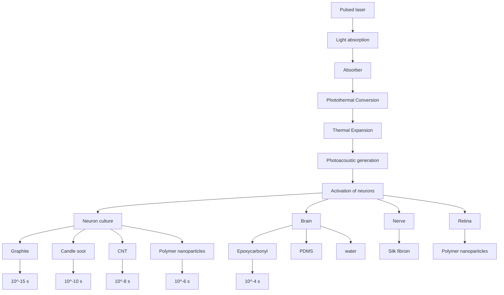
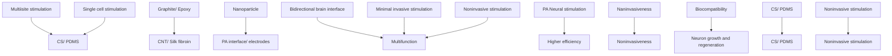
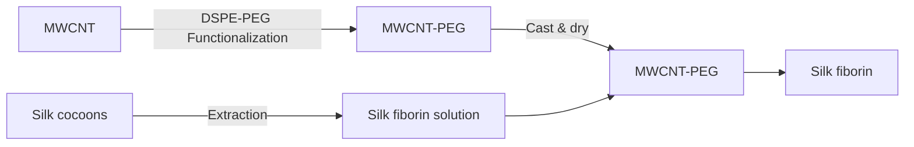

pubs.acs.org/accounts

Article

# Photoacoustic: A Versatile Nongenetic Method for High-Precision Neuromodulation

Published as part of Accounts of Chemical Research virtual special issue “Nanomaterials and Tools for Interrogation of Neurotechnology with Multi-Level Functions”.

Zhiyi Du, Guo Chen, Yueming Li, Nan Zheng, Ji-Xin Cheng, and Chen Yang

Cite This: Acc. Chem. Res. 2024, 57, 1595−1607

Read Online

## ACCESS

Metrics & More

Article Recommendations

CONSPECTUS: High-precision neuromodulation plays a pivotal role in elucidating fundamental principles of neuroscience and treating specific neurological disorders. Optical neuromodulation, enabled by spatial resolution defined by the diffraction limit at the submicrometer scale, is a general strategy to achieve such precision. Optogenetics offers single-neuron spatial resolution with cellular specificity, whereas the requirement of genetic transfection hinders its clinical application. Direct photothermal modulation, an alternative nongenetic optical approach, often associates a large temperature increase with the risk of thermal damage to surrounding tissues.

Photoacoustic (also called optoacoustic) neural stimulation is an emerging technology for neural stimulation with the following key features demonstrated. First, the photoacoustic approach demonstrated high efficacy without the need for genetic modification. The generated pulsed ultrasound upon ns laser pulses with energy ranging from a few μJ to tens of μJ is sufficient to activate wild-type neurons. Second, the photoacoustic approach

flowchart

provides sub-100-μm spatial precision. It overcomes the fundamental wave diffraction limit of ultrasound by harnessing the localized ultrasound field generated through light absorption. A spatial precision of 400 μm has been achieved in rodent brains using a fiberbased photoacoustic emitter. Single-cell stimulation in neuronal cultures in vitro and in brain slices ex vivo is achieved using tapered fiber-based photoacoustic emitters. This precision is 10 to 100 times better than that for piezo-based low-frequency ultrasound and is essential to pinpoint a specific region or cell population in a living brain. Third, compared to direct photothermal stimulation via temperature increase, photoacoustic stimulation requires 40 times less laser energy dose to evoke neuron activities and is associated with a minimal temperature increase of less than 1 °C, preventing potential thermal damage to neurons. Fourth, photoacoustics is a versatile approach and can be designed in various platforms aiming at specific applications. Our team has shown the design of fiberbased photoacoustic emitters, photoacoustic nanotransducers, soft biocompatible photoacoustic films, and soft photoacoustic lenses. Since they interact with neurons through ultrasound without the need for direct contact, photoacoustic enables noninvasive transcranial and dura-penetrating brain stimulation without compromising high precision.

In this Account, we will first review the basic principles of photoacoustic and discuss the key design elements of PA transducers for neural modulation guided by the principle. We will also highlight how these design goals were achieved from a materials chemistry perspective. The design of different PA interfaces, their unique capability, and their applications in neural systems will be reviewed. In the end, we will discuss the remaining challenges and future perspectives for this technology.

## KEY REEERENCES

• Jiang, Y.; Lee, H. J.; Lan, L.; Tseng, H. A.; Yang, C.; Man, H. Y.; Han, X.; Cheng, J. X. Optoacoustic brain stimulation at submillimeter spatial precision. Nat. Commun. 2020, 11(1), 881.1 This work demonstrated for the f irst time f iber-based photoacoustic emitters for neural stimulation. Both in vitro and in vivo neural stimulation with submillimeter spatial resolution were achieved.  
• Shi, L.; Jiang, Y.; Fernandez, F. R.; Chen, G.; Lan, L.; Man, H. Y.; White, J. A.; Cheng, J. X.; Yang, C. Non

genetic photoacoustic stimulation of single neurons by a tapered fiber optoacoustic emitter. Light Sci. Appl. 2021, 10(1), 143.2 This work reported a tapered fiber-based photoacoustic emitter for neural stimulation with single

Received: February 21, 2024

Revised: May 10, 2024

Accepted: May 13, 2024

Published: May 17, 2024

neuron and subcellular resolution. A whole-cell patch was used to measure the cellular electrophysiology response to single-cell photoacoustic stimulation in brain slices.

• Zheng, N.; Fitzpatrick, V.; Cheng, R.; Shi, L.; Kaplan, D. L.; Yang, C. Photoacoustic Carbon Nanotubes Embed ded Silk Scaffolds for Neural Stimulation and Regeneration. ACS Nano 2022, 16(2), 2292−2305.3 This work demonstrated a biocompatible photoacoustic film based on a CNT-embedded silk fibroin for neural stimulation and regeneration.  
• Li, Y.; Jiang, Y.; Lan, L.; Ge, X.; Cheng, R.; Zhan, Y.; Chen, G.; Shi, L.; Wang, R.; Zheng, N.; Yang, C.; Cheng, J. X. Optically-generated focused ultrasound for noninvasive brain stimulation with ultrahigh precision. Light Sci. Appl. 2022, 11(1), 321.4 This work develops a noninvasive photoacoustic neural stimulaiton method with 200 μm spatial resolution via a focused photoacoustic emitter.

## 1. INTRODUCTION

Neurons are the basic functional units of neural systems that generate and propagate electric signals. Modulating individual neurons alters the state of the neuron, controls the function, and modulates the corresponding behavior.5−7 To this end, neuromodulation with high precision provides an essential tool in fundamental neuroscience and treatments of specific neurological diseases when drugs are not available.8−10 Electrical neuromodulation is a commonly used method in fundamental studies and serves as the basis for implants for disease treatments. However, the current spread over millimeters could cause off-target stimulation.11 Noninvasive methods, such as transcranial magnetic stimulation (TMS)12 and transcranial direct current stimulation (tDCS),13 do not require a surgical procedure but offer a spatial resolution on the order of several millimeters. Ultrasound neuromodulation as an emerging noninvasive neuromodulation method has been demonstrated to evoke action potentials in vitro and behavioral responses in vivo in rodents,14,15 nonhuman primates,16 and human subjects.17−19 However, the millimeter-level spatial resolution of ultrasound stimulation hinders its further applications that require high-precision neural stimulation.

Optical stimulation, benefiting from the submicrometer diffraction limit of light in the visible to near-infrared (NIR) range, enables single-cell and subcellular neuromodulation. Through genetically modifying neurons with light-sensitive ion channels, optogenetics modulates neurons with high precision and cell type specificity. However, its translational potential is limited due to its requirement for genetic modification via viral transfection. Nongenetic infrared neurostimulation uses the photothermal effect to trigger neuronal activities.20 Gold nanoparticles,21 Si nanowires,22 polymers,23 and carbons24 have been used to enhance the thermal effect. Two photothermal stimulation mechanisms have been demonstrated. In the direct thermal mechanism, a temperature increase of a few degrees, induced by light, could activate thermosensitive ion channels,25,26 yet a temperature increase of a few degrees could raise safety concerns, particularly in specific clinical applications, for example, retina stimulation which can only accommodate a temperature increase of ∼1 °C. In the opto-capacitive mechanism, a rapid and transient temperature increase at a rate of kilokelvins per second upon light irradiation is needed to modulate the capacitance of the cell membrane27,28 and to drive a sufficient transmembrane capacitive current.29 However, such a steep slope of temperature increase precludes its application in vivo due to the challenges in focusing a pulsed laser through scattering tissues. New technologies and concepts are still sought to achieve nongenetic and precise neural stimulation.

Our team has recently developed high-precision nongenetic photoacoustic (PA) stimulation. In a PA process, nanosecond laser pulses are converted into acoustic waves through optical absorption by the absorbers and subsequent thermal expansion of the surrounding medium. The PA approach offers the merits of being non-contacting with a high penetration depth via ultrasound as well as high spatial precision and multiplexing capacity via photons. Enabled by chemical synthesis and material design, we have designed different materials and devices as highly efficient PA transducers, including fiber-based photoacoustic emitters,1,2,30−32 PA films,3 PA nanoparticles,33 and optically driven focused ultrasound.4 They have been applied as implants minimally invasive, and noninvasive neural interfaces for different applications. Notably, in the PA effect, the size of the generated ultrasound field is determined by the laser illumination with optical resolution.34−36 The generated broadband ultrasound with a pressure of several kPa to approximately 50 MPa and a central frequency of around 10 MHz was shown to successfully stimulate rat cortical neurons in culture, brain tissues, and rodent brains.

In this Account, we will first review the basic principle of PA and discuss the key design elements of PA transducers for neural modulation guided by the principle. We will also highlight how these design goals were achieved from the material chemistry perspective. The design of different PA interfaces, their unique capability, and their applications in neural systems will be reviewed. In the end, we will highlight the remaining challenges and future perspectives for this technology.

## 2. PRINCIPLES AND DESIGN ELEMENTS FOR PA NEURAL STIMULATION

## 2.1. Principles of PA Generation

In a photoacoustic process, laser pulses are optically absorbed by absorbers, generating transient heating through nonradiative decay and subsequent thermal expansion and compression of thermal elastomers or the surrounding medium, resulting in mechanical waves at the ultrasound frequency. A detailed mathematical and physics description has been previously reviewed.37,38 In summary, when the duration of laser irradiation is shorter than the thermal and stress dissipation time, PA signals are efficiently generated. These two requirements are called thermal confinement and stress confinement and can be described by the following equations. 39

$$
\tau_ {t h} <   \frac {L ^ {2}}{4 D} \tag {1}
$$

$$
\tau_ {s t} <   \frac {L}{\nu} \tag {2}
$$

Here, L is the linear dimension of the heated volume, D is the thermal diffusivity, and v is the speed of sound in the medium. Considering a 20-μm-thick polydimethylsiloxane (PDMS) film, a common thermal elastomer used in our design, the thermal confinement time $\tau _ { t h }$ and stress confine ment time $\tau _ { s t }$ are 885 and 17 ns, respectively. Therefore, a nanosecond pulsed laser is typically used to generate the PA effect.40 The generated PA pressure can be described by the following equation39

$$
P = \frac {\beta v ^ {2}}{C _ {p}} \alpha F \tag {3}
$$

where $\beta$ is the thermal expansion coefficient, $C _ { p }$ is the principal heat capacity at constant pressure, α is the absorption coefficient, and F is the light fluence density of the laser. Equation 3 is often reconfigured as follows by introducing the

Gruneisen parameter Γ = v $\begin{array} { r } { \Gamma = \frac { \beta \nu ^ { 2 } } { C _ { p } } } \end{array}$

$$
p = \Gamma \alpha F \tag {4}
$$

Designing PA transducers based on absorbers and thermal elastomers with larger absorption coefficients and improved Gruneisen parameters leads to more efficient PA generation. The simplified molecular model of the Gruneisen parameter for polymer-based elastomers shows the following estimate41

$$
\Gamma = 3 \sqrt {\frac {k}{2 D _ {e}}} = 3 \alpha_ {w} \tag {5}
$$

where $D _ { e }$ is the depth of the well in the potential energy, k is the bond strength, and $\alpha _ { w }$ describes the width of the potential between two repeat units which is related to the anharmonicity of the bond potential. Equation 5 highlights the importance of stronger anharmonicity of the chemical bond between repeat units for achieving greater Gruneisen parameters and, consequently, higher PA conversion efficiency.

## 2.2. Key Design Elements for PA Interfaces for Neural Stimulation

Achieving high conversion efficiency is one of the key goals in designing PA transducers. Applying these PA transducers interfacing with neural systems also imposes additional requirements. Here we review several key design elements considered and strategies utilized when developing PA interfaces for neural stimulation (Figure 1)

2.2.1. High Efficiency. The essential goal is to ensure producing a PA pressure at the level of MPa for PA stimulation. A highly efficient photoacoustic emitter is advantageous from two perspectives. First, it reduces the risk of thermal damage in neural tissues. Second, the lower energy requirement opens up the potential to apply PA stimulation in deeper tissue as it can afford more energy loss due to scattering.

Carbon materials, especially sp2 -hybridized carbon materials including graphite, CNTs, and carbon nanoparticles, are good absorber candidates. The highly delocalized π electrons enable a strong broadband absorption in the visible and near-infrared (NIR) range with over 99% light absorption in a few micrometers. Furthermore, these carbon materials maintain their optical properties under high-intensity laser irradiation due to their strong chemical stability. In the fiber-based PA transducer design we have shown that increasing the absorption coefficient of absorbers as well as the thermal expansion coefficients of thermal elastomers is a successful strategy for improving the experimental PA conversion efficiency. Specifically, the absorption coefficients from graph ite to CNTs and CS are increased by 3-fold and 4.1-fold, respectively.42 44 The thermal expansion coefficients from epoxy to PDMS are increased by approximately 4.1-fold.45,46

flowchart

Figure 1. Key design elements and goals of photoacoustic (PA) interfaces for neural stimulation. Reproduced or adapted with permission from ref 1 (copyright 2020 Nature Publishing Group), ref 2 (copyright 2021 Nature Publishing Group), ref 3 (copyright 2022 American Chemical Society), ref 4 (copyright 2022 Nature Publishing Group), ref 31 (copyright 2022 Frontiers Publishing Group), ref 32 (copyright 2023 John Wiley and Sons), and ref 33 (copyright 2021 Elsevier).

With the evolution of the PA emitters, the conversion efficiency measured experimentally is increased by 12−18- fold. The improved conversion efficiency thus enables single cell neural stimulation and multisite neural stimulation with a 31,2 minimal temperature increase.

2.2.2. Biocompatibility. Biocompatibility is the key requirement for implantable neural interfaces, especially for chronic applications. We have adapted soft and biocompatible materials, such as polydimethylsiloxane (PDMS), as thermal elastomers in the PA interfaces. We further developed a CNT and silk fibroin hydrogel-based PA film. Its excellent biocompatibility and adjustable mechanical properties and biodegradability allow neurons and neural tissues to be culturable on the silk fibroin PA film. Furthermore, we demonstrated the capacity of a silk fibroin PA film for neura stimulation and neural regeneration through PA stimulation.

2.2.3. Multifunction. cluding “write” and “read”, with dynamic local circuits inside the brain is an invaluable approach for fundamental studies of neural circuits and effective clinical treatment of neurological diseases. Additionally, the bidirectional neural interface paves the way for closed-loop control. It could enable more sophisticated real-time control over neural dynamics and behaviors and could achieve effective therapeutic effects in neurological diseases.47,48We have demonstrated a miniaturized multifunctional fiber-based optoacoustic emitter (mFOE) that for the first time integrates simultaneous optoacoustic stimulation for “write” and electrophysiology recording of neural circuits for “read”.32

2.2.4. Noninvasiveness. Compared to the implantable interface, minimally invasive neural stimulation and non invasive neural stimulation mitigate the risk of surgical procedures and are considered to be safer, most cost-effective, and accessible research tools and clinical treatments. We have developed a photoacoustic nanotransducer (PAN) which provides an exciting opportunity for minimally invasive neural modulation.33 PANs uniquely absorb NIR-II light, which has been reported to have sufficient penetration depth in a highly scattering medium and through the human skull, potentially enabling nonsurgical brain stimulatio n.49,50 Another strategy for achieving noninvasive PA brain stimulation is designing optically driven focused ultrasound, in which a soft curved PA film acts as an ultrasound lens and can be applied transcranially.4 We have demonstrated that the ultrasound focus produced is less than 100 μm in size and has achieved high-precision brain stimulation in rodents.

a  

text_image

Diffuser: ZnO/epoxy mixture
200 µm dia. fiber
Absorber: graphite/epoxy mixture
1 mm

natural_image

Fluorescence microscopy image showing cellular structures with green fluorescent markers and a white dashed arrow labeled 'FOC' pointing to a specific region (no text or symbols beyond labels)

natural_image

Microscopic image showing fluorescently labeled cells with a 500 μm scale bar (no text or symbols beyond label)

text_image

d
S1
A1
A1
c

bar chart

| Distance | LFP amplitude (μV) |
| -------- | ------------------ |
| 0        | 160                |
| 400 µm   | 35                 |
| 800 µm   | 20                 |
| 1200 µm  | 10                 |

g  

heatmap

Lateral to bregma (mm)
| Lateral to bregma (mm) | 1 | 2 | 3 |
|---|---|---|---|
| Anterior to bregma (mm) | 0.0 | 0.8 | 0.4 |
| Anterior to bregma (mm) | 1.0 | 0.8 | 0.4 |
| Anterior to bregma (mm) | 2.0 | 0.8 | 0.4 |
The image contains two sets of vertical bars: a color gradient from red (high amplitude) to blue (low amplitude), and a zoomed-in view of the left panel (labeled '150μV' and '200 ms') showing the spectral intensity distribution of the right panel. The right panel displays a red line indicating the mean or median trend, while the left panel shows a cyan line representing the mean ± standard deviation. No explicit numerical values are provided for the data points.

text_image

FOE
Bregma
Reference electrode
Recording electrode

Figure 2. High-precision brain stimulation via fiber photoacoustic emitters. (a) Schematic of a fiber optoacoustic emitter (FOE). Inset: FOE tip under a stereoscope. (b) Fluorescence image of GCaMP 6f labeled primary cortical neurons before 200 ms FOE stimulation. FOC: fiber optoacoustic converter, same as FOE. Dashed lines: placement of FOE. (c) Map of maximum ΔF/F after PA stimulation. (d) Schematic of the placement of FOE in the somatosensory cortex (S1) and primary auditory cortex (A1) and ipsilateral recording electrode in an S1 test of the spatial confinement of 200 ms FOE stimulation. (e) LFP amplitude recorded at different distances from the FOE. (f) Schematic of the modulation of motor activity by FOE stimulation. (g) Heat map showing the maximum peak-to-peak EMG response amplitude to FOE stimulation on different locations of the motor cortex. Insets: representative EMG traces from indicated locations. Reproduced or adapted with permission from ref 1. Copyright 2020 Nature Publishing Group.

In the next few sections, we will discuss each interface design in more details with respect to their key elements and specific applications.

## 3. FIBER-BASED HIGH-PRECISION PA STIMULATION

## 3.1. Brain Stimulation through a Fiber Photoacoustic Emitter (FOE)

FOE generates a confined ultrasound field at the fiber tip, acting as a PA point source. In the first generation of FOE $( { \mathrm { F i g u r e ~ } } 2 \mathsf { a } ) ,$ 1 the mixture of graphite and epoxy was coated at the tip of a 200 μm optical fiber. PA pressure of 0.48 MPa at 1 MHz was generated upon 46 $\mathrm { m J } / \mathrm { { c m } } ^ { 2 }$ laser irradiation. As shown in Figure 2b,c, with 0.48 MPa pressure, neurons within 500 μm of the FOE showed reliable stimulation, demonstrating its submillimeter spatial resolution.

FOE successfully induced direct activation in the mouse brain. FOE was placed at the surface of the mouse cortex with the dura intact (Figure 2d). A maximum of a 160 $\mu \mathrm { V }$ local field potential (LFP) signal was recorded through a microelectrode placed at the stimulation site upon FOE stimulation (Figure 2e). At 400 $\mu \mathrm { m }$ away from the stimulation site, the LFP response decreased from 160 $\mu \mathrm { V }$ to less than 40 $\mu \mathrm { V }$ (Figure 2e). The behavior response upon PA stimulation of the motor cortex by FOE was studied through electromyography (EMG) recording (Figure 2f). A strong EMG signal of $3 9 6 . 7 \pm 1 3 5 . 8$ $\mu \mathrm { V }$ was detected from the forelimb triceps brachii muscle after FOE stimulation. $\mathrm { ~ A ~ } 3 \times 3 ~ \mathrm { m m } ^ { 2 }$ area with 1 mm spacing in the motor cortex was scanned by FOE stimulation (Figure $_ { 2 \mathbf { g } } )$ . EMG showed a distinguishable strong, medium, and weak response, demonstrating the submillimeter resolution of FOE stimulation. In conclusion, FOE showed successful direct neural stimulation in both neuron cultures and mouse brains with submillimeter precision.

## 3.2. Single-Neuron PA Stimulation through a Tapered Fiber Optoacoustic Emitter (tFOE)

Taking advantage of optics, tapering the tip-coated optical fiber allows PA neural modulation with a spatial precision determined by the confinement of the generated ultrasound. We have developed tFOE, a PA emitter based on a tapered optical fiber with a 20 μm diameter, generating a localized ultrasound of ∼40 μm, a size comparable to the size of the individual neuron $( { \mathrm { F i g u r e ~ } } 3 \mathsf { a } ) . ^ { 2 }$ In addition, the ultrasound field is significantly smaller than the diffraction limit of the 10 MHz ultrasound, which is 148 μm, resulting in a point ultrasound source. Therefore, PA pressure decays with the distance away from the tFOE and results in minimized mechanical disruption essential for successful whole-cell patch clamp experiments, which was previously found challenges for transducer-based ultrasound neural stimulation.

a  

natural_image

Microscopic image of a neuron with dendrites and axon, alongside a 20 μm scale bar (no text or symbols on the neuron itself)

b  

line chart

| Time (μs) | Graphite/Epoxy | CNTs/Epoxy | Graphite/PDMS | CNTs/PDMS |
| --------- | -------------- | ---------- | ------------- | --------- |
| 0         | 0.0000         | 0.0000     | 0.0000        | 0.0000    |
| 2         | 0.0000         | 0.0000     | 0.0000        | 0.0250    |
| 4         | 0.0000         | 0.0000     | 0.0000        | -0.0150   |
| 6         | 0.0000         | 0.0000     | 0.0000        | 0.0000    |
| 8         | 0.0000         | 0.0000     | 0.0000        | 0.0000    |
| 10        | 0.0000         | 0.0000     | 0.0000        | 0.0000    |

C  

line chart

| Distance (μm) | Pressure (MPa) |
| ------------- | -------------- |
| 0             | 2.7            |
| 25            | 2.0            |
| 50            | 1.2            |
| 75            | 0.8            |
| 100           | 0.6            |
| 125           | 0.5            |
| 150           | 0.4            |
| 175           | 0.35           |
| 200           | 0.3            |
| 225           | 0.25           |
| 250           | 0.2            |
| 275           | 0.15           |
| 300           | 0.1            |

d  

text_image

Neuron 1
2.3
1.7
1.1
0.5
-0.1
D

text_image

Neuron 2
0.7
0.5
0.3
0.1
-0.1
2

text_image

Neuron 3
3

text_image

Merged
1
2
3

e  

text_image

Patch clamp
TFOE
Excitatory pyramidal cell
20 µm Inhibitory interneuron

f  

line chart

| Time (s) | Voltage (mV) |
| -------- | ------------ |
| 0        | 20           |
| 1        | ~18          |
| 2        | ~16          |
| 3        | ~14          |
| 4        | ~12          |
| 5        | ~10          |
| 6        | ~8           |
| 7        | ~6           |
| 8        | ~4           |
| 9        | ~2           |
| 10       | ~0           |
| 11       | ~2           |
| 12       | ~4           |
| 13       | ~6           |
| 14       | ~8           |
| 15       | ~10          |
| 16       | ~12          |
| 17       | ~14          |
| 18       | ~16          |
| 19       | ~18          |
| 20       | ~20          |

line chart

| Inhibitory interneuron (5 µm) (-75 mV) | Voltage (mV) |
| -------------------------------------- | ------------ |
| 0                                      | 0            |
| 1                                      | ~0           |
| 2                                      | ~0           |
| 3                                      | ~0           |
| 4                                      | ~0           |
| 5                                      | ~0           |
| 6                                      | ~0           |
| 7                                      | ~0           |
| 8                                      | ~0           |
| 9                                      | ~0           |
| 10                                     | ~0           |
| 11                                     | ~0           |
| 12                                     | ~0           |
| 13                                     | ~0           |
| 14                                     | ~0           |
| 15                                     | ~0           |
| 16                                     | ~0           |
| 17                                     | ~0           |
| 18                                     | ~0           |
| 19                                     | ~0           |
| 20                                     | ~0           |

Figure 3. Single neuron stimulation via tapered fiber optoacoustic emitters. (a) Schematic (left) and images (right) of a tapered fiber optoacoustic emitter (tFOE). (b) Pressure amplitude in the time domain using graphite/epoxy (black), CNTs/epoxy (red), graphite/PDMS (blue), and CNTs/ PDMS (green) coatings on a 200 μm fiber under the same laser condition, respectively. (c) Detected pressure plotted as a function of the distance between the needle hydrophone and tFOE. (d) Sequential 1 ms stimulation of three neurons. Max $\Delta \mathrm { F } / \bar { \mathrm { F } }$ labeled in red, yellow, and green superimposed on the fluorescence image. Scale bars: 50 μm. (e) Two-photon imaging of a patch clamp integrated with tFOE in a mouse brain slice targeting GAD2-tdTomato negative pyramidal neurons and GAD2-tdTomato positive inhibitory interneurons. (f) Membrane voltage response in an excitatory pyramidal cell and (g) inhibitory interneuron at a membrane voltage of −75 mV upon tFOE stimulation (5 ms) at a distance of 5 μm. Reproduced or adapted with permission from ref 2 (copyright 2021 Nature Publishing Group) and ref 42 (copyright 2020 Elsevier).

A mixture of CNTs and PDMS was used in tFOE as a better PA coating compared to graphite and epoxy, due to the larger absorption of CNTs and the larger thermal expansion of PDMS. In addition, in the composite design, compared to graphite, the thermal conductivity of CNTs is 1 order higher than graphite, due to the minimal phonon scattering.51 This higher thermal conductivity facilitates heat transferring from absorbers, i.e. CNTs to elastomers such as PDMS, and also contributes to an increased PA conversion coefficient. Compared to the graphite/epoxy PA emitter, the CNT/ PDMS PA emitter shows a 12 times higher PA pressure under the same laser condition (Figure 3b), confirming its higher PA conversion efficiency.52

Through a punch-through approach, a mixture of CNT/ PDMS with 15% w/w CNT was coated uniformly on the tapered optical fiber. Upon irradiation by a laser pulse energy of 6.7 μJ, tFOE generated a highly localized ultrasound field with a size of 39.6 μm diameter and a peak pressure of 2.7 MPa (Figure 3c). As shown in Figure 3d, individual neurons were selectively activated by tFOE in sequential stimulation. Our studies demonstrated both single-cell and subcellular stim: ulation by tFOE. Temporally, we have shown that a single submicrosecond acoustic pulse converted by the tFOE from a single 3 ns laser pulse is the shortest acoustic stimulus so far for successful neuron activation.

Direct measurements of the electrical response of single neurons are difficult for transducer-based ultrasound stimulation. The localized ultrasound generated by tFOE enabled performing highly stable patch-clamp recording during optoacoustic stimulation on a single neuron inside a brain slice. GAD2-tdTomato positive inhibitory interneurons and GAD2-tdTomato negative pyramidal neurons can be selectively targeted in the brain slices from mice expressing tdTomato in GAD2 interneurons (Figure 3e−g).

## 4. BIOCOMPATIBLE PA INTERFACES

When developing PA neural interfaces for implantations, biocompatibility is another key requirement. Compared to rigid metal- or semiconductor-based implants, a PA interface can be made using soft biocompatible materials, e.g., PDMS, which have a lower Young’s modulus of 1−3 MPa closer to that of soft tissues.53

Another strategy for developing a highly biocompatible PA interface is to utilize a hydrogel-based nanocomposite approach. The high water content and matching biomechanical properties of hydrogels allow them to interact with tissues seamlessly. Recently, hydrogels have been used in the interface between humans and machines.54,55 Owing to its superior biocompatibility and controllable biodegradability, silk fibroin has been widely used as the scaffold for tissue regeneration.56 We have prepared CNT/silk PA films with 20 μg/mL 1,2- distearoyl-sn-glycero-3-phosphoethanolamine-N-amino-(polyethylene glycol) (DSPE-PEG)-modified CNT uniformly dispersed in $\sin ^ { 3 }$ (Figure 4a,b). The high biocompatibility of the CNT/silk film was confirmed through in vitro and in vivo studies. The cell viability of neurons cultured on CNT/silk films was comparable to that obtained on coverslips (Figure 4c). H&E staining of histological slices of the explanted scaffold showed that the acute inflammatory response observed on day $^ { 3 , }$ which was consistent with the literature-reported mild foreign body reaction to a silk implant and was cleared by 30 days (Figure 4d).

a  

flowchart

b  

natural_image

Transparent petri dish containing a central circular sample (no text or symbols visible)

C  

bar chart

| Group          | Cell viability (%) |
| -------------- | ------------------ |
| Control        | 100                |
| CNT/Silk       | 90                 |
| Silk film + CNT | 90                 |

d  

text_image

4X
Day 3
40X
4X
Day 30
40X
(e)
(f)
(i)
(j)
csr
500 µm
50 µm
fs
csr

e  

line chart

| Time (s) | CNT/Silk light+ | CNT/Silk light- | Silk light- |
| -------- | --------------- | --------------- | ----------- |
| 0        | 0.0             | 0.0             | 0.0         |
| 5        | 0.8             | 0.0             | 0.0         |
| 10       | 0.7             | 0.0             | 0.0         |
| 15       | 0.6             | 0.0             | 0.0         |
| 20       | 0.5             | 0.0             | 0.0         |
| 25       | 0.4             | 0.0             | 0.0         |
| 30       | 0.3             | 0.0             | 0.0         |

CNT/Silk light +  

natural_image

Fluorescent microscopy image showing green-labeled cellular or molecular structures against a black background, with a dashed rectangular annotation and scale bar (no text or symbols)

CNT/Silk light -  

natural_image

Fluorescent microscopy image showing green-labeled cellular or vascular structures against a black background, with a white dashed line and scale bar (no text or symbols)

line chart

| Time (s) | Voltage (mV) |
| -------- | ------------ |
| 0        | 0.0          |
| 2        | -3.0         |
| 4        | -2.5         |
| 6        | -2.0         |
| 8        | 0.0          |
| 10       | 0.0          |

natural_image

Fluorescence microscopy image showing green-labeled cells with merged channels, labeled NF and DAPI (no text or symbols beyond labels)

natural_image

Fluorescence microscopy image showing green-labeled cells with merged channels, labeled NF and DAPI (no text or symbols beyond labels)

Figure 4. Neural stimulation and regeneration via biocompatible PA films. (a) Schematic of fabrication of CNT/silk PA films. (b) Photograph of CNT/silk PA films. (c) Cell viability of neurons cultured on silk film as a control, CNT/silk film, and silk film with freeform CNT. Error bars represent the standard deviation $\left( n = 5 \right)$ . (d) Representative images of mouse skin with CNT/silk roll implants. it, insertion tract; csr, CNT/silk roll: and f. fibroplasia and granulation tissue. (e) Representative calcium traces of a neuron cultured on a CNT/silk film within the laser illumination area and out of the laser illumination area and cultured on a silk film within the laser illumination area. (f) Extracellular recording of DRG explants cultured on the CNT/silk film. (g, h) Representative confocal images of DRGs stained for neurofilament (green): DRGs cultured on CNT/silk film $( \mathbf { g } )$ with laser illumination and (h) without laser illumination. Scale bar: 1 mm. (i, j) High-resolution confocal images of DRGs stained with Anti-Neurofilament 200 (NF) for neurites (green) and DAPI for nuclei (cyan). Scale bar: 50 μm. Reproduced or adapted with permission from ref 3 (copyright 2022 American Chemical Society).

CNT/silk films serve as growth substrates for neuron or neural tissue culture while providing the function of stimulating neurons. Notably, stimulation was achieved with a laser irradiation of $2 9 . 4 ~ \mathrm { m J } / \mathrm { c m } ^ { 2 } ,$ which corresponds to 185 kPa PA pressure (Figure 4e,f). This is substantially lower than the PA pressure used in the FOE in vitro experiments. We attributed this difference to the superior biocompatibility of CNT/silk enhancing the adhesion as a culturing subtract or scaffold, which results in a much closer distance between the PA film and neurons and less acoustic attenuation, compared to the FOE in vitro stimulation. A 1.63-fold increase in growth was observed in the PA-stimulated DRG culture compared to the DRG culture without PA stimulation, indicating the acceleration of regeneration (Figure $4 { \bf g - j } )$ . In conclusion, highly biocompatible PA film can evoke the activation of neurons or neural tissues interfacing with it, opening potentials for PA implants in brain or retina stimulation.

a  

text_image

Optical
input
Electrical
readout

b  

text_image

Optoacoustic
converter
Electrode

C

natural_image

Black mouse resting on a textured surface with scattered debris (no visible text or symbols)

d  

line chart

| Time (s) | Voltage (mV) |
| -------- | ------------ |
| 3        | 0.5          |

e  

line chart

| Time (s) | Voltage (mV) |
| -------- | ------------ |
| 2        | 0.0          |
| 4        | 0.0          |
| 6        | 0.0          |

f  

line chart

| Time (s) | Voltage (mV) |
| -------- | ------------ |
| 2        | -1.0         |
| 3        | 0.0          |
| 4        | -1.0         |
| 5        | 0.0          |
| 6        | -1.0         |
| 7        | 0.0          |
| 8        | -1.0         |
| 9        | 0.0          |
| 10       | -1.0         |

9  

line chart

| Time (s) | Voltage (mV) |
| -------- | ------------ |
| 2        | 0.0          |
| 4        | 0.0          |
| 6        | 0.0          |

h  

line chart

| Time (s) | Voltage (µV) |
| -------- | ------------ |
| 0        | 20           |
| 1        | 20           |
| 2        | 20           |
| 3        | 20           |
| 4        | 20           |
| 5        | 20           |
| 6        | 20           |
| 7        | 20           |
| 8        | 20           |
| 9        | 20           |
| 10       | 20           |
| 11       | 20           |
| 12       | 20           |
| 13       | 20           |
| 14       | 20           |
| 15       | 20           |
| 16       | 20           |
| 17       | 20           |
| 18       | 20           |
| 19       | 20           |
| 20       | 20           |

i  

scatterplot

| PC1       | Y Value |
| --------- | ------- |
| -100      | 0       |
| 0         | 50      |
| 100       | 0       |

box plot

| TimePoint | mFOE | Silica fiber |
| --------- | ---- | ------------ |
| Day 3     | 350  | 300          |
| Day 30    | 600  | 500          |

Figure 5. Bidirectional brain stimulation via multifunctional fiber-based optoacoustic emitters (mFOE). (a) Illustration of the mFOE-enabled bidirectional neural communication using a laser signal as input and an electrical signal as readout. (b) Top view of the mFOE. Scale bar: 100 μm. (c) mFOE was implanted into the hippocampus of a C57BL/6J mouse. (d−g) Simultaneous optoacoustic stimulation and electrophysiological recording performed at (d) 3 days, (e) 7 days, (f) 2 weeks, and (g) 1 month after implantation. Blue dots, the laser pulse trains. (h) Part of the filtered spontaneous activity containing two separable groups of spikes recorded by an mFOE electrode 1 month after implantation. (i) Principalcomponents analysis (PCA) of the two groups of spikes. (j) Number of neurons in the field of view with implanted fibers, calculated by counting the NeuN-positive cells for mFOE and silica fiber at 3 days and 1 month after implantation (n = 10). Reproduced or adapted with permission from ref 32 (copyright 2023 John Wiley and Sons).

## 5. MULTIFUNCTIONAL PA INTERFACE WITH RECORDING CAPABILITY

A bidirectional brain interface with both stimulation and recording functions is an important tool for fundamental studies and potential clinical treatments, and enables closed loop stimulation. To integrate the PA stimulation function with direct electrical recording in the deep brain with a single unit recording capability, a multifunctional fiber-based photo acoustic emitter (mFOE) has been developed as a bidirectional PA interface.32 Previously, Anikeeva et al. have developed multifunctional fibers to integrate optogenetic neuromodulation and electrical/chemical recording.57 Distinct from these multifunctional fibers, mFOE generates PA waves from the fiber tip to stimulate neurons nongenetically while recording the electrical responses through the surrounding microelectrodes (Figure 5a). Instead of a traditional silica fiber with a 70 GPa Young’s modulus, a polymer-based fiber with a polycarbonate (PC) core and polyvinylidene difluoride (PVDF) cladding was chosen to fabricate the mFOE with a 2.5 GPa Young’s modulus. The lower Young’s modulus results in lower bending stiffness and decreases the mechanical mismatch with tissues. To generate PA signals, the core area of the fiber was coated with a carbon black (CB)/PDMS mixture as the PA emitter (Figure 5b). Compared to CNTs, CB nanoparticles in thick polymers show less viscosity due to their low aspect ratio, low surface area, and corresponding fewer interactions with polymers, which facilitates the precise coating. 58

A PA pressure of 2.3 MPa generated by mFOE with a 41.8 μJ laser successfully stimulated the mouse brain while simultaneously recording the LFP signal through electrodes. Both functions were demonstrated in the mFOE-implanted hippocampus of C57BL/6J mice. After surgery, mice can move freely with implanted mFOE (Figure 5c). Simultaneous PA stimulation and LFP recording were performed 3 days, 7 days, 2 weeks, and 1 month after surgery (Figure 5d−g). Up to one mV LFP was detected by mFOE after delivering a NIR laser, indicating reliable PA stimulation. The decrease in the signal amplitudes can be attributed to multiple factors. For example, a glial scar formed around the implanted electrodes. These effects can not only block the propagation of the signal but also push neurons away from the electrodes, therefore reducing the amplitude of the signal. Further optimization of the electrode surface coating could improve the reliability of the record ing.59,60 Besides LFP, mFOE can also record the spike signals from neurons. As shown in Figure 5h,i, two types of spikes with different shapes were detected by mFOE 1 month after implantation. Using the flexible and biocompatible polymer fibers, the foreign body response due to the implant was reduced compared to that of the silica fiber, which was validated through increased total neuron numbers after 1 month of implantation (Figure 5j). Together, through integrating the PA emitter into a multifunctional fiber, we showed a chronic and bidirectional fiber-based interface performing PA stimulation and electric recording in the brain.

a  

text_image

NIR-IIa: 1000 – 1350 nm
Signal
direction

b  

heatmap

| Neuron ID | Value |
| --------- | ----- |
| 60        | 10    |
| 50        | 20    |
| 40        | 30    |
| 30        | 40    |
| 20        | 50    |
| 10        | 60    |

C  

bar chart

| Group | Prolonged activation | Transient activation |
|-------|----------------------|----------------------|
| + PAN - S.B. | 60 | 10 |
| - PAN - S.B. | 2 | 0 |
| + PAN - S.B. + TTX | 8 | 10 |
| + PAN + S.B. | 0 | 10 |

d  

chemical

Chemical reaction diagram showing PAN-TRPV4 antibody interaction with EDC/NHS under NH2 conditions

e  

heatmap

| Neuron ID | Time (s) |
| --------- | -------- |
| 60        | 0        |
| 50        | 5        |
| 40        | 10       |
| 30        | 15       |
| 20        | 20       |
| 10        | 25       |
| 0         | 30       |

bar chart

| Condition | Prolonged activation | Transient activation |
| --------- | -------------------- | -------------------- |
| - S.B.    | ~55                  | ~50                  |
| + S.B.    | ~55                  | ~50                  |
| - S.B. + GSK 2193874 | ~10              | ~10                  |

g  

text_image

1030 nm
laser
Recording
electrode

h  

line chart

| Time (s) | Laser on (1mV) | PAN (1mV) |
| -------- | -------------- | --------- |
| 0        | ~0             | ~0        |
| 1        | ~0             | ~0        |
| 2        | ~0             | ~0        |
| 3        | ~0             | ~0        |
| 4        | ~0             | ~0        |
| 5        | ~0             | ~0        |
| 6        | ~0             | ~0        |
| 7        | ~0             | ~0        |
| 8        | ~0             | ~0        |
| 9        | ~0             | ~0        |
| 10       | ~0             | ~0        |
| 11       | ~0             | ~0        |
| 12       | ~0             | ~0        |
| 13       | ~0             | ~0        |
| 14       | ~0             | ~0        |
| 15       | ~0             | ~0        |
| 16       | ~0             | ~0        |
| 17       | ~0             | ~0        |
| 18       | ~0             | ~0        |
| 19       | ~0             | ~0        |
| 20       | ~0             | ~0        |
| 21       | ~0             | ~0        |
| 22       | ~0             | ~0        |
| 23       | ~0             | ~0        |
| 24       | ~0             | ~0        |
| 25       | ~0             | ~0        |
| 26       | ~0             | ~0        |
| 27       | ~0             | ~0        |
| 28       | ~0             | ~0        |
| 29       | ~0             | ~0        |
| 30       | ~0             | ~0        |
| 31       | ~0             | ~0        |
| 32       | ~0             | ~0        |
| 33       | ~0             | ~0        |
| 34       | ~0             | ~0        |
| 35       | ~0             | ~0        |
| 36       | ~0             | ~0        |
| 37       | ~0             | ~0        |
| 38       | ~0             | ~0        |
| 39       | ~0             | ~0        |
| 40       | ~0             | ~0        |
| 41       | ~0             | ~0        |
| 42       | ~0             | ~0        |
| 43       | ~0             | ~0        |
| 44       | ~0             | ~0        |
| 45       | ~0             | ~0        |
| 46       | ~0             | ~0        |
| 47       | ~0             | ~0        |
| 48       | ~0             | ~0        |
| 49       | ~0             | ~0        |
| 50       | ~0             | ~0        |
| 51       | ~0             | ~0        |
| 52       | ~0             | ~0        |
| 53       | ~0             | ~0        |
| 54       | ~0             | ~0        |
| 55       | ~0             | ~0        |
| 56       | ~0             | ~0        |
| 57       | ~0             | ~0        |
| 58       | ~0             | ~0        |
| 59       | ~0             | ~0        |
| 60       | ~0             | ~0        |
| 61       | ~0             | ~0        |
| 62       | ~0             | ~0        |
| 63       | ~0             | ~0        |
| 64       | ~0             | ~0        |
| 65       | ~0             | ~0        |
| 66       | ~0             | ~0        |
| 67       | ~0             | ~0        |
| 68       | ~0             | ~0        |
| 69       | ~0             | ~0        |
| 70       | ~0             | ~0        |
| 71       | ~0             | ~0        |
| 72       | ~0             | ~0        |
| 73       | ~0             | ~0        |
| 74       | ~0             | ~0        |
| 75       | ~0             | ~0        |
| 76       | ~0             | ~0        |
| 77       | ~0             | ~0        |
| 78       | ~0             | ~0        |
| 79       | ~0             | ~0        |
| 80       | ~0             | ~0        |
| 81       | ~0             | ~0        |
| 82       | ~0             | ~0        |
| 83       | ~0             | ~0        |
| 84       | ~0             | ~0        |
| 85       | ~0             | ~0        |
| 86       | ~0             | ~0        |
| 87       | ~0             | ~0        |
| 88       | ~0             | ~0        |
| 89       | ~0             | ~0        |
| 90       | ~0             | ~0        |
| 91       | ~0             | ~0        |
| 92       | ~0             | ~0        |
| 93       | ~0             | ~0        |
| 94       | ~0             | ~0        |
| 95       | ~0             | ~0        |
| 96       | ~0             | ~0        |
| 97       | ~0             | ~0        |
| 98       | ~0             | ~0        |
| 99       | ~0             | ~0        |
| 100      | -              | -         |

The chart displays voltage (1mV) over time (1s) for two conditions: "Laser on" and "PAN". The values for "Laser on" are labeled as "1mV", and the values for "PAN" are labeled as "1mV". The data is presented in a single column format.

text_image

i
1030 nm
laser
Recording
electrode
100 µV
Reference
electrode

line chart

| Time (s) | Signal 1 | Signal 2 | Signal 3 | Signal 4 | Signal 5 |
|----------|----------|----------|----------|----------|----------|
| 0        | 0.0      | 0.0      | 0.0      | 0.0      | 0.0      |
| 0.2      | 0.0      | 0.0      | 0.0      | 0.0      | 0.0      |

Figure 6. Minimally invasive brain stimulation via PA nanotransducers (PAN). (a) Scheme of the PAN-induced neural stimulation. (b) Color maps of fluorescence changes in neurons stimulated by PANs with a 3 ms pulse train. White dashed lines indicate laser onsets. (c) Success rate analysis of PAN-induced neuron stimulation profiles in the presence/absence of synaptic blockers or TTX. Error bars denote the standard deviation (SD) (n = 60). (d) Schematic of PAN-TRPV4 synthesis. (e) Color maps of the fluorescence intensity change in neurons treated with PAN-TRPV4 without synaptic blockers. (f) Success rate analysis. Error bars denote SD (n = 60). (g) Schematic of in vivo electrophysiology measurement with directly injected PAN. (h) Representative electrophysiology curves measured in the brain region without PANs as the control group (blue) and in the PAN-treated region (red) on three mice. The blue arrow indicates that the laser is on. (i) Schematic of EMG recording with directly injected PAN. (j) Forelimb EMG response to motor cortex PAN stimulation. Data are presented as the SD. Reproduced or adapted with permission from ref 33 (copyright 2021 Elsevier).

## 6. NONINVASIVE PA STIMULATION

## 6.1. Photoacoustic Nanotransducers (PANs) toward Noninvasive PA Brain Stimulation

One potential strategy for noninvasive PA brain stimulation is to combine biocompatible nanoparticles as strong PA agents, delivery to the brain through intravenous injection, and NIR light potentially penetrating skulls (Figure 6a). We have developed photoacoustic nanotransducers (PAN) as a key component toward achieving this $\mathrm { s t r a t e g y . } ^ { 3 3 }$ Our PAN is based on semiconducting polymer (SP) bis-isoindigo-based (BTII)

that absorbs strongly in NIR. SPs also allow versatile functionalization and modification. PANs with a diameter of $5 8 . 0 \pm 5 . 2 $ nm were fabricated through nanoprecipitation and modified with amphiphilic surfactants polystyrene-block-poly-(acryl acid) (PS-b-PAA) through $\pi - \pi$ stacking. The rich carboxyl groups in PAA result in a negative surface potential, stabilizing the nanoparticles and allowing effective binding to the neuronal membrane through charge−charge interactions.61 Notably, the nanoparticle-based system exhibited a much lower efficiency of $\hat { 2 . 5 } \ \mathrm { ( P a \ m } ^ { 2 } \mathrm { ) / J }$ at a concentration of 1 mg/ mL PANs, compared to $1 3 0 \ \mathrm { \left( P a \ m ^ { 2 } \right) / J }$ exhibited in the tFOE. This reduced efficiency can be attributed to the low absorption due to the low concentration of PAN vs carbon absorbers in the fiber devices and the low Gruneisen parameter of water in the PAN system, compared to PDMS in the fiber devices. Despite the lower energy conversion efficiency, PANs can effectively stimulate neurons with a laser energy density similar to that of FOE. We attribute this efficacy to the closer proximity between the nanoparticles and neurons (∼10 nm) in comparison to FOE $( \sim 5 - \hat { 5 } 0 0 ~ \mu \mathrm { m } )$ . For an NIR laser with 21 $\mathrm { m J } / \mathrm { { c m } } ^ { 2 } ,$ , successful activation of neurons in the culture was confirmed by ${ \mathrm { C a } } ^ { 2 + }$ imaging (Figure 6b). $6 2 . 5 ~ \pm ~ 2 1 . 3 \%$ of neurons under the illumination area were activated, with 11.2 ± 4.8% direct activation and $5 1 . 3 ~ \pm ~ 1 6 . 5 \%$ prolonged activation $( { \mathrm { F i g u r e } } \quad 6 \mathsf { c } )$ . We also conjugated anti-TRPV4 antibodies on PAN to form PAN-TPRV4 to specifically target TPRV4, a mechanosensitive ion channel on the neuron membrane (Figure 6d). Compared to PAN stimulation, the response of neurons under PAN-TRPV4 stimulation shows a total successful rate of 55% and is dominated by direct activation (Figure 6e,f).

a  

text_image

Laser pulse
1.5 cm

b

line chart

| Lateral profile (mm) | Without skull | With skull |
|---|---|---|
| -0.1 | 0.15 | 0.18 |
| -0.05 | 0.25 | 0.22 |
| 0.0 | 0.95 | 0.75 |
| 0.05 | 0.45 | 0.35 |
| 0.1 | 0.15 | 0.12 |

C  

line chart

| Time (μs) | Without skull | With skull |
| --------- | ------------- | ---------- |
| 0.3       | 0.5           | 0.5        |
| 0.4       | 1.0           | 0.8        |
| 0.5       | 0.4           | 0.4        |

d  

text_image

c-Fos
DAPI
OFUS Control
1 mm

text_image

c-Fos
DAPI
Merge

text_image

c-Fos
DAPI
Merge

e  

bar chart

| Group   | % c-Fos(+) cells |
| ------- | ---------------- |
| OFUS    | 35               |
| Control | 2                |

line chart

| Condition | Voltage (mV) |
| --------- | ------------ |
| Control   | 0.2          |
| OFUS      | 0.1          |

Figure 7. Noninvasive brain stimulation via soft optoacoustic pads (SOAP). (a) Schematic of SOAP brain stimulation. Inset: photograph of SOAP. (b) The lateral resolution of optically driven focus ultrasound without and with a piece of mouse skull. (c) Time domain optoacoustic signals measured at the focus without and with a piece of mouse skull. Results were normalized to the peak pressure without the skull $\left( n = 3 \right)$ . (d) Representative images of c-Fos and DAPI staining. Red: c-Fos. Blue: DAPI. Orange outline: stimulated area. Green outline: control group in the contralateral area. Scale bar: 50 μm. (e) Statistical analysis of the percentage of c-Fos positive neurons. (f) Representative EMG recordings of 2 s SOAP stimulation and control group targeting the somatosensory cortex. Orange box: laser on. (g) EMG signals after the band-pass filter and fullwave rectifier and envelope. Reproduced or adapted with permission from ref 4 (copyright 2022 Nature Publishing Group).

Brain stimulation with PANs was performed by directly injecting PANs into the primary motor cortex of C57BL/6 mice (Figure 6g). One hour after injection, strong LFP was triggered with a 3 ms laser pulse train at 21 $\mathrm { m J } / { \mathrm { c m } } ^ { 2 }$ (Figure 6h). PAN stimulation of the motor cortex also altered the behavior (Figure 6i). $\mathrm { ~ A ~ } 4 2 8 . 8 \pm 1 1 9 . 0$ mV EMG response was triggered in the forelimb triceps brachii muscle with a 200 ms, $2 1 \mathrm { \overline { { m } } J } / \mathrm { c m } ^ { 2 }$ NIR pulse train (Figure 6j). These results suggest that PANs pave a new way to achieve minimally invasive PA stimulation methods through miniaturizing the PA interface into the nanoscale.

## 6.2. Noninvasive PA Neuromodulation via Soft Optoacoustic Pads (SOAP)

Due to the high penetration depth of ultrasound in tissues. PA interfaces that generate focused ultrasound can perform transcranial neuromodulation4 (Figure 7a). Flexible PA material based on PDMS can be shaped into a curyed ultrasound lens with a numerical aperture reaching 0.95, approximating the theoretical limit of 1, to produce an ultratight focus of 66 μm at a working distance of 2 mm (Figure 7b). This focus size is only half of the most confined ultrasound focus achieved by an ultrasound transducer operating at the same frequency of 15 MHz. With 5.4 mJ/ $\mathrm { c m } ^ { 2 }$ NIR irradiation, 29.8 MPa PA pressure was generated at the focus point of SOAP with 69% PA amplitude preserved after penetrating an intact mouse skull (Figure 7c).

The in vivo neurostimulation study via SOAP was performed on adult C57BL/6 J mice. As shown in Figure $\bar { 7 } \mathbf { d } , \mathbf { e } ,$ immunofluorescence imaging of brain slices after stimulation showed a positive c-Fos signal within a 200-μm diameter area in the focus point after a 30 min 8.5 MPa PA stimulation with a 33% duty cycle. This result demonstrates the superior spatial resolution compared to that of conven tional ultrasound, which is around a few millimeters. In addition, $0 . 4 5 8 \pm 0 . 0 3$ mV EMG signals were recorded at the hind limb with 20 cycles of PA stimulation from SOAP in the motor cortex $( { \mathrm { F i g u r e ~ } } 7 \mathrm { f } , \mathbf { g } )$ , indicating the functional outcome of the SOAP noninvasive stimulation of the mouse brain. In summary, noninvasive PA stimulation of the brain with an ultrahigh spatial resolution has been achieved through SOAP.

## 7. REMAINING CHALLENGES AND OUTLOOK

Devices and materials acting as active interfaces to modulate neuronal activities are powerful tools for fundamental studies and potential non-drug disease treatment. Our development of various PA platforms has filled an important gap in the neuromodulation field by enabling nongenetic neural stim ulation with ultrahigh spatial precision. We have demonstrated various PA forms including fiber-based emitters, nanotransducers, films, and optically driven focused ultrasound. We have further successfully applied them in neuron cultures, neural tissues, and animal studies as implantable, injectable, and noninvasive approaches.

PA has been shown as a safe neural stimulation approach. From the design perspective, first, we chose 1030 nm for PA neural stimulation, as water and brain tissue exhibit a low absorption coefficient (on the order of 100 cm−1 ) at this wavelength,62 minimizing laser−tissue interaction. Second, in the fiber-based photoacoustic emitters, the PA coating is based on strong absorbers with an absorption depth typically around 10 μm. Thus, with the coating thickness greater than the absorption depth, the majority of the laser energy is delivered through the fiber and absorbed by the PA coating, and light leaking is neglected. The mechanical index of the PA stimulation was found to be less than 1, below the FDAapproved value of 1.9 (FDA-2017-D-5372). Experimentally, our results have confirmed no tissue damage observed in vivo used in the photoacoustic brain stimulation.1,4

The molecular and cellular mechanism of PA stimulation is still unclear. Mechanistic studies of ultrasound stimulation have proposed several possible mechanisms of acoustic neuromodulation in general, which include transient sonoporation, membrane capacitance change due to mechanical deformation, and mechanosensitive ion channel involvements.63 Photoacoustics delivers distinct features, including a broader bandwidth and shorter pulse width, compared to transducer-produced ultrasound. Mechanism hypotheses need to be reexamined in the context of photoacoustic stimulation. Our work recently observed an enhancement in the direct PA stimulation through specifically targeting PANs to mechanosensitive ion channels, such as TRPV4.33 More recently, we showed that ion channels. including TRPP1. TRPP2, and TRPM4, calcium-gated and low-threshold ion channels, are also involved in the PA stimulation,64 similar to that reported by Shapiro et al. for transducer-based ultrasound neural stimulation.65

In addition, evaluation and understanding of the photo thermal effect associated with the PA process also presents opportunities to understand the molecular mechanism of these nonelectrical neurostimulation methods. Specifically, we note that less than 5% of the laser energy is converted into ultrasound by PA transducers, while the rest of the energy is dissipated into heat. Meanwhile, the temperature increase associated with successful PA stimulation is less than 1 °C,2,3,33 below the threshold of thermal activation of thermosensitive ion channels in neurons, and causes no thermal damage. More recently, using FOE, we systematically investigated PA and PT neuromodulation at the single-neuron level. Our results show that to achieve the same level of cell activation the laser energy needed for PA neurostimulation is 1 /40 of that needed for PT stimulation.64 Using a tFOE, we also compared the electrophysiology response at the single-cell level to PT and PA stimulation using patch clamp recording. Insights gained on the cellular mechanism of PA and ultrasound methods will deepen our understanding of neuroscience and facilitate the rational design of safer and more effective methods for clinical applications.

New designs of PA materials with higher PA conversion efficiency are needed. With a PA conversion of less than 5%, current PA interfaces still rely on the high power nanosecond laser to generate sufficient PA pressure for stimulation. In the current PA neural stimulation, a commercially available nanosecond laser with the size of a pencil box is utilized to produce laser pulse trains with 3−5 ns laser pulses, which were delivered through an optical fiber to the PA interface. The current light delivery system is compact, portable, and holds significant potential for applications in the research laboratory and in potential healthcare settings. We are seeking new material designs to support LED-driven PA generation, to improve accessibility, and to reduce cost for broader applications. To overcome the thermal confinement and stress confinement during PA generation, other PA generation mechanisms such as chemically induced PA generation can be considered.66

Collectively, despite the fact that PA neural stimulation is still in its early stage, our work has shown its unique advantages, including being nongenetic and high-precision, having a minimal thermal effect, flexibility, and biocompatibility, and being all-optically driven with a scale-up ability and MRI compatibility. Compared to genetic methods which often have a lower successful transfection rate in primates and impose safety risks in clinical application, the nongenetic feature of PA stimulation promises a broader potential in primate and human applications. It offers a new tool for fundamental studies in understanding how the brain functions and why the brain responds to mechanical stimuli. It also provides a new non-drug treatment in deep brain stimulation and retina stimulation, where sub-100-μm precision is needed. Photoacoustic neural stimulation is an emerging technology for high-precision, nongenetic, safe neural stimulation.

## AUTHOR INFORMATION

## Corresponding Author

Chen Yang − Department of Chemistry, Boston University, Boston, Massachusetts 02215, United States; Department of Electrical and Computer Engineering, Boston University, Boston, Massachusetts 02215, United States; orcid.org 0000-0001-9454-847X; Email: cheyang@bu.edu

## Authors

Zhiyi Du − Department of Chemistry, Boston University, Boston, Massachusetts 02215, United States  
Guo Chen − Department of Electrical and Computer Engineering, Boston University, Boston, Massachusetts 02215, United States  
Yueming Li − Department of Electrical and Computer Engineering, Boston University, Boston, Massachusetts 02215, United States  
Nan Zheng − Division of Materials Science and Engineering, Boston University, Boston, Massachusetts 02215, United States; orcid.org/0000-0002-7874-0055  
Ji-Xin Cheng − Department of Electrical and Computer Engineering and Department of Biomedical Engineering, Boston University, Boston, Massachusetts 02215, United States; orcid.org/0000-0002-5607-6683

Complete contact information is available at: https://pubs.acs.org/10.1021/acs.accounts.4c00119

## Notes

The authors declare the following competing financial interest(s): J.-X.C. and C.Y. claim conflicts of interest (COI) with Axorus, which did not support this work. Other authors claim no COI.

## Biographies

Zhiyi Du obtained a B.S. in materials physics from the University of Science & Technology of China. He is currently a Ph.D. candidate in the Department of Chemistry at Boston University.

Guo Chen obtained a B.S. in optical and electrical engineering from the Zhejiang University, China. He is currently a Ph.D. candidate in the Department of Electrical and Computer Engineering at Boston University.

Yueming Li holds a B.S. in material science and engineering from Tsinghua University as well as M.S. and Ph.D. degrees in mechanica engineering from Boston University. Currently, she is a postdoctoral researcher in the Department of Electrical and Computer Science at Boston University.

Nan Zheng holds a B.E. in materials science and engineering from the Southern University of Science and Technology as well as a Ph.D. in materials science from Boston University.

Ji-Xin Cheng has a Ph.D. in chemical physics from University of Science & Technology of China. He is currently the Moustakas Chair Professor in Photonics and Optoelectronics and a professor of biomedical engineering and of electrical and computer engineering at Boston University.

Chen Yang has a Ph.D. in chemistry from Harvard University. She is currently a professor of electrical and computer engineering and chemistry at Boston University.

## ACKNOWLEDGMENTS

This work is supported by the National Institutes of Health Brain Initiative R01 NS109794 to J.-X.C. and C.Y. and 1R21EY034275 to C.Y.

## REFERENCES

(1) Jiang, Y.; Lee, H. J.; Lan, L.; Tseng, H. A.; Yang, C.; Man, H. Y.; Han, X.; Cheng, J. X. Optoacoustic brain stimulation at submillimeter spatial precision. Nat. Commun. 2020, 11 (1), 881.  
(2) Shi, L.; Jiang, Y.; Fernandez, F. R.; Chen, G.; Lan, L.; Man, H. Y.; White, J. A.; Cheng, J. X.; Yang, C. Non-genetic photoacoustic stimulation of single neurons by a tapered fiber optoacoustic emitter. Light Sci. Appl. 2021, 10 (1), 143.  
(3) Zheng, N.; Fitzpatrick, V.; Cheng, R.; Shi, L.; Kaplan, D. L.; Yang, C. Photoacoustic Carbon Nanotubes Embedded Silk Scaffolds for Neural Stimulation and Regeneration. ACS Nano 2022, 16 (2), 2292−2305.  
(4) Li, Y.; Jiang, Y.; Lan, L.; Ge, X.; Cheng, R.; Zhan, Y.; Chen, G.; Shi, L.; Wang, R.; Zheng, N.; Yang, C.; Cheng, J. X. Optically generated focused ultrasound for noninvasive brain stimulation with ultrahigh precision. Light Sci. Appl. 2022, 11 (1), 321.  
(5) Houweling, A. R.; Brecht, M. Behavioural report of single neuron stimulation in somatosensory cortex. Nature 2008, 451 (7174), 65−8.  
(6) Zahler, S. H.; Taylor, D. E.; Wright, B. S.; Wong, J. Y.; Shvareva, V. A.; Park, Y. A.; Feinberg, E. H. Hindbrain modules differentially transform activity of single collicular neurons to coordinate move ments. Cell 2023, 186 (14), 3062−3078.  
(7) Li, C.-y. T.; Poo, M.-m.; Dan, Y. Burst Spiking of a Single Cortical Neuron Modifies Global Brain State. Science 2009, 324 (5927), 643646.  
(8) Maya-Vetencourt, J. F.; Manfredi, G.; Mete, M.; Colombo, E.; Bramini, M.; Di Marco, S.; Shmal, D.; Mantero, G.; Dipalo, M.; Rocchi, A.; DiFrancesco, M. L.; Papaleo, E. D.; Russo, A.; Barsotti, J.; Eleftheriou, C.; Di Maria, F.; Cossu, V.; Piazza, F.; Emionite, L.; Ticconi, F.; Marini, C.; Sambuceti, G.; Pertile, G.; Lanzani, G.; Benfenati, F. Subretinally injected semiconducting polymer nano particles rescue vision in a rat model of retinal dystrophy. Nat. Nanotechnol 2020, 15 (8), 698−708.  
(9) Tsai, D.; Sawyer, D.; Bradd, A.; Yuste, R.; Shepard, K. L. A very large-scale microelectrode array for cellular-resolution electrophysiology. Nat. Commun. 2017, 8 (1), 1802.  
(10) Bhuckory, M. B.; Wang, B. Y.; Chen, Z. C.; Shin, A.; Huang, T.; Galambos, L.; Vounotrypidis, E.; Mathieson, K.; Kamins, T.; Palanker, D. Cellular migration into a subretinal honeycomb-shaped prosthesis for high-resolution prosthetic vision. Proc. Natl. Acad. Sci. U. S. A. 2023, 120 (42), No. e2307380120.  
(11) Ineichen, C.; Shepherd, N. R.; Surucu, O. Understanding the Effects and Adverse Reactions of Deep Brain Stimulation: Is It Time for a Paradigm Shift Toward a Focus on Heterogenous Biophysical Tissue Properties Instead of Electrode Design Only? Front Hum Neurosci 2018, 12, 468.  
(12) Hallett, M. Transcranial magnetic stimulation and the human brain. Nature 2000, 406 (6792), 147−50.  
(13) Brunoni, A. R.; Nitsche, M. A.; Bolognini, N.; Bikson, M.; Wagner, T.; Merabet, L.; Edwards, D. J.; Valero-Cabre, A.; Rotenberg, A.; Pascual-Leone, A.; Ferrucci, R.; Priori, A.; Boggio, P. S.; Fregni, F. Clinical research with transcranial direct current stimulation (tDCS): challenges and future directions. Brain Stimul 2012, 5 (3), 175−195.  
(14) Tufail, Y.; Matyushov, A.; Baldwin, N.; Tauchmann, M. L.; Georges, J.; Yoshihiro, A.; Tillery, S. I. H.; Tyler, W. J. Transcranial Pulsed Ultrasound Stimulates Intact Brain Circuits. Neuron 2010, 66 (5), 681−694.  
(15) Tufail, Y.; Yoshihiro, A.; Pati, S.; Li, M. M.; Tyler, W. J. Ultrasonic neuromodulation by brain stimulation with transcrania ultrasound. Nat. Protoc. 2011, 6 (9), 14531470.  
(16) Deffieux, T.; Younan, Y.; Wattiez, N.; Tanter, M.; Pouget, P.; Aubry, J.-F. Low-intensity focused ultrasound modulates monkey visuomotor behavior. Curr. Biol. 2013, 23 (23), 2430−2433.  
(17) Legon, W.; Sato, T. F.; Opitz, A.; Mueller, J.; Barbour, A.; Williams, A.; Tyler, W. J. Transcranial focused ultrasound modulates the activity of primary somatosensory cortex in humans. Nature neuroscience 2014, 17 (2), 322.  
(18) Legon, W.; Bansal, P.; Tyshynsky, R.; Ai, L.; Mueller, J. K. Transcranial focused ultrasound neuromodulation of the human primary motor cortex. Sci. Rep. 2018, 8 (1), 10007.  
(19) Legon, W.; Rowlands, A.; Opitz, A.; Sato, T. F.; Tyler, W. J. Pulsed ultrasound differentially stimulates somatosensory circuits in humans as indicated by EEG and FMRI. PloS one 2012, 7 (12), No. e51177.  
(20) Wells, J.; Kao, C.; Mariappan, K.; Albea, J.; Jansen, E. D.; Konrad, P.; Mahadevan-Jansen, A. Optical stimulation of neural tissue in vivo. Opt. Lett. 2005, 30 (5), 504−6.  
(21) Yong, J.; Needham, K.; Brown, W. G.; Nayagam, B. A.; McArthur, S. L.; Yu, A.; Stoddart, P. R. Gold-nanorod-assisted near infrared stimulation of primary auditory neurons. Adv. Healthc Mater. 2014, 3 (11), 1862−8.  
(22) Fang, Y.; Jiang, Y.; Acaron Ledesma, H.; Yi, J.; Gao, X.; Weiss, D. E.; Shi, F.; Tian, B. Texturing Silicon Nanowires for Highly Localized Optical Modulation of Cellular Dynamics. Nano Lett. 2018, 18 (7), 4487−4492.  
(23) Lyu, Y.; Xie, C.; Chechetka, S. A.; Miyako, E.; Pu, K. Semiconducting Polymer Nanobioconjugates for Targeted Photo thermal Activation of Neurons. J. Am. Chem. Soc. 2016, 138 (29), 9049−52.  
(24) Rastogi, S. K.; Garg, R.; Scopelliti, M. G.; Pinto, B. I.; Hartung, J. E.; Kim, S.; Murphey, C. G. E.; Johnson, N.; San Roman, D.; Bezanilla, F.; Cahoon, J. F.; Gold, M. S.; Chamanzar, M.; Cohen Karni, T. Remote nongenetic optical modulation of neuronal activity using fuzzy graphene. Proc. Natl. Acad. Sci. U. S. A. 2020, 117 (24), 13339−13349.  
(25) Wang, Y.; Garg, R.; Cohen-Karni, D.; Cohen-Karni, T. Neural modulation with photothermally active nanomaterials. Nature Reviews Bioengineering 2023. 1 (3). 193207.  
(26) Albert, E. S.; Bec, J. M.; Desmadryl, G.; Chekroud, K.; Travo, C.; Gaboyard, S.; Bardin, F.; Marc, I.; Dumas, M.; Lenaers, G.; Hamel, C.; Muller, A.; Chabbert, C. TRPV4 channels mediate the  
infrared laser-evoked response in sensory neurons. J. Neurophysiol 2012, 107 (12), 3227−34.  
(27) Shapiro, M. G.; Homma, K.; Villarreal, S.; Richter, C. P.; Bezanilla, F. Infrared light excites cells by changing their electrical capacitance. Nat. Commun. 2012, 3, 736.  
(28) Carvalho-de-Souza, J. L.; Pinto, B. I.; Pepperberg, D. R.; Bezanilla, F. Optocapacitive Generation of Action Potentials by Microsecond Laser Pulses of Nanojoule Energy. Biophys. J. 2018, 114 (2), 283−288.  
(29) Pinto, B. I.; Bassetto, C. A. Z., Jr; Bezanilla, F. Optocapacitance: physical basis and its application. Biophys Rev. 2022, 14 (2), 569−577.  
(30) Lan, L.; Xia, Y.; Li, R.; Liu, K.; Mai, J.; Medley, J. A.; Obeng Gyasi, S.; Han, L. K.; Wang, P.; Cheng, J. X. A fiber optoacoustic guide with augmented reality for precision breast-conserving surgery. Light Sci. Appl. 2018, 7, 2.  
(31) Chen, G.; Shi, L.; Lan, L.; Wang, R.; Li, Y.; Du, Z.; Hyman, M.; Cheng, J. X.; Yang, C. High-precision neural stimulation by a highly efficient candle soot fiber optoacoustic emitter. Front Neurosci 2022, 16, 1005810.  
(32) Zheng, N.; Jiang, Y.; Jiang, S.; Kim, J.; Chen, G.; Li, Y.; Cheng, J. X.; Jia, X.; Yang, C. Multifunctional Fiber-Based Optoacoustic Emitter as a Bidirectional Brain Interface. Adv. Healthc Mater. 2023, 12 (25), No. e2300430.  
(33) Jiang, Y.; Huang, Y.; Luo, X.; Wu, J.; Zong, H.; Shi, L.; Cheng, R.; Zhu, Y.; Jiang, S.; Lan, L.; Jia, X.; Mei, J.; Man, H.-Y.; Cheng, J.-X.; Yang, C. Neural Stimulation In Vitro and In Vivo by Photoacoustic Nanotransducers. Matter 2021, 4 (2), 654−674.  
(34) Pleitez, M. A.; Khan, A. A.; Solda, A.; Chmyrov, A.; Reber, J.; Gasparin, F.; Seeger, M. R.; Schatz, B.; Herzig, S.; Scheideler, M.; Ntziachristos, V. Label-free metabolic imaging by mid-infrared optoacoustic microscopy in living cells. Nat. Biotechnol. 2020, 38 (3), 293−296.  
(35) Yao, J.; Wang, L.; Yang, J. M.; Maslov, K. I.; Wong, T. T.; Li, L.; Huang, C. H.; Zou, J.; Wang, L. V. High-speed label-free functional photoacoustic microscopy of mouse brain in action. Nat. Methods 2015, 12 (5), 407−10.  
(36) Zhu, X.; Huang, Q.; DiSpirito, A.; Vu, T.; Rong, Q.; Peng, X.; Sheng, H.; Shen, X.; Zhou, Q.; Jiang, L.; Hoffmann, U.; Yao, J. Real time whole-brain imaging of hemodynamics and oxygenation at micro-vessel resolution with ultrafast wide-field photoacoustic microscopy. Light Sci. Appl. 2022, 11 (1), 138.  
(37) Lee, T.; Baac, H. W.; Li, Q.; Guo, L. J. Efficient Photoacoustic Conversion in Optical Nanomaterials and Composites. Advanced Optical Materials 2018, 6 (24), 1800491.  
(38) Linli, S.; Ying, J.; Nan, Z.; Ji-Xin, C.; Chen, Y. High-precision neural stimulation through optoacoustic emitters. Neurophotonics 2022, 9 (3), 032207.  
(39) Xu, M.; Wang, L. V. Photoacoustic imaging in biomedicine. Rev. Sci. Instrum. 2006, 77 (4), 041101.  
(40) Attia, A. B. E.; Balasundaram, G.; Moothanchery, M.; Dinish, U. S.; Bi, R.; Ntziachristos, V.; Olivo, M. A review of clinical photoacoustic imaging: Current and future trends. Photoacoustics 2019, 16, 100144.  
(41) Krivtsov, A. M.; Kuz’kin, V. A. Derivation of equations of state for ideal crystals of simple structure. Mechanics of Solids 2011, 46 (3), 387399.  
(42) Ermolaev, G. A.; Tsapenko, A. P.; Volkov, V. S.; Anisimov, A. S.; Gladush, Y. G.; Nasibulin, A. G. Express determination of thickness and dielectric function of single-walled carbon nanotube films. Appl. Phys. Lett. 2020, 116 (23), 231103.  
(43) Smausz, T.; Kondász, B.; Gera, T.; Ajtai, T.; Utry, N.; Pintér, M.; Kiss-Albert, G.; Budai, J.; Bozóki, Z.; Szabó, G.; Hopp, B. Determination of UV-visible-NIR absorption coefficient of graphite bulk using direct and indirect methods. Appl. Phys. A: Mater. Sci. Process, 2017, 123 (10), 633.  
(44) Chang, W.-Y.; Zhang, X. A.; Kim, J.; Huang, W.; Bagal, A.; Chang, C.-H.; Fang, T.; Wu, H. F.; Jiang, X. Evaluation of Photoacoustic Transduction Efficiency of Candle Soot Nano-  
composite Transmitters. IEEE Transactions on Nanotechnology 2018, 17 (5), 985−993.  
(45) Muller, A.; Wapler, M. C.; Wallrabe, U. A quick and accurate method to determine the Poisson's ratio and the coefficient of thermal expansion of PDMS. Soft Matter 2019, 15 (4), 779−784.  
(46) Sun, Q.; Feng, Y.; Guo, J.; Wang, C. High performance epoxy resin with ultralow coefficient of thermal expansion cured by conformation-switchable multi-functional agent. Chemical Engineering Journal 2022, 450, 138295.  
(47) Cuschieri, A.; Borg, N.; Zammit, C. Closed loop deep brain stimulation: A systematic scoping review. Clin Neurol Neurosurg 2022, 223, 107516.  
(48) Sohal, V. S.; Zhang, F.; Yizhar, O.; Deisseroth, K. Parvalbumin neurons and gamma rhythms enhance cortical circuit performance. Nature 2009, 459 (7247), 698−702.  
(49) Wu, J. Y. Z.; You, L. Y.; Lan, L.; Lee, H. J.; Chaudhry, S. T.; Li, R.; Cheng, J. X.; Mei, J. G. Semiconducting Polymer Nanoparticles fo Centimeters-Deep Photoacoustic Imaging in the Second Near-Infrared Window. Adv. Mater. 2017, 29 (41), 1703403.  
(50) Hamblin, M. R. Shining light on the head: Photobiomodulation for brain disorders. BBA Clinical 2016, 6, 113−124.  
(51) Balandin, A. A. Thermal properties of graphene and nanostructured carbon materials. Nat. Mater. 2011, 10 (8), 569−81.  
(52) Shi, L.; Jiang, Y.; Zhang, Y.; Lan, L.; Huang, Y.; Cheng, J. X.; Yang, C. A fiber optoacoustic emitter with controlled ultrasound frequency for cell membrane sonoporation at submillimeter spatial resolution. Photoacoustics 2020, 20, 100208.  
(53) Wolf, M. P.; Salieb-Beugelaar, G. B.; Hunziker, P. PDMS with designer functionalities�Properties, modifications strategies, and applications. Prog. Polym. Sci. 2018, 83, 97−134.  
(54) Hu, L.; Chee, P. L.; Sugiarto, S.; Yu, Y.; Shi, C.; Yan, R.; Yao, Z.; Shi, X.; Zhi, J.; Kai, D.; Yu, H. D.; Huang, W. Hydrogel-Based Flexible Electronics. Adv. Mater. 2023, 35 (14), No. e2205326.  
(55) Yuk, H.; Wu, J.; Zhao, X. Hydrogel interfaces for merging humans and machines. Nature Reviews Materials 2022, 7 (12), 935− 952.  
(56) Kundu, B.; Rajkhowa, R.; Kundu, S. C.; Wang, X. Silk fibroin biomaterials for tissue regenerations. Adv. Drug Deliv Rev. 2013, 65 (4), 457−70.  
(57) Canales, A.; Park, S.; Kilias, A.; Anikeeva, P. Multifunctional Fibers as Tools for Neuroscience and Neuroengineering. Acc. Chem. Res. 2018, 51 (4), 829−838.  
(58) Hilarius, K.; Lellinger, D.; Alig, I.; Villmow, T.; Pegel, S.; Pötschke, P. Influence of shear deformation on the electrical and rheological properties of combined filler networks in polymer melts: Carbon nanotubes and carbon black in polycarbonate. Polymer 2013, 54 (21), 5865−5874.  
(59) Eles, J. R.; Vazquez, A. L.; Snyder, N. R.; Lagenaur, C.; Murphy, M. C.; Kozai, T. D.; Cui, X. T. Neuroadhesive L1 coating attenuates acute microglial attachment to neural electrodes as revealed by live two-photon microscopy. Biomaterials 2017, 113, 279−292.  
(60) Kozai, T. D.; Jaquins-Gerstl, A. S.i Vazquez, A. L.; Michael, A C.; Cui, X. T. Brain tissue responses to neural implants impact signal sensitivity and intervention strategies. ACS Chem. Neurosci. 2015, 6 (1), 48−67.  
(61) Dante, S.; Petrelli, A.; Petrini, E. M.; Marotta, R.; Maccione, A.; Alabastri, A.; Quarta, A.; De Donato, F.; Ravasenga, T.; Sathya, A.; Cingolani, R.; Proietti Zaccaria, R.; Berdondini, L.; Barberis, A.; Pellegrino, T. Selective Targeting of Neurons with Inorganic Nanoparticles: Revealing the Crucial Role of Nanoparticle Surface Charge. ACS Nano 2017, 11 (7), 6630−6640.  
(62) Hong, G.; Antaris, A. L.; Dai, H. Near-infrared fluorophores for biomedical imaging. Nature Biomedical Engineering 2017, 1 (1), 0010.  
(63) Blackmore, J.; Shrivastava, S.; Sallet, J.; Butler, C. R.; Cleveland, R. O. Ultrasound Neuromodulation: A Review of Results, Mechanisms and Safety. Ultrasound Med. Biol. 2019, 45 (7), 1509− 1536.  
(64) Guo, C.; Feiyuan, Y.; Linli, S.; Carolyn, M.; Zhiyi, D.; Danchen, J.; Ji-Xin, C.; Chen, Y. High-precision photoacoustic neural  
modulation uses a non-thermal mechanism. bioRxiv 2024,DOI: 10.1101/2024.02.14.580331.  
(65) Yoo, S.; Mittelstein, D. R.; Hurt, R. C.; Lacroix, J.; Shapiro, M. G. Focused ultrasound excites cortical neurons via mechanosensitive calcium accumulation and ion channel amplification. Nat. Commun. 2022, 13 (1), 493.  
(66) Ramirez-San-Juan, J. C.; Rodriguez-Aboytes, E.; Martinez-Canton, A. E.; Baldovino-Pantaleon, O.; Robledo-Martinez, A.; Korneev, N.; Ramos-Garcia, R. Time-resolved analysis of cavitation induced by CW lasers in absorbing liquids. Opt. Express 2010, 18 (9), 8735−8742.

## NOTE ADDED AFTER ASAP PUBLICATION

This article published ASAP on May 17, 2024. Additional corrections have been processed and the corrected version was reposted on May 21, 2024.

natural_image

3D molecular model of a virus-like structure with yellow filamentous body and green/red ribbons at base (no text or symbols)

CAS BIOFINDER DISCOVERY PLATFORMTM

## BRIDGE BIOLOGY AND CHEMISTRY FOR FASTER ANSWERS

Analyze target relationships compound effects, and disease pathways

Explore the platform

CAS

