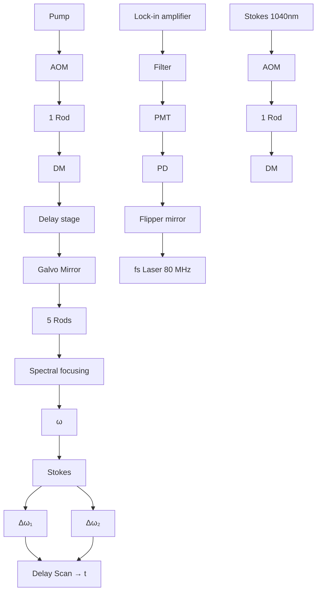

RESEARCH ARTICLE | JANUARY 15 2021

# Plasmon-enhanced coherent anti-stokes Raman scattering vs plasmon-enhanced stimulated Raman scattering: Comparison of line shape and enhancement factor 

Special Collection: Spectroscopy and Microscopy of Plasmonic Systems

Cheng Zong; Yurun Xie; Meng Zhang; Yimin Huang; Chen Yang ; Ji-Xin Cheng 

Check for updates

J. Chem. Phys. 154, 034201 (2021)

https://doi.org/10.1063/5.0035163

  
View Online

  
Export Citation

## Articles You May Be Interested In

Spectroscopy and microscopy of plasmonic systems

J. Chem. Phys. (September 2021)

Enhancement of surface phonon modes in the Raman spectrum of ZnSe nanoparticles on adsorption of 4- mercaptopyridine

J. Chem. Phys. (February 2014)

Quantum confinement effects on charge-transfer between PbS quantum dots and 4-mercaptopyridine

J. Chem. Phys. (January 2011)

natural_image

Abstract digital artwork with flowing light streaks against a dark background, no text or symbols present.

## AIP Advances

Why Publish With Us?

  
21DAYS average time to 1 st decision

  
OVER 4 MILLION views in the last year

  
INCLUSIVE scope

Learn More

  
AIP ublishing

# Plasmon-enhanced coherent anti-stokes Raman scattering vs plasmon-enhanced stimulated Raman scattering: Comparison of line shape and enhancement factor

Cite as: J. Chem. Phys. 154, 034201 (2021); doi: 10.1063/5.0035163

Submitted: 26 October 2020 • Accepted: 28 December 2020 •

Published Online: 15 January 2021

Cheng Zong,1 Yurun Xie,2 Meng Zhang,1 Yimin Huang,3 Chen Yang,1,3 and Ji-Xin Cheng1 ,3,4,a)

## AFFILIATIONS

1 Department of Electrical and Computer Engineering, Boston University, Boston, Massachusetts 02215, USA  
2State Key Laboratory of Molecular Reaction Dynamics, Dalian Institute of Chemical Physics, Chinese Academy of Sciences, Dalian 116023, China  
3Department of Chemistry, Boston University, Boston, Massachusetts 02215, USA  
4Department of Biomedical Engineering, Photonics Center, Boston University, Boston, Massachusetts 02215, USA

Note: This paper is part of the JCP Special Topic on Spectroscopy and Microscopy of Plasmonic Systems.

a)Author to whom correspondence should be addressed: jxcheng@bu.edu

## ABSTRACT

Plasmon-enhanced coherent Raman scattering microscopy has reached single-molecule detection sensitivity. Due to the different driven fields, there are significant differences between a coherent Raman scattering process and its plasmon-enhanced derivative. The commonly accepted line shapes for coherent anti-Stokes Raman scattering and stimulated Raman scattering do not hold for the plasmonenhanced condition. Here, we present a theoretical model that describes the spectral line shapes in plasmon-enhanced coherent anti-Stokes Raman scattering (PECARS). Experimentally, we measured PECARS and plasmon-enhanced stimulated Raman scattering (PESRS) spectra of 4-mercaptopyridine adsorbed on the self-assembled Au nanoparticle (NP) substrate and aggregated Au NP colloids. The PECARS spectra show a nondispersive line shape, while the PESRS spectra exhibit a dispersive line shape. PECARS shows a higher signal to noise ratio and a larger enhancement factor than PESRS from the same specimen. It is verified that the nonresonant background in PECARS originates from the photoluminescence of nanostructures. The decoupling of background and the vibrational resonance component results in the nondispersive line shape in PECARS. More local electric field enhancements are involved in the PECARS process than in PESRS, which results in a higher enhancement factor in PECARS. The current work provides new insight into the mechanism of plasmon-enhanced coherent Raman scattering and helps to optimize the experimental design for ultrasensitive chemical imaging.

Published under license by AIP Publishing. https://doi.org/10.1063/5.0035163.

## I. INTRODUCTION

Coherent Raman scattering (CRS) microscopy, including coherent anti-Stokes Raman scattering (CARS) and stimulated Raman scattering (SRS), has enabled high-speed vibrational imaging in both the high-wavenumber region and the fingerprint region and allowed for mapping of biomolecules in living systems at a video rate.1–10 CARS microscopy and SRS microscopy have been both extensively developed for various biological applications from single cells to large area tissues. 11–20

Physically, the CARS signal contains a nonresonant background due to nonlinear optical responses mediated through molecular electronic states.5 The mixing between the nonresonant and resonant contributions creates a dispersive feature in a CARS spectrum, which makes it a challenge in assignment of Raman peaks. The nonresonant contribution of bulk mediums also introduces a background offset in CARS images that could even overwhelm the vibrational peaks of low-concentration analytes. Compared to CARS, SRS microscopy is free of the nonresonant background. Thus, the SRS spectrum is identical to the spontaneous Raman spectrum and provides high contrast for target chemical components. SRS is also affected by non-Raman processes including cross-phase modulation, transient adsorption, or photothermal effect that could minimize with an optimized setup.21 In addition, unlike the CARS signal that shows a quadratic relationship with the concentration of analytes, the heterodyne-detected SRS signal has a linear concentration dependence.

Notwithstanding the advantages and attributions, the sensi tivity of CRS imaging is on the level of millimolar of inherent biomolecules. It is challenging to achieve single-molecule level measurement via CRS microscopy without additional enhancement mechanisms. Plasmonic nanostructures are known to effectively enhance local electromagnetic fields at the nanometer scale. Through such plasmonic enhancement, CARS and SRS both achieved single-molecule detection sensitivity recently. 22–25 Plasmon-enhanced CRS (PECRS) microscopy, including plasmonenhanced CARS (PECARS) and plasmon-enhanced SRS (PESRS), offers a novel platform for ultrasensitive and ultrafast vibrational spectroscopic imaging.

In standard CRS imaging experiments, the vibrational coherence is generated by the incoming light field, while, in a PECRS experiment, the molecule is driven by the near field around the plasmonic nanostructures.26 Thus, there are significant differences between a CRS process and its plasmon-enhanced derivative. For example, unlike the Lorentzian line shape in standard SRS spectra, the PESRS spectra from SiO -coated Au nanodumbbell colloids and from the aggregated Au nanoparticle (Au NP) substrate both showed dispersive line shapes.25,27–29 The asymmetric spectral features of PESRS result from the interference between the Raman signal and the plasmon field or the plasmon light emission.29–31 Meanwhile, the PECARS spectra by Scully et al. showed a dispersive line shape, caused by the interference between the CARS signal and a four-wave mixing background from the nanostructure. 32,33 In contrast, the PECARS spectra recorded by Potma et al. showed a low background without a dispersive line shape, similar to those seen in surface-enhanced Raman spectroscopy.34 However, the origin of the nondispersive feature of PECARS spectra has not been fully investigated. These observations are different from the line shapes of conventional SRS and CARS spectra obtained in the absence of a plasmonic antenna. The Van Duyne group and Potma group have independently studied the same commercial plasmonic nanostructure (SiO2-coated Au nanodumbbell) via PESRS27,28,35 and PECARS,23,34 respectively, while the laser sources, the measurement systems, and the status of nanoparticles in their experiments are totally different. Recently, Potma’s group simultaneously recorded PECARS and PESRS on an ensemble of nano-antennas. Yet, no vibrational information in the PESRS channel was recorded.36 Thus, it is valuable to record and compare PECARS and PESRS using the same plasmonic nanostructure and the same measurement setup.

Here, we present a theoretical model that describes the observed nondispersive PECARS spectra in our experiment and the dispersive PECARS spectra in previous papers. Then, we recorded PECARS and PESRS spectra from the same molecules on the same plasmonic nanostructure under the same experimental condition. Specifically, we compared the PECARS and PESRS spectra of 4-mercaptopyridine (Mpy) obtained from two kinds of common plasmonic nanostructures: self-assembled Au NP substrate and aggregated Au NP colloids. Additionally, we analyzed the origin of the nonresonant background in the PECARS spectra. Our experimental results match the theoretical prediction well.

## II. THEORY

## A. PECARS line shape

We used the classic light–matter interaction mode to describe line shapes of PECARS spectra. With a pump field (EP) at the frequency of ωP and a Stokes field (ES) at the frequency of ωP, a molecule generates an anti-Stokes signal at $\omega _ { \mathrm { a S } }$ . For CARS in the absence of the plasmonic field, the CARS intensity can be written as

$$
\begin{array}{l} \mathrm{I} _ {C A R S} = \left| P _ {a s} \right| ^ {2} = \left| i \chi^ {(3)} E _ {P} ^ {2} E _ {S} ^ {*} \right| ^ {2} = E _ {P} ^ {4} E _ {S} ^ {2} \big | \chi_ {R} ^ {(3)} + \chi_ {N R} ^ {(3)} \big | ^ {2} \\ = \left| E _ {P} \right| ^ {4} \left| E _ {S} \right| ^ {2} \left(\left| \chi_ {R} ^ {(3)} \right| ^ {2} + \left| \chi_ {N R} ^ {(3)} \right| ^ {2} + 2 \chi_ {N R} ^ {(3)} \operatorname{Re} \left(\chi_ {R} ^ {(3)}\right)\right), \tag {1} \\ \end{array}
$$

where

$$
\chi^ {(3)} = \chi_ {N R} ^ {(3)} + \chi_ {R} ^ {(3)} = \chi_ {N R} ^ {(3)} + \frac {\alpha}{\Omega_ {\nu} - (\omega_ {P} - \omega_ {S}) - i \Gamma}. \tag {2}
$$

Here, χ(3) is the third order susceptibility. Ων is the Raman vibra- $\chi ^ { ( 3 ) }$ $\Omega _ { \nu }$ tional frequency. Γ is the half width at height maximum (HWHM). α is the oscillator strength of the molecular vibration. χ(3) $\chi _ { R } ^ { ( 3 ) }$ is the resonant contribution that contains vibrational spectral information, and $\chi _ { N R } ^ { ( 3 ) }$ is the nonresonant contribution that originates from the instantaneous electronic response of the medium. In conventional CARS, χ(3) $\chi _ { N R } ^ { ( 3 ) }$ originates from the bulk medium and cannot be ignored. The mixed term in Eq. (1) between χ(3) $\chi _ { N R } ^ { ( 3 ) }$ and the real part of $\chi _ { R } ^ { ( 3 ) }$ creates the dispersive feature of a CARS spectrum.

In the case of PECARS, the anti-Stokes signal field is generated by the local enhanced pump and Stokes laser fields, and then the emission of the anti-Stokes signal is amplified by the plasmonic nanostructure. Here, we assume that the phase between the resonant and nonresonant contributions is not affected by the coupling of the molecule to the surface plasmon. Thus, the PECARS intensity is rewritten as

$$
\begin{array}{l} \mathrm{I} _ {P E C A R S} = \left| F _ {a S} P _ {a S} ^ {P E} \right| ^ {2} = \left| i \chi^ {(3)} F _ {P} ^ {2} E _ {P} ^ {2} F _ {S} E _ {S} ^ {*} \right| ^ {2} \left| F _ {a S} \right| ^ {2} \\ = \left| F _ {P} \right| ^ {4} \left| F _ {S} \right| ^ {2} \left| F _ {a S} \right| ^ {2} \left| E _ {P} \right| ^ {4} \left| E _ {S} \right| ^ {2} \left(\left| \chi_ {R} ^ {(3)} \right| ^ {2} + \left| \chi_ {N R} ^ {(3)} \right| ^ {2} + 2 \chi_ {N R} ^ {(3)} \operatorname{Re} \left(\chi_ {R} ^ {(3)}\right)\right). \tag {3} \\ \end{array}
$$

Here, the plasmon-enhanced fields are described as $\mathrm { E } _ { P } \mathrm { F } _ { P }$ and $\operatorname { E } _ { S } \operatorname { F } _ { S }$ F , F , and $\operatorname { F } _ { a S }$ are the corresponding plasmon enhancement coefficients, which are given by3

$$
F _ {\omega} = 1 + \frac {A \Delta}{\Omega_ {R} - \omega - i \Delta}, \tag {4}
$$

where $\Omega _ { R }$ is the local surface plasmon resonance frequency, Δ is the HWHM of the plasmon peak with the Lorentzian shape, and A is the local field enhancement factor (EF).

Unlike conventional CARS, the nonresonant background of PECARS is mainly contributed by either the incoherent process or the coherent process of nanostructures.26 If the nonresonant background is an incoherent process, e.g., photoluminescence, the nonresonant background is decoupled from the molecular susceptibility and χ(3) $\chi _ { N R } ^ { ( 3 ) }$ can be considered zero. In this case, the PECARS spectrum displays a nondispersive line shape. On the other hand, if the nonresonant background is a coherent process such as four-wave mixing (FWM), $\chi _ { N R } ^ { ( 3 ) }$ cannot be ignored. The interference term in Eq. (3) generates a dispersive line shape. We note that Scully et al. have proposed a theory model in which the interference between PECARS signals and FWM background leads to the dispersive line shape in their observed PECARS results.32,33 Our model is qualitatively similar to Scully’s model when the FWM background is dominant. Our model further indicates that PECARS spectra could show a nondispersive line shape, as observed in our experiment and previous work where the incoherent background is dominant.

## B. PESRS line shape

Followed our previous $\mathrm { p a p e r } , ^ { 2 9 }$ the intensity of PESRS under the plasmon resonance condition is given by

$$
\begin{array}{l} I _ {P E S R S} = - 2 \operatorname{Re} \left(E _ {P} ^ {*} E _ {S R S} ^ {P E}\right) \\ \propto - \left[ \operatorname{Im} (F _ {P}) \operatorname{Re} (\chi^ {(3)}) + \operatorname{Re} (F _ {P}) \operatorname{Im} (\chi^ {(3)}) \right]. (5) \\ I _ {P E S R S} = - 2 \operatorname{Re} \left(E _ {P} ^ {*} E _ {S R S} ^ {P E}\right) \\ \propto - \left[ \operatorname{Im} (F _ {P}) \operatorname{Re} (\chi^ {(3)}) + \operatorname{Re} (F _ {P}) \operatorname{Im} (\chi^ {(3)}) \right]. (5) \\ \end{array}
$$

Details of formula derivation can be found in our previous paper.29 Equation (5) indicates a dispersive line shape in PESRS due to the interference between the molecular susceptibility and the plasmon enhancement coefficient.

## C. Simulations

Based on Eqs. (3) and (4), we performed the simulation of PECARS spectra as a function of the ratio of the nonresonant component $\chi _ { N R } ^ { ( \bar { 3 } ) }$ to the resonant component α, as shown in Fig. 1(a). Employing a previously described protocol,29 we also simulated the PESRS spectrum, as shown in Fig. 1(b). The Raman peak is centered at 1270 cm−1 with a 7 cm−1 HWHM. The pump and Stokes beam wavelengths are centered at 921 nm and 1040 nm, respectively. The plasmon peak is kept at 800 nm, and the local field enhancement factor is 100. The HWHM of the plasmonic peak is set as $5 0 0 0 { \ c m } ^ { - 1 }$ . As expected, when the nonresonant background is zero or small, the PECARS spectra [black and red lines in Fig. 1(a)] show symmetric line shapes. When $\chi _ { N R } ^ { ( 3 ) }$ is comparable with the resonant contribution, the PECARS spectra [blue and green lines in Fig. 1(a)] exhibit dispersive line shapes. Our theoretical model and simulation results indicate that the relative magnitudes of the nonresonant part can be responsible for the appearance of dispersive and nondispersive line shapes in reported PECARS measurements. Figure 1(b) confirms that the PESRS spectrum displays a dispersive line shape.

## III. EXPERIMENT

## A. Preparation of gold nanostructures

The solid nanostructure substrate and colloid sols are the most common nanostructures in plasmon-enhanced spectroscopy. Here, we prepared two different NP substrates to demonstrate the universality of our theory. To prepare uniform Au NP substrates, we used the two-step seed-mediated growing method for the fabrication of homogeneous spherical Au NPs with a diameter of 60 nm in a highly controllable way.37 In brief, 1.2 ml of 1% (w/v) sodium citrate aqueous solution was added quickly into 100 ml of 0.01% (w/v) HAuCl solutions that were refluxed to boiling under vigorous stirring. The mixture was kept boiling for 30 min and then cooled down to room temperature. The product was used as seeds in the following step. Then, 5.8 ml of 25 mM hydroxylamine hydrochloride was slowly added into 7 ml of 30 nm Au seeds. Then, 5.8 ml of 2.5 mM HAuCl4 aqueous solution was added dropwise under vigorous shaking. The uniform 60 nm Au NPs were prepared after the mixture kept shaking for 30 min. To disperse the Au NPs uniformly on the substrate, a cover glass was thoroughly cleaned and activated by a piranha solution (a mixture of concentrated sulfuric acid and hydrogen peroxide, usually in a ratio of 3:1). After drying the cover glass by airflow, the cover glass was then treated with a 10% (v/v) of (3-aminopropyl)- trimethoxysilane ethanol solution for 24 h to silanize the surface and then baked at $1 1 0 ^ { \circ } \mathrm { C }$ for about 2 h with water vapor. Finally, the cover glass was immersed in the above 60 nm Au NP colloids for 20 h to assemble Au NPs. The morphology of the self-assembled Au NP substrate was characterized by the scanning electron microscope (SEM). As shown in Fig. 2, the SEM image of Au NP substrates indicates high density of monolayer Au NPs on the cover glass. Only a very small number of aggregates can be found on the substrate. For the PECRS test, $1 0 \mu 1$ of 57 μM Mpy solution was dropped on the asprepared Au NP substrate and dried in a vacuum before the PECRS measurement.

line chart

| Raman shift (cm⁻¹) | χ_NR/α=0 | χ_NR/α=0.01 | χ_NR/α=0.1 | χ_NR/α=0.5 |
| ------------------ | -------- | ----------- | ---------- | ---------- |
| 1150               | 0.0      | 0.0         | 0.2        | 0.7        |
| 1200               | 0.0      | 0.0         | 0.2        | 0.7        |
| 1250               | 0.1      | 0.1         | 0.1        | 0.6        |
| 1275               | 1.0      | 1.0         | 1.0        | 1.0        |
| 1300               | 0.4      | 0.4         | 0.4        | 0.8        |
| 1350               | 0.0      | 0.0         | 0.3        | 0.8        |

line chart

| Raman shift (cm⁻¹) | Normalized Intensity |
| ------------------ | -------------------- |
| 1150               | 0.4                  |
| 1200               | 0.45                 |
| 1250               | 0.6                  |
| 1275               | 1.0                  |
| 1300               | 0.0                  |
| 1350               | 0.25                 |

FIG. 1. (a) Simulated PECARS spectra as a function of the ratio of the nonresonant component $( \chi _ { N R } ^ { ( 3 ) } )$ and resonant component α. (b) Simulated PESRS spectra.

We also prepared 60 nm Au NP colloids using a citrated reduction method. In brief, 0.7 ml of 1% sodium citrate aqueous solution was added quickly into 100 ml of 0.01% (w/v) HAuCl4 solutions that are refluxed to boiling under vigorous stirring. The mixture was kept boiling for 30 min and then cooled down to room temperature. The as-prepared 10 ml Au NPs were subsequently functionalized with Mpy by adding 100 $\mu 1$ of 57 μM Mpy aqueous solution under vigorous shaking. To increase the stability of Mpy-functionalized Au

text_image

200 nm
Mag = 20.59 K X EHT = 3.00 kV Signal A = SE2 Signal B = SE2
WD = 7.7 mm Aperture Size = 30.00 µm Stage at T = 0.0 ° Date :11 Jan 2020

FIG. 2. SEM image of a self-assembled Au NP substrate.

NP colloids, 100 $\mu \mathrm { l }$ of 2% bovine serum albumin aqueous solution was added dropwise under vigorous stirring and was kept shaking for 15 min.38

## B. Hyperspectral CRS microscope

PECARS imaging and PESRS imaging were implemented on the same spectral focusing CRS microscope with some modifica tions. Figure 3 presents the scheme of the hyperspectral CRS micro scope. In our scheme, a femtosecond laser (InSight DS+, Spectra-Physics) operating at 80 MHz provides the pump and Stokes laser source. To cover the desired vibrational region, the pump beam was tuned to 921 nm and the Stokes beam to 1040 nm. The pump and Stokes pulses were equally stretched to the picosecond level, by five glass rods (SF57, 15 cm per rod) in a common path and one rod in a Stokes beam, for the spectral focusing purpose. Then, both beams were sent to a lab-built laser-scanning microscope. A 60× water immersion objective (NA = 1.2, Olympus) was used to focus the light on the sample, and an oil condenser (NA = 1.4, Olympus) was used to collect the signal. A flipper mirror after the condenser was used to select different detection paths for the PECARS and PESRS measurements. The laser powers (e.g., pump ∼100 $\mu \mathrm { W }$ and Stokes ∼100 $\mu \mathrm { W }$ on the sample) were sufficiently low to avoid the photodamage of molecules and nanostructures. To obtain the SRS signal, the Stokes beam was modulated at 2.3 MHz by an acousto-optic modulator (AOM). Two 1000 nm short-pass filters (Thorlabs) blocked the Stokes laser before a photodiode with a lab-built resonant amplifier. A lock-in amplifier demodulated the

flowchart

FIG. 3. Scheme of a spectral focusing hyperspectral coherent Raman scattering microscope with CARS and SRS detection channels. AOM: acoustooptic modulator; PMT: photomultiplier tube; PD: photodiode; DM: dichromatic mirror.

SRS signal. To obtain the CARS signal, the AOM on the Stokes beam was turned off. A photomultiplier tube (H7422-50, Hamamatsu Photonics) with an 830 nm/40 nm filter was used to collect the CARS signal. The hyperspectral PECRS data cube contained $2 0 0 \times 2 0 0 ~ \mathrm { p i x e l s } ^ { 2 }$ with 80 Raman channels. The PESRS imaging speed was about 1 min per data cube with a 10 μs dwell time per pixel. The image area $( 5 0 \times 5 0 ~ \mu \mathrm { m } ^ { 2 } )$ and pixel size (250 nm) were the same in all experiments.

## IV. RESULTS AND DISCUSSION

## A. PECARS and PESRS measurements on self-assembled Au NP substrate

We randomly measured three locations on a self-assembled Au NP substrate. Both PECARS and PESRS signals were recorded in each location. The PECARS and PESRS spectra of each location were obtained by averaging the image area. Figures 4(a) and 4(b) present raw PECARS and PESRS spectra in three locations, respectively. The resulting PECARS and PESRS spectra all consist of a narrower feature at $1 2 7 5 \mathrm { c m } ^ { - 1 }$ on the top of a strong and broad background. To extract the vibrational resonance component, we used a penalized least squares (PLS) approach to remove this broad spectral background. The fitting backgrounds are shown in Figs. 4(a) and 4(b) as the same color dashed lines for corresponding PECARS and PESRS spectra. Figures 4(c) and 4(d) show the vibrational resonant component of the PECARS and PESRS spectra obtained by the subtraction of the fitted background from the observed corresponding PECARS and PESRS signals. The average signal to noise ratio (SNR) of the PECARS spectrum is around 18.6, while the average SNR of the PESRS spectrum is around 5.6. This result indicates that PECARS provides a better SNR than PESRS. The main reason for this SNR difference is that the overall PECARS intensity enhancement is proportional to the eighth power of local electric field enhancement $\dot { ( \mathbf { g } ^ { 8 } ) } ^ { 4 0 }$ (g and the PESRS signal shows the fourth power of local electric field enhancement $( \mathbf { g } ^ { 4 } ) .$ 26

To estimate the enhancement factor (EF) of PESRS and PECARS, we calculated the power-averaged and molecule-averaged intensity between PECRS and CRS as follows:

$$
E F _ {P E C A R S} = \frac {I _ {P E C A R S} / \left(P _ {P E C A R S} ^ {2} S _ {P E C A R S} N _ {P E C A R S} ^ {2}\right)}{I _ {C A R S} / \left(P _ {C A R S} ^ {2} S _ {C A R S} N _ {C A R S} ^ {2}\right)}, \tag {6}
$$

$$
E F _ {P E S R S} = \frac {I _ {P E S R S} / \left(P _ {P E S R S} S _ {P E S R S} N _ {P E S R S}\right)}{I _ {S R S} / \left(P _ {S R S} S _ {S R S} N _ {S R S}\right)},
$$

where I is the intensity, N is the number of molecules, P is the pump power, and S is the Stokes power. The PECARS and PESRS of Mpy were measured on self-assembled Au NP substrates. The CARS and SRS were measured on the Mpy solid sample. We assumed the size of the laser spot is 1 μm and the size of Mpy is 0.5 nm2 per molecule. Based on the SEM image (Fig. 2), about 80 Au NPs were under the laser spot and a monolayer Mpy adsorbed on the Au NP surface. Thus, the number of molecules on the surface can be estimated as about $1 . 8 \times 1 0 ^ { 6 }$ . The density of Mpy is 1.161 g/ml. The number of molecules in detection volume $[ \sim \pi \times ( 0 . 5 \mu \mathrm { m } ) ^ { 2 } \times 1 \mu \mathrm { m } = 0 . 7 8 5 \mu \mathrm { m } ^ { 3 } ]$ is about $4 . 9 \times 1 0 ^ { 9 }$ for the solid sample. The experimental conditions and measurement results are shown in Table I. Following Eq. (6), the estimated EF of PECARS and PESRS is $1 . 2 \times 1 0 ^ { 1 0 }$ and $3 . 2 \times 1 0 ^ { 5 }$ , respectively. The EF of PECARS is close to the square of the EF of PESRS, which matched the theory. Considering the larger difference in EFs between PECARS and PESRS, the smaller difference in the SNR may result from that different detector and detection schemes to measure PECARS (a photomultiplier tube) and PESRS (a photodiode and lock-in amplification scheme).

In addition, the PECARS spectra of Mpy show a Lorentzian line shape and PESRS spectra of Mpy show a dispersive line shape. The dispersive line shape of PESRS spectra, consistent with our theory model, results from the local enhanced electromagnetic field induced by the plasmonic nanostructures, which interfere with the molecular dipole-induced field.29,30 The mechanism of the nondispersive feature of PECARS spectra is to be explained in Subsection IV C.

line chart

| Raman shift (cm⁻¹) | PECARS3 | PECARS3-BG | PECAR S2 | PECAR S2-BG | PECAR S1 | PECAR S1-BG |
| ------------------ | ------- | ---------- | -------- | ----------- | -------- | ----------- |
| 1150               | -1.15   | -1.15      | -1.14    | -1.14       | -1.14    | -1.14       |
| 1200               | -1.12   | -1.12      | -1.09    | -1.09       | -1.09    | -1.09       |
| 1250               | -0.98   | -0.98      | -0.76    | -0.76       | -0.76    | -0.76       |
| 1300               | -0.92   | -0.92      | -0.74    | -0.74       | -0.74    | -0.74       |
| 1350               | -0.92   | -0.92      | -0.74    | -0.74       | -0.74    | -0.74       |

line chart

| Raman shift (cm⁻¹) | PE SRS3 | PE SRS3-BG | PESR S2 | PESR S2-BG | PE SRS1 | PE SRS1-BG |
| ------------------ | ------- | ---------- | ------- | ---------- | ------- | ---------- |
| 1150               | 0.1105  | 0.1105     | 0.1105  | 0.1105     | 0.1105  | 0.1105     |
| 1200               | 0.1110  | 0.1110     | 0.1110  | 0.1110     | 0.1110  | 0.1110     |
| 1250               | 0.1115  | 0.1115     | 0.1115  | 0.1115     | 0.1115  | 0.1115     |
| 1300               | 0.1120  | 0.1120     | 0.1120  | 0.1120     | 0.1120  | 0.1120     |
| 1350               | 0.1125  | 0.1125     | 0.1125  | 0.1125     | 0.1125  | 0.1125     |
| 1400               | 0.1130  | 0.1130     | 0.1130  | 0.1130     | 0.1130  | 0.1130     |
| 1450               | 0.1135  | 0.1135     | 0.1135  | 0.1135     | 0.1135  | 0.1135     |
| 1500               | 0.1140  | 0.1140     | 0.1140  | 0.1140     | 0.1140  | 0.1140     |
| 1550               | 0.1145  | 0.1145     | 0.1145  | 0.1145     | 0.1145  | 0.1145     |
| 1600               | 0.1150  | 0.1150     | 0.1150  | 0.1150     | 0.1150  | 0.1150     |
| 1650               | 0.1155  | 0.1155     | 0.1155  | 0.1155     | 0.1155  | 0.1155     |
| 1700               | 0.1160  | 0.1160     | 0.1160  | 0.1160     | 0.1160  | 0.1160     |
| 1750               | 0.1165  | 0.1165     | 0.1165  | 0.1165     | 0.1165  | 0.1165     |
| 1800               | 0.1170  | 0.1170     | 0.1170  | 0.1170     | 0.1170  | 0.1170     |
| 1850               | 0.1165  | 0.1165     | 0.1165  | 0.1165     | 0.1165  | 0.1165     |
| 1900               | 0.1160  | 0.1160     | 0.1160  | 0.1160     | 0.1160  | 0.1160     |
| 1950               | 0.1155  | 0.1155     | 0.1155  | 0.1155     | 0.1155  | 0.1155     |
| 2000               | 0.1150  | 0.1150     | 0.1150  | 0.1150     | 0.1150  | 0.1150     |
| 2050               | 0.1145  | 0.1145     | 0.1145  | 0.1145     | 0.1145  | 0.1145     |
| 2100               | 0.1140  | 0.1140     | 0.1140  | 0.1140     | 0.1140  | 0.1140     |
| 2250               | -       | -          | -       | -          | -       | -          |
| Note: The data is already in CSV format as it is not available in the image frame numbers from the source table to be extracted from the image table data source code.

line chart

| Raman shift (cm⁻¹) | PECARS-3 | PECARS-2 | PECARS-1 |
| ------------------ | -------- | -------- | -------- |
| 1150               | ~0.000   | ~0.000   | ~0.000   |
| 1200               | ~0.000   | ~0.000   | ~0.000   |
| 1250               | ~0.044   | ~0.065   | ~0.058   |
| 1300               | ~0.000   | ~0.000   | ~0.000   |

line chart

| Raman shift (cm⁻¹) | PE SR S-3 | PE SR S-2 | PE SR S-1 |
| ------------------ | --------- | --------- | --------- |
| 1150               | ~0.0000   | ~0.0000   | ~0.0000   |
| 1200               | ~0.0000   | ~0.0000   | ~0.0000   |
| 1250               | ~0.0021   | ~0.0023   | ~0.0021   |
| 1300               | ~0.0000   | ~0.0000   | ~0.0000   |

FIG. 4. PECARS and PESRS spectra obtained from Mpy adsorbed on the Au NP substrate. (a) and (b) Three raw PECARS (a) and PESRS (b) spectra obtained from different locations. Corresponding fitting backgrounds are displayed as dashed lines. (c) and (d) Corresponding background-corrected PECARS (c) and PESRS (d) spectra.

TABLE I. Experimental conditions and estimated enhancement factor.

<table><tr><td></td><td>Signal intensity</td><td>Pump power (mW)</td><td>Stokes power (mW)</td><td>Number of molecules</td><td>EF</td></tr><tr><td>PECARS</td><td>0.089</td><td>0.1</td><td>0.1</td><td> $1.8 \times 10^{6}$ </td><td> $1.2 \times 10^{10}$ </td></tr><tr><td>CARS</td><td>6.94</td><td>5</td><td>5</td><td> $4.9 \times 10^{9}$ </td><td></td></tr><tr><td>PESRS</td><td>0.021</td><td>0.1</td><td>0.1</td><td> $1.8 \times 10^{6}$ </td><td> $3.2 \times 10^{5}$ </td></tr><tr><td>SRS</td><td>4.45</td><td>10</td><td>25</td><td> $4.9 \times 10^{9}$ </td><td></td></tr></table>

## B. PECARS and PESRS measurements on Au NP colloids

To demonstrate the universality of our observation, we studied another commonly used plasmon-enhanced nanostructure: Au NP colloids. The 1 ml Mpy-functionalized Au NP colloids were concentrated by centrifugation and then re-dispersed into 10 μl phosphate buffer solution (PBS). The Au NP colloids were dropped on a cover glass with a double-side tape spacer and then sealed by another cover glass.

We also recorded PECARS and PESRS signals of the Mpyfunctionalized Au NP colloids in randomly three locations. Due to the large aggregation of Au NPs induced by Mpy molecules and PBS, the movement of aggregated Au NP clusters could be ignored. In addition, to further decrease the intensity variation, the imaging area-averaged PECARS and PESRS spectra are present in Figs. 5(a) and 5(b). PECARS and PESRS spectra from Au NP colloids both exhibit broad backgrounds. Both are weaker than the PECARS and PESRS spectra obtained from the self-assembled substrate, which is due to the relative low density of nanostructures. The PLS algorism was employed to remove backgrounds from PECARS and PESRS spectra. The corresponding background-removal PECARS and PESRS spectra are shown in Figs. 5(c) and 5(d). Similar to the above PECARS spectra obtained from the self-assembled substrate, the peak at $1 2 7 0 ^ { \bullet } \mathrm { c m } ^ { - 1 }$ is clearly observed in the spectra obtained from Mpy-modified Au NP colloids. The weak peak at $1 2 1 5 ~ \mathrm { c m } ^ { - 1 }$ is also observed. The difference in Mpy spectra obtained from the self-assembled nanostructure and the colloids could be attributed to the different pH in a dry and aqueous environment or different molecular adsorbed orientation on the nanostructure substrate and the colloidal solution. Even so, the PECARS spectra from Au NP colloids also show a nondispersive line shape similar to those obtained on the self-assembled substrate. On the other hand, the background-corrected PESRS spectra carry no vibrational spectral information.

As far as our experiment condition is concerned, we notice that when plasmonic enhancement is involved, PESRS measurements are not necessarily favored over PECARS. Unlike the CARS spectra with a dispersive line shape, the PECARS spectrum shows a relatively undistorted line shape as we expected. On the other hand, the PESRS spectrum shows a dispersive line shape. In addition, the total enhancement of PECARS overwhelms the enhancement of PESRS because more local electric field enhancements are involved in the PECARS process than those of PESRS. These advantages make PECARS favorable for PECRS imaging.

line chart

| Raman shift (cm⁻¹) | PECARS3 | PECARS3-BG | PECAR S2 | PECAR S2-BG | PECAR S1 | PECAR S1-BG |
| ------------------ | ------- | ---------- | -------- | ----------- | -------- | ----------- |
| 1150               | -1.185  | -1.185     | -1.157   | -1.157      | -1.152   | -1.152      |
| 1200               | -1.180  | -1.180     | -1.155   | -1.155      | -1.150   | -1.150      |
| 1250               | -1.165  | -1.165     | -1.150   | -1.150      | -1.145   | -1.145      |
| 1300               | -1.160  | -1.160     | -1.145   | -1.145      | -1.140   | -1.140      |
| 1350               | -1.165  | -1.165     | -1.140   | -1.140      | -1.135   | -1.135      |

line chart

| Raman shift (cm⁻¹) | PE SR S3 | PE SR S3-BG | PE SR S2 | PE SR S2-BG | PESR S1 | PESR S1-BG |
| ------------------ | -------- | ----------- | -------- | ----------- | ------- | ---------- |
| 1150               | 0.0611   | 0.0611      | 0.0602   | 0.0602      | 0.0600  | 0.0600     |
| 1200               | 0.0611   | 0.0611      | 0.0602   | 0.0602      | 0.0600  | 0.0600     |
| 1250               | 0.0611   | 0.0611      | 0.0602   | 0.0602      | 0.0600  | 0.0600     |
| 1300               | 0.0611   | 0.0611      | 0.0602   | 0.0602      | 0.0600  | 0.0600     |

line chart

| Raman shift (cm⁻¹) | PECARS-3 | PECARS-2 | PECARS-1 |
| ------------------ | -------- | -------- | -------- |
| 1150               | ~0.000   | ~0.000   | ~0.000   |
| 1200               | ~0.000   | ~0.000   | ~0.000   |
| 1250               | ~0.028   | ~0.028   | ~0.035   |
| 1300               | ~0.000   | ~0.000   | ~0.000   |
| 1350               | ~0.000   | ~0.000   | ~0.000   |

line chart

| Raman shift (cm⁻¹) | PE SRS-3 Intensity (a.u.) | PESRS-2 Intensity (a.u.) | PE SRS-1 Intensity (a.u.) |
| ------------------ | ------------------------- | ------------------------ | ------------------------- |
| 1150               | ~0.00005                  | ~0.00003                 | ~0.00002                  |
| 1200               | ~0.00007                  | ~0.00006                 | ~0.00004                  |
| 1250               | ~0.00008                  | ~0.00007                 | ~0.00005                  |
| 1300               | ~0.00006                  | ~0.00005                 | ~0.00003                  |

FIG. 5. PECARS and PESRS spectra obtained from Mpy-functionalized aggregated Au NP colloids. (a) and (b) Three raw PECARS (a) and PESRS (b) spectra obtained from different locations. Corresponding background fittings are displayed as dashed lines. (c) and (d) Corresponding background-corrected PECARS (c) and PESRS (d) spectra of Mpy.

## C. Origin of background in PECARS spectra

To verify the above theoretical description of PECARS line shapes, we studied the origin of the background observed in our PECARS spectra. We induced the aggregation of Au NP colloids by adding 2 mM MgSO4 without Mpy molecules. Generally, the background of PECARS could be contributed by the photoluminescence (an incoherent process) and FWM (a coherent process) from metals.26 To investigate the nature of the observed background, we measured its power dependence from the aggregated Au NP colloids without Mpy, as shown in Figs. 6(a) and 6(b). The same 830 nm/40 nm filter was used for the background detection. The broad backgrounds without any sharp feature are observed. Figure 6(c) shows that the signal scales linearly with the pump and Stokes powers. Figure 6(d) shows the image of aggregated Au NPs without Mpy when illuminated with pump and Stokes beams. The bright spots present the location of aggregated Au NPs. The bulk solution does not provide any detectable signals. The imaging intensity of Fig. 6(d) is much stronger than that of the two-photon fluorescence images illuminated by Stokes beams [Fig. 6(e)] or pump beams [Fig. 6(f)] only. Our results indicate that the background of the PECARS spectrum originates from the two-photon two-wavelength photoluminescence process of nanoparticles. This result falls into line with our theoretical model that the nondispersive PECARS spectrum always companies with an incoherent background. In our PECARS results, the nonresonant background originates from the photoluminescence of nanoparticles. This incoherent process is decoupled from the resonant part. In addition, as shown in Fig. 6(d), the FWM background from the solvent without plasmon-enhanced effect is negligible. Thus, the observed PECARS spectra show a nondispersive feature due to the negligible mixed term in Eq. (3). On the other hand, PECARS spectra with a femtosecond laser were reported by Scully et al. to contain a large FWM background.32,33 The FWM nonresonant background can interfere with the resonant part and generate a dispersive line shape. Collectively, our results indicate the origin of backgrounds might be the key difference for determining the appearance of dispersive and nondispersive line shapes in different reported PECARS measurements.

We attribute the absence of the FWM signal to the laser excitation conditions. Our previous work found that the FWM of Au nanostructures could be effectively excited by femtosecond pulses but not by picosecond pulses, while the two-photon photolumines cence signals contribute most of optical responses of Au nanostructures to picosecond lasers.41 The different nonlinear optical response of Au nanostructures might be due to the discrepancy between the laser pulse duration and the plasma dephasing time of nanostructures that is usually on the femtosecond timescale.42–44 In this work, the femtosecond lasers were chirped to the picosecond timescale for hyperspectral PECARS measurement. Thus, we only observed an incoherent two-photon photoluminescence from metal nanostructures. In contrast, Scully and co-workers employed femtosecond lasers for PECARS detection and observed a strong FWM signal. Thus, a preferable PECARS spectrum with a nondispersive line shape could be obtained by optimizing the laser pulse duration and/or the dephasing time of nanostructures.

line chart

| Raman shift (cm⁻¹) | 10    | 20    | 30    | 40    | 50    | 60    | 70    | 80    |
| ------------------ | ----- | ----- | ----- | ----- | ----- | ----- | ----- | ----- |
| 1150               | -1.2  | -1.2  | -1.2  | -1.2  | -1.2  | -1.2  | -1.2  | -1.2  |
| 1200               | -1.0  | -1.0  | -1.0  | -1.0  | -1.0  | -1.0  | -1.0  | -1.0  |
| 1250               | -0.8  | -0.8  | -0.8  | -0.8  | -0.8  | -0.8  | -0.8  | -0.8  |
| 1300               | -0.6  | -0.6  | -0.6  | -0.6  | -0.6  | -0.6  | -0.6  | -0.6  |
| 1350               | -0.4  | -0.4  | -0.4  | -0.4  | -0.4  | -0.4  | -0.4  | -0.4  |

line chart

| Raman shift (cm⁻¹) | Stokes power 10 | Stokes power 20 | Stokes power 30 | Stokes power 40 | Stokes power 50 | Stokes power 60 | Stokes power 70 | Stokes power 80 |
| ------------------ | --------------- | --------------- | --------------- | --------------- | --------------- | --------------- | --------------- | --------------- |
| 1150               | -1.2            | -1.2            | -1.2            | -1.2            | -1.2            | -1.2            | -1.2            | -1.2            |
| 1200               | -1.0            | -1.0            | -1.0            | -1.0            | -1.0            | -1.0            | -1.0            | -1.0            |
| 1250               | -0.8            | -0.8            | -0.8            | -0.8            | -0.8            | -0.8            | -0.8            | -0.8            |
| 1300               | -0.6            | -0.6            | -0.6            | -0.6            | -0.6            | -0.6            | -0.6            | -0.6            |
| 1350               | -0.8            | -0.8            | -0.8            | -0.8            | -0.8            | -0.8            | -0.8            | -0.8            |

scatterplot

| log(Power) | log(Int) | Series        |
| ---------- | -------- | ------------- |
| 1.0        | 0.85     | log(Pump power) |
| 1.0        | 0.90     | log(Stokes power) |
| 1.3        | 1.25     | log(Pump power) |
| 1.4        | 1.45     | log(Stokes power) |
| 1.6        | 1.60     | log(Pump power) |
| 1.7        | 1.70     | log(Stokes power) |
| 1.8        | 1.80     | log(Pump power) |
| 1.9        | 1.85     | log(Stokes power) |
| 1.0        | 0.90     | Linear Fitting|
| 1.3        | 1.20     | Linear Fitting|
| 1.6        | 1.60     | Linear Fitting|
| 1.7        | 1.70     | Linear Fitting|
| 1.8        | 1.80     | Linear Fitting|
| 1.9        | 1.85     | Linear Fitting|

text_image

d
Pump+ Stokes

natural_image

Microscopic image showing fluorescent blue cellular structures against a black background, labeled 'Only Stokes' on the left (no other text or symbols)

text_image

f
Only Pump
10 µm

FIG. 6. Origin of non-resonant background in PECARS. (a) Pump power dependent signal obtained from aggregated Au NP colloids without Mpy. The Stokes power was kept at 50 μW. (b) Stokes power dependent signal obtained from aggregated Au NP colloids without Mpy. The pump power was kept at 50 μW. (c) Log scale of signals vs laser power. (d)–(f) Images of aggregated Au NPs without Mpy with different laser illumination statuses.

## V. CONCLUSIONS

In summary, we presented a theoretical model that explains the dispersive and nondispersive line shapes observed in differ ent PECARS experiments. In this model, the relative magnitudes of the nonresonant part determine the appearance of dispersive and nondispersive line shapes of PECARS spectra. Under the same experimental condition, we measured the PECARS and PESRS spectra of Mpy from two common plasmonic nanostructures: selfassembled Au NP substrates and aggregated Au NP colloids. For the same plasmonic nanostructures, the PECARS spectra show a nondispersive line shape, whereas the PESRS spectra exhibit a dispersive line shape, which is the opposite of the features of the CARS and SRS spectra without plasmonic fields. PECARS also has been shown to have a higher SNR than PESRS due to a much larger enhancement factor. The nonresonant background in PECARS measurement mainly originates from the photoluminescence of nanoparticles. The decoupling of the incoherent background and the vibrational resonance accounts for the undistorted line shapes in PECARS spectra. Together, the current work provides new insight into the fundamental mechanism of PECRS and helps to optimize experimental design for ultrasensitive and ultrafast chemical imaging.

## ACKNOWLEDGMENTS

This work was supported by Grant No. NIH R35 GM136223 to J.-X.C. We thank Professor Lawrence D. Ziegler for his valuable suggestions.

## DATA AVAILABILITY

The data that support the findings of this study are available from the corresponding author upon reasonable request.

## REFERENCES

1C. L. Evans, E. O. Potma, M. Puoris’haag, D. Côté, C. P. Lin, and X. S. Xie, Proc. Natl. Acad. Sci. U. S. A. 102, 16807–16812 (2005).  
2B. G. Saar, C. W. Freudiger, J. Reichman, C. M. Stanley, G. R. Holtom, and X. S. Xie, Science 330, 1368–1370 (2010).  
3J.-X. Cheng and X. S. Xie, J. Phys. Chem. B 108, 827–840 (2004).  
4C. L. Evans and X. S. Xie, Annu. Rev. Anal. Chem. 1, 883–909 (2008).  
5C. Zhang, D. Zhang, and J.-X. Cheng, Annu. Rev. Biomed. Eng. 17, 415–445 (2015).  
6C.-S. Liao and J.-X. Cheng, Annu. Rev. Anal. Chem. 9, 69–93 (2016).  
7F. Hu, L. Shi, and W. Min, Nat. Methods 16, 830–842 (2019).  
8A. Folick, W. Min, and M. C. Wang, Curr. Opin. Genet. Dev. 21, 585–590 (2011).  
9Y. Shen, F. Hu, and W. Min, Annu. Rev. Biophys. 48, 347–369 (2019).  
10C. H. Camp, Jr. and M. T. Cicerone, Nat. Photonics 9, 295–305 (2015).  
11J.-X. Cheng and X. S. Xie, Science 350, aaa8870 (2015).  
12C. H. Camp, Jr., Y. J. Lee, J. M. Heddleston, C. M. Hartshorn, A. R. H. Walker, J. N. Rich, J. D. Lathia, and M. T. Cicerone, Nat. Photonics 8, 627–634 (2014).  
13F.-K. Lu, S. Basu, V. Igras, M. P. Hoang, M. Ji, D. Fu, G. R. Holtom, V. A. Neel, C. W. Freudiger, D. E. Fisher, and X. S. Xie, Proc. Natl. Acad. Sci. U. S. A. 112, 11624–11629 (2015).  
14X. Chen, C. Zhang, P. Lin, K.-C. Huang, J. Liang, J. Tian, and J.-X. Cheng, Nat. Commun. 8, 15117 (2017).  
15J. Li, S. Condello, J. Thomes-Pepin, X. Ma, Y. Xia, T. D. Hurley, D. Matei, and J.-X. Cheng, Cell Stem Cell 20, 303–314 (2017).  
16D. A. Orringer, B. Pandian, Y. S. Niknafs, T. C. Hollon, J. Boyle, S. Lewis, M. Garrard, S. L. Hervey-Jumper, H. J. Garton, C. O. Maher et al., Nat. Biomed. Eng. 1, 0027 (2017).  
17D. Fu, J. Zhou, W. S. Zhu, P. W. Manley, Y. K. Wang, T. Hood, A. Wylie, and X. S. Xie, Nat. Chem. 6, 614–622 (2014).  
18L. Gong, W. Zheng, Y. Ma, and Z. Huang, Nat. Photonics 14, 115–122 (2020).  
19M. Zhang, W. Hong, N. S. Abutaleb, J. Li, P. T. Dong, C. Zong, P. Wang, M. N. Seleem, and J. X. Cheng, Adv. Sci. 7, 2001452 (2020).  
20L. Wei, Z. Chen, L. Shi, R. Long, A. V. Anzalone, L. Zhang, F. Hu, R. Yuste, V. W. Cornish, and W. Min, Nature 544, 465–470 (2017).  
21D. Zhang, M. N. Slipchenko, D. E. Leaird, A. M. Weiner, and J.-X. Cheng, Opt. Express 21, 13864–13874 (2013).  
22T.-W. Koo, S. Chan, and A. A. Berlin, Opt. Lett. 30, 1024–1026 (2005).  
23S. Yampolsky, D. A. Fishman, S. Dey, E. Hulkko, M. Banik, E. O. Potma, and V. A. Apkarian, Nat. Photonics 8, 650–656 (2014).  
24Y. Zhang, Y.-R. Zhen, O. Neumann, J. K. Day, P. Nordlander, and N. J. Halas, Nat. Commun. 5, 4424 (2014).  
25C. Zong, R. Premasiri, H. Lin, Y. Huang, C. Zhang, C. Yang, B. Ren, L. D. Ziegler, and J.-X. Cheng, Nat. Commun. 10, 5318 (2019).  
26A. Fast and E. O. Potma, Nanophotonics 8, 991–1021 (2019).  
27R. R. Frontiera, A.-I. Henry, N. L. Gruenke, and R. P. Van Duyne, J. Phys. Chem. Lett. 2, 1199–1203 (2011).  
28R. R. Frontiera, N. L. Gruenke, and R. P. Van Duyne, Nano Lett. 12, 5989–5994 (2012).  
29C. Zong and J.-X. Cheng, Nanophotonics 10, 617–625 (2020).  
30M. O. McAnally, J. M. McMahon, R. P. Van Duyne, and G. C. Schatz, J. Chem. Phys. 145, 094106 (2016).  
31A. Mandal, S. Erramilli, and L. D. Ziegler, J. Phys. Chem. C 120, 20998–21006 (2016).  
32X. Hua, D. V. Voronine, C. W. Ballmann, A. M. Sinyukov, A. V. Sokolov, and M. O. Scully, Phys. Rev. A 89, 043841 (2014).  
33D. V. Voronine, A. M. Sinyukov, X. Hua, E. Munusamy, G. Ariunbold, A. V. Sokolov, and M. O. Scully, J. Mod. Opt. 62, 90–96 (2015).  
34K. T. Crampton, A. Zeytunyan, A. S. Fast, F. T. Ladani, A. Alfonso-Garcia, M. Banik, S. Yampolsky, D. A. Fishman, E. O. Potma, and V. A. Apkarian, J. Phys. Chem. C 120, 20943–20953 (2016).  
35L. E. Buchanan, N. L. Gruenke, M. O. McAnally, B. Negru, H. E. Mayhew, V. A. Apkarian, G. C. Schatz, and R. P. Van Duyne, J. Phys. Chem. Lett. 7, 4629–4634 (2016).  
36K. T. Crampton, A. Fast, E. O. Potma, and V. A. Apkarian, Nano Lett. 18, 5791–5796 (2018).  
37X.-S. Zheng, P. Hu, J.-H. Zhong, C. Zong, X. Wang, B.-J. Liu, and B. Ren, J. Phys. Chem. C 118, 3750–3757 (2014).  
38X.-S. Zheng, P. Hu, Y. Cui, C. Zong, J.-M. Feng, X. Wang, and B. Ren, Anal. Chem. 86, 12250–12257 (2014).  
39Z.-M. Zhang, S. Chen, and Y.-Z. Liang, Analyst 135, 1138–1146 (2010).  
40C. Steuwe, C. F. Kaminski, J. J. Baumberg, and S. Mahajan, Nano Lett. 11, 5339–5343 (2011).  
41Y. Jung, H. Chen, L. Tong, and J.-X. Cheng, J. Phys. Chem. C 113, 2657–2663 (2009).

42S. Park, M. Pelton, M. Liu, P. Guyot-Sionnest, and N. F. Scherer, J. Phys. Chem. C 111, 116–123 (2007).

43J. Yang, Q. Sun, K. Ueno, X. Shi, T. Oshikiri, H. Misawa, and Q. Gong, Nat. Commun. 9, 4585 (2018).

44G. V. Hartland, Chem. Rev. 111, 3858–3887 (2011).