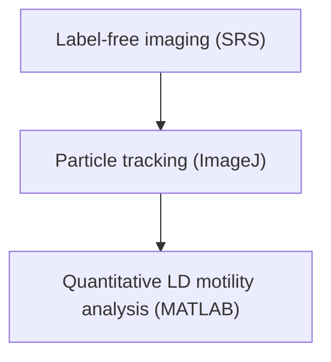

# Quantification of Lipid Metabolism in Living Cells through the Dynamics of Lipid Droplets Measured by Stimulated Raman Scattering Imaging

Chi Zhang,† Junjie Li,† Lu Lan, and Ji-Xin Cheng\*

Weldon School of Biomedical Engineering, Purdue University. 206 S. Martin Jischke Drive, West Lafayette, Indiana 47906, United States

5 Supporting Information

ABSTRACT: Dysregulation of lipid metabolism is associated with many diseases including cancer. Lipid droplet (LD), a ubiquitous organelle in mammalian cells, serves as a hub for lipid metabolism. Conventional assays on the measurement of lipid metabolism rely on the quantification of the lipid composition or amount. Such methods cannot distinguish LDs having different biofunctionalities in living cells, and thus could be inaccurate in measuring the instantaneous lipogenesis of the living cells. We applied label-free stimulated Raman scattering microscopy to quantify the LDs’ spatial-temporal dynamics, which showed direct links to cellular lipid metabolisms and can separate LDs involved in different metabolic events. In human cancer cells, we found that changes in the maximum displacement of LDs reflected variations in cellular lipogenic activity, and changes in the average speed of LDs revealed alterations in LD size. The LD dynamics analysis allowed for more accurate measurement in the lipogenesis and LD dimensions, and can break the optical diffraction limit to detect

small variation in lipid metabolism that was conventionally undetectable. By this method, we revealed changes in the lipogenic activity and LD sizes during glucose starvation of HeLa cells and transforming growth factor beta-induced epithelial-tomesenchymal transition of SKOV-3 cells. This method opens a way to quantify lipid metabolism in living cells during cellular development and transition.

text_image

Pump & Stokes beams
lipid droplet
TAG EE
CE eG
maxd
sp-f
t
maxd
lipogenesis
0 1 2 3 4 5
maxd (cm)
sp
lipid droplet size
0.5 0.1 0.7 0.3
(σ (μm)

M ammalian cells deposit excess lipid molecules obtained from endogenous synthesis or extracellular uptake in cytoplasmic lipid droplets (LDs), the hub for lipid metabolism.1 The biogenesis of fatty acids and the formation of LDs occur on the endoplasmic reticulum (ER), where the fatty acids are converted to triglycerides for storage.2 The mature LDs are then transported into cytosol along the cytoskeleton, primarily microtubules, and are degraded by lipases or autophagy to release the fatty acids.3 For a long time, LDs were perceived as simple inert lipid reservoirs without definitive biological function.4 In the past decades, substantial evidence has broken this conventional thinking and revealed LDs as dynamic organelles involved in many vital functions such as energy production, membrane synthesis, protein degradation, and signaling.2 The dysregulation of lipid metabolism has been linked to many human diseases such as obesity, cancers, and other metabolic disorders. For example, increased number of LDs has been widely reported to be associated with multiple cancers;5 degradation of LDs by lipolysis has been shown to promote cancer progression;6 accumulation of cholesteryl ester in LDs has been linked to cancer aggressiveness.5,7 Therefore, quantitative analysis of LD activities may provide crucial information to study such disease-related lipid metabolism changes.

Conventionally, lipid metabolism is mainly studied by measurements of lipid contents or compositions. Methods such as mass spectrometry, nuclear magnetic resonance spectroscopy, and chromatography quantify the lipid amount and distinguish different lipid species in a lipid pool extracted from a large number of cells.8−10 Imaging techniques, such as electron microscopy or immunofluorescence microscopy, can visualize the morphology of individual LDs.11−14 However, these methods either cannot provide the spatial information at a single-cell level or are not applicable to living cells. LDs are highly dynamic organelles.1,4,15 The dynamics of LDs contains rich information to improve understanding of lipid metabo lism.1,4,15 Fluorescence microscopy, together with fluorephoreconjugated lipids, lipid binding probes, or lipid soluble dyes has been used to study the dynamics of LDs.16,17 The fluorephore conjugation or binding probes may alter the biophysical properties of the lipids, thus affecting the function of the lipid for understanding of lipid metabolism.18 Lipid soluble dyes such as BODIPY and Nile red have low specificity for lipids and can cause perturbation to biological functionality.19,20 LDs can be imaged by label-free microscopies. Because of the refractive index difference, LDs can be seen by phase contrast, differential interference contrast, and quantitative phase imaging microscopes. 21−23 Third harmonic generation micros-

Received: November 27, 2016

Accepted: March 27, 2017

Published: March 27, 2017

copy has also been used to image LDs in a label-free manner.24 However, these methods do not contain chemical information and specificity. Raman microscopy can visualize detailed chemical compositions of lipid droplets.25,26 Nevertheless, Raman scattering has a very low signal level and requires long image acquisition time; thus, is not able to image the dynamics of LDs in living cells. Recently developed coherent Raman scattering microscopies, including coherent anti-Stokes Raman scattering (CARS) microscopy and stimulated Raman scattering (SRS) microscopy, have been widely used in the study of LDs.5,27−40 $\mathrm { L D s . } ^ { 5 , 2 7 - 4 0 }$ CARS and SRS can quantify the LD 30,33,37 36,37 and compositions.5,38 However, the spatial-temporal dynamics of LDs, which plays an important role in understanding the lipid metabolism, has been generally ignored despite a few research studies that have been published. Using CARS, Nan et al. monitored LD subdiffusion and active transportation in steroidogenic mouse adrenal cortical (Y-1) cells.41 Dou et al. tracked LD motion in early drosophila embryos using SRS microscopy.32 There has not been any research investigating the relationship between LD dynamics and cell metabolism.

In this work, we used SRS microscopy to study the correlation between the dynamics of LDs and the cell metabolism. By tracking the LD movements and statistically analyzing the LD dynamics, we for the first time show that the dynamics of LDs can be used to measure lipid metabolism in living cells, including the changes in the lipogenic activity and the statistical alternation in LD size. We found that the LD dynamic analysis can not only distinguish LDs with different biological functionalities but also detect changes in the lipid metabolism that are undetectable using conventional methods.

## EXPERIMENTAL SECTION

A schematic of a lipid abundant LD is shown in Figure 1a, which includes a large amount of accumulated triglycerides and cholesteryl esters, a single-layer phospholipid membrane, and membrane proteins. To image the LDs, we tuned the laser beams to excite the Raman transition at $2 8 5 0 ~ \mathrm { ~ c m } ^ { - 1 } ,$ , corresponding to the $\mathrm { C H } _ { 2 }$ symmetric stretching from the acyl chains in the triglycerides or sterol esters accumulated in the LDs. Other organelles such as mitochondria or lysosomes, having much less lipid composition than $\mathrm { L D } s ,$ contribute little signal at this Raman transition. Unlike use of the fluorescent dyes, such as BODIPY, SRS imaging did not perturb living cell functionalities. This label-free manner ensures the accuracy in the quantification of LD dynamics using SRS microscopy.

To study the LD dynamics, we consecutively acquired 60 images in 2 min to build an image stack. The image stack was imported to a particle-tracking software (Particle Tracker, a ImageJ plugin software) for quantitative LD trajectory tracking.42 All the LD trajectories were saved and processed by a lab-written MATLAB-based program so that all the necessary parameters can be calculated and analyzed. Our experimental workflow is demonstrated in Figure 1b. As an example, the trajectory of an LD in a MIA PaCa-2 cell (Movie S1 in the Supporting Information) is displayed in Figure 1c, from which we found that the LD moved to different locations as a function of time. Figure 1d replots the trajectory of the LD and defines several parameters we used for analysis. The maximum displacement (maxd) is the largest value of the LD displacement (d) from the initial position. The average speed (sp) of an LD is defined as the total trajectory length divided by the total time. The maxd value can be used to discriminate the two types of LD movements in living cells:41 the random Brownian-like diffusive movement (smaller maxd value) and the active transportation along microtubules (larger maxd value). By control of the LD active transportation using nocodazole, an inhibitor of microtubule polymerization, we have confirmed that the inhibition of LD active transportation can significantly decrease the value of maxd (Figure S1). The sp value was used to interrogate the sizes of LD since larger LDs correspond to smaller sp value (more details see Supporting Information III).

text_image

a
membrane protein
phospholipid membrane
TAG
CE

text_image

C
t= 0 s
t= 40 s
t= 99 s
t= 124 s

flowchart

text_image

Trajectory
maxd
l
d
sp = l/t

Figure 1. (a) A schematic of a lipid droplet. TAG, triglyceride; CE, cholesteryl ester. (b) Workflow of the quantitative LD dynamics analysis. (c) The trajectory of a single LD in a MIA PaCa-2 cell. At the four time points, the LD moved to different locations. The green lines plot trajectories at the four time points starting from t = 0 s. The scale bar is 5 μm. (d) The same LD trajectory (green line) in 124 s as displayed in panel (c). The definitions of LD displacement (d), maximum displacement (maxd), trajectory length (l), and average speed (sp) are illustrated using this trajectory.

## MAXIMUM DISPLACEMENT OF LIPID DROPLETS MEASURES LIPOGENIC ACTIVITY OF LIVING CELLS

The lipogenic activity of living cells has been estimated by using the total amount of lipid components obtained from imaging.33,43 Such a method, however, does not consider the differences among individual LDs in the cells. At a specific time, an LD might be growing due to lipogenesis, or it might be shrinking due to lipolysis. When cells change their lipogenic activity, the ratio between these two pools of LDs would change. Such a change can reflect the instantaneous alternation in lipogenic activity. The measurement on the total amount of lipids, which is incapable of separating the two types of LDs, may not be able to accurately evaluate the instant lipogenic activity. On the other hand, from the LD dynamics analysis, we found that the maxd value can be used to distinguish LDs related to different activities. From the analysis in LD trajectories, we discovered two distinct groups of LDs in a cell. One group of LDs tended to conduct a diffusive-like motion, having very small value in maxd. The other group of LDs, in contrast, tended to be actively transported to a different location in the cytosol within the acquisition time, showing a much larger value in maxd. It is known that LDs form from the ER membrane by depositing newly synthesized fatty acids in forms of triglycerides or cholesteryl esters in the LDs. After formation, ER-associated LDs are released into the cytosol and transported to other locations. We speculated that the group of LDs associated more with the diffusive motion were associated with ER, which limited their active transportation. To test this, we used ER-tracker staining in MIA PaCa-2 (Figure 2a) and

a  
MIA PaCa-2  

b  

bar chart

| Group   | Percentage (%) |
| ------- | -------------- |
| CS-LD   | 90             |
| ER-LD   | 10             |

C  
HeLa  

d  

bar chart

| Group | Percentage (%) |
|-------|----------------|
| CS-LD | 85             |
| ER-LD | 15             |

Figure 2. Differentiating the ER-LD from the CS-LD. (a) Top left: An image showing the LDs (red) in a MIA PaCa-2 cell, measured by SRS. Top right: An image showing the ER (green) in a MIA PaCa-2 cell, measured by two-photon excitation fluorescence (TPEF). Bottom left: Merged SRS and TPEF images. Bottom right: The trajectories of LDs in the cell are shown in color curves. The dashed lines mark the boundary of the ER according to ER-tracker signal. (b) The percentage of CS-LDs and ER-LDs having maxd > 1.1 μm in MIA PaCa-2 cells. (c) and (d) are similar imaging and analysis as those in (a) and (b), respectively, for HeLa cells. Colors in panel (a) and (c) are false colors added for image interpretation.

HeLa (Figure 2c) cells, followed by LD tracking and quantitative analysis. The results showed that more than 80% of cytosol LDs (CS-LD) but less than 15% of ER-associated LDs (ER-LD) have a maxd value greater than 1.1 μm (Figure 2b, 2d). Since the ER-LDs are more associated with lipognesis and CS-LDs are more likely for lipolysis, the relative amount of CS-LDs to ER-LDs, as indicated by the value of maxd, could be used to detect the instantaneous lipogenic activity. A lower value of maxd should correspond to a higher level of lipogenic activity and a lower level of lipolysis of the cells.

To test whether the quantification of maxd can be used to distinguish changes in the instantaneous lipogenic activity, we analyzed cells during glucose starvation and refeeding. It is known that glucose deprivation can reduce the lipogenic activity while glucose refeeding can recover such an activity based on enzyme activity measurements.44,45 Using our method, we measured the instantaneous lipogenic activity changes in living HeLa cells, induced by the glucose starvation and refeeding. From Figure 3a, we found that the histogram curve of maxd from the starvation group (red) shifted to larger values compared to those obtained from the control (black)

a  

line chart

| maxd (μm) | Control | Starvation | Refeeding |
| --------- | ------- | ---------- | --------- |
| 0         | 1.0     | 1.0        | 1.0       |
| 1         | 0.8     | 0.9        | 0.7       |
| 2         | 0.4     | 0.5        | 0.3       |
| 3         | 0.2     | 0.3        | 0.1       |
| 4         | 0.1     | 0.2        | 0.05      |
| 5         | 0.05    | 0.1        | 0.02      |

b  

bar chart

| Group      | Percentage (%) |
| ---------- | -------------- |
| Control    | 12             |
| Starvation | 20             |
| Refeeding  | 12             |

bar chart

| Lipid level | Lipid content |
| ----------- | ------------- |
| Low         | 1.0           |
| Medium      | 0.8           |
| High        | 0.6           |

d

line chart

| maxd (μm) | Low  | Medium | High |
| --------- | ---- | ------ | ---- |
| 0         | 0.0  | 0.0    | 0.0  |
| 1         | 1.0  | 1.0    | 1.0  |
| 2         | 0.2  | 0.3    | 0.4  |
| 3         | 0.05 | 0.1    | 0.15 |
| 4         | 0.0  | 0.0    | 0.0  |
| 5         | 0.0  | 0.0    | 0.0  |

e  
  
Figure 3. Maximum displacement of LDs measures lipogenic activity in living cells. (a) Normalized histograms of maxd for HeLa cells under normal culture conditions (black line), 12 h glucose starvation (red line), and 6 h glucose refeeding after 12 h glucose starvation (blue line). (b) The percentage of LDs in HeLa cells having maxd > 1.1 μm under the three conditions in panel (a). (c) The percentage of LD area in total cell area by choosing three intensity thresholds. (d) The histograms of maxd measured at the same sample location using the same intensity thresholds as in panel (c). (e) The percentage of LDs in panel (d) having maxd > 1.1 μm. \*\*\* $p < 0 . 0 0 1$ , n.s. (no significance), $\stackrel { \cdot } { N } = 9$ for each group. Number of trajectories analyzed: 4749 for control, 3288 for starvation, 1498 for refeeding.

and the refeeding (blue) groups, indicating an increase in the overall value of maxd under starvation, which is consistent with a decrease in lipogenesis induced by glucose starvation. Figure 3a also shows that curves from the control and the refeeding groups almost overlap, indicating that the lipogenic state recovered after 6 h glucose refeeding. Figure 3b compares the percentage of LDs having maxd > 1.1 μm and clearly reveals the glucose starvation-induced decrease and the glucose refeedinginduced restoration of lipogenesis in HeLa cells. There is no strict cutoff between the diffusive motion and the active transportation movement of LDs. Here we select maxd = 1.1 μm as a cutoff because it can quantitatively distinguish the change of maxd histogram. The value itself does not have a physical meaning. Other values of maxd can also be used as cutoff values for the quantitative analysis of changes of the histogram. We can consider that 1.1 μm lies in the cutoff range between the diffusive and the active transportation movements of LDs.

To further verify the correlation between LD maxd and lipogenesis, we used fatty-acid-synthase inhibitor C75 to regulate the lipogenesis of HeLa cells and analyzed the LD dynamics. As shown in Figure S2, 10 h fatty-acid-synthase inhibition increased the maxd value, indicating a decrease in lipogenesis.

In conventional imaging-based studies, to evaluate the lipogenic activity of the cells, the total lipid amount in different situations needs to be quantified. In such a way, intensity thresholding is required to separate LD from other compartments of the cell. The uncertainty in such threshold selection could impact the accuracy of the results. We found that, in the LD dynamics analysis, the impact of the intensity thresholding on determining the lipogenic activity can be significantly alleviated. For example, we selected three different intensity thresholds (low, medium, and high) to analyze LDs in an SRS image of HeLa cells. The total amount of lipid content determined by the intensity thresholding has a 25% standard deviation (Figure 3c). From the LD dynamics analysis, using the same intensity threshold values, we found highly overlapped histogram curves (Figure 3d) with only 1.1% standard deviation for LDs having maxd > 1.1 μm (Figure 3e). These results indicate our LD dynamics analysis allows for more accurate determination of cellular lipogenic activity compared to the conventional method based on the measurement of LD amount.

## SPEED OF LIPID DROPLETS MEASURES LD SIZE DISTRIBUTION IN LIVING CELLS

The size of LDs is another important parameter associated with the lipid metabolism of a cell.12,46 Conventionally, the size of LDs inside cells are measured by imaging and intensity thresholding. Alternatively, we demonstrate a new way to quantitatively analyze the LD size by measuring the value of LD sp from the dynamics analysis. Although a cell is not an ideal Brownian motion system for LDs, it is still reasonable to assume that an increase in the LD size results in a decrease in the LD average speed.47−49 To verify this speculation, we studied the change in LD sizes before and after glucose starvation in HeLa cells. During glucose starvation, LDs are degraded by lipases or autophagy for energy production and thus decrease in size.2 First, we used the conventional intensitythresholding method to confirm such a change. Left panels in Figure S3a,b show SRS images of HeLa cells under control and starvation conditions. We used intensity thresholding to select particles that represent LDs in both images, as shown in the right panels in Figure S3a,b. From both the histograms of the particle size (Figure S3c) and the average particle size analysis (Figure S3d), we confirmed that the size of LDs in HeLa cells experienced a decrease after glucose starvation.

From the analysis of the LD dynamics, we first plotted the histograms of LD sp in HeLa cells before and after glucose starvation (Figure 4a). The histogram of LD sp from the starvation group (red) shifted to larger values compared to that from the control group (black), implying a statistical decrease in the LD size. Figure 4b demonstrates an increase in the percentage of LDs having sp > 0.12 μm/s in HeLa cells after starvation. Similar to the maxd analysis, the value 0.12 μm/s here is used as a cutoff value to better quantitate changes in sp histograms. There is no specific physical meaning for the value itself. Additionally, we found that after 6 h glucose refeeding of the glucose-starved HeLa cells in the glucose-present medium, the LDs restored their sizes to the levels of the control group (Figure S4). These results agree with the results obtained from the conventional method and show that analysis of LD dynamics can be used to quantify alterations in LD size.

Compared to the conventional method, the LD dynamics measurement can provide more accurate results. For example, we compared the LD size on the same HeLa cell sample at different locations, which were expected to be statistically identical. From intensity thresholding of the SRS images, we obtained significant difference in the distributions of the LD size (Figure 4c). The variance of the size histograms from the two locations was 0.130. In contrast, from the analysis of the LD dynamics, the histograms of LD sp were highly overlapped (Figure 4d), with a variance of 0.027. Dividing the variance by the total area under the curve, the variance was reduced by a factor of 9.3 using the LD dynamics analysis.

a  

line chart

| sp (μm/s) | Control | Starvation |
| --------- | ------- | ---------- |
| 0.0       | 0.0     | 0.0        |
| 0.1       | 1.0     | 1.0        |
| 0.2       | 0.2     | 0.1        |
| 0.3       | 0.0     | 0.0        |

b  

bar chart

| Group      | Percentage (%) |
| ---------- | -------------- |
| control    | 10             |
| starvation | 25             |

c  

line chart

| LD size (μm²) | Measurement 1 | Measurement 2 |
| ------------- | ------------- | ------------- |
| 0             | 1.0           | 1.0           |
| 1             | 0.5           | 0.4           |
| 2             | 0.1           | 0.1           |
| 3             | 0.0           | 0.0           |
| 4             | 0.0           | 0.0           |

line chart

| sp (μm/s) | Measurement 1 | Measurement 2 |
| --------- | ------------- | ------------- |
| 0.0       | 0.0           | 0.0           |
| 0.05      | 0.9           | 0.9           |
| 0.1       | 0.6           | 0.5           |
| 0.15      | 0.1           | 0.1           |
| 0.2       | 0.0           | 0.0           |

Figure 4. Speed of LDs measures statistics in the LD size in living cells. (a) Normalized histograms of LD sp in HeLa cells under normal conditions (black) and after 12 h glucose starvation (red). (b) The percentage of the fast-moving LDs (sp > 0.12 μm/s) in HeLa cells under the two conditions in panel (a). (c) The histograms of LD sizes derived from two measurements by intensity thresholding, which were performed on the same HeLa cell sample at different locations. (d) Histograms of sp obtained from the two measurements in panel (c) using LD dynamics analysis. $^ { * * * } p \ < \ 0 . 0 0 1$ , N = 9 for each group. Number of trajectories analyzed: 4749 for control, 3288 for starvation.

## STUDY THE LIPID METABOLISM DURING EPITHELIAL-TO-MESENCHYMAL TRANSITION OF SKOV-3 CELLS

To highlight the capability and the advantage of our method in detecting changes in lipid metabolism in living cells, we studied epithelial-to-mesenchymal transition (EMT) of SKOV-3 cells induced by transforming growth factor beta (TGF-β), a well established model for EMT study.50 EMT is an important biological process involved in cancer metastasis.51,52 Many studies have been conducted to explore the EMT-related signaling pathways. However, little understanding has been achieved regarding the role of lipid metabolism and dynamics in EMT. Our method was used to study metabolic changes in lipids during EMT. From Figure 5a, we found that the histogram of maxd measured at the mesenchymal state shifted to lower values compared to that measured at the epithelial state. Such a change indicates an increase in the lipogenic activity during EMT. The same conclusion can be obtained by comparing the percentage of LDs having maxd > 1.1 μm (Figure 5b). Measurements at several time points (96, 120, and 216 h) at the mesenchymal state confirmed the changes in lipogenesis during EMT (Figure S5). Such a result is a direct evidence of the lipogenic activity change during EMT observed for the first time in living cells, which agrees with other reported observations regarding the lipogenic reprogramming during EMT.53

Such a change in the lipogenic activity cannot be detected from measuring the total LD amount using the conventiona imaging method. As shown in Figure 5c, no difference was found in LD amount between the two states by using SRS imaging and intensity thresholding of LD signals. First of all, the total LD amount may not be an accurate parameter to quantify the instant lipogenic activity. Second, the uncertainty in selecting the threshold value can hamper the quantification of LD amount. Third, in SKOV-3 cells, a large portion of the LDs are smaller in size than the optical resolution of our microscope. In such a case, the method based on SRS imaging and intensity thresholding cannot accurately measure the difference in the overall LD amount.

  
Figure 5. Changes in LD dynamics during EMT. (a) Normalized histograms of LD maxd for SKOV-3 cells at the epithelial (black) and the mesenchymal (red) states. (b) Percentage of LDs having maxd > 1.1 μm in panel (a). (c) The percentage of LD area in total cell area at both states measured by the conventional SRS imaging and the intensity-thresholding method. (d) Histograms of the LD sizes at the epithelial (Figure S7a) and mesenchymal (Figure S7b) states analyzed by SRS imaging and intensity-thresholding analysis. (e) Histograms of sp from LDs at the epithelial and the mesenchymal states obtained from LD dynamics analysis at the same locations in panel (d). \*\*\*p < 0.001, n.s. (no significance), N = 12 for each group. Number of trajectories analyzed: 4214 for epithelial, 7281 for mesenchymal.

With use of the LD dynamics analysis, we also found that the LD size changed during TGF-β induced EMT of SKOV-3 cells. Comparing the histograms of sp during EMT, we found that the LDs first decreased in size and then grew in size at the mesenchymal state (see Supporting Information and Figure S6). Such changes in the LD size cannot be observed from conventional methods by intensity thresholding. For example, we compared LD size in SKOV-3 cells at the epithelial state and the mesenchymal state (measured at 216 h) using conventional intensity-thresholding method. The results gave very similar size histograms in both states (Figure 5d). In contrast, the LD dynamics analysis revealed a decrease in the overall value of the sp, indicating a statistical difference in the LD sizes between the two states (Figure 5e). For the extremely small LDs in the SKOV-3 cells, due to limitation of optical resolution, the conventional imaging method can no longer provide accurate measurement of the LD size. However, in the LD dynamics analysis, the LD sizes are determined by sp, a value that can be precisely measured beyond optical diffraction limit by singleparticle tracking. The above results show that our method can break the optical diffraction limit in LD size measurement and can detect subtle LD-related metabolic changes that are undetectable by conventional ways.

## CONCLUSION

In summary, we demonstrated that time-course label-free SRS imaging can be used to monitor the spatial-temporal dynamics of LDs in living cells, and such dynamics information can be used to differentiate changes in lipid metabolism in living cells. Using glucose starvation, glucose refeeding, and EMT, we showed that the quantification in the values of LD maxd and sp respectively allowed for more accurate measurements in LD lipogenic activity and size distribution, compared to the conventional methods relying on intensity thresholding. Furthermore, through single-particle tracking, our method can exceed the optical diffraction limit and detect changes in the LD activity and size that were conventionally undetectable. The method reported here could be broadly applied to quantify metabolic changes in living cells caused by drug treatment, infection, or stress, providing noninvasive and nonperturbative measurements that cannot be achieved using fluorescence labeling. Extending our method to analyze other organelles could lead to improved understanding in cellular dynamics. Furthermore, combining this method with isotope labeling, which is usually less toxic to a biological system than fluorescent dyes, can help understand dynamics of many newly synthesized metabolites in living cells. By introducing a novel way to study organelle dynamics and metabolism in living cells, our method has significant scientific value in analytical chemistry and biological applications.

## ASSOCIATED CONTENT

## \*S Supporting Information

The Supporting Information is available free of charge on the ACS Publications website at DOI: 10.1021/acs.analchem.6b04699.

(I) The nocodazole treatment; (II) fatty-acid-synthase inhibition of HeLa cells; (III) the correlation between the LD speed and the LD size; (IV) the changes in the LD size distribution during glucose starvation and refeeding; (V) changes in the lipogenic activity during SKOV-3 EMT measured at multiple time points; (VI) changes in the LD size during SKOV-3 EMT; (VII) stimulate Raman scattering microscopy; (VIII) quantitative analysis of the lipid droplet dynamics; (IX) ER labeling, BODIPY labeling, and imaging; (X) glucose starvation and imaging; (XI) nocodazole treatment and imaging; (XII) epithelial-to-mesenchymal transition (EMT) and imaging (PDF)

The trajectory of a single LD in a MIA PaCa-2 cell (AVI)

## AUTHOR INFORMATION

## Corresponding Author

\*E-mail: jcheng@purdue.edu.

## ORCID

Chi Zhang: 0000-0002-7735-5614

## Author Contributions

† These authors contributed equally to this work.

## Notes

The authors declare no competing financial interest.

## ACKNOWLEDGMENTS

This work was supported by NIH R01GM118471, R21CA182608, and DoD Award W81XWH-14-1-0557 to JXC. The authors thank Hyeon Jeong Lee for helpful discussions.

## REEERENCES

(1) Martin, S.; Parton, R. G. Nat. Rev. Mol. Cell Biol. 2006, 7, 373− 378.  
(2) Walther, T. C.; Farese, R. V., Jr. Annu. Rev. Biochem. 2012, 81, 687−714.  
(3) Thiam, A. R.; Farese, R. V., Jr; Walther, T. C. Nat. Rev. Mol. Cell Biol. 2013, 14, 775−786.  
(4) Farese, R. V.; Walther, T. C. Cell 2009, 139, 855−860.  
(5) Yue, S.; Li, J.; Lee, S.-Y.; Lee, H. J.; Shao, T.; Song, B.; Cheng, L.; Masterson, T. A.; Liu, X.; Ratliff, T. L.; Cheng, J.-X. Cell Metab. 2014, 19, 393−406.  
(6) Nomura, D. K.; Long, J. Z.; Niessen, S.; Hoover, H. S.; Ng, S. W.; Cravatt, B. F. Cell 2010, 140, 49−61.  
(7) Li, J.; Gu, D.; Lee, S. S. Y.; Song, B.; Bandyopadhyay, S.; Chen, S.; Konieczny, S. F.; Ratliff, T. L.; Liu, X.; Xie, J.; Cheng, J. X. Oncogene 2016, 35, 6378−6388.  
(8) Hu, C.; van der Heijden, R.; Wang, M.; van der Greef, J.; Hankemeier, T.; Xu, G. J. Chromatogr. B: Anal. Technol. Biomed. Life Sci. 2009, 877, 2836−2846.  
(9) Sandra, K.; Sandra, P. Curr. Opin. Chem. Biol. 2013, 17, 847−853.  
(10) Zhao, Y.-Y.; Cheng, X.; Lin, R.-C. Int. Rev. Cell Mol. Biol. 2014, 313, 1−26.  
(11) Daemen, S.; van Zandvoort, M. A.; Parekh, S. H.; Hesselink, M. K. Mol. Metab. 2016, 5, 153−163.  
(12) Fujimoto, T.; Parton, R. G. Cold Spring Harbor Perspect. Biol. 2011, 3, a004838.  
(13) Fujimoto, T.; Ohsaki, Y.; Suzuki, M.; Cheng, J. Methods Cell Biol. 2013, 116, 227−251.  
(14) DiDonato, D.; Brasaemle, D. L. J. Histochem. Cytochem. 2003, 51, 773−780.  
(15) Beller, M.; Thiel, K.; Thul, P. J.; Jackle, H.̈ FEBS Lett. 2010, 584, 2176−2182.  
(16) Klymchenko, A. S.; Kreder, R. Chem. Biol. 2014, 21, 97−113.  
(17) Maekawa, M.; Fairn, G. D. J. Cell Sci. 2014, 127, 4801−4812.  
(18) Wang, T.-Y.; Silvius, J. R. Biophys. J. 2000, 79, 1478−1489.  
(19) Alford, R.; Simpson, H. M.; Duberman, J.; Hill, G. C.; Ogawa, M.; Regino, C.; Kobayashi, H.; Choyke, P. L. Mol. Imaging 2009, 8, 341−354.  
(20) Moriarty, R.; Martin, A.; Adamson, K.; O’reilly, E.; Mollard, P.; Forster, R.; Keyes, T. J. Microsc. 2014, 253, 204−218.  
(21) Sims, J. K.; Rohr, B.; Miller, E.; Lee, K. Tissue Eng., Part C 2015, 21, 605−613.  
(22) Kuerschner, L.; Moessinger, C.; Thiele, C. Traffic 2008, 9, 338− 352.  
(23) Kim, K.; Lee, S.; Yoon, J.; Heo, J.; Choi, C.; Park, Y. Sci. Rep. 2016, 6, 36815.  
(24) Tserevelakis, G. J.; Megalou, E. V.; Filippidis, G.; Petanidou, B.; Fotakis, C.; Tavernarakis, N. PLoS One 2014, 9, e84431.  
(25) Majzner, K.; Kochan, K.; Kachamakova-Trojanowska, N.; Maslak, E.; Chlopicki, S.; Baranska, M. Anal. Chem. 2014, 86, 6666− 6674.  
(26) Abramczyk, H.; Surmacki, J.; Kopec, M.; Olejnik, A. K.;́ Lubecka-Pietruszewska, K.; Fabianowska-Majewska, K. Analyst 2015, 140, 2224−2235.  
(27) Cheng, J.-X.; Xie, X. S. J. Phys. Chem. B 2004, 108, 827−840.  
(28) Evans, C. L.; Xie, X. S. Annu. Rev. Anal. Chem. 2008, 1, 883− 909.  
(29) Rinia, H. A.; Burger, K. N.; Bonn, M.; Müller, M. Biophys. J. 2008, 95, 49084914.  
(30) Le, T. T.; Huff, T. B.; Cheng, J.-X. BMC Cancer 2009, 9, 42.  
(31) Schie, I. W.; Wu, J.; Weeks, T.; Zern, M. A.; Rutledge, J. C.; Huser, T. J. Biophotonics 2011, 4, 425−434.  
(32) Dou, W.; Zhang, D.; Jung, Y.; Cheng, J.-X.; Umulis, D. M. Biophys. J. 2012, 102, 1666−1675.  
(33) Paar, M.; Jüngst, C.; Steiner, N. A.; Magnes, C.; Sinner, F.; Kolb, D.; Lass, A.; Zimmermann, R.; Zumbusch, A.; Kohlwein, S. D.; Wolinski, H. J. Biol. Chem. 2012, 287, 11164−11173.  
(34) Folick, A.; Min, W.; Wang, M. C. Curr. Opin. Genet. Dev. 2011, 21, 585590.  
(35) Steuwe, C.; Patel, I. I.; Ul-Hasan, M.; Schreiner, A.; Boren, J.; Brindle, K. M.; Reichelt, S.; Mahajan, S. J. Biophotonics 2014, 7, 906− 913.  
(36) Smus, J. P.; Moura, C. C.; McMorrow, E.; Tare, R. S.; Oreffo, R. O.; Mahajan, S. Chemical Science 2015, 6, 7089−7096.  
(37) Cao, C.; Zhou, D.; Chen, T.; Streets, A. M.; Huang, Y. Anal. Chem. 2016, 88, 4931−4939.  
(38) Li, J.; Condello, S.; Thomes-Pepin, J.; Ma, X.; Xia, Y.; Hurley, T. D.; Matei, D.; Cheng, J.-X. Cell Stem Cell 2017, 20, 303−314.  
(39) Zhang, C.; Zhang, D.; Cheng, J.-X. Annu. Rev. Biomed. Eng. 2015, 17, 415−445.  
(40) Cheng, J.-X.; Xie, X. S. Science 2015, 350, aaa8870.  
(41) Nan, X.; Potma, E. O.; Xie, X. S. Biophys. J. 2006, 91, 728−735.  
(42) Sbalzarini, I. F.; Koumoutsakos, P. J. Struct. Biol. 2005, 151, 182−195.  
(43) Li, J.; Cheng, J.-X. Sci. Rep. 2014, 4, 6807.  
(44) Careche, M.; Lobato, M. F.; Ros, M.; Moreno, F. J.; Garcia-Ruiz, J. P. Horm. Metab. Res. 1985, 17, 226−229.  
(45) Grigor, M. R.; Gain, K. R. Biochem. J. 1983, 216, 515−518.  
(46) Eastman, S. W.; Yassaee, M.; Bieniasz, P. D. J. Cell Biol. 2009, 84, 881−894.  
(47) Wirtz, D. Annu. Rev. Biophys. 2009, 38, 301−326.  
(48) Massiera, G.; Van Citters, K. M.; Biancaniello, P. L.; Crocker, J. C. Biophys. J. 2007, 93, 3703−3713.  
(49) Daniels, B. R.; Masi, B. C.; Wirtz, D. Biophys. J. 2006, 90, 4712− 4719.  
(50) Cao, L.; Shao, M.; Schilder, J.; Guise, T.; Mohammad, K. S.; Matei, D. Oncogene 2012, 31, 2521−2534.  
(51) Kalluri, R.; Weinberg, R. A. J. Clin. Invest. 2009, 119, 1420− 1428.  
(52) Larue, L.; Bellacosa, A. Oncogene 2005, 24, 7443−7454.  
(53) Dalmau, N.; Jaumot, J.; Tauler, R.; Bedia, C. Mol. BioSyst. 2015, 11, 3397−3406.