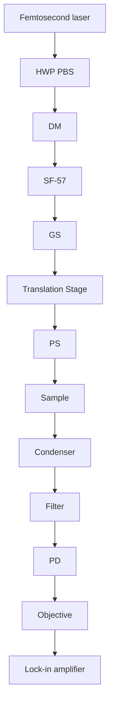
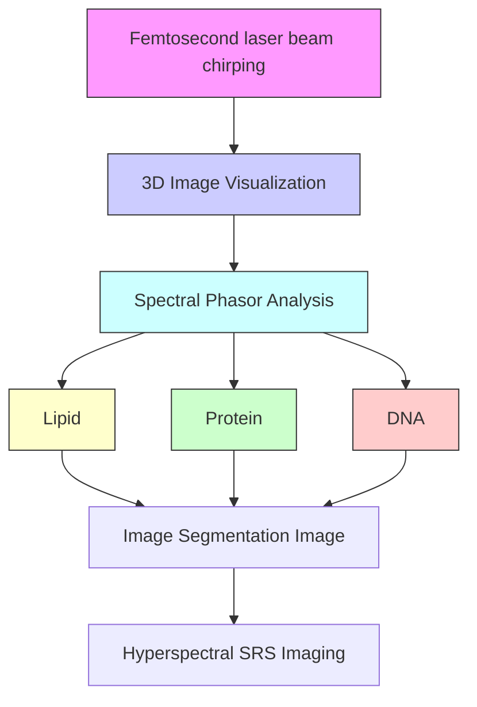
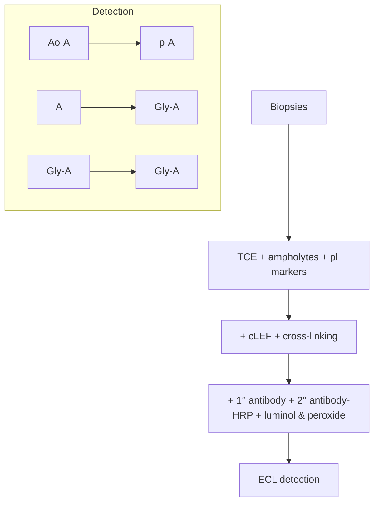
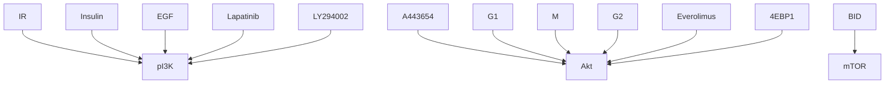

# SCIENTIFIC REPRTS

OPEN

Received: 29 November 2017

Accepted: 16 February 2018

Published: xx xx xxxx

# Quantitative Assessment of Liver Steatosis and Afected Pathways with Molecular Imaging and Proteomic Profling

Yasuyo Urasaki1, Chi Zhang2, Ji-Xin Cheng2 & Thuc T. Le1

Current assessment of non-alcoholic fatty liver disease (NAFLD) with histology is time-consuming, insensitive to early-stage detection, qualitative, and lacks information on etiology. This study explored alternative methods for fast and quantitative assessment of NAFLD with hyperspectral stimulated Raman scattering (SRS) microscopy and nanofuidic proteomics. Hyperspectral SRS microscopy quantitatively measured liver composition of protein, DNA, and lipid without labeling and sensitively detected early-stage steatosis in a few minutes. On the other hand, nanofuidic proteomics quantitatively measured perturbations to the post-translational modifcation (PTM) profles of selective liver proteins to identify afected cellular signaling and metabolic pathways in a few hours. Perturbations to the PTM profles of Akt, 4EBP1, BID, HMGCS2, FABP1, and FABP5 indicated abnormalities in multiple cellular processes including cell cycle regulation, PI3K/Akt/mTOR signaling cascade, autophagy, ketogenesis, and fatty acid transport. The integrative deployment of hyperspectral SRS microscopy and nanofuidic proteomics provided fast, sensitive, and quantitative assessment of liver steatosis and afected pathways that overcame the limitations of histology.

NAFLD afects nearly 30% of the general adult population1 and up to 70–80% of obese and diabetic populations worldwide2 . NAFLD is characterized by a broad range of disorders from simple steatosis to non-alcoholic steato hepatitis (NASH)3 . NASH is a common cause of end-stage liver disease such as cirrhosis and hepatocellular car cinoma, which require liver transplantation4,5 . Due to the rising obesity epidemic and NAFLD incidence, NASH is projected to surpass hepatitis C viral infection and become the leading etiology among liver transplant patients in the United States within the next decade6 . Te prevalence of NAFLD highlights the urgent need to develop diagnostic and therapeutic strategies for this condition7,8 .

Non-invasive diagnostics are currently the preferred clinical methods to assess NAFLD9,10. While practical and convenient, these methods are insensitive to the detection of NAFLD. For example, non-invasive imaging modalities such as ultrasonography, computed tomography, and magnetic resonance imaging are unable to dis criminate microvesicular steatosis from macrovesicular steatosis, or detect fatty liver with less than 30% steatosis11. On the other hand, liver blood tests yield normal aminotransferase level in patients with hepatic steatosis12. Eforts to identify better non-invasive biomarkers to diagnose and defne stages of NAFLD are ongoing13.

Histology of liver biopsies remains the gold standard for the diagnosis of NAFLD14,15. However, liver biopsy procedures can cause pain and discomfort and pose risks of complication to patients, thus, signifcantly limit their clinical utilization. A window of opportunity to study liver biopsies exists during the evaluation of donor livers prior to transplantation, where post-mortem collection of livers was performed4 . With the rising prevalence of NAFLD worldwide, there is a general decline of healthy liver donors and an increasing need for NAFLD assessment in donor livers16. Unfortunately, histology analysis is time-consuming, which is not compatible with the need to minimize the duration of cold ischemia for donor livers. Furthermore, various histologic systems for

1 Department of Biomedical Sciences, College of Medicine, Roseman University of Health Sciences, 10530 Discovery Drive, Las Vegas, NV, 89135, USA. 2 Departments of Electrical and Computer Engineering & Biomedical Engineering, College of Engineering, Boston University, 8 St. Mary’s St, Boston, MA, 02215, USA. Yasuyo Urasaki and Chi Zhang contributed equally to this work. Correspondence and requests for materials should be addressed to J.-X.C. (email: jxcheng@bu.edu) or T.T.L. (email: tle5@roseman.edu)

qualitative assessment of NAFLD could lead to variable liver biopsy interpretation17–19. Hence, alternative meth ods that can quickly and quantitatively evaluate NAFLD in liver biopsies are highly desirable20,21.

In this study, normal and NASH liver biopsies were examined with novel molecular imaging and proteomic profling technologies. Specifcally, hyperspectral SRS microscopy and nanofuidic proteomics were deployed to measure liver steatosis and selective protein species, respectively. Hyperspectral SRS microscopy is a fast, quantitative, and label-free imaging method capable of resolving the composition of lipid, protein, and DNA in biological samples22–25. On the other hand, nanofuidic proteomics is an automated and multiplexed method that measures perturbations to specifc protein species to identify afected signaling pathways or metabolic pro cesses26–29. Tis study aims to demonstrate the capability of hyperspectral SRS microscopy and nanofuidic proteomics for rapid and quantitative assessment of liver steatosis and afected pathways, respectively.

## Results

Quantitative assessment of liver steatosis with hyperspectral SRS microscopy. First, a home-built hyperspectral SRS microscope was deployed for label-free assessment of liver steatosis (Fig. 1a). Hyperspectral SRS imaging was performed using the spectral-focusing scheme outlined in Fig. 1b 30. To scan through the C-H vibration from 2800 cm−1 to 3050 cm−1 , a mechanical optical delay stage in the Stokes beam was tuned at 10 microns per image, corresponding to a step of 5 cm−1 . Each stacked hyperspectral SRS image was composed of 40 frames (400 × 400 pixels) acquired at 40 consecutive delay shifs with the acquisition time of 1.6 seconds per frame. Large-area imaging was achieved with stitching of stacked hyperspectral SRS images. A large-area hyperspectral SRS image of 1200 × 1200 pixels was acquired in approximately 10 minutes. Following image acquisition, spectral phasor analysis decomposed each stacked image into distinctive chemical compositions of lipid, protein, and DNA corresponding to diferent spectral clusters centering around 2850 cm−1 , \~2930 cm−1 , and 2960 cm−1 , respectively (Fig. 1b,c & Supplemental Fig. S1)31. Te SRS signals for lipid, protein, and DNA were used to assess liver steatosis, defne the boundary of individual hepatocytes, and determine the location of the nuclei, respectively.

To quantitatively assess liver steatosis, the SRS signal of lipid as a function of the combined SRS signals of lipid, DNA, and protein was used to defne the percentage of steatosis (Fig. 1d). As expected, NASH livers exhibited signifcantly higher percentage of steatosis compared to normal livers with an average of 28% versus 9%, respectively (Supplemental Tables S1 & S2). Interestingly, there was no statistically signifcant diference in the average number of lipid droplets detected in NASH livers versus normal livers. On the other hand, the average diameter of lipid droplets was two folds higher in NASH versus normal livers. All normal livers exhibited microvesicular steatosis with sub-micrometric lipid droplets. In contrast, all NASH livers exhibited macrovesicular steatosis with lipid droplets of highly variable diameters from sub-micrometer to 50 micrometers. Furthermore, less SRS DNA signals in the focal plane were detected in livers with macrovesicular steatosis compared to microvesicular steatosis (Fig. 1c), which could be attributed to the displacement of nuclei in the presence of large lipid droplets in macrovesicular steatosis. No statistically signifcant diference in SRS protein signal was detected between normal versus NASH livers. Clearly, hyperspectral SRS imaging was capable of rapid detection and quantitation of both liver microvesicular and macrovesicular steatosis in a label-free manner. By comparison, standard histology with hematoxylin and eosin (H&E) or oil red O (ORO) staining detect steatosis by the presence of vacuoles or red stains, respectively (Fig. 1e). While H&E and ORO histology were sufcient to detect macrovesicular steatosis in NASH livers (Fig. 1e, right panels), they were unable to detect microvesicular steatosis in normal livers (Fig. 1e, lef panels).

Quantitative assessment of afected liver pathways with nanofuidic proteomics. To comple ment the assessment of steatosis with hyperspectral SRS microscopy, nanofuidic proteomics was deployed to measure perturbations to protein species between normal and diseased liver tissues (Fig. 2a). Briefy, liver proteins were separated by charges via isoelectric focusing in capillaries. Te locations of the proteins were stabilized with photo-cross-linking to the sidewalls of capillaries. Primary antibody to a specifc protein of interest was introduced to each capillary, followed by the introduction of secondary antibody conjugated to horseradish peroxidase. Enhanced chemiluminescence was used to detect the presence of protein species within a single capillary. Protein species could be distinguished from one another based on shifs in pI values. For examples, acetyl-isoforms and phosphor-isoforms of a protein A cause shifs toward lower pI values compared to unmodifed isoform, with acetyl-isoforms having much larger shifs than phosphor-isoforms26. In contrast, glycosyl-isoforms generally cause shifs toward higher pI values compared to unmodifed isoform26,32. Multiplexed cIEF immunoassays were fully automated and capable of analyzing up to 96 diferent proteins in a single run. Out of more than forty liver proteins screened, six proteins were identifed to have signifcant perturbations to protein species between normal and diseased states (Fig. 2b–g & Supplementary Fig. S2a–l). Representative electropherograms of a single normal (HH1062) versus diseased (UMN1228) liver samples were presented in Fig. 2b–g. Complete electrophero grams of all nine normal and diseased liver samples were presented in Supplementary Fig. S2a–l. Tese proteins included protein kinase B (Akt), eukaryotic translation initiation factor 4E-binding protein 1 (4EBP1), BH3 interacting domain death agonist (BID), 3-hydroxy-3-methylglutaryl-CoA synthase 2 (HMGCS2), liver-specifc fatty acid binding protein (FABP1), and epidermal fatty acid binding protein (FABP5).

To determine the contribution of phosphor-isoforms to the protein species, selective liver tissue extracts were treated with λ phosphatase and examined with cIEF immunoassays (Fig. 3a–f). Five proteins including Akt, 4EBP1, BID, HMGCS2 and FABP1 were highly sensitive to λ phosphatase treatment, which indicated the presence of signifcant phosphor-isoforms (Fig. 3a–e). On the other hand, FABP5 was not sensitive to λ phosphatase treatment (Fig. 3f). Te mode of PTM to FABP5 was determined to be lysine acetylation (Supplementary Fig. S3). No signifcant glycosyl-isoform was detected with cIEF immunoassays for any of the six proteins analyzed. In addition, Western blots were performed on all nine normal and diseased liver samples for six proteins of interest.

a  

flowchart

b

flowchart

c  

text_image

HH1142
UMN1249
Lipid, 2850 cm⁻¹
Protein, 2930 cm⁻¹
DNA, 2960 cm⁻¹
Composite

e  

text_image

HH1142
UMN1249
H&E
ORO

d  

bar chart

| Group     | % steatosis |
| --------- | ----------- |
| HH 1050   | 12          |
| HH 1062   | 9           |
| HH 1065   | 5           |
| HH 1090   | 4           |
| HH 1115   | 11          |
| HH 1117   | 6           |
| HH 1142   | 15          |
| HH 1170   | 10          |
| HH 1202   | 7           |
| UMN1098   | 39          |
| UMN1152   | 38          |
| UMN1228   | 19          |
| UMN1242   | 34          |
| UMN1249   | 28          |
| UMN1306   | 25          |
| UMN1370   | 42          |
| UMN1413   | 15          |
| UMN1552   | 25          |

Figure 1. Imaging liver composition with hyperspectral stimulated Raman scattering microscopy. (a) Schematic of a hyperspectral SRS microscope. HWP: half-wave plate; PBS: polarizing beamsplitter; L: lens; AOM: acoustooptic modulator; fs: femtosecond; M: mirror; GS: galvanometer scanner; ps: picosecond; SF-57: glass block used to chirp pulses; PD: photodiode detector. (b) Schematic of a spectral-focusing-based hyperspectral SRS microscopy and spectral phasor segmentation of tissue compositions. (c) Decomposed images of lipid (2850 cm−1 ), protein (2930cm−1 ), and $\mathrm { D N A } ( 2 9 6 0 c m ^ { - 1 } )$ , and composite multicolor images of a normal liver (HH1142) and a NASH liver (UMN1249). Scale bars: 50 μm. (d) Percentage steatosis as a function of normal and NASH livers. Error bars are standard deviation across 27 stacked hyperspectral SRS images, or 1080 frames of 400 ×400 pixels/frame, used for spectral phasor analysis per liver sample. (e) H&E (upper panels) and ORO (lower panels) histology of HH1142 and UMN1249 liver specimen. Scale bars: 50μm.

Representative Western blots of a single normal (HH1062) versus diseased (UMN1228) liver samples were pre sented in Fig. 3g-l. Western blots using antibodies specific to phosphor-isoforms of Akt and 4EBP1 identified increased phosphorylation of Akt at residue S477 and decreased phosphorylation of 4EBP1 at residues Tr37/46 and Tr70 in NASH versus normal livers (Fig. 3g & h). In contrast, Western blots of BID, HMGCS2, FABP1, and FABP4 without antibodies to specifc phosphor-isoforms revealed no diference in their expression levels between NASH versus normal livers (Fig. 3i–l).

a  

flowchart

b  

line chart

| pl    | HH1062 | UMN1228 |
|-------|--------|---------|
| 4.75  | 0.0    | 0.0     |
| 5.25  | 0.5    | 0.8     |
| 5.75  | 1.0    | 1.0     |
| 6.25  | 0.0    | 0.0     |

c

line chart

| pl    | HH1062 | UMN1228 |
|-------|--------|---------|
| 4.50  | 0.0    | 0.0     |
| 4.75  | 0.0    | 0.0     |
| 5.00  | 1.0    | 1.0     |
| 5.25  | 0.0    | 0.8     |
| 5.50  | 0.0    | 0.0     |

d  

line chart

| pl    | HH1062 | UMN1228 |
|-------|--------|---------|
| 4.75  | 0.0    | 0.0     |
| 5.00  | 1.0    | 0.5     |
| 5.25  | 0.0    | 0.0     |
| 5.50  | 0.0    | 1.0     |

e  

line chart

| pI   | HH1062 | UMN1228 |
|------|--------|---------|
| 5.0  | 0.0    | 0.0     |
| 5.5  | 0.0    | 0.0     |
| 6.0  | 0.2    | 0.0     |
| 6.5  | 0.8    | 0.0     |
| 7.0  | 0.1    | 1.0     |
| 7.5  | 0.0    | 0.0     |

4  

line chart

| pl    | HH1062 | UMN1228 |
|-------|--------|---------|
| 5.8   | 0.0    | 0.0     |
| 5.9   | 0.0    | 0.0     |
| 6.0   | 1.0    | 0.0     |
| 6.1   | 0.0    | 1.0     |
| 6.2   | 0.0    | 0.0     |

6  

line chart

| pl    | Intensity |
|-------|---------|
| 4.5   | 0.0     |
| 5.5   | 1.0     |
| 6.5   | 0.0     |
| 7.5   | 0.0     |

Figure 2. Profling of selective liver protein species with nanofuidic proteomics. (a) Experimental fow of a typical IEF immunoassay to detect protein A species in a single capillary. TCE: total cell extract; pI: isoelectric point; cIEF: capillary isoelectric focusing; HRP: horseradish peroxidase; ECL: enhanced chemiluminescence; Ac-A: acetyl-isoforms; p-A: phosphor-isoforms; Gly-A: glycosyl-isoforms. (b–g) Representative cIEF electropherograms of (b) Akt, (c) 4EBP1, (d) BID, (e) HMGCS2, (f) FABP1, and (g) FABP5 in a control liver (HH1062, blue lines) versus a NASH liver (UMN1228, orange lines).

To quantitatively describe perturbations to protein species in NASH versus normal livers, the relative concentrations of individual protein species were calculated. Te relative concentration of a protein species was defned as the ratio of its area under the curve (AUC) over total AUC of both modifed and unmodifed isoforms. Te relative concentrations of selective protein species in normal and NASH livers were summarized in Fig. 4 with both numerical values and heat maps for rapid assessment of perturbations. Interestingly, phosphor-Akt isoforms were found to be signifcantly higher in NASH versus control livers. In contrast, phosphor-isoforms of 4EBP1, BID, HMGCS2, and FABP1 were consistently lower in NASH versus control livers. In addition, FABP5 was present mainly in acetyl-isoforms in NASH livers.

Relationship between inhibition of cellular processes and perturbations to protein species. Te signifcance of perturbations to protein species in NASH livers was further examined in HepG2 cell cultures treated with various small-molecule kinase inhibitors targeting the PI3K/Akt/mTOR signaling pathway, which is an important regulator of cell cycle, protein biosynthesis, and autophagy33 (Fig. 5a). Treatment of HepG2 cells with inhibitors of EGFR (lapatinib), pI3K (LY294002), or mTOR (everolimus) had no observable efect on Akt phosphor-isoforms (Fig. 5b). Interestingly, treatment of HepG2 cells with an inhibitor of Akt (A443654) increased Akt phosphor-isoforms (Fig. 5b). On the other hand, treatment of HepG2 cells with lapatinib, LY294002, A443654, or everolimus all led to the suppression of 4EBP1 phosphor-isoforms (Fig. 5c). Treatment of HepG2 cells with lapatinib suppressed the expression of BID phosphor-isoforms (Fig. 5d) and induced the expression of an autophagy marker LC3A/B-II (Supplementary Fig. S4), whereas treatment of HepG2 cells with LY294002, A443654, or everolimus had no observable efect on the expression level of BID phosphor-isoforms. Te efects of kinase inhibitors on HMGCS, FABP1, and FABP5 were also examined. However, HepG2 cells did not express HMGCS234 and expressed FABP1 and FABP5 only in unmodifed isoforms (Supplementary Fig. S5), which did not vary as a function of kinase inhibitor treatment.

a  

line chart

| pl    | UMN1228 | UMN1228 + λ |
|-------|---------|-------------|
| 4.75  | 0.0     | 0.0         |
| 5.25  | 0.8     | 0.0         |
| 5.75  | 0.7     | 0.3         |
| 6.25  | 0.0     | 1.0         |

b  

line chart

| pl    | UMN1228 | UMN1228 + λ |
|-------|---------|-------------|
| 4.50  | 0.0     | 0.0         |
| 4.75  | 0.0     | 0.0         |
| 5.00  | 1.0     | 0.0         |
| 5.25  | 0.0     | 1.0         |
| 5.50  | 0.0     | 0.0         |

g  

text_image

HH1062
UMN1228
Akt
p-Thr308
p-Ser473
p-Ser477
β-actin

h  

text_image

HH1062
UMN1228
4EBP1
p-Thr37/46
p-Thr70
β-actin

C  

line chart

| pI    | HH1062 | HH1062 + λ |
|-------|--------|------------|
| 4.75  | 0.0    | 0.0        |
| 5.00  | 1.0    | 0.0        |
| 5.25  | 0.0    | 1.0        |
| 5.50  | 0.0    | 0.0        |

d  

line chart

| pI   | HH1062 | HH1062 + λ |
|------|--------|------------|
| 5.0  | 0.0    | 0.0        |
| 5.5  | 0.0    | 0.0        |
| 6.0  | 0.2    | 0.0        |
| 6.5  | 0.8    | 0.0        |
| 7.0  | 1.0    | 1.0        |
| 7.5  | 0.0    | 0.0        |

'

text_image

HH1062
UMN1228
BID
β-actin

text_image

HH1062
UMN1228
HMGCS2
β-actin

e  

line chart

| pI   | Intensity (HH1062) | Intensity (HH1062 + λ) |
|------|---------------------|------------------------|
| 5.8  | 0.0                 | 0.0                    |
| 5.9  | ~0.2                | ~0.1                   |
| 6.0  | 1.0                 | 0.8                    |
| 6.1  | ~0.2                | 0.4                    |
| 6.2  | 0.0                 | 0.0                    |

line chart

| pl   | Intensity (HH1062) | Intensity (HH1062 + λ) |
|------|--------------------|------------------------|
| 4.5  | 0.0                | 0.0                    |
| 5.0  | 0.5                | 0.5                    |
| 5.5  | 1.0                | 1.0                    |
| 6.0  | 0.0                | 0.0                    |
| 6.5  | 0.0                | 0.0                    |
| 7.0  | 0.8                | 0.8                    |
| 7.5  | 0.0                | 0.0                    |

k

text_image

HH1062
UMN1228
FABP1
β-actin

—

text_image

HH1062
UMN1228
FABP5
β-actin

Figure 3. Evaluating protein phosphor-isoforms with cIEF immunoassays and Western blots. (a–f) Electropherograms of selective liver extracts before (blue lines) and afer (orange lines) treatment with λ phosphatase for Akt (a), 4EBP1 (b), BID (c), HMGCS2 (d), FABP1 (e), and FABP5 (f). (g–l) Western blots of proteins of interest in a control liver (HH1062) versus a NASH liver (UMN1228) for (g) Akt, pAkt (Tr308), pAkt (Ser473), and pAkt (Ser477), (h) 4EBP1, 4EBP1 (p-Tr37/46), and 4EBP1 (p-Tr70), (i) BID, (j) HMGCS2, (k) FABP1, (l) FABP5. Cropped blots in g and h were of diferent gels that were loaded with the same amount of total cell extracts and probed with antibodies against Akt and 4EBP1 or their phosphor-isoforms. Cropped blots in i, j, k, and l were of the same gels. All gels were ran on the same day and subjected to the same experimental procedures. Immunoblots were detected with the same exposure duration. Membranes were stripped and re-incubated with antibodies against β-actin. Representative immunoblots of β-actin were presented to highlight comparable loading of total cell extracts between lanes.

heatmap

|  | HH1050 | HH1062 | HH1065 | HH1090 | HH1115 | HH1117 | HH1142 | HH1170 | HH1202 | UMN1098 | UMN1152 | UMN1228 | UMN1242 | UMN1249 | UMN1305 | UMN1370 | UMN1413 | UMN1552 | III (avg.) | UMN (avg.) | UMN/HH | HHS TDEV | UMN STDEV | p-value |
| --- | --- | --- | --- | --- | --- | --- | --- | --- | --- | --- | --- | --- | --- | --- | --- | --- | --- | --- | --- | --- | --- | --- | --- | --- |
| p-Akt (pI 5.0-5.5) | 0.53 | 0.57 | 0.51 | 0.51 | 0.57 | 0.49 | 0.52 | 0.54 | 0.46 | 0.71 | 0.69 | 0.72 | 0.74 | 0.60 | 0.62 | 0.66 | 0.63 | 0.71 | 0.52 | 0.68 | 1.29 | 0.04 | 0.05 | 1.90E-04 |
| Akt (pI 5.5-6.2) | 0.47 | 0.43 | 0.49 | 0.49 | 0.43 | 0.51 | 0.48 | 0.46 | 0.54 | 0.29 | 0.31 | 0.28 | 0.26 | 0.40 | 0.38 | 0.34 | 0.37 | 0.29 | 0.48 | 0.32 | 0.68 | 0.04 | 0.05 | 1.90E-04 |

Figure 4. Relative concentrations of protein isoforms in normal and NASH livers. Two heat maps were generated for rapid assessment of the relative concentrations of protein species (lef heat scale bar, green/yellow/red) and diferences in the relative concentrations of protein isoforms between NASH and normal livers (UMN/HH, right heat scale bar, cyan/blue/red). Avg: average; STDEV: standard deviation. Statistical signifcance was set at p≤0.05.

flowchart

line chart

| pl    | Intensity (HepG2) | Intensity (Lapa) | Intensity (LY294) | Intensity (A443) | Intensity (Ever) |
|-------|-------------------|------------------|-------------------|------------------|------------------|
| 4.75  | ~0.0              | ~0.0             | ~0.0              | ~0.0             | ~0.0             |
| 5.00  | ~0.0              | ~0.0             | ~0.0              | ~0.8             | ~0.0             |
| 5.25  | ~0.0              | ~0.0             | ~0.0              | ~0.6             | ~0.0             |
| 5.50  | ~0.0              | ~0.0             | ~0.0              | ~0.0             | ~0.0             |
| 5.75  | ~0.0              | ~0.3             | ~0.0              | ~0.0             | ~0.0             |
| 6.00  | ~1.0              | ~0.0             | ~1.0              | ~0.0             | ~1.0             |
| 6.25  | ~0.0              | ~0.0             | ~0.0              | ~0.0             | ~0.0             |

line chart

| pl    | HepG2 | Lapa | LY294 | A443 | Ever |
|-------|-------|------|-------|------|------|
| 4.50  | 0.0   | 0.0  | 0.0   | 0.0  | 0.0  |
| 4.75  | 1.0   | 0.0  | 0.0   | 0.0  | 0.0  |
| 5.00  | 0.0   | 0.0  | 0.0   | 0.0  | 0.0  |
| 5.25  | 1.0   | 1.0  | 1.0   | 1.0  | 1.0  |
| 5.50  | 0.0   | 0.0  | 0.0   | 0.0  | 0.0  |

line chart

| pl    | Intensity |
|-------|---------|
| 4.75  | 0.0     |
| 5.00  | 1.0     |
| 5.25  | 1.0     |
| 5.50  | 0.0     |

Figure 5. Relationship between inhibition of pI3K/Akt/mTOR signaling pathway and perturbations to protein species. (a) A diagram of pI3K/Akt/mTOR signaling pathway and its regulation of cell cycle progression, protein biosynthesis, and autophagy via the phosphorylation of Akt, 4EBP1, and BID, respectively. Targets of small-molecule kinase inhibitors are indicated with red blunted lines. Dashed arrows indicate indirect control via one or more intermediates. (b–d) Electropherograms of Akt (b), 4EBP1 (c), and BID (d) in HepG2 cells untreated (light blue line) or in treated with lapatinib (orange line), LY294002 (grey line), A443654 (yellow line), or everolimus (dark blue line).

## Discussion

Tis study demonstrated the capability of hyperspectral SRS microscopy and nanofuidic proteomics for fast and quantitative assessment of liver steatosis and afected pathways. In addition to morphologic assessment of steatosis resolved with label-free hyperspectral SRS imaging, nanofuidic proteomics data revealed that perturbations to protein species could serve as novel biomarkers to assess afected pathways in NAFLD. First, perturbation to a protein species could be used to assess its activity and function. For example, phosphorylation of HMGCS2 increases its enzymatic activity35. Suppression of HMGCS2 phosphor-isoforms in NASH livers could indicate impairment of ketogenesis and cholesterol biosynthesis. In addition, dephosphorylation or acetylation are mechanisms to inactivate fatty acid binding proteins36,37. Suppression of FABP1 phosphor-isoforms and elevation of FABP5 acetyl-isoforms in NASH livers could indicate impaired fatty acid transport. It is noteworthy to point out that NASH livers, but not control livers, expressed adipocyte- and macrophage-specifc FABP4 (Supplementary Fig. S6), which is associated with lipid droplet accumulation38. Altered enzymatic activity and expression of selective fatty acid binding proteins could indicate a functional shif of hepatocytes from a lipid-processing function, which depends on FABP1 and FABP5 activities, to a lipid-storage function, which depends on FABP4 activity39,40.

Furthermore, perturbation to protein species could be used to assess cellular signaling activities. For example, interference with signaling activity of the PI3K/Akt/mTOR signaling pathway led to the suppression of 4EBP1 phosphor-isoforms in primary hepatocytes. By inference, suppression of 4EBP1 phosphor-isoforms could indi cate impairment in PI3K/Akt/mTOR signaling pathway in NASH livers. On the other hand, inhibition of EGFR but not other proteins in the PI3K/Akt/mTOR signaling pathway led to the suppression BID phosphor-isoform and increased expression of an autophagy marker LC3A/B-II41. Suppression BID phosphor-isoform could potentially be used as a biomarker for liver autophagy signaling pathway that is independent of the PI3K/Akt/mTOR signaling pathway42.

In recent years, a mechanistic link between aberrant cell cycle progression in cancer and Akt hyper-phosphorylation at its carboxyl terminus has been discovered43. Tis study revealed that Akt hyper-phosphorylation at residue S477 was observed in NASH livers. Inhibition of Akt with A443654 also led to Akt hyper-phosphorylation at residue S477 in HepG2 cells (Supplementary Fig. S7). A443654 has been shown to interfere with mitotic progression and bipolar spindle formation44. Tus, Akt hyper-phosphorylation at residue S477 in NASH livers could indicate a dysregulation in the Akt-cell cycle pathway. NAFLD increases the risk of liver cancer although the underlying mechanisms have not been delineated5 . Akt hyper-phosphorylation at residue S477 could potentially serve as a biomarker for the risk of progression of NAFLD to hepatocellular carcinoma although further investigation is warranted. Nanofuidic proteomics has been deployed for the detection of Akt phosphor-isoforms in various non-cancer and cancer tissues and could be instrumental for in-depth investigation of the roles of Akt phosphor-isoforms in fatty liver disease progression29,45–48. Te assessment of inhibitor efects in HepG2 cells with nanofuidic proteomics suggested that multiple pathways were perturbed in NAFLD. It is plausible that perturba tions to signaling pathways identifed in this study could be used as biomarkers for the evaluation of liver function and drug treatment efects.

<table><tr><td>Perturbations</td><td>Affected pathways</td><td>Early-stage NAFLD (Macrovesicular steatosis)</td><td>Late-stage NAFLD (NASH)</td></tr><tr><td>FABP1 dephosphorylation or acetylation</td><td>Fatty acid transport</td><td>√</td><td>√</td></tr><tr><td>FABP4 expression</td><td>Fatty acid transport</td><td>√</td><td>√</td></tr><tr><td>FABP5 dephosphorylation or acetylation</td><td>Fatty acid transport</td><td>√</td><td>√</td></tr><tr><td>4EBP1 dephosphorylation</td><td>Insulin signaling</td><td>√</td><td>√</td></tr><tr><td>HMGCS2 dephosphorylation</td><td>Ketogenesis &amp; cholesterol biosynthesis</td><td>√</td><td>√</td></tr><tr><td>BID dephosphorylation</td><td>Autophagy</td><td></td><td>√</td></tr><tr><td>Akt dephosphorylation at S473</td><td>Insulin signaling</td><td>√</td><td></td></tr><tr><td>Akt hyperphosphorylation at S477</td><td>Cell cycle regulation</td><td></td><td>√</td></tr></table>

Table 1. Perturbations to protein species as biomarkers of NAFLD stages.

Most signifcantly, the integrative deployment of hyperspectral SRS microscopy and nanofuidic proteomics provided attractive alternatives to histology for the evaluation of NAFLD. Without the need for complex sample fxation, processing, or staining, label-free hyperspectral SRS imaging signifcantly reduced the assessment time for livers steatosis from several days to just a few minutes. Most importantly, hyperspectral SRS imaging was highly sensitive to the detection of microvesicular steatosis, which was not detectable with histology. In standard histology protocol, tissues were fxed in bufered formalin and embedded in parafn for sectioning. Deparafnization of tissue sections with a mixture of xylene and ethanol also removed lipid droplets with sub-micrometric diameters49. Consequently, the assessment of liver steatosis with histology either failed to detect or underestimated microvesicular steatosis21. Microvesicular steatosis is a liver lesion that can be associated with liver failure, encephalopathy, and hypoglycemia with fatal consequences in some patients50. Hepatic microvesicular steatosis is observed in Rey’s syndrome, acute fatty liver of pregnancy, or acute liver injury due to drug-induced mitochondrial and metabolic toxicity50,51. Hyperspectral SRS imaging of hepatic microvesicular steatosis provided a unique capability for the detection of early-stage steatosis for the assessment of liver health. Additionally, quantitative analysis of hyperspectral SRS imaging data eliminated common errors associated with traditional qualitative steatosis assessment of histological data18.

On the other hand, nanofuidic proteomics quantitatively measured perturbations to the PTM profles of selective proteins to identify abnormalities in associated cellular processes. Signifcantly, nanofuidic proteomics allowed analysis of protein species using less than 40 ng of total cellular protein per assay28,52,53. By comparison, Western blot analysis required approximately 10 µg of total cellular protein per assay52. Using less than the amount of total cellular protein required for a single Western blot, up to 96 cIEF immunoassays could be performed in a single run with the timescale of several hours54. Te utilization of nanograms-size samples rendered nanofuidic proteomics highly suitable for multiplexed analysis of protein species in fnite liver tissue biopsies. Interestingly, perturbations to liver protein species could serve as diagnostic biomarkers for NAFLD stages (Table 1). For example, previous profling of liver protein PTM revealed that inactivation of FABP1 and FABP5 by acetylation and dephosphorylation, respectively, expression of FABP4, and dephosphorylation of 4EBP1, HMGCS2, and Akt at residue S473 were observed in animal models with simple macrovesicular steatosis26,32. Tis study further revealed that dephosphorylation of BID and hyper-phosphorylation of Akt at residue S477 were associated with human NASH liver tissues. Tus, the impairment of fatty acid transport, insulin signaling pathway, ketogenesis and cholesterol biosynthesis were likely early events in NAFLD development. In contrast, activation of autophagy and impaired cell cycle regulation were likely late events in NAFLD development. Future development of an expanded pathway-focused diagnostic panel of protein species should permit the evaluation of causes, consequences, and risks of progression for NAFLD with nanofuidic proteomics55. Together, the integrative deployment of hyperspectral SRS microscopy and nanofuidic proteomics provided fast and quantitative assessment of steatosis and afected pathways in NAFLD that overcame the limitations of traditional histology. Hyperspectral SRS microscopy and nanofuidic proteomics are highly suitable for the time-sensitive evaluation of liver health such as during the assessment of donor livers for transplantation or surgeries.

## Methods

Human liver biopsies. Frozen human liver biopsies classifed as normal (n = 9) or with NASH (n = 9) were provided by the Liver Tissue Cell Distribution System (LTCDS, Minneapolis, Minnesota), which was funded by the National Institutes of Health Contract # HSN276201200017C (Supplementary Table S1). Tis study used collected specimen that had been de-identifed by the LTCDS and was exempted by the Roseman University of Health Sciences Institutional Review Board (protocol # 16-SM-MD-0701).

Hyperspectral SRS microscopy. The hyperspectral SRS microscope system was built on an upright microscope frame (Olympus BX51) using the InSight DS+ ultrafast laser system (Spectra-Physics, Santa Clara, CA). Te laser system provided a Stokes beam at 1040 nm (120 femtoseconds) and a pump beam tunable from 690–1300 nm (150 femtoseconds) with a repetition rate of \~80 MHz. Te Stokes beam was modulated at \~2.5 MHz by a function generator. Te pump and Stokes beams were combined by a dichroic mirror and chirped to picosecond pulses by two 30 cm SF-57 glass rods (Lattice Electro Optics, Fullerton, CA). A 2D galvo system (GVSM002, Torlabs, Newton, NJ) was used for laser scanning and a 40 × water-immersion objective lens (LUMPlanFLN × 40, Olympus, Waltham, Massachusetts) was used to focus the laser beams into the sample. An oil condenser (NA = 1.4) was used to collect forward-scattered light into a photodiode detector (S3994–01, Hamamatsu, Bridgewater, NJ). A short-pass flter (980 SP, Chroma, Bellows Falls, VT) was used to reject the Stokes beam from entering the photodetector. Te signal was deconvoluted and amplifed by a lock-in amplifer (HF2LI, Zurich Instrument, Zurich, Switzerland). Large-area mapping was performed by synchronizing the motorized 2D linear stage to the hyperspectral image collection. To avoid spectral distortion, 40 spectral frames (400 × 400 pixels for each frame) were collected before the stage was moved to an adjacent area. LabView sof ware was used for image collection, stitching, and display. Liver lipid droplet size and number was analyzed with ImageJ as described previously21

Spectral phasor analysis. Stacked hyperspectral images were imported to ImageJ with phasor analysis plugin. Phasor transformation segmented chemical compositions to diferent clusters. Gating for diferent clus ters was manually selected and kept identical across images. Segmentation images were plotted using the ‘Phasor to image’ command over diferent gates selected in the phasor domain.

Preparation of liver tissues for imaging. Frozen liver tissues were embedded in optimal cutting tem perature compound, fash-frozen in liquid nitrogen, sectioned into 20-micron slices with a cryotome, and sandwiched between two coverslips for hyperspectral SRS imaging. On average, three tissue sections per liver sample were used for hyperspectral SRS imaging. For each tissue section, hyperspectral SRS images of at least nine frames of 400 × 400 pixels per frame were acquired.

Histology. Liver tissues were also used for independent histological analysis of liver steatosis with hematoxy lin and eosin (H&E) or Oil Red O (ORO) stains by IHCWorld, LLC (Woodstock, MD).

Preparation of liver tissue lysates. Approximately 50mg of frozen liver tissues was added to 300µl of Bicine CHAPS Lysis Bufer (Cat. No. 040–764, Protein Simple, Santa Clara, CA) containing proteinase and phosphatase inhib itors and homogenized twice at 6seconds duration. Liver tissue homogenates were incubated on ice for 10minutes, sonicated 4 times at 5seconds duration, rotated at 4°C for 2 hours, and centrifuged at 12000rpm on an Eppendorf 5430R microfuge for 20minutes at 4°C. Supernatant was collected, prepared in Premix G2 pH 5–8 separation gradient containing pI standards (ProteinSimple), and used for capillary isoelectric focusing (cIEF) immunoassays.

Treatment with phosphatase. Approximately 1 µl of ? phosphatase (Cat. No. 14–405, Merck Millipore, Billerica, MA) was added to 1 µl of reaction bufer (fnal concentrations of 5 mM DDT, 50 mM Hepes, 100 µM EDTA, 2 mM MnCl ) and 8 µl of liver tissue lysates (2 mg/ml of total protein concentration). Te mixture was incubated at 37 °C for 30 minutes, chilled on ice to stop reaction, prepared in Premix G2 pH 5–8 separation gradient containing pI standards (ProteinSimple), and used for cIEF immunoassays.

Multiplexed cIEF immunoassays. Multiplexed cIEF immunoassays were performed using the NanoPro 1000 system (Protein Simple). Samples of 400-nanoliter volume were separated by isoelectric focusing using the 96-capillary system and followed by immobilization of the proteins onto the inner capillary walls with ultravi olet irradiation. Primary antibodies (Supplemental Table S3) and horseradish peroxidase-conjugated secondary antibodies (Cat. No. 7074, Cell Signaling) were sequentially introduced into the capillaries and followed by chemiluminescence detection reagents. Te incubation times were 110 and 55 minutes for primary and secondary antibodies, respectively. Separation time was 50 minutes at 15,000 MicroWatts. On average, 40 ng of total cellular protein was loaded into each capillary. Standard exposure time during signal detection was 240 seconds. A minimum of four repeats were done for each protein per liver sample. High fdelity between repeated measurements was consistent with published reports with coefcient of variation values of ≤ 0.154.

Analysis of cIEF immunoassay data. Peak intensities of all cIEF immunoassay electropherograms were normalized to 1. Te relative concentration of a specifc protein species was calculated as the ratio of area under the curve (AUC) for the isoform over total AUC of all isoforms.

Statistical analysis. Statistical analysis was performed using a two-tailed paired Student’s t-test for NASH livers versus normal livers. Statistical signifcance was set at p ≤ 0.05.

Western blots. Total liver protein extracts were separated on 10% SDS-PAGE gels, transferred to nitrocellu lose membranes, incubated frst with primary antibodies against proteins or protein phosphor-isoforms of inter est (Supplementary Table S3) and then with IRDye 680RD secondary antibodies (Cat. No. 92668070, LI-COR, Lincoln, NE). Immunoblots were detected with the LI-COR’s Odyssey CLx imaging system. Membranes were stripped and re-incubated with antibodies against β-actin, which served as a loading control.

HepG2 cell cultures. HepG2 cells were cultured in RPMI media (Cat. No. 11875–093, Gibco, Gaithersburg, MD) supplemented with 10% FBS (Cat. No. SH30070.03, Hyclone, Logan, Utah), non-essential amino acids (Cat. No. 25-025-CI, Corning, NY) and antibiotics penicillin and streptomycin (Cat. No. 15140, Gibco). For cells receiving treatment, small-molecule kinase inhibitors were added for 24 hours prior to analysis. Te following kinase inhibitors were used at indicated fnal concentrations: lapatinib (5 µM, Cat. No. S2111 Selleckchem, Houston, TX), LYS294002 (5 µM, CalBioChem, Temecula, CA), A-443654 (0.5 µM, Cat. No. 16499, Cayman Chemical, Ann Arbor, MI), and everolimus (10 µM, Cat. No. S1120, Selleckchem). Concentrations of kinase inhibitors were selected based on our own screens of the efective concentrations to achieve maximal hyper-phosphorylation of Akt or dephosphorylation of 4EBP1.

Data availability. Te authors declare that data supporting the fndings of this study are available within the paper and its supplementary information fles.

## References

1. Vernon, G., Baranova, A. & Younossi, Z. M. Systematic review: the epidemiology and natural history of non-alcoholic fatty liver disease and non-alcoholic steatohepatitis in adults. Aliment Pharmacol. Ter. 34, 274–285 (2011).  
2. Chalasani, N. et al. The diagnosis and management of non-alcoholic fatty liver disease: practice Guideline by the American Association for the Study of Liver Diseases, American College of Gastroenterology, and the American Gastroenterological Association. Hepatology 55, 2005–2023 (2012).  
3. Cohen, J. C., Horton, J. D. & Hobbs, H. H. Human fatty liver disease: old questions and new insights. Science 332, 1519–1523 (2011).  
4. Zezos, P. & Renner, E. L. Liver transplantation and non-alcoholic fatty liver disease. W. J. Gastroenterol. 20, 15532–15538 (2014).  
5. Michelotti, G. A., Machado, M. V. & Diehl, A. M. NAFLD, NASH and liver cancer. Nat. Rev. Gastroenterol. Hepatol. 10, 656–665 (2013).  
6. Wong, R. J. et al. Nonalcoholic steatohepatitis is the second leading etiology of liver disease among adults awaiting liver transplantation in the United States. Gastroenterology 148, 547–555 (2015).  
7. Willebrords, J. et al. Strategies, models and biomarkers in experimental non-alcoholic fatty liver disease research. Prog. Lipid Res. 59, 106–125 (2015).  
8. Musso, G., Cassader, M. & Gambino, R. Non-alcoholic steatohepatitis: emerging molecular targets and therapeutic strategies. Nat. Rev. Drug Discov. 15, 249–274 (2016).  
9. Fitzpatrick, E. & Dhawan, A. Noninvasive biomarkers in non-alcoholic fatty liver disease: current status and a glimpse of the future. W. J. Gastroenterol. 20, 10851–10863 (2014).  
10. European Association for Study of, L. & Asociacion Latinoamericana para el Estudio del, H. EASL-ALEH Clinical Practic Guidelines: Non-invasive tests for evaluation of liver disease severity and prognosis. J. Hepatol. 63, 237–264 (2015)  
11. Lee, S. S. & Park, S. H. Radiologic evaluation of nonalcoholic fatty liver disease. W. J. Gastroenterol. 20, 7392–7402 (2014).  
12. Ahn, J. S. et al. Steatosis among living liver donors without evidence of fatty liver on ultrasonography: potential implications for preoperative liver biopsy. Transplantation 95, 1404–1409 (2013).  
13. Neuman, M. G., Cohen, L. B. & Nanau, R. M. Biomarkers in nonalcoholic fatty liver disease. Can. J. Gastroenterol. Hepatol. 28, 607–618 (2014).  
14. Kleiner, D. E. et al. Design and validation of a histological scoring system for nonalcoholic fatty liver disease. Hepatology 41, 1313–1321 (2005).  
15. Bravo, A. A., Sheth, S. G. & Chopra, S. Liver biopsy. N. Engl. J. Med. 344, 495–500 (2001).  
16. Melin, C., Miick, R., Young, N. A., Ortiz, J. & Balasubramanian, M. Approach to intraoperative consultation for donor liver biopsies. Arch. Pathol. Lab. Med. 137, 270–274 (2013).  
17. Brunt, E. M. Nonalcoholic Fatty Liver Disease: Pros and Cons of Histologic Systems of Evaluation. Intl. J. Mol. Sci. 17, 97 (2016).  
18. El-Badry, A. M. et al. Assessment of hepatic steatosis by expert pathologists: the end of a gold standard. Ann. Surg. 250, 691–697 (2009).  
19. Yersiz, H. et al. Assessment of hepatic steatosis by transplant surgeon and expert pathologist: a prospective, double-blind evaluation of 201 donor livers. Liver Transpl. 19, 437–449 (2013).  
20. Lin, J. et al. Assessment of liver steatosis and fbrosis in rats using integrated coherent anti-Stokes Raman scattering and multiphoton imaging technique. J. Biomed. Opt. 16, 116024 (2011).  
21. Le, T. T., Ziemba, A., Urasaki, Y., Brotman, S. & Pizzorno, G. Label-free evaluation of hepatic microvesicular steatosis with multimodal coherent anti-Stokes Raman scattering microscopy. PLoS One 7, e51092 (2012).  
22. Cheng, J. X. & Xie, X. S. Vibrational spectroscopic imaging of living systems: An emerging platform for biology and medicine. Science 350, aaa8870 (2015).  
23. Freudiger, C. W. et al. Multicolored stain-free histopathology with coherent Raman imaging. Lab. Invest, 92, 14921502 (2012)  
24. Lu, F. K. et al. Label-Free neurosurgical pathology with stimulated Raman imaging. Cancer Res. 76, 3451–3462 (2016).  
25. Orringer, D. A. et al. Rapid intraoperative histology of unprocessed surgical specimens via fbre-laser-based stimulated Raman scattering microscopy. Nat. Biomed. Eng. 1 (2017).  
26. Urasaki, Y., Fiscus, R. R. & Le, T. T. Molecular classifcation of fatty liver by high-throughput profling of protein post-translational modifications. J. Pathol. 238, 641650 (2016).  
27. Tikhanovich, I. et al. Regulation of FOXO3 by phosphorylation and methylation in hepatitis C virus infection and alcohol exposure. Hepatology 59, 58–70 (2014).  
28. Fan, A. C. et al. Nanofuidic proteomic assay for serial analysis of oncoprotein activation in clinical specimens. Nat. Med. 15, 566571 (2009).  
29. Chen, J. Q. et al. Capillary isoelectric-focusing immunoassays to study dynamic oncoprotein phosphorylation and drug response to targeted therapies in non-small cell lung cancer. Mol. Cancer Ther, 12, 26012613 (2013).  
30. Fu, D., Holtom, G., Freudiger, C., Zhang, X. & Xie, X. S. Hyperspectral imaging with stimulated Raman scattering by chirped femtosecond lasers. J. Phys. Chem. B 117, 4634–4640 (2013).  
31. Fu, D. & Xie, X. S. Reliable cell segmentation based on spectral phasor analysis of hyperspectral stimulated Raman scattering imaging data. Anal. Chem. 86, 4115–4119 (2014).  
32. Urasaki, Y., Pizzorno, G. & Le, T. T. Chronic uridine administration induces fatty liver and pre-diabetic conditions in mice. PLoS One 11, e0146994 (2016).  
33. Laplante, M. & Sabatini, D. M. mTOR signaling in growth control and disease. Cell 149, 274–293 (2012).  
34. Vila-Brau, A., De Sousa-Coelho, A. L., Mayordomo, C., Haro, D. & Marrero, P. F. Human HMGCS2 regulates mitochondrial fatty acid oxidation and FGF21 expression in HepG2 cell line. J. Biol. Chem. 286, 20423–20430 (2011).  
35. Grimsrud, P. A. et al. A quantitative map of the liver mitochondrial phosphoproteome reveals posttranslational control of ketogenesis. Cell Metab 16, 672–683 (2012).  
36. Gericke, A., Smith, E. R., Moore, D. J., Mendelsohn, R. & Storch, J. Adipocyte fatty acid-binding protein: interaction with phospholipid membranes and thermal stability studied by FTIR spectroscopy. Biochemistry 36, 8311–8317 (1997).  
37. Corsico, B., Franchini, G. R., Hsu, K. T. & Storch, J. Fatty acid transfer from intestinal fatty acid binding protein to membranes: electrostatic and hydrophobic interactions. J. Lipid Res. 46, 1765–1772 (2005).  
38. Graupera, I. et al. Adipocyte fatty-acid binding protein is overexpressed in cirrhosis and correlates with clinical outcomes. Sci. Rep. 7, 1829 (2017).  
39. Storch, J. & McDermott, L. Structural and functional analysis of fatty acid-binding proteins. J. Lipid Res. 50(Suppl), S126–131 (2009).  
40. Furuhashi, M. & Hotamisligil, G. S. Fatty acid-binding proteins: role in metabolic diseases and potential as drug targets. Nat. Rey Drug Discov. 7, 489–503 (2008).  
41. Chen, Y. J., Chi, C. W., Su, W. C. & Huang, H. L. Lapatinib induces autophagic cell death and inhibits growth of human hepatocellula carcinoma. Oncotarget 5, 4845–4854 (2014).  
42. Ueno, T. & Komatsu, M. Autophagy in the liver: functions in health and disease. Nat. Rey. Gastroenterol. Hepatol. 14, 170−184 (2017).  
43. Liu, P. et al. Cell-cycle-regulated activation of Akt kinase by phosphorylation at its carboxyl terminus. Nature 508, 541–545 (2014).  
44. Liu, X. et al. Akt inhibitor a-443654 interferes with mitotic progression by regulating aurora a kinase expression. Neoplasia 10, 828837 (2008).  
45. Iacovides, D. C. et al. Identifcation and quantifcation of AKT isoforms and phosphoforms in breast cancer using a novel nanofuidic immunoassay. Mol. Cell. Prot. 12, 3210–3220 (2013).  
46. Guo, H. et al. Coordinate phosphorylation of multiple residues on single AKT1 and AKT2 molecules. Oncogene 33, 3463–3472 (2014).  
47. Crosbie, P. A. et al. ERK and AKT phosphorylation status in lung cancer and emphysema using nanocapillary isoelectric focusing. BMJ Open Respir. Res. 3, e000114 (2016)  
48. Schrotter, S., Leondaritis, G. & Eickholt, B. J. Capillary isoelectric focusing of Akt isoforms identifies highly dynamic phosphorylation in neuronal cells and brain tissue. J. Biol. Chem. 291, 10239–10251 (2016).  
49. Garcia Urena, M. A. et al. Hepatic steatosis in liver transplant donors: common feature of donor population? World J. Surg. 22, 837844 (1998).  
50. Begriche, K., Massart, J., Robin, M. A., Borgne-Sanchez, A. & Fromenty, B. Drug-induced toxicity on mitochondria and lipid metabolism: mechanistic diversity and deleterious consequences for the liver. J. Hepatol. 54, 773–794 (2011).  
51. Brunt, E. M. Pathology of fatty liver disease. Mod. Patho.l 20(Suppl 1), S40–48 (2007).  
52. Johlfs, M. G., Gorjala, P., Urasaki, Y., Le, T. T. & Fiscus, R. R. Capillary isoelectric focusing immunoassay for fat cell diferentiation proteomics. PLoS One 10, e0132105 (2015).  
53. O’Neill, R. A. et al. Isoelectric focusing technology quantifies protein signaling in 25 cells. Proc. Natl. Acad. Sci. USA 103, 1615316158.(2006)  
54. Chen, J. Q., Wakefield, L. M. & Goldstein, D. J. Capillary nano-immunoassays: advancing quantitative proteomics analysis, biomarker assessment, and molecular diagnostics. J. Transl. Med. 13, 182 (2015).  
55. Stefen, P. et al. Protein species as diagnostic markers. J. Prot. 134, 5–18 (2016).

## Acknowledgements

Te authors acknowledge institutional funding support from Roseman University of Health Sciences and a donation from Dr. Harry Rosenberg. Te authors thank Dr. Glenn Gourley, Jane Cattell, Marion Namenwirth, and Abigail Knoble of the Liver Tissue Cell Distribution Center (University of Minnesota) for help with liver tissue acquisition, Dr. Ronald R. Fiscus (RUHS) for stimulating discussion, Kai-Chi Huang (Boston University) for help with imaging experiments, and Drs. Pengda Liu (UNC Chapel Hill), Janping Guo and Wenyi Wei (Harvard) for sharing of biological materials.

## Author Contributions

The authors contributed in the following way: study design: T.T.L. and Y.U.; contribution of reagents and analytical tools: T.T.L., J.X.C.; data collection: Y.U., T.T.L., C.Z.; data analysis: Y.U., C.Z. and T.T.L.; writing of manuscript: T.T.L., Y.U., C.Z. and J.X.C.

## Additional Information

Supplementary information accompanies this paper at https://doi.org/10.1038/s41598-018-22082-6.

Competing Interests: A patent application has been fled with the US Patent and Trademark Ofce by Roseman University of Health Sciences on the methods for molecular classifcation of fatty liver using high throughput profling of protein post-translational modifcations.

Publisher's note: Springer Nature remains neutral with regard to jurisdictional claims in published maps and institutional afliations.

Open Access This article is licensed under a Creative Commons Attribution 4.0 International License, which permits use, sharing, adaptation, distribution and reproduction in any medium or

format, as long as you give appropriate credit to the original author(s) and the source, provide a link to the Cre ative Commons license, and indicate if changes were made. Te images or other third party material in this article are included in the article’s Creative Commons license, unless indicated otherwise in a credit line to the material. If material is not included in the article’s Creative Commons license and your intended use is not permitted by statutory regulation or exceeds the permitted use, you will need to obtain permission directly from the copyright holder. To view a copy of this license, visit http://creativecommons.org/licenses/by/4.0/.

© Te Author(s) 2018