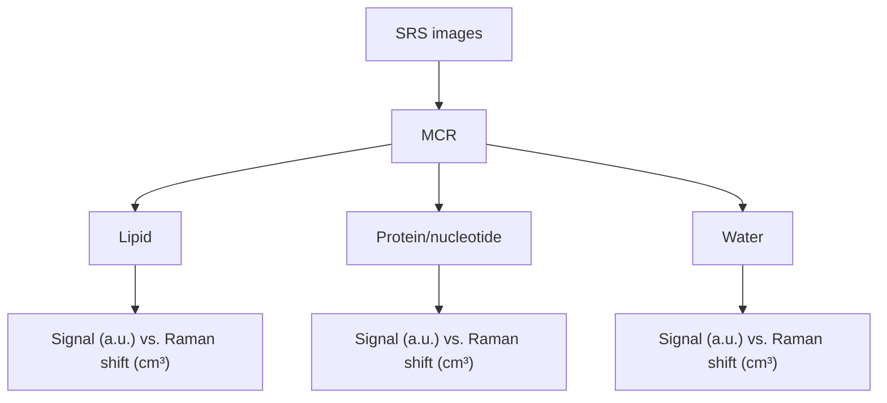
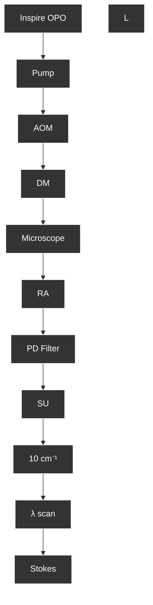
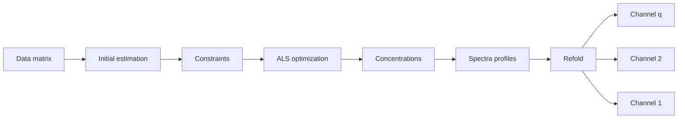

# Quantitative Vibrational Imaging by Hyperspectral Stimulated Raman Scattering Microscopy and Multivariate Curve Resolution Analysis

Delong Zhang,†,⊥ Ping Wang,‡,⊥ Mikhail N. Slipchenko,‡ Dor Ben-Amotz,† Andrew M. Weiner,§ and Ji-Xin Cheng\*,†,‡

† Department of Chemistry, ‡ Weldon School of Biomedical Engineering, and § Electrical and Computer Engineering, Purdue University, West Lafayette, Indiana 47907, United States

Supporting Information

ABSTRACT: Spectroscopic imaging has been an increasingly critical approach for unveiling specific molecules in biological environments. Toward this goal, we demonstrate hyperspectral stimulated Raman loss (SRL) imaging by intrapulse spectral scanning through a femtosecond pulse shaper. The hyperspectral stack of SRL images is further analyzed by a multivariate curve resolution (MCR) method to reconstruct quantitative concentration images for each individual component and retrieve the corresponding vibrational Raman spectra. Using these methods, we demonstrate quantitative mapping of dimethyl sulfoxide concentration in aqueous solutions and in fat tissue. Moreover, MCR is performed on SRL images of breast cancer cells to generate maps of principal chemical components along with their respective vibrational spectra. These results show the great capability and potential of hyperspectral SRL microscopy for quantitative imaging of complicated biomolecule mixtures through resolving overlappe

flowchart

O ver the past decades, most of our knowledge about cell functions was derived from biochemical assays such as immuno-blotting of cell homogenates. These biochemical assays lack the capability of single cell analysis. NMR spectroscopy, mass spectrometry, and Raman spectroscopy are used for detection of specific molecules in cells and tissues, with improved sensitivity toward single cell analysis.1−3 Nevertheless, these tools do not tell the spatial locations of the analytes inside the cell. For subcellular visualization, fluorescence microscopy, along with the development of versatile probes, single molecule detection, and super-resolution imaging, has become a powerful tool for visualization of gene expression and protein dynamics in individual fixed or live cells. The fluorescence probes are, however, too bulky for labeling small molecules such as lipids, carbohydrates, metabolites, and drugs that play essential roles in the biochemistry of living cells. These limitations raise a critical need for developing new imaging tools for single cell analysis.

Optical signals from molecular vibrations provide a contrast that can be used for visualization of molecules inside a single cell noninvasively and without fluorescent labeling. With the advent of high imaging speed enabled by large signal level, coherent Raman scattering (CRS) microscopy ,4,5 which includes coherent anti-Stokes Raman scattering (CARS)6−10 and stimulated Raman scattering (SRS),11−14 is becoming a powerful tool for label-free imaging of biomedical samples. To date, three kinds of CRS imaging modalities have been demonstrated, single band, hyperspectral, and CRS/Raman hybrid, as summarized below.

With one specific vibrational band being excited, CRS microscopy has achieved high data acquisition speed till video rate imaging.12 So far, single frequency CRS microscopy has found success in imaging various biological structures,15,16 such as lipid bodies17−19 and myelin sheaths,20,21 and molecules with isolated Raman bands, such as deuterated compounds.22 However, it is difficult for single frequency CRS to resolve molecular species that have overlapped Raman bands. Other important modalities have been developed to address this issue. One is vibrational spectromicroscopy where high-speed CRS imaging is coupled with spontaneous Raman spectral analysis of the pixels of interest.23 This modality has proved its value in the study of fat compositions in C. elegans,24 membrane phase in 3D culture of epithelium,25 and spinal cord.26 More importantly, since the early work on multiplex CARS microscopy,27,28 many laboratories have developed hyper-

Received: July 9, 2012

Accepted: December 3, 2012

Published: December 3, 2012

flowchart

Figure 1. A hyperspectral SRL microscope with intrapulse spectral scanner. AOM: acousto-optic modulator. DM: dichroic mirror. SU: scanning unit. PD: photodiode. RA: resonant amplifier.

spectral imaging modalities by employing CRS signals at multiple frequencies. Hyperspectral CRS imaging involves multiplex detection of a CRS spectrum at each pixel, or scanning of excitation wavelength to form a stack of spectrally resolved images. Over the past, hyperspectral CARS and SRS imaging has been performed with both picosecond (ps) and femtosecond (fs) lasers.

The ps pulse excitation was widely used in CARS microscopy for optimal contrast with regard to the nonresonant background.29 With ps pulse excitation, multifrequency imaging can be performed through point-by-point tuning of laser wavelength. Lin et al.30 and Lim et al.31 demonstrated hyperspectral CARS imaging on a customized ps optical parametric oscillator (OPO) platform with software-controlled wavelength tuning, but its tuning speed is limited by the temperature stabilization of the OPO crystal. Begin et al. ́ 32 used a programmable laser, with up to 10 kHz tuning rate in 250 cm−1 range, to tune the wavelength of excitation laser for hyperspectral CARS imaging, whereas the pulse duration of ∼35 ps largely reduced the CARS signal level.

As compared to the narrow band ps pulse, the fs pulse offers larger spectral bandwidth and higher peak power. Because of the high peak power, the fs laser-based CARS and SRS have shown an increase in the signal level by 1 order of magnitude as compared to ps pulse excitation.14,33,34 Meanwhile, the use of longer wavelengths (0.8 and 1.1 μm) effectively avoided the photodamage caused by fs pulses.14,35 Multiplex CARS microscopy, employing a narrowband ps laser and a broadband fs laser for excitation, has found fruitful applications.36,37 Notably, Mischa Bonn, Marcus Cicerone, and their co-workers have developed effective algorithms that extract the resonant CARS signal from the nonresonant background in a multiplex CARS image.38,39 As for SRS microscopy, Fu et al.40 demonstrated multiwavelength SRS using an acousto-optic tunable filter to modulate three frequency components of the broadband fs excitation beam. In their method, each channel required a demodulator, that is, lock-in amplifier to obtain the SRS signal. In another study, Ozeki et al.41 demonstrated hyperspectral SRS imaging by filtering a broadband fs excitation beam and amplifying it with a custom-built, low dispersion fiber amplifier. A novel demodulation approach that requires no lock-in amplifier42 offers a potential solution for multiplex SRS microscopy.

To extend the spectral bandwidth of fs pulses, multiplex CARS microscopy based on supercontinuum generation has been developed by a few laboratories,43−47 providing broad outputs with more than 2500 cm−1 spectral bandwidth.48 Supercontinuum is usually generated by a photonic crystal fiber (PCF) pumped by a ps or fs laser. The reproducibility and stability of the supercontinuum therefore is affected by the property of each individual PCF, fiber coupling conditions, and the stability of the pump laser. The spectral power density of PCF-based sources is generally low, leading to relatively long acquisition time. Broadband CARS microscopy has found applications in biology and materials science .48,49 With fs pulse excitation, single laser CARS microscopy employing pulse shaping techniques was first demonstrated by Silberberg and co-workers.50 Real applications of this modality are limited by its low detection sensitivity and the narrow spectral window covered by an fs pulse.

In parallel with multiplex CARS, interferometric CARS offers another important means to retrieve vibrational spectra with speed ${ \sim } 1 0 ^ { \frac { \cdot } { 2 } }$ times faster than spontaneous Raman.51−55 In interferometric CARS imaging, a third beam is required to produce an interferogram of CARS signal. The interferogram is processed by series of algorithms to calculate the imaginary part of the $\chi ^ { ( 3 ) }$ component which reflects the Raman spectrum. Regenerative amplifiers, with typical repetition rate of 250 kHz, were commonly used for high power generation. Interfero metric hyperspectral CARS has showed capability in versatile applications.54,56−59

flowchart

Figure 2. MCR flowchart. The experimental hyperspectral stack is unfolded to data matrix D for MCR-ALS fitting to obtain concentration matrix C and spectral profile matrix ST. The concentration matrix is then reconstructed to generate concentration maps of each component in each channel.

Along with the above-mentioned technical advances of CARS and SRS imaging, quantitative image analysis methods are also under development. The principal component analysis (PCA) method has been used to distinguish components with regard to the most critical variables.60 The PCA method alone can neither determine the concentration of molecules with a given spectrum, nor can it retrieve the original Raman spectrum. On the other hand, least-squares fitting for a single spectrum is suitable only for systems with each component known.40 Therefore, a method that can retrieve concentration along with the Raman spectra is needed, especially when spectral profiles of the major components are unknown.48

In this Article, we demonstrate a new approach for quantitative vibrational imaging by hyperspectral SRS microscopy and subsequent multivariate curve resolution (MCR) analysis. Here, hyperspectral SRS imaging is realized by spectral scanning of fs pulse in a 4f pulse shaper. As compared to the use of chirped fs pulses,61 a key advantage of our approach is the full control of the spectral width or temporal duration of the outputs with the pulse shaping technique.62,63 In our earlier work,14,29 we showed that for Raman bands with a half width of ${ \sim } 5 ~ \mathrm { c m ^ { - 1 } }$ the decrease in signal level is small when the pulse duration increases from 100 fs to 1 ps. Thus, we have constructed reliable and cost-effective pulse shapers providing 1.0 ps/∼10 cm−1 bandwidth for optimal spectral resolution while maintaining the SRS signal level. To do this, a variable slit was placed in the Fourier plane of a 4-f pulse shaper, cutting a narrow spectral window from the broadband spectral profile. Spectral scan was realized by moving the slit using an automated translation stage along the Fourier plane and recording an SRS image at each step.

Furthermore, we report the first use of multivariate curve resolution (MCR) for analysis of hyperspectral SRS images. Unlike the linear regression method, MCR can resolve mixtures without requiring pure component training spectra,64 and has found versatile applications in spectroscopy,65 multifluorophore fluorescence imaging,66 spontaneous Raman imaging,67,68 and photoacoustic imaging.69 In this work, we employed the MCR method to retrieve the concentration map of dimethyl sulfoxide (DMSO) penetrated into a fat tissue, despite the strong lipid signal in C−H vibration region. We also mapped the major components in breast cancer cells using spectra at points of interest as the initial estimation.

## MATERIALS AND METHODS

SRS Microscope. Hyperspectral SRS imaging was performed on a stimulated Raman loss (SRL) microscope equipped with a synchronously pumped fs OPO system (Figure 1). A Ti:sapphire laser (Mai-Tai, Spectra-Physics, Mountain View, CA) with pulse duration 100 fs, repetition rate 80 MHz was tuned to 820 nm to pump an OPO (Inspire, Spectra-Physics, Mountain View, CA). The 820 nm beam served as the Stokes beam $\omega _ { \mathrm { { S } } }$ while the OPO provided the pump beam $\omega _ { \mathrm { p } }$ at around 660 nm. An acousto-optic modulator (1205-C, Isomet, Springfield, VA) was placed in the Stokes beam, modulating at 2 MHz. The pump and Stokes beams were collinearly combined and directed in to a laser scanning microscope (FV300 + IX71, Olympus, Tokyo, Japan). A water immersion objective lens (UPlanSApo, Olympus, Tokyo, Japan) with numerical aperture of 1.2 was used to focus the light into the sample. A second objective lens (LUMFI, Olympus) with numerical aperture of 1.10 was used to collect the signal. The SRL signal was detected by a photodiode (S3994-01, Hamamatsu, Japan) and amplified by a resonant amplifier, which is described in ref 42. The SRL signal was extracted by a home-built analog lock-in amplifier, described in ref 70.

Hyperspectral Imaging. To control the spectral output, a pulse shaper was set up in each beam. The pulse shaper transformed the frequency domain of a broadband fs pulse to the spatial domain, the Fourier plane, so that the manipulation of the spectral component became available.62 We adopted a folded 4-f scheme that a mirror was placed at the Fourier plane. The output was coupled by a vertical misalignment. A grating of 1800 line/mm and an achromatic lens with 100 mm focal length were used in the pulse shaper for the 660 nm beam, and 1200 line grating with 100 mm achromatic lens for 820 nm. A variable slit (approximately 200 μm slit width, VA100, Thorlabs, Newton, NJ) was placed in the Fourier plane to cut down the output spectral width of both pump and Stokes beams to ∼10 cm−1 . To scan the wavelength of the narrowed pump beam, the slit was placed on a motorized translation stage (T-LS28E, Zaber, Vancouver, Canada). By moving the slit along the Fourier plane, the different spectral components of the pump beam can be chosen, thus permitting spectral scanning. We term it as intrapulse spectral scanning. To obtain a hyperspectral data set, an SRL image was acquired at each step of the translation stage, generating an XY-Ω stack of images, where $\Omega ~ = ~ \omega _ { \mathrm { p } } ~ - ~ \omega _ { \mathrm { S } }$ is the Raman shift. The hyperspectral stack was then normalized by the power profile of the pump (detection) beam, recorded by the same photodiode. For tissue imaging, the hyperspectral imaging stack was taken at 80 spectral points covering 2805−3023 cm−1 at 40 μs pixel dwell time, with total acquisition time of $3 { - } 4$ min. Cultured MCF7 breast cancer cells were imaged at 80 spectral points ranging from 2840 to $3 0 7 0 ~ \mathrm { c m } ^ { - 1 }$ , at 40 μs pixel dwell time.

a  

text_image

2912 cm⁻¹
2998 cm⁻¹
DMSO
Air

line chart

| Raman shift (cm⁻¹) | DMSO | Air | Raman |
| ------------------ | ---- | --- | ----- |
| 2850               | 0    | 0   | 0     |
| 2900               | 25   | 0   | 35    |
| 2950               | 0    | 0   | 0     |
| 3000               | 5    | 0   | 0     |
| 3050               | 0    | 0   | 0     |

C  

text_image

100 %
33 %
10 %
1 %

line chart

| Distance (μm) | 100 % | 33 % | 10 % | 1 % |
| ------------- | ----- | ---- | ---- | --- |
| 0             | 100   | 35   | 10   | 0   |
| 60            | 100   | 35   | 10   | 0   |
| 100           | 0     | 0    | 0    | 0   |

line chart

| DMSO concentration (V/V%) | MCR result (%) |
| :--- | :--- |
| 0 | 0 |
| 10 | 8 |
| 35 | 35 |
| 100 | 98 |

Figure 3. SRL imaging of dimethyl sulfoxide (DMSO) in aqueous solutions. (a) Two selected frames from the XY-Ω stack of DMSO−air interface, taken at 2912 and $2 9 9 8 ~ \mathrm { c m ^ { - 1 } \cdot \partial A }$ movie of the whole hyperspectral SRS imaging stack can be found in the Supporting Information. (b) Representative spectra at the points shown in (a): blue ■ for DMSO, red ● for air, and solid line for spontaneous Raman spectrum. (c) MCR resolved images of aqueous DMSO solution at different concentrations indicated in the images (volume/volume percentage). (d) Intensity profiles of the MCR resolved images along the dash lines indicated in the corresponding images. (e) MCR analysis results show linear relation with DMSO concentration. Scale bars: 50 μm.

PCA Analysis. The hyperspectral SRS stacks were imported to Matlab (MathWorks, Natick, MA) using ImageJ (National Institutes of Health, Bethesda, MD) as spectra arrays (D) of all of the pixels for MCR analysis, where each row contained a spectrum. A Matlab command, “Principal component analysis (PCA) on data”, was performed on the matrix D to obtain the eigenvectors. The number of major components was assessed by the eigenvalues returned by PCA analysis, given that the nonmajor components have eigenvalues necessarily zero.

MCR Analysis. In principle, MCR decomposes the experimental data matrix D, which consists of spectra obtained from every pixel of a hyperspectral image, into the product of two smaller matrices C and $\mathbf { S } ^ { \mathrm { T } }$ by a bilinear model, with C being a matrix of concentration maps for each component and $\mathbf { S } ^ { \mathrm { T } }$ being the matrix of the corresponding spectra (Figure 2):

$$
\mathbf {D} = \mathbf {C} \cdot \mathbf {S} ^ {\mathrm{T}} + \mathbf {E} \tag {1}
$$

where E is the error matrix. The number of components $( \mathrm { i . e . , }$ chemical species) contributing to D $( 1 , 2 , . . . , q )$ is determined either by PCA or based on prior knowledge of the system. With an initial estimation for spectra matrix $s ,$ the C and $\mathbf { S } ^ { \mathrm { { T } } }$ are calculated and then optimized iteratively in an alternative least squares (ALS) algorithm until convergence is reached. The above MCR decomposition is constrained to produce nonnegative concentrations and spectra. The convergence con dition for the MCR method ensures that small deviations in the initial estimations do not cause inconsistency in the results. In principle, arrays with random numbers can be used as initial estimations of spectra.

In the current study, we unfolded the original hyperspectral stack into the data matrix D, where each row was the SRS intensity at various wavelengths. The concentration matrix and spectra of each component were then retrieved by a Matlab based MCR-ALS toolbox.71 Non-negative concentration and spectrum values were set as constraints, and 0.01% as the convergence. The resulting C matrix represents the concentration map, in which each column corresponds to a component. The corresponding images are then reconstructed with Matlab and ImageJ, and are shown in figures as the MCR results. In the spectral matrix, $s ,$ each row contains a corresponding spectrum shown in figures as the MCR output spectra.

Specimen Preparation. A droplet of DMSO (Sigma Aldrich, St. Louis, MO) aqueous solution with different volume concentration (100%, 33%, 10%, and 1%) was sealed between two cover glasses and imaged immediately. Hypodermis adipose tissues were harvest from 3 month old wild-type mice (C57BL/6J). DMSO was then treated on the skin surface 30 min before imaging. MCF7 breast cancer cells were cultured in a glass bottom Petri dish at $3 7 ~ ^ { \circ } \mathrm { C }$ with 5% $\mathrm { C O } _ { 2 } ,$ and fixed with 10% formaldehyde for 30 min. The hyperspectral SRL imaging was then performed.

line chart

| Raman shift (cm⁻¹) | Int. (a.u.) - Blue Line | Int. (a.u.) - Orange Line |
| ------------------ | ------------------------ | -------------------------- |
| 2800               | ~0                       | ~0                         |
| 2850               | ~30                      | ~0                         |
| 2900               | ~32                      | ~30                        |
| 2950               | ~25                      | ~0                         |
| 3000               | ~5                       | ~10                        |
| 3050               | ~0                       | ~0                         |

Single freq. : 2850 cm-1  

natural_image

Microscopic view of cellular or granular structure labeled 'Treated' with a scale bar (no text beyond label)

Single freq.: 2912 cm-1  

natural_image

Microscopic view of cellular or granular structure with irregular polygonal shapes and a scale bar (no text or symbols)

natural_image

Microscopic view of cellular or granular structure labeled 'Control' with scale bar (no text beyond label)

natural_image

Microscopic view of cellular or granular structure with polygonal cells (no text or symbols)

Figure 4. Single frequency SRL images. (a) Raman spectrum of DMSO (orange line) at C—H region. To show the overlap with common $\mathrm { C - H }$ vibration modes, olive oil spectrum (blue line) is shown for comparison. SRL images are treated (top row) and nontreated tissue (bottom row) at 2850 cm−1 (b,c) and 2912 cm−1 (d,e), at frequencies marked in (a). Scale bars: $\mathsf { \bar { s } 0 } \mu \mathrm { m } .$

## RESULTS

As a proof of concept, we performed hyperspectral SRL imaging of DMSO aqueous solutions and used the MCR method to retrieve the concentrations (Figure 3). A signal-tonoise ratio (SNR) of 78 (Figure 3a) at 2 μs dwell time was observed in a single frame of hyperspectral stack of pure DMSO image at the $2 9 1 2 ~ \mathrm { c m ^ { - 1 } }$ peak. The hyperspectral stack of images was obtained at 80 spectral points in the 2834−3057 $\mathrm { c m } ^ { - 1 }$ spectral range within 28 s (Figure 3b). Such a speed corresponds to an equivalent of 404 $\mu { s }$ per spectrum at each pixel. The single-pixel DMSO spectrum (blue ■ in Figure 3b) showed good accordance with the spontaneous Raman spectrum (solid line), while the spectrum in air (red ●) was plain noise. The MCR analysis resolved the concentration of DMSO at each pixel based on the Raman spectrum of pure

DMSO (Figure 3c,d), with a linear response of MCR results to real DMSO concentration (Figure 3e).

To demonstrate the capability of mapping a target molecule in a biological environment, we applied DMSO to mouse hypodermis adipose tissue, which mimics a drug treatment. We focused on the spectral range located at the $\mathrm { C - H }$ vibration region, where DMSO has a symmetric $\mathrm { C H } _ { 3 }$ stretching mode at $2 9 1 2 ~ \mathrm { c m } ^ { - 1 }$ and an asymmetric mode at 2999 $\mathrm { c m } ^ { - 1 }$ (Figure 4a, orange line). The DMSO peaks are overlapped with the C−H vibrations from the tissue. Besides the DMSO spectrum, we showed the Raman spectrum of olive oil as an example of lipid (Figure 4a, blue line). Thus, single frequency CRS imaging, either at the DMSO peak of 2912 $\mathrm { c m } ^ { - 1 }$ (Figure 4a,b) or at the lipid symmetric stretching peak of 2850 $\bar { \mathbf { c m } } ^ { - 1 }$ (Figure $^ { 4 \mathrm { c } , \mathrm { d } ) } .$ , cannot accurately locate the target molecule because the contrast of the images is overwhelmed by lipid.

  
Figure 5. Hyperspectral SRL imaging and MCR analysis of DMSO treated hypodermis adipose tissue. First column: DMSO concentration of treated group (a) and control (b) given by MCR analysis. Second column: lipid content of treated group (c) and control (d). The overlay images are shown in (e) for treated and (f) for nontreated group, where green indicates DMSO and red for lipid. (g,h) The MCR output spectra for DMSO $( \mathbf { g } , \mathbf { \equiv } )$ and lipid contents (h, ■) along with the spontaneous Raman spectra (solid lines). Scale bars: 50 μm.

We then carried out MCR analysis of the obtained hyperspectral SRS images. Before MCR analysis, we first performed PCA to determine the major chemical components of the system and identified two major components based on the eigenvalues; thus the number of components in MCR was set for two. With the known spectrum of the target molecule (DMSO) and a spectrum of olive oil as an estimation of the lipid background, the MCR method decomposed the raw data into the concentration map (Figure 5a−f) and the spectrum (Figure 5g,h) of each component. The constraint was set for non-negative concentration and spectrum, and 0.01% convergence condition. The fitting error was given by lack of fit percentage, which compares the fitting result with raw data, and percent of variance explained $\left( r ^ { 2 } \right)$ . In this data set, the lack of fit was 1.56%, and the $r ^ { 2 }$ was 99.46%, indicating a good fitting result. The MCR method does not require accurate estimation of initial spectra, as the optimization processes will minimize the lack of fit. The resulting MCR spectra of DMSO (Figure 5g, ■) showed good consistency with spontaneous Raman spectrum (red line), so as the lipid profile (Figure 5h, ■) compared to the Raman spectrum of cellular lipid taken from the same tissue in control group (red line). The reconstructed images of DMSO showed the intercell distribution of DMSO in treated tissue (Figure 5a), and the absence of DMSO in control (Figure 5b). The lipid map (Figure $^ { 5 c , \mathrm { d } ) }$ showed the morphology of fat cells in both specimens. Overlays of the images of target molecule (green) and the tissue background (red) are shown (Figure 5e,f) for clear visualization.

We further demonstrated hyperspectral SRL mapping of major components of biological cells in the spectral range from 2830 to 3010 $\mathrm { c m } ^ { - 1 }$ (Figure 6). The hyperspectral stack was first analyzed by PCA to determine the number of major components through the eigenvalues array. From the eigenvalue array, two major components were identified. The fitting however failed to provide meaningful results in this case. We then assumed that water, lipid, and DNA/protein are the

natural_image

Microscopic image labeled 'a. Raw SRS image' showing cellular or tissue structures with bright spots (no text or symbols beyond label)

line chart

| Raman shift (cm⁻¹) | Signal (a.u.) - Red Dashed | Signal (a.u.) - Green Solid | Signal (a.u.) - Cyan Dotted | Signal (a.u.) - Red Dash-Dot |
| ------------------ | -------------------------- | --------------------------- | --------------------------- | ---------------------------- |
| 2850               | ~130                       | ~0                          | ~0                          | ~130                         |
| 2900               | ~450                       | ~60                         | ~10                         | ~450                         |
| 2950               | ~500                       | ~120                        | ~20                         | ~500                         |
| 3000               | ~120                       | ~60                         | ~60                         | ~120                         |
| 3050               | ~70                        | ~0                          | ~120                        | ~70                          |
| 3100               | ~60                        | ~0                          | ~140                        | ~60                          |

natural_image

Fluorescence microscopy image showing red-labeled lipid-stained cells (no text or symbols)

natural_image

Fluorescent microscopy image showing green-labeled protein/nucleotide structures (no text or symbols)

natural_image

Microscopic image of water surface with dark irregular features on teal background (no text or symbols)

Figure 6. Hyperspectral SRL imaging and MCR analysis of breast cancer MCF7 cells. (a) Single frame of hyperspectral SRL image of cells recorded at 2920 cm−1 . A movie of the whole hyperspectral stack can be found in the Supporting Information. (b) Retrieved spectra of the lipid (red), protein/nucleotide (green), and water (blue) by MCR analysis. (c−e) Reconstructed images corresponding to lipid, protein/nucleotide, and water, respectively. Scale bars: 10 μm.

major chemical components of the hyperspectral SRS image. We used representative SRS spectra obtained from lipid droplets, nuclei, and extracellular culture medium as the initial estimation for lipid, DNA/protein, and water, respectively. With this initial estimation set, the MCR analysis was performed under the constraint of non-negative concentrations and spectrum, and the convergence condition of 0.01%. The MCR result showed the lack of fit 0.20% and the percentage of variance explained (r2 ) 99.70%. The fitted spectra are shown in Figure 6b. The peak around $2 8 6 0 ~ \mathrm { c m ^ { - 1 } }$ in the spectral profile (Figure 6b, red) indicates the symmetric vibration of $\mathrm { C H } _ { 2 }$ chains in lipids, whereas the $2 9 4 0 \mathrm { \dot { c } m ^ { - 1 } }$ peak in the green curve showed $\mathrm { C H } _ { 3 }$ symmetric stretching vibration from protein/ nucleotide. The spectral profile in cyan color indicated the tail of $_ { \mathrm { H } _ { 2 } \mathrm { O } }$ stretching vibration, representing the water in the medium. The reconstructed lipid image (Figure 6c) shows an intense concentration in lipid droplets and a lower concentration at the membrane areas for phospholipids. The representative protein/nucleotide image (Figure 6d) shows higher concentration in nucleoli and a smaller signal all over the cells. Cells with multiple nucleoli are clearly observed in the MCR resulting image. The distribution of water is shown in Figure $6 \mathbf { e } ,$ with absence in areas of lipid droplets. Overall, these results present a proof of concept of mapping different chemical species in a crowded region of Raman bands based on SRL hyperspectral imaging. Such crowded, overlapped Raman bands embody a challenge for single frequency SRS imaging due to the lack of chemical specificity. Thus, hyperspectral imaging plus MCR analysis provides a unique approach to resolve the complications inherent to a biological environment.

## DISCUSSION

The MCR method, as a powerful analytical approach, shows versatile abilities for quantitative vibrational imaging. Because MCR determines the concentration by the spectrum of the target molecule, the presence of other components with overlapped Raman bands should not affect the concentration mapping result. The power of the MCR method lies in the extraction of the target molecule over any tissue or cell background, even when the background signal is relatively large. This is extremely useful for improving the selectivity and sensitivity of imaging the target molecule from any possible background. It should be noted that intermolecular forces, such as hydrogen bonds and van der Waals force, could alter vibrational signatures of biomolecules, such as shift of a Raman peak, and could be an issue for the linear regression method. In contrast, by minimizing the fitting errors for both spectrum and concentration, the MCR method is able to retrieve the shifted spectrum and produce the concentration map. A Labview-based user-friendly graphical user interface of the MCR method will enable wide use of this method.

Regarding the laser source, we would discuss a few advantages offered by fs pulse excitation. First, the relatively large bandwidth $( \sim 2 0 0 ~ \mathrm { c m ^ { - 1 } } )$ provides enough spectral range for resolving overlapped Raman bands, allowing a fast spectral scan without any physical tuning of the laser cavity. Second, the fs oscillator has a high pulse-to-pulse stability that ensures low variation during acquisition of the hyperspectral stack. Third, our study offers an approach to perform hyperspectral SRS imaging by adding a module (e.g., OPO) to an fs Ti:sapphire laser that is available in many laboratories. Fourth, using an fs pulse shaper, it is convenient to control the spectral width of the fs pulse for optimal spectral resolution, resulting in the best signal while maintaining good spectral resolution. Additionally, the original fs pulse is readily accessible with the slit fully open, providing the compatibility for coupling CRS with multiphoton fluorescence, second harmonic generation, and other NLO imaging modalities.

It is interesting to compare hyperspectral SRS with interferometric multiplex CARS. The latter provides the same information as hyperspectral SRS and uses instrumentation similar to that of a coherent Raman scattering process. These two techniques also differ from one another in several aspects. Hyperspectral SRS needs pump and Stokes beams for signal generation, whereas interferometric CARS requires a third beam (i.e., local oscillator) to generate the interferogram. In interferometric CARS, the interference is very sensitive to the phase of the local oscillator; thus any disturbance in real samples, for example, tissues, could produce artifacts in the results in interferometric CARS. The phase sensitivity also prevents the use of laser scanning scheme in interferometric CARS imaging, because the laser scan in a large field of view changes the relative phase of the local oscillator. In contrast, the phase matching condition is automatically satisfied in an SRS process. Finally, the hyperspectral SRS spectrum is identical to the corresponding Raman spectral profile, whereas interferometric CARS microscopy needs extra calculations to retrieve the Raman profile.

We note that the speed of hyperspectral imaging in the current setting is limited by the communication time of the motorized stage, which is 200 ms per step. Future improvement is available for faster spectral scan, such as the use of a digital micromirror device (DMD)72 to replace the slit-mirror assembly in the current intrapulse spectral scanner. The typical modulation rate of a DMD is ∼30 kHz (Texas Instruments, Dallas, TX); thus it will reduce the total dead time of spectral scan from current ∼16 s to less than 3 ms for scanning the 80 spectral points.

We anticipate broad bioanalytical applications of our platform. Label-free chemical mapping of individual cells by hyperspectral SRS microscopy opens new opportunities of uncovering the unseen molecular biology of cells. The advanced SRS microscope demonstrated here would allow for fingerprint Raman band mapping of metabolites such as cholesterol ester, glycogen, lactate, and essential amino acids such as L-glutamine. Such SRS imaging of single cells could potentially unveil the unknown metabolic pathways and identify new genes that regulate cell metabolism. Moreover, by providing fingerprint spectrum at each pixel, hyperspectral SRS microscopy will allow for label-free mapping of drugs inside a tissue with 3-D spatial resolution. Conventionally drug bioavailability is measured by mass spectrometry,73 which offers little spatial information. SRS imaging of drug molecules would be critical for addressing key questions regarding drug delivery, such as 3-D distribution of a drug inside a solid tumor.

## ASSOCIATED CONTENT

## \*S Supporting Information

Movies of the whole hyperspectral stack in Figures 3 and 6. This material is available free of charge via the Internet at http://pubs.acs.org.

## AUTHOR INFORMATION

## Corresponding Author

\*E-mail: jcheng@purdue.edu.

## Author Contributions

⊥These authors contributed equally.

## Notes

The authors declare no competing financial interest.

## ACKNOWLEDGMENTS

This work was supported by R21GM104681 for J.-X.C. and NSF grant CHE-0847928 for D.B.-A.

## REFERENCES

(1) Wang, D.; Bodovitz, S. Trends Biotechnol. 2010, 28, 281−290.  
(2) Bendall, S. C.; Simonds, E. F.; Qiu, P.; Amir, E. D.; Krutzik, P. O.; Finck, R.; Bruggner, R. V.; Melamed, R.; Trejo, A.; Ornatsky, O. I.; Balderas, R. S.; Plevritis, S. K.; Sachs, K.; Pe’er, D.; Tanner, S. D.; Nolan, G. P. Science 2011, 332, 687−696.  
(3) Chan, J. W.; Esposito, A. P.; Talley, C. E.; Hollars, C. W.; Lane, S. M.; Huser, T. Anal. Chem. 2003, 76, 599−603.  
(4) Min, W.; Freudiger, C. W.; Lu, S.; Xie, X. S. Annu. Rev. Phys. Chem. 2011, 62, 507−530.  
(5) Cheng, J.-X.; Xie, X. S. Coherent Raman Scattering Microscopy; Taylor & Francis: New York, 2012.  
(6) Cheng, J.-X.; Xie, X. S. J. Phys. Chem. B 2003, 108, 827−840.  
(7) Cheng, J.-X. Appl. Spectrosc. 2007, 61, 197A−208A.  
(8) Müller, M.; Zumbusch, A. ChemPhysChem 2007, 8, 2156−2170.  
(9) Evans, C. L.; Xie, X. S. Annu. Rev. Anal. Chem. 2008, 1, 883−909.  
(10) Pezacki, J. P.; Blake, J. A.; Danielson, D. C.; Kennedy, D. C.; Lyn, R. K.; Singaravelu, R. Nat. Chem. Biol. 2011, 7, 137−145.  
(11) Ploetz, E.; Laimgruber, S.; Berner, S.; Zinth, W.; Gilch, P. Appl. Phys. B: Laser Opt. 2007, 87, 389−393.  
(12) Freudiger, C. W.; Min, W.; Saar, B. G.; Lu, S.; Holtom, G. R.; He, C.; Tsai, J. C.; Kang, J. X.; Xie, X. S. Science 2008, 322, 1857− 1861.  
(13) Nandakumar, P.; Kovalev, A.; Volkmer, A. New J. Phys. 2009, 11, 033026.  
(14) Zhang, D.; Slipchenko, M. N.; Cheng, J.-X. J. Phys. Chem. Lett. 2011, 2, 1248−1253.  
(15) Wang, H.-W.; Fu, Y.; Huff, T. B.; Le, T. T.; Wang, H.; Cheng, J.- X. Vib. Spectrosc. 2009. 50. 160-167.  
(16) Le, T. T.; Yue, S.; Cheng, J.-X. J. Lipid Res. 2010, 51, 3091− 3102.  
(17) Nan, X.; Cheng, J.-X.; Xie, X. S. J. Lipid Res. 2003, 44, 2202− 2208.  
(18) Hellerer, T.; Axang, C.; Brackmann, C.; Hillertz, P.; Pilon, M.;̈ Enejder, A. Proc. Natl. Acad. Sci. U.S.A. 2007, 104, 14658−14663.  
(19) Paar, M.; Jüngst, C.; Steiner, N. A.; Magnes, C.; Sinner, F.; Kolb, D.; Lass, A.; Zimmermann, R.; Zumbusch, A.; Kohlwein, S. D.; Wolinski, H. J. Biol. Chem. 2012, 287, 11164−11173.  
(20) Wang, H.; Fu, Y.; Zickmund, P.; Shi, R.; Cheng, J.-X. Biophys. J. 2005, 89, 581−591.  
(21) Belanger, E.; Henry, F. P.; Vallé e, R.; Randolph, M. A.;́ Kochevar, I. E.; Winograd, J. M.; Lin, C. P.; Côte, D.́ Biomed. Opt. Express 2011, 2, 2698−2708.  
(22) Li, L.; Wang, H.; Cheng, J.-X. Biophys. J. 2005, 89, 3480−3490.  
(23) Slipchenko, M. N.; Le, T. T.; Chen, H.; Cheng, J.-X. J. Phys. Chem. B 2009, 113, 7681−7686.  
(24) Le, T. T.; Duren, H. M.; Slipchenko, M. N.; Hu, C.-D.; Cheng, J.-X. J. Lipid Res. 2010, 51, 672−677.  
(25) Yue, S.; Cardenas-Mora, J. M.; Chaboub, L. S.; Lelié vre, S. A.;̀ Cheng, J.-X. Biophys. J. 2012, 102, 1215−1223.  
(26) Galli, R.; Uckermann, O.; Winterhalder, M. J.; Sitoci-Ficici, K. H.; Geiger, K. D.; Koch, E.; Schackert, G.; Zumbusch, A.; Steiner, G.; Kirsch, M. Anal. Chem. 2012, 84, 8707−8714.  
(27) Cheng, J.-X.; Volkmer, A.; Book, L. D.; Xie, X. S. J. Phys. Chem. B 2002. 106, 84938498.  
(28) Müller, M.; Schins, J. M. J. Phys. Chem. B 2002, 106, 3715− 3723.  
(29) Cheng, J.-X.; Volkmer, A.; Book, L. D.; Xie, X. S. J. Phys. Chem. B 2001, 105, 1277−1280.  
(30) Lin, C.-Y.; Suhalim, J. L.; Nien, C. L.; Miljkovic, M. D.; Diem, M.; Jester, J. V.; Potma, E. O. J. Biomed. Opt. 2011, 16, 021104.  
(31) Lim, R. S.; Suhalim, J. L.; Miyazaki-Anzai, S.; Miyazaki, M.; Levi, M.; Potma, E. O.; Tromberg, B. J. J. Lipid Res. 2011, 52, 2177−2186.  
(32) Begin, S.; Burgoyne, B.; Mercier, V.; Villeneuve, A.; Vallé e, R.;́ Côte, D.́ Biomed. Opt. Express 2011, 2, 1296−1306.  
(33) Chen, H.; Wang, H.; Slipchenko, M. N.; Jung, Y.; Shi, Y.; Zhu, J.; Buhman, K. K.; Cheng, J.-X. Opt. Express 2009, 17, 1282−1290.  
(34) Svedberg, F.; Brackmann, C.; Hellerer, T.; Enejder, A. J. Biomed. Opt. 2010, 15, 026026.  
(35) Dou, W.; Zhang, D.; Jung, Y.; Cheng, J.-X.; Umulis, D. M. Biophys. J. 2012, 102, 1666−1675.  
(36) Rinia, H. A.; Burger, K. N. J.; Bonn, M.; Müller, M. Biophys. J. 2008, 95, 4908−4914.  
(37) Bonn, M.; Müller, M.; Rinia, H. A.; Burger, K. N. J. J. Raman Spectrosc. 2009, 40, 763769.  
(38) Rinia, H. A.; Bonn, M.; Müller, M. J. Phys. Chem. B 2006, 110, 4472−4479.  
(39) Liu, Y.; Lee, Y. J.; Cicerone, M. T. J. Raman Spectrosc. 2009, 40, 726−731.  
(40) Fu, D.; Lu, F.-K.; Zhang, X.; Freudiger, C.; Pernik, D. R.; Holtom, G.; Xie, X. S. J. Am. Chem. Soc. 2012, 134, 3623−3626.  
(41) Ozeki, Y.; Umemura, W.; Sumimura, K.; Nishizawa, N.; Fukui, K.; Itoh, K. Opt. Lett. 2012, 37, 431−433.  
(42) Slipchenko, M. N.; Oglesbee, R. A.; Zhang, D.; Wu, W.; Cheng, J.-X. J. Biophoton 2012, 5, 801−807.  
(43) Kee, T. W.; Cicerone, M. T. Opt. Lett. 2004, 29, 2701−2703.  
(44) Andreas, V. J. Phys. D: Appl. Phys. 2005, 38, R59.  
(45) Kano, H.; Hamaguchi, H.-O. Opt. Express 2005, 13, 1322−1327.  
(46) Von Vacano, B.; Meyer, L.; Motzkus, M. J. Raman Spectrosc. 2007, 38, 916−926.  
(47) Pegoraro, A. F.; Ridsdale, A.; Moffatt, D. J.; Jia, Y.; Pezacki, J. P.; Stolow, A. Opt. Express 2009, 17, 2984−2996.  
(48) Parekh, S. H.; Lee, Y. J.; Aamer, K. A.; Cicerone, M. T. Biophys. J. 2010, 99, 2695−2704.  
(49) Lee, Y. J.; Moon, D.; Migler, K. B.; Cicerone, M. T. Anal. Chem. 2011, 83, 2733−2739.  
(50) Dudovich, N.; Oron, D.; Silberberg, Y. Nature 2002, 418, 512− 514.  
(51) Evans, C. L.; Potma, E. O.; Xie, X. S. Opt. Lett. 2004, 29, 2923− 2925.  
(52) Lim, S.-H.; Caster, A. G.; Nicolet, O.; Leone, S. R. J. Phys. Chem. B 2006, 110, 51965204.  
(53) Jones, G. W.; Marks, D. L.; Vinegoni, C.; Boppart, S. A. Opt. Lett, 2006, 31, 15431545.  
(54) Chowdary, P. D.; Benalcazar, W. A.; Jiang, Z.; Marks, D. M.; Boppart, S. A.; Gruebele, M. Anal. Chem. 2010, 82, 3812−3818.  
(55) Orsel, K.; Garbacik, E. T.; Jurna, M.; Korterik, J. P.; Otto, C.; Herek, J. L.; Offerhaus, H. L. J. Raman Spectrosc. 2010, 41, 1678−1681.  
(56) Marks, D. L.; Boppart, S. A. Phys. Rev. Lett. 2004, 92, 123905.  
(57) Isobe, K.; Suda, A.; Tanaka, M.; Hashimoto, H.; Kannari, F.; Kawano, H.; Mizuno, H.; Miyawaki, A.; Midorikawa, K. Opt. Express 2009, 17, 1125911266.  
(58) Benalcazar, W. A.; Chowdary, P. D.; Zhi, J.; Marks, D. L.; Chaney, E. J.; Gruebele, M.; Boppart, S. A. IEEE J. Sel. Top. Quantum Electron. 2010, 16, 824−832.  
(59) Sung, J.; Chen, B.-C.; Lim, S.-H. J. Raman Spectrosc. 2011, 42, 130−136.  
(60) Suhalim, J. L.; Chung, C.-Y.; Lilledahl, M. B.; Lim, R. S.; Levi, M.; Tromberg, B. J.; Potma, E. O. Biophys. J. 2012, 102, 1988−1995.  
(61) Hellerer, T.; Enejder, A. M. K.; Zumbusch, A. Appl. Phys. Lett. 2004, 85, 25−27.  
(62) Weiner, A. M. Rev. Sci. Instrum. 2000, 71, 1929−1960.  
(63) Lozovoy, V. V.; Pastirk, I.; Dantus, M. Opt. Lett. 2004, 29, 775− 777.  
(64) De Juan, A.; Tauler, R. Crit. Rev. Anal. Chem. 2006, 36, 163− 176.  
(65) Perera, P. N.; Fega, K. R.; Lawrence, C.; Sundstrom, E. J.; Tomlinson-Phillips, J.; Ben-Amotz, D. Proc. Natl. Acad. Sci. U.S.A. 2009, 106, 12230−12234.  
(66) Haaland, D. M.; Jones, H. D. T.; Van Benthem, M. H.; Sinclair, M. B.; Melgaard, D. K.; Stork, C. L.; Pedroso, M. C.; Liu, P.; Brasier, A. R.; Andrews, N. L.; Lidke, D. S. Appl. Spectrosc. 2009, 63, 271−279.  
(67) Juan, A. D.; Tauler, R.; Dyson, R.; Marcolli, C.; Rault, M.; Maeder, M. Trends Anal. Chem. 2004, 23, 70−79.  
(68) Piqueras, S.; Duponchel, L.; Tauler, R.; De Juan, A. Anal. Chim. Acta 2011, 705, 182−192.  
(69) Wang, P.; Wang, P.; Wang, H.-W.; Cheng, J.-X. J. Biomed. Opt. 2012, 17, 096010−096011.  
(70) Saar, B. G.; Freudiger, C. W.; Reichman, J.; Stanley, C. M.; Holtom, G. R.; Xie, X. S. Science 2010, 330, 1368−1370.  
(71) Jaumot, J.; Gargallo, R.; De Juan, A.; Tauler, R. Chemom. Intell. Lab. Syst. 2005, 76, 101−110.  
(72) Hornbeck, L. J. IEEE Trans. Electron Devices 1983, 30, 539−545.  
(73) Belu, A. M.; Graham, D. J.; Castner, D. G. Biomaterials 2003, 24, 3635−3653.