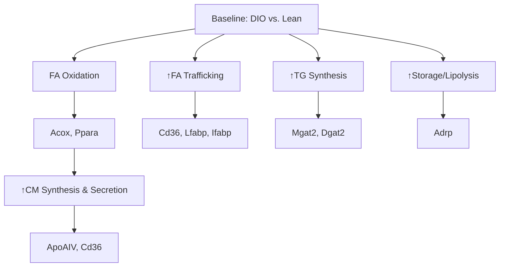
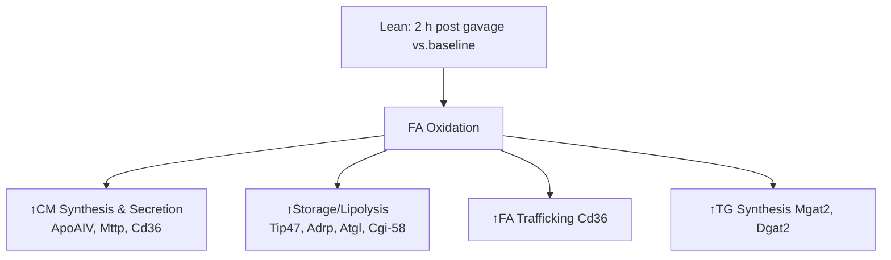
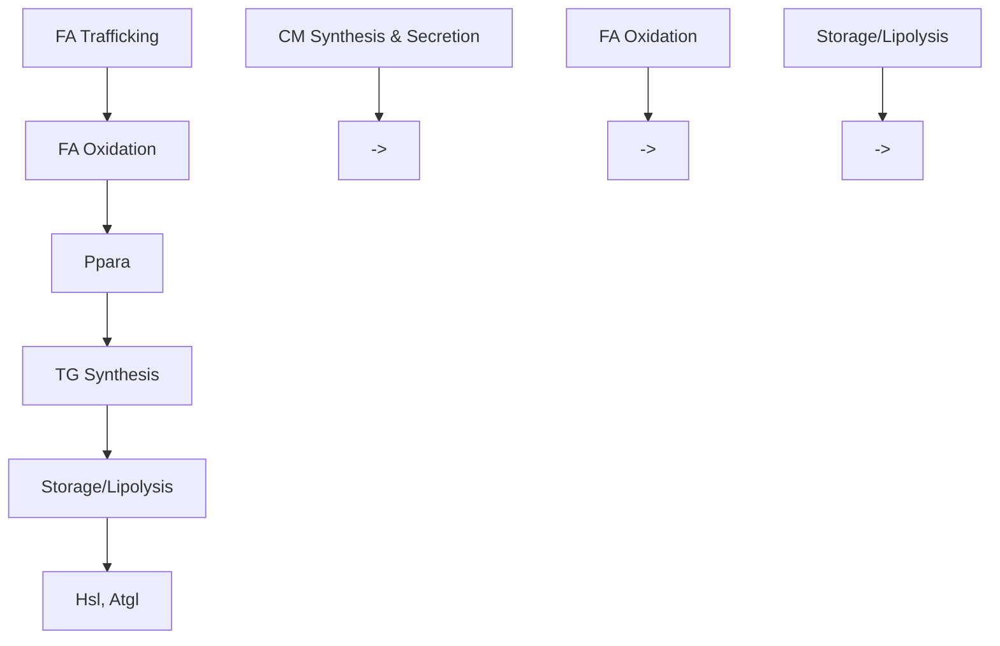

# Reduced triglyceride secretion in response to an acute dietary fat challenge in obese compared to lean mice

Aki Uchida1,2, Mary C. Whitsitt 2,Trisha Eustaquio3,4, Mikhail N. Slipchenko3, James F. Leary 3,4,5, Ji-Xin Cheng3,6 and Kimberly K. Buhman1,2\*

1 Interdisciplinary Life Science Program, Purdue University, West Lafayette, IN, USA  
2 Department of Nutrition Science, Purdue University, West Lafayette, IN, USA  
3 Weldon School of Biomedical Engineering, Purdue University, West Lafayette, IN, USA  
4 Birck Nanotechnology Center Purdue University, West Lafayette, IN, USA  
5 Department of Basic Medical Sciences Purdue University, West Lafayette, IN, USA  
6 Department of Chemistry, Purdue University, West Lafayette, IN, USA

## Edited by:

Sander Kersten, Wageningen University, Netherlands

## Reviewed by:

Douglas Mashek, University of Minnesota, USA Nicole De Wit, Podiceps BV, Netherlands

## \*Correspondence:

Kimberly K. Buhman, Department of Nutrition Science, Purdue University, 700 West State Street, West Lafayette, IN 47907, USA. e-mail: kbuhman@purdue.edu

Obesity results in abnormally high levels of triglyceride (TG) storage in tissues such as liver, heart, and muscle, which disrupts their normal functions. Recently, we found that lean mice challenged with high levels of dietary fat store TGs in cytoplasmic lipid droplets in the absorptive cells of the intestine, enterocytes, and that this storage increases and then decreases over time after an acute dietary fat challenge.The goal of this study was to investigate the effects of obesity on intestinal TG metabolism. More specifically we asked whether TG storage in and secretion from the intestine are altered in obesity. We investigated these questions in diet-induced obese (DIO) and leptin-deficient (ob/ob) mice. We found greater levels of TG storage in the intestine of DIO mice compared to lean mice in the fed state, but similar levels of TG storage after a 6-h fast. In addition, we found similar TG storage in the intestine of lean and DIO mice at multiple time points after an acute dietary fat challenge. Surprisingly, we found remarkably lower TG secretion from both DIO and ob/ob mice compared to lean controls in response to an acute dietary fat challenge. Furthermore, we found altered mRNA levels for genes involved in regulation of intestinal TG metabolism in lean and DIO mice at 6 h fasting and in response to an acute dietary fat challenge. More specifically, we found that many of the genes related to TG synthesis, chylomicron synthesis, TG storage, and lipolysis were induced in response to an acute dietary fat challenge in lean mice, but this induction was not observed in DIO mice. In fact, we found a significant decrease in intestinal mRNA levels of genes related to lipolysis and fatty acid oxidation in DIO mice in response to an acute dietary fat challenge. Our findings demonstrate altered TG handling by the small intestine of obese compared to lean mice.

Keywords: triglyceride, dietary fat absorption, obesity, chylomicrons, cytoplasmic lipid droplets

## INTRODUCTION

Obesity is a multifaceted syndrome and a growing epidemic that results in excess accumulation of triglyceride (TG) in adipose tis sue as well as ectopic deposition in tissues such as liver, heart, pancreas, and muscle. The ectopic deposition of TG in these tissues contributes to some of the major complications of obesity such as hepatic steatosis, diabetes, diabetic cardiomyopathy, and atherosclerosis (Friedman, 2002; Unger, 2002; Schaffer, 2003). In addition, obesity is commonly associated with elevated fasting and postprandial blood TG concentrations (Blackburn et al., 2003), which may contribute to ectopic deposition of TG in these tissues and are risk factors for atherosclerosis (Zilversmit, 1979; Patsch et al., 1992; Uiterwaal et al., 1994). Understanding how postprandial blood TG concentrations are dysregulated in obesity is important for decreasing the health complications associated with obesity.

Dietary fat significantly contributes to postprandial blood TG concentrations (Astrup et al., 1994; Uiterwaal et al., 1994; Dubois et al., 1998) and obesity (Astrup et al., 1994; Prentice et al., 1994). The absorption of dietary fat by the small intestine is an efficient process regardless of the amount of fat consumed. In the intestinal lumen, dietary fat in the form of TGs are hydrolyzed to monoacylglycerol and fatty acids, incorporated into micelles, and presented to enterocytes for uptake and metabolism. Once in the enterocytes, monoacylglycerol, and fatty acids, are re-esterified into TGs and packaged into chylomicrons (CMs) for secretion (Mansbach and Gorelick, 2007).

Recently, our laboratory has highlighted TG storage in cyto plasmic lipid droplets (CLDs) as another fate for these digestive products in enterocytes. TG storage in enterocytes is dynamic and dependent on amount of dietary fat consumed. We have shown that in response to an acute oral dietary fat challenge, TG storage increases, peaks, and then decreases over time in enterocytes (Zhu et al., 2009). The amount of TG storage in enterocytes also depends on the amount of fat consumed. In addition, in chronic high fat (HF) fed mice, we observed abundant TG storage in CLDs in the enterocytes in the fed state; however, after prolonged fasting the enterocytes of chronic HF-fed mice have little to no TG storage in CLDs (Lee et al., 2009; Zhu et al., 2009). These results suggest that the TG stored in CLDs in enterocytes is ultimately mobilized from this storage pool, but the fate of this lipid is unknown.

Blood TG concentrations are a balance between input to and clearance from circulation. After a TG challenge, CMs are secreted from the intestine and rapidly metabolized and cleared from circulation by the action of lipoprotein lipase. In fact, the clearance portion of this balance is thought to be the major mechanism for regulation of postprandial blood TG concentrations. However, evidence also suggests that postprandial blood TG concentrations may also be regulated by rate of secretion from the small intestine (Buhman et al., 2002; Yen et al., 2009b; Lee et al., 2010) and/or the size and composition of CMs produced (Zilversmit, 1967; Kane et al., 1980).

The goal of this study was to investigate the effects of obesity on intestinal TG metabolism. More specifically we asked whether TG storage in and secretion from the intestine are altered in obesity. We investigated these questions in diet-induced obese (DIO) and leptin-deficient (ob/ob) mice.

## MATERIALS AND METHODS DIETS AND MICE

All procedures were approved by the Purdue Animal Care and Use Committee. Wild-type mice used in these studies were 2- to 3-month-old. male, C57BL/6J mice from an in-house breeding colony. Ob/ob mice used in these studies were 8-week-old, male, in a C57BL/6J background purchased from Jackson Lab oratory (Bar Harbor, ME, USA). All mice were maintained in a specific pathogen-free barrier facility with a 12-h light/dark cycle (6PM/6AM) with free access to food and water. Lean mice were fed low fat, rodent chow throughout and the DIO mice were switched from rodent chow to the HF diet at 10 weeks of age for 6–9 weeks as indicated. The chow diet (PicoLab 5053, Lab Diets, Richmond, IN, USA) consisted of 62.1% of calories from carbohydrate (starch), 24.7% from protein, and 13.2% from fat. The HF diet (D12492, Research Diets, Inc., New Brunswick, NJ, USA) consisted of 20% of calories from carbohydrate (35% sucrose, 65% starch), 20% from protein, and 60% from fat (mostly lard). Subgroups of mice were used for specific endpoints due to the terminal nature of the studies. Numbers of mice per endpoint are indicated in figures and table legends. Mice were euthanized via $\mathrm { C O } _ { 2 }$ asphyxiation and the small intestine was divided into six equal length segments and labeled S1–S6 (proximal to distal) in relation to the stomach. S1 represents duodenum, S2 represents upper jejunum, S2 and S3 represents jejunum in these studies.

## TISSUE IMAGING

Mice were euthanized and tissues harvested at specific time points relative to the fed-fasted cycle. Differential time periods for food removal were used to normalize for time since last meal consumed and the amount of TG storage in the intestine. HF-fed mice require longer time periods of food removal compared to chow-fed mice, to reduce the amount of TG storage in enterocytes and synchronize time since last meal (Zhu et al., 2009). DIO mice: for mice representing the fed state, food was removed at the beginning of the light cycle (6AM) and mice were euthanized at 8AM. The 2-h of food removal was at a time period where mice are normally not eating and was intended to minimize the variability in time since last food consumption. For the time course, all mice had food removed for 6 h prior to a 200-μl olive oil gavage and were euthanized at either baseline (just before gavage), 2, 4, 6, or 8 h post oil bolus. After administration of the oil bolus, no other food was available during the time course. Ob/ob mice: for mice representing the fed state, food was removed at the beginning of the light cycle (6AM) and mice euthanized at 8AM. For the time course, all mice had food removed for 4 h prior to a 200-μl olive oil gavage and were euthanized at either 2, 4, or 8 h post oil bolus. After administration of the oil bolus, no other food was available during the time course.

For intact tissue imaging, ex vivo fresh tissues (5 mm) from small intestine (S2, representing upper jejunum) were placed in 3 ml Dulbecco’s Modified Eagle’s Medium (Gibco, Carlsbad, CA, USA) supplemented with 20 mM HEPES, 100 U/ml penicillin– streptomycin (Gibco), and 10% fetal bovine serum. Tissues kept at 4˚C maintained good morphology over 5 h. Small intestine tissue was cut longitudinally and laid flat for luminal imaging. All tissues were imaged within 3 h after euthanasia. Coherent anti-Stokes Raman scattering (CARS) imaging were performed at a multi modal microscope. Pump and Stokes lasers were generated from two synchronized Ti:sapphire lasers (Tsunami, Spectra-Physics, Mountain View, CA, USA), with a pulse width of 5 ps. These two lasers were in time synchronized (Lock-to-Clock, Spectra-Physics), colinearly combined, and directed into a laser scanning confocal microscope (FV300/IX71, Olympus America, Center Valley, PA, USA). A 20 air objective $( \mathrm { N } . \mathrm { A } . = 0 . 7 5 )$ was used to focus the laser beams into the sample. The average powers of the pump and Stokes beams at the sample were 40 and 30 mW respectively. For imaging TGs, the pump laser and the Stokes laser were tuned to 14140 and 11300 cm−1 respectively in order to generate a Raman shift of ${ \sim } 2 8 4 0 \ c m ^ { - 1 }$ that excites the symmetric CH vibration. The forward-detected CARS signals were collected using an air condenser $( \mathrm { N } . \mathrm { A } . = 0 . 5 5 )$ . External photomultiplier tube (R3896, Hamamatsu, Japan) detector was used to receive the forward-detected CARS signals.

## INTESTINAL TG CONCENTRATIONS

All mice had food removed for 6 h prior to a 200-μl olive oil gavage and were euthanized at either baseline (just before gavage) or 2 h post oil bolus. Lipids in intestinal mucosa (S1, representing duodenum) were extracted by the hexane/isopropanol (3:2) method. Briefly, after homogenization of the mucosa with 1 M Tris–HCl (pH 7.4), hexane/isopropanol (3:2), and water were added to the sample and was incubated for 30 min with occasional mixing. The upper part containing lipids was transferred to a new tube. After evaporating the organic phase under nitrogen, lipids were dissolved in isopropanol. TG concentration was determined by Wako L-Type TG determination kit (Wako Chemical USA, Richmond, VA, USA) and normalized to protein concentration (Pierce, Rockford, IL, USA).

## POSTPRANDIAL TRIGLYCERIDEMIC RESPONSE

Food was removed for 4 h, an oral gavage of 200 μl olive oil was administered, and blood collected for up to 4 h post-gavage. No food was available during the time course. Blood for measuring TG concentration was obtained via submandibular bleed. Plasma TG concentration was determined by Wako L-Type TG determination kit (Wako Chemicals USA).

## INTESTINAL TG SECRETION

Food was removed for 4 h, mice were injected with 500 mg/kg Tyloxapol (T0307, Sigma-Aldrich, St. Louis, MO, USA) IP to block lipase activity in circulation, after 30 min an oral gavage of 200 μl olive oil was administered, and blood collected up to 4 h postgavage. No food was available during the time course. Blood for measuring TG concentration was obtained via submandibular bleed. Plasma TG concentration was determined by Wako L-Type TG determination kit (Wako Chemicals USA).

## CM SIZE

Chylomicrons were isolated from plasma collected from mice 1 h post oil bolus (described in Section Postprandial Triglyceri demic Response). Briefly, PBS was layered onto 50 μl plasma in 230 μl polycarbonate thick wall ultracentrifuge tube and spun for 30 min at $5 0 0 0 0 \times g$ in a bench top ultracentrifuge (Optima Max XP, Beckman Coulter, Brea, CA, USA) and the top layer collected. Dynamic light scattering (DLS) was used to measure hydrodynamic diameter of CMs. The hydrodynamic diameter corresponds to the diameter of a hypothetical spherical particle diffusing through a fluid, which is proportional to the intensity of scattered light upon illumination with a laser. DLS measurements (three repeated measurements per sample) were taken at room temperature using the automatic mode on the Zetasizer Nano ZS (Malvern Instruments, Worcestershire, UK) to choose the appropriate settings for run length and number of runs per measurement. The Z -averages, dominant intensity peak, and polydispersity indices are reported. The Z -average is the intensity weighted mean hydrodynamic size of the entire population of CMs. The dominant intensity peak indicates only the most prominent chylomicron population. And the polydispersity index is related to the width of the CM size distribution, which is assumed to be Gaussian (Werner et al., 2006; Sakurai et al., 2010).

## GENE EXPRESSION

All mice had food removed for 6 h prior to a 200-μl olive oil gav age and were euthanized at either baseline (just before gavage) or 2 h post oil bolus. Total RNA was extracted from intestinal mucosa representing the jejunum with RNA STAT60 (Tel-Test, Friendswood,TX,USA) and then DNAse treated with Turbo DNAfree (Ambion, Austin, TX, USA). cDNA was synthesized from 1 μg DNase treated RNA by AffinityScript QPCR cDNA using oligo dT and random hexamer primers (Stratagene, La Jolla, CA, USA). SYBR green QPCR was performed using Mx3000P QPCR System (Stratagene) and Brilliant II SYBR green master mix (Stratagene). Post-PCR products were subjected to 1.5% agarose gel electrophoresis for imaging product size. The expression of each gene was normalized to 18S rRNA and calculated with the comparative CT method. Primers used for this study are as shown in Table 1 and were all validated for efficiency and correct product size in cDNA from mouse intestinal mucosa.

Table 1 | Primers used for quantitative real time PCR.

<table><tr><td>Gene</td><td>Primer sequences</td></tr><tr><td rowspan="2">18S rRNA</td><td>F 5&#x27;-TTAGAGTGTTCAAA GCAGGCCCGA-3&#x27;</td></tr><tr><td>R 5&#x27;-TCTTGGCAAATGCTTTCGCTCTGG-3&#x27;</td></tr><tr><td rowspan="2">Aco</td><td>F 5&#x27;-ATATTTACGTCACGTTTACCCCGG-3&#x27;</td></tr><tr><td>R 5&#x27;-GGCAGGTCATTCAAGTACGACAC-3&#x27;</td></tr><tr><td rowspan="2">Adrp</td><td>F 5&#x27;-AAGAGGCCAAACAAAAGAGCCAGGAGACCA-3&#x27;</td></tr><tr><td>R 5&#x27;-ACCCTGAATTTTCTGGTTGGCACTGTGCAT-3&#x27;</td></tr><tr><td rowspan="2">ApoAIV</td><td>F 5&#x27;-CCAGCTAAGCAATGCCAAGGA-3&#x27;</td></tr><tr><td>R 5&#x27;-TGCTCCTGCAACTTCTGCATGTTC-3&#x27;</td></tr><tr><td rowspan="2">Cd36</td><td>F 5&#x27;-ATTGTACCTGGGAGTTGGCGAGAA-3&#x27;</td></tr><tr><td>R 5&#x27;-AACTGTCTGTAGACAGTGGTGCCT-3&#x27;</td></tr><tr><td rowspan="2">Cgi-58</td><td>F 5&#x27;-AAGACGCCACTTGTCCTCCTTCAT-3&#x27;</td></tr><tr><td>R 5&#x27;-AGCAAGATCTGGTCGCTCAGGAAA-3&#x27;</td></tr><tr><td rowspan="2">Dgat1</td><td>F 5&#x27;-ACCGCGAGTTCTACAGAGATTGGT-3&#x27;</td></tr><tr><td>R 5&#x27;-ACAGCTGCATTGCCATAGTTCCCT-3&#x27;</td></tr><tr><td rowspan="2">Dgat2</td><td>F 5&#x27;-TGGGTCCAGAAGAAGTTCCAGAAGTA-3&#x27;</td></tr><tr><td>R 5&#x27;-ACCTCAGTCTCTGGAAGGCCAAAT-3&#x27;</td></tr><tr><td rowspan="2">Fabp1</td><td>F 5&#x27;-AGTACCAATTGCAGAGCCAGGAGA-3&#x27;</td></tr><tr><td>R 5&#x27;-GACAATGTCGCCCAATGTCATGGT-3&#x27;</td></tr><tr><td rowspan="2">Fabp2</td><td>F 5&#x27;-AGAGGAAGCTTGGAGCTCATGACA-3&#x27;</td></tr><tr><td>R 5&#x27;-TCGCTTGGCCTCAACTCCTTCATA-3&#x27;</td></tr><tr><td rowspan="2">Hsl</td><td>F 5&#x27;-CATCTTTGGCTTCAGCCTCTTCCT-3&#x27;</td></tr><tr><td>R 5&#x27;-ATGGCTCAACTCCTTCCTGGAACT-3&#x27;</td></tr><tr><td rowspan="2">Mgat2</td><td>F 5&#x27;-TCTTCCAGTACAGCTTTGGCCTCA-3&#x27;</td></tr><tr><td>R 5&#x27;-TGATATAGCGCTGATGAAGCCGGT-3&#x27;</td></tr><tr><td rowspan="2">Mttp</td><td>F 5&#x27;-AGTGCAGTTCTCACAGTACCCGTT-3&#x27;</td></tr><tr><td>R 5&#x27;-AGCATATCGTTCTGGTGGAAGGGA-3&#x27;</td></tr><tr><td rowspan="2">Ppar α</td><td>F 5&#x27;-TCGCGTACGGCAATGGCTTTATCA-3&#x27;</td></tr><tr><td>R 5&#x27;-AGCTTTGGGAAGAGGAAGGTGTCA-3&#x27;</td></tr><tr><td rowspan="2">Tip47</td><td>F 5&#x27;-ATGGAATCCGTGAAACAGGGTGTG-3&#x27;</td></tr><tr><td>R 5&#x27;-TGAGAGGTCCTGGAAGGAGTGAAT-3&#x27;</td></tr></table>

## DATA AND STATISTICS

All the data are shown as mean SEM. Statistical significance was determined with a Student’s T -test (P < 0.05), unless stated otherwise.

## RESULTS

## GROWTH CURVES OF C57BL/6J MICE FED CHOW OR HF DIETS FOR 9 WEEKS

Ten-week-old, C57BL/6J mice were fed a low fat, chow diet or a HF diet for 9 weeks and body weights were monitored weekly. After 2 weeks of feeding, HF-fed mice had higher body weights compared to chow-fed mice. After 6 weeks of feeding, HF-fed mice were 1.5 times heavier than chow-fed mice (Figure 1). At the end of the study, liver and gonadal fat pad weights were higher in HF compared to chow-fed mice (Table 2). Chow-fed mice served as lean controls. The HF-fed mice are a well-established model of DIO and insulin resistance (Black et al., 1998; Buettner et al., 2007).

## TG STORAGE IN ENTEROCYTES OF DIO AND LEAN MICE IN RESPONSE TO DIETARY FAT

To visualize TG storage in enterocytes in response to a dietary fat challenge, we used CARS microscopy to image the upper jejunum.

line chart

| Weeks fed Respective Diets | Lean Body Weight (g) | DIO Body Weight (g) |
| --------------------------- | -------------------- | ------------------- |
| 0                           | 24                   | 25                  |
| 1                           | 25                   | 28                  |
| 2                           | 26                   | 32                  |
| 3                           | 27                   | 35                  |
| 4                           | 28                   | 38                  |
| 5                           | 29                   | 40                  |
| 6                           | 30                   | 42                  |
| 7                           | 31                   | 44                  |
| 8                           | 32                   | 46                  |
| 9                           | 33                   | 47                  |

FIGURE 1 | Growth curves of lean (low fat, chow-fed) and DIO (HF-fed) mice starting at 10 weeks of age for 9 weeks. Data are represented as mean SEM. Asterisks denote significant differences compared to lean mice at the particular time point (T -test), P < 0.05, n 5 mice.

Table 2 | Body, liver, and gonadal fat pad weights of lean and DIO mice.

<table><tr><td></td><td>Body (g)</td><td>Liver (g)</td><td>Gonadal Fat (g)</td></tr><tr><td>Lean</td><td>30 ± 2</td><td>1.7 ± 0.1</td><td>0.9 ± 0.2</td></tr><tr><td>DIO</td><td>46 ± 1*</td><td>2.6 ± 0.2*</td><td>1.8 ± 0.2*</td></tr></table>

DIO and lean mice were fasted for 2 h at the beginning of the light cycle, euthanized, and liver and epididymal fat pad weights determined. Data are represented as mean SEM. Asterisks denote significant differences between lean and DIO mice (T-test), P < 0.05, n 5 mice.

CARS microscopy is a technique that allows for vibrational imaging of specific molecules with three-dimensional submicron spatial resolution. The advantage of CARS images is that we can observe TG storage within enterocytes without labeling or fixation. Under fed conditions TG stores are more abundant in enterocytes of DIO mice compared to lean mice (Figure 2A, fed); but at baseline we found little TG stored in the jejunum of DIO or lean mice (Figure 2A, baseline). However, at 2, 4, 6, and 8 h after an acute dietary fat challenge, DIO and lean mice stored similar amounts of TG with levels of TG increasing and then decreasing over time (Figure 2A). In addition, we biochemically determined the amount of TG in adjacent intestinal mucosa sections, at base line and 2 h after an acute dietary fat challenge, in DIO and lean mice and found similar results (Figure 2B).

## POSTPRANDIAL TRIGLYCERIDEMIC RESPONSE, TG SECRETION, AND CM SIZE IN RESPONSE TO DIETARY FAT IN DIO COMPARED TO LEAN MICE

To determine whether the postprandial triglyceridemic response was altered in DIO mice compared to lean mice, we measured plasma TG concentration before and hourly up to 4 h after an acute dietary fat challenge in lean and DIO mice. We found highe TG concentrations at 2 and 4 h post oil bolus in the DIO mice compared to lean mice. The AUC for the postprandial triglyceridemic response in DIO mice trended higher than in lean mice (P 0.08, n 5–6 mice). In addition, we observed a delayed peak in the postprandial triglyceridemic response in the DIO mice compared to lean mice (Figure 3A).

To determine whether TG secretion from the intestine was altered in DIO mice compared to lean mice, we measured plasma TG concentrations before and at 2 and 4 h after an acute dietary fat challenge in lean and DIO mice treated with TG clearance inhibitor, Tyloxapol. Surprisingly, we found that DIO mice have significantly lower levels of TG secretion from the intestine 2 and 4 h following an acute dietary fat challenge compared to lean mice. The AUC for TG secretion from the intestine in DIO mice were significantly lower than the lean mice (P 0.008, n 5 mice, Figure 3B).

To determine whether CM size was altered in DIO mice compared to lean mice, we isolated CMs 1 h after an acute dietary fat challenge via ultracentrifugation and measured their size via DLS. DLS measures the CM hydrodynamic diameter. Hydrodynamic diameter corresponds to the diameter of a theoretical spherical particle diffusing through a fluid, which is proportional to the intensity of scattered light upon illumination with a laser. We found that CMs isolated from DIO mice were significantly larger than those from lean mice (Table 3).

## ALTERED mRNA LEVELS FOR GENES INVOLVED IN REGULATION OF INTESTINAL TG METABOLISM IN LEAN AND DIO MICE AT BASELINE AND IN RESPONSE TO AN ACUTE DIETARY FAT CHALLENGE

To determine whether alterations in mRNA levels of genes involved in fatty acid trafficking, TG synthesis, and CM assembly in enterocytes correlates with the lower TG secretion rate in DIO compared to lean mice, we measured mRNA levels of fatty acid binding protein1 (Fabp1), Fabp2, diacylglycerol acyltransferase 1 (Dgat1), Dgat2, monoacylglycerol acyltranseferase 2 (Mgat2), microsomal TG transfer protein (Mttp), apolipoprotein AIV (ApoAIV ), and fatty acid translocase (Cd36), in the jejunum of DIO and lean mice. At baseline we found higher mRNA levels for Fabp1, Fabp2, Dgat2, Mgat2, ApoAIV, and Cd36 in the jejunum of DIO mice compared to lean mice. To determine whether genes involved in fatty acid trafficking, TG synthesis, and CM assembly in entero cytes responded differentially to an acute dietary fat challenge in the jejunum of DIO and lean mice, we measured mRNA levels of Fabp1, Fabp2, Dgat1, Dgat2, Mgat2, Mttp, ApoAIV, and Cd36 at baseline and at 2 h after an acute dietary fat challenge. We found higher mRNA levels of Mttp, ApoAIV, Dgat2, Mgat2, and CD36 at 2 h after an acute dietary fat challenge than at baseline in lean mice; however, we found no change in mRNA levels for these genes 2 h after an acute dietary fat challenge compared to baseline in DIO mice (Table 4).

To determine whether alterations in mRNA levels of genes involved in TG storage and lipolysis in enterocytes correlate with the lower TG secretion rate in DIO compared to lean mice, we measured mRNA levels of tail-interacting protein of 47 kDa (Tip47 ), adipose differentiation-related protein (Adrp), hormone sensitive lipase (Hsl), adipose TG lipase (Atgl), and comparative gene identification-58 (Cgi-58) in the jejunum of DIO and lean mice. At baseline, we found higher mRNA levels for Tip47 and Adrp in the jejunum of DIO mice compared to lean mice. We found higher mRNA levels of Tip47, Adrp, Atgl, and Cgi-58 at 2 h after an acute dietary fat challenge than at baseline in the jejunum of lean mice.

text_image

A
Fed	Baseline	Hours Post Gavage
2 Hours	4 Hours	6 Hours	8 Hours
Lean
DIO
50µm

bar chart

| Group | Baseline (6h fasted) (mg) | 2 h post gavage (mg) |
|---|---|---|
| Lean | 0.05 | 0.4 |
| DIO | 0.05 | 0.55 |
* indicates statistical significance for the 2 h post gavage group.

FIGURE 2 |TG storage in enterocytes of DIO and lean mice in response to dietary fat. (A) Representative CARS images of TG storage in enterocytes of the upper jejunum of fed (2 h post food removal at beginning of light cycle), baseline (6 h fast), 2, 4, 6, and 8 h post oil bolus in lean and DIO mice (6 weeks of HF feeding). (B) TG concentration in  
duodenum of lean and DIO mice (6 weeks of HF feeding) at baseline (6 h fast) and 2 h post oil bolus. Data are represented as mean SEM. Asterisks denote significant differences in TG concentration between baseline and 2 h post oil bolus of respective groups (Two-way ANOVA, Tukey post hoc test), P < 0.05, n 4 mice.

line chart

| Hours Post Gavage | Lean | DIO |
| ----------------- | ---- | --- |
| 0                 | 50   | 30  |
| 1                 | 120  | 110 |
| 2                 | 90   | 140 |
| 3                 | 60   | 85  |
| 4                 | 40   | 60  |

FIGURE 3 | Postprandial triglyceridemic response andTG secretion in response to dietary fat in DIO compared to lean mice. (A) Postprandia triglyceridemic response was measured in DIO and lean mice. Plasma TG concentration at baseline (4 h fast) and at 1, 2, 3, and 4 h after a 200-μ olive oil challenge in DIO (6 weeks of HF feeding) and lean mice. Data are represented as mean SEM. Asterisks denote significant differences at time points between DIO and lean mice (T-test), P < 0.05, n 5–6 mice.

line chart

| Hours Post Gavage | Plasma TG (mg/dL) - Series 1 | Plasma TG (mg/dL) - Series 2 |
| ----------------- | ---------------------------- | ---------------------------- |
| 0                 | 0                            | 0                            |
| 2                 | 1200                         | 400                          |
| 4                 | 3000                         | 1500                         |

(B) Mice were fasted for 4 h at the beginning of the light cycle and injected with 500 mg/kg Tyloxapol into the intraperitoneal cavity to block lipase activity in circulation. After 30 min, mice were administered 200 μl olive oi via oral gavage and plasma TG measured before and 2 and 4 h post oil bolus. Data are represented as mean SEM. Asterisks denote significant differences at time points compared to lean mice (T -test), P < 0.05, n 5 mice.

However, we found no change in mRNA levels for Tip47 and Adrp and a remarkable decrease in expression of Hsl and Atgl 2 h after an acute dietary fat challenge compared to baseline in the jejunum of DIO mice (Table 4).

To determine whether alterations in mRNA levels of genes involved in fatty acid oxidation in enterocytes correlates with the lower TG secretion rate in DIO compared to lean mice, we measured mRNA levels of peroxisome proliferator-activated receptor α (Pparα) and acyl CoA oxidase (Acox) in the jejunum of DIO and lean mice. At baseline we found higher mRNA levels of Pparα and Acox in the jejunum of DIO mice compared to lean mice. We found no difference in mRNA levels of Pparα and Acox 2 h after an acute dietary fat challenge than at baseline in the jejunum of lean mice. However, we found remarkably lower mRNA level for Pparα 2 h after an acute dietary fat challenge compared to baseline in the jejunum of DIO mice (Table 4).

## TG STORAGE AND SECRETION IN RESPONSE TO DIETARY FAT IN ob/ob COMPARED TO LEAN MICE

To determine whether the above TG storage and secretion results in DIO mice were due to HF feeding or obesity, we performed simila experiments in a genetic mouse model of obesity, the leptin deficient (ob/ob) mouse model. Body weights of ob/ob mice were significantly greater than WT mice at 12 weeks of age $( 5 3 . 8 \pm 0 . 8 $ and $2 7 . 4 \pm 0 . 9 \mathrm { g } ,$ respectively). To determine TG storage amounts in enterocytes of ob/ob and wild-type mice in response to a dietary fat challenge, we used CARS microscopy to image the upper jejunum. We found that ob/ob mice have similar TG storage in the fed state, and at 2, 4, and 8 h after an acute dietary fat challenge compared to lean mice (Figure 4A). To determine intestinal TG secretion, we measured plasma TG concentrations before and at 2 and 4 h after an acute dietary fat challenge in wild-type and ob/ob mice treated with TG clearance inhibitor, Tyloxapol. Similar to the DIO mice, ob/ob mice had significantly reduced TG secretion from the intestine following an acute dietary fat challenge compared to lean mice The AUC for TG secretion from the intestine in ob/ob mice were significantly lower than the lean mice $( P = 0 . 0 4 6 , n = 5$ mice, Figure 4B).

Table 3 | Larger CMs size in response to an acute dietary fat challenge in DIO compared to lean mice.

<table><tr><td></td><td>Z-average (nm)</td><td>Dominant intensity peak (nm)</td><td>Polydispersity index</td></tr><tr><td>Lean</td><td> $107 \pm 9$ </td><td> $140 \pm 10$ </td><td> $0.24 \pm 0.04$ </td></tr><tr><td>DIO</td><td> $147 \pm 7^{*}$ </td><td> $201 \pm 3^{*}$ </td><td> $0.25 \pm 0.05$ </td></tr></table>

CMs isolated from DIO (6 weeks HF feeding) and lean mice 1 h post oil bolus. CM size was measured using DLS, which measures hydrodynamic diameter. Data are represented as mean SEM. Asterisks denote significant differences between lean and DIO mice (T-test), P < 0.05, n 5 mice.

## DISCUSSION

In order to understand the complex and dynamic nature of dietary fat absorption, we have interpreted data gathered at multiple times before and post-acute dietary fat challenge of intestinal TG storage, mRNA levels of genes involved in TG metabolism, and blood TG concentration in lean and obese mice. Taken together, our findings demonstrate altered TG handling by the small intestine of obese compared to lean mice. We found greater levels of TG storage in the intestine of DIO mice compared to lean mice in the fed state, but similar levels of TG storage after a 6-h fast. In addition, we found similar TG storage in the intestine of lean, DIO, and ob/ob mice at multiple time points after an acute dietary fat challenge. Surprisingly, we found remarkably lower intestinal TG secretion in both DIO and ob/ob mice compared to lean controls in response to an acute dietary fat challenge. Furthermore, we found altered mRNA levels for genes involved in regulation of intestinal TG metabolism in lean and DIO mice at 6 h fasting and in response to an acute dietary fat challenge. More specifically, many of the genes related to TG synthesis, CM synthesis, TG storage, and lipolysis were induced in response to an acute dietary fat challenge in lean mice, but this induction was not observed in DIO mice. In fact, we found significantly lower intestinal mRNA levels of genes related to lipolysis and fatty acid oxidation in DIO mice in response to an acute dietary fat challenge.

Table 4 | Relative mRNA levels for genes involved in regulation of intestinalTG metabolism.

<table><tr><td rowspan="3">Gene</td><td rowspan="3">Function</td><td rowspan="3">Fold change: DIO relative to lean mice – at baseline</td><td colspan="2">Post dietary fat challenge</td></tr><tr><td colspan="2">Fold change: 2 h post oil bolus relative to baseline</td></tr><tr><td>Lean</td><td>DIO</td></tr><tr><td>MTTP</td><td>CM assembly</td><td> $1.9 \pm 0.4$ </td><td> $2.3 \pm 0.3^{*}$ </td><td> $1.2 \pm 0.2$ </td></tr><tr><td>ApoA4</td><td>CM assembly</td><td> $4.5 \pm 0.8^{*}$ </td><td> $2.7 \pm 0.3^{*}$ </td><td> $0.7 \pm 0.2$ </td></tr><tr><td>CD36</td><td>FA trafficking/CM assembly</td><td> $6.4 \pm 1.0^{*}$ </td><td> $2.9 \pm 0.2^{*}$ </td><td> $0.5 \pm 0.2$ </td></tr><tr><td>LFABP</td><td>FA trafficking</td><td> $3.7 \pm 0.4^{*}$ </td><td> $1.5 \pm 0.3$ </td><td> $1.2 \pm 0.1$ </td></tr><tr><td>IFABP</td><td>FA trafficking</td><td> $2.2 \pm 0.3^{*}$ </td><td> $1.1 \pm 0.4$ </td><td> $1.0 \pm 0.1$ </td></tr><tr><td>DGAT1</td><td>TG synthesis</td><td> $1.8 \pm 0.3$ </td><td> $1.3 \pm 0.4$ </td><td> $1.0 \pm 0.2$ </td></tr><tr><td>DGAT2</td><td>TG synthesis</td><td> $3.4 \pm 0.4^{*}$ </td><td> $4.3 \pm 0.3^{*}$ </td><td> $1.7 \pm 0.2$ </td></tr><tr><td>MGAT2</td><td>TG synthesis</td><td> $2.8 \pm 0.5^{*}$ </td><td> $2.8 \pm 0.8^{*}$ </td><td> $0.9 \pm 0.2$ </td></tr><tr><td>TIP47</td><td>TG storage</td><td> $1.0 \pm 0.2$ </td><td> $3.3 \pm 0.8^{*}$ </td><td> $1.3 \pm 0.5$ </td></tr><tr><td>ADRP</td><td>TG storage</td><td> $4.1 \pm 0.9^{*}$ </td><td> $5.6 \pm 0.9^{*}$ </td><td> $2.2 \pm 0.5$ </td></tr><tr><td>HSL</td><td>Lipolysis</td><td> $1.4 \pm 0.3$ </td><td> $1.9 \pm 0.5$ </td><td> $0.14 \pm 0.03^{*}$ </td></tr><tr><td>ATGL</td><td>Lipolysis</td><td> $1.8 \pm 0.3$ </td><td> $2.0 \pm 0.3^{*}$ </td><td> $0.19 \pm 0.05^{*}$ </td></tr><tr><td>CGI-58</td><td>Lipolysis</td><td> $2.3 \pm 0.3$ </td><td> $3.5 \pm 0.6^{*}$ </td><td> $0.6 \pm 0.2$ </td></tr><tr><td>ACOX</td><td>Oxidation</td><td> $6 \pm 1^{*}$ </td><td> $2.3 \pm 0.8$ </td><td> $1.0 \pm 0.03$ </td></tr><tr><td>PPARα</td><td>Nuclear transcription factor</td><td> $4.6 \pm 0.3^{*}$ </td><td> $2.0 \pm 0.5$ </td><td> $0.32 \pm 0.04^{*}$ </td></tr></table>

QPCR analysis of genes involved in FA trafficking,TG synthesis, FA oxidation, and CM synthesis and secretion in the jejunum (S2 and 3) of lean and DIO mice (6 weeks of HF feeding). Results are present comparing DIO to lean mice at baseline (6 h fast) and comparing 2 h post oil bolus to baseline for both lean and DIO mice. Data are represented as mean SEM. Asterisks denote significant differences in DIO compared to lean mice (shaded column) and 2 h post oil bolus compared to baseline (white column; T-test), P < 0.05, n 3–7 mice.

line chart

| Hours Post Gavage | WT Plasma TG (mg/dL) | ob/ob Plasma TG (mg/dL) |
| ----------------- | -------------------- | ----------------------- |
| 0                 | 0                    | 0                       |
| 2                 | ~1200                | ~600                    |
| 4                 | ~3500                | ~1800                   |

FIGURE 4 |Triglyceride storage and secretion in response to dietary fat in ob/ob compared to lean mice. (A) Representative CARS images of TG storage in enterocytes of the upper jejunum of fed (2 h post food removal at beginning of light cycle) and 2, 4, and 8 h post oil bolus. (B) Mice were fasted for 4 h at the beginning of the light cycle and injected with 500 mg/kg.  
Tyloxapol into the intraperitoneal cavity to block lipase activity in circulation. After 30 min, mice were administered 200 μl olive oil via oral gavage and plasma TG measured before and 2 and 4 h post oil bolus. Data are represented as mean SEM. Asterisks denote significant differences between ob/ob and wild-type mice (T-test), P < 0.05, n 4–5 mice.

Despite the fact that the small intestine is not commonly thought of as an organ that stores TG, our lab has recently shown TG storage in enterocytes of mice in response to dietary fat that initially increases and then decrease at times after an acute dietary fat challenge (Zhu et al., 2009). In addition, in chronic HF-fed mice, we observed abundant TG storage in enterocytes in the fed state; however, after prolonged fasting the enterocytes of chronic HF-fed mice had little to no TG storage (Lee et al., 2009; Zhu et al., 2009). To our knowledge, the effects of obesity on enterocyte TG storage including the dynamics of TG storage in response to an acute dietary fat have not been previously reported. To capture the dynamics of TG storage in obesity we compared DIO and ob/ob to control mice at different points in the fed-fasted status. We consistently found that TG storage in enterocytes increases and then decreases after a dietary fat challenge and the rate and amount of TG storage is similar in lean and obese mice. We also found that when mice are fed low fat diets, TG storage in enterocytes is minimal in lean and obese mouse models. These results are consistent with human studies showing that fasted obese individuals, with or without type 2 diabetes mellitus, have very little TG storage inside enterocytes (Soriguer et al., 2010), whereas TG storage is present in enterocytes of humans who have recently consumed a large fat load (Frayn, 2002). Taken together, these results suggest that TG storage in enterocytes is dependent on the amount of fat consumed and time after consumption and not altered by obesity.

In the postprandial state, blood TG concentration is primarily a balance between the input from the intestine and clearance by peripheral tissues. We measured the postprandial triglyceridemic response to an acute dietary fat challenge and found an increased postprandial triglyceridemic response and a delayed peak in the postprandial response in DIO compared to lean mice. Similar results have been published in ob/ob compared to lean mice (Haluzik et al., 2004). We were curious whether the postprandial hypertriglycerdemia observed in the DIO and ob/ob mice was due to increased TG input into circulation by the intestine. To answer this we administered the lipase inhibitor, Tyloxapol, before the acute dietary fat challenge, which blocks TG clearance from circulation. Under these conditions, the amount of TG secreted by the intestine is maximized and substantially higher compared to the contribution of TG secreted from the liver (Lin et al., 2005). Surprisingly, we found decreased intestinal TG secretion in both DIO and ob/ob mice up to 4 h after an acute dietary fat challenge. Consistent with our results, Douglass et al. (2012) also found decreased intestinal TG secretion in response to an acute dietary fat challenge in HF-fed and in ob/ob mice, compared to low fat-fed WT mice. These results suggest that the postprandial hypertriglycerdemia observed up to 4 h after an acute dietary fat challenge, was not due to an increased intestinal TG secretion in the DIO mice.

In fact, these results also suggest that the clearance of TG in CMs during this time period is severely impaired in obese mice, which have considerably higher postprandial triglyceridemic response despite lower TG contribution from the intestine compared to lean mice. One factor which may contribute to altered clearance is the observed larger size of CMs secreted from DIO compared to lean mice. Although larger CMs are generally thought to be cleared faster than smaller CMs (Martins et al., 1996; Rensen et al., 1997), it is possible that the composition of other lipids or proteins regulating clearance may also be altered (Fraser et al., 1968; Hultin et al., 1994).

Obesity and insulin resistance are commonly found together and associated with elevated blood TG concentration, in the fasted and postprandial state. The mouse models used in this study to address the effects of obesity on intestinal TG metabolism, DIO, and ob/ob mice, have both obesity and insulin resistance (Haluzik et al., 2004; de Wit et al., 2008), and have significantly lower levels of TG secretion in response to dietary fat. Previous studies done in rodent models with insulin resistance, but not obesity, have found conflicting results related to the effects of insulin resistance on intestinal TG metabolism. Petit et al. (2007) found that HF-fed mice, with insulin resistance but without obesity, had a similar intestinal TG secretion rate compared to control fed mice. In contrast, fructose-fed hamsters and HF-fed desert gerbils have an overproduction of apoB containing TG-rich lipoprotein particles from the intestine (Haidari et al., 2002; Zoltowska et al., 2003). Multiple differences in experimental design including diet and species likely contribute to these conflicting results.

Fatty acid trafficking, TG synthesis, CM synthesis and secretion, TG storage, lipolysis, and fatty acid oxidation in enterocytes are all potential steps in intestinal TG metabolism, which may be altered in the intestine of obese mice resulting in lower TG secretion in response to a dietary fat challenge. To better understand which of these steps may be altered we determine mRNA levels for key genes in these steps. We found altered mRNA levels for genes involved in many of these steps in DIO mice compared to lean mice at baseline and in response to an acute dietary fat challenge.

Chronic HF feeding is known to result in differential gene expression in the intestine – specifically, up-regulation of genes involved in TG metabolism (Kondo et al., 2006; de Wit et al., 2008). We confirmed that mRNA levels of key genes in fatty acid trafficking, TG synthesis, CM synthesis and secretion, TG storage, lipolysis, and fatty acid oxidation was higher in the jejunum of DIO compared to lean mice at baseline (Table 4; Figure 5A). In addition, we determined mRNA levels of key genes involved in TG metabolism before and 2 h after an acute dietary fat challenge in the jejunum of lean mice. We found a striking resemblance between the induction patterns of mRNA for genes associated with lipid metabolism after an acute dietary fat challenge in lean mice as was observed in DIO compared to lean mice at baseline. In particu lar, we found higher levels of mRNA in genes related to fatty acid trafficking, TG synthesis, CM synthesis and secretion, TG storage, and lipolysis (Table 4; Figure 5B). These results indicate that the intestine not only responds to chronic HF feeding (de Vogel-van den Bosch et al., 2008a,b), but also acutely responds to dietary fat and alters the expression of genes in intestinal TG metabolism, which contribute to dietary fat absorption.

Interestingly, we found an astonishingly different response in the mRNA levels of key genes involved in TG metabolism before and 2 h after an acute dietary fat challenge in DIO compared to lean mice. As highlighted above, DIO mice at baseline have higher mRNA levels of genes involved in TG metabolism. Unlike in lean mice, the jejunum of DIO mice does not respond to an acute dietary fat challenge by further increasing of the mRNA levels of key genes in fatty acid trafficking, TG synthesis, CM synthesis and secretion, TG storage, lipolysis, and fatty acid oxidation (Figure 5C). In fact, we found remarkably lower mRNA levels for lipases, Hsl and Atgl, which mediate the hydrolysis of TG in the CLDs, 2 h after than before a dietary fat challenge. In the presence of high amounts of dietary fat, we hypothesize that dietary fat is initially stored as CLD before being temporally hydrolyzed and re synthesized into TG for CM synthesis and secretion. We further hypothesize that this decrease in mRNA levels of lipases, Hsl and Atgl, may play a role in decreasing substrates for the re-synthesis of TG for secretion in the DIO mice. In addition, we also found significantly lower mRNA levels for Pparα, a nuclear transcription factor known to regulate fatty acid oxidation and alter TG pools in the intestine (Kimura et al., 2011; Uchida et al., 2011), in the jejunum of DIO mice 2 h after than before a dietary fat challenge. We speculate that these disparities in acute response to a dietary fat challenge in DIO mice may contribute to the observed decrease in intestinal TG secretion. In addition, the slower rate of intestinal TG secretion in obese mice may be due in part to delayed gastric emptying observed in ob/ob mice (Asakawa et al., 2003) and in mice chronically fed the same HF diet (Verhulst et al., 2011).

flowchart

flowchart

flowchart

FIGURE 5 | Summary of induction patterns of mRNA levels for genes involved in intestinalTG metabolism. (A) Summary of mRNA levels in jejunum of DIO compared to lean mice at baseline (6 h fast). (B) Summary of mRNA levels in jejunum of lean mice at 2 h post oil bolus compared to baseline (6 h fast). (C) Summary of mRNA levels in jejunum of DIO mice at 2 h post oil bolus compared to baseline (6 h fast).

Together, these results indicate that intestinal TG secretion is a regulated process, which is significantly reduced in DIO and ob/ob mouse models with obesity and insulin resistance. Curiously, mouse models with resistance to DIO and improved insulin sensitivity, such as in DGAT1- and MGAT2-deficient mice, also have significantly reduced intestinal TG secretion (Smith et al., 2000; Buhman et al., 2002; Okawa et al., 2009; Yen et al., 2009a). It is possible that the alterations in intestinal TG secretion result in different physiological outcomes based on insulin sensitivity and energy status in these models. It remains unclear whether the altered intestinal TG metabolism in obese models is an adaptation to maintain efficient fat absorption, or a malfunction in response to obesity.

## ACKNOWIEDGMENTS

The authors thank Dr. Bonggi Lee (University of California – San Diego) for discussion and critical reading of the manuscript. This work was supported by AHA NCRP Scientist Development Grant 0835203 N to Kimberly K. Buhman, NIH R01EB7243 to Ji-Xin Cheng, and AHA Predoctoral Fellowship 11PRE5140017 to Aki Uchida.

## REFERENCES

Asakawa, A., Inui, A., Ueno, N., Makino, S., Uemoto, M., Fujino, M. A., and Kasuga, M. (2003). Ob/ob mice as a model of delayed gastric emptying. J. Diabetes Complicat. 17, 27–28.  
Astrup, A., Buemann, B., Western, P., Toubro, S., Raben, A., and Christensen, N. J. (1994). Obesity as an adaptation to high-fat diet – evidence form a cross-sectional study. Am. J. Clin. Nutr. 59, 350–355.  
Black, B. L., Croom, J., Eisen, E. J., Petro, A. E., Edwards, C. L., and Surwit, R. S. (1998). Differential effects of fat and sucrose on body composition in A/J and C57BL/6 mice. Metab. Clin. Exp. 47, 1354–1359.  
Blackburn, P., Lamarche, B., Couillard, C., Pascot, A., Bergeron, N., Prud’homme, D., Tremblay,A., Bergeron, J., Lemieux, I., and Despres, J. P. (2003). Postprandial hyperlipidemia: another correlate of the “hypertriglyceridemic waist” phenotype in men. Atherosclerosis 171, 327–336.  
Buettner. R. Schoelmerich. J. and Bollheimer, L. C. (2007). High-fat diets: modeling the metabolic disorders of human obesity in rodents. Obesity 15,798808.  
Buhman, K. K., Smith, S. J., Stone, S. J., Repa, J. J., Wong, J. S., Knapp, F. F., Burri, B. J., Hamilton, R. L., Abumrad, N. A., and Farese, R. V. (2002). DGAT1 is not essential for intestinal triacylglycerol absorption or chylomicron synthesis. L. Biol. Chem. 277, 25474–25479.  
de Vogel-van den Bosch, H. M., Bunger M. De Groot P.J. Bosch-Vermeulen, H., Hooiveld, G., and

Muller, M. (2008a). PPARalphamediated effects of dietary lipids on intestinal barrier gene expression. BMC Genomics 9, 231. doi:10.1186/1471-2164-9-231

de Vogel-van den Bosch, H. M., De Wit, N. J. W., Hooiveld, G. J. E. J., Vermeulen, H., Van Der Veen, J. N., Houten, S. M., Kuipers, F., Muller, M., and Van Der Meer, R. (2008b). A cholesterol-free, high-fat diet suppresses gene expression of cholesterol transporters in murine small intestine. Am. J. Physiol. Gastrointest. Liver Physiol. 294, G1171–G1180.

de Wit, N. J., Bosch-Vermeulen, H., De Groot, P. J., Hooiveld, G. J., Bromhaar, M. M. G., Jansen, J., Muller, M., and Van Der Meer, R. (2008). The role of the small intestine in the development of dietary fat-induced obesity and insulin resistance in C57BL/6J mice. BMC Med. Genomics 1, 14 doi:10.1186/1755-8794-1-14

Douglass, J. D., Storch, J., Malik, N., Chon, S.-H., Zhou, Y. X., Wells, K., Joseph, L. B., and Choi, A. (2012). Intestinal mucosal triacylglycerol accumulation secondary to decreased lipid secretion in obese and high fat-fed mice. Front. Physiol. 3:25. doi:10.3389/fphys.2012.00025

Dubois, C., Beaumier, G., Juhel, C., Armand, M., Portugal, H., Pauli, A. M., Borel, P., Latge, C., and Lairon, D. (1998). Effects of graded amounts (0-50 g) of dietary fat on postprandial lipemia and lipoproteins in normolipidemic adults. Am, I. Clin Nutr. 67, 31–38.

Fraser, R., Cliff, W. J., and Courtice, F. C. (1968). Effect of dietary load on size and composition of chylomicrons

in thoracic duct lymph. Q. J. Exp. Physiol. Cogn. Med. Sci. 53, 390–398.

Frayn, K. N. (2002). Insulin resistance, impaired postprandial lipid metabolism and abdominal obesity. A deadly triad. Med. Princ. Pract. 11(Suppl. 2), 31–40.

Friedman, J. (2002). Diabetes – fat in all the wrong places. Nature 415, 268–269.

Haidari, M., Leung, N., Mahbub, F., Uffelman, K. D., Kohen-Avramoglu, R., Lewis, G. F., and Adeli, K. (2002). Fasting and postprandial overproduction of intestinally derived lipoproteins in an animal model of insulin resistance – evidence that chronic fructose feeding in the hamster is accompanied by enhanced intestinal de novo lipogenesis and ApoB48-containing lipoprotein overproduction. J. Biol. Chem. 277, 31646–31655.

Haluzik, M., Colombo, C., Gayrilova, O., Chua, S., Wolf, N., Chen, M., Stannard, B., Dietz, K. R., Le Roith, D., and Reitman, M. I. (2004), Genetic background (C57BL/6J versus FVB/N) strongly influences the severity of diabetes and insulin resistance in ob/ob mice. Endocrinology 145, 32583264

Hultin, M., Mullertz, A., Zundel, M. A., Olivecrona, G., Hansen, T. T., Deckelbaum, R. J., Carpentier, Y. A., and Olivecrona, T. (1994). Metabolism of emulsions containing medium-chain and longchain triglycerides or interesterified triglycerides. J. Lipid Res. 35, 1850–1860.

Kane, J. P., Hardman, D. A., and Paulus, H. E. (1980). Heterogeneity of apolipoprotein B – isolation of a

new species from human chylomicrons. Proc. Natl. Acad. Sci. U.S.A. 77, 2465–2469.

Kimura, R., Takahashi, N., Murota, K., Yamada, Y., Niiya, S., Kanzaki, N., Murakami, Y., Moriyama, T., Goto, T., and Kawada, T. (2011). Activation of peroxisome proliferator-activated receptor-alpha (PPAR alpha) suppresses postprandial lipidemia through fatty acid oxidation in enterocytes. Biochem. Biophys. Res. Commun. 410, 1–6.

Kondo, H., Minegishi, Y., Komine, Y., Mori, T., Matsumoto, I., Abe, K., Tokimitsu, I., Hase, T., and Murase, T. (2006). Differential regulation of intestinal lipid metabolism-related genes in obesity-resistant A/J vs. obesity-prone C57BL/6J mice. Am J. Physiol. Endocrinol. Metab. 291, E1092–E1099.

Lee, B., Fast, A. M., Zhu, J., Chen, J. X., and Buhman, K. K. (2010). Intestine specific expression of acyl CoA:diacylgylcerol acyltransferase 1 (DGAT1) reverses resistance to dietinduced hepatic steatosis and obesity in Dgat1-/- mice. J. Lipid Res. 51, 1770–1780.

Lee, B., Zhu, J. B., Wolins, N. E., Cheng, J. X and Buhman K. K (2009) Dif ferential association of adipophilin and TIP47 proteins with cytoplasmic lipid droplets in mouse enterocytes during dietary fat absorption. Biochim. Biophys. Acta 1791 1173–1180.

Lin, X., Yue, P., Chen, Z. J., and Schonfeld. G. (2005). Hepatic triglyceride contents are genetically determined in mice: results of a strain survey. Am. J. Physiol. Gastrointest. Live Physiol. 288, G1179–G1189.

Mansbach, C. M., and Gorelick, F. (2007). Development and physiological regulation of intestinal lipid absorption. II. Dietary lipid absorption, complex lipid synthesis, and the intracellular packaging and secretion of chylomicrons. Am. J. Physiol. Gastrointest. Liver Physiol. 293, G645–G650.  
Martins, I. J., Mortimer, B. C., Miller, J., and Redgrave, T. G. (1996). Effects of particle size and number on the plasma clearance of chylomicrons and remnants. J. Lipid Res. 37, 2696–2705.  
Okawa, M., Fujii, K., Ohbuchi, K., Okumoto, M., Aragane, K., Sato, H., Tamai, Y., Seo, T., Itoh, Y., and Yoshimoto, R. (2009). Role of MGAT2 and DGAT1 in the release of gut peptides after triglyceride ingestion. Biochem. Biophys. Res. Commun. 390, 377–381.  
Patsch, J. R., Miesenbock, G., Hopferwieser, T., Muhlberger, V., Knapp, E., Dunn, J. K., Gotto, A. M., and Patsch, W. (1992). Relation of triglyceridemetabolism and coronary-artery disease – studies in the postprandial state. Arterioscler. Thromb. 12, 1336–1345.  
Petit, V., Arnould, L., Martin, P., Monnot, M. C., Pineau, T., Besnard, P., and Niot, I. (2007). Chronic highfat diet affects intestinal fat absorption and postprandial triglyceride levels in the mouse. J. Lipid Res. 48, 278–287.  
Prentice, A. M., Sonko, B. J., Murgatroyd, P. R., and Goldberg, G. R. (1994). Obesity as an adaptation to a high-fat diet. Am. J. Clin. Nutr. 60, 640–641.  
Rensen, P. C. N., Herijgers, N., Netscher, M. H., Meskers, S. C. J., Vaneck, M., and Vanberkel, T. J.  
C. (1997). Particle size determines the specificity of apolipoprotein Econtaining triglyceride-rich emulsions for the LDL receptor versus hepatic remnant receptor in vivo. J. Lipid Res. 38, 1070–1084.  
Sakurai, T., Trirongjitmoah, S., Nishibata, Y., Namita, T., Tsuji, M., Hui, S.- P., Jin, S., Shimizu, K., and Chiba, H. (2010). Measurement of lipoprotein particle sizes using dynamic light scattering. Ann. Clin. Biochem. 47, 476–481.  
Schaffer, J. E. (2003). Lipotoxicity: when tissues overeat. Curr. Opin. Lipidol. 14, 281–287.  
Smith, S. J., Cases, S., Jensen, D. R., Chen, H. C., Sande, E., Tow, B., Sanan, D. A., Raber, J., Eckel, R. H., and Farese, R. V. (2000). Obesity resistance and multiple mechanisms of triglyceride synthesis in mice lacking Dgat. Nat. Genet. 25, 87–90.  
Soriguer, F., Garcia-Serrano, S., Garrido-Sanchez, L., Gutierrez-Repiso, C., Rojo-Martinez, G., Garcia-Escobar, E., Garcia-Arnes, J., Gallego-Perales, J. L., Delgado, V., and Garcia-Fuentes, E. (2010). Jejunal wall triglyceride concentration of morbidly obese persons is lower in those with type 2 diabetes mellitus. J. Lipid Res. 51, 3516–3523.  
Uchida, A Slipchenko, M. N., Cheng, J. X., and Buhman, K. K. (2011). Fenofibrate, a peroxisome proliferator-activated receptor α agonist, alters triglyceride metabo lism in enterocytes of mice. Biochim. Biophys. Acta 1811, 170–176.  
Uiterwaal, C., Grobbee, D. E.,Witteman, J. C. M., Vanstiphout, W., Krauss, X. H., Havekes, L. M., Debruijn, A. M., Vantol, A., and Hofman, A. (1994). Postprandial triglyceride response in young-adult men and familial risk  
for coronary atherosclerosis. Ann. Intern. Med. 121, 576–583.  
Unger, R. H. (2002). Lipotoxic diseases. Annu. Rev. Med. 53, 319–336.  
Verhulst, P. J., Lintermans, A., Janssen, S., Loeckx, D., Himmelreich, U., Buyse, J., Tack, J., and Depoortere, I. (2011). GPR39, a receptor of the ghrelin receptor family, plays a role in the regulation of glucose homeostasis in a mouse model of early onset diet-induced obesity. J. Neuroendocrinol. 23, 490–500.  
Werner, A., Havinga, R., Perton, F., Kuipers, F., and Verkade, H. J. (2006). Lymphatic chylomicron size is inversely related to biliary phospholipid secretion in mice. Am. I Physiol. Gastrointest. Liver Physiol. 290, G1177–G1185.  
Yen, C.-L. E., Cheong, M.-L., Grueter, C., Zhou, P., Moriwaki, J., Wong, J. S., Hubbard, B., Marmor, S., and Farese, R. V. (2009a). Deficiency of the intestinal enzyme acyl CoA:monoacylglycerol acyltransferase-2 protects mce from metabolic disorders induced by high-fat feeding. Nat. Med. 15, 442–446.  
Yen, C. L. E., Cheong, M. L., Grueter, C., Zhou, P., Moriwaki, J., Wong, J. S., Hubbard, B., Marmor, S., and Farese, R. V. (2009b). Deficiency of the intestinal enzyme acyl CoA:monoacylglycerol acyltransferase-2 protects mice from metabolic disorders induced by high-fat feeding. Nat. Med. 15, 442446.  
Zhu, J. B., Lee, B. G., Buhman, K. K., and Cheng, J. X. (2009). A dynamic, cytoplasmic triacylglycerol pool in enterocytes revealed by ex vivo and in vivo coherent anti-stokes Raman

scattering imaging. J. Lipid Res. 50, 10801089

Zilversmit, D. B. (1967). Formation and transport of chylomicrons. Fed. Proc. 26, 1599–1605.

Zilversmit, D. B. (1979). Atherogenesis – postprandial phenomenon. Circulation 60, 473–485.

Zoltowska, M., Ziv, E., Delvin, E., Sinnett, D., Kalman, R., Garofalo, C., Seidman, E., and Levy, E. (2003). Cellular aspects of intestinal lipoprotein assembly in Psammomys obesus – a model of insulin resistance and type 2 diabetes. Diabetes 52, 2539–2545.

Conflict of Interest Statement: The authors declare that the research was conducted in the absence of any commercial or financial relationships that could be construed as a potential conflict of interest.

Received: 10 October 2011; accepted: 03 February 2012; published online: 24 February 2012.

Citation: Uchida A, Whitsitt MC Eustaquio T, Slipchenko MN, Leary JF, Cheng J-X and Buhman KK (2012) Reduced triglyceride secretion in response to an acute dietary fat challenge in obese compared to lean mice. Front. Physio. 3:26. doi: 10.3389/fphys.2012.00026 This article was submitted to Frontiers in Fatty Acid and Lipid Physiology, a specialty of Frontiers in Physiology.

Copyright © 2012 Uchida, Whitsitt , Eustaquio, Slipchenko, Leary, Cheng and Buhman. This is an open-access article distributed under the terms of the Cre ative Commons Attribution Non Commercial License, which permits noncommercial use, distribution, and reproduction in other forums, provided the original authors and source are credited.