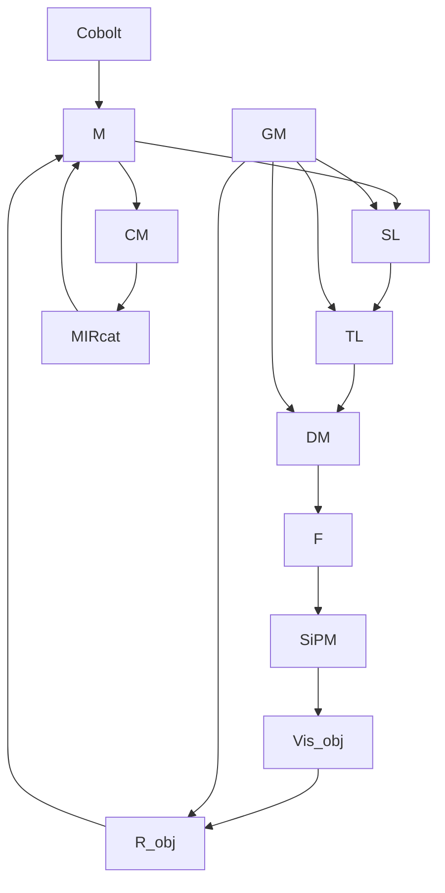

## Article in Press

# Resolving protein condensates and aggregates in vivo by boxcar-enhanced Fluorescence-detected mid-Infrared photothermaL Microscopy (FILM)

Received: 9 July 2025

Accepted: 2 March 2026

Cite this article as: Weinberg, B., Guo, Z., Tang, R.  Resolving protein condensates and aggregates in vivo by boxcar-enhanced Fluorescencedetected mid-Infrared photothermaL Microscopy (FILM). (2026). https://doi.org/10.1038/ s42004-026-01970-3

Bethany Weinberg, Zhongyue Guo, Rong Tang, Jianpeng Ao, Jiaze Yin, Guangrui Ding, Todd A. Blute, Marzia Savini, Giulio Chiesa, Wentao Wang, Matt Good, Meng C. Wang & Ji-Xin Cheng

We are providing an unedited version of this manuscript to give early access to its findings. Before final publication, the manuscript will undergo further editing. Please note there may be errors present which affect the content, and all legal disclaimers apply.

If this paper is publishing under a Transparent Peer Review model then Peer Review reports will publish with the final article.

# Resolving Protein Condensates and Aggregates in vivo by Boxcar-Enhanced Fluorescence-detected Mid-Infrared PhotothermaL Microscopy (FILM)

Bethany Weinberg1, 2#, Zhongyue Guo2, 4#, Rong Tang3, Jianpeng Ao3, 4, Jiaze Yin3, 4, Guangrui Ding3, 4, Todd A. Blute1, Marzia Savini5, Giulio Chiesa6, Wentao Wang7, Matt Good7, Meng C. Wang5\*, Ji-Xin Cheng2, 3, 4\*

\# These authors contributed equally

1 Department of Molecular Biology, Cell Biology, & Biochemistry, Boston University, Boston, MA 02215, USA  
2 Department of Biomedical Engineering, Boston University, Boston, MA 02215, USA  
3 Department of Electrical and Computer Engineering, Boston University, Boston, MA 02215, USA  
4 Photonics Center, Boston University, Boston, MA 02215, USA  
5 HHMI Janelia Research Campus, Ashburn, VA 20147, USA  
6 Department of Biomedical Engineering, University of Toronto, Toronto, Ontario, Canada, M5S 3E2  
7 Cell and Developmental Biology, School of Medicine, University of Pennsylvania, Philadelphia, PA 19104, USA  
\* Corresponding Authors: Meng C. Wang mengwang@janelia.hhmi.org; Ji-Xin Cheng jxcheng@bu.edu

## Abstract

Protein assemblies, including aggregates and condensates, are closely linked to health and diseases. We demonstrate boxcar-enhanced Fluorescence-detected mid-Infrared photothermaL Microscopy (FILM), using two model species, Caenorhabditis elegans and Saccharomyces cerevisiae, to quantitatively resolve these protein states in vivo by imaging β-sheet and α-helix secondary structures and analyzing their ratios. This method directly distinguishes polyglutamine (PolyQ) protein aggregates, α-synuclein protein condensates, and P-granule condensates implicated in neurodegenerative diseases and embryonic development in live organisms. It further enables the unraveling of protein assembly dynamics and their physio-pathological roles, such as age-related progression of PolyQ from condensates to aggregates.

## Introduction

Proteins are one of the most structurally diverse biomolecules within the cell. Proteins can form larger assemblies, serving distinctive physiological and pathological roles. Rigid, insoluble protein aggregates are widely observed in neurodegenerative diseases, where they contribute to disease progression1. On the other hand, liquid-like protein condensates, which form membrane-less organelles through phase separation, play critical roles during specific developmental stages and dynamically adapt to cellular responses2. Pre-existing methods for studying aggregates and condensates rely on conventional fluorescence microscopy to assess protein fluidity through fluorescence recovery after photobleaching (FRAP)3. For instance, FRAP analysis showed that poly-glutamine (polyQ) aggregates do not recover from bleaching even after five minutes4, whereas proteins within condensates in Caenorhabditis elegans recover within just one second5. However, bleaching is low-throughput and may disturb or destabilize protein assemblies, especially those with sensitive structures. Moreover, this approach does not provide any information about the secondary structures of fluorescently-labeled protein assemblies.

A key component associated with protein assemblies is their secondary structure. Protein aggregates are typically rich in β-sheet secondary structures due to a network of stable intermolecular hydrogen bonds, while condensates are associated with α-helices or disordered secondary structures that enable dynamic interactions6, 7. Notably, IR absorption at the amide I region (\~1600-1700 cm-1) is sensitive to protein secondary structures. For example, Aβ fibrils (a type of protein aggregates found in Alzheimer’s Disease) formed in primary neurons exhibit a shift in their IR spectrum towards 1630 cm-1, which is associated with β-sheet structures8. PolyQ aggregates in Saccharomyces cerevisiae are composed of a β-sheet core surrounded by an α-helix shell. The β-sheet core exhibits a peak shift toward 1625 cm-1, whereas the α- helix shell retains its peak at 1650 cm-1 9. We thus hypothesized that probing the secondary structures of protein assemblies would provide a non-invasive approach to directly distinguish between protein condensates and aggregates in vivo. In addition, we hypothesized that aggregation of PolyQ may exhibit age-dependent secondary structure changes undetected by traditional fluorescent visualization. We employed boxcar-enhanced FILM10 (Fig. 1a) to determine the secondary structure of fluorescentlylabeled protein assemblies.

Various vibrational spectroscopic imaging methods, both Raman and IR-based, have been developed to study protein secondary structure11. Stimulated Raman scattering (SRS) microscopy was recently used to track phase separation of condensates and Htt aggregation in situ12. BonFIRE enabled single-bond vibrational spectroscopy of fluorescent molecules based on up-conversion13. Mid-infrared photothermal microscopy could distinguish shell vs core aggregate secondary structure in S. cerevisiae Huntington models, where spectral deconvolution was used to obtain component secondary structure peaks9. The current work, utilizing boxcar-enhanced FILM, enables spectroscopic peak assignments for α-helices and β-sheets obtained directly from hyperspectral stacks of images. We demonstrate the use of boxcarenhanced FILM to quantitatively distinguish between condensates and aggregates using two peaks associated with secondary structure, while also demonstrating our method’s ability to distinguish between the secondary structure heterogeneity found between condensates and across aggregate ages in vivo.

Boxcar-enhanced FILM combines mid-IR to probe vibrational modes of biomolecules with the use of a fluorescent reporter, as seen with recently developed FILM (also called F-MIP) 14, 15. When the mid-IR wavenumber matches that of the vibrational mode of a biomolecule, such as C=O at 1650 cm-1 for proteins, the molecule absorbs energy and then releases it as heat into the surrounding environment. As fluorescence intensity decreases upon exposure to heat, we can use a modulated mid-IR pulse and track changes in fluorescence intensity as readout for biomolecules. This enables a localized analysis of fluorescently-tagged condensates and aggregates. However, photobleaching can negatively affect results in FILM. To override this limitation, an optical-boxcar scheme is applied to effectively reduce bleaching with a pulsed fluorescent probe to limit excitation of the fluorophore. If the mid-IR pulse is at frequency f, the visible pulse is at frequency 2f; in the presence of a biomolecule, fluorescence intensity is decreased when the mid-IR pulse is on (f) and brighter when mid-IR is off (2f), the modulation of which generates the FILM signal. Rather than replacing the lock-in amplifier with a boxcar averager, as reported by the Sander group16, we instead engineered the optical excitation by converting continuous-wave (cw) light into pulses. This approach inherently shifts higher-order frequency components into the detection band while simultaneously reducing the photodose delivered to the sample, thereby mitigating fluorescence photobleaching10. Finally, boxcar-enhanced FILM is combined with a laser-scan scheme that enables hyperspectral imaging in the fingerprint window (1000 to 1800 cm-1)17, 10 (Fig. 1b).

In addition to the instrumental advance, we also applied a self-supervised denoising AI framework, Selfsupervised PErmutation Noise2noise Denoising (SPEND)18. Traditional denoising methods, such as BM4D, assume independent and identically distributed (i.i.d.) noise throughout the image, but hyperspectral data contains noise that is spatially-correlated, complicating the selection of denoising algorithms. SPEND overcomes these challenges by using even and odd spectral frames to generate two stacks with the same levels of noise. These two stacks can then be used for self-supervised noise-to-noise training, which can generate an 8-fold signal-to-noise ratio (SNR) improvement when the model is then applied to the original hyperspectral stack (Fig. 1c). In addition, we present a calibration protocol to apply to denoised spectra to account for fluorescent bleaching and IR laser power distortions (Fig. 1d).

We have validated our method in two testbeds, S. cerevisiae and C. elegans, as shown below. Overall, our work reveals the dominant secondary structure and heterogeneity of condensates. We also show agerelated progression of PolyQ Huntington protein assemblies into β-sheet dominant aggregates over time.

## Results and discussion

## Quantification of S. cerevisiae condensates and aggregates secondary structure

We first examined S. cerevisiae strains carrying well-defined protein aggregates and condensates (Fig. 2a). S. cerevisiae htt103Q-FP strain contains GFP tagged with 103 glutamine repeats (polyQ), which form small, rigid aggregates like those seen in Huntington’s Disease. On the other hand, S. cerevisiae α-syn-FP strain contains YFP-tagged α-synuclein, which exhibits larger, dispersed structures commonly used for studying condensates (Fig. 2a, fluorescent). We used boxcar-enhanced FILM to image individual htt103Q-FP and α-syn-FP protein assemblies in yeast cells at the peaks associated with β-sheets (1625 cm-1) and α-helices (1649 cm-1) (Fig. 2a, right panels), as well as capture their spectra that cover the entire amide I and amide II range (1450 to 1750 cm-1) (Fig. 2b; Supplementary Fig. 1a). After SPENDmediated denoising, we calculated the ratio between the signal intensity at 1625 cm-1 and $1 6 4 9 \mathrm { c m } ^ { - 1 }$ . We found that htt103Q-FP aggregates exhibit a higher ratio than α-syn-FP condensates (Fig. 2d, e), supporting a higher proportion of β-sheet secondary structure in aggregates compared to condensates. At the same time, we observed htt103Q-FP aggregates with a lower proportion of β-sheets (stars) and α-syn-FP condensates with a higher proportion of β-sheets (arrowheads), suggesting a continuous progression from condensates to aggregates in vivo (Fig. 2c). The high-throughput, non-invasive analysis enabled by boxcar-enhanced FILM allows for the examination of a large number of protein assemblies and quantitative characterization of their structural states in vivo.

## Resolution of age-related shifts toward PolyQ aggregates in C. elegans

Next, we applied boxcar-enhanced FILM to examine two C. elegans strains that carry either fluorescent protein aggregates (httQ40-FP) or condensates (P granule-FP) (Fig. 1a). As with yeast htt103Q, YFPtagged 40 poly Q forms aggregates in the muscle of the worm19. We imaged the strain at L3 (larval stage 3), day 1, and day 2 adults, and examined whether the secondary structure of httQ40::YFP aggregates varies with increasing age (Fig. 3a). We observed that the signal of httQ40::YFP puncta at the 1649 cm-1 peak, corresponding to α-helices, is higher in day 1 adults than in day 2 adults, whereas the signal at the 1625 cm-1 peak, corresponding to β-sheet, is lower (Fig. 3a, b, c). Interestingly, the signal at the 1625 cm-1 peak in L3 larvae is lower than that observed in day 1 and day 2 adults (Fig. 3c), while the signal at the 1649 cm-1 peak is comparable between L3 and day 1 but lower in day 2 adults. These results suggest that the proportion of α-helices in httQ40 protein assemblies decreases with age, while the assemblies adopt more β-sheet-enriched aggregate structures. Boxcar-enhanced FILM can quantitatively track this agerelated change in a high-throughput and high-resolution matter in live organisms (Fig. 3g).

## Visualization of secondary-structural heterogeneity within C. elegans P-granule condensates

GLH-1 is a C. elegans helicase that facilitates the formation of P-granules, which are phase-separated condensates in germ cells20. Using the GLH-1::GFP strain (P-granule-FP), we imaged P-granules in multiple embryos at various developmental stages using boxcar-enhanced FILM (Fig. 3d; Supplementary Fig. 2a). We observed that those protein condensates, even within the same egg, display heterogeneity in their spectra (Fig. 3e). We further calculated the ratio of 1625 cm-1 to 1649 cm-1 for each GLH-1::GFP condensate. We found that the average ratio is lower than that of httQ40::YFP puncta in day 1 and day-2-old adults, but comparable to that of httQ40::YFP puncta in L3 larvae (Fig. 3f, g;

Supplementary Fig. 2b, c). These results suggest that httQ40::YFP assemblies may initially form as liquid-like condensates and progressively transition into aggregate structures during aging.

## Validation of age-related PolyQ aggregation using FRAP

Finally, we compared our aggregate and condensate boxcar-enhanced FILM results obtained from C. elegans to that of FRAP (Fig 4a, b). Our results indicate that P-granule condensates and L3 PolyQ puncta have comparable recovery curves, while day 2 PolyQ aggregates had little to no recovery. Day 1 PolyQ puncta showed an intermediate recovery speed. This FRAP data matches well with our boxcar-enhanced FILM data (Fig. 3g); P-granules and L3 PolyQ puncta contained the lowest proportion of β-sheets and showed the fastest FRAP recovery time, while day 2 PolyQ aggregates contained the highest ratio of β- sheets and showed the slowest FRAP recovery time. FRAP requires bleaching aggregates and condensates and waiting for their recovery one by one, which limits its throughput and its quantitative capability. In contrast, boxcar-enhanced FILM can analyze multiple protein assemblies simultaneously within a short time window, enabling robust quantitative comparisons across conditions.

## Conclusions

Together, our findings revealed that protein aggregates and condensates exhibit different secondary structures, and we demonstrated a non-invasive method to quantitatively distinguish them in live cells and organisms using boxcar-enhanced FILM. This method enables rapid, high-throughput survey of large numbers of protein assemblies to determine their in vivo states. In a proof-of-concept application to Huntington-disease models, we discovered that PolyQ proteins exhibit heterogenous structural states despite their similar fluorescence morphology, and progress into β-sheet dominant protein aggregates over time. Future integration of this method with correlated cryo-electron tomographic microscopy will help validate the secondary-structure features of these protein assemblies detected by boxcar-enhanced FILM, and fully solidify its utility in structure biology. This method can be readily applied to other aggregate and condensate models that contain fluorescent proteins, paving the way for tracking their temporal and spatial dynamics under various physiological and pathological conditions.

## Methods

## Boxcar-enhanced FILM

The microscope set-up described has been published in 10; please see that paper for a detailed overview of boxcar-enhanced FILM. Briefly, the pulsed mid-infrared (IR) pump beam is generated by a wavelength-tunable quantum cascade laser (QCL, Daylight Solutions, MIRcat-QT-Z-2400). Fluorescence excitation light is provided by a 488 nm fixed-wavelength diode laser module (Cobolt, 06-MLD 488 nm), which can be digitally modulated into pulsed light via an external trigger. A function generator synchronizes the visible excitation light and the mid-IR pump beam, with their modulation frequencies set to 2f (400 kHz) and f (200 kHz), respectively. The IR pulse width is set from anywhere between 200ns to 500ns, depending on the sample, while the visible light operates with a 30% duty cycle. The fluorescence excitation light is rapidly scanned using a pair of dual-axis galvo mirrors (GVS002, Thorlabs). After passing through a scan lens (f = 100 mm; a pair of AC508-100-A, Thorlabs) and a tube lens (f = 200 mm; TTL200-A, Thorlabs), the beam is reflected by a dichroic mirror (DM) into a waterimmersion objective (UPlanSApo, Olympus, 60×, NA=1.2) and focused onto the sample. The IR beam is scanned independently with another pair of X-Y galvanometer mirrors (GVS002, Thorlabs). The IR beam path employs a concave mirror as the scan lens (f = 200 mm; CM508-200-P01, Thorlabs) and a tube lens (f = 500 mm; CM508-500-P01, Thorlabs) to relay the scan to the back pupil of a reflective objective (PIKE, 40×, NA=0.78), achieving counter-propagation alignment with the visible excitation light. Before imaging, the IR beam is carefully aligned to overlap with the visible focus.

During imaging, the IR and visible foci are synchronously scanned, ensuring uniform excitation and detection over the FOV. The two galvanometer pairs are synchronized with the focal lengths of the visible and IR objectives and scaled based on the beam expansion ratio of the relay system. This scaling factor is calibrated at the start of the experiment. The backward fluorescence emitted from the sample is collected by the water-immersion objective and directed through the DM. After further filtering with a bandpass filter, the fluorescence signal is detected by a silicon photomultiplier (SiPM, Hamamatsu, C13366- 3050GA). The resulting electrical signal is fed into Moku:Pro (Liquid Instrument, Multi-instrument Mode), filtered, and input into the slots of two lock-in amplifiers for demodulation at 2f and f frequencies, corresponding to the FILM and fluorescence DC signals, respectively. These demodulated signals are simultaneously acquired through two input ports of an acquisition card, enabling real-time dual-channel imaging.

To perform hyperspectral imaging, the QCL operates in multi-spectral mode using a preset scanning list that covers the range from 1000 to 1800 cm⁻¹. A total of 126 Wavenumbers were collected in the fingerprint region (1000-1800 cm-1).

## Denoising with Self-supervised PErmutation Noise2noise Denoising (SPEND)

We employed $\mathrm { S P E N D ^ { 1 8 } }$ to achieve about eight times signal-to-noise ratio (SNR) enhancement of raw hyperspectral data. A four-layer U-Net deep learning model was trained using fourty hyperspectral datasets. Training and prediction were conducted on an Nvidia RTX 4090 GPU with 28GB of memory, requiring approximately 30 minutes for training and 20 seconds per stack for prediction. The SNR can be improved by ten times after denoising.

## Yeast maintenance and strains

For Htt103Q-GFP, yeast cells were pre-cultured in synthetic defined medium lacking uracil (SD-ura) for 16 hours. \~300uL of cells were then transferred to SD-ura supplemented with estradiol for 24 hours at $3 0 ^ { \circ } \mathrm { C }$ (shaking) to induce protein expression9. In the initial experiment, an estradiol concentration of 100nM was used. For the replication experiment, a higher concentration of 200nM was applied to ensure induction efficiency. The results were consistent across both conditions, confirming that the aggregate formation is complete under both conditions. This estradiol induction facilitated the formation of Htt aggregates within the cells, providing a consistent model for studying stable protein aggregates. Cells were imaged the next day.

For α-synuclein-YFP, yeast cells were initially pre-cultured at $3 0 ^ { \circ } \mathrm { C }$ (shaking) for 16 hours in yeast peptone dextrose (YPD) broth for plasmid selection. Yeast samples were placed into a centrifuge to pellet the cells (\~2000xg for 5 minute). Supernatant was removed and the pellet was resuspended in sterile water for a washing step (repeated 3x times). After the final wash, cells were then transferred to Yeast Peptone (YP) medium containing 2% raffinose as the sole carbon source for 24 hours, allowing adaptation to a non-fermentable carbon source. After 8 hours, the cells were pelleted and washed with water 3x times, and were then added to YP + 2% galactose for 8 hours (overnight) and grown at $3 0 ^ { \circ } \mathrm { C }$ (shaking). This incubation induced α-synuclein expression and condensate formation. Cells were then imaged the next day.

## Yeast mounting and imaging

1mL of induced yeast samples were placed into a 1.5mL Eppendorf tube and then centrifuged to pellet the cells (\~1000xg for 1 minute). Supernatant was removed and the pellet was resuspended in sterile water for a washing step (repeated 3x times). After the final wash, a small amount of water was left to resuspend the pellet in (\~150uL). 2uL of yeast was then pipetted onto a 24x60mm #1 thickness cover slide. A calcium fluoride (CaF2) disk was then lowered onto the samples and fixed in place with tape. Yeast was imaged with CaF2 face down to allow the IR pulses to hit samples without glass absorption. Yeast was imaged with a pulsed IR frequency of 200kHz and a pulse width of either 200ns (Htt) or 400ns (α- synuclein). Visible 488nm excitation of the fluorescent proteins used 400kHz with a 30% duty cycle.

## Yeast data analysis

Regions of interest were selected using Fiji (ImageJ) ROI manager select tool on each hyperspectral stack. Regions of interest with distinct amide I and II bands were selected. A custom Macro was written to loop through the same ROI coordinate in both the denoised FILM image and the DC fluorescence image stack (si\_code\_1.ijm). Spectra were then analyzed in RStudio (si\_code\_2.R). First, an offset is applied to bring the smallest value’s baseline to 0. Next, the FILM\ signal was divided by the DC fluorescence signal to account for bleaching of the fluorophore. All spectra were then divided by the IR laser power, and then normalized by area under the curve (AUC), which is presented in the paper as the finalized calibrated spectrum. A rolling average (window, k = 5) was applied to smooth the spectrum.

## C. elegans maintenance and strains

AM141[unc-54p::Q40::YFP] (40 poly-glutamine fused to fluorescent yellow protein) was used for studying aggregates. Aggregates develop as the worm ages from diffuse protein. glh-1(sam24[glh-

1::GFP::3xFLAG)] was used for studying condensates in C. elegans embryos. AM141 worms were synchronized and grown at $1 5 \mathrm { ^ \circ C } .$ Worms were collected from the same plate at larval stage 3 (L3), day 1 adults, or day 2 adults. In one experiment, we followed a single synchronized population over time, collecting animals at L3, then at adult day 1, and against at adult day 2. In the other two experiments, we paired L3 with a single adult stage—either L3 with day 1 adult, or L3 with day 2 adult—using animals taken from the same synchronized population. Day 1 adult GLH::GFP worm embryos were synchronized and imaged across two experiments to obtain two biological replicates.

Worms were cultured on nematode growth medium (for 1L: phosphate buffer 20mM, CaCl2 0.8mM, MgSO4 0.8mM, agar 17.5g, NaCl 3.0g, peptone 2.5g, cholesterol 0.005g). Plates were seeded with OP-50 Escherichia coli. To synchronize worm populations, 1mL of 5N NaOH and 0.5mL of bleach were added to 3.5mL sterile water containing embryos and gravid adults. The synchronized population was grown at $1 5 ^ { \circ } \mathbf { C } .$ .

## C. elegans mounting and imaging

Worms were mounted via picking into 1% NaN3 in M9 buffer on a 24x60mm #1 thickness cover slide. A calcium fluoride (CaF2) disk was then lowered onto the worms and fixed in place with tape. Worms were imaged with CaF2 face down to allow the IR pulses to hit samples without absorption. Worms were imaged with a pulsed IR frequency of 200kHz and a pulse width of either 400ns or 500ns. Visible 488nm excitation of the fluorescent proteins used 400kHz with a 30% duty cycle

## C. elegans data analysis

Regions of interest were selected using Fiji (ImageJ) ROI manager select tool on each hyperspectral stack. Regions of interest with distinct amide I and II bands were selected. A custom Macro was written to loop through the same ROI coordinate in both the denoised FILM image and the DC fluorescence image stack (si\_code\_1.ijm). Spectra were then analyzed in RStudio (si\_code\_2.R). First, an offset is applied to bring the smallest value’s baseline to 0. Next, the FILM signal was divided by the DC fluorescence signal to account for bleaching of the fluorophore. All spectra were then divided by the IR laser power, and then normalized by area under the curve (AUC), which is presented in the paper as the finalized calibrated spectrum. A rolling average (window, k = 5) was applied to smooth the spectrum.

## C. elegans fluorescent recovery after photobleaching (FRAP)

AM141 Q40::YFP aggregate worms were grown to the appropriate age at either $1 5 \mathrm { { ^ \circ C } }$ or $2 1 ^ { \circ } \mathbf { C }$ on NGM plates, as in the FILM experiments. Young adult GLH-1::GFP condensate worms were grown at $1 5 \mathrm { { ^ \circ C } }$ and dissected for embryonic P-granule FRAP. For imaging, three layers of nail polish were used to create an enclosed rectangle on a standard microscope slide. Aggregate worms were mounted in 1% NaN3 in M9 buffer. P-granule worms were dissected in 1X ex vivo buffer (25mM HEPES pH 7, 150mM NaCl, 2mM CaCl2, 2mM MgCl2)5. A #1.5 thickness cover slide was then affixed over the sample and sealed with more nail polish.

For scanning, samples were loaded onto a Nikon Ti microscope with a Nikon C2plus Si laser scanning confocal operated in filter mode with a 15mW 488nm laser diode for excitation and conventional GFP emission filters. The confocal aperture was set to 1, and 512x512 size for all scans. Using either a Plan Apo λ 20x lens with 0.8 NA (PolyQ) or, a water-immersion Plan Apo λs 40x lens with 1.3 NA (P-granule condensates), the samples were selected visually by epifluorescence and then scanned. After the background images were acquired, the scan area was zoomed to just the region of interest for bleaching. Laser power was raised for the bleaching phase. Both the zoom and laser power were lowered back to initial value for the recovery monitoring. The conditions of bleaching varied by sample as described below. Recovery was always recorded at 5 second intervals using 1.08% laser power

For L3 PolyQ aggregates, bleaching 5% laser power, 10 seconds duration.

For day 1 PolyQ aggregates, bleaching 10% laser power 20 seconds duration.

For day 2 PolyQ aggregates, bleaching 10% laser power 25 seconds duration.

For condensates (40x), bleaching 5% laser power 5 second duration.

## Code availability

A custom ROI loop ImageJ Macro has been provided as si\_code\_1.ijm, which allows users to loop through their DC fluorescence images and FILM hyperspectral images to obtain Mean Gray intensities for use in the R code. A custom R Studio data analysis code has also been provided (si\_code\_2.R.). The R code can be used to take files generated with the ImageJ Macro and IR power spectra and convert it into calibrated FILM spectra. In addition, it allows for a comparison between multiple conditions, generating the plots and box-and-whisker plots shown in Fig. 2 and Fig. 3. Written code and cleanup/commenting was assisted with ChatGPT.

## Data availability

Data, including raw and SPEND-denoised hyperspectrals, and fluorescent images, are available in zipped format on FigShare (doi.org/10.6084/m9.figshare.31385239). Numerical source data for all main figures and supplemental codes used for data analysis (si\_code\_1.ijm and si\_code\_2.R) can also be found on FigShare. Any additional data are available upon reasonable request to the authors.

## Acknowledgements

The authors thank Geraldine Seydoux’s lab for gifting strain DUP64 (GLH-1::GFP construct), and Jessica Qiu for assistance in worm culture and maintenance. This work is supported by NIH R35GM136223 to JXC.

## Author contributions statement

B.W. and Z.G. conceived the study, designed and performed experiments, analyzed the data, and wrote the manuscript. B.W. performed worm culture and imaging. R.T. performed yeast cell culture and assisted with data capture and analysis. J.A. assisted with methodology and writing. J.Y. helped develop the system and performed initial experimental demonstrations. G.D. assisted with SPEND methodology and writing. T.A.B. performed FRAP experiments. M.S. helped prepare worm strains. G.C. contributed to project conceptualization and data interpretation. W.W. provided the a-synuclein yeast strains for initial characterization. M.C.G. helped supervise, provided yeast strains, and revised the manuscript. M.C.W. and J.-X.C. oversaw supervising, writing, and revising. All authors read and approved the final manuscript.

## Competing interests

J.-X.C. declares financial interest with Photothermal Spectroscopy Corp at Santa Barbara. Other authors declare no competing interests.

## References

1. Ross, C. A., & Poirier, M. A. (2004). Protein aggregation and neurodegenerative disease. Nature medicine, 10(Suppl 7), S10-S17.  
2. Banani, S. F., Lee, H. O., Hyman, A. A., & Rosen, M. K. (2017). Biomolecular condensates: organizers of cellular biochemistry. Nature Reviews Molecular Cell Biology, 18(5), 285-298.  
3. Kenworthy, A. K. (2023). What’s past is prologue: FRAP keeps delivering 50 years later. Biophysical Journal, 122(18), 3577-3586.  
4. Morley, J. F., Brignull, H. R., Weyers, J. J., & Morimoto, R. I. (2002). The threshold for polyglutamine-expansion protein aggregation and cellular toxicity is dynamic and influenced by aging in Caenorhabditis elegans. Proceedings of the National Academy of Sciences, 99(16), 10417-10422.  
5. Putnam, A., Cassani, M., Smith, J., & Seydoux, G. (2019). A gel phase promotes condensation of liquid P granules in Caenorhabditis elegans embryos. Nature structural & molecular biology, 26(3), 220-226.  
6. Shivu, B., Seshadri, S., Li, J., Oberg, K. A., Uversky, V. N., & Fink, A. L. (2013). Distinct β-sheet structure in protein aggregates determined by ATR–FTIR spectroscopy. Biochemistry, 52(31), 5176-5183.  
7. Hess, N., & Joseph, J. A. (2025). Structured protein domains enter the spotlight: modulators of biomolecular condensate form and function. Trends in Biochemical Sciences.  
8. Klementieva, O., Sandt, C., Martinsson, I., Kansiz, M., Gouras, G. K., & Borondics, F. (2020). Super-resolution infrared imaging of polymorphic amyloid aggregates directly in neurons. Advanced Science, 7(6), 1903004.  
9. Guo, Z., Chiesa, G., Yin, J., Sanford, A., Meier, S., Khalil, A. S., & Cheng, J. X. (2024). Structural mapping of protein aggregates in live cells modeling Huntington's disease. Angewandte Chemie, 136(35), e202408163.  
10. Ao, J., Yin, J., Lin, H., Ding, G., Guan, Y., Weinberg, B., Dong, D., Xia, Q., Gup, Z., Savini, M., Gao, B., Cheng, J. X., & Wang, M. C. (2025). In vivo mapping organellar metabolism by opticalboxcar enhanced fluorescence-detected mid-infrared photothermal microscopy. arXiv preprint arXiv:2504.04305.  
11. Guo, Z., Chiesa, G., & Cheng, J. X. (2025). Feeling the vibes: Vibrational spectroscopic imaging of biomolecular assemblies in their natural environment. Applied Physics Reviews, 12(4).  
12. Sun, R., Zhuang, Y., Lin, Y., & Hu, F. (2025). In situ secondary structure imaging of protein phase separation and aggregation by hyperspectral stimulated Raman scattering microscopy. Nature Communications, 16(1), 8552.  
13. Wang, H., Lee, D., Cao, Y., Bi, X., Du, J., Miao, K., & Wei, L. (2023). Bond-selective fluorescence imaging with single-molecule sensitivity. Nature photonics, 17(10), 846-855.  
14. Zhang, Y., Zong, H., Zong, C., Tan, Y., Zhang, M., Zhan, Y., & Cheng, J. X. (2021). Fluorescencedetected mid-infrared photothermal microscopy. Journal of the American Chemical Society, 143(30), 11490-11499.  
15. Li, M., Razumtcev, A., Yang, R., Liu, Y., Rong, J., Geiger, A. C., Blanchard, R., Pfluegl, C., Taylor, L.S., & Simpson, G. J. (2021). Fluorescence-detected mid-infrared photothermal microscopy. Journal of the American Chemical Society, 143(29), 10809-10815.  
16. Samolis, P., Zhu, X., & Sander, M. Y. (2023, May). Boxcar gating for time-resolved mid-infrared photothermal imaging of axon-bundle water boundaries. In CLEO conference 2023. Optica, Technical Digest Series.  
17. Yin, J., Zhang, M., Tan, Y., Guo, Z., He, H., Lan, L., & Cheng, J. X. (2023). Video-rate midinfrared photothermal imaging by single-pulse photothermal detection per pixel. Science Advances, 9(24), eadg8814.  
18. Ding, G., Liu, C., Yin, J., Teng, X., Tan, Y., He, H., H Lin, L Tian, & Cheng, J. X. (2025). Selfsupervised elimination of non-independent noise in hyperspectral imaging. Newton, 1(6).  
19. Garcia, S. M., Casanueva, M. O., Silva, M. C., Amaral, M. D., & Morimoto, R. I. (2007). Neuronal signaling modulates protein homeostasis in Caenorhabditis elegans post-synaptic muscle cells. Genes & development, 21(22), 3006-3016.  
20. Chen, W., Hu, Y., Lang, C. F., Brown, J. S., Schwabach, S., Song, X., Zhang, Y., Munro, E., Bennett, K., Zhang, D., & Lee, H.-C. (2020). The dynamics of P granule liquid droplets are regulated by the Caenorhabditis elegans germline RNA helicase GLH-1 via its ATP hydrolysis cycle. Genetics, 215(2), 421–434.

## Figure legends

Figure 1. Boxcar-enhanced FILM concept, microscope, denoising, and calibration workflow. a, Concept of boxcar-enhanced FILM for differentiating aggregates (purple, left) and condensates (green, right) in yeast and worm models. β-sheets have a peak at 1625 cm-1, while α-helices have a peak at 1649 cm-1, which can be detected using boxcar-enhanced FILM (gray panel). b, Schematic of the experimental setup for the boxcar-enhanced FILM microscope. Red: IR laser. Blue: visible excitation. M: reflection mirrors; GM: galvo mirrors; CM: concave mirrors; SL: scan lens; TL: tube lens; DM: dichroic mirror; Vis obj: visible objective; R obj: reflective objective; F: filter; SiPM: silicon photomultiplier. c, Representative images of fluorescence, raw boxcar-enhanced FILM, and SPEND-denoised boxcar-enhanced FILM signal (top panels). The spectrum for the region highlighted in yellow in both the raw boxcar-enhanced FILM (orange) and denoised (blue) signal are shown for comparison (bottom panel). Scale bar 20 µm. d, Representative spectra for calibration protocol, compared between the raw and denoised spectrum for the region highlighted in yellow in c. i Boxcar-enhanced FILM spectra with an offset applied to bring the lowest value to 0. ii The fluorescent bleaching curve obtained from the fluorescent image in c. iii Boxcarenhanced FILM spectra after division by bleaching curve (i/ii). iv The IR laser power obtained at the sample plane for the Wavenumbers of interest. v Boxcar-enhanced FILM spectra after division by IR laser power (iii/iv). vi Calibrated spectra after 5 points of smoothing. Note that denoising does not impact spectrum shape or peaks of interest.

Figure 2. Boxcar-enhanced FILM differentiates condensates and aggregates in-vivo in yeast. a, Fluorescent and boxcar-enhanced FILM-acquired images of S. cerevisiae expressing aggregate (htt103Q) and condensate (α-synuclein). The fluorescent images (left panels) and boxcar-enhanced FILM acquired images at 1625 and 1649 cm-1 are shown. Scale bar 10 µm. b, Calibrated S. cerevisiae aggregate and condensate spectra included in analysis. c, Ratiometric image generated using a masked division of images for regions with signal shown in a. Scale bar 10 µm. d, Average and smoothed spectrum obtained from all spectra in c. ns (number of spectra) = 85 for condensates, 73 for aggregates. e, 1625/1650 cm-1 ratio analysis comparing condensates (α-synuclein-FP) and aggregates (Htt103Q-FP) in yeast cells. \*\*\*\* p value <0.0001 by pairwise Student’s t-test.

Figure 3. Age-related secondary structure changes revealed by boxcar-enhanced FILM in live worms. a, Representative images of fluorescent and boxcar-enhanced FILM images of PolyQ (htt40Q) C. elegans at L3 (larval stage 3), day 1, and day 2 adults. Ratiometric images were generated using a masked division of images for regions with signal. Scale bar 20µm. b, Calibrated C. elegans aggregate (PolyQ) spectra included in analysis. c, Average and smoothed spectrum obtained from all spectra in b. ns (number of spectra) = 64 for L3, 78 for PolyQ day 1, and 86 for PolyQ day 2. nw (number of worms) = 12 for L3, 11 for day 1, and 10 for day 2. d, Representative images of fluorescent and boxcar-enhanced FILM condensates (P-granules). Ratiometric images were generated using a masked division of images for regions with signal. Scale bar 10 µm. e, Representative amide I and II calibrated spectra of selected regions found in embryo 2. f, Average P-granule spectrum obtained from all spectra in Supplementary Fig 2a. ns (number of spectra) = 136. ne (number of embryos) = 16. g, 1625/1650 cm-1 ratio analysis comparing all ages of PolyQ (aggregate) worms to embryo P-granule condensates. \*\*\*\* p value <0.0001 by pairwise Student’s t-test.

Figure 4. Validation of boxcar-enhanced FILM results by FRAP measurements a, Fluorescencerecovery after photobleaching recovery curves for C. elegans embryonic P-granules, and L3, day 1, and day 2 adult PolyQ aggregates. b, Images showing the region bleached and used for the graphs in a highlighted in yellow. The PolyQ assemblies shown to contain high β-sheet with boxcar-enhanced FILM (Fig. 3g) display the slowest FRAP recovery. Scale bar 10µm.

## Editor summary:

Protein assemblies — either aggregates or condensates — exhibit distinct β-sheet, α-helix, or disordered structures; however, current fluorescence-based approaches do not provide information on such secondary structures. Here, the authors show that boxcar-enhanced Fluorescence-detected mid-Infrared photothermaL Microscopy (FILM) can be used to quantitatively resolve these protein states, providing a non-invasive approach to directly distinguish between protein condensates and aggregates in vivo.

## Peer review information:

Communications Chemistry thanks Aleksandr Razumtcev and the other, anonymous, reviewer(s) for their contribution to the peer review of this work. A peer review file is available.

text_image

SiPM
dichroic
mirror
coverglass
CaF₂
fluo emission
fluo excitation
FILM principle
mid-IR pulses f
fluorescence 2f
time

line chart

| wavenumber (cm⁻¹) | FILM int (A.U.) |
| ----------------- | --------------- |
| 1600              | ~0.5            |
| 1620              | ~0.8            |
| 1640              | ~0.9            |
| 1660              | ~0.7            |
| 1680              | ~0.5            |
| 1700              | ~0.3            |

violin chart

| Group      | Ratio (1625 / 1649) |
| ---------- | ------------------- |
| Condensate | 0.7                 |
| Aggregate  | 0.9                 |

a  
  
b

flowchart

c

line chart

| Wavenumber (cm⁻¹) | Raw Intensity (A.U.) | Denoised Intensity (A.U.) |
| ----------------- | -------------------- | ------------------------- |
| 1500              | ~0.03                | ~0.025                    |
| 1550              | ~0.07                | ~0.055                    |
| 1600              | ~0.08                | ~0.07                     |
| 1625              | ~0.08                | ~0.07                     |
| 1650              | ~0.07                | ~0.06                     |
| 1700              | ~0.02                | ~0.015                    |
| 1750              | ~0.015               | ~0.01                     |

d  

line chart

| Wavenumber (cm⁻¹) | Denoised | Raw    |
| ----------------- | -------- | ------ |
| 1500              | 0.01     | 0.02   |
| 1550              | 0.04     | 0.06   |
| 1600              | 0.05     | 0.06   |
| 1650              | 0.06     | 0.06   |
| 1700              | 0.02     | 0.02   |
| 1750              | 0.00     | 0.00   |

ii  

line chart

| Wavenumber (cm⁻¹) | Fluorescent Intensity (A.U.) |
| ----------------- | ---------------------------- |
| 1500              | ~1.3                         |
| 1600              | ~1.2                         |
| 1650              | ~1.2                         |
| 1700              | ~1.2                         |
| 1750              | ~1.2                         |

iii  

line chart

| Wavenumber (cm⁻¹) | Denoised | Raw    |
| ----------------- | -------- | ------ |
| 1500              | 0.01     | 0.01   |
| 1550              | 0.03     | 0.04   |
| 1600              | 0.04     | 0.05   |
| 1650              | 0.04     | 0.05   |
| 1700              | 0.02     | 0.02   |
| 1750              | 0.00     | 0.00   |

iv  

line chart

| Wavenumber (cm⁻¹) | IR Intensity (A.U.) |
| ----------------- | ------------------- |
| 1500              | ~1.2                |
| 1550              | ~1.4                |
| 1600              | ~1.3                |
| 1650              | ~1.1                |
| 1700              | ~0.9                |
| 1750              | ~0.7                |

v  

line chart

| Wavenumber (cm⁻¹) | Denoised | Raw    |
| ----------------- | -------- | ------ |
| 1500              | 0.01     | 0.01   |
| 1550              | 0.02     | 0.02   |
| 1600              | 0.03     | 0.03   |
| 1650              | 0.04     | 0.04   |
| 1700              | 0.02     | 0.02   |
| 1750              | 0.00     | 0.00   |

vi  

line chart

| Wavenumber (cm⁻¹) | Denoised | Raw    |
| ----------------- | -------- | ------ |
| 1500              | 0.01     | 0.01   |
| 1550              | 0.02     | 0.02   |
| 1600              | 0.03     | 0.03   |
| 1650              | 0.04     | 0.04   |
| 1700              | 0.02     | 0.02   |
| 1750              | 0.00     | 0.00   |

a  

text_image

live S. cerevisiae
htt103Q-GFP
aggregate
10µm
Fluorescent
1625 cm⁻¹
1649 cm⁻¹
α-synuclein-YFP
condensate
Fluorescent
1625 cm⁻¹
1649 cm⁻¹

b  
S. cerevisiae Aggregate vs Condensate Spectra  

line chart

| Sample     | Peak Wavenumber (cm⁻¹) | ROI |
|------------|------------------------|-----|
| Aggregate  | 1625/1649              | 1   |
| Condensate | 1625/1649              | 1   |
| Aggregate  | 1625/1649              | 2   |
| Condensate | 1625/1649              | 2   |
| Aggregate  | 1625/1649              | 3   |
| Condensate | 1625/1649              | 3   |
| Aggregate  | 1625/1649              | 4   |
| Condensate | 1625/1649              | 4   |
| Aggregate  | 1625/1649              | 5   |
| Condensate | 1625/1649              | 5   |
| Aggregate  | 1625/1649              | 6   |
| Condensate | 1625/1649              | 6   |
| Aggregate  | 1625/1649              | 7   |
| Condensate | 1625/1649              | 7   |
| Aggregate  | 1625/1649              | 8   |
| Condensate | 1625/1649              | 8   |
| Aggregate  | 1625/1649              | 9   |
| Condensate | 1625/1649              | 9   |
| Aggregate  | 1625/1649              | 10  |
| Condensate | 1625/1649              | 10  |
| Aggregate  | 1625/1649              | 11  |
| Condensate | 1625/1649              | 11  |
| Aggregate  | 1625/1649              | 12  |
| Condensate | 1625/1649              | 12  |
| Aggregate  | 1625/1649              | 13  |
| Condensate | 1625/1649              | 13  |
| Aggregate  | 1625/1649              | 14  |
| Condensate | 1625/1649              | 14  |
| Aggregate  | 1625/1649              | 15  |
| Condensate | 1625/1649              | 15  |
| Aggregate  | 1625/1649              | 16  |
| Condensate | 1625/1649              | 16  |
| Aggregate  | 1625/1649              | 17  |
| Condensate | 1625/1649              | 17  |
| Aggregate  | 1625/1649              | 18  |
| Condensate | 1625/1649              | 18  |
| Aggregate  | 1625/1649              | 19  |
| Condensate | 1625/1649              | 19  |

c

d  

line chart

| Condition   | n_s    | Peak Wavenumber (cm⁻¹) |
|-------------|--------|------------------------|
| Condensate  | 85     | 1625/1649              |
| Aggregate   | 73     | 1625/1649              |

e  

violin chart

| Group      | Ratio (1625 / 1649) |
| ---------- | ------------------- |
| Condensate | 0.8                 |
| Aggregate  | 0.9                 |

chart content

| Group | Fluorescence (L3) | Fluorescence (Day 1) | Fluorescence (Day 2) | C. elegans htt40Q-FP (L3) | C. elegans htt40Q-FP (Day 1) | C. elegans htt40Q-FP (Day 2) |
| --- | --- | --- | --- | --- | --- | --- |
| L3 | ~0.8 | ~0.7 | ~0.6 | - | - | - |
| Day 1 | ~0.9 | ~0.8 | ~0.7 | - | - | - |
| Day 2 | ~0.7 | ~0.6 | ~0.5 | - | - | - |
| C. elegans htt40Q-FP | ~0.6 | ~0.5 | ~0.4 | - | - | - |
| C. elegans htt40Q-FP | ~0.5 | ~0.4 | ~0.3 | - | - | - |
| C. elegans htt40Q-FP | ~0.4 | ~0.3 | ~0.2 | - | - | - |
| C. elegans htt40Q-FP | ~0.3 | ~0.2 | ~0.1 | - | - | - |
| C. elegans htt40Q-FP | ~0.2 | ~0.1 | ~0.05 | - | - | - |
| C. elegans htt40Q-FP | ~0.1 | ~0.05 | ~0.02 | - | - | - |
| C. elegans htt40Q-FP | ~0.05 | ~0.02 | ~0.01 | - | - | - |
| C. elegans htt40Q-FP | ~0.02 | ~0.01 | ~0.005 | - | - | - |
| C. elegans htt40Q-FP | ~0.01 | ~0.005 | ~0.002 | - | - | - |
| C. elegans htt40Q-FP | ~0.005 | ~0.002 | ~0.001 | - | - | - |
| C. elegans htt40Q-FP | ~0.002 | ~0.001 | ~0.0005 | - | - | - |
| C. elegans htt40Q-FP | ~0.001 | ~0.0005 | ~0.0002 | - | - | - |
| C. elegans htt40Q-FP | ~0.0005 | ~0.0002 | ~0.0001 | - | - | - |
| C. elegans htt40Q-FP | ~0.0002 | ~0.0001 | ~0.00005 | - | - | - |
| C. elegans htt40Q-FP | ~0.0001 | ~0.00005 | ~0.00002 | - | - | - |
| C. elegans htt40Q-FP | ~- | ~- | ~- | - | - | - |
| C. elegans htt40Q-FP | ~- | ~- | ~- | - | - | - |
| C. elegans htt40Q-FP | ~- | ~- | ~- | - | - | - |
| C. elegans htt40Q-FP | ~- | ~- | ~- | - | - | - |
| C. elegans htt40Q-FP | - | ~- | ~- | - | - | - |
| C. elegans htt40Q-FP | - | ~- | ~- | - | - | - |
| C. elegans htt40Q-FP | - | ~- | ~- | - | - | - |
| C. elegans htt40Q-FP | - | ~- | ~- | - | - | - |
| C. elegans htt40Q-FP | - | ~- | ~- | - | - | - |
| C. elegans htt40Q-FP | - | ~- | ~- | - | - | - |
| C. elegans htt40Q-FP | - (C.Elegans) | ~- | ~- | A | A | A |

line chart

| 1500 | ~0.00 | ~0.00 | ~0.00 | ~0.00 | ~0.00 | ~0.00 | ~0.00 | ~0.00 | ~0.00 | ~0.00 | ~0.00 | ~0.00 | ~0.00 | ~0.00 | ~0.00 | ~0.00 | ~0.00 | ~0.00 | ~0.00 | ~0.00 | ~0.00 | ~0.00 | ~0.00 | ~0.00 | (~0.00) | (~0.00) | (~0.00) | (~0.00) |
| --- | --- | --- | --- | --- | --- | --- | --- | --- | --- | --- | --- | --- | --- | --- | --- | --- | --- | --- | --- | --- | --- | --- | --- | --- | --- | --- | --- | --- |
| 1550 | ~0.05 | ~0.05 | ~0.05 | ~0.05 | ~0.05 | ~0.05 | ~0.05 | ~0.05 | ~0.05 | ~0.05 | ~0.05 | ~0.05 | ~0.05 | ~0.05 | ~0.05 | ~0.05 | ~0.05 | ~0.05 | ~0.05 | ~0.05 | ~0.05 | ~0.05 | ~0.05 | ~0.05 | (~0.05) | (~0.05) | (~0.05) | (~0.05) |

line chart

| Panel | Sample Size | Peak Wavenumber (cm⁻¹) | ns   | nw   |
|-------|-------------|------------------------|------|------|
| PolyQ L3 | 64          | ~1600                  | 78   | 11   |
| PolyQ Day 1 | 78        | ~1600                  |      |      |
| PolyQ Day 2 | 86        | ~1600                  |      |      |

text_image

C. elegans P granule-FP
Fluorescence
1625 cm⁻¹
1649 cm⁻¹
10µm
A
1.10
1.04
0.98
0.91
0.85
C
1625/1649 cm⁻¹
1649/1625 cm⁻¹
A
C
1.10
1.04
0.98
0.91
0.85

line chart

| Wavenumber (cm⁻¹) | ROI Ratio 1 | ROI Ratio 2 | ROI Ratio 3 | ROI Ratio 4 | ROI Ratio 5 | ROI Ratio 6 |
| ----------------- | ----------- | ----------- | ----------- | ----------- | ----------- | ----------- |
| 1500              | ~0.000      | ~0.000      | ~0.000      | ~0.000      | ~0.000      | ~0.000      |
| 1550              | ~0.899      | ~0.966      | ~0.899      | ~0.966      | ~0.966      | ~0.966      |
| 1600              | ~0.968      | ~0.966      | ~0.966      | ~0.966      | ~0.966      | ~0.966      |
| 1650              | ~1.036      | ~1.036      | ~1.036      | ~1.036      | ~1.036      | ~1.036      |
| 1700              | ~1.073      | ~1.073      | ~1.073      | ~1.073      | ~1.073      | ~1.073      |

line chart

| Wavenumber (cm⁻¹) | Normalized Calibrated Intensity (A.U.) |
| ----------------- | -------------------------------------- |
| 1500              | ~0.000                                 |
| 1550              | ~0.000                                 |
| 1600              | ~0.000                                 |
| 1650              | ~0.000                                 |
| 1700              | ~0.000                                 |

violin chart

| Group        | Ratio (1625 / 1649) |
| ------------ | ------------------- |
| P-granule    | 1                   |
| PolyQ L3     | 1                   |
| PolyQ Day 1  | 1                   |
| PolyQ Day 2  | 1                   |

a  
Condensate and PolyQ FRAP Results  

line chart

| Polymer          | Time (s) | Normalized Intensity (A.U.) |
| ---------------- | -------- | --------------------------- |
| P-granule        | 0        | 1.00                        |
| P-granule        | 50       | 0.25                        |
| P-granule        | 100      | 0.50                        |
| P-granule        | 150      | 0.60                        |
| PolyQ L3         | 0        | 1.00                        |
| PolyQ L3         | 50       | 0.50                        |
| PolyQ L3         | 100      | 0.60                        |
| PolyQ L3         | 150      | 0.65                        |
| PolyQ Day 1      | 0        | 1.00                        |
| PolyQ Day 1      | 50       | 0.00                        |
| PolyQ Day 1      | 100      | 0.10                        |
| PolyQ Day 1      | 150      | 0.25                        |
| PolyQ Day 2      | 0        | 1.00                        |
| PolyQ Day 2      | 50       | 0.05                        |
| PolyQ Day 2      | 100      | 0.08                        |
| PolyQ Day 2      | 150      | 0.10                        |

b

Prebleaching  
P-granule  

natural_image

Fluorescent microscopy image showing a green-labeled cellular structure with a 10μm scale bar (no text or symbols beyond scale indicator)

PolyQ L3  

natural_image

Microscopic image showing a green fluorescent signal with a yellow dashed circle highlighting a region, scale bar present (no text or symbols)

PolyQ Day 1  

natural_image

Fluorescent microscopy image showing green-labeled cellular structures against a black background, with a yellow circular marker and scale bar (no text or symbols)

PolyQ Day 2  

natural_image

Fluorescent microscopy image showing green-labeled cellular structures against a black background, with a yellow circular marker and scale bar (no text or symbols)

Postbleaching  

natural_image

Fluorescent microscopy image showing a green-labeled cellular structure with a yellow circular annotation and a scale bar (no text or symbols)

natural_image

Microscopic image showing a green fluorescent signal with a yellow dashed circle highlighting a region, and a scale bar at the bottom left (no text or symbols present)

natural_image

Fluorescent microscopy image showing green-labeled cells against a black background, with a yellow circular marker and scale bar (no text or symbols)

natural_image

Fluorescent microscopy image showing green fluorescent spots and a yellow circular marker on black background (no text or symbols)

100 sec recovery  

natural_image

Fluorescent microscopy image showing a green-labeled cellular structure with a yellow circular annotation and a scale bar (no text or symbols)

natural_image

Microscopic image showing a green fluorescent signal with a yellow dashed circle highlighting a region, and a scale bar at the bottom left (no text or symbols present)

natural_image

Fluorescent microscopy image showing green fluorescent spots against a black background, with a yellow circular highlight and a scale bar (no text or symbols)

natural_image

Microscopic image showing green fluorescent spots and a yellow circular region on black background (no text or symbols)

