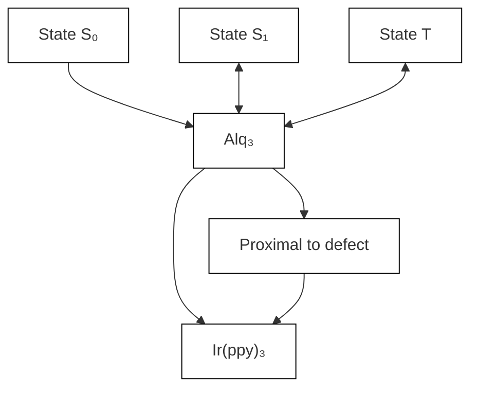
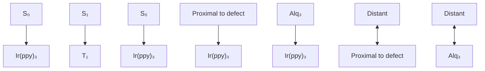

pubs.acs.org/JPCL

Letter

# Room-Temperature Phosphorescence and Low-Energy Induced Direct Triplet Excitation of Alq3 Engineered Crystals

Hai $\mathrm { B i } , ^ { * }$ Chanyuan Huo, Xiaoxian Song, Zhiqiang Li, Haoning Tang, Sarah Griesse-Nascimento, Kai-Chih Huang, Ji-Xin Cheng, Lea Nienhaus,\* Moungi G. Bawendi, Hao-Yu Greg Lin, Yue Wang, and Semion K Saikin\*

Cite This: J. Phys. Chem. Lett. 2020, 11, 9364−9370

Read Online

ACCESS

Metrics & More

Article Recommendations

Supporting Information

ABSTRACT: Crystal engineering is a practical approach for tailoring material properties. This approach has been widely studied for modulating optical and electrical properties of semiconductors. However, the properties of organic molecular crystals are difficult to control following a similar engineering route. In this Letter, we demonstrate that engineered crystals of $\mathbf { \bar { A l q } } _ { 3 }$ and Ir(ppy) complexes, which are commonly used in organic light-emitting technologies, possess intriguing functional properties. Specifically, these structures not only process efficient low-energy induced triplet excitation directly from the ground state of $\mathrm { A l q } _ { 3 }$ but also can show strong emission at the $\mathrm { A l q } _ { 3 }$ triplet energy level at room temperatures. We associate these phenomena with local deformations of the host matrix around the guest molecules, which in turn lead to a stronger host−guest triplet−triplet coupling and spin−orbital mixing.

chemical

Molecular structures of Alq₃ and Ir(ppy)₃ showing crystallization and doping effects on Alq₃-l and Ir(ppy)₃-A surfaces

E ngineered crystalsspatially ordered structures with the packing controlled by the growth processallow for efficient modulation of optical and electrical properties of semiconductors.1−3 However, organic crystals show low tolerance to foreign materials because of the weak intermolecular interactions.4,5 Different types of organic molecules prefer to pack forming a new lattice structure, while barely inducing the deformation of the host lattice.6−8 Despite the general paradigm, electronic states in organic crystals are quite localized at the molecular entities and are barely affected by proximal molecules.6,9 Modulation of the organic crystal optical properties relies on both the inherent electronic states of the molecular entities as well as the delocalization of the molecular states.1014

Electronic states of molecular entities can be of a spin-singlet or a spin-triplet character, depending on the presence of paired or unpaired electrons, respectively. Population of molecular triplet states, which is usually optically forbidden because of the requirement of an additional spin flip, can be ordinarily accomplished via intersystem crossing (ISC).15−17 Recently, radiative decay of triplet states, which yields room-temperature phosphorescence, has become the subject of active research.18−21 For example, including heavy atoms in the molecular structure22,23 or inducing stronger intermolecular coupling18,20,24 in the crystalline structure can promote the phosphorescence process. However, this mechanism still requires the excitation to higher-lying singlet states from the ground state with a subsequent ISC process to yield triplet excitons, which hinders the development of organic phosphorescence materials. Hence, direct excitation of the low-lying triplet state in the organic material, especially without involving the higher-lying singlet states, represents an intriguing strategy for modulating optical properties of organic semiconductors. 20,25,26

We report here two types of engineered crystals that are produced by doping foreign molecules into the molecular crystalline structure. The engineered structures efficiently emit light in a broad range of the optical spectrum, which is associated with the room-temperature phosphorescence. Moreover, the emission is maintained even when the crystals are excited with incident energy below the singlet band edge of the crystals. This contrasts with pure crystals of the host or guest molecules where no photoluminescence is observed for the sub-band edge excitation. We suggest that local lattice deformations in the engineered crystals can lead to singlet− triplet intensity borrowing due to the external heavy-atom effect.27,28 In turn, this results in the enhanced triplet optical absorption by both the host and guest complexes, as well as efficient excitation relaxation to the lowest triplet states of the host−guest system.

Received: August 7, 2020

Accepted: October 13, 2020

Published: October 23, 2020

## Engineered Crystals

chemical

Molecular orbital diagrams showing Alq₃ and Ir(ppy)₃ orbitals with spin states S₁, T₁, S₀ and energy levels 2.8 eV and 3.0 eV

text_image

C
405 nm Ex
505 nm Ex
Alq₃-1
532 nm Ex
633nm Ex

line chart

| Wavelength (nm) | 405 nm Ex | 505 nm Ex | 532 nm Ex | 633 nm Ex |
| --------------- | --------- | --------- | --------- | --------- |
| 450             | ~0        | ~0        | ~0        | ~0        |
| 550             | ~3.5×10⁴  | ~2.5×10⁴  | ~2.0×10⁴  | ~1.8×10⁴  |
| 650             | ~1.0×10⁴  | ~1.5×10⁴  | ~1.2×10⁴  | ~1.0×10⁴  |
| 750             | ~0        | ~0        | ~0        | ~0        |
| 850             | ~0        | ~0        | ~0        | ~0        |

line chart

| Wavelength (nm) | Ir(ppy)₃ Ab | Alq₃ Ab | Ir(ppy)₃ PL | Alq₃ PL |
|---|---|---|---|---|
| 300 | ~0.8 | ~0.6 | ~0.4 | ~0.2 |
| 400 | ~1.5 | ~1.2 | ~1.0 | ~0.8 |
| 500 | ~1.0 | ~0.9 | ~1.2 | ~1.1 |
| 600 | ~0.3 | ~0.2 | ~0.5 | ~0.4 |
| 700 | ~0.1 | ~0.1 | ~0.1 | ~0.1 |

text_image

e
405 nm Ex
505 nm Ex
Ir(ppy)₃-A
532 nm Ex
633nm Ex

line chart

| Wavelength (nm) | 405 nm Ex | 505 nm Ex | 532 nm Ex | 633 nm Ex |
| --------------- | --------- | --------- | --------- | --------- |
| 450             | ~0        | ~0        | ~0        | ~0        |
| 550             | ~3.5×10⁴  | ~2.5×10⁴  | ~1.5×10⁴  | ~1.0×10⁴  |
| 650             | ~3.0×10⁴  | ~2.8×10⁴  | ~2.5×10⁴  | ~2.0×10⁴  |
| 750             | ~2.5×10⁴  | ~2.0×10⁴  | ~1.5×10⁴  | ~1.0×10⁴  |
| 850             | ~0        | ~0        | ~0        | ~0        |

Figure 1. Photoluminescence of the $\mathrm { A l q } _ { 3 ^ { - } }$ I and Ir(ppy) -A engineered crystals. (a) Chemical structure and band gaps of Alq and $\mathrm { I r } ( \mathrm { p p y } ) _ { 3 } . ^ { 2 5 , 2 6 } ( \mathrm { b } )$ Absorption and PL spectra of Alq and $\operatorname { I r } ( \mathtt { p p y } ) _ { \ ? }$ films. Fluorescence microscopy images of Alq -I (c) and Ir(ppy) -A (e) under 405, 505, 532, and 633 nm excitation at the same position. The scale bar is $1 0 \ \mu \mathrm { m } .$ . The PL spectra of ${ \mathrm { A l q } } _ { 3 ^ { - 1 } } ( \mathrm { d } )$ and $\operatorname { I r } ( \mathtt { p p y } ) _ { 3 } { \mathrm { - A } } \ \overline { { ( \operatorname { f } ) } }$ engineered crystals under different excitations. The dopant concentration is 10% in both engineered crystals.

Materials based on tris(8-hydroxyquinoline) aluminum (Alq ) and tris(2-phenyl-pyridine) iridium $\left( \operatorname { I r } ( \mathtt { p p y } ) _ { 3 } \right)$ complexes (Figure 1a) are most frequently used in organic light emitting technologies. Both structures are metal chelates, enabling molecular spatial reorganization for packing. Their performance in the optoelectronic properties,29,30 polycrystalline phases,31,32 and nanostructures33,34 is widely studied both experimentally and theoretically.35,36 The iridium complex, $\operatorname { I r } ( \mathtt { p p y } ) _ { 3 } ,$ exhibits the efficient long-lived triplet emission due to an internal heavy-metal effect.37 In contrast, $\mathrm { A l q } _ { 3 }$ mainly exhibits flourescence, and its triplet state is hardly populated for radiative emission. Even if doped with $\operatorname { I r } ( \mathtt { p p y } ) _ { 3 }$ in the amorphous film, phosphorescence of $\mathrm { A l q } _ { 3 }$ can hardly be obtained at room temperatures.33,38

In this study, these two complexes are used for the design of engineered crystals. The energy diagrams in Figure 1a show the band gaps of the two molecules.31,36,39 The absorption and photoluminescence (PL) spectra of these two molecules in the film are shown in Figure 1b. A significant difference in the molecular size of the complexes can induce lattice disorder in the crystalline superstructure. The modified double-film annealing method34 is employed for the fabrication of engineered crystals at 573 K. This method allows for a fast high-temperature crystallization of the molecular material, which in turn facilitates the crystallization with the dopant. The doping percentage of the guest molecule inside the engineered crystal is controlled by the initial weight ratio of the amorphous film (see Supporting Information SI.1 for details).

Figure 1c−f shows two types of engineered crystals with a dopant concentration of up to 10% by using $\mathrm { A l q } _ { 3 }$ and $\operatorname { I r } ( \mathtt { p p y } ) _ { 3 }$ as the host (guest) or the guest (host) material, respectively. The crystals with the highest doping percentage equal to 10% are characterized below. Specifically, the crystals with $\mathrm { A l q } _ { 3 }$ as the host and Ir(ppy) as the dopant are named as $\mathrm { A l q } _ { 3 ^ { - 1 } }$ (Figure 1c,d), and the crystals with $\operatorname { I r } ( \mathtt { p p y } ) _ { 3 }$ as the host and $\mathrm { A l q } _ { 3 }$ as the dopant are named as $\operatorname { I r } ( \mathrm { p p y } ) _ { 3 ^ { - } } \mathrm { A }$ (Figure 1e,f).

Excitations with the energy of 3.06 eV (405 nm), 2.46 eV (505 nm), 2.33 eV (532 nm), and 1.96 eV (632.8 nm) are employed separately for characterizing the microcrystals at the same position. Under 405 nm excitation, the Alq -I exhibits green PL (Figure 1c) and the $\operatorname { I r } ( \mathrm { p p y } ) _ { 3 } – \mathbf { A }$ shows yellow-white PL (Figure 1e). The PL profile of the engineered crystals remains nearly the same under 505 nm excitation. Then, the PL of the engineered crystals turns to red under 532 and 632.8 nm excitations (cf. Figure 1c,e).

The PL spectra corresponding to the 405, 505, 532, and 632.8 nm excitation energies are shown in Figure 1d,f (see Supporting Information SI,2 for spectra at other excitation wavelengths). Under 405 nm excitation, the spectra for both engineered crystals show double peak profiles with the maxima peak positions at 535 nm $\left( \mathbf { P } _ { 1 } \right)$ and 670 nm $\left( \mathbf { P } _ { 2 } \right)$ . The relative intensities of these two peaks are different for the two engineered crystals, which results in the green and yellow white emission. For peak $\mathrm { { P } } _ { 1 } ,$ its feature in the $\operatorname { I r } ( \mathrm { p p y } ) _ { 3 ^ { - } } \mathrm { A }$ sample exhibits an additional blue-shifted shoulder at 515 nm with the main peak at 535 nm. The feature $\mathrm { P } _ { 2 }$ in both samples has a double-peak structure observed in the triplet emission from $\mathrm { A l q } _ { 3 }$ complexes.33 Under sub-bandgap excitations, the PL spectra of the engineered crystals are as follows: 505 nm excitation can produce a PL spectrum with $\mathrm { { P } } _ { 1 }$ and $\mathrm { P } _ { 2 }$ simultaneously; 532 or 632.8 nm excitation results in a PL spectrum with only the P part, corresponding to the red emission of the engineered crystals.

The emission lifetimes of the engineered crystals are characterized using two different excitations, 405 and 532 nm, and collecting photons with an energy below the exitation wavelength (see Figure 2). Under 405 nm (3.06 eV) excitation, the singlet state of both $\mathrm { A l q } _ { 3 }$ and $\operatorname { I r } ( \mathtt { p p y } ) _ { 3 }$ molecules can be sufficiently populated (see Supporting Information SI.3 for details). Both of the engineered crystals show a long-lived tail corresponding to triplet emission. The respective delayed emission lifetime of $\mathrm { A l q } _ { 3 ^ { - 1 } }$ is $3 . 0 1 \pm 0 . 3 2 \mu s$ and of $\operatorname { I r } ( \mathrm { p p y } ) _ { 3 ^ { - } } \mathrm { A }$ is $3 . 1 5 \pm 0 . 1 5 \mu s$ (Figure 2a). It can be inferred from the radiation lifetime test results that the inclusion of the iridium atom in the crystalline structure induces the triplet emission of the engineered crystal.

line chart

| Time (μs) | Intensity (a.u.) for Alq₃-l | Intensity (a.u.) for Ir(ppy)₃-A |
|-----------|-----------------------------|----------------------------------|
| 0         | ~10⁻¹                       | ~10⁻²                            |
| 2.5       | ~10⁻³                       | ~10⁻⁴                            |
| 5         | ~10⁻⁴                       | ~10⁻⁵                            |
| 7.5       | ~10⁻⁵                       | ~10⁻⁶                            |
| 10        | ~10⁻⁶                       | ~10⁻⁷                            |

line chart

| Time (μs) | Intensity (a.u.) for Alq₃-I | Intensity (a.u.) for Ir(ppy)₃-A |
|-----------|-----------------------------|----------------------------------|
| 0         | ~10⁻¹                       | ~10⁻¹                            |
| 2.5       | ~10⁻²                       | ~10⁻²                            |
| 5         | ~10⁻³                       | ~10⁻³                            |
| 7.5       | ~10⁻⁴                       | ~10⁻⁴                            |
| 10        | ~10⁻⁵                       | ~10⁻⁵                            |

Figure 2. Time-resolved photoluminescence of $\mathrm { A l q } _ { 3 ^ { - 1 } }$ I and $\operatorname { I r } ( \operatorname { p p y } ) _ { 3 } -$ A. (a) Under 405 nm laser excitation, the late component of the curves is characterized and fitted by a mono exponential function with $\tau = 3 . 0 1$ $\pm \ : 0 . 3 2 \ : \mu s$ for $\mathrm { A l q } _ { 3 } – \mathrm { I }$ and $\tau = 3 . 1 5 \pm 0 . 2 8 \mu s$ for $\operatorname { I r } ( \mathrm { p p y } ) _ { 3 ^ { - } } \mathbf { A } .$ . (b) Under 532 nm laser excitation, the curves are fitted by a mono exponential function with $\tau = 2 . 5 3 \pm 0 . 1 7$ μs for $\mathrm { A l q } _ { 3 } { \cdot } \mathrm { I }$ and $\tau = 2 . 5 2 \pm 0 . 2 7$ μs for $\operatorname { I r } ( \mathrm { p p y } ) _ { 3 } - \mathbf { A } .$ . The fit curves are shown in gray.

Laser excitation at 532 nm (2.33 eV), which is below the singlet bands of $\mathrm { A l q } _ { 3 }$ and $\operatorname { I r } ( \mathtt { p p y } ) _ { 3 } ,$ , is employed for characterizing dynamics of subband excitations. The emission lifetime of $\mathrm { A } \bar { \mathrm { l q } } _ { 3 } { \cdot } \bar { \mathrm { l } }$ and $\operatorname { I r } ( \mathrm { p p y } ) _ { 3 } – \mathbf { A }$ are $2 . 5 3 \pm 0 . 1 7$ μs and $2 . 5 2 \pm$ $0 . 2 7 \ \mu s ,$ , respectively (Figure 2b). By correlating the energy diagram with the PL spectra $( c f . \mathrm { \ F i g u r e \ 1 a , d } ) , \mathrm { \ P } _ { 2 }$ corresponds to the triplet emission of $\mathrm { A l q } _ { 3 } . ^ { 3 5 , 3 9 }$ 2 Therefore, the difference in the observed emission lifetimes with different excitations can be associated with the different decay pathway involved in the processes.

Under 405 nm excitation, the triplet emission of $\operatorname { I r } ( \mathtt { p p y } ) _ { 3 }$ and $\mathrm { A l q } _ { 3 }$ can be obtained simultaneously with the delayed PL from $\mathrm { A l q } _ { 3 } . ^ { 3 9 }$ Under 532 nm sub-bandgap excitation, mostly the triplet emission of $\mathrm { A l q } _ { 3 }$ contributes to the PL lifetime at the microsecond time scales. It is important to emphasize that both engineered crystals show PL from the $\mathrm { A l q } _ { 3 }$ triplet states, even when the energy of the excitation is below the lowest triplet states of $\operatorname { I r } ( \operatorname { p p y } ) _ { 3 } .$ In the engineered crystals, the spin− orbital coupling of $\mathrm { A l q } _ { 3 }$ can be enhanced by the proximity of $\mathrm { { I r } ( p p y ) _ { 3 } }$ complexes because of the external heavy-atom effect discussed in the literature previously.27,40,41 This interaction would mix the triplet states of $\mathrm { A l q } _ { 3 }$ complexes with the higherlying states of $\operatorname { I r } ( \mathtt { p p y } ) _ { 3 } ,$ which in turn allow both the direct absorption to triplet states as well as the efficient intersystem crossing.

The long-time exciton dynamics in low-lying $\mathrm { A l q } _ { 3 }$ triplet states in both engineered crystals is also characterized by measuring PL in the detection window between 630 and 800 nm with the excitation wavelength 405 nm. In this case, the contribution from the $\operatorname { I r } ( \mathrm { p p y } )$ phosphorescence, higher-lying $\mathrm { A l q } _ { 3 }$ triplet states, as well as time-delayed fluorescence from $\mathrm { A l q } _ { 3 }$ singlets are minimized. As compared to results shown in Figure 2, the longest lifetime that we observe is on the millisecond time scale for both ${ \mathrm { A l q } } _ { 3 } – \mathrm { I }$ and $\operatorname { I r } ( \mathrm { p p y } ) _ { 3 } – \mathbf { A }$ structures (see Supporting Information SI.2 for details). Similar values of triplet lifetimes were obtained previously for crystalline $\mathrm { A l q _ { 3 } . } ^ { 3 9 }$ Additionally, $\mathrm { A l q } _ { 3 }$ triplet PL was measured as a function of temperature. While the triplet lifetime in $\operatorname { I r } ( \mathrm { p p y } ) _ { 3 } – \mathbf { A }$ shows thermally activated properties, where the long-lived exciton states become more emissive at higher temperatures, the triplet emission in $\mathrm { A l q } _ { 3 } { \cdot } \mathrm { I }$ is less sensitive to temperature changes.

Crystalline structures of the doped materials with 10% of doping concentration are characterized by the X-ray diffraction (XRD). As shown in Figure $^ { 3 \mathrm { a } , }$ the obtained $\mathrm { A l q } _ { 3 } { \cdot } \mathrm { I }$ and

line chart

| Angle (degree) | Intensity (a.u.) |
| -------------- | ---------------- |
| 7.31           | 7.31             |
| 7.22           | 7.22             |
| 10.87          | 10.87            |
| 10.42          | 10.42            |

line chart

| Time (ps) | Alq3-I Intensity (a.u.) | Ir(ppy)3-A Intensity (a.u.) |
| --------- | ------------------------ | --------------------------- |
| 0         | 1.0                      | 1.0                         |
| 20        | ~0.6                     | ~0.7                        |
| 40        | ~0.5                     | ~0.6                        |
| 60        | ~0.45                    | ~0.55                       |

Figure 3. (a) X-ray powder diffraction spectra of the engineered crystals $\mathrm { A l q } _ { 3 } .$ I and $\operatorname { I r } ( \mathrm { p p y } ) _ { 3 } – \mathbf { A }$ as compared to the spectra of pure $\mathrm { A l q } _ { 3 }$ and $\operatorname { I r } ( \mathrm { p p y } )$ crystals. Both engineered crystals show the periodicity of the host materials. (b) Characterization of the $\mathrm { A l q } _ { 3 }$ triplet excitation process with pump−probe measurement. The pump energy is 2.38 eV (520 nm), and the probe energy is 1.59 eV (780 nm). The black solid lines indicate the best-fits for both crystals. The curves are fit by a double-exponential function with $\tau _ { 1 } = 1 . 9 8$ ps and $\tau _ { 2 } = 2 9 . 8 9 ~ \mathrm { p s }$ for $\mathrm { A l q } _ { 3 } { \cdot } \mathrm { I }$ and $\tau _ { 1 } = 2 . 3 7$ ps and $\tau _ { 2 } = 2 9 . 9 9 ~ \mathrm { p s }$ for $\operatorname { I r } ( \mathrm { p p y } ) _ { 3 } - \mathbf { A } .$

$\operatorname { I r } ( \mathrm { p p y } ) _ { 3 } – \mathbf { A }$ structures are in a crystalline form, with fewer diffraction peaks as compared to pure crystals. By comparing these XRD profiles with those of the $\mathrm { A l q } _ { 3 }$ and $\operatorname { I r } ( \mathrm { p p y } ) _ { 3 }$ crystalline microwires, the prepared $\mathrm { A l q } _ { 3 } { \cdot } \mathrm { I }$ have a clear (010) diffraction peak, which is the same as the $\mathrm { A l q } _ { 3 }$ crystalline structure, but with $- 0 . 0 9 ^ { \circ }$ of shift. The prepared $\operatorname { I r } ( \mathrm { p p y } ) _ { 3 ^ { - } } \mathbf { A }$ shows a (220) diffraction peak which is the same as the $\mathrm { { I r } ( p p y ) _ { 3 } }$ crystalline structure, but with $0 . 4 5 ^ { \circ }$ of shift. We conclude that the engineered crystals keep the crystalline structures similar to the corresponding host materials. The dopant molecules induce small shifts of the diffraction peaks, corresponding to the reduction or expansion of the crystalline lattices, which is the evidence of lattice deformation.

To compare with our engineered crystals, a homogeneous lattice deformation of pure $\operatorname { I r } ( \mathrm { p p y } ) _ { \mathfrak { T } }$ and $\mathrm { A l q } _ { 3 }$ crystals can be induced by high hydrostatic pressure.42,43 It was shown that such a deformation further affects photoluminescence properties of the materials. These changes in photoluminescence have been explained in terms of the enhancement of molecular interactions as intermolecular distances decrease. Specifically, pure $\mathrm { { I r } ( p p y ) _ { 3 } }$ crystals with a compressed lattice have been characterized by the occurrence of a shoulder at 507 nm at the high-energy side of the main maximum at 545 nm emission peak profile. The computational results suggest that the shortwavelength shoulder peak can correspond to the $_ { 0 - 0 }$ transition, but this vibronic structure of the triplet emission spectra is rarely observed at ambient conditions.44 The $\operatorname { I r } ( \mathrm { p p y } ) _ { 3 } – \mathbf { A } ,$ , where the $\operatorname { I r } ( \mathtt { p p y } ) _ { \mathfrak { T } }$ lattice disorder is induced by the $\mathrm { A l q } _ { 3 }$ dopant, shows $\mathrm { { P _ { 1 } } }$ with the shoulder peak profile which is similar to the PL spectrum of the $\operatorname { I r } ( \mathtt { p p y } ) _ { 3 }$ crystal under high pressure, verifying that $\mathrm { { P _ { 1 } } }$ is the triplet emission $\operatorname { I r } ( { \mathrm { p p y } } ) .$ . In contrast, we have not observed a shoulder peak for the $\mathrm { A l q } _ { 3 } { \cdot } \mathrm { I }$ $\mathrm { c r y s t a l } . ^ { 2 1 }$ 1 The pure Alq crystal with lattice distortion under high pressure shows a significant shift to longer wavelength due to the higher proportion of triplet emission. This agrees well with the triplet emission of ${ \bar { \bf A l q } } _ { 3 } \ { \bf \Gamma } ( { \bf P } _ { 2 } )$ in both engineered crystals. We hypothesize that the PL behavior of engineered crystals can be associated with the enhancement of molecular interactions as the crystal lattice is distorted by the doping molecules.

a  

text_image

Alq₃-1
1%
4%
7%
10%

b  

line chart

| Wavelength (nm) | 1%    | 4%    | 7%    | 10%   |
| --------------- | ----- | ----- | ----- | ----- |
| 450             | Low   | Low   | Low   | Low   |
| 550             | High  | High  | High  | High  |
| 650             | Medium| Medium| Medium| Medium|
| 750             | Low   | Low   | Low   | Low   |
| 850             | Low   | Low   | Low   | Low   |

C

flowchart

d  

text_image

Ir(ppy)₃-A
1%
4%
7%
10%

e  

line chart

| Wavelength (nm) | 1%    | 4%    | 7%    | 10%   |
| --------------- | ----- | ----- | ----- | ----- |
| 450             | 0     | 0     | 0     | 0     |
| 550             | 20    | 30    | 40    | 50    |
| 650             | 60    | 70    | 80    | 90    |
| 750             | 30    | 40    | 50    | 60    |
| 850             | 0     | 0     | 0     | 0     |

f

flowchart

Figure 4. Alq -I and $\operatorname { I r } ( \mathrm { p p y } )$ -A engineered crystals with different doping concentrations. (a and d) PL images of the engineered crystals with different doping concentrations under 405 nm laser excitation. The scale bar is 10 μm. (b and e) the corresponding PL spectra. (c and f) Proposed mechanisms of energy transfer. Colored (green and red) arrows correspond to different radiative relaxation processes in $\mathrm { { I r } } ( \mathrm { { p p y } } ) _ { 3 }$ and $\operatorname { A l q } _ { 3 } .$ . Blue arrows are for nonradiative inter- and intramolecular transitions. For each crystal, both distant sites and proximal to the defect molecules of the host crystal are shown.

The low-energy level structure of engineered crystals is further characterized using a transient absorption technique by exciting the samples below the $\mathrm { { P _ { 1 } } }$ peak, which are pumped at 520 nm and probed at 780 nm. Under the sub-bandgap excitation, the decay profiles for both the engineered crystals exhibit the dual decay component. The best-fit curves for the decay of two engineered crystals are shown in Figure 3b. For $\mathrm { A l q } _ { 3 } { \cdot } \mathrm { \dot { I } } ,$ the decay dynamics are well fit by a double exponential $\tau _ { 1 } = 1 . 9 8$ ps and $\tau _ { 2 } = 2 9 . 8 9 \mathrm { p s }$ . For $\operatorname { I r } ( \mathrm { p p y } ) _ { 3 } – \mathbf { A } ,$ , we obtain $\tau _ { 1 } =$ 2.37 ps and $\tau _ { 2 } ~ = ~ 2 9 . 9 9$ ps. The transition time scale is comparable with the ultrafast dynamics of electronic excitations in $\operatorname { I r } ( \mathtt { p p y } ) _ { 3 } ^ { 3 7 }$ and the quinolinolate complexes.45 It can be associated with the excitation transfer between states of the same symmetry. In contrast, the pure $\mathrm { A l q } _ { 3 }$ or Ir(ppy) does not exhibit any photon absorption under sub-band edge excitation (see Supporting Information $^ { \mathrm { S I } , 4 }$ for detail). For the engineered crystals, such transitions are permitted without the excitation of their $\mathrm { S } _ { 1 } .$ , The absorption of a photon of 2.38 eV leads to the excitation of intermediate triplet states which subsequently relax to the lowest triplet state $\mathrm { T _ { 1 } }$ . As suggested earlier, the host−guest coupling in the engineered crystals permits the intersystem crossing which is forbidden for the molecular entity or the pure crystals.

The intermolecular coupling is further investigated by varving the doping concentration in the engineered crystals (Figure 4). Under 405 nm excitation, the $\mathrm { A l q } _ { 3 ^ { - 1 } }$ crystals exhibit mainly green PL (Figure 4a), which is barely affected by the doping concentration. In contrast, the PL images of $\operatorname { I r } ( \mathrm { p p y } ) _ { 3 } – \mathbf { A }$ crystals vary from yellow-white to red with the change of the doping percentage from 10% to 1% (Figure 4d). As shown in Figure 4b,e, the intensity of the feature $\mathrm { { P } } _ { 1 }$ relative to the feature $\mathrm { P } _ { 2 }$ remains nearly the same for $\mathrm { A l q } _ { 3 ^ { - 1 } }$ crystals but decreases significantly for $\operatorname { I r } ( \mathrm { p p y } ) _ { 3 ^ { - } } \mathbf { A }$ crystals when the doping concentration is reduced. As compared to the previous study,39 the emission from $\mathrm { A l q } _ { 3 }$ triplet states is observed at room temperature for both types of engineered crystals and all studied concentrations of dopants. This supports our hypothesis of strong coupling between the triplet states of the host and the guest complexes, which in turn facilitates host−guest triplet exciton transfer.

The associated excitation dynamics is proposed as follows. In both types of the engineered crystals, the low-lying single states of either the $\mathrm { A l } _ { \ P _ { 3 } }$ or Ir(ppy) molecular entity are optically populated, which further results in the intermolecular excitation transfer, intramolecular ISC, and the photon emission processes (Figure $^ { 4 \mathrm { c } , \mathrm { f } ) }$ . In $\mathrm { A l q } _ { 3 } { \cdot } \mathrm { I }$ crystals, the generated electronic excitations diffuse through the singlet manifold of the host complexes using Förster interaction until they get trapped by $\operatorname { I r } ( \mathrm { p p y } ) { \mathrm { ; } }$ and subsequently converted into 3 triplets.46 The following step, the triplet−triplet transfer between the guest $\operatorname { I r } ( \mathrm { p p y } ) { \mathrm { ; } }$ and the host $\mathrm { A l q } _ { 3 } ,$ is mediated by the Dexter interaction.38 In contrast, singlet electronic excitations in $\operatorname { I r } ( \mathrm { p p y } ) _ { 3 } – \mathbf { A }$ crystals are quickly converted into triplets and then diffuse between the host complexes by means of the Dexter interaction until they get trapped by the $\mathrm { A l q } _ { 3 }$ impurities. The described mechanisms are schematically outlined in Figure $^ { 4 \mathrm { c } , \mathrm { f } , }$ where we neglect the internal structure of the triplet and singlet bands for the sake of simplicity. The energies of the low-lying excited electronic states of the two molecules are calculated (see Supporting Information SI.5 for details) to a better understanding the energy landscape of the two systems. Both proposed processes allow the emission from the low-lying triplet states of $\mathrm { { A l q } _ { 3 } }$ .

It is important to emphasize that the intensity of the feature $\mathrm { { P } } _ { 1 }$ in the PL spectra of the engineered crystals can correspond to singlet emission of $\mathrm { A l q } _ { 3 }$ and the triplet emission of Ir(ppy)

Therefore, it can originate from both distant and proximal to the defect sites of the engineered crystals. In contrast, the feature $\mathrm { P } _ { 2 }$ is originated solely from the emission of $\mathrm { A l q } _ { 3 }$ triplet states. Because of the intrinsic asymmetry of the excitation transfer $( \mathrm { A l q } _ { 3 }$ triplet states are populated from the proximal $\operatorname { I r } ( \operatorname { p p y } ) _ { 3 } )$ , the $\mathrm { P } _ { 2 }$ features are spatially originated from the proximity of the defects in both $\mathrm { A l q } _ { 3 ^ { - 1 } }$ and $\operatorname { I r } ( \mathrm { p p y } ) _ { 3 ^ { - } } \mathrm { A }$ structures. These differences can describe the strong variation of the relative intensities $\mathrm { P _ { 1 } } { : } \mathrm { P _ { 2 } }$ with the doping concentration in the $\operatorname { I r } ( \mathrm { p p y } ) _ { 3 } – \mathbf { A }$ materials. First, a higher concentration of $\mathrm { A l q } _ { 3 }$ directly results in a stronger fluorescence from a singlet state. Second, the dopant molecules deform crystal packing and alter the Dexter interaction between the triplet states of the host molecules. As compared to the Förster mechanism, the Dexter mechanism depends on the spatial overlap of molecular electronic clouds and is therefore more sensitive to the details of molecular packing. Therefore, the propagation of triple excitons has a stronger dependence on the structural defects. As the result, excitations are localized on $\operatorname { I r } ( \mathtt { p p y } ) _ { \div }$ 3 complexes, and a sufficient fraction of the $\mathrm { { P _ { 1 } } }$ feature is originated from these localized states. In crystals with a small concentration of defects, the triplet excitations propagate on longer distances through the host lattice and get trapped by triplet states of $\mathrm { A l q } _ { 3 }$ complexes.

Finally, Figure 5 illustrates the external heavy-atom effect that can describe optical excitations of $\mathrm { A l q } _ { 3 }$ triplet states in the

a  

b  

chemical

Energy level diagram showing Alq₃ transition with S₀, S₁, and T₁ states and X bosons

chemical

Energy level diagram of Alq3 showing transitions between S0, S1, and T1 with associated δT and δS states

Figure 5. Schematics of the proposed external heavy-atom effect in the studied engineered crystals. The black lines represent singlet (S) and triplet (T) energy levels of $\mathrm { A l q } _ { 3 } ,$ and the vertical arrows show allowed (cross is for forbidden) transitions; green arrows are for the optical excitations, and blue arrows are for ISC. (a) The transitions between states of different spin multiplicity in $\mathrm { A l q } _ { 3 } ,$ surrounded by other ${ \mathrm { A l q } } _ { 3 }$ molecules, are forbidden. (b) In contrast, in $\mathrm { A l q } _ { 3 }$ surrounded by $\operatorname { I r } ( \operatorname { p p y } ) _ { 3 } ,$ the heavy atom effect can result in the mixing of singlet and triplet states, which in turn allow the transitions between singlet and triplet states.

engineered crystals $\mathrm { A l q } _ { 3 ^ { - 1 } }$ and $\operatorname { I r } ( \mathrm { p p y } ) _ { 3 } { \mathrm { - A } }$ . While the singlet-totriplet transitions are forbidden in pure $\mathrm { A l q } _ { 3 } ,$ the presence of heavy atoms in neighboring molecules can result in mixing of singlets and triplets (see Figure 5b). This, in turn, allows the intersystem crossing the $\bar { \bf A l q } _ { 3 }$ as well as the direct optical excitation of the low-lying triplets. The strength of this effect should correlate with the number and the proximity of heavy atom-containing molecules to the probed $\mathrm { A l q } _ { 3 }$

In conclusion, we designed and optically characterized two types of crystalline structures: $\mathrm { A l q } _ { 3 }$ crystals with $\operatorname { I r } ( \mathtt { p p y } ) _ { \mathfrak { z } }$ dopants and $\operatorname { I r } ( \mathtt { p p y } ) _ { 3 }$ crystals with $\mathrm { A l q } _ { 3 }$ dopants. The optica properties of the obtained organic semiconductor materials are successfully modulated by crystal engineering for the first time. Specifically, both crystals exhibit a broad range of photon absorption and emission properties. The triplet state of $\mathrm { { A l q } _ { 3 } }$ can be efficiently populated via crystal engineering. Efficient room-temperature phosphorescence of $\mathrm { A l q } _ { 3 }$ is observed in the engineered crystals. As compared to nondoped $\mathrm { A l q } _ { 3 }$ and $\operatorname { I r } ( \mathrm { p p y } ) ;$ crystals, the engineered crystals efficiently emit light even with the excitation energy as low as 1.96 $\mathrm { e V , }$ , which is far below the singlet bandgap of either molecule composing the crystal. The transitions between molecular energy levels within different manifolds which are otherwise forbidden by symmetry are resolved because of a stronger intermolecular coupling in the engineered crystals. We suggest that the ability to maintain the crystalline structure of the host organic materials in the engineered host−guest systems may advance multiple optoelectronic applications, including scalable crys talline solar cells, molecular photonics, and photosensitizers.

## ASSOCIATED CONTENT

## \*sı Supporting Information

The Supporting Information is available free of charge at https://pubs.acs.org/doi/10.1021/acs.jpclett.0c02416.

Additional details of the detailed experimental informa tion, graphs and theoretical calculation methods (PDF)

## AUTHOR INFORMATION

## Corresponding Authors

Hai Bi − Jihua Laboratory, Foshan, Guangdong, P.R. China; School of Engineering and Applied Sciences, Harvard University, Cambridge, Massachusetts 02138, United States; orcid.org 0000-0002-2017-3668; Email: bihai@jihualab.com  
Lea Nienhaus − Department of Chemistry and Biochemistry, Florida State University. Tallahassee. Florida 32306. Uniteq States; Department of Chemistry, Massachusetts Institute of Technology, Cambridge, Massachusetts 02139, United States; orcid.org/0000-0003-1412-412X; Email: lnienhaus@ fsu.edu  
Semion K Saikin − Kebotix, Inc., Cambridge, Massachusetts 02139, United States; orcid.org/0000-0003-1924-3961; Email: semion.saikin@kebotix.com

## Authors

Chanyuan Huo − Jihua Laboratory, Foshan, Guangdong, P.R. China  
Xiaoxian Song − Jihua Laboratory, Foshan, Guangdong, P.R. China  
Zhiqiang Li − Jihua Laboratory, Foshan, Guangdong, P.R. China; orcid.org/0000-0001-7939-6543  
Haoning Tang − School of Engineering and Applied Sciences, Harvard University, Cambridge, Massachusetts 02138, United States  
Sarah Griesse-Nascimento − School of Engineering and Applied Sciences, Harvard University, Cambridge, Massachusetts 02138, United States  
Kai-Chih Huang − Department of Biomedical Engineering, Boston University, Boston, Massachusetts 02215, United States; orcid.org/0000-0002-3419-825X  
Ji-Xin Cheng − Department of Biomedical Engineering, Boston University, Boston, Massachusetts 02215, United States; orcid.org/0000-0002-5607-6683  
Moungi G. Bawendi − Department of Chemistry, Massachusetts Institute of Technology, Cambridge, Massachusetts 02139, United States; orcid.org/0000-0003-2220-4365  
Hao-Yu Greg Lin − Center for Nanoscale Systems, Harvard University, Cambridge, Massachusetts 02138, United States Yue Wang − Jihua Laboratory, Foshan, Guangdong, P.R. China; orcid.org/0000-0001-6936-5081

Complete contact information is available at: https://pubs.acs.org/10.1021/acs.jpclett.0c02416

## Notes

The authors declare no competing financial interest.

## ACKNOWLEDGMENTS

The research described in this Letter was supported by the National Science Foundation under contract PHY1205465, the National Natural Science Foundation of China under contracts 21772064 and 21935005, and the Guangdong Basic and Applied Basic Research Foundation (No. 2019A1515110996). L.N. was supported by the Center for Excitonics, an Energy Frontier Research Center funded by the U.S. Department of Energy, Office of Basic Energy Sciences under Award Number DE-SC0001088. We warmly acknowledge financial support and discussions with Professor Eric Mazur.

## REFERENCES

(1) Ball, J. M.; Petrozza, A. Defects in Perovskite-Halides and Their Effects in Solar Cells. Nat. Energy 2016, 1, 16149.  
(2) Queisser, H. J.; Haller, E. E. Defects in Semiconductors: Some Fatal, Some Vital. Science 1998, 281, 945−950.  
(3) Buonassisi, T.; Istratov, A. A.; Marcus, M. A.; Lai, B.; Cai, Z.; Heald, S. M.; Weber, E. R. Engineering Metal-Impurity Nanodefects for Low-Cost Solar Cells. Nat. Mater. 2005, 4, 676−679.  
(4) Kojima, K. Crystal Growth and Defect Control in Organic Crystals. Prog. Cryst. Growth Charact. Mater. 1992, 23, 369−420.  
(5) Sherwood, J. Lattice Defects in Organic Crystals. Mol. Cryst. 1969, 9, 37−57.  
(6) Sun, M.-J.; Liu, Y.; Yan, Y.; Li, R.; Shi, Q.; Zhao, Y. S.; Zhong, Y.-W.; Yao, J. In Situ Visualization of Assembly and Photonic Signal Processing in a Triplet Light-Harvesting Nanosystem. J. Am. Chem. Soc. 2018, 140, 4269−4278.  
(7) Sun, L.; Zhu, W.; Yang, F.; Li, B.; Ren, X.; Zhang, X.; Hu, W. Molecular Cocrystals: Design, Charge-Transfer and Optoelectronic Functionality. Phys. Chem. Chem. Phys. 2018, 20, 6009−6023.  
(8) Chen, P. Z.; Weng, Y. X.; Niu, L. Y.; Chen, Y. Z.; Wu, L. Z.; Tung, C. H.; Yang, Q. Z. Light-Harvesting Systems Based on Organic Nanocrystals to Mimic Chlorosomes. Angew. Chem., Int. Ed. 2016, 55, 2759−2763.  
(9) Cooper, D.; Fayer, M. Spin-Orbit Coupling in Exciton Bands of Molecular Crystals. J. Chem. Phys. 1978, 68, 229−235.  
(10) Yang, Z.; Mao, Z.; Zhang, X.; Ou, D.; Mu, Y.; Zhang, Y.; Zhao, C.; Liu, S.; Chi, Z.; Xu, J.; et al. Intermolecular Electronic Coupling of Organic Units for Efficient Persistent Room-Temperature Phosphorescence. Angew. Chem., Int. Ed. 2016, 55, 2181−2185.  
(11) Klimash, A.; Pander, P.; Klooster, W. T.; Coles, S. J.; Data, P.; Dias, F. B.; Skabara, P. J. Intermolecular Interactions in Molecular Crystals and Their Effect on Thermally Activated Delayed Fluorescence of Helicene-Based Emitters. J. Mater. Chem. C 2018, 6, 10557−10568.  
(12) Kobayashi, Y.; Saigo, K. Periodic ab Initio Approach for the Cooperative Effect of CH/π Interaction in Crystals: Relative Energy of CH/π and Hydrogen-Bonding Interactions. J. Am. Chem. Soc. 2005, 127, 15054−15060.  
(13) Mutai, T.; Satou, H.; Araki, K. Reproducible On-off Switching of Solid-State Luminescence by Controlling Molecular Packing through Heat-Mode Interconversion. Nat. Mater. 2005, 4, 685.  
(14) Xie, Z.; Yu, T.; Chen, J.; Ubba, E.; Wang, L.; Mao, Z.; Su, T.; Zhang, Y.; Aldred, M. P.; Chi, Z. Weak Interactions but Potent Effect: Tunable Mechanoluminescence by Adjusting Intermolecular C-H···π Interactions. Chem. Sci. 2018, 9, 5787−5794.  
(15) Leitl, M. J.; Krylova, V. A.; Djurovich, P. I.; Thompson, M. E.; Yersin, H. Phosphorescence Versus Thermally Activated Delayed Fluorescence. Controlling Singlet-Triplet Splitting in Brightly Emitting and Sublimable Cu (I) Compounds. J. Am. Chem. Soc. 2014, 136, 16032−16038.  
(16) Marian, C. M. Spin-Orbit Coupling and Intersystem Crossing in Molecules. Wiley Interdisciplinary Reviews: Computational Molecular Science 2012, 2, 187−203.  
(17) El-Sayed, M. SpinOrbit Coupling and the Radiationless Processes in Nitrogen Heterocyclics. J. Chem. Phys. 1963, 38, 2834− 2838.  
(18) Bolton, O.; Lee, K.; Kim, H.-J.; Lin, K. Y.; Kim, J. Activating Efficient Phosphorescence from Purely Organic Materials by Crystal Design. Nat. Chem. 2011, 3, 205−210.  
(19) Xiong, Y.; Zhao, Z.; Zhao, W.; Ma, H.; Peng, Q.; He, Z.; Zhang, X.; Chen, Y.; He, X.; Lam, J. W.; et al. Designing Efficient and Ultralong Pure Organic Room-Temperature Phosphorescent Materi als by Structural Isomerism. Angew. Chem., Int. Ed. 2018, 57, 7997− 8001.  
(20) Yuan, J.; Chen, R.; Tang, X.; Tao, Y.; Xu, S.; Jin, L.; Chen, C.; Zhou, X.; Zheng, C.; Huang, W. Direct Population of Triplet Excited States through Singlet-Triplet Transition for Visible-Light Excitable Organic Afterglow. Chem. Sci. 2019, 10, 50315038  
(21) Tokito, S.; Tanaka, I. Phosphorescent Organic Light-Emitting Devices: Triplet Energy Management. Electrochemistry 2008, 76, 24− 31.  
(22) Shi, H.; An, Z.; Li, P.-Z.; Yin, J.; Xing, G.; He, T.; Chen, H.; Wang, J.; Sun, H.; Huang, W.; et al. Enhancing Organic Phosphorescence by Manipulating Heavy-Atom Interaction. Cryst. Growth Des. 2016, 16, 808−813.  
(23) Koziar, J. C.; Cowan, D. O. Photochemical Heavy-Atom Effects. Acc. Chem. Res. 1978, 11, 334−341.  
(24) An, Z.; Zheng, C.; Tao, Y.; Chen, R.; Shi, H.; Chen, T.; Wang, Z.; Li, H.; Deng, R.; Liu, X.; et al. Stabilizing Triplet Excited States fo Ultralong Organic Phosphorescence. Nat. Mater. 2015, 14, 685−690.  
(25) Yang, J.; Zhen, X.; Wang, B.; Gao, X.; Ren, Z.; Wang, J.; Xie, Y.; Li, J.; Peng, Q.; Pu, K.; et al. The Influence of the Molecular Packing on the Room Temperature Phosphorescence of Purely Organic Luminogens. Nat. Commun. 2018, 9, 840.  
(26) Basu, G.; Kubasik, M.; Anglos, D.; Kuki, A. Spin-Forbidden Excitation Transfer and Heavy-Atom Induced Intersystem Crossing in Linear and Cyclic Peptides. J. Phys. Chem. 1993, 97, 3956−3967.  
(27) Kasha, M. Collisional Perturbation of Spin-Orbital Coupling and the Mechanism of Fluorescence Quenching. A Visual Demonstration of the Perturbation. J. Chem. Phys. 1952, 20, 71−74.  
(28) Marchetti, A. P.; Kearns, D. R. Investigation of Singlet-Triplet Transitions by the Phosphorescence Excitation Method. IV. The Singlet-Triplet Absorption Spectra of Aromatic Hydrocarbons. J. Am. Chem. Soc. 1967, 89, 768−777.  
(29) Baldo, M.; Thompson, M.; Forrest, S. High-Efficiency Fluorescent Organic Light-Emitting Devices Using a Phosphorescen Sensitizer. Nature 2000, 403, 750−753.  
(30) Tang, C. W.; VanSlyke, S. A. Organic Electroluminescent Diodes. Appl. Phys. Lett. 1987, 51, 913−915.  
(31) Brinkmann, M.; Gadret, G.; Muccini, M.; Taliani, C.; Masciocchi, N.; Sironi, A. Correlation between Molecular Packing and Optical Properties in Different Crystalline Polymorphs and  
Amorphous Thin Films of mer-Tris (8-hydroxyquinoline) aluminum (III). J. Am. Chem. Soc. 2000, 122, 5147−5157.  
(32) Ide, N.; Matsusue, N.; Kobayashi, T.; Naito, H. Photoluminescence Properties of Facial- and Meridional-Ir(ppy)3 Thin Films. Thin Solid Films 2006, 509, 164−167.  
(33) Tsuboi, T.; Kwon, J. H.; Liu, X.; Huang, W. The Enhanced Phosphorescence from Alq3 Fluorescent Materials by Phosphor Sensitization. J. Photochem. Photobiol., A 2014, 291, 44−47.  
(34) Bi, H.; Zhang, H.; Zhang, Y.; Gao, H.; Su, Z.; Wang, Y. Fac-Alq3 and Mer-Alq3 Nano/Microcrystals with Different Emission and Charge-Transporting Properties. Adv. Mater. 2010, 22, 1631−1634.  
(35) Cölle, M.; Garditz, C.; Braun, M. The Triplet State in Tris-(8-̈ hydroxyquinoline)aluminum. J. Appl. Phys. 2004, 96, 6133−6141.  
(36) Hofbeck, T.; Yersin, H. The Triplet State of Fac-Ir(ppy)3. Inorg. Chem. 2010, 49, 9290−9299.  
(37) Hedley, G. J.; Ruseckas, A.; Samuel, I. D. Ultrafast Luminescence in Ir(ppy)3. Chem. Phys. Lett. 2008, 450, 292−296.  
(38) Tanaka, I.; Tabata, Y.; Tokito, S. Observation of Phosphorescence from Tris (8-hydroxyquinoline)aluminum Thin Films Using Triplet Energy Transfer from Iridium Complexes. Phys. Rev. B: Condens. Matter Mater. Phys. 2005, 71, 205207.  
(39) Cölle, M.; Garditz, C. Delayed Fluorescence and Phosphor-̈ escence of Tris-(8-hydroxyquinoline)aluminum (Alq3) and Their Temperature Dependence. J. Lumin. 2004, 110, 200−206.  
(40) Xue, P.; Wang, P.; Chen, P.; Yao, B.; Gong, P.; Sun, J.; Zhang, Z.; Lu, R. Bright Persistent Luminescence from Pure Organic Molecules through a Moderate Intermolecular Heavy Atom Effect. Chem. Sci. 2017, 8, 6060−6065.  
(41) Sun, X.; Zhang, B.; Li, X.; Trindle, C. O.; Zhang, G. External Heavy-Atom Effect Via Orbital Interactions Revealed by Single-Crystal X-Ray Diffraction. J. Phys. Chem. A 2016, 120, 5791−5797.  
(42) Breu, J.; Stössel, P.; Schrader, S.; Starukhin, A.; Finkenzeller, W. J.; Yersin, H. Crystal Structure of Fac-Ir(ppy)3 and Emission Properties under Ambient Conditions and at High Pressure. Chem. Mater. 2005, 17, 1745−1752.  
(43) Hernandez, I.; Gillin, W. P. Influence of High Hydrostatić Pressure on Alq3, Gaq3, and Inq3 (Q= 8-hydroxyquinoline). J. Phys. Chem. B 2009, 113, 14079−14086.  
(44) Kleinschmidt, M.; van Wüllen, C.; Marian, C. M. Intersystem-Crossing and Phosphorescence Rates in Fac-IrIII(ppy) 3: A Theoretical Study Involving Multi-Reference Configuration Interaction Wavefunctions. J. Chem. Phys. 2015, 142, 094301.  
(45) Quochi, F.; Saba, M.; Artizzu, F.; Mercuri, M. L.; Deplano, P.; Mura, A.; Bongiovanni, G. Ultrafast Dynamics of Intersystem Crossing and Resonance Energy Transfer in Er(III)- Quinolinolate Complexes. J. Phys. Chem. Lett. 2010, 1, 2733−2737.  
(46) Saikin, S. K.; Eisfeld, A.; Valleau, S.; Aspuru-Guzik, A. Photonics Meets Excitonics: Natural and Artificial Molecular Aggregates. Nanophotonics 2013, 2, 21−38.