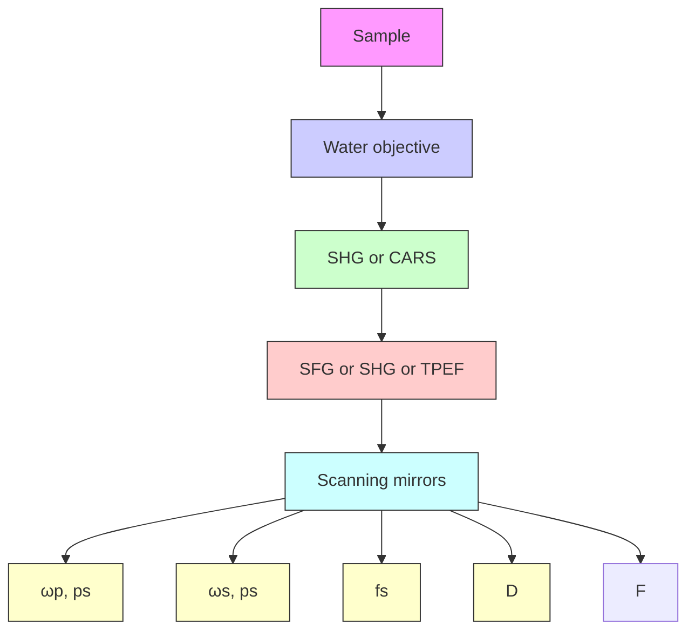

# Second Harmonic and Sum Frequency Generation Imaging of Fibrous Astroglial Filaments in Ex Vivo Spinal Tissues

Yan Fu,\* Haifeng Wang,\* Riyi Shi,\*y and Ji-Xin Cheng\*z

\*Weldon School of Biomedical Engineering, y Department of Basic Medical Sciences, Institute for Applied Neurology, and Center for Paralysis Research, and z Department of Chemistry, Purdue University, West Lafayette, Indiana

ABSTRACT Sum frequency generation (SFG) and second harmonic generation (SHG) were observed from helical fibrils in spinal cord white matter isolated from guinea pigs. By combining SFG with coherent anti-Stokes Raman scattering microscopy, which allows visualization of myelinated axons, these fibers were found to be distributed near the surface of the spinal cord between adjacent axons, and along the blood vessels. Using 20-mm-thick tissue slices, the ratio of forward to backward SHG signal from large bundles was found to be much larger than that from small single fibrils, indicating a phase-matching effect in coherent microscopy. Based on the intensity profiles across fibrils and the size dependence of forward and backward signal from the same fibril, we concluded that the main SHG signal directly originates from the fibrils, but not from surface SHG effects. Further polarization analysis of the SHG signal showed that the symmetry property of the fibril could be well described with a cylindrical model. Colocalization of the SHG signal with two-photon excitation fluorescence (TPEF) from the immunostaining of glial fibrillary acidic protein demonstrated that SHG arises from astroglial filaments. This assignment was further supported by colocalization of the SHG contrast with TPEF signals from astrocyte processes labeled by a $\mathsf { C a } ^ { 2 + }$ indicator and sulforhodamine 101. This work shows that a combination of three nonlinear optical imaging techniques—coherent anti-Stokes Raman scattering, TPEF, and SHG (SFG) microscopy—allows simultaneous visualization of different structures in a complex biological system.

## INTRODUCTION

Constituting the largest cell population in the central nervous system (CNS), astrocytes closely interact with neurons across the extracellular space to provide structural and trophic support (1). Such function is accomplished through the astroglial process, which contains tightly bundled filaments. It is known that the astroglial filaments are composed of an intermediate filament protein called glial fibrillary acidic protein (GFAP) (2). In response to trauma, ischemia, growing tumors, or neuro degenerative diseases, astrocytes undergo astrogliosis, characterized by the rapid synthesis of GFAP and by hypertrophy of the astroglial processes (3). Astrogliosis is thought to play a role in the healing phase by actively monitoring and controlling the molecular and ionic contents of the extracellular space of the CNS (3). Meanwhile, studies on mice with glial filament deficiency have shown that astroglial filaments act as strong inhibitors of CNS regeneration (4). Because of their significance, imaging the astroglial filaments and testing the content of GFAP have been used to diagnose brain tumors (3,5). Current techniques for imaging glial filaments include immunostaining of GFAP and electron microscopy (3). However, the use of fixed, dehydrated, or stained samples in these methods precludes real-time monitoring of astrocyte activities. In addition, it has been shown that negative immunostaining of GFAP does not always mean the lack of astrocytes, but may be due to artifacts introduced by the sample preparation procedure (6). Therefore, nondestructive and label-free imaging of these structures in live tissues is needed for a better understanding of the function of astrocytes.

Because it has intrinsic 3D resolution and relatively large penetration depth, and is nondestructive, nonlinear optical (NLO) microscopy (7) based on two-photon excitation fluorescence (TPEF) (8), second harmonic generation (SHG) (9,10), and coherent anti-Stokes Raman scattering (CARS) (11) has opened up a new window to visualize the morphology and functions of live cells in the CNS. Benefiting from the versatility of fluorescent labels, TPEF microscopy has been widely used for in vivo imaging of neurons and microglia (12–15). With vibrational imaging ability, CARS microscopy has been applied to image the myelin sheath, an extended and spirally wrapped plasma membrane of oligodendrocytes (16). Because it is sensitive to noncentrosymmetrical structures, SHG microscopy has been used to probe the microtubules inside the axons of brain tissues (17).

In this article, we report and analyze SHG and sum fre quency generation (SFG) from helical fibrils in ex vivo spinal tissues using multimodal NLO microscopy. The spatial relationship between these fibrils and myelinated axons was characterized by simultaneous SFG and CARS imaging. The ratio of forward to backward SHG was found to be dependent on fibril size. For large fibrils, SHG intensity was maximized in the fibril center, which indicates that the SHG signal arises directly from the fibrils and is not an interface effect. The polarization properties of the SHG intensity fit well with a C cylindrical rod model (18,19), indicating a polarity for these fibrils. Furthermore, colocalization of the SHG contrast with the GFAP immunostaining contrast showed that these SHG-active fibrils are the astroglial filaments in spinal cord white matter. Our work reveals the polarity in ex vivo fibrous astroglial filaments and also provides a new approach for the study of astrocyte processes.

## MATERIALS AND METHODS

## Tissue sample preparation

Fresh spinal cord samples were isolated from guinea pigs (16). The dura wrapping the spinal cord was gently removed using forceps with the fines tips. The spinal cord was first split into two halves by sagittal division and then cut radially to separate the ventral white matter from the gray matter. The isolated ventral white-matter strip or gray-matter strip was mounted on a chambered glass coverslip and kept in an oxygenated Krebs’ solution (124 mM NaCl, 2 mM KCl, 1.2 mM ${ \mathrm { K H } } _ { 2 } { \mathrm { P O } } _ { 4 } ,$ 1.3 mM $\mathrm { M g S O } _ { 4 } , 2$ mM $\mathrm { C a C l } _ { 2 }$ , 10 mM dextrose, 26 mM ${ \mathrm { N a H C O } } _ { 3 } ,$ , and 10 mM sodium ascorbate, equilibrated with 95% $\mathrm { O } _ { 2 } , 5 \% \mathrm { C O } _ { 2 } ) .$

The samples for simultaneous CARS imaging of axonal myelin and TPEF imaging of $\mathrm { C a } ^ { 2 + }$ were incubated in $\mathrm { _ { 1 } C a } ^ { \mathrm { \bar { 2 } + } }$ -free Krebs’ solution tha contained 40 $\mu \mathbf { M }$ Oregon Green 488 BAPTA-2 AM (OG) (Molecular Probes, Eugene, OR) for 2 h and then washed with normal Krebs’ solution (containing 2 mM $\mathrm { C a } ^ { 2 + } )$ before imaging. The samples for TPEF imaging of fluorescence labeled astrocytes were incubated in a Krebs’ solution tha contained 100 $\mu \mathbf { M }$ sulforhodamine 101 (SR101) (Molecular Probes) for 1 h and then washed with Krebs’ solution three times before imaging.

For recording forward and backward SHG signals from the same fibril, the spinal cord white matter was fixed with formalin and then sectioned into 20-mm slices by a tissue slicer (OTS-4000, Electron Microscopy Sciences, Hatfield, PA).

## Multimodal nonlinear optical imaging

The schematic of our multimodal NLO microscope is shown in Fig. 1. Two tightly synchronized (Sync-Lock, Coherent, Santa Clara, CA) Ti:sapphire lasers (Mira 900, Coherent) were used for simultaneous SFG and CARS imaging. One laser operating at ;700 nm served as the master and provided the clock for synchronization with the other laser. Both lasers had a pulse duration of 2.5 ps. The two beams at frequencies of $\omega _ { \mathrm { p } }$ and $\omega _ { \mathrm { s } }$ were parallelpolarized and collinearly combined. A Pockels’ cell (Model 350-160, Conoptics, Danbury, CT) was used to reduce the repetition rate from 78 MHz to 7.8 MHz. This pulse-picking method reduces the average power to 10 mW but maintains a high peak power (;500 W) at the sample. SHG and TPEF imaging were performed using a 200-fs Ti:sapphire laser (Mira 900, Coherent) at the repetition rate of 78 MHz. A flip mirror was used to switch between the femtosecond and picosecond laser sources.

The collinearly overlapped beams were directed into the scanning uni (FV300, Olympus America, Melville, NY) of a confocal microscope (IX70, Olympus America) and focused into a sample through a 603 water immersion objective lens with a numerical aperture (NA) of 1.2. Images were acquired by scanning a pair of galvanometer mirrors in the FV300. The dwell time for each pixel was $2 \ \mu \mathrm { s } .$

For tissue slices with 20-mm thickness, two photomultiplier tubes (PMTs) (R3896, Hamamatsu, Hamamatsu City, Japan) were used for simultaneous detection of forward and backward SHG. The forward SHG was collected with another 603 water immersion objective with NA 1.2. The forward SHG signal was used to characterize the polarization property of SHG from the fibrils

For the ex vivo spinal tissue samples with 2- to 3-mm thickness, the SFG or SHG signal could hardly be detected in the forward direction because the radiation around 400 nm is effectively scattered by the tissue. Instead, we installed an external PMT (H7422-40, Hamamatsu) detector at the back por of the microscope for detection of backward SHG or SFG. The TPEF signa was detected by the same external detector. Due to the longer CARS signa wavelength around 600 nm, we were able to efficiently collect the forward CARS (F-CARS) signal with an air condenser (NA 0.55). The F-CAR signal was detected by the R3896 PMT.

flowchart

FIGURE 1 Schematic of a multimodal nonlinear optical imaging system Two colinearly combined $2 . 5 \mathrm { - p s }$ Ti:Sapphire laser beams were used fo CARS and SFG imaging. A 200-fs Ti:Sapphire laser was used for SHG and TPEF imaging. A flip mirror was used to switch between the femtosecond and picosecond laser sources. Images were acquired by scanning a pair of galvanometer mirrors. A water immersion objective (NA 1.2) was used to focus the laser beams into a sample. The NLO signals were detected in either a forward or a backward direction. An air condenser (NA 0.55) was use to collect the forward CARS signal from ex vivo spinal tissues. A water immersion objective (NA 1.2) was used to collect the forward SHG signa from thin tissue slices. (D) dichroic mirror; (F) flip mirror.

For CARS imaging of axonal myelin in the spinal tissue (16), the pump laser was tuned to 14,240 cm-1 (702 nm) and the Stokes laser to $1 1 { , } 4 0 0 \mathrm { c m } ^ { - 1 }$ (877 nm). Their wavenumber difference, 2840 cm-1 , matches the Rama shift of CH vibration. The corresponding SFG wavelength was 390 nm. For SHG imaging, the femtosecond laser was tuned to 795 nm and the corresponding SHG wavelength was 397.5 nm. Bandpass filters 600/65 nm (42-7336, Ealing Catalog, Rocklin, CA), HQ375/50-2p (Chroma, McHenry, IL), and HQ520/40-2p (Chroma) were used to transmit the CARS, SFG/ SHG, and TPEF signals, respectively.

The SHG and SFG emission spectra were recorded with a spectrometer (Shamrock 303i/Newton-970N-BV, ANDOR, South Windsor, CT) at th back port of the microscope. The filter used before the spectrometer was made of BG39 color glass (36-9322, Ealing Catalog). The spectra were normalized with the transmission curve of the filter. The CCD acquisition time was 2 ms and the spectra were accumulated 500 times. Two collinearl combined picosecond laser beams at 705.8 nm $( 1 4 , 1 6 9 \mathrm { c m } ^ { - }$ -1 ) and 882.6 nm $( 1 1 , 3 3 0 \mathrm { c m } ^ { - 1 } )$ ) were used for recording the SHG and SFG emission spectra.

## Immunohistochemistry

An adult rat was perfused with 4% paraformaldehyde. Its spinal cord was then extracted and fixed in 4% paraformaldehyde for 2 h, and then i 0.1 M phosphate-buffered saline (PBS) overnight at 4C. The tissue was cryoprotected and sectioned into 15-mm-thick slices along the length of the axons. The sections were washed three times with 0.3% Triton X-100 in PBS and then incubated with a primary antibody, rabbit anti GFAP (Biomedical Technologies, Palatine, IL) or goat antivimentin (Sigma, St. Louis, MO) for 1 h at room temperature after blocking with bovine serum albumin. After washing with 0.3% Triton X-100 in PBS three times, a secondary antibody, goat anti rabbit IgG-Cy3 (Jackson ImmunoResearch Laboratories) or rabbit anti-goat IgG-Cy3 (Sigma), was applied to the sections for 1 h at room temperature while shaking the sample. After washing with 0.3% Triton X-100 in PBS three times, the samples were mounted in the DPX mountant (Fluka, Buchs, Switzerland). For control sections the same procedure was followed, except that the primary antibody was omitted. The immunolabeled sections were examined by simultaneous backward TPEF and forward SHG imaging.

## RESULTS AND DISCUSSION

## SFG and SHG imaging of fibrils and CARS imaging of axonal myelin sheath

Using the two picosecond beams at 702 and 877 nm, we extensively observed SFG contrast from fibrous structures in ex vivo spinal tissues. When two beams were focused at the surface of the spinal cord white matter, strong SFG signals were observed from densely packed helical fibrils (Fig. 2 A). To illustrate the relationship between these fibrils and the axons, we carried out simultaneous CARS imaging of axonal myelin sheath (16) and SFG imaging of fibrils in the same sample. The CARS and SFG signals were detected in the forward and backward directions, respectively. The helical fibrils (green) were found to be located between the myelinated axons (red) (Fig. 2 B). Both signals display a high signal/background ratio, as shown in intensity profiles (Fig. 2 C) along the line indicated by the black arrow in Fig. 2 B. A 3D spatial relationship between the fibrils and axons can be found in Supplementary Material (Movie 1). Using CARS microscopy, we have been able to resolve detailed myelin structures such as the node of Ranvier (16). The inset in Fig. 2 B shows that the SFG-detected fibrils tightly contact the node of Ranvier detected by CARS. In a perivascular area, we observed strong SFG signals from densely packed fibrils (Fig. 2, D and E). The blood vessels are indicated by the dashed white lines in Fig. 2 E. The blood vessel wall gives a visible CARS contrast (Fig. 2 D), which may arise from the endothelial cell membranes. The overlaid image (Fig. 2 D, inset) clearly shows the tight contact between the blood vessel and the fibrils. In the gray matter, we also observed strong SFG signals from a tubular structure that presumably surrounds a blood vessel (Supplementary Material, Movie 2). At certain locations of the spinal tissue, we observed starshaped SFG contrast that resembles the shape of astrocytes (Supplementary Material, Fig. S1).

The above morphological features suggest that the SHG signals arise from astrocyte processes. The structure shown in Fig. 2 A is consistent with the external glial limiting membrane formed by short and robust processes sent toward the pial surface by a variety of fibrous astrocytes (20). More over, it is known that fibrous astrocytes in the white matter have fewer, longer, and less-branched processes that contain large numbers of glial filaments arranged in tight bundles (2), in accordance with our observation in Fig. 2 B. Finally, abundant astrocyte processes are shown to envelop the node of Ranvier and blood vessels and form end-feet (2,21), in agreement with our observations (Fig. 2, B and D, insets).

  
FIGURE 2 SFG and SHG imaging of helical fibers (green) and CARS imaging of myelin sheath (red) in ex vivo spinal tissues. (A) SFG image near the surface of spinal cord white matter. Scale bar, 10 mm. (B) Overlaid SFG image of fibrils and CARS image of myelinated axons inside spinal cord white matter. (Inset) Overlay of the SFG and CARS images of a node of Ranvier surrounded by astrocyte processes. Scale bar, 5 mm. (C) CARS (red) and SHG (green) intensity profiles along the line indicated by the arrow in B. (D and E) CARS (red) and SFG (green) images of a perivascular area containing a branched blood vessel. (D, inset) Overlaid CARS and SFG images. Scale bar, 20 mm. (E) The blood vessel is indicated by dashed white lines. (F) SHG image of fibrils in the same location of spinal cord white matter as in B. Scale bar, 10 mm. The average laser power for SFG and CARS imaging was around 10 mW at the sample. The average laser power for SHG imaging was 11.2 mW at the sample

We also carried out SHG imaging of spinal tissues with a femtosecond beam at 795 nm (Fig. 2 F). For the same sample, the SHG image shows the same contrast as the SFG image (Fig. 2 B). To estimate the SHG signal level from these fibrils, we compared the SHG signal intensity from our sample with that from well characterized collagen fibrils from mammary tissues (T. T. Le and J. X. Cheng, unpublished results). They were at the same level under the same experimental conditions.

## Power dependence and spectral characterization

The signal in Fig. 2 A was confirmed to be SFG by the linear dependence of the signal on pump and Stokes beam powers, as shown in Fig. 3, A and B, respectively. Using two picosecond beams at 705.8 nm and 882.6 nm, we recorded the SHG and SFG emission spectra (Fig. 3 C) from a single fibril. Two SHG peaks were observed at 352.9 nm and 441.3 nm, respectively. The SFG peak was at 392.2 nm, in agreement with the calculated wavelength for the sum frequency of the two excitation beams. The observed signal ratio at 352.9 nm, 392.2 nm, and 441.3 nm was 1:13.8:2.4, indicating that SFG has much higher intensity than SHG by either excitation beam. This is partially because SFG utilized more excitation power (from both beams) than SHG, which used a single beam.

Because SHG can be implemented with a single laser beam, we used SHG imaging to characterize the spectral dependence of $\chi ^ { ( 2 ) }$ . The SHG excitation profile shown in Fig. 3 D was obtained by tuning the wavelength of the femtosecond beam. The SHG intensities were normalized by the excitation power and the transmission of the bandpass filters. The maximal signal was obtained at the excitation wavelength around 800 nm, similar to the case of collagen fibrils (22). We note that near-infrared excitation frequencie are far from the electronic resonance frequency of biologica molecules, whereas the SHG or SFG output around 400 nm could be close to electronic resonance. Based on Boyd’s expression of $\chi ^ { ( 2 ) } ( 2 3$ , p. 139) the SHG or SFG efficiency in our case is expected to be sensitive to the output frequency and insensitive to individual excitation frequencies. Therefore, SFG with 392 nm output should have efficiency similar to that of SHG with 392 nm output, which is more efficient than SHG with 353 nm and 441 nm output according to Fig. $3 \ D .$ . This also explains SFG intensity stronger than that of SHG, shown in Fig. 3 C.

scatterplot

| Pump power (mW) | Int. (a.u.) |
| --------------- | ----------- |
| 2               | 0.5         |
| 4               | 1.0         |
| 6               | 1.5         |
| 8               | 2.0         |

line chart

| Stokes power (mW) | Int. (a.u.) |
| ----------------- | ----------- |
| 0                 | 0           |
| 1                 | 0.5         |
| 2                 | 1.0         |
| 3                 | 1.5         |

line chart

| λ_em (nm) | Spectral Int. (a.u.) |
| --------- | -------------------- |
| 350       | 0.1                  |
| 400       | 7.0                  |
| 450       | 0.5                  |

line chart

| λ_ex (nm) | Int. (a.u.) |
| --------- | ----------- |
| 700       | 2.0         |
| 720       | 4.5         |
| 740       | 4.0         |
| 760       | 4.8         |
| 780       | 5.2         |
| 800       | 6.5         |
| 820       | 7.8         |
| 840       | 5.5         |
| 860       | 4.0         |
| 880       | 3.5         |
| 900       | 3.8         |

FIGURE 3 Characterization of the SFG and SHG signals from ex vivo spinal tissues. (A) Linear dependence of SFG intensity on pump laser power with fixed Stokes power at 3.5 mW at the sample. The squares represent the data and the solid line represents linear fit. (B) Linear dependence of SFG intensity on Stokes laser power with fixed pump power at 8.5 mW at the sample. The solid circles represent the data and the solid line represents linear fit. (C) Emission spectra of SHG and SFG produced by two picosecond beams at 705.8 nm (average power 3.96 mW at the sample) and 882.6 nm (average power 1.12 mW at the sample), respectively. (D) SHG excitation profile generated by tuning the 200-fs laser in the region of 700 to 900 nm. The SHG intensity was normalized by the transmission of the microscope components (dichroic mirrors, objective, and filters) and the laser power. The error bar for each point represents the standard error of three measurements.

## Forward versus backward SHG

SHG is usually detected in the forward direction. However, for our 2- to 3-mm-thick tissue samples we had to use backward detection, because the forward SHG signal was effectively scattered by the sample. To study the propertie of SHG from the fibrils, we prepared $2 0 \mathrm { - } \mu \mathrm { m }$ thin tissue slices to reduce sample scattering and absorption. Considering th SHG beam deflection by the Gouy phase effect, a 603 water objective (NA 1.2) instead of the air condenser (NA 0.55) was used to collect the forward signal. The SHG deflection angle by Gouy phase shift was calculated to be $4 2 ^ { \circ }$ for our objective (9). The air condenser has a collection angle of $3 3 ^ { \circ } .$ smaller than the deflection angle. Since the water objective has a collection angle of $6 4 ^ { \circ }$ , it was used to collect the forward signal. Two PMT detectors of the same type and set at the same voltage were used to record the forward and backward SHG signals.

Simultaneously acquired forward and backward SHG images are shown in Fig. 4. For a large fibril (\$1 mm in diameter) (Fig. 4, A and B, red lines), the forward SHG signal can be 10–20 times stronger than the backward SHG signal (Fig. 4 C), whereas for a small fibril (diameter ,0.5 mm) (Fig. 4, D and E, red lines) this ratio is reduced to three to four times stronger (Fig. 4 F). Moreover, the forward image displayed a better spatial resolution. The size depen dence of forward/backward signal ratio can be explained in terms of phase-matching condition (24). For a large fibril, the phase-matching condition favors forward radiation. As a result, the SHG signal mainly goes forward as a consequence of constructive coherent addition. The backward SHG signal is largely due to back-reflection of the forward signal. However, for a small fibril, the phase-matching condition is relaxed, so there is more backward radiation. Therefore, the size dependence of the forward/backward signal ratio is a demonstration of the coherent property of SHG. Similar size dependence of forward versus backward signal was shown in CARS microscopy (11).

Fig. 4 also helped us figure out the role of surface SHG effect. Surface SHG spectroscopy has monolayer sensitivity and has been widely used to explore the properties of a molecular layer on an interface (25). If the SHG signal mainly arose from the fiber surface that is perpendicular to the field propagation direction, the interaction length would be limited to a very thin layer of surface molecules and the SHG signal should go forward and backward equally. This is, however, contrary to our observation that forward SHG signal is much stronger than backward SHG signal for both large and small bundles. Therefore, such a possibility can be excluded. If the SHG signal mainly arose from the fibril surface parallel to the field propagation direction, the signal should be higher at the edge of the fiber. However, the measured SHG intensities are peaked at the center of a large fibri (Fig. 4 C) for both forward and backward SHG. Therefore, the main SHG signal in our case should directly arise from the fibrils, but not from the surface.

natural_image

Medical imaging scan showing a white vascular structure with a red arrow pointing to a specific region (no text or symbols present)

natural_image

Medical imaging scan showing a vascular structure with a red arrow pointing to a specific region (no text or symbols present)

natural_image

Microscopic image of a filamentous biological structure with a red arrow pointing to a specific feature (no text or symbols present)

natural_image

Microscopic image of a biological structure with a red arrow pointing to a specific region (no text or symbols present)

line chart

| Position (μm) | F-SHG | E-SHG X2 |
| ------------- | ----- | -------- |
| 0             | 0.0   | 0.0      |
| 1             | 0.0   | 0.0      |
| 2             | 2.5   | 0.5      |
| 3             | 0.0   | 0.0      |

line chart

| Position (μm) | F-SHG | E-SHG X2 |
| ------------- | ----- | -------- |
| 0             | 0.0   | 0.0      |
| 1             | 0.0   | 0.1      |
| 2             | 0.3   | 0.35     |
| 3             | 0.0   | 0.1      |

FIGURE 4 Simultaneously acquired forward and backward SHG images in a 20-mm-thick spinal tissue slice. The forward signal was collected by a 603 water immersion objective. The forward and backward PMT detectors were of the same type and set at the same gain. (A and B) Simultaneously acquired forward and backward SHG images of fibrils inside spinal cord white matter. (C) Line analysis of a large fibril indicated by red lines in A and B. (D and E) Simultaneously acquired forward and backward SHG images of the same area as in A and B but at a different depth. (F) Line analysis of a small fibril indicated by red lines in D and E. The laser power at the sample was 7 mW. Scale bar, 10 mm.

## Polarization property analysis

The SHG polarization properties were shown to provide important information about the protein fibril structure (19,26). Below, we present our analysis of the forward SHG signal from single fibrils in $2 0 \mathrm { - } \mu \mathrm { r }$ m-thick tissue slices using a model that describes a cylindrical rod with $\mathrm { { C } _ { \infty } }$ symmetry (see supporting information for derivation of Eqs. 1 and 2).

The SHG polarization properties are determined by the tensor components of $\chi ^ { ( 2 ) }$ , which are sensitive to the symmetry properties of the material (25). We assume that the excitation fields propagate toward 1z direction. For a $\mathrm { { C } _ { \infty } }$ cylinder along the y axis and a linearly polarized excitation field $\mathbf { E _ { 1 } }$ (Fig. 5 A), the total SHG intensity can be written as (18,19)

$$
I _ {\text { total }} (\theta) \propto I _ {\mathrm{p}} [ (\rho_ {1} \cos^ {2} \theta + \sin^ {2} \theta) ^ {2} + (\rho_ {2} \sin 2 \theta) ^ {2} ], \tag {1}
$$

where u is the angle between the excitation field polarization $\rho _ { 2 }$ $( E _ { 1 } )$ 1  equals $\chi _ { \mathrm { x y x } } ^ { ( 2 ) } / \chi _ { \mathrm { y x x } } ^ { ( 2 ) }$ , where $\check { \chi } _ { \mathrm { x y x } } ^ { ( 2 ) }$ and $\rho _ { 1 }$ $\chi _ { \mathrm { y x x } } ^ { ( 2 ) }$ represent the fiber $\chi _ { \mathrm { y y y } } ^ { ( 2 ) } / \chi _ { \mathrm { y x x } } ^ { ( 2 ) }$ polarity due to chirality. The intensity of SHG components that is parallel $( I _ { \mathrm { Y } } ( \theta ) )$ or perpendicularly $\left( I _ { \mathrm { X } } ( \theta ) \right)$ polarized with respect to the fiber axis can be written as

$$
I _ {\mathrm{Y}} (\theta) \propto I _ {\mathrm{p}} \left(\rho_ {1} \cos^ {2} \theta + \sin^ {2} \theta\right) ^ {2} \tag {2a}
$$

and

$$
I _ {\mathrm{X}} (\theta) \propto I _ {\mathrm{p}} (\rho_ {2} \sin 2 \theta) ^ {2}. \tag {2b}
$$

The variation of the y-polarized SHG emission, x-polarized SHG emission, and total SHG intensity from y-oriented fibrils was measured by rotating the excitation polarization. Fitting the excitation polarization dependence of y-polarized SHG emission (Fig. 5 A) with Eq. 2a gives $\rho _ { 1 } = 2 . 1 3$ . This value is comparable to the value 1.80 obtained from collagen fibrils in the rat tail tendon (19). The measured excitation polarization dependence of the x-polarized and total SHG emission is shown in Fig. 5, B and C. Two maxima appeared at ${ \sim } 3 0 ^ { \circ }$ and 150, similar to the results from collagen in tendon (19) and actin filaments inside myofibrils (26). With $\rho _ { 1 } = 2 . 1 3$ , fitting Fig. 5 C with Eq. 1 gives $\rho _ { 2 } = 1 . 6 2$ .

Similar polarization measurements were carried out for actin filaments, which showed $\rho _ { 1 } = 0 . 0 9$ and $\rho _ { 2 } = 1 . 1 5 \left( 2 6 \right)$ . As pointed out by Chu et al. (26), the very small $\rho _ { 1 }$ suggests an important role of chirality for actin filaments. In our case, the above measurement gives xð Þyyy.xð Þxyx.xð Þyxx $\chi _ { \mathrm { y y y } } ^ { ( 2 ) } > \chi _ { \mathrm { x y x } } ^ { ( 2 ) } > \chi _ { \mathrm { y x x } } ^ { ( 2 ) }$ . This result indicates a minor role of chirality in the polarity of the fibrils in our sample. Under the condition that both fundamental and SHG frequencies are far away from electronic resonance, $\chi _ { \mathrm { x y x } } ^ { ( 2 ) } = \chi _ { \mathrm { y x x } } ^ { ( 2 ) } ~ ( \mathrm { i . e . , } \rho _ { 2 } = 1 . 0 )$ In our case, the obtained value of $\rho _ { 2 } \ ( 1 . 6 2 )$ deviated from Kleinman symmetry, possibly because the SHG emission at 397 nm lies in the vicinity of electronic absorption.

We also studied the emission polarization of the SHG signal with the excitation field polarized along the fibril $( \theta = 0 )$ .

text_image

X
A
E₁
θ
Z
P
Y
filament

line chart

| Angle θ (deg) | Value |
| ------------- | ----- |
| 0             | 1.0   |
| 20            | 0.95  |
| 40            | 0.85  |
| 60            | 0.7   |
| 80            | 0.5   |
| 100           | 0.3   |
| 120           | 0.4   |
| 140           | 0.6   |
| 160           | 0.8   |
| 180           | 1.0   |

text_image

X
B
P
E₁
θ
Z
Y
filament

line chart

| Angle θ (deg) | Value |
| ------------- | ----- |
| 0             | 0.0   |
| 20            | 0.2   |
| 40            | 0.6   |
| 60            | 1.1   |
| 80            | 0.6   |
| 100           | 0.2   |
| 120           | 0.9   |
| 140           | 1.1   |
| 160           | 0.7   |
| 180           | 0.1   |

text_image

x
C
E₁
θ
z
Y
filament

line chart

| Angle θ (deg) | Value |
| ------------- | ----- |
| 0             | 1.0   |
| 30            | 1.1   |
| 60            | 0.7   |
| 90            | 0.3   |
| 120           | 0.8   |
| 150           | 1.1   |
| 180           | 1.0   |

text_image

x
D
P
φ
E₁
Z
Y
filament

line chart

| Angle φ (deg) | SHG   | Laser |
| ------------- | ----- | ----- |
| 0             | 1.0   | 1.0   |
| 60            | 0.2   | 0.2   |
| 120           | 0.0   | 0.0   |
| 180           | 1.0   | 1.0   |

FIGURE 5 Polarization analysis of forward SHG signal. The scheme of each polarization measurement is shown in the left panel and the result is shown in the right panel. The fiber axis is defined as the y axis and the beam propagation is along the z axis. u, angle between the excitation field and the y axis; u, angle between the emission polarizer axis and the y axis; $E _ { 1 } ,$ , excitation field; $P ,$ axis of the emission polarizer before the detector. $( A { - } C )$ Data points are shown as squares with error bars, and solid curves are the theoretical fit. (A) Excitation polarization dependence of the y-polarized SHG component. The least-squares fitting with $\operatorname { E q . }$ 2a gives $I _ { \mathrm { y } } = 0 . 2 3 ( 2 . 1 3 \mathrm { c o s } ^ { 2 } ( \theta + 4 . 7 6 ) +$ 1 $\sin ^ { 2 } ( \theta + 4 . 7 6 ) ) ^ { 2 }$ , where $\rho _ { 1 } = 2 . 1 3$ . (B) Excitation polarization dependence of the x-polarized SHG component. The fitting with $\operatorname { E q . }$ 2b gives $I _ { \mathrm { x } } =$ $1 . 0 3 \mathrm { s i n } ^ { 2 } 2 ( \theta - 1 . 3 5 )$ . (C) Excitation polarization dependence of total SHG intensity. The fitting with Eq. 1 gives $I _ { \mathrm { t o t a l } } = 0 . 2 2 ( ( 2$ :13cos $^ { \prime } ( \theta { + } 4 . 6 6 ) +$ sin $\mathbf { \langle } ( \theta + 4 . 6 6 ) ) ^ { 2 } + 1 . 6 2 ^ { 2 } \mathrm { s i n } ^ { 2 } 2 ( \theta + 4 . 6 6 ) )$ , where $\rho _ { 1 } = 2 . 1 3$ and $\rho _ { 2 } = 1 . 6 2 . \left( D \right)$ The detected intensity of the y-polarized excitation laser beam (solid curve) and SHG emission (squares with error bars) with respect to u. SHG emission data points indicate that it was also linearly polarized along the y axis. For al measurements, the laser power at the sample was 7 mW. For each data point, SHG intensities from a single fibril were normalized by its peak intensity, and

The SHG signal is expected to be linearly polarized along the fibril, and with a polarizer before detector, the signal can b written as

$$
I _ {\mathrm{em}} = I _ {0} \cos^ {2} \varphi , \tag {3}
$$

where $\varphi$ is the angle between the SHG emission polarization and the axis of the polarizer placed before the detector (Fig. 5 D). $I _ { 0 }$ is the maximal signal intensity. The measured SHG intensities from the fibrils and the laser intensities transmit ted through the sample with respect to the angles (u) of th polarizer are shown in Fig. 5 D. Both sets of data agree with Malus’s law in Eq. 3.

Taken together, the above polarization analysis indicate that the fibrous structures observed in our ex vivo tissue sam ple are polarized and possess a cylindrical $\mathbf { C } _ { \infty }$ symmetry. This result also supports the statement that the SHG signal i from the fibrils and not an interface effect.

## Molecular origin of the SHG signal

Our morphological study with simultaneous SFG and CARS imaging (Fig. 2) suggests that the observed fibrils are glial filaments in spinal cord astrocyte processes. Because GFAP is known to be the building block of the glial filaments (27), the molecular origin of the observed fibrils was further explored by a colocalization study of the SHG signal and GFAP immunofluorescence. Immunostaining of glial filaments was performed with an anti-GFAP serum.

Fig. 6 shows the SHG image of fibrous structures (Fig. 6 A) and the TPEF image of Cy3-labeled GFAP (Fig. 6 B) in the same position of the tissue slice. The SHG signal overlaps with the TPEF signal. However, the TPEF signal spreads out from the fibers to some extent (Fig. 6 B), resulting in a more uniform distribution. This difference is likely due to th different mechanisms involved in SHG and TPEF microscopy: SHG is coherent and the signal is proportional to th square of the molecular density, whereas TPEF is incoherent and the signal is linearly proportional to the density of the labeled dyes. As a result, SHG exhibits a much sharper contrast than TPEF. Additionally, it was reported that the anti-GFAP serum was not limited to intracellular filamentou structures, but was also diffusively present in the cytoplasm without any recognizable association with subcellular organ elles (28). This property agrees with our observation that in addition to its colocalization with the SHG signal, the GFAP immunofluorescence appears more diffused in the TPEF image shown in Fig. 6 B. In the control sample without the anti-GFAP serum immunostaining, we did not observe any TPEF signal (Fig. 6 D) from the fibers that had SHG signal results support the statement that the SHG signal comes from the GFAP glial filaments and the SHG microscopy is more selective to the astroglial filaments than the immunostaining method.

  
FIGURE 6 Colocalization of SHG from the fibrils and TPEF from immunolabeled GFAP. (A and B) SHG and TPEF images, respectively, of a fixed spinal tissue labeled with Cy3-anti-GFAP serum. (C and D) SHG and TPEF images, respectively, of a control sample without antiserum Cy3. The femtosecond laser power used for TPEF and SHG was 14 mW at the sample. $\mathrm { B a r } = 1 0 \ \mu \mathrm { m }$ .  
(Fig. 6 C). To check whether these fibrils contain vimentin, which was shown to exist in immature astrocytes (29), we performed immunostaining of the spinal tissue with antivimentin serum. No vimentin expression was observed (Supplementary Material, Fig. S2). In summary, the above

Astrocytes are shown to sustain a high concentration of free intracellular calcium, which can undergo large changes spontaneously or in response to various stimuli (30,31). Calcium-sensitive dye is reported to be primarily taken up by astrocytes in the hippocampus slices (32,33), the neonatal rat optical nerve tissue (CNS white-matter tracts) (34), and the cerebral cortex in vivo (35). The $\mathrm { C a } ^ { 2 + }$ -abundant nature of astrocytes provides another means to verify the origin of the SFG and SHG signal. We used OG, a cell-membranepermeant calcium indicator, to incubate the spinal tissue. Fig. 7, A and B, shows the CARS image of the myelin sheath (red) wrapping the parallel axons overlaid with the TPEF image of OG (blue) distribution and the SFG image of filaments (green), respectively, in the same area. Fig. 7, C and D, shows the TPEF image of OG distribution (blue) and the SFG image of filaments (green), respectively, near the surface of the spinal cord. By combining Fig. 7, A and B, or Fig. 7, C and D, we find that the SFG signal was colocalized with the TPEF signal from OG at most locations. These observations support the idea that the SFG signal arises from the astroglial filaments.

The molecular origin of the SHG signal was further confirmed by labeling the spinal cord white matter with SR101. It was reported that SR101 could be taken by astrocytes in the neocortex of brain in vivo (15). The femtosecond laser was used to acquire, simultaneously, a TPEF image of SR101 (Fig. 7 E) and an SHG image of filaments (Fig. 7 F). The TPEF and SHG signal from the helical fibrils are well overlapped, which provides additional evidence that SHG comes from astroglial filaments.

natural_image

Fluorescent microscopy image showing red and blue vascular structures against a dark background (no text or symbols)

natural_image

Microscopic view of cellular structures with blue fluorescence and white arrow annotations (no text or symbols)

natural_image

Microscopic view of fibrous or filamentous structures with two white arrow indicators and a scale bar (no text or symbols)

natural_image

Fluorescent microscopy image showing red and green labeled neural structures against a dark background (no text or symbols)

natural_image

Microscopic view of green fluorescent fibrous structures against a black background (no text or symbols)

natural_image

Fluorescent microscopy image showing green-stained cellular or fibrous structures against a black background (no text or symbols)

FIGURE 7 Colocalization of SFG or SHG signal from fibrils (green) and TPEF signal from $\mathrm { C a } ^ { 2 + }$ indicator (blue) or SR101-labeled astrocyte processes (gray) in ex vivo spinal tissues. (A) TPEF image of OG (a calcium indicator). (B) SFG image of the same location as in A. The red in A and B represents the CARS contrast from myelin sheath. (C) TPEF image of the surface of a spinal tissue sample. (D) Simultaneously acquired SFG image of the same location as in C. (E) TPEF image of SR101- labeled spinal tissue. (F) Simultaneously acquired SHG image of the same location as in E. The power used for TPEF and SHG was 8.4 mW at the sample. (A–D) Scale bar, 10 mm. (E and F) Scale bar, 5 mm.

Our polarization analysis (Fig. 5) indicates that these glial filaments are polarized structures. On the other hand, it is known that astroglial filaments belong to the category of intermediate filament for which the basic unit is an antiparallel tetramer (29,36–39). Because antiparallel tetramers possess inversion symmetry (40,41), neither SFG nor SHG is expected from intermediate filaments. The difference between our observations on ex vivo tissues and previous in vitro measurements (36) may arise from the difference between the assembly of rod domains in vitro (in solutions) and that of GFAPs in vivo (inside live cells).

Near the surface of the spinal cord white matter, we observed some straight structures that were labeled by OG and SR101 (Fig. 7, C and E, arrows) but did not generate detectable SFG or SHG signal (Fig. 7, D and F). These structures are usually branched (Fig. 7 E). Based on previous reports that calcium-sensitive dye can label capillary endothelial cells irregularly (35) and that SR101 can be accumulated in the isolated capillaries (42,43), we assigned them to be capillaries around the spinal cord.

In summary, the above analysis provided independent evidence supporting that the SHG and SFG signals come from astroglial filaments in spinal cord white matter. First, the observed morphological relationship of these fibrils with the myelinated axons suggests that they are bundles of glial filaments in the astrocyte processes. Second, our immunofluorescence studies demonstrate that GFAP is a component of the SHG-detected filaments (Fig. 6). Third, these fibers can be selectively labeled by makers of astrocyte processes, including calcium indicator and SR101.

## CONCLUSIONS

SFG and SHG from helical fibrils in guinea pig spinal cord white matter were observed. The optical properties and the molecular origin of the SHG signal were analyzed. The SHG signal level was found to be similar to that from collagen fibrils under the same imaging conditions. The emission spectrum shows that with two picosecond beams, SFG intensity is much stronger than SHG generated by either beam. The excitation spectral profile indicates that SHG intensity is maximized when the output is ;400 nm. For large fibrils, the SHG signal is dominant in the forward direction, whereas from small fibrils, a significant SHG signal goes backward due to the relaxation of the phase-matching condition. The size dependence of forward/backward signal ratio and the intensity profile across the fibrils reveal that the SHG signal arises directly from the fibrils and is not an interface effect. Moreover, our polarization analysis shows that the fibrils have a polarized structure with $\mathrm { ~ a ~ C ~ } _ { \infty }$ symmetry. The fitting with a $\mathrm { { C _ { \infty } } }$ cylinder model produced ratios between the $\chi _ { \mathrm { y y y } } ^ { ( \angle ) } ,$ , $\chi _ { \mathrm { y x x } } ^ { ( 2 ) }$ , and $\chi _ { \mathrm { x y x } } ^ { ( 2 ) }$ components, which suggests that chirality plays a weak role in the fibril polarity. Finally, our immunofluorescence studies show that these SHG-active fibrils are fibrous astroglial filaments. This assignment has been further confirmed by the fibrils’ morphological relationship with myelinated axons, their abundance of calcium, and selectiv labeling by SR101.

This work provides a new approach for investigating th functions of astroglial filaments. The key advantage of our approach lies in the capability of monitoring astroglial filaments in ex vivo tissues with 3D spatial resolution. Importantly, as shown in this work, SFG and CARS microscopy can be readily combined so that astroglial filaments and myelin sheath, two significant CNS structures provided by astrocytes and oligodendrocytes, can be imaged simulta neously. Furthermore, we have shown that SHG imaging of glial filaments and TPEF imaging of $\mathrm { C a } ^ { 2 + }$ inside the astrocyte processes can be carried out simultaneously on th same platform. In general, the combination of different modalities in NLO microscopy promises to offer exciting op portunities to explore cell-cell communications in a tissue environment.

## SUPPLEMENTARY MATERIAL

An online supplement to this article can be found by visiting BJ Online at http://www.biophysj.org.

We acknowledge Jennifer McBride, Kristin Hamann, and Gary Leung fo their kind help in tissue preparation; Debra Bohnert, Haiping Chen, Andrew Koob, and Caiyun Zeng for their kind help in immunofluorescence experiment; and Dr. Garth Simpson for helpful discussions.

This work was supported by National Science Foundation grant No 0416785-MCB, National Institutes of Health R21 grant No. EB004966-0 and funding from the State of Indiana.

## REFERENCES

1. Fedoroff, S., and A. Vernadakis. 1986. Astrocytes. Academic Press, Orlando, FL.  
2. Raine, C. S. 1999. Neurocellular anatomy. In Basic Neurochemistry Molecular, Cellular, and Medical Aspects. G. J. Siegel, B. W Agranoff, R. W. Albers, S. K. Fisher, and M. D. Uhler, editors 6th ed. Lippincott Williams & Wilkins, Philadelphia. 3–30.  
3. Eng, L. F., and Y. L. Lee. 1995. Intermediate filaments in astrocytes. In Neuroglia. H. Kettermann and B. R. Ransom, editors. Oxford University Press, New York. 650–667.  
4. Pekny, M., and M. Pekna. 2004. Astrocyte intermediate filaments in CNS pathologies and regeneration. J. Pathol. 204:428–437.  
5. Deck, J. H. N., L. F. Eng, J. Bigbee, and S. M. Woodcock. 1978. The role of glial fibrillary acidic protein in the diagnosis of central nervous system tumors. Acta Neuropathol. (Berl.). 42:183–190  
6. DeArmond, S. J., and L. F. Eng. 1984. Immunohistochemistry: tech niques and application to neurooncology. In Progress in Experimenta Tumor Research. F. Hamburger, editor. S. Karger, Basel. 92–117.  
7. Helmchen, F., and W. Denk. 2005. Deep tissue two-photon microscopy. Nat. Methods. 2:932–940.  
8. Denk, W., J. H. Strickler, and W. W. Webb. 1990. Two-photon laser scan ning fluorescence microscopy. Science. 248:73–76.  
9. Moreaux, L., O. Sandre, and J. Mertz. 2000. Membrane imaging by second-harmonic generation microscopy. J. Opt. Soc. Am. B. 17:1685– 1694.  
10. Campagnola, P. J., A. C. Millard, M. Terasaki, P. E. Hoppe, C. J. Malone, and W. A. Mohler. 2002. Three-dimensional high-resolution second-harmonic generation imaging of endogenous structural protein in biological tissues. Biophys. J. 81:493–508.  
11. Cheng, J. X., A. Volkmer, and X. S. Xie. 2002. Theoretical and experimental characterization of coherent anti-Stokes Raman scattering microscopy. J. Opt. Soc. Am. B. 19:1363–1375.  
12. Stosiek, C., O. Garaschuk, K. Holthoff, and A. Konnerth. 2003. In vivo two-photon calcium imaging of neuronal networks. Proc. Natl. Acad. Sci. USA. 100:7319–7324.  
13. Levene, M. J., D. A. Dombeck, K. A. Kasischke, R. P. Molloy, and W. W. Webb. 2004. In vivo multiphoton microscopy of deep brain tissue. J. Neurophysiol. 91:1908–1912.  
14. Kerschensteiner, M., M. E. Schwab, J. W. Lichtman, and T. Misgeld. 2005. In vivo imaging of axonal degeneration and regeneration in the injured spinal cord. Nat. Med. 11:572–577.  
15. Nimmerjahn, A., F. Kirchhoff, J. N. D. Kerr, and F. Helmchen. 2004. Sulforhodamine 101 as a specific marker of astroglia in the neocortex in vivo. Nat. Med. 1:31–37.  
16. Wang, H., Y. Fu, P. Zickmund, R. Shi, and J. X. Cheng. 2005. Coherent anti-Stokes Raman scattering imaging of live spinal tissues. Biophys. J. 89:581–591.  
17. Dombeck, D. A., K. A. Kasischke, H. D. Vishwasrao, M. Ingelsson, B. T. Hyman, and W. W. Webb. 2003. Uniform polarity microtubul assemblies imaged in native brain tissue by second -harmonic generation microscopy. Proc. Natl. Acad. Sci. USA. 100:7081–7086.  
18. Roth, S., and I. Freund. 1979. Second harmonic generation in collagen. J. Chem. Phys. 70:1637–1643.  
19. Freund, I., M. Deutsch, and A. Sprecher. 1986. Connective tissue polarity—optical second-harmonic microscopy, crossed-beam summation, and small-angle scattering in rat-tail tendon. Biophys. J. 50: 693–712.  
20. Sasaki, H. 1989. Subpial glial limiting membrane of the cat spinal cord visualized by scanning electron microscopy. Anat. Embryol. (Berl.). 179:533–540.  
21. Butt, A. M., A. Duncan, and M. Berry. 1994. Astrocyte associations with nodes of Ranvier: ultrastructural analysis of HRP-filled astrocytes in the mouse optic nerve. J. Neurocytol. 23:486–499.  
22. Zoumi, A., A. Yeh, and B. J. Tromberg. 2002. Imaging cells and extracellular matrix in vivo by using second-harmonic generation and two photon excited fluorescence. Proc. Natl. Acad. Sci. USA. 99:11014–11019.  
23. Boyd, R. W. 1992. Nonlinear Optics. Academic Press, San Diego. 23.  
24. Williams, R. M., W. R. Zipfel, and W. W. Webb. 2005. Inperpreting second-harmonic generation images of collagen I fibrils. Biophys. J. 88:1377–1386.  
25. Shen, Y. R. 1989. Surface properties probed by second-harmonic and sum-frequency generation. Nature. 337:519–525.  
26. Chu, S.-W., S.-Y. Chen, G.-W. Chern, T.-H. Tsai, Y.-C. Chen, B.-L. Lin, and C.-K. Sun. 2004. Studies of $\chi ^ { ( 2 ) } / \chi ^ { ( 3 ) }$ tensors in submicronscaled bio-tissues by polarization harmonics optical microscopy. Bio phys. J. 86:3914–3922.  
27. Connor, J. R., and E. M. Berkowitz. 1985. A demonstration of glial filament distrubtion in astrocytes isolated from rat cerebral cortex. Neuroscience. 16:33–44.  
28. Schachner, M., E. T. Hedley-Whyte, D. W. Hsu, G. Schoonmaker, and A. Bignami. 1977. Ultrastructural localization of glial fibrillary acidic protein in mouse cerebellum by immunoperoxidase labeling. J. Cell Biol. 75:67–73.  
29. Steinert, P. M., and D. R. Roop. 1988. Molecular and cellular biology of intermediate filaments. Annu. Rev. Biochem. 57:593–625  
30. Kostyuk, P. G., and A. N. Verkhratsky. 1995. Calcium signalling in glial cells. In Calcium Signalling in the Nervous System. John Wiley & Sons, Chichester, UK. 110–138.  
31. Parpura, V., and P. G. Haydon. 2000. Physiological astrocytic calcium levels stimulate glutamate release to modulate adjacent neurons. Proc. Natl. Acad. Sci. USA. 97:8629–8634  
32. Porter, J. T., and K. D. McCarthy. 1996. Hippocampal astrocytes in situ respond to glutamate released from synaptic terminals. J. Neurosci. 16:5073–5081.  
33. Nett, W. J., S. H. Oloff, and K. D. McCarthy. 2002. Hippocampal astrocytes in situ exhibit calcium oscillations that occur independent of neuronal activity. J. Neurophysiol. 87:528–537.  
34. Fern, R. 1998. Intracellular calcium and cell death during ischemia in neonatal rat white matter astrocytes in situ. J. Neurosci. 18:7232–7243.  
35. Hirase, H., L. Qian, P. Bartho´, and G. Buzsa´ki. 2004. Calcium dynamics of cortical astrocytic networks in vivo. PLoS Biol. 2:494–499.  
36. Geisler, N., E. Kaufmann, and K. Weber. 1985. Antiparallel orientation of the two double-stranded coiled-coils in the tetrameric protofilament unit of intermediate filaments. J. Mol. Biol. 182:173–177  
37. Soellner, P., R. A. Quinlan, and W. W. Franke. 1985. Identification of a distinct subunit of an intermediate filament protein: tetrameric vimentin from living cells. Proc. Natl. Acad. Sci. USA. 82:7929–7933.  
38. Stewart, M., R. A. Quinlan, and R. D. Moir. 1989. Molecular interactions in paracrystals of a fragment corresponding to the a-helical coiled-coil rod portion of glial fibrillary acidic protein: evidence for an antiparallel packing of molecules and polymorphism related to inter mediate filament structure. J. Cell Biol. 109:225–234.  
39. Ceisler, N., J. Schu¨nemann, and K. Weber. 1992. Chemical crosslinking indicates a staggered and antiparallel protofilament of desmin intermediate filaments and characterizes one higher-level complex between protofilaments. Eur. J. Biochem. 206:841–852.  
40. Shoeman, R. L., and P. Traub. 1993. Assembly of intermediate filaments. Bioessays. 15:605–611.  
41. Ho, C., and R. K. H. Liem. 1996. Intermediate filaments in the nervous system: implications in cancer. Cancer Met Rev. 15:483–497.  
42. Miller, D. S., C. Craeff, L. Droulle, S. Fricker, and G. Fricker. 2002. Xenobiotic efflux pumps in isolated fish brain capillaries. Am. J. Physiol. Regul. Integr. Comp. Physiol. 282:191–198.  
43. Miller, D. S., S. N. Nobmann, H. Gutmann, M. Toeroek, J. Drewe, and G. Fricker. 2000. Xenobiotic transport across isolated brain microvessels studied by confocal microscopy. Mol. Pharmacol. 58:1357– 1367.