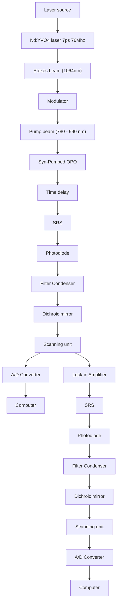

Review

# Shedding new light on lipid functions with CARS and SRS microscopy ☆

Yong Yu, Prasanna V. Ramachandran, Meng C. Wang \*

Huffington Center on Aging, Baylor College of Medicine, Houston, TX, USA

Department of Molecular and Human Genetics, Baylor College of Medicine, Houston, TX, USA

## a r t i c l e i n f o

Article history:

Received 20 December 2013

Received in revised form 12 February 2014

Accepted 17 February 2014

Available online xxxx

Keywords:

Lipid metabolism

Optical imaging

## a b s t r a c t

Modern optical microscopy has granted biomedical scientists unprecedented access to the inner workings of a cell, and revolutionized our understanding of the molecular mechanisms underlying physiological and disease states. In spite of these advances, however, visualization of certain classes of molecules (e.g. lipids) at the sub-cellular level has remained elusive. Recently developed chemical imaging modalities – Coherent Anti-Stokes Raman Scattering (CARS) microscopy and Stimulated Raman Scattering (SRS) microscopy – have helped bridge this gap. By selectively imaging the vibration of a specific chemical group, these non-invasive techniques allow high-resolution imaging of individual molecules in vivo, and circumvent the need for potentially perturbative extrinsic labels. These tools have already been applied to the study of fat metabolism, helping uncover novel regulators of lipid storage. Here we review the underlying principle of CARS and SRS microscopy, and discuss the advantages and caveats of each technique. We also review recent applications of these tools in the study of lipids as well as other biomolecules, and conclude with a brief guide for interested researchers to build and use CARS/SRS systems for their own research. This article is part of a Special Issue entitled Tools to study lipid functions.

© 2014 Elsevier B.V. All rights reserved.

## 1. Introduction

Visualizing individual molecules in vivo and tracking their spatiotemporal dynamics are challenging tasks that are nevertheless critical to understanding normal organismal function and its dysregulation in disease. Modern optical microscopy addresses the challenge most directly by providing the ability to probe living cells. The most commonly employed method, fluorescence microscopy, leverages the characteristic absorption and emission properties of genetically encoded fluorophores, by tagging them to specific targets such as proteins and visualizing their dynamics within a cell. This method provides exquisite sensitivity and high-resolution. Further advances have led to the emergence of imaging modalities like multi-photon excitation, confocal laser scanning, single-molecule microscopy, total internal reflection fluorescence, and super-resolution imaging [1–7]. Despite these advances, fluorescent tagging is often impractical due to the perturbative

Abbreviations: CARS, Coherent Anti-Stokes Raman Scattering; SRS, Stimulated Raman Scattering; CRS, Coherent Raman Scattering; PMT, photomultiplier tube; OPO, optica parametric oscillator; SRL, Stimulated Raman Loss; SRG, Stimulated Raman Gain; TAG, triacylglycerol; CGI-58, comparative gene identification 58; 3D, three-dimensional; DMSO, dimethyl sulfoxide; ps, picosecond; IR, infrared; DC, direct current; N.A., numerical aperture; A/D, analog-to-digital

☆ This article is part of a Special Issue entitled Tools to study lipid functions.

⁎ Corresponding author at: Huffington Center on Aging and Department of Molecular and Human Genetics, Baylor College of Medicine, Houston, TX 77030, USA. Tel.: +1 713 798 1566; fax: +1 713 798 4161.

E-mail address: wmeng@bcm.edu (M.C. Wang).

size and chemical invasiveness of the fluorophore, especially for small molecules such as lipids, metabolites, and drugs. Moreover, labeling or staining with fluorophores is not appropriate for in vivo medical applications.

Alternative imaging techniques based on vibrational microscopy have garnered significant interest in biomedical sciences. These methods do not require fluorescent tags, and rely instead on characteristic vibrational frequencies of various chemical bonds [8]. Vibrational microscopy has been utilized to visualize lipids, protein, DNA, and small metabolites in vivo without the need for labeling [9–13]. Vibrational microscopy encompasses several independent modalities, including infrared microscopy, spontaneous Raman scattering microscopy and Coherent Raman Scattering (CRS) microscopy. Infrared microscopy has grown rapidly in recent years, but it is limited by low spatial resolution due to long infrared wavelengths, and reduced sensitivity due to non-background-free detection (a detailed account of infrared microscopy is available in reference [14]). Here we review the underlying principle of spontaneous Raman scattering and CRS microscopy including CARS and SRS microscopy, and discuss current and potential applications of CRS microscopy in biology and clinical medicine, with an emphasis on lipid research.

## 2. Principle of Raman scattering and CRS microscopy

## 2.1. The Raman effect

When light is incident on a sample, most photons that interact with the molecules in the sample scatter elastically and maintain their incident energy (Rayleigh scattering). However, a very small fraction of photons interact with the vibrational states of the molecules in the sample and scatter inelastically — a phenomenon known as spontaneous Raman scattering or the “Raman effect”, first described in 1928 by C.V. Raman [15,16] (Fig. 1A-1). The chemical bonds may absorb some of the energy of incident “pump” photons $\bf ( \omega _ { \omega } \omega )$ to get excited to a higher vibrational energy level. When this happens, the scattered “Stokes” Raman photons $\left( { \bf { \omega } } _ { \omega _ { s } } \right)$ will be of lower energy than the incident pump photons. Conversely, pump photons may interact with chemical bonds existing at a higher vibrational state; in this case, the scattered photons will be of higher energy than the incident photons, and are termed “anti-Stokes” photons $\left( \mathfrak { c o } _ { \mathsf { a s } } \right)$ (Fig. 1A-1). The difference in frequency between incident and scattered photons is known as the Raman shift (frequency can be determined from energy of the photons by the Planck relation $\mathrm { E } = \mathrm { h } \nu ,$ where E is the energy, ν is the frequency and h is the Planck's constant). Each molecule has a characteristic and quantifiable Raman spectrum determined by its specific combination of chemical bonds. Fig. 2 shows a typical Raman spectrum from a biological sample, and Table 1 summarizes the Raman shifts of some of the common chemical bonds encountered in biological specimens.

## 2.2. Spontaneous versus Coherent Raman Scattering (CRS) microscopy

In spontaneous Raman scattering microscopy, a single laser is inci dent at the pump frequency $( \mathbf { \omega _ { \omega _ { p } } } ) _ { \cdot }$ , and Raman signals are generated at

line chart

| Wavenumber (cm⁻¹) | Raman Intensity |
| --- | --- |
| 681 | ~0.8 |
| 830 | ~0.9 |
| 878 | ~0.7 |
| 1003 | ~0.9 |
| 1093 | ~0.9 |
| 1490 | ~0.9 |
| 1579 | ~0.9 |
| 1666 | ~0.9 |
| 2565 | ~0.3 |
| 2573 | ~0.4 |
| 2575 | ~0.3 |
| 2565 | ~0.2 |
| 2573 | ~0.3 |
| 2565 | ~0.2 |
| 2573 | ~0.3 |
| 2565 | ~0.2 |
| 2573 | ~0.3 |
| 2565 | ~0.2 |
| 2573 | ~0.3 |

Fig. 2. A typical Raman spectrum from a biological sample. A Raman spectrum derived from the P22 virus, showing characteristic vibrational frequencies detected in biological samples. Adapted with permission from reference [68].

Stokes $( \mathbf { \omega } _ { \omega _ { s } } )$ and anti-Stokes $\left( \mathfrak { \omega } _ { \mathrm { a s } } \right)$ frequencies by inelastic scattering (Fig. 1A-1). However, these signals are extremely weak (typical photon conversion efficiency is lower than 1 in 1018) and require long acquisition times, making spontaneous Raman scattering microscopy impractical for live imaging [17,18]. If instead, two coherent pulse laser (picosecond or femtosecond) beams with high peak power at pump $\bf ( \omega _ { \omega } \omega )$ and Stokes $\left( { \bf { \omega } } _ { \omega _ { s } } \right)$ frequencies are used to excite the sample, and the difference in their frequencies is set to match the vibrational frequency of the molecule of interest $( \Omega _ { \mathrm { v i b } } ) ;$ ; the weak Raman signals are strongly amplified by non-linear excitation. This imaging principle serves as the basis of CRS microscopy (Fig. 1A-2 and A-3). In this review, we will focus on two most commonly used CRS modalities — CARS and SRS microscopy.

  
Fig. 1. Principle of Raman scattering and CRS microscopy. $( \mathsf { A } )$ Energy-level diagrams of spontaneous Raman scattering $( \mathsf { A } \mathrm { - } 1 ) ,$ , Coherent Anti-Stokes Raman Scattering (CARS) (A-2) and Stimulated Raman Scattering $\left( { \mathsf { S R S } } \right) \left( { \mathsf { A } } { - } 3 \right)$ . The principle is illustrated schematically through photons and the energy states of chemical bonds they interact with $\mathrm { . \Omega } \Omega _ { \mathrm { V i b } } ,$ the vibrational energy level of the chemical bond; ${ \mathfrak { o } } _ { \mathfrak { p } } ,$ pump photons (orange lines); ${ \bf \varepsilon } ( 0 _ { S } ,$ , Stokes photons (red lines) $; \infty _ { \mathrm { a s } } ,$ anti-Stokes photons (blue lines); virtual state, a short-lived intermediate quantum state between ground and excited states. The color of the lines corresponds to the energy (frequency) of respective photons (blue N orange N red). A-1: Energy-level diagram of spontaneous Raman scattering. Rayleigh scattering, incident photons $\bf ( \epsilon _ { \mathrm { ( o _ { p } ) } } )$ scatter elastically and maintain their incident energy. Raman scattering, a small fraction of incident photons (approximately 1 out of 10 million) exchange energy with the chemical bond. The chemical bond at the ground state can absorb energy from the “pump” photon $( \mathbf { \omega _ { \omega _ { p } } } ) ,$ , being excited to a high-energy vibrational state. As a result, a new “Stokes” photon (ω ) is emitted with less energy than the incident pump photon $( \mathbf { \omega } \mathbf { { \omega } } \mathbf { { \omega } } \mathbf { { \omega } } ( \mathbf { { \omega } } \mathbf { { \omega } } \mathbf { { \omega } } ) = \mathbf { { \omega } } \mathbf { { \omega } } \mathbf { { \omega } } \mathbf { { \omega } } ( \mathbf { { \omega } } \mathbf { { \omega } } ) = \mathbf { { \omega } } \mathbf { { \omega } } \mathbf { { \omega } } \mathbf { { \omega } } \mathbf { { \omega } } \mathbf { { \omega } } \mathrm { { \omega } } ( \mathbf { { \omega } } \mathbf { { \omega } } )$ . An even smaller fraction of incident pump photons can obtain energy from the chemical bond existing in an excited vibrational state. In this case, the chemical bond is back to the low-energy ground state and an “anti-Stokes” Raman photon $\mathbf { \Pi } ( \mathfrak { o } _ { \mathtt { a s } } )$ is emitted with higher energy than the incident photon $( \mathbf { \omega } _ { \mathrm { t } } \mathbf { _ { \mathrm { t } } } ) = \mathbf { \omega } _ { \mathrm { t } } + \Omega _ { \mathrm { v i b } } )$ . A-2: Energy-level diagram of Coherent Anti-Stokes Raman Scattering (CARS). Coherent non-linear multiphoton processes can exponentially enhance the weak Raman scattering effect. When two incident photons at pump (ω ) and Stokes (ω ) frequencies simultaneously interact with the chemical bond $( \Omega _ { \mathrm { v i b } } = \mathbf { 0 } _ { \mathrm { p } } - \mathbf { \omega } \mathbf { 0 } _ { s } )$ , their interaction can stimulate a large fraction of the chemical bonds to the vibrational excitation state coherently. Those excited chemical bonds can further exchange energy with a second pump photon $( \mathbf { \sigma } _ { \mathbf { \mathfrak { o } } _ { \mathfrak { p } } } )$ , resulting in the coherent emission of an anti-Stokes photon $\mathbf { \Pi } ( \mathfrak { o } _ { a s } )$ with higher energy $( \mathbf { \omega } _ { \mathrm { c o } _ { \mathrm { a s } } } = 2 \mathbf { \omega } _ { \mathrm { p } } - \mathbf { \omega } _ { \mathrm { c o } _ { \mathrm { s } } } ) .$ A-3: Energy-level diagram of Stimulated Raman Scattering (SRS). In addition to CARS (A-2), non-linear interaction between the two incident photons and the chemical bonds also results in SRS. During the excitation of the chemical bond to its high-energy vibrational state $( \Omega _ { \mathrm { v i b } } = \mathbf { 0 } _ { \mathrm { p } } - \mathbf { \omega } \mathbf { 0 } _ { s } )$ , energy of the pump photon $( \mathbf { \sigma } _ { \mathbf { \mathfrak { o } } _ { \mathfrak { p } } } )$ is transferred to the chemical bond, resulting in emission of a Stokes photon with lower energy $( \mathbf { \omega } \mathbf { { \omega } } \mathbf { { \omega } } \mathbf { { \omega } } \mathbf { { \omega } } \mathbf { { \omega } } \mathbf { { \omega } } ( \mathbf { { \omega } } \mathbf { { \omega } } \mathbf { { \omega } } ) = \mathbf { { \omega } } \mathbf { { \omega } } \mathbf { { \omega } } \mathbf { { \omega } } \mathbf { { \omega } } \mathbf { { \omega } } \mathbf { { \omega } } \mathbf { { \omega } } \mathbf { { \omega } } \mathbf { { \omega } } \mathbf { { \omega } } \mathbf { { \omega \omega } } \mathbf { { \omega \omega } } ( \mathbf { { \omega } } \mathbf { { \omega } } \mathbf { { \omega } } \mathbf { { \omega } } \mathbf { { \omega \omega } } \mathbf { { \omega \omega } } \mathbf { { \omega \omega } } \mathbf \mathbf { { \omega \omega } } \mathbf \mathbf { { \omega \omega } } \mathbf \mathbf { { \omega \omega } } \mathbf \mathbf { { \omega \omega } } \mathbf \mathbf { { \omega \omega } } \mathbf \mathbf { { \omega \omega } } \mathbf \mathbf { { \omega \omega } } \mathbf \mathbf { { \omega \omega } } \mathbf \mathbf { { \omega \omega } }$ . Therefore, by interacting with each chemical bond, an incident photon at the pump frequency (ω ) will be lost (Stimulated Raman Loss, SRL), and a new photon at the Stokes frequency $( \mathbf { \omega } _ { \omega _ { s } } )$ will be generated (Stimulated Raman Gain, SRG). (B) Diagram of light frequency and intensity in CARS/SRS microscopy. When the frequency difference between pump and Stokes laser beams matches a molecule's vibrational frequency (Ω ), the non-linear multi-photon interacting process (explained in A) generates a new anti-Stokes beam $\mathbf { \Pi } ( \mathfrak { o } _ { a s } )$ at a higher frequency. Simultaneously, the intensity of the Stokes beam and the pump beam experiences an increase (ΔIs, Stimulated Raman Gain, SRG) and decrease (ΔIp, Stimulated Raman Loss, SRL), respectively. (C) Pulse intensity diagram of the SRL detection scheme. The modulation of the Stokes beam at a high frequency (N2 MHz) results in a modulated SRL signal (dashed line box), which can be extracted out of laser noise and further amplified using a lock-in amplifier.

Table 1 Common vibrational bonds and corresponding Raman shifts.

<table><tr><td>Vibrational bond</td><td>Raman shifts (cm-1)</td><td>Indicative of</td></tr><tr><td>C-H2</td><td>2845</td><td>Lipids</td></tr><tr><td>C-H3</td><td>2950</td><td>Proteins, lipids</td></tr><tr><td>O-H</td><td>3250</td><td>Water</td></tr><tr><td>(C= )C-H</td><td>3015</td><td>Unsaturated lipids</td></tr><tr><td>C=C</td><td>1655</td><td>Unsaturated lipids</td></tr><tr><td>Conjugated C=C</td><td>1590</td><td>Retinoic acid</td></tr><tr><td>N-C=O</td><td>1655</td><td>Proteins</td></tr><tr><td>Aryl ring</td><td>1600</td><td>Lignin</td></tr><tr><td>Ring breathing of phenylalanine</td><td>1004</td><td>Proteins</td></tr><tr><td>Asymmetric COC</td><td>1100</td><td>Cellulose</td></tr><tr><td>S=O</td><td>670</td><td>DMSO</td></tr><tr><td>Symmetric dioxy stretching of the phosphate backbone</td><td>1090–1100</td><td>Nucleic acids</td></tr><tr><td>Symmetric phosphodiester stretching and ring breathing modes of pyrimidine bases</td><td>783–790</td><td>Nucleic acids</td></tr></table>

## 2.3. Coherent Anti-Stokes Raman Scattering (CARS) microscopy

CARS microscopy (not to be confused with CRS microscopy described above) utilizes two pulse lasers tuned at pump $\left( \mathbf { \omega } _ { \mathbf { \omega } } _ { \mathbf { \omega } } \right)$ and Stokes (ω ) frequencies. When the difference in their frequencies matches a molecule's vibrational frequency $( \Omega _ { \mathrm { v i b } } )$ , non-linear interaction between pump and Stokes photons causes vibrational resonance of the chemical bonds in the molecule. This excited vibrational chemical bond further interacts with a second pump photon, resulting in the coherent emission of an anti-Stokes photon $( \mathbf { \omega } _ { \mathbf { \omega } } _ { \mathbf { \omega } } ( \mathbf { \omega } _ { \mathbf { \omega } } ( \mathbf { \omega } _ { \mathbf { \omega } } ( \mathbf { \omega } _ { \mathbf { \omega } } ( \mathbf { \omega } _ { \mathbf { \omega } } ( \mathbf { \omega } _ { \mathbf { \omega } } ( \mathbf { \omega } _ { \mathbf { \omega } } ( \mathbf { \omega } _ \mathbf { \omega } _ { \mathbf { \omega } } ( \mathbf \omega _ { \mathbf { \omega } } ( \mathbf \omega _ { \mathbf { \omega } } \mathbf _ { \omega } \mathbf )$ in Fig. 1A-2). The anti-Stokes CARS signal $\mathbf { \Pi } ( \mathfrak { o } _ { \mathtt { a s } } )$ is of higher frequency (shorter wavelength) than incident beams (Fig. 1B), and can be detected by a photomultiplier tube (PMT) after transmitting through a CARS filter (a typical CARS setup shown in Fig. 5). To image a particular chemical, the wavelength of pump laser can be tuned using optical parametric oscillator (OPO) to match the Raman shift of the corresponding chemical bond (see Box 1 for wavelength calculations). However, due to nonlin ear electronic response of the molecules at laser focus, a non-resonant background signal may be generated even in the absence of any vibrational resonance [8,17]. Interference between non-resonant background and resonant signal may distort the CARS spectrum, limiting detection sensitivity and specificity.

## 2.4. Stimulated Raman Scattering (SRS) microscopy

When the energy difference between pump $( \mathbf { \omega _ { \omega _ { p } } } )$ and Stokes $\left( { \bf { \omega } } _ { \omega _ { s } } \right)$ laser beams matches the vibrational frequency of a molecule $( \Omega _ { \mathrm { v i b } } ) _ { \cdot }$ amplification of the Raman signal is also achieved by an alternate process in addition to CARS (Fig. 1A-3 and B). Non-linear interaction between the two photons stimulates the chemical bonds into an excited vibrational state. This results in the disappearance of a pump photon and the creation of a Stokes photon (Fig. 1A-3). The pump and Stokes beams exchange energy; the intensity of the “Stokes” beam experiences a gain (Stimulated Raman Gain, SRG) and the intensity of the “pump” beam experiences a loss (Stimulated Raman Loss, SRL). The SRG or SRL signals can be used as contrast to image target molecules [10] (Fig. 1B). When the energy difference between the pump and Stokes beams does not match the target molecule's vibrational frequency, there is no energy transfer between them, and no SRG or SRL signals. Unlike CARS microscopy, therefore, SRS microscopy does not produce any non-resonant background signal.

Although SRG or SRL signals can be used as unique vibrational contrast to specifically image target molecules, such signals are rather weak $( \Delta \mathrm { I } / \mathrm { I } < 1 0 ^ { - 4 }$ , even lower than laser noise), and detecting them poses a significant challenge. Fortunately, laser noise primarily occurs at low frequencies (less than 1 MHz, see Fig. 1c in reference [8]). SRS microscopy can thus take advantage of high-frequency (over 2 MHz) modulation to extract small SRG or SRL signals from background laser noise. As shown in Fig. 1C, the Stokes beam is modulated at a frequency over 2 MHz, whereas the incident pump beam remains unmodulated. Upon interaction with samples, the SRL or SRG signal generated from the pump or Stokes beam, respectively, occurs at the same frequency of modulation, and the SRL signal (dashed line box in Fig. 1C) can be specifically picked up, de-modulated and amplified via a lock-in amplifier. Crucially, SRL (or SRG) signal intensity is directly proportional to the concentration of the target molecule in the sample, allowing for straightforward quantification [10] (see Box 2). A typical setup for SRS microscopy is shown in Fig. 5.

## 3. Coherent Raman Scattering microscopy in lipid research: applications and advantages

The obesity epidemic is of enormous concern to public health. Obesity has replaced malnutrition as the most common cause of dietrelated mortality (Global Burden of Disease Study 2010), and it is a significant risk factor for developing type 2 diabetes, cardiovascular disease and certain types of cancer [19–22]. The worldwide prevalence of obesity has triggered significant interest in unraveling the regulatory mechanism of lipid metabolism and lipid droplet homeostasis [23]. However, lipids lack intrinsic fluorescence, and tagging them with fluorophores is nontrivial. Imaging techniques for sensitive, specific and quantitative detection of lipid molecules are needed to foster rapid advances in the field. To this end, CRS microscopy is an exciting alternative and complementary technique to traditional lipid analysis methods (see comparison in Table 2).

Lipid droplets have a neutral lipid core consisting primarily of triacylglycerols (TAGs) and cholesteryl esters, surrounded by a phospholipid monolayer. The three fatty acid chains comprising a TAG molecule are 14–24 carbons in length, and may be saturated (made entirely of CH groups) or unsaturated (containing one or more C\_C groups). Phospholipids, on the other hand, contain two fatty acid chains. The C\H vibration generates a characteristic and strong CRS signal, which enables easy and specific detection of lipid molecules. In the past decade, CRS systems have been adopted to the study of lipids in the fields of biology, nutrition and medicine [8,17]. Recent work in applying this system to the genetically tractable model organism Caenorhabditis elegans has led to the uncovering of several critical and previously unknown regulators of lipid metabolism [24]. In this section, we will review some of the most commonly applied research strategies based on CRS microscopy in lipid research, and discuss their associated advantages.

## 3.1. High-resolution and three-dimensional imaging of lipid molecule distribution

The spatial resolution of CRS microscopy is diffraction limited and comparable to that of two-photon fluorescence (about 300 nm in the x–y plane and about 1000 nm in the z-axis, depending on objectives and wavelengths) [25–27], ensuring the visualization of lipid molecules at subcellular levels. In living cells and organisms, CRS microscopy is capable of revealing individual lipid droplets, including nascent droplets that may be particularly small [28,29]. In 2003, Nan et al. first used CARS microscopy to monitor the cell differentiation process in 3T3-L1 preadipocytes. It was found that there was an initial clearance of lipid droplets at the early stage of differentiation. Further along the differentiation process, the cells began to reaccumulate lipid droplets in the cytoplasm in a largely unsynchronized manner [28].

Comparison of lipid detection methods. Table 2

<table><tr><td></td><td>TLC</td><td>GC/LC-MS</td><td>Lipid dyes (e.g. oil red)</td><td>Fluorescent analogs (e.g. BODIPY)</td><td>CARS</td><td>SRS</td></tr><tr><td>Quantitative</td><td>Yes/semi</td><td>Yes</td><td>Semi</td><td>Semi</td><td>Semi</td><td>Yes</td></tr><tr><td>Spatial resolution</td><td>-</td><td>-</td><td>Low</td><td>High</td><td>High</td><td>High</td></tr><tr><td>In vivo analysis</td><td>No</td><td>No</td><td>Yes (but fixation required)</td><td>Yes (vital dyes may stain non-specifically in C. elegans [34-37])</td><td>Yes (live imaging)</td><td>Yes (live imaging)</td></tr><tr><td>Detection sensitivity</td><td>Low</td><td>Medium</td><td>Low</td><td>High</td><td>Medium</td><td>High</td></tr><tr><td>Compositional analysis</td><td>Semi</td><td>Yes</td><td>No</td><td>No</td><td>Semi</td><td>Semi (better than CARS)</td></tr><tr><td>Required sample amount</td><td>Large</td><td>Large</td><td>Medium</td><td>Medium</td><td>Small</td><td>Small</td></tr><tr><td>Cost</td><td>Low</td><td>Moderate (equipment available at most research institutes)</td><td>Low</td><td>Moderate</td><td>High equipment cost, minimal experimental cost</td><td>High equipment cost, minimal experimental cost</td></tr><tr><td>Experiment duration</td><td>Several hours (extensive sample preparation)</td><td>Several hours (extensive sample preparation)</td><td>Few hours (long staining time)</td><td>Few hours (long staining time)</td><td>Few minutes</td><td>Few minutes</td></tr><tr><td>Major advantages</td><td>Ability to separate lipid mixtures</td><td>Detailed compositional analysis</td><td>Easy access</td><td>Easy access; high sensitivity</td><td>Noninvasive imaging; high resolution; high throughput</td><td>All advantages of CARS; quantitative; selective imaging of chemical bonds</td></tr><tr><td>Major limitations</td><td>No spatial information</td><td>No spatial information</td><td>Inconsistency between samples; indirect quantification; no detection specificity</td><td>Lipid analogs are not identical to lipids; only a handful of analogs are available.</td><td>Expensive equipment; non-resonant background; autofluorescence interference; indirect quantification</td><td>Expensive equipment; not commercially available</td></tr></table>

Similar to two-photon excited fluorescence microscopy imaging, CARS/SRS signals exhibit nonlinear dependence on incident photon in tensity, and are derived only from the laser focal plane where photon density is highest. Therefore, CRS microscopy has intrinsic 3D optical sectioning capacity without the need for a confocal pinhole [26,30]. Furthermore, CRS microscopy uses near-infrared lasers (typically 817 nm pump and 1064 nm Stokes for lipid imaging), allowing for high penetration depths of up to 1 mm, depending on sample, objective and laser [25]. This is particularly useful for imaging the spatial distribution of lipid molecules in thick tissue samples such as mouse skin, liver and brain [8,17,26]. In their first report on the technology, Freudiger et al. used SRS microscopy to visualize lipid distribution along varying depths of mouse skin, and to monitor DMSO penetrating into the skin [26].

## 3.2. High sensitivity and specificity to image different lipid molecules

CARS and SRS dramatically amplify the extremely weak Raman effect. Compared to spontaneous Raman microscopy, the sensitivity of CRS microscopy is orders of magnitude greater. It was demonstrated that CARS microscopy is capable of directly visualizing phospholipid bilayers [31,32].

Lipid molecules have wide-ranging structural diversity tightly asso ciated with their biological functions. However, canonical lipid imaging methods using dye staining or fluorescent analogs currently lack the ability to distinguish different lipid classes. Particularly in C. elegans, several groups have demonstrated that vital-dye staining does not correlate well with lipid levels or lipid localization [33–36]. CRS microscopy, on the other hand, can image specific lipid molecules based on differences in their fatty acid chains. For example, unsaturated lipids contain C\_C bonds whose characteristic vibrational frequency at 3015 cm−1 can be specifically imaged by CRS microscopy [17,26]. Another example is retinoic acid, the conjugated C\_C bonds of which have vibrational frequency at 1590 cm−1 and can be visualized in vivo by SRS microscopy [26]. As an application of this principle, Freudiger et al. used the SRS system to visualize eicosapentaenoic acid (EPA) incorporating into lipid droplets of cultured cells, as well as retinoic acid penetrating into mouse epidermis [26]. CRS microscopy thus provides a unique tool to specifically track lipid molecules in vivo, and unravel the connection between spatiotemporal dynamics of various lipid molecules and their biological activities.

## 3.3. Fast, quantitative, label-free imaging for high-throughput screens

Imaging by CRS microscopy is based on intrinsic molecular vibrations within a sample, and circumvents the need for extrinsic labels. Transparent samples, such as cells and immobilized whole organisms like C. elegans, can be directly imaged without additional sample preparation steps; worms can even be recovered after imaging. This non-invasive approach allows for chemical imaging under the most physiological conditions, providing highly reliable and repeatable results. Furthermore, CARS and SRS signals are amenable to direct quantification of lipid levels. Levels thus obtained are comparable to those derived from standard biochemical methods [24,37]. For these reasons, CRS microscopy may be particularly useful for high-throughput screening. In our previous studies, we have employed SRS microscopy to screen more than 300 genes coding for cell surface and nuclear hormone receptors by RNA interference (RNAi) in C. elegans, and identified several novel and conserved genetic regulators of total lipid storage [24]. Recent instrumental advances in CARS [38] and SRS [39] microscopes have further improved imaging speeds up to video-rate at 25 frames/s. In addition to reducing acquisition time and accelerating

## Box 1

Utilizing Raman shift to calculate the wavelength used in CRS microscopy.

Raman shifts are typically expressed in wavenumbers, which have units of inverse length. As shown in the following equation:

$$
\Delta \omega = \left(\frac {1}{\lambda p} - \frac {1}{\lambda s}\right)
$$

Δω is the Raman shift expressed in wavenumber, λp is the wavelength of the pump beam, and λs is the wavelength of the Stokes beam. Most commonly, the unit for expressing wavenumber is inverse centimeter (cm−1 ), whereas wavelength is commonly expressed in units of nanometer (nm). The equation below can scale for this unit conversion:

$$
\Delta \omega (\mathrm{cm} ^ {- 1}) = \left(\frac {1}{\lambda p (\mathrm{nm})} - \frac {1}{\lambda s (\mathrm{nm})}\right) \times \frac {(1 0 ^ {7} \mathrm{nm})}{(\mathrm{cm})}.
$$

In common CRS microscopy, the Raman shift of the target chemical is usually known (e.g. in Table 1), and the wavelength of the Stokes beam is typically fixed at 1064 nm. Based on Eq. (2), the wavelength of the pump beam (tunable with an optical parametric oscillator, OPO) can be calculated as follows:

$$
\lambda p (\mathrm{nm}) = \frac {1}{\Delta \omega \left(\mathrm{cm} ^ {- 1}\right) \times \frac {(\mathrm{cm})}{\left(1 0 ^ {7} \mathrm{nm}\right)} + \frac {1}{\lambda s (\mathrm{nm})}}.
$$

These calculations may also be performed using a free online/ smartphone tool, APE calculator (http://www.ape-berlin.de/en/ page/calculator).

high-throughput screens, this development opens up a new avenue to track the dynamic regulation of lipid molecules [28,40].

## 3.4. Compatible with fluorescence microscopy (for dual imaging of lipids and proteins)

CRS chemical imaging microscopy can be combined with twophoton excited fluorescence microscopy or confocal fluorescence microscopy for simultaneous Raman and fluorescence imaging. In principle, this combination is a particularly useful strategy for the study of lipid–protein interactions within the cell. For example, lipid droplets consist of a neutral lipid core that is surrounded by a phospholipid monolayer decorated with a wide variety of proteins. CRS microscopy would reveal the spatiotemporal distribution of lipids, while tagged lipid–droplet-associated proteins would be visualized by fluorescence microscopy. This combinatory technique was

## Box 2

Linear quantification in SRS.

SRS signal (SRL or SRG) strength S is proportional to the product of the pump laser intensity ${ \mathsf I } _ { { \mathsf P } } ,$ the Stokes laser intensity $\mathsf { I } _ { \mathsf { S } } ,$ the analyte concentration [c], and the specific molecular cross section of the analyte σ. For the corresponding optical process in a specific analyte: S ∝ [c] × σ × I × I . Thus SRS signals can be applied for direct linear quantification of analyte concentration.

employed by Yamaguchi et al. who used a CARS-coupled multiphoton fluorescence microscopy system to show that lipid droplet associated protein CGI-58 facilitates lipolysis of lipid droplets, but is not involved in the vesiculation of lipid droplets caused by hormonal stimulation [29]. Nan et al. used a similar combinatorial system to reveal a possible interaction between lipid droplets and mitochondria in adrenal cortical Y-1 cells [40].

## 3.5. Low phototoxicity, long-term imaging capacities

Compared to spontaneous Raman microscopy, CRS systems use near-infrared wavelength lasers, and do not require long exposure time to acquire strong signals. By not relying on fluorescent probes, CRS microscopy also avoids the issue of photobleaching. Furthermore, unlike in fluorescence microscopy imaging, the nonlinear process of CARS/SRS occurs at the ground electronic state, resulting in minimal sample photo-damage [38], especially when picosecond pulses are used to reduce multi-photon absorption effects. Taken together, CRS microscopy exhibits low photodamage, low phototoxicity and no photobleaching, enabling a long-term reliable imaging modality. CARS microscopy has already been applied to the imaging of myelin sheath dynamics, as well as to study demyelination and its associated disease processes [41–45]. Myelin membranes are enriched for lipids, and the high-density CH groups produce a strong CARS signal. In another application, Fu et al. used a CARS microscope for long-term imaging (up to 5 h) of paranodal myelin splitting and retraction related to glutamate excitotoxicity [42].

## 4. Limitations and recent advances in CRS microscopy

CARS microscopy and SRS microscopy are powerful and increasingly popular tools for lipid research. As with any rapidly developing technology, there are certain caveats. Here we summarize several aspects that currently preclude a broader application of these technologies, and discuss recent improvements to address some of these limitations.

## 4.1. Accessibility and commercialization of CRS systems

The CRS microscopy system relies on multi-photon laser scanning microscopy and ultra-fast pulse laser and optical parametric oscillators (OPOs). These components are expensive and bring the cost of the entire system to at least five hundred thousand US dollars. Moreover, system setup is a complicated, multi-step process, requiring expertise in physics and optics. Until recently, researchers were required to build the system by themselves. Commercial CARS microscopes, recently introduced by Olympus (Japan) in 2009 and Leica Microsystems (Germany) in 2010, are significant additions to the field. The usercentric design of these commercial systems broadens their applicability to a wider range of scientists. The Olympus CARS system can be upgraded from their standard multi-photon laser scanning microscopy system equipped with femtosecond lasers (the spectral resolution of which is not as good as picosecond lasers, but should be sufficient for imaging lipids whose spectral peak is wide enough). Upgrading pre-existing Olympus multi-photon systems may be less expensive and more convenient. The SRS system was invented more recently, and, due to complexities in laser modulation and signal detection, is not available commercially at present (we anticipate its availability in the near future).

## 4.1.1. Recent advances in fiber lasers

Although commercially available CRS microscopy systems ease the process of setup and usage, they are still very expensive. Emerging fiber lasers provide portable, robust, low-cost turnkey operation for multi-photon fluorescence microscopy systems. Fiber lasers for CRS systems are currently being developed for widespread use, and several groups have included them in CARS microscopy. However, higher laser noise from existing fiber lasers precludes their use in SRS microscopy at the moment [46–51].

## 4.2. Spectral CRS systems to improve detection specificity

CRS microscopy makes use of two pulsed laser beams with an energy difference tuned to target the vibrational frequency of a certain chemical bond. As a result, only one vibrational frequency can be imaged each time — sufficient to specifically visualize a molecule if it has a characteristic chemical bond or group not found in other molecules in the sample. However, in the absence of a unique functional group, regular CRS microscopy cannot directly distinguish the target molecule from others carrying the same moiety. Although the wavelength of pump laser can be tuned with an OPO to image other chemical bonds, doing so would take several minutes each time. To overcome this limitation, several multi-color SRS systems have been recently developed, which image multiple vibrational frequencies simultaneously [13,52–54]. Furthermore, hyperspectral SRS systems have been developed to achieve a spectrum of SRS images within an $\sim 3 0 0 ~ \mathrm { c m } ^ { - 1 }$ range of vibrational frequencies [55–58] (a brief summary is listed in Table 3). These advances are particularly important for applications that deal with biological samples, given that many biomolecules share common chemical bonds or groups.

## 4.3. Improvements to imaging speed to achieve real-time imaging

Whereas fluorescence imaging can achieve single molecule detection, the coherent Raman effect is still much weaker. Consequently, the imaging speed of CRS microscopy is slower than that of fluorescence microscopy. The first 3D CARS microscope developed in 1999 required nearly 30 min to acquire a single image [30]. Significant improvements have since been made to increase detection sensitivity and imaging speed in the past 15 years. Today, the image acquisition rate of the CARS system is limited only by the speed of the scanning unit of the laser-scanning microscope. Rate of imaging in SRS microscopy, however, is additionally limited by the processing speed of the lock-in amplifier. Using a commercially available SR844 lock-in amplifier (Stanford Research, USA), SRS systems can image at 30 μs/pixel (about 8 frames/s for $5 1 2 \times 5 1 2$ images). Saar et al. documented an imaging speed up to video-rate (0.1 μs/pixel, 30 frames/s for 512 × 512 images) using a home-built lock-in amplifier with SRS microscopy [39]. The more recent and commercially available HF2LI lock-in amplifier (Zurich Instruments, Switzerland) also enables high-speed SRS imaging at 0.8 μs/pixel (about 5 frames/s for $5 1 2 \times 5 1 2$ images).

## 4.4. Detection limit

Coherent Raman Scattering signals are still significantly weaker than fluorescent signals, though dramatic improvements have been achieved using SRS. As described in Box 2, the detection limit is related to molecular cross section, which is fixed for a specific molecule, as well as pump and Stokes laser powers. Typical detection limits for SRS (at average laser power of b40 mW for each laser) are 50 μM for retinol (see the standard curve in Fig. 1E of reference [26]), 5 mM for methanol solutions (see the standard curve in Supplementary Fig. 5 of reference [26]) and about 1 mM for palmitic acid solutions (see the standard curve in Fig. 3B). Thus, CRS microscopy is well-suited for specific detection of molecules that are relatively abundant at the focal plane. For instance, CRS microscopy can provide robust images of individual lipid droplets with high local lipid concentration, but cannot easily visualize free fatty acids at lower concentrations outside lipid droplets. An increase in pump and Stokes laser powers on the focal plane would effectively increase the CRS signal, but may damage the sample and saturate the detectors. Improvements to detection limit are expected to tackle this challenge in the near future.

## 5. Comparing SRS to CARS

## 5.1. Linear quantification ability

As with fluorescence imaging, the local concentration of lipid molecules can be extrapolated from the pixel intensity of both CARS and SRS images (Fig. 3). In theory, the CARS signal is proportional to the square of the concentration of the target molecule, but this signal may include non-resonant background, image artifacts or autofluorescence when imaging biological samples [8,17,24,26]. SRS images are free from non-resonant background and most imaging artifacts, allowing direct and reliable quantification (see Fig. 3B for the linear dependence of SRS signals on the concentration of palmitic acid in DMSO solution, and references [8,26] for the standard curve of retinol). In C. elegans, SRS quantification of in vivo lipid levels in wild type, genetically obese and lean worms all closely matches those obtained by biochemical thin-layer chromatography–gas chromatography (TLC/ GC) analysis [24].

## 5.2. Spectrum accuracy and reliability

Non-resonant background not only complicates quantification, but also distorts the CARS spectrum. This may not be a major hurdle for imaging lipids since the CH peak is sufficiently wide [17]. SRS spectra are essentially identical to spontaneous Raman spectra [26] and SRS microscopy allows simple spectroscopic identification based on Raman literature (Table 1) even in the fingerprint region $( 5 0 0 \mathrm { c m } ^ { - 1 } - 1 8 0 0 \mathrm { c m } ^ { - 1 } )$ [11]. This advantage is critical for imaging molecules with complex chemical structures (see details in Section 6.1), such as DNA [11] or retinoic acid [26].

## 5.3. Higher signal-to-noise-ratio and sensitivity

Non-resonant background not only distorts the CARS spectrum, but also limits the detection sensitivity of CARS microscopy [17]. By contrast, fast high-frequency modulation (N2 M Hz) and lock-in demodulation phase detection systems in SRS microscopy can remove all laser noise and intensity variations during imaging, and allow for shot-noise-limited detection sensitivity [26].

Table 3

<table><tr><td>Authors</td><td>Methods</td><td>Reference</td></tr><tr><td colspan="3">Multi-color SRS</td></tr><tr><td>Fu et al.</td><td>Modulation multiplex</td><td>[52]</td></tr><tr><td>Lu et al.</td><td>Grating-based pulse shaper for excitation and grating-based spectrograph for detection</td><td>[53]</td></tr><tr><td>Kong et al.</td><td>Rapidly tunable optical parametric oscillator</td><td>[54]</td></tr><tr><td colspan="3">Hyperspectral SRS</td></tr><tr><td>Freudiger et al.</td><td>Spectrally tailored excitation</td><td>[13]</td></tr><tr><td>Ozeki et al.</td><td>Intrapulse spectral scanning through femtosecond grating-based pulse shaper</td><td>[55]</td></tr><tr><td>Fu et al.</td><td>Chirped femtosecond lasers and temporal delay scanning</td><td>[56]</td></tr><tr><td>Zhang et al.</td><td>Intrapulse spectral scanning through femtosecond grating-based pulse shaper</td><td>[57]</td></tr><tr><td>Wang et al.</td><td>Intrapulse spectral scanning through femtosecond grating-based pulse shaper and time-lens source</td><td>[58]</td></tr></table>

A  

text_image

Normal liver
High
Relative fat level
Low

natural_image

Microscopic image of a fatty liver with glowing orange-red particles against a dark background (no text or symbols)

natural_image

Microscopic image of Drosophila fat body tissue showing orange-stained cellular structures (no text or symbols)

B  

line chart

| Concentration [M] | Average pixel intensity |
| ----------------- | ------------------------ |
| 0.0               | 0                        |
| 0.2               | 500                      |
| 0.4               | 1000                     |
| 0.6               | 1500                     |
| 0.8               | 2000                     |
| 1.0               | 2500                     |

Fig. 3. Linear quantification ability of SRS microscopy. $( \mathsf { A } )$ Sample images of lipid droplets in the liver of a mouse fed a regular chow diet, fatty liver induced by tunicamycin, and Drosophila larval fat body (from left to right). Pixel intensity indicates local lipid concentration. (B) Standard curve of palmitic acid concentrations in DMSO solution plotted against average pixel intensity of SRS images. The curve exhibits strong linear dependence and a wide linear range

## 6. Applications of CARS/SRS microscopy beyond lipid research

## 6.1. Imaging biological molecules other than lipids

CRS microscopy relies on matching the Raman shift to a molecule's vibrational frequency; its applicability is therefore not limited to any particular chemical bond (e.g. CH ). By appropriately tuning laser wavelengths, CRS microscopy can be used to image several different chemicals. Recent improvements to the CARS system, such as maximum entropy method (MEM) analyses, polarization-sensitive CARS, timeresolved CARS, phase sensitive detection and frequency modulation CARS, partially circumvent the problem of non-resonant background and have led to broad applications of CARS microscopy in metabolic and biomedical imaging (reviewed in references $[ 1 7 , 5 9 , 6 0 ] ;$ ; here we focus on SRS). SRS spectra are identical to spontaneous Raman spectra, and SRS microscopy can be directly employed to image biomolecules (Raman shifts summarized in Table 1). Fig. 4 shows the characteristic SRS images from a single C. elegans organism, using different Raman shifts to visualize water, total lipids, unsaturated lipids, and proteins.

## 6.1.1. Proteins

Protein and lipid molecules are both rich in CH groups, and imaging the $\mathrm { C H } _ { 3 }$ moiety at a Raman shift o $\mathsf { f } 2 9 5 0 \mathsf { c m } ^ { - 1 }$ provides both protein and lipid signals. Imaging $\mathrm { C H } _ { 2 }$ at a Raman shift of 2845 cm−1 , on the other hand, captures mostly lipid signals. Thus, the protein image can be obtained indirectly by subtracting the $\mathrm { C H } _ { 2 }$ lipid signal contribution from CH -derived images [61,62]. In addition, protein molecules can be imaged at a Raman shift of 1655 cm−1 , where the signal arises from the N $\ b { C } = 0$ (Amide I) bonds in proteins. Although the Raman signal from C C vibrations in unsaturated lipids is also at 1655 cm−1 , it usually does not interfere with the amide signal as the concentration of unsaturated lipids outside lipid droplets is below the detection sensitivity of SRS microscopy [11,12]. An alternative method is to image the Raman peak at 1004 cm−1 arising from ring breathing of phenylalanines in proteins [11]. However, this signal is much weaker compared to $\mathrm { C H } _ { 3 }$ or Amide I bonds and requires higher laser power on samples [11].

Recently, Wei et al. combined SRS microscopy with deuteriumlabeled amino acids to image newly synthesized proteins in live mammalian cells [9]. The newly synthesized proteins incorporate deuterium-labeled amino acids, and are visualized by using the unique vibrational signature of the C\D bond (Raman shift at $2 1 3 3 \mathrm { c m } ^ { - 1 } ) .$ . This new approach is simple, requires no fixation or staining, and results in minimal cell perturbation. The results from this work highlighted rapid protein turnover in nucleoli and neurites of N2A cells (neuronlike cells) during differentiation.

## 6.1.2. Nucleic acids

Nucleic acids can be imaged with SRS microscopy using Raman signals at the region of $7 8 3 { - } 7 9 0 ~ \mathrm { c m } ^ { - 1 }$ and at $1 0 9 9 \mathrm { c m } ^ { - 1 }$ , which arise from the superposition of symmetric phosphodiester stretching and ring breathing modes of pyrimidine bases, and symmetric dioxy stretching of the phosphate backbone, respectively (Table 1). These signals are quite weak, requiring strong laser power and a well-optimized system [11]. Recently, Zhang et al. successfully imaged nucleic acids at 783–790 cm−1 in a single cell of Drosophila larval salivary gland and in individual mammalian cells [11].

## 6.1.3. Water

Due to its high abundance and strong signal, water can be easily imaged at 3250 cm−1 based on the O\H bond stretching vibration. Roeffaers et al. demonstrated the use of SRS microscopy to separately image the composition of water, lipids and proteins in commercial food products, including mayonnaise, cheese, and soy-based drinks [12].

  
Fig. 4. SRS images of water, total lipids, unsaturated lipids, and proteins in C. elegans.

## 6.1.4. Drugs

Tracking the delivery and clearance of drugs in vivo is particularly challenging, given their small size, sensitive chemical properties and fast dynamics. Many drugs have unique chemical bonds or groups, making them well-suited targets for SRS microscopy. In the first report of SRS microscopy, Freudiger et al. successfully used this technique to track the delivery of dimethyl sulfoxide (DMSO) and retinoic acid into fresh mouse skin. In situ 3D images of DMSO at 670 cm−1 and retinoic acid at 1570 cm−1 clearly showed the drugs penetrating the mouse skin [26].

## 6.2. Potential applications of CARS/SRS microscopy in clinical diagnosis

Lesions often show chemical and/or morphological differences from healthy tissue. With its many advantageous features (non-destructive, capable of deep penetration and high resolution, and chemical specificity), CRS microscopy may be ideally suited for tissue imaging and potential clinical diagnosis. Several review articles have summarized the application of CARS microscopy in imaging tissue samples and discussed its potential use in clinical diagnosis [17,59,60]. SRS microscopy has emerged to supersede CARS microscopy in several aspects, and is expected to be even better poised for clinical application.

Freudiger et al. used SRS microscopy to image $\mathrm { C H } _ { 2 }$ and $\mathrm { C H } _ { 3 }$ vibrations of lipids and proteins, together with two-photon absorption imaging of hemoglobin in fresh-frozen tissue sections from mice models of invasive glioma, breast cancer metastases, stroke, and demyelination. Strikingly, these stain-free histopathological images provided very similar results to those obtained by conventional hematoxylin & eosin (H&E) staining [62]. These findings suggest that SRS microscopy can generate high quality histological images for clinical diagnosis without the need for tissue fixation, sectioning or staining.

Ozeki et al. used a hyperspectral SRS microscopy system to obtain spectral images of mouse intestinal villi, ear skin, as well as rat livers [55]. Since hyperspectral SRS microscopy acquires images spanning a 300 $\mathrm { c m } ^ { - 1 }$ range of vibrational frequencies, much more detailed spectral information can be rapidly obtained from these spectral images, making it a particularly useful approach for clinical diagnostic applications.

In addition, several research groups have applied CARS endoscopy [63–65] and SRS endoscopy [66] to image various organs directly in live animals. Further improvements to these endoscopy systems would offer exciting new technology platforms for in vivo histopathological imaging and non-invasive clinical diagnostics in the near future.

## 7. Utilizing CRS microscopy for your own research

CRS microscopy systems have rapidly evolved since their inception, and are now employed in the imaging of an ever-expanding set of biomolecules. The technology may be readily adapted to novel lines of investigation. Here we provide a brief outline of the setup of a CRS system.

## 7.1. Laser source

The picosecond Nd:YVO4 laser, coupled with an optical parametric oscillator (OPO) is widely used in CRS systems [17] (red dashed box in Fig. 5). A delay stage and an autocorrelator are used to achieve precise spatial and temporal overlap of the pump and Stokes laser beams [67]. For SRS microscopy, the Stokes (for SRL imaging) or pump (for SRG imaging) beam is modulated at high frequency (N2 MHz) using an acousto-optic modulator or electro-optic modulator [26].

## 7.2. Microscope with laser scanning unit

The optical components of CARS/SRS microscopes need to be optimized for infrared (IR) lasers. The objectives require achromatic compensation, high numeric aperture (N.A.), and high near-IR throughput.

## 7.3. Mirror and filter sets

Near-IR mirrors and a set of telescopes are required to deliver the laser beams from the laser box to the scanning unit of the microscope and fit the laser beam size to the back aperture of the objective. For CARS signal detection, a CARS filter or dichroic mirror is used to block the pump and Stokes incident light and allow the transmission of weak anti-Stokes signals to the detector. An SRS system is equipped with a different filter to selectively transmit the pump beam (for SRL detection) or Stokes beam (for SRG detection).

## 7.4. Detector

CARS signals can be detected at either forward (F-CARS) or back ward (E-CARS) direction [17]. Multi-alkali photo multiplier tubes (PMTs) are widely used in CARS systems. For an SRS microscope, a silicon (for SRL detection) or InGaAs (for SRG detection) photodiode with a large area (typically around 1 cm2 ) is used for light detection. Reverse DC voltage is applied to the photodiode for reducing capacitance and increasing response speed [26]. The transmission light from the sample is projected to the photodiode through a telescope (for adjusting beam size and avoiding beam movement) and a band-pass filter (to block the Stokes beam for SRL/pump beam for SRG) [26]. After prefiltering low- and high-frequency electronic noises, a lock-in amplifier is used to demodulate and amplify the weak SRL or SRG signals.

flowchart

Fig. 5. Schematic of a typical CARS/SRS microscopy system. Components within the red dashed box comprise the laser source. Components of the SRS system are labeled in blue. The green mirrors are dichroic mirrors/beam-splitters.

Both CARS and SRS systems require an A/D converter (usually pre-installed in a confocal system) to convert electric analog signals to digital signals for input into a computer.

## 8. Prospection

The past fifteen years have witnessed the birth and rapid growth of CRS microscopy technologies. Compared to conventional methods, CRS microscopy is a highly attractive and advantageous tool in the study of lipid biology. We expect this modality to gain widespread use and open new avenues to biological and biomedical research.

## Acknowledgements

We would like to thank A.S. Ozseker, A.K. Folick, B. Han, D. Fu, W. Min, L. Wei, K.H. Mak, A. Chai and J.N. Sowa for critical reading and helpful discussions. M.C.W. is supported by grants from the National Institutes of Health (R01AG046582, R00AG034988) and the Ellison Medical Foundation.

## References

[1] W. Denk, J.H. Strickler, W.W. Webb, Two-photon laser scanning fluorescence microscopy, Science 248 (1990) 73–76.  
[2] A. Ustione, D.W. Piston, A simple introduction to multiphoton microscopy, J. Microsc. 243 (2011) 221–226.  
[3] X.S. Xie, J.K. Trautman, Optical studies of single molecules at room temperature, Annu. Rev. Phys. Chem. 49 (1998) 441–480.  
[4] E. Betzig, G.H. Patterson, R. Sougrat, O.W. Lindwasser, S. Olenych, J.S. Bonifacino, M.W. Davidson, J. Lippincott-Schwartz, H.F. Hess, Imaging intracellular fluorescent proteins at nanometer resolution, Science 313 (2006) 1642–1645.  
[5] S.T. Hess, T.P.K. Girirajan, M.D. Mason, Ultra-high resolution imaging by fluorescence photoactivation localization microscopy, Biophys. J. 91 (2006) 4258–4272.  
[6] B. Huang, W. Wang, M. Bates, X. Zhuang, Three-dimensional super-resolution imaging by stochastic optical reconstruction microscopy, Science 319 (2008) 810–813.  
[7] S.W. Hell, Far-field optical nanoscopy, Science 316 (2007) 1153–1158.  
[8] W. Min, C.W. Freudiger, S. Lu, X.S. Xie, Coherent nonlinear optical imaging: beyond fluorescence microscopy, Annu, Rey, Phys, Chem, 62 (2011) 507530.  
[9] L. Wei, Y. Yu, Y. Shen, M.C. Wang, W. Min, Vibrational imaging of newly synthesized proteins in live cells by stimulated Raman scattering microscopy, Proc. Natl. Acad. Sci. U. S. A. 110 (2013) 11226–11231.  
[10] C.W. Freudiger, W. Min, B.G. Saar, S. Lu, G.R. Holtom, C. He, J.C. Tsai, J.X. Kang, X.S. Xie, Label-free biomedical imaging with high sensitivity by stimulated Raman scattering microscopy, Science (New York, N.Y.) 322 (2008) 1857–1861.  
[11] X. Zhang, M.B. Roeffaers, S. Basu, J.R. Daniele, D. Fu, C.W. Freudiger, G.R. Holtom, X. Sunney Xie, Label-free live-cell imaging of nucleic acids using stimulated Raman scattering microscopy, ChemPhysChem 13 (2012) 1054–1059.  
[12] M.B. Roeffaers, X. Zhang, C.W. Freudiger, B.G. Saar, M. van Ruijven, G. van Dalen, C. Xao, X. Xe, Labelee maging of bomolecles in food product using stimulated Raman microscopy, J. Biomed. Opt. 16 (2011) (021118-021118-021116).  
[13] C.W. Freudiger, W. Min, G.R. Holtom, B. Xu, M. Dantus, X.S. Xie, Highly specific label-free molecular imaging with spectrally tailored excitation-stimulated Raman scattering (STE-SRS) microscopy, Nat. Photonics 5 (2011) 103–109.  
[14] I.W. Levin, R. Bhargava, Fourier transform infrared vibrational spectroscopic imaging: integrating microscopy and molecular recognition, Annu. Rev. Phys. Chem. 56 (2005) 429–474.  
[15] C.V. Raman, A new radiation, Indian J. Phys. 2 (1928) 387–398.  
[16] C.V. Raman, A change of wave-length in light scattering, Nature 121 (1928) 619.  
[17] C.L. Evans, X.S. Xie, Coherent anti-stokes Raman scattering microscopy: chemical imaging for biology and medicine, Annu Rev Anal Chem (Palo Alto, Calif) 1 (2008) 883–909.  
[18] L. Opilik, T. Schmid, R. Zenobi, Modern Raman imaging: vibrational spectroscopy on the micrometer and nanometer scales, Annu Rev Anal Chem (Palo Alto, Calif) 6 (2013) 379–398.  
[19] W.W. de Herder, C. Eng, Obesity, diabetes mellitus, and cancer, Endocr. Relat. Cancer 19 (2012) E5–E7.  
[20] J.M. Chan, E.B. Rimm, G.A. Colditz, M.J. Stampfer, W.C. Willett, Obesity, fat distribution, and weight gain as risk factors for clinical diabetes in men, Diabetes Care 17 (1994) 961–969.  
[21] G.A. Colditz, W.C. Willett, A. Rotnitzky, J.E. Manson, Weight-gain as a risk factor for clinical diabetesmellitus in women, Ann, Intern, Med. 122. (1995) 481486.  
[22] L.F. Van Gaal, I.L. Mertens, C.E. De Block, Mechanisms linking obesity with cardiovascular disease, Nature 444 (2006) 875880.  
[23] G.P. Rodgers, F.S. Collins, The next generation of obesity research: no time to waste, JAMA 308 (2012) 10951096.  
[24] M.C. Wang, W. Min, C.W. Freudiger, G. Ruvkun, X.S. Xie, RNAi screening for fat regulatory genes with SRS microscopy, Nat. Methods 8 (2011) 135–138.  
[25] F. Helmchen, W. Denk, Deep tissue two-photon microscopy, Nat. Methods 2 (2005) 932–940.  
[26] C.W. Freudiger, W. Min, B.G. Saar, S. Lu, G.R. Holtom, C. He, J.C. Tsai, J.X. Kang, X.S. Xie, Label-free biomedical imaging with high sensitivity by stimulated Raman scattering microscopy, Science 322 (2008) 1857–1861.  
[27] G. Cox, C.J. Sheppard, Practical limits of resolution in confocal and non-linear microscopy, Microsc. Res. Tech. 63 (2004) 18–22.  
[28] X. Nan, J.X. Cheng, X.S. Xie, Vibrational imaging of lipid droplets in live fibroblast cells with coherent anti-Stokes Raman scattering microscopy, J. Lipid Res. 44 (2003) 2202–2208.  
[29] T. Yamaguchi, N. Omatsu, E. Morimoto, H. Nakashima, K. Ueno, T. Tanaka, K. Satouchi, F. Hirose, T. Osumi, CGI-58 facilitates lipolysis on lipid droplets but is not involved in the vesiculation of lipid droplets caused by hormonal stimulation, J. Lipid Res. 48 (2007) 1078–1089.  
[30] A. Zumbusch, G.R. Holtom, X.S. Xie, Three-dimensional vibrational imaging by coherent antiStokes Raman scattering, Phys, Rey, Lett, 82 (1999) 41424145  
[31] E.O. Potma, X.S. Xie, Detection of single lipid bilayers with coherent anti-Stokes Raman scattering (CARS) microscopy, J. Raman Spectrosc. 34 (2003) 642–650.  
[32] E.O. Potma, X.S. Xie, Direct visualization of lipid phase segregation in single lipid bilayers with coherent anti-Stokes Raman scattering microscopy, ChemPhysChem 6 (2005) 77–79.  
[33] K.K. Brooks, B. Liang, J.L. Watts, The influence of bacterial diet on fat storage in C. elegans, PLoS One 4 (2009) e7545.  
[34] L.K. Schroeder, S. Kremer, M.J. Kramer, E. Currie, E. Kwan, J.L. Watts, A.L. Lawrenson, G.J. Hermann, Function of the Caenorhabditis elegans ABC transporter PGP-2 in the biogenesis of a lysosome-related fat storage organelle, Mol. Biol. Cell 18 (2007) 995–1008.  
[35] E.J. O'Rourke, A.A. Soukas, C.E. Carr, G. Ruvkun, C. elegans major fats are stored in vesicles distinct from lysosome-related organelles, Cell Metab. 10 (2009) 430–435.  
[36] S. Zhang, R. Trimble, F. Guo, H. Mak, Lipid droplets as ubiquitous fat storage organelles in C. elegans, BMC Cell Biol. 11 (2010) 96.  
[37] K. Yen, T.T. Le, A. Bansal, S.D. Narasimhan, J.-X. Cheng, H.A. Tissenbaum, A comparative study of fat storage quantitation in nematode Caenorhabditis elegans using label and label-free methods, PLoS One 5 (2010) e12810  
[38] C.L. Evans, E.O. Potma, M. Puoris'haag, D. Cote, C.P. Lin, X.S. Xie, Chemical imaging of tissue in vivo with video-rate coherent anti-Stokes Raman scattering microscopy, Proc, Natl. Acad. Sci. U. S. A. 102 (2005) 16807-16812  
[39] B.G. Saar, C.W. Freudiger, J. Reichman, C.M. Stanley, G.R. Holtom, X.S. Xie, Video-rate molecular imaging in vivo with stimulated Raman scattering, Science 330 (2010) 1368–1370.  
[40] X. Nan, E.O. Potma, X.S. Xie, Nonperturbative chemical imaging of organelle transport in living cells with coherent anti-stokes Raman scattering microscopy, Biophys. J. 91 (2006) 728–735.  
[41] H. Wang, Y. Fu, P. Zickmund, R. Shi, J.X. Cheng, Coherent anti-stokes Raman scattering imaging of axonal myelin in live spinal tissues, Biophys. J. 89 (2005) 581–591.  
[42] Y. Fu, W. Sun, Y. Shi, R. Shi, J.X. Cheng, Glutamate excitotoxicity inflicts paranodal  
[43] Y. Fu, H. Wang, T.B. Huff, R. Shi, J.X. Cheng, Coherent anti-Stokes Raman scattering imaging of mvelin degradation reveals a calcium-dependent pathway in lyso-PtdCho-induced demyelination, J. Neurosci. Res. 85 (2007) 2870–2881.  
[44] F.P. Henry, D. Cote, M.A. Randolph, E.A. Rust, R.W. Redmond, I.E. Kochevar, C.P. Lin, J.M. Winograd, Real-time in vivo assessment of the nerve microenvironment with coherent anti-Stokes Raman scattering microscopy, Plast. Reconstr. Surg. 123 (2009) 123S–130S.  
[45] Y. Shi, S. Kim, T.B. Huff, R.B. Borgens, K. Park, R. Shi, J.X. Cheng, Effective repair of traumatically injured spinal cord by nanoscale block copolymer micelles, Nat. Nanotechnol. 5 (2010) 80–87.  
[46] K. Kieu, B.G. Saar, G.R. Holtom, X.S. Xie, F.W. Wise, High-power picosecond fiber source for coherent Raman microscopy, Opt. Lett. 34 (2009) 2051–2053.  
[47] S. Lefrancois, D. Fu, G.R. Holtom, L. Kong, W.J. Wadsworth, P. Schneider, R. Herda, A. Zach, X. Sunney Xie, F.W. Wise, Fiber four-wave mixing source for coherent anti-Stokes Raman scattering microscopy, Opt. Lett. 37 (2012) 1652–1654.  
[48] Y.H. Zhai. C. Goulart, J.E. Sharping, H. Wei. S. Chen, W. Tong, M.N. Slipchenko, D. Zhang, J.X. Cheng, Multimodal coherent anti-Stokes Raman spectroscopic imaging with a fiber optical parametric oscillator, Appl. Phys. Lett. 98 (2011) 191106.  
[49] K. Wang, C.W. Freudiger, J.H. Lee, B.G. Saar, X.S. Xie, C. Xu, Synchronized time-lens source for coherent Raman scattering microscopy, Opt. Express 18 (2010) 24019–24024.  
[50] P. Adany, D.C. Arnett, C.K. Johnson, R. Hui, Tunable excitation source for coherent Raman spectroscopy based on a single fiber laser, Appl. Phys. Lett. 99 (2011) 181112–1811123.  
[51] J. Su, R. Xie, C.K. Johnson, R. Hui, Single-fiber-laser-based wavelength tunable  
[52] D. Fu, F.K. Lu, X. Zhang, C. Freudiger, D.R. Pernik, G. Holtom, X.S. Xie, Quantitative chemical imaging with multiplex stimulated Raman scattering microscopy, J. Am. Chem, Soc, 134 (2012) 36233626  
[53] F.K. Lu, M. Ji, D. Fu, X. Ni, C.W. Freudiger, G. Holtom, X.S. Xie, Multicolor stimulated Raman scattering (SRS) microscopy, Mol, Phys, 110 (2012) 19271932  
[54] L. Kong, M. Ji, G.R. Holtom, D. Fu, C.W. Freudiger, X.S. Xie, Multicolor stimulated Raman scattering microscopy with a rapidly tunable optical parametric oscillator, Opt. Lett. 38 (2013) 145–147.  
[55] Y. Ozeki, W. Umemura, Y. Otsuka, S. Satoh, H. Hashimoto, K. Sumimura, N. Nishizawa, K. Fukui, K. Itoh, High-speed molecular spectral imaging of tissue with stimulated Raman scattering, Nat. Photonics 6 (2012) 845–851.  
[56] D. Fu, G. Holtom, C. Freudiger, X. Zhang, X.S. Xie, Hyperspectral imaging with stimulated Raman scattering by chirped femtosecond lasers, J. Phys. Chem. B 117 (2013) 4634–4640.  
[57] D. Zhang, P. Wang, M.N. Slipchenko, D. Ben-Amotz, A.M. Weiner, J.X. Cheng, Quantitative vibrational imaging by hyperspectral stimulated Raman scattering microscopy and multivariate curve resolution analysis, Anal. Chem. 85 (2013) 98–106.  
[58] K. Wang, D. Zhang, K. Charan, M.N. Slipchenko, P. Wang, C. Xu, J.X. Cheng, Time-lens based hyperspectral stimulated Raman scattering imaging and quantitative spectral analysis, J. Biophotonics 6 (10) (2013) 815–820.  
[59] C. Krafft, B. Dietzek, M. Schmitt, J. Popp, Raman and coherent anti-Stokes Raman scattering microspectroscopy for biomedical applications, J. Biomed. Opt. 17 (2012) 040801.  
[60] J.P. Pezacki, J.A. Blake, D.C. Danielson, D.C. Kennedy, R.K. Lyn, R. Singaravelu, Chemical contrast for imaging living systems: molecular vibrations drive CARS microscopy, Nat. Chem. Biol. 7 (2011) 137–145.  
[61] Z. Yu, T. Chen, X. Zhang, D. Fu, X. Liao, J. Shen, X. Liu, B. Zhang, X.S. Xie, X.-D. Su, J. Chen, Y. Huang, Label-free chemical imaging in vivo: three-dimensional non-invasive microscopic observation of amphioxus notochord through stimulated Raman scattering (SRS), Chem. Sci. 3 (2012) 2646–2654.  
[62] C.W. Freudiger, R. Pfannl, D.A. Orringer, B.G. Saar, M. Ji, Q. Zeng, L. Ottoboni, Y. Wei, C. Waeber, J.R. Sims, P.L. De Jager, O. Sagher, M.A. Philbert, X. Xu, S. Kesari, X.S. Xie, G.S. Young, Multicolored stain-free histopathology with coherent Raman imaging, Lab. Invest. 92 (2012) 1492–1502.  
[63] F. Legare, C.L. Evans, F. Ganikhanov, X.S. Xie, Towards CARS endoscopy, Opt. Express 14 (2006) 4427–4432.  
[64] S. Murugkar, B. Smith, P. Srivastava, A. Moica, M. Naji, C. Brideau, P.K. Stys, H. Anis, Miniaturized multimodal CARS microscope based on MEMS scanning and a single laser source, Opt. Express 18 (2010) 23796–23804.  
[65] M. Balu, G. Liu, Z. Chen, B.J. Tromberg, E.O. Potma, Fiber delivered probe for efficient CARS imaging of tissues, Opt. Express 18 (2010) 2380–2388.  
[66] B.G. Saar, R.S. Johnston, C.W. Freudiger, X.S. Xie, E.J. Seibel, Coherent Raman scanning fiber endoscopy, Opt. Lett. 36 (2011) 2396–2398.  
[67] S.A. Miller, Ultrashort laser pulse phenomena, in, 1997.  
[68] G.J. Thomas Jr., Raman spectroscopy of protein and nucleic acid assemblies, Annu Rev Biophys Biomol Struct 28 (1999) 1–27.