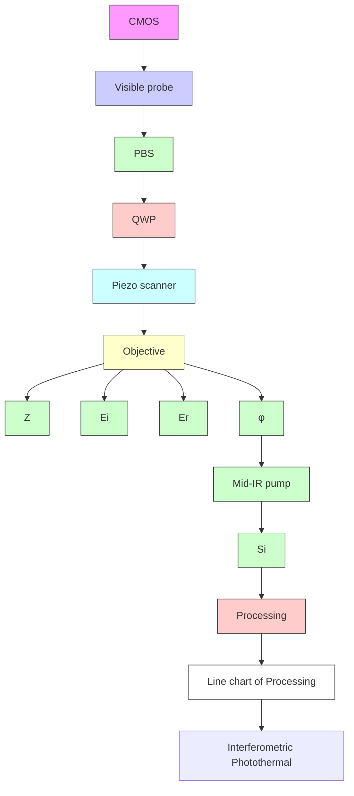

# Single virus fingerprinting by widefield interferometric defocus-enhanced mid-infrared photothermal microscopy

Received: 25 January 2023

Accepted: 11 October 2023

Published online: 20 October 2023

Check for updates

Qing Xia1 , Zhongyue Guo2 , Haonan Zong1 , Scott Seitz3 , Celalettin Yurdakul 1 , M. Selim Ünlü1 , Le Wang1 , John H. Connor 3 & Ji-Xin Cheng 1,2,4

Clinical identification and fundamental study of viruses rely on the detection of viral proteins or viral nucleic acids. Yet, amplification-based and antigenbased methods are not able to provide precise compositional information of individual virions due to small particle size and low-abundance chemical contents (e.g., \~ 5000 proteins in a vesicular stomatitis virus). Here, we report a widefield interferometric defocus-enhanced mid-infrared photothermal (WIDE-MIP) microscope for high-throughput fingerprinting of single viruses. With the identification of feature absorption peaks, WIDE-MIP reveals the contents of viral proteins and nucleic acids in single DNA vaccinia viruses and RNA vesicular stomatitis viruses. Different nucleic acid signatures of thymine and uracil residue vibrations are obtained to differentiate DNA and RNA viruses. WIDE-MIP imaging further reveals an enriched β sheet components in DNA varicella-zoster virus proteins. Together, these advances open a new avenue for compositional analysis of viral vectors and elucidating protein function in an assembled virion.

The emergence of the monkeypox outbreak in early 2022 has posed a new global health threat during the coronavirus-19 (COVID-19) pandemic1–3 . With the spread of virus-based infectious diseases, rapid and accurate testing is crucial for mitigating the impact of current and future pandemics4 . Diagnostic tests on the viruses commonly rely on the detection of nucleic acids or surface proteins. Generally, the amount of viral nucleic acid in a single virion is lower than the amount of viral protein. Detecting viral nucleic acids is challenging without signal amplification techniques such as polymerase chain reaction. Although nucleic acid amplification tests4–6 and antigen rapid diagnostic tests7,8 can provide accurate testing results, they usually require pre-treatments of a large number of virions, extraction, or tagging that add time to any assay5 . It is noteworthy that residual viral RNA from patient specimens remains detectable even though patients have recovered or without culturable viruses9–11. Thus, in addition to detecting viral fragments, new complement assays are required to identify the intact virions with preserved structures in order to confirm viral infection and reduce false diagnoses.

Accelerated efforts have been devoted to developing label-free technologies, in which optical detection and morphological characterization of single viruses have shown to be promising for clinical diagnosis12,13. Although the scattering from a single virion is weak, it can be enhanced by interfering with a strong reference field in an interferometric light microscope14. With the enhanced signal contrasts, interferometric imaging has been used for single virus tracking and viral infection study15–17. Towards translation into the clinic, interferometric sensing methods have also demonstrated the visualization of single viruses in undiluted fetal bovine serum18 and the rapid detection of a single intact virion in human saliva19. However, these methods lack molecular information about the viruses while the chemical contents are critical to viral structure and function20.

1 Department of Electrical and Computer Engineering, Boston University, Boston, MA 02215, USA. 2 Department of Biomedical Engineering, Boston University, Boston, MA O2215, USA. 3Department of Microbiology and National Infectious Diseases Laboratories, Boston University School of Medicine, Boston, MA 02118 USA. 4 Photonics Center, Boston University, Boston, MA 02215, USA. e-mail: jhconnor@bu.edu; jxcheng@bu.edu

Vibrational spectroscopic detection of viruses is valuable for analyzing the chemical components of virus strains21–23. Methods relying on either Raman scattering or infrared (IR) absorption offer intrinsic chemical selectivity at a single virus level by using spectro scopic signatures of chemical bonds24,25. Compared to Raman scattering, IR absorption offers 8 orders of magnitude larger cross-section that enables adequate chemical sensitivity and throughput26. Midinfrared photothermal (MIP) microscopy is an emerging technique based on the mapping of local transient heat to achieve IR spectroscopic imaging at the diffraction limit of visible light27,28. In MIP microscopy, a visible probe beam is used to detect photothermalbased chemical contrast induced by a mid-IR pump beam29. Since the first demonstration of 3D MIP imaging of living cells29, MIP microscopy has enabled broad applications in life science, ranging from individual bacteria30, single cells31–33, sliced tissues34, to entire organisms35. With counter-propagation of IR and visible beams, researchers have shown MIP imaging of 100 nm polystyrene beads36,37. With interferometric scattering as the probe in a confocal configuration, MIP spectroscopic detection of a single virus was reported38. However, the scanningbased MIP methods suffer from long acquisition time and low throughput. Although widefield MIP imaging was developed to allow ultrafast chemical imaging at a speed up to 1250 frames per second39, it remains very challenging for widefield MIP to detect single viral nanoparticles and perform precise spectral analysis.

Here, we present the development and validation of a widefield interferometric defocus-enhanced MIP (WIDE-MIP) microscope (Fig. 1a) for fingerprint analysis of bionanoparticles. As photothermal signal is a modulation of visible beam intensity, it is commonly believed that an optimal MIP contrast is generated when the bright field contrast is maximized. Yet, this wisdom does not hold for interferometric MIP microscopy where the signal strongly depends on the relative phase between the particle-scattered photons and the substrate-reflected reference field. Instead, we find that by fine-tuning the focus position of the objective, the defocused interferometric imaging results in a greatly improved MIP contrast (Fig. 1b). We constructed a theoretical framework that calculates the defocused inter ferometric photothermal images of single nanoparticles with different sizes. This framework provides the optimal MIP detection focus position relative to the nominal focus position of the particles. Compared to reported scanning methods36–38, we demonstrate vibrational detection of 100 nm polymethyl methacrylate (PMMA) particles at a similar signal-to-noise ratio (SNR) level but with three orders of magnitude higher throughput. By tuning the IR wavenumber, WIDE-MIP spectra of single viruses are acquired from the hyperspectral images (Fig. 1c). We systematically recorded the fingerprints of single vaccinia viruses (VACV), a DNA poxvirus related to Monkeypox40, single vesicular stomatitis viruses (VSV), the prototype RNA virus41, and varicellazoster viruses (VZV), a DNA virus included in the herpesvirus group42. Dramatically, the spectra provide signatures of not only viral proteins, but also nucleic acids of individual viruses. Nucleic acid peaks of thy mine (T) and uracil (U) residue vibrations in VACV and VSV were detected respectively, indicating unique IR signatures of DNA and RNA viruses. Besides the contents, WIDE-MIP data further suggests a $\beta \cdot$ enriched sheet structure in VZV, showing the potential of analyzing protein secondary structure in a single virus.

flowchart

Fig. 1 | Schematic and principle of WIDE-MIP microscopy. a Schematic of a WIDE-MIP microscope and principle of interferometric scattering-based MIP imaging. CMOS complementary metal-oxide semiconductor, PBS Polarizing beam splitter, QWP quarter-wave plate, $E _ { \mathrm { i } }$ visible incident light field, $E _ { \mathrm { r } }$ reflected field by the substrate, $E _ { s }$ scattered field by the sample, $E _ { s } ^ { \prime }$ IR modulation resulted scattered field by the sample, which is related to the radius $( r ) ,$ refractive index $( n ) ,$ and temperature change (ΔT) of the sample, φ phase difference between $E _ { s }$ and $E _ { \mathrm { r } } .$ . A delay pulse generator is used to synchronize the pump pulse, probe pulse, and camera (Supplementary Fig. 1). b Schematic illustration of interferometric defocusenhanced photothermal contrast provided by Z axis scanning of objective. The different positions are with respect to the substrate top surface (Z = 0 μm). c Principle of fingerprinting DNA and RNA viruses by WIDE-MIP. wn wavenumber. Hyperspectral images of single viruses are recorded by continuously tuning the IR wavenumber. Blue dots indicate DNA viruses, red dots indicate RNA viruses.

## Results

## Theory and experimental validation of WIDE-MIP detection

WIDE-MIP is a highly sensitive vibrational detection platform based on infrared photothermal modulation of interferometric scattering. The schematic of the WIDE-MIP microscope is illustrated in Fig. 1a. In previous implementation of widefield ${ \sf M I P } ^ { 3 9 }$ , a visible LED was utilized as the probe light, which had a relatively long pulse duration of \~1 μs and only allowed detection of PMMA beads of $1 . 0 \mu \mathrm { m }$ diameter. To match the nanosecond-scale thermal decay of nanoparticles (240 ns for 200-nm PMMA beads in $\mathsf { a i r } ^ { 2 8 } )$ , we incorporated a nanosecond pulsed laser (NPL52C, Thorlabs, pulse duration of 129 ns) as the visible probe to improve the sensitivity. A pulsed mid-infrared laser (Firefly-LW, M Squared Lasers) excites the sample placed on a silicon substrate. The visible probe $E _ { \mathrm { i } }$ illuminates the sample and is further scattered by the sample $E _ { s }$ and reflected by the substrate $E _ { \mathrm { r } } .$ Compared to a transparent substrate, such as calcium fluoride, silicon reflects most of the forward-scattered light and increases the total back-scattering43. Consequently, the scattered light interfered with the reflected light and the resulting interferometric image represents the coherent sum of the scattered and reflected fields43,44:

$$
I _ {\text { det }} = \left| E _ {r} + E _ {s} \right| ^ {2} = \left| E _ {r} \right| ^ {2} + \left| E _ {s} \right| ^ {2} + 2 \left| E _ {r} \right| \left| E _ {s} \right| \cos \varphi \tag {1}
$$

where $\varphi$ is the phase difference between $E _ { s }$ and $E _ { \mathrm { r } } .$ The normalized interferometric contrast S is defined as:

$$
S = \frac {I _ {\mathrm{det} - I _ {b k g}}}{I _ {b k g}} = \frac {\left| E _ {r} + E _ {s} \right| ^ {2} - \left| E _ {r} \right| ^ {2}}{\left| E _ {r} \right| ^ {2}} = \frac {\left| E _ {s} \right| ^ {2}}{\left| E _ {r} \right| ^ {2}} + 2 \frac {\left| E _ {s} \right|}{\left| E _ {r} \right|} \cos \varphi \tag {2}
$$

where $I _ { \mathrm { b k g } }$ is the background intensity.

For particles of small size like viruses, $| E _ { r } | ^ { 2 } \gg | E _ { s } | ^ { 2 }$ . Then, we have

$$
S \cong 2 \frac {| E _ {s} |}{| E _ {r} |} \cos \varphi \tag {3}
$$

The photothermal contrast C induced by IR absorption is generated from the interferometric contrast difference between IR-on (hot)

and IR off (cold) states:

$$
C = \frac {2}{\left| E _ {r} \right|} (E _ {s} ^ {h o t} \cos \varphi^ {h o t} - E _ {s} ^ {c o l d} \cos \varphi^ {c o l d}) \tag {4}
$$

where $| E _ { r } |$ is assumed as a constant in the modulation. For the purpose of brevity, only the change of $\mathbf { \hat { \boldsymbol { E } } } _ { s }$ is taken into account between hot and cold states and $\varphi$ is considered as a constant in previous MIP work38,45,46. However, for specular reflection, $E _ { \mathrm { r } }$ only travels in one direction and is reflected back along the optical axis, while $E _ { s }$ travels in all directions, mostly at oblique angles. Due to thermal expansion of the particle, the traveling direction of $E _ { \mathrm { r } }$ relative to $E _ { s }$ is different, and thus the phase angle φ is slightly different in hot and cold states. Because the phase angle φ also depends on the axial position of the optical focus, the MIP contrast can be optimized by tuning the focal position. To precisely control the Z axis scanning, the objective is mounted on an objective piezo scanner for defocus-enhanced photothermal image acquisition (Fig. 1b).

To validate the interferometric phase difference, the interferometric image of a 200 nm diameter (D) PMMA bead was numerically simulated via the boundary element method $( \mathrm { B E M } ) ^ { 4 7 }$ . Interferometric contrast S is then calculated using the metallic nanoparticle boundary element method (MNPBEM) toolbox45. The MIP signal is generated from the interferometric contrast difference between IR-on (hot) and IR off (cold) states. The transient temperature difference between hot and cold states is set to be \~80 K over a temporal window of 129 nanoseconds (duration of probe pulse), which is calculated from COMSOL simulation36,45 (Supplementary Fig. 2, details in Supplementary Note 1). We simulated the interferometric images of the 200 nm PMMA bead at both cold $( T = 2 9 3 . 1 5 \mathsf { K } )$ and hot $( T = 3 7 3 . 1 5 \mathsf { K } )$ states along the Z axis focus of the objective. The interferometric contrast at the center of the diffraction-limited image of the PMMA bead on a silicon substrate is calculated as the focus position Z is swept. Here, Z is set to be zero for exact optical focusing at the sample-substrate interface for the light-collecting objective. As shown in Fig. 2a, the simulated defocus curves of cold and hot contrasts have a similar sinusoidal function shape, both of them reaching the maximum contrast near $Z { = } 0 . 4$ μm. For the hot state, the increased local temperature changes the opto-physical properties of the PMMA particle, such as size (r) and refractive index (n). As seen from the zoomed-in view at different focal planes, the slopes of the interferometric contrast vary greatly as a function of Z (Fig. 2b, c). Strikingly, the interferometric contrast is least sensitive to the axial focus when the particle contrast is maximized a $\mathtt { t } Z = 0 . 4 \mu \mathrm { m } ^ { 1 5 }$ . Consequently, the photothermal contrast is only 0.00035% at $Z { = } 0 . 4$ μm (Fig. 2c). On the contrary, the interferometric contrast is most sensitive to the change in opto-physical properties of the particle caused by the local temperature increase near the interface at ${ \cal Z } = 0 \mu \mathrm { m }$ , where the photothermal contrast is \~0.6% at $\Delta \mathsf { T } = 8 0$ K (Fig. 2b). Therefore, the difference between cold and hot state, defined as the MIP contrast, is maximized at a defocused plane relative to the interferometric contrast. The interferometric image shows a bright contrast at the focal plane o $\scriptstyle { Z = 0 . 4 \mu \mathrm { m } }$ , where the MIP contrast is low. The MIP image reaches its maximum contrast at $Z { = } 0 \mu \mathrm { m }$ , where the interferometric image shows a negative contrast (Fig. 2d, e).

To experimentally validate the mechanism of interferometric defocus-enhanced MIP, D = 200 nm PMMA beads on a silicon substrate were used. We first used interferometric contrast (IR off) to locate the beads under the microscope. Once the beads were observed in the focal plane, the IR laser was turned on to 1728 cm−1 , which corresponds to the acrylate carboxyl vibration (C=O stretching) in PMMA. To optimize the MIP contrast, we manually adjusted the defocus with a piezo scanner. Subsequently a series of interferometric and Mip images of the PMMA beads were acquired by scanning the focal position of the objective lens. As shown in Fig. 2f, g, the experimental images match the simulation results very well.

To derive the optimal condition for MIP imaging, we plotted the interferometric and MIP contrast as a function of optical focus position through both simulation (Fig. 2h) and experiment (Fig. 2i). The simulated focal plane difference between interferometric and MIP images, $\Delta Z = 4 0 0 \mathrm { n m } ,$ , is highly consistent with the experimental result. By defocusing the interferometric images, the MIP contrast is increased by 2.5 times for 200 nm PMMA particles. For PMMA beads with different sizes, the defocus curve and ΔZ have different shapes and values (Supplementary Fig. 3, details in Supplementary Note 2). Thus, this framework provides a guideline to obtain a well-defined and optimized photothermal detection signal by adjusting the focus for MIP detection of nanoparticles with different sizes.

## Hyperspectral performance and spectral fidelity

To further test the capability of WIDE-MIP for spectroscopic imaging of single virus in the fingerprint window, we evaluated the hyperspectra performance and spectral fidelity of the system. Single 200-nm PMMA beads with known IR absorption spectrum were chosen for their similar size and dielectric constant $( n \approx 1 . 5 )$ to the Monkeypox viruses. Figure 3a, b show MIP images of the beads at $1 4 5 2 \mathrm { c m } ^ { - 1 }$ and $1 7 2 8 \mathrm { c m } ^ { - 1 }$ , indicating bond-selective contrast from the C−H and C=O stretching of PMMA. The statistical spectra of 30 individual beads showed the distinguished resonance peaks of both C−H and C=O stretching vibrations (Fig. 3c, red line). The standard deviation of the mean MIP contrast within the range of \~1510 to $1 6 1 0 \mathrm { c m } ^ { - 1 }$ was found to be \~0.16%, which corresponds to the off-resonance region of PMMA vibration. This demonstrates the stable hyperspectral performance of WIDE-MIP. Furthermore, the spectral fidelity was confirmed by comparing the WIDE-MIP spectrum to FTIR absorption spectrum of PMMA (Fig. 3c, black line)48. With the increased MIP contrast, WIDE-MIP realizes the high-speed widefield photothermal detection of D = 100 nm PMMA nanoparticles (Supplementary Fig. 4, details in Supplementary Note 3), which increases the throughput by 3 orders of magnitude compared with scanning MIP at a similar level of SNR (Supplementary Table $1 ) ^ { 3 6 - 3 8 }$

## Fingerprinting and base residue detection of single DNA and RNA viruses

With its high-resolution and high-throughput capability, WIDE-MIP opens the possibility of single virus chemical detection. We used single VACV and VSV viruses as testbeds. The dimensions of the VACV virion are roughly 360 × 270 × 250 nm49. VSV is a bullet-shaped RNA virus with a smaller size of $8 0 \times 1 8 0 \mathrm { n m } ^ { 3 8 , 5 0 , 5 1 }$ 1. Figure 4a shows the defocused interferometric scattering image of single VACV viruses. It should be noted that the depth of focus for MIP imaging is 503 nm and the spatial resolution is 417 nm, measured from a 200 nm PMMA particle in MIP image captured at the defocus plane of ${ \cal Z } = 0 \mu \mathrm { m }$ (Supplementary Fig. 5, details in Supplementary Note 4). To confirm MIP imaging of single viruses, both VACV and VSV viruses were expressed with an enhanced green fluorescent protein (eGFP) envelope for an orthogonal validation. With the good overlay of the widefield fluorescence imaging (Fig. 4b) and the interferometric scattering images (Fig. 4c), we confirmed that the observed particles were indeed VACV virions. Atomic force microscope analysis further confirmed the size of single virions (Supplementary Fig. $^ { 6 , }$ details in Supplementary Note 5). Bond-selective MIP imaging showed the amide II $( 1 5 4 4 \mathsf { c m } ^ { - 1 } )$ and amide I (1656 cm−1 ) vibrational contrasts contributed by viral proteins (Fig. 4d, e), whereas the off-resonance images at 1768 cm−1 showed no contrasts (Fig. 4f). Similar results of single VSV viruses are shown in the defocused interferometric scattering, fluorescence, and MIP images (Fig. 4g–l). As VSV is less concentrated on the imaging plate than VACV due to the preparation procedure, we provided more data in Supplementary Fig. 7.

line chart

| Z scan (μm) | Sim. Interfer. contrast (arb. units) |
|-------------|-------------------------------------|
| -1.0        | -0.1                                |
| -0.8        | -0.3                                |
| -0.6        | -0.6                                |
| -0.4        | -0.8                                |
| -0.2        | -0.7                                |
| 0.0         | -0.2                                |
| 0.2         | 0.3                                 |
| 0.4         | 0.9                                 |
| 0.6         | 0.8                                 |
| 0.8         | 0.4                                 |
| 1.0         | 0.2                                 |

line chart

| Z scan (nm) | Cold     | Hot      |
|-------------|----------|----------|
| -0.02       | -0.166   | -0.158   |
| 0.00        | -0.166   | -0.158   |
| 0.02        | -0.166   | -0.158   |

line chart

| Z scan (nm) | Cold     | Hot      |
|-------------|----------|----------|
| 399.98      | 0.92987  | 0.92987  |
| 400.00      | 0.92991  | 0.92991  |
| 400.02      | 0.92989  | 0.92989  |

text_image

d
Z₂ = 0.4 µm
Z₁ = 0 µm
Y
X
f
Z
Z
Z₂
Exp. Interfer. contrast
1
-0.5

text_image

e
Z₂ = 0.4 μm
Z₁ = 0 μm
Y
X
g
Sim. MIP contrast
Z₁
Z
Z
Exp. MIP contrast
×10⁻³
7.4
-0.15

text_image

Z₂ = 0.4 µm
Z₁ = 0 µm
Y
X
Z
X
Z₂
Z
Y
0.8
-0.5

text_image

Z₂ = 0.4 μm
Z₁ = 0 μm
Y
X
Z
X
Z₁
Z
Y
× 10⁻³
7.4
0

line chart

| Z scan (μm) | Sim. Interfer. contrast (arb. units) | Sim. MIP contrast (arb. units) |
|-------------|--------------------------------------|--------------------------------|
| -1.0        | -0.2                                 | 0                              |
| -0.8        | -0.3                                 | 0                              |
| -0.6        | -0.4                                 | 0                              |
| -0.4        | -0.6                                 | 0                              |
| -0.2        | -0.8                                 | 0                              |
| 0.0         | -0.5                                 | 6×10⁻³                         |
| 0.2         | -0.2                                 | 4×10⁻³                         |
| 0.4         | 0.5                                  | 2×10⁻³                         |
| 0.6         | 0.8                                  | 0                              |
| 0.8         | 0.6                                  | -2×10⁻³                        |
| 1.0         | 0.2                                  | 0                              |

line chart

| Z scan (μm) | Exp. Interfer. contrast (arb. units) | Exp. MIP contrast (arb. units) |
|-------------|--------------------------------------|--------------------------------|
| -1.0        | -0.2                                 | 0.0                            |
| -0.8        | -0.3                                 | 1.5                            |
| -0.6        | -0.4                                 | 2.0                            |
| -0.4        | -0.5                                 | 2.5                            |
| -0.2        | -0.6                                 | 3.0                            |
| 0.0         | -0.7                                 | 4.0                            |
| 0.2         | -0.5                                 | 5.0                            |
| 0.4         | -0.3                                 | 6.0                            |
| 0.6         | -0.1                                 | 5.5                            |
| 0.8         | 0.1                                  | 4.5                            |
| 1.0         | 0.3                                  | 3.5                            |

Fig. 2 | Simulation and experimental validation of interferometric defocusenhanced photothermal contrast. PMMA beads of $D = 2 0 0$ nm were used as the testbed. a Simulated defocus curves of interferometric contrast at the cold $( T = 2 9 3 . 1 5 \mathsf { K } )$ and hot $( T = 3 7 3 . 1 5 \mathsf { K } )$ states. Zoomed-in-view of simulated defocus curves of interferometric contrast at the position of b $\mid Z _ { 1 } = 0$ μm and $\mathbf { c } Z _ { 2 } = 0 . ^ { \angle }$ 4 μm. Interfer.: interferometric. The photothermal contrast is 0.6% at $Z _ { 1 } = 0$ μm and $0 . 0 0 0 3 5 \%$ at $Z _ { 2 } = 0 . 4$ μm. d Simulated interferometric images at $Z _ { 2 } = 0 . 4 \mu \mathrm { m }$ , $Z _ { 1 } { = } 0 \mu \mathrm { m } \left( \mathrm { l e f t } \right)$ , and interferometric scattering along Z axis (right). e Simulated MIP  
images at $Z _ { 2 } = 0 . 4 \mu \mathrm { m } , Z _ { 1 } = 0$ μm (left), and MIP imaging along Z axis (right). f Experimental interferometric images at $Z _ { 2 } = 0 . 4 \mu \mathrm { m } , Z _ { 1 } = 0 \mu \mathrm { m }$ (left), and inter ferometric scattering along Z axis (right). g Experimental MIP images at $Z _ { 2 } = 0 . 4 \mu \mathrm { m }$ $Z _ { 1 } { = } 0 \mu \mathrm { m } \left( \mathrm { l e f t } \right)$ , and MIP imaging along Z axis (right). Scale bar: 500 nm. All Z axis images are obtained from $Z = - 1$ to 1 μm. h Simulated and i experimental defocus curves of interferometric and MIP contrast. Power before the objective: pump: 48 mW at $1 7 2 8 \mathrm { c m } ^ { - 1 }$ , probe: \~1 mW. Image acquisition time: 2.36 s per image. Z axis scanning step: 100 nm. Source data are provided as a Source Data file.

To provide further insight into the viral structure and content, we performed WIDE-MIP hyperspectral imaging of single VACV and VSV viruses (blue and red arrows labeled in Fig. 4a–l). Obvious differences were overserved in the single-virus fingerprints (Fig. 4m). Merited from the high-throughput ability of spatial multiplexing of WIDE-MIP, spectral analysis of multiple viruses was performed. The statistical spectra of both VACV (n = 36) and VSV (n = 33) (Fig. 4n, o) are in good agreement with the single-virus spectra (Fig. 4m). Besides the viral protein vibrations, some unique peaks reveal the information of the viral nucleic acids. Different from the wide amide I peak from the pure protein samples (Supplementary Fig. 8a), the strongest sharp peak at 1656 cm−1 is contributed by a superposition of the viral protein, ade nine (A), and T residue vibrations in viral DNA of VACV (Fig. 4n). A medium feature at 1580 cm−1 is assigned to the T residue vibration in VACV viral DNA. For VSV, the U residue vibration in RNA is indicated by the strong peak at 1640 cm−1 (Fig. 4o). More detailed features of nucleic acids in VSV are revealed by the weak peak at 1604 cm−1 (A and cytosine (C)) and strong peak at 1656 cm−1 (A and proteins). The guanine (G) residue vibrations are identified at 1692 cm−1 in both VACV and VSV. The assignments of the chemical components were validated by the pure protein, DNA, and RNA film samples52 (Supplementary Fig. 8, details in Supplementary Note 6). It indicates that WIDE-MIP can provide rich chemical content information of viral proteins and even nucleic acids inside a single virus.

natural_image

Microscopic image showing red fluorescent spots against a dark background, labeled 'C-H: 1452 cm⁻¹' (no other text or symbols)

text_image

b
C=O: 1728 cm⁻¹

line chart

| Wavenumber (cm⁻¹) | MIP contrast (arb. units) | FTIR absorption (%) |
| ----------------- | ------------------------- | ------------------- |
| 1400              | ~0.01                     | ~0                  |
| 1450              | ~0.03                     | ~5                  |
| 1500              | ~0.01                     | ~0                  |
| 1550              | ~0.01                     | ~0                  |
| 1600              | ~0.01                     | ~0                  |
| 1650              | ~0.01                     | ~0                  |
| 1700              | ~0.01                     | ~5                  |
| 1720              | ~0.12                     | ~15                 |
| 1750              | ~0.01                     | ~0                  |
| 1800              | ~0.00                     | ~-5                 |

Fig. 3 | Hyperspectral performance and spectral fidelity of WIDE-MIP micro scopy. MIP image of D = 200 nm PMMA beads with IR excitation at a 1452 cm−1 and b 1728 cm−1 . Scale bars: 5 μm. Experiments were repeated at least three times. c MIP spectrum (red) and FTIR spectrum (black) of D = 200 nm PMMA beads. n = 30 for biologically independent PMMA beads. Error bands represent the standard  
deviation of the mean. Power before the objective: pump: 31.4 mW at 1452 cm−1 , 38.6 mW at 1728 cm−1 , probe: \~1 mW. Image acquisition time: 2.36 s per wavenumber. The MIP spectrum was normalized by the IR power. The FTIR spectrum was acquired by an attenuated total reflection FTIR spectrometer. Source data are provided as a Source Data file.

To further demonstrate the potential of WIDE-MIP to differentiate single RNA viruses from single DNA viruses, we compared the signature peaks of nucleic acids at the single-virus level by quantifying the MIP contrast of peaks at T residue and U residue for VACV and VSV to highlight the spectroscopic difference of DNA and RNA viruses. Although the MIP contrasts of VACV and VSV show no statistically significant difference at $1 5 8 0 \mathrm { c m } ^ { - 1 }$ representing U residue (Fig. 4p, P = 0.138892), MIP contrasts of both T residue (Fig. 4q, P = 7.4 × 10−5 ) and the ratio of T/U (Fig. 4r, $P { = } 5 . 2 \times 1 0 ^ { - 1 4 } )$ show significant difference between VACV and VSV. Our results show that fingerprint WIDE-MIP has the potential to rapidly classify RNA and DNA viruses in the clinic by bond-selective imaging of T and U residues.

## Identification of protein secondary structure in a single virus

As the profile in the amide I band is very sensitive to the protein secondary structures53, WIDE-MIP can be a promising tool to characterize the protein structures compared to expensive and time-consuming approaches such as electron microscopy54,55. To explore such potential, we acquired the WIDE-MIP spectra of another DNA virus, VZV, shown in Fig. 5. It is reported that there are three envelope proteins, glycoprotein B, glycoprotein H, and glycoprotein L serving as the most essential VZV proteins that function as the core fusion complex56. These proteins have known 3D structure and all of them have a big proportion of β-sheet, and the proportion of turn cannot be ignored57. Figure 5a–c shows the defocused interferometric scattering image and bond-selective MIP image of amide II and amide I vibrations of single VZV viruses. Although there are some aggregates in the interferometric image. a lot of single virions are shown, Zoomed-in views of four single VZV viruses are illustrated in Fig. 5d–i. WIDE-MIP spectra of these four single VZV (red arrows labeled in Fig. 5d–i) were further obtained (Fig. 5j). The specific IR peaks of DNA virus were observed at 1580 cm−1 and 1612 cm−1 , indicating the vibrations of A, C and T residues in the viral DNA of VZV. Compared to the spectra of VSV and VACV, two broad peaks are observed at around 1630–1640 cm−1 and 1668 cm−1 , which are assigned to the β-sheet and the turn structure in the viral proteins of VZV, respectively53. The statistical spectra acquired from 30 VZV virions (Fig. 5k) further reveal enriched β-sheet protein components, viral DNA, and lipids in $\mathsf { V Z V } ^ { 5 8 }$ (details in Supplementary Note 6). The spectral fidelity was confirmed by FTIR absorption spectrum of VZV powder (Fig. 5l). Therefore, besides the detection of major chemical components, WIDE-MIP can identify the protein secondary structure related to their function in a virus.

## Discussion

We present a single virus fingerprinting approach, termed WIDE-MIP microscopy, that addresses the unmet need for the identification of single virus. Our method allows composition detection of viral nucleic acids and proteins with high throughput. A theoretical framework for interferometric defocus-enhanced photothermal signal is developed and experimentally validated, providing a guideline to obtain a welldefined photothermal signal by adjusting the defocusing. Compared to scanning MIP, WIDE-MIP increases the imaging throughput by three orders of magnitude for fingerprint analysis of nanoparticles at the same SNR. Besides content detection of viral proteins, viral DNA, and viral RNA, WIDE-MIP further identifies the protein secondary structure in a single virus by revealing enriched β sheet components.

While we utilized defocused interferometric imaging to improve MIP contrast, our analysis of biological samples relies on MIP contrasts, whereas the interferometric images are solely used for sample localization before acquiring the MIP images. Despite the slight defocusing in the interferometric images, the MIP images remain in focus, revealing distinct contrasts of the biological samples. The MIP images not only provide valuable morphological information about the biological samples but also offer insightful biochemical details about their specific contents.

In this work, both VACV and VSV viruses were expressed with an eGFP envelope. The eGFP was fused to the VSV G protein, where each VSV contains \~1200 molecules of the G protein on the viral surface59. With the formed G protein and G-eGFP fusion protein heterodimers, there are \~600 eGFP molecules on the surface of a single virus. Comparing the size of eGFP (2.4 × 4.2 nm) to that of the VSV virus (80 × 180 nm), we estimate that only 1.3% of a single VSV virus consists of eGFP. Thus, the effect of eGFP on MIP imaging should be negligible due to the relatively low content of eGFP in a single virus.

VACV DNA virus  

text_image

a Interfer.
b Fluorescence
c Merged
d Amide II: 1544 cm⁻¹
e Amide I: 1656 cm⁻¹
f Off-resonance: 1768 cm⁻¹

VSV RNA virus  

text_image

g Interfer. h Fluorescence
200
50
0.7
i Merged j Amide II: 1552 cm⁻¹
k Amide I: 1656 cm⁻¹ l Off-resonance: 1768 cm⁻¹
0.05
0

line chart

| Wavenumber (cm⁻¹) | Single VACV | Single VSV |
| ----------------- | ----------- | ---------- |
| 1500              | 0.15        | 0.15       |
| 1525              | 0.20        | 0.20       |
| 1550              | 0.30        | 0.30       |
| 1575              | 0.45        | 0.30       |
| 1600              | 0.50        | 0.25       |
| 1625              | 0.40        | 0.40       |
| 1650              | 1.00        | 1.00       |
| 1675              | 0.90        | 0.75       |
| 1700              | 0.25        | 0.25       |
| 1725              | 0.10        | 0.10       |
| 1750              | 0.05        | 0.05       |
| 1775              | 0.05        | 0.15       |
| 1800              | 0.05        | 0.15       |

line chart

| Wavenumber (cm⁻¹) | Norm. MIP intensity |
| ----------------- | ------------------- |
| 1500              | 0.2                 |
| 1550              | 0.6                 |
| 1600              | 0.5                 |
| 1650              | 1.0                 |
| 1700              | 0.3                 |
| 1750              | 0.1                 |
| 1800              | 0.0                 |

line chart

| Wavenumber (cm⁻¹) | Norm. MIP intensity |
| ----------------- | ------------------- |
| 1500              | 0.3                 |
| 1550              | 0.4                 |
| 1600              | 0.3                 |
| 1650              | 0.9                 |
| 1700              | 0.2                 |
| 1750              | 0.1                 |
| 1800              | 0.0                 |

box plot

| Group | MIP intensity (arb. units) |
|-------|-----------------------------|
| VACV  | 0.1                         |
| VSV   | 0.05                        |

scatterplot

| Group | MIP intensity (arb. units) |
|-------|-----------------------------|
| VACV  | 0.1                         |
| VSV   | 0.0                         |

box plot

| Group | MIP intensity (arb. units) |
|-------|-----------------------------|
| VACV  | 0.5 - 1.0                   |
| VSV   | 0.0 - 1.0                   |

Fig. 4 | Fingerprinting detection of single VACV and VSV viruses. a Defocused interferometric scattering, b fluorescence, and c merged images of single VACV viruses. d Amide II bond-selective image of the same area with the pump a 1544 cm−1 . e Amide I bond-selective image of the same area with the pump at $1 6 5 6 \mathrm { c m } ^ { - 1 }$ . f Off-resonance image showed no contrast. g Defocused interferometric scattering, h fluorescence, and i merged images of single VSV viruses. j Amide II bond-selective image of the same area with the pump at 1552 cm−1 . k Amide I bondselective image of the same area with the pump at 1656 cm−1 . l Off-resonance image showed no contrast. Scale bars: 10 μm. m MIP spectra of two single VACV and VSV viruses (blue and red arrows labeled). Statistical MIP spectra obtained from n 36 single VACV and o 33 VSV viruses. Error bands represent standard deviation of the mean. Power before the objective: pump: 22.9 mW at 1544 cm−1 , 29.1 mW at  
1552 cm−1 , 34.5 mW at $1 6 5 6 ~ \mathrm { c m ^ { - 1 } }$ , 35.8 mW at 1768 cm−1 , probe: \~1 mW. Image acquisition time: 2.36 s per wavenumber. The MIP spectrum is normalized by the IR power. Quantified MIP contrast of peaks at p T residue $( P = 0 . 1 3 8 8 9 2 )$ and q U residue $( P = 7 . 4 \times 1 0 ^ { - }$ 5) of VACV and VSV. r Quantified MIP contrast ratio of peaks at T residue/U residue $( P = 5 . 2 \times 1 0 ^ { - 1 4 } )$ ) of VACV and $\mathsf { V S V } . n = 3 6$ for biologically independent VACV samples and n = 33 for biologically independent VSV samples in p–r. The bound of box indicates 25% to 75% of data; inner line indicates medium; whiskers indicate maxima and minima of data. All statistical significance was analyzed using two-sided Student’s t test. ns $( P \ge 0 . 0 5 )$ denotes no statistically sig nificant difference. Asterisks \*\*\*\* $( P { < } 0 . 0 0 0 1 )$ denotes statistically significant difference. Source data are provided as a Source Data file.

natural_image

Microscopic image of interferent cells with labeled structures (no readable text or symbols)

natural_image

Microscopic image showing cellular structures with purple and red fluorescent markers, labeled 'Amide II: 1552 cm⁻¹' (no text or symbols within the image content)

natural_image

Fluorescence microscopy image showing cellular structures with purple and pink staining, labeled 'Amide I: 1656 cm⁻¹' (no additional text or symbols)

text_image

d
Zoom-in: Interfer.
3
1 4
2

text_image

e
Amide II: 1552 cm⁻¹

text_image

f
β-sheet: 1640 cm⁻¹

text_image

g
Amide I: 1656 cm⁻¹

text_image

Turn: 1668 cm⁻¹
h

text_image

Off-resonance: 1768 cm⁻¹

line chart

| Time | Virus-4 | Virus-3 | Virus-2 | Virus-1 |
|------|---------|---------|---------|---------|
| 1500 | 0.8     | 0.9     | 0.7     | 0.5     |
| 1550 | 0.9     | 0.8     | 0.8     | 0.6     |
| 1600 | 0.7     | 0.6     | 0.5     | 0.4     |
| 1650 | 1.2     | 1.0     | 0.9     | 0.8     |
| 1700 | 0.8     | 0.7     | 0.6     | 0.3     |
| 1750 | 0.7     | 0.6     | 0.5     | 0.2     |

line chart

| Wavenumber (cm⁻¹) | Normalized MIP contrast |
| ----------------- | ------------------------ |
| 1500              | 0.3                      |
| 1550              | 0.6                      |
| 1600              | 0.4                      |
| 1650              | 0.9                      |
| 1700              | 0.3                      |
| 1750              | 0.1                      |
| 1800              | 0.0                      |

line chart

| Wavelength | FTIR absorption (%) |
| ---------- | ------------------- |
| 1500       | 10                  |
| 1550       | 14                  |
| 1600       | 15                  |
| 1650       | 18                  |
| 1700       | 7                   |
| 1750       | 5                   |
| 1800       | 5                   |

  
Fig. 5 | Protein secondary structure identification in single VZV viruses. a Defocused interferometric scattering, b Amide II, and c amide I bond-selective image of single VZV viruses with the pump at 1552 cm−1 and 1656 cm−1 , respectively. Scale bars: 10 μm. d Zoomed-in view of defocused interferometric scattering of four viruses in a. e Amide II, f β-sheet, g Amide I, h Turn bond-selective image of the same area in d with the pump at 1552 cm−1 , 1640 cm−1 , 1656 cm−1 , 1668 cm−1 , respectively. i Off-resonance image showed no contrast of the same area in d with the pump at 1768 cm−1 . Scale bars: 1 μm. j MIP spectra of four VZV viruses in d (red  
arrows labeled). k Statistical MIP spectra obtained from 30 single VZV viruses. Error bands represent the standard deviation of the mean. Power before the objective: pump: 29.1 mW at 1552 cm−1 , 33.1 mW at 1640 cm−1 , 34.5 mW at 1656 cm−1 , 34.1 mW at 1668 cm−1 , 35.8 mW at 1768 cm−1 , probe: \~1 mW. Image acquisition time: 2.36 s per wavenumber. The MIP spectrum is normalized by the IR power. l FTIR spectrum of pure VZV virus powder. The FTIR spectrum was acquired by an attenuated total reflection FTIR spectrometer. Source data are provided as a Source Data file.

Supporting this notion, eGFP has a β-enriched sheet structure, while no obvious β sheet chemical signature was observed in either VACV or VSV expressing eGFP in Fig. 4. Additionally, the pure VZV viruses without any labeling showed an enriched β sheet component. These findings further support that the effect of eGFP on MIP imaging is minimal. Moreover, we note that the key distinction between DNA and RNA viruses lies in the different nucleic acid peaks associated with T and U residue vibrations, which are also unrelated to the eGFP proteins.

For the analysis of actual virus samples, label-free methods may be more suitable for diagnostic purposes. Thus, in this work, we first performed fluorescence-guided MIP analysis of single viruses by integrating fluorescence imaging and MIP imaging for accurate virus identification via WIDE-MIP (Fig. 4). Subsequently, we performed MIP imaging and obtained fingerprint spectra of unlabeled pure VZV viruses to achieve label-free detection of single viruses (Fig. 5). These approaches allow for comprehensive analysis while minimizing any potential influence of fluorescence labeling on the MIP imaging results.

In comparison to recently reported fluorescence-detected MIP (F-MIP) microscopy60,61, WIDE-MIP offers a distinct advantage in detecting bionanoparticles with low levels of expressed fluorescence tags (Sup plementary Fig. 9, details in Supplementary Note 7). Although the photobleaching of aggregated eGFP-VACVs showed a similar level in F-MIP60 (<\~10%), severe photobleaching was observed in single VACVs (>\~95%). This photobleaching of single viruses limits the detection of photothermal modulation and acquisition speed. Considering that the MIP signal relies on the difference in fluorescence intensity between the IR-on (hot) and IR-off (cold) states, this severe bleaching at the single-virus level further compromises the reliability of F-MIP. Instead, we focused on fluorescence-guided WIDE-MIP analysis, which enables label-free chemical imaging of single viruses.

Benefit from the compositional analysis of single viruses in a labelfree manner, we envision WIDE-MIP as an alternative analysis tool for viral vectors used in gene therapy. Viral vectors, including adeno associated viruses, adenoviruses, and lentiviruses, are increasingly used in gene therapy but pose challenges for quality control testing and characterization due to their complexity62,63. To ensure a safe, consistent, and high-quality product, accurate and rapid analytical assays are needed to monitor quality attributes. Sodium dodecylsulfate polyacrylamide gel electrophoresis, mass spectrometry, immunoblotting, enzyme-linked immunosorbent assay, polymerase chain reaction, or transmission electron microscopy are used to identify protein, genome, and capsid content64,65, but these assays can be time-consuming and require pre-treatments or extraction. To address these limitations, we further demonstrated high-speed chemical imaging of single VACV by reducing the acquisition time to 0.32 s per image per wavenumber of single viruses and the SNR of one single VACV is \~ 4 within the field of view of 24 by 24 μm (Supplementary Fig. 10). With the ability to rapidly acquire fingerprints of single viruses, WIDE-MIP can provide insights into the quality control of viral vectors, such as their identity, purity, and stability64 (details in Supplementary Note 8).

Future improvement for WIDE-MIP can focus on fingerprinting viruses or exosomes in liquid conditions, allowing for detecting biological nanoparticle samples in their natural states. This can be achieved by incorporating microfluidic systems18 and designed substrates43 to capture viruses and enhance imaging contrast in liquid measurements, which will broaden the applicability of WIDE-MIP to real-world applications.

## Methods

## Materials

The double-side polished silicon wafer (4 inch, 500 μm thickness) was purchased from University Wafer and diced into 10 mm × 20 mm pieces. PMMA nanoparticles were purchased from Phosphorex. 0.1% polyl-lysine and bovine serum albumin (BSA) were purchased from Sigma-Aldrich. Inactivated VZV strain VZ-10 was purchased from Fisher Scientific.

## Lab-built WIDE-MIP microscope

The IR pump beam was generated by a tunable (from 1400 to 1800 cm−1 ) mid-IR laser (Firefly-LW, M Squared Lasers) operating at 20 kHz repetition rate with a \~20 ns pulse duration. The pump pulses were modulated by an optical chopper (MC2000B, Thorlabs). For widefield photothermal imaging, the IR beam was weakly focused on the sample plane from the bottom of the silicon substrate via an offaxis parabolic mirror. A delay pulse generator (9254, Quantum Composers) was used to synchronize the pump pulse, the probe pulse and the interferometric pulse recorded by the camera. For the power normalization, a power meter (PM16-401, Thorlabs) was used to monitor the IR power. The visible probe was provided with a pulsed 520 nm nanosecond laser (NPL52C, Thorlabs) with a pulse duration of 129 ns. The probe laser illuminated the sample from the top through a 50/50 polarizing beam splitter, a quarter-wave plate and a high numerical aperture (NA) air objective (MPLFLN Olympus, ×100, NA 0.9). To acquire the defocus-enhanced photothermal images, the objective was adapted with an objective piezo scanner (Piezosystemjena, MIPOS 100), which can provide precise Z axis scanning in steps of 100 nm. The incident light was then scattered by the sample and reflected by the silicon substrate. The consequent interferometric scattering was collected by the same objective and recorded by a complementary metal-oxide semiconductor (CMOS) camera (Q-2HFW, Adimec). We further employed a 2 million well-depth camera to receive sufficient probe photons at each pixel.

## Theoretical simulation

A theoretical framework was developed to calculate the focusdependent interferometric and photothermal images of nanoparticles of different sizes. An image field representation of optical fields was employed by considering imaging optics and system parameters. The simulation was built upon the previously developed model via the BEM, which is a computationally efficient approach for calculating the interferometric scattering from a nanoparticle near a substrate. A custom-developed MNPBEM toolbox was used to solve Maxwell’s equations for a dielectric environment where the nanoparticles have homogeneous and isotropic dielectric functions and are separated by abrupt medium interfaces43. The MNPBEM was implemented in MATLAB and the simulation could be compartmentalized into five steps: (1) dielectric functions initialization of nano particle, substrate and environment to define the system geometry, such as the radius (r) and refractive index (n) of the nanoparticle; (2) specification of excitation scheme, such as incident illumination wavelength (λ) and illumination function; (3) solver setup for the BEM equations; (4) BEM equations’ solutions for the given excitation; (5) calculation of the far-field scattered field and image fields of the nanoparticle. We assumed that a PMMA particle (r, $n { = } 1 . 4 9 ^ { 6 6 } )$ was placed on top of a silicon substrate $( n = 4 . 2 ^ { 6 7 } )$ . The interferometric scattered field was calculated as the total backscattered field considering the reflections from the silicon surface using Green’s functions. The image fields were then simulated via angular spectrum representation integral and the detected interferometric signals were calculated according to Eq. (2) in the main text. The photothermal signals were then generated from the interferometric scattering difference between IR-on (hot) and IR off (cold) states. We simulated the interferometric images of a PMMA bead with different sizes at both cold (T = 293.15 K) and hot (T = 373.15 K) states along the Z axis scanning of objective. The interferometric and photothermal contrasts were recorded at the center of the diffraction-limited image of the PMMA bead as the focus position Z sweeping. Here, Z was set to be zero for exact optical focusing at the sample-substrate interface for the light-collecting objective, where the numerical aperture of the objective was also considered for the collecting angle. Thus, the defocus curves of both interferometric and photothermal contrasts were obtained.

## Fluorescence imaging of single virus

A 488 nm diode laser (200 mW, Cobolt 06-MLD) was used for fluor escence excitation. The excitation beam was expanded through a 4f system (f1 = 50 mm, LA1131-A-ML and f2 = 300 mm, LA1484-A-ML, Thorlabs) and then coupled into the light path of probe laser. The fluorescence emission went through the same objective lens and was collected with a filter set (Excitation filter: FES0500, Thorlabs; Dichroic beam splitter: Di03-R405/488/532/635-t1-25×36, Sermock; Emission filter: FF01-525/30-25, Sermock). A CMOS camera (FLIR, Grasshopper3GS3-U3-51S5M) was used to capture the fluorescence images and the exposure time was set to 5 s for optimized contrast. Virus samples on silicon substrate were first imaged by fluorescence to confirm the single virus and then imaged with WIDE-MIP at the same position.

## Data processing

The interferometric and MIP images were acquired using a lab-built Labview program and analyzed with ImageJ, detailed methods were described in previous work39. The interferometric images were captured at a camera shutter speed of 1270 Hz. The MIP images were obtained as the intensity difference between the hot and the sequential cold frame, at the speed of 635 frames/s. The interferometric images were normalized by the background reflection. Pseudocolor was added to the MIP and fluorescent images with ImageJ software or MATLAB. The SNR was calculated from the ratio between the mean value of the center region (25 pixels) of the single particle in resonance photothermal image and the standard deviation of the off-resonance photothermal.

## Sample preparation

The silicon wafers were cleaned in sequence with acetone, ethanol, and deionized (DI) water rinse. For PMMA nanoparticle detection, the PMMA beads were diluted \~100 times with DI water and then spincoated on the silicon substrate and dried in air. For virus analysis, the VACV and VSV samples were prepared according to the previous method38. Both the recombinant VSV expressed an eGFP and VACV expressed Venus. To load viruses onto the substrate, the silicon surface was incubated with 0.1% poly-l-lysine for 1 h. Then, 100 μL of either VACV or VSV stock was incubated in the center of each poly-Llysine coated silicon for 1 h at room temperature. Both VACVs and VSVs were diluted to \~1 × 108 PFU/mL. All virions were crosslinked and inactivated using 1.0 mL of 4% formaldehyde for 1 h. After modification, the substrate was rinsed with sterile filtered DI water and then dried in air. For VZV detection, the lyophilized VZV pellet was dissolved in 200 μL PBS and filtered by a 0.22 μm filter. Then, 100 μL of VZV stock was incubated in the center of each poly-L-lysine coated silicon for 1 h at room temperature. After modification, the substrate was rinsed with sterile filtered DI water and then dried in air. To fabricate the pure protein film sample, 10 μL 10 mg/mL BSA solution was dropped onto the silicon surface and dried in air. The pure DNA and RNA solutions were prepared from the cDNA of melanoma cells and ssRNA of T24 cell, respectively, as described earlier68. The pure DNA and RNA films were prepared by dropping 5 μL cDNA and ssRNA onto the silicon surface, respectively, and dried in air.

## Cell Lines

Melanoma cell line (1205Lu) was obtained from Dr. Meenard Herlyn (The Wistar Institute). T24 cell line (Cat#: HTB-4) was purchased from the American Type Culture Collection (ATCC). All cell lines were authenticated and tested to be mycoplasma negative.

## FTIR measurement

The FTIR spectra of 200-nm dry PMMA beads and viruses were measured on an attenuated total reflection FTIR spectrometer (Nicolet Nexus 670, Thermo Fisher Scientific). The spectra resolution is 2 cm−1 and each spectrum was measured with 128 scanning. All spectra were automatically normalized by the baseline correction on the system.

## Statistics and reproducibility

All experiments were independently repeated at least three times with similar results. The sample sizes for all statistical experiments exceeded 10. No statistical method was employed to predetermine the sample size. All data collected during the experiments were included, no data were excluded from the analyses.

## Reporting summary

Further information on research design is available in the Nature Portfolio Reporting Summary linked to this article.

## Data availability

All the imaging raw data related to this work are available in Zenodo (https://doi.org/10.5281/zenodo.7957859). Source data are provided with this paper.

## Code availability

MATLAB codes for simulation in this study are available in Zenodo (https://doi.org/10.5281/zenodo.7957859).

## References

1. Farahat, R. A. et al. Monkeypox outbreaks during COVID-19 pandemic: are we looking at an independent phenomenon or an overlapping pandemic? Ann. Clin. Microbiol. Antimicrob. 21, 26 (2022).  
2. Lai, C. C. et al. Monkeypox: an emerging global threat during the COVID-19 pandemic. J. Microbiol. Immunol. Infect. 55, 787–794 (2022).  
3. Mahase, E. Seven Monkeypox cases are confirmed in England. BMJ 377, o1239 (2022).  
4. Weissleder, R., Lee, H., Ko, J. & Pittet, M. J. COVID-19 diagnostics in context. Sci. Transl. Med. 12, eabc1931 (2020).  
5. Smyrlaki, I. et al. Massive and rapid COVID-19 testing is feasible by extraction-free SARS-CoV-2 RT-PCR. Nat. Commun. 11, 4812 (2020).  
6. Li, Y., Olson, V. A., Laue, T., Laker, M. T. & Damon, I. K. Detection of monkeypox virus with real-time PCR assays. J. Clin. Virol. 36, 194–203 (2006).  
7. Gorshkov, K. et al. Quantum dot-conjugated SARS-CoV-2 spike pseudo-virions enable tracking of angiotensin converting enzyme 2 binding and endocytosis. ACS Nano 14, 12234–12247 (2020).  
8. Moitra, P., Alafeef, M., Dighe, K., Frieman, M. B. & Pan, D. Selective naked-eye detection of SARS-CoV-2 mediated by N gene targeted antisense oligonucleotide capped plasmonic nanoparticles. ACS Nano 14, 7617–7627 (2020).  
9. Joynt, G. M. & Wu, W. K. K. Understanding COVID-19: what does viral RNA load really mean? Lancet Infect. Dis. 20, 635–636 (2020).  
10. Bouton T. C. et al. Viral dynamics of Omicron and Delta SARS-CoV-2 variants with implications for timing of release from isolation: a longitudinal cohort study. Clin. Infect. Dis., ciac510 (2022).  
11. Cosimi, L. A. et al. Duration of symptoms and association with positive home rapid antigen test results after infection with SARS-CoV-2. JAMA Netw. Open 5, e2225331 (2022).  
12. Soler, M., Estevez, M. C., Cardenosa-Rubio, M., Astua, A. & Lechuga, L. M. How nanophotonic label-free biosensors can contribute to rapid and massive diagnostics of respiratory virus infections: COVID-19 case. ACS Sens. 5, 2663–2678 (2020).  
13. Lukose, J., Chidangil, S. & George, S. D. Optical technologies for the detection of viruses like COVID-19: Progress and prospects. Bio sens. Bioelectron. 178, 113004 (2021).  
14. Ortega-Arroyo, J. & Kukura, P. Interferometric scattering microscopy (iSCAT): New frontiers in ultrafast and ultrasensitive optical microscopy. Phys. Chem. Chem. Phys. 14, 15625–15636 (2012).  
15. Huang, Y. F. et al. Coherent brightfield microscopy provides the spatiotemporal resolution to study early stage viral infection in live cells. ACS Nano 11, 2575–2585 (2017).  
16. Kukura, P. et al. High-speed nanoscopic tracking of the position and orientation of a single virus. Nat. Methods 6, 923–927 (2009).  
17. Faez, S. et al. Fast, label-free tracking of single viruses and weakly scattering nanoparticles in a nanofluidic optical fiber. ACS Nano 9, 12349–12357 (2015).  
18. Scherr, S. M. et al. Real-time capture and visualization of individual viruses in complex media. ACS Nano 10, 2827–2833 (2016).  
19. Li, N. et al. Label-free digital detection of intact virions by enhanced scattering microscopy. J. Am. Chem. Soc. 144, 1498–1502 (2022).  
20. Fenner F. et al. CHAPTER 1 - structure and composition of viruses. Vet. Microbiol. 3–19, 1987 (1987).  
21. Park, J. et al. Exosome classification by pattern analysis of surface enhanced Raman spectroscopy data for lung cancer diagnosis. Anal. Chem. 89, 6695–6701 (2017).  
22. Dou, T., Li, Z., Zhang, J., Evilevitch, A. & Kurouski, D. Nanoscale structural characterization of individual viral particles using atomic force microscopy infrared spectroscopy (AFM-IR) and tip-enhanced Raman spectroscopy (TERS). Anal. Chem. 92, 11297–11304 (2020).  
23. Deckert, V. et al. Laser spectroscopic technique for direct identifi cation of a single virus I: FASTER CARS. Proc. Natl Acad. Sci. USA 117, 27820–27824 (2020).  
24. Gamage, S. et al. Probing structural changes in single enveloped virus particles using nano-infrared spectroscopic imaging. PLoS One 13, e0199112 (2018).  
25. Yang, Y. et al. Human ACE2-functionalized gold “virus-trap” nanostructures for accurate capture of SARS-CoV-2 and singlevirus SERS detection. Nano-Micro Lett. 13, 109 (2021).  
26. Matthäus C. et al. Chapter 10 infrared and Raman microscopy in cell biology. In: Methods Cell Biol. (Academic Press, 2008).  
27. Bai, Y., Yin, J. & Cheng, J. X. Bond-selective imaging by optically sensing the mid-infrared photothermal effect. Sci. Adv. 7, eabg1559 (2021).  
28. Xia, Q., Yin, J., Guo, Z. & Cheng, J. X. Mid-infrared photothermal microscopy: principle, instrumentation, and applications. J. Phys. Chem. B 126, 8597–8613 (2022).  
29. Zhang, D. et al. Depth-resolved mid-infrared photothermal imaging of living cells and organisms with submicrometer spatial resolution. Sci. Adv. 2, e1600521 (2016).  
30. Lima, C., Muhamadali, H., Xu, Y., Kansiz, M. & Goodacre, R. Imaging isotopically labeled bacteria at the single-cell level using highresolution optical infrared photothermal spectroscopy. Anal. Chem. 93, 3082–3088 (2021).  
31. Lim, J. M. et al. Cytoplasmic protein imaging with mid-infrared photothermal microscopy: cellular dynamics of live neurons and oligodendrocytes. J. Phys. Chem. Lett. 10, 2857–2861 (2019).  
32. Kato et al. High-sensitivity hyperspectral vibrational imaging of heart tissues by mid-infrared photothermal microscopy. Anal. Sci. 38, 1497–1503 (2022).  
33. Kato et al. Single-cell infrared vibrational analysis by optical trap ping mid-infrared photothermal microscopy. Analyst 148, 1285–1290 (2023).  
34. Samolis, P. D. et al. Label-free imaging of fibroblast membrane interfaces and protein signatures with vibrational infrared photothermal and phase signals. Biomed. Opt. Express 12, 303–319 (2021).  
35. Zhao, J. et al. Bond-selective intensity diffraction tomography. Nat. Commun. 13, 7767 (2022).  
36. Li, Z., Aleshire, K., Kuno, M. & Hartland, G. V. Super-resolution farfield infrared imaging by photothermal heterodyne imaging. J. Phys. Chem. B 121, 8838–8846 (2017).  
37. Pavlovetc, I. M. et al. Infrared photothermal heterodyne imaging: contrast mechanism and detection limits. J. Appl. Phys. 127, 165101 (2020).  
38. Zhang, Y. et al. Vibrational spectroscopic detection of a sngle virus by mid-infrared photothermal microscopy. Anal. Chem. 93, 4100–4107 (2021).  
39. Bai, Y. et al. Ultrafast chemical imaging by widefield photothermal sensing of infrared absorption. Sci. Adv. 5, eaav7127 (2019).  
40. Harrison, S. C. et al. Discovery of antivirals against Smallpox. Proc. Natl Acad. Sci. USA 101, 11178–11192 (2004).  
41. Rodriguez, L. L., Fitch, W. M. & Nichol, S. T. Ecological factors rather than temporal factors dominate the evolution of vesicular stomatitis virus. Proc. Natl Acad. Sci. USA 93, 13030–13035 (1996).  
42. Gershon, A. A. et al. Varicella zoster virus infection. Nat. Rev. Dis. Prim. 1, 15016 (2015).  
43. Sevenler, D., Avci, O. & Unlu, M. S. Quantitative interferometric reflectance imaging for the detection and measurement of biological nanoparticles. Biomed. Opt. Express 8, 2976–2989 (2017).  
44. Taylor, R. W. & Sandoghdar, V. Interferometric scattering microscopy: seeing single nanoparticles and molecules via Rayleigh scattering. Nano Lett. 19, 4827–4835 (2019).  
45. Zong, H. et al. Background-suppressed high-throughput midinfrared photothermal microscopy via pupil engineering. ACS Photonics 8, 3323–3336 (2021).  
46. Yurdakul, C., Zong, H. N., Bai, Y. R., Cheng, J. X. & Unlu, M. S. Bondselective interferometric scattering microscopy. J. Phys. D. 54, 364002 (2021).  
47. Hohenester, U. & Trügler, A. MNPBEM – a Matlab toolbox for the simulation of plasmonic nanoparticles. Comput. Phys. Commun. 183, 370–381 (2012).  
48. Jitian, S., Bratu, I. & Lazar, M. D. Determination of optical constants of polymethyl methacrylate pilms from IR reflection-absorption spectra. AIP Conf. Proc. 1425, 26–29 (2012).  
49. Cyrklaff, M. et al. Cryo-electron tomography of vaccinia virus. Proc. NatlL Acad, Sci. USA 102, 27722777 (2005)  
50. Yurdakul, C. et al. High-throughput, high-resolution interferometric light microscopy of biological nanoparticles. ACS Nano 14, 2002–2013 (2020).  
51. Daaboul, G. G. et al. Digital sensing and sizing of vesicular stomatitis virus pseudotypes in complex media: a model for Ebola and Marburg detection. ACS Nano 8, 6047–6055 (2014).  
52. Tsuboi, M. Application of infrared spectroscopy to structure studies of nucleic acids. Appl. Spectrosc. Rev. 3, 45–90 (1970).  
53. Barth, A. Infrared spectroscopy of proteins. Biochim. Biophys. Acta 1767, 1073–1101 (2007).  
54. Goldsmith, C. S. & Miller, S. E. Modern uses of electron microscopy for detection of viruses. Clin. Microbiol. Rev. 22, 552–563 (2009).  
55. Biel, S. S. & Gelderblom, H. R. Diagnostic electron microscopy is stil a timely and rewarding method. J. Clin. Virol. 13, 105–119 (1999).  
56. Zerboni, L., Sen, N., Oliver, S. L. & Arvin, A. M. Molecular mechanisms of varicella zoster virus pathogenesis. Nat. Rev. Microbiol. 12, 197–210 (2014).  
57. Berman, H., Henrick, K. & Nakamura, H. Announcing the worldwide Protein Data Bank. Nat. Struct. Biol. 10, 980 (2003).  
58. Movasaghi, Z., Rehman, S. & ur Rehman, D. I. Fourier transform infrared (FTIR) spectroscopy of biological tissues. Appl. Spectrosc. Rev. 43, 134–179 (2008).  
59. van den Pol, A. N., Dalton, K. P. & Rose, J. K. Relative neurotropism of a recombinant rhabdovirus expressing a green fluorescent envelope glycoprotein. J. Virol. 76, 1309–1327 (2002).  
60. Zhang, Y. et al. Fluorescence-detected mid-infrared photothermal microscopy. J. Am. Chem. Soc. 143, 11490–11499 (2021).  
61. Li, M. et al. Fluorescence-detected mid-infrared photothermal microscopy. J. Am. Chem. Soc. 143, 10809–10815 (2021).  
62. Li, X. et al. Viral vector-based gene therapy. Int. J. Mol. Sci. 24, 7736 (2023).  
63. Kuzmin, D. A. et al. The clinical landscape for AAV gene therapies. Nat. Rev. Drug Discov. 20, 173 (2021).  
64. Wright, J. F. Quality control testing, characterization and critical quality attributes of adeno-associated virus vectors used for human gene therapy. Biotechnol. J. 16, 2000022 (2021).  
65. Gimpel, A. L. et al. Analytical methods for process and product characterization of recombinant adeno-associated virus-based gene therapies. Mol. Ther. Methods Clin. Dev. 20, 740–754 (2021).  
66. Tsuda, S., Yamaguchi, S., Kanamori, Y. & Yugami, H. Spectral and angular shaping of infrared radiation in a polymer resonator with molecular vibrational modes. Opt. Express 26, 6899–6915 (2018).  
67. Aspnes, D. E. & Studna, A. A. Dielectric functions and optical parameters of Si, Ge, GaP, GaAs, GaSb, InP, InAs, and InSb from 1.5 to 6.0 eV. Phys. Rev. B 27, 985–1009 (1983).  
68. Chen Z. et al. LIPA-driven hydrolysis of cholesteryl arachidonate promotes cancer metastasis via NF-κB. bioRxiv, https://www. biorxiv.org/content/10.1101/2022.03.11.484042v1.full (2022).

## Acknowledgements

This research was supported by NIH grant R35GM136223 to J.-X.C. The authors thank Fukai Chen for providing the pure DNA and RNA samples.

## Author contributions

Q.X. and J.-X.C. designed the experiments. Q.X. performed the experi ments and analyzed the data. Z.Y.G., H.N.Z. and C.Y. helped in data analysis. Z.Y.G. and Q.X. constructed the setup. Z.Y.G. coded the program for data acquisition. C.Y., H.N.Z. and M.S.U. provided guidance and discussions on the simulation. S.S. prepared the VACV and VSV samples and provided constructive suggestions for virus analysis. L.W. performed the atomic force microscope analysis. Q.X. wrote the manu script with contributions from J.-X.C., Z.Y.G., C.Y. and H.N.Z. J.-X.C. and J.H.C. provided overall guidance for the project. All authors have given approval to the final version of the manuscript.

## Competing interests

The authors declare no competing interests.

## Additional information

Supplementary information The online version contains supplementary material available at https://doi.org/10.1038/s41467-023-42439-4.

Correspondence and requests for materials should be addressed to John H. Connor or Ji-Xin Cheng.

Peer review information Nature Communications thanks Emre Ozkumur and the other, anonymous, reviewer(s) for their contribution to the peer review of this work. A peer review file is available.

Reprints and permissions information is available at

http://www.nature.com/reprints

Publisher’s note Springer Nature remains neutral with regard to jurisdictional claims in published maps and institutional affiliations.

Open Access This article is licensed under a Creative Commons Attribution 4.0 International License, which permits use, sharing, adaptation, distribution and reproduction in any medium or format, as long as you give appropriate credit to the original author(s) and the source, provide a link to the Creative Commons licence, and indicate if changes were made. The images or other third party material in this article are included in the article’s Creative Commons licence, unless indicated otherwise in a credit line to the material. If material is not included in the article’s Creative Commons licence and your intended use is not permitted by statutory regulation or exceeds the permitted use, you will need to obtain permission directly from the copyright holder. To view a copy of this licence, visit http://creativecommons.org licenses/by/4.0/.

© The Author(s) 2023