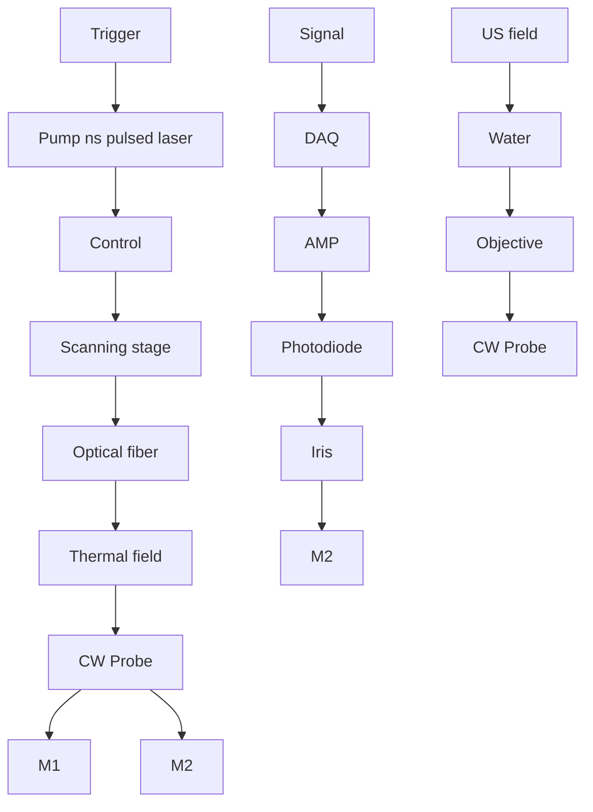

## O P T I C S

# Spatial-offset pump-probe imaging of nonradiative dynamics at optical resolution

Guo Chen1 †, Yuhao Yuan1 †, Hongli Ni1 , Guangrui Ding1 , Mingsheng Li1 , Yifan Zhu1 , Deming Li1 , Hongru Zeng1 , Hongjian He1 , Zhongyue Guo2 , Ji-Xin Cheng1,2 \*, Chen Yang1,3 \*

Nonradiative photothermal (PT) and photoacoustic (PA) processes have found widespread applications in imaging, stimulation, and therapy. Mapping the generation and propagation of PA and PT waves with high resolution is important to elucidate the interaction between nonradiative fields and biological systems. To this end, we introduce spatial-offset pump-probe imaging (SOPPI). By spatially offsetting the pump beam and the probe beam, SOPPI allows simultaneous imaging of PA/PT wave propagation with nanosecond temporal resolution, micrometer spatial resolution, 65-megahertz detection bandwidth, and a sensitivity of 9.9-pascal noise equivalent pressure. First, the PA and PT evolution from a fiber emitter and the subsequent wave interaction with a mouse skull and brain slices are demonstrated. Then, using water as the absorber, a wavelength-dependent PA/PT generation, evanescent wave–generated PA, and a back-propagated acoustic Mach cone with a tapered fiber are recorded. At last, a SOPPI-PACT is developed to reconstruct the pigment distribution inside a zebrafish larva with high precision and signal-to-noise ratio.

Copyright © 2025 The

Authors, some rights

reserved; exclusive

licensee American

Association for the

Advancement of

Science. No claim to

original U.S.

Government Works.

Distributed under a

Creative Commons

Attribution

NonCommercial

License 4.0 (CC BY-­NC).

## INTRODUCTION

Nonradiative relaxation is a process of energy transform without emitting photons when an excited state of a molecule or atom returns to a lower energy state. The energy released during the transition dissipates as heat transferring to other atoms or molecules in the surrounding environment. During the heat dissipation, the rising pressure caused by the rapid thermal expansion at given conditions could generate acoustic waves. For example, with nanosecond pulsed laser excitation, photothermal (PT) and photoacoustic (PA) effects, which are two nonradiative relaxation processes, occur sequentially when thermal and stress confinements were met (1). Both the thermal and acoustic effects in nonradiative relaxation play important roles when interacting with biological systems and have been deployed in sensing (2–6), imaging (7–12), therapy (13–16), neural stimulation (17–24), and more (25). Visualization of PA and PT processes opens opportunities to understand the mechanism of these processes and their functions in intervening biological systems.

Despite the significance, direct and simultaneous visualization of PA and PT has not been achieved. Temperature and pressure detection have not been integrated through a single platform. Traditionally, for PA detection, an ultrasound transducer or a hydrophone is used. But the limited bandwidths and acceptance angles hinder the applications in measuring PA signals with a broad frequency range and wide spatial distribution (26, 27). To solve that, optical cavity– based PA measurement has improved the bandwidth and acceptance angles (28–30). However, like the transducer and hydrophone, such devices cannot be used to measure signals within solid samples or in  situ. For PT detection, thermographic cameras have been widely used (31). However, the spatial and temporal resolution of thermographic cameras are limited by the detected wavelength of infrared light at a few microns and by the imaging speed of a few tens of frames per second, respectively.

Optical pump-probe techniques have been developed for detecting shockwave (32), PA (33), and PT (34) fields. Refractive index change induced by shockwave, PA, or PT with a pulsed pump beam could be observed by introducing a probe beam. By scanning the colocalized pump and probe beams, the spatial information of the absorbers can be mapped out. With such method, Zemp and coworkers reported PA remote sensing of blood vessels under the skin (2). More recently, Ni et al. (11) developed shortwave infrared PT microscopy to image the spatial distribution of lipid inside millimeter-thick tissues. While abovementioned point-scanning pump-probe imaging methods measure the local refractive index change at the absorbers, the environmental change caused by the PA and PT propagation in the surrounding medium is concealed. Beyond point-scanning pump-probe imaging, wide-field time-resolved interferometric pump-probe imaging is commonly used to measure wave propagation with a higher frame rate (35). Lately, streak cameras have been used for single-shot shockwave imaging (36,  37). Despite these advances, the limited memory of the camera hinders the recording of the full PA and PT lifetimes ranging from nanoseconds to micro- or even milliseconds. A method that can observe the spatial and temporal evolution of both PA and PT fields is lacking.

In this work, we introduce spatial-offset pump-probe imaging (SOPPI) to visualize the dynamic evolution of PA and PT fields with a temporal resolution of 5.5 ns. Distinct from conventional pointscanning co-localized pump-probe imaging, SOPPI spatially separates the pump and probe beams to detect the refractive index change both at the absorbers and in the surrounding where the fields propagate through. By fast digitization of the signal-carrying probe laser intensity at 180 MHz, SOPPI is able to map the spatial and temporal evolution of PT and PA fields. Our pump-probe approach offers a spatial resolution of 6 μm when detecting the PA/PT fields, which is 10 times better the typical hydrophone detection. Taking advantage of optical detection, SOPPI achieves pascal-level sensitivity by sensing the nonradiative relaxation–induced refractive index change that is generally smaller than 0.01 (2). This technique also

1 Department of Electrical and Computer Engineering, Boston University, Boston, MA 02215, USA. 2 Department of Biomedical Engineering, Boston University, Boston, MA 02215, USA. 3 Department of Chemistry, Boston University, Boston, MA 02215, USA.

\*Corresponding author. Email: jxcheng@bu.edu (J.-X.C.); cheyang@bu.edu (C.Y.) †These authors contributed equally to this work.

offers a broad detection bandwidth, covering ultrafast PA signals in the tens of MHz and slow PT signals that can persist for tens of mi croseconds. Our results suggest that SOPPI represents an advanced PA and PT imaging tool, offering broad frequency bandwidth, high spatial and temporal resolutions, high sensitivity at micromolar level, and angle-independent detection. These advantages make SOPPI not only an alternative to conventional piezo-based PA detection and thermal camera for PT detection but also a unique tool for noninvasive characterization of physical fields. Beyond measuring the evolution of PA and PT fields in far field, we also demonstrate the capability of SOPPI in capturing near-field physical phenomena, including acousto-thermal effects and evanescent wave–generated PA waves. What is more, owing to its highly sensitive and quantitative detection of PA signal, SOPPI serves as a programmable virtual transducer array with an element density at optical diffraction limit and can be coupled with PA computed tomography (PACT), termed as SOPPI-PACT, for the rapid image reconstruction of optical absorbers inside a small animal. Overall, SOPPI enables direct and simultaneous visualization of the evolution of PA/ PT waves and their interactions with biological tissue, offering a platform for the mechanistic study of PA/PT generation and rational design of PA/PT based medical devices.

## RESULTS

## SOPPI captures PA and PT signals simultaneously

To simultaneously visualize the PA and PT signals, we spatially separated the pump and probe foci. As shown in Fig. 1A, we have the probe beam fixed and scan the fiber emitter (FE) mounted on a twodimensional scanning state to map out the subtle change of refractive index induced by PA and PT effects and their evolution in the environment. The scanning step size is adjustable, ranging from 0.1 to 40 μm. This flexibility allows the total scanning area to vary from micrometer to centimeter scales.

To generate PA and PT fields, a 1064-nm, 5-ns pulsed laser was used as the pump. The pump laser was delivered through a multimode fiber to an absorber. A 1310-nm continuous wave laser was used to probe the generated fields. The probe beam was delivered through a 10× water-dipping objective and was collected by a 10× air objective. The collected probe beam was then detected by an amplified InGaAs photodiode with a 1310-nm band-pass filter and converted to electrical signals by a fast digitization card. The detected intensity is captured in the direct current (DC) channel. Details of the components can be seen in Materials and Methods. When the generated PA/PT signal interacts with the probe beam, the electrical signals will also be modulated and detected in the alternating current (AC) channel. The acquisition of signals is synchronized with the pump laser and the spatial scanning of the motorized translation stage. As a demonstration of spatial offset imaging of PA and PT waves, we used an FE to efficiently generate both PA and PT fields. The FE was made of a multimode optical fiber (FT200EMT, Thorlabs), with a layer of candle soot and a second layer of polydimethylsiloxane (PDMS) coated on the tip of the fiber. The strong absorption of candle soot and the large expansion coefficient of PDMS make this device an efficient PA emitter and PT generator as well (17).

A  

flowchart

D

natural_image

Grayscale image of a bright central spot with diffuse surrounding glow, scale bar indicating 5 μm (no text or symbols)

E  

line chart

| Time (ns) | Hydrophone Pressure (kPa) | SOPPI Pressure (kPa) | Impulse (arb. units) |
|-----------|---------------------------|---------------------|----------------------|
| 0         | 0                         | 0                   | 0                    |
| 100       | ~100                      | ~50                 | ~0.5                 |
| 200       | ~0                        | ~100                | ~1                   |
| 300       | ~-100                     | ~50                 | ~0.5                 |
| 400       | ~-100                     | ~0                  | ~0.5                 |
| 500       | ~-100                     | ~-50                | ~0                   |

B  

line chart

| Time (μs) | AC intensity (a.u.) - PT | AC intensity (a.u.) - PA | PA intensity (a.u.) - PT | PA intensity (a.u.) - PA | PA intensity (a.u.) - PA_Hilbert transform |
|-----------|--------------------------|--------------------------|--------------------------|--------------------------|---------------------------------------------|
| 0         | 0.00                     | 0.00                     | 0.00                     | 0.00                     | 0.00                                        |
| 10        | 0.05                     | 0.15                     | 0.05                     | 0.15                     | 0.10                                        |
| 20        | 0.04                     | 0.05                     | 0.04                     | 0.05                     | 0.05                                        |
| 30        | 0.03                     | 0.03                     | 0.03                     | 0.03                     | 0.03                                        |
| 40        | 0.02                     | 0.02                     | 0.02                     | 0.02                     | 0.02                                        |
| 50        | 0.01                     | 0.01                     | 0.01                     | 0.01                     | 0.01                                        |

scatterplot

| Pump energy (μJ) | PA pressure (kPa) | Material     |
| ---------------- | ----------------- | ------------ |
| 0.05             | 0.5               | SOPPI        |
| 0.1              | 1.0               | SOPPI        |
| 0.2              | 2.0               | SOPPI        |
| 0.5              | 5.0               | SOPPI        |
| 1.0              | 10.0              | Hydrophone   |
| 2.0              | 20.0              | Hydrophone   |
| 5.0              | 50.0              | Hydrophone   |
| 10.0             | 100.0             | Hydrophone   |
| 20.0             | 200.0             | Hydrophone   |
| 30.0             | 300.0             | Hydrophone   |
| 40.0             | 400.0             | Hydrophone   |
| 50.0             | 500.0             | Hydrophone   |
| 60.0             | 600.0             | Hydrophone   |
| 70.0             | 700.0             | Hydrophone   |
| 80.0             | 800.0             | Hydrophone   |
| 90.0             | 900.0             | Hydrophone   |
| 100.0            | 1000.0            | Hydrophone   |
| 1.0              | ~1.5              | SOPPI NEP    |
| 2.0              | ~2.5              | SOPPI NEP    |
| 5.0              | ~5.0              | SOPPI NEP    |
| 10.0             | ~10.0             | SOPPI NEP    |
| 20.0             | ~20.0             | SOPPI NEP    |
| 50.0             | ~50.0             | SOPPI NEP    |
| 100.0            | ~100.0            | SOPPI NEP    |
| 1.0              | ~1.5              | SOPPI NEP    |
| 2.0              | ~2.5              | SOPPI NEP    |
| 5.0              | ~5.0              | SOPPI NEP    |
| 10.0             | ~10.0             | SOPPI NEP    |
| 20.0             | ~20.0             | SOPPI NEP    |

Fig. 1. SOPPI is a spatially offset pump-probe method to measure the PA and PT fields generated by an FE. (A) Schematic of the SOPPI setup. US, ultrasound. DAQ, data acquisition; AMP, amplifier. (B) Representative AC signal detected by SOPPI. (C) Decomposition of the raw signal. Red, PT signal; green, PA signal; blue, PA signal after Hilbert transform. a.u., arbitrary unit. (D) Spatial resolution characterization of SOPPI using a 3-μm poly(methyl methacrylate) bead. (E) PA signals measured by hydrophone (orange) and SOPPI (yellow). (F) Peak-to-peak pressure measured by hydrophone and SOPPI and plotted as a function of pump energy.

A representative unprocessed signal generated by the FE in water was displayed as a function of time (Fig. 1B). Two components, in cluding a high-frequency bipolar PA signal (Fig.  1B, green dashed box) and a low-frequency slowly decaying PT signal (Fig.  1B, red dashed box), were observed. Because the central frequency of PA and PT signals are well separated (PA at megahertz and PT < kilohertz), a high-pass filter with a cutoff frequency at 500 kHz can effectively distinguish both signals (Fig. 1C). A Hilbert transform was applied to show the intensity of the PA signal (Fig. 1C, blue dashed line).

By measuring a 3-μm poly(methyl methacrylate) bead as the absorber (Fig. 1D), we showed that the spatial resolution of the system is 6.1 μm, which matches the theoretical value calculated with 1310-nm wavelength of the probe laser and an effective numerical aperture of 0.13. Because both the imaging of PA and PT field are mapped through this same probe beam, the spatial resolution is applied to both PA and PT imaging results. The temporal resolution of 5.56 ns of the system was determined by the 180 MHz sampling speed of the digitizer. We also characterized the pressure sensitivity of our SOPPI system by measuring the PA signals and comparing them to the results measured by a commercial hydrophone (HGL-0085, Onda) (Fig.  1E). The distance between the FE tip and the hydro phone/probe beam was precisely controlled to be 300 μm by maintaining the delay between the trigger of the pump beam and the signal. The SOPPI signal showed a broader detection bandwidth [full width at half maximum (FWHM)  of 51 MHz] (yellow,  Fig.  1E), with a central frequency at 41 MHz, while the hydrophone result showed a frequency spectrum centered at 20 MHz with an FWHM of 38 MHz (orange, Fig. 1E). We calibrated the SOPPI signal intensity with the hydrophone measured PA pressure using different pump beam pulse energy from 5 to 15 μJ (Fig. 1F). Both the hydrophone and SOPPI results showed a linear relationship between the signals and input energy (coefficient of determination $\dot { R } ^ { 2 } = 0 . 9 9 8 2$ for hydrophone measurement and R2 = 0.9988 for SOPPI) (Fig. 1F). The lower boundary of the detection limit of the hydrophone was reported to be \~1 kPa (38). SOPPI shows a noise equivalent pressure (NEP) of 9.9 Pa (fig. S1, average n = 400), which is two orders better than the hydrophone, and one order better than piezo-based transducers (39). We also measured the PA signal generated by aggregated hemoglobin (hemoglobin human, Sigma-Aldrich) in water using a 532-nm pulsed laser as the pump. The signal to noise ratio is 17.0 for hemoglobin at a concentration of 1.25 mg/ml, corresponding to a limit of detection of 3.4 μM (details of calculation in fig. S1). Compared with other optical detection methods, SOPPI’s NEP is also better than most interferometry-based detection methods and comparable to microring resonators (40). In summary, SOPPI offers high sensitivity at the order of 10 Pa, high spatial resolution at the optical diffraction limit, and high temporal resolution at the nanosecond level in detecting PA signals and allows observation of subtle changes of pressure/temperature that are unreachable by previous methods.

## SOPPI reveals complex evolution of PT and PA fields

By spatially offsetting the pump and probe beam, SOPPI allows simultaneous visualization of PT and PA fields. We measured the PA/ PT dynamics generated from the FE by spatially scanning the FE sample and the adjacent environment with the probe laser while the pump laser repeatedly illuminated the FE sample. Through a single scanning, the PA and PT fields were mapped out simultaneously by SOPPI. Figure 2A displays an overlaid image of PA (green) and PT (red) signals at every 100 ns from 0 to 1400 ns. Figure 2A and movie S1 show that, while the PA signal propagated along the x axis (green), the PT signal was localized (red).

With a broad detection bandwidth, SOPPI shows that PA waves with different frequencies behave differently when propagating. Noting that the high-frequency ultrasound propagated more directional and that the low-frequency ultrasound propagated more omnidirectional, we decomposed the raw signal into a high-frequency component and a low-frequency component by applying a 10-MHz high/low-pass digital filter. The representative wavefront of each component at 400 ns (Fig. 2, B and E), the corresponding PA signal and the frequency spectrum (Fig. 2, C and F) were shown. We plotted the PA signal amplitude as a function of the location of both the high-frequency PA component (Fig.  2B, bottom) and the lowfrequency component (Fig. 2E, bottom). From this result, the wavelength of the high-frequency PA was measured to be 75 μm and the wavelength of the low-frequency PA was 150 μm, consistent with the frequency analysis shown in Fig. 2 (C and F).

The two different PA components show distinct spatial distribution. With higher frequency and smaller wavelength, the highfrequency component generated a focus at 120 μm away from the fiber tip (Fig. 2D, yellow). This is because the spherical shape of the PDMS coating formed an acoustic lens and focused the ultrasound. In contrast, the low-frequency component of the ultrasound (Fig. 2D, blue) started to decay immediately after being emitted from the FE sample. This is because the 200-μm diameter of the FE, which also acts as the aperture of the acoustic lens, made it hard to focus the low-frequency ultrasound with a wavelength of 150 μm. Because the minimum detection element size of a commercialized needle hydrophone is 45 μm, it is impossible for such a hydrophone to map out a precise spatial field distribution of ultrasound with a wavelength smaller than 90 μm (twice the element size based on the Nyquist sampling law). Together, SOPPI provides a unique and superior capability to visualize the spatial distribution of the ultrasound with optical resolution.

To map the temporal evolution at given locations and spatial distribution of the PT field, we recorded a time trace of 45 μs to observe both its rise and fall (Fig. 2H). We applied the maximum intensity projection of the PT traces to show the PT distribution inside and outside the fiber (Fig. 2G). The maximum intensity projection was normalized by the DC signal to better quantify the relative temperature increases at different locations. A noticeable temperature increase was observed inside the FE (Fig. 2I). The boundary between the fiber and water acted as a thermal insulator, localizing the heat due to water’s low thermal conductivity.

As an optical detection method, SOPPI can access information inside the absorber as long as the probe laser can be detected. To demonstrate this, we use SOPPI to visualize the spatial and temporal evolution of PA and PT signals inside the FE (fig. S2). The PA and PT signals are initially generated inside the coating of the FE within the first 50 ns (fig. S2A). After that, the PA signal (green) propagated

A  

text_image

PT
PA
0 ns
400 ns
800 ns
1200 ns
Fiber emitter
Propagates
200 µm

B

text_image

High frequency (above 10 MHz)
200 µm

C  

line chart

| Time (ns) | Pressure (a.u.) | Frequency (MHz) |
| --------- | --------------- | --------------- |
| 0         | 0.0             | 0               |
| 20        | 0.1             | 20              |
| 40        | -0.1            | 40              |
| 60        | 0.0             | 60              |
| 80        | 0.0             | 80              |

D

line chart

| x position (µm) | Intensity (a.u.) |
| --------------- | ---------------- |
| 0               | 0.8              |
| 50              | 1.0              |
| 100             | 1.2              |
| 150             | 1.3              |
| 200             | 1.2              |
| 250             | 1.1              |
| 300             | 1.0              |
| 350             | 0.9              |
| 400             | 0.7              |

E  

text_image

Low frequency (below 10 MHz)
0.03
0.01
0.00
-0.01
-0.03
200 µm

F  

line chart

| Time (ns) | Pressure (a.u.) | Frequency (MHz) |
| --------- | --------------- | --------------- |
| 0         | -0.02           | 0               |
| 100       | 0.02            | 20              |
| 200       | -0.02           | 40              |
| 300       | 0.01            | 60              |
| 400       | -0.01           |                 |
| 500       | 0.01            |                 |
| 600       | 0.00            |                 |
| 700       | 0.01            |                 |
| 800       | 0.00            |                 |

line chart

| x position (μm) | Intensity (a.u.) |
| --------------- | ---------------- |
| 0               | 0.03             |
| 100             | 0.025            |
| 200             | 0.02             |
| 300             | 0.015            |
| 400             | 0.02             |

G  

text_image

G
PT
Inside
Outside

H

line chart

| Time (μs) | Inside | Outside |
| --------- | ------ | ------- |
| 0         | 0.00   | 0.00    |
| 5         | 0.00   | 0.00    |
| 10        | 0.07   | 0.00    |
| 15        | 0.06   | 0.00    |
| 20        | 0.05   | 0.00    |
| 25        | 0.04   | 0.00    |
| 30        | 0.03   | 0.00    |
| 35        | 0.02   | 0.00    |
| 40        | 0.02   | 0.00    |
| 45        | 0.02   | 0.00    |
| 50        | 0.02   | 0.00    |

I  

line chart

| Distance (μm) | PT intensity (a.u.) |
| ------------- | ------------------- |
| 0             | 0.038               |
| 10            | 0.039               |
| 20            | 0.037               |
| 30            | 0.040               |
| 40            | 0.005               |
| 50            | 0.006               |
| 60            | 0.005               |
| 70            | 0.006               |
| 80            | 0.005               |
| 90            | 0.004               |
| 100           | 0.003               |

Fig. 2. SOPPI reveals the spatial evolution of PA and PT signal generated by an FE. (A) An overlaid image of PA (green) and PT (red) signals at every 100 ns from 0 to 1400 ns. Red, PT; green, PA intensity. (B) High-frequency component of the PA signal from (A). Bottom: PA signal amplitude plotted as a function of location. (C) Time trace and Fast Fourier transfer of the high-frequency component of the PA signal. (D) Spatial distribution of high-frequency PA (orange) and low-frequency PA (blue). (E) Lowfrequency component of the PA signal from (A). Bottom: PA signal amplitude plotted as a function of location (F) Time trace and fast Fourier transfer of the low-frequency component of the PA signal. (G) Spatial distribution of the normalized PT signal generated by an FE. (H). Representative time trace of the PT signal inside and outside the FE. (I). PT intensity plotted as a function of distance away from the FE.

out of the FE and was partially reflected because of the acoustic impedance mismatch at the PDMS/water boundary. Energy converts from mechanical wave into heat occurred at this boundary. To quantify this acousto-thermal process, we plotted the raw signal traces at two locations: one at the FE boundary (fig. S2, A and B, yellow) and the other inside the FE (fig. S2, A and C, blue). Signals from both locations exhibited high-frequency components initially, followed by prolonged PT heating lasting more than 20 μs. The boundary region experienced an additional secondary heating process on top of the PT baseline within the first 3 μs. These results show that, with the optical spatial resolution and nanosecond temporal resolution, SOPPI reveals rapid near-field energy conversion not accessible with traditional detectors such as transducers.

## SOPPI maps water-generated fields via a tapered fiber

Water is a strong absorber in the short-wave infrared window and has been widely used for infrared PT neuromodulation (41). PA imaging of water content in skin at 1540 nm was recently demonstrated. The PA signal generated by skin water was used for ultrasound imaging (42). To better harness water as an endogenous PT and PA

emitter, we acquired the nonradiative dynamics of water excited at wavelengths from 1200 to 2100 nm covering two major absorption bands of water. The tunable pump laser was delivered through a tapered optical fiber with a tip size smaller than 50 μm (Fig. 3A). In this specific setup, the emitted laser generated an evanescent wave on the side of the fiber in the tapering region. Both the direct emission and the evanescent wave were absorbed by water, leading to the generation of PA and PT fields (Fig. 3B). This complex interaction involved water absorption at different wavelengths, as well as various nonradiative emissions occurring in both the near and the far fields, making it challenging to visualize using traditional methods.

By sweeping the wavelength of the pump laser, PA signals at the same location, 160 μm away from the tapered fiber tip, were recorded by SOPPI at two absorption peaks (Fig. 3C). The generated PA amplitude as a function of wavelength exhibited two peaks at 1448 and 1928 nm (Fig. 3D, red curve), consistent with the reported absorption spectrum of water (Fig.  3D, black curve) (43). A frequency analysis was performed for wavelength-dependent water absorption (Fig. 3E). The central frequency was indicated by the red solid line, and the −6-dB bandwidth was shown by the white dashed line. The analysis revealed that, at the absorption peak of 1928 nm, water generated a PA signal with a broader bandwidth compared to the signal at 1448 nm, which can be explained by the smaller absorption volume with higher optical attenuation at 1928 nm (44).

  
Fig. 3. SOPPI of PA/PT fields generated by water through a tapered optical fiber. (A and B) Schematic of the imaging setup. Near-infrared (NI R) nanosecond pulsed laser was coupled into a tapered optical fiber. Water served as the absorber as well as the acoustic coupling medium. US, ultrasound. (C) PA signals generated from water at different wavelength of pump laser at a location 160 μm away from the tip. (D and E) PA amplitude and frequency spectrum under different wavelength of pump laser in NI R. (F to J) Spatial distribution of PA (green and yellow) and PT fields (red) at 0 to 200 ns after the laser was turned on. Dashed boxes: Evanescent wave absorption (blue), Mach cone (orange), and tip of the tapered fiber (green). (K) Three PA waves from evanescent wave absorption (blue), Mach cone (orange), and tip of the tapered fiber (green) at 1920 nm pump. The signal was measured at the “probe” point labeled as purple.

To visualize the spatial distribution of both PA and PT fields, we tuned the pump laser to 1928 nm, corresponding to the strongest absorption peak of water in the near-infrared range. Propagation of ultrasound within 200 ns after the pump was recorded (movie S2). Frames at each 50 ns were displayed (Fig. 3, F to J), where the green and yellow represented the positive and negative amplitudes of PA, and the red represented the intensity of PT. A propagating PA field in water and a localized PT field at the boundary between the tapered fiber and water were observed.

Unlike the PA/PT fields generated by the FE described earlier, the tapered optical fiber generated fields not only at its tip but also along its edge, due to water absorption of evanescent waves in the tapered region of the fiber. When a multimode fiber is tapered, the core with a decreasing diameter no longer holds the higher-order modes, causing them to leak into the cladding layer of the fiber (45). Consequently, the cladding-water boundary acts as a total internal reflection interface within this waveguide. Stronger evanescent waves occurred on the water side due to total internal reflection at the water interface and were absorbed to produce PT (red along the fiber edge) and PA (Fig. 3, J and K, blue boxes).

In addition to forward and lateral ultrasound emission, we also observed part of the signal propagating backward through the fiber. Given that the fiber is made of silica, a material with a sound speed three times higher than that of water, the back-propagated ultrasound formed a shock wave in water, creating a Mach cone with a triangular shape (Fig.  3, J and K, orange boxes). Together, SOPPI captures the evolution of this complex physical process with its 10-Pa NEP sensitivity, optical spatial resolution, and nanosecond temporal resolution.

## SOPPI maps field evolution in a scattering environment

Ultrasound has been widely used in brain imaging and stimulation. Understanding how ultrasound interacts with brain tissue and the skull is essential for designing and optimizing the technology for biomedical applications. Yet, visualizing wave propagation inside highly scattered biological samples including brain slices and skulls is not possible for physical devices like transducers or hydrophones. SOPPI offers this unique capability of imaging the interaction between ultrasound and tissues.

With a 1310-nm laser as the probe, we demonstrated SOPPI of ultrasound through brain slices with a thickness of 500 μm as an example of highly scattered objects (Fig. 4, A to C). The ultrasound went through the coronal plane of a mouse brain slice in phosphatebuffered saline (PBS). To quantitatively compare the ultrasound intensity before and after penetrating the brain, we first scanned the probe beam over the sample without the pump laser to obtain the DC image of the brain slice with a scanning step size of 6 μm (Fig. 4A). Although this setting slightly sacrifices the spatial resolution, it greatly improves the imaging speed. Because our imaging target, the ultrasound wave, has a wavelength greater than 50 μm, the step size of 6 μm still allows extracting the feature of ultrasound wave propagation inside the tissues. Next, with the pump laser activated, we captured the PA signal intensity map, which is the AC signal (Fig. 4B). Because the AC signal amplitude can be influenced by the DC intensity in complex biological samples due to the scattering of the probe photons, we normalized the AC mapping results using the DC image (Fig. 4C). This approach enables a quantitative comparison of the PA intensity distribution outside and inside the brain slice. After the normalization, the AC/DC, which is the modulation depth, is used to represent the relative ultrasound intensity and to map out the field distribution inside and outside the brain slice. The incident and transmitted PA signal amplitude is plotted as a function of time in Fig. 4D. By plotting the ultrasound amplitude as a function of distance to the acoustic source (Fig. 4E), we did not observe notable decay and reflection of PA waves when propagating through the brain/PBS interface. This finding suggests that more than 99% of the ultrasound energy delivered into the brain tissue, which can be attributed to the low acoustic impedance mismatch between PBS and brain tissue. This result is consistent with the calculation (see the Supplementary Materials). In ultrasound imaging and stimulation, the brain tissue itself has negligible attenuation to ultrasound. The ultrasonic wave propagation is quantitatively mapped inside the brain tissue and can only be achieved by SOPPI's non-invasive detection.

“Seeing” through an intact skull remains challenging for optical imaging. Due to the high scattering and attenuation from the skull, PA or PT fields inside the skull cannot be imaged directly, mapping PA waves across the skull boundary still provides insights into understanding acoustic interaction with the skull. We here used an FE to generate the ultrasound and placed it toward the mouse skull (C57BL/6J) as shown in the DC image (Fig. 4F). Upon reaching the skull, the ultrasound experienced a strong reflection due to the high acoustic impedance mismatch between the skull and the water. A maximum intensity mapping of PA signals was performed to visualize the PA field (Fig. 4G). Despite this, around 21% of ultrasound was able to penetrate the skull and deflect at a small angle, likely due to the skull’s uneven surface. A video of the PA waves propagating through the skull was recorded, and frames at each 100 ns were shown (movie S3 and Fig. 4H).

## SOPPI serves as a virtual transducer array for PACT

With its highly sensitive and quantitative detection of PA signals, SOPPI can also reconstruct the absorber distribution within an animal body using a PACT beamforming algorithm. For demonstration, a zebrafish larva was fixed in agarose gel and illuminated with a 532-nm nanosecond laser as a pump. The scanned probe beam around the zebrafish serves as a programmable virtual transducer array, detecting PA signals emitted by pigments inside its body (Fig. 5A).

PA signals centered at 30 MHz were captured by SOPPI, leveraging its broad bandwidth detection capability (Fig. 5B). In this case, the PA signal detected by SOPPI is generated by the endogenous absorbers inside the zebrafish. Thus, the frequency components of the emitted signal are different from the previous PA signals in Figs. 1 and 2 that are generated by FE. Owing to the broadband detection feature of SOPPI, all those different information from different ultrasound frequencies could be captured and used in the reconstruction of the image. Using a weighted–delay-and-sum beamforming algorithm, the pigment distribution of the zebrafish was reconstructed, as shown in Fig. 5D. Details of the algorithm are provided in the Supplementary Materials. For reference, a transmission image and the overlaid results are presented in Fig. 5 (C and E). In the overlaid images, key anatomical features such as the eyes (E), yolk (Y), swim bladder (B), and dorsal stripe (DS) are clearly identified.

A  

text_image

US penetrating a brain slice
FE PBS Brain
DC

B  

natural_image

Thermal or scientific imaging view showing a bright flame-like region with a dashed line and label 'AC' in the corner (no readable text or symbols beyond labels)

C

natural_image

Thermal imaging view showing heat distribution with a dashed line and label 'AC/DC' (no readable text or symbols beyond label)

D  

line chart

| Time (ns) | Incident US | Transmitted US |
| --------- | ----------- | -------------- |
| Outside   | ~0.0        | ~0.0           |
| Inside    | ~0.0        | ~0.0           |
| 500       | ~0.0        | ~0.5           |
| 1000      | ~0.0        | ~0.0           |

E  

line chart

| Location (μm) | After normalization | Before normalization |
| ------------- | -------------------- | --------------------- |
| 0             | ~0.8                 | ~0.7                  |
| 100           | ~1.6                 | ~0.5                  |
| 200           | ~0.8                 | ~0.3                  |
| 300           | ~1.2                 | ~0.4                  |
| 400           | ~1.0                 | ~0.3                  |
| 500           | ~0.9                 | ~0.3                  |
| 600           | ~0.8                 | ~0.3                  |
| 700           | ~0.9                 | ~0.3                  |
| 800           | ~0.8                 | ~0.3                  |
| 900           | ~0.7                 | ~0.3                  |
| 1000          | ~0.6                 | ~0.3                  |

F  
US penetrating a mouse skull  

text_image

DC
Skull
FE
200 µm

G  

text_image

PA
intensity
Skull
200 µm

H  

text_image

PA
Skull
t = 0 ns

text_image

t = 300 ns

text_image

t = 600 ns

text_image

t = 100 ns

text_image

t = 400 ns

natural_image

Microscopic image showing fluorescent signal patterns with a dashed white line and color scale bar (no text or symbols)

text_image

t = 200 ns

natural_image

Microscopic image showing fluorescently labeled structures with a dashed boundary line, no text or symbols present.

text_image

t = 800 ns

Fig. 4. SOPPI of ultrasound penetrating through mouse brain tissue and skull. (A) Transmission DC image of the FE and a brain slice with 500-μm thickness. Scale bar, 100 μm. (B) Spatial distribution of FE-generated PA field in brain slice. (C) Spatial distribution of PA signal after normalization with respect to DC signals. (D) Representative time trace of the incident/transmitted PA signal. (E) PA signal intensity before/after penetrating the brain slice. (F) Transmission DC image of the FE and a piece of mouse skull. (G) Spatial distribution of the PA field across the skull. (H) Nine representative frames of PA wave penetrating the skull. US, ultrasound.

In the reconstructed PACT image, the small pigments on the dorsal stripe are clearly visualized, demonstrating a spatial resolution of 26 μm. This resolution is substantially superior to other PACT systems that use physical transducer arrays. We attribute this improvement to three major factors: broad detection bandwidth, full-angle detection, and high element density.

The broadband detection capability of SOPPI-PACT, as illustrated in Fig. 5B, features a PA signal centered at 30 MHz with a frequency range extending up to 60 MHz. Higher-frequency components enable the recording and reconstruction of finer details in the image. Second, full-angle detection plays a crucial role by capturing comprehensive information regardless of the size, location, or geometry of the sample. In a transducer-based PACT system, limited view ing angles pose a challenge to imaging quality due to the restricted acceptance angle of linear transducer arrays. Even within their acceptance angle, sensitivity varies with the incident angle of the signals, causing information loss. Addressing this issue typically requires expensive hollow transducer arrays. In contrast, SOPPI uses a probe beam that acts as a virtual transducer and can be adaptively scanned around the sample collecting information emitted from all different angles (Fig. 5F). This full-angle detection capability substantially reduces image distortion and enables the reconstruction of more detailed information, as shown in Fig. 5F.

A  

text_image

532-nm pump laser
Probe
Zebrafish
Ultrasound
D

B  

line chart

| Time (ns) | Pressure (a.u.) | Magnitude |
| --------- | --------------- | --------- |
| 100       | -0.1            | 0         |
| 200       | 0.1             | 1         |
| 300       | 0.0             | 0.5       |
| 400       | 0.0             | 0         |

C  

text_image

Transmission

text_image

PACT

E  

text_image

Transmission
Pigment
(Y)
(B)
(E)
(DS)
Amplitude (norm.)
500 µm
Distance (µm)

F  

text_image

Full-angle detection
One-side detection
G
XSSIM
SOPPI classic
XPSNR
15
20
25
30
35
15
18
17

  
Fig. 5. PACT of a zebrafish using SOPPI. (A) Schematic of a PACT imaging of a zebrafish using SOPPI. The probe beam was scanned around the zebrafish following the yellow dashed line. (B) Representative PA signal generated by pigments inside the zebrafish and detected by SOPPI. (C) Transmission imaging of a zebrafish. (D) Reconstructed mapping of pigments inside the zebrafish using SOPPI-PACT. (E) Overlap of transmission and PACT results. (F) Comparison of SOPPI-PACT and classic PACT results. (G) Comparison of cross-structural similarity index (XSSIM) and cross-peak SNR (XPSNR) between SOPPI-PACT and classic PACT.

The third advantage of SOPPI-PACT lies in its higher element density, which can surpass traditional transducer arrays by an order of magnitude. The smallest pitch size of commercially available transducer array is \~100 μm, whereas SOPPI achieves a pitch size of 10 μm. Besides, SOPPI-PACT can increase the element density along the wave propagation direction without sacrificing the detection bandwidth, which cannot be achieved by traditional transducer. This increase in element density leads to substantial improvements in the signal-to-noise ratio (SNR) of reconstructed images. To simulate the pitch size of traditional transducer arrays, we grouped 10 SOPPI elements into a single equivalent element and reconstructed the zebrafish larva image using the same algorithm. Clear differences can be observed between SOPPI-PACT and simulated traditional PACT (Fig. 5F). In the traditional PACT image, background noise is substantially higher, and detailed features, such as the pigments on the dorsal stripe, are lost. To quantitatively compare the image quality between SOPPI-PACT and traditional PACT, we calculated the cross-structural similarity index and cross-peak SNR (XPSNR) for both methods (Fig. 5G, detailed definition can be seen in the Supplementary Materials). Besides, as is shown in fig.  S5, while both classic PACT and SOPPI-PACT have imaging background, the noise level is greatly improved in SOPPI-PACT with a XPSNR improved from 17.23 to 27.99, which leads to an improved ability to extract features with lower absorption coefficient and lower PA intensity. The results demonstrate that SOPPI-PACT outperforms traditional PACT in both metrics, further validating the superiority of SOPPI over conventional transducer approaches.

## DISCUSSION

We have developed a scattering/deflection-based SOPPI system for mapping fast nonradiative dynamics at optical resolution. PA and PT effects are two major forms of nonradiative relaxation. Compared to traditional transducer-based measurements of the PA field, SOPPI also offers several advantages. First, the detection bandwidth of SOPPI is 65 MHz limited by the digitizer, which theoretically could be much improved to even gigahertz with high-frequency photodiodes and digitizers, while traditional piezo-based transducers typically operate within a narrow detection bandwidth. The broad detection bandwidth of SOPPI allows a less biased detection of acoustic waves at different frequencies. Second, transducer-based PA measurements often suffer from limited view angles due to the varying sensitivity of PA signals at different incident angles. In contrast, the orthogonal probing of SOPPI enables the detection of PA signals from all angles without bias. Third, while it is challenging to directly characterize the temperature sensitivity in the small volume of 6 μm in our experiment, the optical deflection method for detecting PA and PT signals has been shown to be sensitive to detect the temperature change. Through both experiments and simulations, in bulk medium, Jackson et al. (34) reported in 1981 PT measurement of a minimum temperature increase of $1 0 ^ { - 4 \circ } \mathrm { C }$ in air and $1 0 ^ { - 6 \circ } \mathrm { C }$ in CCl with 1-cm interaction length. Such sensitivity enables SOPPI to observe subtle changes within a sample. Last, the PA field measured with piezo-based transducers has relatively low spatial resolu tion constrained by the acoustic wavelength, typically in the range of tens of microns. In contrast, SOPPI intrinsically achieves optical resolution that depends on the numerical aperture of the objective lens and the probe wavelength.

Taking advantage of its quantitative measurement and optical spatial resolution, SOPPI can also function as a virtual ultrasound transducer array for PACT. This SOPPI-PACT system is highly programmable and features an exceptional element density, resulting in a substantial improvement in SNR compared to traditional transducer array-based PACT. Now, SOPPI-PACT has been demonstrated on small animals such as zebrafish and holds potential for applica tions in larger mammalian models, including mice and even human.

By SOPPI of PA and PT fields generated by an FE, we confirmed that, with a 5-ns 1064-nm pulsed laser as the pump, the PT was locally confined in the 200-μm PDMS coating, and the heat dissipa tion outside the FE was undetectable. This result implies that the generated heat has a limited impact on the surrounding environment. Similar to most of pump-probe measurements, SOPPI has limitations to image non-repeatable events. But SOPPI still has a high impact on many applications as mentioned above.

Due to the low repetition rate of the current pump laser, recording a video of 100 μs with a millimeter-level field of view at optical resolution normally takes hours to finish. The total acquisition time could be improved by 100 times by using a pump laser with a kilohertz repetition rate. Also, due to the low imaging speed, the probe laser power’s fluctuation can induce line artifacts that are now present in the DC image in Fig. 4. This can be improved if the scanning can be speeded up or changing to a probe laser with better power stability. A more sensitive detector like an avalanche photodiode could be used to improve the sensitivity of SOPPI. Alternatively, adopted from oblique back-illumination microscopy and oblique PT microscopy (46), the detector could be placed close to the sample on the illumination side and collect the back-propagated transmission photons, which can circumvent the high scattering of turbid samples.

SOPPI opens potentially exciting applications. SOPPI enables the visualization of the frequency and directional properties of the PA field for individual FEs in practical settings, providing valuable guidance for the development and optimization of FEs in real-world applications. Additionally, SOPPI can be used to study material properties, as PA and PT effects are strongly influenced by mechanical characteristics such as viscosity, Young’s modulus, and thermal conductivity. Furthermore, intriguing phenomena, such as the acousto-thermal effect demonstrated in this study, can be explored in greater detail. The tunability of the pump laser further expands its potential by enabling the targeting of different molecules with varying absorption properties.

In summary, SOPPI offers a sensitive way to visualize the fast dynamics of PA and PT waves. The wave evolution, including generation and propagation, in either clear medium or highly scattered tissue samples could be observed. This technique opens opportunities in improving the design of PA and PT emitters through mapping the emitted ultrasound and the temperature fields, visualizing near-field physical dynamics occurring at the various boundaries, and improving clinical ultrasound treatments through characterizing the ultrasound field after penetrating the human body.

## MATERIALS AND METHODS

## FE fabrication

A multimode fiber (FT200EMT, Thorlabs Inc., NJ, USA) with 200-μm core diameter was used. The PA coating was composed of candle soot and PDMS. Candle soot was chosen as the absorber because of its great absorption coefficient. The multimode optical fiber was exposed to the candle flame for around 3 to 5 s until the fiber tip was fully coated, with the thickness of the candle soot controlled by the deposition time. To prepare PDMS, the silicone elastomer (Sylgard 184, Dow Corning Corporation, USA) was carefully dispensed into a container to minimize air entrapment and then mixed with the curing agent in a ratio of 10:1 by weight. A nanoinjector deposited the prepared PDMS onto the tip of the candle soot–coated fiber and, thus, formed a layered structure. The position of the fiber and the nanoinjector were both controlled by three-dimensional manipulators (MT3, Thorlabs Inc., NJ, USA) for precise alignment, and the PDMS coating process was monitored in real time under a lab-built microscope. The coated fiber was then cured overnight at room temperature.

## Optical fiber tapering

To control the tapering, a multimode fiber (FT200EMT, Thorlabs Inc., NJ, USA) was pulled at one end by a traction weight with the other end fixed. The pulling force, determined by the weight of the traction object, was found to be proportional to the square of the tapered end radius.

## SOPPI system

SOPPI was performed with a modified microscope. The pump laser was at 1064 nm with a 5-ns pulse duration and 20-Hz repetition rate (OPOLETTE 355 LD, OPOTEK) for PA/PT generation and then coupled into a 200-μm core fiber (M25L01, Thorlabs) using a collimator (F220SMA-1550, Thorlabs). The fiber was connected with other fiber devices, for example, FE for brain slice or tapered fiber for water-generated ultrasound imaging, through a fiber mating sleeve (ADASMA, Thorlabs). A continuous wave 1310-nm laser (1310LD-4-0-0, AeroDIODE Corporation) serves as the probe with a power of 5 mW after the objective. The probe laser was sent to a water dipping objective (UMPLFLN 10XW, Olympus) for illumination and collected by an air objective (MPlanFLN 10×, Olympus). The signal-carrying probe laser was detected by an amplified InGaAs photodiode (PDA05CF2, Thorlabs) with a 1310-nm band-pass filter (FBH1310-12, Thorlabs). The output signal was connected to a 50-ohm resistor, amplified by a 46-dB amplifier (100-MHz bandwidth, SA230F5, NF Corporation), and digitized by a data acquisition card at 180 MSa/s (ATS9462, Alazar Tech), equivalent to 5.6-n temporal resolution. A translation stage (ProScan III, Prior) was used to scan the fiber that delivered the pump laser and the generated PA/PT fields with a step size tunable from 1 to 20 μm. The data collection was triggered by both the pump pulse and the translation stage. Each pixel corresponds to a single pump pulse.

## SOPPI of biological tissues

All experimental procedures have complied with all relevant guide lines and ethical regulations for animal resting and research established and approved by the Institutional animal care and use committee of Boston University (PROTO201800534). Adult C57BL/6J mice (age 14 to 16 weeks) were euthanized and perfused transcardially with PBS (1×, pH 7.4, Thermo Fisher Scientific Inc.) solution and 10% formalin. After fixation, the brain was extracted and fixed in 10% formalin solution for 24 hours. The fixed mouse brain was immersed in 1× PBS solution and sliced into coronal sections with a 500-μm thickness using an Oscillating Tissue Slicer (OST-4500, Electron Microscopy Sciences). Brain slices were gently transferred by a brush into 10% formalin solution for another 24 hours of fixation and fixed on a glass substrate for pump-probe imaging.

## Data analysis

The pump-probe imaging data were processed through MATLAB R2023b and ImageJ. The PA and PT traces were created using MATLAB R2023b and Prism9.

## Supplementary Materials

The PDF file includes:

Figs. S1 to S5

Legends for movies S1 to S3

Other Supplementary Material for this manuscript includes the following:

Movies S1 to S3

## REFERENCES AND NOTES

1. S. Manohar, D. Razansky, Photoacoustics: A historical review. Adv. Opt. Photonics 8, 586–617 (2016).  
2. P. Hajireza, W. Shi, K. Bell, R. J. Paproski, R. J. Zemp, Non-interferometric photoacoustic remote sensing microscopy. Light Sci. Appl. 6, e16278 (2017).  
3. S. Palzer, Photoacoustic-based gas sensing: A review. Sensors 20, 2745 (2020).  
4. A. C. Tam, Applications of photoacoustic sensing techniques. Rev. Mod. Phys. 58, 381–431 (1986).  
5. A. C. Tam, B. Sullivan, Remote sensing applications of pulsed photothermal radiometry. Appl. Phys. Lett. 43, 333–335 (1983).  
6. W. Jin, Y. Cao, F. Yang, H. L. Ho, Ultra-sensitive all-fibre photothermal spectroscopy with large dynamic range. Nat. Commun. 6, 6767 (2015).  
7. M. Xu, L. V. Wang, Photoacoustic imaging in biomedicine. Rev. Sci. Instrum. 77, 04110 (2006).  
8. L . V. Wang, J. Yao, A practical guide to photoacoustic tomography in the life sciences. Nat. Methods 13, 627–638 (2016).  
9. J. Yao, L. V. Wang, Photoacoustic microscopy. Laser Photonics Rev. 7, 758–778 (2013).  
10. M.-­H. Chien, M. Brameshuber, B. K. Rossboth, G. J. Schütz, S. Schmid, Single-molecule optical absorption imaging by nanomechanical photothermal sensing. Proc. Natl. Acad. Sci. U.S.A. 115, 11150–11155 (2018).  
11. H . Ni, Y. Yuan, M. Li, Y. Zhu, X. Ge, J. Yin, C. P. Dessai, L. Wang, J.-X. Cheng, Millimetre-deep micrometre-resolution vibrational imaging by shortwave infrared photothermal microscopy. Nat. Photonics 18, 944–951 (2024).  
12. Y. Yuan, G. Zhang, Y. Chen, H. Ni, M. Li, M. Sturek, J.-X. Cheng, A high-sensitivity high-resolution intravascular photoacoustic catheter through mode cleaning in a graded-index fiber. Photoacoustics 29, 100451 (2023).  
13. H . S. Han, K. Y. Choi, Advances in nanomaterial-mediated photothermal cancer therapies: Toward clinical applications. Biomedicine 9, 305 (2021).  
14. D . Zhi, T. Yang, J. O’Hagan, S. Zhang, R. F. Donnelly, Photothermal therapy. J. Control. Release 325, 52–71 (2020).  
15. K. Yang, S. Zhao, B. Li, B. Wang, M. Lan, X. Song, Low temperature photothermal therapy: Advances and perspectives. Coord. Chem. Rev. 454, 214330 (2022).  
16. A. R. Rastinehad, H. Anastos, E. Wajswol, J. S. Winoker, J. P. Sfakianos, S. K. Doppalapudi, M. R. Carrick, C. J. Knauer, B. Taouli, S. C. Lewis, A. K. Tewari, J. A. Schwartz, S. E. Canfield, A. K. George, J. L. West, N. J. Halas, Gold nanoshell-localized photothermal ablation of prostate tumors in a clinical pilot device study. Proc. Natl. Acad. Sci. U.S.A. 116, 18590–18596 (2019).  
17. G. Chen, L. Shi, L. Lan, R. Wang, Y. Li, Z. Du, M. Hyman, J. X. Cheng, C. Yang, High-precision neural stimulation by a highly efficient candle soot fiber optoacoustic emitter. Front. Neurosci. 16, 1005810 (2022).  
18. G. Chen, F. Y. Yu, L. L. Shi, C. Marar, Z. Y. Du, D. C. Jia, J. X. Cheng, C. Yang, High-precision photoacoustic neural modulation uses a non-thermal mechanism. Adv. Sci. 11, e2403205 (2024).  
19. Z. Du, M. Li, G. Chen, M. Xiang, D. Jia, J. X. Cheng, C. Yang, Mid-infrared photoacoustic stimulation of neurons through vibrational excitation in polydimethylsiloxane. Adv. Sci. 11, 2405677 (2024).  
20. Y. Jiang, H. J. Lee, L. Lan, H. A. Tseng, C. Yang, H. Y. Man, X. Han, J. X. Cheng, Optoacoustic brain stimulation at submillimeter spatial precision. Nat. Commun. 11, 881 (2020).  
21. L . Shi, Y. Jiang, F. R. Fernandez, G. Chen, L. Lan, H. Y. Man, J. A. White, J. X. Cheng, C. Yang, Non-genetic photoacoustic stimulation of single neurons by a tapered fiber optoacoustic emitter. Light Sci. Appl. 10, 143 (2021).  
22. J. L. Carvalho-de-Souza, B. I. Pinto, D. R. Pepperberg, F. Bezanilla, Optocapacitive generation of action potentials by microsecond laser pulses of Nanojoule energy. Biophys. J. 114, 283–288 (2018).  
23. M. G. Shapiro, K. Homma, S. Villarreal, C. P. Richter, F. Bezanilla, Infrared light excites cell by changing their electrical capacitance. Nat. Commun. 3, 736 (2012).  
24. J. Wells, C. Kao, K. Mariappan, J. Albea, E. D. Jansen, P. Konrad, A. Mahadevan-Jansen, Optical stimulation of neural tissue in vivo. Opt. Lett. 30, 504–506 (2005).  
25. X. Kuang, Q. Rong, S. Belal, T. Vu, A. M. López López, N. Wang, M. O. Arıcan, C. E. Garciamendez-Mijares, M. Chen, J. Yao, Y. S. Zhang, Self-enhancing sono-inks enable deep-penetration acoustic volumetric printing. Science 382, 1148–1155 (2023).  
26. H . C. Hsu, L. Li, J. Yao, T. T. W. Wong, J. Shi, R. Chen, Q. Zhou, L. Wang, Dual-axis illumination for virtually augmenting the detection view of optical-resolution photoacoustic microscopy. J. Biomed. Opt. 23, 1–7 (2018).  
27. L . Wang, G. Li, J. Xia, L. V. Wang, Ultrasonic-heating-encoded photoacoustic tomography with virtually augmented detection view. Optica 2, 307–312 (2015).  
28. Z. Wang, Q. Nie, H. Sun, Q. Wang, S. Borri, P. De Natale, W. Ren, Cavity-enhanced photoacoustic dual-comb spectroscopy. Light Sci. Appl. 13, 11 (2024).  
29. H . Li, B. Dong, Z. Zhang, H. F. Zhang, C. Sun, A transparent broadband ultrasonic detector based on an optical micro-ring resonator for photoacoustic microscopy. Sci. Rep. 4, 4496 (2014).  
30. B. Dong, H. Li, Z. Zhang, K. Zhang, S. Chen, C. Sun, H. F. Zhang, Isometric multimodal photoacoustic microscopy based on optically transparent micro-ring ultrasonic detection. Optica 2, 169–176 (2015).  
31. S. Bagavathiappan, B. B. Lahiri, T. Saravanan, J. Philip, T. Jayakumar, Infrared thermography for condition monitoring – A review. Infrared Phys. Technol. 60, 35–55 (2013).  
32. A. G. Doukas, A. D. Zweig, J. K. Frisoli, R. Birngruber, T. F. Deutsch, Non-invasive determination of shock wave pressure generated by optical breakdown. Appl. Phys. B 53, 237–245 (1991).  
33. H . Sontag, A. C. Tam, Optical monitoring of photoacoustic pulse propagation in silicon wafers. Appl. Phys. Lett. 46, 725–727 (1985).  
34. W. B. Jackson, N. M. Amer, A. C. Boccara, D. Fournier, Photothermal deflection spectroscopy and detection. Appl. Optics 20, 1333–1344 (1981).  
35. D . Veysset, A. A. Мaznev, T. Pezeril, S. Kooi, K. A. Nelson, Interferometric analysis of laser-driven cylindrically focusing shock waves in a thin liquid layer. Sci. Rep. 6, 24 (2016).  
36. T . Pezeril, G. Saini, D. Veysset, S. Kooi, P. Fidkowski, R. Radovitzky, K. A. Nelson, Direct visualization of laser-driven focusing shock waves. Phys. Rev. Lett. 106, 214503 (2011).  
37. T . Kim, J. Liang, L. Zhu, L. V. Wang, Picosecond-resolution phase-sensitive imaging of transparent objects in a single shot. Sci. Adv. 6, eaay6200 (2020).  
38. G. R. Harris, S. M. Howard, A. M. Hurrell, P. A. Lewin, M. E. Schafer, K. A. Wear, V. Wilkens, B. Zeqiri, Hydrophone measurements for biomedical ultrasound applications: A review. IEEE Trans. Ultrason. Ferroelectr. Freq. Control 70, 85–100 (2023).  
39. J. Yao, L. V. Wang, Sensitivity of photoacoustic microscopy. Photoacoustics 2, 87–101 (2014).  
40. J. Pan, Q. Li, Y. Feng, R. Zhong, Z. Fu, S. Yang, W. Sun, B. Zhang, Q. Sui, J. Chen, Y. Shen, Z. Li, Parallel interrogation of the chalcogenide-based micro-ring sensor array for photoacoustic tomography. Nat. Commun. 14, 3250 (2023).  
41. Y. Wang, R. Garg, D. Cohen-Karni, T. Cohen-Karni, Neural modulation with photothermally active nanomaterials. Nat. Rev. Bioeng. 1, 193–207 (2023).  
42. X. Zhang, J. R. Fincke, C. M. Wynn, M. R. Johnson, R. W. Haupt, B. W. Anthony, Ful noncontact laser ultrasound: First human data. Light Sci. Appl. 8, 119 (2019).  
43. K. Wang, W. Wen, Y. Wang, K. Wang, J. He, J. Wang, P. Zhai, Y. Yang, P. Qiu, Order-ofmagnitude multiphoton signal enhancement based on characterization of absorption spectra of immersion oils at the 1700-nm window. Opt. Express 25, 5909–5916 (2017).  
44. T . Lee, H. W. Baac, Q. Li, L. J. Guo, Efficient photoacoustic conversion in optical nanomaterials and composites. Adv. Opt. Mater. 6, 1800491 (2018).  
45. Y. Cao, W. Jin, L. H. Ho, Z. Liu, Evanescent-wave photoacoustic spectroscopy with optical micro/nano fibers. Opt. Lett. 37, 214–216 (2012).  
46. M. Li, S. Xiao, H. Ni, G. Ding, Y. Yuan, C. Marar, J. Mertz, J.-X. Cheng, Ultrasensitive in vivo infrared spectroscopic imaging via oblique photothermal microscopy. bioRxiv 616360 [Preprint] (2024). https://doi.org/10.1101/2024.10.02.616360.

## Acknowledgments

Funding: This work was supported by the National Institutes of Health, grants R35 GM136223 (J.-X.C), R01 HL 125385 (J.-X.C.), R21 EY036579 (C.Y.), and R21 EY035437 (C.Y.). Author contributions: Conceptualization: G.C., Y.Y., J.-X.C., and C.Y. Methodology: G.C. and Y.Y. Investigation: G.C., Y.Y., H.N., G.D., M.L., Y.Z., D.L., H.Z., H.H., and Z.G. Supervision: J.-X.C. and C.Y. Writing—original draft: G.C., Y.Y., J.-X.C., and C.Y. Writing—review and editing: G.C., Y.Y., J.-X.C., and C.Y. Competing interests: J.-X.C. and C.Y. are Science Advisors at Axorus, which did not support this work. Other authors claim no competing interests. Data and materials

availability: All data needed to evaluate the conclusions in the paper are present in the paper and/or the Supplementary Materials. Source data and code are available via http://datadryad. org/share/JyssObKjLV FHD OgSXChu6h8tW8O3Gm7ZSFC1UTuPJTw.

Submitted 4 February 2025

Accepted 27 May 2025

Published 2 July 2025

10.1126/sciadv.adw4939

# ScienceAdvances

## Spatial-offset pump-probe imaging of nonradiative dynamics at optical resolution

Guo Chen, Yuhao Yuan, Hongli Ni, Guangrui Ding, Mingsheng Li, Yifan Zhu, Deming Li, Hongru Zeng, Hongjian He, Zhongyue Guo, Ji-Xin Cheng, and Chen Yang

Sci. Adv. 11 (27), eadw4939. DOI: 10.1126/sciadv.adw4939

## View the article online

https://www.science.org/doi/10.1126/sciadv.adw4939

## Permissions

https://www.science.org/help/reprints-and-permissions

Use of this article is subject to the Terms of service