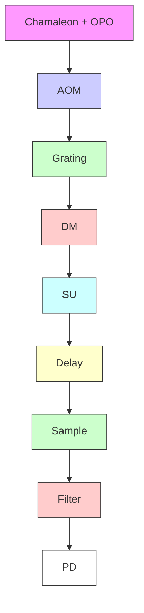
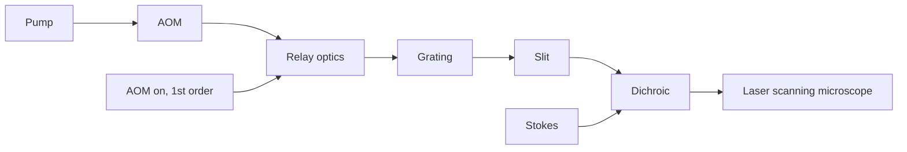

# Spectrally modulated stimulated Raman scattering imaging with an angle-to-wavelength pulse shaper

Delong Zhang,1,4 Mikhail N. Slipchenko,2,4 Daniel E. Leaird,3 Andrew M. Weiner,3,5 Ji-Xin Cheng1,2,\*

1 Department of Chemistry, Purdue University, 560 Oval Drive, West Lafayette, IN 47907, USA 2 Weldon School of Biomedical Engineering, 206 S. Martin Jischke Drive, West Lafayette, IN 47907, USA 3 Electrical and Computer Engineering, 465 Northwestern Ave. West Lafayette, IN 47907, USA

4 Equal contribution

5 amw@purdue.edu

\* jcheng@purdue.edu

Abstract: The stimulated Raman scattering signal is often accompanied by unwanted background arising from other pump-probe modalities. We demonstrate an approach to overcome this challenge based on spectral domain modulation, enabled by a compact, cost-effective angle-towavelength pulse shaper. The pulse shaper switches between two spectrally narrow windows, which are cut out of a broadband femtosecond pulse and selected for on- and off- Raman resonance excitation, at 2.1 MHz frequency for detection of stimulated Raman scattering signal. Such spectral modulation reduced the unwanted pump-probe signals by up to 20 times and enabled stimulated Raman scattering imaging of molecules in a pigmented environment.

©2013 Optical Society of America

OCIS codes: (180.4315) Nonlinear microscopy; (290.5910) Scattering, stimulated Raman.

## References and links

1. J.-X. Cheng and X. S. Xie, Coherent Raman Scattering Microscopy (Taylor & Francis, 2012).  
2. E. Ploetz, S. Laimgruber, S. Berner, W. Zinth, and P. Gilch, “Femtosecond stimulated Raman microscopy,” Appl. Phys. B 87(3), 389–393 (2007).  
3. C. W. Freudiger, W. Min, B. G. Saar, S. Lu, G. R. Holtom, C. He, J. C. Tsai, J. X. Kang, and X. S. Xie, “Labelfree biomedical imaging with high sensitivity by stimulated Raman scattering microscopy,” Science 322(5909), 1857–1861 (2008).  
4. P. Nandakumar, A. Kovalev, and A. Volkmer, “Vibrational imaging based on stimulated Raman scattering microscopy,” New J. Phys. 11(3), 033026 (2009).  
5. Y. Ozeki, F. Dake, S. i. Kajiyama, K. Fukui, and K. Itoh, “Analysis and experimental assessment of the sensitivity of stimulated Raman scattering microscopy,” Opt. Express 17(5), 3651–3658 (2009).  
6. D. Zhang, M. N. Slipchenko, and J.-X. Cheng, “Highly sensitive vibrational imaging by femtosecond pulse stimulated Raman loss,” J Phys Chem Lett 2(11), 1248–1253 (2011).  
7. B. G. Saar, Y. Zeng, C. W. Freudiger, Y.-S. Liu, M. E. Himmel, X. S. Xie, and S.-Y. Ding, “Label-free, realtime monitoring of biomass processing with stimulated Raman scattering microscopy,” Angew. Chem. Int. Ed. Engl. 49(32), 5476–5479 (2010).  
8. M. N. Slipchenko, H. Chen, D. R. Ely, Y. Jung, M. T. Carvajal, and J.-X. Cheng, “Vibrational imaging of tablets by epi-detected stimulated Raman scattering microscopy,” Analyst (Lond.) 135(10), 2613–2619 (2010).  
9. B. G. Saar, L. R. Contreras-Rojas, X. S. Xie, and R. H. Guy, “Imaging drug delivery to skin with stimulated Raman scattering microscopy,” Mol. Pharm. 8(3), 969–975 (2011).  
10. M. C. Wang, W. Min, C. W. Freudiger, G. Ruvkun, and X. S. Xie, “RNAi screening for fat regulatory genes with SRS microscopy,” Nat. Methods 8(2), 135–138 (2011).  
11. K. Ekvall, P. van der Meulen, C. Dhollande, L. E. Berg, S. Pommeret, R. Naskrecki, and J. C. Mialocq, “Cross phase modulation artifact in liquid phase transient absorption spectroscopy,” J. Appl. Phys. 87(5), 2340–2352 (2000).  
12. D. Fu, T. Ye, T. E. Matthews, B. J. Chen, G. Yurtserver, and W. S. Warren, “High-resolution in vivo imaging of blood vessels without labeling,” Opt. Lett. 32(18), 2641–2643 (2007).  
13. K. Uchiyama, A. Hibara, H. Kimura, T. Sawada, and T. Kitamori, “Thermal lens microscope,” Jpn. J. Appl. Phys. 39(9A), 5316–5322 (2000).  
14. S. Berciaud, L. Cognet, G. A. Blab, and B. Lounis, “Photothermal heterodyne imaging of individual nonfluorescent nanoclusters and nanocrystals,” Phys. Rev. Lett. 93(25), 257402 (2004).  
15. S. Hiki, K. Mawatari, A. Hibara, M. Tokeshi, and T. Kitamori, “UV excitation thermal lens microscope for sensitive and nonlabeled detection of nonfluorescent molecules,” Anal. Chem. 78(8), 2859–2863 (2006).  
16. G. C. Bjorklund, “Frequency-modulation spectroscopy: a new method for measuring weak absorptions and dispersions,” Opt. Lett. 5(1), 15–17 (1980).  
17. B. F. Levine and C. G. Bethea, “Frequency-modulated shot noise limited stimulated Raman gain spectroscopy,” Appl. Phys. Lett. 36(4), 245–247 (1980).  
18. M. D. Levenson, W. E. Moerner, and D. E. Horne, “FM spectroscopy detection of stimulated Raman gain,” Opt. Lett. 8(2), 108–110 (1983).  
19. A. M. Weiner, “Femtosecond pulse shaping using spatial light modulators,” Rev. Sci. Instrum. 71(5), 1929–1960 (2000).  
20. I. R. Piletic, M. C. Fischer, P. Samineni, G. Yurtsever, and W. S. Warren, “Rapid pulse shaping with homodyne detection for measuring nonlinear optical signals,” Opt. Lett. 33(13), 1482–1484 (2008).  
21. A. M. Weiner, “Ultrafast optical pulse shaping: A tutorial review,” Opt. Commun. 284(15), 3669–3692 (2011).  
22. N. Dudovich, D. Oron, and Y. Silberberg, “Single-pulse coherently controlled nonlinear Raman spectroscopy and microscopy,” Nature 418(6897), 512–514 (2002).  
23. S.-H. Lim, A. G. Caster, O. Nicolet, and S. R. Leone, “Chemical imaging by single pulse interferometric coherent anti-Stokes Raman scattering microscopy,” J. Phys. Chem. B 110(11), 5196–5204 (2006).  
24. B.-C. Chen and S.-H. Lim, “Optimal laser pulse shaping for interferometric multiplex coherent anti-Stokes Raman scattering microscopy,” J. Phys. Chem. B 112(12), 3653–3661 (2008).  
25. O. Katz, J. M. Levitt, E. Grinvald, and Y. Silberberg, “Single-beam coherent Raman spectroscopy and microscopy via spectral notch shaping,” Opt. Express 18(22), 22693–22701 (2010).  
26. A. C. W. van Rhijn, S. Postma, J. P. Korterik, J. L. Herek, and H. L. Offerhaus, “Chemically selective imaging by spectral phase shaping for broadband CARS around 3000 cm−1 ,” J. Opt. Soc. Am. B 26(3), 559–563 (2009).  
27. M. N. Slipchenko, R. A. Oglesbee, D. Zhang, W. Wu, and J.-X. Cheng, “Heterodyne detected nonlinear optical imaging in a lock-in free manner,” J Biophotonics 5(10), 801–807 (2012).  
28. J. L. Suhalim, C.-Y. Chung, M. B. Lilledahl, R. S. Lim, M. Levi, B. J. Tromberg, and E. O. Potma, “Characterization of cholesterol crystals in atherosclerotic plaques using stimulated Raman scattering and second-harmonic generation microscopy,” Biophys. J. 102(8), 1988–1995 (2012).  
29. Y. Ozeki, W. Umemura, K. Sumimura, N. Nishizawa, K. Fukui, and K. Itoh, “Stimulated Raman hyperspectral imaging based on spectral filtering of broadband fiber laser pulses,” Opt. Lett. 37(3), 431–433 (2012).  
30. D. Zhang, P. Wang, M. N. Slipchenko, D. Ben-Amotz, A. M. Weiner, and J.-X. Cheng, “Quantitative vibrational imaging by hyperspectral stimulated Raman scattering microscopy and multivariate curve resolution analysis,” Anal. Chem. 85(1), 98–106 (2013).  
31. F. Ganikhanov, C. L. Evans, B. G. Saar, and X. S. Xie, “High-sensitivity vibrational imaging with frequency modulation coherent anti-Stokes Raman scattering (FM CARS) microscopy,” Opt. Lett. 31(12), 1872–1874 (2006).  
32. C. W. Freudiger, W. Min, G. R. Holtom, B. Xu, M. Dantus, and X. S. Xie, “Highly specific label-free molecular imaging with spectrally tailored excitation stimulated Raman scattering (STE-SRS) microscopy,” Nat. Photonics 5(2), 103–109 (2011).  
33. D. E. Leaird and A. M. Weiner, “Femtosecond direct space-to-time pulse shaping,” IEEE J. Quantum Electron. 37(4), 494–504 (2001).  
34. T. Hellerer, A. M. K. Enejder, and A. Zumbusch, “Spectral focusing: High spectral resolution spectroscopy with broad-bandwidth laser pulses,” Appl. Phys. Lett. 85(1), 25–27 (2004).  
35. I. Rocha-Mendoza, W. Langbein, P. Watson, and P. Borri, “Differential coherent anti-Stokes Raman scattering microscopy with linearly chirped femtosecond laser pulses,” Opt. Lett. 34(15), 2258–2260 (2009).  
36. A. F. Pegoraro, A. D. Slepkov, A. Ridsdale, J. P. Pezacki, and A. Stolow, “Single laser source for multimodal coherent anti-Stokes Raman scattering microscopy,” Appl. Opt. 49(25), F10–F17 (2010).  
37. B.-C. Chen, J. Sung, and S.-H. Lim, “Chemical imaging with frequency modulation coherent anti-Stokes Raman scattering microscopy at the vibrational fingerprint region,” J. Phys. Chem. B 114(50), 16871–16880 (2010).  
38. Y. S. Yoo, D.-H. Lee, and H. Cho, “Differential two-signal picosecond-pulse coherent anti-Stokes Raman scattering imaging microscopy by using a dual-mode optical parametric oscillator,” Opt. Lett. 32(22), 3254–3256 (2007).  
39. B. G. Saar, G. R. Holtom, C. W. Freudiger, C. Ackermann, W. Hill, and X. S. Xie, “Intracavity wavelength modulation of an optical parametric oscillator for coherent Raman microscopy,” Opt. Express 17(15), 12532– 12539 (2009).

## 1. Introduction

Molecular vibration based spectroscopic imaging is opening a new window for seeing the unseen machinery inside cells and tissues [1]. A formidable challenge facing the field of spectroscopic imaging is the presence of unwanted background associated with the signal from target molecules. Specifically, the detection sensitivity of linear absorption microscopy is restricted by the scattering of photons. Raman scattering provides chemical selectivity, but the Raman signal from tissues is often overwhelmed by the autofluorescence background. With coherent addition of the scattering fields, coherent anti-Stokes Raman scattering (CARS) provides a much larger signal level than spontaneous Raman scattering. However, the CARS signal contains a non-resonant background, which impedes CARS imaging of weak Raman bands. Nonlinear vibrational microscopy based on stimulated Raman scattering (SRS) [2–6] has found wide applications for chemical imaging without staining [6–10]. The SRS signal is generated at the frequency of incident beams, which act as local oscillators. Such heterodyne detection boosts the signal level and removes the nonresonant background encountered in CARS microscopy. The SRS process involves stimulated Raman gain (SRG) and stimulated Raman loss (SRL), corresponding to intensity gain in the Stokes beam and loss in the pump beam, respectively. The SRS signal provides spectral information identical to spontaneous Raman and is linearly proportional to the molecular concentration. Nevertheless, the SRS signal in Fig. 1(a) is accompanied by competing heterodyne optical processes, including cross phase modulation (XPM, Fig. 1(b)) [11], transient absorption (TA, Fig. 1(c)) [12] and photothermal effects (Fig. 1(d)) [13]. These heterodyne modalities produce a background that is spectrally overlapped with the SRS signal. In current implementation, transient absorption can be reduced by using longer excitation wavelengths [6]. The XPM and thermal lensing effects can be reduced by using a lens of large numerical aperture for signal collection [3, 6]. The photothermal effect can be further diminished by MHz-frequency modulation [14, 15]. However, these methods fail in the case of a weak SRS signal in the presence of a strong background.

We aim to eliminate the background arising from non-Raman modalities by exploiting the spectral sensitivity of the processes shown in Fig. 1. In XPM, the pump beam causes a change in the real part of the refractive index at the focus through the optical Kerr effect, which modulates the phase of the probe beam. This third order nonlinear process involves only virtual energy states, and its intensity has an inverse dependence on the probe beam wavelength. Therefore, for a small spectral range, the XPM signal can be considered to be wavelength independent. The transient absorption and photothermal effects are based on electronic transitions, and therefore have weak wavelength dependence (tens of nm). In contrast, the SRS signal originates from vibrational transitions which have very sharp spectral features (of order 1 nm in width). Thus, by modulating the wavelength of a laser beam within a few nm, one may selectively detect the SRS process. Based on this concept, early works have demonstrated the suppression of background in absorption spectroscopy [16] and SRS spectroscopy [17, 18]. However, these spectroscopy studies either have not completely abandoned amplitude modulation, or are limited to narrow Raman bands in pure compounds in gas phase (\~0.001 nm). Moreover, the integration time (order 1 second level) hindered the applications of these methods to biomedical imaging.

Here we demonstrate a background-suppressed SRS microscope enabled by spectral modulation of a femtosecond (fs) laser using a novel pulse shaper. By switching the beating frequency (ωp−ωS) between on and off Raman resonance, our method ensures that the signal solely arises from the Raman effect. Notably, while our approach is related to the widely adopted femtosecond pulse shaping technology [19–21] that has been used for CARS imaging [22–26], the particular requirement for MHz-rate spectral modulation, which is needed for high-speed data acquisition and 1/f noise elimination, has not been addressed previously. To meet this critical need, a new pulse shaping geometry, which we term as “an angle-towavelength pulse shaper”, is reported here for the first time.

a. Stimulated Raman scattering  

text_image

mħωₚ
(m+1)ħωₚ
ωₚ
ωₛ
kħωₛ
Ω
ν=1
ν=0
(k-1)ħωₛ

b. Cross-phase modulation  

text_image

mħωp
ωp ωpr
mħωp
kħωpr
n2
n1
kħω'pr

c. Transient absorption  

text_image

mhωp
ωpr
(m-1)ħωp
khωpr
ωp
(k-1)ħωpr

d. Photothermal lensing  

text_image

mħωₚ
kħωₚᵣ
n₀′
ωₚ
ΔT
n₀″ < n₀′
mħωₚ
kħωₚᵣ

  
Fig. 1. Basic principles of pump-probe modalities and their spectral characteristics. a, Stimulated Raman scattering (SRS) processes involve the energy transfer from the pump beam to the Stokes beam via excitation of molecular vibrational energy levels (ν). By conventional notations the shorter wavelength beam involved in the SRS process is called pump $\left( \omega _ { \mathrm { p } } \right)$ and the longer wavelength beam is called Stokes (ωS). b, In cross-phase modulation $\left( \mathrm { X P M } \right)$ the pump beam (ωp) changes the nonlinear refractive index at the focus through optical Kerr effect, thus affecting the probe beam $( \omega _ { \mathrm { p r } } )$ propagation and frequency. c, Transient absorption (TA) is a pump-probe processes which involves excitation of electronic energy levels. TA may be categorized into excited state absorption, induced fluorescence, and ground state photobleaching processes, with the latter two often indistinguishable. d, Thermal lensing effects are induced by the local heating after absorption of the pump photons, which change the refractive index at the focus, thus affecting the propagation of a probe beam.

## 2. Materials and methods

## 2.1 Experimental setup

The spectrally modulated stimulated Raman gain (SRG) setup is shown in Fig. 2(a). A femtosecond pump-OPO platform provides the pump and Stokes beams. The OPO (APE OPO, Coherent) is pumped by a 140-fs Ti:Sapphire laser (Chameleon, APE Coherent) at 800- 830 nm, generating tunable output from 1000 to 1600 nm. A portion of the Ti:Sapphire laser is split out and sent to the spectral modulator. The output of the spectral modulator switches between two wavelengths at a rate of 2.1 MHz with a bandwidth of 8 cm−1 (FWHM) and a spectral separation of 73 cm−1 . In order to narrow the bandwidth of the Stokes beam for narrowband detection, the signal beam from the OPO, which is the Stokes for ${ \mathrm { S R G } } ,$ is directed into a 4-f pulse shaper. We adopted a folded 4-f scheme where a mirror is placed at the Fourier plane to reflect the beam exactly back. The beam is vertically displaced so that the output beam can be extracted. The folded 4-f pulse shaper was optimized with an autocorrelator (PulseScope 5510, APE) and a slit was set at the Fourier plane to cut \~10 cm−1 bandwidth out of the broadband femtosecond pulse. The pump and Stokes wavelengths for the SRG imaging were centered at around 804 nm and 1050 nm for the C-H mode, and 830 and 1005 nm for the C-D mode, respectively. By modulating the frequency of the pump beam, the energy difference between pump and Stokes is modulated between on- and off-Raman resonances. The beams were combined collinearly and sent to an inverted microscope (IX71, Olympus). The pump and Stokes beams were focused at the sample using a 60X objective lens (Olympus, UPlanSApo, N.A. = 1.2). The transmitted light was collected by a second 60X objective (Olympus, LUMFI, N.A. = 1.1). The SRG signal was detected by a large area photodiode (S3994-01, Hamamatsu), amplified by a resonance circuit [27], and sent to a lock-in amplifier (HF2LI, Zurich Instrument). Hyperspectral SM-SRG imaging was performed by scanning the Stokes wavelength. To scan the wavelength, the slit at the Fourier plane of the 4-f pulse shaper was moved in the direction perpendicular to the laser beam by a motorized translation stage. The SRG signal was normalized to the Stokes power measured by the DC output of the photodiode.

The schematic of the angle-to-wavelength pulse shaper is shown in Figs. 2(b) and 2(c). It starts with modulating the beam pointing by an acousto-optic modulator (AOM), which gives a deflected beam (1st order) and a transmitted beam (0 order) through its interaction medium. The AOM 1st order deflection efficiency is 85%. A lens pair relays the AOM optical plane to a grating. The broadband fs pulse is diffracted by the grating and transformed by an achromatic lens to the Fourier plane, where a narrow slit is positioned. As a result, the 1st and 0 order beams overlap exactly at the grating surface, but propagate at different incident angles to the grating normal. Therefore the positions projected to the Fourier plane are different between 1st and 0 order beams, giving rise to their difference in spectral domain. The slit passes a narrow window of the frequency components, trimming the full width at half maximum (FWHM) down to $8 ~ \mathrm { c m } ^ { - 1 }$ . The amount of spectral separation between the 1st and 0 order beams after the slit is determined by the beams’ separation angle at the grating, and is adjustable by changing the magnification of the relay optics assembly. Because the spectral modulation rate is determined by the rise time of the AOM, spectral modulation at multi-MHz frequency can be readily achieved. This allows the fast scan rates necessary for high-speed imaging and provides the potential for shot noise limited detection, as shown in our previous study [6].

## 2.2 Imaging parameters

For C-D vibrational mode detection, the spectral modulator (pump beam) was tuned to 12062 $\mathrm { c m } ^ { - 1 }$ and 11988 cm−1 . For intensity modulated SRG (IM-SRG) and on-resonance spectrally modulated SRG (SM-SRG), the Stokes beam was tuned to 9957 $\mathrm { c m } ^ { - 1 }$ . For off resonance SM-SRG, the Stokes beam was tuned to 10005 $\mathrm { c m } ^ { - 1 }$ . For C-H vibrational mode detection, the spectral modulator was tuned to $1 2 4 4 7 ~ \mathrm { c m } ^ { - 1 }$ and $1 2 3 7 4 ~ \mathrm { c m } ^ { - 1 }$ . For IM-SRG and on-resonance SM-SRG, the Stokes beam was tuned to $9 5 1 6 ~ \mathrm { c m ^ { - 1 } }$ . For off-resonance SM-SRG, the Stokes beam was tuned to $9 5 8 5 ~ \mathrm { c m } ^ { - 1 }$ . The pump and Stokes laser power at the sample were measured to be 10 mW and 14 mW for C-D imaging, and 11 mW and 6 mW for C-H imaging, respectively.

## 2.3 Specimen preparation

One piece of blonde hair stem was placed at the edge of a droplet of d-DMSO, and then sandwiched between coverslips. Isolated red blood cells (RBCs) were sandwiched in cover glasses for imaging. Protein crystals were obtained by crystallization from a saturated lysosome solution. Skin tissues were harvested from three month old wild-type mice (C57BL/6J).

flowchart

flowchart

flowchart

Fig. 2. Schematic of spectrally modulated SRG microscope and angle-to-wavelength pulse shaper. a, Schematic of the spectrally modulated SRG microscope. DM: dichroic mirror. Delay: delay stage. SU: scanning unit. PD: photodiode. b, The AOM is tuned to deflection mode. c, The AOM is tuned to transmission mode. The change of the angle between b and c is converted into spectral change by the grating and slit combination. The assembly, including the AOM, relay optics, grating and the slit, is termed as “an angle-to-wavelength pulse shaper”. The output is collinearly combined with the Stokes beam and sent to a laser-scanning microscope for SRG imaging. Dichroic: dichroic mirror. AOM: acousto-optic modulator.

## 3. Results

To characterize the output of the spectral modulator in the time domain, the output pulse trains were sent to a photodiode and recorded by an oscilloscope. To obtain the pulse trains of the deflected beam (1st order) and the non-deflected beam (0 order) separately, we correspondingly blocked the other beam before the grating. Figure 3(a) and 3(b) show the modulated trains of deflected and non-deflected beams, respectively. We note the residual in the non-deflected pulse train (Fig. 3(b), marked by arrows), which originates from less than 100% modulation depth of the AOM. This residual is constant and does not contribute to any pump-probe modalities in which only the AC signal is detected. When the deflected and nondeflected beams were both unblocked, a pulse train of constant intensity was found in Fig. 3(c). Measured by a lock-in amplifier (LIA), the intensity modulation of the combined pulse train was ${ \sim } 1 0 ^ { 2 }$ times smaller than that of the 1st or 0 order beams. Therefore, we expect to reduce the competing pump-probe signals by up to two orders of magnitude. The spectral components of the output are shown below each pulse train in Figs. 3(d)-3(f). The spectral bandwidth (FWHM) of the output beams is 8 cm−1 , with a spectral separation of 73 cm−1 between the 1st and 0 order beams. This spectral separation is sufficient for most of the spectral features, including C-H vibrations and C-D vibrations. To confirm that the SM-SRS signal is a direct difference between SRS signals at two Raman shifts, we performed SRG imaging of dimethyl sulfoxide (DMSO) with the deflected beam alone, the non-deflected beam alone, and the combined beams (Figs. 3(g)-3(i)). We tuned the narrow band Stokes to 9450 cm−1 and set the deflected and undeflected pump beams to 12373 cm−1 and $1 2 3 0 0 ~ \mathrm { c m } ^ { - 1 }$ , which correspond to the Raman peak of DMSO at 2923 cm−1 and a region with a small

Raman contribution at $2 8 5 0 ~ \mathrm { c m } ^ { - 1 }$ . In case of the deflected beam alone, which is on-resonance, the image shows a strong signal from the DMSO droplet (Fig. 3(g)). In contrast, the nondeflected, off-resonance beam alone gives a weak signal (Fig. 3(h)). As expected, the spectrally modulated signal (Fig. 3(i)) provides the difference between images in Figs. 3(g) and 3(h). The signal-to-noise ratio (SNR) of the spectrally modulated SRG signal was measured to be 77 at 8 µs pixel dwell time, which is sufficient for real time high-quality imaging.

bar chart

| Time (μs) | Amplitude (V) |
| --------- | ------------- |
| 0.0       | 1.71          |
| 0.5       | 1.71          |
| 1.0       | 1.71          |
| 1.5       | 1.71          |

bar chart

| Time (μs) | Int. (a.u.) |
| --------- | ----------- |
| 0.0       | 0.0         |
| 0.5       | 2.0         |
| 1.0       | 0.0         |
| 1.5       | 2.0         |

line chart

| Time (μs) | Int. (a.u.) |
| --------- | ----------- |
| 0.0       | 2.0         |
| 0.5       | 2.0         |
| 1.0       | 2.0         |
| 1.5       | 2.0         |

line chart

| Wavelength (nm) | Int. (a.u.) |
| --------------- | ----------- |
| 795             | ~0          |
| 800             | ~0          |
| 805             | ~1.0        |
| 810             | ~0          |
| 815             | ~0          |

line chart

| Wavelength (nm) | Int. (a.u.) |
| --------------- | ----------- |
| 810             | DC          |

line chart

| Wavelength (nm) | Int. (a.u.) |
| --------------- | ----------- |
| 805             | High        |
| 810             | High        |

text_image

g
Air
DMSO

natural_image

Black square with a horizontal dashed line across the center, labeled 'h' in the top-left corner (no other text or symbols)

natural_image

Two vertical panels with black and white tones, separated by a dashed yellow line (no text or symbols)

line chart

| Distance (μm) | Signal (μV) |
| ------------- | ----------- |
| 0             | 0           |
| 25            | 0           |
| 50            | 0           |
| 75            | 40          |
| 100           | 35          |

line chart

| Distance (μm) | Signal (μV) |
| ------------- | ----------- |
| 0             | 0           |
| 25            | 0           |
| 50            | 0           |
| 75            | 0           |
| 100           | 0           |

line chart

| Distance (μm) | Signal (μV) |
| ------------- | ----------- |
| 0             | 0           |
| 25            | 0           |
| 50            | 0           |
| 75            | 40          |
| 100           | 40          |

Fig. 3. Spectral and temporal output of the spectral modulator and the corresponding microscopic images. a-c, Time domain pulse train of the first-order AOM output, zero-order, and combined output, respectively. Notice that constant component present in the AOM zeroorder does not contribute to pump-probe modalities. d-f, Spectral components of the firstorder, zero-order and combined beams, respectively. g-i, SRG imaging of DMSO corresponding to intensity modulated first-order, intensity modulated zero-order, and spectral modulation, respectively. j-l, the intensity profile at dash lines in images g, h, and i, respectively. DC: direct current.

To demonstrate the advantages of spectral modulation (SM) over intensity modulation (IM), we performed SM-SRG and IM-SRG imaging of biologically relevant samples with each having a major contribution from one of three other pump-probe modalities, namely TA, photothermal, and XPM. Figures 4(b)-4(e) show the removal of the TA background in a biological sample where a ubiquitous pigment, melanin, gives strong TA signals. The sample consists of a piece of blonde hair and deuterated dimethyl sulfoxide (d-DMSO) on the right, sandwiched between two coverslips. The spontaneous Raman spectrum of d-DMSO, together with Raman shifts corresponding to deflected and non-deflected beams (vertical red dashed lines, $2 0 3 1 ~ \mathrm { c m } ^ { - 1 }$ and $2 1 0 5 ~ \mathrm { c m } ^ { - 1 } )$ , is shown in Fig. 4(a). In the IM scheme, most of the signal in on- and off- Raman resonance images arises from TA (Figs. 4(b) and $4 ( \mathrm { c } ) )$ . In contrast, the SM-SRG significantly removed the TA signal (Fig. 4(d)), showing the pure difference between Raman on- and off- resonances. To confirm that the signal observed in Fig. 4(d) originated from the Raman effect, we tuned the Stokes beam to $1 0 0 0 5 ~ \mathrm { c m } ^ { - 1 }$ in order to be off-Raman resonance for both the deflected and non-deflected beams. No signals from the d-DMSO were observed (Fig. 4(e)).

  
Fig. 4. Comparison of intensity-modulation (IM) and spectral-modulation (SM) SRG imaging of biological samples. First column: Raman spectra, red dash lines indicate the two Raman shifts used by IM-SRG imaging and on-resonance SM-SRG imaging. For offresonance SM-SRG, the Raman shifts are not shown. Second column: On-resonance IM-SRG imaging. Third column: Off-resonance IM-SRG imaging. Fourth column: On-resonance SM-SRG imaging. Fifth column: Off-resonance SM-SRG imaging. Rows: a-e, Vertically aligned blonde hair in the center, with d-DMSO on the right and air on the left, sandwiched between two cover slips. f-j, Red blood cells. k-o, Protein crystals. The amplitude of the lockin amplifier was used for all images. Scale bars: 20 µm.

Fresh red blood cells (RBCs) were used to demonstrate removal of the photothermal background. The RBCs are rich in hemoglobin protein, which converts absorbed photons into heat and therefore generates a strong photothermal signal. We imaged RBCs with the laser beams tuned to on- and off- C-H Raman resonance (Fig. 4(f)), where spectral modulation in the pump beam was performed between 12447 and 12374 cm−1 . Meanwhile, the Stokes beam was tuned to $9 5 1 6 ~ \mathrm { c m } ^ { - 1 }$ for IM-SRG and on-resonance SM-SRG, and to $9 5 8 5 ~ \mathrm { c m } ^ { - 1 }$ for offresonance SM-SRG. On- and off- Raman resonance IM-SRG imaging produced strong signals at similar levels (Figs. 4(g) and 4(h)). By delaying the Stokes beam in time relative to the pump beam in the millisecond range, we observed little changes in signal level, confirming that the majority of the signal originated from the long lasting thermal effect [13]. In contrast to IM, SM eliminated the photothermal background and showed the true Raman contrast from C-H vibrations (Fig. 4(i)), as confirmed by the absence of signal from RBCs in off- Raman resonance SM-SRG (Fig. 4(j)). The decrease in the photothermal lensing signal was \~20 times, estimated from the intensity ratio between IM off-resonance (Fig. 4(h)) and SM off-resonance (Fig. 4(j)).

To demonstrate the elimination of XPM, we performed SRG imaging of crystallized lysozyme proteins in both IM and SM schemes (Figs. 4(l)-4(o)). The conventional intensity modulation gave rise to the modulation of the refractive index of the crystal through the optical Kerr effect, resulting in a non-negligible signal at off-resonance Raman shift (Fig. 4(m)). By spectral modulation, however, the XPM signal was completely removed (Fig. 4(n)). Consequently, nearly zero contrast from the crystals was observed in off-Raman resonance SM-SRG image (Fig. 4(o)). The reduction of XPM signal was measured to be \~20 times, limited by SNR in Figs. 4(m) and 4(o).

  
Fig. 5. SRG imaging of sebaceous gland in skin of a black mouse in IM and SM modes. a, Intensity modulated SRG image, showing an overwhelming signal from the transient absorption of melanin. b, SM-SRG image of the same area, where the sebaceous gland was clearly distinguished. c, Off-resonance IM-SRG image. d, Off-resonance SM-SRG image. Scale bars: 20 µm.

To show the advantages of spectral modulation in SRS imaging of real tissue, we performed IM-SRG and SM-SRG imaging of a sebaceous gland in black mouse skin, using the $\mathrm { C H } _ { 2 }$ stretch band at $2 8 5 0 ~ \mathrm { c m } ^ { - 1 } ~ ( \mathrm { F i g } . ~ 5 )$ . In IM-SRG, the contrast is dominated by a very strong signal from the pigments (Fig. 5(a)). This strong signal could be due to the transient absorption and photothermal effect of the melanin in the hypodermis. In the SM-SRG scheme with the other beating frequency set to $2 7 8 3 ~ \mathrm { c m } ^ { - 1 }$ , the pigment signal was removed and the lipid droplets in the sebaceous gland were selectively visualized (Fig. 5(b)). In addition, SM-SRS reveals the absence of C-H rich structures in the surrounding area. To confirm that the signal is indeed a Raman effect, we did off-resonance imaging under the same conditions. The strong pigment signal dominated the off-resonance IM-SRG (Fig. 5(c)), yet was not observed in SM-SRG (Fig. 5(d)). These data collectively show that SM-SRG is superior to IM-SRG and confocal Raman for the study of pigmented specimens.

We further extended the spectral modulation scheme to hyperspectral vibrational imaging. In hyperspectral SRS microscopy [28–30], one scans the wavelength of the pump or Stokes beam and records an image at each wavelength, so that the molecular spectral profile, identical to the polarized spontaneous Raman spectrum (Fig. 6(a)), could be obtained at each pixel. In our case, by scanning the Stokes wavelength with a slit at the Fourier plane of the 4f pulse shaper (Fig. 2(a)), a difference Raman spectrum (Fig. 6(b)) is expected in SM-SRG scheme, where the positive and negative peaks in X-channel are due to the $1 8 0 ^ { \circ }$ lock-in phase difference when either of the beating frequencies was at Raman resonance. To prove this concept, we performed hyperspectral SM-SRG imaging of pure DMSO liquid and obtained a stack of XY images in terms of the Raman shift Ω (Figs. 6(c) and 6(d)). The spectral profile derived from the XY-Ω stack (Fig. 6(e)) showed the same profile as the calculated spectrum (Fig. 6(b)). To demonstrate the advantages of spectral modulation, we compared SRG imaging of DMSO on top of a graphene layer using intensity modulation (Figs. 6(f)-6(h)) and spectral modulation (Figs. 6(i)-6(k)). Because graphene produced an extraordinarily strong transient absorption signal, the IM-SRG images showed a nearly flat spectral profile (Fig. 6(h)), from which little difference was observed between images at the on- and off- Raman peak of DMSO. Under the same conditions, spectral modulation suppressed the TA signal from graphene by 10 times and showed the same spectral profile as that of pure DMSO (Fig. 6(k)).

line chart

| Raman shift (cm⁻¹) | Int. (a.u.) - Spec. Mod. SRS | Int. (a.u.) - DMSO droplet | Int. (a.u.) - Spec. Mod. SRS | Int. (a.u.) - DMSO on graphene | Int. (a.u.) - Spec. Mod. SRS | Int. (a.u.) - DMSO on graphene |
| ------------------ | -------------------------- | -------------------------- | -------------------------- | ------------------------------ | -------------------------- | ------------------------------ |
| 2900               | ~5                         | Peak                       | ~5                         | ~5                             | ~5                         | ~5                             |
| 2950               | ~0                         | ~0                         | ~0                         | ~0                             | ~0                         | ~0                             |
| 3000               | ~5                         | ~5                         | ~5                         | ~5                             | ~5                         | ~5                             |

Fig. 6. Spectrally modulated hyperspectral SRG imaging with a 4f pulse shaper. a, The spontaneous Raman spectrum of DMSO, in which δ is the spectral difference of the spectral modulator output. b, The difference Raman spectrum calculated from a with $\delta = 7 0 ~ \mathrm { c m } ^ { - 1 }$ . The difference spectrum intensity $\mathrm { I _ { D i f f } } ( \Omega ) = \mathrm { I _ { R a m a n } } ( \Omega ) \cdot \mathrm { I _ { R a m a n } } ( \Omega - \delta )$ , where $\mathrm { { I _ { R a m a n } } }$ is the spontaneous Raman intensity, and Ω the Raman shift. c,d, Two slices from the XY-Ω SM-SRG image series of DMSO-air interface, corresponding to the green and blue arrows in the spectrum e, which was obtained from the pixel intensity in the orange box in c. Hyperspectral SRG imaging of DMSO on a graphene layer was performed in both intensity modulation and spectral modulation schemes. f,g, Intensity modulation hyperspectral SRG images at the arrow position shown in its spectrum in h. i,j, Images of the same region but in spectral modulation scheme. k, Spectral profile of SM-SRG, showing the positive and negative peaks from DMSO. The inphase (X channel) of lock-in amplifier was used to show the phase shift. Scale bars: 10 µm.

## 4. Discussion

By modulation of laser intensity, the SRS signal is accompanied by other heterodyne contrast arising from transient absorption, absorption-induced photothermal effect, and cross phase modulation induced by the optical Kerr effect. Modulation in the frequency domain is critical to ensure that only the Raman effect is detected. Spectral modulation could be implemented by various techniques, such as the use of three laser beams in frequency modulation CARS [31], and the use of a pulse shaper plus a Pockels cell in SRS [32]. Spectral modulation can also be implemented on a 4-f Fourier pulse shaper which contains a pair of lenses, a pair of gratings, and a spectral mask in the Fourier plane [19]. The pulse shaping is usually realized by a liquid crystal mask, which has a typical response time on the millisecond scale. This response time limits the modulation rate to the kHz level. Nevertheless, MHz modulation is needed for real-time imaging and is critical for reaching the laser shot noise limit [3].

Herein we demonstrated a simple and cost-effective spectral modulator (Fig. 2) that meets the needs of MHz modulation, based on the concept of space-to-time pulse shaping [33]. Unlike traditional 4-f shapers, which illuminate the spectral mask with a fixed beam, we spatially sweep the beam by using an AOM. Two spectral components, modulated at the same MHz frequency but in opposite phase, are then selected by a fixed slit to produce 1-ps pulse trains of alternate colors (Fig. 2). Our calculation has shown that for narrow Raman transitions of 5 cm−1 half-width, 1-ps pulses provide the same level of SRS signal as fs pulses [6]. Thus, our method not only provides sufficient spectral resolution, but also effectively maintains the signal level.

We note that spectral manipulation was previously shown in CARS microscopy by the use of three laser beams [31], spectral focusing [34–36], modulation of time delay between chirped pulses [37], and a custom optical parametric oscillator design [38, 39]. More recently, spectral coding was used in SRS microscopy to resolve spectrally overlapped Raman bands by exploiting a commercial pulse shaper plus a Pockels cell [32]. In this paper we addressed a different yet critical problem in SRS microscopy, i.e., removal of unwanted background that may overwhelm the spectroscopic signal.

Our approach is especially useful for mapping drug molecules in biological tissues where pigments are ubiquitous. In these specimens, the pigments could produce a strong pumpprobe background in a SRS image or generate an autofluorescence that obscures the spontaneous Raman signal. Moreover, our setup allows direct measurement of the spectral response by acquiring an XY-Ω image stack without other interfering background. The background suppression is not available in the intensity modulation SRS scheme due to the presence of other pump-probe signals, as shown in Fig. 6.

Though we have focused on SRS microscopy in this paper, our spectral modulation approach is generally applicable to all modalities of spectroscopic imaging. Firstly, our spectral modulator can be used to remove the non-resonant background in CARS microscopy, which would significantly broaden the applications of CARS microscopy to the fingerprint region. Secondly, by elimination of the unwanted two-photon luminescence and pump-probe background, spectral modulation opens the possibility of detecting surface enhanced CARS or SRS from molecules located near metallic nanostructures. Finally, our method is applicable to linear spectroscopic imaging of molecules or nanomaterials by switching the excitation beam on and off a vibrational, electronic, or plasmonic resonance. These further studies will render spectroscopic imaging a versatile photonics tool for biology and medicine.

## Acknowledgments

This work is supported in part by NIH (R21GM104681).