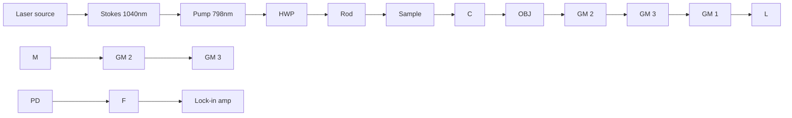

# Spectroscopic Stimulated Raman Scattering Imaging of Highly Dynamic Specimens through Matrix Completion

Haonan Lin#,1, Chien-Sheng Liao#,2, Pu Wang4, Nan Kong\*,3, Ji-Xin Cheng\*,1,2

1Department of Biomedical Engineering, 2Department of Electrical & Computer Engineering, Boston University, Boston, MA 02215, USA

3Weldon School of Biomedical Engineering, Purdue University, West Lafayette, IN 47907, USA

4Vibronix Inc, West Lafayette, IN 47907, USA

\# equal contributions

\*corresponding authors

Email: Haonan Lin: hnlin@bu.edu; Chien-Sheng Liao: csliao@bu.edu; Pu Wang: puwang@vibronixinc.com; Nan Kong: nkong@purdue.edu;

Ji-Xin Cheng: jxcheng@bu.edu

Abstract: We report a sparse spectroscopic stimulated Raman scattering imaging which improves acquisition speed by an order of magnitude through randomly sub-sampling the spectroscopic image followed by a low-rank matrix completion algorithm, enabling label-free real-time metabolic imaging of fungal cells.

OCIS codes: (180.5810) Scanning microscopy; (170.5660) Raman spectroscopy; (100.3190) Inverse problems.

## 1. Introduction

Stimulated Raman scattering (SRS) microscopy [1] is an emerging non-linear optical imaging technique which enables visualization of molecules in cells, tissues, and functional materials. In SRS microscopy, two laser pulses, one at Stokes frequency $\mathbf { \Pi } ( \mathfrak { o } _ { \mathrm { s } } )$ and the other at pump frequency $\left( \omega _ { \mathrm { p } } \right)$ , are tightly focused at the sample to generate images in a scanning manner. To improve chemical specificity, spectroscopic SRS imaging has been developed. Nevertheless, such improvement comes at a price of reduced imaging speed due to a significant increase of sampling size. Speeding up by reducing pixel dwell time will significantly downgrade the sensitivity of the system, as SRS signal intensity will decrease and eventually be overwhelmed by shot noise and thermal noise.

For spectroscopic imaging, the number of major spectral components is usually much smaller than the number of spectral frames (i.e. low-rank). The low-rank property implies significant information redundancy and theories have shown that for such low-rank unknown matrix, one can accurately reconstruct the data from only a set of randomly sampled entries [2]. Harnessing the idea of matrix completion, we demonstrate an effective way of improving the speed without harming the pixel dwell time by randomly sampling a small portion of pixels throughout the spectroscopic image stack. A regularized spectral unmixing (i.e., matrix factorization) algorithm is used to decompose the sparse spectroscopic image into spectral signatures and concentration maps.

## 2. Materials and Methods

(a)  

flowchart

(b)  

line chart

| Time (μs) | X | Y | Ω |
|---|---|---|---|
| 0 | 0 | 0 | 0 |
| 1000 | 200 | 200 | 50 |
| 2000 | 0 | 0 | 0 |
| 3000 | 200 | 200 | 50 |
| 4000 | 0 | 0 | 0 |
| 5000 | 200 | 200 | 50 |
| 6000 | 0 | 0 | 0 |
| 7000 | 200 | 200 | 50 |
| 8000 | 0 | 0 | 0 |

(  

natural_image

3D wireframe cube with labeled X, Y, Z axes and Ω axis (no text or symbols on the cube itself)

Fig. 1. Generation of sparse spectroscopic image. (a) Setup, (b) Frequency selection for the three galvo mirrors controlling the three axes, respectively. (c) Generated 3D sparse image stack with 15% fill rate using the frequencies in (b). AOM, acousto-optic modulator; C, condenser; F, filter; HWP, half-wave plate; L, lens; M, mirror; OBJ, objective; PBS, polarizing beam splitter; PD, photodiode; QWP, quarter-wave plate.

## A. Setup and sampling strategy

The setup for SS-SRS is illustrated in Fig. 1a. A tunable laser generates two synchronized outputs as pump and Stokes beams at a repetition rate of 80 MHz. Being modulated by an acousto-optic modulator (AOM), the Stokes beam is engineered to add a path difference by our homebuilt delay tuner in which the Stokes beam is directed to the edge of the galvo mirror. After being reflected, the beam is focused by an achromatic lens to a flat mirror and then reflected to the same optical path. Consequently, the movement of the galvo mirror introduces optical path difference of a few millimeters for the retroflected Stokes beam. The introduced path difference is used to tune the frequency difference after chirping both beams by glass rods [3].

To randomly subsample the spectroscopic image stack, we present a 3D triangular Lissajous trajectory, which is generated by controlling all the three coordinates of the 3D trajectory to follow replicating triangular waveforms, whose frequencies are carefully selected to have a high least common multiplier (see Fig. 1b). The generated 3D trajectory (see Fig. 1c) is ideal in that its path covers the entire image stack and samples a subset of the data that are uniformly and pseudo-randomly distributed.

## B. Regularized sparse spectroscopic image unmixing

We adopted a regularized matrix factorization algorithm to reconstruct the image from raw measurements. Assume $N = N _ { x } N _ { y } N _ { \lambda }$ as total number of pixels, M as number of sampled pixels and K as the number of spectral signatures, we define $y \in \mathbb { R } ^ { M }$ as sparse measurements, A as modulation matrix, $S \in \mathbb { R } ^ { N _ { \lambda } \times K }$ as spectral signatures, $C \in \mathbb { R } ^ { K N _ { x } N _ { y } }$ as concentration maps and $w \in \mathbb { R } ^ { M }$ as additive Gaussian noise, the imaging process is formulated as:

$$
y = A (S \otimes I) C + w, \tag {1}
$$

The problem aims at finding the solutions for C and S by solving the inverse of equation (1). We take an alternating optimization approach to solve for the two variables iteratively. Additionally, regularizations are introduced based on Generalized Gaussian Markov Random Field (GGMRF) model [4] to drive neighboring pixels to follow Gaussianlike distributions with similar means. Using Bayesian framework, we can derive the estimate for C with S fixed:

$$
\hat {C} = \underset {C} {\arg \min} \left\{\frac {1}{2 \sigma_ {w} ^ {2}} \| y - H C \| ^ {2} + \sum_ {k = 1, \dots , K} \frac {1}{p _ {c} \sigma_ {C ^ {k}} ^ {p _ {c}}} \sum_ {\{(m, n), (i, j) \in \Omega \}} g _ {m - i, n - j} \mid C _ {m, n} ^ {k} - C _ {i, j} ^ {k} \mid^ {p _ {c}} \right\}, \tag {2}
$$

where ${ \cal H } \equiv { \cal A } ( S \otimes I ) , \sigma _ { { \scriptscriptstyle w } } ^ { 2 }$ is variance of Gaussian noise. Regularization using GGMRF prior model is introduced for each channel of the concentration maps.

Similarly, we derive the objective function which optimizes variable S as C is fixed. we reshape the spectral signatures S into a column vector $S ^ { \prime } \in \Re ^ { N _ { \lambda } K }$ , concentration maps C into a matrix $C ^ { \prime } \in \Re ^ { N _ { x } N _ { y } \times K }$ . Defining $I ^ { \prime } \in \Re ^ { N _ { \lambda } \times N _ { j } }$ , we formulate another modulation matrix $J \equiv A ( C ^ { \prime } \otimes I ^ { \prime } )$ . The estimate for S is then:

$$
\hat {S} ^ {\prime} = \arg \min _ {S ^ {\prime}} \left\{\frac {1}{2 \sigma_ {w} ^ {2}} \| y - J S ^ {\prime} \| ^ {2} + \sum_ {k = 1, \dots , K} \frac {1}{p _ {s} \sigma_ {S ^ {\prime k}} ^ {p _ {s}}} \sum_ {\{u, v \} \in \Lambda} r _ {u - v} \mid S _ {u} ^ {\prime k} - S _ {v} ^ {\prime k} \mid^ {p _ {s}} \right\}. \tag {3}
$$

## 3. Results and Discussion

natural_image

Microscopic view of a fibrous or network-like structure with no visible text or symbols

natural_image

Fluorescent microscopy image showing red and blue cellular structures with yellow highlights (no text or symbols)

natural_image

Microscopic view of cellular or granular structures with bright spots (no text or symbols)

natural_image

Microscopic view of stained biological cells with red and blue nuclei (no text or symbols)

line chart

| Raman shift (cm⁻¹) | Lipid | Cytoplasm | Nucleus | PBS |
| ------------------ | ----- | --------- | ------- | --- |
| 3000               | 0.1   | 0.1       | 0.1     | 0.1 |
| 2925               | 1.0   | 0.4       | 0.3     | 0.1 |
| 2850               | 0.5   | 0.1       | 0.1     | 0.1 |

Fig. 2. Experimental results for C. albicans in PBS buffer. (a) Sparsely-sampled raw hyperspectral image at $2 9 2 0 \mathrm { c m } ^ { - 1 } .$ , with pixel dwell time of 2 μs. The entire hyperspectral SRS hyperspectral data cube with 50 frames was taken in 0.8 s. (b) Output concentration maps using sparse sparselysampled data. (c) Raster-scanned hyperspectral SRS image at 2920 cm-1, the stack was taken at a speed of 2 frames/s. (d) Output concentration maps using raster-scanned data. (e) Output spectra for sparsely-sampled (solid line) and raster-scanned image (dotted line). Scale bars, 10 μm.

Using the proposed platform, we performed SS-SRS imaging of fungal cells Candida albicans (C. albicans) in a growth medium, using \~20% fill rate (i.e., 0.8 s/stack). Fig. 2a shows one frame of the sparsely-sampled raw image at 2920 $\mathrm { c m ^ { - 1 } }$ . In comparison, a raster-scanned frame-by-frame spectroscopic image stack was taken at a speed of 2 frames per second (see Fig. 2c). After performing the unmixing algorithm on both sparse data and the reference data, we generated the corresponding concentration maps of nucleus, cytoplasm, lipids, and Phosphate-buffered saline (PBS) (Fig. 2b and Fig. 2d). Fig.  2b indicates that most of the small lipid droplets were captured clearly using our platform. In comparison, some lipid droplets in Fig. 2d are located outside the cell body and are colored incorrectly due to cell motility. Fig.  2e shows the output spectral signatures of nucleus, lipid, cytoplasm and medium for both sparselysampled image (solid line) and raster-scanned image (dotted line), which confirms that our system could resolve the four components in the sparsely-sampled condition.

## 4. References

[1] J.-X. Cheng and X. S. Xie, “Vibrational spectroscopic imaging of living systems: An emerging platform for biology and medicine,” Science (80-. )., vol. 350, no. 6264, p. aaa8870, 2015.  
[2] E. J. Candès and Y. Plan, “Matrix Completion with Noise,” Proc. IEEE, vol. 98, no. 6, pp. 925--936, 2010.  
[3] C.-S. Liao, K.-C. Huang, W. Hong, A. J. Chen, C. Karanja, P. Wang, G. Eakins, and J.-X. Cheng, “Stimulated Raman spectroscopic imaging by microsecond delay-line tuning,” Optica, vol. 3, no. 12, pp. 1377–1380, 2016.  
[4] C. Bouman and K. Sauer, “A generalized Gaussian model for edge-preserving MAP estimation,” IEEE Trans. Image Process., vol. 2, no. 3, pp. 296–310, 1993.