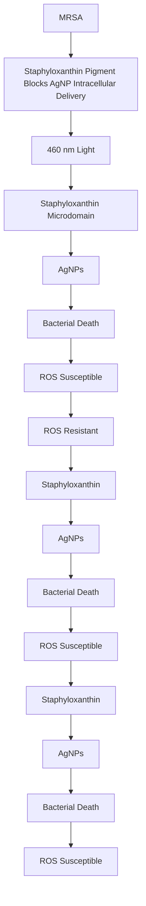

pubs.acs.org/JPCC

Article

# Staphyloxanthin Photolysis Potentiates Low Concentration Silver Nanoparticles in Eradication of Methicillin-Resistant Staphylococcus aureus

Published as part of The Journal of Physical Chemistry virtual special issue “Toward Chemistry in Real Space and Real Time”.

Sebastian Jusuf, Jie Hui, Pu-Ting Dong, and Ji-Xin Cheng

Cite This: J. Phys. Chem. C 2020, 124, 5321−5330

Read Online

## ACCESS

Metrics & More

Article Recommendations

ABSTRACT: The rise of antibiotic resistant bacteria, e.g., methicillin-resistant Staphylococcus aureus (MRSA), has resulted in a widespread search for alternative treatments not reliant on traditional antibiotics. Silver nanoparticles (AgNPs) have long been known to exhibit antimicrobial activity against a wide variety of bacterial species. However, the clinical application of AgNPs as an alternative to antibiotics has been limited by their toxicity at high concentrations. Here, via blue-light photolysis of staphyloxanthin (STX), a carotenoid pigment in the MRSA membrane, we are able to significantly increase the antimicrobial efficacy of AgNPs. With 4 h of 5 μg/mL AgNP exposure, there is no significant change in MRSA burden compared to the control. In contrast, a 99.99% reduction in MRSA burden is observed for samples exposed to 30 J/cm2 of pulsed

blue light. The underlying mechanism is unveiled as that STX photolysis increases permeability of membrane and facilitates the uptake of AgNPs into the bacterium. This approach reduces the working concentration of AgNPs from >10 μg/mL down to 1 μg/ mL, well below the toxic threshold of 10 μg/mL for mammalian cells. This approach has been found effective on stationary-phase MRSA and MRSA biofilms, demonstrating its potential for treating MRSA skin infections.

flowchart

## INTRODUCTION

The start of the modern “antibiotic era” is often attributed to Alexander Fleming’s discovery and isolation of penicillin in 1929.1 Following the successful purification and stabilization of penicillin in the 1940s, the mass production and worldwide usage of antibiotics has revolutionized the treatment of infectious bacterial diseases, paving the way for major advancements in medicine and surgery as well as worldwide increases in life expectancy and quality of life.2 However, as early as 1945, researchers have warned about the development of antibiotic resistant bacteria and their potential impact on the medical community.3 Despite these warnings, antibiotic resistance has steadily developed over the past few decades thanks in part to a combination of antibiotic overuse in both clinical and agricultural settings as well as the slowing development of new types of antibiotics.2 Among many of the resistant strains developing around the world, methicillinresistant S. aureus (MRSA) has emerged as one of the most persistent and rapidly spreading strains around the world. While S. aureus is normally susceptible to traditional β-lactam antibiotics like methicillin, the bacterium rapidly gained resistance to methicillin within just 3 years of the antibiotic’s introduction.4 Recently, the worldwide emergence of community-associated MRSA has resulted in near epidemic levels of infection. due in part to their increased virulence. In the United States alone, the MRSA superbug is estimated to be responsible for over 11 000 deaths per year.2

As MRSA continues to form new types of antibiotic resistance, there is an urgent need to develop novel treatment approaches. Among the various alternatives being investigated, silver nanoparticles, or AgNPs, have emerged as one of the leading potential candidates in part due to its lower toxicity, straightforward synthesis, and the unlikelihood for resistance development thanks to its multifaceted modes of action.6,7 While the precise mechanism performed by AgNPs is not completely understood, it is believed that silver acts as an

Received: October 30, 2019

Revised: February 9, 2020

Published: February 10, 2020

antimicrobial agent primarily through the oligodynamic effect, where silver reacts with thiol and amine groups of proteins.8 By binding to thiol groups in enzymes, stable $\tt A g { - } S$ bonds are formed, which deactivate the enzymes primarily associated with cellular respiration like succinyl coenzyme A synthase.9,10 This disruption of cellular respiration obstructs the donation of electrons to $\mathrm { O } _ { 2 } ,$ and leads to the generation of reactive oxygen species (ROS) within the cell.11 The formation of these ROS within the interior of the cell results in protein damage, DNA damage, and lipid peroxidation in both Gram-negative and Gram-positive bacteria strains.12−14 Recent developments and applications of AgNPs have been primarily constrained to exploring the antimicrobial properties of differently sized or shaped nanoparticles or the potential synergy of nanoparticles when combined with antibiotics or inserted within a polymer matrix. 15−17

Despite the strong antimicrobial properties of AgNPs, issues with the toxicity of nanoparticles remains that prevent it from being fully explored as a potential antimicrobial agent. Research has indicated that the inhibitory and toxic effects of AgNPs for both bacterial and mammalian cells occurs within the same range of 10 to 100 μg/mL, creating a strong obstacle in the potential application of AgNPs for bacterial infection treatment.18 This toxic range has therefore constrained AgNPs to the realm of infection prevention and disinfectant applications, such as burn wound dressings, catheter coatings, and medical devices.19−21 The potential cytotoxic effects of AgNPs on mammalian cells like human fibroblast cells have been observed to occur in a dose-dependent manner, including significantly increased ROS production inducing cell damage.22 This mammalian toxic effects highlight the need to develop new methods to lower the working concentration of AgNPs to treat bacterial infections.

Most pathogens that are responsible for human bacterial infections are known to produce several compounds known as virulence factors that can help the organism overcome host defenses as well as assist in the invasion and colonization of the host environment. 23 One common virulence factor is the expression of pigments that can act as protection against ultraviolet radiation, oxidants, and temperature variations.2 An example is staphyloxanthin (STX), a membrane-bound carotenoid pigment produced by over 90% of S. aureus clinical isolate strains that is responsible for the golden yellow color of the bacterium.25,26 STX is not only responsible for maintaining the membrane integrity of S. aureus, but the pigment also acts as an antioxidant, an key virulence factor that provides resistance to reactive oxygen species (ROS) like hydrogen peroxide $\left( \mathrm { H } _ { 2 } \mathrm { O } _ { 2 } \right)$ and the superoxide radical (OH• ).27 The overexpression of STX induces ROS resistance that allows infections of S. aureus to survive and persist against the macrophage activity of the immune system. 27 7 29 While previous literature has reported that carotenoid pigments in general are photosensitive to light exposure,30 our research has determined that the STX carotenoid pigment is subject to photolysis by photons within the blue wavelength range, with strong photobleaching and photolysis occurring around the 460 nm blue light wavelength.31 This photosensitivity is primarily attributed to the heavy presence of conjugated CC bonds found within the chemical structure.32,33 When MRSA is exposed to 460 nm light, the exposure results in the photobleaching and breakdown of STX within the MRSA membrane.31 In a more recent study, we have shown that using nanosecond pulses at the same wavelength increased the photobleaching efficacy by 1 order of magnitude, which sensitizes MRSA to a broad spectrum of antibiotics.34 In summary, the usage of light exposure to breakdown STX makes MRSA a unique candidate for the potentialization of silver nanoparticles, whose mechanisms primarily involve generating ROS within the interior of the cell.

Here, we present a novel method for treatment of MRSA through AgNP potentialization via STX photolysis. By depleting the antioxidant function of STX and disrupting the cell membrane via STX photolysis, we are able to significantly increase the potency of AgNPs allowing MRSA eradication with concentrations below 1 μg/mL, more than 10 times lower than normal antimicrobial AgNP concentrations of >10 μg/ mL.18 This potentialization method opens a window for potential in vivo applications of AgNPs for antimicrobial treatment options. By reducing the effective toxic concentration of AgNPs against MRSA, the demonstrated potentialization method may possibly be used as an effective alternative to antibiotics to treat MRSA infections in clinic.

## MATERIALS AND METHODS

Silver Nanoparticles (AgNPs). For this study, 10 nm AgNPs were obtained from Sigma-Aldrich (730785, Sigma Aldrich). The AgNPs were provided at a 20 μg/mL concentration and stabilized with sodium citrate. Through the use of a NanoBrook Omni Particle Sizer (Brookhaven Instruments), the polydispersity index was determined to be 0.135, and the nanoparticles were found to have an average diameter of 13.2 nm with a size range from 10 to 19 nm. To lower the concentrations, the stock solution was diluted with either sterile 1× phosphate buffered saline (PBS) (P5493, Sigma-Aldrich) or sterile water.

Blue Light Source. The 460 nm blue light was provided through a short-pulsed laser (OPOTEK). The laser source has a tunable wavelength range of 410 to 2200 nm, a repetition rate of 20 Hz, and a pulse width of ∼5 ns, respectively. At the 460 nm wavelength, the system has a maximum pulse energy of 9 mJ. While the standard beam diameter of the system is ∼2 mm, a collimator attached to an optical fiber was used to expand the diameter of the beam to 10 mm. With these parameters, the pulsed laser would achieve a power output of 100 mW/cm2 .

STX Isolation from MRSA and Its Absorption Spectrum. The isolation of STX from MRSA was based upon previously established protocols.29 MRSA USA300 was cultured in 4 mL of sterile Tryptic Soy Broth (TSB) for 48 h with shaking (250 rpm) at 37 °C. Then, 2 mL of the suspension was then centrifuged for 5 min at 5000 rpm, washed once with PBS, and recentrifuged. Following the removal of the supernatant, the pigment was extracted by adding 200 μL of methanol to the pellet and incubating at 55 °C for 20 min. Following centrifugation, the 60 μL of pigment containing supernatant solution was exposed to different 460 nm light dosages (0, 30, 60, 120 J/cm2 ). The absorbance spectra of each samples was measured via plate reader spectrometer.

In Vitro Potentialization Assessment between Blue Light and AgNPs in MRSA. MRSA USA300 was cultured in sterile TSB medium in a shaking (250 rpm) 37 °C incubator between 24 and 48 h in order to allow for the suspension to reach the stationary phase. Once the stationary phase has been reached, 1 mL of suspension was centrifuged, washed, and resuspended in 1x PBS. A 20 μL aliquot of this PBS/bacterial suspension was placed onto a glass cover slide and exposed to various 460 nm light dosages. Following exposure, the drops were transferred to 1.5 mL Eppendorf tubes containing $9 8 0 \mu \mathrm { L }$ of PBS. For AgNP-treated groups, the PBS was supplemented with AgNPs at different concentrations (10, 5, 2, 1, 0.5, 0.25, and $0 . 1 2 5 \mu \mathrm { g / m L } )$ . These tubes were cultured for 4−8 h. Once the culturing was complete, the solution was serially diluted in PBS using a 96 well plate and placed on tryptic soy agar plates in triplicate to quantify the number of viable MRSA cells. Plates were statically incubated at $3 7 ~ ^ { \circ } \mathrm { C }$ for 14 h before counting the CFU/mL.

Transient Absorption Microscopy. A 410 nm pump and 520 nm probe pulse train was generated through a femtosecond pulsed laser system. The system contained an optical parametric oscillator in order to generate different wavelengths over a broad wavelength range. A motorized delay stage was used to create the characteristic temporal delay between the pump and probe lasers. In order to adjust the pump and probe beam intensity, a half-wave plate and polarization beam splitter was used in combination with an acousto-optic modulator. Both beams were collinearly combined and beamed into a custom laser-scanning microscope. All modulation of the pump beam caused by sample absorbance was transferred to the probe beam. From here, the pump beam was spectrally filtered and the corresponding probe beam intensity signal was detected using a photodiode and demodulated via a phasesensitive lock-in amplifier. From this, the changes in transmission from the probe beam intensity can be measured against the temporal delay. The resulting decay curve indicates the decay signatures of a specific chromophore or compound, allowing for the identification and quantification of different chemical compounds.

In order to quantify presence and uptake of AgNPs in MRSA, a drop of the stock AgNP solution was placed on a poly-L-lysine coated slide and imaged under pump/probe settings of 410/520 nm with powers of 13/20 mW to determine the time-resolved decay curve associated with 10 nm AgNPs. Next, stationary phase MRSA was exposed to 30 J/ $\mathrm { c m } ^ { 2 }$ of 460 nm light and cultured in 10 μg/mL of AgNP for 1 h. The solution was then concentrated and a drop was placed on a slide order to measure the change in signal intensity between 460 nm light-exposed and nonexposed samples. To prevent sample burning, the power of the pump/probe system was lowered to $5 / 5$ mW while still retaining the pump probe wavelengths of 410/520 nm. While the peak signal from each sample would be used to determine the potential improved uptake of AgNPs within the MRSA, the normalized decay curve would be used to confirm the presence of AgNPs within the MRSA cells by comparing the signal to that of the original AgNP stock solution. Images were acquired under a 10× gain. For image analysis, raw data was processed under ImageJ.

HPF Staining. MRSA was cultured for 48 h in TSB media in a shaking (250 rpm) $3 7 ~ ^ { \circ } \mathrm { C }$ incubator. Once the media has acquired a rich golden color indicative of high STX production, 1 mL of suspension was centrifuged and resuspended in sterile water. Then $1 5 \mu \mathrm { L }$ of bacteria was exposed to 60 $\scriptstyle { \mathrm { J } } / \cos ^ { 2 }$ of 460 nm pulsed light and then mixed in sterile water in a 1:100 dilution. The light-exposed and nonexposed bacterial stock solutions were then divided to allow for AgNP treatment. AgNP-treated bacterial solutions were supplemented 5 μg/mL of $\mathrm { A g N P s , }$ and all samples were subsequently incubated at 37 $^ \circ \mathrm { C }$ for 2.5 h. Once complete, samples were centrifuged and the supernatant was removed and replaced with sterile water. In a

96 well plate, each sample was added to a well in triplicate and then treated with $5 \mu \mathbf { M }$ of a hydroxyl radical and peroxynitrite Sensor (HPF) to measure ROS production. (H36004, ThermoFisher Scientific). The 96-well plate was statically incubated at $3 7 ~ ^ { \circ } \mathrm { C }$ for 45 min. A plate reader was used to measure the fluorescence of the HPF at excitation/emission wavelengths of 490/515 nm.

Toxicity Assay of AgNPs and Blue Light in HEK and CHO Cell Lines. For the assessment of basic AgNP toxicity, an MTT assay was performed on human embryonic kidney-293 (HEK) cells utilizing varying concentrations of AgNPs based on previously established protocols.35 HEK cells were grown within Eagle’s minimum essential medium (DMEM) supplemented with 10% fetal bovine serum (FBS) until the cells reached 90% confluence. Once sufficient confluence and cell number was achieved, cells were released via trypsin and transferred to a 15 mL tube. Cells were quantified using a Cell counter and diluted in DMEM + 10% FBS media to achieve a concentration of $\varsigma \times 1 0 ^ { 5 }$ cells per mL. Then 200 $\mu \mathrm { L }$ of cell media were added to each well of a 96 well plate, totaling to 1 $\times \ 1 0 ^ { 5 }$ cells per well. Following cell adhesion to the plate, the cells were treated to varying concentrations of AgNPs diluted within DMEM media for 24 h. Following treatment, an MTT assay was performed based on previous protocols and quantified via plate reader at 590 nm. The assay was performed in replicates of $n = 4$ .

A MTS assay was also performed on Chinese Hamster Ovary (CHO) cells to assess the potential toxicity of light and AgNPs to mammalian cells. Cell culturing and plating procedures were the same for CHO cells as they were for HEK cells. Following cell adherence, the media for light exposed trials was replaced with colorless DMEM and exposed to $6 0 \ \mathrm { J / c m } ^ { 2 }$ of 460 nm light. Following light exposure, the media was removed and replaced with AgNP containing treatment media and allowed to culture for 24 h. Following incubation, all treatment media was replaced with fresh DMEM media and mixed with 20 μL of MTS for each well. Following 1 h of incubation, the results were quantified via plate reader at 490 nm. This assay was performed in replicates of $n = 4 .$ .

Biofilm Inhibition and Eradication Assay. The method for testing for MRSA biofilm formation is based upon a previously established microtitter dish biofilm assay.36 First, 1 mL of stationary phase MRSA was washed and resuspended in PBS. Then, 40 μL of the suspension was placed on a glass slide and exposed to $6 0 \mathrm { J } / \mathrm { c m } ^ { 2 }$ of 460 nm light before being added to a sterile 0.2% glucose containing TSB solution in a 1:100 dilution. In a 96 well plate, bacterial solution was added to each well in replicates of four for each treatment type. For AgNP-treated cells, $\mathbf { A g N P }$ solution was added to each well to obtain a concentration of 1 μg/mL AgNP. The plate was then incubated at $3 7 ~ ^ { \circ } \mathrm { C }$ for 24 h. Media was then carefully removed from each well via pipet and washed twice with PBS. Following washing, 125 μL of 0.1% crystal violet solution was added to each well and incubated at room temperature for 20 min. The crystal violet solution was then removed and each well was washed twice before being allowed to dry overnight. The next day, 125 $\mu \mathrm { L }$ of 30% acetic acid was added to each well and incubated at room temperature for 20 min to dissolve the remaining crystal violet. Each well was then further diluted by adding 125 μL of sterile water to each well before measuring the resulting absorbance at 550 nm.

For the biofilm eradication assay, MRSA was cultured for 48 h in TSB media in a shaking $3 7 ~ ^ { \circ } \mathrm { C }$ incubator. Once the suspension had reached stationary phase, an aliquot of the MRSA was added to a sterile 0.2% glucose containing TSB solution in a 1:100 dilution. In a 96 well plate, 100 μL of the dilution was added to each well and incubated for 24 h at 37 $^ \circ \mathrm { C } .$ . Following incubation and the development of MRSA biofilm, the media was removed from each well and washed with PBS to remove remaining planktonic cells. The MRSA biofilms were then exposed to 60 $\scriptstyle { \mathrm { J } } / \cos ^ { 2 }$ of 460 nm light and incubated within 200 μL of a 5 μg/mL AgNP solution at $3 7 ^ { \circ } \mathrm { C }$ for 24 h. Next, the bacterial populations within the biofilms in each well were released by scrapping each biofilm with a sterile pipet tip. The biofilm containing media in each well was removed and mixed with PBS in a 1:5 dilution within an Eppendorf tube. Each tube was sonicated for 5 min before the solution was serially diluted in PBS and plated on agar plates to quantify CFU. Plates were statically incubated at $3 7 ~ ^ { \circ } \mathrm { C }$ for 12 h before counting the CFU. All tests were performed in triplicate.

In order to confirm the effectiveness of STX photolysis within more physiologically relevant conditions, $S .$ aureus ATCC 6538 was used to form biofilms within a Center for Disease Control (CDC) biofilm reactor (CBR-90, BioSurface Technologies Corp.) based on previous protocols.37 S. aureus 6538 was selected as a model organism to generate S. aureus biofilms environments under continuous flow conditions. Polycarbonate coupons were placed and screwed into polypropylene rods and then inserted into the main chamber. Prior to incubation, all reactor components were washed, sterilized and autoclaved. To begin biofilm formation, 1 mL of overnight cultured S. aureus 6538 was added to 400 mL of TSB within the main chamber and heated to $3 8 ~ ^ { \circ } \mathrm { C }$ and mixed at 60 rpm for 16 h. Following this 16 h batch phase, the reactor was placed under continuous flow conditions for the next 48 h. Dilute TSB media $( 2 ~ \mathrm { g } / \mathrm { L } )$ was continuously flowed into the chamber at rate of 15 mL/min, while the main reactor chamber remained heated and mixed at $3 8 ~ ^ { \circ } \mathrm { C }$ and 60 rpm, respectively. Following the completion of the continuous phase, the rods containing the biofilm grown coupons were removed and washed twice in sterile PBS to remove planktonic cells. Once washing was complete, coupons were removed from rods and placed in empty 50 mL conical tubes. For 460 nm light exposure, each side of the coupon was exposed to 50 $\mathrm { J } / \mathrm { c m } ^ { 2 }$ of blue light before being placed within the 50 mL conical tubes. The biofilms were then incubated within 4 mL of $\textsf { a S } \mu \mathbf { g } / \mathbf { m } \mathbf { I }$ AgNP solution at $3 7 ~ ^ { \circ } \mathrm { C }$ for 12 h. For control studies, 4 mL of PBS was used instead. After incubation, an additional 6 mL of PBS was added to each tube. Bacteria was released from the biofilm through a step process of $_ { 3 0 \mathrm { ~ s ~ } }$ of vortexing, 5 min of sonication, 30 s of vortexing, 5 min of sonication, and then a final 30 s of vortexing. The resulting biofilm solution was serially diluted in PBS and plated on agar plates to quantify CFU. Plates were statically incubated at 37 $^ \circ \mathrm { C }$ for 12 h before counting the CFU. All tests were performed in triplicate.

Statistical Analysis. All comparative data was analyzed utilizing a Student t test to obtain significance between data sets. All figures and analysis were performed using PRISM 7 (GraphPad).

## RESULTS AND DISCUSSION

Photobleaching of STX Pigment and MRSA. The absorption spectrum of isolated STX pigment demonstrates a peak absorbance between the 450 and 460 nm wavelengths, which is consistent with previously reported literature.31 (Figure 1a) As the isolated STX pigment solution was exposed

line chart

| Wavelength (nm) | Normalized Absorbance (a.u.) |
| --------------- | ---------------------------- |
| 300             | 1.0                          |
| 400             | 0.5                          |
| 500             | 0.8                          |
| 600             | 0.2                          |
| 700             | 0.1                          |

line chart

| Wavelength (nm) | 0 J/cm² | 6 J/cm² | 18 J/cm² | 30 J/cm² |
| --------------- | ------- | ------- | -------- | -------- |
| 300             | 1.0     | 1.0     | 1.0      | 1.0      |
| 400             | 0.5     | 0.3     | 0.2      | 0.1      |
| 500             | 0.7     | 0.4     | 0.3      | 0.2      |
| 600             | 0.1     | 0.1     | 0.1      | 0.1      |

line chart

| Wavelength (nm) | 0 J/cm² | 30 J/cm² | 60 J/cm² | 120 J/cm² |
| --------------- | ------- | -------- | -------- | --------- |
| 400             | 0.75    | 0.74     | 0.73     | 0.72      |
| 450             | 0.73    | 0.72     | 0.71     | 0.70      |
| 500             | 0.68    | 0.67     | 0.66     | 0.65      |
| 550             | 0.65    | 0.64     | 0.63     | 0.62      |

text_image

d.
0 J/cm² 30 J/cm² 60 J/cm² 120 J/cm²
STX
MRSA

Figure 1. Exposure to blue light induces photobleaching and destruction of the staphyloxanthin pigment in MRSA. (a) Absorption spectrum of isolated and concentrated staphyloxanthin (STX) pigment suspended in methanol. (b) Absorption spectrum of isolated STX pigment following exposure to 0 (black), 6 (red), 18 (green), and 30 $\scriptstyle { \mathrm { J } / \cos ^ { 2 } }$ (blue) of nanosecond pulsed 460 nm blue light. Absorption peak initially present at 450 nm disappears upon light exposure. (c) Absorption spectrum of concentrated MRSA following exposure to 0 (black), 30 (red), 60 (green), and 120 $\scriptstyle { \mathrm { J } / \cos ^ { 2 } }$ (blue) of blue light. Decrease of 460 nm peak still observed despite additional organic components present in MRSA potentially reducing the effectiveness of the measurement. (d) Photobleaching of STX results in visible change in color from yellow/golden to clear in both isolated STX and concentrated MRSA. Bleaching increases with increasing light exposure.

to 460 nm pulsed light, the peak at 450 nm experiences an 80% decrease in absorbance within 30 J/cm2 (5 min) of exposure. (Figure 1b) The changes to the STX absorbance spectrum with light exposure are consistent with previous data,31 and this demonstrates that nanosecond pulsed 460 nm light is capable of inducing STX photobleaching and photolysis. In addition, the amount of STX bleaching experienced by a sample is also influenced by the volume of the sample, as larger volumes of STX solution would likely take more time to fully bleach out.

While the photobleaching of STX could be easily detected in isolated STX pigment solutions, it is important to determine that such changes are also occurring within MRSA cells. As a result, the absorption spectrum between 400 and 500 nm of concentrated MRSA solution exposed to different amounts of 460 nm light was measured. (Figure 1c) Within these results, an absorbance decrease of 3.9% was observed for the $3 0 \mathrm { J } / \mathrm { c m } ^ { 2 }$ exposure, while a decrease of 6.4% was observed following 120 $\mathrm { J } / \mathrm { \bar { c } } \mathrm { m } ^ { 2 }$ (20 min) exposure. While the change in absorbance was less obvious than that observed in the isolated STX, the presence of other biological components within MRSA likely prevents a comprehensive determination of the extent of STX photolysis within the MRSA. However, the effectiveness of 460 nm light in inducing STX photobleaching can be validated through visual means, as increasing the exposure time of blue light to MRSA results in a distinctive change in color from golden yellow to a milky white. (Figure 1d) The visual effects of photobleaching on STX can also be observed in isolated STX pigment, which goes from yellow to completely transparent with increasing light exposure. (Figure 1d)

STX Photolysis and AgNP Potentialization. Initial studies determined the minimum inhibitory concentration of 10 nm AgNPs for MRSA to be greater than $1 0 ~ \mu \mathrm { g / m L }$ . Thus, a lower concentration of $S ~ \mu \mathrm { g / m L }$ AgNPs was selected to test the impact of STX photolysis on the antimicrobial activity of AgNPs. To determine the impact of STX photolysis on AgNP effectiveness, a time-dependent killing assay was performed on MRSA treated with 30 J/cm2 of light exposure and 5 μg/mL of AgNPs. (Figure 2a) While both the control and light-exposed

  
Figure 2. STX photolysis significantly improves the antimicrobial efficiency of AgNPs in MRSA. (a) CFU count of time killing assay of MRSA exposed to 30 $\lceil / \mathrm { c m } ^ { 2 }$ of 460 nm nanosecond pulsed blue light and AgNPs. MRSA demonstrates increased sensitization and faster response to AgNP exposure following initial light treatment. (b) MRSA treated with 5 μg/mL of AgNPs alongside 460 nm light exposure dosages of 0, 30, 60, and 120 J/cm2 . Within 4 h of nanoparticle exposure, antimicrobial efficiency of silver nanoparticles significantly increases with light exposure. (c) Potentialization of AgNPs through STX photolysis allows for the complete eradication of MRSA within 8 h of culturing with 1 or 2 μg/mL of AgNP, well below previously established toxic concentrations of AgNPs. (d) 460 nm light exposure dosage of 60 $\scriptstyle { \mathrm { J } } / { \mathrm { c m } } ^ { 2 }$ can result in 99% or greater eradication of MRSA CFU in submicrogram per milliliter concentrations.

samples demonstrated no significant change in CFU throughout the course of the assay, the CFU of the 5 μg/ mL AgNP-treated sample required more than 2 h of exposure before beginning to decrease. In comparison, the combination treated sample already experienced a near 90% reduction in CFU within 2 h. In addition, by the time both the AgNP-only and combination-treated samples had been exposed for 4 h, the AgNP-only treated samples were observed to have a 90% decrease in CFU, in comparison to the 99.9% decrease for the combination treated samples. Across all culturing times measured, the combination treated samples consistently demonstrated superior efficiency over the AgNP-only treated samples by at least 1 log. These results not only demonstrate the capability of STX photolysis induced by 460 nm light exposure to potentiate silver nanoparticles, but also indicate that the bleaching of STX allows for faster killing of MRSA cells at a given time. Thus, the STX photolysis appears to enhance both the antimicrobial activity of the silver nano particles as well as the initial exposure time required for the AgNPs to begin acting upon the MRSA cells.

While it is apparent that the STX photobleaching caused by 460 nm light exposure is capable of enhancing the efficiency of $\mathrm { A g N P s , }$ it is important to assess how different light exposure dosages impacts the antimicrobial activity of AgNPs. Given a constant 5 μg/mL dosage of AgNPs and differing dosages of light exposure, the antimicrobial capabilities of AgNPs were found to be significantly improved in conjunction within increasing light exposure time. (Figure 2b) With 4 h of AgNP exposure, there was no significant change in nonexposed MRSA compared to the control. In contrast, a 99.99% reduction in MRSA CFU was observed for the 30 $\scriptstyle { \mathrm { J } } / \cos ^ { 2 }$ light-exposed MRSA treated while complete and total eradication of MRSA was observed following 120 $\scriptstyle { \mathrm { J } / \cos ^ { 2 } }$ of light exposure. These findings suggest an dose dependent relationship between the increased removal of STX and the antimicrobial capabilities of AgNPs, as increasing the exposure time of 460 nm light also increases the total amount of STX destroyed within the MRSA membrane, thus reducing the number of potential antioxidants capable of acting upon the ROS generated by the AgNPs. While significant reductions in CFU were measured in samples treated with both light and AgNPs, MRSA samples exposed to only blue light were also found to experience decreases in CFU counts, with decreases of 90 and 99% measured in the $6 0 \mathrm { J } / \mathrm { c m } ^ { 2 }$ (10 min) and 120 J/ $\mathrm { c m } ^ { 2 }$ blue-light-exposed samples, respectively. These findings suggest that the removal of STX by itself from can contribute to MRSA cell death. It is likely that with higher exposure dosages, the number of destroyed STX microdomains within the membrane increases, and the membrane perturbation caused from the STX bleaching results in MRSA cell death via membrane rupture, or amniorrhexis. 38

Based on these findings, it should be possible to improve the antimicrobial effectiveness of lower concentrations of AgNPs by increasing the light and AgNP exposure time. Thus, AgNP concentrations well below $5 ~ \mu \mathrm { g / m L }$ were investigated. Given an exposure dosage of 60 or 120 J/cm2 , AgNP concentrations of 1 and 2 μg/mL resulted in complete eradication of MRSA colonies following 8 h of culturing. (Figure 2c) In addition, significant reductions in MRSA CFU were observed in bacteria exposed to only 60 $\scriptstyle { \mathrm { J } / \cos ^ { 2 } }$ of 460 nm light and AgNP concentrations well below 1 $\mu { \bf { g } } / { \bf { m } } \mathrm { , }$ with roughly 99.9% and 99.5% reductions in CFU recorded in 0.5 and 0.125 μg/mL treated samples over the AgNP-only treated samples. (Figure 2d) The AgNP-only treated samples remained within similar magnitudes of previously recorded control data, with a CFU/ mL of around 106 . These results demonstrate the enhanced effectiveness of AgNPs when combined with STX photolysis and indicate that it is possible to obtain significant antimicrobial activity within nanogram per milliliter concen tration ranges.

Overall, when examining the results from all combination experiments, it is apparent that the process of STX bleaching allows for improved efficiency and activity of AgNPs in killing MRSA cells. Given the faster decline in CFU observed through the time killing assay, it appears that STX photolysis allows the $\mathbf { A g N P s }$ to act upon the MRSA cells more rapidly. The faster activity can likely be attributed to the improved interior accessibility caused by the STX removal, providing AgNPs with an easier way of entering the interior of the cell instead of simply aggregating around the outer membrane of the MRSA cell. In addition to reducing the time required for the AgNPs to begin affecting the cells, the process of STX photolysis also appears to improve the efficiency of AgNPs to the point where normally ineffective concentrations of AgNPs can induce significant reductions in MRSA colony populations, as observed when comparing the CFU counts of nonexposed and light-exposed MRSA treated with AgNP concentrations below 1 μg/mL. The removal of STX allows for greater effectiveness of AgNPs with lower concentrations, allowing fewer AgNPs to be required to kill off specific MRSA cells.

Transient Absorption Imaging Reveals Enhanced Uptake of AgNPs upon STX Photolysis. Despite the confirmation that STX photolysis induced by 460 nm blue light exposure works well with the bacteria killing capabilities of AgNPs, it was important to confirm the potential mechanisms at work that allows for AgNP potentialization through STX photolysis. Transient absorption microscopy was therefore utilized to determine the change in AgNP presence and uptake within MRSA cells treated with 10 μg/mL of AgNPs. Given a 5 mW pump wavelength of 410 nm and a 5 mW probe wavelength of 520 nm, control MRSA initially displayed a low signal originating from the presence of the STX pigment that rapidly disappeared within seconds due to bleaching. This meant that no significant signal from the MRSA cells could be detected during the pump−probe delay time scanning process. (Figure 3a)

In contrast, both control and light-exposed AgNP treated samples were found to display significant signal under transient absorption imaging. (Figure 3, parts b and c) Given a dynamic range from −0.14 to +1.16, the signal strength from blue-light exposed MRSA cells treated with AgNPs was considerably higher than that of the non-light-exposed MRSA. Based on the signal curve obtained from the time-resolved transient absorption images, the background subtracted decay curves of AgNP-treated MRSA were obtained. (Figure 3d) While both AgNP-treated samples demonstrated similar curves, the peak signal of the decay curve, where the time delay τ = 0, was found to be 3.33 times higher in the light-exposed MRSA treated with 10 μg/mL AgNPs compared with the MRSA treated with only 10 μg/mL of AgNPs. The increased peak signal detected suggests that the exposure to 460 nm light and subsequent treatment with AgNPs allowed for improved accumulation and penetration of nanoparticles into the MRSA cells. This improved uptake would therefore explain the greater efficiency of lower concentrations of AgNPs with light-treated MRSA, as the membrane disruption caused by the removal of STX would provide nanoparticles with greater access to the interior of the MRSA cell. However, while the peak signal detected in the time-resolved transient absorption imaging suggested increased uptake of AgNPs, a normalized version of the decay curve for the AgNP-treated samples was compared with the normalized decay curve of the 10 nm AgNP stock solution without the presence of any bacteria. (Figure 3e) Both the light-exposed and non-light-exposed AgNPtreated MRSA exhibit similar decay curve patterns, indicating that despite the different peak signals detected, both AgNP treated MRSA samples are detecting the same compound. In addition, the normalized decay curve of the AgNP solution matches up with the other curves, with the initial decay curve of the AgNP-treated MRSA following similar trends to the AgNP solution decay curve. The differences in the curves can therefore likely be attributed to a combination of lower MRSA sample size as well as different medias being used. From these results, it can be concluded that the signal and subsequent decay curve detected in the AgNP-treated MRSA samples indeed originates from AgNPs.

  
Figure 3. STX photolysis facilitates uptake of AgNPs and subsequent generation of ROS within MRSA. Maximum signal detected under transient absorption imaging (410/520 nm, 5 mW/5 mW pump/ probe settings), under the dynamic range of −0.14 to +1.16. Transient absorption signal of (a) untreated MRSA cells. (b) MRSA treated with 10 μg/mL AgNP for 1 h. (c) MRSA exposed to 30 J/cm2 of 460 nm nanosecond pulsed blue light and treated with 10 μg/mL AgNPs for 1 h. (d) Transient absorption decay curve of MRSA treated with only 10 μg/mL AgNP and MRSA treated with both blue light exposure and 10 μg/mL AgNP. (e) Normalized transient absorption decay curve of 10 μg/mL AgNP-treated MRSA and lightexposed +10 μg/mL AgNP-treated MRSA against the normalized decay curve of a pure solution of 10 μg/mL AgNP. Pure AgNP imaged under different pump/probe settings (410/520 nm, 13 mW/ 20 mW pump/probe settings) (f) HPF staining of blue-light treated and silver-nanoparticle-treated MRSA following 2.5 h of culturing. Combination of blue light and AgNP experiences a 700% and 74% increase in fluorescence and ROS generation over nontreated and only AgNP-treated samples, respectively.

Overall, based on the transient absorption imaging data, the STX photolysis induced by 460 nm blue light appears to allow for improved uptake of AgNPs into the interior and surroundings of the MRSA cells.

For this study, a 10 μg/mL AgNP solution was used to determine the improved uptake from light-exposed MRSA. This high concentration was selected due to how the higher concentration would allow one to better differentiate between the AgNP signal strength appearing within the light-exposed and nonexposed MRSA samples. The high concentration not only ensured that significant AgNP signal could still be obtained from the nonexposed samples, but also that the AgNP saturated environment would allow a greater amount of AgNPs to enter the blue-light-exposed MRSA samples, therefore better demonstrating the physical mechanisms responsible for the AgNP potentialization. For lower concentrations of AgNPs, the less AgNP saturated environment would likely result in significant signal being detected in the blue-light-exposed MRSA, with the nonexposed MRSA expressing minimal to insignificant signal due to the smaller amount of AgNPs available.

ROS Generation within MRSA. While the transient microscopy imaging confirmed the increased presence and uptake of AgNPs within 460 nm blue-light-exposed MRSA, additional testing was performed to determine if the increased uptake of AgNPs and removal of STX resulted in significant changes to the generation of ROS. ROS generation and production was quantified through the use of 5 μM of a hydroxyl radical and peroxynitrite sensor (HPF) in MRSA samples exposed to $6 0 ^ { \bullet } \mathrm { J } / \mathrm { c m } ^ { \prime } 2$ of light exposure and 5 μg/mL AgNP. (Figure 3f) Due to the significant background signal HPF was found to generate in PBS solution, bacteria were cultured within sterile water to minimize variation in data. On the basis of the normalized HPF fluorescence detected following 2.5 h of culturing, both AgNP exposed MRSA samples exhibited a significant increase in fluorescence, with increases of 359.60% and 698.57% in the non-light-exposed and light-exposed MRSA samples, respectively. In addition, when comparing the AgNP-treated samples, the light-exposed MRSA was found to experience a 73.75% increase in HPF fluorescence over the nonexposed samples. These results support the idea that not only has the removal of STX allowed for improved internalization of AgNPs within the MRSA cells, but also that the destruction of STX has allowed for a reduction of antioxidant activity, therefore allowing for greater amounts of ROS to be generated within the interior of the MRSA and contributing to the improved antimicrobial efficiency of AgNPs. While it is difficult to determine if the increased uptake and presence of AgNPs or the removal of antioxidant STX is the primary driver $\mathrm { _ { o f } }$ increased ROS presence, both attributes likely contributes to the faster activity of AgNPs observed in the time killing assay, as blue-lightexposed MRSA samples would have a greater amount of AgNP present within the interior at an earlier time point. In addition, the exposed MRSA would have fewer STX samples available to neutralize the ROS formed by the AgNP, contributing to the improved efficiency of AgNPs.

AgNP Toxicity in Mammalian Cells. Based on the lower AgNP concentrations tested with light-exposed MRSA, the same light exposure and AgNP treatment was also applied to eukaryotic HEK and CHO cells in order to assess if the effective AgNP concentrations tested were nontoxic for mammalian cells, as well as to confirm that 460 nm blue light exposure has no toxic effects on the cells. For the HEK cells, different concentrations of AgNPs were exposed to the cells for 24 h, and the resulting cell viability was determined using an MTT assay. (Figure 4a) Based on the results, it appears that AgNP concentration of 5 μg/mL and below exhibit minimal toxicity to the HEK cells, while the 10 μg/mL AgNP exposed HEK cells experienced a 32% decrease in cell viability. In contrast, the lower tested concentrations all retained average cell viabilities above 90%. These results are in line with previous toxicity studies of similarly sized AgNPs with eukaryotic cell lines like NCTC 929 (mouse fibroblasts) and HepG2 (human hepatocarcinoma) cells.39

Furthermore, the MTS assay demonstrated that combinations of pulsed blue light exposure and AgNPs do not decrease the cell viability. (Figure 4b) Exposure to only 60 J/cm2 of 460 nm light was found to have no significant effect on cell viability. While blue light exposure is known to result in increased $\mathrm { H } _ { 2 } \mathrm { O } _ { 2 }$ production in mammalian cells induced by flavin-containing oxidases, the lack of observable changes in cell viability indicates that the cells were able to recover within the 24 h following initial light exposure, and that the ROS produced had minimal impact on the overall viability.40

However, in nearly all of the AgNP-treated cells, an increase in cell viability was recorded. For the AgNP-only treated cells, a 37% and 24% increase in cell viability was recorded for the 5 and 1 μg/mL treated cells. In addition, a 31% increase was observed for the 5 μg/mL AgNP- and light-treated cells. This increase in cell viability can be attributed to the occurrence of the hormesis effect. Hormesis refers to the a biphasic dose response to environmental agents, where low doses induce a stimulatory or beneficial effect while high doses result in inhibitory or toxic effects.41 Previous research has indicated that noncytotoxic doses of silver nanoparticles alter the activation states of MAPK signaling pathways, resulting in an acceleration of cell proliferation within human hepatoma cells.42 The increased viability observed under the AgNPtreated CHO cells can therefore be primarily be attributed to increased oxidoreductase production caused by increased cell proliferation triggered by the cells response to the AgNPs. The occurrence of this hormesis effect within the CHO cells confirms that the AgNP concentrations utilized are noncytotoxic to mammalian cells, allowing for more efficient utilization of AgNPs when combined with blue light.

bar chart

| AgNP Concentration (μg/mL) | Cell Viability (%) |
| -------------------------- | ------------------ |
| 10                         | ~70                |
| 5                          | ~100               |
| 2.5                        | ~95                |
| 1.25                       | ~90                |
| 0.6                        | ~85                |
| 0.31                       | ~95                |
| 0.16                       | ~100               |
| 0                          | ~100               |

bar chart

| Condition | Cell Viability (%) |
| --------- | ------------------- |
| 60 J/cm² - | 100                 |
| 60 J/cm² + | 110                 |
| g/mL AgNP - | 135                 |
| g/mL AgNP + | 125                 |
| g/mL AgNP - | 115                 |
| g/mL AgNP + | 105                 |

Figure 4. STX photolysis lowers the working concentration of AgNPs, which reduces AgNPs toxicity to mammalian cells. (a) MTT assay of HEK cells treated with 10 nm AgNPs for 24 h. Significant cytotoxic effects of AgNPs occur at of 10 μg/mL with a 32% decrease in cell viability. No statistically significant differences in viability observed for AgNP concentrations below 5 μg/mL. (b) MTS Assay of CHO cells exposed to 60 $\scriptstyle { \mathrm { J } / \cos ^ { 2 } }$ of 460 nm nanosecond pulsed blue light and AgNP for 24 h. AgNP-only treated cells were observed to experience an increase in cell viability, while light exposure was found to induce no significant impact on the viability of CHO cells. For the combination treatment, the increases in cell viability observed appear to be induced primarily by the AgNPs.

MRSA Biofilm Formation and Inhibition. In order to determine if AgNP potentialization through STX photolysis is capable of impacting the MRSA biofilm environment, both biofilm inhibition and biofilm eradication assays were performed on MRSA biofilms formed over the course of 24 h. On the basis of a crystal violet assay used to assess the impact that both 60 $\mathrm { J } / \mathrm { c m } ^ { 2 }$ of blue light exposure and 1 μg/mL of AgNP had on the ability to form biofilms, the combination of both light exposure and AgNP was found to reduce the amount of biofilm formed on the bottom of the 96 well plate. (Figure 5a) Measuring the absorbance of the 0.1% crystal violet stain dissolved in acetic acid, the combination treatment was found to result in a 26.7% and 22.9% decrease in absorbance over the control MRSA and the 5 μg/mL AgNPonly treated MRSA. (Figure 5b) On the basis of the assay, the combination treated biofilms were less well formed compared with the control or individually treated samples.

When examining the MRSA CFU counts present within the 24 h grown biofilms following 60 $\scriptstyle { \mathrm { J } } / \cos ^ { 2 }$ of 460 nm blue light exposure and 24 h of 5 μg/mL AgNP exposure, the combination treated biofilms were found to experience CFU/mL reduction of 95% from the control biofilm specimen and a 86% reduction from the AgNP-only treated biofilms. (Figure 5c) These results indicate a significant reduction in viable MRSA CFU/mL present within the MRSA biofilms, which not only indicates that the 10 nm AgNPs are capable of penetrating the MRSA biofilm matrix, but also that AgNP potentialization through STX photolysis induced by blue light exposure is effective on sessile cells as well as planktonic cells.

text_image

a.
Control
460 nm
(60 J/cm²)
5 µg/mL AgNP
460 nm + AgNP

bar chart

| 460 nm (60 J/cm²) | Absorbance (a.u.) |
| ----------------- | ----------------- |
| -                 | 3.8               |
| +                 | 3.7               |
| -                 | 3.5               |
| +                 | 2.8               |

bar chart

| Treatment Condition | log(CFU/mL) |
| ------------------- | ----------- |
| 460 nm (60 J/cm²) - 5 µg/mL AgNP | 6.5         |
| 460 nm (60 J/cm²) + 5 µg/mL AgNP | 6.3         |
| 460 nm (60 J/cm²) - 5 µg/mL AgNP | 5.8         |
| 460 nm (60 J/cm²) + 5 µg/mL AgNP | 4.9         |

bar chart

| 460 nm (50 J/cm²) | 5 µg/mL AgNP | Log(CFU/mL) |
| ----------------- | ------------ | ----------- |
| -                 | -            | 5.5         |
| +                 | -            | 5.2         |
| -                 | +            | 4.0         |
| +                 | +            | 3.5         |

Figure 5. STX photolysis potentiates AgNPs in treatment ofS. aureus biofilms. (a) Crystal violet biofilm formation assay of stationary MRSA following 460 nm nanosecond pulsed light exposure and cultured within TSB media containing 1 μg/mL AgNPs. Biofilms were allowed to incubate for 24 h. Resulting biofilms were stained with 0.1% crystal violet. (b) Absorbance measurements of crystal violet stained MRSA biofilms treated with 30% acetic acid. (c) CFU of MRSA biofilms grown within a 96 well plate following initial pulsed blue light exposure and 24 h of exposure to AgNPs. Light-exposed and AgNP-treated biofilms experienced increased MRSA eradication. (d) CFU of S. aureus 6538 biofilms grown under continuous flow conditions following light exposure and 12 h of AgNP exposure. Light exposure improved AgNP activity within the S. aureus biofilm environment.

In order to determine the effectiveness of STX photolysis within more physiologically relevant biofilm environments, a CDC biofilm reactor was used to generate S. aureus biofilms under continuous flow conditions. S. aureus 6538 was selected to generate biofilm environments due to its well established biofilm forming ability, its common usage to test disinfectants, as well as its strong STX expression.43,44 Examining the CFU within the continuous flow grown S. aureus biofilms following 50 J/cm2 of 460 nm blue light exposure and 12 h of 5 μg/mL AgNP exposure, the combination treated biofilms were found to experience a CFU/mL reduction of 99% from the control biofilm specimen and a 73% reduction from the AgNP-only treated biofilms. (Figure 5d) Based on the similarity of these results to that of MRSA biofilms grown within the 96 well plates, these results indicate that the effectiveness of STX photolysis remains even within more physiologically relevant biofilms, allowing for the increased potentialization of AgNPs against biofilm forming STX expressing S. aureus strains like MRSA.

Given these results, while the antimicrobial activity of AgNP within the realms of biofilm formation and inhibition is confirmed to be enhanced by the exposure of blue light, the reduction of CFU found in the established MRSA and S. aureus 6538 biofilm treated with blue light and AgNPs was not quite as effective as the CFU reduction measured in planktonic bacteria samples. This decreased effectiveness and increased resistance is consistent with previous studies on the antimicrobial activity of AgNPs within S. aureus biofilm environments.45 Research has indicated that the S. aureus biofilm matrix components primarily consists of polysaccharides, proteins, and extracellular DNA/RNA.46 The presence of these charged compounds within the biofilm environment therefore might result in the silver nanoparticles primarily accumulating within the biofilm environment itself and not the bacteria populations present within the biofilm. While the increased resistance observed within biofilm environments is likely the cause of the decreased effectiveness, another potential cause for the lower effectiveness may be due to the liquid environment used to test the AgNPs on the biofilms, as AgNPs have been previously observed to display lowered effectiveness when cultured within an all liquid environments compared to growth on agar plates.14 Despite these issues, the improved efficiency of AgNPs when combined with STX photolysis was still clearly apparent even within the highly resistant S. aureus biofilm environment, displaying the potential in vivo applications of AgNPs for the treatment of S. aureus infections like MRSA that can express biofilms.

## CONCLUSIONS

The antimicrobial activity of AgNPs is significantly enhanced thanks to the potentialization of AgNPs through STX photolysis induced by 460 nm blue light, improving the ROS-generating abilities of AgNPs. Through the use of 460 nm nanosecond pulsed laser exposure, it was possible to induce the photolysis of STX present within the cell membrane. By combining this process with exposure to AgNPs, it was possible to not just improve the antimicrobial efficiency of AgNPs by increasing the overall AgNP uptake and ROS generation within effected MRSA cells. This increased AgNP uptake allowed for the effectiveness of lower AgNP concentrations, allowing for concentrations to be used below the toxic AgNP range commonly understood for both bacteria and eukaryotic cells.

Overall, this study demonstrated how STX photolysis was able to potentiate MRSA to AgNPs, allowing for increased and faster effectiveness of AgNP’s antimicrobial activity on light exposed MRSA. This improved efficiency allows for the potential usage of lower AgNP concentrations to treat MRSA infections, reaching below the normal toxic range of AgNPs for eukaryotic mammalian cells. In addition, this synergistic process can also be likely applied to other silver-based products currently in use, such as silver sulfadiazine or silver based wound dressings like Aquacel Ag.

Despite the promising results presented within this paper, additional improvements can be made in order to further improve the efficiency of AgNPs to further reduce effective concentrations and minimize toxicity. While the possible changes to the STX photolysis process is minimal, significan changes in the surface chemistry and properties of the AgNPs used can be performed to improve AgNP effectiveness. Previous studies have already indicated that coatings like low molecular weight chitosan or PLGA polymers can improve the antimicrobial activity of AgNPs within MRSA.47,48 These alterations to surface chemistry can heavily improve the specificity of AgNPs to the MRSA bacteria and help ensure that the nanoparticles are much more likely to be internalized within MRSA instead of eukaryotic cells. In addition, recent innovations in AgNP synthesis have led to the creation of silver coated superparamagnetic ion oxide nanoparticles that have demonstrated the ability to fully penetrate biofilm environments in the presence of a magnetic field, creating a potential method of improving the effectiveness of this method within a biofilm environment.49 While this study focused primarily on the use of silver nanoparticles, the membrane permeabilization and STX removal induced by 460 nm blue light can be easily combined with other types of nanoparticles, such as gold nanoparticles. In conclusion, this AgNP potentialization process offered through the use of STX photolysis opens new windows into alternative treatment methods for MRSA and helping to reduce the overuse and abundance of antibiotics in treatment.

## AUTHOR INFORMATION

## Corresponding Author

− Department of Biomedical Engineering, -Xin ChengDepartment of Electrical & Computer Engineering, Department of Chemistry, and Photonics Center, Boston University, Boston, Massachusetts 02215, United States; orcid.org/0000-0002- 5607-6683; Email: jxcheng@bu.edu

## Authors

− Department of Biomedical Engineering, ebastian JusufBoston University, Boston, Massachusetts 02215, United States − Department of Electrical & Computer Engineering, e HuiBoston University, Boston, Massachusetts 02215, United States − Department of Chemistry, Boston University, u-Ting DongBoston, Massachusetts 02215, United States

Complete contact information is available at: https://pubs.acs.org/10.1021/acs.jpcc.9b10209

## Author Contributions

J.-X.C. conceived the project and supervised the experiments. S.J designed the experiments, conducted the experiments, and interpreted the data. J.-X.C., P.-T.D., and J.H. contributed to the design of the experiment. S.J drafted the manuscript. All authors read the manuscript.

## Notes

The authors declare no competing financial interest.

## ACKNOWLEDGMENTS

This work was supported by the Boston University Start-Up Fund.

## REEERENCES

(1) Aminov, R. I. A Brief History of the Antibiotic Era: Lessons Learned and Challenges for the Future. Front. Microbiol. 2010, 1, 134.  
(2) Ventola, C. L. The Antibiotic Resistance Crisis. Pharm. Ther. 2015, 40 (4), 277−283.  
(3) Alanis, A. J. Resistance to Antibiotics: Are We in the Post-Antibiotic Era? Arch. Med. Res. 2005, 36 (6), 697−705.  
(4) Davies, J.; Davies, D. Origins and Evolution of Antibiotic Resistance. Microbiol. Mol. Biol. Rev. 2010, 74 (3), 417−433.  
(5) Chambers, H. F.; DeLeo, F. R. Waves of Resistance: Staphylococcus Aureus in the Antibiotic Era. Nat. Rev. Microbiol. 2009, 7 (9), 629−641.  
(6) Clement, J. L.; Jarrett, P. S. Antibacterial Silver. Met.-Based Drugs 1994, 1 (5−6), 467−482.  
(7) Chopra, I. The Increasing Use of Silver-Based Products as Antimicrobial Agents: A Useful Development or a Cause for Concern? J. Antimicrob. Chemother. 2007, 59 (4), 587−590.  
(8) Marx, D. E.; Barillo, D. J. Silver in Medicine: The Basic Science. Burns 2014, 40, S9−S18.  
(9) Davies, R. L.; Etris, S. F. The Development and Functions of Silver in Water Purification and Disease Control. Catal. Today 1997, 36 (1), 107−114.  
(10) Yamanaka, M.; Hara, K.; Kudo, J. Bactericidal Actions of a Silver Ion Solution on Escherichia Coli, Studied by Energy-Filtering Transmission Electron Microscopy and Proteomic Analysis. Appl. Environ. Microbiol. 2005, 71 (11), 7589−7593.  
(11) Park, H.-J.; Kim, J. Y.; Kim, J.; Lee, J.-H.; Hahn, J.-S.; Gu, M. B.; Yoon, J. Silver-Ion-Mediated Reactive Oxygen Species Generation Affecting Bactericidal Activity. Water Res. 2009, 43 (4), 1027−1032.  
(12) Sies, H. Oxidative Stress: Oxidants and Antioxidants. Exp. Physiol. 1997, 82 (2), 291−295.  
(13) Cabiscol Catala, E.; Tamarit Sumalla, J.; Ros Salvador, J.̀ Oxidative Stress in Bacteria and Protein Damage by Reactive Oxygen Species. Int. Microbiol. 2000, 3 (1), 3−8.  
(14) Sondi, I.; Salopek-Sondi, B. Silver Nanoparticles as Anti microbial Agent: A Case Study on E. Coli as a Model for Gram Negative Bacteria. J. Colloid Interface Sci. 2004, 275 (1), 177−182.  
(15) Pal, S.; Tak, Y. K.; Song, J. M. Does the Antibacterial Activity of Silver Nanoparticles Depend on the Shape of the Nanoparticle? A Study of the Gram-Negative Bacterium Escherichia Coli. Appl. Environ. Microbiol. 2007, 73 (6), 1712−1720.  
(16) Shahverdi, A. R.; Fakhimi, A.; Shahverdi, H. R.; Minaian, S. Synthesis and Effect of Silver Nanoparticles on the Antibacterial Activity of Different Antibiotics against Staphylococcus Aureus and Escherichia Coli. Nanomedicine (N. Y., NY, U. S.) 2007, 3 (2), 168− 171.  
(17) Kong, H.; Jang, J. Antibacterial Properties of Novel Poly-(Methyl Methacrylate) Nanofiber Containing Silver Nanoparticles. Langmuir 2008, 24 (5), 2051−2056.  
(18) Greulich, C.; Braun, D.; Peetsch, A.; Diendorf, J.; Siebers, B.; Epple, M.; Köller, M. The Toxic Effect of Silver Ions and Silver Nanoparticles towards Bacteria and Human Cells Occurs in the Same Concentration Range. RSC Adv. 2012, 2 (17), 6981−6987.  
(19) Rai, M.; Yadav, A.; Gade, A. Silver Nanoparticles as a New Generation of Antimicrobials. Biotechnol. Adv. 2009, 27 (1), 76−83.  
(20) Silver, S.; Phung, L. T.; Silver, G. Silver as Biocides in Burn and Wound Dressings and Bacterial Resistance to Silver Compounds. J. Ind. Microbiol. Biotechnol. 2006, 33 (7), 627−634.  
(21) Kim, J. S.; Kuk, E.; Yu, K. N.; Kim, J.-H.; Park, S. J.; Lee, H. J.; Kim, S. H.; Park, Y. K.; Park, Y. H.; Hwang, C.-Y.; et al. Antimicrobial Effects of Silver Nanoparticles. Nanomedicine (N. Y., NY, U. S.) 2007, 3 (1), 95−101.  
(22) AshaRani, P. V.; Low Kah Mun, G.; Hande, M. P.; Valiyaveettil, S. Cytotoxicity and Genotoxicity of Silver Nanoparticles in Human Cells. ACS Nano 2009, 3 (2), 279−290.  
(23) Johnson, J. R. Virulence Factors in Escherichia Coli Urinary Tract Infection. Clin. Microbiol. Rev. 1991, 4 (1), 80−128.  
(24) Liu, G. Y.; Nizet, V. Color Me Bad: Microbial Pigments as Virulence Factors. Trends Microbiol. 2009, 17 (9), 406−413.  
(25) Pelz, A.; Wieland, K.-P.; Putzbach, K.; Hentschel, P.; Albert, K.; Götz, F. Structure and Biosynthesis of Staphyloxanthin from Staphylococcus Aureus. J. Biol. Chem. 2005, 280 (37), 32493−32498.  
(26) von Eiff, C.; Becker, K.; Skov, R. L. Staphylococcus, Micrococcus, and Other Catalase-Positive Cocci. Manual of Clinica Microbiology 2015, 1, 354−382.  
(27) Clauditz, A.; Resch, A.; Wieland, K.-P.; Peschel, A.; Götz, F. Staphyloxanthin Plays a Role in the Fitness of Staphylococcus Aureus and Its Ability To Cope with Oxidative Stress. Infect. Immun. 2006, 74 (8), 4950−4953.  
(28) Song, Y.; Liu, C.-I.; Lin, F.-Y.; No, J. H.; Hensler, M.; Liu, Y.-L.; Jeng, W.-Y.; Low, J.; Liu, G. Y.; Nizet, V.; et al. Inhibition of Staphyloxanthin Virulence Factor Biosynthesis in Staphylococcus Aureus: In Vitro, in Vivo, and Crystallographic Results. J. Med. Chem. 2009, 52 (13), 3869−3880.  
(29) Liu, G. Y.; Essex, A.; Buchanan, J. T.; Datta, V.; Hoffman, H. M.; Bastian, J. F.; Fierer, J.; Nizet, V. Staphylococcus Aureus Golden Pigment Impairs Neutrophil Killing and Promotes Virulence through Its Antioxidant Activity. J. Exp. Med. 2005, 202 (2), 209−215.  
(30) Butnariu, M. Methods of Analysis (Extraction, Separation, Identification and Quantification) of Carotenoids from Natural Products. J. Ecosyst. Ecography 2016, 6 (2), 1−19.  
(31) Dong, P.-T.; Mohammad, H.; Hui, J.; Leanse, L. G.; Li, J.; Liang, L.; Dai, T.; Seleem, M. N.; Cheng, J.-X. Photolysis of Staphyloxanthin in Methicillin-Resistant Staphylococcus Aureus Potentiates Killing by Reactive Oxygen Species. Adv. Sci. 2019, 6 (11), 1900030.  
(32) Cogdell, R. J.; Frank, H. A. How Carotenoids Function in Photosynthetic Bacteria. Biochim. Biophys. Acta, Rev. Bioenerg. 1987, 895 (2), 63−79.  
(33) Kumar B. N., V.; Kampe, B.; Rosch, P.; Popp, J. Characterization of Carotenoids in Soil Bacteria and Investigation of Their Photodegradation by UVA Radiation via Resonance Raman Spectroscopy. Analyst (Cambridge, U. K.) 2015, 140 (13), 4584−4593.  
(34) Hui, J.; Dong, P.-T.; Liang, L.; Mandal, T.; Li, J.; Ulloa, E. R.; Zhan, Y.; Jusuf, S.; Zong, C.; Seleem, M. N. Photo-Disassembly of Membrane Microdomains Revives Conventional Antibiotics against MRSA. Adv. Sci. 2020, 1903117.  
(35) van Meerloo, J.; Kaspers, G. J. L.; Cloos, J. Cell Sensitivity Assays: The MTT Assay. Methods Mol. Biol. 2011, 731, 237−245.  
(36) O’Toole, G. A. Microtiter Dish Biofilm Formation Assay. J. Visualized Exp. 2011, e2437.  
(37) Schwartz, K.; Stephenson, R.; Hernandez, M.; Jambang, N.; Boles, B. R. The Use of Drip Flow and Rotating Disk Reactors for Staphylococcus Aureus Biofilm Analysis. J. Visualized Exp. 2010, e2470.  
(38) Lohner, K.; Blondelle, S. E. Molecular Mechanisms of Membrane Perturbation by Antimicrobial Peptides and the Use of Biophysical Studies in the Design of Novel Peptide Antibiotics. Comb. Chem. High Throughput Screening 2005, 8 (3), 241−256.  
(39) Salomoni, R.; Leo, P.; Montemor, A.; Rinaldi, B.; Rodrigues, M.́ Antibacterial Effect of Silver Nanoparticles in Pseudomonas Aeruginosa. Nanotechnol., Sci. Appl. 2017, 10, 115−121.  
(40) Hockberger, P. E.; Skimina, T. A.; Centonze, V. E.; Lavin, C.; Chu, S.; Dadras, S.; Reddy, J. K.; White, J. G. Activation of Flavin-Containing Oxidases Underlies Light-Induced Production of H2O2 in Mammalian Cells. Proc. Natl. Acad. Sci. U. S. A. 1999, 96 (11), 6255− 6260.  
(41) Mattson, M. P. Hormesis Defined. Ageing Res. Rev. 2008, 7 (1), 1−7.  
(42) Jiao, Z.-H.; Li, M.; Feng, Y.-X.; Shi, J.-C.; Zhang, J.; Shao, B. Hormesis Effects of Silver Nanoparticles at Non-Cytotoxic Doses to Human Hepatoma Cells. PLoS One 2014, 9 (7), e102564.  
(43) Luppens, S. B. I.; Reij, M. W.; van der Heijden, R. W. L.; Rombouts, F. M.; Abee, T. Development of a Standard Test To Assess the Resistance of Staphylococcus Aureus Biofilm Cells to Disinfectants. Appl. Environ. Microbiol. 2002, 68 (9), 4194−4200.  
(44) Lee, J.-H.; Park, J.-H.; Cho, M. H.; Lee, J. Flavone Reduces the Production of Virulence Factors, Staphyloxanthin and α-Hemolysin, in Staphylococcusaureus. Curr. Microbiol. 2012, 65 (6), 726−732.  
(45) Martinez-Gutierrez, F.; Boegli, L.; Agostinho, A.; Sanchez, E.́ M.; Bach, H.; Ruiz, F.; James, G. Anti-Biofilm Activity of Silver Nanoparticles against Different Microorganisms. Biofouling 2013, 29 (6), 651−660.  
(46) Dakheel, K. H.; Abdul Rahim, R.; Neela, V. K.; Al-Obaidi, J. R.; Hun, T. G.; Yusoff, K. Methicillin-Resistant Staphylococcus Aureus Biofilms and Their Influence on Bacterial Adhesion and Cohesion. BioMed Res. Int. 2016, 2016, 1−14.  
(47) Peng, Y.; Song, C.; Yang, C.; Guo, Q.; Yao, M. Low Molecular Weight Chitosan-Coated Silver Nanoparticles Are Effective for the Treatment of MRSA-Infected Wounds. Int. J. Nanomed. 2017, 12, 295−304.  
(48) Smith, J. R.; Lamprou, D. A. Polymer Coatings for Biomedical Applications: A Review. Trans. Inst. Met. Finish. 2014, 92 (1), 9−19.  
(49) Mahmoudi, M.; Serpooshan, V. Silver-Coated Engineered Magnetic Nanoparticles Are Promising for the Success in the Fight against Antibacterial Resistance Threat. ACS Nano 2012, 6 (3), 2656−2664.