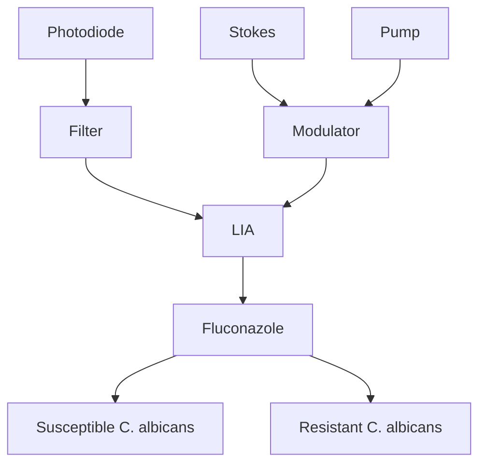

# Stimulated Raman Imaging Reveals Aberrant Lipogenesis as a Metabolic Marker for Azole-Resistant Candida albicans

Caroline W. Karanja,†,∥ Weili Hong, ‡,∥ Waleed Younis,§ Hassan E. Eldesouky,§ Mohamed N. Seleem, ,§ and Ji-Xin Cheng\* ,†,‡

† Department of Chemistry, Purdue University, 560 Oval Drive, West Lafayette, Indiana 47907, United States  
‡ Weldon School of Biomedical Engineering, Purdue University, 206 S. Martin Jischke Dr., West Lafayette, Indiana 47907, United States  
§ Department of Comparative Pathobiology, Purdue College of Veterinary Medicine, Purdue University, West Lafayette, Indiana 47907, United States

Supporting Information

ABSTRACT: Candida albicans is the single most prevalent cause of fungal bloodstream infections worldwide causing significant mortality as high as 50 percent. This high mortality rate is, in part, due to the inability to initiate an effective antifungal therapy early in the disease process. Mortality rates significantly increase after 12 hours of delay in initiating the appropriate antifungal therapy following a positive blood culture. Early administration of appropriate antifungal therapy is hampered by the slow turnovers of the conventional antimicrobial testing techniques, which require days of incubation. To address this unmet need, we explored the potential of employing stimulated Raman scattering (SRS)

imaging to probe for metabolic differences between fluconazole-susceptible and -resistant strains at a single cell level in search of a metabolic signature. Metabolism is integral to pathogenicity. Since only a few hours are needed to observe a full metabolic cycle in C. albicans, metabolic profiling provides an avenue for rapid antimicrobial susceptibility testing. C−H frequency (2850 cm−1 ) SRS imaging revealed a substantial difference in lipogenesis between the fluconazole-susceptible and -resistant C. albicans. Exposure to fluconazole, an antimicrobial drug that targets ergosterol biosynthesis, only affected the lipogenesis in the susceptible strain. These results show that single cell metabolic imaging via SRS microscopy can be used for rapid detection of antimicrobial susceptibility.

flowchart

H uman fungal infections have been referred to as “hidden killers”, as the impact of these diseases on human health is not highly appreciated.1 Medical mycology research lags behind other pathogen research despite the high mortality rates associated with invasive fungal infections (IFIs).1−3 IFIs are responsible for over one and a half million deaths every year worldwide.3 Over 90 percent of fungal-related deaths results from species that belong to the following genera: Cryptococcus, Candida, Aspergillus, and Pneumocystis.1,3 Candida genus, most notably Candida albicans, is the fungi mostly associated with IFIs.4−6 C. albicans is a benign member of the human microbiota. However, in severely immunocompromised individuals, C. albicans can cause bloodstream infections (Candidemia), in time developing into disseminated invasive Candidiasis when the infections spread to other organs.7,8 Unfortunately, life-saving practices such as transplantation procedures, the use of indwelling devices, and prolonged intensive care stays have increased the occurrence of IFIs.9 It is projected that the incidence of IFIs will continue to raise due to the prevalence of immunosuppressing diseases such as cancer and human immunodeficiency virus (HIV).

Echinocandins and fluconazole are recommended as the first line therapy for IFIs.10 Echinocandins targets the cell wall by inhibiting β-(1,3)-glucan synthesis, a vital component of the cell wall. Fluconazole on the other hand affects fungal cell membrane integrity by inhibiting ergosterol biosynthesis, a major sterol component of the cell membrane. Fluconazole has several advantages over other antifungal drugs in terms of the cost, safety, oral bioavailability, and ability to cross the blood brain barrier.11 Unfortunately, the widespread use of fluconazole has resulted in increased antifungal resistance to the drug among different fungal strains, especially C. albicans.12,13 Establishment of resistance becomes a confounding factor that negatively impacts patients’ outcome. Determination of antifungal resistance is therefore crucial for guiding therapeutic decision making. Observational studies have described a correlation between early administration of

Received: May 12, 2017

Accepted: August 16, 2017

Published: August 16, 2017

antifungal therapy and reduced mortality in critically ill patients with fungal infections.14,15 However, antifungal susceptibility assessment by current gold standard methods is limited by slow turnaround time; usually 24 to 48 h of incubation is required.16 Rapid evaluation of drug susceptibility is therefore essential for facilitating early administration of appropriate antifungal.

Molecular techniques such as polymerase chain reaction (PCR) have the potential for rapid detection of certain resistance arising from genetic mutations.13 These methods, though robust, are also technically demanding and cannot detect all resistant strains. On the other hand, metabolism is integral to pathogenicity. In fact, metabolic adaptation has been shown to affect antifungal susceptibility.8,17 Eukaryotic pathogens such as Candida exhibit drug resistance by reducing intracellular concentration, drug inactivation, target modification, target overexpression, bypassing target pathway, or by sequestering the drug away from the target.18 The cell needs energy to maintain these defense mechanisms. One way of attaining this energy is through metabolic regulation. Metabolic profiling has provided deep insight into abnormalities illness such as cancer.19,20 Consequently, it is believed that metabolic profiles can distinguish between susceptible and resistant strains. The metabolomics field mainly relies on mass spectrometry methods to characterize metabolic profiles of biological samples owing to their high specificity and sensitivity.21,22 A major limitation of mass spectrometry is sample preparation, where by the metabolites of interest have to be extracted from the tissue or cells.

Vibrational spectroscopy based on infrared absorption or Raman scattering offers an extraction-free analytical technique for metabolic profiling of biological samples.23,24 Raman scattering is advantageous over infrared absorption in that it is free from water interference, making it ideal for biological samples. Raman microscopy does, however, has a major limitation; the Raman effect is extremely weak, which results in slow image acquisition speed. Fortunately, strong signals can be achieved with coherent Raman scattering modalities, which include coherent anti-Stokes Raman scattering (CARS) and stimulated Raman scattering (SRS). CARS suffers from nonresonant background interference, complicating the signal recovery process.25 On the other hand, SRS is nonresonant background free, which enables direct signal interpretation.26 Both CARS and SRS microscopy have the capability of mapping lipid droplets in yeasts27−29 and human speci-30,31 mens.

Here we demonstrate the ability of SRS microscopy to rapidly detect fluconazole susceptibility via live cell metabolic imaging. Our SRS imaging data revealed aberrant lipogenesis in fluconazole-resistant C. albicans strains. Furthermore, we found that exposure to fluconazole only attenuates lipogenesis in the susceptible strain. By direct imaging of lipogenesis activity, our method can discriminate the susceptible strain from the resistant strain within 5 h, which is more than 5-fold faster than the conventional methods that require up to 48 h. These results collectively substantiate SRS microscopy as a feasible platform for rapid detection of antifungal susceptibility.

## EXPERIMENTAL SECTION

Chemicals and Reagents. Yeast extract peptone dextrose (YPD), Yeast nitrogen base (YNB), Yeast extract, 2-deoxy-Dglucose (2-DG), thiazolyl blue tetrazolium blue (MTT), and oleic acid-d34 were purchased from Sigma-Aldrich (St. Louis, MO). Yeast extract peptone (YP) was prepared by adding 20 grams of bacteriological peptone (Becton Dixon., Franklin, NJ) and 10 g of yeast extract in one liter of distilled water. Glucosed7 and 2-deoxy-2-[(7-nitro-2,1,3-benzoxadia-zol-4-yl) amino]- D-glucose (2NBDG) were purchased from Cayman Chemical (Ann Arbor, MI). Phosphate-buffered saline (PBS) and fluconazole were purchased from ThermoFisher Scientific (Waltham, MA). Ultrapure Agarose purchased from Invitrogen (Carlsbad, CA).

C. albicans Culture. Cells were cultured at $3 7 ~ ^ { \circ } \mathrm { C }$ in an incubating orbital shaker (VMR, model 3500I). C. albicans cells were grown overnight in YPD, pelleted, and washed three times with 1× PBS. Approximately, $1 \ \times \ 1 0 ^ { 7 }$ cells/mL were resuspended in fresh YPD and grown to exponential phase (five hour incubation). For glucose depletion study, cells in the exponential phase were cultured in YPD and YP overnight. For glycolysis inhibition assay, cells in exponential phase were cultivated in YPD and YPD supplemented with 0.2 M 2-DG overnight. For the glucose-d7 uptake assay, cells in exponential phase were incubated overnight in YNB medium supplemented with 2% glucose-d7. Fatty acid uptake assay was performed by incubating cells in exponential phase with YNB medium supplemented with 0.1% oeic acid-d34 for 6 h. For 2NBDG uptake assay, cells were first exposed to fluconazole for 3 h and then incubated with 100 μM 2NBDG for 30 min.

Glycolysis Inhibition Toxicity Test. Cells were grown overnight in YPD. Cells were then washed three times in PBS and optical density (OD) adjusted to 0.5 at 600 nm. The cells were then inoculated in YPD supplemented with 1 M 2-DG. Two hundred microliters of the cells and YPD 1 M 2-DG mixture were seeded to the first row of a 96-well plate. A 2-fold serial dilution to a final concentration of 0.2 M 2-DG was performed. The cells were then incubated at 37 °C for 3 h. Cel viability was measured with MTT colorimetric assay.

Clinical Isolates and Antifungal Susceptibility Testing. A total of twenty-six C. albicans clinical isolates (Table S1) were screened against fluconazole, following the Clinical and Laboratory Standards Institute (CLSI) M27-A3 guidelines for yeast and molds. All experiments were carried out in triplicates and repeated at least twice.

Specimen Preparation for Imaging. Agarose gel were used for live cell imaging. To prepare the gel, ten microliters of melted 2% (w/v) agarose solution (agarose solution prepared by dissolving agarose in distilled water) was pipetted on a cover glass (VMR), then immediately covered with another cover glass. After the gel solidified, the top slide was removed by sliding it toward one end of the other slide. Strips of doublesided tape were mounted around the gel to help with the sealing after the sample was mounted on the gel. Cells were pelleted and washed three times with 1× PBS. Two microliters of the cells were transferred to the agarose gel and covered with another cover-glass. Slight amount of pressure was applied to ensure the sample was completely sealed.

Stimulated Raman Loss Microscopy and Two-Photon Fluorescence Microscopy. An ultrafast laser system with dual output (Newport, InSight DeepSee) supplied the excitation sources. The tunable output with a pulse duration of 120 fs was used as the pump beam. For C−H vibrational imaging, the pump beam was tuned to 802 nm and 847 nm for C−D vibrational imaging. The second output centered at 1040 nm with a pulse duration of 220 fs was used as the Stokes beam. Stokes beam was modulated at 4.9 MHz by an acousto-optic modulator. The pump and stokes were then overlapped before being focused into the sample using a 60× water immersion objective lens (NA = 1.2, UPlanApo/IR, Olympus). An oil condenser (NA = 1.4, U-AAC, Olympus) was used to collect the signal. Since we detect the stimulated Raman loss (SRL), the stokes beam was blocked using bandpass filters (HQ825/ 150m, Chroma). SRL signal was detected using a Si photodiode integrated with a resonant circuit used in our previous paper.32 The signal was sent to a lock-in amplifier (Zurich instruments, HF2LI). A schematic showing SRS principle and SRS setup can be found in Figure S1.

Two-photon fluorescence microscopy was performed on the same set up; the signal was detected using a photomultiplier tube.

Raman Spectroscopy. A 5 ps laser (Tsunami, Spectra-Physics, Mountain View, CA) tuned to 707 nm was used as the pump beam. More details can be found in a previous study.33 Each spectrum was acquired in 20 seconds. Pump power was maintained at 74 mW.

Data Analysis. Quantification of lipid droplets was performed with ImageJ software particle analysis function. Integral density was used to represent the amount of lipid in a lipid droplet. LD integral density refers to the area of the LD multiplied by the mean gray scale of LD. Mean gray scale correlates with the SRS intensity.

## RESULTS AND DISCUSSION

SRS Imaging of Fluconazole-Susceptible and -Resistant C. albicans. To test the metabolic characteristic of fluconazole-resistant C. albicans, we obtained C−H frequency $( 2 8 5 0 ~ \mathrm { c m } ^ { - 1 } )$ SRS images of two randomly selected C. albicans clinical isolates. one susceptible and one resistant. The SRS phenomenon has a linear dependence on the concentration of the molecule being probed, therefore we can use the intensity of the signal to quantify the metabolite of interest.34,29 SRS images of the two randomly selected strains unveiled more lipids accumulation in the fluconazole-resistant C. albicans (Figure 1, panels a and b). To test if this phenomenon holds for other fluconazole-resistant C. albicans, we carried out a blinded study of twenty-two C. albicans clinical isolates (12 fluconazolesusceptible and ten fluconazole-resistant). Interestingly, we saw a huge variation in the susceptible subpopulation; some strains did not accumulate any lipids at all, and others possessed as much lipids as the resistant strains. On the other hand, all resistant strains accumulated a substantial amount of lipid (Figure S2). For statistical comparison of the two subpopulation, we performed Mann−Whitney U test since our data does not assume a normal distribution (Figure 1, panels c and d). Our analysis showed the two distribution were statistically different $( P \mathrm {  ~ \ v a l u e ~ } = \ 5 . 0 1 \ \times \ 1 0 ^ { - 5 } )$ . These data suggest fluconazole-resistant C. albicans accumulate more lipids than fluconazole-susceptible C. albicans.

Our SRS imaging data showed increased lipid accumulation in fluconazole-resistant C. albicans. This is not surprising as several studies have shown that lipids indirectly contribute to antifungal tolerance. Azole-resistant C. albicans encodes drug efflux proteins belonging to the ATP binding cassette (ABC) family, which prefer membrane rafts for localization within the plasma membrane.35−37 Protein kinase C signaling, a protein activated by diacylglycerols (DAGs) in the presence of phosphatidylserine (PS) as a cofactor has been shown to contribute to antifungal tolerance in C. albicans.38 -40 These studies together with our observation reveal the importance of lipids in establishment of azole resistance.

text_image

Susceptible
Resistant

b  

bar chart

| Group      | LD Integral Density |
| ---------- | ------------------- |
| Susceptible | 7                   |
| Resistant  | 29                  |

c  

bar chart

| LD SRS Intensity | Cell Count |
| ---------------- | ---------- |
| 0-10             | 70         |
| 10-20            | 30         |
| 20-30            | 50         |
| 30-40            | 20         |
| 40-50            | 25         |
| 50-60            | 15         |
| 60-70            | 10         |
| 70-80            | 5          |
| 80-90            | 2          |
| 90-100           | 1          |
| 100-110          | 0          |
| 110-120          | 0          |
| 120-130          | 0          |
| 130-140          | 0          |

d  

bar chart

| LD SRS Intensity | Cell Count |
| ---------------- | ---------- |
| 0-10             | 20         |
| 10-20            | 35         |
| 20-30            | 50         |
| 30-40            | 35         |
| 40-50            | 15         |
| 50-60            | 10         |
| 60-70            | 5          |
| 70-80            | 3          |
| 80-90            | 2          |
| 90-100           | 1          |
| 100-110          | 1          |
| 110-120          | 2          |
| 120-130          | 1          |
| 130-140          | 1          |

Figure 1. SRS imaging of fluconazole-susceptible and -resistant C. albicans. (a) C−H frequency (2850 cm−1 ) SRS images of fluconazolesusceptible and -resistant C. albicans. (b) Quantification of lipid signal from both fluconazole-susceptible and -resistant C. albicans strains. Student’s t test was used for statistical analysis. \*\*\*p < 0.001. (c) Histogram showing lipid storage distribution of a fluconazolesusceptible C. albicans subgroup. (d) Histogram showing lipid storage distribution of a fluconazole-resistant C. albicans sub-group. Twelve strains were sampled for the susceptible subgroup and ten for the resistant subgroup. Twenty cells were analyzed for each strain.

Aberrant Lipid Accumulation in Fluconazole-Resistant C. albicans Arises Mostly from de Novo Lipogenesis. Eukaryotic cells have two sources for lipids: de novo biosynthesis and exogenous uptake. Excessive lipids from both sources are stored in lipid droplets (Figure 2a).20 Thus, we endeavored to determine which of the two sources was responsible for the increased lipid storage in fluconazoleresistant C. albicans. Cytosolic acetyl-CoA is an essential building block for lipid biosynthesis.41 Different carbon metabolism pathways such as glycolysis, β- oxidation, and glyoxylate cycle converge on acetyl-CoA as the central metabolic intermediate.42 However, glucose is a ubiquitous carbon source, which is universally used as the preferred carbon source by most cells.43 To probe the contribution of de novo lipid biosynthesis to the increased lipid accumulation in fluconazole-resistant C. albicans, we examined the effects of glycolysis on lipids storage. Cells were grown to the stationary phase, since yeast cells accumulate more lipids in the stationary phase.44 First we cultivated fluconazole-susceptible and -resistant strains both in glucose supplemented YPD medium and glucose deficient YP medium. We took C−H frequency (2850 cm−1 ) SRS images of cells grown in both mediums and quantified the SRS signal from the LDs (Figure 2, panels b and d). We found a significant decrease in LD SRS signal from both susceptible and resistant cells (Figure 2d). However, the ΔI for the LD was higher in the resistant strain (ΔI susceptible = 21.16, ΔI resistant = 129.23), indicating glycolysis was a major contributor of the accumulated lipids. Next we used 2-deoxy--glucose (2DG), a glycolysis inhibitor, to further confirm that de novo biosynthesis was a major donor to the elevated lipid storage in fluconazole-resistant C. albicans. 2DG is a glucose analog which is avidly taken up by the cells but cannot undergo further glycolysis since the 2-hydroxyl group in the glucose molecule is replaced by a hydrogen.45 To assess the effects of

  
Figure 2. De novo lipogenesis contributes substantially to lipid accumulation in C. albicans. (a) Schematic illustration of lipid sources in a C. albicans cell. (b) Glucose depletion attenuates lipid accumulation in both fluconazole-susceptible and -resistant C. albicans strains. (c) Glycolysis inhibition significantly reduces lipid storage. (d) Quantification of effects of glucose depletion on lipid accumulation. Twenty cells analyzed for each group. (e) Quantification of effects of glycolysis inhibition on lipid accumulation. Twenty cells analyzed for each group. (f) Glycolysis inhibition is more detrimental to the resistant strain. All SRS images taken at C−H vibrational frequency $( 2 8 5 0 ~ \mathrm { c m ^ { - 1 } } )$ . Student’s t test was used for statistical analysis. $^ { * } p < 0 . 0 5 , ^ { * * * } p < 0 . 0 0 1$ .

2DG on lipid storage, we took C−H frequency $( 2 8 5 0 ~ \mathrm { c m } ^ { - 1 } )$ SRS images of cells cultivated in YPD medium supplement with 2DG and cells cultivated in normal YPD medium and compared the intensity of the LDs signal (Figure 2, panels c and e). Again we observed a significant decrease in both strains. Nevertheless, ΔI for the LD signal was still higher in the resistant strain (ΔI susceptible = 9.41, ΔI resistant = 23.73). Our results so far indicated glycolysis inhibition was more detrimental to the resistant strain. To further confirm this, we performed a cell viability assay, unquestionably the resistant strain had a lower half maximal inhibitory concentration (IC50) (Figure 2f). To track de novo lipogenesis in the cell, we used deuterium labeled glucose (glucose-d7). Remarkably, C−D vibrational frequency is located in a cell-silent region, where no other Raman signal exists (Figure S4), thus enabling detection of newly synthesized molecules with high specificity and sensitivity. We cultivated both strains to stationary phase in YNB medium supplemented with glucose-d7 and detected the C−D vibrational signal as an indicator of newly synthesized lipid droplets. Perfect colocalization of LDs from C−D (2120 $\mathsf { c m } ^ { - 1 } )$ and $\mathrm { C - H } \ \big ( 2 8 5 0 \ \mathrm { c m } ^ { - 1 } \big )$ vibration frequencies confirmed glucose-d7 was utilized by the cells to synthesize lipids (Figure 3a). Quantification of $\mathrm { C - D }$ signal from the LDs indicated that the resistant strain had a higher de novo lipogenesis rate than the susceptible strain (Figure 3, panels b and c).

Our data so far suggested that increased lipid biosynthesis is responsible for the aberrant lipid accumulation in fluconazoleresistant strain. To confirm this, we compared the rate of fatty acid uptake of both strains. In order to trace cellular uptake of fatty acids, we cultivated cells in medium supplemented with deuterated oleic acid for 6 h and detected C−D signal as a measurement of exogenous fatty acid uptake. Fatty acid uptake by the susceptible and the resistant strain was not significantly different (Figure 3, panels d and e). These data collectively indicate the aberrant lipid accumulation in fluconazole-resistant C. albicans is mainly from increased lipid biosynthesis.

De Novo Lipogenesis As a Signature for Antimicrobial Susceptibility. As witnessed in the blind study (Figure S2), we cannot differentiate fluconazole-susceptible and -resistant C. albicans solely based on their lipid accumulations; we wondered if fluconazole treated induced any metabolic reprogramming and if this change could be used to discriminate a susceptible strain from a resistant strain. Next, we tested whether glucose-based metabolic activity can be used to discern between a fluconazole-susceptible and -resistant strain. Fluconazole is a fungistatic drug, meaning that it inhibits cell growth rather than killing the cell (Figure S3). Inhibiting growth slows down metabolic activity, and this alteration can be probed with SRS microscopy. To validate metabolic reprogramming induced by fluconazole, we compared the uptake of a fluorescent glucose analog $\left( 2 \mathrm { N B D G } \right) ^ { \mathrm { 4 6 } }$ by cells cultivated both in the presence and absence of fluconazole. In the presence fluconazole, 2NBDG uptake was significantly reduced in the susceptible cells (Figure 4, panels a and b). On the contrary, fluconazole treatment upregulated 2NBDG uptake in the resistant cells (Figure 4, panels a and b). To further confirm the contrasting metabolic reprogramming in fluconazole-susceptible and -resistant cells, we used Raman spectroscopy to quantify the effects of fluconazole on glucosed7 uptake. Fluconazole treatment resulted in substantial reduction of C−D signal in the LDs of the susceptible cells (Figure S5, panels a and b), but no significant change was detected in the resistant cells (Figure S5, panels c and d). These data together affirmed that fluconazole exposure induced diverging metabolic adaptions in susceptible and resistant strains.

text_image

a
C-D	C-H	Merged
Susceptible
Resistant
20 µm

bar chart

| Group      | LD Integral Density (C-D) |
| ---------- | ------------------------- |
| Susceptible | 90                        |
| Resistant  | 210                       |

line chart

| Incubation time (hr) | Susceptible | Resistant |
| -------------------- | ----------- | --------- |
| 0                    | 0           | 0         |
| 5                    | 1           | 1         |
| 10                   | 3           | 3         |
| 20                   | 8           | 17        |

natural_image

Fluorescence microscopy images comparing susceptible and resistant cell populations under C-D condition, with scale bar indicating 20 μm (no text or symbols beyond labels)

bar chart

| Category     | LD Integral Density (C-D) |
| ------------ | ------------------------- |
| Susceptible  | 19                        |
| Resistant    | 16                        |

Figure 3. Tracking the source of increased lipid storage in fluconazole resistant C. albicans. (a) Visualization of de novo lipogenesis via C−D frequency imaging. C−D and C−H SRS images were taken for colocalization of newly synthesized lipid with accumulated lipids. (b) Quantification of lipid droplets C−D signal shows that de novo lipogenesis is higher in the fluconazole-resistant strain. (c) Quantification of de novo lipogenesis variation with time for both fluconazole-susceptible and -resistant C. albicans strains. Twenty cells analyzed at each time point. (d) Visualization of fatty acid uptake by fluconazole-susceptible and -resistant C. albicans strains via C−D frequency $( 2 1 2 0 \ \mathrm { \dot { ~ } c m ^ { - 1 } } )$ SRS imaging. (e) Quantification of fatty acid up take by fluconazole-susceptible and -resistant C. albicans strains. Twenty cells analyzed for each strain. Student’s t test was used for statistical analysis. $^ { * * } p < 0 . 0 1 ;$ ns (not significant).

To test whether SRS microscopy is able to determine the susceptibility, we took C−H frequency $( 2 8 5 0 ~ \mathrm { ~ c m } ^ { - 1 } )$ SRS images of susceptible and resistant cells cultivated to stationary phase with and without fluconazole. Fluconazole-susceptible cells showed a drastic attenuation of lipid accumulation in the presence of fluconazole; conversely, fluconazole-resistant cells accumulated lipids both in the absence and presence of fluconazole (Figure 4, panels c and d). For more sensitivity and specificity, we used glucose-d7 to examine the effects of fluconazole treatment on de novo biosynthesis of lipids. C−D imaging at $2 1 2 0 ~ \mathrm { { \ c m } ^ { - 1 } }$ revealed a substantial reduction of lipogenesis activity in the susceptible strains in the presence of fluconazole (Figure 4 (panels e and f) and Figure S6). However, there was no significant reduction in lipogenesis in the fluconazole-resistant cells (Figure 4e-f).

Our blinded study showed that some fluconazole-susceptible strains accumulate as much lipids as the resistant strains (Figure S2). To validate that lipid accumulation attenuation upon exposure to fluconazole was an indicator of fluconazole susceptibility, we repeated the same experiment with a fluconazole-susceptible strain (C4 strain) that possess high lipid accumulation. (In our blinded study C4 was the susceptible strain with the highest lipid accumulation). Similar to the susceptible strain used earlier, fluconazole treatment resulted in a drastic reduction of lipid accumulation in the C4 strain (Figure S6, panels a and b).

We then asked what would be the shortest incubation time required to comfortably distinguish a susceptible strain from a resistant strain. Cells were incubated in glucose-d7 medium for $3 , 5 ,$ and 7 h in the presence and absence of fluconazole. C−D frequency $( 2 1 2 0 ~ \mathrm { c m } ^ { - 1 } )$ SRS images were then taken, and signals of the control, and treated groups were compared. Signal from the 3 h incubation was too weak (data not shown); however, we saw a significant difference in the 5 h incubation for the fluconazole-susceptible strain (Figure 5a). The difference in lipogenesis was more significant in the 7 h group (Figure 5a). In contrast, no significant change in lipogenesis was evident in the fluconazole-resistant strain for both 5 and 7 h groups (Figure 5b). Therefore, we can discriminate between the two strains within 5 h, which is more than 5-fold faster thar the conventional methods that require up to 48 h. These studies demonstrate the robustness of metabolic imaging for rapid detection antimicrobial susceptibility.

Molecular techniques require preknowledge of the target gene being probed. This makes it challenging to detect resistance arising from unknown mutations or nongenetic processes. To demonstrate, our technique could easily detect resistant C. albicans regardless of mechanism of resistance, we repeated the experiment with four fluconazole-resistant C. albicans strains which varied in mechanism of resistance and compared them to the susceptible strain. Two of the mutants have an overexpression of the drug target (ERG11 and UPC2), and the other two have upregulated efflux proteins (MRR1 and TAC1). Upon exposure to fluconazole, lipid biosynthesis was significantly attenuated in the fluconazole-susceptible (Figure $\mathbf { \tau } _ { 6 } ) ;$ however, de novo lipogenesis rate remained unchanged in all the mutants (Figure 6). These results demonstrate the relentless ability of our technique to detect fluconazole resistance regardless of the genetic background, which is not achievable with molecular techniques.

Rodaki and colleagues independently showed glucose increases C. albicans resistance to fluconazole antifungal.47 Unfortunately, we cannot directly differentiate between fluconazole-susceptible and -resistant based on their lipogenesis profiles since some susceptible strains tend to have a lipogenesis rate similar to the resistant strains (Figure S2). Nevertheless, we showed that by probing the metabolic alteration induced upon exposure to fluconazole, we can distinguish between susceptible and resistant strains. Further-

text_image

Control	5 µg/ml Fluconazole
Susceptible
Resistant
20 µm

b

bar chart

| Group      | Control | Fluconazole |
| ---------- | ------- | ----------- |
| Susceptible | 55      | 23          |
| Resistant  | 10      | 28          |

text_image

Control
5 µg/ml Fluconazole
Susceptible
Resistant
20 µm

d  

bar chart

| Condition   | Control | Fluconazole |
| ----------- | ------- | ----------- |
| Susceptible | 70      | 100         |
| Resistant   | 280     | 200         |

e

text_image

e
Control	5 µg/ml	20 µg/ml
Fluconazole	Fluconazole
Susceptible
Resistant
20 µm

bar chart

| Condition   | Control | 5 µg/ml | 20 µg/ml |
|-------------|---------|---------|----------|
| Susceptible | 7       | -       | -        |
| Resistant   | 21      | 20      | 18       |

Figure 4. Fluconazole exposure has contrasting effects on metabolism in fluconazole-susceptible and -resistant C. albicans strains. (a) Exposure to fluconazole downregulates 2NBDG (glucose analog) uptake in fluconazole-susceptible strain, while it upregulates 2NBDG uptake in the fluconazoleresistant strain. (b) Quantification of 2NBDG uptake alteration induced by fluconazole treatment in fluconazole-susceptible and -resistant C. albicans strains. (c) C−H frequency SRS imaging reveals exposure to fluconazole attenuates lipid accumulation in the susceptible strain and no significant change in the resistant strain. (d) Quantification of lipid accumulation alteration induced by fluconazole treatment in fluconazole-susceptible and -resistant C. albicans strains. (e) Visualization of de novo lipogenesis via C−D frequency SRS imaging reveals de novo lipogenesis is attenuated by fluconazole treatment in the susceptible strain; on the contrary, the lipogenesis rate is relatively the same in the absence and presence of fluconazole in the resistant strain. (f) Quantification of de novo lipogenesis alteration induced by fluconazole treatment in both fluconazole-susceptible and -resistant C. albicans strains. Student’s t test used for statistical analysis. $* * * p < 0 . 0 0 1 ;$ ns (not significant).  

bar chart

| Susceptible | Control | Fluconazole |
| ----------- | ------- | ----------- |
| 5 hrs       | 40      | 20          |
| 7 hrs       | 110     | 30          |

bar chart

| Resistant | Control (a.u.) | Fluconazole (a.u.) |
| :--- | :--- | :--- |
| 5 hrs | 90 | 95 |
| 7 hrs | 200 | 250 |
ns; ns; ns; ns; ns; ns; ns; ns; ns; ns; ns; ns; ns; ns; ns; ns; ns; ns; ns; ns; ns; ns; ns; ns; ns; ns; ns; ns; ns; ns; ns; ns; ns; ns; ns; ns; ns; ns; ns; ns; ns; ns; ns; ns; ns; ns; ns; ns; ns; ns; ns; no data present.

Figure 5. Metabolic imaging has a potential for rapid detection of antimicrobial susceptibility testing. (a) De novo lipogenesis alteration induced by fluconazole treatment in fluconazole-susceptible albicans is detectable with in 5 h. (b) De novo lipogenesis alteration is not seen in fluconazole-resistant C. albicans under the same conditions. Student’s t test used for statistical analysis. $^ { * } p < 0 . 0 5 , ^ { * * * } p < 0 . 0 0 1 ;$ ; ns (not significant).

more, we illustrated that this method allows for rapid detection of fluconazole susceptibility; with only 5 h of incubation, we were able to discriminate susceptible strain from the resistant strain. A major improvement to the 24 to 48 h needed for the conventional methods. A major limitation of our method is sensitivity. In a previous study, our group showed the detection limit for glucose-d7 by SRS is in the mM range.34 Fortunately, such sensitivity is sufficient for us to see the difference between the susceptible and resistant strains.

bar chart

| Mutants     | Control | Fluconazole |
| ----------- | ------- | ----------- |
| Susceptible | 28      | 12          |
| Erg         | 65      | 55          |
| Mrr         | 58      | 53          |
| Tac         | 48      | 49          |
| Upc         | 44      | 43          |

Figure 6. Rapid detection of resistance via metabolic imaging is independent of mechanism of resistance. Fluconazole treatment did not alter de novo lipogenesis in the mutants ERG11 (homozygous mutation in ERG11), UPC2 (homozygous activating mutation in UPC2), MRR1 (Mdr1 overexpression), and TAC1 (Cdr1 and Cdr2 overexpression). Student’s t test was used for statistical analysis. \*\*\*p $< 0 . 0 0 \bar { 1 } ;$ ns (not significant).

Here, we used single frequency SRS to demonstrate the relationship between lipids and fluconazole resistance; this technique does not give us any information on the composition of the lipids. Lipid composition is a crucial factor in governing membrane fluidity in C. albicans. In order to understand how lipid composition influences antifungal susceptibility, we can switch to hyperspectral SRS imaging, which would help us to determine the ratio of saturated and unsaturated fatty acids in 31 lipid droplets.3

## CONCLUDING REMARKS

The key to successful treatment of patients with IFIs is prompt administration of the appropriate antifungal. In Candida infections, initiation of appropriate antifungal within the first 12 hours after the first positive blood culture significantly improves the patient’s outcome.15 However, early administration of effective drugs is hampered by the slow turnover of the current susceptibility testing techniques. Since only a few hours are needed to observe a full metabolic cycle in C. albicans, metabolic profiling provides an avenue for rapid antimicrobial susceptibility testing. Here we demonstrated this capability with SRS lipogenesis rate profiling. Unlike the molecular techniques, this method does not require extraction of metabolites or preknowledge about the strains. With the continuous development of compact and low-cost lasers, we expect clinical translation of this method in the near future.

## ASSOCIATED CONTENT

## \*S Supporting Information

The Supporting Information is available free of charge on the ACS Publications website at DOI: 10.1021/acs.anal chem.7b01798.

Experimental set up, blind study results, fluconazole kill curve, SRS images and Raman spectra illustrating C−D imaging specificity and selectivity, Raman spectra, more SRS images confirming metabolic alteration in fluconazole-susceptible induced by fluconazole exposure, and table describing strains used in the study (PDF)

## AUTHOR INFORMATION

## Corresponding Authors

\*E-mail: mseleem@purdue.edu.

\*E-mail: jcheng@purdue.edu.

## ORCID

Ji-Xin Cheng: 0000-0002-5607-6683

## Author Contributions

∥ C.W.K. and W.H. contributed equally.

## Notes

The authors declare no competing financial interest.

## ACKNOWLEDGMENTS

This work was supported by Keck Foundation Science & Engineering Grant and R01GM118471 to J.X.C. The authors thank Dr. P. David Rogers, University of Tennessee Health Science Center, for providing C. albicans mutants. The authors would like to thank BEI Resources, NIAID for support. We also acknowledge Jiawen Cui and Xueyong Zhang for helping with sample preparations and blind study data analysis.

## REEERENCES

(1) Brown, G. D.; Denning, D. W.; Gow, N. A. R.; Levitz, S. M.; Netea, M. G.; White, T. C. Sci. Transl. Med. 2012, 4, 1−9.

(2) Huffnagle, G. B.; Noverr, M. C. Trends Microbiol. 2013, 21, 334− 341.  
(3) Gow, N.; Brown, G. D.; Brown, A. J. P.; Netea, M. G.; Mcardle, K. E. Microbiol. Today 2012, Nov, 208−211.  
(4) Wisplinghoff, H.; Bischoff, T.; Tallent, S. M.; Seifert, H.; Wenzel, R. P.; Edmond, M. B. Clin. Infect. Dis. 2004, 39, 309−317.  
(5) Pfaller, M. A.; Diekema, D. J. Clin. Microbiol. Rev. 2007, 20, 133− 163.  
(6) Pfaller, M. a; Diekema, D. J. Crit. Rev. Microbiol. 2010, 36, 1−53.  
(7) Sudbery, P. E. Nat. Rev. Microbiol. 2011, 9, 737−748.  
(8) Ene, I. V.; Adya, A. K.; Wehmeier, S.; Brand, A. C.; Maccallum, D. M.; Gow, N. A. R.; Brown, A. J. P. Cell. Microbiol. 2012, 14, 1319− 1335.  
(9) Richardson, M.; Lass-Flörl, C. Clin. Microbiol. Infect. 2008, 14, 5− 24.  
(10) Pappas, P. G.; Kauffman, C. A.; Andes, D. R.; Clancy, C. J.; Marr, K. A.; Ostrosky-Zeichner, L.; Reboli, A. C.; Schuster, M. G.; Vazquez, J. A.; Walsh, T. J.; Zaoutis, T. E.; Sobel, J. D. Clin. Infect. Dis. 2015, 62, 1−50.  
(11) Debruyne, D.; Ryckelynck, J.-P. Clin. Pharmacokinet. 1993, 24, 10−27.  
(12) Ghannoum, M. A.; Rice, L. B. Clin. Microbiol. Rev. 1999, 12, 501−517.  
(13) Perlin, D. S. Curr. Opin. Infect. Dis. 2009, 22, 568−573.  
(14) Kollef, M.; Micek, S.; Hampton, N.; Doherty, J. A.; Kumar, A. Clin. Infect. Dis. 2012, 54, 1739−1746.  
(15) Morrell, M.; Fraser, V. J.; Kollef, M. H. Antimicrob. Agents Chemother. 2005, 49, 3640−3645.  
(16) Vella, A.; De Carolis, E.; Vaccaro, L.; Posteraro, P.; Perlin, D. S.; Kostrzewa, M.; Posteraro, B.; Sanguinetti, M. J. Clin. Microbiol. 2013, 51, 2964−2969.  
(17) Brown, A. J. P.; Brown, G. D.; Netea, M. G.; Gow, N. A. R. Trends Microbiol. 2014, 22, 614−622.  
(18) Fairlamb, A. H.; Gow, N. A. R.; Matthews, K. R.; Waters, A. P. Nat, Microbiol, 2016, 1. 16092.  
(19) Ward, P. S.; Thompson, C. B. Cancer Cell 2012, 21, 297−308.  
(20) Beloribi-Djefaflia, S.; Vasseur, S.; Guillaumond, F. Oncogenesis 2016, 5, e189.  
(21) Steinhauser, M. L.; Bailey, A. P.; Senyo, S. E.; Guillermier, C.; Perlstein, T. S.; Gould, A. P.; Lee, R. T.; Lechene, C. P. Nature 2012, 481, 516−519.  
(22) Irie, M.; Fujimura, Y.; Yamato, M.; Miura, D.; Wariishi, H. Metabolomics 2014, 10, 473−483.  
(23) Carden, A.; Morris, M. D. J. Biomed. Opt. 2000, 5, 259−268.  
(24) Cheng, J.-X.; Xie, X. S. Science 2015, 350, aaa8870.  
(25) Cheng, J.; Xie, X. S. J. Phys. Chem. B 2004, 108, 827−840.  
(26) Min, W.; Freudiger, C. W.; Lu, S.; Xie, X. S. Annu. Rev. Phys. Chem. 2011, 62, 507−530.  
(27) Enejder, A.; Brackmann, C.; Svedberg, F. IEEE J. Sel. Top. Quantum Electron. 2010, 16, 506−515.  
(28) Radulovic, M.; Knittelfelder, O.; Cristobal-Sarramian, A.; Kolb D.; Wolinski, H.; Kohlwein, S. D. Curr. Genet. 2013, 59, 231−242.  
(29) Fu, D.; Yu, Y.; Folick, A.; Currie, E.; Farese, R. V.; Tsai, T. H.; Xie, X. S.; Wang, M. C. J. Am. Chem. Soc. 2014, 136, 8820−8828.  
(30) Yue, S.; Li, J.; Lee, S. Y.; Lee, H. J.; Shao, T.; Song, B.; Cheng, L.; Masterson, T. A.; Liu, X.; Ratliff, T. L.; Cheng, J. X. Cell Metab. 2014, 19, 393−406.  
(31) Li, J.; Condello, S.; Thomes-Pepin, J.; Ma, X.; Xia, Y.; Hurley, T. D.; Matei, D.; Cheng, J.-X. Cell Stem Cell 2017, 20, 303−314.  
(32) Slipchenko, M. N.; Oglesbee, R. A.; Zhang, D.; Wu, W.; Cheng, J. X. J. Biophotonics 2012, 5, 801−807.  
(33) Slipchenko, M. N.; Le, T. T.; Chen, H.; Cheng, J. X. J. Phys. Chem. B 2009, 113, 7681−7686.  
(34) Li, J.; Cheng, J.-X. Sci. Rep. 2015, 4, 6807.  
(35) Kohli, A.; Smriti, N. F. N.; Mukhopadhyay, K.; Rattan, A.; Prasad, R. Antimicrob. Agents Chemother. 2002, 46, 1046−1052.  
(36) Prasad, R.; Kapoor, K. Int. Rev. Cytol. 2004, 242, 215−248.  
(37) Pasrija, R.; Panwar, S. L.; Prasad, R. Antimicrob. Agents Chemother. 2008, 52, 694−704.  
(38) Madani, S.; Hichami, a; Legrand, a; Belleville, J.; Khan, N. a. FASEB J. 2001, 15, 2595−2601.  
(39) Newton, A. C. J. Biol. Chem. 1995, 270, 28495−28498.  
(40) Lafayette, S. L.; Collins, C.; Zaas, A. K.; Schell, W. A.; Betancourt-Quiroz, M.; Leslie Gunatilaka, A. A.; Perfect, J. R.; Cowen, L. E. PLoS Pathog. 2010, 6, 79−80.  
(41) Hynes, M. J.; Murray, S. L. Eukaryotic Cell 2010, 9, 1039−1048.  
(42) Carman, A. J.; Vylkova, S.; Lorenz, M. C. Eukaryotic Cell 2008, 7, 1733−1741.  
(43) Towle, H. C. Trends Endocrinol. Metab. 2005, 16, 489−494.  
(44) Sandager, L.; Gustavsson, M. H.; Stahl, U.; Dahlqvist, A.;̊ Wiberg, E.; Banas, A.; Lenman, M.; Ronne, H.; Stymne, S. J. Biol. Chem. 2002, 277, 6478−6482.  
(45) Zhong, D.; Xiong, L.; Liu, T.; Liu, X.; Liu, X.; Chen, J.; Sun, S. Y.; Khuri, F. R.; Zong, Y.; Zhou, Q.; Zhou, W. J. Biol. Chem. 2009, 284, 23225−23233.  
(46) Zou, C.; Wang, Y.; Shen, Z. J. Biochem. Biophys. Methods 2005, 64, 207−215.  
(47) Rodaki, A.; Bohovych, I.; Enjalbert, B.; Young, T.; Odds, F. C.; Gow, N. A. R.; Brown, A. J. P. Mol. Biol. Cell 2009, 20, 4845−4855.