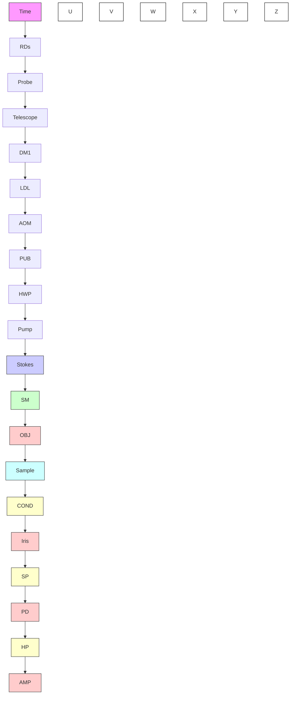

## R E S E A R C H M E T H O D S

# Stimulated Raman photothermal microscopy toward ultrasensitive chemical imaging

Yifan Zhu1 †, Xiaowei Ge2 †, Hongli Ni2 , Jiaze Yin2 , Haonan Lin3 , Le Wang2 , Yuying Tan3 , Chinmayee V. Prabhu Dessai3 , Yueming Li4 , Xinyan Teng1 , Ji-Xin Cheng1,2,3,5\*

Stimulated Raman scattering (SRS) microscopy has shown enormous potential in revealing molecular structures, dynamics, and couplings in complex systems. However, the sensitivity of SRS is fundamentally limited to the millimolar level due to shot noise and the small modulation depth. To overcome this barrier, we revisit SRS from the perspective of energy deposition. The SRS process pumps molecules to their vibrationally excited states. The subsequent relaxation heats up the surroundings and induces refractive index changes. By probing the refractive index changes with a laser beam, we introduce stimulated Raman photothermal (SRP) microscopy, where a >500-fold boost of modulation depth is achieved. The versatile applications of SRP microscopy on viral particles, cells, and tissues are demonstrated. SRP microscopy opens a way to perform vibrational spectroscopic imaging with ultrahigh sensitivity.

Copyright © 2023 The Authors, some rights reserved; exclusive licensee American Association for the Advancement of Science. No claim to original U.S. Governmen Works. Distributed under a Creative Commons Attribution NonCommercial License 4.0 (CC BY-NC)

## INTRODUCTION

Stimulated Raman scattering (SRS) microscopy has become a pow erful platform in chemical imaging (1–3), overcoming the nonres onant background issue encountered in the coherent anti-Stokes Raman scattering (CARS) microscopy. In SRS (Fig. 1A), two laser pulse trains, known as pump and Stokes, overlap in space and time. They interact coherently with Raman-active molecules resonating at the laser beating frequency, leading to a stimulated Raman gain in the Stokes field and loss in the pump field. SRS provides the same molecular vibrational features as conventional Raman spectroscopy but achieves up to six orders of magnitude faster acquisition (3). This speed improvement, together with the development of vibrational probes (4), has enabled a wide range of applications. These include label-free stimulated Raman histology (5, 6), nutrient mapping (7–9), the study of altered cancer metabolism (10–14), the resolution of heterogeneity in the microbiome (15), and the rapid detection of antimicrobial susceptibility (16). However, despite these advances, SRS faces inherent challenges in detection sensitivity due to the small modulation depth (<0.1% for a pure liquid) and the shot noise in the pump or Stokes beam (17, 18). Simply increasing the number of photons can easily exceed the sample’s power tolerance.

Pushing the fundamental limit of SRS sensitivity necessitates either reducing measurement noise or amplifying the signal. To reduce the measurement noise, efforts focused on squeezed light, referred to as “quantum-enhanced SRS.” Signal-to-noise ratio (SNR) enhancements of 3.6 dB (19) with continuous wave squeezed light and 2.89 dB (20) with pulsed squeezed light have been demonstrated with no additional perturbation on samples. While prom ising, this method is limited by low squeeze efficiency and decoherence in complex imaging systems. To amplify the signal, various photophysical processes have been used to increase the cross section. These include electronic pre-resonance SRS (21– 23), plasmon-enhanced SRS (24), and stimulated Raman excited fluorescence (25). Exceedingly high enhancement factors (104 to 107 ) of SRS signal and single-molecule SRS measurement (24, 25) have been achieved. However, the requirement of special target mol ecules or plasmonic nanostructures constrains the scope of applications.

To seek approaches toward boosting the signal, we revisit the physics of SRS from the perspective of energy transfer from lase fields to the sample. As illustrated in Fig. 1B, when pump and Stokes pulses with appropriate wavelengths interact with Raman active molecules, the target molecules are pumped to their vibra tionally excited states, with the transition energy equal to the beating frequency between the pump and Stokes lasers. After SRS excitation, the vibrationally excited molecules relax their vibrationa energy quickly through nonradiative decay. Consequently, this heats up the surrounding environment, causing a stimulated Raman photothermal (SRP) effect. As explored by Cheng and co workers in 2007 from the perspective of photodamage in CARS imaging (26), \~0.08% of the laser power is absorbed by a myelin sample through the simultaneously occurring stimulated Raman gain and loss processes.

Optically detected photothermal microscopy has been well de veloped (27) and has reached the sensitivity down to single-mole cule level (28). In photothermal spectroscopy, first reported in the 1970s (29), optical absorption raises the local temperature and induces a local change of refractive index, which is then measured with a probing beam. Early photothermal microscopy research focused on electronic absorption, targeting nonfluorescent dye molecules or metal nanostructures (27). Recently developed mid infrared photothermal microscopy provides universal infrared active vibrational spectroscopic features. It offers detection sensitiv ity at the micromolar level and achieves spatial resolution at the visible diffraction limit (30, 31). Furthermore, by probing high har monic signals, it can even achieve higher resolution (32). On the contrary, the thermal effects induced by a Raman process are com monly believed to be minimal because of the small cross sections of

A  

line chart

| Stokes pump | Value |
| ----------- | ----- |
| Peak 1      | 1.0   |
| Peak 2      | 1.0   |

line chart

| Stokes pump | Output |
| ----------- | ------ |
| SRG         | High   |
| SRL         | Medium |

B  

text_image

VS
ωp
GS
ωs
Ω
Nonradiative
decay

c

line chart

| Time / µs | ΔT / K (r = 0) | ΔT / K (r = 1 µm) | ΔT / K (r = 2 µm) |
| --------- | -------------- | ----------------- | ----------------- |
| 0         | 0              | 0                 | 0                 |
| 4         | ~1.5           | ~0.3              | ~0.1              |
| 8         | ~2.5           | ~0.4              | ~0.1              |
| 12        | ~2.5           | ~0.5              | ~0.1              |
| 16        | ~1.0           | ~0.3              | ~0.1              |
| 20        | ~0.3           | ~0.1              | ~0.1              |
| 24        | ~0.1           | ~0.1              | ~0.1              |

D  

heatmap

| r / μm | n(r) |
| ------ | ---- |
| 0.0    | 0.0  |
| 0.5    | 0.8  |
| 1.0    | 0.2  |
| 1.5    | 0.1  |
| 2.0    | 0.0  |

E  

chemical

Molecular interaction diagram showing SRS off and SRS on states with temperature T and force F labels

F  

line chart

| Time / µs | Off resonance (BG) | On resonance | On resonance (BG removed) | Simulation |
| --------- | ------------------ | ------------ | ------------------------- | ---------- |
| 0         | 1.00               | 1.00         | 1.00                      | 1.00       |
| 2         | ~0.995             | ~0.99        | ~0.99                     | ~0.99      |
| 4         | ~0.99              | ~0.98        | ~0.98                     | ~0.98      |
| 6         | ~0.985             | ~0.975       | ~0.975                    | ~0.975     |
| 8         | ~0.98              | ~0.97        | ~0.97                     | ~0.97      |
| 10        | ~0.975             | ~0.965       | ~0.965                    | ~0.965     |
| 12        | ~0.97              | ~0.96        | ~0.96                     | ~0.96      |

Fig. 1. Theoretical simulation and experimental observation of the SRP effect. (A) Schematic of stimulated Raman gain and loss. (B) Schematic of SRP effect. (C) Simulation of temperature rise induced by SRP in temporal (top) and spatial (bottom) domains. Spatial scale bar, 1 μm. (D) Simulated profile of thermal lens induced by SRP in pure DMSO. (E) Illustration of fluorescence thermometer measurement of SRP-mediated temperature rise. (F) Fluorescence intensity of rhodamine B in DMSO during an SRS process. The beating frequency $( \omega _ { \mathsf { p } } - \omega _ { \mathsf { s } } )$ ) is tuned to 2913 cm−1 for on resonance and $2 8 5 0 \mathsf { c m } ^ { - 1 }$ for off resonance (BG). The on resonance (BG removed) curve is obtained by subtracting the off resonance (BG) from the on resonance curve to eliminate the non-photothermal contributions. BG, background; a.u., arbi trary units.

Raman scattering. Here, we challenge this conventional understanding through low duty cycle coherent Raman excitation that nonlinearly benefits from high laser peak power. We show the substantial thermal effect of an SRS process and demonstrate its potential in bond-selective imaging with ultrahigh sensitivity.

## RESULTS

## Simulation of the SRP effect

In a stimulated Raman loss measurement, the relationship between the modulation depth of pump beam (η), the pump laser intensity $( I _ { \mathrm { p } } ) _ { \mathrm { \ell } }$ , and change of photon number per pulse (∆N) can be expressed as

$$
\frac {\eta I _ {\mathrm{p}}}{2} = \Delta N \cdot \hbar \omega_ {\mathrm{p}} \cdot f _ {\mathrm{rep}} \tag {1}
$$

where ℏ is the reduced Plank’s constant, $\omega _ { \mathrm { { p } } }$ is the angular frequency of the pump field, and $f _ { \mathrm { r e p } }$ is the laser repetition rate. The factor of 2 accounts for the 50% duty cycle. With this, one can estimate the energy deposition per pair of SRS pulses using $\Delta N \bullet \hbar \omega _ { \mathrm { R } } ,$ , where $\omega _ { \mathrm { R } }$ is the target Raman shift. Literature has shown that with 25 mW (modulated at 50% duty cycle) for the Stokes beam and 15 mW for the pump beams on sample at 80 MHz, the SRS modulation depth on the 2913 cm−1 mode of dimethyl sulfoxide (DMSO) reaches 0.04% (4). By substituting these measured values into the equations, the energy deposition per pair of laser pulses is calculated to be 8.7 fJ, equivalent to $0 . 7 \mu \mathrm { W }$ with 12.5 ns of pulse spacing. This substantial energy deposition aligns with Min’s calculation of the apparent cross section of SRS (33).

With this energy deposition estimation, we applied Fourier’s law and built a finite element model (fig. S1) to quantitatively simulate the stimulated Raman-induced temperature rise in pure DMSO. Simulation results (Fig. 1C) show that, when using a 0.8 numerica aperture (NA) objective alongside the routinely used laser power fo SRS (25 mW for pump, 50 mW for Stokes, 80 MHz repetition rate, and 50% duty cycle), the temperature rise at the center of the lase focus can reach as high as 2.4 K after 12 μs of stimulated Raman excitation, corresponding to 960 pairs of pump/Stokes pulses. At t = 12 μs, the temperature rises at 1 and 2 μm away from the focal center are 0.54 and 0.12 K, respectively. The temperature map at different time points is also shown in Fig. 1C. The full width at half maximum (FWHM) of the temperature rise field at t = 12 μs is cal culated to be 1.1 μm, suggesting very localized heating.

The temperature elevation subsequently changes the local refrac tive index via the thermal-optic effect. For pure DMSO with a re fractive index of 1.497 and a thermo-optic coefficient of −4.93 × $1 0 ^ { - 4 } ~ \mathrm { K } ^ { - 1 }$ (dn/dT) (34), the stimulated Raman-induced heating results in a reduction of refractive index by 0.07% at the foca center $( t = 1 2 \mu s )$ . As shown in Fig. 1D, such an index change non linearly extends to the surroundings through heat propagation, thereby giving rise to the formation of a thermal lens. The presence of such a thermal lens builds the foundation for SRP microscopy.

## Experimental confirmation of the SRP effect

We validated the simulation results using a fluorescence thermom eter. It has been well documented that the emission intensities of certain fluorophores exhibit temperature dependence (35). For in stance, the fluorescence intensity of rhodamine B decreases by \~2% per kelvin at room temperature (36). This property has been used in fluorescence-detected mid-infrared photothermal spectroscopy (37, 38). Here, we adopt this method to quantify the temperature rise at the SRS focus, using rhodamine B as a fluorescence thermometer.

When the chirped pump and Stokes lasers are focused into a DMSO solution of rhodamine B, the rhodamine B molecules at the SRS focus are electronically excited through multiphoton absorption and emit fluorescence. Meanwhile, when the beating frequency between the pump and Stokes is tuned to resonate with the C─H vibration in DMSO, the SRP effect raises the temperature and ac cordingly decreases the two-photon fluorescence intensity of rho damine B molecules (Fig. 1E). In the experiment, we used identical parameters as in the simulation. First, the fluorescence in tensity change curve measured at off-resonance frequency was subtracted from the on-resonance measurement to remove the photobleaching contribution in the result. Then, we found that the fluorescence intensity dropped \~2.3% after 12 μs of on-resonance SRS, corresponding to \~1.2 K of temperature rise (Fig. 1F), close to the simulation result of 2.4 K. The difference between the two values could be predominantly due to their different sampling regions. The experiment measured the average temperature rise across the whole laser focus, while the simulation result only showed the temperature rise at the center of the laser focus (\~20 nm diameter). After taking weighted average of temperature increases throughout the heating region and accounting for the two-photon excitation intensity of a Gaussian beam, the fluores cence change curve aligned closely with the simulation (Fig. 1F).

To eliminate the potential impact of thermophoresis on the ob served fluorescence intensity drop, we performed a control experi ment using rhodamine 800 (Rh800) as the dye in DMSO under the same SRS and two-photon excitation schemes. The fluorescence of Rh800 is not temperature dependent and not vulnerable to photo bleaching. As shown in fig. S2, the SRS process did not vary the Rh800 fluorescence intensity, indicating that thermophoresis played a negligible role.

## Optically sensing the SRP effect

The SRP effect creates a divergent lens (Fig. 1D) (27, 29) and can be optically probed through a continuous wave beam. We built a thermal ball lens model to illustrate this detection scheme. In this model, we assumed that SRS excitation creates uniform heating in a spherical symmetric region. A thermal ball lens changes the subsequent probe light propagation, which is formulated on the basis of geometrical optics (details in Supplementary Text and fig. S3). Under the paraxial approximation, the model gives the proportionality of SRP signal intensity $( I _ { \mathrm { S R P } } )$ induced by a single pair of pump and Stokes pulses as

$$
I _ {\mathrm{SRP}} \propto N _ {\mathrm{mol}} \sigma_ {\mathrm{SRS}} \phi_ {\text {pump}} \phi_ {\text {Stokes}} \tau_ {\text {exc}} \cdot \hbar \omega_ {\mathrm{SRS}} \cdot \frac {1}{V _ {\mathrm{SRS}}} \frac {1}{C _ {\mathrm{p}} n _ {0}} \frac {d n}{d T} \tag {2}
$$

Here, SRS is modeled as a two-photon vibrational excitation process (33). The first term $( N _ { \mathrm { m o l } } \sigma _ { \mathrm { S R S } } \phi _ { \mathrm { p u m p } } \phi _ { \mathrm { S t o k e s } } \tau _ { \mathrm { e x c } } )$ describes the number of SRS events, i.e., the number of vibrational excitations, $N _ { \mathrm { m o l } }$ is the number of molecules in the excitation volume, $\sigma _ { \mathrm { S R S } }$ is the SRS cross section (in $\mathrm { c m } ^ { 4 }$ s photon−1 ), $\Phi _ { \mathrm { p u m p } }$ and $\Phi _ { \mathrm { S t o k e s } }$ are the photon flux of the pump and Stokes lasers, respectively (in photon cm $^ { - 2 } \thinspace s ^ { - 1 } )$ , and $\tau _ { \mathrm { e x c } }$ is the laser pulse width (in seconds). The second term $( \hbar \omega _ { \mathrm { S R S } } )$ is the energy of vibrational transition. The last term describes properties of the measurement environment, where $V _ { \mathrm { S R S } }$ is the SRS excitation volume, $C _ { \mathrm { p } }$ is the heat capacity, $n _ { 0 }$ is the refractive index, and dn/dT is the thermo-optic coefficient. The product of the first and the second term gives the amount of energy deposition. The last term gives the rate of heat to refractive index conversion. This term is inversely proportional to the excitation volume and the heat capacity, and is linear to the thermo-optic coefficient. The environment properties term hold potential to improve the signal intensity, which is not applicable to SRS measurement. For the high NA condition, we carried ou a finite-difference time-domain wave propagation simulation. The results (fig. S4) show that the SRP signal maintains linearity to concentration.

## An SRP microscope

By sensing the local refractive index modulation using a third con tinuous wave beam, we have built an SRP microscope as illustrated in Fig. 2A. Briefly, the synchronized pump and Stokes pulse trains are intensity-modulated by two acousto-optic modulators, com bined, and chirped by glass rods. Here, chirping of femtosecond pulses generates spectral focusing for excitation of specific Raman modes (39, 40). A probe beam is collinearly aligned with the SRS beams. A pair of lenses adjusts the collimation of the probe beam to make the probe laser focus axially off the SRS focus, thereby maximizing the photothermal signal (27). An iris at the back focal plane of the condenser lens is set to an NA of 0.4 to convert the probe beam refraction modulation to intensity modulation. A fast photo diode detects the probe beam intensity, followed by a high-pass filter and a broadband amplifier. The SRP modulation induced by synchronized pump and Stokes pulses is digitized in real time by a high-speed digitization card. Further details can be found in Mate rials and Methods and fig. S5.

Unlike SRS, both the pump and Stokes beam are intensity-mod ulated in the SRP microscope. SRS intensity is proportional to the product of pump and Stokes peak power. With conserved average laser power, reduction of laser duty cycle leads to higher laser peak power and, hence, more SRS energy deposition. Our experiment (Fig. 2B) confirmed this and showed much higher SRP signal inten sity with a lower duty cycle. In SRP imaging applications, the duty cycle was set to 5 to 10% as a compromise between signal intensity and laser power. Notably, match filtering can be applied to the low duty cycle SRP signal to further improve the SNR (fig. S6). Another key parameter is the modulation frequency. Lower frequency shows higher signal intensity (Fig. 2C) due to longer heat accumulation time but suffers more from the 1/f laser intensity noise (41). However, it also reduces the imaging speed and compromises the spatial resolution. A value of 125 kHz was chosen to balance these factors.

For a pure liquid, under conditions of a 5% duty cycle and 125- kHz modulation frequency, the induced modulation on the probe beam was so strong that we could directly measure the SRP signal in the direct current channel without any amplification (Fig. 2D). With reasonable laser powers on the sample to excite the C─H sym metric stretching mode $( 2 9 1 3 ~ \mathrm { c m } ^ { - 1 } )$ ) of DMSO, the modulation depth reached 22.3%. This is >500-fold higher than the SRS modu lation depth (0.04%) with identical average power. The tremendous ly higher modulation depth lays the foundation for a better detection sensitivity.

In addition to duty cycle and modulation frequency, the thermal ball lens model shows that the medium properties are another crucial factor that affects the photothermal signal intensity. The photothermal signal intensity (S), thermo-optic coefficient (dn $d T ) ,$ and heat capacity $( C _ { p } )$ have a relationship that $\begin{array} { r } { S \propto \left( \frac { d n } { d T } / C _ { p } \right) } \end{array}$ , which is also supported by previous literature (42). However, the most common medium in biological samples, water, has a low thermo-optic coefficient $( - 1 . 1 3 \times \mathrm { \stackrel { \sim } { 1 } 0 ^ { - 4 } ~ K ^ { - 1 } } )$ (43) and high heat capacity $( 4 1 \dot { 8 } 1 \mathrm { J } \mathrm { k g } ^ { - 1 } \mathrm { K } ^ { - 1 } )$ . Seeking to increase the signal intensity, we investigated common liquid medium, as shown in table S1. We found that glycerol augments the signal intensity by 3.21-fold com pared to water. Glycerol also shows high biocompatibility and is widely used as a mounting medium or clearing agent in bioimaging. Our simulation of the thermal lens comparison, depicted in fig. S7, also aligns with previous theories. It indicates that the peak refrac tive index change in a glycerol medium is \~2.5-fold higher than in water when subjected to an identical heating, which in this case is a 100-nm poly(methyl methacrylate) (PMMA) nanoparticle under on-resonance SRP heating. Therefore, glycerol was chosen as the medium to push the sensitivity limit of SRP imaging. Considering the inherent Raman-active vibrational features of glycerol, deuterated glycerol (glycerol-d8) was applied for SRP measurement at the C─H and fingerprint regions.

flowchart

line chart

| Duty cycle | Intensity (V) |
| ---------- | ------------- |
| 6.05%      | 0.15          |
| 12.1%      | 0.15          |
| 25%        | 0.15          |
| 50%        | 0.15          |

line chart

| Time / µs | Off resonance | On resonance |
| --------- | ------------- | ------------ |
| 0         | 60            | 60           |
| 8         | 60            | 60           |
| 16        | 60            | 60           |
| 24        | 60            | 60           |
| 25        | 56.5          | 56.5         |
| 26        | 56.5          | 56.5         |

line chart

| Modulation frequency (kHz) | Intensity (V) |
| -------------------------- | ------------- |
| 18.3                       | 0.12          |
| 55                         | 0.08          |
| 110                        | 0.06          |
| 225                        | 0.04          |
| 450                        | 0.03          |

Fig. 2. SRP microscope design and characterization of SRP modulation depth as a function of duty cycle and modulation frequency. (A) Experimental setup. DM dichroic mirror; DL, delay line; AOM, acousto-optic modulator; PBS, polarizing beam splitter; HWP, half-wave plate; SM, scanning mirror; OBJ, objective; COND, condenser; SP, spectral filter; PD, photodiode; HP, high-pass filter; AMP, amplifier. (B) Measured SRP signal as a function of modulation duty cycle. (C) Measured SRP signal as a function of modulation frequency. (D) SRP generated a large (22.3%) modulation depth with DMSO as the sample. The on-resonance and off-resonance traces wer obtained with the Raman shift at 2913 and 2850 cm−1 , respectively.

## SRP spectral fidelity and detection sensitivity

We first characterized the spectral fidelity of our SRP microscope with well-defined samples. As shown in fig. S8, the SRP spectra agree with the SRS spectra for both the bulk liquid sample and nanoparticles (PMMA). We note that the SRP intensity is also proportional to $\omega _ { \mathrm { S R S } } ,$ while its impact on the SRP spectrum is neg ligible in a narrow spectral window. The high spectral fidelity build the foundation to further compare the detection sensitivities of both techniques.

We then measured the limit of detection (LOD) for DMSO, fo cusing on the $2 9 1 3 ~ \mathrm { c m } ^ { - 1 }$ mode. To keep the thermal and optical properties constant throughout the measurement, deuterated DMSO (DMSO-d6) was used as the solvent to dilute DMSO. A shown in Fig. 3A and fig. S9 (for complete measurement), the SRP spectrum was clean and smooth with a high-concentration DMSO sample, and the signal was observable at a concentration as low as 5.1 mM. We calculated the LOD as 2.3 mM using LOD $= 3 \sigma / k ,$ , where σ is the SD of the baseline and k is the slope of the intensity-concentration linear calibration curve. In comparison, the LOD by SRS under identical average laser powers was found to be 39 mM. Thus, SRP measurement offers an \~17-fold improvement. The LODs for C≡C and C─D bonds were measured in DMSO medium using 1,7-octadiyne (fig. S10) and DMSO-d6 (fig. S11). In both cases, SRP showed superior sensitivity to SRS, with 12-fold LOD in crease on 1,7-octadiyne and 4-fold LOD increase on DMSO-d6.

Such sensitivity improvement allows high-quality imaging of nanoparticles. With the SRP microscope, we successfully acquired a hyperspectral image of 100-nm PMMA beads as shown in Fig. 3C. The acquired SRP spectrum showed a Raman peak of PMMA at 2950 cm−1 , which was well distinguished from the background spectrum as shown in fig. S12, with an SNR of \~7.0 after BM4D denoising (44). In comparison, the SRS measurement showed no contrast of 100-nm beads on the same sample with identical average laser power. Collectively, SRP showed improved sensitivity compared with SRS, both for liquid samples and for nanoparticles. The introduction of a third probe beam at a shorter wavelength helped improve the spatial resolution (Fig. 3D). We plotted the intensity profile across a pair of 100-nm PMMA beads, with the Gaussian-fitted FWHM found to be \~218 nm. Deconvolution with the size of the beads generated an FWHM of \~194 nm, which was below the theoretical resolution limit of SRS under the same condition (\~217 nm, FWHM of the Airy disk).

line chart

| Raman shift / cm⁻¹ | Intensity / a.u. (46.7) | Intensity / a.u. (15.6) | Intensity / a.u. (5.2) | Intensity / a.u. (1.7) | Intensity / a.u. (0) |
| ------------------ | ------------------------ | ------------------------ | ---------------------- | ---------------------- | -------------------- |
| 2850               | ~0.3                     | ~0.3                     | ~0.3                   | ~0.3                   | ~0.3                 |
| 2900               | ~0.9                     | ~0.8                     | ~0.7                   | ~0.6                   | ~0.5                 |
| 2950               | ~0.6                     | ~0.6                     | ~0.5                   | ~0.5                   | ~0.4                 |
| 3000               | ~0.5                     | ~0.5                     | ~0.4                   | ~0.4                   | ~0.3                 |
| 3050               | ~0.4                     | ~0.4                     | ~0.3                   | ~0.3                   | ~0.2                 |

line chart

| Concentration / mM | Intensity / a.u. |
| ------------------ | ---------------- |
| 0                  | 0                |
| 5000               | ~100             |
| 10000              | ~200             |
| 15000              | ~300             |

natural_image

Fluorescence microscopy images comparing SRP and SRS cell types, showing red-stained fluorescence with white arrows indicating specific features (no text or symbols present)

line chart

| Displacement / nm | Intensity / a.u. |
| ----------------- | ---------------- |
| 0                 | 0.93             |
| 200               | 0.95             |
| 400               | 1.02             |
| 600               | 0.95             |
| 800               | 1.02             |
| 1000              | 0.95             |
| 1200              | 0.93             |

Fig. 3. SRP spectroscopy and imaging performance characterization. (A and B) SRP (A) or SRS (B) signal with gradient concentrations of DMSO dissolved in DMSO-d6 Concentration in mM. Inset shows the signal intensity as a function of concentration (complete data in fig. S6). (C) SRP and SRS image of 100-nm PMMA beads at 2950 cm−1 with the same average power, at the same field of view. Scale bar, 500 nm. The beads were immersed in d8-glycerol. (D) The Gaussian fitting FWHM of bead profile i 218 nm.

## SRP imaging of biological samples in physiological environment

To explore the potential of SRP in bioimaging, we first performed label-free SRP imaging of live SJSA-1 osteosarcoma cancer cells. As shown in Fig. 4A, the lipid droplets, endoplasmic reticulum (ER), and nucleolus show a strong signal at 2930 cm−1 . The nuclear membrane shows pronounced contrast, indicating locally enhanced pho tothermal intensity in an aqueous environment. At an imaging speed of \~2.8 s/frame, the dynamics of lipid droplets were captured, with all trajectories displayed in Fig. 4B. A complete time-lapse movie is shown in movie S1.

Next, we performed hyperspectral SRP imaging of SJSA-1 cells at the C─H stretching vibration region. As demonstrated in Fig. 4C, subcellular structures, such as lipid droplets and nucleolus, show decent contrast. Subsequent phasor analysis was applied to segment the subcellular structures (45), where five of the major components were identified (Fig. 4D) with corresponding spectra (fig. S13). A complete hyperspectral movie is shown in movie S2.

To explore the applicability of SRP imaging in the silent window, we studied the cellular uptake of deuterated palmitic acid (PA-d31). Figure S14 shows the hyperspectral SRP images of SJSA-1 cells in cubated with PA-d31. With phasor analysis, the PA-d31–rich regions (the membrane and ER) can be well separated from othe cellular components (Fig. 4E). The spectral profile (Fig. 4F) from phasor analysis shows a peak at $2 \mathrm { { i } 0 0 ~ \ c m ^ { \hat { - } 1 } }$ , where the C─D stretch vibration resides. In the control sample without PA-d31 treatment, only the cellular components were observed (Fig. 4, G and H). The background signal is independent of Raman shif (Fig. 4, F and H, and fig. S14). This background is likely from the overtone absorption of C─H vibrational transitions, which also de posits energy and create photothermal contrast. The cell back ground in the C─D SRP images is stronger than that in the C─H SRP images (Fig. 4D), which can be attributed to the 855-nm pump laser used for C─D excitation being close to the 920-nm overtone absorption band of the C─H stretching vibration.

Using mouse brain slices as the sample, we proceeded to evaluate SRP imaging performance on tissue specimens (Fig. 4, I to K). Three fields of view (FOVs) are chosen as representations of typical brain structure. In Fig. 4, I to K, the detailed structure of myelin sheath can be clearly resolved, showing the typical lipid rich Raman spectral features. The myelin sheaths with different ori entations show drastically different signal intensities, indicating a strong dependence of the SRP intensity on the laser polarization.

A  

natural_image

Microscopic view of a biological cell with scattered white star-shaped markers (no text or symbols)

B

natural_image

Microscopic image showing fluorescently labeled cells with a scale bar (0–165 s) and color gradient from blue to red (no text or symbols beyond scale)

C  

natural_image

Fluorescent microscopy image of a cell with glowing spots, showing purple emission against a dark background (no text or symbols)

D

text_image

Lipid droplet ER
Nucleolus Nuclear matrix
Cytoplasm

E  

natural_image

Fluorescent microscopy image showing red-labeled SRP and BG channels in a cellular structure (no text or symbols present)

F

line chart

| Wave number / cm⁻¹ | PA-d31 | Cell background |
| ------------------ | ------ | --------------- |
| 2080               | 1.6    | 1.2             |
| 2100               | 2.0    | 1.2             |
| 2120               | 1.7    | 1.2             |
| 2140               | 1.5    | 1.2             |
| 2160               | 1.5    | 1.2             |
| 2180               | 1.5    | 1.2             |

G  

natural_image

Fluorescent microscopy image showing cellular structures with green and red staining, labeled SRP and BG (no text or symbols beyond labels)

H  

line chart

| Wave number / cm⁻¹ | Intensity / a.u. |
| ------------------ | ---------------- |
| 2080               | 1.2              |
| 2120               | 1.2              |
| 2160               | 1.2              |

natural_image

Microscopic view of cellular structures with blue and green staining, featuring a white arrow pointing to a specific region (no text or symbols present)

J

natural_image

Microscopic image showing cellular structures with green fluorescence and a white arrow pointing to a specific region (no text or symbols present)

K  

natural_image

Fluorescent microscopy image showing green-labeled cellular structures against a blue background, with a color bar indicating intensity (no text or symbols present)

L

line chart

| Wave number / cm⁻¹ | Myelin sheath | Cytoplasm | PBS |
| ------------------ | ------------- | --------- | --- |
| 2800               | 0.1           | 0.1       | 0.1 |
| 2850               | 0.2           | 0.15      | 0.1 |
| 2900               | 0.35          | 0.2       | 0.1 |
| 2950               | 0.4           | 0.3       | 0.1 |
| 3000               | 0.2           | 0.2       | 0.1 |
| 3050               | 0.15          | 0.15      | 0.1 |

Fig. 4. SRP imaging of biological samples in aqueous environment. (A) SRP image of a live SJSA-1 cell in PBS. Raman shift, $2 9 3 0 { \ c m } ^ { - 1 }$ . (B) Dynamic imaging of th same live SJSA-1 cell with color-coded temporal dynamics of the lipid droplets inside the cell. Scale bar, 5 μm. (C) Hyperspectral SRP imaging of fixed SJSA-1 cell in PBS $2 9 3 0 { \mathsf { c m } } ^ { - 1 }$ . Scale bar, 10 μm. (D) Phasor analysis output of the hyperspectral SRP image in (C). (E to H) SRP analysis of SJSA-1 cell in PBS with (E and F) or without (G and H) palmitic acid–d31 (PA-d31) treatment. Phasor analysis separates PA-d31 SRP signal (red) and cell background (cyan) (E and G) with spectral features shown in (F) and (H) Scale bar, 10 μm. (I to K) SRP imaging of a mouse brain immersed in $\mathsf { P B S } \mathsf { a t } 2 9 3 0 \mathsf { c m } ^ { - 1 }$ in different regions. Scale bar, 12 μm. (L) Two representative spectra in the mous brain indicated with triangles from (I) (myelin sheath) and (J) (cytoplasm). The PBS spectrum was acquired at the nonsample region.

In Fig. 4J, densely packed cytoplasmic organelles were observed. The SRP spectra (Fig. 4L) show the lipid peak at $2 8 4 5 ~ \mathrm { c m } ^ { - 1 }$ and the protein peak at $2 9 3 0 ~ \mathrm { { c m } ^ { - 1 } }$ for myelin sheath, while the cytoplasm signal is dominated by proteins. The SRP signal from the medium is weak and independent of Raman shift. The tissue sample and additional SRP tissue images are shown in fig. S15. Collectively, our data show the potential of SRP imaging in chemical analysis of tissues with good spectral fidelity.

## SRP imaging of biological samples in glycerol

Compared to water, the high thermo-optic coefficient and low heat capacity of glycerol open up the opportunity to further boost the sensitivity of SRP microscopy. Inspired by the capability of imaging 100-nm nanoparticles with high SRP contrast (Fig. 3C), we first assessed SRP imaging of viral particles. As shown in Fig. 5A, individual varicella-zoster viral particles (diameter ≈ 180 nm) (46) could be clearly resolved from the background with an SNR of \~20. The SRP spectrum of a single virus (Fig. 5B) peaked at $2 9 5 0 ~ \mathrm { c m } ^ { - 1 }$ , indicating a strong contribution from the nucleic acids at the core of the virus.

Glycerol-d8 as a mounting medium was used to improve the quality of SRP imaging of mammalian cells. We used the pancreatic cancer cell MIA PaCa-2 as the test bed (Fig. 5C). Glycerol-d8 wa applied to replace the phosphate-buffered saline (PBS) buffer and immerse the cells to enhance the SRP contrast. SRP imaging at the high–wave number C─H vibration region showed a large contrast from membranes and intracellular lipids. Phasor analysis was applied to segment the cellular compartments (fig. S16), where up to six different components could be well identified (Fig. 5D). Notably, the nuclear membrane stood out from the cytoplasm and the nuclear matrix, highlighting the potential of applying SRP to study fine membrane structures. It is likely that this high contrast is a result of the high thermo-optic coefficients and low heat capacities of membranes.

Upon addition of glycerol, the high sensitivity of SRP also pro vides access to weak Raman bands in the fingerprint region.

A  

natural_image

Microscopic image showing fluorescent spots with white triangles and a scale bar (no text or symbols)

C  

natural_image

Fluorescent microscopy image of a biological cell with green fluorescent staining (no text or symbols visible)

E  

text_image

ROI2
ROI1

B  

line chart

| Raman shift / cm⁻¹ | Virus | Background |
| ------------------ | ----- | ---------- |
| 2850               | 0.1   | 0.1        |
| 2900               | 0.5   | 0.3        |
| 2950               | 1.6   | 0.4        |
| 3000               | 0.3   | 0.2        |
| 3050               | 0.1   | 0.1        |

D

text_image

Nuclear matrix Cytoplasm
Cell membrane Lipid & ER
Nucleolus Nuclear membrane

F  

line chart

| Raman shift / cm⁻¹ | ROI1 | ROI2 |
| ------------------ | ---- | ---- |
| 1550               | 0.1  | 0.4  |
| 1600               | 0.3  | 0.5  |
| 1650               | 1.0  | 1.0  |
| 1700               | 0.3  | 0.4  |
| 1750               | 0.1  | 0.1  |

Fig. 5. SRP imaging of biological samples immersed in glycerol. (A) SRP imaging of a single varicella-zoster virus immersed in glycerol-d8, 2950 cm−1 . Scale bar, 2 μm. (B) Single virus Raman spectrum at C─H region, acquired from a single virus in (A). (C) SRP imaging of fixed MIA PaCa-2 cell immersed in glycerol-d8, at 2950 cm−1 . Scale bar, 5 μm. (D) Color-coded chemical map through phasor analysis of (C). (E) SRP spectroscopic imaging of OVCAR-5 tissue, cleared with glycerol-d8, at 1650 cm−1 . (F) Single-pixel spectrum at the circled ROI.

Figure 5E shows the SRP image of a 10-μm-thick OVCAR-5 cancer tissue at 1650 cm−1 that targets the amide I band in proteins and the C═C vibration in lipids. High-quality spectra were resolved from the hyperspectral image stack. In Fig. 5F, the lipid [region of interest 1 (ROI 1)] and protein (ROI 2) species are clearly differentiated.

Last, we conducted a direct comparison between SRP and SRS at the same FOV on an SKOV3 cell in glycerol, with conserved average laser power and dwell time. The results are shown in fig. S17. The representative cellular structures (lipid droplets, cell nuclei, and nucleolus) can be clearly resolved in both images. Comparison between profiles at the lines indicated by arrows on the 2980 cm−1 frames shows an SNR of 53 for SRP and 17 for SRS. Furthermore, the SRP image clearly shows sharper contrast for the intranu clear structures.

## DISCUSSION

In this work, we have numerically simulated and experimentally confirmed the presence of the SRP effect. On the basis of this SRP effect, we have built an SRP microscope and demonstrated su perior detection sensitivity and resolution in comparison to a conventional SRS microscope. We have also demonstrated SRP imaging of multiple biological samples in aqueous and glycerol environments. Below, we compare SRP and SRS in terms of detection mechanism, spatial resolution, laser noise, and solvent effect.

SRS microscopy measures either the gain in Stokes or the loss in the pump beam. Thus, a high-NA objective is needed to maximize the collection efficiency while minimizing the cross-phase modula tion. In contrast, SRP microscopy measures light scattering caused by thermal expansion of a particle or refraction caused by the thermal lens. Thus, SRP favors light collection with a low-NA ob jective or an air condenser. As shown in fig. S18, with a 0.5 NA air condenser, the SRP image is clear and sharp, while the SRS image i comparably noisier. In addition, SRP maintains good spectral fidel ity (fig. S18C), while SRS spectrum has been distorted by the en hanced cross-phase modulation background. Quantitatively (fig. S18D), the SRP image shows 21.2-fold SNR improvement and 7.8-fold signal-to-background ratio improvement when compared to the SRS image. The relaxation of the high-NA oil condenser re quirement brings convenience in the SRP applications.

SRP holds slight advantage over SRS in terms of spatial resolu tion. With the introduction of a probe laser, the ideal effective point spread function (PSF) is the product of all three laser PSFs (i.e., pump, Stokes, and probe). In addition, the probe can be chosen at a much shorter wavelength to yield a much sharper SRP effective PSF. In this work, with a 1.49-NA objective, the ideal resolution reaches \~167 nm with a 765-nm laser applied as the probe and \~137 nm when measured with a 522-nm laser. Achieving such an ideal resolution improvement requires a high frequency (>MHz), since thermal diffusion within a modulation period will enlarge the size of thermal lens, compromising the resolution. At the extreme of low modulation frequency, the resolution is degraded to that of SRS. With the current modulation frequency of 125 kHz, the spatial resolution improvement has been substantial, from \~217 nm with SRS to \~194 nm with SRP.

The different measurement scheme between SRP and SRS also brings different origins of noise in the measurement. In both mea surements, the major origin of noise is the relative intensity nois and shot noise of the measured laser beam, which is the probe laser in SRP, or the pump/Stokes laser in SRS. The different origins of noise afford SRP two advantages. First, SRP is less susceptible to the laser noise of the ultrafast lasers used for SRS excitation. Therefore, SRP can be implemented with a noisy ultrafast laser; second, both the pump and Stokes laser powers can be increased without affecting the measurement noise of SRP. Therefore, SRP potentially enables the application of noisy and high-power lasers for vibrational imaging.

A distinguishing feature of SRP compared to SRS is its dependence on the properties of the sample environment. As a result, the lipid-rich regions in the cellular images, such as lipid droplets and lipid bilayers in membranes, exhibit enhanced contrast in comparison to SRS images. This property also enables opportunities to enhance the SRP signal intensity with a carefully engineered medium, such as critical xenon, which could bring a \~400-fold enhancement as demonstrated in visible photothermal microscopy (27). However, the sample-dependent nature of SRP signals may pose a challenge to quantitative analysis in highly heterogeneous environments.

There is still space to improve the SRP imaging performance. The imaging speed of our current setup can reach up to 8 μs/ pixel, or \~3 frames per second (FPS) for a 200 × 200–pixel image. This imaging speed is majorly limited by the low modulation frequency at 125 kHz. It is possible to achieve much higher imaging speed by measuring the SRP effect caused by a single pair of SRS excitation pulses at 1-MHz repetition rate. Under such conditions, the imaging speed is only constrained by the rate of sample cooling, usually on the level of 1 μs per pixel. This would be sufficient for SRP imaging close to video rate. Regarding detection sensitivity, it is viable to incorporate a more elegant photothermal detection scheme to boost the signal intensity, such as fluorescence detection (37, 38) or nanomechanical photothermal sensing (47). Regarding spatial resolution, it is possible to switch to a shorter wavelength probe laser and couple with an imaging scanning microscopy technique (48) to further improve the resolution to sub–100-nm level.

## MATERIALS AND METHODS

## Cell culture and sample preparation

SKOV3 (catalog no. HTB-77) and MIA PaCa-2 (catalog no. CRL 1420) cells were from the American Type Culture Collection (ATCC). Cells were cultured in high-glucose Dulbecco’s modified Eagle’s medium (Gibco) supplemented with 10% fetal bovine serum (FBS) and penicillin-streptomycin (100 U/ml) and maintained in a humidified incubator with 5% CO supply at 37°C. After overnight seeding in a sterile 35-mm glass-bottom dish (Cellvis) or #1 cover glass (VWR), cells were fixed with 10% neutral-buffered formalin for 30 min followed by three PBS washes. Then, the cells were covered with glycerol-d8 before sealing and imaging.

SJSA-1 cells (catalog no. CRL-2098) were from the ATCC. Cells were cultured in RPMI 1640 culture medium (Gibco) supplemented with 10% (v/v) FBS and 1% (v/v) penicillin-streptomycin. All cell were cultured under controlled conditions in a humidified incuba tor set at 37°C with a 5% CO supply. For the C-D labeled group, the cells were initially cultured until attaching to the glass bottom dishes and then incubated in RPMI 1640 medium containing de-lipid serum for 3 hours. Subsequently, the cells were incubated with

200 μM PA-d31 in the medium for 18 hours. Afterward, cell were fixed with 10% neutral-buffered formalin for 30 min followed by three PBS washes before microscopic imaging.

## Tissue sample preparation

## OVCAR-cisR tissue sample

A fresh ovarian tumor section was extracted from NU/J mouse (4 weeks old, female, homozygous for Foxn1nu) purchased from the Jackson Laboratory. The mouse was inoculated with OVCAR5-cisR cells. The sections were immediately fixed in a 10% formalin solu tion. The extracted tissue section was then washed using PBS solu tion and cryopreserved by incubation in 15% sucrose solution for 12 hours, followed by incubation in 30% sucrose solution overnight at room temperature. The tissue section was frozen at $- 8 0 ^ { \circ } \mathrm { C }$ by em bedding in OCT (optimal cutting temperature) compound in a tissue mold. The tissue section was then sliced using a Microm HM525 cryostat at the Bio-Interface and Technologies Facility, Boston University, into 10-μm-thick layers, each placed on separate glass slides and frozen at −80°C until the experiment. To prepare the samples for imaging, the tissue slides were washed using PBS solution to wash off the OCT. The tissue slides were then covered with glycerol-d8 before placing a coverslip to seal the glycerol-d8 covered tissue layer.

## Mouse brain tissue sample

The mouse was euthanized and perfused transcardially with PBS (1×, pH 7.4, Thermo Fisher Scientific Inc.) solution and 10% for malin, allowing the fixative to circulate throughout the vasculature. After fixation, the brain was extracted and fixed in 10% formalin solution for 24 hours to ensure complete fixation. Then, the mouse brain was submerged in a 1× PBS solution and then sliced horizontally into sections with a thickness of 100 μm using an Os cillating Tissue Slicer (OST-4500, Electron Microscopy Sciences).

## Glycerol-agar (glycerol-d8-agar) medium preparation

Agar (1%, w/w) (Sigma-Aldrich) was mixed with glycerol (or glyc erol-d8, Sigma-Aldrich) and then microwaved for 2 min to fully dis solve the agar.

## Nanoparticle and virus preparation

For 100-nm PMMA nanoparticles, 10 μl of solution was mixed with warm glycerol-d8-agar medium and then sandwiched between two No.1 coverslips before imaging. Varicella-zoster virus solution (Fisher Scientific) was dropped onto a No.1 coverslip and dried on top. The sample was covered with glycerol-d8 and then sand wiched between two coverslips and sealed with nail polish before imaging.

## Modeling the temperature change induced by SRS

To quantitatively evaluate the SRP effect, we built a model to sim ulate the heat deposition both spatially and temporally. The SRS induced temperature change is dependent on the pulse width, pulse energy, laser repetition rate, and thermal properties (thermal conductivity, heat capacity, etc.) of the sample and the sur rounding medium. First, the deposited energy by SRS is estimated by the modulation depth on the pump or Stokes beam along with the pulse energy. Then, to simulate the thermal conduction, the time domain and spatial domain are divided into finite element for the calculation according to Fourier’s law: dQ = −kA(dT/dr) (where dQ is the conducted heat energy in the time window, k i the thermal conductivity, A is the surface area, and dT is the tem perature difference between distance dr). The SRS on-off process induces heating and cooling at the focus. Heat transfer happens during both heating and cooling. During the heating process, the SRS pulses deposit heat to the sample instantaneously with a Gauss ian distribution as the vibrational excited state relaxation time is much faster compared to the simulation time grid. Last, with the heating estimated by the modulation depth and thermal conduction calculated according to Fourier’s law, the temperature spatial distribution at each time point is calculated.

To simplify the model, an isotropic Gaussian SRS heating area is assumed. The simulation area is set to be a 48-layer model with increasing step size from the center to the edge (fig. S1). The time step is set to be 200 ps, which is much smaller than the heat propagation time to ensure a converged result. DMSO has a heat conductivity of 0.2 W/(m·K). The laser parameters are set to 50% duty cycle and 80- MHz repetition rate, according to the commonly used SRS setting.

To predict the fluorescence change upon temperature rise, the excitation profile of two photon fluorescence was modeled as the normalized Gaussian PSF of the objective. Weights based on the assumed excitation profile were put onto the temperature rise of each layer and then multiplied by the −2%/K rate (35) to yield the fluorescence change.

## Measurement of temperature at the SRS focus

A fluorescence thermometer, rhodamine B (−2%/K) (34), is intro duced to measure the temperature rise at the SRS focus. Rhodamine B (80 μM) dissolved in DMSO is sandwiched between two thin coverslips (No.1; Thermo Fisher Scientific) for the measurement. A dual-output synchronized laser source (InSight X3; Spectra-Physics) provides pump and Stokes beams, respectively. The Stokes beam is modulated by an acousto-optic modulator (1205c; Isomet Corporation) at 40 kHz with the first-order beam to provide a 100% modulation depth. Then, the pump and Stokes beams are chirped by 75- and 90-cm glass rods (SF57; Scott AG), respectively, to implement hyperspectral SRS under a spectral focusing scheme. The path length of the Stokes beams could be adjusted by a motorized delay line (X-LRM025A-KX13A, Zaber Technologies). The two beams are combined by a dichroic mirror (950 nm; Chroma) and then collinearly guided into a laser scanning microscope. To vibrationally excite the C─H bond in DMSO, the pump laser was set to 800 nm with the Stokes beam wavelength fixed at 1045 nm. These two beams could also simultaneously excite the two-photon fluorescence signal of rhodamine B. A 40× water objective (NA = 0.8, Olympus) focused the two beams onto the sample, with power of 25 mW for pump and 50 mW for Stokes. The output light is collected in the forward direction by an oil condenser (NA = 1.4, Aplanat Achromat 1.4; Olympus) and a 75-mm A-coating focal lens (Thorlabs). A silicon photomultiplier (C14455- 3050GA; Hamamatsu) module with a band-pass optical filter (RT570/20x; Chroma) and two short-pass filters (1000SP, 775SP; Thorlabs) is used to detect the fluorescence signal. The output of the silicon photomultiplier is recorded by a spectrometer (Moku: Lab, Liquid Instruments) for the analysis in Fig. 1F.

## SRP microscope

The SRP microscope is based on the SRS setup described in the pre vious section. Both pump and Stokes beams are modulated by two synchronized acousto-optic modulators outputting the first-order beams, various duty cycles, and modulation frequency at 125 kHz. Besides, a 765-nm continuous probe laser (TLB6712-D; Spec tral Physics) is added after the combining dichroic mirror by a po larized beam splitter to form a three-beam copropagating colinear system (Fig. 2B). The three beams are guided to a two-dimensional galvo scanning unit (GVS002; Thorlabs), which is conjugated by a four-focal system to the back aperture of a 100× oil objective (NA = 1.49, UAPON100XOTIRF; Olympus). The NA of the condenser is adjusted to 0.4 to enable the detection of the thermal lensing signal. The detector is a broadband silicon photodiode (Hamamatsu) with 50-ohm resistance, a 22-kHz high-pass radio frequency filter (Mini circuits), and a 46-dB low-noise amplifier (SA230-F5; Wayne). A tilted band-pass optical filter (FL780-10; Thorlabs) is mounted before the detector to block the SRS beams and allow sole detection of the probe beam. The output signal is digitized by a fast data ac quisition card (Alazar card, ATS9462; Alazar Technologies). For the images of bio-samples in water environment (Fig. 4), virus (Fig. 5A), and image comparison between SRS and SRP (fig. S17), the 1045-nm femtosecond laser output is sent to a lithium triborate crystal to generate 522.5-nm SHG laser beam and then chirped to serve as the SRP probe. This picosecond probe with reduced coherence length minimizes the interference from the medium/cover glass interface.

When performing SRS imaging on the same setup, the probe laser is turned off. A 1.4-NA condenser is used to minimize the cross-phase modulation background. The modulation on the pump is set to always on, and the Stokes was modulated at \~2.25 MHz. After the condenser, two short-pass optical filters (980SP; Thorlabs) pass the pump beam to the photodiode. A laboratory built resonant amplifier after the photodiode picks up the stimulat ed Raman loss signal. The photodiode output is then sent to the lock-in amplifier (MFLI; Zurich), and the stimulated Raman los signal is recorded with a data acquisition card (NIDAQ card, PCI-6363; National Instruments). The SRS LOD measurement were performed on a separate SRS system with no modulation on pump to ensure optimized measurement quality.

The SRP system is electronically synchronized by a NI-DAQ card. The NIDAQ card controls the galvo scanning unit and gener ates both the transistor-transistor logic trigger to control the sam pling of the Alazar card and the pixel trigger to control the function generator. The function generator generates rectangular waves with various duty cycles at 125 kHz in burst mode to control the two acousto-optic modulators to modulate the pump and Stokes puls trains (fig. S2). The amplified signal from the detector set is digi tized by the Alazar card at a sampling frequency of 20 MHz and then sent to the host computer for further analysis.

## SRP signal digitization and processing

After recording the signal from each pixel, a Whittaker smoothe removes the fluctuated baseline caused by variation in the transmis sion (49). Matched filtering is then applied to improve the SNR (50). Fourier transform on the baseline-removed signal is applied to generate the signal spectrum. To reduce the out-of-frequency noise, a matched multi–band-pass filter at up to seven harmonic frequencies of the modulation frequency is applied to the signal spectrum (fig. S6). The width of the single band-pass filter is set to 13.89 kHz when the pixel dwell time is 72 μs. The match-filtered spectrum is then inversely Fourier transformed back to the time domain. The SRP signal intensity of each pixel is calculated from the average peak-dip contrast of the processed time domain data.

## SRP imaging parameters

The modulation depth is measured with a 5% duty cycle modula tion, 50 mW for Stokes and 20 mW for pump. The virus image is acquired with a 5% duty cycle modulation, 40 mW for Stokes and 20 mW for pump. The live cell image is acquired with 16-μs pixel in tegration time and a 10% duty cycle modulation, using 40 mW for Stokes and 20 mW for pump. The glycerol-d8 mounted cell image is acquired with a 10% duty cycle modulation, using 30 mW for Stokes and 15 mW for pump. The tissue images are acquired with a 5% duty cycle modulation, using 30 mW for Stokes and 10 mW for pump. All powers are measured before the galvanometer.

## Phasor analysis

Phasor analysis was performed with the standardized phasor anal ysis plug-in in ImageJ (1.49v). The phasor domain segmentation was performed manually to maximize the separation of different components as well as the integrity of each component.

## Supplementary Materials

This PDF file includes:

Supplementary Text

Figs. S1 to S18

Table S1

Legends for movies S1 and S2

References

## Other Supplementary Material for this

manuscript includes the following:

Movies S1 and S2

## REFERENCES AND NOTES

1. C. W. Freudiger, W. Min, B. G. Saar, S. Lu, G. R. Holtom, C. He, J. C. Tsai, J. X. Kang, X. S. Xie, Label-free biomedical imaging with high sensitivity by stimulated Raman scattering microscopy. Science 322, 1857–1861 (2008)  
2. W. Min, C. W. Freudiger, S. Lu, X. S. Xie, Coherent nonlinear optical imaging: Beyond fluorescence microscopy. Annu. Rev. Phys. Chem. 62, 507–530 (2011).  
3. J.-X. Cheng, X. S. Xie, Vibrational spectroscopic imaging of living systems: An emerging platform for biology and medicine. Science 350, aaa8870 (2015).  
4. Z. Zhao, Y. Shen, F. Hu, W. Min, Applications of vibrational tags in biological imaging by Raman microscopy. Analyst 142, 4018–4029 (2017).  
5. M. Ji, D. A. Orringer, C. W. Freudiger, S. Ramkissoon, X. Liu, D. Lau, A. J. Golby, I. Norton, M. Hayashi, N. Y. R. Agar, G. S. Young, C. Spino, S. Santagata, S. Camelo-Piragua, K. L. Ligon, O. Sagher, X. S. Xie, Rapid, label-free detection of brain tumors with stimulated Raman scattering microscopy. Sci. Transl. Med. 5, 201ra119 (2013).  
6. D. A. Orringer, B. Pandian, Y. S. Niknafs, T. C. Hollon, J. Boyle, S. Lewis, M. Garrard S. L. Hervey-Jumper, H. J. L. Garton, C. O. Maher, J. A. Heth, O. Sagher, D. A. Wilkinson, M. Snuderl, S. Venneti, S. H. Ramkissoon, K. A. McFadden, A. Fisher-Hubbard, A. P. Lieberman, T. D. Johnson, X. S. Xie, J. K. Trautman, C. W. Freudiger, S. Camelo-Piragua, Rapid intraoperative histology of unprocessed surgical specimens via fibre-laser-based stimulated Raman scattering microscopy. Nat. Biomed. Eng. 1, 0027 (2017).  
7. F. Hu, Z. Chen, L. Zhang, Y. Shen, L. Wei, W. Min, Vibrational imaging of glucose uptake activity in live cells and tissues by stimulated Raman scattering. Angew. Chem. Int. Ed. 54, 9821–9825 (2015).  
8. L. Shi, C. Zheng, Y. Shen, Z. Chen, E. S. Silveira, L. Zhang, M. Wei, C. Liu, C. de Sena-Tomas, K. Targoff, W. Min, Optical imaging of metabolic dynamics in animals. Nat. Commun. 9, 2995 (2018).  
9. J. Li, J.-X. Cheng, Direct visualization of de novo lipogenesis in single living cells. Sci. Rep. 4, 6807 (2014).  
10. S. Yue, J. Li, S.-Y. Lee, H. J. Lee, T. Shao, B. Song, L. Cheng, T. A. Masterson, X. Liu, T. L. Ratliff J.-X. Cheng, Cholesteryl ester accumulation induced by PTEN loss and PI3K/AKT activation underlies human prostate cancer aggressiveness. Cell Metab. 19, 393–406 (2014)  
11. J. Du, Y. Su, C. Qian, D. Yuan, K. Miao, D. Lee, A. H. C. Ng, R. S. Wijker, A. Ribas, R. D. Levine J. R. Heath, L. Wei, Raman-guided subcellular pharmaco-metabolomics for metastati melanoma cells. Nat. Commun. 11, 4830 (2020)  
12. H. J. Lee, Z. Chen, M. Collard, F. Chen, J. G. Chen, M. Wu, R. M. Alani, J.-X. Cheng, Multimoda metabolic imaging reveals pigment reduction and lipid accumulation in metastatic mel anoma. BME Front. 2021, 9860123 (2021)  
13. C. Chen, Z. Zhao, N. Qian, S. Wei, F. Hu, W. Min, Multiplexed live-cell profiling with Rama probes. Nat. Commun. 12, 3405 (2021).  
14. Y. Tan, J. Li, G. Zhao, K.-C. Huang, H. Cardenas, Y. Wang, D. Matei, J.-X. Cheng, Metabolic reprogramming from glycolysis to fatty acid uptake and beta-oxidation in platinum-resis tant cancer cells. Nat. Commun. 13, 4554 (2022)  
15. X. Ge, F. C. Pereira, M. Mitteregger, D. Berry, M. Zhang, B. Hausmann, J. Zhang A. Schintlmeister, M. Wagner, J.-X. Cheng, SRS-FISH: A high-throughput platform linking microbiome metabolism to identity at the single-cell level. Proc. Natl. Acad. Sci. U.S.A. 119 e2203519119 (2022).  
16. M. Zhang, W. Hong, N. S. Abutaleb, J. Li, P.-T. Dong, C. Zong, P. Wang, M. N. Seleem, J.- X. Cheng, Rapid determination of antimicrobial susceptibility by stimulated Raman scat tering imaging of D O metabolic incorporation in a single bacterium. Adv. Sci. 7, 2001452 (2020).  
17. W. Rock, M. Bonn, S. H. Parekh, Near shot-noise limited hyperspectral stimulated Raman scattering spectroscopy using low energy lasers and a fast CMOS array. Opt. Express 21, 15113–15120 (2013).  
18. C.-S. Liao, M. N. Slipchenko, P. Wang, J. Li, S.-Y. Lee, R. A. Oglesbee, J.-X. Cheng, Micro second scale vibrational spectroscopic imaging by multiplex stimulated Raman scatterin microscopy. Light Sci. Appl. 4, e265 (2015).  
19. R. B. de Andrade, H. Kerdoncuff, K. Berg-Sørensen, T. Gehring, M. Lassen, U. L. Andersen, Quantum-enhanced continuous-wave stimulated Raman scattering spectroscopy. Optica 7, 470–475 (2020).  
20. Z. Xu, K. Oguchi, Y. Taguchi, S. Takahashi, Y. Sano, T. Mizuguchi, K. Katoh, Y. Ozeki Quantum-enhanced stimulated Raman scattering microscopy in a high-power regime. Opt Lett. 47, 5829–5832 (2022)  
21. L. Wei, Z. Chen, L. Shi, R. Long, A. V. Anzalone, L. Zhang, F. Hu, R. Yuste, V. W. Cornish, W. Min Super-multiplex vibrational imaging. Nature 544, 465–470 (2017)  
22. L. Wei, W. Min, Electronic preresonance stimulated Raman scattering microscopy. J. Phys Chem. Lett. 9, 4294–4301 (2018).  
23. M. Zhuge, K.-C. Huang, H. J. Lee, Y. Jiang, Y. Tan, H. Lin, P.-T. Dong, G. Zhao, D. Matei Q. Yang, J.-X. Cheng, Ultrasensitive vibrational imaging of retinoids by visible prereso nance stimulated Raman scattering microscopy. Adv. Sci. 8, 2003136 (2021)  
24. C. Zong, R. Premasiri, H. Lin, Y. Huang, C. Zhang, C. Yang, B. Ren, L. D. Ziegler, J.-X. Cheng, Plasmon-enhanced stimulated Raman scattering microscopy with single-molecule de tection sensitivity. Nat. Commun. 10, 5318 (2019).  
25. H. Xiong, L. Shi, L. Wei, Y. Shen, R. Long, Z. Zhao, W. Min, Stimulated Raman excited fluorescence spectroscopy and imaging. Nat. Photonics. 13, 412–417 (2019).  
26. H. Wang, Y. Fu, J.-X. Cheng, Experimental observation and theoretical analysis of Raman resonance-enhanced photodamage in coherent anti-Stokes Raman scattering microscopy. J. Opt. Soc. Am. B 24, 544–552 (2007).  
27. S. Adhikari, P. Spaeth, A. Kar, M. D. Baaske, S. Khatua, M. Orrit, Photothermal microscopy: Imaging the optical absorption of single nanoparticles and single molecules. ACS Nano 14, 16414–16445 (2020).  
28. A. Gaiduk, M. Yorulmaz, P. V. Ruijgrok, M. Orrit, Room-temperature detection of a single molecule’s absorption by photothermal contrast. Science 330, 353–356 (2010).  
29. M. E. Long, R. L. Swofford, A. C. Albrecht, Thermal lens technique: A new method of ab sorption spectroscopy. Science 191, 183–185 (1976).  
30. D. Zhang, C. Li, C. Zhang, M. N. Slipchenko, G. Eakins, J.-X. Cheng, Depth-resolved mid infrared photothermal imaging of living cells and organisms with submicrometer spatia resolution. Sci. Adv. 2, e1600521 (2016).  
31. Z. Li, K. Aleshire, M. Kuno, G. V. Hartland, Super-resolution far-field infrared imaging b photothermal heterodyne imaging. J. Phys. Chem. B 121, 8838–8846 (2017).  
32. P. Fu, W. Cao, T. Chen, X. Huang, T. Le, S. Zhu, D.-W. Wang, H. J. Lee, D. Zhang, Super resolution imaging of non-fluorescent molecules by photothermal relaxation localization microscopy. Nat. Photonics 17, 330–337 (2023)  
33. X. Gao, X. Li, W. Min, Absolute stimulated Raman cross sections of molecules. J. Phys. Chem Lett. 14, 5701–5708 (2023)  
34. H. El-Kashef, The necessary requirements imposed on polar dielectric laser dye solvents— II. Phys. B Condens. Matter 311, 376–379 (2002).  
35. E. J. Bowen, J. Sahu, The effect of temperature on fluorescence of solutions. J. Phys. Chem 63, 4–7 (1959).  
36. A. Soleilhac, M. Girod, P. Dugourd, B. Burdin, J. Parvole, P.-Y. Dugas, F. Bayard, E. Lacôte E. Bourgeat-Lami, R. Antoine, Temperature response of rhodamine B-doped latex particles. from solution to single particles. Langmuir 32, 4052–4058 (2016).  
37. M. Li, A. Razumtcev, R. Yang, Y. Liu, J. Rong, A. C. Geiger, R. Blanchard, C. Pfluegl, L. S. Taylor, G. J. Simpson, Fluorescence-detected mid-infrared photothermal microscopy. J. Am. Chem. Soc. 143, 10809–10815 (2021).  
38. Y. Zhang, H. Zong, C. Zong, Y. Tan, M. Zhang, Y. Zhan, J.-X. Cheng, Fluorescence-detected mid-infrared photothermal microscopy. J. Am. Chem. Soc. 143, 11490–11499 (2021).  
39. T. Hellerer, A. M. K. Enejder, A. Zumbusch, Spectral focusing: High spectral resolution spectroscopy with broad-bandwidth laser pulses. Appl. Phys. Lett. 85, 25–27 (2004).  
40. D. Fu, G. Holtom, C. Freudiger, X. Zhang, X. S. Xie, Hyperspectral imaging with stimulated raman scattering by chirped femtosecond lasers. J. Phys. Chem. B 117, 4634–4640 (2013).  
41. C. W. Freudiger, W. Yang, G. R. Holtom, N. Peyghambarian, X. S. Xie, K. Q. Kieu, Stimulated Raman scattering microscopy with a robust fibre laser source. Nat. Photonics 8, 153–159 (2014).  
42. A. Gaiduk, P. V. Ruijgrok, M. Yorulmaz, M. Orrit, Detection limits in photothermal microscopy. Chem. Sci. 1, 343–350 (2010).  
43. S. Novais, M. S. Ferreira, J. L. Pinto, Determination of thermo-optic coefficient of ethanol water mixtures with optical fiber tip sensor. Opt. Fiber Technol. 45, 276–279 (2018).  
44. M. Maggioni, V. Katkovnik, K. Egiazarian, A. Foi, Nonlocal transform-domain filter for vol umetric data denoising and reconstruction. IEEE Trans. Image Process. 22, 119–133 (2013).  
45. D. Fu, X. S. Xie, Reliable cell segmentation based on spectral phasor analysis of hyperspectral stimulated Raman scattering imaging data. Anal. Chem. 86, 4115–4119 (2014).  
46. A. Sauerbrei, Diagnosis, antiviral therapy, and prophylaxis of varicella-zoster virus infec tions. Eur. J. Clin. Microbiol. Infect. Dis. 35, 723–734 (2016).  
47. M.-H. Chien, M. Brameshuber, B. K. Rossboth, G. J. Schütz, S. Schmid, Single-molecule optical absorption imaging by nanomechanical photothermal sensing. Proc. Natl. Acad. Sci U.S.A. 115, 11150–11155 (2018)  
48. E. N. Ward, R. Pal, Image scanning microscopy: An overview. J. Microsc. 266, 221–228 (2017).  
49. P. H. C. Eilers, A perfect smoother. Anal. Chem. 75, 3631–3636 (2003)  
50. J. Yin, L. Lan, Y. Zhang, H. Ni, Y. Tan, M. Zhang, Y. Bai, J.-X. Cheng, Nanosecond-resolutio photothermal dynamic imaging via MHZ digitization and match filtering. Nat. Commun. 12, 7097 (2021).  
51. S. E. Bialkowski, Photothermal Spectroscopy Methods for Chemical Analysis, Vol. 134 of Chemical Analysis: A Series of Monographs on Analytical Chemistry and Its Applications, J. D. Winefordner, Ed. (John Wiley & Sons Inc., 1996), 290 pp.  
52. Z. Cao, L. Jiang, S. Wang, M. Wang, D. Liu, P. Wang, F. Zhang, Y. Lu, All-glass extrinsic Fabry Perot interferometer thermo-optic coefficient sensor based on a capillary bridged two fiber ends. Appl. Optics 54, 2371–2375 (2015)  
53. Z. Zhang, P. Zhao, P. Lin, F. Sun, Thermo-optic coefficients of polymers for optical waveguide applications. Polymer 47, 4893–4896 (2006).

Acknowledgments: We thank H. He for the assistance in cell culture. Funding: This work wa supported by NIH grant R35GM136223 (J.-X.C.) Author contributions: Conceptualization: J.-X. C. Methodology: Y.Z., X.G., H.N., H.L., and L.W. Software: Y.Z. and J.Y. Investigation: Y.Z. and X.G Visualization: Y.Z. and X.G. Resources: Y.T., C.V.P.D., Y.L., and X.T. Supervision: J.-X.C. Writing— original draft: Y.Z. and X.G. Writing—review and editing: Y.Z., X.G., and J.-X.C. Competing interests: J.-X.C. declares financial interests in Vibronix Inc. and Photothermal Spectroscop Corp., which did not fund the study. J.-X.C., Y.Z., X.G., H.N., and J.Y. are inventors of a paten application (U.S. Provisional No. 63/441,297), submitted by Boston University, which covers stimulated Raman photothermal microscopy. The other authors declare that they have no competing interests. Data and materials availability: All data needed to evaluate the conclusions in the paper are present in the paper and/or the Supplementary Materials. Raw data and code are available in Zenodo (DOI: 10.5281/zenodo.8141012)

Submitted 11 April 2023

Accepted 27 September 2023

Published 27 October 2023

10.1126/sciadv.adi2181

# ScienceAdvances

# Stimulated Raman photothermal microscopy toward ultrasensitive chemica imaging

Yifan Zhu, Xiaowei Ge, Hongli Ni, Jiaze Yin, Haonan Lin, Le Wang, Yuying Tan, Chinmayee V. Prabhu Dessai, Yueming Li, Xinyan Teng, and Ji-Xin Cheng

Sci. Adv. 9 (43), eadi2181. DOI: 10.1126/sciadv.adi2181

View the article online

https://www.science.org/doi/10.1126/sciadv.adi2181

Permissions

https://www.science.org/help/reprints-and-permissions

Use of this article is subject to the Terms of service