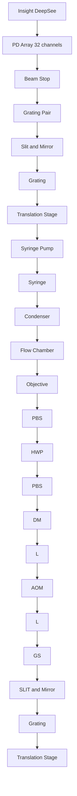

## optica

# Stimulated Raman scattering flow cytometry for label-free single-particle analysis

Chi Zhang, 1,† Kai-Chih HuanG, 1† Bartek RaJwa,² JunJi Li,' Shiqi Yang,³ Haonan Lin,' Chien-Sheng Liao, CHI ZHANG, KAI-CHIH HUANG, BARTEK RAJWA, JUNJIE LI, SHIQI YANG, HAONAN LIN, CHIEN-SHENG LIA4 3,5 6 1,5,6 1,5,6,

1 Weldon School of Biomedical Engineering, Purdue University, West Lafayette, Indiana 47907, USA  
2 Bindley Bioscience Center, Purdue University, West Lafayette, Indiana 47907, USA  
3 Department of Animal Sciences, Purdue University, West Lafayette, Indiana 47907, USA  
4 Department of Chemistry, Purdue University, West Lafayette, Indiana 47907, USA  
5 Purdue Institute for Inflammation, Immunology, and Infectious Disease, Purdue University, West Lafayette, Indiana 47907, USA  
6 Department of Basic Medical Sciences, Purdue University, West Lafayette, Indiana 47907, USA  
\*Corresponding author: jcheng@purdue.edu

Received 7 October 2016; revised 15 December 2016; accepted 15 December 2016 (Doc. ID 278298); published 11 January 2017

Flow cytometry is one of the most important technologies for high-throughput single-cell analysis. Fluorescent labeling acts as the primary approach for cellular analysis in flow cytometry. Nevertheless, the fluorescent tags are not applicable to all cases, especially to small molecules, for which labeling may significantly perturb the biological functionality. Spontaneous Raman scattering flow cytometry offers the capability to non-invasively detect chemical contents of cells but suffers from slow data acquisition. In order to achieve label-free high-throughput single-particle analysis using Raman scattering, we developed a 32-channel multiplex stimulated Raman scattering flow cytometry (SRS-FC) technique that can measure chemical contents of single particles at a speed of 5 μs per Raman spectrum. Using mixed polymer beads, we demonstrate the discrimination of different particles at a throughput of up to 11,000 particles per second. This is a four orders of magnitude improvement in throughput compared to conventional spontaneous Raman flow cytometry. As a proof of concept, we show the differentiation of 3T3-L1 cells at different states by SRS-FC according to the difference in cellular chemical content. The SRS-FC technique opens new opportunities for high-throughput and high-content chemical analysis of live cells in a label-free manner. © 2017 Optical Society of America

OCIS codes: (170.5660) Raman spectroscopy; (290.5910) Scattering, stimulated Raman; (300.6420) Spectroscopy, nonlinear; (120.6200) Spectrometers and spectroscopic instrumentation; (170.1530) Cell analysis.

https://doi.org/10.1364/OPTICA.4.000103

## 1. INTRODUCTION

By offering a high-throughput quantitative analysis of single live cells in a suspension, flow cytometry (FC) has found wide applications in biological research and clinical diagnosis. Measurement of individual cells can be performed on the basis of their physical properties, such as electrical impedance or light scattering, or it may take advantage of fluorescence labeling that reveals function, physiology, or phenotypic characteristics. Impedance-based FC is able to count cells based on their size [1]. The physical measurement of wide-angle light scatter provides a measure of granularity, whereas narrow-angle light scatter can be used as a proxy for size/ volume information for particles [2]. Fluorophore-conjugated antibody labeling has enabled detection of cell-surface markers associated with cell function and therefore is employed as the principal approach for immunophenotypic analysis in modern FC [2,3]. Along with cell function and physiology analysis, the detection and quantitation of small molecules, such as nutrients, metabolites, and drugs in single cells, could allow for new biological insights and diagnosis strategies for diseases. However, well-established traditional FC is not well suited for measurements quantifying the presence of the non-fluorescent small molecules. The use of fluorescent tags is not a realistic solution in this context, as such tags could significantly alter the function of these molecules when covalently attached. Nonspecific binding of fluorescent labels as well as cellular autofluorescence can also reduce the clarity of the results and complicate the interpretation of the observations; careful application of spectral unmixing would be required in order to estimate the abundance of pure constituents in the signal. Consequently, an FC technique that is able to provide intrinsic chemical characteristics of live cells without disrupting cellular function and without the necessity for labeling would offer an enormous value for biological and pharmaceutical research, with potential for clinical cytometry analysis as well.

Raman spectroscopy has the capability to overcome the limitations encountered in fluorescence-based FC. It directly probes inherent molecular vibrations in a sample and can interrogate biological specimen without labeling. Raman scattering has been used to study cellular metabolic changes, focusing on the detection of triglycerides [4,5], cholesterol [6], amino acids [4], phospholipids [4,7], choline [8], retinoid [9], proteins [7,10], nucleic acids [7], etc. Pharmaceutical accumulation in cells has been ascertained by Raman imaging [11,12]. Activated microfluidic devices and even cell sorting employing spontaneous Raman signals have been reported [13–15], showing great promise to distinguish and sort cells based on their chemical contents in a label-free manner. However, owing to the extremely low signal level, spontaneous Raman FC offers only a very low throughput, usually less than a few cells per second. Typically, about 1 of 106 scattered photons interrogating a sample undergoes spontaneous Raman scattering, thus requiring milliseconds to seconds in order to record a Raman spectrum [16,17]. Such a speed is far from being sufficient for high-throughput single-cell analysis, and it is not competitive with established fluorescence-based FC [2].

Coherent Raman scattering significantly improves the Raman signal level through either the coherent anti-Stokes Raman scattering (CARS) or the stimulated Raman scattering (SRS) processes [17–21]. Microfluidic CARS-FC was first reported in 2008 for the quantification of lipogenesis in flowing cells by single-frequency excitation of C-H vibrations [22]. Broadband CARS-FC was later developed to distinguish different types of polymer beads and yeasts [23,24]. The detector used in broadband CARS, the charge-coupled device, has a readout rate on a millisecond scale [23]. Consequently, the reported CARS-FC had a throughput that is three to four orders of magnitude lower than fluorescence-based FC. Furthermore, the CARS signal is accompanied by a strong nonresonant background [19] that can severely distort the Raman spectral profile, requiring sophisticated data-processing algorithms or techniques to remove [25–28]. These limitations prevent CARS-FC from achieving highthroughput single-cell analysis [22,23].

Here, we report a proof-of-principle implementation of a multichannel SRS-FC system that can analyze the chemical content of flowing particles at rates approaching those of standard fluorescence-based FC. Different from CARS, the SRS spectrum is free of a nonresonant background and is identical to that of the spontaneous Raman [20,29]. SRS requires a pump and a Stokes beam for excitation. When their energy difference $( \omega _ { p } - \omega _ { S } )$ matches a vibrational transition Ω, energy flows from the input photons to the molecule to excite the vibrational mode. Such a process gives a large SRS signal proportional to $\sigma I _ { \rho } I _ { S } ,$ where σ is the Raman cross section of the specimen, and $I _ { \rho }$ and $I _ { S }$ are intensities of the pump and Stokes beams, respectively [18].

Our SRS-FC prototype is based on broadband laser excitation and multiplex spectral detection (Fig. 1(A)) using a lab-built 32-channel tuned-amplifier (TAMP) array. This system can acquire a Raman spectrum in 5 μs, the fastest speed ever recorded. This speed allowed the acquisition of 200,000 spectra in one second and enabled the measurement of more than 11,000 particles per second. Such a performance represents a significant throughput improvement over previously reported spontaneous Raman FC [13–15] and CARS-FC [23] by more than three orders of magnitude. The data processing employing compositional principal component analysis (CPCA) of the SRS signals allows us to distinguish subpopulations of mixed polymer beads according to their distinct Raman spectra. We also demonstrated that

A  

text_image

I_s
ω s
I_p
ω_p
input
sample
output
ΔI_s1
ΔI_s2
ΔI_s3
ΔI_p1
ΔI_p2
ΔI_p3
ω s
ω p1 ω p2 ω p3
ω
Ω_1
Ω_2
Ω_3

B  

flowchart

Multiplex SRS process and the SRS-FC system. (A) Multiplex stimulated Raman scattering process. A narrow-band Stokes pulse $\omega _ { s }$ and a broadband pump pulse $\omega _ { p }$ interact with the sample, generating a stimulated Raman gain $\hat { \Delta } I _ { s } = \hat { \Sigma } _ { i } \Delta I s _ { i }$ and stimulated Raman loss $\bar { \Delta } I _ { \mathit { p i } }$ contributed by different Raman transitions Ω . (B) Experimental setup of multiplex SRS-FC. HWP: half-wave plate; L: lens; AOM: acousto-optic modulator; GS: galvo scanner; DM: dichroic mirror; PBS: polarization beam splitter; CL: cylindrical lens; SP: short-pass filter. The galvo scanner performed one-dimensional laser scanning when the flow performance was examined. The laser focus was not scanned when the highthroughput SRS-FC data were acquired.

3T3-L1 cells at different states could be differentiated through quantification of distinct chemical compositions inside single cells using SRS-FC.

## 2. RESULTS

## A. SRS-FC System

Figure 1(B) shows a schematic of the multiplex SRS-FC system. The laser (InSight DS, Spectra-Physics, USA) outputs two synchronized pulsed beams at an 80-MHz repetition rate. The Stokes beam has a fixed wavelength at 1040 nm, and the pump beam has a wavelength tunable from 680 to 1300 nm. The Stokes beam was modulated by an acousto-optic modulator (522c, Isomet Corporation, USA) operating at 2.4 MHz and was then spectrally narrowed to 20 cm−1 via a pulse shaper described previously [30]. The pump beam has a ∼120 fs pulse width and was combined spatially and temporally with the Stokes beam by a dichroic mirror and a translation delay stage before the microscope. The microscope system was modified based on a commercial microscope frame (BX51, Olympus, Japan). A two-dimensional galvo scanning system (GVSM002, Thorlabs, USA) was installed on the microscope and used to perform one-dimensional laser scanning for the characterization of the SRS-FC and two-dimensional laser scanning for hyperspectral SRS imaging. A 60X waterimmersion objective lens (UPLSAPO 60XW, Olympus, Japan) was used to focus the laser beams on the sample as a diffraction-limited spot. A 4-f lens system was used to create a conjugate focal plane of the galvo scanner at the objective entrance and expand the laser beam to fill the entrance aperture of the objective lens. The pump and Stokes laser powers at the sample were 20 and 30 mW, respectively.

Our system utilized a stimulated Raman loss-detection scheme [9,17,31] by measuring the energy loss of the pump beam. The transmitted pump beam was collected by an oil condenser with a high numerical aperture of 1.4 to ensure high-signal-collection efficiency and to avoid a background from cross-phase modulation. The pump beam was then dispersed by a pair of transmission gratings (1200 grooves per mm, LightSmyth, USA) and expanded by a 4-f lens system. Two gratings were used here to create a fast expansion for the laser beam to fill the photodiode array within the allowed lab space. A short-pass filter (980 nm short pass, Chroma Technology Corporation, USA) was used to remove the residue of the Stokes beam. The spatially dispersed pump beam was projected onto a 32-channel photodiode array (S4111-35Q, Hamamatsu Photonics, Japan) to detect the SRS spectrum. A slit was applied to reduce the possible channel crosstalk caused by particle-induced light scattering and diversion. A home-designed TAMP array [Fig. S1(A)] was further applied to amplify and extract the SRS signal in a lock-in-free manner similar to that previously reported [9]. Unlike the system in Ref. [9], the resonant frequency of the 32 resonant amplifiers in our present TAMP array can be manually tuned to 2.4 MHz [Fig. S1(B)] with a 330-kHz bandwidth [Fig. S1(C)]. Such a tunability ensures the optimization of all the channels for signal amplification. The dataacquisition card (16AI64SSC, General Standards Corporation, USA) has the fastest data-acquisition speed of 200 kHz for 64 parallel channels. This corresponds to a 5-μs integration time per spectrum, which was proved by sampling a 100-kHz square function [as shown in Fig. S1(D)].

The flow chamber was made from a glass capillary tube with a 300-μm inner diameter. It was pulled to a narrow capillary with an inner diameter of ∼70 μm [Fig. S2(A)]. The flow chamber was mounted on a coverslip before being installed on the microscope. The sample was injected by a 1-ml syringe installed on an injection pump (PHD 2000, Harvard Apparatus, USA), with which the injection speed can be precisely controlled. The samples were injected immediately after preparation to avoid gravitational deposition.

The data acquisition and visualization were performed on a labwritten software based on LabView. A CytoSpec software package developed by Purdue University Cytometry Laboratories was used to perform a quick visualization and the analysis of the raw data. The final data analysis and plotting were performed using the R language for scientific computing.

## B. Spectral Acquisition in SRS-FC

We first scanned the laser focus across the sample stream in order to directly visualize the flowing particles. The time-dependent scanning section of the flowing 10-μm polystyrene (PS) beads is shown in Fig. S2(B). The flow speed was ∼10 mm∕s, and the laser was scanning at 1 kHz. Figure S2(B) shows that at a low flow speed, the beads tend to flow through the center of the chamber. A faster flow speed can increase the width of the sample stream, leading to a broader cross-sectional distribution of the beads.

A  

line chart

| Raman Shift (cm⁻¹) | Flow (ms) |
| ------------------ | --------- |
| 2900               | 1.8       |
| 2950               | 1.8       |
| 3000               | 1.8       |
| 3050               | 1.8       |
| 3100               | 1.8       |

B  

line chart

| Raman Shift (cm⁻¹) | PS Raman | PS SRS |
|---|---|---|
| 2900 | 0.35 | 0.2 |
| 2950 | 0.05 | 0.1 |
| 3000 | 0.02 | 0.05 |
| 3050 | 0.45 | 0.95 |
| 3100 | 0.01 | 0.05 |

C  

line chart

| Raman Shift (cm⁻¹) | PMMA Raman | PMMA SRS |
| ------------------ | ---------- | -------- |
| 2900               | 0.2        | 0.2      |
| 2950               | 1.0        | 1.0      |
| 3000               | 0.3        | 0.3      |
| 3050               | 0.1        | 0.1      |
| 3100               | 0.0        | 0.0      |

Spectral acquisition in SRS-FC. (A) In a spectrum-time win-Fig. 2.dow recorded in 1.8 ms, 8 PMMA beads (peak centered at 2955 cm−1) and 5 PS beads (peak centered at 3060 cm−1) were detected. (B) SRS (dashed line with open squares) and spontaneous Raman (solid line) spectra of polystyrene beads. (C) SRS (dashed line with open circles) and spontaneous Raman (solid line) spectra of PMMA beads.

In order to achieve a higher throughput, we focused the laser beam in the center of the sample stream and increased the sample injection speed. A mixture of PS and poly(methyl methacrylate) (PMMA) beads (both 10 μm in diameter) was used to demonstrate that our system can identify different particles solely on the basis of their chemical compositions. These particles are similar in shape and size but have a small difference in the refractive indices [Fig. S3(A)]. However, they can be separated under an SRS microscope through their spectral characteristics [Figs. S3(B) and S3(C)]. Using the non-laser-scanning scheme, we recorded the SRS spectra of samples flowing through the laser focus. Figure 2(A) shows a time-dependent spectral graph selected in a 1.8 ms time interval, containing spectra from 8 PMMA and 5 PS beads. PMMA has a strong Raman transition at $2 9 5 6 ~ \mathrm { c m ^ { - 1 } }$ due to the C-H vibrations, which are likely from the methyl side chains [32]; PS has a strong peak centered at $3 0 6 0 ~ \mathrm { c m ^ { - 1 } }$ from the aromatic C-H vibration [33]. By comparing the normalized SRS spectra to spontaneous Raman spectra from the same type of beads [Figs. 2(B) and 2(C)], we demonstrated the spectral fidelity of our SRS-FC device to spontaneous Raman spectroscopy. The spectral resolution of the SRS-FC, which can reach ${ \sim } 2 0 ~ \mathrm { c m ^ { - 1 } }$ (Fig. S4), was determined by the slit width in the Stokes beam. The spectral window of the SRS-FC covered ${ \sim } 2 0 0 ~ \mathrm { c m ^ { - 1 } }$ in the C-H vibration region, primarily determined by the bandwidth of the femtosecond pump beam.

## C. SRS-FC Analysis of Mixed Polymer Particles

To evaluate the high-throughput performance of the SRS-FC, we first analyzed a mixture of PMMA and PS beads (1:1 ratio). The estimation of the particle flow speed and the spectral analysis method based on the CPCA are detailed in Supplement 1.

scatterplot

| PC 1 | PC 2 | Value |
|------|------|-------|
| -4   | 4    | 0     |
| -2   | 2    | 0     |
| 0    | 0    | max   |
| 2    | -2   | 0     |
| 4    | -4   | 0     |
| 6    | -6   | 0     |

scatterplot

| PC1 | PC2 | max |
|-----|-----|-----|
| -3  | 0.5 | 0   |
| -2  | 0.0 | 0   |
| -1  | -0.5| 0   |
| 0   | -1.0| 0   |
| 1   | -0.5| 0   |
| 2   | 0.0 | 0   |
| 3   | 0.5 | 0   |

line chart

| Spectral Number | Normalized Intensity |
| --------------- | -------------------- |
| 0               | 0.6                  |
| 100             | 0.3                  |
| 200             | 0.9                  |
| 300             | 0.5                  |
| 400             | 1.0                  |
| 500             | 0.6                  |
| 600             | 0.3                  |
| 700             | 0.8                  |
| 800             | 0.9                  |
| 900             | 0.5                  |
| 1000            | 0.2                  |

scatterplot

| PC 1 | PC 2 |
|------|------|
| -3   | 0.5  |
| -2   | 0.0  |
| -1   | -0.5 |
| 0    | -1.0 |
| 1    | -0.5 |
| 2    | 0.0  |
| 3    | 0.5  |

histogram

| Normalized Maximum Intensity | Density |
| ---------------------------- | ------- |
| 0.2                          | 20      |
| 0.3                          | 15      |
| 0.4                          | 5       |
| 0.5                          | 2       |
| 0.6                          | 1       |
| 0.7                          | 0.5     |
| 0.8                          | 0.2     |
| 0.9                          | 0.1     |
| 1.0                          | 0       |

line chart

| Ramam Shift (cm⁻¹) | Normalized Intensity (Red) | Normalized Intensity (Blue) |
| ------------------ | -------------------------- | --------------------------- |
| 2900               | ~0.01                      | ~0.01                       |
| 2950               | ~0.08                      | ~0.07                       |
| 3000               | ~0.04                      | ~0.05                       |
| 3050               | ~0.10                      | ~0.11                       |
| 3100               | ~0.02                      | ~0.03                       |

High-throughput SRS-FC analysis of mixed polymer particles. Fig. 3.(A) CPCA (density map) on 400,000 spectra collected in 2 s. (B) The intensity maxima across 32 channels of the first 1000 spectra. The green line indicates the mean of the background. The red line indicates the 3σ level of the Gaussian-distributed background and is used as the threshold for background rejection. (C) Histogram of spectral intensity maxima across 32 channels of the 400,000 measurements acquired in 2 s. The 3σ noise level is marked by the red line. (D) CPCA (density map) of particle spectra above the 3σ noise level. Every single bead is represented by a sum of adjacent measurements associated with it. (E) Color-coded CPCA scatter plot of the data shown in panel (D). Two populations were selected using agglomerative clustering and assuming $\bar { k = 2 }$ . Blue and red represent PS and PMMA beads, respectively. (F) SRS spectra of the PS (blue) and PMMA (red) beads. The solid lines represent the average spectrum of each kind.

Figure 3(A) shows a density CPCA map of 400,000 spectral signals continuously collected for 2 s. The plot demonstrates that the acquired signal could be roughly classified into three clusters, one of which has a significantly greater number of instances than the other two. Since the spectra were continuously acquired without a trigger mechanism, we expected the presence of a large abundant cluster representing a low-intensity background. The other two clusters, grouping a much smaller number of spectra, represent signals from the two types of beads. Figure 3(A) cannot be interpreted as a standard FC scatter plot, since each measured bead has contributed to more than one measured spectral readout.

In order to extract information about individual beads, the highfrequency background noise and the relatively lower-frequency signals from beads were separated using a Butterworth filter in order to estimate the appropriate threshold level. The intensity maxima across the 32 channels of the first 1000 spectra are shown in Fig. 3(B). The green line indicates the estimated mean of the background and the red line shows the 3σ level of the estimated background signal distribution. Figure 3(C) shows the histogram of all the spectral maxima. The red line marks the estimated 3σ background level, which was used as a minimal threshold implemented to reject the background contribution and separate the beads’ signals. Subsequently, the readouts above the threshold were integrated and formed a cytometry-type dataset, in which every data point represents the 32-channel spectral signature of a single bead.

The CPCA of the resulting spectral matrix is shown in Fig. 3(D) (density plot), in which two populations can be clearly distinguished. An agglomerative clustering procedure (using Euclidean distance, Ward’s minimum variance method, and assuming the number of clusters $k = 2 )$ performed on the CPCA results [Fig. 3(E)] produces well-separated clusters of PMMA and PS beads, shown in red and blue, respectively. Their SRS spectra, shown in Fig. 3(F), agree with the corresponding spontaneous Raman spectra [Fig. 2(B)]. This analysis returned ∼7100 PMMA beads and ∼7100 PS beads detected in 2 s, corresponding to a throughput of ∼7100 particles per second. The measured ratio between the two types of beads was approximately 1:1, matching the actual mixing ratio. In a subsequent experiment, we mixed the same beads at a 4% solids concentration and a 4:1 ratio (PMMA:PS) and analyzed the mixture using SRS-FC at a flow speed of ∼0.4 m∕s. The data analysis performed as described above again revealed two clusters (Fig. S5). In a 1 s acquisition time, the SRS-FC system measured ∼9100 PMMA beads and ∼2200 PS beads, (∼4∶1 bead ratio) with a throughput of up to ∼11300 particles per second.

In order to highlight the potential of multichannel SRS-FC for separating microparticles of different chemical compositions, we also studied a mixture of three types of beads: PMMA, PS, and polycaprolactone (PCL), all with a 10 μm average diameter, mixed at a 2:1:1 ratio of PMMA:PS:PCL. The final experimental concentration of the mixture was 2% solids. The Raman spectrum of the PCL in the C-H region is different from that of PMMA or PS, as shown in Fig. S6. At a flow speed of ∼0.16 m∕s, we acquired SRS-FC data in 6 s. The CPCA of the SRS spectra originating from the analyzed particles showed three well-separated clusters [Fig. 4(A)]. Again, an agglomerative clustering procedure $( k = 3 )$ allowed the quantitation of ∼7100 PMMA beads (red), ∼3400 PS beads (blue), and ∼3600 PCL beads (green), as shown in Fig. 4(A). The measurement demonstrates a ratio of ∼2∶1∶1 (PMMA:PS:PCL) at a throughput of ∼2350 particles per second. The SRS spectra from the identified clusters match the corresponding spontaneous Raman spectra [Figs. 4(B) and S6]. The spectral difference between the PMMA and PCL particles is smaller than that between either one and the PS beads. Therefore, the CPCA results locate the PMMA and PCL clusters closer to one another. This result indicates that our multiplex SRS-FC system paired with the CPCA analysis could distinguish different chemical components with small spectral differences.

The Raman fingerprint region $( 8 0 0 { - } 1 8 0 0 ~ \mathrm { c m ^ { - 1 } } )$ usually contains more molecular vibrational information compared to the C-H stretching region $( 2 8 0 0 { - } 3 1 0 0 ~ \mathrm { c m ^ { - 1 } } )$ . In order to demonstrate that our SRS-FC system can quantify the chemical contents of samples in the Raman fingerprint region, we performed an SRS-FC analysis of mixed PS and PCL beads (10 μm in diameter, 1:1 ratio) by measuring their spectra in a spectral window between 950 and $1 1 5 0 ~ \mathrm { c m } ^ { - 1 }$ . Two signature peaks at 1003 and 1108 cm−1 dominate the Raman spectra of the PS and PCL beads, respectively, accompanied by other weaker peaks (Fig. S7). The CPCA map of the spectra acquired using

scatterplot

| PC 1 | PC 2 | Cluster |
|------|------|---------|
| -2   | 3    | Green   |
| -1   | 2    | Green   |
| 0    | 1    | Red     |
| 1    | 0    | Red     |
| 2    | -1   | Blue    |
| 3    | -2   | Blue    |

line chart

| Raman Shift (cm⁻¹) | Normalized Intensity (Red) | Normalized Intensity (Green) | Normalized Intensity (Blue) |
| ------------------ | -------------------------- | ---------------------------- | --------------------------- |
| 2900               | ~0.01                      | ~0.01                        | ~0.01                       |
| 2950               | ~0.08                      | ~0.06                        | ~0.04                       |
| 3000               | ~0.04                      | ~0.03                        | ~0.02                       |
| 3050               | ~0.02                      | ~0.01                        | ~0.08                       |
| 3100               | ~0.01                      | ~0.01                        | ~0.01                       |

scatterplot

| PC 1 | PC 2 |
|------|------|
| -2.5 | 0.5  |
| -1.5 | 0.0  |
| 0.0  | -0.5 |
| 1.0  | -1.0 |
| 1.5  | -1.5 |
| 2.0  | -2.0 |

line chart

| Raman Shift (cm⁻¹) | Normalized Intensity |
| ------------------ | -------------------- |
| 950                | 0.02                 |
| 1000               | 0.08                 |
| 1050               | 0.06                 |
| 1100               | 0.04                 |
| 1150               | 0.02                 |
| 1200               | 0.01                 |

Chemical specificity in the SRS-FC analysis. (A) Color-coded Fig. 4.CPCA scatter plot of SRS spectra from mixed PMMA (red), PS (blue), and PCL (green) beads. The data were acquired in 6 s using a bead mixture with a concentration of 2% solids. The beads were 10 μm in diameter. (B) SRS spectra of the three types of beads. The solid lines represent the averaged spectra from each separated population. The spectra were acquired in the C-H stretching region. (C) Color-coded CPCA scatter plot and (D) the corresponding SRS spectra of mixed PS (blue) and PCL (green) beads. The spectra were acquired in the Raman fingerprint region.

SRS-FC in 3 s displays two populations [Fig. 4(C)], which can be grouped into PS (blue) and PCL (green) beads using clustering (k  2) [Fig. 4(C)]. The results give a ∼1∶1 ratio of beads at a throughput of ∼1200 particles per second. The SRS spectra of beads measured by SRS-FC show good agreement with their corresponding spontaneous Raman spectra [Figs. 4(D) and S7]. A reduced spectral resolution in the SRS spectra was caused by a wider slit width in the Stokes beam, which gives higher power of the Stokes beam for the detection of weaker vibrational signals in the fingerprint region. The above results collectively demonstrate that label-free high-throughput quantitation of chemical species can be made using SRS-FC.

The sensitivity of our SRS-FC system has been tested using smaller particles. We found that beads as small as 1 μm in diameter can be detected and differentiated [Figs. S8(A) and S8(B)]. Furthermore, our system has also shown the capability to detect single Staphylococcus aureus bacteria flowing through the laser focus [Figs. S8(C) and S8(D)]. These results highlight the potential of SRS-FC in the characterization of subcellular organelles and in microbiology applications.

## D. SRS-FC Analysis of Lipogenesis in 3T3-L1 Cells

To evaluate the potential of SRS-FC in high-throughput measurement of live cells, we analyzed lipid accumulation in 3T3-L1 cells at different stages of differentiation. The non-differentiated 3T3-L1 cells have a fibroblast-like phenotype with little lipid droplets present in the cytosol [Fig. S9(A)]. Spectral SRS imaging showed that the cellular content generated a vibrational peak centered at $2 9 4 0 ~ \mathrm { c m ^ { - 1 } }$ , largely contributed by the methyl group from the protein side chains [Fig. S9(C)]. After insulin-induced differentiation, 3T3-L1 cells acquire an adipocyte-like phenotype with a significantly increased amount of triglycerides, which accumulate to form large lipid droplets [Fig. S9(B)]. This causes the intensity of the methylene symmetric vibration at $2 8 5 0 ~ \mathrm { c m ^ { - 1 } }$ from fatty-acid acyl chains to become stronger compared to that of the non-differentiated cells [Fig. S9(C)]. The described spectroscopic signature difference provides a mechanism to distinguish differentiated 3T3-L1 cells from non-differentiated ones using SRS-FC.

scatterplot

| PC 1 | PC 2 | Group |
|------|------|-------|
| -2   | 1    | Blue  |
| -1   | 0    | Blue  |
| 0    | -1   | Blue  |
| 1    | -2   | Blue  |
| 2    | -1   | Red   |
| 3    | 0    | Red   |

line chart

| Raman Shift (cm⁻¹) | Normalized Intensity (3T3-L1) | Normalized Intensity (3T3-L1 + Inset) |
| ------------------ | ----------------------------- | -------------------------------------- |
| 2750               | ~0.02                         | ~0.02                                  |
| 2850               | ~0.04                         | ~0.06                                  |
| 2950               | ~0.02                         | ~0.04                                  |

Analysis of lipid amount in 3T3-L1 cells in different differen-Fig. 5.tiation states. (A) Color-coded CPCA scatter plot of SRS spectra from mixed differentiated and non-differentiated 3T3-L1 cells. The data were acquired in 3 s. (B) SRS spectra of the two cell populations separated by agglomerative clustering. The red and blue spectra represent differentiated and non-differentiated 3T3-L1 cells, respectively. The insets are SRS images of the two types of cells. The scale bars are 10 μm.

We first collected enriched populations of non-differentiated and fully differentiated 3T3-L1 cells (see Supplement 1 for details). We then mixed the cells at a ratio of 1:3 (differentiated: non-differentiated) and performed SRS-FC measurements. A CPCA scatter plot of the cell mixture is shown in Fig. 5(A). The agglomerative clustering approach separated the two populations. Using the result of clustering, the two populations were color-coded as blue and red, corresponding to non-differentiated and differentiated 3T3-L1 cells, respectively. The demonstrated data were collected in 3 s, and the concentration of 3T3-L1 cells was ∼3 million per milliliter. To avoid cell aggregation, the cell samples were prepared at much lower concentrations than the polymer bead samples, resulting in a lower throughput of ∼560 cells per second. In 3 s, we were able to resolve ∼400 differentiated 3T3-L1 cells and ∼1300 non-differentiated 3T3-L1 cells, recovering a ∼1:3 ratio of the mixed cells. The normalized SRS spectra from the two types of cells are shown in Fig. 5(B). A higher contribution from CH symmetric stretching at ${ \sim } 2 8 5 0 ~ \mathrm { c m ^ { - 1 } }$ contributed by accumulated lipids can be resolved for differentiated cells. The visible spectral difference matches the results obtained from hyperspectral SRS imaging [Fig. S9(C)]. These results indicate that the change in Raman spectral characteristics due to varying chemical content in differentiated and non-differentiated cells can be utilized for identification and separation. The discrimination of the 3T3-L1 cells according to their difference in lipid amount serves as an example of the label-free quantitation of chemical composition in living cells using SRS-FC.

## 3. DISCUSSION

The SRS flow cytometry offers a significant improvement in the differentiation of polymer particles that may also vary in size. Particles of different materials might have different refractive indices. If the size varies as well, light-scatter-based FC would have difficulty separating the effect of size variation from the refractive index differences, leading to errors in measurements. On the other hand, the SRS-FC discriminates polymer particles via their inherent chemical composition, avoiding the issues associated with the light-scatter techniques.

There is potential to improve the performance of the demonstrated SRS-FC device further. First of all, a data-acquisition electronics offering a higher data collection rate is expected to increase the throughput of the SRS-FC system.

Second, our first prototype SRS-FC device does not provide many technical features that are available in modern commercial flow cytometers. For example, we estimated that only less than 16% of flowing particles were detected in a sample (when 10 μm particles were used), since no hydrodynamic focusing or acoustic focusing has been employed in this work. Such techniques can eventually be incorporated into our system, and pairing them with a new design of flow chamber would certainly improve the overall efficiency of our system. The current system also did not use a wide-angle scatter signal as a data-acquisition trigger. Instead, we applied post-acquisition background-intensity-based thresholding to extract the relevant information from the acquired raw data. In future work, we will improve the usability and performance of the SRS-FC instrument by incorporating a modern fluidic subsystem and employing a light-scatter trigger mechanism.

Third, by operating in a tight focusing condition, our SRS-FC system examines only a part of a large particle at the laser focus, limiting present applications to relatively homogeneous samples. The measurement volume could be increased by either using weakly focused beams, as in most fluorescence FC systems, or by applying Bessel beam focusing for both input beams. The former requires higher laser powers to generate a detectable SRS signal; the latter could be achieved using a specially designed optical system generating Bessel beams [34].

Fourth, the current multichannel SRS-FC has a spectral coverage of ∼200 cm−1 with a spectral resolution of 20 cm−1. The width of the spectral window is determined by the spectral width of the femtosecond laser pulse. A laser system with a broader spectral bandwidth is expected to enlarge the spectral window of the SRS-FC. The spectral resolution is determined by both the number of photodiodes in the detector array and the slit width of the pulse shaper in the Stokes beam. Thus, a higher number of photodiodes in the detector array increases the number of channels for SRS spectral detection. Meanwhile, a narrower slit width in the pulse shaper should improve the spectral resolution at the cost of decreasing the power of the Stokes beam. Alternatively, a pulse spectral compression scheme can be applied to narrow down the spectral width while retaining a higher portion of laser power [35]. A laser with a higher output power plus a photodiode array with a higher photon saturation limit could further improve the signal-to-noise-ratio and the sensitivity of the SRS-FC.

Although the laser power applied to the samples was relatively high compared to previously reported SRS or multiphoton microscopy work, the total sample exposure time was significantly reduced. For example, at a ∼0.4 m∕s flow speed, the laser dwell time for a 10 μm particle was only 25 μs. Such a short exposure could reduce the potential photo-toxicity in living biological systems.

Our SRS-FC analysis of mixed polymer beads has shown that these particles can be separated on the basis of their distinctive Raman spectra with a throughput of up to 11,000 particles per second. This capability could be further utilized to analyze the content and uniformity of drug-delivery vesicles. Future development of the SRS-activated particle sorting technique would have enormous value in particle separation or enrichment in biological and pharmaceutical prospects.

The demonstrated SRS-FC technology opens new opportunities in single-cell analysis. We have shown that SRS-FC can provide high-throughput quantitation of lipid amount in unlabeled cells. Increased lipogenesis is known to be related to cancer aggressiveness [36–38]. Therefore, an advanced SRS-FC is potentially applicable to differentiate and separate aggressive cancer cells and to detect rare circulating tumor cells, which show a much stronger lipid signal compared to white blood cells [39]. Other cell metabolites, such as cholesterol, retinoid, and choline, also serve as good candidates for future SRS-FC analysis.

Furthermore, with its ability to analyze metabolism in single cells, SRS-FC analysis offers a novel platform to evaluate cellular responses to a therapeutic treatment. For example, quantification of fat accumulation inside cells using SRS-FC could evaluate the efficacy of anti-obesity or anti-diabetes drugs. Similarly, the quantitation of cholesterol storage inside cells using SRS-FC would open a new avenue to evaluate the efficacy of cholesterol-lowering medicines.

Finally, the SRS-FC could be also used as a readout platform for labeled samples. Raman tags have been developed for bioimaging applications using spontaneous Raman, CARS, or SRS microscopy [4,6,40]. These tags, based on isotope labeling or alkyne group presence, cause less perturbation to biological systems than do fluorescence labels. An integration of Raman tags and SRS-FC would lead to new applications, such as the quantitation of protein synthesis, DNA/RNA synthesis, drug uptake, and glucose metabolism.

## 4. CONCLUSION

In summary, we have achieved chemical-selective high-throughput single-particle analysis in a label-free manner by developing a novel multiplex SRS-FC. The lab-built array detection system allows lock-in-free detection of an SRS spectrum in 5 μs. Such a spectral acquisition speed grants a throughput of up to 11,000 particles per second. This corresponds to a four orders of magnitude enhancement in the throughput of Raman-based flow cytometry. The implementation of 32 spectral channel detection, paired with CPCA, gives the system the capability to distinguish multiple chemical compositions that have even highly overlapped spectral profiles. Using SRS-FC, we showed the differentiation of different polymer particles and the discrimination of 3T3-L1 cells with different chemical compositions accumulated in the cells. SRS-FC opens a new way to perform high-throughput label-free single particle analyses.

## Funding. National Institutes of Health (NIH) (GM118471).

Acknowledgment. The authors appreciate the help from Dr. Weili Hong at the Weldon School of Biomedical Engineering and thank Dr. Mohamed Seleem at the College of Veterinary Medicine for the supply of Staphylococcus aureus. We also want to thank Dr. Delong Zhang and Jing Chen for the helpful discussions.

† These authors contributed equally to this work.

See Supplement 1 for supporting content.

## REFERENCES

1. W. H. Coulter, “Means for counting particles suspended in a fluid,” U.S. patent 2,656,508 (October 20, 1953).  
2. H. M. Shapiro, Practical Flow Cytometry (Wiley, 2005).  
3. J. P. Robinson and M. Roederer, “Flow cytometry strikes gold,” Science , 739–740 (2015).  
3504. L. Wei, F. Hu, Y. Shen, Z. Chen, Y. Yu, C.-C. Lin, M. C. Wang, and W. Min, “Live-cell imaging of alkyne-tagged small biomolecules by stimulated Raman scattering,” Nat. Methods , 410–412 (2014).  
5. J. Li and J.-X. Cheng, “Direct visualization of de novo lipogenesis in single living cells,” Sci. Rep. , 6807 (2014).  
6. H. J. Lee, W. Zhang, D. Zhang, Y. Yang, B. Liu, E. L. Barker, K. K. Buhman, L. V. Slipchenko, M. Dai, and J.-X. Cheng, “Assessing cholesterol storage in live cells and C. elegans by stimulated Raman scattering imaging of phenyl-diyne cholesterol,” Sci. Rep. , 7930 (2015).  
57. X. Bi, B. Rexer, C. L. Arteaga, M. Guo, and A. Mahadevan-Jansen, “Evaluating HER2 amplification status and acquired drug resistance in breast cancer cells using Raman spectroscopy,” J. Biomed. Opt. , 025001 (2014).  
8. F. Hu, L. Wei, C. Zheng, Y. Shen, and W. Min, “Live-cell vibrational imaging of choline metabolites by stimulated Raman scattering coupled with isotope-based metabolic labeling,” Analyst , 2312–2317 (2014).  
1399. C.-S. Liao, M. N. Slipchenko, P. Wang, J. Li, S.-Y. Lee, R. A. Oglesbee, and J.-X. Cheng, “Microsecond scale vibrational spectroscopic imaging by multiplex stimulated Raman scattering microscopy,” Light Sci. Appl. , e265 (2015).  
10. E. Vargis, Y.-W. Tang, D. Khabele, and A. Mahadevan-Jansen, “Nearinfrared Raman microspectroscopy detects high-risk human papillomaviruses,” Transl. Oncol. , 172–179 (2012).  
11. A. V. Feofanov, A. I. Grichine, L. A. Shitova, T. A. Karmakova, R. I. Yakubovskaya, M. Egret-Charlier, and P. Vigny, “Confocal Raman microspectroscopy and imaging study of theraphthal in living cancer cells,” Biophys. J. , 499–512 (2000).  
7812. D. Fu, J. Zhou, W. S. Zhu, P. W. Manley, Y. K. Wang, T. Hood, A. Wylie, and X. S. Xie, “Imaging the intracellular distribution of tyrosine kinase inhibitors in living cells with quantitative hyperspectral stimulated Raman scattering,” Nat. Chem. , 614–622 (2014).  
613. S. Dochow, C. Krafft, U. Neugebauer, T. Bocklitz, T. Henkel, G. Mayer, J. Albert, and J. Popp, “Tumour cell identification by means of Raman spectroscopy in combination with optical traps and microfluidic environments,” Lab. Chip , 1484–1490 (2011).  
1114. D. Xiao, L. Fu, J. Liu, V. S. Batista, and E. C. Yan, “Amphiphilic adsorption of human islet amyloid polypeptide aggregates to lipid/aqueous interfaces,” J. Mol. Biol. , 537–547 (2012).  
42115. P. Zhang, L. Ren, X. Zhang, Y. Shan, Y. Wang, Y. Ji, H. Yin, W. E. Huang, J. Xu, and B. Ma, “Raman-activated cell sorting based on dielectrophoretic single-cell trap and release,” Anal. Chem. , 2282–2289 (2015).  
8716. J.-X. Cheng and X. S. Xie, “Vibrational spectroscopic imaging of living systems: An emerging platform for biology and medicine,” Science , aaa8870 (2015).  
35017. C. Zhang, D. Zhang, and J.-X. Cheng, “Coherent Raman scattering microscopy in biology and medicine,” Annu. Rev. Biomed. Eng. , 415–445 (2015).  
18. R. W. Boyd, Nonlinear Optics (Academic, 2003).  
19. C. L. Evans and X. S. Xie, “Coherent anti-Stokes Raman scattering microscopy: Chemical imaging for biology and medicine,” Annu. Rev. Anal. Chem. , 883–909 (2008).  
20. W. Min, C. W. Freudiger, S. Lu, and X. S. Xie, “Coherent nonlinear optical imaging: Beyond fluorescence microscopy,” Annu. Rev. Phys. Chem. , 507–530 (2011).  
21. S. Yampolsky, D. A. Fishman, S. Dey, E. Hulkko, M. Banik, E. O. Potma, and V. A. Apkarian, “Seeing a single molecule vibrate through timeresolved coherent anti-Stokes Raman scattering,” Nat. Photonics , 650–656 (2014).  
22. H.-W. Wang, N. Bao, T. L. Le, C. Lu, and J.-X. Cheng, “Microfluidic CARS cytometry,” Opt. Express , 5782–5789 (2008).  
23. C. H. Camp, S. Yegnanarayanan, A. A. Eftekhar, H. Sridhar, and A. Adibi, “Multiplex coherent anti-Stokes Raman scattering (MCARS) for chemically sensitive, label-free flow cytometry,” Opt. Express , 22879–22889 (2009).  
24. C. H. Camp, Jr., S. Yegnanarayanan, A. A. Eftekhar, and A. Adibi, “Label-free flow cytometry using multiplex coherent anti-Stokes Raman scattering (MCARS) for the analysis of biological specimens,” Opt. Lett. , 2309–2311 (2011).  
3625. Y. Liu, Y. J. Lee, and M. T. Cicerone, “Broadband CARS spectral phase retrieval using a time-domain Kramers–Kronig transform,” Opt. Lett. , 1363–1365 (2009).  
26. M. T. Cicerone, K. A. Aamer, Y. J. Lee, and E. Vartiainen, “Maximum entropy and time-domain Kramers–Kronig phase retrieval approaches are functionally equivalent for CARS microspectroscopy,” J. Raman Spectrosc. , 637–643 (2012).  
4327. D. L. Marks and S. A. Boppart, “Nonlinear interferometric vibrationa imaging,” Phys. Rev. Lett. , 123905 (2004).  
9228. J.-X. Cheng, L. D. Book, and X. S. Xie, “Polarization coherent anti-Stokes Raman scattering microscopy,” Opt. Lett. , 1341–1343 (2001).  
29. C. W. Freudiger, W. Min, B. G. Saar, S. Lu, G. R. Holtom, C. He, J. C. Tsai, J. X. Kang, and X. S. Xie, “Label-free biomedical imaging with high sensitivity by stimulated Raman scattering microscopy,” Science , 1857–1861 (2008).  
30. P. Wang, J. Li, P. Wang, C. R. Hu, D. Zhang, M. Sturek, and J. X. Cheng, “Label-free quantitative imaging of cholesterol in intact tissues by hyperspectral stimulated Raman scattering microscopy,” Angew. Chem. Int. Ed. , 13042–13046 (2013).  
31. D. Zhang, M. N. Slipchenko, and J.-X. Cheng, “Highly sensitive vibrational imaging by femtosecond pulse stimulated Raman loss,” J. Phys. Chem. Lett. , 1248–1253 (2011).  
232. H. Willis, V. Zichy, and P. Hendra, “The laser-Raman and infra-red spectra of poly (methyl methacrylate),” Polymer , 737–746 (1969).  
1033. A. Palm, “Raman Spectrum of Polystyrene,” J. Phys. Chem. , 1320– 1324 (1951).  
34. B. B. Collier, S. Awasthi, D. K. Lieu, and J. W. Chan, “Non-linear optical flow cytometry using a scanned, Bessel beam light-sheet,” Sci. Rep. , 10751 (2015).  
35. B. Liu, P. Wang, J. I. Kim, D. Zhang, Y. Xia, C. Chapple, and J.-X. Cheng, “Vibrational fingerprint mapping reveals spatial distribution of functional groups of lignin in plant cell wall,” Anal. Chem. , 9436–9442 (2015).  
36. F. Baenke, B. Peck, H. Miess, and A. Schulze, “Hooked on fat: The role of lipid synthesis in cancer metabolism and tumour development,” Dis. Models Mech. , 1353–1363 (2013).  
637. J. A. Menendez and R. Lupu, “Fatty acid synthase and the lipogenic phenotype in cancer pathogenesis,” Nat. Rev. Cancer , 763–777 (2007).  
738. N. N. Pavlova and C. B. Thompson, “The emerging hallmarks of cancer metabolism,” Cell Metab. , 27–47 (2016).  
2339. R. Mitra, O. Chao, Y. Urasaki, O. B. Goodman, and T. T. Le, “Detection of lipid-rich prostate circulating tumour cells with coherent anti-Stokes Raman scattering microscopy,” BMC Cancer , 540 (2012).  
40. L. Wei, Y. Yu, Y. Shen, M. C. Wang, and W. Min, “Vibrational imaging of newly synthesized proteins in live cells by stimulated Raman scattering microscopy,” Proc. Natl. Acad. Sci. USA , 11226–11231 (2013).