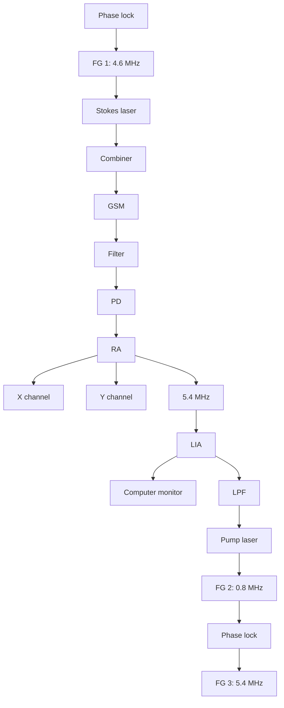

# Stimulated Raman scattering imaging by continuous-wave laser excitation

Chun-Rui Hu,1 Mikhail N. Slipchenko,2,5 Ping Wang,2 Pu Wang,2 Jiandie D. Lin,3 Garth Simpson,4 Bing Hu,1 and Ji-Xin Cheng2,4,6

1 Hefei National Laboratory for Physical Sciences at Microscale and School of Life Science, University of Science and Technology of Science, Hefei 230027, China

2 Weldon School of Biomedical Engineering, Purdue University, West Lafayette, Indiana 47907, USA

3 Life Science Institute, University of Michigan Medical Center, Ann Arbor, Michigan 48109, USA

4 Department of Chemistry, Purdue University, West Lafayette, Indiana 47907, USA

5 e-mail: mslipche@purdue.edu

6 e-mail: jcheng@purdue.edu

Received January 28, 2013; revised March 8, 2013; accepted March 11, 2013; posted March 13, 2013 (Doc. ID 184305); published April 26, 2013─

We demonstrate a low-cost-stimulated Raman scattering (SRS) microscope using continuous-wave (cw) lasers as excitation sources. A dual modulation scheme is used to remove the electronic background. The cw-SRS imaging of lipids in fatty liver is demonstrated by excitation of C H stretch vibration. © 2013 Optical Society of America OCIS codes: (140.2020) Diode lasers; (290.5910) Scattering, stimulated Raman; (180.4315) Nonlinear microscopy. http://dx.doi.org/10.1364/OL.38.001479

Coherent Raman scattering (CRS) microscopy based on– coherent anti-Stokes Raman scattering (CARS) and stimulated Raman scattering (SRS) has found important applications in biology and medicine [1 3]. Current CARS or SRS microscopy uses two synchronized pico-– second or femtosecond lasers as single-frequency excitation sources, or a narrowband source synchronized with a broadband source for multiplex excitation [4 6]. A big hurdle against broad use of this label-free imaging modality is the very high cost and complexity of the ultrafast laser sources. Photonic crystal fibers and all-fiber laser sources were employed to lower the cost of CRS microscopes, but they currently cannot reach the performance of free-space ultrafast lasers. Here, we report a highly cost-effective SRS microscope using continuous-wave (cw) lasers as excitation sources.

cw lasers are widely used in fluorescence and Raman spectroscopy, with the advantages of low cost, ease of operation, and a high photodamage threshold. Hell and co-workers employed a cw laser source for two-photon fluorescence microscopy [7] and stimulated emission depletion microscopy [8]. By cw laser excitation, SRS spectroscopy of liquid benzene was shown in 1977 [9]. Recently, Wickramasinghe et al. demonstrated force measurement of stimulated Raman effects induced by two cw lasers [10]. In this work, SRS imaging of biological tissue by using cw lasers as excitation sources is demonstrated.

Considering that the pulsed laser beam has a temporal shape of Gaussian function, the average SRS signal by pulsed and cw laser excitation can be− written as

$$
\Delta I _ {\mathrm{sig}} ^ {\mathrm{pul}} \propto \sigma I _ {p} I _ {S} f \times \int_ {- \infty} ^ {\infty} \{\exp [ - 4 \ln 2 (t / \tau) ^ {2} ] \} ^ {2} \mathrm{d} t, \tag {1}
$$

$$
\Delta I _ {\mathrm{sig}} ^ {\mathrm{cw}} \propto \sigma I _ {p} ^ {\mathrm{cw}} I _ {S} ^ {\mathrm{cw}}, \tag {2}
$$

where σ is the Raman scattering cross section, $I _ { p }$ is the pulsed pump beam peak power, $I _ { S }$ is the pulsed Stokes beam peak power, $\mathrm { . } f$ is the laser repetition rate, and τ is the pulse duration. We assume that the pump beam has the same pulse width as the Stokes beam. By assuming the same average power for the pulsed laser and the− cw laser, we have

$$
I _ {p} ^ {\mathrm{cw}} = I _ {p} f \times \int_ {- \infty} ^ {\infty} \exp [ - 4 \ln 2 (t / \tau) ^ {2} ] \mathrm{d} t, \tag {3}
$$

$$
I _ {S} ^ {\mathrm{cw}} = I _ {S} f \times \int_ {- \infty} ^ {\infty} \exp [ - 4 \ln 2 (t / \tau) ^ {2} ] \mathrm{d} t. \tag {4}
$$

Combining the above equations, the ratio of the SRS signal with pulsed laser excitation to that with cw laser− excitation is described as

$$
\frac {\Delta I _ {\mathrm{sig}} ^ {\mathrm{pul}}}{\Delta I _ {\mathrm{sig}} ^ {\mathrm{cw}}} = \frac {\int_ {- \infty} ^ {\infty} \left\{\exp \left[ - 4 \ln 2 (t / \tau) ^ {2} \right] \right\} ^ {2} \mathrm{d} t}{f \times \left\{\int_ {- \infty} ^ {\infty} \exp \left[ - 4 \ln 2 (t / \tau) ^ {2} \right] \mathrm{d} t \right\} ^ {2}}. \tag {5}
$$

Compared with pulsed excitation by a 5 ps, 80 MHz laser source, cw laser excitation decreases the signal level by $1 . 3 \times 1 0 ^ { 3 }$ times. The major photodamage mechanism in nonlinear microscopy is from two-photon absorption [11,12], and linear absorption of water can be neglected at 1 W power levels [13,14]. The cw laser avoids nonlinear photodamage induced by the high peak power of the pulsed laser [15,16]. Previous studies using optical tweezers showed that 400 mW of 1064 nm cw laser power does not damage living sperm cells [17]. Thus, it is promising to bring the SRS signal back by using higher excitation power.

In this pilot study, we used two laser diodes as the excitation sources. The setup is shown in Fig. 1. A shot-noise-limited diode laser (TLB6712, Newport), tunable from 765 to 781 nm, was used as the pump beam. A single-mode laser diode (M9-980-0300, Thorlabs) at 982 nm was used as the Stokes beam. The pump and Stokes beams were collinearly overlapped and directed into a home-built laser-scanning microscope equipped with a galvo scanning mirror system (GVS002, Thorlabs) controlled by LabVIEW code. A 40× water-immersion objective lens (UPlanSApo, Olympus, NA of 0.8) was used to focus two laser beams into the sample. The stimulated Raman loss (SRL) signal at pump wavelength was collected by an oil condenser (U-AAC, Olympus, NA of 1.4) and detected by a photodiode (S3071, Hamamatsu). The output of the photodiode was amplified by a resonance amplifier and then sent to a lock-in amplifier (HF2LI, Zurich Instruments). The SRS signal was collected by a data acquisition card (National Instruments).

flowchart

Fig. 1. Schematic of a cw-SRS microscope. The orange and blue lines represent the Stokes and pump beams, respectively. FG, function generator; LPF, low-pass filter; GSM, galvo scanning mirror; PD, photodiode; RA, resonant amplifier; LIA, lock-in amplifier.

To demonstrate cw-SRS spectroscopy, we scanned the wavelength of the pump beam from 766 to 772 nm (0.6 nm per step) and recorded the SRL spectra of cyclohexane in a Raman shift window from 2780 to $2 8 9 0 ~ \mathrm { c m ^ { - 1 } }$ at a time constant of 300 ms. Initially, we used single function generator (Agilent 33210A) to modulate the Stokes beam at 5.4 MHz, then used the lock-in amplifier to extract the SRL signal from the pump beam at the same frequency. The reference spectrum (Fig. 2(a), black curve) was obtained by blocking both lasers. With this single modulation scheme, a large offset was found in the cw-SRS spectrum [Fig. 2(a), red curve]. The offset (∼2200 nV) was ${ \sim } 5$ times larger than the SRL signal (∼400 nV). This offset originated from the modulation, which leaked into the power supply of the pump laser at the same frequency as the detected SRS signal. Although acceptable for spectroscopy, the offset would produce strong artifacts in cw-SRS imaging. To remove the parasitic modulation of the pump beam, we used a dual modulation scheme in which the pump beam was modulated at 0.8 MHz and the Stokes beam was modulated at 4.6 MHz. The SRS signal was detected at the sum frequency of 5.4 MHz. To remove any high-frequency components in the pump beam, two low-pass 1.9 MHz filters (BLP-1.9+, Mini-Circuits) were inserted between the function generator and the pump laser. As shown in Fig. 2(b), the offset was eliminated and the cw-SRS spectrum agrees with the Raman spectrum. Meanwhile, the SRS signal also reduced about 4 times due to detection at the sum frequency. By dual modulation of both laser beams at megahertz, shot-noise-limited detection was reached in our cw-SRS imaging scheme [Fig. 2(c)].

line chart

| Raman shift (cm⁻¹) | cw SRS signal (nV) |
| ------------------ | ------------------ |
| 2800               | 2000               |
| 2820               | 2000               |
| 2840               | 2000               |
| 2860               | 2500               |
| 2880               | 2000               |

line chart

| Raman shift (cm⁻¹) | cw SRS signal (nV) | Raman Intensity (a.u.) |
| ------------------ | ------------------ | ---------------------- |
| 2800               | 0                  | 0                      |
| 2820               | 10                 | 50                     |
| 2840               | 50                 | 200                    |
| 2860               | 100                | 3000                   |
| 2880               | 20                 | 1000                   |

line chart

| Laser power (mW) | Laser noise (nV/Hz) |
| ---------------- | ------------------- |
| 0                | 0                   |
| 5                | 1.2                 |
| 10               | 1.8                 |
| 15               | 2.4                 |
| 20               | 2.8                 |
| 25               | 3.0                 |

Fig. 2. cw SRS spectrum of cyclohexane liquid and shot noise detection. (a) A large offset was found in the single modulation scheme. The reference curve (black) was recorded by blocking both laser beams. (b) In the dual modulation scheme, the electronic offset was removed. The cw-SRS spectrum is consistent with the spontaneous Raman spectrum. The pump and Stokes powers were 20 and 108 mW, respectively. (c) Shot noise limit of the pump laser. Noise is square root dependent on the laser power, the fit r-square value is 0.99.

To prove the concept of cw-SRS imaging, we used an olive oil droplet sandwiched between two coverslips to perform cw-SRS imaging. Figure 3(a) shows the cw-SRS spectrum of olive oil (red curve), which agrees with the spontaneous Raman spectrum (black curve). The oil/air interface was imaged by a 40× water immersion objective, with the pump beam tuned to 767 nm to resonate with the C H vibration at the Raman shift of $2 8 5 0 ~ \mathrm { c m } ^ { - 1 }$ . Figure 3(b) shows a cw-SRS image of the interface of oil and air. A bright contrast from the oil was observed. The SRS signal from the oil was about 1.8 nV. As the cw-SRS signal was detected at sum frequency, the actual SRS signal by cw excitation is 4 times larger, which is about 7.2 nV. The ratio of signal from the oil region and noise from the air region was about 3.7. In comparison, the SRS signal of the oil nearly disappeared in the off-resonance image taken at 2765 cm 1 [Fig. 3(c)]. To compare the SRS signal produced by cw and pulsed laser excitations, two synchronized picosecond Ti:sapphire oscillators (Tsunami, Spectra-Physics) producing 80 MHz pulse trains with 5 ps pulse duration were used to perform picosecond SRS imaging of olive oil [Fig. 3(d)]. The picosecond SRS signal from oil is about $1 2 . 6 \mu \mathrm { V }$ . The ratio of the SRS signal produced by picosecond pulsed excitation and cw excitation is $1 . 8 \times 1 0 ^ { 3 }$ , which is close to our theoretical calculations.

line chart

| Raman shift (cm⁻¹) | Raman spectrum (a.u.) | cw SRS spectrum (nV) |
| ------------------ | --------------------- | -------------------- |
| 2765               | ~0                    | ~0                   |
| 2850               | ~1100                 | ~90                  |

text_image

(b) Air Oil
2850 cm⁻¹

text_image

(c) Air Oil
2765 cm⁻¹

text_image

(d) Air Oil
0.02 mV
0
0

Fig. 3. cw SRS imaging of the interface between air and an olive oil droplet. (a) cw SRS spectrum (single modulation; the pump and Stokes powers were 20 and 108 mW) of olive oil is identical with the spontaneous Raman spectrum in the $\mathrm { C H _ { 2 } }$ stretch vibration region. (b) cw SRS image of oil at the CH stretch vibration mode at $\mathrm { 2 8 5 0 ~ c m ^ { - 1 } }$ . (c) Off-resonance cw-SRS image recorded at 2765 cm 1. Pixel dwell time: 1 ms. Image size: $\mathrm { \overline { { 1 0 0 } } \times 1 0 0 }$ pixels. Frame averaged 100 times. The pump and Stokes powers were 6 and 35 mW, respectively. Scale bar: 10 μm. (d) SRS image recorded by a picosecond pulsed la ser. Pixel dwell time: 4 μs. Image size: $\bar { 5 } 1 2 \times 5 1 2$ pixels. The pump and Stokes powers were 6 and 35 mW, respectively. Scale bar: 10 μm.

(a) SRS, 2850 cm-1  

natural_image

Microscopic view of a cellular or particulate structure with glowing orange-yellow fluorescence (no text or symbols visible)

(b) SRS, 2765 cm-1  

natural_image

Microscopic image showing a dark field with red-orange intensity scale and a scale bar (no text or symbols)

(c) Transmission  

natural_image

Microscopic view of cellular or particulate structures with a central irregular shape (no visible text or symbols)

Fig. 4. cw SRS imaging of a fatty liver slice. (a) cw SRS image of a 75 μm × 75 μm area of fatty liver. The cw-SRS signal generated a clear and identical contrast contour for lipid droplets. (b) Off-resonant imaging of fatty liver, which the Raman shift beat at $2 7 6 5 ~ \mathrm { c m ^ { - 1 } }$ . Pixel dwell time: 1 ms. Image size: 100 × 100 pixels. Frame averaged 100 times. The pump and Stokes powers were 6 and 35 mW, respectively. (c) The transmission image of the same area showed some lipid droplets inside. Scale bar: 20 μm.

For biological applications, we employed our cw-SRS microscope to image lipid droplets in a fatty liver. A slice of fatty liver of 50 μm thickness was prepared by a vibratome. Figures 4(a) and 4(b) depict cw-SRS images of the tissue at Raman shifts of 2850 and $2 7 6 5 ~ \mathrm { c m } ^ { - \tilde { 1 } }$ , respectively, corresponding to on and off resonance with the symmetric stretching mode of $\mathrm { C H _ { 2 } }$ groups that are abundant in lipid droplets. A large number of droplets were discerned in the on-resonance image [Fig. 4(a)] but not in the off-resonance image [Fig. 4(b)]. The cw-SRS signal from the lipid droplet was ∼1 nV. The resonant cw-SRS image was compared to the transmission image of the same area. The transmission image showed that the morphology of the droplets was identical to that in the cw-SRS image, but without chemical selectivity [Fig. 4(c)].

In summary, we demonstrated a highly cost-effective SRS imaging platform using cw lasers as excitation sources. The feasibility of cw-SRS imaging of biological tissues is shown through the mapping of lipid droplets in fatty liver. In this pilot study, the pump and Stokes powers were 6 and 35 mW, respectively. We anticipate that the power of each beam can be increased by 10 times using high-power diode lasers, which will allow increasing the imaging speed to 1 ms per pixel at a signal-to noise ratio of more than 10 for lipid bodies. As shown in this work, the cw-SRS microscope is highly cost effec tive, and it is a promising modality for label-free spectro scopic imaging of biological samples.

This work was partly supported by R21GM104681 and R21EB105901 to J.-X. Cheng and a 973 MOST grant (no. 2011CB504402) to B. Hu. G. J. Simpson gratefully acknowledges support from NIH R01GM103401.

## References

1. J. X. Cheng and X. S. Xie, eds., Coherent Raman Scattering Microscopy (Taylor & Francis, 2012).  
2. W. Min, C. W. Freudiger, S. Lu, and X. S. Xie, Annu. Rev. Phys. Chem. 62, 507 (2011).  
3. C. Y. Chung, J. Boik, and E. O. Potma, Annu. Rev. Phys. Chem. 64, 77 (2013).  
4. E. O. Potma, D. J. Jones, J. X. Cheng, X. S. Xie, and J. Ye, Opt. Lett. 27, 1168 (2002).  
5. C. W. Freudiger, W. Min, B. G. Saar, S. Lu, G. R. Holtom, C. He, J. C. Tsai, J. X. Kang, and X. S. Xie, Science 322, 1857 (2008).  
6. D. Zhang, M. N. Slipchenko, and J. X. Cheng, J. Phys. Chem. Lett. 2, 1248 (2011).  
7. M. J. Booth and S. W. Hell, J. Microsc. 190, 298 (1998).  
8. K. I. Willig, B. Harke, R. Medda, and S. W. Hell, Nat. Methods 4, 915 (2007).  
9. A. Owyoung and E. D. Jones, Opt. Lett. 1, 152 (1977).  
10. I. Rajapaksa and H. Kumar Wickramasinghe, Appl. Phys. Lett. 99, 161103 (2011).  
11. K. Konig, H. Liang, M. W. Berns, and B. J. Tromberg, Nature 377, 20 (1995).  
12. Y. Liu, G. J. Sonek, M. W. Berns, K. Konig, and B. J. Tromberg, Opt. Lett. 20, 2246 (1995).  
13. Y. Liu, D. K. Cheng, G. J. Sonek, M. W. Berns, C. F. Chapman, and B. J. Tromberg, Biophys. J. 68, 2137 (1995).  
14. A. Schonle and S. W. Hell, Opt. Lett. 23, 325 (1998).  
15. A. Vogel, J. Noack, G. Huttman, and G. Paltauf, Appl. Phys. B 81, 1015 (2005).  
16. H. J. Koester, D. Baur, R. Uhl, and S. W. Hell, Biophys. J. 77, 2226 (1999).  
17. Y. Liu, G. J. Sonek, M. W. Berns, and B. J. Tromberg, Biophys. J. 71, 2158 (1996).