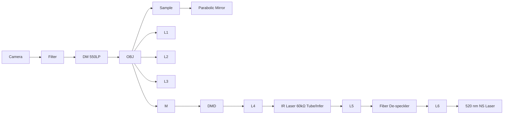
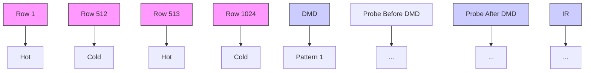

# Super-resolution Chemical Imaging via Structured Illumination Fluorescence-Detected Mid-Infrared Photothermal Microscopy

Dashan Dong, Ji-Xin Cheng\*

Department of Electrical and Computer Engineering, Photonics Center, Boston University, Boston, 02215, USA \*Author e-mail address: jxcheng@bu.edu

Abstract: A super-resolution chemical imaging method integrating structured illumination with fluorescence-detected mid-infrared photothermal microscopy (SI F-MIP) enables high-resolution chemical imaging of biological specimens.

## 1. Introduction

By overcoming the optical diffraction limit and achieving enhanced spatiotemporal resolution, super-resolution microscopy now allows scientists to observe organelle interactions at subcellular level. However, current fluorescence-based and label-free super-resolution imaging techniques remain limited to examining organelles through either morphological changes or spatial contact events[1], without the capability to image their chemical composition.

Vibrational spectroscopic imaging of biomolecules has enabled chemical imaging at the subcellular scale[2]. However, state-of-the-art coherent Raman scattering microscopy depends on costly ultrafast lasers, and its imaging speed is limited by the point-scanning method. Mid-infrared photothermal (MIP) microscopy[3], a next-generation chemical imaging technique, capitalizes on an infrared absorption cross-section six orders of magnitude higher than that of Raman scattering. By employing a pump-probe approach, MIP microscopy surpasses the resolution limits of infrared light, achieving submicron resolution. Additionally, without the phase matching requirement, a wide-field scheme could be adapted for high throughput MIP imaging[4]. Recently, fluorescence-detected MIP (F-MIP) have further enhanced the modulation depth of MIP signals by over 100-fold by utilizing fluorescent dyes as temperature sensors[5, 6].

In this work, we present a super-resolution chemical imaging method that integrates structured illumination (SI)[7] into fluorescence-detected MIP microscopy. By doubling the resolution with SI, the new method, structured illumination fluorescence-detected MIP (SI F-MIP), enables significant advancements in the resolution of chemical imaging.

## 2. Methods

flowchart

flowchart

Fig. 1. Setup and timing illustration of SI F-MIP system.

The implementation of the SI F-MIP system is illustrated in Fig. 1a. In brief, a mid-infrared QCL laser and a 520 nm nanosecond-pulsed laser, synchronized at a 50 kHz operating frequency, serve as the pump and probe light sources, respectively. The pump light, with a pulse width of 500 ns, is focused onto the sample using an off-axis parabolic mirror, forming a beam spot with a diameter of approximately 50 µm.

For the probe light, it first undergoes de-speckling, followed by collimation and beam expansion before being directed onto a digital micromirror device (DMD). The DMD is programmed with stripe patterns for structured illumination (SI). These patterns are relayed through a 4-f system and reflected by a dichroic mirror into an epi fluorescence microscope, creating structured light illumination in the sample plane. Under this structured illumination, the resulting fluorescence signals are collected by the objective lens, pass through the dichroic mirror and optical filters, and are imaged onto the sCMOS camera via a tube lens.

The system timing sequence is shown in Fig. 1b. To minimize readout noise, the sCMOS camera operates in rolling shutter mode. The camera alternates between capturing "hot" frames, during which the IR light source is active, and "cold" frames, when the IR light source is turned off. Once all pixels enter the exposure state, the system triggers a DMD pattern update, synchronized with the selection of whether to trigger the QCL for mid-infrared laser pulse output based on the pattern sequence.

A complete image sequence consists of structured illumination in 3 directions, with the fringe pattern shifting 3 times at equal intervals in each direction. For each pattern, both a Hot frame and a Cold frame are captured, resulting in a total of 18 images per cycle.

## 3. Results

  
Fig. 2. Hyperspectral SI F-MIP imaging of S. aureus sample.

The SI F-MIP microscope is applied to image S. aureus bacteria to evaluate its chemical imaging capability on biological specimens. The S. aureus sample was stained with fluorescence dye R6G and dried on $\mathrm { C a F } _ { 2 }$ substrate. At each wavenumber, five imaging cycles were performed to improve SNR, resulting in a total of 90 frames per wavenumber.

The acquired images are reconstructed into wide field images (Fig. 2a) by average, and super-resolution images (Fig.2b) by SIM algorithm. The Hot and Cold states were processed separately, as they exhibit different bleaching curves during imaging (Fig. 2d). After subtracting and bleaching correction based on the cold images, the SI F-MIP results (Fig. 2c) are obtained. For hyperspectral results, the spectral data within the selected ROI are normalized according to the IR power density (Fig. 2e-f).

## 4. Discussion

We present a novel super-resolution chemical imaging method, SI F-MIP, which provides capabilities for superresolution chemical imaging. This method bridges the gap between traditional high-resolution morphological imaging and chemical analysis, offering a highly versatile and powerful tool for studying the intricate chemical architecture of living systems. Looking ahead, future applications of this method include real-time dynamic cell imaging, with a focus on elucidating complex chemical processes and material exchanges during organelle metabolism.

## References

[1] A. M. Valm, S. Cohen, W. R. Legant et al., "Applying systems-level spectral imaging and analysis to reveal the organelle interactome," Nature 546, 162-167 (2017).  
[2] J.-X. Cheng, and X. S. Xie, "Vibrational spectroscopic imaging of living systems: An emerging platform for biology and medicine," Science 350, aaa8870 (2015).  
[3] D. Zhang, C. Li, C. Zhang et al., "Depth-resolved mid-infrared photothermal imaging of living cells and organisms with submicrometer spatial resolution," Science advances 2, e1600521 (2016).  
[4] Y. Bai, D. Zhang, L. Lan et al., "Ultrafast chemical imaging by widefield photothermal sensing of infrared absorption," Science advances 5, eaav7127 (2019).  
[5] M. Li, A. Razumtcev, R. Yang et al., "Fluorescence-detected mid-infrared photothermal microscopy," Journal of the American Chemical Society 143, 10809-10815 (2021).  
[6] Y. Zhang, H. Zong, C. Zong et al., "Fluorescence-detected mid-infrared photothermal microscopy," Journal of the American Chemical Society 143, 11490-11499 (2021).  
[7] Y. Wu, and H. Shroff, "Faster, sharper, and deeper: structured illumination microscopy for biological imaging," Nature methods 15, 1011- 1019 (2018).