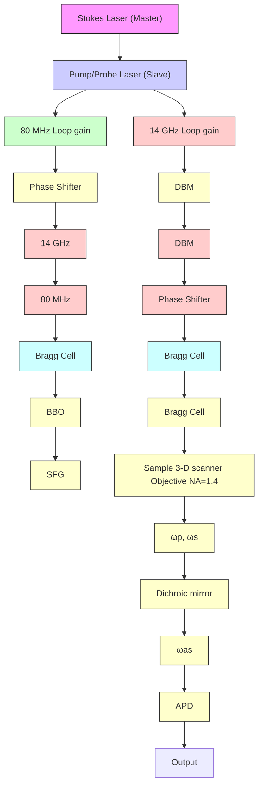
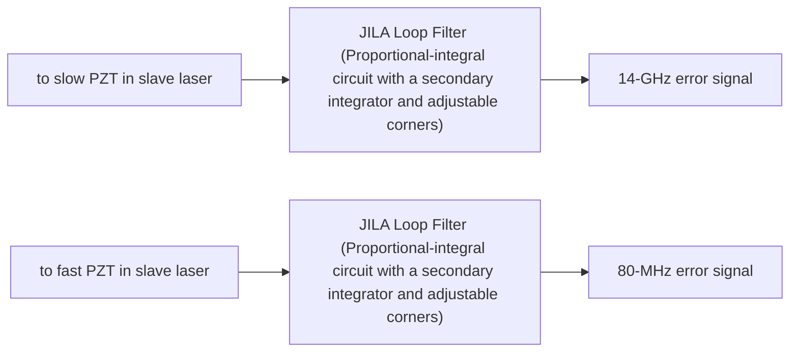

RESEARCH ARTICLE | AUGUST 01 2002

# Synchronization of two passively mode-locked, picosecond lasers within 20 fs for coherent anti-Stokes Raman scattering microscopy 

David J. Jones; Eric O. Potma; Ji-xin Cheng; Berndt Burfeindt; Yang Pang; Jun Ye; X. Sunney Xie

Check for updates

Rev. Sci. Instrum. 73, 2843–2848 (2002)

https://doi.org/10.1063/1.149200

  
View Online

  
Export Citation

natural_image

Abstract digital artwork with flowing blue light streaks on black background, no text or symbols present

## AIP Advances

Why Publish With Us?

  
21DAYS average time to 1 st decision

  
OVER 4 MILLION views in the last year

  
INCLUSIVE scope

Learn More

  
AIP ublishing

# Synchronization of two passively mode-locked, picosecond lasers within 20 fs for coherent anti-Stokes Raman scattering microscopy

David J. Jones

JILA, University of Colorado and National Institute of Standards and Technology, Boulder, Colorado 80309-0440

Eric O. Potma and Ji-xin Cheng

Department of Chemistry and Chemical Biology, Harvard University, 12 Oxford Street, Cambridge, Massachusetts 02138

Berndt Burfeindt and Yang Pang

Coherent Laser Group, Coherent, Inc., Santa Clara, California 95054

Jun Yea)

JILA, University of Colorado and National Institute of Standards and Technology, Boulder, Colorado 80309-0440

X. Sunney Xie

Department of Chemistry and Chemical Biology, Harvard University, 12 Oxford Street, Cambridge, Massachusetts 02138

\~Received 1 March 2002; accepted for publication 16 May 2002!

We report on the synchronization of two commercial picosecond Ti:sapphire lasers with unprecedented low temporal jitter between the pulse trains. Pulse jitter is reduced from a few picoseconds to 20 fs with a stability of several hours. The technology enabling the tight pulse synchronization is reviewed in this article. We demonstrate the usefulness of the synchronization scheme by applying the technique to coherent anti-Stokes Raman scattering \~CARS! microscopy. It is shown that CARS images can be acquired with a significant improvement in signal-to-noise ratio. This level of performance brings the fluctuations of the CARS signal down to the fundamental photon shot-noise limit. We present detailed statistical analysis of the pulse jitter and CARS noise along with enhanced CARS vibrational images of polymer beads. © 2002 American Institute of Physics. @DOI: 10.1063/1.1492001#

## I. INTRODUCTION

Within both chemistry and physics, there has been a long-standing desire to pursue experiments using two independent ultrafast \~picosecond or femtosecond! lasers, socalled ‘‘two-color’’ experiments. Examples of such experiments include difference frequency generation \~DFG! to generate tunable, ultrafast pulses in the midinfrared \~2–10 m! wavelength region,1 coherent anti-Stokes Raman scattering microscopy,2 two-color pump–probe investigations,4 and coherent control of molecules.5 For the majority of these and other applications, the relative jitter between the pulses has been the limiting factor, severely restricting the sensitivity, the signal-to-noise ratio, or other critical experimental parameters.6 As a result, workers have turned toward laser/ optical parametric oscillator \~OPO! or laser/optical parametric amplifier \~OPA! systems where one color is produced by the laser and the remaining color is generated using an OPO or OPA.2,3 In these systems the pulses are inherently synchronized as a portion of the laser’s output is used to seed the OPO/OPA. In this case the relative pulse timing jitter is negligible. However, the low powers obtainable from OPO/ OPAs and the relative complexity of the sources themselves are two clear disadvantages for this approach but perhaps most importantly, phase-matching conditions required for the optical parametric processes strongly limit the wavelength regions accessible by the second color. All of these limitations are particularly apparent in finding sources for CARS microscopy/imaging.

In order to provide suitable pulse sources with low jitter, single mode-locked Ti:sapphire lasers have been developed that generate two-color pulse trains simultaneously.7 The two laser cavities share a single Kerr-lens active medium that enforces synchronous mode locking of both oscillators. Recently, this approach has been extended to synchronize a Ti:sapphire resonator with a Cr:fosterite laser.8 However, the integrated cavities are difficult to align and cavity length considerations and gain dynamics limit individual tunability. Switching out selected pulse pairs that have high jitter constitutes another route to reduce the jitter between independent femtosecond \~fs! lasers.9,10 However, this scheme leads to irregular pulse repetition rates and may seriously affect the average output power. A more recent demonstration of synchronizing all pulses generated by two independent fs lasers obtained a relative timing jitter below 1 fs.11 Tight synchronization was achieved by a new, yet simple, electronic feedback technique that profits from the enhanced sensitivity offered by detecting and processing higher harmonics of the pulse repetition rate.12 Further work has shown that this technique is also capable of realizing phase coherence between two fs lasers when a second feedback loop is included.13

flowchart

FIG. 1. Schematic of the laser setup. Two ps Ti:sapphire lasers are synchronized via a dual phase-locked-loop scheme, one operating at the fundamental repetition frequency \~80 MHz! and one at the 175th harmonic \~14 GHz!. Also shown is a fringe-unresolved cross correlator to characterize the relative pulse timing jitter. For CARS imaging, the repetition rates of the two pulse trains are reduced to 250 kHz with two respective Bragg cells and then sent to the CARS microscope. BBO: -barium borate; DBM: double balanced mixer; SFG: sum frequency generation.

In this article we will review the electronic feedback technology necessary to achieve this level of pulse synchronization. We briefly summarize the advantages of this approach, in terms of precision, reproducibility, and settling speed for achieving the desired timing offset. Optical characterization of the jitter will also be presented. While in time other two-color applications, including those mentioned above, are expected to benefit from this technology, in this article we will focus primarily on its application to CARS microscopy. The improvement of CARS sensitivity due to extremely low jitter is great enough that the CARS signal becomes photon shot-noise limited.

As we focus on the development of an ideal light source for CARS imaging and microscopy, for the remainder of this article we will specifically discuss synchronization of the pulse repetition rates of two picosecond \~ps! Ti-sapphire lasers. For a number of reasons discussed in Sec. IV, this type of laser system configuration is considered to be optimal for CARS microscopy. However, the synchronization techniques presented below can be easily generalized to synchronize nearly any two \~or more! ps or fs mode-locked lasers, enabling the reduction of relative pulse jitter to below 1 fs as well as obtain phase coherence between two fs lasers.

## II. OPTICAL SETUP

The layout used to synchronize 2 pulse trains is shown in Fig. 1. In this case, two ps lasers tunable from 700 to 1000 nm \~both Coherent MIRA 900-P lasers14! are each pumped by a 5 W Coherent Verdi.14 Typically, ;3 ps pulses are produced from these oscillators. As discussed in Sec. IV, in CARS microscopy the two colors are denoted as the pump/ probe and Stokes beams and we label the lasers according to this convention. The Stokes laser is allowed to be free running \~master! and the pump/probe laser is slaved to the master. In order to adjust the repetition rate, the pump/probe laser is equipped with a slow-speed, long-range \~15 m travel! piezoelectric transducer \~PZT! and a custom designed, high-speed PZT. Each PZT holds a cavity fold mirror in the pump/probe laser cavity. The slow \~fast! PZT has a resonance frequency of 6 (40) kHz.

The locking scheme used to synchronize the lasers differs from traditional approaches in that both the fundamenta repetition rate and a high harmonic are detected simultaneously. Combining both slow-speed \~fundamental! and high-speed \~high harmonic! detection allows sensitive phase detection \~i.e., relative timing fluctuations! over a large dynamic range for the overall feedback loop, enabling the relative jitter \~in this laser system! to be minimized to 21 fs at any value of timing offset. Toward this end, a portion of each laser’s output is coupled to two different photodiodes, an 80 MHz photodiode and a 14 GHz photodiode. Via two doublebalanced mixers, two phase errors are generated from each pair of photodiodes. As shown in Fig. 1, the resulting error signals are then combined and shaped \~in the frequency domain! before being fed back to the slave laser. Indeed the heart of the synchronization system is in the combining and shaping of the errors signals and is explained in detail within the following section.

## III. SYNCHRONIZATION ELECTRONICS

The error signals from the two phase detectors, one for the fundamental repetition frequency at 80 MHz and the other for the 175th harmonic at 14 GHz, once appropriately filtered with band-pass filters, are combined through a continuously variable potentiometer before being sent to the synchronization servo loop. This arrangement allows a smooth changeover of the synchronization error signal from the 80 MHz \~coarse! loop to the 14 GHz \~high sensitivity! loop. Another benefit of this technique is that a varying degree of mixture from the two phase loops allows a range of timing jitter values to be achieved, i.e., as the source of the error signal is gradually shifted from the 80 MHz loop to the 14 GHz loop, the relative jitter continuously decreases. Such a capability is useful in quantitative studies of how timing jitter affects measurements.

The lasers are first synchronized using only the 80 MHz error signal. Next, the phase shifter in the 80 MHz loop is adjusted to temporally overlap the two pulse trains. This phase shifter has a dynamic range greater than 2 , equivalent to a time variation of 12.5 ns, @1/\~80 MHz!512.5 ns# enabling the overlap of the pulse trains with any initial phase \~timing! offset. The error signal is then transferred from the 80 MHz loop to the 14 GHz loop. During this process, a jump in the pulse timing offset by at most 35.7 ps \~one-half of one 14 GHz cycle! can occur. However, this timing offset can be easily corrected by the 14m GHz phase shifter, which provides an adjustable range of 167 ps. This double loop approach is attractive in terms of the initial search efficiency for the desired timing offset. The use of the 80 MHz loop allows a quick determination of the relevant timing offset and an initial optimization of the desired signal, which might be buried under noise if the lasers were not synchronized at all. Once found, the signal can be quickly enhanced by switching over to the high resolution 14 GHz loop, without any need of extensive search by this second loop.

flowchart

FIG. 2. Configuration of the locking electronics for combining the 80 MHz and 14 GHz error signals. The wiper arm of the potentometer selects the relative weighting of the two error signals. In this case, the feedback electronics are in a serial configuration.

In place of a phase shifter in the radio frequency signal path, a second approach can also be utilized where a simple electronic control of the timing offset is obtained by summing a command signal to the output of the double balanced mixer \~phase detector! before the synchronization servo loop.11 This approach, although topologically different from the phase shifter technique, offers the same basic capability in control of pulse timing offset. We have routinely used this method to electronically scan out cross-correlation signals between the two pulse trains, under a locked condition. The flexibility to achieve low timing noise at any predetermined timing offset is desirable for practical ultrafast applications. It is also highly desirable that this electronic approach allows a reliable setting of the timing offset at a high speed and with an excellent repeatability.

Once the error signal is generated, it is fed into a JILA designed feedback loop filter before being applied to the servo transducer.15 The loop filter offers a variable corner frequency where a proportional gain turns into an integrator gain \~PI corner!. This variable PI corner enables one to compensate for an experimentally determined pole \~high frequency roll off! existing in the servo transducer. To achieve a higher gain at low frequencies, the loop filter allows a second integrator to be turned on at an appropriately chosen place below the unity gain frequency. The corner frequency of the second integrator can also be varied to optimize the time domain performance of the feedback loop. The servo action on the slave laser is carried out by a combination of two piezoelectric transducers \~PZT!, including a fast-PZTactuated small mirror \~4 mm in diameter and 2.5 mm thick! and a regular sized mirror mounted on a slow PZT with a large dynamic range \~15 m!. In an earlier experiment11 we have achieved a unity gain frequency of the servo loop at about 100 kHz with this scheme. However, when we synchronized the ps lasers, a sharp resonance in the slow \~commercially produced! PZT limited the unity gain frequency to a lower value. Usually the fast PZT loop is activated first to lock the two lasers. The drive signal to the fast PZT \~after the loop filter! is also fed into an additional integrator that drives the slow PZT. This serial arrangement, shown in Fig. 2, prevents the feedback signal to the fast PZT from reaching its rails. In practice we have found that it is equally effective if we separate the timing error signal into two paths, each feeding into its own respective loop filter with appropriate responses and driving their respective PZTs. In doing so it is important to assign a correct gain ratio between the two feedback paths so they can be recombined to form a smooth overall servo function. This scheme allows us to study the effect of the fast PZT by turning on and off its servo action while always leaving on the slow PZT channel.

line chart

| Frequency (Hz) | locked (fs/Hz) | unlocked (fs/Hz) | total jitter (fs) |
| -------------- | -------------- | ---------------- | ----------------- |
| 7              | 10             | 30               | 0                 |
| 8              | 5              | 25               | 5                 |
| 9              | 3              | 20               | 10                |
| 10             | 1              | 15               | 15                |
| 2              | 0.1            | 10               | 20                |
| 3              | 0.1            | 5                | 25                |
| 4              | 0.1            | 3                | 28                |
| 5              | 0.1            | 2                | 29                |
| 6              | 0.1            | 1.5              | 29.5              |
| 7              | 0.1            | 1                | 30                |
| 8              | 0.1            | 0.8              | 30                |
| 9              | 0.1            | 0.6              | 30                |
| 10             | 0.1            | 0.5              | 30                |
| 2              | 0.1            | 0.4              | 30                |
| 3              | 0.1            | 0.3              | 30                |
| 4              | 0.1            | 0.2              | 30                |
| 5              | 0.1            | 0.15             | 30                |
| 6              | 0.1            | 0.1              | 30                |
| 7              | 0.1            | 0.08             | 30                |
| 8              | 0.1            | 0.06             | 30                |
| 9              | 0.1            | 0.05             | 30                |
| 10             | 0.1            | 0.04             | 30                |
| 2              | 0.1            | 0.03             | 30                |
| 3              | 0.1            | 0.02             | 30                |
| 4              | 0.1            | 0.015            | 30                |
| 5              | 0.1            | 0.01             | 30                |
| 6              | 0.1            | 0.008            | 30                |
| 7              | 0.1            | 0.006            | 30                |
| 8              | 0.1            | 0.005            | 30                |
| 9              | 0.1            | 0.004            | 30                |
| 10             | 0.1            | 0.003            | 30                |
| >2             | <1             | <5               | <5                |
The chart displays two data series: 'locked' and 'unlocked'. The y-axis is labeled 'Amplitude (fs/Hz)' and 'Jitter (fs)'. The x-axis is labeled 'Frequency (Hz)'. The data series are labeled 'Total jitter'. The y-axis is labeled 'Amplitude (fs/Hz)' and 'Jitter (fs)'. The labels above the x-axis are 'anned' or 'closed'.

FIG. 3. Jitter spectral density \~left axis! of in-loop error signal when lasers are locked \~solid line! and unlocked \~dotted line!. The mixer noise level is ;0.1 $\mathbf { f s } / \sqrt { \mathrm { H z } }$ \~dashed line!. Also shown is the integrated jitter \~dot-dashed line, right axis! as a function of frequency which is compared with the time domain jitter measurements discussed in Sec. V.

By examining the spectral content of the in-loop error signal, the performance of the feedback loop itself can be evaluated. Figure 3 shows jitter spectral density \~as measured on a fast Fourier transform spectrum analyzer! of the in-loop error signal monitored at the 14 GHz mixer output when the lasers are synchronized with the 14 GHz error signal. Also shown is the error when the lasers are not locked. Clearly the feedback loop is able to significantly reduce the noise up to a few kHz, thereby compensating most of the jitter. Beyond 10 kHz, the locked error signal fluctuates around the noise floor of the mixer at 0.1 fs/AHz. The resonance at roughly 9 kHz is the effective resonance of the combined \~coupled! fast and slow PZTs.

## IV. APPLICATION TO CARS MICROSCOPY

To demonstrate the benefits arising from two tightly synchronized ps lasers, we have interfaced the system with a CARS microscope. This type of microscope enables chemically selective imaging based on vibrational sensitivity. For CARS microscopy, coherent radiation of at least two different spectral components is required, $\omega _ { p }$ \~pump/probe! and $\omega _ { s }$ \~Stokes!. Whenever the frequency difference $\omega _ { p } - \omega _ { s }$ coincides with frequency of a Raman-active vibration, strong CARS signals are generated, leading to molecule specific vibrational contrast in the image. Recent refinements in CARS vibrational imaging16–18 have enabled it to become a powerful method that is especially suited for acquisition of chemically selective maps of biological samples.

Two synchronized mode-locked ps Ti:sapphire lasers represent an ideal source for CARS microscopy for a number of reasons. First, the large spectral tunability of commercially available Ti:sapphire oscillators allows the frequency difference $\omega _ { p } - \omega _ { s }$ to be tuned between a few wave numbers up to 3500 cm21. This implies for instance that the biologically interesting fingerprint region $( 1 0 0 0 { - } 2 0 0 0 ~ \mathrm { c m } ^ { - 1 } )$ can be easily accessed. Second, the spectral width of the ps pulses delivered by the laser system is comparable to the vibrational bandwidths of molecular modes in the condensed phase. As shown by Cheng et al., the use of ps pulses optimizes the resonant contribution versus nonresonant contribution to the signal, giving rise to favorable signal-to-noise \~S/N! levels.17 Third, the near infrared output of this laser source limits absorption of light by the sample and hence minimizes photoinduced damage of the biological specimen. Finally, the excellent power stability and ease of operation make the Ti:sapphire-based laser system a particular attractive source for nonlinear imaging experiments.19

As CARS microscopy is inherently a multiphoton process \~specifically, a four-wave-mixing process!, the strength of the CARS signal directly depends on the temporal overlap of the incident pulses from the two independently running oscillators. Any timing jitter between the two pulse trains will lead to signal fluctuations and hence to image degradation. Therefore, for a successful implementation of the dual laser source the timing jitter should be actively reduced. Optimum suppression of the temporal fluctuations between the pulses requires the jitter to be much smaller than the width of the laser pulses. The high-harmonic locking technique discussed above is capable of achieving such small timing jitters and by using this technique all the jitter-related noise from the CARS images can be eliminated.

Along with the laser system, a schematic of the CARS microscopy can be found in Fig. 1. To reduce the average light power applied to the sample, each 80 MHz pulse train is pulse picked down to 250 kHz with a Bragg cell. The electronic synchronization signal for both pulse-pickers is derived from the repetition rate of the master oscillator. The diffracted beams are expanded and collinearly overlapped on a dichroic mirror. Before entering the inverted microscope, the beams pass a series of glass color filters to suppress the residual broadband superfluorescence from the Ti:sapphire oscillators. The microscope is equipped with a 1.4 NA, 603 oil-immersion objective lens that focuses the radiation to a diffraction limited focal spot. CARS signals are collected in the epidirection $( \mathrm { E - C A R 3 } ) ^ { 1 6 }$ by the same objective. The blueshifted anti-Stokes signal is separated from the incident radiation by a dichroic filter and focused onto an avalanche photodiode. Appropriate optical filters are used to suppress any remaining light originating from the incident beams. Scanning is accomplished by mounting the sample on a piezobased translation stage.

## V. JITTER MEASUREMENT

To obtain an independent measurement of the timing jitter, the setup incorporates a second-order cross correlator. Portions of each laser beam are picked off and noncollinearly combined in a thin BBO crystal for sum frequency generation \~SFG!, producing a background-free SFG crosscorrelation signal. Measurement of both the CARS signal and the SFG at the same time is realized by equalizing the optical path lengths of the beams in the microscope branch and in the cross-correlator unit.

A typical cross-correlation signal with a full width halfmaximum of roughly 4 ps is shown in Fig. 4\~a!. The cross correlation is obtained by scanning the rf phase shifter in the 14 GHz loop, thereby adjusting the relative pulse delay. This cross-correlation signal width is comparable to the individual autocorrelation pulse widths of the Stokes and pump/probe lasers. As long as the relative jitter is below one-half of a pulse width, it can be measured as follows. The relative timing of the two pulses are offset by one-half of a pulse width. The resulting amplitude fluctuations recorded in the SFG signal can be converted to timing fluctuations via the width and shape of the cross-correlation signal. We record these intensity fluctuations over a period of several seconds using two different bandwidths \~160 Hz and 2 MHz!, which suppress the pulsed nature \~80 MHz! of the SFG signal amplitude and permit the study of intensity noise on a cw basis. Figure 4\~b! shows the SFG signal fluctuations \~converted to relative timing jitter! as observed through a 160 Hz bandwidth electronic low-pass filter over a period of 10 s \~corresponding to a lower frequency limit of $1 / ( 2 \pi \times 1 0 ) { = } 0 . 0 2 \ \mathrm { H z } )$ . If only the 80 MHz loop is utilized to synchronize the lasers, a jitter of ;700 fs is observed in a time window of several seconds. When the feedback is switched over to 14 GHz error signal \~at t510 s!, the rms timing jitter is reduced to only 21 fs, more than 2 orders of magnitude smaller than the pulse widths themselves. When the SFG fluctuations are measured through a 2 MHz bandwidth low-pass filter, the rms jitter increases to roughly 120 fs, indicating the majority of the jitter is at low frequencies.

line chart

| X-Axis | SFG Intensity |
|---|---|
| -10 | 0.0 |
| -9 | 0.0 |
| -8 | 0.05 |
| -7 | 0.1 |
| -6 | 0.2 |
| -5 | 0.35 |
| -4 | 0.55 |
| -3 | 0.75 |
| -2 | 0.95 |
| -1 | 1.0 |
| 0 | 1.0 |
| 1 | 0.95 |
| 2 | 0.85 |
| 3 | 0.7 |
| 4 | 0.55 |
| 5 | 0.4 |
| 6 | 0.25 |
| 7 | 0.15 |
| 8 | 0.05 |
| 9 | 0.0 |
| 10 | 0.0 |

line chart

| Time (s) | Relative Jitter (ps) |
| -------- | -------------------- |
| 0        | 0.0                  |
| 5        | 1.0                  |
| 10       | 0.0                  |
| 15       | 0.0                  |
| 20       | 0.0                  |

line chart

| Time (ps) | CARS Intensity |
| --------- | -------------- |
| -10       | 0.0            |
| -5        | 0.2            |
| 0         | 1.0            |
| 5         | 0.2            |
| 10        | 0.0            |

line chart

| Time (sec) | CARS Intensity |
| ---------- | -------------- |
| 0          | 1.0            |
| 5          | 0.2            |
| 10         | 0.8            |
| 15         | 1.0            |
| 20         | 1.0            |

FIG. 4. \~a! SFG cross correlation of the pump/probe and Stokes lasers when they are synchronized. The time delay is scanned with the 14 GHz phaser shifter. \~b! SFG fluctuations \~converted to timing jitter! as recorded through a 160 Hz filter when the pulses’ timing is offset by one-half of a pulsewidth. At 10 s, the error signal is switched from the 80 MHz loop to the 14 GHz loop; \~c! CARS cross correlation recorded in 1 ms binwidths; \~d! CARS fluctuations when pulses’ timing offset is zero \~for the maximum CARS signal!. Again at 10 s the error signal for the synchronization loop is switched from the 80 MHz signal to the 14 GHz signal.

We can confirm these time domain measurements of the jitter by examining the spectral content of the 14 GHz error signal. The spectral density of the jitter can be determined by measuring the error signal with a fast Fourier transform spectrum analyzer and then converting it to units of $\mathrm { f s / \sqrt { H z } }$ via the transfer function of the 14 GHz mixer. Denoting the \~rms! jitter spectral density as $S _ { T } ( \nu )$ , the total jitter ( ) in a frequency range $f _ { a } - f _ { b }$ , can be found by single sideband integration:

scatterplot

| [Total CARS Power]^1/2 (a.u.) | Signal-to-noise ratio |
|---|---|
| 0.3 | 4.5 |
| 0.8 | 9.0 |
| 1.0 | 10.5 |
| 1.2 | 12.5 |
| 1.7 | 16.5 |
| 2.0 | 18.0 |
| 2.1 | 20.5 |

FIG. 5. Signal-to-noise ratio of the CARS signal, stationary at a single pixel vs the square root of the total detected CARS power as the power in the pump/probe beam \~triangles! and Stokes beam \~squares! is varied. The linear relationship indicates that the CARS signal is shot-noise limited.

$$
\tau (f _ {a}, f _ {b}) = \sqrt {2 * \int_ {f _ {a}} ^ {f _ {b}} [ S _ {T} (f) ] ^ {2} d f}. \tag {1}
$$

With $S _ { T } ( \nu )$ shown in Fig. 3 and $f _ { a } { = } 6 2 . 5 \mathrm { ~ H z } ,$ , this integration is carried out as a function of $f _ { b }$ with the result displayed as a dot–dashed line \~right axis! in the same figure. Despite the limited number of low frequency points which could distort the integration, at $f _ { b } = 1 6 0$ Hz a total jitter of ,25 fs is calculated which compares quite favorably with the time domain measurement of 21 fs \~from 0.02 to 160 Hz! from Fig. 4.

A cross correlation using the CARS signal can also be recorded and is shown in Fig. 4\~c!, also with a Gaussian fit. In this case, the focus of the microscope remains stationary on a single pixel. Figure 4\~d! displays the fluctuations when the pulse timing delay is zero. In both Figs. 4\~c! and 4\~d!, a 1 ms binwidth is used to collect the CARS signal which is nearly the same filtering as the 160 Hz loss pass filter used with the SFG data. As with the SFG signals, when the 14 GHz loop is activated \~at 10 s!, there is a sharp reduction in the signal fluctuations. Although significant, this reduction is not as dramatic as the SFG case. It is useful to examine the character of the CARS fluctuations when the 14 GHz loop is activated. The observed signal-to-noise ratio \~S/N! versus the square root of the total detected CARS power as the pump/ probe \~triangles! and Stokes \~squares! laser powers are individually varied is illustrated in Fig. 5. The linear relationship shown in Fig. $5 \ : \mathrm { ( S / N } \propto \sqrt { P o w e r } )$ indicates that, with the jitter reduced to 21 fs, the noise on the CARS signal is limited by the fundamental photon statistics \~a Poisson distribution of the signal photon flow!.

## VI. CARS IMAGING

As is evident from the discussion above, the CARS signal is severely compromised if the synchronization is realized without the superior sensitivity of the high-harmonic locking. In particular, the signal is affected by prominent jitter noise at low frequencies, giving rise to considerable variations in the CARS intensity on the time scale of a second. Given that the acquisition time of CARS images usually requires several seconds to a few minutes, it can be anticipated that these slow signal fluctuations can significantly distort the resulting image. Figure 6\~a! depicts a CARS image of small \~0.5 m! polystyrene beads. The lasers are tuned to the $1 6 0 0 \mathrm { c m } ^ { - 1 }$ vibration of polystyrene, corresponding to the C5C stretching vibration of the aromatic rings. The pulse jitter was set to ;700 fs. The low frequency temporal phase drifts introduce dark lines in the image, corresponding to occasions of unfavorable pulse overlap. It is clear that with this type of image degradation, the many advantages offered by using two Ti:sapphire-based laser systems are largely obscured by the presence of low frequency pulse jitter. With the 14 GHz loop activated, the jitter-related noise is eliminated from the image. This is shown in Fig. 6\~b!, where the polymer beads have been imaged under the same conditions as in Fig. 6\~a! but with the high-harmonic feedback enabled. The characteristic dark lines reminiscent of appreciable pulse jitter are completely removed. The noise in the image is now primarily dictated by photon statistical fluctuations rather than by temporal variations in laser performance. Maintaining an extremely low pulse jitter not only eliminates the jitter-induced distortions of the image, it also guarantees an optimum signal yields during image acquisition. This favors a higher average CARS signal. In Fig. 6\~b!, for instance, the total number of CARS photons detected from the beads is 34% higher than the corresponding number of signal photons in Fig. 6\~a!. Both the removal of noise produced by jitter and the elevated number of photon counts enhance the quality of the CARS image. The one-dimensional cross sections given in the lower panels of Fig. 6 underline the significant improvement obtained when using the 14 GHz lock.

line chart

| Distance [µm] | Counts (a) | Counts (b) |
| ------------- | ---------- | ---------- |
| 0.5           | ~80        | ~90        |
| 1.0           | ~60        | ~40        |
| 1.5           | ~80        | ~90        |
| 2.0           | ~20        | ~20        |
| 2.5           | ~0         | ~0         |

FIG. 6. E-CARS images \~1803256 pixels! of 0.5 m polystyrene beads taken for different settings of the timing jitter between the pump/probe and Stokes pulses. \~a! Image recorded with a timing jitter of 700 fs. \~b! Identical image recorded with 21 fs timing jitter. Lower panels depict horizontal cross sections taken at the position of the arrows. Lasers are tuned to a Raman shift of $1 6 0 0 \mathrm { c m } ^ { - 1 }$ . Pump/probe power is 0.3 mW, Stokes power is 0.1 mW, and pixel dwell time is 0.48 ms.

It is noteworthy that a pulse jitter of 21 fs can be easily retained over several hours without adjustment of the locking electronics. The improved CARS microscope can thus be conveniently deployed for routine imaging studies. As such, the improved imaging qualities achieved here are particularly interesting for CARS microscopy of biological samples. Furthermore, the technique demonstrated in this article can also be expected to play an important role for other types of two photon pump–probe experiments that involve two pulsed lasers of different wavelengths.

## ACKNOWLEDGMENTS

The authors thank Dr. J. L. Hall for his long term development of the JILA loop filter, S. Foreman for his excellent technical help, and Dr. H. Kapteyn for useful discussions. E.O.P. acknowledges financial support from the Netherlands Organization for Scientific Research \~NWO!. This research is funded by NSF, NIST, NIH, NASA, and the Research Corporation. J.Y. is also a Staff Member of the Quantum Physics Division of NIST Boulder.

1 R. A. Kaindl, M. Wurm, K. Reimann, P. Hamm, A. M. Weiner, and M. Woerner, J. Opt. Soc. Am. B 12, 2086 \~2000!.  
2 A. Zumbusch, G. R. Holtom, and X. S. Xie, Phys. Rev. Lett. 82, 4142 \~1999!.  
3 M. Hashimoto, T. Araki, and S. Kawata, Opt. Lett. 25, 1768 \~2000!.  
4 J. S. Yahng, Y. H. Ahn, J. Y. Sohn, and D. S. Kim, J. Opt. Soc. Am. B 18, 714 \~2001!.  
5 R. S. Judson and H. Rabitz, Phys. Rev. Lett. 68, 1500 \~1992!.  
6 D. S. Alavi and D. H. Waldeck, Rev. Sci. Instrum. 63, 2913 \~1992!.  
7 A. Leitenstorfer, C. Furst, and A. Laubereau, Opt. Lett. 20, 916 \~1995!.  
8 Z. Wei, Y. Kobayashi, Z. Zhang, and K. Torizuka, Opt. Lett. 26, 1806 \~2001!.  
9 S. A. Crooker, F. D. Betz, J. Levy, and D. D. Awschalom, Rev. Sci. Instrum. 67, 2068 \~1996!.  
10 J. Y. Sohn, Y. H. Ahn, and D. S. Kim, Appl. Opt. 38, 5899 \~1999!.  
11 R. K. Shelton, S. M. Foreman, L.-S. Ma, J. L. Hall, H. C. Kapteyn, M. M. Murnane, M. Notcutt, and J. Ye, Opt. Lett. 27, 312 \~2002!.  
12 L.-S. Ma, R. K. Shelton, H. C. Kapteyn, M. M. Murnane, and J. Ye, Phys. Rev. A 64, 21802 \~2001!.  
13 R. K. Shelton, L. S. Ma, H. C. Kapteyn, M. M. Murnane, J. L. Hall, and J. Ye, Science 293, 1286 \~2001!.  
14 Product names mentioned are for technical communication only and do not constitute an endorsement by the authors or NIST.  
15 Designed and perfected by J. L. Hall and T. Brown at JILA.  
16 A. Volkmer, J. X. Cheng, and X. S. Xie, Phys. Rev. Lett. 87, 23901 \~2001!.  
17 J. X. Cheng, A. Volkmer, L. D. Book, and X. S. Xie, J. Phys. Chem. B 105, 1277 \~2001!.  
18 J.-X. Cheng, L. D. Book, and X. S. Xie, Opt. Lett. 26, 1341 \~2001!.  
19 J. Squier and M. Mu¨ller, Rev. Sci. Instrum. 72, 2855 \~2001!.