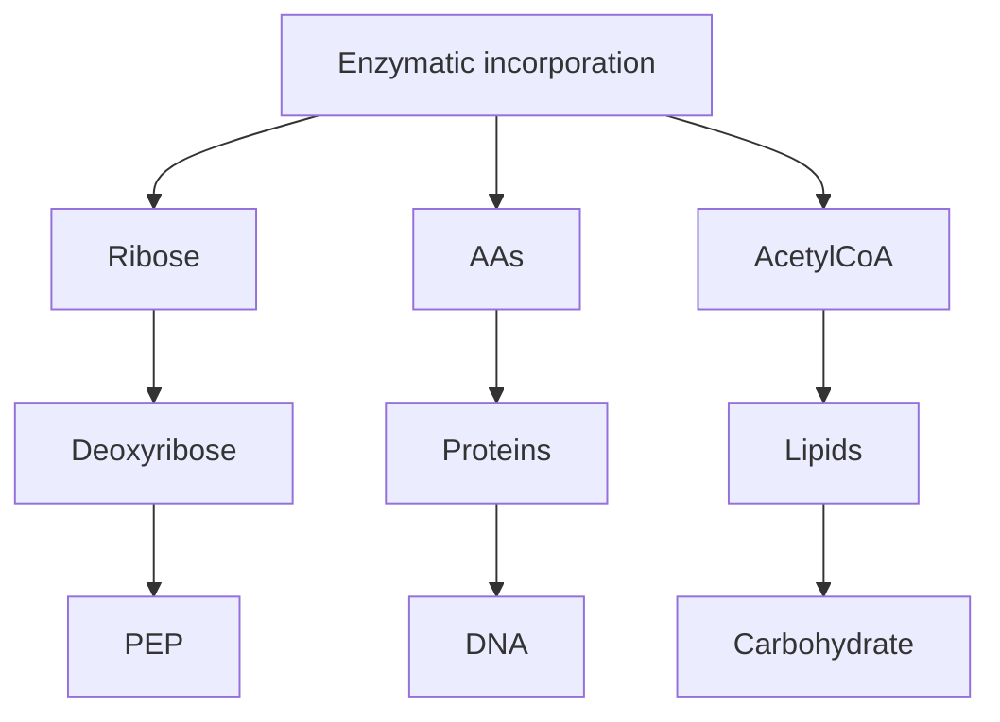
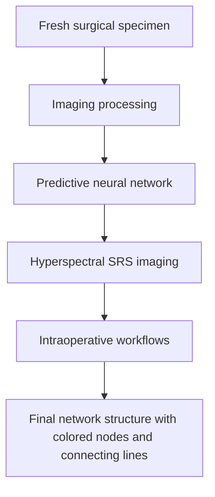

# Theory, innovations and applications of stimulated Raman scattering microscopy

Received: 10 June 2024

Accepted: 15 May 2025

Published online: 1 August 2025

Check for updates

Wei Min  1 , Ji-Xin Cheng  2 & Yasuyuki Ozeki  3

Since its advent around 17 years ago, stimulated Raman scattering (SRS) microscopy has emerged as a transformative imaging modality. By visualizing chemical bonds with high sensitivity, speed, specifcity and resolution, it has revolutionized our ability to probe chemical structures and dynamics in diverse biological and material systems. In this Review we frst provide a comprehensive overview of the theoretical foundations of SRS spectroscopy and microscopy. We then scrutinize recent technical advancements, including various innovations in photonics technology, data science implementation and the development of imaging probes. We also highlight diverse applications of SRS microscopy including single-cell metabolism, pharmaceutical research, super-multiplex imaging and profling, stimulated Raman histology and materials imaging in energy and environmental science. Finally, we present a perspective and future directions. This Review underscores the profound impact of SRS microscopy on interdisciplinary research and its potential for continued innovation in the imaging sciences.

Raman scattering—experimentally observed in 1928 by Raman and Krishnan1 —is a cornerstone of molecular spectroscopy. In fact, this phenomenon was predicted in 1923 by Smekal, who correctly assigned the frequency shift between the incident and scattered light to the energy difference between the two states of the molecule2 . The quantum mechanical description was subsequently given by Kramers and Heisenberg3 and Dirac4 . All of these predictions pre-dated the observation of Raman and Krishnan.

The stimulated Raman scattering (SRS) effect was discovered accidentally in 19625 . Soon afterwards, a four-wave mixing process with Raman resonance, which is used in the coherent anti-Stokes Raman scattering (CARS) technique, was discovered6,7 . The SRS process was originally used for the generation of coherent radiation and in signal amplification for optical fibre communication. Meanwhile, owing to its ultrafast nature of excitation, SRS was used for time-resolved vibrational spectroscopy such as impulsive SRS and femtosecond SRS8,9 . Note that, historically, SRS spectroscopy was not considered to be more sensitive than spontaneous Raman, which is essentially background-free.

SRS microscopy was initially devised to avoid the non-resonant background encountered in CARS microscopy. Ploetz et al. reported SRS imaging (on non-biological samples) using a low-repetition-rate laser system with a slow imaging speed10. In 2008, Xie and colleagues reported SRS microscopy for biological imaging using a high-repetition-rate picosecond laser with lock-in detection11. Shortly afterwards, Ozeki et al.12 and Nandakumar et al.13 reported their independent developments. These pioneering studies triggered the rapid development of SRS microscopy, as detailed in 202214. Although the sensitivity was not quantitatively understood until very recently, most applications are empirically beyond spontaneous Raman, underscoring the profound advantage of SRS microscopy as an analytical technique.

## Theoretical frameworks

In the literature, the Raman cross-section, $, \sigma _ { \mathrm { { R a m a n } } } ,$ is used as a measure of the interaction strength between light and a molecule. $S _ { \mathrm { S t o k e s } } ,$ the rate of energy (measured in J s−1) scattered into the Stokes channel, is written as

$$
S _ {\text { Stokes }} = N \cdot \sigma_ {\text { Raman }} \cdot I _ {\mathrm{p}}, \tag {1}
$$

1 Department of Chemistry, Columbia University, New York, NY, USA. 2 Department of Electrical and Computer Engineering, Department of Biomedica Engineering, Photonics Center, Boston University, Boston, MA, USA. 3 Research Center for Advanced Science and Technology, The University of Tokyo, Tokyo, Japan.  e-mail: wm2256@columbia.edu; jxcheng@bu.edu; ozeki@ee.t.u-tokyo.ac.jp

where N is the number of molecules, $\sigma _ { \mathrm { R a m a n } }$ is Raman cross-section (cm2 ) and $I _ { \mathfrak { p } }$ is the instantaneous intensity of the incident pump beam $( \mathsf { J } \mathsf { s } ^ { - 1 } \mathsf { c } \mathsf { m } ^ { - 2 } )$ . Values of $\sigma _ { \mathrm { R a m a n } }$ are measured to be $1 0 ^ { - 3 0 }$ to $1 0 ^ { - 2 8 }$ cm2 for small chemical bonds. Electronic resonance can increase $\sigma _ { \mathrm { R a m a n } }$ up to $1 0 ^ { - 2 4 } \mathrm { t o } 1 0 ^ { - 2 3 }$ cm2 . They are, however, still many orders of magnitude smaller in comparison with ultraviolet-visible (UV-vis) or infrared absorption cross-sections $( \sigma _ { \mathrm { U V \cdot v i s } } \mathbf { o r } \sigma _ { \mathrm { \scriptscriptstyle I R } } ,$ , respectively) of similar molecules and bonds. Hence, spontaneous Raman scattering has been widely described as an extremely feeble optical process.

## The classical theory

Since its discovery, SRS has been formulated in the context of nonlinear optical processes. Briefly, during the SRS process, the incident pump and Stokes fields $( E _ { \mathfrak { p } }$ and $E _ { \mathrm { { S } } } ,$ respectively) at the separate angular frequencies of $\dot { \boldsymbol { \omega } } _ { \mathsf { p } }$ and ω induce nonlinear polarizations at the same frequencies: $P \big ( \omega _ { \mathsf { p } } \big ) = 6 \varepsilon _ { 0 } \chi _ { \mathsf { R } } ^ { ( 3 ) } \left( \Omega \right) E _ { \mathsf { p } } \big | E _ { \mathsf { S } } \big | ^ { 2 }$ and $P ( \omega _ { \mathsf { S } } ) = 6 \varepsilon _ { 0 } \chi _ { \mathsf { R } } ^ { ( 3 ) } \left( - \Omega \right) E _ { \mathsf { S } } { \left| E _ { \mathsf { p } } \right| } ^ { 2 }$ , where $\scriptstyle \varepsilon _ { 0 }$ is the vacuum permittivity, $\chi _ { \mathtt { R } } ^ { ( 3 ) }$ is the Raman-dependent third-order nonlinear susceptibility of the material and $\Omega = \omega _ { \mathrm { p } } - \omega _ { \mathrm { S } }$ is the Raman-resonance-dependent frequency. Consequently, the radiation from $P ( \omega _ { \mathrm { p } } )$ and $P ( \omega _ { \mathrm { { S } } } )$ produces coherent field components $( E _ { \mathrm { { s R l } } }$ and $E _ { \mathrm { S R C } } )$ at the far field, which interfere with the incident field components $E _ { \mathfrak { p } }$ and $E _ { \mathrm { S } } ,$ respectively. The interference produces stimulated Raman loss (SRL) of the pump beam and stimulated Raman gain (SRG) of the Stokes beam. Their intensity changes are given by:

$$
\Delta I _ {\mathrm{SRL}} \propto - \operatorname{Im} \left[ \chi_ {\mathrm{R}} ^ {(3)} (\Omega) \right] \cdot \left| E _ {\mathrm{p}} \right| ^ {2} \left| E _ {\mathrm{S}} \right| ^ {2}; \quad \Delta I _ {\mathrm{SRG}} \propto \operatorname{Im} \left[ \chi_ {\mathrm{R}} ^ {(3)} (\Omega) \right] \cdot \left| E _ {\mathrm{p}} \right| ^ {2} \left| E _ {\mathrm{S}} \right| ^ {2}, \tag {2}
$$

$\chi _ { \mathtt { R } } ^ { ( 3 ) }$ Rresponse. SRS microscopy then detects the SRL or the SRG as a contrast mechanism for image generation.

Although the numerical values of Im $\mathrm { ~ [ ~ } \boldsymbol { \chi } ^ { ( 3 ) } ]$ are rarely reported, Im $[ \mathsf { X } ^ { ( 3 ) } ]$ has been shown to be linear with respect to the molecular concentration and to $\sigma _ { \mathrm { R a m a n } }$ . The square of $\mathrm { \ d { \cdot } } E _ { \mathrm { p } }$ and $E _ { \mathrm { S } }$ scales with the laser beam intensity, I. Then one arrives at

$$
\Delta I _ {\mathrm{SRS}, \mathrm{SRL}} \propto N \cdot \sigma_ {\text { Raman }} \cdot I _ {\mathrm{p}} \cdot I _ {\mathrm{S}}. \tag {3}
$$

Equation (3) satisfactorily explains the laser intensity dependence, concentration dependence, spectral response and the energy-transfer nature of the SRS process. As such, it has been the key theoretical basis in the literature. Yet, equation (3) shows a proportionality relation instead of an equality term. It is less useful for experimentalists in predicting the absolute SRS signal.

## Quantum electrodynamics theory

Recent progress in quantum mechanical studies has provided a complete theoretical treatment. Second-order perturbation theory describes the rate of the SRG or SRL process, $R _ { \mathrm { S R S } }$ (measured in photon $\mathsf { \pmb { S } } ^ { - 1 } )$ , for a single molecule, by involving the absolute stimulated Raman cross-section, $\sigma _ { \mathrm { s R S } } , \mathsf { a s } ^ { 1 5 }$

$$
R _ {\mathrm{SRS}} = \sigma_ {\mathrm{SRS}} \cdot \Phi_ {\mathrm{p}} \cdot \Phi_ {\mathrm{S}}, \tag {4}
$$

$$
\sigma_ {\mathrm{SRS}} = \frac {\pi \omega_ {\mathrm{p}} \omega_ {\mathrm{S}}}{1 8 \varepsilon_ {0} ^ {2} c ^ {2}} \cdot G (\omega_ {0}) \cdot \left| \sum_ {r} \left\{\frac {\left(\boldsymbol {\mu} ^ {\mathbf {f r}} \cdot \mathbf {e} ^ {\prime}\right) \left(\boldsymbol {\mu} ^ {\mathbf {r m}} \cdot \mathbf {e}\right)}{E _ {\mathrm{rm}} - \hbar \omega_ {\mathrm{p}}} + \frac {\left(\boldsymbol {\mu} ^ {\mathbf {f r}} \cdot \mathbf {e}\right) \left(\boldsymbol {\mu} ^ {\mathbf {r m}} \cdot \mathbf {e} ^ {\prime}\right)}{E _ {\mathrm{rm}} + \hbar \omega_ {\mathrm{S}}} \right\} \right| ^ {2}, \tag {5}
$$

where $\phi _ { \mathfrak { p } }$ and $\phi _ { s }$ are the instantaneous photon flux (photon $\mathsf { c m } ^ { - 2 } \mathsf { s } ^ { - 1 }$ , denoting the number of photons crossing a unit area per unit time) of the pump and Stokes pulses, respectively. The variable $G ( \omega _ { 0 } )$ is the peak value of the normalized lineshape profile G(ω). The sum-of-state term in equation (5) essentially describes the vibrational-coordinate-dependent polarizability, and detailed information on the parameters can be found in a recent publication15. The parameter $\sigma _ {  { \mathrm { s R s } } }$ carries the unit of Göppert-Mayer (1 $\mathbf { G } \mathbf { M } = 1 0 ^ { - 5 0 }$ cm4  s photon−1). This is analogous to two-photon absorption (TPA), whose rate is given by $R _ { \mathrm { T P A } } = \sigma _ { \mathrm { T P A } } \cdot \phi ^ { 2 }$ , where $\sigma _ { \mathrm { { T P A } } }$ is the TPA cross-section16. Equations (4) and (5) preserve the structure of equation (3) but further provide an absolute relation.

Foremost ${ \mathbf { \mathcal { \mathbf { \mathbf { \Lambda } } } } } , { \mathbf { \Phi } } \sigma _ { \mathsf { S R S } }$ turns out to be rather strong. SRS and TPA are both third-order nonlinear optical processes, and hence can be compared naturally $( \mathsf { F i g . 1 } ) ^ { 1 7 }$ . Both $\sigma _ {  { \mathrm { S R S } } }$ and $\sigma _ { \mathrm { T P A } }$ span widely, over about six or seven orders of magnitude. Importantly, $\sigma _ {  { \mathrm { S R S } } }$ can be larger than $\sigma _ { \mathrm { T P A } }$ for many molecules that contain conjugated structures or experience electronic resonance. For example, Raman probe Carbow ${ 5 \mathrm { - } \mathsf { y n e } ^ { 1 8 } }$ can reach 4,000 GM; under electronic resonance, rhodamine 6G has 860,000 GM for the electronically coupled ring mode whereas its $\sigma _ { \mathrm { { T P A } } }$ is only around 100 GM. By contrast, a $\sigma _ { \mathrm { { T P A } } }$ of more than 100,000 GM has rarely been reported. As analysed theoretica $1 | \mathbf { y } ^ { \mathrm { 1 9 } }$ 9, the sharp vibrational lineshape and the favourable electronic resonance contribute to the relatively strong $\sigma _ {  { \mathrm { S R S } } }$ . Thus, $\sigma _ {  { \mathrm { S R S } } }$ is not weak after all, and a fair comparison to σTPA overturns the huge gap between $\sigma _ { \mathrm { R a m a n } }$ and absorption.

A synergistic effect between photons and molecules underlies the enormous efficiency of SRS excitation. It is constructive to define an apparent stimulated Raman cross-section as $\sigma _ { \mathrm { S R S , a p p a r e n t } } \equiv \sigma _ { \mathrm { S R S } } \cdot \phi _ { \mathrm { S } } ,$ which carries the unit of cm2 . Figure 1 shows the range of values17, where it can be seen that $\mathbf { 0 } _ { \mathsf { S R S , a p p a r e n t } }$ comes very close to $\sigma _ { \mathrm { U V - v i s } }$ values, especially for molecules under electronic resonance. For example, the electronically coupled ring modes of ATTO740 and rhodamine 6G exhibit $\sigma _ { \mathrm { S R S , a p p a r e n t } }$ values of around $1 . 9 \times 1 0 ^ { - 1 7 }$ and $1 . 4 \times 1 0 ^ { - 1 7 }$ cm2 , respectively, with 80 MHz, 6 ps Stokes pulses of 1 mW average power. This explains why electronic resonance SRS can reach submicromolar detection sensitivity20. $\sigma _ { \mathrm { S R S , a p p a r e n t } }$ is also comparable to the infrared absorption cross-section $\sigma _ { \mathrm { l R } } .$ . For example, the $\sigma _ { \mathrm { S R S , a p p a r e n t } }$ of the nitrile bond is about $1 . 2 \times 1 0 ^ { - 2 0 }$ cm2 , which is not far from its infrared counterpart of $\mathbf { \tilde { \rho } } \mathbf { \tilde { 5 } } \times \mathbf { 1 0 ^ { - 1 9 } } \mathbf { c m } ^ { 2 } ,$ , supporting the potential of stimulated Raman photothermal (SRP) microscopy21.

$\sigma _ {  { \mathrm { S R S } } }$ and $\sigma _ { \mathrm { R a m a n } }$ can be related to each other through an Einstein-coefficient-like equation15,22:

$$
\sigma_ {\text { Raman }} = \frac {\omega_ {\mathrm{S}} ^ {3} \Gamma}{2 \pi c ^ {2} \omega_ {\mathrm{p}}} \cdot \sigma_ {\mathrm{SRS}} (\Omega_ {0}), \tag {6}
$$

under the assumption of isotropic scattering, while any depolarization ratio $\boldsymbol { \rho }$ can be considered by including a factor of $( 1 + 2 \rho ) / 3$ (Γ is the bandwidth of the Raman band, whereas $\Omega _ { 0 }$ is the peak frequency of the mode. The factor $\frac { \omega _ { \mathsf { S } } ^ { 3 } \Gamma } { 2 \pi c ^ { 2 } \omega _ { \mathsf { p } } }$ is what we call ‘virtual’ photon flux, and reflects 2πc2ω the contribution from the vacuum electromagnetic field. In quantum electrodynamics, the vacuum is dormant only in the average sense; there are always quantum fluctuations of the electromagnetic fields around these mean values, as required by the uncertainty principle. Whereas $\sigma _ {  { \mathrm { S R S } } }$ characterizes vacuum-decoupled, strong molecular responses, the weakness of vacuum fluctuations makes $\sigma _ { \mathrm { R a m a r } }$ appear so small. This duality picture of Raman scattering is in parallel with the spontaneous (via Einstein’s A coefficient) and stimulated (via Einstein’s B coefficient) emission processes19.

## Absolute signal and sensitivity of SRS microscopy

A simple formula for the absolute SRS signal $S _ { \mathrm { { S R G } } }$ can immediately follow. Substituting equation (6) into equations (4) and (5) and converting the rate into the energy flux, one obtains

$$
S _ {\mathrm{SRG}} = N \cdot \left(\frac {\sigma_ {\text { Raman }}}{I _ {\text { vac }}}\right) \cdot I _ {\mathrm{p}} \cdot I _ {\mathrm{S}}, \text {   where   } I _ {\text { vac }} \equiv \frac {\hbar \omega_ {\mathrm{S}} ^ {3} \Gamma}{2 \pi c ^ {2}}. \tag {7}
$$

Equation (7) unveils the missing factor, the intensity of vacuum fluctuation $I _ { \mathrm { v a c } } ,$ that is needed to allow equation (3) to become a complete equality. Given that $\sigma _ { \mathrm { R a m a n } }$ has been documented for many molecules, equation (7) has the practical utility to predict the quantitative outcome of experiments.

bar-line hybrid chart

| Process | Cross Section (cm² units) | Energy (mW) |
|---------|-----------------------------|-------------|
| Linear process cross-section | 10⁻³² to 10⁻¹⁴ | σIR, σUV-vis |
| Decoupling from vacuum field | 1 mW → 100 mW | Stokes power |
| Methanol | 10⁻² to 10⁰ | σRaman = ωs³Γ / 2πc²ωp · σSRS (ΩO) |
| EdU | 10⁻² to 10⁰ | CH₃OH, Carbow dyes, IR-820, DTTC, R6G |
| Carbow dyes | 10⁰ to 10⁶ | σSRS, Retinol, Cascade Blue, TagRFP, Alexa dyes, ISD |
| Third-order process cross-section (GM units) | 10⁻⁶ to 10¹⁰ | NADH, Retinol, Cascade Blue, TagRFP, Alexa dyes, ISD |

Fig. 1 | The duality nature of Raman cross-sections. Depicted along the upper axis, the conventional view is that Raman cross-sections, in units of cm2 , are 8–14 orders of magnitude smaller than the counterpart in linear absorption, such as UV-vis and infrared absorption. On the other hand, the newly introduced stimulated Raman cross-section $\sigma _ {  { \mathrm { S R S } } }$ is comparable to or even exceeds the TPA counterpart for similar molecules, as depicted along the lower axis. Both  
Raman cross-sections are intrinsic properties of molecules, in parallel with the spontaneous emission (quantified via Einstein’s A coefficient) and stimulated emission (quantified via Einstein’s B coefficient) processes. EdU, 5-ethynyl-2′- deoxyuridine; IR-820, indocyanine dye; DTTC, 3,3′-diethylthiatricarbocyanine iodide; R6G, rhodamine 6G; NADH, reduced nicotinamide adenine dinucleotide; TagRFP, red fluorescent protein; ISD, indolic squaraine dye.

As an example, take the C–O stretching mode of methanol, whose $\sigma _ { \mathrm { R a m a n } } { \bf a t 1 , 0 3 0 c m ^ { - 1 } i s 9 \times } 1 0 ^ { - 3 1 }$ cm2 with about a 20 cm−1 width. Here $, I _ { \mathrm { v a c } }$ can be calculated to be $3 . 9 \times 1 0 ^ { 6 } \mathsf { W } \mathsf { m } ^ { - 2 }$ in the near-infrared range. For tightly focused laser beams of 80 MHz, 6 ps pulses at 100 mW average power, the peak intensities $I _ { \mathfrak { p } }$ and I are about $6 \times 1 0 ^ { 1 4 } \mathsf { W } \mathsf { m } ^ { - 2 } .$ Then equation (7) predicts the instantaneous SRG signal of 1 $\times 1 0 ^ { - 1 1 } \mathsf { W }$ as the peak signal. Multiplying the laser duty cycle (about $5 \times 1 0 ^ { - 4 } )$ , one would expect $5 \times 1 0 ^ { - 1 5 } \mathsf { W } ( 3 \times 1 0 ^ { 4 }$ excitation events per second) on average for one methanol molecule. More observables can be readily calculated15, including the signal-to-noise ratio (SNR), the level of vibrational saturation and the amount of energy deposition.

The fundamental detectability of SRS and spontaneous Raman microscopy has been analysed previously, and has recently been depicted via a two-dimensional graph14,23,24. Whereas the particle nature of light dictates the ultimate detectability of spontaneous Raman, SRS microscopy can breach this limit and open up the uncharted territory of drastically accelerated measurement speeds and much lower detection concentrations23. Spontaneous Raman scattering and stimulated Raman scattering occupy complementary spatio-temporal domains, with the crossover boundary aligning with the length and timescales relevant to bioimaging24. SRS microscopy excels in high spatio-temporal regimes, explaining its unparalleled ability to image chemical bonds, which inherently demand high spatial and temporal resolution.

## Recent technology innovations

SRS microscopy has matured into a powerful tool in photonics. We summarize only the most recent advances along the following lines (see also Table 1).

## Pushing the sensitivity to single molecules

The typical detection sensitivity of a standard SRS microscope is around several millimolar under a 1 ms dwell time for endogenous chemical bonds. This is achieved by implementing a high-frequency lock-in detection, which removes the noise from the slow laser intensity fluctuation and achieves shot-noise-limited sensitivity. Whereas this is sufficient to image highly abundant molecules, it is often not adequate for low-abundance species. Innovations in the excitation scheme, detection scheme and quantum noise reduction have proved valuable.

Electronic preresonance excitation. One effective means of enhancing the sensitivity is to harness the electronic resonance effect on light-absorbing chromophores. When the pump wavelength approaches the electronic absorption band, the signal of electronically coupled vibrational modes can be boosted drastically by up to around four or five orders of magnitude20. The detection limit of the resulting electronic preresonance stimulated Raman scattering (epr-SRS) was demonstrated to reach submicromolar concentrations (\~100 molecules in the focal volume) with a 1 ms acquisition time20, realizing the immuno-imaging of specific proteins with high vibrational contrast in cells and tissues.

Table 1 | Photonics innovations for SRS microscopy

<table><tr><td></td><td colspan="2">Method</td><td>Performance</td><td>Limitations</td><td>Ref.</td></tr><tr><td rowspan="5">Detection sensitivity</td><td colspan="2">Electronic resonance excitation</td><td>Limit of detection of ATTO740 that targets the C=C vibration reduced to 250nM under a 1ms time constant</td><td>Use of chromophores</td><td>20</td></tr><tr><td colspan="2">Near-field plasmonic excitation</td><td>Single-molecule sensitivity</td><td>Use of metal structures</td><td>25</td></tr><tr><td colspan="2">SREF microscopy</td><td>Single-molecule sensitivity</td><td>Use of chromophores</td><td>27</td></tr><tr><td colspan="2">SRP microscopy</td><td>The sensitivity enhancement is solvent-dependent; the limit of detection for dimethyl sulfoxide was determined to be 2.3mM, an ~17-fold improvement compared with SRS under an identical average laser power</td><td>Environmental dependence</td><td>21</td></tr><tr><td colspan="2">Quantum enhancement</td><td>Reduce the quantum noise of the probing light below the shot noise limit; 35-70% SNR improvement for SRS imaging</td><td>Special light preparation</td><td>31,33</td></tr><tr><td rowspan="5">Spatial resolution</td><td rowspan="3">Optical methods</td><td>Short-wavelength excitation</td><td>Spatial resolution of &lt;130nm (additional sensitivity enhancement up to 50-fold)</td><td>Potential phototoxicity and -damage</td><td>35,36</td></tr><tr><td>Vibrational anharmonicity</td><td>The diffraction limit is broken; spatial resolution of ~255nm (1.48-fold improvement)</td><td>Potential phototoxicity and -damage</td><td>37</td></tr><tr><td>Signal depletion with a donut beam</td><td>Diffraction limit is broken; spatial resolution of ~150nm (~twofold improvement)</td><td>Special optical instrument and probes</td><td>39,40</td></tr><tr><td colspan="2">Sample expansion</td><td>Effective spatial resolution down to 41nm (~7.2-fold improvement)</td><td>Fixed/dead samples</td><td>43</td></tr><tr><td colspan="2">Deconvolution</td><td>Tissue imaging with a spatial resolution of 59nm</td><td>Isolated scatter assumption</td><td>44</td></tr><tr><td rowspan="5">Hyperspectral imaging speed</td><td rowspan="2">Wavelength scanning</td><td>Fibre optical parametric oscillator</td><td>Tuning range: 1,050-3,150cm-1Hyperspectral acquisition rate: ~60framespers</td><td>Relatively high laser noise</td><td>52</td></tr><tr><td>Tunable fibre laser</td><td>Tuning range: 2,800-3,100cm-1(~300cm-1)Hyperspectral acquisition rate: up to 100framespers</td><td>Special laser instrument</td><td>47,48</td></tr><tr><td colspan="2">Spectral focusing</td><td>Hyperspectral acquisition range: ~200cm-1Hyperspectral acquisition rate: an SRS spectrum (~200cm-1) in 25μs for a single pixel</td><td>Relatively narrow spectral window</td><td>56,58</td></tr><tr><td colspan="2">Multiplex detection</td><td>Hyperspectral acquisition range: ~180cm-1Hyperspectral acquisition rate: an SRS spectrum (~180cm-1) in 32μs for a single pixel</td><td>Lower sensitivity per spectral channel</td><td>60</td></tr><tr><td colspan="2">Fourier transform detection</td><td>Hyperspectral acquisition range: ~120cm-1, laser-bandwidth-determined spectral rangeHyperspectral acquisition rate: ~25μs pixel dwell time</td><td>Special optical instrument</td><td>63,64,65</td></tr></table>

Near-field plasmonic excitation. Plasmonics can also be leveraged as a powerful excitation scheme to enhance the SRS signal25. Such plasmonic spectroscopy was previously implemented in time-resolved CARS microscopy to visualize the vibrational wavepacket motion of a single molecule26. With a signal enhancement of \~107 , the single-molecule sensitivity of adenine was demonstrated in plasmon-enhanced SRS using gold nanostructures with a 10 μs acquisition time and a de-noising algorithm25.

Stimulated Raman-excited fluorescence microscopy. Innovation in detection schemes can also drastically improve the detection sensitivity. Xiong et al. devised the stimulated Raman-excited fluorescence (SREF) technique by upconverting the epr-SRS excited vibrational population to the electronic excited state for subsequent fluorescence detection, achieving Raman spectroscopy and imaging at the single-molecule level without plasmonic enhancement27. Broadband excitation coupled with Fourier transform detection has subsequently been implemented28,29.

Stimulated Raman photothermal microscopy. A photothermal detection scheme can also be implemented, as the vibrational populations induced by SRS excitation relax rapidly in picoseconds, subsequently heating up the surrounding and inducing a change in the refractive index. By probing the change in the refractive index with a continuous-wave beam at a low modulation frequency (to accumulate thermal build-up), Zhu et al. demonstrated SRP microscopy with an improved SNR compared with standard SRS in certain scenarios21.

Quantum noise reduction. The classical SRS methods are ultimately limited by the quantum noise (shot noise) originating from the Poisson distribution of the number of photons of detected light. Recently, quantum-enhanced SRS was reported to reduce the quantum noise of the probing light below the shot noise limit30–33. Some methods use amplitude-squeezed light, which has been applied to various photonics applications34. Other methods use quantum-enhanced balanced detection working in a high-power regime. Although the demonstrated noise reduction is moderate, these quantum-enhanced SRS methods will pave the way to developing ultrasensitive SRS systems.

## Pushing the spatial resolution to break the diffraction limit

Spatial resolution has been another major criterion of optical microscopy. Here we review the recent developments for pushing the resolution of SRS microscopy (see also Table 1).

Short-wavelength excitation. Standard SRS microscopy uses near-infrared pulsed lasers, largely due to their commercial availability. The relatively long wavelength limits the spatial resolution of SRS imaging to about 300 nm. Using short-wavelength pump and Stokes pulses of 450 and 520 nm, respectively, a spatial resolution of 113 nm was demonstrated35. This approach is straightforward but may lead to increased photodamage. Further development via combination with computational tools further improves the resolution to 86 nm in cell imaging, while also improving the sensitivity over near-infrared SRS by 50-fold36.

Vibrational anharmonicity. The anharmonicity (nonlinear response) of molecular bonds can be leveraged to improve the spatial resolution, as it can contain more localized information. Gong et al. demonstrated the SRS imaging of cells with a spatial resolution of 255 nm, by changing the Stokes beam power to measure the anharmonicity during signal saturation37.

Signal depletion with a donut beam. As in stimulated emission depletion (or STED) microscopy, the width of the point spread function can be shrunk if the signal can be depleted by adding a donut-shaped beam. Silva et al. demonstrated the super-resolution femtosecond SRS imaging of a diamond plate, where the resolution was improved from 0.5 to 0.3 µm (ref. 38). Thereafter, the super-resolution imaging of biological specimens has been demonstrated via combined STED and SREF microscopy in Escherichia coli and COS-7 cells39. Photoswitchable Raman probes can also be used for signal depletion with a donut-shaped beam to realize an inferred spatial resolution of \~150 nm (ref. 40) or <100 nm (ref. 41).

Sample expansion. Expansion microscopy, where specimens are swelled using polymer gels, has been adopted in SRS microscopy. SRS imaging of protein contrast with a 4.2-fold expansion (an effective spatial resolution of 78 nm) was demonstrated42, followed by an improved protocol with a higher expansion factor of 7.2-fold (an effective spatial resolution of \~41 nm)43. Label-free imaging of lipids, protein and DNA, metabolic imaging with deuterated molecules, and highly multiplexed imaging with Raman probes were demonstrated43.

Deconvolution. Image deconvolution produces a high-resolution image from an acquired image and point spread function via an iterative calculation. A fast deconvolution algorithm based on adaptive moment estimation (Adam) optimization44 was developed to demonstrate label-free imaging and metabolic imaging of cells and Drosophila tissues with a spatial resolution of 59 nm.

Note that the numerical values of achievable resolution should be carefully examined, as typical SRS microscopy barely has the sensitivity of imaging single 50 nm particles. Substantially improving the SRS sensitivity will be the cornerstone for breaking the diffraction limit.

## Pushing the hyperspectral imaging speed to video rate and beyond

In single-colour SRS microscopy, where the vibrational frequency is specified by the laser wavelengths, the imaging speed was pushed to the video rate via high-speed point scanning45 and line scanning46. However, multicolour/hyperspectral imaging at high speed is more challenging and versatile, and various approaches have been developed as follows (see also Table 1).

Wavelength scanning. This approach acquires SRS images by tuning the narrowband laser wavelength47–49. A high-speed tunable laser based on spectral filtering47 with a tuning range of \~300 cm−1 was developed to demonstrate multicolour imaging up to 100 frames per s (refs. 47,48). This system was later integrated with a fluorescence microscope for high-speed super-multiplex imaging50. A recently developed, broadly tunable fibre optical parametric oscillator51 can quickly tune the vibrational frequency from 1,050 to 3,150 cm−1 in SRS microscopy52.

Spectral focusing. This approach uses two broadband chirped pulses, where their frequency difference can be maintained constant53–56. This enables the vibrational excitation with a high spectral resolution, and the excitation frequency can be tuned by simply changing the relative delay. High-speed multicolour/hyperspectral SRS imaging can be demonstrated by various methods for quickly sweeping the delay57,58

Multiplex detection. Using narrowband and broadband pulses for pump and Stokes pulses, respectively, SRS at multiple frequencies can occur simultaneously59–63. Multiplex SRS detection within a 200 cm−1 bandwidth61 was demonstrated with a spectrometer, multichannel photodetectors and multichannel radiofrequency detectors60. The broadband spectrum can also be detected using Fourier transform spectroscopy62. An alternative approach uses the intensity modulation of broadband pulses at different modulation frequencies for different wavelengths63, enabling the hyperspectral imaging of highly scattering specimens.

Fourier transform detection. Using two ultrashort pulses, the first pulse impulsively kicks the molecular vibration, and at the same time the pulse is redshifted because the dielectric constant (and hence the refractive index) increases over time as the molecular bonds start to vibrate. The second pulse accelerates or decelerates the vibration depending on the delay. Thus, the frequency shift of the second pulse depends on the delay, and its Fourier transform gives the vibrational spectrum64. Transient SRS spectroscopy and imaging was reported recently, where the Fourier transform detection of SRS in high-wavenumber regions is achieved using two femtosecond pump/ Stokes pulse pairs instead of using two ultrashort pulses 65

An important application of high-speed SRS is flow cytometry, where each single particle/cell in a flow is measured. Recent demonstrations include multiplex SRS cytometry at a flow speed of 10 mm s−1 (ref. 66) and four-colour SRS imaging flow cytometry at a flow speed of 20 mm s−1 (ref. 67), which was further extended to realize Raman image-activated cell sorting68

## Computational methods

Accurate quantitation in SRS microscopy is non-trivial due to factors such as sample-specific light scattering, laser-scanning-induced vignetting, subfocal volume molecular aggregation and the parasitic pump–probe background69,70. In addition, high-speed SRS imaging comes with a compromised SNR. To meet these challenges, computational methods, including unsupervised and supervised methods, have been developed to retrieve the full information of SRS microscopy. Advanced algorithms, such as compressive schemes and deep learning de-noising, have also been developed to break the physical trade-off between speed and SNR71,72.

## Vibrational probes

Whereas SRS microscopy was originally devised as a label-free imaging technique, a crucial driving innovation behind its popularity has been the development of Raman-active probes. Three classes of probe have been developed: (1) small Raman tags and stable isotope probes with minimal perturbation (Fig. 2a); (2) functional Raman sensors (Fig. 2b); and (3) super-multiplexed probe palettes (Fig. 2c). These probes have expanded the capabilities of SRS imaging into various novel applications.

## Applications

We highlight six exemplary applications that demonstrate the broad and transformative impact of SRS microscopy.

a Small Raman tags  

chemical

Chemical structures and applications of metabolic probes, dopamine analogue, and drug carriers in lipid analogues

b Functional Raman sensors

chemical

Chemical structures and reaction pathways for Ratiometric and Multiplexed turn-on detection, showing intermediates, reagents, and functional groups.

chemical

Photoswitchable (light-sensitive) photochromatic reaction scheme involving vibrational solvatochromism and hydrogen bonding with water

c Super-multiplexed probe palettes  

chemical

Molecular structures of MARS, Carbow, and Cyanine with labeled ring expansions, isotope editing, and Y-position substitutions

Fig. 2 | Vibrational probes developed for SRS microscopy. a–c, Different kinds of probe, such as small Raman tags (a), functional Raman sensors (b) and super multiplexed probe palettes (c), developed by designing the chemical structure to enable special spectroscopical and biological functionality. Chemical bonds corresponding to the targeted vibrational modes are highlighted with coloured shading for each chemical structure. For super-multiplexed vibrational palettes, the structural features are highlighted to indicate the structure–spectroscopy relationship in tuning the Raman frequencies. EdU, 5-ethynyl-2′-deoxyuridine (DNA analogue); EU, 5-ethynyl uridine (RNA analogue); ODYA, 17-octadecynoic  
acid; AA, amino acid; HpG, homopropargylglycine (methionine analogue); 3-OPG, 3-O-propargyl glucose; PhDY, phenyl-diyne; Chol, cholesterol; SFA, saturated fatty acid; TH, terbinafine hydrochloride; PLGA, poly(lactic-co-glycolic acid); FG, functional group; Tf, triflate; alkyne HDX, hydrogen–deuterium exchange of terminal alkynes; GGT, γ-glutamyl transpeptidase; β-Gal, β-galactosidase; DPP-4, dipeptidyl peptidase 4; LAP, leucine aminopeptidase; MARS, Manhattan Raman Scattering (library of 9-cyanopyronin-based dyes); Carbow, ‘carbon rainbow’ probes.

Metabolic Imaging  

text_image

Pharynx
Intestinal cells
Gonadal primordium
Tall
LROs; fat droplets; oxidized lipids; protein
LROs
Fat droplets
Oxidized lipids
Protein

h  

flowchart

j  

natural_image

Fluorescent microscopy image of a biological sample labeled 'Lipid' (no additional text or symbols visible)

natural_image

Microscopic image of a red-stained biological cell labeled 'Protein' (no additional text or symbols)

natural_image

Fluorescent microscopy image showing purple-stained cellular structures against a black background, labeled 'DNA' in top right corner (no other text or symbols)

k  

n  

text_image

Pup
Brain stem
CDₗ

natural_image

Microscopic image of a biological structure with purple staining, labeled CD_H (no text or symbols beyond label)

l  

text_image

Normal
CH₃CH₄
Tumour

natural_image

3D fluorescence microscopy image showing red-stained cellular structures with a white arrow pointing to a specific region, labeled CDp (no text or symbols beyond label)

natural_image

3D cube with blue textured surface and label CD_L (no other text or symbols)

m  

natural_image

Fluorescent microscopy image showing CD₄/CH₂ protein expression in cells (no text or symbols present)

Drug Imaging  

natural_image

Microscopic view of a circular sample with teal and black granular texture, labeled 'Control' in bottom right (no other text or symbols)

natural_image

Microscopic view of a fluorescently labeled biological cell with green cytoplasm and yellow/red punctate signals (no text or symbols)

natural_image

Fluorescence microscopy image showing Alkyne on (TH) cells with red and orange emission patterns (no text or symbols)

2,230 cm–1

natural_image

Microscopic image of stained biological cells with visible amide and lipid components (no text or symbols)

natural_image

Microscopic view of stained biological cells with green cytoskeletal structures (no text or symbols)

natural_image

Fluorescence microscopy images of cells with blue nuclei and green cytoplasmic staining, labeled b and c (no text or symbols beyond labels)

natural_image

Fluorescence microscopy images showing cellular structures with green and blue staining, labeled CA1 (top) and a bottom panel with white arrow indicators (bottom), no readable text or symbols.

Fig. 3 | Application of SRS microscopy to cell metabolism and pharmaceutical research. a, Label-free metabolic imaging of Caenorhabditis elegans with hyperspectral SRS imaging74. LROs, lysosome-related organelles. b, Label-free imaging of retinoid in embryonic neurons using visible preresonance SRS microscopy73, targeting the C=C bond at 1,580 cm−1. c, Label-free imaging of amyloid plaque in Alzheimer’s disease mouse brain76, targeting 1,670 cm−1. d, The unsaturation ratio (signal intensity at 3,015–2,850 cm−1) of hepatic lipid droplets mapped using hyperspectral SRS microscopy75. Scale bar, 10 µm. e, SRS quantification of polyglutamine (mHtt-97Q) aggregates in living cells86. f, Palmitate-derived membrane phase separation in the endoplasmic reticulum (ER) revealed via SRS imaging of deuterium-labelled palmitate82. g, SRS imaging of deuterium-labelled arachidonic acid located inside the ER, indicating that the ER is an essential site of lipid peroxidation in ferroptosis84. h–n, Schematic of the biosynthetic incorporation of deuterium into macromolecules through enzymatic incorporation (h), which is useful for the SRS imaging of metabolic activity. Examples include antimicrobial susceptibility for bacterial infection testing (i), newly synthesized proteins, lipids and DNA in a dividing cell quantified by SRS C–D intensity (j), the distribution of metabolic activity in biofilms (k), volumetric metabolic activity in glioblastoma (l) and metabolic dynamics in ageing Drosophila (m), which were all revealed using a D O probe (via DO-SRS microscopy)87, and the synthesis mapping of lipid and protein molecules in the cerebrum of a mouse pup, studied via SRS imaging with the spectral tracing of deuterium from deuterated glucose (n). AcetylCoA,

acetyl coenzyme A; PEP, phosphoenolpyruvate; CH , unlabelled protein; CH , unlabelled lipid; CD , deuterium-labelled protein; CD , deuterium-labelled lipid. Scale bars, 10 µm (i); 50 µm (l); 2 mm (n). o, Quantitative analysis of drug table ageing via fast hyperspectral SRS microscopy93. p, Accumulation of drugs in lysosomes confirmed by simultaneous fluorescence imaging of lysotracker and SRS imaging of drug accumulation97. q, SRS imaging of the in vivo delivery of an alkyne-bearing drug into mouse ear tissues, shown as intensity of the SRS alkyne signal98. r, Label-free SRS imaging of PLGA nanoparticles injected into mouse tumour tissues106. Blue, amide; green, collagen; magenta, PLGA. s, Label-free SRS imaging of PBCA nanoparticles (indicated by magenta dots with white arrows) in the brain parenchyma crossing the blood–brain barrier107. CA1, region of the hippocampus. Scale bars, 5 µm (left); 10 µm (bottom right); 20 μm (top right). Panels reproduced with permission from: a, ref. 74, Wiley; b, ref. 73 under a Creative Commons license CC BY 4.0; c, ref. 76, AAAS; d, ref. 75, American Chemical Society; e, ref. 86, American Chemical Society; f, ref. 82, National Academy of Sciences; g, ref. 84, Springer Nature Limited; i, ref. 91 under a Creative Commons license CC BY 4.0; j, ref. 87 under a Creative Commons license CC BY 4.0; k, ref. 90 under a Creative Commons license CC BY 4.0; l, ref. 88, National Academy of Sciences; m, ref. 89 under a Creative Commons license CC BY 4.0; n, ref. 85, Springer Nature Limited; o, ref. 93, RSC; p, ref. 97, Springer Nature Limited; q, ref. 98, Springer Nature Limited; s, ref. 107, National Academy of Sciences. Panel r adapted with permission from ref. 106, American Chemical Society.

## Single-cell metabolism

The tools available for non-destructively visualizing metabolic activities are limited, especially at the single-cell or subcellular level. Label-free metabolic SRS imaging captures unique vibrational features from specific metabolites73–75 (Fig. 3a–d), spectral variation76 and even membrane potential77. This has led to important discoveries, such as changes in lipid composition associated with prostate cancer cells78, lipid desaturation as a metabolic marker for cancer stem cells79, the co-upregulation of lipid droplet and peroxisome abundance by mono-unsaturated fatty acids80 and the susceptibility of lipid mono-unsaturation within de-differentiated mesenchymal cells with innate resistance to BRAF inhibition 81

Beyond the label-free paradigm, coupling bioorthogonal Raman tags with SRS has emerged as a promising platform for the visualization of metabolic dynamics. Among various probes, the labelling of small metabolites with deuterium is an effective strategy by which to investigate specific cellular metabolic processes, leading to discoveries such as the solid-phase intracellular membrane82, the environment–microorganism–host metabolic axis83, lipid peroxidation in ferroptosis84, glucose metabolism85 and polyglutamine (polyQ) aggregation86 (Fig. 3e–g,n).

DO-SRS microscopy—that is, deuterium oxide (D O) probing with SRS—is especially useful for whole-organism imaging87. The enzymatic incorporation of D O-derived deuterium into macromolecules generates C–D bonds (Fig. 3h), and this was utilized by Shi et al. to extract protein-, lipid- and DNA-specific metabolic signals (Fig. 3j). The ubiquitous presence of water has enabled researchers to carry out metabolic activity mapping across tissues without bias, even in three dimensions (Fig. 3l)88. DO-SRS imaging of Drosophila (Fig. 3m) has revealed asynchronous, diet-dependent decreases in protein and lipid metabolism during ageing89. The concept of DO-SRS was also utilized in prokaryotes to visualize metabolic activity in biofilms (Fig. 3k)90 and to determine the antimicrobial susceptibility of bacteria at the single-cell level (Fig. 3i)91.

## Pharmaceutical research

SRS microscopy has been utilized in the three-dimensional (3D) mapping of active pharmaceutical ingredients in drug tablets92,93, and particle quantification and identification in drug solution94. The fast-imaging capability of SRS is exceptionally effective for examining dynamic processes such as polymorphic transformations95 and microscale chemical reactions96 (Fig. 3o).

SRS has been used to image drug distributions in living systems. In 2014, the intracellular distribution of tyrosine kinase inhibitors (imatinib and nilotinib) was mapped in leukaemia cells97 (Fig. 3p), and in vivo tracking of the transdermal delivery of terbinafine hydrochloride was demonstrated in mouse ear tissues98 (Fig. 3q). Since then, many other drugs have been imaged in living cells, for example, propofol99, amphotericin B100, EGFR inhibitors 101 and the Raman-tagged BET inhibitor JQ1102, and in tissues, for example, tazarotene103

There is an urgent need to understand how drug carriers of nanomedicine interact with living systems. This application was initially demonstrated by imaging the cellular uptake of poly(lactic acid-co-glycolic acid) (PLGA) and lipid nanoparticles with alkyne or deuterium labels104,105. Later, the label-free imaging of PLGA nanoparticles was developed106 (Fig. 3r). Wei et al. demonstrated imaging of poly(n-butyl cyanoacrylate) (PBCA) particles crossing the blood–brain barrier, at the single-particle level107 (Fig. 3s). Free from dye leaching, quenching and photobleaching, SRS microscopy records the true behaviour of drug-carrier particles.

## Super-multiplexed imaging and high-content profiling

The study of inherently complex biological systems necessitates the development of multiplexed imaging. Hyperspectral SRS imaging coupled with advanced data-mining methods has enabled the label-free high-content imaging of cellular contents108. The development of super-multiplexed vibrational probes further brings a novel solution for breaking the ‘colour barrier’ of fluorescence. Equipped with MARS probes, Wei et al. revealed cell-type-dependent heterogeneities in DNA and protein metabolism of neuronal co-cultures (Fig. 4a)20. Using Carbow probes, simultaneous mapping of between eight and ten targets of interest, which included organelles, proteins and metabolites, was achieved in living cells (Fig. 4b)18,20. Shou et al. further characterized the organelle interactome and revealed the dynamics and cellular heterogeneity in living cells (Fig. 4c) 50. Multiplexed live-cell profiling can also be realized, with the possibility of high-content single-cell sorting and drug response and discovery (Fig. 4d)109.

Super-multiplexed SRS microscopy also provides a solution for breaking the trade-off between content (high multiplexity) and context (thick samples) of bioimaging. With the development of SRS-tailored tissue clearing, volumetric chemical imaging was achieved in 1-mm-deep highly scattering tissues88. Thereafter, Shi et al. developed the Raman dye imaging and tissue clearing (RADIANT) method that combines the merits of super-multiplexing with deep tissue penetration and imaged up to 11 targets in millimetre-thick brain slices (Fig. 4e)110, extending the imaging depth \~10–100-fold compared with previous multiplexed protein imaging methods.

## Stimulated Raman histology

Histopathology stands as the clinical gold standard for disease diagnosis. However, the elaborative processes, which include fixation, sectioning and staining, often fail to address the time-sensitive diagnostic demands. The ability to image fresh surgical specimens becomes pivotal for intraoperative diagnosis. Stimulated Raman histology (SRH) has proved to be a promising solution, with accuracy comparable to the results from standard haematoxylin and eosin (H&E) staining (Fig. 4g) With target labels, multicolour SRS images can be segmented to generate virtually stained images of cells and tissue s112–114. The incorporation of machine learning into the intraoperative workflow further enables the diagnostic prediction of SRH in real time (Fig. 4h,i). A method that combines SRH and deep convolutional neural networks achieves intraoperative brain tumour diagnosis in 150 s with an overall accuracy of 94.6% (ref. 113). A subsequent study introduced the DeepGlioma system, which achieved the rapid (90 s) prediction of molecular classification with an accuracy of 93.3% (ref. 115). The SRS imaging system (Fig. 4f) developed by Orringer and colleagues for SRH in the operating room demonstrated a diagnostic accuracy of over 90% in multiple clinical trails113. Liu et al. recently developed a semi-supervised CycleGAN model to convert fresh-tissue SRS images to standard H&E stains within 3 min (ref. 116). So far, SRH has been applied in the bedside imaging of fresh surgical specimens in over 3,000 patients across the United States, with the potential to overcome the disconnection between the operating theatre and the pathology laboratory117.

## Materials science

SRS is also finding applications in materials science, for example, the imaging of various structures such as phases of ice118 (Fig. 5a), two-dimensional hexagonal boron nitride nanoflakes and nanosheets 119 (Fig. 5b), atmospheric particles in aerosols120 (Fig. 5c) and zeolites 121 (Fig. 5d). Special materials properties such as the electric field at the water–oil interface of microdroplets122 and the pH gradient inside water microdroplets123 can also be mapped with characteristic Raman signatures (Fig. 5e,f). SRS microscopy is particularly useful in monitoring dynamic chemical transport and reactions. Cheng et al. discovered the dynamic correlation of ion depletion with dendrite growth in a lithium battery and phase evolution in a polymer electrolyte via operando SRS imaging of the electrolyte124,125 (Fig. 5g). Li et al. captured the propagation of polymer waves in radical polymerization with superb spatial and temporal resolution126 (Fig. 5h,i).

## Environmental science

In environmental science, micro-nanoplastics have become a topic of rising public concern. Conventional Fourier transform infrared spectroscopy and spontaneous Raman scattering microscopy are restricted to the analysis of microplastics (>1 μm). SRS microscopy is well suited for the rapid detection and identification of plastic particles down to the nanoscale127,128. The larger microplastics can be readily identified via SRS imaging, even in living organisms and human tissue (Fig. 5j–l) 127,129,130. Detecting nanoplastics is more challenging. Leveraging data science to analyse a large number of particle spectra, Qian at al. revealed a surprisingly abundant population of nanoplastics in bottled water, with a diverse chemical composition and particle morphology (Fig. 5m,n)128.

## Outlook

The recently established theoretical framework reveals the nature of SRS microscopy. SRS spectroscopy and SRS microscopy, although rooted in the same SRS process, operate on distinct principles and should not be viewed as natural extensions of one another24. Opposite to the conventional belief that Raman is an extremely weak process, the stimulated Raman response turns out to be a rather strong process (Fig. 1), accounting for the profound utility of SRS microscopy, the success of single-molecule detection achieved by SREF27 and the opportunities provided by SRP microscopy21. These new technologies go beyond the standard SRG or SRL detection schemes, and show the potential for bringing the detection sensitivity to the next level by coupling the strong vibrational excitation with novel detection schemes.

SRS microscopy, combining its chemical specificity, high detection sensitivity, signal quantification and imaging throughput, is enabling innovations and discoveries across the scientific community. Bond-selective chemical specificity, which is intrinsic to vibrational microscopy, marks the uniqueness of SRS imaging to provide the essential chemical information. This enables two crucial and perhaps complementary advantages of SRS microscopy when compared with conventional fluorescence microscopy or bright-field microscopy.

On the one hand, SRS imaging circumvents the reliance on labelling. Samples can be imaged as they are, opening up the possibility of near-real-time intraoperative diagnosis and the identification of environmental samples with minimum preparation. This label-free paradigm was the main motivation behind the original invention. The advent of artificial intelligence further empowers label-free imaging. Machine learning models can be implemented to capture the intricate spectral features and transform the chemical specificity to informative outcomes.

On the other hand, the growing development of vibrational probes raises the chemical specificity of SRS imaging to another dimension. Small vibrational probes enable the visualization of a broad spectrum of small biomolecules that is not possible otherwise. In addition, functional sensors can render particular functions and be introduced at specific times, enriching the chemical information acquired both spatially and temporally. Furthermore, the sharp linewidth of the

## Fig. 4 | Application of SRS microscopy in super-multiplexed imaging and

SRH. a, Eight-colour eprSRS imaging of DNA replication and protein synthesis in hippocampal neuronal cultures, revealing heterogeneity in proteome inclusions across different cell types. HPG, L-homopropargylglycine; AHA, azidohomoalanine; GFAP, glial fibrillary acidic protein; NucBlue, nuclear stain; NeuN, neuronal nuclei; MBP, myelin basic protein. Scale bar, 20 µm. b, Ten-colour organelle imaging in live HeLa cells with targeted Carbow probes. PM, plasma membrane; Golgi, Golgi apparatus; Mito, mitochondria; LD, lipid droplet; Lyso, lysosomes; FM4-64, membrane dye. c, Super-multiplex time-lapse imaging reveals complex organelle interactions. PA, palmitic acid. Scale bar, 1 µm. Colour legend, organelle correlation coefficients. d, A t-SNE (t-distributed stochastic neighbour embedding) projection of 11,777 single-cell Raman spectra obtained from 12-colour multiplexed flow cytometry using Raman probes. e, Eleven-colour multiplexed volumetric epitope mapping with Raman dye imaging and tissue clearing. ConA, concanavalin A; LEL, Lycopersicon esculentum lectin; WGA, wheat germ agglutinin; TO-PRO,

cell nucleus stain; GS-II, Griffonia simplicifolia lectin; GABBR2, GABA B receptor 2; TUBB3, β-III-tubulin. f, SRH imager utilized to generate intraoperative SRH from freshly excised specimen. Scale bar, 50 µm. g, One-to-one SRH/H&E comparison on an 8-µm-thick cryogenic slide of muscosa from human stomach. h, Intraoperative workflows for SRH including machine learning models for diagnostic prediction. i, Top: patch-level prediction of tumour regions against non-diagnostic and normal regions are summarized to produce a patient-leve diagnostics. Bottom: the DeepGlioma system also produces spatial heat maps of molecular genetic and molecular subgroup predictions to improve model interpretability for SRH diagnostics. Colour legend, inference class probability. Panels reproduced with permission from: a, ref. 20, Springer Nature Limited; b, ref. 18, Springer Nature Limited; c, ref. 50, Elsevier; d, ref. 109 under a Creative Commons license CC BY 4.0; e, ref. 110, Springer Nature Limited; f,i(top), ref. 113, Springer Nature Limited; g, ref. 111, Optica Publishing Group; i(bottom), ref. 115, Springer Nature Limited. Panel h adapted with permission from ref. 115, Springer Nature Limited.

vibrational transition encodes the extensive capacity of multiplexing for SRS imaging. Thus, the power of chemistry offers an additional level of specificity compared with label-free modality.

One key barrier to be addressed before the even broader adoption of SRS microscopy by general researchers outside the SRS imaging community is the limited accessibility and high cost of the instrumentation.

Commercial SRS microscopes are becoming available from manufacturers such as Leica (Germany), VibroniX (China), Supervision Medicine (China), Invenio (USA), Lightcore Technologies (France), Cambridge Raman Imaging (UK) and Refined Lasers (Germany). We expect that the efforts from industry will further fuel the development of SRS microscopy—especially the advanced variants developed relatively recently (Table 1)—towards reduced costs, enhanced portability and greater user-friendliness.

a Super-multiplexed imaging and profiling  

natural_image

Fluorescent microscopy image of neural cells with green and red staining, marked by white arrows (no text or symbols)

natural_image

Fluorescent microscopy image of neural cells with GFAP/Nestin/NucBlue staining (no text or symbols)

natural_image

Fluorescent microscopy image of neural network with blue-stained neurons and white arrowheads, labeled βIII-Tubulin/NeuN/MBP (no text or symbols beyond label)

c  

heatmap

| | Nucleus | PM | Tubulin | Actin | Mito | Lyso | LD |
|---|---|---|---|---|---|---|---|
| PM | 0.85 | 0.75 | 0.65 | 0.95 | 0.45 | 0.35 | 0.25 |
| Tubulin | 0.75 | 0.65 | 0.55 | 0.85 | 0.55 | 0.45 | 0.35 |
| Actin | 0.75 | 0.65 | 0.55 | 0.85 | 0.55 | 0.45 | 0.35 |
| Mito | 0.65 | 0.55 | 0.45 | 0.75 | 0.45 | 0.35 | 0.25 |
| Lyso | 0.65 | 0.55 | 0.45 | 0.75 | 0.45 | 0.35 | 0.25 |
| LD | 0.65 | 0.55 | 0.45 | 0.75 | 0.45 | 0.35 | 0.25 |
| ER | 0.65 | 0.55 | 0.45 | 0.75 | 0.45 | 0.35 | 0.25 |

b  

natural_image

Fluorescence microscopy images showing cellular structures with green and blue staining, labeled PM/ER and ER/Tubulin (no text or symbols beyond labels)

natural_image

Fluorescence microscopy images showing Golgi/Mito and Nucleus/Golgi staining (no text or symbols)

natural_image

Fluorescence microscopy images showing cellular structures labeled LD/Lyso and Tubulin/Actin (no text or symbols present)

natural_image

Fluorescence microscopy images showing cellular structures labeled with Nucleus/Tubulin and LD/Mito (no text or symbols present)

natural_image

Fluorescence microscopy images showing Actin/FM4-64 and Nucleus/PM staining (no text or symbols)

d  

scatterplot

| t-SNE-1 | t-SNE-2 | Category       |
|---------|---------|----------------|
| -50     | 50      | IR740-Me       |
| 0       | 0       | IR740-Cl       |
| 50      | -50     | IR740-Br       |
| 100     | -50     | IR740-F        |
| 150     | -50     | IR740-O-Cl      |
| 100     | 50      | IR740           |
| 50      | 50      | IR813          |

e  

text_image

MBP ConA LEL
NeuN GFAP Vimentin
LEL WGA TO-PRO
Vimentin GS-II WGA
GABBR2 TUBB3 GFAP

f

Stimulated Raman histology  

natural_image

Two-panel image: top shows a medical device with a screen and label; bottom shows a blue medical cart with a purple screen (no visible text or symbols)

natural_image

Microscopic view of stained biological tissue showing cellular structures (no text or labels visible)

flowchart

text_image

Diagnostic prediction
Tumour
Non-tumour
Prediction
Ground truth
Probability
1.0
1.0
0
0
0
Molecular subgroup
heatmap

g  

natural_image

Microscopic tissue section stained with H&E, showing cellular structures without any text or symbols

natural_image

Microscopic tissue image with purple staining, labeled 'SRH' in top right corner (no other text or symbols)

Materials science  

Micro-nanoplastics imaging in environmental science  

natural_image

3D molecular surface visualization within a wireframe cube, showing colored regions (blue, yellow, purple) and an orange arrow, with scale bar indicating 5 μm (no text or symbols on the diagram itself)

natural_image

Fluorescence microscopy image of cells with labeled components (PE, PS, PVC) and a scale bar, showing multicolored cellular structures against a dark background.

natural_image

Fluorescent microscopy image of two cell nuclei with labeled markers (PE, PMMA, PP) and a scale bar, showing color-coded regions (no text or symbols beyond labels)

natural_image

Microscopic tissue section stained with pink and green hues, showing cellular structures (no text or labels)

natural_image

Pixelated grayscale image with no discernible text, symbols, or structured content

natural_image

Dark pixelated image with a white scale bar and the label 'PA' in the top right corner (no other text or symbols)

bar chart

| Size Range     | Count |
| -------------- | ----- |
| >2 µm          | 1     |
| 1-2 µm         | 1     |
| 800-1,000 nm   | 1     |
| 600-800 nm     | 2     |
| 400-600 nm     | 1     |
| 200-400 nm     | 5     |
| <200 nm        | 12    |

bar chart

| Category | Value |
|---|---|
| Top Bar | 100 |
| Middle Bar | 650 |
| Bottom Bar | 750 |
| Bottom Bar (Green) | 950 |
| Bottom Bar (Light Green) | 450 |
| Bottom Bar (White) | 1000 |

Particle counts  
Fig. 5 | Applications of SRS microscopy in materials science and environmental science. a, Imaging low-temperature phases of ice using polarization-resolved hyperspectral SRS microscopy118. Colour legend, anisotropic ratio. b, SRS imaging of two-dimensional hexagonal boron nitride119. Scale bar, 10 μm. Colour legend, SRS intensity. c, 3D chemical imaging of individual aerosols120. OI, other ingredients (blue); ${ \bf \nabla } \cdot { \bf N O } _ { 3 } ^ { - }$ , nitrate (green); SO 2−, sulfate (red). Scale bar, 20 µm. d, SRS imaging of CD CN adsorbed in dealuminated acid mordenite zeolites, revealing the inter- and intracrystal heterogeneities121. Scale bar, 3 µm. e, Hyperspectral SREF imaging of the rhodamine 800 nitrile mode of a water microdroplet to measure the interfacial electric field (E) through the vibrational Stark effect122. Scale bar, 2 μm. Colour legend, SREF intensity. f, Imaging of pH distribution inside individual microdroplets. Colour legend, pH (left), concentration (middle and right)123. [HSO − ], bisulfate concentration. g, SRS imaging of lithium plating in low-concentration polymer electrolyte (LCPE) in batteries125. SN, succinonitrile; LiTSFI, lithium bis(trifluoromethanesulfonyl) imide. h,i, For radical polymerization, hyperspectral SRS imaging of the propagating polymer wave during active polymer synthesis (h) and SRS spectra  
recording the polymerization process $( \mathbf { i } ) ^ { 1 2 6 } .$ . Scale bar, 25 µm. j, 3D SRS imaging of nano/microplastic mixture. PE, polyethylene; PS, polystyrene; PMMA, poly(methyl methacrylate). k, SRS imaging reveals the bioaccumulation of various microplastics in Tetrahymena thermophila. PVC, polyvinyl chloride; PP, polypropylene. Scale bar, 10 µm. l, H&E-stained tissues containing silicone, which is indicated by the overlaid SRS false-coloured image in green. m,n, For the analysis of nanoplastics, example SRS image of identified nanoplastics from bottled water (m) and example of size distributions of the detected particles for various identified plastic polymers (n). PA, polyamide. Scale bar, 0.6 µm. Panels reproduced with permission from: a, ref. 118, American Chemical Society; b, ref. 119, American Chemical Society; c, ref. 120 under a Creative Commons license CC BY 4.0; d, ref. 121, American Chemical Society; e, ref. 122, American Chemical Society; f, ref. 123, National Academy of Sciences; h,i, ref. 126 under a Creative Commons license CC BY 4.0; j, ref. 127, Elsevier; l, ref. 129 under a Creative Commons license CC BY 4.0; m,n, ref. 128 under a Creative Commons license CC BY 4.0. Panels adapted with permission from: g, ref. 125, Elsevier; k, ref. 130, American Chemical Society.

## References

1. Raman, C. V. & Krishnan, K. S. A new type of secondary radiation. Nature 121, 501–502 (1928).  
2. Smekal, A. On the quantum theory of dispersion. Naturwissenschaften 11, 873–875 (1923).  
3. Kramers, H. & Heisenberg, W. On the dispersal of radiation by atoms. Z. Phys. 31, 681–708 (1925).  
4. Dirac, P. A. M. The quantum theory of the emission and absorption of radiation. Proc. R. Soc. Lond. A 114, 243–265 (1927).  
5. Eckhardt, G. et al. Stimulated Raman scattering from organic liquids. Phys. Rev. Lett. 9, 455–457 (1962).  
6. Maker, P. D. & Terhune, R. W. Study of optical efects due to an induced polarization third order in electric field strength. Phys. Rev. 137, A801–A818 (1965).  
7. Yajima, T. & Takatsuji, M. Higher order optical mixing of Raman laser light in nonlinear dielectric media. J. Phys. Soc. Jpn 19, 2343–2344 (1964).  
8. Dhar, L., Rogers, J. A. & Nelson, K. A. Time-resolved vibrational spectroscopy in the impulsive limit. Chem. Rev. 94, 157–193 (1994).  
9. Kukura, P., McCamant, D. W. & Mathies, R. A. Femtosecond stimulated Raman spectroscopy. Annu. Rev. Phys. Chem. 58, 461–488 (2007).  
10. Ploetz, E., Laimgruber, S., Berner, S., Zinth, W. & Gilch, P. Femtosecond stimulated Raman microscopy. Appl. Phys. B 87, 389–393 (2007).  
11. Freudiger, C. W. et al. Label-free biomedical imaging with high sensitivity by stimulated Raman scattering microscopy. Science 322, 1857–1861 (2008).  
12. Ozeki, Y., Dake, F., Kajiyama, S. I., Fukui, K. & Itoh, K. Analysis and experimental assessment of the sensitivity of stimulated Raman scattering microscopy. Opt. Express 17, 3651–3658 (2009).  
13. Nandakumar, P., Kovalev, A. & Volkmer, A. Vibrational imaging based on stimulated Raman scattering microscopy. New J. Phys. 11, 033026 (2009).  
14. Cheng, J.-X., Min, W., Ozeki, Y. & Polli, D. (eds) Stimulated Raman Scattering Microscopy: Techniques and Applications (Elsevier, 2022).  
15. Min, W. & Gao, X. Absolute signal of stimulated Raman scattering microscopy: a quantum electrodynamics treatment. Sci. Adv. 10, eadm8424 (2024).  
16. Boyd, R. W. Nonlinear Optics 4th edn (Academic, 2020).  
17. Gao, X., Li, X. & Min, W. Absolute stimulated Raman cross sections of molecules. J. Phys. Chem. Lett. 14, 5701–5708 (2023).  
18. Hu, F. et al. Supermultiplexed optical imaging and barcoding with engineered polyynes. Nat. Methods 15, 194–200 (2018).  
19. Min, W. & Gao, X. Quantum theory of stimulated Raman scattering microscopy. Chem. Phys. Rev. 6, 021306 (2025).  
20. Wei, L. et al. Super-multiplex vibrational imaging. Nature 544, 465–470 (2017).  
21. Zhu, Y. et al. Stimulated Raman photothermal microscopy toward ultrasensitive chemical imaging. Sci. Adv. 9, eadi2181 (2023).  
22. Min, W. & Gao, X. Raman scattering and vacuum fluctuation: an Einstein-coeficient-like equation for Raman cross sections. J. Chem. Phys. 159, 194103 (2023).  
23. Min, W. & Gao, X. Fundamental detectability of Raman scattering: a unified diagrammatic approach. J. Chem. Phys. 160, 094110 (2024).  
24. Gao, X., Qian, N. & Min, W. Principle of stimulated Raman scattering microscopy: emerging at high spatiotemporal limits. J. Phys. Chem. C 129, 5789–5797 (2025).  
25. Zong, C. et al. Plasmon-enhanced stimulated Raman scattering microscopy with single-molecule detection sensitivity. Nat. Commun. 10, 5318 (2019).  
26. Yampolsky, S. et al. Seeing a single molecule vibrate through time-resolved coherent anti-Stokes Raman scattering. Nat. Photon. 8, 650–656 (2014).  
27. Xiong, H. Q. et al. Stimulated Raman excited fluorescence spectroscopy and imaging. Nat. Photon. 13, 412–417 (2019).  
28. McCann, P. C., Hiramatsu, K. & Goda, K. Highly sensitive low-frequency time-domain Raman spectroscopy via fluorescence encoding. J. Phys. Chem. Lett. 12, 7859–7865 (2021).  
29. Yu, Q. et al. Transient stimulated Raman excited fluorescence spectroscopy. J. Am. Chem. Soc. 145, 7758–7762 (2023).  
30. de Andrade, R. B. et al. Quantum-enhanced continuous-wave stimulated Raman scattering spectroscopy. Optica 7, 470–475 (2020).  
31. Casacio, C. A. et al. Quantum-enhanced nonlinear microscopy. Nature 594, 201–206 (2021).  
32. Ozeki, Y., Miyawaki, Y. & Taguchi, Y. Quantum-enhanced balanced detection for ultrasensitive transmission measurement. J. Opt. Soc. Am. B 37, 3288–3295 (2020).  
33. Xu, Z. et al. Quantum-enhanced stimulated Raman scattering microscopy in a high-power regime. Opt. Lett. 47, 5829–5832 (2022).  
34. Taylor, M. A. et al. Biological measurement beyond the quantum limit. Nat. Photon. 7, 229–233 (2013).  
35. Bi, Y. et al. Near-resonance enhanced label-free stimulated Raman scattering microscopy with spatial resolution near 130 nm. Light Sci. Appl. 7, 81 (2018).  
36. Lin, H. et al. Label-free nanoscopy of cell metabolism by ultrasensitive reweighted visible stimulated Raman scattering. Nat. Methods 22, 1040–1050 (2025).  
37. Gong, L., Zheng, W., Ma, Y. & Huang, Z. W. Saturated stimulated-Raman-scattering microscopy for far-field superresolution vibrational imaging. Phys. Rev. Appl. 11, 034041 (2019).  
38. Silva, W. R., Graefe, C. T. & Frontiera, R. R. Toward label-free super-resolution microscopy. ACS Photonics 3, 79–86 (2016).  
39. Xiong, H. et al. Super-resolution vibrational microscopy by stimulated Raman excited fluorescence. Light Sci. Appl. 10, 87 (2021).  
40. Shou, J. et al. Super-resolution vibrational imaging based on photoswitchable Raman probe. Sci. Adv. 9, eade9118 (2023).  
41. Ao, J. et al. Photoswitchable vibrational nanoscopy with sub 100-nm optical resolution. Adv. Photonics 5, 066001 (2023).  
42. Qian, C. et al. Super-resolution label-free volumetric vibrational imaging. Nat. Commun. 12, 3648 (2021).  
43. Shi, L. et al. Super-resolution vibrational imaging using expansion stimulated Raman scattering microscopy. Adv. Sci. 9, e2200315 (2022).  
44. Jang, H. et al. Super-resolution SRS microscopy with A-PoD. Nat. Methods 20, 448–458 (2023).  
45. Saar, B. G. et al. Video-rate molecular imaging in vivo with stimulated Raman scattering. Science 330, 1368–1370 (2010).  
46. Wang, Z., Zheng, W. & Huang, Z. Lock-in-detection-free line-scan stimulated Raman scattering microscopy for near video-rate Raman imaging. Opt. Lett. 41, 3960–3963 (2016).  
47. Ozeki, Y. et al. High-speed molecular spectral imaging of tissue with stimulated Raman scattering. Nat. Photon. 6, 845–851 (2012).  
48. Wakisaka, Y. et al. Probing the metabolic heterogeneity of live Euglena gracilis with stimulated Raman scattering microscopy. Nat. Microbiol. 1, 16124 (2016).  
49. De la Cadena, A., Valensise, C. M., Marangoni, M., Cerullo, G. & Polli, D. Broadband stimulated Raman scattering microscopy with wavelength-scanning detection. J. Raman Spectrosc. 51, 1951–1959 (2020).  
50. Shou, J. et al. Super-multiplex imaging of cellular dynamics and heterogeneity by integrated stimulated Raman and fluorescence microscopy. iScience 24, 102832 (2021).  
51. Brinkmann, M. et al. Portable all-fiber dual-output widely tunable light source for coherent Raman imaging. Biomed. Opt. Express 10, 4437–4449 (2019).  
52. Ni, H. et al. Multiwindow SRS imaging using a rapid widely tunable fiber laser. Anal. Chem. 93, 15703–15711 (2021).  
53. Gershgoren, E. et al. Simplified setup for high-resolution spectroscopy that uses ultrashort pulses. Opt. Lett. 28, 361–363 (2003).  
54. Hellerer, T., Enejder, A. M. K. & Zumbusch, A. Spectral focusing: high spectral resolution spectroscopy with broad-bandwidth laser pulses. Appl. Phys. Lett. 85, 25–27 (2004).  
55. Andresen, E. R., Berto, P. & Rigneault, H. Stimulated Raman scattering microscopy by spectral focusing and fiber-generated soliton as Stokes pulse. Opt. Lett. 36, 2387–2389 (2011).  
56. Audier, X., Forget, N. & Rigneault, H. High-speed chemical imaging of dynamic and histological samples with stimulated Raman micro-spectroscopy. Opt. Express 28, 15505–15514 (2020).  
57. Manifold, B., Figueroa, B. & Fu, D. in Stimulated Raman Scattering Microscopy: Techniques and Applications (eds Cheng, J.-X. et al.) 69–79 (Elsevier, 2022)  
58. Liao, C.-S. et al. Stimulated Raman spectroscopic imaging by microsecond delay-line tuning. Optica 3, 1377–1380 (2016).  
59. De la Cadena, A. et al. Broadband stimulated Raman imaging based on multi-channel lock-in detection for spectral histopathology. APL Photon. 7, 076104 (2022).  
60. Liao, C.-S. et al. Microsecond scale vibrational spectroscopic imaging by multiplex stimulated Raman scattering microscopy. Light Sci. Appl. 4, e265 (2015).  
61. Huang, K.-C., Li, J., Zhang, C., Tan, Y. & Cheng, J.-X. Multiplex stimulated Raman scattering imaging cytometry reveals lipid-rich protrusions in cancer cells under stress condition. iScience 23, 100953 (2020).  
62. Réhault, J. et al. Broadband stimulated Raman scattering with Fourier-transform detection. Opt. Express 23, 25235–25246 (2015).  
63. Liao, C.-S. et al. Spectrometer-free vibrational imaging by retrieving stimulated Raman signal from highly scattered photons. Sci. Adv. 1, e1500738 (2015).  
64. Raanan, D. et al. Sub-second hyper-spectral low-frequency vibrational imaging via impulsive Raman excitation. Opt. Lett. 44, 5153–5156 (2019).  
65. Yu, Q. et al. Transient stimulated Raman scattering spectroscopy and imaging. Light Sci. Appl. 13, 70 (2024).  
66. Zhang, C. et al. Stimulated Raman scattering flow cytometry for label-free single-particle analysis. Optica 4, 103–109 (2017).  
67. Suzuki, Y. et al. Label-free chemical imaging flow cytometry by high-speed multicolor stimulated Raman scattering. Proc. Natl Acad. Sci. USA 116, 15842–15848 (2019).  
68. Nitta, N. et al. Raman image-activated cell sorting. Nat. Commun. 11, 3452 (2020).  
69. Manifold, B. & Fu, D. Quantitative stimulated Raman scattering microscopy: promises and pitfalls. Annu. Rev. Anal. Chem. 15, 269–289 (2022).  
70. Genchi, L., Laptenok, S. P. & Liberale, C. Background signals in stimulated Raman scattering microscopy and current solutions to avoid them. Adv. Phys. X 8, 2176258 (2023).  
71. Manifold, B., Thomas, E., Francis, A. T., Hill, A. H. & Fu, D. Denoising of stimulated Raman scattering microscopy images via deep learning. Biomed. Opt. Express 10, 3860–3874 (2019).  
72. Liao, C.-S., Choi, J. H., Zhang, D., Chan, S. H. & Cheng, J.-X. Denoising stimulated Raman spectroscopic images by total variation minimization. J. Phys. Chem. C 119, 19397–19403 (2015).  
73. Zhuge, M. et al. Ultrasensitive vibrational imaging of retinoids by visible preresonance stimulated Raman scattering microscopy. Adv. Sci. 8, 2003136 (2021).  
74. Wang, P. et al. Imaging lipid metabolism in live Caenorhabditis elegans using fingerprint vibrations. Angew. Chem. Int. Ed. 126, 11787–11792 (2014).  
75. Fu, D. et al. In vivo metabolic fingerprinting of neutral lipids with hyperspectral stimulated Raman scattering microscopy. J. Am. Chem. Soc. 136, 8820–8828 (2014).  
76. Ji, M. et al. Label-free imaging of amyloid plaques in Alzheimer’s disease with stimulated Raman scattering microscopy. Sci. Adv. 4, eaat7715 (2018).  
77. Lee, H. J. et al. Label-free vibrational spectroscopic imaging of neuronal membrane potential. J. Phys. Chem. Lett. 8, 1932–1936 (2017).  
78. Yue, S. et al. Cholesteryl ester accumulation induced by PTEN loss and PI3K/AKT activation underlies human prostate cancer aggressiveness. Cell Metab. 19, 393–406 (2014).  
79. Li, J. et al. Lipid desaturation is a metabolic marker and therapeutic target of ovarian cancer stem cells. Cell Stem Cell 20, 303–314.e5 (2017).  
80. Papsdorf, K. et al. Lipid droplets and peroxisomes are co-regulated to drive lifespan extension in response to mono-unsaturated fatty acids. Nat. Cell Biol. 25, 672–684 (2023).  
81. Du, J. et al. Raman-guided subcellular pharmaco-metabolomics for metastatic melanoma cells. Nat. Commun. 11, 4830 (2020).  
82. Shen, Y. et al. Metabolic activity induces membrane phase separation in endoplasmic reticulum. Proc. Natl Acad. Sci. USA 114, 13394–13399 (2017).  
83. Lin, C.-C. J. & Wang, M. C. Microbial metabolites regulate host lipid metabolism through NR5A–Hedgehog signalling. Nat. Cell Biol. 19, 550–557 (2017).  
84. von Krusenstiern, A. N. et al. Identification of essential sites of lipid peroxidation in ferroptosis. Nat. Chem. Biol. 19, 719–730 (2023).  
85. Zhang, L. Y. et al. Spectral tracing of deuterium for imaging glucose metabolism. Nat. Biomed. Eng. 3, 402–413 (2019).  
86. Miao, K. & Wei, L. Live-cell imaging and quantification o polyQ aggregates by stimulated Raman scattering of selective deuterium labeling. ACS Cent. Sci. 6, 478–486 (2020).  
87. Shi, L. et al. Optical imaging of metabolic dynamics in animals. Nat. Commun. 9, 2995 (2018).  
88. Wei, M. et al. Volumetric chemical imaging by clearing-enhanced stimulated Raman scattering microscopy. Proc. Natl Acad. Sci. USA 116, 6608–6617 (2019).  
89. Li, Y., Zhang, W., Fung, A. A. & Shi, L. DO-SRS imaging of diet regulated metabolic activities in Drosophila during aging processes. Aging Cell 21, e13586 (2022).  
90. Schiessl, K. T. et al. Phenazine production promotes antibiotic tolerance and metabolic heterogeneity in Pseudomonas aeruginosa biofilms. Nat. Commun. 10, 762 (2019).  
91. Zhang, M. et al. Rapid determination of antimicrobial susceptibility by stimulated Raman scattering imaging of D O metabolic incorporation in a single bacterium. Adv. Sci. 7, 2001452 (2020).  
92. Slipchenko, M. N. et al. Vibrational imaging of tablets by epi-detected stimulated Raman scattering microscopy. Analyst 135, 2613–2619 (2010).  
93. Wei, Y., Pence, I. J., Wiatrowski, A., Slade, J. B. & Evans, C. L. Quantitative analysis of drug tablet aging by fast hyper-spectral stimulated Raman scattering microscopy. Analyst 149, 1436–1446 (2024).  
94. Wong, B. et al. Characterizing silicone oil-induced protein aggregation with stimulated Raman scattering imaging. Mol. Pharm. 20, 4268–4276 (2023).  
95. Sarri, B. et al. Discriminating polymorph distributions in pharmaceutical tablets using stimulated Raman scattering microscopy. J. Raman Spectrosc. 50, 1896–1904 (2019).  
96. Figueroa, B. et al. Detecting and quantifying microscale chemical reactions in pharmaceutical tablets by stimulated Raman scattering microscopy. Anal. Chem. 91, 6894–6901 (2019).  
97. Fu, D. et al. Imaging the intracellular distribution of tyrosine kinase inhibitors in living cells with quantitative hyperspectral stimulated Raman scattering. Nat. Chem. 6, 614–622 (2014).  
98. Wei, L. et al. Live-cell imaging of alkyne-tagged small biomolecules by stimulated Raman scattering. Nat. Methods 11, 410–412 (2014).  
99. Oda, R. et al. Direct visualization of general anesthetic propofol on neurons by stimulated Raman scattering microscopy. iScience 25, 103936 (2022).  
100. Dong, P.-T. et al. Polarization-sensitive stimulated Raman scattering imaging resolves amphotericin B orientation in Candida membrane. Sci. Adv. 7, eabd5230 (2021).  
101. Wong, B. S. et al. Facilitated transport of EGFR inhibitors plays an important role in their cellular uptake. Anal. Chem. 96, 1547–1555 (2024).  
102. Kawaguchi, M. et al. Visualization of modified bisarylbutadiynetagged small molecules in live-cell nuclei by stimulated Raman scattering microscopy. Anal. Chem. 96, 6643–6651 (2024).  
103. Iliopoulos, F. et al. Determining topical product bioequivalence with stimulated Raman scattering microscopy. J. Control. Release 367, 864–876 (2024).  
104. Vanden-Hehir, S. et al. Alkyne-tagged PLGA allows direct visualization of nanoparticles in vitro and ex vivo by stimulated Raman scattering microscopy. Biomacromolecules 20, 4008–4014 (2019).  
105. Lang, X., Gao, X., Wei, M., Qian, N. & Min, W. Bioorthogonal chemical imaging of solid lipid nanoparticles with minimal labeling by stimulated Raman scattering microscopy. Nat. Sci. 3, e202103304 (2023).  
106. Gao, X. et al. Quantitative label-free chemical imaging of PLGA nanoparticles in cells and tissues with single-particle sensitivity. Nano Lett. 24, 1024–1033 (2024).  
107. Wei, M. et al. Single-particle imaging of nanomedicine entering the brain. Proc. Natl Acad. Sci. USA 121, e2309811121 (2024).  
108. Tan, Y., Lin, H. & Cheng, J.-X. Profiling single cancer cell metabolism via high-content SRS imaging with chemical sparsity. Sci. Adv. 9, eadg6061 (2023).  
109. Nishiyama, R. et al. Color-scalable flow cytometry with Raman tags. PNAS Nexus 2, pgad001 (2023).  
110. Shi, L. et al. Highly-multiplexed volumetric mapping with Raman dye imaging and tissue clearing. Nat. Biotechnol. 40, 364–373 (2022).  
111. Sarri, B. et al. Stimulated Raman histology: one to one comparison with standard hematoxylin and eosin staining. Biomed. Opt. Express 10, 5378–5384 (2019).  
112. Manifold, B., Men, S., Hu, R. & Fu, D. A versatile deep learning architecture for classification and label-free prediction of hyperspectral images. Nat. Mach. Intell. 3, 306–315 (2021).  
113. Hollon, T. C. et al. Near real-time intraoperative brain tumor diagnosis using stimulated Raman histology and deep neural networks. Nat. Med. 26, 52–58 (2020).  
114. Sarri, B. et al. In vivo organoid growth monitoring by stimulated Raman histology. npj Imaging 2, 18 (2024).  
115. Hollon, T. et al. Artificial-intelligence-based molecular classification of difuse gliomas using rapid, label-free optical imaging. Nat. Med. 29, 828–832 (2023).  
116. Liu, Z. et al. Virtual formalin-fixed and parafin-embedded staining of fresh brain tissue via stimulated Raman CycleGAN model. Sci. Adv. 10, eadn3426 (2024).  
117. Kondepudi, A. et al. Foundation models for fast, label-free detection of glioma infiltration. Nature 637, 439–445 (2025).  
118. Chen, Y., Liu, Z. & Ji, M. Imaging low-temperature phases of ice with polarization-resolved hyperspectral stimulated Raman scattering microscopy. J. Phys. Chem. B 127, 2609–2616 (2023).  
119. Ling, J. et al. Vibrational imaging and quantification of two-dimensional hexagonal boron nitride with stimulated Raman scattering. ACS Nano 13, 14033–14040 (2019).  
120. Ao, J. et al. Rapid, 3D chemical profiling of individual atmospheric aerosols with stimulated Raman scattering microscopy. Small Methods 4, 1900600 (2020).  
121. Liu, K.-L. et al. Rationalizing inter- and intracrystal heterogeneities in dealuminated acid mordenite zeolites by stimulated Raman scattering microscopy correlated with super-resolution fluorescence microscopy. ACS Nano 8, 12650–12659 (2014).  
122. Xiong, H., Lee, J. K., Zare, R. N. & Min, W. Strong electric field observed at the interface of aqueous microdroplets. J. Phys. Chem. Lett. 11, 7423–7428 (2020).  
123. Gong, K. et al. Imaging of pH distribution inside individual microdroplet by stimulated Raman microscopy. Proc. Natl Acad. Sci. USA 120, e2219588120 (2023).  
124. Cheng, Q. et al. Operando and three-dimensional visualization of anion depletion and lithium growth by stimulated Raman scattering microscopy. Nat. Commun. 9, 2942 (2018).  
125. Cheng, Q. et al. Stabilizing lithium plating in polymer electrolytes by concentration-polarization-induced phase transformation. Joule 6, 2372–2389 (2022).  
126. Li, H. et al. Imaging chemical kinetics of radical polymerization with an ultrafast coherent Raman microscope. Adv. Sci. 7, 1903644 (2020).  
127. Ao, J. et al. Fast detection and 3D imaging of nanoplastics and microplastics by stimulated Raman scattering microscopy. Cel Rep. Phys. Sci. 4, 101623 (2023).  
128. Qian, N. et al. Rapid single-particle chemical imaging of nanoplastics by SRS microscopy. Proc. Natl Acad. Sci. USA 121, e2300582121 (2024).  
129. van Haasterecht, L. et al. Label-free stimulated Raman scattering imaging reveals silicone breast implant material in tissue. J. Biophotonics 13, e201960197 (2020).  
130. Wang, M. et al. Stimulated Raman scattering microscopy reveals bioaccumulation of small microplastics in protozoa from natural waters. Environ. Sci. Technol. 58, 2922–2930 (2024).

## Acknowledgements

W.M. acknowledges R35 GM149256 from NIH; J.-X.C. acknowledges R35GM136223, R01EB035429 and R01EB032391 from NIH; Y.O. acknowledges JST-CREST (JPMJCR2331) and KAKENHI (JP23H00271). We thank N. Qian, X. Gao, X. Li, C. Canela, H. Lin and J. Ao for help in preparing the draft.

## Competing interests

The authors declare no competing interests.

## Additional information

Correspondence and requests for materials should be addressed to Wei Min, Ji-Xin Cheng or Yasuyuki Ozeki.

Peer review information Nature Photonics thanks the anonymous reviewers for their contribution to the peer review of this work.

Reprints and permissions information is available at www nature com/reprints

Publisher’s note Springer Nature remains neutral with regard to jurisdictional claims in published maps and institutional afiliations.

Springer Nature or its licensor (e.g. a society or other partner) holds exclusive rights to this article under a publishing agreement with the author(s) or other rightsholder(s); author self-archiving of the accepted manuscript version of this article is solely governed by the terms of such publishing agreement and applicable law.

© Springer Nature Limited 2025