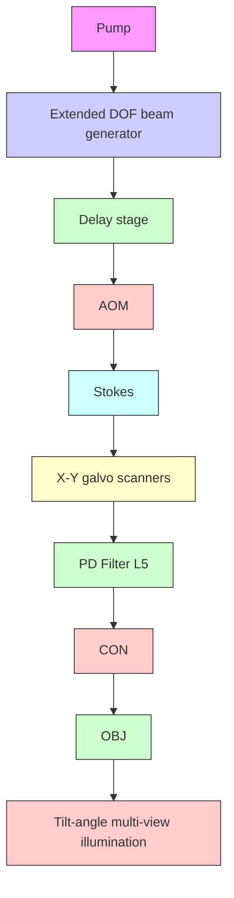
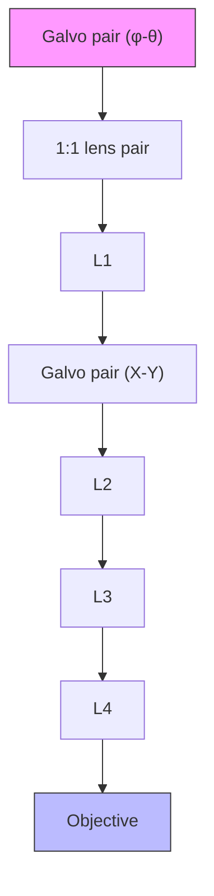

# Tilt-angle stimulated Raman projection tomography

PENG LIN,1 CHUAN LI,1 ANDRES FLORES-VALLE,2 ZIAN WANG,3 MENG ZHANG,1 RAN CHENG,4 AND JI-XIN CHENG1,3,4,5,\*

1Department of Electrical and Computer Engineering, Boston University, 8 St. Mary’s St., Boston, MA 02215, USA  
2Max Planck Institute for Neurobiology of Behavior–caesar (MPINB), Bonn, Germany, Bonn 53175, Germany  
3Department of Biomedical Engineering, Boston University, 44 Cummington Mall, Boston University, MA 02215, USA  
4Department of Chemistry, Boston University, 590 Commonwealth Ave, Boston University, Boston, MA 02215, USA  
5Photonics Center, Boston University, 8 St. Mary’s St., Boston, MA 02215, USA  
\*jxcheng@bu.edu

Abstract: Stimulated Raman projection tomography is a label-free volumetric chemical imaging technology allowing three-dimensional (3D) reconstruction of chemical distribution in a biological sample from the angle-dependent stimulated Raman scattering projection images. However, the projection image acquisition process requires rotating the sample contained in a capillary glass held by a complicated sample rotation stage, limiting the volumetric imaging speed, and inhibiting the study of living samples. Here, we report a tilt-angle stimulated Raman projection tomography (TSPRT) system which acquires angle-dependent projection images by utilizing tilt-angle beams to image the sample from different azimuth angles sequentially. The TSRPT system, which is free of sample rotation, enables rapid scanning of different views by a tailor-designed four-galvo-mirror scanning system. We present the design of the optical system, the theory, and calibration procedure for chemical tomographic reconstruction. 3D vibrational images of polystyrene beads and C. elegans are demonstrated in the C-H vibrational region.

© 2022 Optica Publishing Group under the terms of the Optica Open Access Publishing Agreement

## 1. Introduction

Providing quantitative and global measurement of a three-dimensional (3D) sample, volumetric optical imaging has shown great value in the studies of brain function [1], developmental biology [2], and cellular metabolites [3]. Various technologies such as optical projection tomography (OPT) [2], light-sheet microscopy [4], volumetric confocal [5] and multi-photon fluorescence microscopy [1] have been developed for rapid volumetric imaging. Nevertheless, these methods either lack chemical specificity or require exogenous fluorescence labels that may affect the metabolisms or functionalities of the organisms [6]. Light-sheet Raman microscopy allows label-free volumetric chemical imaging but suffers from long pixel acquisition time and autofluorescence background from the biological samples [7].

Stimulated Raman scattering (SRS) microscopy is a growing label-free chemical imaging modality that utilizes the optical frequency difference of the pump and Stokes beams to match a certain Raman transition to coherently boost the Raman signal level [8], offering high imaging speed up to the video rate [9]. SRS microscopy allows quantitative chemical mapping of a sample across a broad range of vibrational bonds in C-H, fingerprint regions and silent regions [10,11]. Volumetric SRS microscopy has been developed to allow chemical imaging of 3D structures such as organisms and tissues. Utilizing a piezo objective positioner to scan the laser foci across different depths, Li et al. demonstrated 3D chemical histology of tissue-clearing brain, liver, and kidney tissues [12] and Wei et al. reveals the complex 3D structures and chemical compositions in brain tumor tissues [13]. Employing a remote-focusing scheme with a deformable mirror for focal scan, Lin et al. showcased the monitoring of topical chemical penetration in human sweat pores [14]. The strategy of axially focal scanning has the advantage of good sectioning capability. However, it is inevitably time-consuming to scan a large volumetric sample. A new strategy is to perform projection imaging that integrates the signals along the axial direction; thus, a single lateral scan obtains integrated signals across the volume, significantly reducing the volumetric imaging time. Given that SRS process is automatically phase-matched and follows the Beer-Lambert law, the SRS signal is linearly proportional to molecular concentrations and can be integrated over the depth-of-focus (DOF) of the foci [8].

As widely used in X-ray computed tomography and OPT, tomographic reconstruction is a promising approach to recover the axial details from SRS projection images. Applying an inverse Radon transform of a series of angle-dependent projections of a sample can reconstruct a 3D volume. Chen et al. recently developed stimulated Raman projection tomography to reconstruct 3D chemical images of cells and polymer beads [15]. By rotating the sample, this method offers isotropic sub-micron spatial resolution. Yet, to acquire the projection images from different angles, the experiment requires inserting a sample into a capillary glass tube held by a specially designed sample holder and rotating the tube with a motorized rotation stage. The cumbersome sample preparation and experimental procedure limits the imaging speed and prevent applications to image dynamic or living samples.

To address the above-mentioned challenges, we report here a sample-rotation-free, tilt-anglebeam stimulated Raman projection tomography (TSRPT) that uses a few perspective views for 3D reconstruction, showcasing a new way for high-speed volumetric chemical imaging. TSRPT obtains an angle-dependent projection image using tilted pump and Stokes beams that have an angle with respect to the optical axis of the objective lens. The tilt-angle beams with extended DOF are generated by reducing the incident beams’ spot size at the back pupil plane of the objective lens and by offsetting the beams towards the periphery of the back pupil plane. To record different projections with different tilted angles at high speed, we developed a four-galvo-mirror scanning system allowing the beams to laterally scan a sample with an arbitrary tilt angle and projection angle. We applied a vector-field-based back-projection algorithm originally demonstrated in [16] to reconstruct 3D information from a series of angle-dependent projection images. The algorithm uses a prior calibration of the setup where a 3D image stack of polystyrene beads is imaged for each tilted-angle beam. This calibration is required to measure the titled angle of the beam for any position of the field of view (FOV) and for each projection. Then the algorithm reconstructs 3D samples by projecting each projection of the sample along the beam direction in 3D, calculated from the calibration. In the following sections, we present the principle and instrumentation of TSRPT, including the generations of elongated beams and tilted-angle beams, the calibration procedure, and the reconstruction algorithm. Volumetric chemical imaging of polystyrene beads and C. elegans by TSRPT is demonstrated.

## 2. Theory

TSRPT utilizes the angle-dependent SRS projection images to reconstruct volumetric distribution of chemical species inside a sample. Back-projection (i.e., inverse Radon transform) is a commonly used algorithm in the X-ray computed tomographic reconstructions [17] where the key step is to smear back the projection images of the sample to the reconstruction space. In the conventional parallel beam tomography, the illumination beam is rotated with reference to the sample on the same horizontal plane (Fig. 1(a)). The rotation trajectory is a semicircle which simplifies the reconstruction procedure such that one can implement a series of 1D line inverse Radon transform in each sectioning plane to construct the final 3D volume. The maximum range of rotation angle is 180° since the nature of symmetric projection trajectory provides the same projection information if  goes over $1 8 0 ^ { \circ } .$ . On the other hand, in tilt-angle tomography (Fig. 1(b)), the rotation of the tilt-angle beam which has an inner angle with respect to the Z axis forms a cone-shape trajectory leading to two unique properties. First, the projection information obtained from two opposite projection directions (e.g., $\theta = 0 ^ { \circ }$ and $1 8 0 ^ { \circ } )$ is no longer the same. θSecond, the inverse Radon transform needs to follow the 3D beam propagation vectors $( \pmb { \nu } \in \mathbb { R } ^ { 3 } )$ to smear back the projection images. Also, the beam vectors representing each projection frame are no longer parallel to any cartesian axis. Therefore, a theory to model the forward projection and back-projection problems of TSRPT is required.

(a)  

text_image

Parallel beam projection
Z
Y
θ
Beam
X

(b)

Tilt-angle beam projection  

text_image

Z
Y
X
φ

(c)  

flowchart

Fig. 1. Concept of TSRPT. (a) Illustration of conventional parallel beam projection (b) illustration of tilt-angle beam projection (c) Simulation of the projection and reconstruction processes. The arrows colored in blue, yellow, red and pupil indicate the projection from = 0°, 90°, $1 8 0 ^ { \circ }$ and $2 7 0 ^ { \circ }$ , respectively. All 4 projections have a tilt angle $\varnothing = 3 0 ^ { \circ }$ .

In the simulation where the pump and Stokes beams propagate along Z axis, SRS projection signals are modeled as the integral of collinear pump and Stokes beams interacting with a Raman-active sample [15].

$$
I _ {S R P} = C _ {0} \iint I m (\chi^ {3} (\boldsymbol {r}, z)) I _ {P} (\boldsymbol {r}, z) I _ {S} (\boldsymbol {r}, z) d r d z \tag {1}
$$

where r represents the position in x-y plane; $\mathrm { I _ { p } ( r , z ) }$ and $\mathrm { I _ { s } ( r , z ) }$ are the intensities of the pump and Stokes beams, respectively; $\mathrm { C } _ { 0 }$ is a constant; Im $( \chi ^ { ( 3 ) } \left( r , z \right) )$ is the imaginary part of the third-order nonlinear susceptibility $\chi ^ { ( 3 ) }$ of the sample. When both pump and Stokes intensities are spatially overlapped with the sample’s nonlinear susceptibility, SRS signal is generated.

Next, we extended the model and assumed the collinear pump and Stokes beam propagate along any arbitrary direction to illuminate the sample. The overlapped length of the pump and Stokes’ foci is L. Thus, we can treat the 2 beams as 1 finite combined beam that has a normalized 3D vector $( \hat { \pmb { \nu } } _ { \mathrm { P S } } )$ originated from the center $\mathbf { \Pi } ( \mathbf { r } _ { \mathrm { { C } } } )$ of the effective beam length L. Any point within L is described as $\mathbf { r } _ { \mathrm { { C } } } + \mathbf { t } \cdot { \hat { \pmb { \nu } } } _ { P \cdot S }$ where t is a parameter that is associated with discretization of the beam. The range of the parameter t is [-L/2, L/2]. Using cartesian coordinate, a projection view of a titled-angle SRS illumination is expressed as:

$$
I _ {T S R P} (x, y) = C _ {0} \int_ {- L / 2} ^ {L / 2} I m (\chi^ {3} (x, y, z)) I _ {P. S} (\mathbf {r} c (x, y, z) + t \cdot \hat {\nu} _ {p. s} (x, y, z)) d t \tag {2}
$$

For multiple view SRS projections, we obtain a series of SRS projection images, $I _ { T S R P } ^ { i } \left( x , y \right)$ . Next, we apply inverse Radon transform to each projection image. The summation of these back-projected images in the 3D reconstruction space reveals the volumetric information of the sample.

$$
R (x, y, t) = \sum_ {i} [ \mathbb {R} ^ {(- 1)} I _ {T S R P} ^ {i} ] (x, y, t) \tag {3}
$$

where t is discretized parameters in back-projection. $\mathbb { R } ^ { ( - 1 ) }$ is the symbol representing the inverse Radon transform process.

Next, we validated the theory by simulation. In Fig. 1(c), a simulated phantom contains a few polymer beads in a 3D space. We simulated that the illumination beam with a tilt angle of $3 0 ^ { \circ }$ with respect to the optical axis sequentially image the phantom from the projection angle $\theta = 0 ^ { \circ }$ , 90°, 180° and $2 7 0 ^ { \circ }$ θto obtain 4 projection images. The projection images show that that the beads have different relative distances between each other in different views, which are the essential information for 3D reconstruction. Following the beam vectors of different views, we smear back the projection images to the simulation space. We can see that the intersections of the different back projections show higher signal level and the morphology of the beads. Next, we applied a threshold to remove the signals where the 4 views do not intersect in the 3D space.

## 3. Experimental methods

## 3.1. Tilt-angle-beam stimulated Raman projection tomography (TSRPT) system

To realize tilt-angle illumination in a standard SRS microscope, we started by engineering the beam geometry in a high numerical aperture (NA) objective. When the incident beam has a lateral displacement (d) from the optical axis at the objective’s pupil, the exit beam after the objective has an interior angle (∅) with respect to the optical axis. Then, by changing the incident beam’s position along a circumference at the pupil, the exit beam will rotate with respect to the optical axis leading to projection angle .

With the above-mentioned principle, we developed a TSRPT setup (Fig. 2(a)) containing 4 parts. The first part is a typical pump and Stokes path for enabling frequency modulation, beam combination and intra-pulse delay adjustment. The pump and Stokes beams are generated by a dual-output ultrafast laser (InSight DeepSee, Spectral Physics, USA). The Stokes beam is fixed at 1040 nm and the pump is tunable from 680 nm to 1100 nm. The Stokes beam is modulated by an acousto optical modulator (AOM). The two beams are combined by a dichroic mirror. A delay stage is installed on the Stokes path to ensure the two pulses are temporally overlapped in the sample. For spectroscopic SRS imaging, three and one 12.7-cm SF57 glass rods are installed in the common path and the Stokes path, respectively.

The second part is for the generation of extended DOF beams on the common path. Here, we employed a 4-f system to reduce the beam diameter which equivalently reduces the effective NA of the objective lens (1.05NA, XLPlan N 25X, Olympus, Japan). We named the elongated beams as low-NA beams. Another option of an extended DOF beam is a Bessel beam [15], which produces larger DOF in a given NA but sacrifices focusing efficiency due to the presence of side lobes.

The third part is the scanning system for $\varnothing - \theta$ and X−Y scanning. Realizing $\varnothing - \theta$ adjustment requires controlling the incident beam’s position at the objective’s pupil plane. The solutions may be a wedge prism pair rotated by a rotation motor [18] or simply adjusting two pairs of mirrors to create displacement [19]. Yet, they have slow speed and no convenience. Here, we developed a four-galvo-mirror scanning system that allows high-speed arbitrary X−Y and $\varnothing - \theta$ scanning. In our design, the X−Y galvo mirror pair is conjugated with the objective’s pupil plane and the ∅ −  galvo-mirror pair is conjugated with the objective’s focal plane. The beam angle exiting the $\varnothing - \theta$ galvo-mirror pair is relayed to the objective’s focal plane and also changes the beam incident position at the pupil plane. We modeled the entire beam scanning system by ZEMAX ray-tracing software (Fig. 2) to ensure that the beam displacement at the X-Y galvo mirror pair is not out of the mirror surfaces. Also, we investigated whether the tilted beams at different views (e.g., $\theta = 0 ^ { \circ }$ , $9 0 ^ { \circ }$ , 180◦, 270◦) intersect at the same point after focusing by the objective. We found that our initial design (Fig. 3(a)) introduces an inevitable mismatch of 4 tilted beams foci at the objective’s focal plane (Fig. 3(b). This mismatch may lead to the mismatch of different projection views. We attributed this issue to the imperfect conjugation of the $\varnothing - \theta$ galvo-mirror-pair with the objective’s focal plane due to the separation distance of the two $\varnothing - \theta$ galvo mirrors. To improve the conjugation, we separated the two $\varnothing - \theta$ galvo mirrors θ θand connected them by a finite conjugated 1:1 matched achromatic lens pair (MAP051919-B, Thorlabs) which is compact and suitable to relay a focal point from its front focal plane to its back focal plane (Fig. 3(c)). The improved result (Fig. 3(d)) shows that the four beams can intersect at the center of the objective’s focal plane.

(a)  

flowchart

Fig. 2. Experimental setup. (a) Schematic. AOM: acousto optical modulator; DM: dichroic mirror; L: lens; OBJ: objective; CON: condenser; PD: photodiode. (b) Ray-tracing simulation of the tilt-angle beams focused by the objective. The beam colored with yellow, blue, purple, and red represent the incident beam from the azimuth angles of $0 ^ { \circ } , 9 0 ^ { \circ }$ , 180 θ° and 270 °, respectively. The angle  indicates the tilt angle of the beam with respect to the optical axis of the objective. The right inset is an enlarged image of the focal spots on the focal plane indicating that the four tilt-angle beams intersect at the same point in ray-tracing simulation. Scale bar: 4 nm.

The fourth part contains SRS signal collection, detection, and demodulation. The specimen is placed at the focal plane of the objective and held by a 3D manually translational stage. After tilt-angle illumination, a high NA (=1.4) condenser (U-AAC, Olympus, Japan) is used to collect the light. In the experiments, we found that insufficient collection of light produces strong cross-phase-modulation (XPM) background in different tilted views because the signals from the leaked light induced by XPM are not differentiable with SRS signals [19]. After condenser, a $\mathrm { f } = 1 0 0$ mm lens is used to focus the light to a home-built photodiode. The area of the silicon photodiode chip (S3994-01, Hamamatsu) is $1 . 4 \mathrm { ~ x ~ } 1 . 4 \mathrm { c m } ^ { 2 }$ to ensure that the light can be well-collected at different projection angles. A short-pass optical filter is placed before the photodiode to block Stokes light. The modulated pump signal is then demodulated by a lock-in amplifier (MFLI, Zurich Instruments, Switzerland) and acquired by data acquisition card.

(a)  

text_image

Galvo pair
(X-Y)
L1
L2
L3
Galvo pair
(φ-θ)
L4

(b)

- galvo mirror without separation  

scatterplot

| Scale (Millimeters) | Point Color | Shape     |
|----------------------|-------------|-----------|
| 0.0086               | Red Triangle | Circle    |
| 0.0086               | Yellow Circle | Circle    |
| 0.0086               | Purple Square | Circle   |
| 0.0086               | Blue Diamond | Circle   |

(c)  

flowchart

text_image

φ-θ galvo mirror with separation
Scale: 0.0086 Millimeters
Scale: 0.0086 Millimeters

Fig. 3. Ray tracing simulation of two different designs of TSRPT setups. (a) The ∅ − galvo mirror pair is not separated and (b) the focal spots from 4 different views on the objective’s focal plane. (c) The ∅ −  galvo mirror is separated by a 1:1 matched achromatic lens pair and (d) the focal spots from 4 different views on the objective’s focal plane.

## 3.2. Characterization of elongated and titled beams

We characterized the intensity profile of the elongated and tilted focus and measured the beam propagation vectors for accurate reconstruction. Instead of using a camera to directly image the beams’ point spread function (PSF) where the camera coordinates also affect the measurement of the beam vectors, we employed a single-pixel scanning imaging approach by imaging a nano-gold particle. The nanogold particles are ∼30 nm yield transient absorption signals as illuminated by a probe beam at 790 nm and a pump beam at 1040 nm wavelength. The power of probe and pump are both 5 mW measured before the objective. The pixel dwell time is 10 µs. Through sequentially imaging a nanogold particle at different Z moved by a motorized translational stage with 0.5-µm interval, a PSF-like pump-probe intensity profile is obtained. Figure 4(a) shows the pump-probe PSF measured by filling different diameter of the incident beams at the pupil plane. The original beam diameter before the beam reducer is 2 mm. The top figure in Fig. 4(a) is the focus produced by expanding the beam by 3 times. The full-width-at-half-maximum (FHWM) in the axial direction is 5 µm offering the good sectioning capability. The second row is the focus with ∼15 µm axial FWHM produced by the original beam size. The foci in the third and fourth row are produced by reducing the beam diameter by 2 and 3 times, respectively. The axial FWHM are extended to ∼30 and ∼40 µm.

Figure 4(b) shows the generation of tilted angle focus. Through controlling the ∅−θ galvo mirror pair to produce a lateral displacement, d, from the center of the pupil plane, the focus has a tilt angle with respect to the optical axis. The tilt angle, θ, increases as the d value becomes larger. From the top to bottom in Fig. 4(b), the tilt angles are 4◦, 8◦, 11◦ and $1 6 ^ { \circ }$ . Approximating the objective as a thin lens, the maximum titled angle can be estimated as $\theta _ { \mathrm { { m a x } } } = \mathrm { { s i n } } ^ { - 1 } ( N A / n )$ . Experimentally, we aim to realize θ as large as possible to obtain high angular information. However, we noticed that when θ is over 20◦, the pump-probe signal of the focus becomes weak. We attributed the issue to the internal objective design and its optical aberrations and the small motion of the beam spots at the objective pupil plane when conducting X-Y scanning. Figure 4(c) shows the measurement of the tilt beams at $\theta = 0 ^ { \circ }$ , 90◦, 180◦ and 270◦. The maximum intensity at each Z plane is located and form the trajectories of beam propagations. Using principal component analysis (PCA) fitting, the beam vectors can be defined to describe the major propagation direction of a beam [18]. We noticed that the fitted beam vectors of 4 tilted beams still do not intersect to the same point leading to FOV mismatch of different views. Also, the centroid of 4 tilted PSFs are not always on the same Z at different positions across FOVs. These issues collectively affect the performance of back-projection reconstruction, since there would be a mismatch in the overlapping of the back-projections (Fig. 1(c)). This issue may be caused by the imperfect alignment and aberrations of the optical system. Similar issues were also encountered in the previous Ref. [16]. Therefore, an appropriate calibration of different views is essential to allow accurate reconstruction.

(a)  

(b)  

(c)  

scatterplot

| X axis (μm) | Y axis (μm) | Z axis (μm) |
|-------------|-------------|-------------|
| 10          | 20          | 0           |
| 20          | 15          | -10         |
| 30          | 10          | -20         |
| 40          | 5           | -30         |

Fig. 4. Generation of extended DOF and tilted beams. (a) The beam foci produced by filling different size of beam spot at the back aperture of the objective. The left-handed sketches illustrate a relative size of the beam spot versus the objective’s pupil plane (b) The titled angle beam generated by offsetting the beam incident position at the pupil plane. (c) Fitting of the tilted-angle beams visualized in 3D space. The datapoints in the graph are maximum intensity positions in each Z plane of a focus. The green points represent the focus produced by the incident beam from the center of the pupil plane. The yellow, red, blue and purple points are the foci at $\phi = { \sim } 1 6 ^ { \circ }$ with $\theta = 0 ^ { \circ }$ , 90◦, 180◦, and 270◦, respectively.

## 3.3. Measurement and calibration of beam vector fields

In reconstruction, implementing inverse Radon transform (Eq. (3)) has to follow the beam vectors assumed in the forward model (Eq. (2)) to smear back the projection images to the 3D reconstruction space. The intersected region of different back-projection views forms the reconstructed objects. Therefore, in each view, we need to measure the real beam vector $\hat { \nu } _ { P \cdot S }$ and found its beam centers $\mathbf { r } _ { \mathrm { { C } . } }$ However, in experiments, we found that $\hat { \nu } _ { P \cdot S }$ and $\mathbf { r } _ { \mathrm { { C } } }$ have small changes at different positions across the FOV, indicating that a single $\hat { \nu } _ { P \cdot S }$ value cannot represent all of the beam vectors emitted from a projection view. To address the issue, we measured vector field that gives $\hat { \nu } _ { P \cdot S }$ and $\mathbf { r } _ { \mathrm { { C } } }$ on each position within the FOV. Mapping the vector field on each pixel seems not practical. Here, we use a linear regression approach [16] to estimate and construct a vector field that represent the 3D vectors across the FOV. We made a phantom of 3-µm PS beads dispersed in 0.2% agarose gel sandwiched by two cover glasses. We imaged the

3D phantom by moving the sample with a 1-µm interval at different Z at 4 different projection angles. These bead images visualized in Fig. 5(a) show the PSF-like SRS intensity profiles in the cubes. Next, the bead profiles were thresholded and labeled (Fig. 5(b)). Then, we applied PCA fitting to each bead’s intensity profile and found the maxima component which represents the beam propagation vector. The beam vectors obtained from the beads are discrete. We then applied a linear regression and interpolated the beam vectors and beam centers at each pixel in the image to construct the vector fields. The visualization of the 4 vector fields are shown in Fig. 5(c).

(a)  
3D SRS image of PS beads  
  
(b)  
Segment beads and localize the bead centroids

(c)  
  
Construct beam vector fields

Tilted view 1 (θ =0)  

Tilted view 2 (θ = 90°)  

Tilted view 3 (θ = 180°)  

Tilted view 4 (θ = 270°)  

  
Fig. 5. Beam vector measurement and calibration procedures of 4 projection views at $\theta = 0 ^ { \circ }$ , 90°, 180° and 270°. The tilt angle is 16◦. (a) The raw 3D images of PS beads obtained by piezo Z scanning. (b) Segmentation of the bead images. (c) Visualizations of the vector fields in each views.

## 4. Imaging results

## 4.1. Volumetric chemical imaging of polystyrene beads

We experimentally demonstrated reconstruction of 3-µm polystyrene (PS) beads from tilt-angle projection images (Fig. 6). We imaged the 3-µm PS beads dispersed in 0.5% agarose gel sandwiched by cover glasses with a double-sided tape (Cat.3136, 3M). The laser power of pump and Stokes beams are 10 mW and 250 mW before the objective. The pixel dwell time is 10 µs. Figure 6(a) shows the projection images at different views. We can see that the relative distances between beads vary at different views which are the essential angular dependent information to retrieve their relative depth relationship. Apply the reconstruction algorithm, Fig. 6(a) shows the reconstructed images. In the X-Z and Y-Z projection views, that beads at different Z can be differentiated which is not possible in a single projection view. The Z dimension of the reconstructed view is about 30 µm which is related of the FWHM of the SRS beam length.

## 4.2. Volumetric chemical imaging of wild-type Caenorhabditis elegans

Caenorhabditis elegans is a common animal model for drug testing and study of metabolic activities. Tuning the pump laser to 798 nm and Stokes at 1040 nm focused at $2 9 1 6 \mathrm { c m } ^ { - 1 }$ , the C-H vibration signals can be detected. We recorded 4 projections from different projection angles as shown in Fig. 7(a). The pixel dwell time is 10 µs. Figure 7(b) shows the reconstructed 3D image of the C. elegans. At different depths, we can see that the lipid droplets are distributed differently. The ground truth, sectioned SRS images obtained by high-NA foci, is shown in Fig. 7(c) for comparison.

(a)  

natural_image

Microscopic image showing scattered red fluorescent spots on a dark background, labeled with angle θ = 0° (no other text or symbols)

natural_image

Microscopic image showing scattered red fluorescent spots on a dark background, with no visible text or symbols.

(b)  

text_image

15 µm
X-Y
-15 µm
10 µm
Z-X
X-Z

natural_image

Microscopic image showing scattered red fluorescent spots on a dark background, with no visible text or symbols.

natural_image

Microscopic image showing scattered red fluorescent spots on a dark background, with scale bar indicating 10 μm (no text or symbols present)

Fig. 6. Tomographic reconstruction from tilt-angle SRS projection images of PS beads. (a) The SRS projection images at $\theta = 0 ^ { \circ } , 9 0 ^ { \circ } , 1 8 0 ^ { \circ }$ , and $2 7 0 ^ { \circ }$ . The projection is $1 6 ^ { \circ }$ . (b) θ ϕReconstructed images visualized at X-Y, X-Z, Y-Z projection views. The depth color-coded bar using different colors to represent depth from -15 to 15 µm.

## 4.3. Simulated reconstruction performance of different tilt angles and number of projection views

The reconstructed images show image elongation at Z direction. We investigated the elongation effect in simulation by considering different . We also investigated the reconstruction performance when using more numbers of projections. Figure $\mathrm { 8 ( a ) }$ shows the ground truth images of a phantom in $\mathrm { X - Y , X - Z , }$ and $\mathbf { Y - Z }$ projection views. The beads diameters are the same as Fig. 1(c) range from 0.8 to $2 \mu \mathrm { m }$ . The second to fourth row show the reconstruction of when the projections are of $\varnothing = 5 ^ { \circ } , 1 5 ^ { \circ }$ , and $3 0 ^ { \circ }$ . We can see that when the tilt angle is larger, the enlongation effect is mitigated. The enlogation effect is further investgated in Fig. 8(b). We simulated the reconsturction of a 1-µm PS bead with a tilt angle from $5 ^ { \circ }$ to $9 0 ^ { \circ }$ . We defined an axial enlogation factor $\left( \mathrm { e } _ { \mathrm { z } } \right)$ which is the FWHM of the axial intensity profile across the center of the reconstrued bead divided by the ground truth. We see that the elongation factor reduces to 1 when the tilt angle is close to $9 0 ^ { \circ }$ which becomes a conventional parallel beam geometry. Next, we investigated the performance of the reconstruction results. We used Pearson correlation coefficient [20] to evaluate the similarity of reconstructed objects with the ground truth at each pixel. The results show the when the tilt angle is small $( \mathrm { i } . \mathrm { e } . , 5 ^ { \circ }$ and $1 5 ^ { \circ } )$ ), increasing the number of projection images more than 4 do not obviously improve the reconstruction fidelity. However, when the tilt angle is larger $( \mathrm { i . e . , ~ } 3 0 ^ { \circ }$ and $4 5 ^ { \circ } )$ , increasing the number of projection images benefits the reconstruction fidelity.

(a)  
Projection images  

(b  

natural_image

3D surface plot of a rectangular prism with labeled axes (X, Y, Z) and a color gradient from dark red to orange, with a 3D coordinate axis indicator (x, y, z) shown in the corner.

(c)  
High-NA High-NA  

  
Fig. 7. TSRPT imaging of a wild-type C. elegan at C-H vibrational region. (a) The raw projection images at $\theta = 0 ^ { \circ }$ , 90◦, 180◦, and 270◦. (b) The reconstructed images. The left θbox shows the project views at X-Y, X-Z and Y-Z. The sectioning images at $Z = - 5 , 0 ,$ and 5 µm. (c) The sectioned SRS images obtained by high-NA foci.

(a)  

text_image

Ground truth
Reconstruction
from 4 projections
φ = 5°
φ = 15°
φ = 30°

(b)  

line chart

| Tilt angle φ (degree) | Axial elongation factor (e₂) |
| --------------------- | ---------------------------- |
| 0                     | 6.0                          |
| 15                    | 5.5                          |
| 30                    | 3.0                          |
| 45                    | 2.0                          |
| 60                    | 1.5                          |
| 90                    | 1.0                          |

(c)

line chart

| Number of projections | φ=5°  | φ=15° | φ=30° | φ=45° |
| --------------------- | ----- | ----- | ----- | ----- |
| 2                     | 0.31  | 0.34  | 0.36  | 0.36  |
| 4                     | 0.32  | 0.42  | 0.46  | 0.48  |
| 6                     | 0.32  | 0.44  | 0.46  | 0.48  |
| 8                     | 0.32  | 0.44  | 0.49  | 0.52  |
| 12                    | 0.32  | 0.45  | 0.51  | 0.55  |

Fig. 8. Simulated reconstruction with different projection ∅ and number of projections. (a) The reconstrued phantoms on X-Y, X-Z and Y-Z projection views with $\varnothing = 5 ^ { \circ } ,$ 15◦, and 30◦ reconstructed from 4 projection views (i.e., $\theta = 0 ^ { \circ }$ , 90◦, 180◦, and 270◦). (b) The axial θelongation factor of the reconstructed images at different tilt angle respect to the ground truth. (c) The correlation of reconstructed images with respect to the ground truth with different numbers of projections.

## 5. Discussion

We reported a proof-of-concept TSRPT system that employs tilted collinear pump and Stokes beams to acquire angle-dependent SRS projection images of a sample to reconstruct its volumetric chemical information. The TSRPT system relieves the cumbersome and slow sample rotation process in a conventional sample-rotation-based SRS tomography. We developed a four-galvomirror scanning system to allow rapid scanning of different projection views with small mismatch of different projection views. The theory for TSRPT reconstruction and the calibration procedure of the beam vector fields are presented. Utilizing TSRPT, we demonstrated volumetric chemical imaging of polystyrene beads in the C-H vibrational region.

The reported TSRPT holds several advantages compared with axial-scanning strategy with a piezo objective positioner. First, since TSRPT requires 4 or a few frames for 3D reconstruction and do not need an objective positioner to axially scan foci, it can have faster imaging speed compared with sequentially axially scanning sample at each layer. TSRPT allows depth scanning without moving the samples or objective. This features the same advantages of a remote-focusing volumetric imaging scheme where no disturbance is introduced while imaging in vivo samples [14]. Third, employing loosely focused beams mitigates photon damage and allows to use more laser power to boost the SRS signal level.

The current TSRPT imaging is constrained by the output laser power resulting in lower signal to noise ratio as increasing the DOF of the beams. With increased laser power in the future, we expect that both imaging volume and imaging speed can be further improved. The current tomographic reconstruction is based on a back projection algorithm for the proof-of-concept purpose. It is promising to adapt an iterative reconstruction [21] or deep learning-based algorithm [22] that have been demonstrated in parallel beam geometry for improved reconstruction performance with a sparse projection views.

The axial elongation of the reconstructed objects is an issue caused by limited projection angles of the objective lens. The tilt angle may be improved by adapting a parabolic mirror geometry. Employing a deep learning approach is also promising to correct the elongation effect [23]. The imaging depths of TSRPT are limited by light scattering of samples and power attenuation as seen in typical SRS microscopes [24]. Combining with advanced tissue clearance techniques can improve the imaging depth [13].

TSRPT can be used to study the metabolic activities and neuron functionalities as it provides high speed and label-free imaging capability. Another potential application of the TSRPT is to enable label-free SRS tomographic flow cytometry. The current SRS flow cytometry employing tight foci only examines a portion of the cells [25]. TSRPT can acquire the volumetric information of the cells for rapid measurement and screening.

Funding. National Science Foundation (CHE-1807106); National Institutes of Health (R35 GM136223).

Acknowledgments. We thanked the helpful discussion with Dr. Xueli Chen and Huiyuan Wang of Xidian University for tomographic reconstruction approaches.

Disclosures. The authors declare that they have no conflict of interest.

Data availability. Data underlying the results presented in this paper are not publicly available at this time but maybe obtained from the authors upon reasonable request.

## References

1. J. Wu, N. Ji, and K. K. Tsia, “Speed scaling in multiphoton fluorescence microscopy,” Nat. Photonics 15(11), 800–812 (2021).  
2. J. Sharpe, U. Ahlgren, P. Perry, B. Hill, A. Ross, J. Hecksher-Sørensen, R. Baldock, and D. Davidson, “Optical projection tomography as a tool for 3D microscopy and gene expression studies,” Science 296(5567), 541–545 (2002).  
3. C. Kallepitis, M. S. Bergholt, M. M. Mazo, V. Leonardo, S. C. Skaalure, S. A. Maynard, and M. M. Stevens, “Quantitative volumetric Raman imaging of three dimensional cell cultures,” Nat. Commun. 8(1), 14843 (2017).  
4. A. K. Glaser, K. W. Bishop, L. A. Barner, E. A. Susaki, S. I. Kubota, G. Gao, R. B. Serafin, P. Balaram, E. Turschak, and P. R. Nicovich, “A hybrid open-top light-sheet microscope for versatile multi-scale imaging of cleared tissues,” Nat. Methods 19(5), 613–619 (2022).  
5. A. Badon, S. Bensussen, H. J. Gritton, M. R. Awal, C. V. Gabel, X. Han, and J. Mertz, “Video-rate large-scale imaging with Multi-Z confocal microscopy,” Optica 6(4), 389–395 (2019).  
6. E. C. Jensen, “Use of Fluorescent Probes: Their Effect on Cell Biology and Limitations,” Anat Rec 295(12), 2031–2036 (2012).  
7. W. Müller, M. Kielhorn, M. Schmitt, J. Popp, and R. Heintzmann, “Light sheet Raman micro-spectroscopy,” Optica 3(4), 452–457 (2016).  
8. C. Zhang, D. Zhang, and J. X. Cheng, “Coherent Raman Scattering Microscopy in Biology and Medicine,” Annu. Rev. Biomed. Eng. 17(1), 415–445 (2015).  
9. B. G. Saar, C. W. Freudiger, J. Reichman, C. M. Stanley, G. R. Holtom, and X. S. Xie, “Video-rate molecular imaging in vivo with stimulated Raman scattering,” Science 330(6009), 1368–1370 (2010).  
10. F. Hu, L. Shi, and W. Min, “Biological imaging of chemical bonds by stimulated Raman scattering microscopy,” Nat. Methods 16(9), 830–842 (2019).  
11. Stimulated Raman Scattering Microscopy: Techniques and Applications (Elsevier, 2022).  
12. J. Li, P. Lin, Y. Tan, and J. X. Cheng, “Volumetric stimulated Raman scattering imaging of cleared tissues towards three-dimensional chemical histopathology,” Biomed. Opt. Express 10(8), 4329–4339 (2019).  
13. M. Wei, L. Shi, Y. Shen, Z. Zhao, A. Guzman, L. J. Kaufman, L. Wei, and W. Min, “Volumetric chemical imaging by clearing-enhanced stimulated Raman scattering microscopy,” Proc. Natl. Acad. Sci. U.S.A. 116(14), 6608–6617 (2019).  
14. P. Lin, H. Ni, H. Li, N. A. Vickers, Y. Tan, R. Gong, T. Bifano, and J.-X. Cheng, “Volumetric chemical imaging in vivo by a remote-focusing stimulated Raman scattering microscope,” Opt. Express 28(20), 30210–30221 (2020).  
15. X. Chen, C. Zhang, P. Lin, K.-C. Huang, J. Liang, J. Tian, and J.-X. Cheng, “Volumetric chemical imaging by stimulated Raman projection microscopy and tomography,” Nat. Commun. 8(1), 15117 (2017).  
16. A. F. Valle and J. D. Seelig, “Two-photon Bessel beam tomography for fast volume imaging,” Opt. Express 27(9), 12147–12162 (2019).  
17. G. L. Zeng, Medical image reconstruction: a conceptual tutorial (Springer, 2010).  
18. A. Li, Z. Zhao, X. Liu, and Z. Deng, “Risley-prism-based tracking model for fast locating a target using imaging feedback,” Opt. Express 28(4), 5378–5392 (2020).  
19. D. Zhang, M. N. Slipchenko, D. E. Leaird, A. M. Weiner, and J.-X. Cheng, “Spectrally modulated stimulated Raman scattering imaging with an angle-to-wavelength pulse shaper,” Opt. Express 21(11), 13864–13874 (2013).  
20. V. V. Starovoytova, E. E. Eldarovab, and K. T. Iskakovb, “Comparative analysis of the SSIM index and the pearson coefficient as a criterion for image similarity,” EJMCA 8(1), 76–90 (2020).  
21. X. Chen, S. Zhu, H. Wang, C. Bao, D. Yang, C. Zhang, P. Lin, J.-X. Cheng, Y. Zhan, and J. Liang, “Accelerated stimulated Raman projection tomography by sparse reconstruction from sparse-view data,” IEEE Trans. Biomed. Eng. 67(5), 1293–1302 (2020).  
22. D. Yim, S. Lee, K. Nam, D. Lee, D. K. Kim, and J.-S. Kim, “Deep learning-based image reconstruction for few-view computed tomography,” Nucl. Instrum. Methods Phys. Res., Sect. A 1011, 165594 (2021).  
23. A. Matlock and L. Tian, “Physical model simulator-trained neural network for computational 3d phase imaging of multiple-scattering samples,” arXiv preprint arXiv:2103.15795 (2021).  
24. AH Hill, B Manifold, and D. Fu, “Tissue imaging depth limit of stimulated Raman scattering microscopy,” Biomed. Opt. Express 11(2), 762 (2020).  
25. Y. Suzuki, K. Kobayashi, Y. Wakisaka, D. Deng, S. Tanaka, C.-J. Huang, C. Lei, C.-W. Sun, H. Liu, and Y. Fujiwaki, “Label-free chemical imaging flow cytometry by high-speed multicolor stimulated Raman scattering,” Proc. Natl. Acad. Sci. U.S.A. 116(32), 15842–15848 (2019).