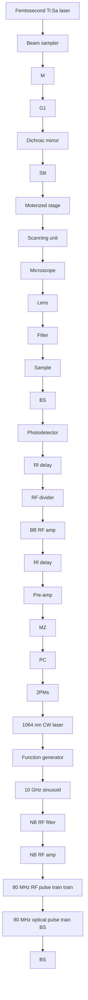

## FULL ARTICLE

# Time-lens based hyperspectral stimulated Raman scattering imaging and quantitative spectral analysis

Chris Xu\*; 1, and Ji-Xin Cheng\*; 2; 3

1 School of Applied and Engineering Physics, Cornell University, Ithaca, New York 14853, USA  
2 Weldon School of Biomedical Engineering, Purdue University, West Lafayette, IN, 47907, USA  
3 Department of Chemistry, Purdue University, West Lafayette, IN, 47907, USA

Received 7 January 2013, revised 3 June 2013, accepted 21 June 2013 Published online 11 July 2013

Key words: hyperspectral, stimulated Raman scattering, time-lens, multivariate curve resolution, nonlinear optical microscopy, pulse shaper

We demonstrate a hyperspectral stimulated Raman scattering (SRS) microscope through spectral-transformed excitation. The 1064 nm Stokes pulse was from a synchronized time-lens source, generated through time-domain phase modulation of a continuous wave (CW) laser. The tunable pump pulse was from linear spectral filtering of a femtosecond laser output with an intrapulse spectral scanning pulse shaper. By electronically modulating the time-lens source at 2.29 MHz, hyperspectral stimulated Raman loss (SRL) images were obtained on a laser-scanning microscope. Using this microscope, DMSO in aqueous solution with a concentration down to 28 mM could be detected at 2 ms time constant. Hyperspectral SRL images of prostate cancer cells were obtained. Multivariate curve resolution analysis was further applied to decompose the SRL images into concentration maps of CH and CH bonds. This method offers exciting potential in label-free imaging of live cells using fingerprint Raman bands.

natural_image

Fluorescent microscopy image showing green-labeled cellular structures against a dark background (no text or symbols)

natural_image

Microscopic image of a red-stained cell with visible nuclei (no text or symbols)

natural_image

Fluorescent microscopy image of a cell with red and green staining (no text or symbols)

line chart

| Raman shift (cm⁻¹) | CH₂ Int. (a.u.) | CH₃ Int. (a.u.) |
| ------------------ | --------------- | --------------- |
| 2800               | 0.1             | 0.0             |
| 2850               | 0.4             | 0.1             |
| 2900               | 0.6             | 0.2             |
| 2950               | 0.3             | 0.1             |

Hyperspectral SRS microscopy using a synchronized time-lens source allows mapping of different cellular contents.

## 1. Introduction

Coherent Raman Scattering (CRS) microscopy [1], with contrast from coherent anti-Stokes Raman scattering (CARS) [2, 3] or stimulated Raman scattering (SRS) [4], allows label-free imaging of biological samples with endogenous image contrast based on vibrational spectroscopy. SRS has superseded CARS as a contrast mechanism for microscopy, because it has no image artifacts from non-resonant background and its linear concentration dependence. SRS microscopy has found wide applications in imaging various biological and chemical samples from cellular level to tissues and organs [4–12]. So far most SRS imaging are performed in a single-frequency configuration, which uses pump and stokes pulses at fixed wavelengths to probe a specific vibrational bond. As a result, it is difficult for single frequency SRS imaging to resolve molecular species that have overlapping Raman bands. Another drawback of single frequency SRS imaging is the lack of spectral information. Several methods have been proposed to address these issues, including modulation multiplexing [9], spectrally tailored excitation-stimulated Raman scattering (STE-SRS) [13], multicolor SRS with grating-based spectrographic detection [14], rapid wavelength tuning [15], and hyperspectral SRS imaging [16, 17]. Multiplex or multicolor SRS simultaneously image a specimen at several distinct wavelengths. Hyperspectral SRS continuously scans the frequency of the excitation pulse to get a stack of spectrally resolved images.

To perform CRS imaging, two synchronized laser sources providing pump and Stokes fields are needed. For hyperspectral SRS imaging, typically one is a femtosecond source with broad bandwidth to cover the vibrational bandwidth of the target, while the other is a picosecond source with narrow bandwidth to get spectral resolution. A tunable bandpass filter, such as a slit in a pulse shaper [17] was used as a linear spectral filter which narrows the spectrum. Current solutions of the picosecond source is either from spectral filtering of a broadband source [17], which is highly inefficient in the use of available laser power and leads to limited power and reduced sensitivity, or high-cost, bulky mode-locked Titanium:Sapphire (Ti : S) lasers or optical parametric oscillators (OPOs) [16, 17].

Recently, Wang et al. demonstrated a new scheme for two-color, synchronized picosecond light sources for CRS imaging, based on a time-lens concept and its superb capability of being synchronized to any mode-locked lasers [18, 19]. Time-lens is a spectral transformation technique using time-domain phase modulation, which broadens the spectrum of a continuous wave (CW) laser for picosecond pulse generation. The radio frequency (RF) signal used to drive the phase modulators is derived from the mode-locked laser, which ensures synchronization. This technique also benefits from a robust all-fiber configuration and RF electronic tuning of the pulse delay for the temporal overlap between the two pulse trains. Critical to SRS imaging, the time-lens source is naturally compatible with intensity modulation. As a result, free-space modulators such as electro-optic or acousto-optic modulators are no longer needed. With time-lens source, CRS imaging up to video rate has been demonstrated [18]. However, current time-lens source suffers from low output power (160 mW after intensity modulation) due to the high insertion loss of the all-fiber compressor [18], which limits its application to CRS imaging. In addition, the use of fiber coupled intensity modulator for modulating the pulse train at several MHz for SRS imaging introduces additional insertion loss, system cost and complexity.

In this paper, we demonstrate hyperspectral SRS imaging, using a time-lens source synchronized to a femtosecond mode-locked Ti : S laser. We directly modulated the current of the CW laser diode (LD) in the time-lens source with a square wave at a few MHz for SRS imaging, which not only eliminated the need for intensity modulator but also vastly improved the extinction ratio (optical power ratio between the “on” and “off” state) because below threshold there was no lasing at all. A free-space transmission grating pair with high diffraction efficiency was used to compress the chirped pulse, which produced the modulated output power up to 400 mW. The tunable picosecond pump pulse was generated by pulse shaping of a femtosecond Ti : S laser through intra-pulse spectral scanning. With a pixel dwell time of 2 ms, our system is able to image dimethyl sulfoxide (DMSO) in aqueous solution at a concentration down to 28 mM. We also performed hyperspectral SRS imaging of PC3 cells. Multivariate curve resolution (MCR) method [17] was used to reconstruct a quantitative concentration image for each individual component, which clearly mapped the CH and CH contents in the cells.

## 2. Experimental

## 2.1 Hyperspectral SRS microscope

The experimental setup is shown in Figure 1. A mode-locked Ti : S laser (Chameleon APE, Coherent) delivered tunable pump pulse with a duration of 140 fs at 80 MHz. The modulated Stokes pulses were generated from a 1064 nm time-lens source [18]. The synchronization scheme is described in detail in Figure 1b: The GaAs photodetector (ET-4000 EOT) converts the 80 MHz femtosecond optical pulse train into an RF pulse train, which is then divided into two branches. One branch is amplified with broadband RF amplifiers (BB RF amp) to drive the Mach-Zehnder modulator (MZ, EOSPACE), which carves a synchronized 80 MHz optical pulse train out of a CW laser (QFBGLD-1060-30P, QPhotonics). Due to the limited bandwidth of the components, the intensity-modulated optical pulse has a pulse width of 70 ps. The other branch is filtered by a narrowband (NB) RF filter centered at 10 GHz (125th tone of the fundamental 80 MHz repetition rate) with a 3 dB bandwidth of 50 MHz. The resulting 10 GHz sinusoid is then amplified to drive the two EO phase modulators (2 PMs, EOSPACE) that form the time-lens. Two major improvements were made in this setup: First, the CW LD was directly modulated by a 2.29 MHz square wave generated from a function generator, which replaced the second intensity modulator in the original setup; second, a free-space transmission grating pair (G2, 1600 lines/mm) was used to compress the output from the power amplifier, which produced the modulated power up to 400 mW.

flowchart

Figure 1 (a) Schematic of the hyperspectral SRS microscope and (b) synchronization scheme. M: mirror, G: grating, PD: photodiode, BS: beam sampler, PC: polarization controller, preamp: fiber preamplifier.

For hyperspectral SRS imaging, we set up a pulse shaper for the Ti : S laser output with an automated slit (VA100, Thorlabs, Newton) in the Fourier plane. The slit was mounted on a motorized translation stage (T-LS28E, Zaber, Vancouver) to scan the wavelength of the spectrally filtered pump beam, i.e., “intra-pulse spectral scanning”. The pump and the Stokes beams were spatially combined with a dichroic, and sent into a laser scanning microscope (FV300 + IX71, Olympus). A 60X water immersion objective lens (UPlan-SApo, Olympus) with numerical aperture (NA) of 1.2 was used to focus the light into the sample. A second objective lens (60X LUMFI, Olympus) of NA 1.1 was used to collect the signal. Two 850/90 nm bandpass filters and a 900 nm short pass filter were used to remove the 1064 nm Stokes beam. The SRL signal was detected by a silicon photodiode (S3994-01, Hamamatsu) and extracted by a digital lock-in amplifier (HF2LI, Zurich Instrument) with a center frequency at 2.29 MHz [20], the gain settings for DMSO and cells were set to match the dynamic range of the acquisition card. The dwell time for each pixel was 2 ms for DMSO solutions and 4 ms for cells, i.e. 0.5 s and 1.0 s per frame per spectral point, respectively. The acquisition time for the entire stack was 30.2 s for 50 spectral points of DMSO imaging, and 52.2 s for 42 spectral points for cells. The power at sample was 72 mW for Stokes, 20 mW maximum for pump.

## 2.2 MCR analysis

The hyperspectral SRS stacks were imported to Matlab (MathWorks, Natick) using ImageJ (National Institutes of Health) as spectra arrays of all the pixels for MCR analysis. The concentration matrix and spectra of each component were then retrieved by MCR-ALS toolbox. Non-negative concentration and spectrum were set as constraints, and 0.01% was set as the convergence. The corresponding images were then reconstructed with Matlab and ImageJ.

## 2.3 Specimen preparation

A droplet of DMSO (Sigma-Aldrich) aqueous solution with different molar concentration (14 M, 1.4 M, 0.14 M, and 0.028 M) was sealed between two cover glasses and imaged immediately. Prostate cancer cell line, PC3 cells, was cultured in a glass bottom Petri dish at 37 -C with 5% CO . The cell was fixed with 10% formaldehyde for 20 min and immediately used for imaging.

## 3. Results and discussion

First we characterized the time-lens output. Figure 2a shows the 2.29 MHz modulated pulse train from the

line chart

| Time (μs) | Normalized intensity |
|-----------|----------------------|
| 0.0       | 1.0                  |
| 0.5       | 0.9                  |
| 1.0       | 0.9                  |
| 1.5       | 0.9                  |
| 2.0       | 0.9                  |
| -15       | 0.0                  |
| -10       | 0.0                  |
| -5        | 0.0                  |
| 0         | 1.0                  |
| 5         | 0.5                  |
| 10        | 0.5                  |
| 15        | 0.5                  |
| 20        | 0.5                  |

Figure 2 Characterization of the time-lens output and its synchronization performance. (a) Temporal trace of the time-lens output modulated by a 2.29 MHz square wave. (b) Cross-correlation trace (blue) between the time-lens source and the 140 fs pulse from the mode-locked Ti : S laser. Inset: measured sum-frequency signal at the half maximum of the cross-correlation trace over a time span of 240 seconds at a sampling rate of 1 kHz (red).

time-lens output, demonstrating its capability of direct current modulation for SRS imaging. Tunable modulation up to 10 MHz (limited by the bandwidth of the function generator) could be easily achieved. To directly characterize the temporal profile of the pulses from the time-lens source, we measured the cross correlation between the time-lens output and the 140 fs pulses from the Ti : S laser (Figure 2b), using noncollinear sum frequency generation from a beta barium borate crystal (b-BBO) [18, 19]. Optical delay scanning was easily achieved by an electronically RF delay line, eliminating the need for freespace optical delay lines (e.g., translation stages) which could change optical alignment. The full-widthat-half-maximum (FWHM) pulse width of the timelens source was 1.6 ps. To evaluate synchronization performance, we measured intensity fluctuation of the sum frequency signal at half maximum (red line, inset in Figure 2b), from which timing jitter can be derived [18, 19]. The measured root-mean-square (RMS) timing jitter was 55 fs, only a small fraction of the pulse width and suitable for CRS imaging.

To demonstrate the capability of the time-lens source for hyperspectral SRS imaging, we performed SRS imaging of DMSO in aqueous solutions at various concentrations (Figure 3). To map the Raman spectrum of DMSO, we took hyperspectral SRL images at the interface of pure DMSO droplet and air, and measured the SRL signal of a single pixel inside the DMSO droplet (Figure 3a). The single pixel DMSO spectrum (red dots, Figure 3b) was in good agreement with the spontaneous Raman spectrum (solid line, Figure 3b). We used the SRS signal at the $2 9 1 1 \mathrm { c m } ^ { - 1 }$ Raman peak of DMSO to plot the concentration dependence (Figure 3c). The corresponding SRS images are shown in Figure 3d. It can be seen that even at a concentration down to 28 mM, there was clear SRL signal from DMSO.

  
Figure 3 Hyperspectral SRS imaging of DMsO aqueous solution The imaging was performed cross the interface of a droplet of solution sandwiched in between coverslips. (a) SRS images of pure DMSO at selected Raman shift. Curves below the images show the profiles along the dashed line (yellow). (b) Spectral profile (square, red) of SRS imaging at the single pixel indicated with a red cross in (a). Solid line shows the spontaneous Raman profile. (c) Concentration dependence of the SRS signal at the 2911 cm1 peak at $2 \mu \mathrm { s }$ pixel dwell time. The blue line indicates the shot noise limit. (d) SRS images of DMSO solution at various concentrations indicated in the figure at a Raman shift of 2911 $\mathrm { c m } ^ { - 1 }$ .

The ultimate limit of detection in SRS microscopy is determined by the shot noise. In our experiment, for 10 mW incident power at the detection photodiode, there are $4 . 0 9 \times 1 0 ^ { 1 6 }$ photons per second (photons/s, 812 nm wavelength). Thus the corresponding shot noise is the square root of the number of photons, i.e., $2 . 0 2 \times 1 0 ^ { 8 }$ photons/s. For a photodiode of 70% quantum efficiency at 812 nm, $4 . 0 9 \times 1 0 ^ { 1 6 }$ photons/s results in 0.229 V with a 50 Ohm load, while $2 . 0 2 \times 1 0 ^ { 8 }$ photons/s corresponds to 1.13 nV. The modulation depth DI/I, which is a dimensionless quantity, is defined as the ratio between the AC signal and the DC voltage. Therefore, at 1 s time constant, the shot-noise-limited detection corresponds to a modulation depth of $4 . 9 3 \times 1 0 ^ { - 9 }$ . At 2 ms time constant, the shot-noise-limited modulation depth would be $3 . 4 8 \times 1 0 ^ { - 6 } .$ Experimentally, the SRS signal from 28 mM DMSO solution was 1.14 $\mu \mathrm { V }$ at 2 ms time constant. Given the DC voltage of the photodiode calculated above, the modulation depth of the SRS signal was $4 . 9 9 \times 1 0 ^ { - 6 }$ . This value is close to the shot-noise-limited detection $( 3 . 4 8 \times 1 0 ^ { - 6 } )$ . Based on the shot-noise limit, we calculated that the ultimate detection sensitivity is 19 mM DMSO at 2 ms time constant. The shot noise limit is marked by the blue line in Figure 3c for comparison.

a  

natural_image

Fluorescent microscopy image showing green-labeled cellular structures against a dark background (no text or symbols)

b

natural_image

Microscopic view of red fluorescent cells with visible nuclei (no text or symbols)

C  

natural_image

Fluorescent microscopy image of a cell with red and green stained nuclei (no text or symbols)

line chart

| Raman shift (cm⁻¹) | Int. (a.u.) - CH₂ | Int. (a.u.) - CH₃ |
| ------------------ | ----------------- | ----------------- |
| 2800               | 0.1               | 0.0               |
| 2850               | 0.4               | 0.1               |
| 2900               | 0.6               | 0.2               |
| 2950               | 0.5               | 0.3               |
| 2975               | 0.1               | 0.1               |

Figure 4 Hyperspectral SRS imaging of PC3 cells. MCR analysis was performed to decompose the raw data to (a) $\mathrm { C H } _ { 2 }$ and (b) $\mathrm { C H } _ { 3 }$ maps. The merged image is shown in (c). Respective spectral profiles are shown in (d), where green squares and red dots represent CH and CH spectral profiles, respectively. Scale bars: 10 mm.

To demonstrate hyperspectral SRS imaging of biological samples, we performed SRL imaging of PC3 human prostate cancer cells, shown in Figure 4. Using MCR analysis, we decomposed the image into maps of $\mathrm { C H } _ { 2 }$ (Figure 4a) largely contributed by lipids, and $\mathrm { C H } _ { 3 }$ (Figure 4b) largely contributed by protein and nucleotide, with the corresponding spectra given in Figure 4d. The CH spectral profile had high signal at $2 8 8 0 \mathrm { c m } ^ { - 1 }$ , while the $\mathrm { C H } _ { 3 }$ showed peak at $2 9 3 0 \mathrm { c m } ^ { - 1 }$ . Because the spectral profiles of nucleotide and protein are very similar [21], the concentration maps of these two components have significant overlaps. The CH2 groups are enriched in lipid droplets and have low concentration inside the nucleus. Meanwhile, the nucleotide showed a distinguishable contribution in nucleoli, indicating their abundance in $\mathrm { C H } _ { 3 }$ groups. Other than MCR, least square fitting can distinguish different components if the Raman spectra of different species in the cell, such as saturated lipid, unsaturated lipid, protein, nucleotide, and water [22] are known. Figure 4 shows that hyperspectral SRS imaging combined with MCR decomposition can identify chemical compositions of biological tissues, as well as their spatial distribution.

## 4. Conclusions

We have experimentally demonstrated hyperspectral SRS imaging with a time-lens laser source. The Stokes pulse was generated through time-lens spectral broadening of a CW laser, and the pump was generated by spectral filtering and intra-pulse spectral scanning. Picosecond pulse width, hundreds of milliwatts of optical power at a wavelength of 1064 nm made the time-lens source ideal for hyperspectral CRS imaging. This modality combined with MCR analysis allowed mapping of the chemical contents and their spatial distribution in a complex biological environment such as cells. We expect that this imaging modality will find wide applications in various fields such as biology, biomedical analysis and diagnosis, and chemical identification.

Acknowledgements This work was supported by NIH grant R21GM103461 and R01CA133148 (to Chris Xu), and NIH grant R21 GM104681 (to Ji-Xin Cheng).

Author biographies Please see Supporting Information online.

## References

[1] J. X. Cheng and X. S. Xie (eds.), Coherent Raman Scattering Microscopy (CRC Press, 2012).

[2] A. Zumbusch, G. R. Holtom, and X. S. Xie, Phys. Rev. Lett. 82, 4142–4145 (1999).  
[3] J.-X. Cheng and X. S. Xie, J. Phys. Chem. B 108, 827– 840 (2004).  
[4] C. W. Freudiger, W. Min, B. G. Saar, S. Lu, G. R. Holtom, C. He, J. C. Tsai, J. X. Kang, and X. S. Xie, Science 322, 1857–1861 (2008).  
[5] B. G. Saar, C. W. Freudiger, J. Reichman, C. M. Stanley, G. R. Holtom, and X. S. Xie, Science 330, 1368– 1370 (2010).  
[6] D. Zhang, M. N. Slipchenko, and J.-X. Cheng, J. Phys. Chem. Lett. 2, 1248–1253 (2011).  
[7] X. Zhang, M. B. Roeffaers, S. Basu, J. R. Daniele, D. Fu, C. W. Freudiger, G. R. Holtom, and X. S. Xie, ChemPhysChem 13, 1054–1059 (2012).  
[8] C. W. Freudiger, R. Pfannl, D. A. Orringer, B. G. Saar, M. Ji, Q. Zeng, L. Ottoboni, W. Ying, C. Waeber, J. R. Sims, P. L. De Jager, O. Sagher, M. A. Philbert, X. Xu, S. Kesari, X. S. Xie, and G. S. Young, Lab. Invest. 92, 1492–1502 (2012).  
[9] D. Fu, F. K. Lu, X. Zhang, C. Freudiger, D. R. Pernik, G. Holtom, and X. S. Xie, J. Am. Chem. Soc. 134(8), 3623–3626 (2012).  
[10] K. Nose, Y. Ozeki, T. Kishi, K. Sumimura, N. Nishizawa, K. Fukui, Y. Kanematsu, and K. Itoh, Opt. Express 20, 13958–13965 (2012).  
[11] Y. Ozeki, W. Umemura, Y. Otsuka, S. Satoh, H. Hashimoto, K. Sumimura, N. Nishizawa, K. Fukui, and K. Itoh, Nat. Photonics, 6, 845–851 (2012).  
[12] J. Moger, N. L. Garrett, D. Begley, L. Mihoreanu, A. Lalatsa, M. V. Lozano, M. Mazza, A. Schatzlein, and I. Uchegbu, J. Raman Spectrosc. 43, 668–674 (2012).  
[13] C. W. Freudiger, W. Min, G. R. Holtom, B. W. Xu, M. Dantus, and X. S. Xie, Nat. Photonics 5, 103–109 (2011).  
[14] F.-K. Lu, M. Ji, D. Fu, X. Ni, C. W. Freudiger, G. Holtom, and X. S. Xie, Mol. Phys. 110, 1927–1932 (2012).  
[15] L. Kong, M. Ji, G. R. Holtom, D. Fu, C. W. Freudiger, and X. S. Xie, Opt. Lett. 38, 145–147 (2013).  
[16] Y. Ozeki, W. Umemura, K. Sumimura, N. Nishizawa, K. Fukui, and K. Itoh, Opt. Lett. 37, 431–433, 2012.  
[17] D. Zhang, P. Wang, M. N. Slipchenko, D. Ben Armotz, A. M. Weiner, and J.-X. Cheng, Anal. Chem. 85, 98–106 (2013).  
[18] K. Wang, C. W. Freudiger, J. H. Lee, B. G. Saar, X. S. Xie, and C. Xu, Opt. Express 18, 24019 (2010).  
[19] K. Wang and C. Xu, Opt. Lett. 36, 4233 (2011).  
[20] M. N. Slipchenko, R. A. Oglesbee, D. Zhang, W. Wu, and J.-X. Cheng, J. Biophoton. 5, 801–807 (2012).  
[21] A. Nijssen, K. Maquelin, L. F. Santos, P. J. Caspers, T. C. Bakker Schut, J. C. Den Hollander, M. H. A. Neumann, and G. J. Puppels, J. Biomed. Opt. 12, 034004 (2007).  
[22] D. Fu, G. Holtom, C. Freudiger, X. Zhang, and X. S. Xie, J. Phys. Chem. B. 117, 4634 (2013).

+++ NEW +++ NEW +++ NEW +++ NEW +++ NEW +++ NEW +++ NEW +++ NEW +++

text_image

WILEY-VCH
Wolfgang Pompe, Gerhard Rödel,
Hans-Jürgen Weiss, Michael Mertig
Bio-Nanomaterials
Designing materials inspired by nature

2013. 470 Pages, Hardcover 122 Fig. (2 Colored Fig.) ISBN 978-3-527-41015-6

WOLFGANG POMPE / GERHARD RÖDEL / HANS-JÜRGEN WEISS/ MICHAEL MERTIG

## Bio-Nanomaterials

Designing materials inspired by nature

Written by authors from different fields to reflect the interdisciplinary nature of the topic, this book guides the reader through new nanomaterials processing inspired by nature. Structured around general principles, each selection and explanation is motivated by particular biological case studies. This provides the background for elucidating the particular principle in a second section. In the third part, examples for applying the principle to materials processing are given, while in a fourth subsection each chapter is supplemented by a selection of relevant experimental and theoretical techniques.

Register now for the free

WILEY-VCH Newsletter!

www.wiley-vch.de/home/pas

WILEY-VCH • P.O. Box 10 11 61 • 69451 Weinheim, Germany

Fax: +49 (0) 62 01 - 60 61 84

e-mail: service@wiley-vch.de • http://www.wiley-vch.de

WIley-vch