# Towards stimulated Raman scattering spectro-microscopy across the entire Raman active region using a multiple-plate continuum

GUAN-JIE HUANG,1 PEI-CHEN LAI,2 MING-WEI SHEN,2 JIA-XUAN SU,2 JHAN-YU GUO, 2 KUO-CHUAN CHAO,3 PENG LIN,4 JI-XIN CHENG,4,5 LI-AN CHU,3,6 ANN-SHYN CHIANG,3,7 BO-HAN CHEN, 2 CHIH-HSUAN LU,2 SHI-WEI CHU,1,3,8,9 ID AND SHANG-DA YANG2,3,\* ID

1Department of Physics, National Taiwan University, 1, Sec. 4, Roosevelt Rd., Taipei 10617, Taiwan  
2Institute of Photonics Technologies, National Tsing Hua University, 101, Sec. 2, Kuang-Fu Rd., Hsinchu 300044, Taiwan  
3Brain Research Center, National Tsing Hua University, 101, Sec. 2, Kuang-Fu Rd., Hsinchu 300044, Taiwan  
4Department of Electrical and Computer Engineering, Boston University, 8 St. Mary’s St., Boston, MA 02215, USA  
5Department of Biomedical Engineering, Boston University, 44 Cummington Mall, Boston, MA 02215, USA  
6Department of Biomedical Engineering & Environmental Sciences, National Tsing Hua University, 101, Sec 2, Kuang-Fu Rd., Hsinchu 30044, Taiwan  
7Institute of Systems Neuroscience and Department of Life Science, National Tsing Hua University, 101, Sec 2, Kuang-Fu Rd., Hsinchu 30044, Taiwan  
8Molecular Imaging Center, National Taiwan University, 1, Sec 4, Roosevelt Rd., Taipei 10617, Taiwan  
9swchu@phys.ntu.edu.tw  
shangda@ee.nthu.edu.tw

Abstract: Stimulated Raman scattering (SRS) has attracted increasing attention in bio-imaging because of the ability toward background-free molecular-specific acquisitions without fluorescence labeling. Nevertheless, the corresponding sensitivity and specificity remain far behind those of fluorescence techniques. Here, we demonstrate SRS spectro-microscopy driven by a multiple-plate continuum (MPC), whose octave-spanning bandwidth (600-1300 nm) and high spectral energy density (∼1 nJ/cm−1) enable spectroscopic interrogation across the entire Raman active region (0-4000 cm−1), SRS imaging of a Drosophila brain, and electronic pre-resonance (EPR) detection of a fluorescent dye. We envision that utilizing MPC light source will substantially enhance the sensitivity and specificity of SRS by implementing EPR mode and spectral multiplexing via accessing three or more coherent wavelengths.

© 2022 Optica Publishing Group under the terms of the Optica Open Access Publishing Agreement

## 1. Introduction

Raman scattering provides chemical contrast based on the intrinsic vibrational response of molecular structures, which enables simultaneous imaging of a variety of bio-molecules without using fluorescence labeling. However, spontaneous Raman scattering excited by a single laser beam is inherently weak, seriously restricting its application to imaging live biological samples. This problem is alleviated by coherent Raman scattering (CRS) implemented with two laser beams, where the signal strength is enhanced by up to seven orders of magnitude [1–3]. The two most widely adopted CRS techniques, coherent anti-Stokes Raman scattering (CARS) and stimulated Raman scattering (SRS), require two synchronized ultrashort pulses that are centered at different frequencies $( \omega _ { p u m p }$ and $\omega _ { S t o k e s } )$ , and tightly focused on the sample with excellent temporal and spatial overlapping. If the beating frequency matches a specific vibrational mode $( \Omega = \omega _ { p u m p } - \omega _ { S t o k e s } )$ , molecules are driven resonantly and vibrate coherently, leading to the amplification of Raman signals.

Thanks to the relatively straightforward detection of anti-Stokes signals at a new frequency $( \omega _ { a s } = \omega _ { p u m p } + \Omega )$ , CARS microscopy has been on active duty for more than two decades [4]. ω ωNevertheless, the image contrast and chemical specificity are compromised by non-resonant background [5], generated by a four-wave mixing parametric process that leads to Raman spectral distortion [6]. SRS is increasingly popular over the past decade because of immunity from the abovementioned problems as well as linear dependence on both excitation intensity and molecular concentration, thus facilitating quantitative chemical analysis [7–11]. Unlike CARS, heterodyne or balance detection is typically required to retrieve the tiny SRS signal variation on top of an overwhelmingly large DC background.

For both CARS and SRS modalities, a major challenge in the laser system is the requirement to adjust either pump or Stokes frequencies $( \omega _ { p u m p }$ and $\omega _ { S t o k e s } )$ to match the desired Raman modes. The current benchmark is the combination of a pico- or femtosecond mode-locked solid-state oscillator and a synchronously pumped optical parametric oscillator (OPO) [2,9]. In addition to a wide frequency tuning range, the high repetition rate (tens of megahertz) of this system supports shot-noise limited detection and video-rate imaging [3,5]. Despite great popularity and success, OPO sources are subject to several technical weaknesses. First, the phase-sensitive nature of degenerate OPO hampers access to low-frequency Raman shifts. Second, once the OPO frequency is determined by the target Raman shift, there is no freedom to bring $\omega _ { p u m p }$ close enough to the absorption peaks of endogenous molecules to achieve the highly sensitive electronic pre-resonance (EPR) detection [9].

On the other hand, the small footprint, low cost, and high robustness against environment perturbation make fiber laser technology emerging as an attractive option for CRS microscopy recently. Several nonlinear mechanisms, such as soliton self-frequency shift (SSFS) [12,13], four-wave mixing (FWM) [14,15], and supercontinuum (SC) generation [16–18], have been used to achieve frequency-tunable excitation. SSFS efficiently transfers power from the pump pulse to a red-shifted Stokes pulse and has been proven useful in multiphoton microscopy [19]. However, its fixed pump frequency $\omega _ { p u m p }$ does not support EPR detection either, and it can ωonly address a finite window of Raman shifts $( 8 7 0 - 1 1 8 0 \mathrm { c m } ^ { - 1 }$ in [12], and $2 5 3 0 { - } 3 2 7 0 \mathrm { c m } ^ { - 1 }$ in [13]) limited by the amount of redshift. FWM is capable to explore a wider Raman window $( 7 0 0 - 3 2 0 0 \mathrm { { c m } ^ { - 1 } }$ in [14]) if a cavity is employed, and both $\omega _ { p u m p }$ and $\omega _ { S t o k e s }$ are adjustable by accessing signal and idler pulses simultaneously. Unfortunately, these two frequencies are subject to photon energy conservation, not independently tunable, thus does not work with EPR mode as well. The ultrabroad bandwidth of $\mathrm { \bf S C }$ generated in photonic crystal fiber or highly nonlinear fiber is supposed a convenient source to offer one [15,16] or two [18] working frequencies in EPR-CRS microscopy over the entire Raman active region $( 0 { - } 4 0 0 0 \mathrm { c m } ^ { - 1 } )$ . Nevertheless, its progress is hampered by some technical challenges. First, most fiber-based light sources rely on gain fibers doped with ytterbium or erbium, lasing at 1020-1060 nm and 1520-1570 nm, respectively. The long operating wavelengths are incompatible with EPR mode, where most endogenous bio-molecules require $\omega _ { p u m p }$ in the visible or ultraviolet region. Second, the spectral energy density from light sources based on fiber nonlinearity is limited by the energy budget of ultrafast oscillators and the damage threshold of fibers, resulting in typically $1 { - } 1 0 0 \mathrm { p J } / \mathrm { c m } ^ { - 1 }$ [12–18]. Since both CARS and SRS are third-order nonlinear processes, high average power (10-100 mW) is usually required to generate detectable CRS signals by these low-energy pulses. This raises the risk of photothermal damage to the samples [20,21]. In addition, the photodetector needs to be strongly biased (∼60 V) to prevent photovoltage saturation at the cost of degradation of device performance and higher dark noise.

In this contribution, we propose SRS spectro-microscopy using a multiple-plate continuum (MPC) light source that delivers bright octave-spanning coherent supercontinuum via nonlinear interaction in multiple thin plates [22–24]. Such a light source facilitates the operation and upgrades the performance of SRS in manifolds: (1) The pump and Stokes pulses are from the same supercontinuum spectrum and thus are automatically synchronized in time. The extra time delay induced by different optics on pump/Stokes light paths (in the order of millimeters) can be compensated by a compact design (e.g. a wedge pair), which is technically attractive compared with the typical OPO-SRS system that requires tens of centimeters delay compensation. (2) The ∼1 nJ/cm-1 energy spectral density of MPC is sufficient to induce substantial nonlinearity without incurring nonlinear damage [25]. A photodetector biased at 5 V is adequate to measure the pump or Stokes beam at ∼1 mW average power. (3) The octave-spanning bandwidth allows for access to the entire Raman active region (0-4000 cm−1), beyond those achieved by OPO or fiber sources. (4) Both pump and Stokes frequencies are independently adjustable, thus supporting EPR detection of endogenous molecules by addressing a single Raman mode with a multitude of frequency combinations. In the following proof-of-concept experiments, we interrogate Raman modes of acetonitrile (ACN) solution across the fingerprint, silent, and C-H stretch Raman regions. Moreover, we demonstrate the imaging modality of the MPC-SRS system via a Drosophila brain, where two prominent antennal lobes and the trachea structure are clearly visible. Finally, EPR detection is exemplified with a commercial Alexa 635 fluorescent dye, where the SRS signal of C = C mode increases when the pump frequency approaches the absorption peak.

## 2. Experimental methods

## 2.1. MPC-SRS system

Figure 1 shows the schematic of our home-built SRS microscope driven by an MPC light source. The front-end laser was a Yb:KGW laser (Carbide, Light Conversion), which produced 200 kHz, 20 W, and 190 fs pulses at 1030 nm (spectrum refers to the grey shaded area in Fig. 2). The beam was focused with a concave mirror on the first MPC stage [22,23] made of six strategically placed quartz plates to activate the spectral broadening process. Reflections on a pair of chirp mirrors were served to compensate for the dispersion in the optics. The second MPC stage was used for further broadening the spectrum to octave bandwidth (600-1300 nm, blue curve in Fig. 2) [24], which was measured with two spectrometers (HR4000, Ocean optics, and BTC264P, B&W Tek). The supercontinuum passed through a 950 nm short-pass filter SPF1 (FES0950, Thorlabs) to prevent the most intense spectral components around 1030 nm from damaging the optics. Then, the beam was split into the pump and Stokes paths with a 750 nm dichroic beam splitter DBS1 (#69-183, Edmund). A pair of linear variable long- and short-pass filters TCF1 (3G LVLWP and LVSWP, Delta) and a linear variable bandpass filter TCF2 (LVFBP, Delta) mounted on linear translation stages were laterally displaced to select the center wavelengths of pump and Stokes pulses. In this way, we can interrogate the specific Raman shift and continuously scan the SRS spectrum. High spectral resolution SRS spectrum was preliminarily demonstrated by utilizing an ultra-narrow bandpass filter with a fixed center wavelength at 706 nm (706.5-1.5 OD6, Alluxa) in the pump path and adding a customized etalon (OP-13393, Lightmachinery) in the Stokes path, respectively. By tilting the etalon orientation, the Stokes wavelength (and thus the Raman shift) was continuously tuned. The Stokes pulse train was intensity-modulated with an acousto-optic modulator (MT110-B50A1.5-IR-HK, AA Opto Electronic) at ∼100 kHz. The first-order diffraction light with a diffraction efficiency up to 85% was then collinearly combined with the pump pulse train via another identical 750 nm dichroic beam splitter DBS2 for simultaneous spatial and temporal overlapping. The two beams were then guided into a commercial upright microscope (Axio Examiner.Z1, Zeiss) with a laser scanning unit (LSM 7MP, Zeiss) to achieve raster scanning on the x-y plane. A 10x objective (Plan-Apochromat 10x/0.45 M27, Zeiss) was used to focus laser beams on samples. To measure the forward SRS signals, the transmitted light was collected by an identical 10x objective lens aligned as Köhler illumination. A 750 nm short-pass filter SPF2 (FESH0750, Thorlabs) was placed in front of the silicon photodetector (DET100A2, Thorlabs) to selectively measure stimulated Raman loss (SRL) signals. The photocurrent from the detector passed through an electronic bandpass filter EBF (KR3317-SMA, KR Electronics) and a low-noise amplifier LNA (SA-230F5, NF Corporation) to improve the signal-to-noise ratio (SNR), then demodulated by a lock-in amplifier (SR830, Stanford Research). Note that different lock-in time constants were employed in different measurements. In the SRS spectroscopic measurements of ACN and Alexa 635, it was set to be 100 ms. For a single Raman shift in the former case (or pump-to-absorption detuning in the latter case), 200 data points were used for averaging. When taking the SRS image of the Drosophila brain, the lock-in time constant was set as 100 µs to coordinate with the maximum pixel dwell time $( \sim 1 8 0 \mu \mathrm { s } )$ of the commercial microscope.

```mermaid
graph LR
  A["Light Sources"] --> B["1030 nm"]
  B --> C["1st stage MPC"]
  C --> D["CM"]
  D --> E["2nd stage MPC"]
  E --> F["Microscope"]
  F --> G["Detection"]
  G --> H["LIA"]
  H --> I["PD"]
  I --> J["EBF LNA"]
  J --> K["SPF2"]
  K --> L["DBS2"]
  L --> M["TCF1"]
  M --> N["Stokes"]
  N --> O["AOM"]
  O --> P["Pump"]
  P --> Q["DBS1"]
  Q --> R["TCF2"]
  R --> S["SPF1"]
    style A fill:#f9f,stroke:#333
    style B fill:#ccf,stroke:#333
    style C fill:#cfc,stroke:#333
    style D fill:#fcc,stroke:#333
    style E fill:#cff,stroke:#333
    style F fill:#ffc,stroke:#333
    style G fill:#cfc,stroke:#333
    style H fill:#fcc,stroke:#333
    style I fill:#cfc,stroke:#333
    style J fill:#fcc,stroke:#333
    style K fill:#ffc,stroke:#333
    style L fill:#cfc,stroke:#333
    style M fill:#fcc,stroke:#333
    style N fill:#cfc,stroke:#333
    style O fill:#fcc,stroke:#333
    style P fill:#cfc,stroke:#333
    style Q fill:#fcc,stroke:#333
    style R fill:#cfc,stroke:#333
    style S fill:#fcc,stroke:#333
    style T fill:#cfc,stroke:#333
    style U fill:#fcc,stroke:#333
```

flowchart

Fig. 1. Schematic of the MPC-SRS microscope. MPC: multiple-plate continuum; CM: chirp mirror; SPF#: short-pass filter; DBS#: dichroic beam splitter; TCF#: tunable color filter; AOM: acousto-optic modulator; PD: photodetector; EBF: electronic bandpass filter; LNA: low noise amplifier; LIA: lock-in amplifier.

line chart

| Wavelength (nm) | Intensity (a.u.) |
| --------------- | ---------------- |
| 600             | 0.001            |
| 700             | 0.01             |
| 800             | 0.02             |
| 900             | 0.05             |
| 1000            | 0.1              |
| 1050            | 1.0              |
| 1100            | 0.1              |
| 1200            | 0.05             |
| 1300            | 0.01             |

Fig. 2. Spectrum of the multiple-plate continuum. The gray shaded area indicates the spectrum of the front-end Yb:KGW laser centered at 1030 nm.

## 2.2. Drosophila brain preparation

Adult Drosophila was anesthetized on ice for 2 hours before dissection. Anesthetized flies were transferred to phosphate-buffered saline (PBS) (PH 7.4, Osmolarity 280) and dissected with forceps (Dumont #55). Fly brains were mounted in PBS with two coverslips and two 80 µm ring spacers in between before imaging.

## 3. Experimental results

## 3.1. Octave-spanning supercontinuum for SRS spectroscopic measurement across the entire Raman active region

Since the bright and octave-spanning MPC spectrum provides energetic pump and Stokes pulses with independently tunable frequencies, our system is readily applicable to the interrogation of molecular vibration modes over the entire Raman-active region $( 0 { \sim } 4 0 0 0 \mathrm { c m } ^ { - 1 } )$ . Here, we demonstrate the Raman shift tunability by using pure ACN solution, which exhibits characteristic peaks throughout the fingerprint $( < 1 7 0 0 \mathrm { c m } ^ { - 1 } )$ , cell-silent $( 1 7 0 0 \sim 2 7 0 0 \mathrm { c m } ^ { - 1 } )$ , and C-H stretching $( > 2 7 0 0 \mathrm { c m } ^ { - 1 } )$ < regions. The measured SRS spectrum (lower panel, Fig. 3(a)) reveals the intrinsic chemical bonds, such as $\mathrm { C - C } \ ( 9 2 0 \mathrm { c m } ^ { - 1 } )$ , $\mathrm { C } \equiv \mathrm { N } \ ( 2 2 5 0 \mathrm { c m } ^ { - 1 } )$ , and $\mathrm { C - H } ( 2 9 0 0 \mathrm { c m } ^ { - 1 } )$ , in good agreement with the spontaneous Raman spectrum (top panel, Fig. 3(a)) [25]. The relatively coarse $( > 1 0 0 \mathrm { c m } ^ { - 1 } )$ spectral resolution is caused by the pass bandwidth of tunable color filters, which can be improved by spectral focusing [21,26], etalon [27], or angularly dispersive devices. As a preliminary demonstration, we adopted a fixed bandpass filter of narrower $( 3 0 \mathrm { c m } ^ { - 1 } )$ bandwidth and added a customized etalon in the pump and Stokes light paths, respectively. The resulting SRS spectrum (red curve, Fig. 3(a)) does exhibit a better spectral resolution in the C-H stretching regime. To further confirm the integrity of our SRS data, we conducted the power dependence experiment of SRS signals, which has a linear dependence on Stokes power, as shown in Fig. 3(b).

## 3.2. SRS image of Drosophila brain

Next, we took SRS images for Drosophila brain samples. The center wavelengths of the pump and Stokes beams were tuned to 703 nm and 880 nm in order to match the CH2 stretching mode at $2 8 6 0 \mathrm { c m } ^ { - 1 }$ of lipids in the brain tissues, which allows for visualizing the Drosophila brain structure without exogenous labeling. Figure 4(a) displays the SRS images $( 5 1 2 \times 5 1 2$ pixels) of the same Drosophila brain immersed in PBS after averaging $N ( = 1 , 1 0 , 2 0 , 3 0 , 4 0 )$ frames, respectively. The corresponding values displayed in Fig. 4(b) are defined by $( I _ { s i g } - I _ { B G } ) / { \sigma _ { B G } }$ , where $I _ { s i g }$ and $I _ { B G }$ are the average SRS intensities of the Drosophila brain and PBS solution regions, respectively, while $\sigma _ { B G }$ is the standard deviation of the SRS intensities of the PBS solution region. SNR roughly increases with ${ \sqrt { N } } ,$ , consistent with the statistic model. One can therefore take a substantially upgraded image with the same acquisition time as the laser repetition rate increases to MHz level. The brain image obtained by averaging 40 frames (Fig. 4(c)) clearly shows two prominent antennal lobes (AL) in an anterior view of the brain and the trachea structure (dark region indicated by a red arrow). Neither thermal nor nonlinear tissue damage was observed in the long-term measurement. The total average power on the sample was lower than the typical thermal damage threshold [28] by two orders of magnitude. On the other hand, nonlinear damage (e.g. tissue ablation) might occur if the Stokes peak intensity was about twice that used in taking Fig. 4(c).

## 3.3. EPR detection of Alexa 635

At last, we performed EPR detection of Alexa 635. EPR mode has been reported to achieve highly sensitive SRS measurement by exploiting the coupling between electronic and vibrational states of the target molecule to boost the Raman cross-section. This scheme is effective when the pump frequency is detuned from the absorption peak of the sample by 2-6 times the absorption bandwidth Γ [29].

(a)  

line chart

| Raman Shift Ω (cm⁻¹) | Spontaneous Raman spectrum | Stimulated Raman spectrum with spectral compressors |
| --------------------- | -------------------------- | -------------------------------------------------- |
| ~1000                 | ~0.0                       | ~0.0                                               |
| ~1500                 | ~0.0                       | ~0.0                                               |
| ~2000                 | ~0.0                       | ~0.6                                               |
| ~2500                 | ~0.0                       | ~0.0                                               |
| ~3000                 | ~1.0                       | ~1.0                                               |

(b)  

line chart

| Stokes Power (mW) | Normalized SRS Intensity (a.u.) |
| ----------------- | ------------------------------- |
| 0                 | 0.0                             |
| 1                 | 0.2                             |
| 2                 | 0.4                             |
| 3                 | 0.6                             |
| 4                 | 0.8                             |
| 5                 | 1.0                             |

Fig. 3. Performance of SRS spectroscopy. (a) (top) Spontaneous Raman spectrum and (bottom) SRS spectrum of ACN. The red curve was measured when employing spectral compressors (an ultra-narrow bandpass filter and an etalon). (b) Log-log plot of normalized SRS signal at $2 8 6 0 \mathrm { c m } ^ { - 1 }$ versus Stokes power, where the fit slope indicates the linear power dependence. Each data point was acquired at 1 mW pump power and 3.6 mW modulated Stokes power in 20 s.

(a)  

natural_image

Series of five grayscale images showing a biological or material sample under different N values (1, 10, 20, 30, 40), no text or symbols present.

(c)  

text_image

N=40
SRL, Ω = 2860 cm⁻¹
AL
AL
100 µm

(b)  

line chart

| Number of averaged frames, N | SNR  |
| ---------------------------- | ---- |
| 1                            | 2.0  |
| 10                           | 6.0  |
| 20                           | 8.0  |
| 30                           | 10.0 |
| 40                           | 12.0 |

Fig. 4. SRS imaging of Drosophila brain. (a) SRS images of the Drosophila brain obtained by averaging 1, 10, 20, 30, and 40 frames, respectively. (b) The corresponding SNR values (squares) and square-root fit (solid) of data in (a). (c) SRS image of Drosophila brain obtained by averaging 40 frames. The red arrow indicates the trachea. AL: antennal lobe. Pixel dwell time is about 180 µs. Laser powers at the samples: 1.2 mW (pump) and 2.6 mW (modulated Stokes).

In our proof-of-principle demonstration, we used a commercial Alexa 635 fluorescent dye. The absorption spectrum of Alexa 635 was first measured by a halogen lamp $( \mathrm { F i g . } 5 ( \mathrm { a } ) )$ , which was fitted with a pseudo-Voigt profile to determine the absorption bandwidth as $\Gamma = 7 6 5 \mathrm { c m } ^ { - 1 }$ . The pump wavelength was adjusted between 706 nm and 742 nm, and the Stokes wavelength was tuned accordingly to address the $\mathbf { C } = \mathbf { C }$ mode at $1 6 0 0 \mathrm { c m } ^ { - 1 }$ . In this scenario, the pump-to-absorption detuning is within the EPR regime $( \omega _ { 0 } - \omega _ { p u m p } = 2 \Gamma \sim 3 \Gamma )$ . Figure 5(b) displays the normalized SRS intensities of the $\mathbf { C } = \mathbf { C }$ ω ω mode measured at different pump/Stokes frequency combinations. The SRS signal increases as the pump-to-absorption detuning decreases, manifesting the EPR effect.

(a)  

line chart

| Wavelength (nm) | Absorption (a.u.) |
| --------------- | ----------------- |
| 500             | ~0.0              |
| 550             | ~0.1              |
| 600             | ~0.4              |
| 650             | 1.0               |
| 700             | ~0.1              |
| 750             | ~0.0              |

(b)  

scatterplot

| Wavelength (nm) | Normalized SRS intensity (a.u.) |
| --------------- | ------------------------------- |
| 700             | 1.0                             |
| 710             | 0.9                             |
| 720             | 0.7                             |
| 730             | 0.6                             |
| 740             | 0.5                             |
| 750             | 0.4                             |

Fig. 5. EPR detection of Alexa 635. (a) Absorption spectrum of Alexa 635. The red curve presents the pseudo-Voigt fitting used in obtaining the absorption bandwidth $( \Gamma = 7 6 5 \mathrm { c m } ^ { - 1 } )$ . (b) Normalized SRS intensity of $\mathbf { C } = \mathbf { C }$ mode at $1 6 0 0 \mathrm { c m } ^ { - 1 }$ under different pump-to-absorption detuning conditions in the EPR region $( \omega _ { 0 } - \omega _ { p u m p } = 2 \Gamma \cdot 3 \Gamma )$ .

## 4. Discussion and conclusion

In this work, we presented an SRS spectro-microscopy system and EPR detection driven by an MPC supercontinuum laser source. Multiple thin quartz plates placed in ambient air were used to generate a fully coherent supercontinuum spanning from 600 nm to 1300 nm without using a specialized fiber or vacuum chamber. Leveraging the tunable color filters introduced to both pump and Stokes light paths, the two excitation wavelengths are independently tuned to interrogate Raman shifts across the entire Raman active region $( 0 { - } 4 0 0 0 \mathrm { c m } ^ { - 1 } )$ . In our proof-of-concept experiments, we successfully observed four prominent Raman peaks of pure ACN solution located in the fingerprint, cell-silent, and C-H stretching Raman regions, respectively. By adopting spectral compressors (a fixed ultra-narrow bandpass filter and an etalon), ${ \sim } 3 5 \mathrm { c m } ^ { - 1 }$ spectral resolution was achieved in the C-H stretch region. High-resolution SRS spectrum across the entire Raman active region can be realized by replacing the fixed bandpass filter with the combination of a linear variable filter plus another etalon. In addition, we demonstrated SRS images of a Drosophila brain immersed in PBS, where AL structure and trachea structure are clearly observable. Finally, we confirmed the EPR effect by showing that the SRS signal of Alexa 635 arises as the pump-to-absorption detuning decreases.

Some technical improvements are within the reach and on the way. In terms of the MPC-SRS spectroscopy, the spectral resolution of our current apparatus, which is estimated to be around $1 0 0 \mathrm { c m } ^ { - 1 }$ , is primarily limited by the bandwidths of off-the-shelf tunable color filters. To approach typical Raman line widths $( \sim 1 0 \mathrm { c m } ^ { - 1 } )$ [3,9] in the presence of femtosecond laser excitation, one can employ an ultra-steep optical filter [30] or an etalon [27], as we preliminarily demonstrated. Other approaches, such as pulse shaping [31] and spectral focusing [21,32], could provide even better spectral resolution at the cost of increased complexity.

In terms of MPC-SRS microscopy, the quality and refresh rate of imaging are ultimately limited by the laser repetition rate (200 kHz for our current apparatus). Upgraded SNR or faster refresh rate can be achieved by accessing high-power thin-disk lasers at ∼10 MHz repetition rate as a front-end source [33]. We believe the overall performance of MPC-SRS would thus be superior to that of OPO-SRS at a comparable repetition rate.

The strategic values of MPC-SRS, however, are far beyond the realm of technical improvements. First, CRS microscopies, despite the chemical contrast, remain a secondary tool in biological research primarily because of the poor sensitivity compared with fluorescence microscopy. EPR could be a promising solution to this bottleneck, where the Raman signal can be drastically enhanced by properly locating the pump frequency $\omega _ { p u m p }$ below the electronic transition 0 (mostly in the visible or ultraviolet range) of the sample by 2-6 times the absorption bandwidth Γ [9,29]. However, in previous reports, scientists had to choose specific fluorescence dyes whose absorption peaks happen to be 2Γ-6Γ away from their $\omega _ { p u m p }$ (determined by the fixed $\omega _ { S t o k e s }$ ωand the target Raman shift Ω [9,29,34]). To interrogate endogenous bio-molecules, both $\omega _ { p u m p }$ and $\omega _ { S t o k e s }$ ωhave to be independently adjustable such that they can simultaneously meet the two requirements of EPR-SRS $( \Omega = \omega _ { p u m p } - \omega _ { S t o k e s }$ and $\omega _ { 0 } - \omega _ { p u m p } = 2 \Gamma \sim 6 \Gamma )$ . In this regard, bright supercontinuum spanning from the near-infrared to the visible is promising in making EPR-SRS a functional tool comparable to fluorescence microscopy. Second, MPC can easily multiply the number of coherent wavelengths to facilitate spectrally multiplexed imaging [30] or background subtraction [30,35]. Therefore, we envision that the MPC-SRS system opens up a new avenue in coherent Raman spectro-microscopy by adding a new degree of freedom for tuning two or even more coherent wavelengths independently, which is valuable in all Raman-active range observation as well as realization of highly sensitive EPR mode.

Funding. Ministry of Science and Technology, Taiwan (now known as National Science and Technology Council (NSTC), Taiwan (109-2112-M-002-026-MY3, 110-2112-M-007-025, 111-2119-M-002-013-MBK, 111-2321-B-002- 016).

Acknowledgments. This work was supported by the Brain Research Center under the Higher Education Sprout Project, co-funded by the Ministry of Education and the National Science and Technology Council in Taiwan. We would like to thank Mr. Yu-Chen Wei for his helpful assistance in spontaneous Raman spectrum measurement.

Disclosures. The authors declare no conflicts of interest.

Data availability. Data underlying the results presented in this paper are available from the corresponding author upon reasonable request.

## References

1. H. Rigneault and P. Berto, “Tutorial: Coherent Raman light matter interaction processes,” APL Photonics 3(9), 091101 (2018).  
2. C. W. Freudiger, W. Min, B. G. Saar, S. Lu, G. R. Holtom, C. He, J. C. Tsai, J. X. Kang, and X. S. Xie, “Label-Free Biomedical Imaging with High Sensitivity by Stimulated Raman Scattering Microscopy,” Science 322(5909), 1857–1861 (2008).  
3. B. G. Saar, C. W. Freudiger, J. Reichman, C. M. Stanley, G. R. Holtom, and X. S. Xie, “Video-Rate Molecular Imaging in Vivo with Stimulated Raman Scattering,” Science 330(6009), 1368–1370 (2010).  
4. A. Zumbusch, G. R. Holtom, and X. S. Xie, “Three-Dimensional Vibrational Imaging by Coherent Anti-Stokes Raman Scattering,” Phys. Rev. Lett. 82(20), 4142–4145 (1999).  
5. W. Min, C. W. Freudiger, S. Lu, and X. S. Xie, “Coherent Nonlinear Optical Imaging: Beyond Fluorescence Microscopy,” Annu. Rev. Phys. Chem. 62(1), 507–530 (2011).  
6. J.-X. Cheng and X. S. Xie, “Coherent Anti-Stokes Raman Scattering Microscopy: Instrumentation, Theory, and Applications,” J. Phys. Chem. B 108(3), 827–840 (2004).  
7. F.-K. Lu, S. Basu, V. Igras, M. P. Hoang, M. Ji, D. Fu, G. R. Holtom, V. A. Neel, C. W. Freudiger, D. E. Fisher, and X. S. Xie, “Label-free DNA imaging in vivo with stimulated Raman scattering microscopy,” Proc. Natl. Acad. Sci. 112(37), 11624–11629 (2015).  
8. F. Hu, Z. Chen, L. Zhang, Y. Shen, L. Wei, and W. Min, “Vibrational Imaging of Glucose Uptake Activity in Live Cells and Tissues by Stimulated Raman Scattering,” Angew. Chem. Int. Ed. 54(34), 9821–9825 (2015).  
9. L. Wei, Z. Chen, L. Shi, R. Long, A. V. Anzalone, L. Zhang, F. Hu, R. Yuste, V. W. Cornish, and W. Min, “Super-multiplex vibrational imaging,” Nature 544(7651), 465–470 (2017).  
10. C. W. Freudiger, W. Min, G. R. Holtom, B. Xu, M. Dantus, and X. Sunney Xie, “Highly specific label-free molecular imaging with spectrally tailored excitation-stimulated Raman scattering (STE-SRS) microscopy,” Nat. Photonics 5(2), 103–109 (2011).  
11. L. Wei, F. Hu, Y. Shen, Z. Chen, Y. Yu, C.-C. Lin, M. C. Wang, and W. Min, “Live-cell imaging of alkyne-tagged small biomolecules by stimulated Raman scattering,” Nat. Methods 11(4), 410–412 (2014).  
12. E. R. Andresen, P. Berto, and H. Rigneault, “Stimulated Raman scattering microscopy by spectral focusing and fiber-generated soliton as Stokes pulse,” Opt. Lett. 36(13), 2387–2389 (2011).  
13. N. Coluccelli, V. Kumar, M. Cassinerio, G. Galzerano, M. Marangoni, and G. Cerullo, “Er/Tm:fiber laser system for coherent Raman microscopy,” Opt. Lett. 39(11), 3090–3093 (2014).  
14. T. Würthwein, K. Wallmeier, M. Brinkmann, T. Hellwig, N. M. Lüpken, N. S. Lemberger, and C. Fallnich, “Multi-color stimulated Raman scattering with a frame-to-frame wavelength-tunable fiber-based light source,” Biomed. Opt. Express 12(10), 6228–6236 (2021)  
15. M. Brinkmann, S. Dobner, and C. Fallnich, “Light source for narrow and broadband coherent Raman scattering microspectroscopy,” Opt. Lett. 40(23), 5447–5450 (2015).  
16. C. W. Freudiger, W. Yang, G. R. Holtom, N. Peyghambarian, X. S. Xie, and K. Q. Kieu, “Stimulated Raman scattering microscopy with a robust fibre laser source,” Nat. Photonics 8(2), 153–159 (2014).  
17. H. T. Beier, G. D. Noojin, and B. A. Rockwell, “Stimulated Raman scattering using a single femtosecond oscillator with flexibility for imaging and spectral applications,” Opt. Express 19(20), 18885–18892 (2011).  
18. H.-Y. Chung, W. Liu, Q. Cao, F. X. Kärtner, and G. Chang, “Er-fiber laser enabled, energy scalable femtosecond source tunable from 1.3 to µm,” Opt. Express 25(14), 15760–15771 (2017).  
19. N. G. Horton, K. Wang, D. Kobat, C. G. Clark, F. W. Wise, C. B. Schaffer, and C. Xu, “In vivo three-photon microscopy of subcortical structures within an intact mouse brain,” Nat. Photonics 7(3), 205–209 (2013).  
20. D. Zhang, M. N. Slipchenko, and J.-X. Cheng, “Highly Sensitive Vibrational Imaging by Femtosecond Pulse Stimulated Raman Loss,” J. Phys. Chem. Lett. 2(11), 1248–1253 (2011).  
21. K. Koike, N. I. Smith, and K. Fujita, “Spectral focusing in picosecond pulsed stimulated Raman scattering microscopy,” Biomed. Opt. Express 13(2), 995–1004 (2022).  
22. B.-H. Chen, J.-X. Su, J.-Y. Guo, K. Chen, S.-W. Chu, H.-H. Lu, C.-H. Lu, and S.-D. Yang, “Double-pass multiple-plate continuum for high temporal contrast nonlinear pulse compression,” Front. Photon. 3, 937622 (2022).  
23. C.-H. Lu, Y.-J. Tsou, H.-Y. Chen, B.-H. Chen, Y.-C. Cheng, S.-D. Yang, M.-C. Chen, C.-C. Hsu, and A. H. Kung, “Generation of intense supercontinuum in condensed media,” Optica 1(6), 400–406 (2014).  
24. C.-H. Lu, W.-H. Wu, S.-H. Kuo, J.-Y. Guo, M.-C. Chen, S.-D. Yang, and A. H. Kung, “Greater than 50 times compression of 1030 nm Yb:KGW laser pulses to single-cycle duration,” Opt. Express 27(11), 15638–15648 (2019).  
25. P. Neelakantan, “Raman spectrum of acetonitrile,” Proc. Indian Acad. Sci. 60(6), 422–424 (1964).  
26. M. Mohseni, C. Polzer, and T. Hellerer, “Resolution of spectral focusing in coherent Raman imaging,” Opt. Express 26(8), 10230–10241 (2018).  
27. T. Steinle, V. Kumar, M. Floess, A. Steinmann, M. Marangoni, C. Koch, C. Wege, G. Cerullo, and H. Giessen, “Synchronization-free all-solid-state laser system for stimulated Raman scattering microscopy,” Light Sci. Appl. 5(10), e16149 (2016).  
28. T. Wang, C. Wu, D. G. Ouzounov, W. Gu, F. Xia, M. Kim, X. Yang, M. R. Warden, and C. Xu, “Quantitative analysis of 1300-nm three-photon calcium imaging in the mouse brain,” eLife 9, e53205 (2020).  
29. L. Wei and W. Min, “Electronic Preresonance Stimulated Raman Scattering Microscopy,” J. Phys. Chem. Lett. 9(15), 4294–4301 (2018).  
30. S. Heuke, I. Rimke, B. Sarri, P. Gasecka, R. Appay, L. Legoff, P. Volz, E. Büttner, and H. Rigneault, “Shot-noise limited tunable dual-vibrational frequency stimulated Raman scattering microscopy,” Biomed. Opt. Express 12(12), 7780–7789 (2021).  
31. A. M. Weiner, “Ultrafast optical pulse shaping: A tutorial review,” Opt. Commun. 284(15), 3669–3692 (2011).  
32. K. E. Thorn, N. R. Monahan, S. K. K. Prasad, K. Chen, and J. M. Hodgkiss, “Efficient and tunable spectral compression using frequency-domain nonlinear optics,” Opt. Express 26(21), 28140–28149 (2018).  
33. C.-L. Tsai, F. Meyer, A. Omar, Y. Wang, A.-Y. Liang, C.-H. Lu, M. Hoffmann, S.-D. Yang, and C. J. Saraceno, “Efficient nonlinear compression of a mode-locked thin-disk oscillator to 27 fs at 98 W average power,” Opt. Lett. 44(17), 4115–4118 (2019).  
34. M. Zhuge, K.-C. Huang, H. J. Lee, Y. Jiang, Y. Tan, H. Lin, P.-T. Dong, G. Zhao, D. Matei, Q. Yang, and J.-X. Cheng, “Ultrasensitive Vibrational Imaging of Retinoids by Visible Preresonance Stimulated Raman Scattering Microscopy,” Adv. Sci. 8(9), 2003136 (2021).  
35. P. Berto, E. R. Andresen, and H. Rigneault, “Background-Free Stimulated Raman Spectroscopy and Microscopy,” Phys. Rev. Lett. 112(5), 053905 (2014).