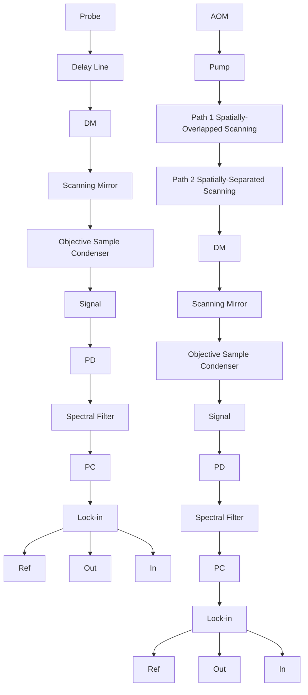
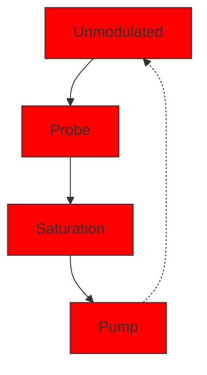

PERSPECTIVE | JANUARY 09 2020

# Transient absorption microscopy: Technological innovations and applications in materials science and life science 

Yifan Zhu ; Ji-Xin Cheng

Check for updates

J. Chem. Phys. 152, 020901 (2020)

https://doi.org/10.1063/1.5129123

  
View Online

  
Export Citation

## Articles You May Be Interested In

Role of size and defects in ultrafast broadband emission dynamics of ZnO nanostructures

Appl. Phys. Lett. (March 2014)

Ultrafast electron imaging of surface charge carrier dynamics at low voltage

Struct. Dyn. (March 2020)

Invited Review Article: Pump-probe microscopy

Rev. Sci. Instrum. (March 2016)

natural_image

Abstract digital artwork with flowing light streaks against a dark background, no text or symbols present.

## AIP Advances

## Why Publish With Us?

  
21DAYS average time to 1 st decision

  
OVER 4 MILLION views in the last year

  
INCLUSIVE scope

Learn More

  
AIP Publishing

# Transient absorption microscopy: Technological innovations and applications in materials science and life science

Cite as: J. Chem. Phys. 152, 020901 (2020); doi: 10.1063/1.5129123 Submitted: 8 October 2019 • Accepted: 15 December 2019 • Published Online: 9 January 2020

Yifan Zhu1 and Ji-Xin Cheng1,2,3,4,a)

## AFFILIATIONS

1 Department of Chemistry, Boston University, Boston, Massachusetts 02215, USA  
2Department of Biomedical Engineering, Boston University, Boston, Massachusetts 02215, USA  
3Department of Electrical and Computer Engineering, Boston University, Boston, Massachusetts 02215, USA  
4Photonics Center, Boston University, Boston, Massachusetts 02215, USA

a)Email: jxcheng@bu.edu

## ABSTRACT

Transient absorption (TA) spectroscopy has been extensively used in the study of excited state dynamics of various materials and molecules. The transition from TA spectroscopy to TA microscopy, which enables the space-resolved measurement of TA, is opening new investigations toward a more complete picture of excited state dynamics in functional materials, as well as the mapping of crucial biopigments for precision diagnosis. Here, we review the recent instrumental advancement that is pushing the limit of spatial resolution, detection sensitivity, and imaging speed. We further highlight the emerging application in materials science and life science.

Published under license by AIP Publishing. https://doi.org/10.1063/1.5129123

## I. INTRODUCTION

Transient absorption (TA) spectroscopy is a well-established characterization method targeting the ultrafast dynamics of excited state molecules.1 With the first laser pulse pumping the molecules to their electronic excited states and the second laser pulse probing the spectroscopic changes after certain delay with respect to the pump pulse, the spectral features and temporal dynamics of molecular excited states can be recorded. In 1985, Zewail and coworkers2–4 successfully captured the snapshot of the dynamics of bond breakage in iodine cyanide molecules with femtosecond TA spectroscopy. The related work extended the landscape of chemistry into the unprecedented time scale of femtosecond and was awarded the Nobel Prize in Chemistry in 1999. In the past 50 years, TA spectroscopy, as a major type of time-resolved spectroscopy, has gained great success in providing tremendous accurate details of the extremely fast processes in multiple important disciplines such as photovoltaics,5 photosynthesis,1 and photochemistry.6 Such valuable time-resolved information would otherwise be buried in the average of the responses from various temporal stages of excited states dynamics.

However, spatial information, as another equally crucial part of the whole picture, is missing in TA spectroscopy. The lack of spatial resolution is becoming a growing concern in TA measurements as research focuses are moving from the pure and homogeneous samples in a cuvette to complex and heterogeneous samples in the real world, mostly in two aspects. First, the signal will majorly arise from the average of bulk, while any spatial features will be lost. Second, the spatial origin of the signal cannot be localized, and therefore, the spatial dynamics of excited states could not be captured.

TA microscopy (Fig. 1), on the other hand, is developed to pro vide additional spatial information and reveal local features from the spatial heterogeneity. Such high spatial resolution is achieved by tightly focusing both the pump and the probe beam onto the sample and raster scanning across the whole field of view. The TA microscope was first used in 1995 by Dong and co-workers in the Gratton group,7 where they achieved fluorescence lifetime imaging by harnessing the stimulated emission of fluorophores. In 2005, the Orrit group8 for the first time reported the time-resolved interferometric measurement of individual particles and opened new insight into the transient properties of single nano-objects. The Vallee group,9 in the following year, demonstrated the first TA microscope that was measuring the transmission change in the probe beam, by spatially modulating the position of the target object and detecting with a lock-in amplifier. Later in 2007, the Warren group first adapted this technology to the label-free imaging of nonemissive biopigments.10,11 By utilizing the two-color two-photon absorption and/or excited state absorption mechanism, the authors successfully achieved label-free imaging and differentiation of eumelanin and pheomelanin. Direct imaging of excited state species propagation was accomplished by spatially fixing the pump beam and laterally scanning the probe beam, invented in 2013 by the Papanikolas group and the Hartland 12,13 group.

text_image

Scientific diagram illustrating laser interaction with a probe, showing energy-dispersive behavior and corresponding time-resolved decay curve.

FIG. 1. Transient absorption microscope provides the spatial information of the field of view (middle), as well as the excited state decay spectral information (right) at each pixel.

These pioneering works show the great potential of TA microscopy in multiple disciplines. Efforts have been made to push the limit of performances of such a new technology in many aspects such as detection sensitivity, spatial resolution, and imaging speed. In 2010, the ultimate single-molecular detection sensitivity was achieved in TA microscopy based on the contrast of ground state depletion, as reported by the Xie group.14 Far-field super-resolution was first realized by Wang and co-workers in the Cheng group in 2013.15 By spatially controlled saturation of electronic absorption, they obtained a spatial resolution of 200 nm, ∼40% better than the effective point-spread-function under the diffraction-limited condition. The fastest TA microscope was reported by Huang and colleagues in the Cheng group in 2018,16 where an image speed of 1000 frames (32 × 200 pixels) or 50 hyperspectral stacks per second was achieved by using a lab-built tuned amplifier (TAMP) array.

The above technological innovations built the foundation for the broad applications of TA microscopy. In materials science, TA microscopy has been applied to study the different excited state dynamic behaviors, such as the carrier dynamics in graphene17–21 and other two-dimensional crystals,22–28 polymer blends,29–33 , perovskites,34–42 nanowires,12,13,43–55 and nanodots.56,57 The spaceresolved visualization of carriers enables breakthroughs in the understanding of morphology-dependent properties of nanomaterials, such as the excited state properties on interfaces,27–32,42 the individual variation of nano-objects, 22,23,26,46,50–52,54,55 and the change in properties induced by the interaction with substrates. 17,21–23,45 It also allowed, for the first time, the experimental visualization of the spatial dynamics of excited states, including long range carrier transport, 35,39,57,58 exciton migration at interfaces,27,28,42 exciton transport with different spin,59,60 carrier trapping, 12,37,46,61 and phonon dynamics,18,26,46 and hence catalyzes the advancements in photovoltaics and light-emitting diodes. Another very important branch of studies have been carried out regarding the vibrational modes of metal nanostructures, as well as the interaction between these modes and the environment.18,62–77

In life science, TA microscopy has been applied to differentiate and image several types of vital nonemissive biopigments in a label-free manner, of which there are two major types of analytes, e.g., heme species10,78–85 and melanin species.11,86–104 These molecules play crucial roles in a wide spectrum of biological processes including gas transport, electron transport, and circadian clock control. They also serve as biomarkers for many highly impacted diseases such as diabetes and melanoma. Thus, labelfree transient absorption imaging of these molecules could provide valuable information for accurate diagnoses. TA microscopy is also applied to study the exogenous substance such as drugs and nanomaterials in living cells,105–109 as well as historical pigments.110–115

There have been several comprehensive reviews 116–123 focusing on the fundamental mechanisms, data processing methods, and applications of transient absorption microscopy. In this review, we will focus more on the recent technological innovation of transient absorption microscopy, as well as the emerging applications in materials science and life science.

## II. CONTRAST MECHANISMS

In transient absorption measurement, the signal of interest is the probe beam intensity change induced by the pump beam. When such a change is mediated by the electronically excited states of the analytes, the information of the excited state dynamics will be coded into the probe beam and hence be measured. There are three major types of processes involved in transient absorption microscopy probing the excited state dynamics (Fig. 2), i.e., ground state depletion, excited state absorption, and stimulated emission, corresponding to different types of interaction between the probe beam and analytes. Other processes, such as stimulated Raman scattering (SRS), cross-phase modulation (XPM), and two-color two-photon absorption, also exist and nonetheless will not carry information about excited states dynamics of the analytes.

## A. Stimulated emission

Stimulated emission occurs when the incoming probe beam shares the same energy with certain transition from the electronic excited states to ground states. Under this condition, the excited states will be forced to ground states, emitting one photon with identical frequency and direction to the incident wave, which leads to an intensity gain of the probe beam.

With stimulated emission, majority of the excited state popu lation will provide monochromic emission simultaneously, which temporally and spectrally focuses the emission. Based on this advantage, stimulated emission was applied early in 1995 for fluorescence lifetime imaging, as reported by Dong and co-workers.7 Stimulated emission could also efficiently increase the emission intensity of weakly emissive species. Min and colleagues in the Xie group reported the stimulated emission imaging of weakly emissive species in biological systems. 109

It is worth noting that, at given emission wavelength, the cross section of stimulated emission is proportional to the cross section of spontaneous emission.124 Also, stimulated emission will usually compete with excited state absorption, a transmission loss pro cess. As a result, the scope of potential analytes of this imaging mechanism is limited.

## B. Ground state depletion

In TA microscopy, the pump beam serves to change the pop ulation of the ground state and excited state molecules. When part of the ground state molecules was pumped into electronic excited states, according to Beer’s law, the absorption of the remaining ground state molecules will be lower than without the pump. Such a change in absorption could be detected as a transmission gain if the probe beam is energetically resonant with the electronic absorption. This mechanism is termed “ground state depletion” and the signal mostly monitors the ground state repopulation process after the excitation.

For strong absorbers, TA measurement based on the ground state depletion mechanism will provide strong signals. By tuning the wavelength of both the pump beam and the probe beam close to the maximal absorption peak, the large absorption cross section of strong absorbers could be fully utilized to provide a relatively high signal-to-noise ratio. With this idea, the ultimate single molecule detection sensitivity was achieved by Chong et al. in the Xie group.14 Notably, because both beams are resonant with the electronic transition of the analytes, care should be taken to prevent photodamage.

## C. Excited state absorption

When the excited state molecules are populated upon the excitation of the pump beam, they will also exhibit their unique absorption features of the higher energy states, resulting in stronger attenuation of the probe beam at the corresponding wavelength, and a transmission loss could be detected. This mechanism is termed “excited state absorption,” and the time domain profile mostly represents the excitation and decay of certain excited state(s).

  
FIG. 2. Potential contrast mechanisms in transient absorption microscopy. On the left side of the dashed line are the transient absorption contrasts: stimulated emission (SE), ground state depletion (GSD), and excited state absorption (ESA). On the right side are other contrast mechanisms accessible in transient absorption microscopy but do not carry excited state information: stimulated Raman scattering (SRS), photothermal effect (PTE), two photon absorption (TPA), and cross phase modulation (XPM).

Generally, the excited state absorption signals appear in lower energy than the linear absorption, usually in the deep red or near infrared region. Consequently, the photodamage issue is largely avoided. Unlike in stimulated emission or ground state depletion, where the optimal wavelength can be estimated by simple linear optical measurement with decent accuracy, the excited state absorption spectrum could only be obtained by transient absorption measurement.

## D. Other contrast mechanisms

Besides the abovementioned mechanisms, there are other contrast mechanisms not related to the excited state dynamics, commonly including the photothermal effect, cross-phase modulation, two-color two-photon absorption, and stimulated Raman scattering.

The photothermal effect refers to the process where the refractive index and hence the propagation of the probe beam change due to the strong absorption of the pump beam and the consequent local heating of the absorber. The intensity of the photothermal signal is sensitive to the numerical aperture (N.A.) of the condenser, where an N.A. of 0.8 is optimized for photothermal detection, and a condenser N.A. larger than the N.A. of the objective will help eliminate the photothermal component in transient absorption measurement. The photothermal signal is also sensitive to the modulation frequency and focal position on the Z-axis, which could serve to recognize the origin of signals.

Cross phase modulation (XPM) refers to the process where the refractive index of the probe beam is affected by the presence of the pump beam through the optical Kerr effect. Similar to the photothermal effect, XPM is also sensitive to N.A. of the condenser. XPM only happens when the pump beam and probe beam are spatially and temporally overlapped, and therefore, it could be applied to determine the instrumental response of a TA microscope.

Two-color two-photon absorption occurs when the sum of the energies of pump and probe beams is equal to the electronic absorp tion energy of the analytes. The intensity of such a process depends on the product of the intensities of both fields, so the probe beam is attenuated only when the pump beam is on, which leads to a transmission loss of the probe beam. Like the XPM process, two-color two-photon absorption requires spatially and temporally overlapped beams.

Stimulated Raman scattering (SRS) is the nonlinear version of spontaneous Raman scattering. When the energy difference between two incident laser beams, spatially and temporally overlapped, is resonant with Raman active vibrational transition of the analytes, the beam with higher energy will lose photons and the other beam will gain photons. Meanwhile, the analytes will be excited to higher vibrational states. The SRS signal carries the complementary information about the structures of the analytes. The SRS signal could be eliminated by tuning to off-resonance wavelengths if it is not desired.

## III. INSTRUMENTATION

## A. General scheme

A standard TA microscope can be conceptually split into two components: TA measurement component and scanning micro scope (Fig. 3). The TA measurement component resembles the traditional TA spectroscope but with collinear beam geometry as well as much higher detection sensitivity and measurement speed. The scanning microscope component shares the basic scheme with other laser scanning microscopes.

## B. TA measurement

In the TA measurement component, the excitation sources are usually two well-synchronized pulse trains generated by an ultrafast Ti:sapphire oscillator and optical parametric oscillator working at a high repetition rate of tens of megahertz. One of these beams is modulated by an acousto-optic modulator (AOM) or a mechanical chopper and serves as the pump beam, and another serves as the probe beam. The temporal delay between two beams is controlled by a delay stage on the light path of either beam. Alternatively, asynchronous optical sampling is another option to control the temporal delay, as implemented early in 19957 and commercialized now. Then, after combined with a dichroic mirror, both beams are sent to the scanning microscope for the measurement. When the incident fields interact with the analytes, the modulation on the pump beam will be transferred to the probe beam through different transient absorption mechanisms with a tiny modulation depth $( \Delta \mathrm { I } / \mathrm { I } \approx 1 0 ^ { - 4 } – 1 0 ^ { - 7 } )$ . Afterward, the laser beam carrying the TA signal will be collected by a condenser (in forward mode) or an objective (in epi mode), spectrally filtered to reject the pump beam, and sent to the photodiode to convert the optical signal into the electronic signal. The signal is then sent to a phase-sensitive lock-in amplifier to pick out the component with identical frequency to the original modulation.

flowchart

FIG. 3. Schematic illustration of transient absorption microscopy. AOM, acousto optic modulator. DM, dichroic mirror. PD: photodiode.

There are two types of schemes with different laser repetition rates and modulation frequency for different purposes of measurement. Most systems use laser sources with low pulse energy (<10 nJ) and high repetition rate (>mega-hertz), plus high modulation fre quency (>100 kHz). Since the modulation frequency is very high, the laser intensity excess noise (1/f noise) is considerably reduced; meanwhile, the pulse energy is usually below the saturation limit of the analytes; thus, the signal to shot-noise ratio is increased at a given integration time. Collectively, the detection sensitivity $( \Delta \mathrm { I } / \mathrm { I } \approx \mathrm { \bar { 1 0 } } ^ { - 7 } )$ and imaging speed are optimized in such schemes. The possible accumulation of long-lived intermediate species is the major drawback of such a scheme, and a pulse picker is employed in some experiments12,35,44 to reduce the repetition rate. Also, it is challenging to get supercontinuum light from such a low energy pulse, resulting in missing spectral domain information. Some of the systems 19,125,126 use a laser source with high pulse energy (>1 μJ); low repetition rate (∼kilohertz), usually by pumping a regenerative amplifier; and low modulation frequency (10–100 Hz). Due to the long pulse separation time, it is possible to measure slow dynamic processes at the microsecond scale with this scheme. The relatively high pulse energy enables supercontinuum generation by exciting condensed media such as Ti:sapphire crystals. The slow modulation allows the parallel detection of the whole supercontinuum spectrum with CCD/CMOS and grating. However, the detection sensitivity is much lower $( \Delta \mathrm { I } / \mathrm { I } \approx 1 0 ^ { - 4 } )$ than the high repetition rate scheme, and the high excitation densities may induce unfavored nonlinear dynamic processes.

## C. Scanning microscope

The modulated and temporally adjusted pulse trains are sent to a scanning microscope. Although the basic architectures of most scanning microscopes are quite close, there are two types of scanning modules, i.e., spatially overlapped scanning and spatially separated scanning, for different imaging purposes. Spatially overlapped scanning can be implemented in two different manners: mirror scanning and sample scanning. In the mirror scanning scheme, pump and probe beams are first combined with the dichroic mirror and then sent to the galvo mirror and 4-f system for scanning on the x-y plane. In the sample scanning scheme, the laser beams are fixed, while the sample stage is scanned by a piezotranslator. During scanning, the pump and probe beams are always spatially overlapped so that the TA response on each pixel could be uniformly acquired, which provides the advantage in the chemical and/or spectroscopic analysis as the function of space. However, the spatial dynamics of the excited state cannot be monitored in such schemes. In spatially separated scanning, the probe beam is first scanned using the galvo mirror and then combined with the pump beam and sent into the objective. While the pump beam is fixed to give stable excitation at a specific position, the probe beam is scanned on the x-y plane, enabling the monitor of the spatial and temporal dynamics of the excited states. The scan of the pump beam relies on the piezotranslator on the sample stage. Notably, the path difference between pump and probe beams during scanning is negligible when the field of view is small, as estimated and confirmed by experiments.

## IV. TECHNOLOGICAL INNOVATIONS

## A. Pushing the limit of spatial resolution

The resolution of a standard TA microscope is fundamentally limited by the diffraction limit of light. The lateral (r) and axial (z) resolutions of a diffraction-limited TA microscope, as defined by the full width at half maximum (FWHM) of the excitation intensity point spread function (IPSF), is as follows:15

$$
r = \frac {0 . 5 3}{\mathrm{N.A.}} \sqrt {\left(1 / \left(\frac {1}{\lambda_ {p} ^ {2}} + \frac {1}{\lambda_ {p r} ^ {2}}\right)\right)}, \tag {1}
$$

$$
z = \left[ \frac {0 . 5 3}{n - \sqrt {n ^ {2} - \mathrm{N.A.} ^ {2}}} \right] \sqrt {\left(1 / \left(\frac {1}{\lambda_ {p} ^ {2}} + \frac {1}{\lambda_ {p r} ^ {2}}\right)\right)}, \tag {2}
$$

where $\lambda _ { P }$ and $\lambda _ { P } r$ are the wavelengths of pump and probe beams, respectively. N.A. is the numerical aperture of the focusing objective, and n is the refractive index of the medium. Due to the nonlin ear nature of transient absorption microscopy, it is easy to obtain a lateral resolution of ∼300 nm with a near infrared excitation source (∼1000 nm) and water immersive objective (N.A. = 1.2). However, such a value is still much larger than the spatial scale of many nanomaterials and cellular structures. To address such a problem, multiple methods have been developed to break the diffraction limit.

The early efforts on super-resolution TA microscopy focused on the near-field techniques, resembling the near-field scanning optical microscopy (NSOM).127,128 By coupling the pump or probe beam into the NSOM tip, a sub-diffraction-limit resolution could be achieved. Femtosecond temporal resolution could be maintained by precompensation of the group velocity dispersion induced by the NSOM fiber. Notably, the resolution of TA NSOM is not limited by the size of NSOM fiber, but the signal-to-noise, considering the higher loss of the smaller NSOM tips. However, the slow measurement restrained by the mechanical scanning, the limited depth of field in measurement, and the fragility of the NSOM tips hindered the further development of the near field technique.

Far field super-resolution techniques, unlike their near-field competitors, provide more feasibility and flexibility of implementation and application. Thanks to the rapid development of farfield super-resolution fluorescence microscopy, many of those novel techniques could be translated into TA microscopy, including spatially controlled depletion, focus engineering, and structured pump illumination.

The spatially controlled depletion method is in analogy to the stimulated emission depletion (STED). As first reported by Wang and co-workers15 in the Cheng group [Figs. 4(a)–4(d)], a doughnutring shaped beam is used to deplete the ground state population in the periphery of the focus and suppress the TA induced modulation transfer occurring out of the focal center. With only the center part of the probe beam carrying the modulation, the lateral spatial resolution was improved by ∼40%. This method could promisingly improve the lateral resolution, but the strong saturation beam may lead to sample damage or other artifacts. Another implementation reported by Liu and co-workers129 does not require an intense doughnut-ring shaped beam to physically saturate the periphery of the focus but a much weaker beam only to provide TA response information outside the focal center. By modulating the Gaussian pump beam and doughnut-ring shaped beam at identical frequency but the opposite phase, they essentially subtract the TA response of the periphery from that of the whole focal volume. A resolution improvement of ∼30% was demonstrated, and the theoretical maximum resolution is only limited by the ratio between the damage and saturation threshold. This technique was further improved by Samuel and co-workers126 in the Ginsberg group. In their work, two doughnut-ring shaped depletion pulses were introduced, those are temporally overlapped with the pump pulse and the fluorescence detection time gate, respectively. While the first depletion pulse serves to quench the peripheral excitation from the pump pulse, the second depletion pulse will further confine the origin of the emission signal to a sub-diffraction-limit region, enabling the super-resolution measurement of exciton migration on both excitation and detection ends.

Super-resolution could also be realized by modifying the point spread function of pump and/or probe beams. Kobayashi and coworkers130 demonstrated the resolution improvement with annular beams. With a simple annular pupil filter, the lateral resolution is improved by ∼30%, but the axial resolution becomes twice lower than that of normal TA microscopy. They later reported131 the resolution enhancement with an inverse-annular pupil filter, which could improve the lateral resolution by ∼15%, as well as the axial resolution by ∼20%. Numerical simulation1 also shows that the introduction of partially staggered beams could improve the resolving power by ∼30% (lateral) and ∼20% (axial).

Another remarkable super-resolution method is structured illumination reported by Massaro et al.133,134 in the Grumstrup group [Figs. 4(e)–4(i)], where they applied wide-field structured pump illumination, as well as a focused probe beam to acquire the TA signal from silicon nanowire. Reconstruction from three images with different phases of the pump field could provide one image with twice better resolution on the x-axis than conventional scanning TA microscopy. This method enables super-resolution imaging with only minimal sacrifices in imaging speed, but most of the energy in the pump field is wasted. Such a problem could be potentially solved by having pump and probe beams both in wide field, as proposed by Kim in the So group. 35 With structured illuminating pump field and wide-field probe, 3 times better lateral resolution could be achieved, as suggested by the simulation. The imaging speed could still be comparable to or even better than conventional point scanning TA microscopy if the wide field TA microscope is equipped with a high-speed camera.

natural_image

Fluorescent microscopy image showing red-orange cellular structures with two white arrows pointing to specific regions (no text or symbols present)

natural_image

Microscopic image showing red fluorescent spots with two white arrows pointing to specific regions (no text or symbols present)

line chart

| Position (μm) | Conventional TA | Saturated TA |
| ------------- | --------------- | ------------ |
| 0.0           | 0               | 0            |
| 0.2           | 5               | 5            |
| 0.4           | 20              | 20           |
| 0.6           | 10              | 5            |
| 0.8           | 0               | 0            |

flowchart

natural_image

Microscopic view of a curved, fibrous material with 1 μm scale bar (no text or symbols on the structure itself)

natural_image

Two microscopic images labeled F and G showing a curved, gradient-colored structure with scale bars indicating 1 μm (no text or symbols beyond labels)

line chart

| μm    | -ΔR (arb. units) |
| ------ | ---------------- |
| -0.4   | ~0.0             |
| -0.2   | ~0.2             |
| 0.0    | 1.0              |
| 0.2    | ~0.2             |
| 0.4    | ~0.0             |

text_image

SLM
+1
Pump
-1
Probe
OBJ
Nanowire
Sample
Pump
Illumination

FIG. 4. Representative super-resolution techniques in transient absorption microscopy. [(a)–(d)] Saturated transient absorption microscopy. (a) Image of graphite nanoplatelets by conventional transient absorption microscopy. (b) Images of the same areas by saturated transient absorption microscopy. Scale bar: 1 μm. (c) Intensity profiles along the lines indicated by the arrows in (a) and (b). Solid curves represent Gaussian fitting. For comparison of resolution, the peak intensities were normalized to the same value. TA: transient absorption. (d) Modulation scheme in saturated transient absorption microscopy. [(e)–(i)] Structured transient absorption microscopy. (e) Field emission electron micrograph of a 100 nm diameter silicon nanowire. (f) Diffraction-limited pump-probe image of the nanowire in (e) at $\Delta \mathfrak { t } = 0$ ps. (g) Structured transient absorption image achieved through reconstruction. (h) Line width comparison at positions indicated by the arrows in the two transient absorption images. Black, diffraction limited; red, structured illumination transient absorption. (i) Illustration of structured transient absorption microscopy. TA: transient absorption. SLM: spatial light modulator; OBJ: objective. (i) Beam geometry of saturated transient absorption microscopy. Panels (a)–(e) adapted with permission from Massaro et al., ACS Photonics 3(4), 501–506 (2016). Copyright 2016 American Chemical Society. Panels (f)–(i) adapted with permission from Wang et al., Nat. Photonics 7, 449 (2013). Copyright 2013 Springer Publishing Company, LLC.

## B. Pushing the limit of detection sensitivity

Given the amount of the signal that is possibly obtained in certain measurement is only related to the laser power and TA cross section of the analytes, the signal to noise ratio which defines the detection sensitivity is mostly affected by the noise in the system. 136 Generally speaking, the noise in a TA microscopic system contains three major components: laser intensity excess noise, detector Johnson noise, and laser shot noise. The laser intensity excess noise is a type of pink noise137 (or 1/f noise), which means the power density of the noise is inversely proportional to the frequency of measurement. With high frequency modulation methods applied in most of the modern TA microscopes, the laser intensity excess noise is largely reduced. The strong field of the local oscillator (i.e., the probe beam) could provide a relatively high photocurrent on the detector, so the impact of Johnson noise is minimized. The laser shot noise, on the other hand, is proportional to the square root of the number of photons in the laser beam. Thus, the strong shot noise carried by the local oscillator contributes most of the total noise.

Due to the quantum nature of both the TA signal and the laser shot noise, there are three methods to boost the signal to noise ratio: First, tune the laser beams to optimized wavelengths such that the corresponding TA cross section is the largest; second, tune the power of laser beams to the near-saturation level; and third, repeat the measurements for more times. When measuring analytes with relatively large TA cross sections, single molecule detection sensitivity could be realized if all these parameters are optimized, as reported by Chong et al.14 In their experiment, both pump (642 nm) and probe (633 nm) beams were tuned close to the absorption maxima of Atto647N (647 nm), the analyte. Plus the relatively long pixel integration time (1 s) and near-saturation intensities of both pump and probe beams (350 μW), the detection limit reached 15 nM, corresponding to an average of 0.3 molecules in the focal volume $( { \sim } 3 \times \mathrm { ~ \overset { \bullet } { 1 } 0 ~ ^ { \mathrm { - 1 7 } } ~ L } )$ , even with a few parameters not fully optimized, e.g., the laser source is CW laser, but not femtosecond pulse laser.

Another interesting method to enhance the TA signal is based on the plasmonic resonance of metal nanoparticles. This method was first explored by Schumacher et al.138 in 2011. By coupling an optical antenna to a single gold nanoparticle, the mechanical breathing oscillation signal was amplified by an order of magnitude. Jing et al.139 reported the imaging and quantification of mRNA with single copy detection sensitivity, by utilizing the plasmonic resonance enhancement of gold nanoparticles. Due to the highly enhanced signal, a decent signal to noise ratio can be obtained even with a very short pixel dwell time of 32 μs.

## C. Pushing the limit of imaging speed

In a standard TA microscope, the detection scheme is a single pixel photodiode detector coupled with a lock-in amplifier. Parallel detection enabled by multichannel detectors, therefore, could improve the imaging speed at a rate corresponding to the number of channels on the detector. The modulation frequency limits of multichannel lock-in amplifiers are mostly under 50 kHz. Thus, advanced demodulation methods such as tuned amplifier (TAMP) arrays were developed to couple with the photodiode array and pick out the signals with a decent sensitivity of $\Delta \mathrm { I } / \mathrm { I } \approx 1 0 ^ { - 6 }$ . Based on this method, Huang and co-workers in the Cheng group reported ultrafast TA imaging for graphene defects,16 where the imaging speed was as high as 1000 (32 × 200) fps. Another potential candidate of the parallel detection method is wide-field measurement with high speed cameras as the detectors. Although the camera readout rate (<2 kHz) is not comparable to that of photodiodes, the large count of pixels makes it possible to reach a higher imaging speed. Simulation indicates that even with structured illumination where multiple images are combined and reconstruct one image with higher resolution, a 135 frame rate of ∼0.5 can be achieved.

## D. Dual channel detection

Most of the transient absorption measurements harness the in phase (X) channel of the lock-in amplifier to demodulate the signal while leaving the quadrature (Y) channel idle. However, because of the minimal cross talk between two orthogonal channels, the quadrature channel can be utilized for specific detection purposes, such as TA signals at different decay times,83,140 photothermal signals,141,142 or SRS signals,82 depending on the setup and sample properties.

## E. Impulsive stimulated Raman scattering

When the spectral band of the pump pulse is broad enough to cover the energy of Raman active vibrational transition, the pump pulse itself could excite the vibrational mode coherently, called impulsive stimulated Raman scattering (ISRS). Such excitation could be measured by a temporally delayed probe pulse, and the Raman spectrum could be extracted by Fourier transform from the time domain spectrum of the transient absorption of the probe beam. Schnedermann and co-workers in the Kukura group demonstrated a time-resolved vibronic optical microscope,143 where two pulses with a temporal duration of 10 fs and 7 fs serving as the pump and probe, respectively, were applied to measure not only the ultrafast electronic transient absorption but also the impulsive SRS signal generated in perovskite films.

## V. APPLICATIONS

Excited state dynamics are not only the core properties of energy materials but also the intrinsic signatures of molecules.

TA microscopy as an ideal method to directly image the excited state dynamics has been broadly used in material characterization as well as label-free bioimaging. It is also applied in monitoring the dynamics of historical pigments. 110–115

## A. Materials science

## 1. Characterization of nanomaterials

Sharing the same or similar chemical content, nanomaterials differ so much from the bulk materials basically because of two effects, i.e., the quantum confinement effects with delocalized electron states and the ratio of atoms at the surface, interface, or other morphologically special locations.144 Although these morphologydependent features play crucial roles in nanomaterials, the corresponding information is mostly buried in the average of heterogeneity in traditional measurements. Comparing with conventional TA spectroscopy or other established techniques, TA microscopy has advantages in monitoring the spatial and temporal dynamics of excited states. It is also able to measure the morphological features directly. These strengths of TA microscopy provide the opportunity to explore the relationship between excited state properties and interfaces, individual variations, or other morphological features.

The excited state properties at the interface are important subjects of TA microscopy. The interface usually only accounts for minor volume of the whole material but has a major impact on the overall properties. Early efforts on studying interface properties with TA microscopy focused on the blends of polymers and nanoparticles.29–32 These experiments opened new horizons about the research of intermixing materials and proved the importance of the interface in overall properties of materials. Later, with the advancement of spatially separated scanning TA microscopy, much attention was shifted to the spatial dynamics on the interfaces. Snaider et al.42 measured the carrier diffusion on the grain boundaries in hybrid perovskite thin films, and their results explained several poorly understood phenomena in the community about the photoluminescence lifetimes and carrier generation behavior at the boundaries. Yuan et al.27 and Zhu et al.28 exploited TA microscopy to study the charge transfer state on the interfaces between different 2D materials (Fig. 5). Their research provided detailed information on the photocarrier behavior of these heterostructures, shedding light on the future development of photovoltaic materials. Recent technological innovations enabled the ultrahigh-speed spectroscopic imaging of the graphene grain boundaries, matching the roll-to-roll manufacturing speed.16

TA microscopy offers insights about individual variations of nano-objects. On nanoscale, even a small change in size and chemical/mechanical environment could induce drastic differences in the electronic and photoelectronic properties, and the traditional ensemble measurements could only provide averaged or even distorted results. To the contrary, TA microscopy opens new perspective to directly measure a single nano-object and study the properties as a function of their individual features. Works have been done to demonstrate the diameter-dependent carrier dynamics and acoustic phonon modes in nanowires and nanoparticles,9,43,46,51,54,55,121 layer-dependent exciton, and phonon properties in 2D materials,22–24,26 as well as the mechanical effect induced by the substrate .17,21–23,45,52 These works have shown that the traditional measurements on ensembles could only provide average information of the bulk, sometimes even with key factors ignored,52 suggesting the necessity to re-examine previous knowledge in a spatially resolved manner.

  
FIG. 5. Interlayer coupling–dependent charge transfer from WS2 to graphene. (a) Atomic models of 1L-WS /G and 2L-WS /G interfaces, with aligned layers. (b) Optical image of the 2L-WS /G heterostructure. (c) AFM height image of the 2L-WS /G heterostructure. (d) Correlated TAM image of the 2L-WS /G heterostructure measured at 0 ps probing the A-exciton resonance. Pump photon energy, 3.14 eV; probe photon energy, 1.99 eV; pump fluence, ∼2 mJ cm−2. (e) Normalized transient dynamics of the heterostructure at areas 1 and 2 as marked, and a control 2L-WS layer. Solid lines are the fitting curves with exponential decays convoluted with the experimental response function. (f) Correlated TAM image of the 1L-WS2/G heterostructure measured at 0 ps probing the A-exciton resonance. Pump photon energy, 3.14 eV; probe photon energy, 1.99 eV; pump fluence, ∼2 mJ cm−2. (g) Normalized transient dynamics of the 1L-WS2/G heterostructure at area 3 as marked, and a control 1L-WS2 layer. Solid lines are the fitting curves with exponential decays convoluted with the experimental response function. Scale bars, 1 mm. Adapted with permission from Yuan et al., Sci. Adv. 4(2), 9 (2018). Copyright 2018 American Association for the Advancement of Science.

## B. Visualization of the spatial dynamic of excited state species

Energy materials have been a hot topic for decades, but the fundamental question on how the energy flows through the materials is still poorly understood due to the lack of proper tool to experimentally monitor the motion of carriers, charges, excitons, and other excited state species. Fortunately, the invention of spatially separated scanning TA microscopy allows investigation of spatial dynamics of excited state species. In this setup, the pump and probe beams are focused at different lateral positions, allowing the mapping of excited state species those have diffused away from the excitation spot. In addition, by mapping the carriers at a function of delay time, a movie of carrier dynamics could be captured. Since invented12,13 in 2013, this novel approach has been proved to be a powerful tool to measure the spatial dynamics of various excited state species in multiple systems, such as the carrier and phonon dynamics in nanowires 12,13,49–54 and carrier migration on the interfaces.27,28,35,40,42,126 Grumstrup and colleagues52 used TA microscopy to measure the strain-induced electronic property change in silicon nanowires. Dramatic changes in the carrier recombination rate were observed between bent and straight silicon nanowires and offered implications for the exploration and refinement of mechanically controlled properties and functionalities in silicon-based devices. The study reported by Guo and colleagues in the Huang group35,39 elucidated the mechanism of the spatial and temporal charge transport and carrier migration on perovskite thin films, suggesting the potential application of perovskite thin films for hot-carrier devices (Fig. 6). Wan and colleagues in the Huang 145 group focused on the coupling between singlet and triplet exci tons in tetracene crystals, highlighted the high triplet exciton diffusion rate accelerated by the equilibrium between singlet fission and triplet annihilation, and refreshed the understanding on triplet exciton transport.

## C. Life science

Excited state dynamics is an intrinsic signature of molecules, and the measurement of excited state dynamics could therefore provide intrinsic molecular contrast of the analytes. Such measurement could be accomplished by TA microscopy with superior sensitivity, chemical specificity, and spatial-temporal resolution. These advantages make TA microscopy an ideal tool for chemical imaging of nonfluorescent biopigments as well as exogenous drugs and nanomaterials in living systems.

Some biopigments serve as important biomarkers for various diseases, for instance, the amount and composition of melanin indicates the aggressiveness of melanoma, and the amount of glycated hemoglobin reflects the long-term blood sugar level of diabetes patients. Some biopigments are deeply involved in the cellular metabolism, for example, heme is the core part of several proteins such as catalase and cytochromes. These biopigments could hardly be labeled with traditional fluorescent dyes and proteins due to their special structures or occurrence. However, by measuring their signature excited state dynamics, TA microscopy could help us visualize the localization and dynamics of these species without label. Comparing with other label-free bioimaging modalities such as stimulated Raman scattering microscopy and coherent anti-Stokes Raman scattering microscopy, TA microscopy enjoys its superiority of high detection sensitivity, thanks to the large cross sections of linear and nonlinear electronic absorption with respect to the cross sections of the Raman process. Meanwhile, most of the biomolecules are transparent, ensuring the high specificity of TA chemical imaging. However, the time-domain spectrum of TA is broad and featureless, hence not as informative as in coherent Raman, which poses challenges for the fine chemical analysis in a complex environment.

line chart

| Radial Distance (μm) | IRF     | 0 ps    |
| -------------------- | ------- | ------- |
| 0.0                  | 1.0     | 1.0     |
| 0.5                  | 0.2     | 0.4     |
| 1.0                  | 0.0     | 0.1     |
| 1.5                  | 0.0     | 0.0     |

line chart

| Distance (μm) | ΔT(μV) |
| ------------- | ------ |
| -2.0          | 0.0    |
| -1.5          | -0.1   |
| -1.0          | -0.2   |
| -0.5          | -0.1   |
| 0.0           | 0.2    |
| 0.5           | -0.1   |
| 1.0           | -0.2   |
| 1.5           | -0.1   |
| 2.0           | 0.0    |

FIG. 6. Hot-carrier transport in hybrid perovskites within the first picosecond. TA microscopic images probing at 1.58 eV with two pump photon energies— (a) 3.14 eV and (b) 1.97 eV—at different pump-probe delay times, as labeled. Scale bars, 1 μm. (c) Hot-carrier distribution at 0-ps delay for 3.14-eV excitation over a radial distance obtained by averaging all angles compared to the IRF, as defined in the text. Solid lines are Gaussian fits. (d) One-dimensional TA microscopic image profile at 1.2 ps for 3.14-eV pump excitation. The red solid line is fit as described in the text. The red dashed line in (a) indicates where the 1D distribution was obtained in (d). Adapted with permission from Guo et al., Science 356(6333), 59–62 (2017). Copyright 2017 American Association for the Advancement of Science.

## D. Melanin

Melanoma is the most dangerous type of skin cancer, causing most of the skin cancer deaths. Conventional diagnosis methods lack the ability to identify the aggressiveness of the earlystage melanoma, presenting an urgent challenge for the development of a better approach for accurate melanoma diagnosis. Since 2007,11 the Warren group has introduced TA microscopy for the imaging and diagnosis of melanoma,86–91,93–100 with melanin as the biomarker. They proved that the TA signal is sensitive to not only the type of melanin (e.g., eumelanin and pheomelanin) but also the oxidation state, aggregate size, and metal content of melanin.102 By mapping the excited state dynamics of melanin in melanocytic lesions, they established a set of methods to identify the metastatic melanoma. Recently, they further elucidated the molecular mechanism underlying the melanin change in metastatic melanoma,102–104,146 i.e., the metabolic activity of metastatic melanoma induced degradation and deaggregation of melanin assembly structures and hence changed the TA response of the melanin (Fig. 7). Their methods and discoveries opened the gate for more opportunities to study melanin related diseases such as Parkinson’s disease and age-related macular degeneration.

## E. Heme species

Heme is the functional core of multiple proteins that play a central role in a wide spectrum of metabolisms. Hemoglobin, for example, is the major oxygen carrier in blood. Some of the conditions of blood, such as high blood sugar, gradually modify the hemoglobin in red blood cells, called the glycation of hemoglobin. The modified hemoglobin, HbA1c, could serve as a biomarker for the long-term blood sugar level. Such modification will also alter the excited state dynamics of hemoglobin, which could be utilized as the intrinsic contrast in TA microscopy. Dong et al. in the Cheng group 85 developed a new analytical method based on TA microscopy to quantify the HbA1c content on a single red blood cell level [Figs. 8(a)–8(c)], through which the impact of red blood cell lifetime could be avoided, and only submicroliters of blood is needed for the measurement. The oxygen saturation is another factor that will change the structure and hence the excited state dynamics of hemoglobin, and the TA measurement of red blood cell oxygen saturation has been performed by Francis and co-workers83 with high measurement speed and sensitivity.

text_image

(a)Assembly structure
False-colored image
Phasor plot
S
G
Subunits

text_image

(b)
Black nevi
SLNB negative
SLNB positive
H&E stained slice
200 µm
200 µm
200 µm
False-colored image
50 µm
50 µm
50 µm

line chart

| Interpulse delay (ps) | Squid particles | Squid subunits | Sepia particles | Sepia subunits |
| --------------------- | --------------- | -------------- | --------------- | -------------- |
| 0                     | ~0              | ~0             | ~0              | ~0             |
| 5                     | ~0.8            | ~0.6           | ~0.9            | ~0.7           |
| 10                    | ~0.9            | ~0.7           | ~0.95           | ~0.8           |
| 15                    | ~0.95           | ~0.75          | ~0.98           | ~0.85          |
| 20                    | ~0.98           | ~0.8           | ~0.99           | ~0.9           |

box plot

| Group          | Portion of red component (%) |
| -------------- | ---------------------------- |
| Black nevi     | 20                           |
| Black nevi     | 30                           |
| Black nevi     | 40                           |
| Black nevi     | 50                           |
| Black nevi     | 60                           |
| Black nevi     | 70                           |
| Black nevi     | 80                           |
| SLNB negative  | 20                           |
| SLNB negative  | 30                           |
| SLNB negative  | 40                           |
| SLNB negative  | 50                           |
| SLNB negative  | 60                           |
| SLNB negative  | 70                           |
| SLNB negative  | 80                           |
| SLNB positive  | 20                           |
| SLNB positive  | 30                           |
| SLNB positive  | 40                           |
| SLNB positive  | 50                           |
| SLNB positive  | 60                           |
| SLNB positive  | 70                           |
| SLNB positive  | 80                           |

FIG. 7. The 770-nm pump/730-nm probe signals of eumelanin and correlation with melanoma. (a) Images of squid eumelanin particles with different assembly states. The small subunit fraction (MW < 2 KDa) resulting from disassembly of squid eumelanin particles can be differentiated by phasor analysis. (b) Pump-probe images in benign nevi and melanoma. The false-colored images derived from phasor analysis showed that chemical heterogeneity and the amount of long-lived positive signal increase with development and metastasis of melanoma, reflecting that dissociation of eumelanin increases with elevated risk of metastasis. The images in the upper row are H&E-stained slices. (c) Pump-probe delay curves for squid and sepia eumelanin particles and their disassembled subunits, showing that the difference between DHI and DHICA does not contribute to the observed signals at this wavelength. (d) Boxplots showing the content of the highly dissociated fragments (the red component) for benign nevi primary melanomas and metastatic melanomas. Adapted with permission from Ju et al., J. Biomed. Opt. 24, 1–13 (2019), without modification. Copyright 2019 Author(s) licensed under a Creative Commons Attribution 4.0 License.

TA microscopy has been applied to image and differentiate other heme species. Chen et $a l . ^ { 8 4 }$ demonstrated the directly visualization of heme dynamics in C. elegans with TA microscopy [Figs 8(d)–8(e)] and showed the ability of TA microscopy to differentiate hemin solution and hemin powder in a label-free manner. Zhang and colleagues82 reported the label-free imaging of hemoglobin and hemosiderin in brain tissue with TA microscopy, where the analytes are difficult to label in a traditional manner. Wang et $a \dot { l } . ^ { \mathrm { 8 1 } }$ and Domingue et al.79,80 $a l . ^ { 7 9 , 8 0 }$ in the Wilson group applied TA microscopy to map respiratory chain pigments, especially cytochrome c.

## F. Exogeneous analytes in living cells and living animals

Researchers have used TA microscopy for in vivo imaging of exogenous molecules and nanomaterials.106,107,109,140–142,147 Min and co-workers109 successfully monitored the in vivo dynamics of toluidine blue O (TBO) with the stimulated emission signal of the drug as the contrast of the images and demonstrated the superior detection sensitivity of TA microscopy as well as its ability to image nonfluorescent chromophores. Tong et al.141 reported the imaging and differentiation of metallic and semiconducting single wall carbon nanotubes based on their novel detection scheme. In their setup, both the in-phase channel and quadrature channel of the phase sensitive lock-in amplifier were fully utilized for the TA signal and thermal lens signal, respectively. Zhang et al.147 demonstrated the dual-modal SRS/TA imaging for quantitative imaging of MoS2-nanosheets in living cells, with SRS and TA signal detected in the in-phase channel and quadrature channel, respectively. Xu and colleagues140 used TA microscopy to monitor the drug release from gold nanocage, based on the different excited state lifetimes of drug-Au nanocage conjugate and free drug molecules. TA microscopy was further adapted for imaging graphene and graphene oxide in living animals105 and highlighted the potential of TA microscopy to be applied in real world noninvasive diagnosis.

natural_image

Fluorescent microscopy image showing scattered red and orange glowing particles with two labeled regions (A and 2), no text or symbols present.

line chart

| Delay time (ps) | Normalized |
| --------------- | ---------- |
| -2              | 0.0        |
| -1              | 0.4        |
| 0               | 1.0        |
| 1               | 0.6        |
| 2               | 0.3        |
| 3               | 0.15       |
| 4               | 0.1        |
| 5               | 0.05       |
| 6               | 0.0        |

line chart

| Delay time (ps) | Normalized |
| --------------- | ---------- |
| -1              | 0.0        |
| 0               | 1.0        |
| 1               | 0.4        |
| 2               | 0.2        |
| 3               | 0.1        |
| 4               | 0.05       |
| 5               | 0.02       |
| 6               | 0.01       |

natural_image

Fluorescence microscopy image showing red-stained cellular structures with blue boundary lines and white arrows indicating specific regions (no text or symbols present)

natural_image

Four-panel fluorescence microscopy image showing red-labeled cellular structures at 60s, 126s, 390s, and 468s time points (no text or symbols present)

  
FIG. 8. Transient absorption imaging of heme species. [(a)–(c)] Transient absorption imaging of diabetic whole blood and healthy whole blood. (a) Pseudocolor transient absorption images (delay time, 0 ps) of single RBCs with ROIs are highlighted by blue dashed circles. Scale bar, 10 mm. Pump: 520 nm, 2 mW on the sample; probe: 780 nm, 10 mW on the sample. int., intensity. [(b) and (c)] Time-resolved decay curves (normalized) of ROIs shown in (a). [(D) and (e)] Real-time TA imaging of heme granule dynamics in live C. elegans. (d) Zero-time delay TA imaging of WT worm. The overall image is shown; the worm intestinal membrane is outlined in blue. Scale bar: 40 μm. (e) Field of view in the white box was cropped, and images at different time points are shown. Sample: IQ6011 strain was kept in a mCeHR2 medium supplemented with 200 $\mu { \cal M }$ hemin for 1 h before TA imaging. Pixel dwell time: 10 μs. Panels (a)–(c) adapted with permission from Dong et al., Sci. Adv. 5(5), eaav0561 (2019). Copyright 2019 American Association for the Advancement of Science. Panels (d) and (e) adapted with permission from Chen et al., Anal. Chem. 90(5), 3395–3401 (2018). Copyright 2018 American Chemical Society.

## VI. CONCLUSION AND OUTLOOK

TA microscopy is a novel approach to monitor the spatial temporal dynamics of excited state species, as well as a unique tool in the label-free imaging of biopigments. In materials science, it has been widely applied to characterize the morphologydependent properties of heterogeneous materials and capture the spatial-temporal dynamics of excited states. In life science, it has the potential of being translated into a diagnostic tool for diseases such as melanoma and diabetes.

We expect that this technology will keep evolving for better performance. One of the major directions of instrumental development is super-resolution. Although there have been quite a few existing methods to achieve sub-diffraction-limit resolution, the resolution of these methods (mostly >100 nm) is still not comparable to the requirement to fully resolve the detailed structures of nanomaterials (<10 nm) and small cellular organelles or virus (<50 nm). In addition, current super-resolution techniques usually involve strong saturation or depletion field, which may induce an unwanted nonlinear process and contaminate the signal. A superresolution TA microscopy method with very high spatial resolution while maintaining perturbative measurement condition is highly desirable.

Another important direction is a fiber-based TA microscope. Comparing with free-space optical systems, fiber laser and other fiber based technologies have the advantage of low cost. One of the leading hindrances of the development of TA microscopy community lays on the huge investment of a femtosecond solid-state laser system, which could be potentially solved by introducing budget fiber laser with comparable performance. On top of that, there are various kinds of interesting fiber techniques such as soliton generation, fiber amplifier, and supercontinuum generation fiber, which could provide valuable resources for the further advancement of TA microscopy. Some other interesting subjects, such as the TA endoscope, also relay on the cooperation of fiber technology.

Coupling TA microscopy with other microscopic or spectroscopic techniques is also an attractive topic. For instance, ∼10 nm resolution could be achieved by coupling TA microscopy with atomic force microscopy, scanning tunneling microscopy, or scanning/tunneling electron microscopy; detection sensitivity could be largely boosted by coupling TA microscopy with a scanning metal tip through field-enhancement.

We also expect that these emerging technological innovations of TA microscopy will further accelerate the active exploration of a broader spectrum of applications. In materials science, TA microscopy will gradually become a routine characterization measurement in materials science labs. The future advancements of TA microscopy will further enable the investigation of electronic and vibrational properties as a function of fine material structures, with more abundant spectral information as well as reduced artifacts. More disciplinaries those are traditionally studied with TA spectroscopy, such as organic light-emitting-diodes and photosynthesis systems, will introduce TA microscopy to provide extra spatial-temporal dynamic information.

In life science, the prior mission is to expand the scope of poten tial analytes of TA microscopy, especially besides heme species and melanin. Many of the natural biopigments are responsible for crucial metabolisms, and they could serve as a good point of entry for exploration. For instance, β-carotene and chlorophyll are the core pigments in the photosynthesis system, and the visualization of their real time metabolism as well as excited state dynamics will be extremely helpful for the understanding of the mechanism of photosynthesis. Another key mission is to translate the powerful technique of TA microscopy into real world diagnosis of various types of diseases such as melanoma and diabetes.

## ACKNOWLEDGMENTS

This work was supported by Grant Nos. R01GM118471 and R01GM126049 to J.-X.C.

## REFERENCES

1R. Berera, R. van Grondelle, and J. T. M. Kennis, Photosynth. Res. 101(2-3), 105– 118 (2009).  
2N. F. Scherer, J. L. Knee, D. D. Smith, and A. H. Zewail, J. Phys. Chem. 89(24), 5141–5143 (1985).  
3A. H. Zewail, Science 242(4886), 1645–1653 (1988).  
4A. H. Zewail, J. Phys. Chem. A 104(24), 5660–5694 (2000).  
5T. M. Clarke and J. R. Durrant, Chem. Rev. 110(11), 6736–6767 (2010).  
6N. Tamai and H. Miyasaka, Chem. Rev. 100(5), 1875–1890 (2000).  
7C. Y. Dong, P. T. So, T. French, and E. Gratton, Biophys. J. 69(6), 2234–2242 (1995).  
8M. A. van Dijk, M. Lippitz, and M. Orrit, Phys. Rev. Lett. 95(26), 267406 (2005).  
9O. L. Muskens, N. Del Fatti, and F. Vallée, Nano Lett. 6(3), 552–556 (2006).  
10D. Fu, T. Ye, T. E. Matthews, B. J. Chen, G. Yurtserver, and W. S. Warren, Opt. Lett. 32(18), 2641–2643 (2007).  
11D. Fu, T. Ye, T. E. Matthews, G. Yurtsever, and W. S. Warren, J. Biomed. Opt. 12(5), 054004 (2007).  
12M. M. Gabriel, J. R. Kirschbrown, J. D. Christesen, C. W. Pinion, D. F. Zigler, E. M. Grumstrup, B. P. Mehl, E. E. Cating, J. F. Cahoon, and J. M. Papanikolas, Nano Lett. 13(3), 1336–1340 (2013).  
13S. S. Lo, H. Y. Shi, L. Huang, and G. V. Hartland, Opt. Lett. 38(8), 1265–1267 (2013).  
14S. Chong, W. Min, and X. S. Xie, J. Phys. Chem. Lett. 1(23), 3316–3322 (2010).  
15P. Wang, M. N. Slipchenko, J. Mitchell, C. Yang, E. O. Potma, X. Xu, and J.-X. Cheng, Nat. Photonics 7, 449 (2013).  
16K. C. Huang, J. McCall, P. Wang, C. S. Liao, G. Eakins, J. X. Cheng, and C. Yang, Nano Lett. 18(2), 1489–1497 (2018).  
17L. Huang, G. V. Hartland, L. Q. Chu, Luxmi, R. M. Feenstra, C. Lian, K. Tahy, and H. Xing, Nano Lett. 10(4), 1308–1313 (2010).  
18B. Gao, G. Hartland, T. Fang, M. Kelly, D. Jena, H. G. Xing, and L. Huang, Nano Lett. 11(8), 3184–3189 (2011).  
19G. Grancini, N. Martino, M. Bianchi, L. G. Rizzi, V. Russo, A. Li Bassi, C. S. Casari, A. Petrozza, R. Sordan, and G. Lanzani, Phys. Status Solidi B 249(12), 2497–2499 (2012).  
20M. W. Graham, S.-F. Shi, Z. Wang, D. C. Ralph, J. Park, and P. L. McEuen, Nano Lett. 13(11), 5497–5502 (2013).  
21S. Murphy and L. Huang, J. Phys.: Condens. Matter 25(14), 144203 (2013).  
22H. Y. Shi, R. S. Yan, S. Bertolazzi, J. Brivio, B. Gao, A. Kis, D. Jena, H. G. Xing, and L. B. Huang, ACS Nano 7(2), 1072–1080 (2013).  
23Q. Cui, F. Ceballos, N. Kumar, and H. Zhao, ACS Nano 8(3), 2970–2976 (2014).  
24M. Seo, H. Yamaguchi, A. D. Mohite, S. Boubanga-Tombet, J. C. Blancon, S. Najmaei, P. M. Ajayan, J. Lou, A. J. Taylor, and R. P. Prasankumar, Sci. Rep. 6, 21601 (2016).  
25L. Yuan, T. Wang, T. Zhu, M. W. Zhou, and L. B. Huang, J. Phys. Chem. Lett. 8(14), 3371–3379 (2017).  
26X. Miao, G. Zhang, F. Wang, H. Yan, and M. Ji, Nano Lett. 18(5), 3053–3059 (2018).  
27L. Yuan, T. F. Chung, A. Kuc, Y. Wan, Y. Xu, Y. P. Chen, T. Heine, and L. B. Huang, Sci. Adv. 4(2), 9 (2018).  
28T. Zhu, L. Yuan, Y. Zhao, M. W. Zhou, Y. Wan, J. G. Mei, and L. B. Huang, Sci. Adv. 4(1), 8 (2018).  
29G. Grancini, M. Biasiucci, R. Mastria, F. Scotognella, F. Tassone, D. Polli, G. Gigli, and G. Lanzani, J. Phys. Chem. Lett. 3(4), 517–523 (2012).  
30G. Grancini, D. Polli, D. Fazzi, J. Cabanillas-Gonzalez, G. Cerullo, and G. Lanzani, J. Phys. Chem. Lett. 2(9), 1099–1105 (2011).  
31D. Polli, G. Grancini, J. Clark, M. Celebrano, T. Virgili, G. Cerullo, and G. Lanzani, Adv. Mater. 22(28), 3048–3051 (2010).  
32C. T. Wong, S. S. Lo, and L. Huang, J. Phys. Chem. Lett. 3(7), 879–884 (2012).  
33C. Y. Wong, S. B. Penwell, B. L. Cotts, R. Noriega, H. Wu, and N. S. Ginsberg, J. Phys. Chem. C 117(42), 22111–22122 (2013).  
34T. Katayama, A. Jinno, E. Takeuchi, S. Ito, M. Endo, A. Wakamiya, Y. Murata, Y. Ogomi, S. Hayase, and H. Miyasaka, Chem. Lett. 43(10), 1656–1658 (2014).  
35Z. Guo, J. S. Manser, Y. Wan, P. V. Kamat, and L. Huang, Nat. Commun. 6, 7471 (2015).  
36M. J. Simpson, B. Doughty, B. Yang, K. Xiao, and Y. Z. Ma, J. Phys. Chem. Lett. 6(15), 3041–3047 (2015).  
37M. J. Simpson, B. Doughty, B. Yang, K. Xiao, and Y. Z. Ma, J. Phys. Chem. Lett. 7(9), 1725–1731 (2016).  
38G. Grancini, D. Viola, M. Gandini, D. Altamura, E. A. A. Pogna, V. D’Innocenzo, I. Bargigia, C. Giannini, G. Cerullo, and A. Petrozza, ACS Energy Lett. 2(1), 265–269 (2017).  
39Z. Guo, Y. Wan, M. Yang, J. Snaider, K. Zhu, and L. Huang, Science 356(6333), 59–62 (2017).  
40A. H. Hill, K. E. Smyser, C. L. Kennedy, E. S. Massaro, and E. M. Grumstrup, J. Phys. Chem. Lett. 8(5), 948–953 (2017).  
41Z. Guo, N. Zhou, O. F. Williams, J. Hu, W. You, and A. M. Moran, J. Phys. Chem. C 122(19), 10650–10656 (2018).  
42J. M. Snaider, Z. Guo, T. Wang, M. Yang, L. Yuan, K. Zhu, and L. Huang, ACS Energy Lett. 3(6), 1402–1408 (2018).  
43C. R. Carey, Y. H. Yu, M. Kuno, and G. V. Hartland, J. Phys. Chem. C 113(44), 19077–19081 (2009).  
44B. P. Mehl, J. R. Kirschbrown, R. L. House, and J. M. Papanikolas, J. Phys. Chem. Lett. 2(14), 1777–1781 (2011).  
45B. Gao, G. V. Hartland, and L. Huang, ACS Nano 6(6), 5083–5090 (2012).  
46S. S. Lo, T. A. Major, N. Petchsang, L. B. Huang, M. K. Kuno, and G. V. Hartland, ACS Nano 6(6), 5274–5282 (2012).  
47B. A. Ruzicka, R. Wang, J. Lohrman, S. Ren, and H. Zhao, Phys. Rev. B 86(20), 205417 (2012).  
48B. P. Mehl, J. R. Kirschbrown, M. M. Gabriel, R. L. House, and J. M. Papanikolas, J. Phys. Chem. B 117(16), 4390–4398 (2013).  
49M. M. Gabriel, E. M. Grumstrup, J. R. Kirschbrown, C. W. Pinion, J. D. Christesen, D. F. Zigler, E. E. Cating, J. F. Cahoon, and J. M. Papanikolas, Nano Lett. 14(6), 3079–3087 (2014).  
50M. M. Gabriel, E. M. Grumstrup, J. R. Kirschbrown, C. W. Pinion, J. D. Christesen, D. F. Zigler, E. E. M. Cating, J. F. Cahoon, and J. M. Papanikolas, paper presented at the 19th International Conference on Ultrafast Phenomena, Okinawa, 2014.  
51E. M. Grumstrup, M. M. Gabriel, E. M. Cating, C. W. Pinion, J. D. Christesen, J. R. Kirschbrown, E. L. Vallorz, J. F. Cahoon, and J. M. Papanikolas, J. Phys. Chem. C 118(16), 8634–8640 (2014).  
52E. M. Grumstrup, M. M. Gabriel, C. W. Pinion, J. K. Parker, J. F. Cahoon, and J. M. Papanikolas, Nano Lett. 14(11), 6287–6292 (2014).  
53S. Boubanga-Tombet, J. B. Wright, P. Lu, M. R. C. Williams, C. Li, G. T. Wang, and R. P. Prasankumar, ACS Photonics 3(12), 2237–2242 (2016).  
54E. E. Cating, C. W. Pinion, E. M. Van Goethem, M. M. Gabriel, J. F. Cahoon, and J. M. Papanikolas, Nano Lett. 16(1), 434–439 (2016).  
55E. E. M. Cating, C. W. Pinion, J. D. Christesen, C. A. Christie, E. M. Grumstrup, J. F. Cahoon, and J. M. Papanikolas, Nano Lett. 17(10), 5956–5961 (2017).  
56Y. Ishibashi and T. Asahi, J. Phys. Chem. Lett. 7(15), 2951–2956 (2016).  
57S. J. Yoon, Z. Guo, P. C. Dos Santos Claro, E. V. Shevchenko, and L. Huang, ACS Nano 10(7), 7208–7215 (2016).  
58G. G. Rozenman, K. Akulov, A. Golombek, and T. Schwartz, ACS Photonics 5(1), 105–110 (2018).  
59Y. Wan, Z. Guo, T. Zhu, S. Yan, J. Johnson, and L. Huang, Nat. Chem. 7(10), 785–792 (2015).  
60B. D. Folie, J. B. Haber, S. Refaely-Abramson, J. B. Neaton, and N. S. Ginsberg, J. Am. Chem. Soc. 140(6), 2326–2335 (2018).  
61T. Yago, Y. Tamaki, A. Furube, and R. Katoh, Phys. Chem. Chem. Phys. 10(30), 4435–4441 (2008).  
62A. L. Tchebotareva, M. A. van Dijk, P. V. Ruijgrok, V. Fokkema, M. H. S. Hesselberth, M. Lippitz, and M. Orrit, ChemPhysChem 10(1), 111–114 (2009).  
63P. Zijlstra, A. L. Tchebotareva, J. W. M. Chon, M. Gu, and M. Orrit, Nano Lett. 8(10), 3493–3497 (2008).  
64J. Burgin, P. Langot, A. Arbouet, J. Margueritat, J. Gonzalo, C. N. Afonso, F. Vallée, A. Mlayah, M. D. Rossell, and G. Van Tendeloo, Nano Lett. 8(5), 1296– 1302 (2008).  
65T. Devkota, G. Beane, K. Yu, and G. V. Hartland, J. Appl. Phys. 125(16), 163102 (2019).  
66K. Yu, P. Zijlstra, J. E. Sader, Q.-H. Xu, and M. Orrit, Nano Lett. 13(6), 2710– 2716 (2013).  
67R. Marty, A. Arbouet, C. Girard, A. Mlayah, V. Paillard, V. K. Lin, S. L. Teo, and S. Tripathy, Nano Lett. 11(8), 3301–3306 (2011).  
68T. Devkota, B. S. Brown, G. Beane, K. Yu, and G. V. Hartland, J. Chem. Phys. 151(8), 080901 (2019).  
69T. Devkota, D. Chakraborty, K. Yu, G. Beane, J. E. Sader, and G. V. Hartland, Phys. Chem. Chem. Phys. 20(26), 17687–17693 (2018).  
70O. Muskens, D. Christofilos, N. D. Fatti, and F. Vallée, J. Opt. A: Pure Appl. Opt. 8(4), S264–S272 (2006).  
71K. Yu, J. E. Sader, P. Zijlstra, M. Hong, Q.-H. Xu, and M. Orrit, Nano Lett. 14(2), 915–922 (2014).  
72T. A. Major, S. S. Lo, K. Yu, and G. V. Hartland, J. Phys. Chem. Lett. 5(5), 866– 874 (2014).  
73P. Johns, M. Sajini-Devadas, and G. V. Hartland, “Transient absorption microscopy studies of single metal and semiconductor nanostructures,” Proc. SPIE 9549, 954914 (2015).  
74L. Huang, B. Gao, G. Hartland, M. Kelly, and H. Xing, Surf. Sci. 605(17), 1657– 1661 (2011).  
75G. V. Hartland, C. R. Carey, and H. Staleva, “Ultrafast transient absorption studies of single metal and semiconductor nanowires,” Proc. SPIE 7600, 76000D (2010).  
76H. Staleva and G. V. Hartland, Adv. Funct. Mater. 18(23), 3809–3817 (2008).  
77G. V. Hartland, J. Acoust. Soc. Am. 126(4), 2237 (2009).  
78T. Chen and Y. Huang, Anal. Chem. 89(19), 10120–10123 (2017).  
79S. R. Domingue, R. A. Bartels, A. J. Chicco, and J. W. Wilson, Biomed. Opt. Express 8(6), 2807–2821 (2017).  
80S. R. Domingue, A. J. Chicco, R. A. Bartels, and J. W. Wilson, “Pump-probe microscopy of respiratory chain pigments: Towards non-fluorescent label-free metabolic imaging,” Proc. SPIE 10069, 100691P (2017).  
81E. K. Wang, S. R. Domingue, R. A. Bartels, and J. W. Wilson, “Pump-probe spectroscopy and imaging of heme proteins: Temperature effects and data analysis,” Proc. SPIE 10380, 103800Q (2017).  
82L. Zhang, X. Zou, B. Zhang, L. Cui, J. Zhang, Y. Mao, L. Chen, and M. Ji, Theranostics 8(15), 4129–4140 (2018).  
83A. T. Francis, K. Berry, E. C. Thomas, A. H. Hill, and D. Fu, J. Phys. Chem. Lett. 10(12), 3312–3317 (2019).  
84A. J. Chen, X. Yuan, J. Li, P. Dong, I. Hamza, and J. X. Cheng, Anal. Chem. 90(5), 3395–3401 (2018).  
85P. T. Dong, H. Lin, K. C. Huang, and J. X. Cheng, Sci. Adv. 5(5), eaav0561 (2019).  
86D. Fu, T. Ye, T. E. Matthews, J. Grichnik, L. Hong, J. D. Simon, and W. S. Warren, J. Biomed. Opt. 13(5), 054036 (2008).  
87I. R. Piletic, T. E. Matthews, and W. S. Warren, J. Chem. Phys. 131(18), 181106 (2009).  
88I. R. Piletic, T. E. Matthews, and W. S. Warren, J. Phys. Chem. A 114(43), 11483– 11491 (2010).  
89T. E. Matthews, I. R. Piletic, M. A. Selim, M. J. Simpson, and W. S. Warren, Sci. Transl. Med. 3(71), 71ra15 (2011).  
90T. E. Matthews, J. W. Wilson, S. Degan, M. J. Simpson, J. Y. Jin, J. Y. Zhang, and W. S. Warren, Biomed. Opt. Express 2(6), 1576–1583 (2011).  
91J. W. Wilson, S. Degan, T. Mitropoulos, M. A. Selim, J. Y. Zhang, and W. S. Warren, in Multiphoton Microscopy in the Biomedical Sciences XII, edited by A. Periasamy, K. Konig, and P. T. C. So (SPIE, Bellingham, 2012), Vol. 8226.  
92F. E. Robles, J. W. Wilson, and W. S. Warren, J. Biomed. Opt. 18(12), 120502 (2013).  
93M. J. Simpson, J. W. Wilson, M. A. Phipps, F. E. Robles, M. A. Selim, and W. S. Warren, J. Invest. Dermatol. 133(7), 1822–1826 (2013).  
94J. W. Wilson, L. Vajzovic, F. E. Robles, T. J. Cummings, P. Mruthyunjaya, and W. S. Warren, Invest. Ophthalmol. Vis. Sci. 54(10), 6867–6876 (2013).  
95J. W. Wilson, L. Vajzovic, F. E. Robles, T. J. Cummings, P. Mruthyunjaya, and W. S. Warren, in Ophthalmic Technologies XXIII, edited by F. Manns, P. G. Soderberg, and A. Ho (SPIE, Bellingham, 2013), Vol. 8567.  
96M. J. Simpson, J. W. Wilson, F. E. Robles, C. P. Dall, K. Glass, J. D. Simon, and W. S. Warren, J. Phys. Chem. A 118(6), 993–1003 (2014).  
97F. E. Robles, S. Deb, J. W. Wilson, C. S. Gainey, M. A. Selim, P. J. Mosca, D. S. Tyler, M. C. Fischer, and W. S. Warren, Biomed. Opt. Express 6(9), 3631–3645 (2015).  
98J. W. Wilson, S. Degan, C. S. Gainey, S. Deb, C. P. Dall, Y. Tameze-Rivas, J. Y. Zhang, and W. S. Warren, in Multiphoton Microscopy in the Biomedical Sciences XV, edited by A. Periasamy, P. T. C. So, and K. Konig (SPIE, Bellingham, 2015), Vol. 9329.  
99A. Thompson, F. E. Robles, J. W. Wilson, S. Deb, R. Calderbank, and W. S. Warren, Sci. Rep. 6, 36871 (2016).  
100F. E. Robles, S. Deb, M. C. Fischer, W. S. Warren, and M. A. Selim, J. Lower Genital Tract Dis. 21(2), 137–144 (2017).  
101W. S. Warren, “Melanin-targeted nonlinear microscopy for label-free molecular diagnosis and staining,” Proc. SPIE 10076, 1007603 (2017).  
102K.-Y. Ju, S. Degan, M. C. Fischer, K. C. Zhou, X. Jia, J. Yu, and W. S. Warren, J. Biomed. Opt. 24, 1–13 (2019).  
103F. E. Robles, S. Deb, L. Vajzovic, G. K. Vora, P. Mruthyunjaya, and W. S. Warren, Transl. Vis. Sci. Technol. 8(3), 33 (2019).  
104W. S. Warren, “Pump-probe imaging illuminates molecular changes in metastatic melanoma,” Proc. SPIE 10882, 108821M (2019).  
105J. Li, W. Zhang, T. F. Chung, M. N. Slipchenko, Y. P. Chen, J. X. Cheng, and C. Yang, Sci. Rep. 5, 12394 (2015).  
106T. Chen, S. Chen, J. Zhou, D. Liang, X. Chen, and Y. Huang, Nanoscale 6(18), 10536–10539 (2014).  
107T. Chen and Y. Y. Huang, Small 11(38), 4998–5003 (2015).  
108B. Li, Y. Cheng, J. Liu, C. Yi, A. S. Brown, H. Yuan, T. Vo-Dinh, M. C. Fischer, and W. S. Warren, Nano Lett. 12(11), 5936–5940 (2012).  
109W. Min, S. Lu, S. Chong, R. Roy, G. R. Holtom, and X. S. Xie, Nature 461(7267), 1105–1109 (2009).  
110J. Yu, W. S. Warren, and M. C. Fischer, Anal. Chem. 90(21), 12686–12691 (2018).  
111J. Yu, W. S. Warren, and M. C. Fischer, Sci. Adv. 5(6), 7 (2019).  
112P. Samineni, A. deCruz, T. E. Villafaña, W. S. Warren, and M. C. Fischer, Opt. Lett. 37(8), 1310–1312 (2012).  
113T. E. Villafana, W. P. Brown, J. K. Delaney, M. Palmer, W. S. Warren, and M. C. Fischer, Proc. Natl. Acad. Sci. U. S. A. 111(5), 1708–1713 (2014).  
114T. E. Villafana, J. K. Delaney, W. S. Warren, and M. C. Fischer, J. Cult. Heritage 20, 583–588 (2016).  
115M. J. Simpson, K. E. Glass, J. W. Wilson, P. R. Wilby, J. D. Simon, and W. S. Warren, J. Phys. Chem. Lett. 4(11), 1924–1927 (2013).  
116E. M. Grumstrup, M. M. Gabriel, E. E. M. Cating, E. M. Van Goethem, and J. M. Papanikolas, Chem. Phys. 458, 30–40 (2015).  
117D. y. Davydova, A. de la Cadena, D. Akimov, and B. Dietzek, Laser Photonics Rev. 10(1), 62–81 (2016).  
118T. Zhu, J. M. Snaider, L. Yuan, and L. Huang, Annu. Rev. Phys. Chem. 70(1), 219–244 (2019).  
119M. C. Fischer, J. W. Wilson, F. E. Robles, and W. S. Warren, Rev. Sci. Instrum. 87(3), 031101 (2016).  
120P. Dong and J. X. Cheng, Spectroscopy 32(4), 24–36 (2017).  
121H. Staleva and G. V. Hartland, J. Phys. Chem. C 112(20), 7535–7539 (2008).  
122A. L. Tchebotareva, P. V. Ruijgrok, P. Zijlstra, and M. Orrit, Laser Photonics Rev. 4(5), 581–597 (2010).  
123G. Beane, T. Devkota, B. S. Brown, and G. V. Hartland, Rep. Prog. Phys. 82(1), 016401 (2019).  
124R. C. Hilborn, Am. J. Phys. 50(11), 982–986 (1982).  
125D. y. Davydova, A. de la Cadena, S. Demmler, J. Rothhardt, J. Limpert, T. Pascher, D. Akimov, and B. Dietzek, Chem. Phys. 464, 69–77 (2016).  
126S. B. Penwell, L. D. S. Ginsberg, R. Noriega, and N. S. Ginsberg, Nat. Mater. 16, 1136 (2017).  
127B. A. Nechay, U. Siegner, M. Achermann, H. Bielefeldt, and U. Keller, Rev. Sci. Instrum. 70(6), 2758–2764 (1999).  
128Y. Z. Shen, T. C. Lin, J. M. Dai, P. Markowicz, and P. N. Prasad, J. Phys. Chem. B 107(49), 13551–13553 (2003).  
129N. Liu, M. Kumbham, I. Pita, Y. Guo, P. Bianchini, A. Diaspro, S. A. M. Tofail, A. Peremans, and C. Silien, ACS Photonics 3(3), 478–485 (2016).  
130J. Miyazaki, K. Kawasumi, and T. Kobayashi, Opt. Lett. 39(14), 4219–4222 (2014).  
131T. Kobayashi, K. Kawasumi, J. Miyazaki, and K. Nakata, Opt. Rev. 25(2), 271– 294 (2018).  
132J. He, N. Wang, and T. Kobayashi, J. Opt. 18(12), 125303 (2016).  
133E. S. Massaro, A. H. Hill, and E. M. Grumstrup, ACS Photonics 3(4), 501–506 (2016).  
134E. S. Massaro, A. H. Hill, C. L. Kennedy, and E. M. Grumstrup, Opt. Express 24(18), 20868–20880 (2016).  
135Y. H. Kim and P. T. So, Opt. Express 25(7), 7369–7391 (2017).  
136M. A. van Dijk, M. Lippitz, D. Stolwijk, and M. Orrit, Opt. Express 15(5), 2273– 2287 (2007).  
137R. P. Scott, C. Langrock, and B. H. Kolner, IEEE J. Sel. Top. Quantum Electron. 7(4), 641–655 (2001).  
138T. Schumacher, K. Kratzer, D. Molnar, M. Hentschel, H. Giessen, and M. Lippitz, Nat. Commun. 2(1), 333 (2011).  
139J. Liu and J. M. Irudayaraj, Nanoscale 8(46), 19242–19248 (2016).  
140Y. Xu, Q. Liu, R. He, X. Miao, and M. Ji, ACS Appl. Mater. Interfaces 9(23), 19653–19661 (2017).  
141L. Tong, Y. Liu, B. D. Dolash, Y. Jung, M. N. Slipchenko, D. E. Bergstrom, and J. X. Cheng, Nat. Nanotechnol. 7(1), 56–61 (2011).  
142Y. Jung, M. N. Slipchenko, C. H. Liu, A. E. Ribbe, Z. Zhong, C. Yang, and J. X. Cheng, Phys. Rev. Lett. 105(21), 217401 (2010).  
143C. Schnedermann, J. M. Lim, T. Wende, A. S. Duarte, L. Ni, Q. Gu, A. Sadhanala, A. Rao, and P. Kukura, J. Phys. Chem. Lett. 7(23), 4854–4859 (2016).  
144E. Roduner, Chem. Soc. Rev. 35(7), 583–592 (2006).  
145Y. Wan, A. Stradomska, J. Knoester, and L. Huang, J. Am. Chem. Soc. 139(21), 7287–7293 (2017).  
146K.-Y. Ju, M. C. Fischer, and W. S. Warren, ACS Nano 12(12), 12050–12061 (2018).  
147L. Zhang, S. Shen, Z. Liu, and M. Ji, Adv. Biosyst. 1(4), 1700013 (2017).