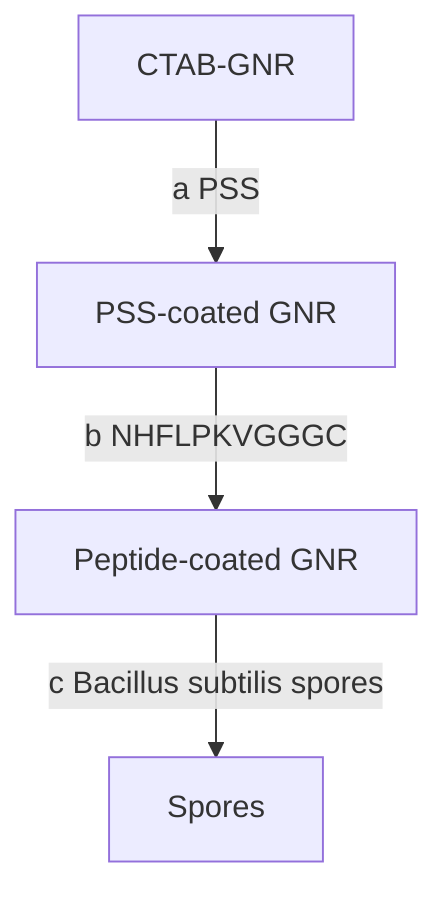

# Two-Photon Luminescence Imaging of Bacillus Spores Using Peptide-Functionalized Gold Nanorods

Wei He $^{1,\dagger}$ , Walter A. Henne $^{1,3,\dagger}$ , Qingshan Wei $^{1}$ , Yan Zhao $^{1}$ , Derek D. Doorneweerd $^{1,3}$ , Ji-Xin Cheng $^{1,2}$ , Philip S. Low $^{1,3}$ , and Alexander Wei $^{1,3}$ (✉)

$^{1}$ Purdue University, Department of Chemistry, 560 Oval Drive, West Lafayette, IN 47907, USA  
$^{2}$ Purdue University, Weldon School of Biomedical Engineering, 206 S. Martin Jischke Drive, West Lafayette, IN 47907, USA  
$^{3}$ Center of Sensing Science and Technology, Purdue University, West Lafayette, IN 47907, USA

Received: 30 June 2008 / Revised: 22 October 2008 / Accepted: 22 October 2008

©Tsinghua Press and Springer-Verlag 2008. This article is published with open access at Springerlink.com

## ABSTRACT

Bacillus subtilis spores (a simulant of Bacillus anthracis) have been imaged by two-photon luminescence (TPL) microscopy, using gold nanorods (GNRs) functionalized with a cysteine-terminated homing peptide. Control experiments using a peptide with a scrambled amino acid sequence confirmed that the GNR targeting was highly selective for the spore surfaces. The high sensitivity of TPL combined with the high affinity of the peptide labels enables spores to be detected with high fidelity using GNRs at femtomolar concentrations. It was also determined that GNRs are capable of significant TPL output even when irradiated at near infrared (NIR) wavelengths far from their longitudinal plasmon resonance (LPR), permitting considerable flexibility in the choice of GNR aspect ratio or excitation wavelength for TPL imaging.

## KEYWORDS

Bionanotechnology, nanorods, nonlinear optics, pathogen detection, peptides

## Introduction

Optical modalities for detecting pathogenic microorganisms should be sufficiently sensitive to enable the rapid and accurate identification of bioparticles in natural settings, while discriminating against background signals to minimize false positives. Nonlinear optical modalities such as two-photon luminescence (TPL) are well suited for this purpose because of their intrinsically low autofluorescence under multiphoton excitation conditions, resulting in much higher signal-to-noise than conventional (linear) optical imaging methods $[1-4]$ . TPL and other multiphoton processes can be excited at near infrared (NIR) frequencies below 750 nm, a spectral region which permits photons to penetrate through biological tissues with relatively high transmittivity. These attributes give TPL and related imaging modalities the potential to detect individual pathogens in complex environments, if coupled with a suitably developed agent for targeted imaging.

Plasmon-resonant gold nanorods (GNRs) have recently been shown to produce strong TPL activity using femtosecond-pulsed laser excitation $[5–8]$ , and provide excellent contrast for TPL imaging applications $[8–12]$ . GNRs can support a higher absorption cross section at NIR frequencies per unit volume than most other nanostructures $[13]$ , are efficiently prepared in micellar surfactant solutions using seeded growth conditions $[14, 15]$ , and can be stabilized by mild chemical treatments $[16]$ to facilitate their practical application as TPL contrast agents. GNRs can also be functionalized with chemisorptive ligands such as thiols $[17, 18]$ or dithiocarbamates $[10–12, 19]$ for their targeted delivery to cell surface receptors.

In this report, we demonstrate that GNRs can be used in bacterial detection schemes based on TPL imaging using a high-affinity peptide sequence specific for the spores of Bacillus subtilis, an established and widely used simulant species of Bacillus anthracis, the causative agent of anthrax $[20–23]$ . Current technologies employed for the detection of spores or other pathogenic organisms include the use of traditional antimicrobial culture techniques, antibody-based capture methods, immunoassays, and genomic analysis based on polymerase chain reaction (PCR) amplification $[22, 24–27]$ . All of these methods suffer from some limitations in the time to result or the number of steps involved. TPL imaging with functionalized GNRs is direct and can be complementary or even advantageous for pathogen detection, as its sensitivity has already been demonstrated at the single-particle limit for in vivo applications and also for the targeted labeling of tumor cells in vitro $[8, 11, 12]$ .

## 1. Experimental

TPL imaging was performed using a home-built inverted microscope system (IX-50, Olympus) equipped with a femtosecond-pulsed Ti:sapphire oscillator (Mira 900, Coherent) operating at 77 MHz, with a tunable wavelength output in the range of 700–900 nm. The luminescence was measured by a photomultiplier tube (Hamamatsu) with a bandpass filter of 500–600 nm. The excitation pulses were focused onto the bottom of an optically transparent cover dish (Biosciences, CA) using a 60× water-immersion objective (N.A. = 1.2, Olympus).

Images were acquired at a resolution of 256 pixels × 256 pixels (26.2 μm × 26.2 μm) at a scanning rate of 2 frames per second.

GNRs were synthesized as previously reported $[14–16]$ . Briefly, seeded growth was carried out in a micellar solution of cetyltrimethylammonium bromide (CTAB) with $AgNO_{3}$ as an additive, followed by treatment with $Na_{2}S$ 15–20 min after injection of the seed solution to arrest further growth. GNRs (ca. 5 mg Au) were precipitated by centrifugation for 15 min at 9000 rpm (12 500 g) and separated from excess CTAB, then redispersed in 10 mL deionized water to an optical density (O.D.) of ca. 14. The CTAB-stabilized GNRs were then treated with 5 mL of a 1% polystyrenesulfonate (PSS) solution (MW \~70 kD, sonicated 30 min in 1 mmol/L NaCl before use) and the mixture was allowed to sit overnight, followed by the separation of GNRs from excess PSS by centrifugation. The PSS-stabilized GNRs were resuspended in deionized water to a final O.D. of 0.8. Several batches of GNRs were prepared in this manner, with $\lambda_{max}$ values of the final dispersions ranging from 685 to 875 nm.

A cysteine-terminated Bacillus binding oligopeptide (NHFLPKVGGGC) and a scrambled control sequence (LFNKHVPGGGC) were synthesized, purified, and characterized as previously described $[22, 28]$ . 50 $\mu$ L of a phosphate-buffered solution (PBS) containing oligopeptide (1 mg/mL, pH 7.4) was added to 5 mL of PSS-stabilized GNRs (O.D. 0.8) and allowed to sit at room temperature for at least 5 h (Fig. 1). The functionalized GNRs were separated from excess ligand by centrifugation for 10 min at 9000 rpm, and resuspended in 5 mL of a 1 mmol/L NaCl solution (final O.D. 0.5–0.6). Quantitative amino acid and ICP-MS analysis of a concentrated solution of GNRs (71 nm×28 nm, based on TEM size analysis) functionalized with the homing oligopeptide (O.D. ca. 12, $\lambda_{ex}=785$ nm) was found to contain 174 pmol/mL peptide and 423 ppm ( $\mu$ g/mL) of Au, corresponding to a GNR concentration of 0.83 nmol/L and a peptide-to-GNR ratio of 210. A similar analysis with the control peptide sequence yielded a somewhat higher peptide-to-GNR ratio, due to an uncertainty in the amount of peptide used.

Bacillus subtilis sp 168 were cultured for 72 h in sporulation media, purified, and quantified as previously described [22, 28]. In a typical experiment, spores ( $10^{6}-10^{9}$ per mL) were incubated for 45 min in the presence GNRs functionalized with either the homing peptide or negative control (scrambled sequence) at 37 °C (8 fmol/L-8 pmol/L, or $5\times10^{10}-5\times10^{13}$ GNRs per mL). The spores were subjected to centrifugation (2×5 min at 7000 rpm) with redispersion in fresh PBS to remove unbound GNRs, resulting in a suspension of GNR-labeled spores at final concentrations in the range $10^{6}-10^{7}$ particles/mL.

flowchart

Figure 1 Scheme describing the preparation of peptide-functionalized GNRs and their targeted labeling of Bacillus subtilis spores

These were deposited onto a cover dish with an optically transparent bottom (Biosciences, CA) and imaged as described above.

## 2. Results and discussion

We first examined polystyrene-sulfonate (PSS)-coated GNRs with different aspect ratios, to evaluate how these might impact their TPL activity at specific excitation wavelengths. The longitudinal plasmon resonance (LPR) responsible for the NIR-absorbing properties of GNRs is well known to be sensitive to particle aspect ratio [29], as well as to changes in the surface dielectric due to chemical adsorption [30].

The range of NIR tunability available by changes in aspect ratio is sufficient to produce GNRs with minimally overlapping LPR modes (Fig. 2(a)) [14-16]. The peak shifts due to electrostatic adsorption are less pronounced; in our case, only slight changes in LPR are observed with the adsorption of PSS or peptides on the GNR surface (Fig. 2(b)). Anionic polyelectrolytes such as PSS are often used to coat CTAB-stabilized GNRs to increase their dispersion stability in solutions at physiologically relevant pH and ionic strength, as well as to counteract dilution effects [31–34]. Stabilization issues must be addressed because multiple washes will reduce CTAB to below the critical micelle concentration (ca. 1 mmol/L) [10–12, 35], leading to the eventual flocculation of GNRs. It is worth mentioning that while PSS can help maintain the dispersion stability of GNRs in the short term, its adsorption to the CTAB-coated surface is not stable under shear conditions, indicating a need for more robust alternatives for GNR functionalization [36].

line chart

| Wavelength (nm) | Absorbance (Black Line) | Absorbance (Red Line) |
| --------------- | ------------------------ | ---------------------- |
| 685             | 0.7                      | -                      |
| 875             | -                        | 0.55                   |

(a)

line chart

| Wavelength (nm) | GNRs  | PSS-coated GNRs | Peptide-coated GNRs |
| --------------- | ----- | --------------- | ------------------- |
| 400             | 0.3   | 0.3             | 0.3                 |
| 500             | 0.25  | 0.25            | 0.25                |
| 600             | 0.2   | 0.2             | 0.2                 |
| 700             | 0.15  | 0.15            | 0.15                |
| 800             | 0.6   | 0.55            | 0.5                 |
| 900             | 0.3   | 0.3             | 0.3                 |
| 1000            | 0.1   | 0.1             | 0.1                 |

(b)  
Figure 2 (a) Peptide-functionalized GNRs with longitudinal plasmon resonances at 685 nm (black line) and 875 nm (red line); (b) absorption spectra of as-prepared GNRs (black line), PSS-coated GNRs (red line) and peptide-functionalized GNRs (blue line, $\lambda_{max}=806$ nm). Inset: transmission electron microscopy (TEM, Philips CM-10, 80 kV) image of peptide-functionalized GNRs

In previous studies, we have shown that the TPL from GNRs is most intense when the excitation wavelength overlaps with the LPR band, which implies a reduction in TPL activity at nonresonant wavelengths [8]. However, the very low autofluorescence background intrinsic to multiphoton imaging may be sufficient to support TPL contrast even under off-resonant excitation conditions. To test this, PSS-stabilized GNRs with well-separated LPRs ( $\lambda_{LPR} = 715$ and 835 nm) were deposited and immobilized onto mercaptopropylsiloxane-coated glass substrates [37], and subsequently exposed to pulsed NIR laser irradiation. As expected, the GNRs produced the maximum TPL contrast when excited at their respective LPR wavelengths, confirming the plasmon-resonant nature of two-photon absorption (Figs. 3(a) and 3(d)), but the TPL signals produced at off-peak excitation were also significant (Figs. 3(b) and 3(c)). This shows that the position of the LPR mode is not critical for generating TPL contrast with high signal-to-noise from GNRs.

PSS-coated GNRs were then functionalized with the cysteine-terminated homing peptide (NHFLPKVGGGC), which was recently established as a high-affinity targeting ligand for Bacillus subtilis [22, 28]. Bacillus spores were incubated with the peptide-functionalized GNRs, then washed and examined by TPL microscopy using a confocal laser scanning microscope, with the Ti:sapphire laser tuned to the GNR plasmon resonance with an output power of $1\mathrm{mW}$ . The excitation beam was aligned for optimal generation of TPL signals, which are displayed as pseudocolor images (Fig. 4(a)). Spores labeled with the GNR-homing peptide conjugate were easily identified, whereas spores incubated with GNRs conjugated to the control peptide with scrambled sequence (LFNKHVPGGGC) did not produce detectable signals even with an output power of 30 mW, confirming the specific targeting and TPL signaling by the homing peptide and GNR, respectively (Fig. 4(b)). The TPL signal-to-background ratios are on the order of several hundred, as evaluated from line intensity profiles (Figs. 4(c) and 4(d)).

text_image

λex = 715 mm
3 mW
LPR =715 nm

(a)

text_image

λ_ex = 715 mm
3 mW
LPR =835 nm

(b)

text_image

λex = 835 mm
3 mW
LPR =715 nm

(c)

text_image

λ_ex = 835 mm
3 mW
LPR =835 nm

(d)  
Figure 3 Two-photon luminescence imaging of PSS-stabilized GNRs immobilized on thiol-derivatized glass coverslips. TPL signals were filtered through a bandpass filter with cutoffs above 500 nm and below 600 nm. (a), (c) $\lambda_{LPR} = 715$ nm; (b), (d) $\lambda_{LPR} = 835$ nm. (a), (b) TPL signals from GNRs using unpolarized excitation at 715 nm with an output power of 3 mW. (c), (d) TPL signals from GNRs using unpolarized excitation at 835 nm with an output power of 3 mW

With respect to detection, spores at low particle counts ( $10^{6}$ and $10^{7}$ per mL) were dispersed with peptide-conjugated GNRs at concentrations ranging from 8 fmol/L to 8 pmol/L ( $5\times10^{10}$ to $5\times10^{13}$ GNRs per mL), then collected, washed, and examined by TPL and phase-contrast microscopy to determine labeling efficiency (selected images are shown in Fig. 5). A complete correlation between the TPL and brightfield images was observed in every case, demonstrating the high fidelity of targeting by the GNR–peptide labels. The targeting efficiency of the homing peptide for the spore surface compares well with that of folate for its cognate receptor $(K_{\mathrm{d}} \sim 10^{-10} \, \mathrm{mol/L})$ [38, 39]. A comparison of the TPL images reveals that the spore labeling density is quite uniform, suggesting that the spore surfaces are saturated even at the lowest GNR concentrations used.

natural_image

Microscopic image showing scattered fluorescent particles on a dark background, scale bar indicates 5.0 μm (no text or symbols present)

(a)

natural_image

Microscopic image showing a dark horizontal band with a 5.0 μm scale bar, no text or symbols present.

(b)

line chart

| Position (μm) | Intensity (a.u.) |
| ------------- | ---------------- |
| 0.0           | 0                |
| 0.5           | 100              |
| 1.0           | 1000             |
| 1.5           | 3000             |
| 2.0           | 0                |

(c)

line chart

| Position (μm) | Intensity (a.u.) |
| ------------- | ---------------- |
| 15            | 30               |
| 34            | 20               |

(d)

Figure 4 Two-photon luminescence imaging of peptide-functionalized GNRs on Bacillus subtilis spores. TPL signals were filtered through a bandpass filter with cutoffs at 500 and 600 nm: (a) pseudocolor TPL image of spores incubated with GNRs functionalized with homing peptide, excited by NIR laser pulses; (b) no TPL signals were produced by spores incubated with GNRs functionalized with control peptide, using similar excitation conditions; (c), (d) TPL intensity profiles corresponding to the white lines in TPL images (a) and (b), respectively. Color-coded scalebars in TPL images a and b correspond to the y-axis value in plot (c)  

natural_image

Microscopic image showing red fluorescent spots on a black background with a 5 μm scale bar (no text or symbols beyond scale indicator)

(a)

natural_image

Microscopic image showing red fluorescent spots on a black background with a 5 μm scale bar (no text or symbols beyond scale indicator)

(b)

natural_image

Microscopic image showing red fluorescent particles on a black background with 5 μm scale bar (no text or symbols beyond scale indicator)

(c)

natural_image

Microscopic image showing red fluorescent particles against a black background, with a 5 μm scale bar (no text or symbols beyond scale indicator)

(d)

natural_image

Microscopic view of scattered particles with no visible text or symbols

(e)

natural_image

Microscopic view of scattered dark particles on a light background with a 5 μm scale bar (no text or symbols beyond the scale indicator)

(f)

natural_image

Microscopic view of scattered dark particles on a light background, scale bar indicates 5 μm (no text or symbols present)

(g)

natural_image

Microscopic view of rod-shaped bacterial cells with 5 μm scale bar (no text or symbols beyond scale indicator)

(h)  
Figure 5 Targeting fidelity of Bacillus subtilis spores by peptide-functionalized GNRs. (a)–(d) TPL images of GNR-labeled spores isolated from the following suspensions: (a) $10^{6}$ spores/mL and $5 \times 10^{10}$ GNRs/mL; (b) $10^{6}$ spores/mL and $5 \times 10^{11}$ GNRs/mL; (c) $10^{7}$ spores/mL and $5 \times 10^{10}$ GNRs/mL; (d) $10^{7}$ spores/mL and $5 \times 10^{11}$ GNRs/mL; (e)–(h) brightfield images of GNR-labeled spores corresponding to TPL images (a)–(d)

## 3. Conclusions

Bacterial spores are readily detected by TPL imaging using peptide-functionalized GNRs. The flexibility and high signal-to-background ratios afforded by TPL imaging and the chemical stability of GNRs make this system attractive for further development. Peptide-functionalized GNRs can also be employed as multifunctional imaging and therapeutic agents for the selective detection and photothermal destruction of pathogens, as was recently demonstrated by the targeted delivery of GNRs to parasitic protozoans $[40]$ and other bacteria $[41]$ . The photophysical properties of the GNRs, combined with the efficiency of phage display methods for identifying peptide-based targeting ligands $[28]$ , provide the foundations for a new class of imaging agents with potential antibiotic activity.

## Acknowledgements

This work is supported by the National Institute of Health (EB-001777) and also by the Department of Defense (W911SR-08-C-0001), administered through the U.S. Army RDECOM (Edgewood Contracting Division) and the Center for Sensing Science and Technology at Purdue University. We gratefully acknowledge Prof. Arthur Aronson for providing B. subtilis spores, Dr. Dorota Inerowicz for quantitative peptide analysis, and Prof. Ron Reifenberger, Prof. Yeong Kim, Dr. Haifeng Wang, and Dr. Alexei Leonov for helpful discussions.

## References

[1] Brown, E. B.; Campbell, R. B.; Tsuzuki, Y.; Xu, L.; Carmeliet, P.; Fukumura, D.; Jain, R. K. In vivo measurement of gene expression, angiogenesis and physiological function in tumors using multiphoton laser scanning microscopy. Nat. Med. 2001, 7, 864–868.

[2] Helmchen, F.; Denk, W. Deep tissue two-photon microscopy. Nat. Methods 2005, 2, 932–940.  
[3] Yelin, D.; Oron, D.; Thiberge, S.; Moses, E.; Silberberg, Y. Multiphoton plasmon-resonance microscopy. Opt. Express 2003, 11, 1385–1391.  
[4] Zhu, L.; Loo, W. T. Y.; Chow, L. W. C. Circulating tumor cells in patients with breast cancer: Possible predictor of micro-metastasis in bone marrow but not in sentinel lymph nodes. Biomed. Pharmacother. 2005, 59, S355–S358.  
[5] Bouhelier, A.; Bachelot, R.; Lerondel, G.; Kostcheev, S.; Royer, P.; Wiederrecht, G. P. Surface plasmon characteristics of tunable photoluminescence in single gold nanorods. Phys. Rev. Lett. 2005, 95, 267405.  
[6] Imura, K.; Nagahara, T.; Okamoto, H. Plasmon mode imaging of single gold nanorods. J. Am. Chem. Soc. 2004, 126, 12730–12731.  
[7] Imura, K.; Nagahara, T.; Okamoto, H. Near-field two-photon-induced photoluminescence from single gold nanorods and imaging of plasmon modes. J. Phys. Chem. B 2005, 109, 13214–13220.  
[8] Wang, H.; Huff, T. B.; Zweifel, D. A.; He, W.; Low, P. S.; Wei, A.; Cheng, J. -X. In vitro and in vivo two-photon luminescence imaging of single gold nanorods. P. Natl. Acad. Sci. U.S.A. 2005, 102, 15752–15756.  
[9] Durr, N. J.; Larson, T.; Smith, D. K.; Korgel, B. A.; Sokolov, K.; Ben-Yakar, A. Two-photon luminescence imaging of cancer cells using molecularly targeted gold nanorods. Nano Lett. 2007, 7, 941–945.  
[10] Huff, T. B.; Hansen, M. N.; Zhao, Y.; Cheng, J. -X.; Wei, A. Controlling the cellular uptake of gold nanorods. Langmuir 2007, 23, 1596–1599.  
[11] Huff, T. B.; Tong, L.; Zhao, Y.; Hansen, M. N.; Cheng, J.-X.; Wei, A. Hyperthermic effects of gold nanorods on tumor cells. Nanomedicine 2007, 2, 125–132.  
[12] Tong, L.; Zhao, Y.; Huff, T. B.; Hansen, M. N.; Wei, A.; Cheng, J. -X. Gold nanorods mediate tumor cell death by compromising membrane integrity. Adv. Mater. 2007, 19, 3136–3141.  
[13] Jain, P. K.; Lee, K. S.; El-Sayed, I. H.; El-Sayed, M. A. Calculated absorption and scattering properties of gold nanoparticles of different size, shape, and composition: Applications in biological imaging and biomedicine. J. Phys. Chem. B 2006, 110, 7238–7248.  
[14] Nikoobakht, B.; El-Sayed, M. A. Preparation and growth mechanism of gold nanorods (NRs) using seed-mediated growth method. Chem. Mater. 2003, 15, 1957–1962.  
[15] Sau, T. K.; Murphy, C. J. Seeded high yield synthesis of short Au nanorods in aqueous solution. Langmuir 2004, 20, 6414–6420.  
[16] Zweifel, D. A.; Wei, A. Sulfide-arrested growth of gold nanorods. Chem. Mater. 2005, 17, 4256–4261.  
[17] Liao, H.; Hafner, J. H. Gold nanorod bioconjugates. Chem. Mater. 2005, 17, 4636–4641.  
[18] Oyelere, A. K.; Chen, P. C.; Huang, X.; El-Sayed, I. H.; El-Sayed, M. A. Peptide-conjugated gold nanorods for nuclear targeting. Bioconjug. Chem. 2007, 18, 1490–1497.  
[19] Zhao, Y.; Pérez-Segarra, W.; Shi, Q.; Wei, A. Dithiocarbamate assembly on gold. J. Am. Chem. Soc. 2005, 127, 7328–7329.  
[20] Turnbull, C. L., Jr. Discovery of phage display peptide ligands for species-specific detection of Bacillus spores. J. Microbiol. Meth. 2003, 53, 263–271.  
[21] Stachowiak, J. C.; Shugard, E. E.; Mosier, B. P.; Renzi, R. F.; Caton, P. F.; Ferko, S. M.; Van de Vreugde, J. L.; Yee, D. D.; Haroldsen, B. L.; Vandernoot, V. A. Autonomous microfluidic sample preparation system for protein profile-based detection of aerosolized bacterial cells and spores. Anal. Chem. 2007, 79, 5763–5770.  
[22] Dhayal, B.; Henne, W. A.; Doorneweerd, D. D.; Reifenberger, R. G.; Low, P. S. Detection of Bacillus subtilis spores using peptide-functionalized cantilever arrays. J. Am. Chem. Soc. 2006, 128, 3716–3721.  
[23] Clark Burton, N.; Adhikari, A.; Grinshpun, S. A.; Hornung, R.; Reponen, T. The effect of filter material on bioaerosol collection of Bacillus subtilis spores used as a Bacillus anthracis simulant. J. Environ. Monitor. 2005, 7, 475–480.  
[24] Logan, N. A.; Carman, J. A. Identification of Bacillus anthracis by API tests. J. Med. Microbiol. 1985, 20, 75–85.  
[25] Fasanella, A.; Losito, S. PCR assay to detect Bacillus anthracis spores in heat-treated specimens. J. Clin. Microbiol. 2003, 41, 896–899.  
[26] Farrell, S.; Halsall, H. B. Immunoassay for B. globigii spores as a model for detecting B. anthracis spores in finished water. Analyst 2005, 130, 489–497.  
[27] Bashir, R. BioMEMS: State-of-art in detection, opportunities and prospects. Adv. Drug Deliv. Rev. 2004, 56, 1565–1586.  
[28] Knurr, J.; Benedek, O. Peptide ligands that bind selectively to spores of Bacillus subtilis and closely related species. Appl. Environ. Microbiol. 2003, 69, 6841–6847.  
[29] Burda, C.; Chen, X.; Narayanan, R.; El-Sayed, M. A. Chemistry and properties of nanocrystals of different  
shapes. Chem. Rev. 2005, 105, 1025–1102.  
[30] Yu, C.; Irudayaraj, J. Multiplex biosensor using gold nanorods. Anal. Chem. 2007, 79, 572–579.  
[31] Ding, H.; Yong, K. -T.; Roy, I.; Pudavar, H. E.; Law, W. C.; Bergey, E. J.; Prasad, P. N. Gold nanorods coated with multilayer polyelectrolyte as contrast agents for multimodal imaging. J. Phys. Chem. C 2007, 111, 12552–12557.  
[32] Gole, A.; Murphy, C. J. Polyelectrolyte-coated gold nanorods: Synthesis, characterization and immobilization. Chem. Mater. 2005, 17, 1325–1330.  
[33] Gole, A.; Murphy, C. J. Azide-derivatized gold nanorods: Functional materials for “click” chemistry. Langmuir 2008, 24, 266–272.  
[34] Kim, K.; Huang, S. -W.; Ashkenazi, S.; O'Donnell, M.; Agarwal, A.; Kotov, N. A.; Denny, M. F.; Kaplan, M. J. Photoacoustic imaging of early inflammatory response using gold nanorods. Appl. Phys. Lett. 2007, 90, 223901.  
[35] Takahashi, H.; Niidome, Y.; Niidome, T.; Kaneko, K.; Kawasaki, H.; Yamada, H. Modification of gold nanorods using phosphatidylcholine to reduce cytotoxicity. Langmuir 2006, 22, 2–5.  
[36] Leonov, A. P.; Zheng, J.; Clogston, J. D.; Stern, S. T.; Patri, A. K.; Wei, A. Detoxification of gold nanorods by treatment with polystyrenesulfonate. ACS Nano, in press.  
[37] Grabar, K. C.; Allison, K. J.; Baker, B. E.; Bright, R. M.; Brown, K. R.; Freeman, R. G.; Fox, A. P.; Keating, C. D.; Musick, M. D.; Natan, M. J. Two-dimensional arrays of colloidal gold particles: A flexible approach to macroscopic metal surfaces. Langmuir 1996, 12, 2353–2361.  
[38] Antony, A. C.; Low, P. S. Folate receptor-targeted drugs for cancer and inflammatory diseases. Adv. Drug Deliv. Rev. 2004, 56, 1055–1058.  
[39] Leamon, C. P.; Low, P. S. Delivery of macromolecules into living cells: A method that exploits folate receptor endocytosis. P. Natl. Acad. Sci. U.S.A. 1991, 88, 5572–5526.  
[40] Pissuwan, D.; Valenzuela, S. M.; Miller, C. M.; Cortie, M. B. A golden bullet? Selective targeting of Toxoplasma gondii tachyzoites using antibody-functionalized gold nanorods. Nano Lett. 2007, 7, 3808–3812.  
[41] Norman, R. S.; Stone, J. W.; Gole, A.; Murphy, C. J.; Sabo-Attwood, T. L. Targeted photothermal lysis of the pathogenic bacteria, Pseudomonas aeruginosa, with gold nanorods. Nano Lett. 2008, 8, 302–306.