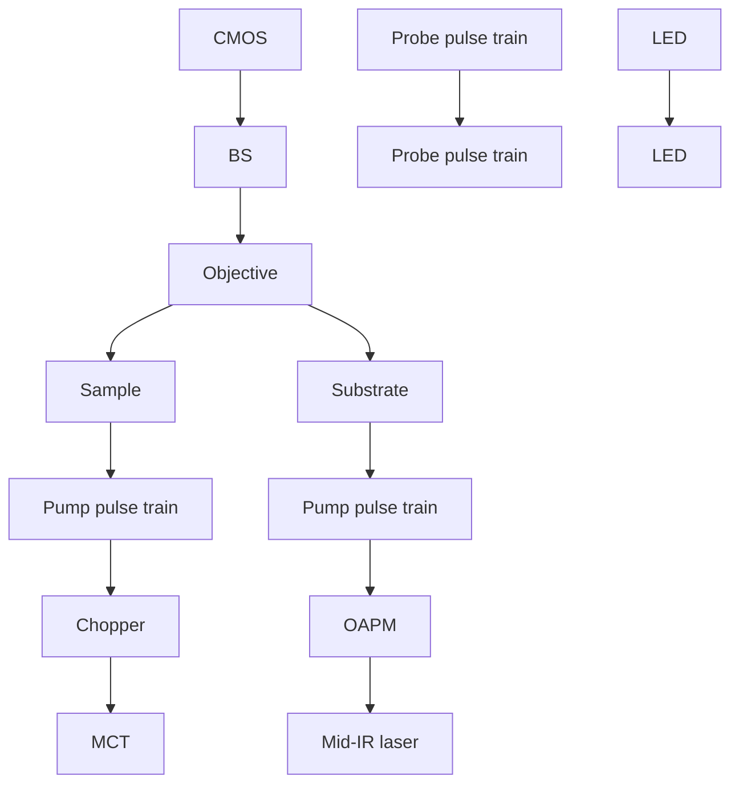
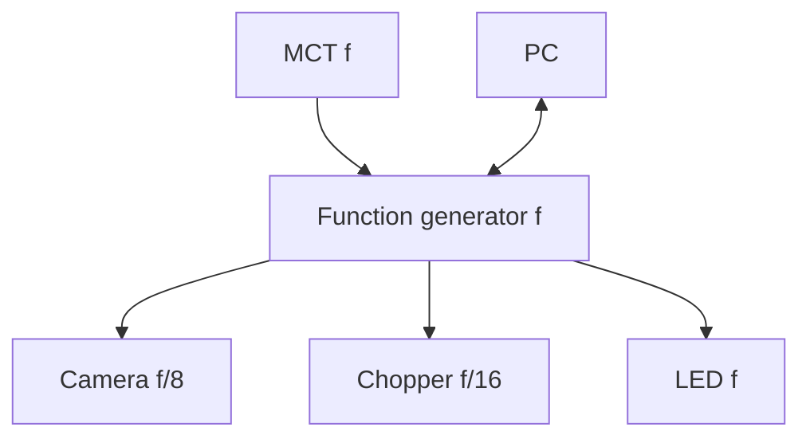

## A P P L I E D S C I E N C E S A N D E N G I N E E R I N G

# Ultrafast chemical imaging by widefield photothermal sensing of infrared absorption

Yeran Bai1,2,3,4\*, Delong Zhang3,4\*, Lu Lan4,5, Yimin Huang4,6, Kerry Maize7 , Ali Shakouri7† , Ji-Xin Cheng 3,4,5,6†

Infrared (IR) imaging has become a viable tool for visualizing various chemical bonds in a specimen. The performance, however, is limited in terms of spatial resolution and imaging speed. Here, instead of measuring the loss of the IR beam, we use a pulsed visible light for high-throughput, widefield sensing of the transient photo thermal effect induced by absorption of single mid-IR pulses. To extract these transient signals, we built a virtua lock-in camera synchronized to the visible probe and IR light pulses with precisely controlled delays, allowing submicrosecond temporal resolution determined by the probe pulse width. Our widefield photothermal sensing microscope enabled chemical imaging at a speed up to 1250 frames/s, with high spectral fidelity, while offering submicrometer spatial resolution. With the capability of imaging living cells and nanometer-scale polymer films, widefield photothermal microscopy opens a new way for high-throughput characterization of biological and material specimens.

Copyright © 2019 The Authors, some rights reserved exclusive licensee American Association for the Advancemen of Science. No claim to original U.S. Governmen Works. Distributed under a Creativ Commons Attribution NonCommercia License 4.0 (CC BY-NC)

## INTRODUCTION

Vibrational imaging methods offer a new window to characterize samples based on spectroscopic signatures of chemical bonds. Raman and infrared (IR) spectroscopy have long been used to interrogate materials by probing molecular vibrations without exogenous labels. Spontaneous Raman microscopy offers submicrometer spatial resolution imaging capability but suffers from the low acquisition rates (1, 2). With the advent of coherent Raman scattering techniques, videorate imaging speed has been demonstrated in the characterization of biological and pharmaceutical samples (3, 4). However, the extremely small Raman cross section $( \sim 1 0 ^ { - 3 0 ^ { \circ } } \mathsf { c m } ^ { 2 } \mathsf { s r } ^ { - 1 } )$ limits the detection sensitivity. On the other hand, the IR absorption offers a much larger cross section $( \sim 1 0 ^ { - 2 2 } \ c m ^ { 2 } \ s r ^ { - 1 } )$ that enables adequate sensitivity. Fourier transform IR (FTIR) spectrometer, together with its attenuated total reflection accessories, is the typical instrument of the technique and has been extensively used in the fields ranging from polymer science, pharmaceuticals, to biological research (5–7). Coupling focal plane array detectors to FTIR systems allows us to simultaneously acquire spatially resolved spectra, greatly improving the throughput for characterization of inhomogeneous samples (8). Unlike the conventional FTIR instrument based on interferometry and low-brightness globar excitation, discrete IR spectroscopic imaging techniques use tunable quantum cascade laser with much higher photon flux per wavenumber, which enables real-time IR imaging (9). Alternatively, up-conversion of mid-IR light to the visible region has also been demonstrated for hyperspectral IR imaging (10, 11). However, the long incident wavelengths in the mid-IR region determine the spatial resolution at several to tens of micrometers, which is not sufficient to resolve microstructures such a in biological cells.

1 Key Laboratory of High Power Laser and Physics, Shanghai Institute of Optics and Fine Mechanics, Chinese Academy of Sciences, Shanghai 201800, China. 2 Center of Materials Science and Optoelectronics Engineering, University of Chinese Academy of Sciences, Beijing 100049, China. 3 Department of Electrical and Computer Engineering, Boston University, Boston, MA 02215, USA. 4 Photonics Center, Boston University, Boston, MA 02215, USA. 5 Department of Biomedical Engineering, Boston University, Boston, MA 02215, USA. 6 Department of Chemistry, Boston University, Boston, MA 02215, USA. 7 Birck Nanotechnology Center, Purdue University, West Lafayette, IN 47906, USA. \*These authors contributed equally to this work. †Corresponding author. Email: jxcheng@bu.edu (J.-X.C.); shakouri@purdue.edu (A.S.)

Near-field scanning approach provides a way to surpass the fun damental limitation in resolution (12–15). Apertureless near-field scanning microscope combines atomic force microscopy (AFM) with IR spectroscopy (14, 15), where the AFM cantilever changes the oscil lation amplitude due to the surface thermal expansion induced by th absorption of the mid-IR light. The spectra, at nanoscale localization, are obtained by recording the amplitude change while sweeping the wavelengths of the mid-IR light source. With the capability of providing high spatial resolution chemical mapping, AFM-IR has been a valuable tool to study block copolymer system where the domain siz is typically tens of nanometers (16). Yet, this technique shares the in herent drawback of tip-based imaging modality of low acquisition speed. In addition, although some work showed the capability of investigating samples in aqueous environment using the total internal reflection of an IR prism to minimize the influence of water, sophis ticated setup and data processing procedure make it unsuitable for routine use (17, 18).

In contrast, a noncontact probe, such as a visible laser, can reduce the limits on sample preparation and provide higher imaging speed. Recently, the Cheng group developed a mid-infrared photothermal (MIP) microscope using a visible laser to probe the IR absorption– induced thermal lensing effect in the sample, providing chemical im aging capability with submicrometer resolution and depth resolution (19), which fills the gap between FTIR and AFM-IR microscopy. When the IR wavelength is tuned to the absorption peak of the sample, the co-propagated probe beam will change its divergence due to the thermal-induced local refractive index change. Using this approach chemically selective imaging of live cells and organisms was demon strated (19, 20). For nontransparent samples, a backward-detected photothermal microscope was developed to allow chemical mapping of active pharmaceutical ingredients and excipients of drug tablets (21). Other groups have also implemented optical probing of IR absorp tion. Lee and Lee (22) reported optical IR imaging by using a 3.5-mm IR source produced through difference frequency generation be tween two near-IR beams. Furstenberg et al. (23) demonstrated photo thermal imaging of materials using a visible laser probe. Erramill and co-workers (24, 25) investigated the nonlinear phototherma phenomena causing spectral peak splitting at different phase states of liquid crystal. The Sander group demonstrated photothermal IR imaging of a thin polymer film with a spatial resolution of 3.1 mm (26) and reported photothermal IR imaging of mouse brain tissue slices targeting the protein amide I band, consistent with hematoxylin and eosin staining results (27). Recently, the Hartland and Kuno groups reported a counter-propagation scheme at a 300-nm resolution with chemical specificity and its application to characterize the perovskite-based solar cell (28, 29). In these pixel-by-pixel scanning implementations, the imaging speed is limited by the pixel dwell time needed to cover the photothermal decay process. In addition, focus mismatch between IR and visible beams that leads to only a small portion of IR photons was used. On the basis of speckle pattern and Mie scattering, widefield photothermal imaging has been demonstrated (30, 31), with a typical acquisition time of \~20 s for a field of view of 17 mm by 17 mm. In these previous studies, the low signal level due to the limited number of scattered photons hampers the imaging speed, and is insufficient for the study of living specimens or for highthroughput screening purpose.

Here, we demonstrate a widefield photothermal sensing (WPS) microscope that allows ultrafast chemical imaging at a speed up to 1250 frames/s. To enable high-throughput detection of IR absorp tion, a multi-element photodetector, such as a camera, is required. However, generic cameras are not fast enough to resolve the transient thermal process at the microsecond level, i.e., 1 million frames/s. To achieve high temporal resolution using regular cameras, time-gated detection using pulsed light was previously demonstrated for mapping electronic currents in integrated circuits (32, 33). Here, we borrow this concept and build a virtual lock-in camera, where the exposure frames are synchronized to the probe pulses and the IR pulses at the same repetition rate with precisely controlled time delays. Our method enables time-resolved imaging of the transient thermal process using a regular camera, with a temporal resolution determined by the probe pulse width.

Furthermore, to enable efficient delivery of the IR laser to the sample and reflection of the probe photons to the camera, we adopt widely available silicon wafers as the substrate for its transparency in the IR window and high reflectance of visible photons. The silicon substrate further enhances the photothermal sensing speed by accelerating the heat dissipation. Silicon has high thermal conductivity $\dot { ( } 1 5 0 \mathrm { W } \mathrm { m } ^ { - 1 } \dot { \mathrm { K } } ^ { - 1 } )$ compared to other IR transparent materials such as $\mathrm { C a F } _ { 2 } \left( 1 0 \mathrm { W } \mathrm { m } ^ { - 1 } \mathrm { K } ^ { - 1 } \right)$ ), which avoids heat accumulation and allows faster imaging. In addition, the pure scattering field is much enhanced through interference, where the reference field is provided by the silicon-reflected light. Collectively, these innovations enabled ultrafast detection of IR-induced photo thermal signals in a widefield manner.

## RESULTS

## WPS microscope

The widefield photothermal imaging system is based on a widefield reflection microscope (Fig. 1; detailed in Materials and Methods). A pulsed blue light-emitting diode (LED) was used to illuminate the sample through a 4f lens system, a 50/50 beam splitter, and an objective. The light reflected from the sample was then collected by th same objective and beam splitter and recorded by a camera with a tube lens. The pump source was provided by a nanosecond-pulsed mid-IR laser, which was weakly focused into a sample through the silicon wafer. The counter-propagation beam configuration, as previously demonstrated by the Hartland and Kuno groups (28, 29), is adopted in our work, except that we used a pulsed widefield illumination instead of tight-focusing condition. A chopper was used to modulate the IR pulse train to accommodate the speed of the camera. The master clock of the system was provided by the IR laser, monitored with a mercury cadmium telluride (MCT) detector through a residual IR beam picked up from a CaF2 plate.

flowchart

Fig. 1. Schematic of WPS microscope. A nanosecond mid-IR laser (bottom right) was sent through an optical chopper and weakly focused on the sample. The IR beam was partially sampled with a CaF2 plate (P) and sent to an MCT detector. The probe was provided by a 450-nm LED, which was imaged to the back aperture of an imaging objective by a 4f lens system and a 50/50 beam splitter (BS). The sample-reflected light was collected by the same objective and sent to an image sensor with a tube lens. GM, gold mirror; OAPM, off-axis parabolic mirror; CMOS, complementary metal-oxide semiconductor.

## Widefield measurement of transient thermal signa

To extract the transient photothermal signal, we developed a virtua lock-in camera synchronized to the IR laser repetition rate with pre cise delays of the probe pulse. By using a pulsed probe light, the tem poral resolution of the system was determined by the pulse width of the probe light, which was around 900 ns. Figure 2A shows the block diagram of widefield detection. The master clock from the MCT was used to trigger the function generator, which sent square wave trig gers to the camera, chopper, and LED. The time delay of the probe pulse relative to the pump pulse was controlled electronically by the function generator. The camera provides a frequency division function that enables exposing under 2500 Hz with a 20-kHz external trigger frequency. Furthermore, the optical chopper frequency wa locked to the camera exposure period to ensure complete block of the IR pulses when necessary.

The actual pulse trains of pump and probe pulses relative to the camera exposure were measured and plotted in Fig. 2 (B and C) The camera exposure indicator is plotted in channel 3, with high volt age level representing the actual camera exposure period. Figure 2C shows a zoom-in image of the pump and probe delay. As a result, the IR pulses were chopped into bursts with as few as eight pulses during a camera exposure, recorded by the visible probe pulses with controlled delays. We define the images with mid-IR pulses as “hot” frames, and those without as “cold” frames. Therefore, the final dat became an image stack with alternating hot and cold frames. For the widefield scheme, all pixels within the field of view were recorded simultaneously. To extract the signal, each hot frame was subtracted by a subsequently recorded cold frame, and the subtraction results were integrated until a reasonable signal-to-noise ratio (SNR) was reached (Fig. 2D). Furthermore, the thermal decay profile can be mapped by scanning the pump-probe delays.

A  

flowchart

B  

text_image

Mid-IR
pump
Visible
probe
Camera
exposure
Hot
frame
Cold
frame
D
Sum ( -
)= 9E3
0
9E3

C  

line chart

| x    | Red Line | Blue Line |
| ---- | -------- | --------- |
| 0    | 1.0      | 0.0       |
| 1    | 0.0      | 0.0       |
| 2    | 0.0      | 0.0       |
| 3    | 0.0      | 0.0       |
| 4    | 0.0      | 0.0       |
| 5    | 0.0      | 0.0       |
| 6    | 0.0      | 0.0       |
| 7    | 0.0      | 0.0       |
| 8    | 0.0      | 0.0       |
| 9    | 0.0      | 0.0       |
| 10   | 0.0      | 0.0       |
| 11   | 0.0      | 0.0       |
| 12   | 0.0      | 0.0       |
| 13   | 0.0      | 0.0       |
| 14   | 0.0      | 0.0       |
| 15   | 0.0      | 0.0       |
| 16   | 0.0      | 0.0       |
| 17   | 0.0      | 0.0       |
| 18   | 0.0      | 0.0       |
| 19   | 0.0      | 0.0       |
| 20   | 0.0      | 0.0       |
| 21   | 0.0      | 0.0       |
| 22   | 0.0      | 0.0       |
| 23   | 0.0      | 0.0       |
| 24   | 0.0      | 0.0       |
| 25   | 0.0      | 0.0       |
| 26   | 0.0      | 0.0       |
| 27   | 0.0      | 0.0       |
| 28   | 0.0      | 0.0       |
| 29   | 0.0      | 0.0       |
| 30   | 0.0      | 0.0       |
| 31   | 0.0      | 0.0       |
| 32   | 0.0      | 0.0       |
| 33   | 0.0      | 0.0       |
| 34   | 0.0      | 0.0       |
| 35   | 0.0      | 0.0       |
| 36   | 0.0      | 0.0       |
| 37   | 0.0      | 0.0       |
| 38   | 0.0      | 0.0       |
| 39   | 0.0      | 0.0       |
| 40   | 0.0      | 0.0       |
| 41   | 0.0      | 0.0       |
| 42   | 0.0      | 0.0       |
| 43   | 0.0      | 0.0       |
| 44   | 0.0      | 0.0       |
| 45   | 0.0      | 0.0       |
| 46   | 0.0      | 0.0       |
| 47   | 0.0      | 0.0       |
| 48   | 0.0      | 0.0       |
| 49   | 0.0      | 0.0       |
| 50   | 0.0      | 0.0       |
| 51   | 0.0      | 0.0       |
| 52   | 0.0      | 0.0       |
| 53   | 0.0      | 0.0       |
| 54   | 0.0      | 0.0       |
| 55   | 0.0      | 0.0       |
| 56   | 0.0      | 0.0       |
| 57   | 0.0      | 0.0       |
| 58   | 0.0      | 0.0       |
| 59   | 0.0      | 0.0       |
| 60   | 0.0      | 0.0       |
| 61   | 0.0      | 0.0       |
| 62   | 0.0      | 0.0       |
| 63   | 0.0      | 0.0       |
| 64   | 0.0      | 0.0       |
| 65   | 0.0      | 0.0       |
| 66   | 0.0      | 0.0       |
| 67   | 0.0      | 0.0       |
| 68   | 0.0      | 0.0       |
| 69   | 0.0      | 0.0       |
| 70   | 0.0      | 0.0       |
| 71   | 0.0      | 0.0       |
| 72   | 0.0      | 0.0       |
| 73   | 0.0      | 0.0       |
| 74   | 0.0      | 0.0       |
| 75   | 0.0      | 0.0       |
| 76   | 0.0      | 0.0       |
| 77   | 0.0      | 0.0       |
| 78   | 0.0      | 0.0       |
| 79   | 0.0      | 0.0       |
| 80   | -        | -         |
| ... (additional values) are not provided in the code image.

Fig. 2. Camera-based photothermal imaging. (A) Block diagram. The MCT detector was used to capture the IR laser pulses to generate the master clock f at the repetition rate of the IR laser to trigger the function generator, which sent square wave triggers to the camera, chopper, and LED. The internal frequency divider of the camera was set to expose at f/8 frames/s. The chopper divided the trigger pulses by 16 to modulate the pump. A computer was used to control the camera and store the data. (B) Measured pulses of the IR (red), visible (blue), and camera exposure monitor (purple) with an oscilloscope. For the 20-kHz laser repetition rate and 2500-Hz camera frame rate, each frame contained eight probe pulses. (C) Zoom-in view of individual pump and probe pulses. The time scale for each grid is 100 ms in (B) and 500 ns in (C). (D) Image processing procedure to generate a photothermal image. Contrast was created by subtraction between hot and cold frames. Scale bars, 40 mm.

## Origin of contrast

To explain the origin of the signal, we built a model based on interference and used thin-film samples as an example to illustrate the model. For a thin-film sample on top of the silicon substrate, there are two major reflections: the air-sample interface and the sample-substrate interface (fig. S1A). Together with the interference term and unde near-normal incident approximation, the percentage of reflection R at probe wavelength l can be described as (34)

$$
R (\lambda) = \frac {r _ {1} ^ {2} + r _ {2} ^ {2} + 2 r _ {1} r _ {2} \cos (2 k _ {0} n _ {1} (\lambda) d)}{1 + r _ {1} ^ {2} r _ {2} ^ {2} + 2 r _ {1} r _ {2} \cos (2 k _ {0} n _ {1} (\lambda) d)} \tag {1}
$$

where $r _ { 1 } ( \lambda ) = [ n _ { 0 } ( \lambda ) - n _ { 1 } ( \lambda ) ] / [ n _ { 0 } ( \lambda ) + n _ { 1 } ( \lambda ) ]$ and $r _ { 2 } ( \lambda ) = \left[ n _ { 1 } ( \lambda ) - \right.$ $n _ { 2 } ( \lambda ) ] / [ n _ { 1 } ( \lambda ) + n _ { 2 } ( \lambda ) ]$ are reflections as a function of refractive index $n ( \lambda )$ of the material at the two interfaces and d is the thickness of the sample. The subscripts 0, 1, and 2 refer to the layer of air, sample, and the substrate, respectively. When the IR beam is absorbed by the sam ple, heat is produced and the maximum temperature increase can be described as $\Delta T \propto \sigma I _ { \mathrm { I R } } / \rho C ,$ where s is the absorption coefficient, $I _ { \mathrm { I R } }$ is the pump beam intensity, and r and C are the density and heat capacity of the sample, respectively (35). The temperature rise DT will induce a refractive index change and a thermal expansion of the sample: $n _ { 1 } ^ { ' } ( \lambda ) = n _ { 1 } ( \lambda )$ aDT and $d ^ { \prime } = d ( 1 + \beta \Delta T )$ ). Here, a is the thermooptic coefficient dn/dT and b is the coefficient of thermal expansion (1/L)(dL/dT). The detected light R′ (l) at the hot state is acquired with the update of $n _ { 1 } ^ { ' } ( \lambda )$ and $d ^ { \prime }$ in Eq. 1. After integrating all the probe wavelengths within the spectral width of the LED, the photothermal signal is derived by comparing the difference of R′ and R. We used the poly(methyl methacrylate) (PMMA) as an example for simulation. The reflection curve at the hot state was calculated with the material’s thermal properties (36) and showed together with the reflection at cold state (fig. S1B). The simulated reflection difference $( R ^ { \prime } - R ) / R$ for PMMA film thickness ranging from 0 to 500 nm was plotted in fig. S1C, where a strong etalon effect was observed. We performed experiments with selected film thickness, and the results matched wel with the simulation results (fig. S1C). For particle samples, the de tected light is from the interface reflection, particle scattering, and in terference field. Because there is no closed-form equation, numerical simulation methods reported by Li et al. (28) should be used.

## Temporal resolution and chemical selectivity

To characterize the temporal resolution, we performed time-resolved WPS imaging of 486-nm-thick PMMA film on silicon substrate. The IR pump was tuned to 1728 $\mathrm { c m } ^ { - 1 }$ (the C==O absorption peak in PMMA). The probe width was around 914 ns, and each image was acquired at a speed of 2 Hz. The probe power at sample was around 1.6 mW, limited by the full well capacity of the camera. Estimation of maximum probe power saturating the camera sensor is provided in the Supplementary Materials. The pump power at the sample was around 5.1 mW. By subtracting the cold frames by the hot frames, i.e., contrast reversed for better visualization, WPS imaging at various pump-probe delays was acquired (Fig. 3A). The bright spot in the center of the field of view corresponded to the weakly focused

IR spot. The signal intensity at the center of each image was used to plot the temporal profile of photothermal signal, with time delay ranging from −0.97 to 3.89 ms (Fig. 3B). The video of the decay can be found in movie S1. The data points were well fitted into an expo nential decay e − /t , where t is the time delay and t = 1.1 ms is the decay constant, indicating a fast cooling time. Note that the decay constants should not be confused with temporal resolution, which is determined by the probe pulse width, i.e., 914 ns, in our system.

We further demonstrated the spectral fidelity of our WPS mi croscope. We tuned the pump wavelengths at the time delay where the WPS signal was maximized. The raw spectrum was normalized by the pump power (Fig. 3C). The black curve was the reference FTIR spectrum measured with a commercialized FTIR spectrometer (VERTEX 70v, Bruker). A good agreement was obtained between the WPS signal in terms of photoelectron counts and the standard FTIR spectrum.

A  

natural_image

Four-panel scientific image showing a bright central spot with diffuse surrounding glow, labeled t1 to t4, under a 5E4 color scale (no text or symbols beyond labels)

B  

line chart

| Delay (μs) | WPS signal (1E4) | FTIR absorption % |
| --- | --- | --- |
| -1.0 | 2.5 | 0.0 |
| -0.5 | 3.0 | 0.0 |
| 0.0 | 4.5 | 0.0 |
| 0.5 | 4.8 | 0.0 |
| 1.0 | 3.5 | 0.0 |
| 1.5 | 2.5 | 0.0 |
| 2.0 | 1.5 | 0.0 |
| 2.5 | 1.0 | 0.0 |
| 3.0 | 0.7 | 0.0 |
| 3.5 | 0.5 | 0.0 |
| 4.0 | 0.3 | 0.0 |

Fig. 3. Time-resolved WPS imaging of PMMA film on silicon at the 1728 cm−1 C=O band. (A) WPS images of a 486-nm-thick PMMA film at different pump-probe delays. Scale bar, 40 mm. The probe width was 914 ns. Imaging speed: 2 Hz. Imaging contrast: cold-hot. Power at the sample: pump, 5.1 mW; probe, 1.6 mW. (B) Tempora profile of WPS signal (squares) and the exponential decay fitting result (curve). The decay constant was 1.1 ms. (C) Spectral profile of WPS signal (squares) and the reference FTIR spectrum of PMMA (curve).

## Submicrometer spatial resolution

To evaluate the spatial resolution, WPS imaging of polymer film pat terns and beads was performed (Fig. 4). The “MIP” letters were etched off a PMMA film around 310 nm thick using electron-beam lithog raphy, and the bare silicon showed higher reflectivity compared to the remaining areas. The widefield reflection image is shown in Fig. 4A. The letter “I” was 2 mm in width and 10 mm in length. The WPS imaging of the pattern was acquired within 0.5 s with a cold frame minus a hot frame, showing clear contrast at the etching boundaries (Fig. 4B) The intensity profile along the line was extracted, as indicated in Fig. 4B Nine adjacent lines were averaged to perform the first derivative (Fig. 4C). The theoretical value for optical resolution with 0.66–numerica aperture (NA) objective and 450-nm illumination is calculated to be 0.42 mm. The Gaussian fitting result showed a full width at half max imum (FWHM) of 0.51 mm, indicating a submicrometer resolution, which is consistent with the calculated value.

To test the sensitivity, we measured the WPS signal at different thicknesses with fixed pump-probe delay (fig. S1C). We reached an SNR of 8 for 0.2% difference between cold and hot frames. The de tection sensitivity can be further improved by coupling a thermal iso lation layer to increase the photothermal signal (37).

To demonstrate the capability of imaging microparticles, we per formed WPS imaging of 1-mm PMMA beads. The reflection image of beads on silicon wafer is shown in Fig. 4D. Although the magnification of the system was not well optimized for these small particles, the images still have sufficient pixels for each bead. The WPS imaging of the same area was acquired with the signal averaged for 0.5 s (Fig. 4E). Individual beads were resolved at the PMMA C==O peak at 1728 cm−1 , while no contrast was shown at the off-resonance wavelength at 1808 cm−1 (Fig. 4, E and F). Here, for consistency, we used the same camera settings for WPS imaging. Note that the field of view is only about a quarter of the previous “MIP” pattern in Fig. 4 (A to C), which potentially provides fourfold increase in imaging speed without any changes of the instruments.

  
Fig. 4. WPS imaging of etched pattern in PMMA film and microparticles. (A) Reflection image of the pattern, where the etched-off parts showed higher reflectivity (B) WPS image of the same area. (C) First derivative of the intensity profile along the line shown in (B) as squares. a.u., arbitrary units. Gaussian fitting (red line) showe an FWHM of 0.51 mm. (D) Reflection image of 1 mm of PMMA particles. (E) WPS image of the same area with the pump at 1728 cm−1 . (F) Off-resonance image showed no contrast. Scale bars, 10 mm.

## Ultrafast chemical mapping of a nanoscale film at the shot-noise limit

We demonstrated widefield photothermal imaging of a thin PMMA film (486.89 ± 0.16 nm) and evaluated the SNR as a function of im aging speed (Fig. 5). A total of 1054 frames was captured in 410 ms, i.e., 0.39-ms exposure time per frame, with a field of view of 136 mm by 108.8 mm. This results in a WPS imaging speed of 1250 frames/s. For noise measurement, a reference experiment was performed, with the pump turned off. Therefore, the subtracted results were pure noise from the camera and the probe photon fluctuation. The SNR was calculated from the center region (25 pixels) by the ratio of the mean difference between the signal and reference to the SD of the noise. Figure 5A shows a single frame from the time trace, with the SNR cal culated to be 2.3. Notably, the single-frame chemical image was based on only eight IR pump pulses. To further improve SNR, frame averaging was used as a trade-off of imaging speed (Fig. 5, B to E). We measured and calculated the SNR of each frame and fitted the results with a power function (Fig. 5F). The solid curve was the fitting result of different accumulating frames. The exponent term was 0.48, close to the theoretical limit of 0.5, indicating that the setup has been optimized for working near shot-noise limit. A video with an imaging speed of 1250 frames/s is available (movie S2). The signal intensities were relatively stable during the 0.42-s recording period, implying no sign of sample damage or photobleaching.

## Widefield photothermal imaging of living cells

To demonstrate the capability of our WPS microscope for biological samples, we performed WPS imaging of living SKOV3 human ovarian cancer cells. Figure 6A shows the reflection bright-field image. The dark spots around the nucleus were confirmed to be lipid droplets by the WPS image at 1744 cm−1 corresponding to the C==O bond in triglyceride (Fig. 6B). The individual droplets colocalized with the reflection image, and no obvious signal showed up at the nuclei area. By tuning IR to 1656 cm−1 of the protein amide I band, the protein contents gave the contrast shown in Fig. 6C. The proteins are more uniformly distributed in the cells compared to the lipid droplets. Note that there is some residual absorption of water at this wavelength, which was not observed as no contrast was found in the medium re gion outside the cell. It is consistent with the previous study (19). This lack of contrast from water is due to the large heat capacity of water, resulting in a minimal change in temperature. Consequently, when we tuned IR to off-resonance at 1808 cm 1 , no contrasts were observed (Fig. 6D). For consistency with the instrument, we used the same field of view for cell imaging at a speed of 2 Hz. The final images were cropped to 40 mm by 40 mm for better visualization. Because of the phase-sensitive characteristic in interference detection, the depth resolved capability can be achieved. Depth-resolved imaging of lipid droplets inside the same cell is shown in fig. S2. To validate the func tion between contrasts and axial positions, more depth positions wil be acquired in the future experiments. Together, these data highligh the capability of imaging chemical components inside living cells with high speed.

  
Fig. 5. Ultrafast chemical mapping of nanoscale PMMA film by WPS microscope. (A to E) WPS images of 486-nm-thick PMMA film at speeds equivalent to 1250, 250, 50, 10, and 2.4 frames/s. (F) Measured SNR and power function fitting result (solid curve). Scale bar, 40 mm.

## DISCUSSION

We demonstrated a WPS microscope that probes the thermal-induced reflectivity change with a camera through virtual lock-in detection The time-resolved mapping of heat dissipation was made possible by synchronization of frame capture with modulated IR pump and pulsed visible probe. Given the results of submicrosecond temporal resolution, ultrafast chemical imaging speed (up to 1250 frames/s), and submicrometer spatial resolution, our method opens a new way to study highly dynamic processes with motion blur–free observation It also opens a door for reagent-free, high-throughput screening for fields ranging from pharmaceutical industry to cell biology (38–40). Another potential application is IR chemical histology at a submi crometer spatial resolution.

natural_image

Microscopic image showing cellular or particulate structures with dark speckles (no visible text or labels)

natural_image

Fluorescence microscopy image showing cellular structures with red-orange emission, scale bar 1744 cm⁻¹ (no text or symbols)

natural_image

Fluorescent microscopy image of a cellular structure with red and orange emission, scale bar 1656 cm⁻¹ (no text or symbols)

natural_image

Dark field microscopic image with scale bar indicating 1808 cm⁻¹ and label 'D' (no other text or symbols)

Fig. 6. WPS imaging of different chemical components in living cells. (A) Re flection image of a living SKOV3 human ovarian cancer cell cultured on a silico wafer. (B to D) WPS images of the same field of view at 1744 cm−1 (lipid), 1656 cm−1 (protein), and 1808 cm−1 (off-resonance), respectively. Scale bars, 10 mm.

It is interesting to compare the imaging speed of the presented work to the previously demonstrated point-scan MIP imaging (19, 28) with the same SNR. Many factors are involved in these processes, which makes it difficult for a direct comparison. For instance, the photo diodes used in point-scan setup receive a lot more photons than a single pixel in the widefield CMOS (complementary metal-oxide semiconductor) camera, which, however, has a spatial multiplexing capability. Meanwhile, the pulsed probe in WPS maximizes the detection efficiency compared to the continuous-wave probe used in pointscan setup, where signal duration is much shorter than the modulation period. For a rough estimation, the SNR of a single pixel/photodiode is proportional to

$$
\sigma \xi I _ {\mathrm{IR}} \sqrt {I _ {\mathrm{pr}}} \tag {2}
$$

where s is the absorption cross section of a sample; x is the detection efficiency, which is signal duration divided by probe beam duration; $I _ { \mathrm { I R } }$ is the IR power density at the sample; and $I _ { \mathrm { p r } }$ is the probe power density. Therefore, compared to the point-scan MIP, s is the same $\xi$ is 10 times higher. Because in WPS probe pulse duration matches the signal duration (\~1 ms; Fig. 3B) in a hot frame, efficiency is 100%. Meanwhile in MIP, the detection period is 10 ms; therefore, $\xi$ is about 10%. $I _ { \mathrm { I R } }$ is about 2.5 times higher, given that IR focal spot is 2 times larger in diameter and IR power is 10 times higher. $I _ { \mathrm { p r } }$ is about 1 million times less. Plugging in the numbers, the SNR of a single pixel in WPS is about $^ { 1 } / _ { 4 0 }$ of that in MIP; therefore, 1600 frames are needed to achieve the same SNR. Now, consider the multiplex advantage in WPS, for a 200 pixel–by–200 pixel image, the imaging speed is about 25 times faster than the point-scan method. Experimentally, the pixel dwell time for point-scan was set to 0.5 to 1 ms for cancer cells (19) and 30 ms for particle samples (28), leading to more than 20 s per frame with 200 pixel by 200 pixel. In this work, we achieved good SNR for living cell imaging at a speed of 0.5 s per frame, which is 40 times faster and consistent with our estimations.

There is still plenty of room to improve the performance of the WPS system. The imaging speed can be further improved by using a camera with high well depth pixels. Because the WPS signal comes from small AC signals on top of a strong DC background, increasing the full well capacity of the image sensor helps to reduce the averaging time. The current camera provides a dynamic range of 58 dB with a full well capacity of 19 ke− and dark noise of 23 e− . As an example, the commercial camera (Q-2HFW-CXP, Adimec) has 2 million full well capacity and 63-dB dynamic range, which can increase the speed by 10 times while maintaining the same SNR level. Furthermore, denoising methods (41) can be applied to further remove the noise in the X-Y-t or X-Y-l data cube.

In addition, one can further increase the detection efficiency by using IR lasers with higher repetition rates. Increasing the repetition rate of the IR pump laser could minimize the duration of cold states, thus increasing the detection efficiency. In this work, the IR pump laser with a fixed repetition rate of 20 kHz and the camera with highest frame rate of 2500 frames/s were used. The thermal decay time constant was found to be 1.1 ms for a 486-nm-thick PMMA film on a silicon wafer substrate. The decay constant would be even shorter for nanoparticle specimens. Therefore, much room is available for an increased repetition rate, given a camera with comparable frame rate.

To increase the field of view, the IR focal spot size can be enlarged using longer focal length optics. The current field of view was around 36 mm by 36 mm with the $\mathrm { \bar { C } a F } _ { 2 }$ lens of 20-mm focal length. If a len with a focal length of 40 mm is used, the field of view could increase four times. More powerful IR lasers should be considered to compen sate the power density reduction induced by the IR spot size increase

The current study used counter-propagation of visible and IR beams. To broaden the applications, a co-propagation scheme can be devel oped, where the IR and visible beam travel toward the same direction, leaving space for thick samples. Previous work in backward-detected MIP (21) has demonstrated the implementation of co-propagation with the IR and visible beam sharing the objective. Alternatively, oblique illumination of the IR beam can be used to separate the optical element for IR and visible for better alignment.

Furthermore, it is of great importance to chemically image nano sized particles in a biological or pharmaceutical environment. For this purpose, rigorous designs of the substrate and the embedding medium are needed. The bilayered substrate of Si and SiO2 structure has successfully been used in the interferometric reflectance imag ing sensor to probe biomass accumulation and single virus (34, 42) Hence, by comparing the interference intensity at hot and cold states, biological nanoparticles with chemical specificity can be effectively mapped.

## MATERIALS AND METHODS

## WPS microscope

The pump source was provided with a mid-IR optical parametric oscillator (Firefly-LW, M Squared Lasers), tunable from 1175 to 1800 cm−1 (8.51 to 5.56 mm), in the fingerprint region. A CaF2 plate was used to pick off partial IR beam and sent to an MCT (PVM-10.6, VIGO System) detector. Because the camera shutter speed cannot catch each single pulse, we added an optical chopper (MC2000B, Thorlabs) to modulate the pump IR pulses. The chopper was work ing at 1250 Hz with a duty cycle of 50%. To reduce the rise and fall time of pulses at the edge of chopper blade, a gold-coated off-axi parabolic mirror (OAPM) with a focal length of 101.6 mm was used to focus the pump beam at the blade. This focal length was selected for the moderate focal spot size and ease of adjustment, considering strong astigmatism if misaligned. Another OAPM with the same fo cal length was set up to collimate the IR beam. The modulated pump beam was guided with gold mirrors and then weakly focused on the sample using a CaF2 meniscus lens with a focal length of 20 mm. The visible probe beam was provided by a high-power LED working un der pulsed operation mode (UHP-T-SR, Prizmatix). Because of the transient nature of the thermal diffusion process, we pulsed the LED output at the submicrosecond level to obtain the time-resolved signal. The central wavelength of the LED is 450 nm, and the spectral width is 22.6 nm. The LED emitter was conjugated on the back focal plane of the objective (SLMPLN Olympus, 20×, NA 0.25; 440 Leica, 40×, NA 0.66) through a pair of 4f lens and 50/50 plate beam splitter. The MIP pattern images were acquired using the 40× objective, and all other data presented were acquired using the 20× objective. The sample was illuminated with the parallel beam, and the field of view was 136 mm by 108.8 mm for the 20× objective. The sample-reflected light was collected with the same objective and traveled back through th beam splitter to be imaged on a CMOS (IL5, Fastec Imaging) with a tube lens system. The camera shutter speed was set to 2500 frames/s at the abovementioned field of view.

## Film sample preparation

Double-side polished silicon wafers with a thickness of 100 mm (Uni versity Wafer) were used as the substrates in film and pattern imaging. The silicon wafers were cleaned through multiple steps of solvent rinse, in the sequence of toluene, acetone, isopropanol, and deionized water, followed by O plasma (300 sccm O flow rate, 300 W, and 15 min) before the spinning coating process. To fabricate the PMMA films, PMMA 950 A4 solution (MicroChem) was spin-coated onto the cleaned silicon wafer at a speed of 1000 to 4000 rpm/s for 45 s. After soft baking at 180°C for 5 min, the film thickness was measured with an ellipsometer (Rudolph AutoEL IV-NIR-II). To fabricate the pattern, PMMA 950 A4 solution was spin-coated onto the silicon wafer at a speed of 4000 rpm/s for 45 s to get the electron-beam resist layer. After soft baking at 180°C for 5 min, the MIP patterns were fabricated onto the PMMA layer with electron-beam lithography using a Zeiss Supra 40 VP scanning electron microscope equipped with an electron-beam blanker and through subsequent development with methyl isobutyl ketone/isopropanol solvent mix (1:3 in volume).

## Thermal decay characterization

The pump-probe delay was premeasured with an oscilloscope and noted as the reference for follow-up experiments. The delay was tuned using the function generator marked with phase shift in degrees. The entire 360° cycle corresponds to the pump pulse period of 50 ms.

## Living cell imaging

The SKOV3 cells were cultured on a double-polished silicon wafer for 24 hours. The cells were moved to the microscope for immediate imaging after washing off cell culture medium and rinsed two times with phosphate-buffered saline.

## Data acquisition and image processing

The images were captured at a camera shutter speed of 2500 Hz with a sensor resolution of 400 pixel by 320 pixel. To maintain the image quality, a 12-bit raw tiff image type was selected. For the model in the listed experiments, an acquisition process of 5 s that would generate 12,500 frames equals 3.1-gigabyte data size. We took advantage of the onboard memory of the camera to store huge amount of data and batch transfer the image stacks after the acquisition finishes. Therefore, we were not limited by the data transfer speed between the camera and the local memory drives. The downloaded images were analyzed with ImageJ and custom-coded based on LabView (National Instruments).

## SUPPLEMENTARY MATERIALS

Supplementary material for this article is available at http://advances.sciencemag.org/cgi/ content/full/5/7/eaav7127/DC1

Section S1. Simulation and experimental results for film sample

Section S2. Estimation of maximum probe power saturating the camera sensor

Fig. S1. Simulation and experimental results for film samples.

Fig. S2. Widefield photothermal imaging of living cells at different depths.

Movie S1. Movie clip showing the time-resolved imaging of the transient thermal process of a 486-nm-thick polymer film.

Movie S2. Movie clip showing an ultrafast imaging speed of 1250 frames/s of a 486-nm-thick polymer film.

## REFERENCES AND NOTES

1. G. J. Puppels, F. F. M. De Mul, C. Otto, J. Greve, M. Robert-Nicoud, D. J. Arndt-Jovin, T. M. Jovin, Studying single living cells and chromosomes by confocal Raman microspectroscopy. Nature 347, 301–303 (1990).

2. A. S. Haka, Z. Volynskaya, J. A. Gardecki, J. Nazemi, J. Lyons, D. Hicks, M. Fitzmaurice R. R. Dasari, J. P. Crowe, M. S. Feld, In vivo margin assessment during partial mastectomy breast surgery using Raman spectroscopy. Cancer Res. 66, 3317–3322 (2006).  
3. B. G. Saar, C. W. Freudiger, J. Reichman, C. M. Stanley, G. R. Holtom, X. S. Xie, Video-rate molecular imaging in vivo with stimulated Raman scattering. Science 330, 1368–1370 (2010)  
4. J.-X. Cheng, X. S. Xie, Vibrational spectroscopic imaging of living systems: An emerging platform for biology and medicine. Science 350, aaa8870 (2015)  
5. M. J. Baker, J. Trevisan, P. Bassan, R. Bhargava, H. J. Butler, K. M. Dorling, P. R. Fielden S. W. Fogarty, N. J. Fullwood, K. A. Heys, C. Hughes, P. Lasch, P. L. Martin-Hirsch, B. Obinaju, G. D. Sockalingum, J. Sulé-Suso, R. J. Strong, M. J. Walsh, B. R. Wood, P. Gardner, F. L. Martin, Using Fourier transform IR spectroscopy to analyze biological materials Nat. Protoc. 9, 1771–1791 (2014).  
6. S. Mukherjee, A. Gowen, A review of recent trends in polymer characterization usin non-destructive vibrational spectroscopic modalities and chemical imaging. Anal. Chim Acta 895, 12–34 (2015)  
7. S. Álvarez-Torrellas, A. Rodríguez, G. Ovejero, J. García, Comparative adsorption performance of ibuprofen and tetracycline from aqueous solution by carbonaceou materials. Chem. Eng. J. 283, 936–947 (2016).  
8. K. M. Dorling, M. J. Baker, Rapid FTIR chemical imaging: Highlighting FPA detectors Trends Biotechnol. 31, 437–438 (2013).  
9. K. Haase, N. Kröger-Lui, A. Pucci, A. Schönhals, W. Petrich, Real-time mid-infrared imagin of living microorganisms. J. Biophotonics 9, 61–66 (2016)  
10. J. S. Dam, P. Tidemand-Lichtenberg, C. Pedersen, Room-temperature mid-infrared single-photon spectral imaging. Nat. Photonics 6, 788–793 (2012).  
11. L. M. Kehlet, P. Tidemand-Lichtenberg, J. S. Dam, C. Pedersen, Infrared upconversion hyperspectral imaging. Opt. Lett. 40, 938–941 (2015).  
12. E. Ash, G. Nicholls, Super-resolution aperture scanning microscope. Nature 237, 510–51 (1972).  
13. A. Piednoir, C. Licoppe, F. Creuzet, Imaging and local infrared spectroscopy with a nea field optical microscope. Opt. Commun. 129, 414–422 (1996).  
14. A. M. Katzenmeyer, G. Holland, K. Kjoller, A. Centrone, Absorption spectroscopy and imaging from the visible through mid-infrared with 20 nm resolution. Anal. Chem. 87 3154–3159 (2015).  
15. A. Dazzi, C. B. Prater, AFM-IR: Technology and applications in nanoscale infrare spectroscopy and chemical imaging. Chem. Rev. 117, 5146–5173 (2016).  
16. H. Cho, J. R. Felts, M.-F. Yu, L. A. Bergman, A. F. Vakakis, W. P. King, Improved atomic forc microscope infrared spectroscopy for rapid nanometer-scale chemical identification Nanotechnology 24, 444007 (2013).  
17. C. Mayet, A. Dazzi, R. Prazeres, F. Allot, F. Glotin, J. M. Ortega, Sub-100 nm IR spectromicroscopy of living cells. Opt. Lett. 33, 1611–1613 (2008).  
18. M. Jin, F. Lu, M. A. Belkin, High-sensitivity infrared vibrational nanospectroscopy in water. Light Sci. Appl. 6, e17096 (2017).  
19. D. Zhang, C. Li, C. Zhang, M. N. Slipchenko, G. Eakins, J. X. Cheng, Depth-resolved mid-infrared photothermal imaging of living cells and organisms with submicrometer spatial resolution. Sci. Adv. 2, e1600521 (2016).  
20. Y. Bai, D. Zhang, C. Li, C. Liu, J.-X. Cheng, Bond-selective imaging of cells by mid-infrare photothermal microscopy in high wavenumber region. J. Phys. Chem. B 121 10249–10255 (2017).  
21. C. Li, D. Zhang, M. N. Slipchenko, J.-X. Cheng, Mid-infrared photothermal imaging of active pharmaceutical ingredients at submicrometer spatial resolution. Anal. Chem. 89, 4863–4867 (2017).  
22. E. S. Lee, J. Y. Lee, High resolution cellular imaging with nonlinear optical infrared microscopy. Opt. Express 19, 1378–1384 (2011).  
23. R. Furstenberg, C. A. Kendziora, M. R. Papantonakis, V. Nguyen, R. A. McGill, Chemical imaging using infrared photo-thermal microspectroscopy. Proc. SPIE 8374, 837411 (2012).  
24. A. Mërtiri, T. Jeys, V. Liberman, M. K. Hong, J. Mertz, H. Altug, S. Erramilli, Mid-infrared photothermal heterodyne spectroscopy in a liquid crystal using a quantum cascade laser. Appl. Phys. Lett. 101, 044101 (2012).  
25. A. Mertiri, H. Altug, M. K. Hong, P. Mehta, J. Mertz, L. D. Ziegler, S. Erramilli, Nonlinea midinfrared photothermal spectroscopy using Zharov splitting and quantum cascade lasers. ACS Photonics 1, 696–702 (2014)  
26. A. Totachawattana, D. Huang, L. Li, K. A. Brown, S. Erramilli, M. Y. Sander, Robus mid-infrared photothermal imaging system for characterization of thin films at high spatia resolution, in 2017 Conference on Lasers and Electro-Optics (CLEO) (IEEE, 2017)  
27. A. Totachawattana, M. S. Regan, N. Y. Agar, S. Erramilli, M. Y. Sander, Label-free mid-infrared photothermal spectroscopy and imaging of neurological tissue, in 2017 Conference on Lasers and Electro-Optics (CLEO) (IEEE, 2017)  
28. Z. Li, K. Aleshire, M. Kuno, G. V. Hartland, Super-resolution far-field infrared imaging by photothermal heterodyne imaging. J. Phys. Chem. B 121, 8838–8846 (2017)  
29. R. Chatterjee, I. M. Pavlovetc, K. Aleshire, G. V. Hartland, M. Kuno, Subdiffraction infrare imaging of mixed cation perovskites: Probing local cation heterogeneities. ACS Energy Lett. 3, 469–475 (2018).  
30. A. M. Stolyarov, R. M. Sullenberger, D. R. Crompton, T. H. Jeys, B. G. Saar, W. D. Herzog, Photothermal speckle modulation for noncontact materials characterization. Opt. Lett. 40, 5786–5789 (2015).  
31. R. M. Sullenberger, S. M. Redmond, D. Crompton, A. M. Stolyarov, W. D. Herzog, Spatially resolved individual particle spectroscopy using photothermal modulation of Mie scattering. Opt. Lett. 42, 203–206 (2017).  
32. K. Maize, J. Christofferson, A. Shakouri, Transient thermal imaging using thermoreflectance, in Twenty-fourth Annual IEEE Semiconductor Thermal Measurement and Management Symposium (IEEE, 2008).  
33. J. Christofferson, K. Yazawa, A. Shakouri, Picosecond transient thermal imaging using a CCD based thermoreflectance system, in 14th International Heat Transfer Conference (American Society of Mechanical Engineers, 2010)  
34. O. Avci, N. L. Ünlü, A. Y. Özkumur, M. S. Ünlü, Interferometric reflectance imaging sensor (IRIS)—A platform technology for multiplexed diagnostics and digital detection. Sensors 15, 17649–17665 (2015)  
35. V. P. Zharov, D. O. Lapotko, Photothermal imaging of nanoparticles and cells. IEEE J. Sel. Top. Quantum Electron. 11, 733–751 (2005).  
36. P. A. Soave, R. A. F. Dau, M. R. Becker, M. B. Pereira, F. Horowitz, Refractive index control i bicomponent polymer films for integrated thermo-optical applications. Opt. Eng. 48, 124603 (2009).  
37. A. Gaiduk, P. V. Ruijgrok, M. Yorulmaz, M. Orrit, Detection limits in photothermal microscopy. Chem. Sci. 1, 343–350 (2010).  
38. R. Hoogenboom, M. A. R. Meier, U. S. Schubert, Combinatorial methods, automated synthesis and high-throughput screening in polymer research: Past and present. Macromol. Rapid Commun. 24, 15–32 (2003)  
39. R. Pepperkok, J. Ellenberg, High-throughput fluorescence microscopy for systems biology. Nat. Rev. Mol. Cell Biol. 7, 690–696 (2006).  
40. G. Pegoraro, T. Misteli, High-throughput imaging for the discovery of cellular mechanisms of disease. Trends Genet. 33, 604–615 (2017).  
41. C.-S. Liao, J. H. Choi, D. Zhang, S. H. Chan, J.-X. Cheng, Denoising stimulated Raman spectroscopic images by total variation minimization. J. Phys. Chem. C Nanomater. Interfaces 119, 19397–19403 (2015).  
42. E. Özkumur, J. W. Needham, D. A. Bergstein, R. Gonzalez, M. Cabodi, J. M. Gershoni B. B. Goldberg, M. S. Ünlü, Label-free and dynamic detection of biomolecular interaction for high-throughput microarray applications. Proc. Natl. Acad. Sci. U.S.A. 105, 7988–7992 (2008).

Acknowledgments: We thank Y. Tan for the cell culture and C. Yurdakul for helpful discussions. Funding: This work was supported by Keck Foundation Science and Engineering grant R0 GM126049 (to J.-X.C.). Y.B. acknowledges the UCAS (UCAS [2015]37) Joint PhD Training Program for financial support. Author contributions: Y.B., D.Z., and J.-X.C. designed the experiments. D.Z. and K.M. did the preliminary test. Y.B. and D.Z. performed the experiments and analyzed the data. Y.B., D.Z., L.L., and J.-X.C. discussed the results. Y.H. prepared the film and pattern samples. D.Z., Y.B., and J.-X.C. wrote the manuscript with input from A.S. and K.M. J.-X.C. and A.S. provided overall guidance for the project. All authors have given approval to the final version of the manuscript. Competing interests: The authors declare that they have no competing interests. Data and materials availability: All data needed to evaluate the conclusions in th paper are present in the paper and/or the Supplementary Materials. Additional data related to this paper may be requested from the authors.

Submitted 16 October 201

Accepted 14 June 2019

Published 19 July 2019

10.1126/sciadv.aav7127

Citation: Y. Bai, D. Zhang, L. Lan, Y. Huang, K. Maize, A. Shakouri, J.-X. Cheng, Ultrafas chemical imaging by widefield photothermal sensing of infrared absorption. Sci. Adv. 5, eaav7127 (2019).

# ScienceAdvances

## Ultrafast chemical imaging by widefield photothermal sensing of infrared absorption

Yeran Bai, Delong Zhang, Lu Lan, Yimin Huang, Kerry Maize, Ali Shakouri, and Ji-Xin Cheng

Sci. Adv. 5 (7), eaav7127. DOI: 10.1126/sciadv.aav7127

View the article online

https://www.science.org/doi/10.1126/sciadv.aav7127

Permissions

https://www.science.org/help/reprints-and-permissions

Use of this article is subject to the Terms of service