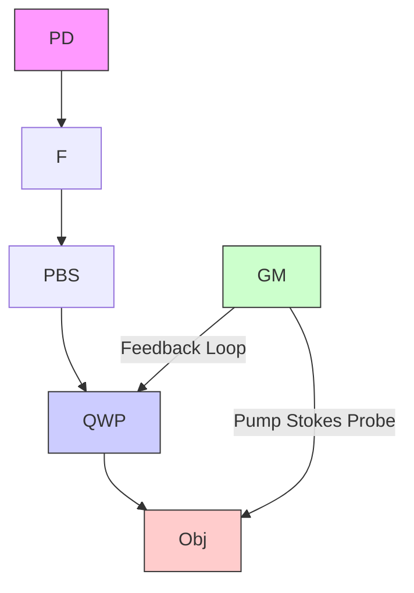

# Ultrasensitive Chemical Imaging of Bionanoparticles by Stimulated Raman Interferometric Photothermal Microscopy

Pin-Tian Lyu, Ji-Xin Cheng

Department of Electrical and Computer Engineering, Photonics Center, Boston University, Boston, 02215, USA \*Author e-mail address: jxcheng@bu.edu

Abstract: Interferometric scattering (iSCAT) microscopy is an ultrasensitive method for single nanoparticle imaging. We incorporate chemical specificity into iSCAT by detecting the stimulated Raman interferometric photothermal (SRIP) signal for ultrasensitive label-free chemical imaging of bionanoparticles.

## 1. Introduction

Bionanoparticles, such as viruses, exosomes, liposomes, and other nanostructures, play vital roles in biological processes and have promising applications in molecular biology, drug delivery, gene therapy, and disease detection. Their physical and chemical characteristics are crucial in determining how they distribute within the body and interact with cells. To date, it is essential but still challenging to detect and characterize these nanoparticles due to their small size. Optical imaging techniques have emerged as powerful tools to visualize and study bionanoparticles at the singleparticle level. A common method is to label the nanoparticles with fluorophores [1] and use fluorescence microscopy to achieve highly sensitive and super-resolved imaging. Yet, fluorescence labeling suffers from phototoxicity and photobleaching and may perturb sample structure and functionality. Label-free optical imaging methods, such as iSCAT imaging [2], benefits from interference detection and has realized single-protein sensitivity [3]. However, iSCAT contrast only relies on the refractive index of the sample, thus lacking molecular specificity.

Vibrational spectroscopic imaging methods have become a prominent platform for life science by providing molecular fingerprint information, among which stimulated Raman scattering (SRS) microscopy [4] enables highspeed spectroscopic imaging of Raman-active molecules resonating at the laser beating frequency of pump and Stokes beams. However, the sensitivity of SRS microscopy is restricted to the millimolar level due to the laser noise and small Raman cross section. Recently developed stimulated Raman photothermal (SRP) microscopy [5] boosted the sensitivity by using another probe beam to detect the refractive index change induced by the nonradiative decay of the vibrational energy. Thus, it is promising to further improve the sensitivity by incorporating more elegant photothermal detection schemes. In principle, the SRP effect creates thermal expansion of the sample or a thermal lens and changes the local refractive index. This offers a great opportunity for using iSCAT to detect the tiny refractive index changes with molecular information. Here we present a new method named SRIP microscopy for ultrasensitive chemical imaging of bionanoparticles.

## 2. Methods

SRIP microscopy detects the photothermal signal created by SRS excitation with interferometric enhancement, as illustrated in Fig. 1a. Briefly, the synchronized pump and Stokes pulses are modulated at 125 kHz and chirped to achieve spectral focusing for specific Raman modes. A collinear probe beam is used to detect the photothermal signal from SRS excitation through the same objective (60X, 1.2NA). The scattered field of the heated sample interferes with the reflected field from the glass coverslip, resulting in an enhanced photothermal signal detected by a photodiode. The photothermal image of the sample is acquired by beam scanning and lock-in detection (Fig. 1b). For single nanoparticles, the detected SRIP signal is proportional to the signal difference between the heat on and heat off state:

$$
I _ {\text {det}} \propto \left(\left| E _ {r} + E _ {s} \right| _ {\text {on}} ^ {2} - \left| E _ {r} + E _ {s} \right| _ {\text {off}} ^ {2}\right) \tag {1}
$$

$$
= \left| E _ {s} \right| _ {\text { on }} ^ {2} - \left| E _ {s} \right| _ {\text { off }} ^ {2} + 2 \left| E _ {r} \right| \left(\left| E _ {s} \right| _ {\text { on }} \cos \phi_ {\text { on }} - \left| E _ {s} \right| _ {\text { off }} \cos \phi_ {\text { off }}\right)
$$

where $E _ { \mathrm { s } }$ is the scattered field, $E _ { \mathrm { r } }$ is the reference field that keeps constant and $\phi$ is the phase difference between $E _ { \mathrm { s } }$ and $E _ { \mathrm { r } } ,$ which changes little in this case. Considering that $E _ { \mathrm { r } } \gg E _ { \mathrm { s } }$ for small nanoparticles, the signal is dominated by the difference in the interferometric cross term and is directly related to the scattered field of the local thermal field.

## 3. Results

SRIP microscopy is expected to provide ultrahigh sensitivity for chemical imaging of single nanoparticles. First, we acquired the hyperspectral images of 100-nm poly(methyl methacrylate) (PMMA) nanoparticles and 75-nm polystyrene (PS) nanoparticles in C-H stretching band as shown in Fig. 2a. Moreover, the particles are clearly distinguished by their corresponding SRIP spectra. Notably, the hyperspectral image is well matched with the pure iSCAT image. In comparison, the SRS imaging of the same area shows no contrast of the nanoparticles at identical average laser power.

Then we explored the capability of SRIP microscopy for spectroscopic imaging of single virus. As shown in Fig. 2b, single varicella-zoster virus and SARS-CoV-2 virus could be unambiguously resolved with a signal-to-noise-ratio of \~30. The SRIP spectra of single viruses show the dominant peak contributed by nucleic acids (2950 cm-1) and other bands from the proteins and the lipid membrane.

a  

text_image

ωp ωs
Ω
ΔE → ΔT
ΔT → Δn
Ei
Er
Es

b  

flowchart

Fig. 1. Principle and setup of SRIP microscopy

a  

line chart

| Wavenumber (cm⁻¹) | Intensity (norm) - PMMA | Intensity (norm) - PS |
| ----------------- | ------------------------ | ---------------------- |
| 2850              | ~0.1                     | ~0.0                   |
| 2900              | ~0.3                     | ~0.4                   |
| 2950              | ~1.0                     | ~0.6                   |
| 3000              | ~0.4                     | ~0.5                   |
| 3050              | ~0.2                     | ~1.0                   |
| 3100              | ~0.1                     | ~0.1                   |

b  

line chart

| Virus Type | Wavenumber (cm⁻¹) | Intensity (norm) |
|------------|-------------------|------------------|
| Varicella-Zoster virus | 2850 | ~0.1 |
| Varicella-Zoster virus | 2900 | ~0.8 |
| Varicella-Zoster virus | 2950 | ~1.0 |
| SARS-CoV-2 virus | 2850 | ~0.1 |
| SARS-CoV-2 virus | 2900 | ~0.7 |
| SARS-CoV-2 virus | 2950 | ~1.0 |
| SARS-CoV-2 virus | 3000 | ~0.3 |
| SARS-CoV-2 virus | 3050 | ~0.1 |

Fig. 2. SRIP imaging of single PMMA and PS nanoparticles and viral nanoparticles.

## 4. Discussion

We present an ultrasensitive chemical imaging method, SRIP microscopy, for label-free spectroscopic imaging of single bionanoparticles. Our method addresses the long-standing limitations in vibrational imaging and iSCAT imaging and bridges the gap between chemical specificity and detection sensitivity. The results obtained provide insight into the physiochemical properties of individual nanoparticles, potentially open a new way to the identification and composition analysis of single bionanoparticles. Future studies will continue to explore the molecular fingerprint information of single bionanoparticles, and efforts will be directed toward pushing the sensitivity for single-molecule chemical imaging.

## 5. References

[1] S.-L. Liu, Z.-G. Wang, H.-Y. Xie, A.-A. Liu, D. C. Lamb, and D.-W. Pang, “Single-virus tracking: From imaging methodologies to virological applications,” Chem. Rev., vol. 120, no. 3, pp. 1936–1979, Feb. 2020.  
[2] K. Lindfors, T. Kalkbrenner, P. Stoller, and V. Sandoghdar, “Detection and spectroscopy of gold nanoparticles using supercontinuum white light confocal microscopy,” Phys. Rev. Lett., vol. 93, no. 3, p. 037401, Jul. 2004.  
[3] G. Young et al., “Quantitative mass imaging of single biological macromolecules,” Science, vol. 360, no. 6387, pp. 423–427, Apr. 2018.  
[4] J.-X. Cheng and X. S. Xie, “Vibrational spectroscopic imaging of living systems: An emerging platform for biology and medicine,” Science, vol. 350, no. 6264, p. aaa8870, Nov. 2015.  
[5] Y. Zhu et al., “Stimulated Raman photothermal microscopy toward ultrasensitive chemical imaging,” Sci. Adv., vol. 9, no. 43, p. eadi2181, Oct. 2023.