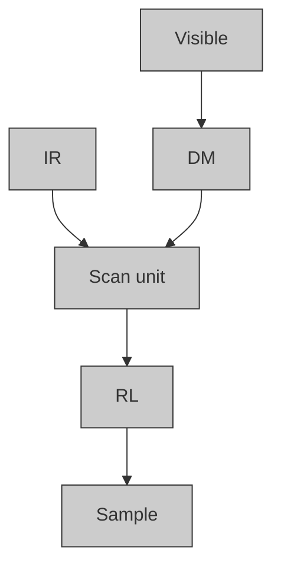
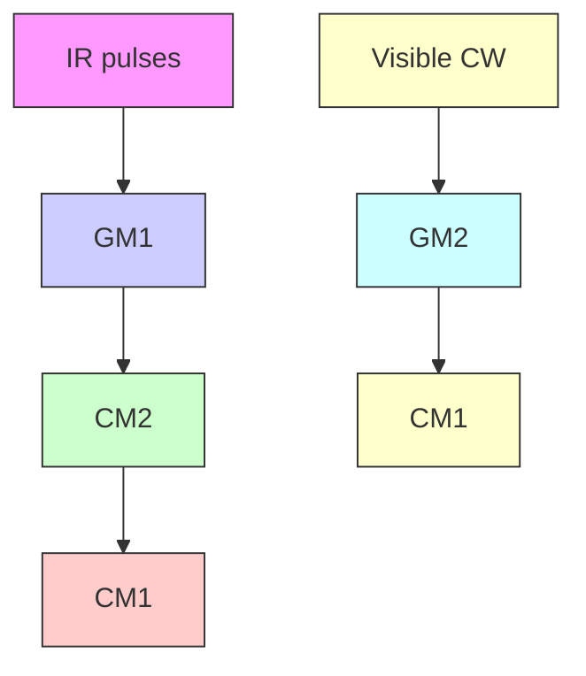
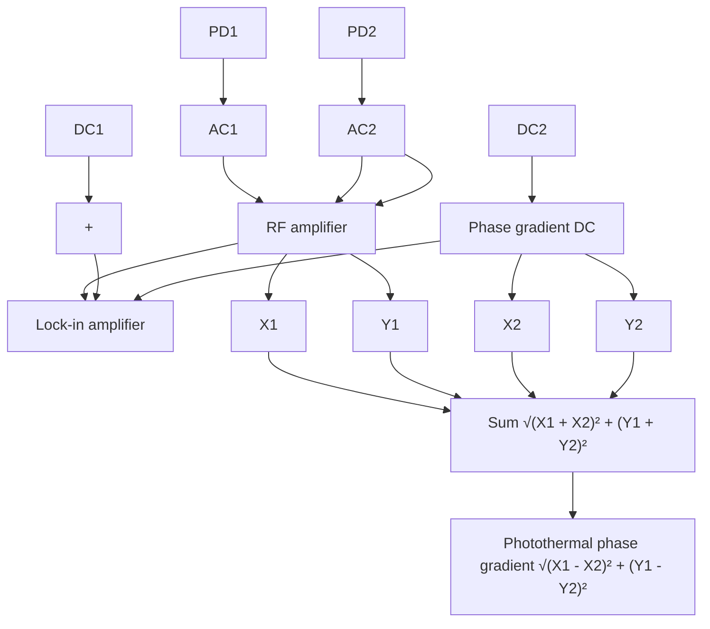

# Ultrasensitive in vivo infrared spectroscopic imaging via oblique photothermal microscopy

Received: 29 October 2024

Accepted: 19 June 2025

Published online: 02 July 2025

Check for updates

Mingsheng Li1,2, Sheng Xiao 1 , Hongli Ni 1,2, Guangrui Ding1,2, Yuhao Yuan 1,2, Carolyn Marar2,3, Jerome Mertz 2,3 & Ji-Xin Cheng 1,2,3

In vivo IR spectroscopy faces challenges due to poor sensitivity in reflection mode and low resolution at micrometer scale. To break this barrier, we report an oblique photothermal microscope (OPTM) to enable ultrasensitive IR spectroscopic imaging of live subjects at sub-micron resolution. Classic pho tothermal measurement captures only a small fraction of probe photons through an iris to extract the photothermal signal. Instead, OPTM uses a differential split detector placed on the sample surface to collect 500-fold more photons and suppress the laser noise by 12 fold via balanced detection. Leveraging its improved sensitivity, OPTM enables low-dose IR imaging of skin without photodamage. Depth-resolved in vivo OPTM imaging of metabolic markers beneath mouse and human skin is shown. Furthermore, we demonstrate in vivo OPTM tracking of topical drug contents within mouse and human skin. Collectively, OPTM presents a highly sensitive imaging platform for in vivo and in situ molecular analysis.

Label-free imaging of chemicals in live animals and human subjects is crucial for both basic research and clinical translation. Vibrational spectroscopic imaging has emerged as a highly sensitive, label-free platform to visualize molecular contents in living systems, advancing the study of biology and medicine1 . In particular, spatially offset Raman spectroscopy and coherent Raman scattering microscopy have been developed to image chemicals in the skin layers of live subjects2–4 . Compared to spontaneous Raman scattering, infrared (IR) absorption provides a cross section that is approximately eight orders of magnitude larger, and it is particularly sensitive to fingerprint vibrations5 . Since William Coblentz introduced the IR spectrometer in the early 1900s to explore molecular structures6 , IR spectroscopy has been significantly advanced. Among the various techniques, Fouriertransform infrared (FTIR) spectroscopy is extensively used in the fields of biological research, functional materials, and pharmaceuticals7,8 . The invention of the quantum cascade laser as a room-temperature semiconductor laser has facilitated highly sensitive IR spectroscopic imaging9,10. Traditional IR spectroscopic imaging measures the loss of IR photons, which is not suitable for imaging live animals because IR photons are attenuated and cannot penetrate through or reflect off an intact animal body. Photoacoustic IR microscopy circumvents the issue of low photon collection efficiency by using the weak-scattering photoacoustic wave as a readout of IR absorption11–13. However, because IR photons attenuate in the acoustic coupling medium, photoacoustic IR microscopy cannot operate in an epi-mode, making it not applicable for universal in vivo imaging scenarios. FTIR and photoacoustic IR also face limitations in spatial resolution due to the diffraction limit of long IR wavelengths, making them inefficient for nanoscale chemical visualization in vivo. Using a near-field probe strategy to overcome the IR diffraction limit, atomic force microscopeinfrared (AFM-IR) spectroscopy achieves 10-nm resolution14–16. However, AFM-IR’s limited penetration depth makes it unsuitable for volumetric imaging of biological samples.

Recently developed mid-infrared photothermal (MIP) microscopy addresses these limitations by using visible light to probe the mid-IR induced thermal effects17–19. Over the past few years, advances have been made towards widefield measurement20–23, video-rate imaging speed24,25, micromolar-level sensitivity in fingerprint and silent

1 Department of Electrical and Computer Engineering, Boston University, Boston, MA, USA. 2 Photonics Center, Boston University, Boston, MA, USA.

3 Department of Biomedical Engineering, Boston University, Boston, MA, USA. e-mail: jmertz@bu.edu; jxcheng@bu.edu windows17,26,27, and 3D tomographic imaging capability28–30. Despite these advances, in vivo MIP imaging has not yet been feasible due to limited sensitivity in visualizing chemical content in live animals. The epi-detection geometry is essential for in vivo imaging because photons cannot penetrate through the entire animal body due to strong scattering and absorption. In a classic epi-detected MIP microscope (Fig. 1a), the pump and probe beams are co-aligned and focused by a reflective objective onto a sample31. The scattered photons from the sample are collected by the same objective. An iris is employed before a remote photodetector to maximize the photothermal signals. However, the probe photons experience enormous scattering events in complex tissues, resulting in scattered photons losing their original propagation directions. Thus, using an objective and an iris to collect scattered photons is ineffective. While classic MIP can visualize chemical content in opaque samples, such as pharmaceutical tablets31,32 and thin tissue slices33, it is not sensitive for in vivo measurement due to significant loss of highly scattered probe photons during back propagation to the remote detector.

Here, we report an oblique photothermal microscope (OPTM) to enable high-sensitivity in vivo infrared spectroscopic imaging at submicron resolution (Fig. 1b). Instead of an iris before a remote detector, oblique photothermal detection is achieved by placing a differential split detector above the sample surface to collect epi-propagated probe photons with high efficacy. After multiple scattering within tissue, the forward-scattered photons from the focus are redirected to the backward direction before reaching the split detector. The propagation path of collected photons aligns obliquely from the focus to the split detector. The oblique optical detection or illumination using two fibers provides phase gradient information of samples for improved contrast, in which the phase gradient signal is proportional to refractive index variations (dn=dx, n is refractive index of sample, x is the lateral distance)34–37. Yet, oblique detection itself only gives the phase gradient information, without molecular sensitivity.

In OPTM, the photothermal expansion of objects decreases their refractive index, thus reducing the deflection angle of the original probe path. Consequently, with the photothermal effect, one photodiode receives more photons while the other receives fewer. Thus, photothermal modulations from each half of the split detector have opposite signs. Subtracting the two signals of the split detector not only enhances the photothermal signal but also suppresses the laser noise via a balanced detection operation. In comparison, the classic photothermal microscopy only collects a small fraction of backscattered photons from the focus31, which could be overwhelmed by the laser noise and detector noise. As shown below, our method increases the photon collection efficiency by 500 times and suppresses the laser noise by a factor of 12 via balanced detection. Leveraging its enhanced sensitivity, OPTM allows low-dose IR spectroscopic imaging of animal skin, thereby avoiding the risk of photo damage. Consequently, OPTM enables in vivo IR spectroscopic imaging of metabolic markers within animal and human skin. Moreover, OPTM allows for depth-resolved monitoring of topical drugs under mouse and human skin, unveiling the topical drug pathways and allowing quantitative evaluation of drug delivery efficiency. These advances highlight OPTM’s potential in biomedical research and in situ molecular analysis.

## Results

## OPTM principle and simulation results

In an epi-detected MIP microscope31, IR and visible probe beams are combined via a dichroic mirror, focused by a reflective objective, then delivered onto a sample (Fig. 1a). The scattered probe photons are collected by the same objective. An iris is then placed before the remote photodetector to maximize the photothermal signals38. In OPTM, both pump and probe beams are coaxially aligned. A split detector is positioned upon the sample surface, allowing it to collect more epi-propagated probe photons (Fig. 1b). The photon propagation path aligns obliquely from the focus to the detector. The difference in intensity between the two halves of the split detector reveals the phase gradient information of an object within its surrounding medium, while the sum provides optical absorption information of the same object35,39. Upon photothermal modulation, the intensity difference between both detectors yields photothermal phase gradient (PTPG) contrast. By taking the sum of the split detector’ signals, sum images are acquired simultaneously for comparison with PTPG images.

With the IR pump off, the object deflects the beam path due to different refractive indices between the object and its environment (Fig. 1c, top). The intensity difference between the split detector is proportional to the variation of refractive index in samples (dn=dx, n is refractive index of the sample, x is the lateral distance)34–37. With the IR pump on, the object absorbs IR photon energy, undergoes thermal expansion, and creates a thermal lens in its surrounding environment (Fig. 1c, bottom). Because the thermal lens decreases the refractive index and increases the dimension of the object, it reduces the deflection angle of the original probe path. Compared to the IR-off status, one photodiode receives more photons while the other receives fewer photons. Consequently, the photothermal signals from each half of the split detector have opposite signs. Therefore, the subtraction operation enhances the photothermal signals. Meanwhile, equivalent to balanced detection, the subtraction operation suppresses the common-mode fluctuation, which is contributed by the probe laser noise40,41.

To quantitatively demonstrate an improved photon collection efficiency, we conducted a Monte Carlo simulation to analyze the propagation of four million photons within a uniform scattering layer (Fig. 1d)42,43. On the layer surface, the objective only collects the central photons within a finite angle of 30 degrees corresponding to the NA of the objective. In contrast, the split detector collects the scattered photons in a larger area as indicated with black dash box in Fig. 1d. We summed the photons on the detection areas of the split detector and the objective, divided it by the total photons on sample surface, and generated the photon collection efficiencies of the split detector and objective, as indicated by red and black curves in Fig. 1e. Although the slit within split detectors causes the leakage of photons, the collection efficiency of split detector can still reach to 39% while that of the objective is only \~0.1%. We computed the improvement factor by dividing the collection efficiency of the split detector by that of the objective. Our results indicate oblique detection offers around 500 times larger collection efficiency of scattered photons than the objective detection method (Fig. 1f). In summary, instead of iris filtering, OPTM uses a split detector to collect 500-fold more epipropagated probe photons. Harnessing the inverse photothermal modulations on the split detector, OPTM employs the phase gradient signal as an efficient readout of photothermal contrast by subtracting the signals from the split detector.

## OPTM instrumentation and signal processing

As illustrated in Fig. 2a, the OPTM combines a pulsed IR laser with a visible continuous wave laser as the pump and probe sources. The combined beams are delivered to the scan unit for beam scanning and focused by a reflective objective onto the sample. The scan unit includes a 2D galvo scanner for scanning laser beams, followed by reflective relay optics that include two concave mirrors (Fig. 2b). The use of reflective relay optics and a reflective objective mitigates the achromatic aberrations of the visible and IR beams24,44. To enable oblique photothermal detection in the setup, a split detector consisting of two identical photodiodes is placed above sample surface (Fig. 2a). A slit between the detectors allows the laser beam to pass through. To facilitate oblique photothermal detection, we engineered a detection circuit on a customized PCB (Fig. 2c, d). Because oblique detection collects more probe photons, to avoid saturation, the split detector is biased by a 100-V DC source (V ) to increase the saturation threshold of photodiodes. An RC low-pass filter is used to remove the high-frequency noise in the DC source. The signals from the two halves of the split detector are recorded independently, following the signal processing flowchart shown below. For comparison, an epi-detected MIP microscope is shown in Fig. S1, where a beam splitter is used to reflect the backward-propagated photons, then filtered by an iris before reaching a remote photodiode.

text_image

MIP
Probe
BS
IR
Iris
PD
DM
RL
Sample

b  

text_image

OPTM
Probe
IR
Sum
Photothermal
phase gradient
(PTPG)
PD1
PD2
Sample

C  

text_image

IR pump off
PD1 PD2
object
IR pump on
Thermal
lens

d  

text_image

PD1
10 mm
PD2
2 mm
10 mm
X
Y
Log [relative intensity]
-7
1

e  

line chart

| Attenuation length (μm) | Collection efficiency of objective (%) | Collection efficiency of split detector (%) |
| ----------------------- | -------------------------------------- | ------------------------------------------- |
| 0                       | 0.2                                    | 40                                          |
| 100                     | 0.1                                    | 38                                          |
| 200                     | 0.1                                    | 35                                          |
| 500                     | 0.1                                    | 30                                          |

f  

line chart

| Attenuation length (μm) | Improvement factor (arb. units) |
| ----------------------- | -------------------------------- |
| 100                     | 480                              |
| 150                     | 460                              |
| 200                     | 410                              |
| 500                     | 220                              |

Fig. 1 | OPTM principle and simulation results. a Schematic of mid-infrared photothermal (MIP) microscope. b Schematic of oblique photothermal microscope (OPTM). Photons propagating to PD1 are shown in the sample box. c The principle of OPTM, illustrating the probe propagations at the status of IR on and off. d Monte Carlo simulation result of photon distribution on the surface of a uniform  
scattering layer. e Photon collection efficiency of the split detector and objective. f The improvement factor in photon collection efficiency with oblique detection compared to the classic method. BS beam splitter, DM dichroic mirror, PD photodiode, RL reflective objective.

To generate photothermal phase gradient and sum images, we developed a signal processing flowchart as illustrated in Fig. 2e. Signals from each half of the split detector are split into AC and DC components. The DC components are recorded by a data acquisition card (DAQ). The sum of DC channels yields optical absorption information of the probe wavelength, while their difference provides the phase gradient of the objects. Each AC component is amplified and delivered to a lock-in amplifier for frequency-dependent demodulation of photothermal signals. The in-phase (X) and quadrature (Y) components are then output and recorded by a DAQ system. Through vector subtraction of AC components, OPTM images are generated to provide photothermal phase gradient (PTPG) information. The sum images are generated by a vector summation operation for comparison with PTPG images.

## OPTM imaging of microparticles in a scattering medium

To validate the principle of oblique photothermal detection, we employed the OPTM to image microparticles of well-defined sizes in a scattering medium. Specifically, 10-µm PMMA beads were embedded in a scattering medium composed of 1% intralipid and PDMS mixture, then imaged using the OPTM (Fig. 3).

In the DC images, both halves of the split detector yield the phase gradient information of the microparticles (Fig. 3a). The DC signals show an inverted polarity at the two ends of the particles. The DC1 and DC2 images show the inverse phase gradients, akin to taking the first derivative of the refractive index from opposite horizontal directions. By subtracting and summing the DC1 and DC2 images, phase gradient DC and absorption DC images are generated (Fig. 3b). Figure 3c shows the plots of white lines in Fig. 3b to illustrate that the phase gradient measurement improves the contrast for visualizing particles in a scattering medium compared to absorption measurements. Because PMMA microparticles have negligible absorption at the probe wavelength of 532 nm, no visible features appear in the absorption DC images.

flowchart

b

Scan unit  

flowchart

c  

text_image

Lowpass filter
V_B
R
C
Ground
PD1
Output 1
PD2
Output 2

d  

text_image

PD1
PD7
P39734
PD2
PD
R1
C1
Output1
Output2
Output 1
Output 2
Boston University Cheng Lab

e  

flowchart

Fig. 2 | OPTM instrumentation and signal processing. a An oblique photothermal microscope (OPTM). b Details of scan unit. c Circuit diagram of split detector fo collecting photocurrent from each photodiode independently. d Photo of split detector. e Signal processing flowchart of generating sum and photothermal phase  
gradient images from split detector’s signals. DM dichroic mirror, RL reflective objective, PD photodiode, CW continuous wave, GM galvo mirror, CM concave mirror.

The photothermal images are acquired with the IR wavenumber of 1729 cm−1 , contributed by the stretching absorption of C=O bond in PMMA particles17. In the photothermal AC images, a lock-in amplifier demodulates frequency-dependent photothermal signals and generates both in-phase (X) and quadrature (Y) components of each split detector to form a complex photothermal response (X+iY) (Fig. 3d). The X and Y channels form a vector signal, where X is the real part and Y is the imaginary part. Figure 3e shows the vector signals of the split detector in 2D coordinates from the region of interest indicated by the black arrow in Fig. 3d. The vector signal of PD1 (X1 + iY1) has an inverted direction compared to the vector signal of PD2 (X2 + iY2). This indicates that the photothermal modulations of both photodiodes have opposite signs. Compared with the steady status of the IR pump off, with IR pump heating, one photodiode receives more photons while the other receives fewer. These results confirm the principle of oblique photothermal detection. Subsequently, through a postprocessing step involving vector subtraction and summation, we derive photothermal phase gradient (PTPG) images and sum images (Fig. 3f). In our results, the signal-to-noise ratios (SNR) of PTPG and sum images reach 417 and 31, which indicates that OPTM is capable of imaging PMMA particles in a scattering medium with a 13-fold improvement of SNR over sum image and sevenfold reduced laser noise. Additionally, we acquired the off-resonance images at 1770 cm−1 to demonstrate the bond-selectivity of OPTM imaging (Fig. S2). Figure 3g shows the spectra of PTPG and sum at the region of interest indicated with the white arrow in Fig. 3f. It indicates that OPTM enhances the spectroscopic intensity of particles in a scattering medium by over 10-fold in comparison with the sum measurement. Together, our results validate the principle of oblique photothermal detection, leveraging the differential response of split detectors to enhance photothermal signals while effectively suppressing laser intensity noise.

## OPTM unveils two types of lipids in adipocytes under live mouse skin

Different lipid compositions are important indicators for skin cancer, such as sebaceous carcinoma45. Coherent Raman scattering microscopy has allowed imaging of the total amount of lipids using C-H vibrational signals1–3 . Here, we demonstrate that OPTM can differentiate free fatty acid and lipid ester in individual adipocytes under live mouse skin. To compare the sensitivity of OPTM versus MIP microscope, we imaged adipocyte cells in the back skin of a live mouse using OPTM and MIP. Adipocytes on the epidermal layer of animal skin are vital to health as they form a barrier against external pathogens and serve as indicators of skin biology and disease46. High-sensitivity adipocyte imaging in live animals can facilitate the study and diagnosis of health status.

a  

natural_image

Microscopic image showing a single dark spot on a light background, labeled 'DC1' in the top-left corner (no other text or symbols)

natural_image

Grayscale image with a single dark spot and label 'DC2' in the top-left corner (no other text or symbols)

b  

text_image

Phase gradient DC
= DC1 - DC2

text_image

Absorption DC
= DC1 + DC2

c  

line chart

| Displacement (μm) | Phase gradient DC | Absorption DC |
| ----------------- | ----------------- | ------------- |
| 0                 | 0.0               | 0.0           |
| 10                | -0.05             | 0.0           |
| 15                | 0.2               | 0.0           |
| 20                | -0.1              | -0.05         |
| 25                | -0.25             | 0.05          |
| 30                | 0.05              | -0.05         |
| 40                | 0.0               | 0.0           |

d  

natural_image

Microscopic image showing a single red-orange region with a black arrow pointing to it, labeled 'X1' and number '1729' (no other text or symbols)

natural_image

Simple abstract image with a red and blue circular shape on a light background (no text or symbols)

cm-1, C=O  

natural_image

Two small colored circles (blue and red) on a plain white background, labeled 'Y1' in top-left corner (no other text or symbols)

natural_image

Simple image showing a small red and blue circular shape on a light background, labeled 'Y2' in the top-left corner.

e  

scatter plot

| Group | X, in-phase (arb. units) | Y, quadrature (arb. units) |
| --- | --- | --- |
| X2 + iY2 | ~60 | ~100 |
| X2 + iY2 | ~70 | ~110 |
| X2 + iY2 | ~80 | ~120 |
| X1 + iY1 | ~-30 | ~-20 |
| X1 + iY1 | ~-20 | ~-10 |
| X1 + iY1 | ~-10 | ~0 |
| X1 + iY1 | ~0 | ~10 |
| X1 + iY1 | ~10 | ~20 |
| X1 + iY1 | ~20 | ~30 |
| X1 + iY1 | ~30 | ~40 |
| X1 + iY1 | ~40 | ~50 |
| X1 + iY1 | ~50 | ~60 |
| X1 + iY1 | ~60 | ~70 |
| X1 + iY1 | ~70 | ~80 |
| X1 + iY1 | ~80 | ~90 |
| X1 + iY1 | ~90 | ~100 |
| X1 + iY1 | ~100 | ~110 |
| X1 + iY1 | ~110 | ~120 |
| X2 + iY2 | ~40 | ~50 |
| X2 + iY2 | ~50 | ~60 |
| X2 + iY2 | ~60 | ~70 |
| X2 + iY2 | ~70 | ~80 |
| X2 + iY2 | ~80 | ~90 |
| X2 + iY2 | ~90 | ~100 |
| X2 + iY2 | ~100 | ~110 |
| X2 + iY2 | ~110 | ~120 |
| X2 + iY2 | ~120 | ~130 |
| X2 + iY2 | ~130 | ~140 |
| X2 + iY2 | ~140 | ~150 |
| X2 + iY2 | ~150 | ~160 |
| X2 + iY2 | ~160 | ~170 |
| X2 + iY2 | ~170 | ~180 |
| X2 + iY2 | ~180 | ~190 |
| X2 + iY2 | ~190 | ~200 |
| X2 + iY2 | ~200 | ~210 |
| X2 + iY2 | ~210 | ~220 |
| X2 + iY2 | ~220 | ~230 |
| X2 + iY2 | ~230 | ~240 |
| X2 + iY2 | ~240 | ~250 |
| X2 + iY2 | ~250 | ~260 |
| X2 + iY2 | ~260 | ~270 |
| X2 + iY2 | ~270 | ~280 |
| X2 + iY2 | ~280 | ~290 |
| X2 + iY2 | ~290 | ~300 |
| X2 + iY2 | ~300 | ~310 |
| X2 + iY2 | ~310 | ~320 |
| X2 + iY2 | ~320 | ~330 |
| X2 + iY2 | ~330 | ~340 |
| X2 + iY2 | ~340 | ~350 |
| X2 + iY2 | ~350 | ~360 |
| X2 + iY2 | ~360 | ~370 |
| X2 + iY2 | ~370 | ~380 |
| X2 + iY2 | ~380 | ~390 |
| X2 + iY2 | ~390 | ~400 |
| X2 + iY2 | ~400 | ~410 |
| X2 + iY2 | ~410 | ~420 |
| X2 + iY2 | ~420 | ~430 |
| X2 + iY2 | ~430 | ~440 |
| X2 + iY2 | ~440 | ~450 |
| X2 + iY2 | ~450 | ~460 |
| X2 + iY2 | ~460 | ~470 |
| X2 + iY2 | ~470 | ~480 |
| X2 + iY2 | ~480 | ~490 |
| X2 + iY2 | ~490 | ~500 |
| X2 + iY2 | ~500 | ~510 |
| X2 + iY2 | ~510 | ~520 |
| X2 + iY2 | ~520 | ~530 |
| X2 + iY2 | ~530 | ~540 |
| X2 + iY2 | ~540 | ~550 |
| X2 + iY2 | ~550 | ~560 |
| X2 + iY2 | ~560 | ~570 |
| X2 + iY2 | ~570 | ~580 |
| X2 + iY2 | ~580 | ~590 |
| X2 + iY2 | ~590 | ~600 |
| X2 + iY2 | ~600 | ~610 |
| X2 + iY2 | ~610 | ~620 |
| X2 + iY2 | ~620 | ~630 |
| X2 + iY2 | ~630 | ~640 |
| X2 + iY2 | ~640 | ~650 |
| X2 + iY2 | ~650 | ~660 |
| X2 + iY2 | ~660 | ~670 |
| X2 + iY2 | ~670 | ~680 |
| X2 + iY2 | ~680 | ~690 |
| X2 + iY2 | ~690 | ~700 |
| X2 + iY2 | ~700 | ~710 |
| X2 + iY2 | ~710 | ~720 |
| X2 + iY2 | ~720 | ~730 |
| X2 + iY2 | ~730 | ~740 |
| X2 + iY2 | ~740 | ~750 |
| X2 + iY2 | ~750 | ~760 |
| X2 + iY2 | ~760 | ~770 |
| X2 + iY2 | ~770 | ~780 |
| X2 + iY2 | ~780 | ~790 |
| X2 + iY2 | ~790 | ~800 |
| X 3+ | -35 | -45 |
| 3+ | -35 | -45 |
| 3+ | -35 | -45 |
| 3+ | -35 | -45 |
| 3+ | -35 | -45 |
| 3+ | -35 | -45 |
| 3+ | -35 | -45 (with label "X") |

f  

text_image

PTPG
Pk-pk 167. Noise Std
0.4. SNR 417

text_image

Sum
Pk-pk 87. Noise Std
2.8. SNR 31

g  

line chart

| Wavenumber (cm⁻¹) | PTPG SNR 353 | Sum SNR 34 |
| ----------------- | ------------ | ---------- |
| 1700              | ~20          | ~10        |
| 1720              | ~100         | ~50        |
| 1740              | ~200         | ~80        |
| 1760              | ~10          | ~20        |

Fig. 3 | OPTM imaging of microparticles in a scattering medium. 10-µm PMMA beads was embedded in a scattering medium and imaged by OPTM. a DC images of PD1 and PD2. b phase gradient and absorption DC images. c Line plotted indicated by the white arrows in (b). d In-Phase (X) and quadrature (Y) images of each photodiode from the lock-in amplifier. e Scatter plotted in region of interest indicated by black arrow in (d). f Photothermal phase gradient (PTPG) and sum images.  
g Spectra at position indicated by the white arrow in (f). Scale bar 10 µm. Field of view $7 5 \times 7 5 \mu \mathrm { m } ^ { 2 } .$ Probe power on sample was 10 mW. IR power on sample was \~2 mW with repetition rate 390 kHz, pulse width 80 ns. The imaging speed was 2.5 frame per second with a pixel dwell time of 10 µs. Std standard deviation, SNR signal-to-noise ratio.

We employed the OPTM and the MIP microscope to image the same region in the epidermis layer of a live mouse’s back skin at a penetration depth of $5 0 \mu \mathrm { m } .$ . To differentiate different lipid contents, multispectral OPTM and MIP images were acquired from 1700 to 1770 cm−1 with a step size of 2 cm−1 , which is contributed by $\mathbf { C } = \mathbf { O }$ vibration absorption of $\mathrm { I i p i d s ^ { 4 7 - 4 9 } }$ (Supplementary Movie 1). The DC images of OPTM and MIP were acquired simultaneously, measuring phase gradient, absorption, and back scattering information (Fig. S3).

Following the flowchart in Fig. 2e, photothermal phase gradient images were acquired by OPTM. Meanwhile, some images were generated for comparison purposes. MIP images were acquired independently using the iris filtering approach as illustrated in Fig. S1. The photothermal images at two IR wavenumbers, 1704 and $1 7 4 2 \mathrm { c m } ^ { - 1 }$ , are selected to present the fatty acid and lipid ester-rich distributions (Fig. 4a–c). The absorption peaks of the fatty acid and lipid ester are contributed by the vibrational absorption of acidic and esterified $\mathbf { C } = \mathbf { O }$ bond in lipids, which are consistent with FTIR spectroscopy measurement in animal skin samples47–49. Off-resonance images at wavenumber $1 7 7 0 \mathrm { c m } ^ { - 1 }$ were acquired to confirm bond-selective imaging of OPTM and MIP. Spectra in two regions of interest in Fig. 4a are plotted to illustrate the absorption peaks of fatty acids and lipid esters at IR wavenumbers 1704 and 1742 cm−1 (Fig. 4d).

To quantify the sensitivity improvement of OPTM over MIP, we plotted intensities along two dashed lines in the fatty acid and lipid ester images (Fig. 4e, f). Regarding the noise levels, PTPG signals show a 12-fold and 8-fold suppression of noise compared to the sum signals and the MIP signals, respectively. These results indicate that OPTM can effectively suppress the common-mode noise, primarily contributed by laser intensity noise, via a balanced detection strategy. In parallel to noise suppression, OPTM enhances the photothermal signal by up to eightfold over MIP owing to the higher photon collection efficiency. As indicated in dashed black rows in Fig. 4e, f, OPTM enables visualization of lipid structures not detectable in MIP. The peak at the PTPG image of lipid ester has a full width at half maximum of 0.86 µm, indicating submicron lateral resolution of OPTM.

## Depth-resolved in vivo OPTM imaging of mouse skin

Depth-resolved infrared spectroscopic imaging is essential for accurately visualizing and analyzing chemical contents in the intricate layers and structures within complex tissues50. Despite its importance, in vivo infrared depth-resolved imaging remains an unmet need in the field. Our OPTM technique addresses this gap by offering optical sectioning capability at visible light resolution through a pump-probe approach.

Figure 5 demonstrates in vivo depth-resolved OPTM imaging. We utilized OPTM to image the ear of a live mouse at different penetration depths. At each depth, protein images were acquired at an IR wavenumber of 1553 cm−1 , contributed by the absorption of the Amid-II band8 . Two lipid contents, fatty acid and lipid ester, were imaged at IR wavenumbers of 1704 and 1742 cm−1 due to the vibrational absorption of acidic and esterified ${ \mathsf C } = { \mathsf { O } }$ bond in lipids47–49. Additionally, offresonance images at $1 7 7 0 \mathrm { c m } ^ { - 1 }$ were acquired to confirm bondselectivity of OPTM imaging.

On the stratum corneum (SC) layer at a depth of $1 0 \mu \mathrm { m }$ beneath the skin surface, which is the outmost layer of skin, the mouse hair is visualized (Fig. 5a). SC shows sparse lipid and protein distributions because it includes mostly dead cells. The viable epidermis layer, right beneath the SC layer, mainly consists of live cells providing nutrition to the skin. Thus, the protein and lipid content are uniformly distributed at a depth of 50 µm (Fig. 5b). As the penetration depth increases to $7 5 \mu \mathrm { m }$ into the epidermis layer, sebaceous glands become visible, predominantly composed of lipid esters and some fatty acids (Fig. 5c).

At a penetration depth of 100 µm, which is equal to one mean free length of 532-nm photons51, the phase gradient DC image shows a good contrast for resolving deep tissue features (Fig. S4). Photothermal phase gradient images still show differentiable chemical distributions. Thus, we determine the penetration depth limit of OPTM to be $1 0 0 \mu \mathrm { m }$ for imaging animal’s skin. Our results collectively validate OPTM’s depth-resolved imaging capability in live animals.

In vivo investigation of topical drug pathway inside mouse skin Topical transdermal drug delivery presents a promising alternative to both oral administration and hypodermic injections52. In vivo investigation of topical drug delivery inside animal skin facilitates analysis of the drug pathway, guiding the development of new biomedicine53. Quantitative evaluation of effective transdermal drug delivery is crucial to optimize therapeutic efficacy while minimizing systemic side effects54. In Fig. 6, we demonstrate that OPTM facilitates high-resolution and depth-resolved in vivo tracking of topical drug pathways in mouse skin with quantitative evaluation capabilities. Specifically, we explore the skin penetration behavior of benzoyl peroxide (BPO), a commonly used active pharmaceutical ingredient. BPO is particularly effective for acne treatment, as it penetrates hair follicles to exert antimicrobial and keratolytic effects55.

To visualize both BPO and endogenous chemical contrasts, we performed multispectral in vivo OPTM imaging at various depths in mouse skin, following the administration of 5-µL BPO samples. Figure 6a shows a pseudo-colored multispectral image acquired at a depth of $3 2 \mu \mathrm { m }$ beneath the mouse skin surface. To quantitatively disentangle the different chemical components from the composite spectrum, we employed a least absolute shrinkage and selection operator (LASSO) for spectral unmixing56. In LASSO, it is essential to have reference spectra of different chemical contents. As illustrated in Fig. 6b, the reference spectra of fatty acid and lipid ester were acquired from the regions indicated by the red and green arrows in Fig. 6a, which are rich in fatty acid and lipid ester, respectively. The reference spectrum of BPO is acquired from the infrared photothermal spectrum of drug samples (Fig. S5). Figure 6c shows the spectral unmixing results of LASSO that separate the fatty acid, lipid ester, and administrated BPO contents from the raw multispectral image. An overlap of three chemical components shows the relative distributions of endogenous lipids and the drug contents. LASSO spectral unmixing was applied to other depth-resolved imaging data to trace the topical BPO pathway. A control experiment, conducted without drug administration, shows no visible contrast in the BPO channels (Fig. S6). Through depth-resolved infrared spectroscopic imaging and LASSO spectral unmixing, we demonstrate that OPTM enables three-dimensional visualization of chemical content in mouse skin, illustrating endo genous skin chemical structure and administrated BPO distribution (Supplementary Movie 2 & 3).

Figure 6d shows a captured 3D view in Supplementary Movie 2, in which the mouse hairs and the hair follicles opening can be seen. Protein images were acquired at 1553 cm−1 contributed by the absorption of Amid-II band. To unveil the BPO pathway under mouse skin, we show the depth-resolved phase gradient DC and different chemical images illustrating the skin morphology, chemical structure, and drug/skin distributions at different skin layers (Fig. 6e). At the stratum corneum layer with a depth 0-8 µm, which is the skin surface, the hair follicle locates at one end of the mouse hair as indicated by white dash circle in the phase gradient DC image. There is topical BPO content overlapping with the hair follicle opening. At the epidermis layer with depths of 16–24, 32–40, and 48–56 µm, BPO content overlaps with the hair follicles indicated by white dashed circles. It confirms that BPO penetrates into the hair follicles in the skin through its openings, as the acnes happen in the hair follicles57. At a deeper penetration depth of 64 µm, the endogenous chemical and BPO

Fatty acid, $1 7 0 4 ~ \mathsf { c m } ^ { - 1 }$  

text_image

d
PTPG
ROI 1
Line 1

Lipid ester, $1 7 4 2 ~ \mathsf { c m } ^ { - 1 }$  

text_image

Line 2
ROI 2

Off-resonance, 1770 cm-1  

natural_image

Completely black image with no visible content, text, or symbols.

natural_image

Microscopic image showing purple fluorescent cellular structures with a scale bar (no text or symbols)

natural_image

Blue textured surface with scattered bright spots, resembling a noise or noise pattern (no text or symbols)

natural_image

Uniform dark textured surface with no visible text, symbols, or distinct objects

natural_image

Microscopic image showing purple fluorescent cellular structures labeled 'MIP' (no text or symbols present)

natural_image

Dark blue textured surface with scattered bright spots, resembling a starry night sky (no text or symbols)

natural_image

Black background with scattered white specks and a black arrow labeled 'X' pointing left (no other text or symbols)

d  

line chart

| Wavenumber (cm⁻¹) | ROI 1, Fatty acid | ROI 2, Lipid ester |
| ----------------- | ----------------- | ------------------ |
| 1704              | 1.0               | 0.15               |
| 1742              | 0.0               | 1.0                |

e  

line chart

| Displacement (µm) | PTPG Amplitude (arb. units) | Sum Amplitude (arb. units) | MIP Amplitude (arb. units) |
| ----------------- | ---------------------------- | -------------------------- | -------------------------- |
| 30                | ~90                          | ~80                        | ~20                        |
| 120               | ~50                          | ~30                        | ~10                        |

f  

line chart

| Displacement (μm) | PTPG Amplitude (arb. units) | Sum Amplitude (arb. units) | MIP Amplitude (arb. units) |
| ----------------- | --------------------------- | -------------------------- | -------------------------- |
| 40                | ~100                        | ~100                       | ~10                        |
| 120               | ~30                         | ~30                        | ~10                        |

Fig. 4 | OPTM unveils two types of lipids in adipocytes under live mouse skin. OPTM and MIP imaging of adipocyte cells in the back skin of a live mouse at a penetration depth of 50 µm. a Photothermal phase gradient (PTPG), b sum, and c MIP images were acquired in the same field of view. d PTPG spectra of two regions of interest in (a) illustrating the absorption peaks of the fatty acid and the  
lipid ester. e Line 1 and f line 2 plotted in the fatty acid and the lipid ester images. Scale bar 30 µm. Field of view $1 5 0 \times 1 5 0 \mu \mathrm { m } ^ { 2 } .$ . Probe power on the sample was 10 mW. IR power on sample was \~2 mW with repetition rate 390 kHz, pulse width 80 ns. The imaging speed was 1.6 frames per second with a pixel dwell time of $1 0 \mu \mathsf { s } .$ .

images still have visible contrast, demonstrating the capability of OPTM to trace drug molecules in the deep skin layer. Through all skin layers, the distribution of administrated drug content is not uniform but aggregates. Surprisingly, we found that BPO content also penetrates sweat pores as indicated by the solid white arrows in Fig. 6e. To quantitatively evaluate the delivery efficiency of topical BPO, we took another four group images at different fields of view (Fig. S7). Since BPO is effective to treat acne by penetrating hair follicles to perform antimicrobial and keratolytic activities, we quantify the delivery effi ciency by computing the ratio between the amount of drug content within hair follicles and within the whole field of view at a same depth (Fig. 6f). From the skin surface, with a deeper penetration depth, the BPO content within the hair follicle increases at first, then followed by a decreasing. It indicates that topical BPO enters the hair follicles through their openings and remains inside the follicles. The delivery efficiency of BPO is <30% in skin layers. Such a low efficiency indicates that the treatment of skin acne needs a long-term administration of topical BPO, which is aligned with previous studies of acne treatment by BPO58.

  
Fig. 5 | Depth-resolved in vivo OPTM imaging of mouse skin. Phase gradient DC images and photothermal phase gradient images at imaging depths of a 10 µm (stratum corneum layer), b 50 µm (viable epidermis layer), and c 75 µm (epidermis layer). Scale bar 50 µm. Field of view 160 × 160 µm2 . Step size was 0.4 µm. Probe  
power on sample was 10 mW. IR power on sample was \~2 mW with a repetition rate of 390 kHz and pulse width of 100 ns. The imaging speed was 0.5 frames per second with a pixel dwell time of 10 µs.

The interaction between topical BPO and sebaceous glands has not been clarified, and the side effects of BPO remain controversial59–61. Here, OPTM is used for monitoring the spatial distributions of BPO and sebaceous glands. Figure 6g shows the skin layers, including the sebaceous glands, at a depth of 32-48 µm within the volume shown in Supplementary Movie 3. The sebaceous glands are visualized at endogenous lipid images indicated by white dashed circles, which do not overlap with BPO. Figure S8 shows the depthresolved images in the same region for illustrating the drug pathway within the skin layers.

In summary, OPTM shows that BPO penetrates the mouse skin through the hair follicle openings, sweat pores, and other skin areas. The low efficiency of BPO delivery via hair follicles, which is less than 30%, indicates a need for long-term administration of BPO for the treatment of skin acne. In addition, our observations unveil that topically applied BPO does not reach sebaceous glands. Collectively, OPTM enables in vivo depth-resolved tracking of topical drug pathways with quantitative evaluation of delivery efficiency, providing guides to the development of new transdermal biomedicine.

## In vivo OPTM imaging of human skin

Non-invasive chemical analysis of live human subjects plays a crucial role in biomedical research and clinical diagnostics62. Providing fingerprint information with high spatial resolution, OPTM is a good candidate for non-invasive chemical analysis of human skin. In OPTM, the use of visible probe offers sub-micron resolution, while the improved sensitivity allows low-dose IR spectroscopic imaging with out the concern of photodamage. Figure 7 demonstrates OPTM’s ability to non-invasively image the metabolic markers under live human skin and the topical transdermal drug content on the skin surface.

A volunteer’s forearm was imaged by OPTM to visualize the skin chemical structure and the topical drug content upon the skin surface (Fig. 7a). In Fig. 7b, OPTM visualizes endogenous proteins and lipids in the viable epidermis layer with a depth of 40 µm without topical drug administration. Off-resonance imaging at 1780 cm−1 confirms the bond-selective imaging of human skin. The relative distribution of protein and different lipid contents under the skin surface is an important health indicator, such as skin aging63 and inflammatory skin disease64.

Additionally, we demonstrate that OPTM enables tracing the topical drug pathway on the human skin surface. Figure 7c–g shows phase gradient DC and PTPG images of endogenous chemicals and administrated benzoyl peroxide contents on human arm skin with a depth of 8 µm. From the phase gradient DC image in Fig. 7c, the hair follicle opening located at the end of one human hair can be seen. Figure 7g shows that topically administrated BPO contents on human skin surface are also not uniform but aggregate, which aligns with the observations of mouse imaging in Fig. 6. The BPO content overlap with hair follicles openings is shown in Fig. 7h, which demonstrates that BPO penetrates skin through hair follicle openings and other skin areas. The percentage of BPO through follicle is estimated to be 46.5% based on two different fields of view.

a  

natural_image

Microscopic tissue image with fluorescent staining and wavenumber scale bar (1700–1770 cm⁻¹), showing cellular structures with red and green arrows indicating specific regions.

b  

line chart

| Wavenumber (cm⁻¹) | Fatty acid | Lipid ester | Benzoyl peroxide |
| ----------------- | ---------- | ----------- | ---------------- |
| 1700              | 1.0        | 0.1         | 0.0              |
| 1720              | 0.3        | 0.2         | 0.0              |
| 1740              | 0.1        | 1.0         | 0.1              |
| 1760              | 0.0        | 0.0         | 1.0              |

c

text_image

Fatty acid (FA)
Lipid ester (LE)
Benzoyl
peroxide (BPO)
Composite

d  

text_image

hair
3D view
Protein FA LE BPO

text_image

PG DC Protein FA LE BPO FA + LE+ BPO
hair
0-8 µm
16-24 µm
32-40 µm
48-56 µm
64 µm
depth

f  

bar chart

| Depth (μm) | Efficiency (%) |
| ---------- | -------------- |
| 0-8        | 15             |
| 16-24      | 19             |
| 32-40      | 19             |
| 48-56      | 7              |
| 64         | 2              |

Depth  

text_image

LE
BPO
FA + LE+ BPO

g  

natural_image

Microscopic image of protein tissue with fluorescent labeling (no text or symbols visible)

FA  

natural_image

Microscopic image showing red fluorescent cellular structures with a white dashed outline highlighting a specific region (no text or symbols present)

natural_image

Fluorescent microscopy image showing green-labeled cellular structures with a white dashed outline highlighting a specific region (no text or symbols present)

natural_image

Microscopic image showing blue-stained cellular structures with a white dashed circle highlighting a region (no text or symbols)

natural_image

Fluorescent microscopy image showing cellular structures with blue, red, and green staining (no text or symbols)

Fig. 6 | In vivo investigation of topical drug pathway inside mouse skin.  
a Pseudo-color hyperspectral OPTM images of skin of a live mouse at a depth of 32 µm with benzoyl peroxide administrated. b Reference spectra of fatty acid, lipid ester, and benzoyl peroxide. c Images of fatty acid, lipid ester, and benzoyl peroxide after applying LASSO spectral unmixing method to the hyperspectral image (a) to differentiate different contents. d A captured 3D view of Supple mentary Movie 2 to illustrate mouse skin chemical structure and topical BPO distribution. e Phase gradient DC images and PTPG images at different penetration depths in mouse skin. f Efficiency of topical BPO delivery at different depths,  
based on analysis of 5 FOV images shown in Figs. 6e and S7. The sample size $n = 5 .$ Data are presented as mean values ± SD. g Endogenous chemical structure and topical BPO distribution within the skin layers at a depth of 32–48 µm, where the sebaceous glands are located. Additional images of the same region at different depths are presented in Fig. S8. Scale bar $5 0 \mu \mathrm { m }$ . Field of view $1 8 0 \times 1 8 0 \mu \mathrm { m } ^ { 2 }$ . Probe power on sample was 10 mW. IR power on sample was \~2 mW with repetition rate 390 kHz, pulse width 100 ns. The imaging speed was 1.1 frame per second with a pixel dwell time of 10 µs. FOV field of view, FA fatty acid, LE lipid ester, BPO benzoyl peroxide.

a  

text_image

d
Objective
Split detector
Probe
IR
Volunteer's arm

text_image

Objective
Split detector
Volunteer's arm

b  
Protein  

natural_image

Microscopic view of cellular or tissue structure with teal staining (no visible text or symbols)

Fay acid  

natural_image

Abstract red and black textured pattern with no discernible text or symbols

Lipid ester  

natural_image

Microscopic view of a green fluorescent biological sample with scattered dark spots (no text or symbols visible)

Off resonance  

natural_image

Dark image with faint blue speckles, no discernible text or symbols

PG DC  

text_image

C
hair follicle
opening
hair

Protein  

natural_image

Microscopic image showing cellular structures with a highlighted circular region and scale bar (no text or symbols)

Fay acid  

natural_image

Microscopic image showing red fluorescent structures with a white dashed circle highlighting a region, scale bar present (no text or symbols)

Lipid ester  

natural_image

Fluorescent microscopy image showing green-labeled cellular structures with a white dashed circle highlighting a region of interest (no text or symbols present)

Benzoyl peroxide  

natural_image

Microscopic image showing a blue fluorescent cell with a white dashed circular region and a scale bar (no text or symbols)

PG DC + BPO  

natural_image

Microscopic image showing cellular structures with a highlighted region marked by a blue dashed circle (no text or symbols present)

FA + LE+ BPO  

natural_image

Fluorescent microscopy image showing cellular structures with a highlighted region (no text or symbols)

Fig. 7 | In vivo OPTM imaging of human skin. a Schematic and photo of in vivo OPTM imaging of a human’s forearm skin. b Photothermal phase gradient images of endogenous proteins and lipids in the viable epidermis layer with a depth of 40 µm without topical drug administration. c Phase gradient DC image of the stratum corneum showing a hair on the skin surface and the hair follicle opening. d–g Photothermal phase gradient images of protein (d 1553 cm−1 ), fatty acid (e 1704 cm−1 ), lipid ester (f 1742 cm−1 ), and benzoyl peroxide (g 1760 cm−1 ) in the stratum corneum layer with a depth of 8 µm after topical drug administration. h An  
overlap image of phase gradient DC and drug distribution. i An overlap image of endogenous lipid and administrated drug contents. FA fatty acid, LE lipid ester. BPO benzoyl peroxide. Scale bar 50 µm. Field of view was 120 × 120 µm2 . Probe power on sample was 10 mW. IR power on sample was \~2 mW with repetition rate of 390 kHz and pulse width of 100 ns. The imaging speed was 2 frame per second with a pixel dwell time of 8 µs. PG phase gradient, FA fatty acid, LE lipid ester, BPO benzoyl peroxide.

Figure 7d–f show a mixture of chemical content within the hair follicles, such as sebum. Figure 7i shows the overlap of endogenous chemicals and topical BPO, demonstrating that OPTM allows mapping both topical biomedicine and skin chemical structure. To verify the imaging fidelity, a control experiment was performed by using OPTM to image human arm skin without BPO administration (Fig. S9). The BPO image in the control group shows no visible contrast within the hair follicles. It confirms that the contrast of Fig. 7g comes from the administered BPO. Collectively, we demonstrate that OPTM allows non-invasive infrared spectroscopic imaging of human skin in vivo. OPTM visualizes the metabolic biomarker beneath the human skin surface, facilitating health diagnosis in clinical applications. OPTM also allows monitoring of topical drug content on human skin, facilitating the development of transdermal biomedicine.

## Discussion

Oblique photothermal detection challenges the conventional wisdom of photothermal sensing by fundamentally altering the photon collection strategy. Traditional photothermal methods typically measure a small fraction of backward-scattered photons filtered through an iris, which inherently limits the number of collected photons. This limitation arises because only photons scattered in specific directions are detected, reducing the signal intensity and detection sensitivity. In contrast, oblique photothermal detection employs a split detector positioned on the sample surface, enabling the collection of both backward and forward-scattered photons. The forward-scattered photons are redirected into the backward direction through multiple scattering events within the sample. Essentially, this method significantly enhances the photon collection efficiency.

Furthermore, OPTM suppresses the laser noise via balanced detection. By leveraging the inverse photothermal modulations on the split detector, OPTM amplifies the photothermal signal amplitude by analyzing the differential response between the two halves of the split detector. Since the photothermal signal predominantly occupies the low-frequency region due to its low-duty cycle nature, traditional photothermal detection methods are compromised by 1/f laser noise. OPTM collects 500 times more photons from tissue, and mitigates the laser noise through a subtraction operation akin to the balanced detection strategy 40,41

OPTM could detect weak scatterers in scattering samples by measuring the photothermal phase gradient of the object rather than back-scattering signals. The amount of back-scattering photons from the object is limited by the minimal refractive index difference within tissue65. Traditional photothermal detections, which also gather other diffuse and specular reflected photons, could have the scattering signals from the focus overwhelmed by the laser noise. Oblique photothermal detection addresses this challenge by utilizing a split detector near the sample surface to acquire the phase gradient as an ultrasensitive readout of photothermal signals. By measuring the photothermal phase gradient rather than backscattered photons, OPTM boosts the imaging sensitivity, enabling visualization of weak scatterers in complex tissue. Due to the enhanced sensitivity, in vivo sub-video-rate imaging of protein in mouse skin is shown in Fig. S10. Though we have focused on skin applications, OPTM is applicable to other tissues. Figure S11 demonstrates that OPTM facilitates highly sensitive IR spectroscopic imaging of a mouse brain slice with fine axial sectioning capability. OPTM allows for in situ molecular analysis within the soma and blood vessels, revealing the potential for detailed molecular profiling in complex tissues.

OPTM exhibits an improved sensitivity to image heterogeneous structures, demonstrating a fine impulse response to a point source (Fig. S12). Moreover, bulk chemical features can be effectively resolved through Hilbert transform reconstruction66,67, as detailed in the Supplementary Text and Fig. S13. Future advancements, such as the measurement of orthogonal phase gradients, may facilitate the reconstruction of images with minimized computational artifacts36,37,68.

There is potential for further enhancing OPTM’s penetration depth. The absorption of IR photons and the scattering of probe photons are two main factors of OPTM to penetrate deeper. However, the attenuation length of IR photons $( < 2 0 0 \mu \mathrm { m } )$ is still larger than the attenuation length of 532-nm probe photons (125 µm)13,51. Thus, the main limiting factor is the strong scattering of probe photons within tissue due to the short visible wavelength used. Employing a longer probe wavelength could facilitate deeper imaging by reducing optical scattering51.

In summary, by providing reduced laser noise, enhanced imaging contrast, and improved sensitivity, OPTM enables high-sensitivity infrared spectroscopic imaging of chemicals in live animals and human subjects with sub-micron resolution. OPTM opens translational opportunities for molecule-based clinical diagnosis and study of topical drug delivery through human skin. As a platform technology, OPTM is not limited to the mid-infrared window and can be broadly adapted to other photothermal microscopy techniques such as overtone photothermal microscopy69–71 and visible photothermal microscopy72.

## Methods

## Monte Carlo simulation

A Monte Carlo simulation was conducted to explore the propagation path of 4 million photons in a uniform scattering layer42,43. The sizes of the layer were (width) 25 mm, (length) 25 mm, and (depth) 10 mm. A focused beam with a numerical aperture (NA) of 0.5 was launched on the surface of the simulation layer. The NA of the simulated focused beam is equal to the NA of the reflective objective used in the OPTM and MIP microscope. To mimic the optical properties of skin51, the scattering coefficient µ was set from 20 to 125 cm−1 , referring to the attenuation length $( L = 1 / \mu _ { s } )$ of 500 to 80 µm. The absorption coefficient was set to 0.1 cm−1 .

## Oblique photothermal microscope

Our OPTM (Fig. 2) couples a 532-nm continuous wave probe laser (Samba, HUBNER photonics) with a pulsed quantum cascade laser (QCL) (MIRcat 2400, Daylight Solutions) tunable from 900 cm−1 to 2300 cm−1 via a Germanium window (GEBBAR-3-5-25, Andover Corporation). The visible/IR combined beam is directed to a 2D galvo scanner (Saturn 5B, ScannerMax) and then through a reflective relay optics, primarily comprising a concave mirror with a 150-mm focusing length (CM1, CM254-150-P01, Thorlabs) and a concave mirror with a 250-mm focusing length (CM2, CM254-250-P01, Thorlabs). Subsequently, both beams are focused onto the sample by a reflective objective (LMM40X-P01, Thorlabs). The objective is mounted on a piezo stage (MIPOS 100 SG RMS, Piezosystem Jena), allowing precise adjustment of the IR and visible foci along the depth axis. In the detection part, a split detector consisting of two identical photodiodes (S3994-01, Hamamatsu or FDS1010, Thorlabs) is biased with a 100-volt voltage to elevate its saturation threshold. A 402 kΩ resistor (R) and a 0.1 µF capacitor (C) form an integrated RC low-pass filter to reject high-frequency noise from the biased voltage supply. A lab-designed printed circuit board integrates the photodiodes and other electrical components (Fig. S14a). The split detector is mounted on a home-built printed circuit board. A copper mesh (PSY406, Thorlabs) is used as a cover for electromagnetic shielding (Fig. S14b). Here, a 2-mm slit width between two photo diodes is created to allows the combined pump and probe beam to pass through. A 3D printed holder is glued on the other side of PCB board so that it can be mounted on the imaging objective (Fig. S14c). The output of each photodiode is then split into DC and AC signals using a biased tee (ZFBT-4R2GW + , Mini-circuits). The DC signals are collected by a low-noise data acquisition card (DAQ) (Oscar, Vitrek), while the AC signals are amplified by an RF low-noise amplifier (CMP61665-1, Gain 40 dB, NF Corporation). Then, the amplified AC signals are fed into a lock-in amplifier (HF2LI, Zurich) for frequencydependent demodulation of photothermal signals. To ensure phasesensitive measurement, the lock-in amplifier generates a TTL trigger for the QCL laser, synchronizing the IR pulse with its internal reference phase73. Consequently, the phase of the AC signal is determined by the IR-induced photothermal response. A multichannel DAQ board (National Instruments, PCIe-6363) is used for real-time data acquisition. A complete instrument interface was developed in LabVIEW (LabVIEW 2020, National Instruments Corporation) to enable hardware synchronization, data acquisition, and fast pre-processing.

## PMMA microparticles in a scattering medium

Polydimethylsiloxane (PDMS) (Sylgard 184, Dow Corning Corporation) was prepared with a base-to-curing agent ratio of 10:1. Then, 10-µm Polymethylmethacrylate (PMMA) beads (17136-5, Polysciences) were added to the PDMS mixture along with 1% Intralipid (I141, Sigma-Aldrich). The attenuation length at 532 nm is $1 2 5 \mu \mathrm { m } ^ { 7 4 }$ , which is comparable to that of skin tissue51. The mixture was degassed in a vacuum chamber for 30 minutes to remove residual air bubbles. Following this, the composite was then solidified by heating it in an oven at $7 0 \textdegree$ for 30 minutes.

## In vivo imaging of mouse skin

Male adult C57BL/6 J and BALB/c mice were used in this study. The details of mouse preparations for imaging are illustrated in Fig. S15. In step 1, the mouse was anesthetized with isoflurane, and the hair was removed or shaved to clean the skin surface. Subsequently, the mouse was given a subcutaneous injection of 50–100 mg/kg Ketamine and 5–10 mg/kg Xylazine, enabling the transition to the imaging process. The level of anesthesia was assessed by the loss of response to pinching the base of the tail. In step 2, a biocompatible glue was applied to fix the mouse’s skin to a Teflon block, which served as a scattering substrate and mitigated breathing artifacts during imaging. A warming bag was placed under the mouse to maintain its body temperature. In step 3, the mouse was transferred to the OPTM for imaging. In step 4, after imaging, the mouse skin was detached from the Teflon block without visible harm. Then, the animals were euthanized via isoflurane anesthesia followed by cervical dislocation. The preparation process for imaging the ear skin of a mouse is similar to the process described above, excluding the removal of hair. By driving the piezo stage mounted on the objective, the IR and visible foci can be precisely adjusted along the depth axis. This enables depth-resolved OPTM imaging of specific skin layers and facilitates volumetric chemical imaging. Topical benzoyl peroxide drug samples were applied for 1 minute before OPTM imaging, following the drug product instructions.

## In vivo imaging of human skin

To mitigate the motion artifact during imaging, the volunteer’s arm was fixed on a holder with transparent tape. The protein, fatty acid, lipid ester, and benzoyl peroxide contents were imaged at the IR wavenumber of 1553 cm−1 , 1704 cm−1 , 1742 cm−1 , and 1760 cm−1 , respectively, for shortening imaging time without losing information. No visible damage can be seen on human skin after the imaging experiment. To perform OPTM imaging of human skin at a specific depth, we first locate the skin surface using DC and photothermal signals, then precisely adjust the IR and visible foci to the desired depth by controlling the piezo stage. Topical benzoyl peroxide drug samples were applied for 1 minute before OPTM imaging, following the drug product instructions.

## Infrared photothermal spectrum of benzoyl peroxide

A skin-care drug was acquired from a CVS drug store, which is used to treat skin acne (Fig. S5a). It includes 10% BPO as the active pharmaceutical ingredient (Fig. S5b). One BPO molecule includes two phenol rings and two C = O bonds (Fig. S5c). To explore the spectral features of the drug molecule, we used a co-propagation MIP spectroscope to measure the infrared photothermal spectrum of the drug (Fig. S5d)17. The drug sample was sandwiched between a coverslip and a CaF glass substrate, which is IR transparent. A photodiode was placed in the forward direction with an iris to measure photothermal signals because most probe photons went through such transparent samples. Figure S5e shows the normalized infrared photothermal spectrum of benzoyl peroxide, indicating the peak locates at 1760 cm−1 , which is contributed by the vibrational absorption of C=O bond in the BPO molecule75.

## Pixel-wise LASSO algorithm for chemical map unmixing

LASSO used in this study unmixes hyperspectral OPTM imaging data into different chemical components56.

In LASSO, given the hyperspectral OPTM dataset registered as spatial domain, $N _ { x } , N _ { y } ,$ spectral domain, $N _ { \lambda } ,$ , to unmix into multiple chemical components, we first reshape the 3D hyperspectral stack to a 2D matrix $( D \in R ^ { N _ { x } N _ { y } \times N _ { \lambda } } )$ by arranging the pixels in the raster order. Assuming the number of interested chemical channels as K, a model is used to decompose the data matrix into the multiplication of concentration maps $C \in R ^ { N _ { x } N _ { y } \times K }$ and spectral profiles of pure chemicals S $R ^ { K \times N _ { \lambda } }$ :

$$
D = C S ^ {T} + E \tag {1}
$$

where E is the error. Here, we add a L1-norm regularization to each row of the concentration matrix and solve the original inverse problem in a row-by-row manner through LASSO regression:

$$
\widehat {C _ {i , :}} = \operatorname{argmin} _ {C _ {i,:} \geq 0} \left\{\frac {1}{2} \left| \left| D _ {i,:} - C _ {i,:} S ^ {T} \right| \right| _ {2} ^ {2} + \lambda \left| \left| C _ {i,:} \right| \right| _ {1} \right\} \tag {2}
$$

Where $C _ { i , : }$ is a k-element nonnegative vector representing the $i _ { t h }$ row of the concentration matrix, $\widehat { C _ { i , : } }$ is the output of LASSO regression, $D _ { i , : }$ is the $i _ { t h }$ row of the data matrix, λ is the hyperparameter that tunes the level of sparsity.

## Statistics and reproducibility

Each experiment was repeated independently at least three times using distinct biological replicates. Representative micrographs and quantitative results shown in Figs. 3a, b; 4a, c; 5a–c; and 7b–i were consistent across these independent experiments.

## Reporting summary

Further information on research design is available in the Nature Portfolio Reporting Summary linked to this article.

## Data availability

All data supporting the findings of this study are available within the main article and the Supplementary Information file. The raw datasets are available at Figshare (https://doi.org/10.6084/m9.figshare. 29170217).

## Code availability

MATLAB code for LASSO spectral unmixing is available on the following website: https://github.com/buchenglab.

## References

1. Cheng, J. X. & Xie, X. S. Vibrational spectroscopic imaging of living systems: an emerging platform for biology and medicine. Science 350, aaa8870 (2015).

2. Evans, C. L. et al. Chemical imaging of tissue in vivo with video-rate coherent anti-Stokes Raman scattering microscopy. Proc. Natl. Acad. Sci. USA 102, 16807–16812 (2005).  
3. Saar, B. G. et al. Video-rate molecular imaging in vivo with stimulated Raman scattering. Science 330, 1368–1370 (2010).  
4. Mosca, S., Conti, C., Stone, N., Matousek, P. Spatially offset Raman spectroscopy. Nat. Rev. Methods Primers 1, 21 (2021).  
5. Lin-Vien D., Colthup, N. B., Fateley, W. G. & Grasselli, J. G. The Handbook of Infrared and Raman Characteristic Frequencies of Organic Molecules. (Academic Press, 1991).  
6. Coblentz, W. W., Investigations of Infra-Red Spectra. (Carnegie Institution of Washington, Washington, DC, 1905).  
7. Griffiths, P. R. Fourier transform infrared spectrometry. Science 222, 297–302 (1983).  
8. Baker, M. J. et al. Using Fourier transform IR spectroscopy to analyze biological materials. Nat. Protoc. 9, 1771–1791 (2014).  
9. Yeh, K., Kenkel, S., Liu, J. N. & Bhargava, R. Fast infrared chemical imaging with a quantum cascade laser. Anal. Chem. 87, 485–493 (2015).  
10. Mittal, S. et al. Simultaneous cancer and tumor microenvironment subtyping using confocal infrared microscopy for all-digital molecular histopathology. Proc. Natl. Acad. Sci. USA 115, E5651–E5660 (2018).  
11. He, Y. et al. Label-free imaging of lipid-rich biological tissues by mid-infrared photoacoustic microscopy. J. Biomed. Opt. 25, 061209 (2020).  
12. Pleitez, M. A. et al. Label-free metabolic imaging by mid-infrared optoacoustic microscopy in living cells. Nat. Biotechnol. 38, 293–296 (2020).  
13. Uluc, N. et al. Non-invasive measurements of blood glucose levels by time-gating mid-infrared optoacoustic signals. Nat. Metab. 6, 678–686 (2024).  
14. Dazzi, A. & Prater, C. B. AFM-IR: technology and applications in nanoscale infrared spectroscopy and chemical imaging. Chem. Rev. 117, 5146–5173 (2017).  
15. Wang, L. et al. Nanoscale simultaneous chemical and mechanical imaging via peak force infrared microscopy. Sci. Adv. 3, e1700255 (2017).  
16. Wang, L., Wang, H. & Xu, X. G. Principle and applications of peak force infrared microscopy. Chem. Soc. Rev. 51, 5268–5286 (2022).  
17. Zhang, D. et al. Depth-resolved mid-infrared photothermal imaging of living cells and organisms with submicrometer spatial resolution. Sci. Adv. 2, e1600521 (2016).  
18. Li, Z., Aleshire, K., Kuno, M. & Hartland, G. V. Super-resolution farfield infrared imaging by photothermal heterodyne imaging. J. Phys. Chem. B 121, 8838–8846 (2017).  
19. Li, M. et al. Fluorescence-detected mid-infrared photothermal microscopy. J. Am. Chem. Soc. 143, 10809–10815 (2021).  
20. Bai, Y. et al. Ultrafast chemical imaging by widefield photothermal sensing of infrared absorption. Sci. Adv. 5, eaav7127 (2019).  
21. Schnell, M. et al. All-digital histopathology by infrared-optical hybrid microscopy. Proc. Natl. Acad. Sci. USA 117, 3388–3396 (2020).  
22. Paiva, E. M. & Schmidt, F. M. Ultrafast Widefield Mid-Infrared Photothermal Heterodyne Imaging. Anal. Chem. 94, 14242–14250 (2022).  
23. Xia, Q. et al. Single virus fingerprinting by widefield interferometric defocus-enhanced mid-infrared photothermal microscopy. Nat. Commun. 14, 6655 (2023).  
24. Yin, J. et al. Video-rate mid-infrared photothermal imaging by single-pulse photothermal detection per pixel. Sci. Adv. 9, eadg8814 (2023).  
25. Ishigane, G. et al. Label-free mid-infrared photothermal live-cell imaging beyond video rate. Light Sci. Appl. 12, 174 (2023).  
26. He, H. et al. Mapping enzyme activity in living systems by real-time mid-infrared photothermal imaging of nitrile chameleons. Nat. Methods 21, 342–352 (2024).  
27. Xia, Q. et al. Click-free imaging of carbohydrate trafficking in live cells using an azido photothermal probe. Sci. Adv. 10, eadq0294 (2024).  
28. Zhao, J. et al. Bond-selective intensity diffraction tomography. Nat. Commun. 13, 7767 (2022).  
29. Jia, D. et al. 3D chemical imaging by fluorescence-detected midinfrared photothermal Fourier light field microscopy. Chem. Biomed. Imaging 1, 260–267 (2023).  
30. Zong, H. et al. Bond-selective full-field optical coherence tomo graphy. Opt. Express 31, 41202–41218 (2023).  
31. Li, C., Zhang, D., Slipchenko, M. N. & Cheng, J. X. Mid-infrared photothermal imaging of active pharmaceutical ingredients at submicrometer spatial resolution. Anal. Chem. 89, 4863–4867 (2017).  
32. Khanal, D., Zhang, J., Ke, W. R., Banaszak Holl, M. M. & Chan, H. K. Bulk to nanometer-scale infrared spectroscopy of pharmaceutical dry powder aerosols. Anal. Chem. 92, 8323–8332 (2020).  
33. Gvazava, N. et al. Label-free high-resolution photothermal optical infrared spectroscopy for spatiotemporal chemical analysis in fresh, hydrated living tissues and embryos. J. Am. Chem. Soc. 45, 24796–24808 (2023).  
34. Ford, T. N., Chu, K. K. & Mertz, J. Phase-gradient microscopy in thick tissue with oblique back-illumination. Nat. Methods 9, 1195–1197 (2012).  
35. Mertz, J., Gasecka, A., Daradich, A., Davison, I. & Cote, D. Phase gradient contrast in thick tissue with a scanning microscope. Biomed. Opt. Express 5, 407–416 (2014).  
36. Ledwig, P. & Robles, F. E. Epi-mode tomographic quantitative phase imaging in thick scattering samples. Biomed. Opt. Express 10, 3605–3621 (2019).  
37. Ledwig, P. & Robles, F. E. Quantitative 3D refractive index tomo graphy of opaque samples in epi-mode. Optica 8, 6–14 (2021).  
38. Long, M. E., Swofford, R. L. & Albrecht, A. C. Thermal lens technique: a new method of absorption spectroscopy. Science 191, 183–185 (1976).  
39. Hamilton, D. K. & Sheppard, C. J. R. Differential phase contrast in scanning optical microscopy. J. Microsc. 133, 27–39 (2011).  
40. Freudiger, C. W. et al. Stimulated Raman scattering microscopy with a robust fibre laser source. Nat. Photonics 8, 153–159 (2014).  
41. Laptenok, S. P. et al. Fingerprint-to-CH stretch continuously tunable high spectral resolution stimulated Raman scattering microscope. J. Biophotonics 12, e201900028 (2019).  
42. Wang, L., Jacques, S. L. & Zheng, L. MCML-Monte Carlo modeling of light transport in multi-layered tissues. Comput. Methods Prog. Biomed. 47, 131–146 (1995).  
43. Marti, D., Aasbjerg, R. N., Andersen, P. E. & Hansen, A. K. MCmatlab: an open-source, user-friendly, MATLAB-integrated three-dimen sional Monte Carlo light transport solver with heat diffusion and tissue damage. J. Biomed. Opt. 23, 1–6 (2018).  
44. Amirsolaimani, B., Cromey, B., Peyghambarian, N. & Kieu, K. Allreflective multiphoton microscope. Opt. Express 25, 23399–23407 (2017).  
45. de Alencar, N. N., de Souza, D. A., Lourenco, A. A. & da Silva, R. R. Sebaceous breast carcinoma. Autops Case Rep. 12, e2021365 (2022).  
46. Guan, J., Wu, C., He, Y. & Lu, F. Skin-associated adipocytes in skin barrier immunity: a mini-review. Front. Immunol. 14, 1116548 (2023).  
47. Brancaleon, L., Bamberg, M. P., Sakamaki, T. & Kollias, N. Attenuated total reflection-Fourier transform infrared spectroscopy as a possible method to investigate biophysical parameters of stratum corneum in vivo. J. Invest. Dermatol. 116, 380–386 (2001).  
48. Brancaleon, L., Bamberg, M. P. & Kollias, N. Spectral differences between stratum corneum and sebaceous molecular components in the mid-IR. Appl. Spectrosc. 54, 1175–1182 (2016).  
49. Cruz, M., Almeida, M.F., Alvim-Ferraz, M. D. C., Dias, J. M. Monitoring enzymatic hydroesterification of low-cost feedstocks by fourier transform infrared spectroscopy. Catalysts 9, 535 (2019).  
50. Yeh, K. et al. Infrared spectroscopic laser scanning confocal microscopy for whole-slide chemical imaging. Nat. Commun. 14, 5215 (2023).  
51. Jacques, S. L. Optical properties of biological tissues: a review. Phys. Med. Biol. 58, R37–R61 (2013).  
52. Jeong, W. Y., Kwon, M., Choi, H. E. & Kim, K. S. Recent advances in transdermal drug delivery systems: a review. Biomater. Res. 25, 24 (2021).  
53. Manzari, M. T. et al. Targeted drug delivery strategies for precision medicines. Nat. Rev. Mater. 6, 351–370 (2021).  
54. Pena, A. M. et al. Imaging and quantifying drug delivery in skin - Part 2: Fluorescence and vibrational spectroscopic imaging methods. Adv. Drug Deliv. Rev. 153, 147–168 (2020).  
55. Sagransky, M., Yentzer, B. A. & Feldman, S. R. Benzoyl peroxide: a review of its current use in the treatment of acne vulgaris. Expert Opin. Pharmacother. 10, 2555–2562 (2009).  
56. Lin, H. et al. Microsecond fingerprint stimulated Raman spectro scopic imaging by ultrafast tuning and spatial-spectral learning. Nat. Commun. 12, 3052 (2021).  
57. Nacht, S., Yeung, D., Beasley, J. N. Jr, Anjo, M. D. & Maibach, H. I. Benzoyl peroxide: percutaneous penetration and metabolic disposition. J. Am. Acad. Dermatol. 4, 31–37 (1981).  
58. Kawashima, M., Nagare, T. & Doi, M. Clinical efficacy and safety of benzoyl peroxide for acne vulgaris: comparison between Japanese and Western patients. J. Dermatol. 44, 1212–1218 (2017).  
59. Burkhart, C. G., Butcher, C., Burkhart, C. N. & Lehmann, P. Effects of benzoyl peroxide on lipogenesis in sebaceous glands using an animal model. J. Cutan. Med. Surg. 4, 138–141 (2000).  
60. Makrantonaki, E., Ganceviciene, R. & Zouboulis, C. An update on the role of the sebaceous gland in the pathogenesis of acne. Dermatoendocrinol 3, 41–49 (2011).  
61. Brammann, C. & Muller-Goymann, C. C. An update on formulation strategies of benzoyl peroxide in efficient acne therapy with special focus on minimizing undesired effects. Int. J. Pharm. 578, 119074 (2020).  
62. Esteban, M. & Castano, A. Non-invasive matrices in human biomonitoring: a review. Environ. Int. 35, 438–449 (2009).  
63. Fligiel, S. E. et al. Collagen degradation in aged/photodamaged skin in vivo and after exposure to matrix metalloproteinase-1 in vitro. J. Invest. Dermatol. 120, 842–848 (2003).  
64. Nowowiejska, J., Baran, A. & Flisiak, I. Lipid alterations and meta bolism disturbances in selected inflammatory skin diseases. Int. J. Mol. Sci. 24, 7053 (2023).  
65. Barron, L. D. Molecular light scattering and optical activity. (Cam bridge University Press, 2009).  
66. Arnison, M. R., Cogswell, C. J., Smith, N. I., Fekete, P. W. & Larkin, K. G. Using the Hilbert transform for 3D visualization of differential interference contrast microscope images. J. Microsc. 199, 79–84 (2000).  
67. Heise, B., Sonnleitner, A. & Klement, E. P. DIC image reconstruction on large cell scans. Microsc. Res. Tech. 66, 312–320 (2005).  
68. Xiao, S., Zheng, S. & Mertz, J. High-speed multifocus phase imaging in thick tissue. Biomed. Opt. Express 12, 5782–5792 (2021).  
69. Gaiduk, A., Yorulmaz, M., Ruijgrok, P. V. & Orrit, M. Room temperature detection of a single molecule’s absorption by pho tothermal contrast. Science 330, 353–356 (2010).  
70. Wang, L. et al. Overtone photothermal microscopy for high resolution and high-sensitivity vibrational imaging. Nat. Commun. 15, 5374 (2024).  
71. Ni, H. et al. Millimetre-deep micrometre-resolution vibrational imaging by shortwave infrared photothermal microscopy. Nat. Photon. 18, 944–951 (2024).  
72. Adhikari, S. et al. Photothermal microscopy: imaging the optical absorption of single nanoparticles and single molecules. ACS Nano 14, 16414–16445 (2020).  
73. Fischer, M. C., Wilson, J. W., Robles, F. E. & Warren, W. S. Invited review article: pump-probe microscopy. Rev. Sci. Instrum. 87, 031101 (2016).  
74. Lai, P., Xu, X. & Wang, L. V. Dependence of optical scattering from Intralipid in gelatin-gel based tissue-mimicking phantoms on mixing temperature and time. J. Biomed. Opt. 19, 35002 (2014).  
75. Guo, X. X. et al. Rapid determination and chemical change tracking of benzoyl peroxide in wheat flour by multi-step IR macrofingerprinting. Spectrochim. Acta A Mol. Biomol. Spectrosc. 154, 123–129 (2016).

## Acknowledgements

This work was supported by NIH R35 GM136223, R01 EB032391, R01 EB035429, R33 CA261726 to J.-X.C., and in part by grant number 2023- 321163 from the Chan Zuckerberg Initiative DAF, an advised fund of Silicon Valley Community Foundation. The authors thank Ling Fang and Jianpeng Ao for help in human imaging; Jiaze Yin for help in instrumentation of scanning system; Dashan Dong and Qing Xia for help in refining this paper; Hongjian He for useful discussions; Haonan Lin for providing the LASSO algorithm; and Guo Chen for help in fabrication of detector holder.

## Author contributions

J.-X.C. and M.L. conceived the study. J.-X.C. and M.L. designed the project and drafted the paper. M.L. performed the experiments and data analysis. X.S. helped in data analysis and made intellectual contributions to experimental design. H.N. helped in circuits design and fabrication. G.D. helped in spectral unmixing. Y.Y. helped with data analysis. C.M. helped in animal operations. J.-X.C. and J.M. provided overall guidance to this work.

## Competing interests

The authors declare no competing interests.

## Additional information

Supplementary information The online version contains supplementary material available at https://doi.org/10.1038/s41467-025-61332-w.

Correspondence and requests for materials should be addressed to Jerome Mertz or Ji-Xin Cheng.

Peer review information Nature Communications thanks Garth Simpson, Yanyu Zhao and the other, anonymous, reviewer(s) for their con tribution to the peer review of this work. A peer review file is available.

Reprints and permissions information is available at http://www.nature.com/reprints

Publisher’s note Springer Nature remains neutral with regard to jurisdictional claims in published maps and institutional affiliations.

Open Access This article is licensed under a Creative Commons Attribution-NonCommercial-NoDerivatives 4.0 International License, which permits any non-commercial use, sharing, distribution and reproduction in any medium or format, as long as you give appropriate credit to the original author(s) and the source, provide a link to the Creative Commons licence, and indicate if you modified the licensed material. You do not have permission under this licence to share adapted material derived from this article or parts of it. The images or other third party material in this article are included in the article’s Creative Commons licence, unless indicated otherwise in a credit line to the material. If material is not included in the article’s Creative Commons licence and your intended use is not permitted by statutory regulation or exceeds the permitted use, you will need to obtain permission directly from the copyright holder. To view a copy of this licence, visit http:// creativecommons.org/licenses/by-nc-nd/4.0/.

© The Author(s) 2025