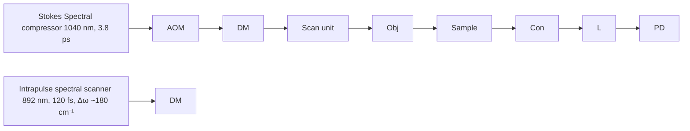

# Vibrational Fingerprint Mapping Reveals Spatial Distribution of Functional Groups of Lignin in Plant Cell Wall

Bin Liu,†,‡,∥ Ping Wang ,‡,∥ Jeong Im Kim,§ Delong Zhang,‡ Yuanqin Xia,† Clint Chapple, ,§ and Ji-Xin Cheng ,‡,⊥

† National Key Laboratory of Science and Technology on Tunable Laser, Harbin Institute of Technology, Harbin 150080, China  
‡ Weldon School of Biomedical Engineering, Purdue University, West Lafayette, Indiana 47907, United States  
§ Department of Biochemistry, Purdue University, West Lafayette, Indiana 47907, United States  
⊥Department of Chemistry, Purdue University, West Lafayette, Indiana 47907, United States

Supporting Information

ABSTRACT: Highly lignified vascular plant cell walls represent the majority of cellulosic biomass. Complete release of the biomass to deliver renewable energy by physical, chemical, and biological pretreatments is challenging due to the “protection” provided by polymerized lignin, and as such, additional tools to monitor lignin deposition and removal during plant growth and biomass deconstruction would be of great value. We developed a hyperspectral stimulated Raman scattering microscope with 9 cm−1 spectral resolution and submicrometer spatial resolution. Using this platform, we mapped the aromatic ring of lignin, aldehyde, and alcohol

groups in lignified plant cell walls. By multivariate curve resolution of the hyperspectral images, we uncovered a spatially distinct distribution of aldehyde and alcohol groups in the thickened secondary cell wall. These results collectively contribute to a deeper understanding of lignin chemical composition in the plant cell wall.

chemical

Chemical reaction diagram showing conversion of coniferaldehyde to coniferyl alcohol with labeled intermediates and products

E ffective biomass conversion into biofuels is of great interest in terms of supplying the world with a renewable and sustainable energy resource. 4 Despite great advances in the processing of biomass through physical and chemical pretreatments followed by enzymatic hydrolysis and biological fermentation,5,6 complete isolation or extraction of the useful components of biomass, specifically the polysaccharides from the plant cell walls, is still difficult. Only a portion of cellulosic biomass can be eventually converted to biofuels.2 The immediate difficulties come from the poor degradability of fully lignified plant cell walls, even after combined mechanical, thermal, and chemical treatments.7−12 Particularly in the thickened secondary cell walls where the majority of biomass in whole plant is stored, highly hydrophobic network structures formed by a multilayered lignin-hemicellulose molecular matrix make lignified secondary walls more resistant to pretreatment chemistry and further physically impede enzymatic deconstruction processes.8 The understanding of how the lignin monomers are gradually deposited and polymerized in sclerified secondary cell walls remains incomplete. Chemical analysis of lignin composition, especially the spatial distribution of different lignin components in plant cell walls, would provide important new knowledge that could be used to enhance the efficiency of biomass utilization.

Lignin is a complex natural biopolymer that is derived from oxidative coupling of various monomers including alcohols, aldehydes, and other phenolic moieties.13−15 Incorporation of aldehydes into lignin was shown to improve alkali extractability, which is a positive attribute for the pulping industry.16,17 Our knowledge about the chemical content of lignin comes primarily from in vitro analysis of tissue homogenates that do not provide information on the spatial distribution of chemical contents.18−22 Spontaneous Raman scattering spectroscopy was adopted for imaging plant cell walls with chemical specificity;23−28 however, Raman microscopy suffers from slow imaging speed and strong fluorescence background.29,30 Attributed to greatly enhanced signal level, coherent Raman scattering microscopy,31 based on either coherent anti-Stokes Raman scattering (CARS)32,33 or stimulated Raman scattering (SRS),34−36 allows for high-speed, high-resolution imaging of cells and tissues with sectioning capability. Compared to CARS, SRS is free of the nonresonant background and offers a spectral profile that is identical to spontaneous Raman. Single-frequency CARS and SRS microscopy has previously been implemented for high-speed imaging of lignin biomass using the 1600 cm−1 Raman band.37−40 Nevertheless, by single frequency excitation, the functional groups of lignin and their distribution cannot be determined.

Received: June 29, 2015

Accepted: August 20, 2015

Published: August 20, 2015

a  

flowchart

b  

text_image

M
G
M
HWP
PM-SMF
HWP

C

line chart

| Wavelength (nm) | Intensity (a.u.) |
| --------------- | ---------------- |
| 1030            | 0.0              |
| 1035            | 0.2              |
| 1040            | 1.0              |
| 1045            | 0.2              |
| 1050            | 0.0              |

d  

line chart

| Delay (ps) | Intensity (μW) |
| ---------- | -------------- |
| -8         | 0              |
| -6         | 0              |
| -4         | 0              |
| -2         | 50             |
| 0          | 180            |
| 2          | 100            |
| 4          | 0              |
| 6          | 0              |
| 8          | 0              |

e  

line chart

| Raman shift (cm⁻¹) | Intensity (a.u.) |
| ------------------ | ---------------- |
| 1600               | ~0.4             |
| 1650               | 9.1              |

Figure 1. Schematic and performance of the hyperspectral SRS imaging setup: (a) simplified schematic diagram of the hyperspectral SRS microscope. The Stokes beam was provided by a nonlinear spectral compressor. Raman shift tuning was accomplished by an intrapulse spectral scanner installed in the optical path of the pump beam. (b) Schematic diagram of the spectral compressor. (c) The Stokes spectrum measured before (red) and after (blue) spectral compression. (d) Cross-correlation trace of the spectral compressor output with the 120 fs pump pulse recorded with a BBO crystal. (e) SRS spectrum of coniferyl alcohol. The spectrum was least-squares fitted as the sum of two Lorentzian bands, the fwhm of the CC stretch peak at 1658 cm−1 is 9.1 cm−1 . M, mirror; AOM, acousto-optic modulator; DM, dichroic mirror; Obj, objective; Con, condenser; $\mathrm { F } ,$ optical filter; L, lens; PD, photodiode; G, grating; HWP, half waveplate; PM-SMF, polarization-maintaining single mode optical fiber.

To resolve overlapped fingerprint Raman bands for chemical identification, multiple groups have developed hyperspectral SRS imaging platforms41 44 and multivariate image analysis methods,41,43,45− -47 with applications to chemical histology,42 drug delivery,48 and lipid metabolism.49,50 On the basis of either femtosecond pulse shaping or pulse chirping, several spectral scanning schemes have been demonstrated (for a review, see ref 36). A remaining challenge for these techniques is the trade-off between excitation power and spectral resolution, both essential for SRS imaging of weak Raman bands in the congested fingerprint region. The pulse shaper based spectral narrowing approach41,43 provides high spectral resolution (<10 cm−1 ) but is not efficient in the utilization of laser power. Consequently, an additional amplifier is preferred to achieve high detection sensitivity.43 Conversely, the spectral focusing method is able to concentrate a large excitation power into the sample.44 Yet, the spectral resolution of this method is above 20 cm−1 , presumably due to the existence of the high order chirp. In order to attain sufficient excitation power and high spectral resolution simultaneously, a time-lens based hyperspectral SRS microscope was reported,51 for which routine use is limited by the complicated time-lens setup and the synchronization scheme.

Here, we demonstrate a high-spectral-resolution hyper spectral SRS microscope using a single-box femtosecond laser system. In our setup, nonlinear spectral compression52,53 is implemented to output a narrowband pulse while retaining the excitation power. We further employed this system for in situ compositional analysis of lignified plant cell walls using fingerprint Raman bands. By hyperspectral SRS imaging and multivariate curve resolution (MCR) analysis54,55 of wild-type and mutant Arabidopsis plants,56 we generated concentration maps of the aromatic ring, aldehyde, and alcohol groups within a cell wall and monitored in real time the reduction of aldehyde group into the alcohol group in lignin. Furthermore, by in situ SRS imaging of bristle grass, a widely studied biomass 57,58 we unveiled a spatially distinct distribution of aldehyde and alcohol groups in the secondary cell wall, which has not been reported elsewhere.

## EXPERIMENTAL SECTION

Hyperspectral SRS Imaging Setup. The schematic of our hyperspectral SRS imaging system is shown in Figure 1a and Figure S1. An ultrafast laser system with dual output (InSight DeepSee, Spectra-Physics) provided the excitation sources. The tunable output with a pulse duration of 120 fs was tuned to 892 nm, serving as the pump beam. A 4f pulse shaper built on a motorized translation stage (T-LS28E, Zaber) was installed in the pump light path to perform intrapulse spectral scanning. The second output centered at 1040 nm with a pulse duration of 220 fs was used as the Stokes beam. For the purpose of fully utilizing the Stokes power and simultaneously attaining high spectral resolution, we constructed a compact spectral compressor (Figure 1b) consisting of a parallel grating pair $( \mathrm { L S F S G  – 1 0 0 0 } . 3 2 2 5 \mathrm { – H P } \times 2 ,$ LightSmyth Technologies) and a polarization-maintaining single mode optical fiber (PM980-XP, Thorlabs). We first introduced the negative chirp with two parallel gratings separated by a distance of ∼16 cm which gives a calculated anomalous dispersion around $- 1 . 0 3 \times 1 0 ^ { 6 } ~ \mathrm { f s } ^ { 2 }$ at 1040 nm with double-pass geometry (assuming the incident angle is 31°). Compared to a previously reported double-pass prism-pair geometry53,59 and rotating cylindrical lens system ,60,61 a grating pair provides much larger dispersion while occupying smaller space. Furthermore, the double-pass geometry helps minimize the spatial dispersion induced degradation in laser beam quality. We mounted the second grating and the reflective mirror on a translation stage so that the group delay dispersion could be tuned to compensate for day-to-day fluctuations of the laser by moving the stage back and forth. Because of the effect of self-phase modulation, the negatively chirped femtosecond pulse will undergo spectral compression when propagating in the optical fiber.53 The duration of the spectrally compressed pulse was determined to be ∼3.8 ps. The time-bandwidth product of 0.86 is about 2 times larger than the Fourier transform limit (0.32 for $\mathbf { s e c h } ^ { 2 } -$ shaped pulses and 0.44 for Gaussian-shaped pulses), which can >100:1, measured with a high-extinction-ratio optical polarizer. For heterodyne detection of SRS signals, the output of the spectral compressor was modulated by an acousto-optic modulator (AOM, 1205-C, Isomet) at 2.3 MHz. After combination by a dichroic mirror, the pump and Stokes beams were collinearly directed into a home-built laserscanning microscope. A 60× water immersion objective lens $( \mathrm { N A } = \bar { 1 } . 2 $ , UPlanApo/IR, Olympus) was utilized to focus the light into the sample, an oil condenser $( \mathrm { N A } = 1 . 4 , \ \mathrm { U \mathrm { - } A A C } ,$ Olympus) was used to collect the signal. After blocking the Stokes beam with three bandpass filters (HQ825/150m, Chroma), the stimulated Raman loss signal was detected by a Si photodiode (S3994-01, Hamamatsu) equipped with a resonant circuit and extracted via a digital lock-in amplifier (HF2LI, Zurich Instrument). The dc output from the photodiode characterizing the power of pump beam and used for intensity normalization, and the X channel output from the lock-in amplifier which represents the SRS signal were sampled by a DAQ card (PCI 6251, National Instruments). For the shown hyperspectral SRS images (100 frames, 200 × 200 pixels per frame), the Raman shift was scanned from ∼1530 to 1710 $\mathrm { { \bar { c } m } ^ { - 1 } }$ with a pixel dwell time of 20 $\mu \mathbf { s } ,$ and the total acquisition time was around 3 min.

Specimen Preparation. Details about the growth conditions of Arabidopsis plants (including wild-type plant and cadc cad-d mutant) can be found elsewhere.63 The bristle grass (Setaria viridis) growing in the natural environment was obtained from Horticulture Park, Purdue University. For hyperspectral SRS imaging, all the fresh plant materials were cut into 100-μm-thick sections, placed on a glass coverslip with a drop of water to prevent desiccation during imaging and sealed with another glass coverslip. For the sodium borohydride induced aldehyde to alcohol conversion experiment (Figure 3), the water was replaced with a drop of aqueous NaBH solution.

Hyperspectral Data Analysis. The representative SRS spectrum was first decomposed into three parts with peaks centered at $\sim 1 6 0 0 ~ \mathrm { c m } ^ { - 1 }$ (aromatic ring stretch), $\sim 1 6 3 0 ~ \mathrm { c m ^ { - 1 } }$ (aldehyde CC bond), and $\sim 1 6 6 0 ^ { - 1 } \mathrm { c m } ^ { - 1 }$ (alcohol $\mathrm { C } { = } \mathrm { C }$ bond), respectively, via least-squares Lorentzian fitting.

$$
I _ {\mathrm{SRS}} (\omega) = \sum_ {i = 1} ^ {3} \frac {2 A _ {i}}{\pi} \frac {\Gamma_ {i}}{4 (\omega - \Omega_ {i}) ^ {2} + \Gamma_ {i} ^ {2}}
$$

where ω is the wavenumber, $A _ { i }$ is the area under the ith band, $\Gamma _ { i }$ is the width, and $\Omega _ { i }$ is the center wavenumber of the ith band. The amplitudes of three Lorentzian bands were normalized to the same height and used as input references for MCR analysis to generate the concentration maps shown in Figure 2 and Figure 4. Data augmentation was applied for

line chart

| Raman shift (cm⁻¹) | wild type | ald C=C | aro ring |
| ------------------ | --------- | ------- | -------- |
| 1550               | ~0.8      | ~0.2    | ~0.3     |
| 1600               | ~1.0      | ~0.4    | ~1.0     |
| 1650               | ~0.9      | ~0.3    | ~0.9     |
| 1700               | ~0.7      | ~0.1    | ~0.6     |

text_image

b
aro ring
ald C=C
alc C=C
wild type
cad-c-cad-d

Figure 2. Differentiating lignin aldehyde and alcohol groups in Arabidopsis. (a) Representative SRS spectra of wild-type Arabidopsis and cad-c cad-d mutant. For comparison, the spectra were first normalized with the maximum intensity and then offset along y axis for clarity. (b) MCR-retrieved concentration images of aromatic ring stretch of lignin (aro ring), CC stretch of lignin aldehyde group (ald $\mathrm { C } { = } \mathrm { C } ) ,$ and that of lignin alcohol group (alc CC). First row, wildtype Arabidopsis; second row, cad-c cad-d mutant. Scale bar: 5 μm.

quantification to reduce ambiguity associated with MCR decomposition. Then the concentration maps generated by MCR analysis were used for further analysis. For the chemica reaction experiment shown in Figure 3, the widths of aromatic ring stretch, aldehyde $\mathrm { C } { = } \mathrm { C } ,$ and alcohol CC bands were kept at 34.22, 22.55, and $3 1 . 9 6 ~ \mathrm { c m } ^ { - 1 } .$ , respectively, during

chemical

Chemical reaction showing conversion of Coniferaldehyde to Coniferyl alcohol using Na⁺ and H₂O groups

line chart

| Raman shift (cm⁻¹) | No treatment | 3 min | 10 min | 40 min | 150 min | 3 min (500 mM) |
| ------------------ | ------------ | ----- | ------ | ------ | ------- | -------------- |
| 1550               | ~0.1         | ~0.1  | ~0.1   | ~0.1   | ~0.1    | ~0.1           |
| 1600               | ~1.0         | ~1.0  | ~1.0   | ~1.0   | ~1.0    | ~1.0           |
| 1650               | ~0.5         | ~0.5  | ~0.5   | ~0.5   | ~0.5    | ~0.8           |
| 1700               | ~0.1         | ~0.1  | ~0.1   | ~0.1   | ~0.1    | ~0.1           |

line chart

| Time (min) | l_ald/l_aro | l_alc/l_aro | (l_ald+l_alc)/l_aro |
| ---------- | ----------- | ----------- | ------------------- |
| 0          | 0.6         | 0.3         | 0.9                 |
| 50         | 0.4         | 0.5         | 0.9                 |
| 100        | 0.3         | 0.6         | 0.9                 |
| 150        | 0.3         | 0.6         | 0.9                 |

Figure 3. Real-time monitoring lignin aldehyde to alcohol conversion in cad-c cad-d mutant. (a) Reaction scheme for the reduction of coniferaldehyde into coniferyl alcohol with NaBH . (b) Average SRS spectra of cad-c cad-d mutant recorded at different time points after 25 mM NaBH treatment. The green curve shows the SRS spectrum of cad-c cad-d mutant treated with 500 mM aqueous NaBH solution. (c) Time traces of $I _ { \mathrm { { a l d } } } / I _ { \mathrm { { a r o } } }$ (red), $I _ { \mathrm { a l c } } / I _ { \mathrm { a r o } }$ (blue) and $\left( I _ { \mathrm { a l d } } + I _ { \mathrm { a l c } } \right) / I _ { \mathrm { a r o } }$ (green) calculated from SRS spectra.

Lorentzian fitting. The heights of three fitted bands were employed to produce the ratio shown in Figure 3c.

## RESULTS AND DISCUSSION

Hyperspectral SRS Imaging with 9 Wavenumber Spectral Resolution. To excite molecular vibrations in the crowded fingerprint region, we developed a hyperspectral SRS microscope (Figure S1) based on spectral compression of femtosecond pulses. Figure 1a presents a simplified schematic diagram of our experimental setup (see the Experimental Section for more details). Briefly, a single-box femtosecond laser system with dual output provided the pump and Stokes beams. An intrapulse spectral scanner was employed to carry out Raman shift tuning for the pump beam.41,42,49 For the Stokes beam, we adopted self-phase modulation induced nonlinear spectral compression to gain a narrow bandwidth while retaining the laser power.52,53 Our spectral compressor (Figure 1b) is compact, consisting of a parallel grating pair and a polarization-maintaining single mode optical fiber. With this device, the 1040 nm laser pulse with a full width at halfmaximum (fwhm) of ${ \sim } 5 0 \ \mathrm { c m ^ { - 1 } }$ was narrowed down to 7.6 cm−1 , corresponding to a compression ratio of 6.6 (Figure 1c). The measured power after the spectral compressor is ∼245 mW, corresponding to a conversion efficiency of ∼56%. Figure 1d shows the sum-frequency generation cross-correlation trace between the spectrally compressed pulse and the 120 fs pump pulse, measured with a beta barium borate (BBO) crystal. The pulse duration of the spectrally compressed source was determined to be ∼3.8 ps. For SRS imaging, the output of the spectral compressor was modulated by an acousto-optic modulator at 2.3 MHz. The pump and Stokes beams were collinearly combined and directed into a lab-built laser-scanning microscope described elsewhere.42 The stimulated Raman loss signal was detected by a Si photodiode and extracted via a resonant circuit and a digital lock-in amplifier. Figure 1e presents the Raman spectrum of coniferyl alcohol measured with the hyperspectral SRS microscope. From the Raman peak of the ${ \mathrm { C } } { = } { \bar { \mathrm { C } } }$ stretch at $1 6 5 8 ~ \mathrm { { c m } ^ { - 1 } }$ , we estimated the spectral resolution of our system to be ∼9 cm−1 . Such resolution is well suited for interrogating the molecular vibrations in the fingerprint region. We also measured the SRS spectrum of coniferaldehyde, where the two peaks at 1587 and 1601 $\mathrm { c m } ^ { - 1 }$ are well separated (Figure S2). By imaging small coniferyl alcohol powders (98% pure, Sigma-Aldrich), we estimated that the lateral spatial resolution of our imaging system was 0.45 μm (Figure S3).

Mapping Lignin Aldehyde and Alcohol Groups in Plant Cell Wall. To investigate the capacity of our hyper spectral SRS microscope for lignin compositional mapping, we chose Arabidopsis, a model system with well-controlled genetics.64,65 Raman spectrum of the wild-type Arabidopsis tissue (Figure S4) shows strong Raman bands around 1600 $\mathrm { c m } ^ { - 1 }$ which are assigned to the aromatic ring and $\mathrm { C } { = } \mathrm { C }$ vibrations in lignin.29,66 Thus, we focused our 180 cm−1 spectral window in this region for hyperspectral SRS imaging. We studied the wild type as well as the cad-c cad-d double mutant. Two cinnamyl alcohol dehydrogenases responsible for the biosynthesis of lignin monomers in Arabidopsis (Figure S5) were mutated in the double mutant, resulting in plants that deposit aldehyde-rich ligni n.56,67,68 Figure 2a presents the representative SRS spectra recorded from stem cross sections. In order to assign these Raman bands to functional groups in lignin, we recorded and compared Raman spectra of lignin in wild type, lignin in cad-c cad-d mutant, coniferaldehyde monomer, coniferyl alcohol monomer, and coniferaldehyde 8- O-4-dimer (Figure S6). Our data suggest that for the cad-c cadd mutant, the broad band around $\stackrel { \smile } { 1 } 6 3 0 ~ \mathrm { c m } ^ { - 1 }$ contains two Raman peaks, one at $\sim 1 6 3 2 ~ \mathrm { c m } ^ { - 1 }$ which is contributed by internal aldehyde CC vibration, the other at ${ \sim } 1 6 2 2 ~ \mathrm { c m ^ { - 1 } }$ which is contributed by end-group aldehyde CC vibration. Comparison of wild-type lignin to coniferyl alcohol indicates that the peak at ${ \sim } 1 6 6 0 ~ \mathrm { c m } ^ { - 1 }$ is likely contributed by the endgroup alcohol $\mathrm { C } { = } \mathrm { C }$ group. These peaks are designated as aro ring, ald $\mathrm { C } { = } \mathrm { C } ,$ and alc $\mathrm { C } { = } \mathrm { C } ,$ , respectively, in Figure 2. Our assignments are generally consistent with previous Raman spectroscopic studies of wild-type lignin $2 7 , 2 8 , 6 9 - 7 1$ in which the Raman peak a $\mathrm { { t } } \sim 1 6 0 0 \ \mathrm { { c m } ^ { - 1 } }$ was attributed to the aromatic ring stretch in lignin, the peak at $\sim 1 6 3 0 ~ \mathrm { c m ^ { - 1 } }$ was assigned to the $\mathrm { C } { = } \mathrm { C }$ stretch in the aldehyde group, and the $\bar { \sim } 1 6 6 0 ~ \mathrm { c m } ^ { - 1 }$ Raman band was assigned to the $\mathrm { C } { = } \mathrm { C }$ stretch in the alcohol group. Meanwhile, we note that the signal might also arise from the lignin precursors in the cell wall. We also observed a weak

a  

natural_image

Microscopic view of cellular or porous structures with a highlighted region (no text or symbols)

b  

line chart

| Raman shift (cm⁻¹) | CC/CML | SW 1 | SW 2 |
| ------------------ | ------ | ---- | ---- |
| 1550               | ~0     | ~0   | ~0   |
| 1600               | ~1     | ~1   | ~1   |
| 1650               | ~0.5   | ~0.5 | ~0.5 |
| 1700               | ~0     | ~0   | ~0   |

c  

line chart

| Raman shift (cm⁻¹) | aro ring | ald C=C | alc C=C |
| ------------------ | -------- | ------- | ------- |
| 1550               | 0        | 0       | 0       |
| 1600               | 1        | 0       | 0       |
| 1650               | 0        | 1       | 1       |
| 1700               | 0        | 0       | 0       |

line chart

| Raman shift (cm⁻¹) | aro ring | ald C=C | alc C=C |
| ------------------ | -------- | ------- | ------- |
| 1550               | 0        | 0       | 0       |
| 1600               | 1        | 0       | 0       |
| 1650               | 0        | 1       | 1       |
| 1700               | 0        | 0       | 0       |

e  
aro ring  

natural_image

Microscopic fluorescent image showing green-labeled cellular structures with a dark central region (no text or symbols)

f

ald C=C  

natural_image

Microscopic view of a cellular or tissue structure with a dark central region, surrounded by concentric teal-colored rings (no text or symbols)

g  
alc C=C  

natural_image

Microscopic image showing a red fluorescent cellular structure with a central bright spot (no text or symbols)

h  
alc/(ald+alc)  

heatmap

| Value |
|-------|
| 40%   |

i  
ald/aro  

natural_image

Thermal or heat map image showing a dark irregular shape with a yellow arrow pointing to it, against a cyan background (no text or symbols)

alc/aro  

natural_image

Microscopic image showing a dark irregular structure with red fluorescence, marked by a yellow arrow (no text or symbols)

(ald+alc)/aro  

text_image

k
1
0
M=0.74, σ=0.04

Intensity profile  

line chart

| Pixels | alc/aro | ald/aro | (alc+ald)/aro |
| ------ | ------- | ------- | ------------- |
| 0      | 0.25    | 0.4     | 0.7           |
| 5      | 0.2     | 0.5     | 0.75          |
| 10     | 0.1     | 0.6     | 0.75          |
| 15     | 0.0     | 0.7     | 0.75          |

Figure 4. Hyperspectral SRS imaging and MCR analysis revealed spatial alteration between lignin aldehyde and alcohol groups in bristle grass. (a) Intensity averaged SRS image of several fiber cells within a vascular bundle. A fiber cell in the central part of the image (marked with dotted square) was selected for further analysis. (b) Normalized SRS spectra of 3 regions of interest (ROIs) indicated in part a. (c and d) MCR input reference spectra (c) and output spectra $( \mathrm { d } ) . ( \mathrm { e - g } )$ MCR-retrieved concentration images of aro ring (e), ald $\mathrm { C } { = } \mathrm { C }$ (f) and alc $\mathrm { { C } = \mathrm { { C } \ ( g ) . \ ( h - k ) } }$ Ratio images o $\dot { \cdot } I _ { \mathrm { a l c } } / ( I _ { \mathrm { a l d } } + I _ { \mathrm { a l c } } ) \ \mathrm { ( \bar { h } ) } , \ : I _ { \mathrm { a l d } } / I _ { \mathrm { a r o } } \ \mathrm { ( i ) } , \ : I _ { \mathrm { a l c } } / \bar { I _ { \mathrm { a r o } } } \ \mathrm { ( j ) } .$ , and $\left( I _ { \mathrm { a l d } } + I _ { \mathrm { a l c } } \right) / I _ { \mathrm { a r o } }$ (k). (l) SRS intensity profile along arrows indicated in parts i−k. Scale bar: 5 μm.

Raman band at $\sim 1 6 7 0 ~ \mathrm { c m ^ { - 1 } }$ contributed by the $\scriptstyle \mathrm { C = O }$ stretch in the aldehyde groups. This weak band was not included in the following multivariate image analysis. We note that these spectroscopic signatures were found in SRS spectra taken by hyperspectral imaging of different regions (Figure S7).

We further carried out hyperspectral SRS imaging of lignified cell walls (Movies S1 and S2). Using the Raman bands for aro ring, ald $\mathrm { C } { = } \mathrm { C } ,$ and alc $\mathrm { C } { = } \mathrm { C }$ vibrations as input for MCR analysis, we produced concentration maps of these functional groups (Figure 2b). The images of aro ring shown in Figure 2b (first column, green) indicate that cell walls in both plants were well lignified. The wild-type Arabidopsis contained more alc $\scriptstyle \mathrm { C = C } \ ( \mathrm { r e d } )$ and less ald $\mathtt { C = C } \left( \mathtt { c y a n } \right)$ . Conversely, in the cad-c cad-d mutant, the alc $\mathrm { C } { = } \mathrm { C }$ was hardly seen while the ald $\mathrm { C } =$ C component became dominant. Taken together, these results validate the ability of hyperspectral SRS microscopy to determine the spatial maps and the relative quantity of aromatic ring, aldehyde, and alcohol groups in lignin.

Real-Time Monitoring of Aldehyde Reduction to Alcohol in Arabidopsis Lignin. To confirm our observations in wild-type and mutant Arabidopsis, we monitored the reduction of lignin aldehyde to alcohol groups by time-lapse hyperspectral SRS imaging. We treated fresh stem tissues of cad-c cad-d double mutant Arabidopsis (aldehyde-rich) with sodium borohydride $\left( \mathrm { N a B H } _ { 4 } \right)$ , a chemical agent for the reduction of aldehydes into alcohols $( { \mathrm { F i g u r e } } \quad 3 \mathbf { a } ) . ^ { 2 8 , 7 0 }$ Spontaneous Raman spectra shown in Figure S8 indicate that the aqueous ${ \mathrm { N a B H } } _ { 4 }$ solution had negligible interference with lignin in the Raman window of interest. We first treated the stem sample with a drop of 25 mM aqueous ${ \mathrm { N a B H } } _ { 4 }$ solution and then recorded the SRS spectra of lignin in cell walls at different time points. As shown in Figure 3b, we observed a concurrent decrease of the ald $\mathrm { C } { = } \mathrm { C }$ peak at $\sim 1 6 3 0 ~ \mathrm { c m ^ { - 1 } }$ and an increase of the alc $\mathrm { C } { = } \mathrm { C }$ Raman peak at $\sim 1 6 6 0 ~ \mathrm { c m ^ { - 1 } }$ . At 150 min (Figure 3b, lightest blue curve) we observed a significant peak attributed to alc $\mathrm { C } { = } \mathrm { C }$ and a residual peak attributed to ald ${ \mathrm { C } } { = } { \mathrm { C } }$ . The incomplete conversion might be due to exhausted reactant. When aqueous ${ \mathrm { N a B H } } _ { 4 }$ solution at a much higher concentration (500 mM) was applied, the conversion process reached completion within 3 min (Figure 3b, green curve). On the basis of the SRS intensity change, we depicted the reaction kinetics (Figure 3c) which showed a gradual decline of $I _ { \mathrm { { a l d } } } / I _ { \mathrm { { a r o } } }$ and a rise of $I _ { \mathrm { a l c } } / I _ { \mathrm { a r o } }$ with time. Meanwhile, the ratio of $\left( I _ { \mathrm { a l d } } + I _ { \mathrm { a l c } } \right) / I _ { \mathrm { a r o } }$ retained at the level of 0.95, suggesting that the sum of aldehyde and alcohol groups was maintained during the reduction process. Together, these results demonstrate the ability of SRS microscopy to monitor lignin reduction in cell walls in real time.

Spatial Distribution of Aldehyde and Alcohol Groups in Cell Wall of Bristle Grass. With the method established through hyperspectral SRS imaging of the Arabidopsis cell wall, we further investigated bristle grass, a genetic model currently bundle (Figure S9) that is a part of the water transport system in vascular plants. For the fiber cells shown in Figure 4a, we recorded a series of SRS images at 100 Raman shifts between 1532.5 and 1705.7 $\mathrm { c m } ^ { - 1 }$ (Movie S3) and constructed the SRS spectra from various locations. Different from the results for Arabidopsis, our spectral data indicate a spatial variation of lignin composition in the cell wall of bristle grass (Figure 4b). Specifically, a higher content of alcohol groups was found in the cell corner (CC) and compound middle lamella (CML) compared to the secondary wall (SW). These findings were further investigated by MCR analysis of the hyperspectral SRS images. Parts c and d of Figure 4 shows the MCR input and output spectra, respectively. Figure 4e−g shows the MCRreconstructed concentration maps of aro ring, ald $\mathrm { C } { = } \mathrm { C } ,$ and alc CC in a selected single fiber cell. As shown in Figure 4e, lignification occurred everywhere in the cell wall but more in the CC and CML regions and less in the thickened SW. The spatial distributions of ald CC bond and alc CC bond were distinct. The aldehyde group was abundant in the SW, CC, and CML regions (Figure 4f) whereas the alcohol group was more abundant in the CC and CML regions and nearly depleted on the inner side of SW (Figure 4g). In order to obtain the relative proportion of aldehyde and alcohol groups in the cell wall without interference from lignin density variation in space, we applied the SRS intensity of aromatic stretch to normalize the concentrations of ald $\scriptstyle \dot { \mathrm { C } } = \mathrm { C }$ and alc CC groups. Figure 4i,j shows the ratio images of $I _ { \mathrm { a l d } } / I _ { \mathrm { a r o } }$ and $I _ { \mathrm { a l c } } / I _ { \mathrm { a r o } } ,$ revealing the relative percentages of aldehyde and alcohol groups within lignin in different regions of the fiber cell wall. From the middle lamella to the lumen side, we observed a linear rise of lignin aldehyde concentration and a gradual decline of lignin alcohol concentration, as confirmed by the percentage profiles (Figure 4l, green and red curves) along the lines indicated in Figure 4i,j. The ratio image of $I _ { \mathrm { a l c } } / ( I _ { \mathrm { a l d } } + I _ { \mathrm { a l c } } )$ shown in Figure 4h illustrates the gradient of percentage changing for the lignin alcohol group in a single cell wall. Nevertheless, the ratio image of $\overline { { \left( I _ { \mathrm { a l c } } \right) } } ^ { - } + ~ I _ { \mathrm { a l d } } \overline { { \left( I _ { \mathrm { a r o } } \right) } } / { I _ { \mathrm { a r o } } } ^ { - }$ exhibited a uniform contrast (Figure 4k), with the mean and standard deviation of the ratio being 0.74 and 0.04 throughout the whole image. This result means that the total amount of aldehyde and alcohol groups remained at a constant level, as confirmed by the ratio profile (Figure 4l, gray curve) and the histogram plot (Figure S10). The same observation was made in other locations, as shown in Movie S4. Taken together, our chemical imaging fulfilled by hyperspectral SRS revealed a distinct distribution of aldehyde and alcohol groups in the secondary wall of bristle grass. Because lignin is known as a highly heterogeneous polymer with variations in composition between different cell types,56 we further investigated the xylem cell of bristle grass. The lignin composition was found to be more homogeneous and the SRS spectrum revealed that it was dominated by the aldehyde group (Figure S11 and Movie S5).

## CONCLUSION

By spectral compression of femtosecond pulses, we have demonstrated a hyperspectral SRS microscope with 9 cm−1 spectral resolution. This microscope allowed us to map functional groups of lignin in a plant cell wall using Raman bands in a congested fingerprint region. By investigation of wild-type and transgenic Arabidopsis plants, we demonstrated that hyperspectral SRS microscopy is able to generate concentration maps of aromatic ring, aldehyde ${ \mathrm { C } } { = } { \mathrm { C } } ,$ and alcohol CC bonds within a plant cell wall. The high imaging speed of SRS microscopy further allowed us to monitor in real time the reduction of aldehyde into alcohol in an intact plant tissue. By investigation of bristle grass, a widely used biomass model, we identified distinct spatial patterns of aldehyde and alcohol groups within the secondary cell wall. These results collectively demonstrate the exciting capacity of hyperspectral SRS microscopy for vibrational imaging in the fingerprint region and contribute to a better understanding of lignin composition within the plant cell wall.

## ASSOCIATED CONTENT

## \*S Supporting Information

The Supporting Information is available free of charge on the ACS Publications website at DOI: 10.1021/acs.analchem.5b02434.

Instrumentation schematic, SRS spectra and images, spontaneous Raman spectra, and biosynthesis scheme (PDF)

Movies of SRS images of wild-type Arabidopsis, cad-c cad d Arabidopsis, and bristle grass (ZIP)

## AUTHOR INFORMATION

## Corresponding Authors

\*E-mail: chapple@purdue.edu.

\*E-mail: jcheng@purdue.edu.

## Author Contributions

∥ B.L. and P.W. contributed equally.

## Notes

The authors declare no competing financial interest.

## ACKNOWLEDGMENTS

We thank Prof. Ke Wang of Shenzhen University for constructive suggestions on the spectral compressor, Jie Hui and Rui Li of Purdue University for the help with fiber termination and polishing, Prof. John Ralph of University of Wisconsin-Madison, Dr. Pu Wang, Dr. Haibing Yang, and Peng Wang of Purdue University for helpful discussions. We are grateful to Hoon Kim of the Wisconsin Energy Institute for a sample of the coniferaldehyde 8-O-4-dimer. B.L. acknowledges the China Scholarship Council (CSC) for a financial support (No. 201306120093). This work was partly supported by a Keck foundation grant to J.X.C. and was supported as part of the Center for Direct Catalytic Conversion of Biomass to Biofuels, an Energy Frontier Research Center funded by the U.S. Department of Energy, Office of Science, Basic Energy Sciences under Award # DE-SC0000997.

## REFERENCES

(1) Himmel, M. E.; Ding, S.-Y.; Johnson, D. K.; Adney, W. S.; Nimlos, M. R.; Brady, J. W.; Foust, T. D. Science 2007, 315, 804−807.  
(2) Dale, B. E.; Ong, R. G. Biotechnol. Prog. 2012, 28, 893−898.  
(3) Faaij, A. P. Energy Policy 2006, 34, 322−342.  
(4) Ragauskas, A. J.; Williams, C. K.; Davison, B. H.; Britovsek, G.; Cairney, J.; Eckert, C. A.; Frederick, W. J.; Hallett, J. P.; Leak, D. J.; Liotta, C. L. Science 2006, 311, 484−489.  
(5) Ragauskas, A. J.; Beckham, G. T.; Biddy, M. J.; Chandra, R.; Chen, F.; Davis, M. F.; Davison, B. H.; Dixon, R. A.; Gilna, P.; Keller, M. Science 2014, 344, 1246843.  
(6) Olsson, L. Biofuels; Springer: New York, 2007.  
(7) Vanholme, R.; Demedts, B.; Morreel, K.; Ralph, J.; Boerjan, W.Plant Physiol. 2010, 153, 895905.  
(8) Ding, S.-Y.; Liu, Y.-S.; Zeng, Y.; Himmel, M. E.; Baker, J. O.; Bayer, E. A. Science 2012, 338, 1055−1060.  
(9) Zeng, Y.; Zhao, S.; Yang, S.; Ding, S.-Y. Curr. Opin. Biotechnol. 2014, 27, 38−45.  
(10) Bhatt, N.; Gupta, P.; Naithani, S. J. Appl. Polym. Sci. 2008, 108, 2895−2901.  
(11) Yoo, H.-D.; Kim, D.; Paek, S.-H. Biomol. Ther. 2012, 20, 371.  
(12) Studer, M. H.; DeMartini, J. D.; Davis, M. F.; Sykes, R. W.; Davison, B.; Keller, M.; Tuskan, G. A.; Wyman, C. E. Proc. Natl. Acad. Sci. U. S. A. 2011, 108, 6300−6305.  
(13) Boerjan, W.; Ralph, J.; Baucher, M. Annu. Rev. Plant Biol. 2003, 54, 519−546.  
(14) Kim, H.; Ralph, J.; Yahiaoui, N.; Pean, M.; Boudet, A.-M. Org. Lett. 2000, 2, 2197−2200.  
(15) Ralph, J.; Lapierre, C.; Marita, J. M.; Kim, H.; Lu, F.; Hatfield, R. D.; Ralph, S.; Chapple, C.; Franke, R.; Hemm, M. R. Phytochemistry 2001, 57, 993−1003.  
(16) Verma, S. R.; Dwivedi, U. S. Afr. J. Bot. 2014, 91, 107−125.  
(17) Hibino, T.; Takabe, K.; Kawazu, T.; Shibata, D.; Higuchi, T. Biosci., Biotechnol., Biochem. 1995, 59, 929−931.  
(18) Saiz-Jime ́ nez, C.; De Leeuw, J. ́ J. Anal. Appl. Pyrolysis 1986, 9, 99−119.  
(19) Lupoi, J. S.; Singh, S.; Simmons, B. A.; Henry, R. J. BioEnergy Res. 2014, 7, 1−23.  
(20) Capanema, E. A.; Balakshin, M. Y.; Kadla, J. F. J. Agric. Food Chem. 2004, 52, 1850−1860.  
(21) Hu, T. Q. Characterization of Lignocellulosic Materials; Blackwell: Oxford, U.K., 2008.  
(22) Guerriero, G.; Sergeant, K.; Hausman, J.-F. Int. J. Mol. Sci. 2013, 14, 10958−10978.  
(23) Atalla, R. H.; Agarwal, U. P. Science 1985, 227, 636−638.  
(24) Agarwal, U. P. Planta 2006, 224, 1141−1153.  
(25) Gierlinger, N.; Schwanninger, M. Plant Physiol. 2006, 140, 1246−1254.  
(26) Sun, L.; Simmons, B. A.; Singh, S. Biotechnol. Bioeng. 2011, 108, 286−295.  
(27) Gierlinger, N. Front. Plant Sci. 2014, 5, 306.  
(28) Hanninen, T.; Kontturi, E.; Vuorinen, T. Phytochemistry 2011, 72, 1889−1895.  
(29) Gierlinger, N.; Keplinger, T.; Harrington, M. Nat. Protoc. 2012, 7, 1694−1708.  
(30) Meyer, M. W.; Lupoi, J. S.; Smith, E. A. Anal. Chim. Acta 2011, 706, 164−170.  
(31) Cheng, J.-X.; Xie, X. S. Coherent Raman Scattering Microscopy; CRC Press: Boca Raton, FL, 2012.  
(32) Cheng, J.-X.; Xie, X. S. J. Phys. Chem. B 2004, 108, 827−840.  
(33) Evans, C. L.; Xie, X. S. Annu. Rev. Anal. Chem. 2008, 1, 883− 909.  
(34) Freudiger, C. W.; Min, W.; Saar, B. G.; Lu, S.; Holtom, G. R.; He, C. W.; Tsai, J. C.; Kang, J. X.; Xie, X. S. Science 2008, 322, 1857− 1861.  
(35) Min, W.; Freudiger, C. W.; Lu, S.; Xie, X. S. Annu. Rev. Phys. Chem. 2011, 62, 507.  
(36) Zhang, D.; Wang, P.; Slipchenko, M. N.; Cheng, J.-X. Acc. Chem. Res. 2014, 47, 2282−2290.  
(37) Saar, B. G.; Zeng, Y. N.; Freudiger, C. W.; Liu, Y. S.; Himmel, M. E.; Xie, X. S.; Ding, S. Y. Angew. Chem., Int. Ed. 2010, 49, 5476− 5479.  
(38) Pohling, C.; Brackmann, C.; Duarte, A.; Buckup, T.; Enejder, A.; Motzkus, M. J. Biophotonics 2014, 7, 126−134.  
(39) Zeng, Y.; Saar, B. G.; Friedrich, M. G.; Chen, F.; Liu, Y.-S.; Dixon, R. A.; Himmel, M. E.; Xie, X. S.; Ding, S.-Y. BioEnergy Res. 2010, 3, 272−277.  
(40) Mansfield, J. C.; Littlejohn, G. R.; Seymour, M. P.; Lind, R. J.; Perfect, S.; Moger, J. Anal. Chem. 2013, 85, 5055−5063.  
(41) Zhang, D. L.; Wang, P.; Slipchenko, M. N.; Ben-Amotz, D.; Weiner, A. M.; Cheng, J. X. Anal. Chem. 2013, 85, 98−106.  
(42) Wang, P.; Li, J. J.; Wang, P.; Hu, C. R.; Zhang, D. L.; Sturek, M.; Cheng, J. X. Angew. Chem., Int. Ed. 2013, 52, 13042−13046.  
(43) Ozeki, Y.; Umemura, W.; Otsuka, Y.; Satoh, S.; Hashimoto, H.; Sumimura, K.; Nishizawa, N.; Fukui, K.; Itoh, K. Nat. Photon. 2012, 6, 845−850.  
(44) Fu, D.; Holtom, G.; Freudiger, C.; Zhang, X.; Xie, X. S. J. Phys. Chem. B 2013, 117, 4634−4640.  
(45) Fu, D.; Xie, X. S. Anal. Chem. 2014, 86, 4115−4119.  
(46) Suhalim, J. L.; Chung, C.-Y.; Lilledahl, M. B.; Lim, R. S.; Levi, M.; Tromberg, B. J.; Potma, E. O. Biophys. J. 2012, 102, 1988−1995.  
(47) Otsuka, Y.; Makara, K.; Satoh, S.; Hashimoto, H.; Ozeki, Y. Analyst 2015, 140, 2984−2987.  
(48) Fu, D.; Zhou, J.; Zhu, W. S.; Manley, P. W.; Wang, Y. K.; Hood, T.; Wylie, A.; Xie, X. S. Nat. Chem. 2014, 6, 614−622.  
(49) Wang, P.; Liu, B.; Zhang, D.; Belew, M. Y.; Tissenbaum, H. A.; Cheng, J. X. Angew. Chem., Int. Ed. 2014, 53, 11787−11792.  
(50) Fu, D.; Yu, Y.; Folick, A.; Currie, E.; Farese, R. V., Jr; Tsai, T.- H.; Xie, X. S.; Wang, M. C. J. Am. Chem. Soc. 2014, 136, 8820−8828.  
(51) Wang, K.; Zhang, D. L.; Charan, K.; Slipchenko, M. N.; Wang, P.; Xu, C.; Cheng, J. X. J. Biophoton. 2013, 6, 815−820.  
(52) Planas, S.; Pires Mansur, N.; Brito Cruz, C. H.; Fragnito, H. Opt. Lett. 1993, 18, 699−701.  
(53) Oberthaler, M.; Höpfel, R. Appl. Phys. Lett. 1993, 63, 1017− 1019.  
(54) de Juan, A.; Maeder, M.; Martınez, M.; Tauler, R. Chemom. Intell. Lab. Syst. 2000, 54, 123−141.  
(55) Jaumot, J.; Gargallo, R.; de Juan, A.; Tauler, R. Chemom. Intell. Lab. Syst. 2005, 76, 101−110.  
(56) Bonawitz, N. D.; Chapple, C. Annu. Rev. Genet. 2010, 44, 337− 363.  
(57) Sebastian, J.; Wong, M. K.; Tang, E.; Dinneny, J. R. PLoS One 2014, 9, e95109.  
(58) Brutnell, T. P.; Wang, L.; Swartwood, K.; Goldschmidt, A.; Jackson, D.; Zhu, X.-G.; Kellogg, E.; Van Eck, J. Plant Cell 2010, 22, 2537−2544.  
(59) Washburn, B. R.; Buck, J. A.; Ralph, S. E. Opt. Lett. 2000, 25, 445−447.  
(60) Durst, M. E.; Kobat, D.; Xu, C. Opt. Lett. 2009, 34, 1195−1197.  
(61) Wang, K.; Xu, C. Opt. Lett. 2011, 36, 4233−4235.  
(62) Andresen, E. R.; Dudley, J. M.; Oron, D.; Finot, C.; Rigneault, H. Opt. Lett. 2011, 36, 707−709.  
(63) Kim, J. I.; Ciesielski, P. N.; Donohoe, B. S.; Chapple, C.; Li, X. Plant Physiol. 2014, 164, 584−595.  
(64) The Arabidopsis Genome Initiative. Nature 2000, 408, 796.  
(65) Meinke, D. W.; Cherry, J. M.; Dean, C.; Rounsley, S. D.; Koornneef, M. Science 1998, 282, 662−682.  
(66) Agarwal, U. P.; Ralph, S. A. Appl. Spectrosc. 1997, 51, 1648− 1655.  
(67) Sibout, R.; Eudes, A.; Mouille, G.; Pollet, B.; Lapierre, C.; Jouanin, L.; Seguin, A.́ Plant Cell 2005, 17, 2059−2076.  
(68) Halpin, C.; Knight, M. E.; Foxon, G. A.; Campbell, M. M.;Boudet, A. M.; Boon, J. J.; Chabbert, B.; Tollier, M. T.; Schuch, W.Plant J. 1994, 6, 339−350.  
(69) Agarwal, U. P.; McSweeny, J. D.; Ralph, S. A. J. Wood Chem. Technol. 2011, 31, 324−344.  
(70) Agarwal, U. P.; Ralph, S. A. Holzforschung 2008, 62, 667−675.  
(71) Lupoi, J. S.; Smith, E. A. Appl. Spectrosc. 2012, 66, 903−910.